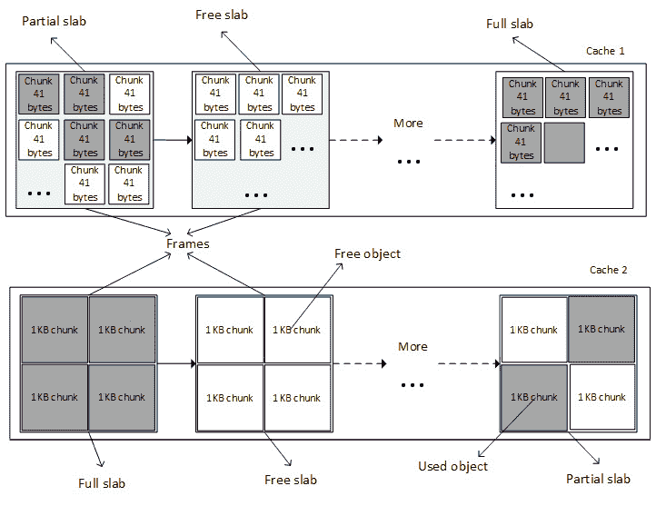

# *第十章*：理解 Linux 内核内存分配

Linux 系统使用一种被称为“虚拟内存”的幻觉。这个机制使得每个内存地址都是虚拟的，这意味着它们并不直接指向 RAM 中的任何地址。通过这种方式，每当我们访问某个内存位置时，都会执行一个转换机制，以便匹配相应的物理内存。

在本章中，我们将处理整个 Linux 内存分配与管理系统，涵盖以下主题：

+   Linux 内核内存相关术语简介

+   揭开地址转换与 MMU 的神秘面纱

+   处理内存分配机制

+   使用 I/O 内存与硬件通信

+   内存重映射

# Linux 内核内存相关术语简介

虽然系统内存（也称为 RAM）在某些允许扩展的计算机中可以增加，但物理内存在计算机系统中是有限的资源。

虚拟内存是一个概念，是给予每个进程的幻觉，使其认为自己拥有大量且几乎无限的内存，有时甚至超过系统实际拥有的内存。为了设置一切，我们将介绍地址空间、虚拟或逻辑地址、物理地址和总线地址等术语：

+   物理地址标识一个物理（RAM）位置。由于虚拟内存机制，用户或内核永远不会直接处理物理地址，而是通过其对应的逻辑地址进行访问。

+   虚拟地址不一定在物理上存在。该地址作为参考，用于通过**内存管理单元**（**MMU**）代表 CPU 访问物理内存位置。MMU 位于 CPU 核心与内存之间，通常是物理 CPU 的一部分。也就是说，在 ARM 架构中，它是受许可核心的一部分。然后，它负责每次访问内存位置时将虚拟地址转换为物理地址。这个机制被称为**地址转换**。

+   逻辑地址是由线性映射产生的地址。它是`PAGE_OFFSET`之上的映射结果。这类地址是虚拟地址，与其物理地址有固定偏移。因此，逻辑地址始终是虚拟地址，而反之则不成立。

+   在计算机系统中，地址空间是为计算实体（在我们这里是 CPU）分配的所有可能地址的内存量。这个地址空间可以是虚拟的或物理的。物理地址空间的最大值可以达到系统中安装的 RAM 的容量（理论上受限于 CPU 地址总线和寄存器的宽度），而虚拟地址的范围可以扩展到 RAM 或操作系统架构允许的最高地址（例如，在 1 GB RAM 系统上最多支持 4 GB 的虚拟内存地址）。

由于 MMU 是内存管理的核心，它将内存组织为固定大小的逻辑单元，称为**页**。页的大小是 2 的幂，以字节为单位，并在不同的系统中有所不同。一个页由一个页框支持，页的大小与页框匹配。在深入学习内存管理之前，我们先介绍一下其他术语：

+   内存页、虚拟页或简称页是用来指代一个固定长度的（`PAGE_SIZE`）虚拟内存块的术语。相同的术语“页”也作为内核数据结构，表示一个内存页。

+   另一方面，框架（或页框）指的是物理内存（RAM）中的一个固定长度块，操作系统将页面映射到这个块上。页的大小与页框大小匹配。每个页框都有一个编号，称为**页框号**（**PFN**）。

+   接下来是**页表**这一术语，它是一个内核和架构数据结构，用于存储虚拟地址与物理地址之间的映射关系。页/框的键值对描述了页表中的单个条目，代表一个映射。

最后，“页对齐”这一术语用于描述从页面的起始位置开始的地址。不言而喻，任何地址是系统页大小的倍数的内存，都被认为是页对齐的。例如，在一个 4 KB 页大小的系统中，`4.096`、`20.480`和`409.600`是页对齐的内存地址实例。

注意

页的大小由 MMU 固定，操作系统无法修改它。一些处理器允许使用多种页大小（例如，ARMv8-A 支持三种不同的粒度大小：4 KB、16 KB 和 64 KB），操作系统可以决定使用哪种大小。不过，4 KB 是广泛使用的页粒度。

既然处理内存时常用的术语已经介绍完毕，那么我们就专注于内核如何进行内存管理和组织。

Linux 是一个虚拟内存操作系统。在一个运行中的 Linux 系统中，每个进程甚至内核本身（以及某些设备）都会被分配地址空间，这些空间是处理器虚拟地址空间的一部分（需要注意的是，内核和进程并不处理物理地址——只有 MMU 处理）。虽然这个虚拟地址空间被划分为内核空间和用户空间，但上半部分用于内核，下半部分用于用户空间。

划分因架构而异，并由 `CONFIG_PAGE_OFFSET` 内核配置选项控制。对于 32 位系统，默认划分在 `0xC0000000`。这被称为 3 GB/1 GB 划分，其中用户空间分配了较低的 3 GB 虚拟地址空间。然而，通过调整 `CONFIG_VMSPLIT_1G`、`CONFIG_VMSPLIT_2G` 和 `CONFIG_VMSPLIT_3G_OPT` 内核配置选项（参见 `arch/x86/Kconfig` 和 `arch/arm/Kconfig`），内核也可以获得不同大小的地址空间。对于 64 位系统，划分因架构而异，但其值较高：64 位 ARM 为 `0x8000000000000000`，x86_64 为 `0xffff880000000000`。

在 32 位系统上，采用默认划分方案时，一个典型进程的虚拟地址空间布局如下所示：


图 10.1 – 32 位系统内存划分

虽然在 64 位系统上这种布局是透明的，但在 32 位机器上有一些特性需要介绍。在接下来的章节中，我们将详细研究这种内存划分的原因、用途及其应用场景。

## 32 位系统上的内核地址空间布局 – 低内存与高内存的概念

在理想的情况下，所有内存都是永久可映射的。然而，在 32 位系统上存在一些限制，导致只有一部分 RAM 被永久映射。这部分内存可以被内核直接访问（通过简单的解引用），并被称为 **低内存**，而未被永久映射的（物理）内存部分则被称为 **高内存**。不同架构的限制决定了这个边界的具体位置。例如，英特尔核心只能永久映射前 1 GB 的 RAM。实际上，这个量略小，为 896 MiB 的 RAM，因为其中的一部分低内存用于动态映射高内存：


图 10.2 – 高内存与低内存的划分

在前面的图示中，我们可以看到，内核地址空间的 128 MB 用于动态映射需要时的高内存 RAM。另一方面，896 MB 的内核地址空间被永久并线性地映射到低内存的 896 MB RAM。

高内存机制还可以在 1 GB RAM 系统上使用，动态映射用户内存，只要内核需要访问。内核能够将整个 RAM 映射到其地址空间并不意味着用户空间无法访问它。一个 RAM 页框架可以有多个映射；它可以同时永久映射到内核内存空间，并在进程被选中执行时映射到用户空间的某个地址。

注意

给定一个虚拟地址，您可以通过使用前面显示的进程布局来区分它是内核空间还是用户空间地址。`PAGE_OFFSET` 以下的每个地址来自用户空间；否则，它来自内核空间。

### 低内存详细信息

内核地址空间的前 896 MB 构成低内存区域。在引导过程的早期，内核会将这 896 MB 的地址空间永久映射到物理 RAM 上。由该映射得到的地址被称为`LOWMEM`，并且专门保留给**直接内存访问**（**DMA**）使用。由于硬件限制，硬件并不总是允许将所有页视为相同。我们可以在内核空间中识别出三个不同的内存区域：

+   `ZONE_DMA`：该区域包含 16 MB 以下的内存页帧，专门保留给 DMA 使用。

+   `ZONE_NORMAL`：该区域包含 16 MB 以上且小于 896 MB 的内存页帧，供正常使用。

+   `ZONE_HIGHMEM`：该区域包含 896 MB 及以上的内存页帧。

然而，在一个 512 MB 的系统上，将没有`ZONE_HIGHMEM`，16 MB 用于`ZONE_DMA`，剩余的 496 MB 用于`ZONE_NORMAL`。

从前面的所有内容，我们可以完善对逻辑地址的定义，补充说明这些地址是在内核空间中按物理地址线性映射的地址，并且可以通过使用偏移量获取相应的物理地址。内核虚拟地址与逻辑地址类似，都是从内核空间地址映射到物理地址的映射。然而，它们之间的区别在于，内核虚拟地址并不总是像逻辑地址那样具有相同的线性、一对一的物理位置映射。

注意

你可以使用`__pa(address)`宏将物理地址转换为逻辑地址，并使用`__va(address)`宏进行反向转换。

### 理解高内存

内核地址空间的前 128 MB 被称为`HIGHMEM`区域。

内核会动态创建访问高内存的映射，并在使用完毕后销毁。这使得高内存的访问速度较慢。然而，由于 64 位系统具有巨大的地址范围（264 TB），因此高内存的概念在 64 位系统中不存在，3 GB/1 GB（或任何类似的拆分方案）的划分已经不再有意义。

## 从内核看进程地址空间的概览

在 Linux 系统中，每个进程在内核中都由`struct task_struct`的一个实例表示（见`include/linux/sched.h`），该结构描述了该进程。在进程开始运行之前，会为它分配一个内存映射表，存储在`struct mm_struct`类型的变量中（见`include/linux/mm_types.h`）。通过查看`struct task_struct`定义的以下片段，可以验证这一点，该片段嵌入了指向`struct mm_struct`类型元素的指针：

```
struct task_struct{
    […]
    struct mm_struct *mm, *active_mm;
    […]
}
```

在内核中，有一个全局变量始终指向当前进程，`current`，而`current->mm`字段指向当前进程的内存映射表。在进一步解释之前，我们先来看一下`struct mm_struct`数据结构的以下片段：

```
struct mm_struct {
    struct vm_area_struct *mmap;
    unsigned long mmap_base;
    unsigned long task_size;
    unsigned long highest_vm_end;
    pgd_t * pgd;
    atomic_t mm_users;
    atomic_t mm_count;
    atomic_long_t nr_ptes;
#if CONFIG_PGTABLE_LEVELS > 2
    atomic_long_t nr_pmds;
#endif
    int map_count;
    spinlock_t page_table_lock;
    unsigned long total_vm;
    unsigned long locked_vm;
    unsigned long pinned_vm;
    unsigned long data_vm;
    unsigned long exec_vm;
    unsigned long stack_vm;
    unsigned long start_code, end_code, start_data, end_data;
    unsigned long start_brk, brk, start_stack;
    unsigned long arg_start, arg_end, env_start, env_end;
    /* ref to file /proc/<pid>/exe symlink points to */
    struct file __rcu *exe_file;
};
```

我故意移除了一些我们不感兴趣的字段。有些字段我们稍后会讲到：例如`pgd`，它是指向进程基地址（第一个条目）的一级表（**页全局目录**，缩写为**PGD**）的指针，写入在 CPU 的上下文切换时的转换表基地址。为了更好地理解这个数据结构，我们可以使用以下图表：


图 10.3 – 进程地址空间

从进程的角度来看，内存映射可以被视为一组专门用于连续虚拟地址范围的页表项。这个*“连续虚拟地址范围”*被称为内存区域，或**虚拟内存区域**（**VMA**）。每个内存映射都由起始地址和长度、权限（例如程序是否可以从该内存中读取、写入或执行）以及相关资源（例如物理页面、交换页面和文件内容）描述。

`mm_struct`有两种方式来存储进程区域（VMAs）：

+   在一棵红黑树（自平衡二叉查找树）中，根元素由`mm_struct->mm_rb`字段指向

+   在一个链表中，第一个元素由`mm_struct->mmap`字段指向

现在我们已经概览了进程地址空间，并且看到它是由一组虚拟内存区域组成的，接下来让我们深入研究这些内存区域背后的机制。

## 理解 VMA 的概念

在内核中，进程的内存映射被组织成若干个区域，每个区域被称为 VMA。供您参考，在 Linux 系统上的每个运行中的进程中，代码段、每个映射的文件区域（例如库文件）或每个独立的内存映射（如果有的话）都是由 VMA 实现的。VMA 是一个与架构无关的结构，具有权限和访问控制标志，由起始地址和长度定义。它们的大小始终是页大小（`PAGE_SIZE`）的倍数。一个 VMA 由几个页面组成，每个页面在页表中都有一个条目（**页表项**（**PTE**））。

VMA 在内核中表示为`struct vma_area`结构的一个实例，定义如下：

```
struct vm_area_struct {
    unsigned long vm_start; 
    unsigned long vm_end;
    struct vm_area_struct *vm_next, *vm_prev;
    struct mm_struct *vm_mm;
    pgprot_t vm_page_prot;
    unsigned long vm_flags;
    unsigned long vm_pgoff;
    struct file * vm_file;
    [...]
}
```

为了提高本节的可读性和易理解性，只有与我们相关的元素被列出。然而，剩余元素的含义如下：

+   `vm_start`是 VMA 在地址空间（`vm_mm`）中的起始地址，它是该 VMA 内的第一个地址。

+   `vm_end`是`vm_mm`中我们结束地址之后的第一个字节，它是该 VMA 外部的第一个地址。

+   `vm_next`和`vm_prev`用于实现按地址排序的每个任务的 VMA 链表。

+   `vm_mm`是该 VMA 所属的进程地址空间。

+   `vm_page_prot`和`vm_flags`表示 VMA 的访问权限。前者是一个架构级数据类型，其更新直接应用于底层架构的 PTE。它是`vm_flags`的缓存转换形式，后者以架构无关的方式存储适当的保护位和映射类型。

+   `vm_file`是支持该映射的文件。对于匿名映射（如进程的堆或栈），此值可以为`NULL`。

+   `vm_pgoff`是偏移量（在`vm_file`内）以页大小为单位。此偏移量以页数来度量。

以下图是进程内存映射的概览，突出显示了每个 VMA 并描述其一些结构元素：


图 10.4 – 进程内存映射

前面的图片（来源：http://duartes.org/gustavo/blog/post/how-the-kernel-manages-your-memory/）描述了一个进程（从`/bin/gonzo`启动）的内存映射（VMA）。我们可以看到`struct task_struct`与其地址空间元素（`mm`）之间的交互，后者列出了并描述了每个 VMA（起始、结束及其后备文件）。

你可以使用`find_vma()`函数来查找与给定虚拟地址对应的 VMA。`find_vma()`在`linux/mm.h`中声明，形式如下：

```
extern struct vm_area_struct * find_vma(
           struct mm_struct * mm, unsigned long addr);
```

该函数搜索并返回第一个满足`vm_start <= addr < vm_end`的 VMA，若没有找到则返回`NULL`。`mm`是要搜索的进程地址空间。对于当前进程，它可以是`current->mm`。以下是一个示例：

```
struct vm_area_struct *vma =
                     find_vma(task->mm, 0x603000);
if (vma == NULL) /* Not found ? */
    return -EFAULT;
/* Beyond the end of returned VMA ? */
if (0x13000 >= vma->vm_end)
    return -EFAULT;
```

前面的代码片段将寻找一个 VMA，其内存边界包含`0x603000`。

给定一个进程，其标识符为`<PID>`，可以通过读取`/proc/<PID>/maps`、`/proc/<PID>/smaps`和`/proc/<PID>/pagemap`文件来获取该进程的所有内存映射。以下列出了一个正在运行的进程（进程标识符 PID 为`1073`）的映射：

```
# cat /proc/1073/maps 
00400000-00403000 r-xp 00000000 b3:04 6438             /usr/sbin/net-listener
00602000-00603000 rw-p 00002000 b3:04 6438             /usr/sbin/net-listener
00603000-00624000 rw-p 00000000 00:00 0                [heap]
7f0eebe4d000-7f0eebe54000 r-xp 00000000 b3:04 11717    /usr/lib/libffi.so.6.0.4
7f0eebe54000-7f0eec054000 ---p 00007000 b3:04 11717    /usr/lib/libffi.so.6.0.4
7f0eec054000-7f0eec055000 rw-p 00007000 b3:04 11717    /usr/lib/libffi.so.6.0.4
7f0eec055000-7f0eec069000 r-xp 00000000 b3:04 21629    /lib/libresolv-2.22.so
7f0eec069000-7f0eec268000 ---p 00014000 b3:04 21629    /lib/libresolv-2.22.so
[...]
7f0eee1e7000-7f0eee1e8000 rw-s 00000000 00:12 12532    /dev/shm/sem.thk-mcp-231016-sema
[...]
```

前面的每一行表示一个 VMA，字段对应于`{地址（起始-结束）} {权限} {偏移量} {设备（主：次）} {inode} {路径名（映像）}`的模式：

+   `address`：表示 VMA 的起始和结束地址。

+   `permissions`：描述区域的访问权限：`r`（读），`w`（写），`x`（执行）。`p`表示映射是私有的，`s`表示共享映射。

+   `offset`：如果是文件映射（`mmap`系统调用），则为映射发生时在文件中的偏移量。否则为`0`。

+   `major:minor`：如果是文件映射，这代表存储文件的设备的主次设备号（设备持有文件）。

+   `inode`：如果是从文件映射，则为映射文件的`inode`号。

+   `pathname`：这是映射文件的名称，否则留空。还有其他区域名称，例如 `[heap]`、`[stack]` 或 `[vdso]`（代表**虚拟动态共享对象**，一种由内核映射到每个进程地址空间中的共享库，目的是减少系统调用切换到内核模式时的性能损失）。

分配给进程的每个页面都属于某个区域，因此任何不在 VMA 中的页面都不存在，也无法被进程引用。

高内存非常适合用户空间，因为它的地址空间必须显式地进行映射。因此，大多数高内存被用户应用程序占用。`__GFP_HIGHMEM` 和 `GFP_HIGHUSER` 是请求分配（潜在）高内存的标志。没有这些标志，所有内核分配只会返回低内存。在 Linux 中，无法从用户空间分配连续的物理内存。

既然 VMAs 对我们已经没有秘密可言，那么我们就来描述将其翻译到相应物理地址的硬件概念（如果有的话），或者它们的创建和分配方式。

# 破解地址翻译和 MMU

MMU 不仅将虚拟地址转换为物理地址，还保护内存免受未授权访问。给定一个进程，任何需要从该进程访问的页面必须存在于其一个 VMA 中，因此必须存在于进程的页表中（每个进程都有自己的页表）。

回顾一下，内存是通过固定大小的块进行组织的，虚拟内存使用页面，而物理内存使用帧。在我们的例子中，大小是 4 KB。然而，它在内核中是通过 `PAGE_SIZE` 宏定义并访问的。请记住，页面大小是由硬件强制的。以 4 KB 页面大小的系统为例，字节 0 到 4095 属于页面 0，字节 4096 到 8191 属于页面 1，依此类推。

引入了页表的概念来管理页面和帧之间的映射。页面被分布在表中，每个 PTE 对应一个页面和一个帧之间的映射。然后，每个进程都会获得一组页表来描述其所有的内存区域。

为了遍历页面，每个页面都会分配一个索引，称为**页号**。当涉及到帧时，它是**页面帧号**（**PFN**）。这样，VMA（更准确地说是逻辑地址）由两部分组成：页号和偏移量。在 32 位系统中，偏移量表示地址的低 12 位，而在 8 KB 页大小系统中，偏移量表示低 13 位。以下图展示了地址被分为页号和偏移量的概念：


图 10.5 – 逻辑地址表示

操作系统或 CPU 如何知道哪个物理地址对应给定的逻辑地址？它们使用页表作为转换表，并且知道每个条目的索引是虚拟页号，该索引位置的值是 PFN。为了根据虚拟内存访问物理内存，操作系统首先提取偏移量和虚拟页号，然后遍历进程的页表，将虚拟页号与物理页进行匹配。一旦匹配成功，就可以访问该页框中的数据：


图 10.6 – 地址转换

偏移量用于指向框架中的正确位置。页表不仅保存物理页号和虚拟页号之间的映射，还包含访问控制信息（读/写权限、特权等）。

以下图描述了地址解码和页表查找，以指向适当框架中的适当位置：


图 10.7 – 虚拟地址到物理地址的转换

用于表示偏移量的位数由 `PAGE_SHIFT` 内核宏定义。`PAGE_SHIFT` 是将 1 位左移多少次以获得 `PAGE_SIZE` 值的次数。它也是将页面的逻辑地址右移多少次以获得其页号的次数，这对于物理地址也是一样，用于获得其页框号。这个宏与架构相关，也取决于页面粒度。其值可以视为以下内容：

```
#ifdef CONFIG_ARM64_64K_PAGES
#define PAGE_SHIFT        16
#elif defined(CONFIG_ARM64_16K_PAGES)
#define PAGE_SHIFT       14
#else
#define PAGE_SHIFT        12
#endif
#define PAGE_SIZE        (_AC(1, UL) << PAGE_SHIFT)
```

前述内容表明，默认情况下（无论是 ARM 还是 ARM64），`PAGE_SHIFT` 为 `12`，意味着 4 KB 的页面大小。在 ARM64 上，选择 16 KB 或 64 KB 页面大小时，`PAGE_SHIFT` 为 `14` 或 `16`。

根据我们对地址转换的理解，页表是一个部分解决方案。让我们看看为什么。大多数 32 位架构需要 32 位（4 字节）来表示一个页表项。在这种系统（32 位）中，每个进程都有其私有的 3 GB 用户地址空间，我们需要 786,432 个条目来表示并覆盖一个进程的地址空间。仅仅为了存储内存映射，所需的物理内存就过多。事实上，一个进程通常只会使用其虚拟地址空间中的一小部分，但这些部分是分散的。为了解决这个问题，引入了“层次”概念。页表通过层级（页级）进行分层。存储多级页表所需的空间仅依赖于实际使用的虚拟地址空间，而不是与虚拟地址空间的最大大小成比例。这样，未使用的内存不再被表示，页表遍历时间也得到了减少。此外，级别 `N` 中的每个表项将指向级别 `N+1` 中的一个条目，级别 1 是较高层次。

Linux 支持最多四级分页。然而，使用多少级别是与架构相关的。以下是每个级别的描述：

+   内核中的`pgd_t`类型（通常是`unsigned long`）指向第二级表中的一个条目。在 Linux 内核中，`struct task_struct`表示一个进程的描述，它有一个成员（`mm`），该成员的类型是`struct mm_struct`，用于表征和表示进程的内存空间。在`struct mm_struct`中，有一个处理器特定的字段`pgd`，它是指向进程的一级（PGD）页表的第一个条目（条目 0）的指针。每个进程有且仅有一个 PGD，最多可以包含 1,024 个条目。

+   **页上级目录（PUD）**：表示间接映射的第二级。

+   **页中间目录（PMD）**：这是第三个间接映射级别。

+   `pte_t`，每个条目指向一个物理页。

    注意

    并非所有级别都被使用。i.MX6 的 MMU 仅支持二级页表（PGD 和 PTE），这对于几乎所有 32 位 CPU 都是如此。在这种情况下，PUD 和 PMD 被简单忽略。

重要的是要知道 MMU 不存储任何映射。它是一个位于 RAM 中的数据结构。而是 CPU 中有一个特殊的寄存器，称为`pdg`字段，指向`struct mm_struct`：`current->mm.pgd == TTBR0`。

在上下文切换时（当新进程被调度并分配 CPU 时），内核立即配置 MMU 并用新进程的`pgd`更新 PTBR。现在，当虚拟地址传给 MMU 时，MMU 会使用 PTBR 的内容定位到进程的一级页表（PGD），然后利用虚拟地址的**最高有效位**（**MSBs**）提取的一级索引找到合适的表条目，该条目包含指向合适的二级页表基地址的指针。然后，从该基地址开始，MMU 使用二级索引查找合适的条目，依此类推，直到找到 PTE。ARM 架构（在我们的案例中是 i.MX6）有二级页表。在这种情况下，二级条目是 PTE，指向物理页（PFN）。此时，仅能找到物理页。为了访问页内的准确内存位置，MMU 会提取内存偏移量，这也是虚拟地址的一部分，并指向物理页中的相同偏移。

为了便于理解，前述描述仅限于二级分页方案，但可以轻松扩展。下图是此二级分页方案的表示：


图 10.8 – 二级地址转换方案

当一个进程需要从某个内存位置读取或写入数据时（当然，我们讨论的是虚拟内存），MMU 会将该进程的页面表转换到正确的条目（PTE）。虚拟页面号会从虚拟地址中提取，并由处理器作为索引查找进程的页面表，以检索其页面表条目。如果在该偏移量处有有效的页面表条目，处理器将从此条目中获取页面帧号。如果没有，这意味着该进程访问了其虚拟内存中未映射的区域。此时会触发页面错误，操作系统应该处理此问题。

在实际情况中，地址转换需要页面表遍历，它不总是一次完成的操作。每个表级别至少需要一次内存访问。一个四级页面表将需要四次内存访问。换句话说，每次虚拟访问都会导致五次物理内存访问。如果虚拟内存的访问比物理访问慢四倍，那么虚拟内存的概念将毫无意义。幸运的是，系统级芯片（SoC）制造商努力找到了一种巧妙的技巧来解决这个性能问题：现代 CPU 使用一种称为**翻译后备缓冲区**（**TLB**）的小型关联且非常快速的内存，用于缓存最近访问的虚拟页面的 PTE。

## 页面查找与 TLB

在 MMU 进行地址转换之前，还有另一个步骤。由于存在用于缓存最近访问数据的缓存，也有一个用于缓存最近翻译的地址的缓存。数据缓存加速了数据访问过程，TLB 加速了虚拟地址的转换（是的，地址转换是一个耗时的任务）。它是**内容可寻址存储器**（**CAM**），其中关键字是虚拟地址，值是物理地址。换句话说，TLB 是 MMU 的一个缓存。在每次内存访问时，MMU 首先检查 TLB 中最近使用的页面，TLB 中包含一些虚拟地址范围，这些虚拟地址范围目前已分配给物理页面。

### TLB 是如何工作的？

在内存访问时，CPU 遍历 TLB，尝试查找正在访问的页面的虚拟页面号。这个步骤叫做**TLB 查找**。当找到 TLB 条目（发生匹配）时，称为 TLB 命中，CPU 会继续运行，并使用在 TLB 条目中找到的 PFN 来计算目标物理地址。当发生 TLB 命时，不会发生页面错误。如果在 TLB 中找到翻译，虚拟内存访问的速度将和物理访问一样快。如果没有 TLB 命中，则称为 TLB 未命中。

在 TLB 未命中的情况下，有两种可能性。根据处理器类型，TLB 未命中事件可以由软件、硬件或通过 MMU 来处理：

+   **软件处理**：CPU 触发 TLB 未命中中断，操作系统捕获该中断。操作系统随后遍历进程的页表以找到正确的 PTE。如果有匹配且有效的条目，CPU 将在 TLB 中安装新的转换。否则，将执行页面故障处理程序。

+   **硬件处理**：由 CPU（实际上是 MMU）在硬件上遍历进程的页表。如果有匹配，CPU 将把新的转换添加到 TLB 中。否则，CPU 会触发页面故障中断，由操作系统处理。

在这两种情况下，页面故障处理程序都是相同的，`do_page_fault()`。该函数是架构相关的；对于 ARM，它在 `arch/arm/mm/fault.c` 中定义。

以下是描述 TLB 查找、TLB 命中或 TLB 未命中事件的示意图：


](img/B17934_10_009.jpg)

图 10.9 – MMU 和 TLB 遍历过程

页表和页目录条目依赖于架构。操作系统必须确保表的结构与 MMU 识别的结构相匹配。在 ARM 处理器上，转换表的位置必须写入 `control` 协处理器 15（CP15） `c2` 寄存器，然后通过写入 CP15 `c1` 寄存器启用缓存和 MMU。详细信息请查看 [`infocenter.arm.com/help/index.jsp?topic=/com.arm.doc.dui0056d/BABHJIBH.htm`](http://infocenter.arm.com/help/index.jsp?topic=/com.arm.doc.dui0056d/BABHJIBH.htm) 和 [`infocenter.arm.com/help/index.jsp?topic=/com.arm.doc.ddi0433c/CIHFDBEJ.html`](http://infocenter.arm.com/help/index.jsp?topic=/com.arm.doc.ddi0433c/CIHFDBEJ.html)。

现在，既然我们已经掌握了地址转换机制及其与 TLB 的配合，我们可以讨论内存分配，这涉及到在幕后操作页表项。

处理内存分配机制及其 API

在进入 API 列表之前，我们先从以下图示开始，展示了在基于 Linux 的系统中存在的不同内存分配器，稍后我们将讨论这些分配器：


](img/B17934_10_010.jpg)

图 10.10 – 内核内存分配器概览

上述示意图的灵感来源于 [`bootlin.com/doc/training/linux-kernel/linux-kernel-slides.pdf`](https://bootlin.com/doc/training/linux-kernel/linux-kernel-slides.pdf)。图中显示的是一种满足各种内存请求的分配机制。根据你的内存需求，你可以选择最接近目标的分配器。最基础的分配器是 `kmalloc` API。虽然 `kmalloc` 可以用来从 slab 分配器请求内存，但我们也可以直接与 slab 交互，从其缓存中请求内存，甚至构建我们自己的缓存。

让我们从内存分配的主分配器和最低级别分配器——页分配器开始，它是其他分配器的派生来源。

## 页分配器

页面分配器是 Linux 系统中的低级分配器，它作为其他分配器的基础。这个分配器带来了页面（虚拟）和页面框架（物理）的概念。因此，系统的物理内存被分割成固定大小的块（称为 `struct page` 结构，我们将使用专门的 API 来操作它，下一节中会介绍）。

### 页面分配 API

这是最低级的分配器。它使用伙伴算法分配和回收页面块。页面按 2 的幂大小分配（以获得伙伴算法的最佳效果）。这意味着它可以分配 1 个页面、2 个页面、4 个页面、8 个页面、16 个页面，依此类推。通过这种分配返回的页面是物理连续的。`alloc_pages()` 是主要的 API，其定义如下：

```
struct page *alloc_pages(gfp_t mask, unsigned int order)
```

上述函数在无法分配页面时返回 `NULL`。否则，它会分配 *2* 顺序的页面并返回指向 `struct page` 实例的指针，该指针指向预留块的第一个页面。然而，有一个帮助宏 `alloc_page()`，它可以用于分配单个页面。其定义如下：

```
#define alloc_page(gfp_mask) alloc_pages(gfp_mask, 0)
```

这个宏封装了 `alloc_pages()`，并将顺序参数设置为 `0`。

`__free_pages()` 必须用于释放使用 `alloc_pages()` 函数分配的内存页面。它接受一个指向分配块第一个页面的指针作为参数，以及用于分配时相同的顺序。其定义如下：

```
void __free_pages(struct page *page, unsigned int order);
```

还有其他以相同方式工作的函数，但它们返回的是预留块的（逻辑）地址，而不是 `struct page` 的实例。这些是 `__get_free_pages()` 和 `__get_free_page()`，它们的定义如下：

```
unsigned long __get_free_pages(gfp_t mask,
                               unsigned int order);
unsigned long get_zeroed_page(gfp_t mask);
```

`free_pages()` 用于释放使用 `__get_free_pages()` 分配的页面。它接受表示分配页面起始区域的内核地址，以及顺序，它应与用于分配时相同：

```
free_pages(unsigned long addr, unsigned int order);
```

无论分配类型是什么，`mask` 指定了应从哪些内存区域分配页面以及分配器的行为。以下是可能的值：

+   `GFP_USER`：用于用户内存分配。

+   `GFP_KERNEL`：用于内核分配的常用标志。

+   `GFP_HIGHMEM`：这会请求从 `HIGH_MEM` 区域分配内存。

+   `GFP_ATOMIC`：这以原子方式分配内存，不能进入睡眠状态。它在我们需要从中断上下文分配内存时使用。

然而，你应该注意，无论是否在 `__get_free_pages()`（或 `__get_free_page()`）中指定 `GFP_HIGHMEM` 标志，它都不会被考虑。这些函数会屏蔽掉该标志，以确保返回的地址永远不会表示高内存页面（因为它们具有非线性/永久映射）。如果你需要高内存，使用 `alloc_pages()` 然后使用 `kmap()` 来访问它。

`__free_pages()` 和 `free_pages()` 可以混合使用。它们之间的主要区别是 `free_page()` 接受一个逻辑地址作为参数，而 `__free_page()` 接受一个 `struct page` 结构。

注意

可用的最大阶数因架构不同而异。它取决于 `FORCE_MAX_ZONEORDER` 内核配置选项，默认值为 `11`。在这种情况下，您可以分配的页面数为 1,024。也就是说，在一个 4 KB 大小的系统上，您最多可以分配 *1,024 x 4 KB = 4 MB* 的内存。在 ARM64 上，最大阶数随所选页面大小而变化。如果是 16 KB 页面大小，最大阶数为 `12`，如果是 64 KB 页面大小，最大阶数为 `14`。这些每次分配的大小限制对于 `kmalloc()` 同样适用。

#### 页面与地址转换函数

内核提供了一些便捷的函数，可以在 `struct page` 实例和它们对应的逻辑地址之间来回转换，这在处理内存时的不同阶段都非常有用。`page_to_virt()` 函数用于将一个 `struct page`（例如，`alloc_pages()` 返回的）转换为内核逻辑地址。或者，`virt_to_page()` 接受一个内核逻辑地址并返回其关联的 `struct page` 实例（就像是使用 `alloc_pages()` 函数分配的那样）。`virt_to_page()` 和 `page_to_virt()` 都在 `<asm/page.h>` 中声明，具体如下：

```
struct page *virt_to_page(void *kaddr);
void *page_to_virt(struct page *pg)
```

还有一个宏 `page_address()`，它简单地封装了 `page_to_virt()`，其声明如下：

```
void *page_address(const struct page *page)
```

它返回传入参数的页面的逻辑地址。

## slab 分配器

slab 分配器是 `kmalloc()` 所依赖的分配器。它的主要目的是消除由于内存（释放）分配造成的碎片，这种碎片由伙伴系统在小尺寸内存分配时产生，并加速常用对象的内存分配。

### 理解伙伴算法

为了分配内存，所请求的大小会向上舍入到二的幂，伙伴分配器会搜索相应的列表。如果请求的列表中没有条目，来自下一个较大列表（该列表中的块是上一个列表大小的两倍）的一项会被拆分成两半（称为 **buddies**）。分配器使用第一半，而另一半会被添加到下一个较小的列表中。这是一个递归的过程，直到伙伴分配器成功找到一个可以拆分的块，或者达到最大块大小并且没有可用的空闲块为止。

以下案例研究受到了 [`dysphoria.net/OperatingSystems1/4_allocation_buddy_system.html`](http://dysphoria.net/OperatingSystems1/4_allocation_buddy_system.html) 的深刻启发。例如，如果最小分配大小为 1K 字节，且内存大小为 1MB，则伙伴分配器将为 1K 字节、2K 字节、4K 字节、8K 字节、16K 字节、32K 字节、64K 字节、128K 字节、256K 字节、512K 字节、1MB 字节的空闲块分别创建一个空列表。除了 1MB 列表外，所有列表最初都是空的，1MB 列表只有一个空洞。

现在假设我们要分配一个 70K 的块，伙伴分配器会将其向上舍入到 128K，并最终将 1MB 分割为两个 512K 块，然后是 256K，最后是 128K，然后它会将其中一个 128K 块分配给用户。以下是总结这个场景的方案：


](img/B17934_10_011.jpg)

图 10.11 – 使用伙伴算法分配

释放速度与分配速度一样快。以下是总结释放算法的图示：


](img/B17934_10_012.jpg)

图 10.12 – 使用伙伴算法释放

在上图中，我们可以看到使用伙伴算法释放内存的过程。下一节我们将研究建立在此算法之上的 slab 分配器。

### 走进 slab 分配器

在介绍 slab 分配器之前，首先定义它使用的一些术语：

+   `inode` 和 `mutexe` 对象。一个 slab 可以看作是一个大小相同的块的数组。

+   `inode` 对象仅限于此。

Slabs 可能处于以下几种状态：

+   **空**：表示 slabs 上的所有对象（块）都标记为可用。

+   **部分使用**：slab 中既有已用对象也有空闲对象。

+   **满**：表示 slabs 上的所有对象都标记为已用。

内存分配器负责构建缓存。最初，每个 slab 都是空的并标记为“空”。当为内核对象分配内存时，分配器会在该类型对象的缓存中查找一个空闲位置。如果未找到，分配器将分配一个新的 slab 并将其添加到缓存中。新对象会从该 slab 中分配，且该 slab 会被标记为“部分使用”。当代码完成对内存的使用（内存释放）后，对象会被简单地返回到 slab 缓存中，并恢复到初始化状态。这也是内核提供帮助函数来获取已清零初始化内存的原因，这样我们可以消除先前的内容。slab 会保持其对象的引用计数，以便在缓存中的所有 slabs 都满了且需要请求另一个对象时，slab 分配器负责添加新的 slabs。

以下图示说明了 slabs、缓存及其不同状态的概念：



](img/B17934_10_013.jpg)

图 10.13 – Slabs 和缓存

有点像创建一个每个对象的分配器。内核为每种类型的对象分配一个缓存，并且只有相同类型的对象可以存储在缓存中（例如，只有`task_struct`结构体）。

内核中有不同种类的 slab 分配器，具体取决于是否需要紧凑性、缓存友好性或原始速度。它们包括以下几种：

+   **SLAB**（slab 分配器），它是尽可能缓存友好的。这是最初的内存分配器。

+   **SLOB**（简单块列表），它尽可能紧凑，适用于内存非常低的系统，主要是嵌入式系统，内存为几兆字节或几十兆字节。

+   `CONFIG_SLUB=y`）。请查看此补丁：[`git.kernel.org/pub/scm/linux/kernel/git/torvalds/linux.git/commit/?id=a0acd820807680d2ccc4ef3448387fcdbf152c73`](https://git.kernel.org/pub/scm/linux/kernel/git/torvalds/linux.git/commit/?id=a0acd820807680d2ccc4ef3448387fcdbf152c73)。

    注意

    **slab** 这个术语已经成为一种通用名称，指代一种使用对象缓存的内存分配策略，能够高效地分配和释放内核对象。它不应与同名的分配器 SLAB 混淆，后者如今已经被 SLUB 取代。

## kmalloc 家族分配

`kmalloc()`是一个内核内存分配函数。它分配物理上连续的（但不一定是页面对齐的）内存。下图描述了内存如何分配并返回给调用者：


图 10.14 – kmalloc 内存组织

这个分配 API 是内核中通用的最高级别内存分配 API，它依赖于 SLAB 分配器。`kmalloc()`返回的内存具有内核逻辑地址，因为它是从`LOW_MEM`区域分配的，除非指定了`HIGH_MEM`。它在 `<linux/slab.h>` 中声明，这是在使用 API 之前需要包含的头文件。定义如下：

```
void *kmalloc(size_t size, int flags);
```

在前面的代码中，`size`指定要分配的内存大小（以字节为单位）。`flags`决定了内存应该如何和在哪里分配。可用的标志与页面分配器相同（`GFP_KERNEL`、`GFP_ATOMIC`、`GFP_DMA` 等），以下是它们的定义：

+   `GFP_KERNEL`：这是标准标志。我们不能在中断处理程序中使用这个标志，因为它的代码可能会休眠。它总是从`LOM_MEM`区域返回内存（因此，是一个逻辑地址）。

+   `GFP_ATOMIC`：这保证了分配的原子性。该标志用于在中断上下文中需要分配内存时。由于内存是从紧急池或内存中分配的，因此不应滥用此标志。

+   `GFP_USER`：这为用户空间进程分配内存。分配的内存与分配给内核的内存是分开的。

+   `GFP_NOWAIT`：如果分配是在原子上下文中进行的，例如中断处理程序使用时，应使用此标志。此标志会在分配时防止直接回收、I/O 和文件系统操作。与 `GFP_ATOMIC` 不同，它不使用内存预留。因此，在内存紧张时，`GFP_NOWAIT` 的分配可能会失败。

+   `GFP_NOIO`：与 `GFP_USER` 类似，这可能会阻塞，但与 `GFP_USER` 不同，它不会启动磁盘 I/O。换句话说，它在分配内存时会阻止任何 I/O 操作。此标志主要用于块设备/磁盘层。

+   `GFP_NOFS`：这将使用直接回收，但不会使用任何文件系统接口。

+   `__GFP_NOFAIL`：虚拟内存实现必须无限期重试，因为调用者无法处理分配失败。分配可能会一直阻塞，但永远不会失败。因此，测试是否失败是没有意义的。

+   `GFP_HIGHUSER`：请求从 `HIGH_MEMORY` 区域分配内存。

+   `GFP_DMA`：从 `DMA_ZONE` 分配内存。

在成功分配内存后，`kmalloc()` 返回分配块的虚拟（逻辑，除非指定了高内存）地址，并保证该内存是物理连续的。如果发生错误，它将返回 `NULL`。

对于设备驱动程序，建议使用托管版本 `devm_kmalloc()`，它不一定需要释放内存，因为内存管理由内存核心内部处理。以下是其原型：

```
void *devm_kmalloc(struct device *dev, size_t size,
                   gfp_t gfp);
```

在前面的原型中，`dev` 是为其分配内存的设备。

注意，`kmalloc()` 在分配小内存时依赖于 SLAB 缓存。为此，它可能会将分配区域的大小内部向上舍入到可以容纳该内存的最小 SLAB 缓存的大小。这可能会导致返回的内存量超过请求的内存。然而，可以使用 `ksize()` 来确定实际分配的内存量（以字节为单位）。即使最初通过 `kmalloc()` 调用指定了较小的内存量，你仍然可以使用这部分额外的内存。

以下是 `ksize` 原型：

```
size_t ksize(const void *objp);
```

在前面的例子中，`objp` 是将返回其实际字节大小的对象。

`kmalloc()`具有与页面相关的分配 API 相同的大小限制。例如，默认情况下将 `FORCE_MAX_ZONEORDER` 设置为 `11`，则每次通过 `kmalloc()` 分配的最大大小为 `4 MB`。

`kfree` 函数用于释放由 `kmalloc()` 分配的内存。它的定义如下：

```
void kfree(const void *ptr)
```

以下是使用 `kmalloc()` 和 `kfree()` 分别分配和释放内存的示例：

```
#include <linux/init.h>
#include <linux/module.h>
#include <linux/slab.h>
#include <linux/mm.h>
static void *ptr; 
static int alloc_init(void) 
{
    size_t size = 1024; /* allocate 1024 bytes */ 
    ptr = kmalloc(size,GFP_KERNEL); 
    if(!ptr) {
        /* handle error */
        pr_err("memory allocation failed\n"); 
        return -ENOMEM; 
    } else {
        pr_info("Memory allocated successfully\n"); 
    }
    return 0;
}
static void alloc_exit(void)
{
    kfree(ptr); 
    pr_info("Memory freed\n"); 
}
module_init(alloc_init); 
module_exit(alloc_exit);
MODULE_LICENSE("GPL"); 
MODULE_AUTHOR("John Madieu");
```

内核提供了基于 `kmalloc()` 的其他辅助函数，如下所示：

```
void kzalloc(size_t size, gfp_t flags);
void kzfree(const void *p);
void *kcalloc(size_t n, size_t size, gfp_t flags);
void *krealloc(const void *p, size_t new_size,
                gfp_t flags);
```

`krealloc()` 是内核空间中与用户空间 `realloc()` 函数相对应的函数。由于 `kmalloc()` 返回的内存保留了其先前状态的内容，因此可以通过 `kzalloc()` 请求一块已初始化为零的 `kmalloc` 分配内存。`kzfree()` 是释放 `kzalloc()` 分配内存的函数，而 `kcalloc()` 用于为数组分配内存，其 `n` 和 `size` 参数分别表示数组中元素的数量和每个元素的大小。

由于 `kmalloc()` 返回的是内核永久映射中的内存区域，因此可以使用 `virt_to_phys()` 将逻辑地址转换为物理地址，或者使用 `virt_to_bus()` 转换为 I/O 总线地址。这些宏内部会调用 `__pa()` 或 `__va()`，如果有必要的话。物理地址（`virt_to_phys(kmalloc'ed address)`）右移 `PAGE_SHIFT` 后，将生成从中分配内存块的第一个页面的 PFN（`pfn`）。

## vmalloc 系列分配

`vmalloc()` 是我们在本书中讨论的最后一个内核分配器。它返回的内存在虚拟地址空间中是唯一连续的。底层的内存帧是分散的，如下图所示：


图 10.15 – vmalloc 内存组织

在前面的示意图中，我们可以看到内存并非物理连续的。此外，`vmalloc()` 返回的内存总是来自 `HIGH_MEM` 区域。返回的地址是纯粹的虚拟地址（而非逻辑地址），不能转换为物理地址或总线地址，因为无法保证背后的内存是物理连续的。这意味着 `vmalloc()` 返回的内存不能在微处理器之外使用（例如，不能轻易用于 DMA 目的）。使用 `vmalloc()` 为大量页面（例如，单独分配一个页面没有意义）分配内存是正确的，它们仅存在于软件中，如网络缓冲区。需要注意的是，`vmalloc()` 的速度比 `kmalloc()` 和页面分配器函数慢，因为它既要检索内存，又要构建页表，甚至可能需要重新映射到虚拟连续的范围，而 `kmalloc()` 从不做这些操作。

在使用 `vmalloc()` API 之前，你应当包含以下头文件：

```
#include <linux/vmalloc.h>
```

以下是 `vmalloc` 系列的原型：

```
void *vmalloc(unsigned long size);
void *vzalloc(unsigned long size);
void vfree(void *addr);
```

在上述原型中，参数 `size` 是你需要分配的内存大小。成功分配内存后，它返回分配内存块的第一个字节的地址。失败时，返回 `NULL`。`vfree()` 执行反向操作，释放 `vmalloc()` 分配的内存。`vzalloc` 变体返回已初始化为零的内存。

以下是使用 `vmalloc` 的示例：

```
#include<linux/init.h>
#include<linux/module.h>
#include <linux/vmalloc.h>
Static void *ptr;
static int alloc_init(void)
{
    unsigned long size = 8192; /* 2 x 4KB */
    ptr = vmalloc(size);
    if(!ptr)
    {
        /* handle error */
        pr_err("memory allocation failed\n");
        return -ENOMEM;
    } else {
        pr_info("Memory allocated successfully\n");
    }
    return 0;
}
static void my_vmalloc_exit(void)
{
    vfree(ptr);
    pr_info("Memory freed\n");
}
module_init(my_vmalloc_init);
module_exit(my_vmalloc_exit);
MODULE_LICENSE("GPL");
MODULE_AUTHOR("john Madieu, john.madieu@gmail.com");
```

`vmalloc()`将分配不连续的物理页面，并将它们映射到一个连续的虚拟地址区域。这些`vmalloc`虚拟地址的限制在内核空间的一个区域内，由`VMALLOC_START`和`VMALLOC_END`定义，这些是与架构相关的。内核通过暴露`/proc/vmallocinfo`来显示系统上所有`vmalloc`分配的内存。

## 进程内存分配背后的短故事

`vmalloc()`偏好使用`HIGH_MEM`区域（如果存在），该区域适用于进程，因为它们需要隐式和动态映射。然而，由于内存是有限资源，内核只有在必要时（通过读或写访问时）才会报告分配帧页面（物理页面）。这种按需分配被称为**懒分配**，它消除了分配永远不会使用的页面的风险。

每当请求页面时，仅更新页表；在大多数情况下，会创建一个新条目，这意味着只分配了虚拟内存。只有当用户访问页面时，才会触发一个名为`page fault`的中断。这个中断有一个专用的处理程序，叫做`page fault handler`，由 MMU 在尝试访问未立即成功的虚拟内存时调用。

实际上，当访问类型是（读、写或执行）时，只要页面在页表中没有设置适当的权限位来允许该类型的访问，都会触发页面错误中断。对该中断的响应分为以下三种方式之一：

+   **硬错误**：当页面不在任何地方（既不在物理内存中，也不在内存映射文件中）时，意味着处理程序无法立即解决该错误。处理程序将执行 I/O 操作，以准备解决该错误所需的物理页面，并可能暂停被中断的进程，切换到其他进程，直到系统解决问题。

+   **软错误**：当页面存在于内存的其他地方（另一个进程的工作集内）时，意味着错误处理程序可以通过立即将物理内存页面附加到适当的页表项，调整该项，并恢复中断的指令来解决错误。

+   **无法解决的错误**：这将导致总线错误或**段错误**（**segv**）。一个**段错误信号**（**SIGSEGV**）会发送到故障进程，终止它（默认行为），除非已为 SIGSEV 安装了信号处理程序，以更改默认行为。

总结来说，内存映射通常一开始不会附加物理页面，只有通过定义虚拟地址范围而没有关联的物理内存。实际的物理内存是在内存访问时，通过页面错误异常动态分配的，因为内核提供了一些标志来判断尝试访问是否合法，并指定页面错误处理程序的行为。因此，`brk()` 用户空间、`mmap()` 和类似的函数会分配（虚拟）空间，但物理内存会在稍后附加。

注意

在中断上下文中发生页面错误会导致双重错误中断，通常会让内核崩溃（调用 `panic()` 函数）。这就是为什么在中断上下文中分配的内存来自于一个内存池的原因，因为该内存池不会引发页面错误中断。如果在处理双重错误时发生中断，将生成三重错误异常，导致 CPU 关闭并且操作系统立即重启。此行为依赖于架构。

### 写时复制情况

让我们考虑一个需要两个或多个任务共享的内存区域或数据。`fork()` 系统调用是一种机制，它允许操作系统不会立即分配内存，也不会将内存复制到每个共享数据的任务中，直到其中一个任务修改（写入）它——在这种情况下，为它分配内存以便拥有其私有副本（因此得名，写时复制）。接下来我们以一个共享内存页面为例，描述 `page fault handler` 如何管理写时复制：

1.  当页面需要共享时，将为每个访问共享页面的进程的页面表添加一个指向此共享页面的页面表项（PTE），并且该 PTE 目标标记为不可写。这是一个初始映射。

1.  映射将导致为每个进程创建一个 VMA，并将其添加到每个进程的 VMA 列表中。共享页面会与这些 VMA 关联（即，之前为每个进程创建的 VMA），并且这次标记为可写。只要没有进程尝试修改共享页面的内容，就不会发生其他事情。

1.  当其中一个进程尝试写入共享页面（第一次写入时），`fault handler` 会注意到 PTE 标志（之前标记为不可写）和 VMA 标志（标记为可写）之间的区别，这意味着，*“嘿，这是写时复制。”* 然后它将分配一个物理页面，并将其分配给先前添加的 PTE（从而替换先前分配的共享页面），更新 PTE 标志（这些标志之一将标记该 PTE 为可写），刷新 TLB 条目，接着执行 `do_wp_page()` 函数，将共享地址中的内容复制到新的位置，该位置是进程私有的。此进程的后续写入将写入私有副本，而不是共享页面。

现在我们可以结束关于进程内存分配的部分内容，我们已经对其有了熟悉的了解。我们也学习了延迟分配机制以及什么是 CoW（写时复制）。我们也可以总结关于内核内存分配的学习内容。此时，我们可以转向 I/O 内存操作，开始与硬件设备进行交互。

# 使用 I/O 内存与硬件进行通信

到目前为止，我们主要处理了主内存，通常将内存视为 RAM。但需要注意，RAM 只是众多外围设备中的一种，它的内存范围对应于其大小。RAM 的独特之处在于，它完全由内核管理，对用户透明。RAM 控制器连接到 CPU 的数据/控制/地址总线，并与其他设备共享这些总线。这些设备被称为内存映射设备，因为它们在这些总线上的局部性，和与这些设备的通信（输入/输出操作）被称为内存映射 I/O。这些设备包括 CPU 提供的各种总线控制器（如 USB、UART、SPI、I2C、PCI 和 SATA），以及一些 IP，如 VPU、GPU、图像处理单元（IPU）和安全非易失性存储（SNVS，NXP 的 i.MX 芯片中的功能）。

在 32 位系统中，CPU 最多可以选择 232 个内存位置（从`0`到`0xFFFFFFFF`）。问题是，并非所有这些地址都指向 RAM。一些地址是为外围设备访问保留的，称为 I/O 内存。这些 I/O 内存被划分为不同大小的范围，并分配给这些外围设备，以便每当 CPU 收到来自内核的物理内存访问请求时，它可以将该请求路由到其地址范围包含指定物理地址的设备。分配给每个设备（包括 RAM 控制器）的地址范围通常在 SoC 数据手册中描述，通常会有一个叫做**内存映射**的部分。

由于内核仅使用虚拟地址（通过页表），访问任何设备的特定地址都需要先将该地址映射（如果存在 IOMMU，即 I/O 设备的 MMU 等效物，这一点尤其适用）。这种将 RAM 模块之外的内存地址映射会在系统地址空间中产生一个经典的空洞（因为地址空间在内存和 I/O 之间共享）。

下图描述了 I/O 内存和主内存在 CPU 中的视图：


图 10.16 – （IO）MMU 和主内存概述

注意

始终记住，CPU 通过 MMU 的视角来看主内存（RAM），而通过 IOMMU 的视角来看设备。

这样做的主要优点是，传输数据到内存和 I/O 所使用的指令相同，这减少了软件编码的逻辑。然而，也有一些缺点。第一个缺点是，必须为每个设备完全解码整个地址总线，这增加了为机器添加硬件的成本，导致架构复杂。

另一个不便之处是，在 32 位系统上，即使安装了 4 GB 的内存，操作系统也永远不会使用整个大小，因为内存映射设备所造成的地址空间空洞，导致部分地址空间被占用。x86 架构采用了另一种方法，称为 `in` 和 `out`（通常在汇编中使用）。在这种情况下，设备寄存器不是内存映射的，系统可以访问整个 RAM 的地址范围。

## PIO 设备访问

在使用 PIO 的系统中，I/O 设备被映射到一个独立的地址空间。通常通过使用不同的信号线来区分内存访问和设备访问。这类系统有两个不同的地址空间，一个是系统内存的地址空间，我们之前讨论过，另一个是 I/O 端口的地址空间，有时被称为端口地址空间，最多支持 65,536 个端口。这是一种老方法，现在已经很少见。

内核导出了一些函数（符号）来处理 I/O 端口。在访问任何端口区域之前，我们必须首先通知内核我们正在使用一个端口范围，使用 `request_region()` 函数，如果出错将返回 `NULL`。完成该区域的使用后，我们必须调用 `release_region()`。这两个函数都在 `linux/ioport.h` 中声明，如下所示：

```
struct ressource *request_region(unsigned long start,
                         unsigned long len, char *name);
void release_region(unsigned long start,
                         unsigned long len);
```

这些是礼貌函数，通知内核你打算使用/释放从 `start` 开始的 `len` 端口区域。`name` 参数应该设置为设备的名称或有意义的名称。不过，它们的使用并不是强制的。它可以防止两个或更多驱动程序引用相同的端口范围。你可以通过读取 `/proc/ioports` 文件的内容来查看系统上当前正在使用的端口。

在区域预留成功后，可以使用以下 API 来访问端口：

```
u8 inb(unsigned long addr)
u16 inw(unsigned long addr)
u32 inl(unsigned long addr)
```

上述函数分别从 `addr` 端口读取 8、16 或 32 位（宽）数据。其写入变体定义如下：

```
void outb(u8 b, unsigned long addr)
void outw(u16 b, unsigned long addr)
void outl(u32 b, unsigned long addr)
```

上述函数将 `b` 数据写入 `addr` 端口，数据可以是 8、16 或 32 位大小。

PIO 使用一组不同的指令来访问 I/O 端口或 MMIO，这是一种劣势，因为它比普通内存操作需要更多的指令来完成相同的任务。例如，MMIO 中 1 位测试只需要一条指令，而 PIO 则需要先将数据读取到寄存器中，然后再测试位，这需要超过一条指令。PIO 的一个优点是，它解码地址所需的逻辑较少，降低了添加硬件设备的成本。

## MMIO 设备访问

主内存地址与 MMIO 地址位于相同的地址空间。内核将设备寄存器映射到原本应该由 RAM 使用的一部分地址空间，从而实现 I/O 设备寄存器的访问。因此，与 I/O 设备进行通信类似于对分配给该设备的内存地址进行读写操作。

如果我们需要访问例如分配给 IPU-2 的 4 MB I/O 内存（从`0x02400000`到`0x027fffff`），CPU（通过 IOMMU）可以分配给我们`0x10000000`到`0x103FFFFF`的虚拟地址。当然，这不会消耗物理 RAM（除非用于构建和存储页表项），只是地址空间（你现在明白为什么 32 位系统在扩展卡，如具有 GB 内存的高端 GPU 时会遇到问题了吗？），意味着内核将不再使用这个虚拟内存范围来映射 RAM。现在，写入/读取内存，如`0x10000004`，将被路由到 IPU-2 设备。这就是内存映射 I/O 的基本前提。

与 PIO 类似，MMIO 函数用于通知内核我们打算使用某个内存区域。请记住，这些信息只是一个纯粹的预留。它们是`request_mem_region()`和`release_mem_region()`，定义如下：

```
struct ressource* request_mem_region(unsigned long start,
                           unsigned long len, char *name)
void release_mem_region(unsigned long start, 
                        unsigned long len)
```

这些只是礼貌性函数，前者构建并返回一个合适的`resource`结构，表示内存区域的起始地址和长度，后者则释放它。

然而，对于设备驱动程序，推荐使用管理版本，因为它简化了代码并处理了资源的释放。该管理版本定义如下：

```
struct ressource* devm_request_region(
               struct device *dev, resource_size_t start,
               resource_size_t n, const char *name);
```

在前面的代码中，`dev`是拥有内存区域的设备，其他参数与非管理版本相同。成功请求后，内存区域将显示在`/proc/iomem`中，这是一个包含系统内存区域使用情况的文件。

在访问一个内存区域之前（并且在成功请求后），该区域必须通过调用特定的与架构相关的函数映射到内核地址空间中（这些函数利用 IOMMU 构建页表，因此不能从中断处理程序中调用）。这些函数是`ioremap()`和`iounmap()`，它们也处理缓存一致性。以下是它们的定义：

```
void __iomem *ioremap(unsigned long phys_addr,
                      unsigned long size);
void iounmap(void __iomem *addr);
```

在前面的函数中，`phys_addr`对应设备在设备树或板文件中指定的物理地址。`size`对应映射区域的大小。`ioremap()`返回一个指向映射区域起始位置的`__iomem void`指针。再次建议使用管理版本，定义如下：

```
void __iomem *devm_ioremap(struct device *dev,
                           resource_size_t offset,
                           resource_size_t size);
```

注意

`ioremap()`构建新的页表，就像`vmalloc()`一样。然而，它并不实际分配任何内存，而是返回一个特殊的虚拟地址，用于访问指定的 I/O 地址。在 32 位系统中，MMIO 通过窃取物理内存地址空间为内存映射 I/O 设备创建映射，这是一个缺点，因为它会阻止系统将被窃取的内存用于一般的 RAM 用途。

由于映射 API 是架构相关的，你不应解除引用这些指针（即通过读取/写入指针值来获取/设置其值），即使在某些架构上可以这样做。内核提供了可移植的函数来访问内存映射区域。这些函数包括：

```
unsigned int ioread8(void __iomem *addr);
unsigned int ioread16(void __iomem *addr);
unsigned int ioread32(void __iomem *addr);
void iowrite8(u8 value, void __iomem *addr);
void iowrite16(u16 value, void __iomem *addr);
void iowrite32(u32 value, void __iomem *addr);
```

前述函数分别用于读取和写入 8 位、16 位和 32 位的值。

注意

`__iomem` 是一个内核标记，供 **Sparse** 使用，Sparse 是一个内核的语义检查工具，用于发现可能的编码错误。它防止将普通指针（例如解除引用）与 I/O 内存指针混用。

在本节中，我们学习了如何通过专用的 API 将内存映射的设备内存映射到内核地址空间，以访问其寄存器。这将有助于驱动片上设备。

# 内存（重新）映射

内核内存有时需要重新映射，要么从内核映射到用户空间，要么从高内存映射到低内存区域（从内核空间到内核空间）。常见的情况是将内核内存重新映射到用户空间，但也有其他情况，例如当我们需要访问高内存时。

## 理解 `kmap()` 的使用

Linux 内核将其地址空间的 896 MB 永久映射到物理内存的下部 896 MB（低内存）。在一个 4 GB 的系统上，内核只能映射剩余的 3.2 GB 物理内存（高内存），而剩下的只有 128 MB。不过，由于低内存具有永久且一对一的映射，内核可以直接访问它。对于高内存（896 MB 之前的内存），内核必须将请求的高内存区域映射到其地址空间，而前面提到的 128 MB 就是专门为此预留的。执行这个操作的函数是 `kmap()`。`kmap()` 函数用于将给定页面映射到内核地址空间。

```
void *kmap(struct page *page);
```

`page` 是一个指向 `struct page` 结构的指针，用于映射。当高内存页面被分配时，它不能直接访问。我们调用 `kmap()` 函数将高内存临时映射到内核地址空间。该映射将持续到调用 `kunmap()` 为止：

```
void kunmap(struct page *page);
```

*临时*是指映射在不再需要时应立即撤销。最佳的编程实践是，当高内存映射不再需要时，取消映射。

这个函数适用于高内存和低内存。然而，如果页面结构位于低内存中，则仅返回页面的虚拟地址（因为低内存页面已经有了永久映射）。如果页面属于高内存，则会在内核的页表中创建永久映射，并返回地址：

```
void *kmap(struct page *page)
{
    BUG_ON(in_interrupt());
    if (!PageHighMem(page))
        return page_address(page);
    return kmap_high(page);
}
```

`kmap_high()`和`kunmap_high()`，它们定义在`mm/highmem.c`中，是这些实现的核心。然而，`kmap()`使用在启动时分配的物理连续页表将页面映射到内核空间。由于这些页表是相互连接的，因此移动起来非常简单，无需一直查询页目录。你应该注意，`kmap`页表对应于以`PKMAP BASE`开头的内核虚拟地址，这在不同架构中有所不同，且它的页表项引用计数保存在一个名为`pkmap_count`的独立数组中。

要映射到内核空间的页面框架作为`struct *page`参数传递给`kmap()`，这可以是普通页或`HIGHMEM`页；在第一种情况下，`kmap()`直接返回直接映射的地址。对于`HIGHMEM`页，`kmap()`会在启动时分配的`kmap`页表中查找一个未使用的条目——即`pkmap_count`值为零的条目。如果没有找到，它会进入睡眠状态，等待另一个进程`kunmap`一个页面。当它找到未使用的条目时，它会插入我们要映射的物理页地址，并同时递增对应页表项的`pkmap_count`引用计数，然后将虚拟地址返回给调用者。页面结构体的`page->virtual`也会更新，以反映映射的地址。

`kunmap()`接收一个`struct page*`，表示要解除映射的页面。它查找该页面虚拟地址的`pkmap_count`条目，并对其进行递减操作。

## 将内核内存映射到用户空间

映射物理地址是最常见的操作之一，尤其是在嵌入式系统中。有时，你可能希望将部分内核内存共享给用户空间。如前所述，CPU 在用户空间运行时处于非特权模式。为了让一个进程访问内核内存区域，我们需要将该区域重新映射到进程地址空间。

### 使用 remap_pfn_range

`remap_pfn_range()`通过 VMA 将物理连续内存映射到进程地址空间。它对于实现`mmap`文件操作非常有用，`mmap()`系统调用的后台就是基于这个操作。

在给定区域的起始位置和长度后，调用`mmap()`系统调用时，CPU 将切换到特权模式。初始内核代码将创建一个几乎为空的 VMA，其大小与请求的映射区域相同，并运行相应的`file_operations.mmap`回调，将 VMA 作为参数传递。然后，此回调应调用`remap_pfn_range()`。该函数将更新 VMA，并在将其添加到进程的页表之前推导出映射区域的内核 PTE，并设置不同的保护标志。当然，进程的 VMA 列表将通过插入 VMA 条目（具有适当的属性）进行更新，使用推导出的 PTE 来访问相同的内存。通过这种方式，内核和用户空间将通过各自的页表指向相同的物理内存区域，但具有不同的保护标志。因此，内核只是复制了 PTE，每个 PTE 都有自己的属性，而不是通过复制浪费内存和 CPU 周期。

`remap_pfn_range()`定义如下：

```
int remap_pfn_range(struct vm_area_struct *vma,
                    unsigned long addr,
                    unsigned long pfn,
                    unsigned long size, pgprot_t flags);
```

成功调用将返回`0`，失败时返回负错误码。此函数的大部分参数是在调用`mmap()`系统调用时提供的。以下是它们的描述：

+   `vma`：这是内核在调用`file_operations.mmap`时提供的虚拟内存区域。它对应于用户进程的 VMA，映射应该在其中进行。

+   `addr`：这是 VMA 应开始映射的用户（虚拟）地址（大多数情况下是`vma->vm_start`）。它将导致从`addr`到`addr + size`的映射。

+   `pfn`：这表示要映射的物理内存区域的页帧号。要获得这个页帧号，我们必须考虑内存分配是如何执行的：

    +   对于使用`kmalloc()`或任何返回内核逻辑地址的分配 API（例如，使用`GFP_KERNEL`标志的`__get_free_pages()`）分配的内存，可以通过以下方式获取`pfn`（获取物理地址并将此地址右移`PAGE_SHIFT`次）：

        ```
            unsigned long pfn =
              virt_to_phys((void *)kmalloc_area)>>PAGE_SHIFT; 
        ```

    +   对于使用`alloc_pages()`分配的内存，我们可以使用以下方法（其中`page`是分配时返回的指针）：

        ```
            unsigned long pfn = page_to_pfn(page)
        ```

    +   最后，对于使用`vmalloc()`分配的内存，可以使用以下方法：

        ```
            unsigned long pfn = vmalloc_to_pfn(vmalloc_area);
        ```

+   `size`：这是要重新映射区域的大小（以字节为单位）。如果它不是页对齐的，内核将自动将其对齐到（下一个）页边界。

+   `flags`：这表示为新的虚拟内存区域（VMA）请求的保护。驱动程序可以更改最终的值，但应使用初始的默认值（位于`vma->vm_page_prot`中）作为框架，通过按位“或”操作符（C 语言中的`|`）来处理。这些默认值是由用户空间设置的。以下是一些标志的例子：

    +   `VM_IO`，它指定了一个设备的内存映射 I/O。

    +   `VM_PFNMAP`，用于指定一个没有管理 `struct page` 的页面范围，仅使用原始的 PFN。这通常用于 I/O 内存映射。换句话说，这意味着基础页面只是原始的 PFN 映射，而没有与之关联的 `struct page`。

    +   `VM_DONTCOPY`，告诉内核在进行进程分叉时不要复制此虚拟内存区域（VMA）。

    +   `VM_DONTEXPAND`，防止 VMA 在使用 `mremap()` 时扩展。

    +   `VM_DONTDUMP`，防止 VMA 被包含在核心转储中，即使 `VM_IO` 被关闭。

内存映射需要内存区域的大小是 `PAGE_SIZE` 的倍数。例如，你应该分配整页，而不是使用 `kmalloc` 分配的缓冲区。`kmalloc()` 如果请求的大小不是 `PAGE_SIZE` 的倍数，可能返回一个没有页对齐的指针，这时使用这样一个未对齐的地址进行 `remap_pfn_range()` 映射是非常糟糕的主意。没有任何保障能够确保 `kmalloc()` 返回的地址是页对齐的，因此你可能会破坏内核中的 slab 内部数据结构。你应该使用 `kmalloc(PAGE_SIZE * npages)`，或者更好地，使用页分配 API（或类似的，因为这些函数始终返回页对齐的指针）。

如果你的存储对象（文件或设备）支持偏移量，那么应该考虑 VMA 偏移量（映射必须开始的位置偏移）来计算映射开始的物理页号（PFN）。`vma->vm_pgoff` 将包含此偏移量（如果用户空间在 `mmap()` 中指定）值，单位是页数。最终的 PFN 计算（或映射起始位置）将如下所示：

```
unsigned long pos
unsigned long off = vma->vm_pgoff;
/*compute the initial PFN according to the memory area */
[...]
/* Then compute the final position */
pos = pfn + off
[...]
return remap_pfn_range(vma, vma->vm_start,
        pos, vma->vm_end - vma->vm_start, 
         vma->vm_page_prot);
```

在前面的摘录中，偏移量（以页数为单位）已经包含在最终位置计算中。然而，如果驱动程序实现不需要其支持，可以忽略此偏移量。

注意

偏移量也可以通过左移 `PAGE_SIZE` 来计算字节数偏移量（`offset = vma->vm_pgoff << PAGE_SHIFT`），然后在计算最终 PFN 前，将该偏移量加到内存起始地址（`pfn = virt_to_phys(kmalloc_area + offset) >> PAGE_SHIFT`）。

#### 重新映射由 `vmalloc` 分配的页面

请注意，使用 `vmalloc()` 分配的内存不是物理连续的，因此，如果你需要映射使用 `vmalloc()` 分配的内存区域，必须单独映射每个页面并为每个页面计算物理地址。这可以通过遍历该 `vmalloc` 分配的内存区域中的所有页面，并按照以下方式调用 `remap_pfn_range()` 来实现：

```
while (length > 0) {
    pfn = vmalloc_to_pfn(vmalloc_area_ptr);
    if ((ret = remap_pfn_range(vma, start, pfn, 
      PAGE_SIZE, PAGE_SHARED)) < 0) {
        return ret;
    }
    start += PAGE_SIZE;
    vmalloc_area_ptr += PAGE_SIZE;
    length -= PAGE_SIZE;
}
```

在前面的摘录中，`length` 对应于 VMA 大小（`length = vma->vm_end - vma->vm_start`）。`pfn` 会为每个页面进行计算，下一次映射的起始地址会增加 `PAGE_SIZE`，以便映射该区域中的下一个页面。`start` 的初始值是 `start = vma->vm_start`。

也就是说，在内核内部，`vmalloc` 分配的内存可以正常使用。分页使用仅在重新映射时需要。

### 重新映射 I/O 内存

重新映射 I/O 内存需要设备的物理地址，这些地址通常在设备树或板文件中指定。在这种情况下，为了移植性，应该使用的函数是 `io_remap_pfn_range()`，其参数与 `remap_pfn_range()` 相同。唯一不同的是 PFN 的来源。其原型如下所示：

```
int io_remap_page_range(struct vm_area_struct *vma,
                     unsigned long start,
                     unsigned long phys_pfn,
                     unsigned long size, pgprot_t flags);
```

在前面的函数中，`vma` 和 `start` 与 `remap_pfn_range()` 中的意义相同。然而，`phys_pfn` 在获取方式上有所不同；它必须对应物理 I/O 内存地址，因为它已经被传递给了 `ioremap()`，并右移了 `PAGE_SHIFT` 次。

然而，对于常见的驱动程序使用，有一个简化版的 `io_remap_pfn_range()`：`vm_iomap_memory()`。这个简化版定义如下：

```
int vm_iomap_memory(struct vm_area_struct *vma,
                    phys_addr_t start, unsigned long len)
```

在前面的函数中，`vma` 是用户 VMA（虚拟内存区域）进行映射的位置。`start` 是要映射的 I/O 内存区域的起始地址（它本应已传递给 `ioremap()`），`len` 是该区域的大小。通过 `vm_iomap_memory()`，驱动程序只需要提供要映射的物理内存范围；该函数会从 `vma` 信息中推导出其余部分。与 `io_remap_pfn_range()` 一样，函数在成功时返回 `0`，否则返回负错误代码。

### 内存重新映射和缓存问题

尽管缓存通常是一个好主意，但它可能会引入副作用，尤其是对于内存映射设备（甚至是 RAM）来说，当写入 mmap 映射的寄存器的值必须立即对设备可见时，缓存可能会导致问题。

需要注意的是，默认情况下，内核会将内存映射到用户空间，并启用缓存和缓冲区。为了更改默认行为，驱动程序必须在调用重新映射 API 之前禁用 VMA 上的缓存。为此，内核提供了 `pgprot_noncached()`。除了禁用缓存外，该函数还会禁用指定区域的缓冲区能力。此助手函数接受一个初始的 VMA 访问保护，并返回禁用缓存后的更新版本。

它的使用方式如下：

```
vma->vm_page_prot = pgprot_noncached(vma->vm_page_prot);
```

在测试我为内存映射设备开发的驱动程序时，我遇到了一个问题：在启用缓存时，当我通过 mmap 映射的区域在用户空间更新设备寄存器，并且设备看到该更新时，延迟大约为 20 毫秒。

禁用缓存后，这个延迟几乎消失了，降到了 200 微秒以下。太神奇了！

### 实现 mmap 文件操作

从用户空间，通过`mmap()`系统调用将物理内存映射到调用进程的地址空间。为了在驱动中支持这个系统调用，该驱动必须实现`file_operations.mmap`钩子。在映射完成后，用户进程将能够通过返回的地址直接写入设备内存。内核将通过常规的指针解引用，将对映射区域的任何访问转换为文件操作。

`mmap()`系统调用声明如下：

```
int mmap (void *addr, size_t len, int prot,
           int flags, int fd, ff_t offset);
```

从内核端，驱动的文件操作结构（`struct file_operations`结构）中的`mmap`字段具有以下原型：

```
int (*mmap)(struct file *filp,
             struct vm_area_struct *vma);
```

在前面的文件操作函数中，`filp`是指向驱动打开的设备文件的指针，结果是通过`fd`参数（在系统调用中给定）进行转换的。`vma`是由内核分配并作为参数提供的。它指向用户进程的 VMA，映射应该放置在其中。要理解内核如何创建新的 VMA，它使用传递给`mmap()`系统调用的参数，这些参数会以某种方式影响 VMA 的某些字段，如下所示：

+   `addr`是用户空间的虚拟地址，映射应从此地址开始。它会影响`vma->vm_start`。如果为`NULL`（便于移植的方式），内核将自动选择一个空闲地址。

+   `len`指定映射的长度，并间接影响`vma->vm_end`。请记住，VMA 的大小始终是`PAGE_SIZE`的倍数。这意味着`PAGE_SIZE`是 VMA 可以拥有的最小大小。如果`len`参数不是页大小的倍数，它将向上舍入到下一个最高的页大小倍数。

+   `prot`影响 VMA 的权限，驱动可以在`vma->vm_page_prot`中找到。

+   `flags`决定了驱动可以在`vma->vm_flags`中找到的映射类型。映射可以是私有的或共享的。

+   `offset`指定映射区域内的偏移量。它由内核计算，并存储在以`PAGE_SIZE`为单位的`vma->vm_pgoff`中。

在定义了所有这些参数后，我们可以将`mmap`文件操作实现拆分为以下步骤：

1.  获取映射偏移量并检查其是否超出缓冲区大小：

    ```
    unsigned long offset = vma->vm_pgoff << PAGE_SHIFT; 
    if (offset >= buffer_size)
            return -EINVAL;
    ```

1.  检查映射长度是否大于我们的缓冲区大小：

    ```
    unsigned long size = vma->vm_end - vma->vm_start;
    if (buffer_size < (size + offset))
        return -EINVAL;
    ```

1.  计算与`offset`在缓冲区中的位置对应的 PFN。注意，PFN 的获取方式取决于缓冲区的分配方式：

    ```
    unsigned long pfn;    
    pfn = virt_to_phys(buffer + offset) >> PAGE_SHIFT;
    ```

1.  设置适当的标志，必要时禁用缓存：

    +   使用`vma->vm_page_prot = pgprot_noncached(vma->vm_page_prot);`禁用缓存。

    +   如果需要，设置`VM_IO`标志：`vma->vm_flags |= VM_IO;`。它还会防止 VMA 包含在进程的核心转储中。

    +   防止 VMA 被交换出去：`vma->vm_flags |= VM_DONTEXPAND | VM_DONTDUMP`。在 3.7 版本之前的内核中，`VM_RESERVED`会被使用。

1.  调用`remap_pfn_range()`，传入之前计算的 PFN、`size`和保护标志。在进行 I/O 内存映射时，我们将使用`vm_iomap_memory()`：

    ```
    if (remap_pfn_range(vma, vma->vm_start, pfn,
                       size, vma->vm_page_prot)) {
        return -EAGAIN;
    }
    return 0;
    ```

1.  最后，将函数传递给`struct file_operations`结构：

    ```
    static const struct file_operations my_fops = {
        .owner = THIS_MODULE,
        [...]
        .mmap = my_mmap,
        [...]
    };
    ```

这个文件操作的实现结束了我们关于内存映射的系列内容。在本节中，我们学习了映射在背后是如何工作的，以及所有相关机制，包括缓存考虑。

# 总结

本章是最重要的章节之一。它揭示了 Linux 内核中的内存管理与分配（如何分配以及在哪里分配）。它详细讲解了映射和地址转换的工作原理。其他一些方面，例如与硬件设备通信和为用户空间重新映射内存（代表`mmap()`系统调用）也进行了详细讨论。

这为引入和理解下一章奠定了坚实基础，该章讨论的是**直接内存访问**（**DMA**）。
