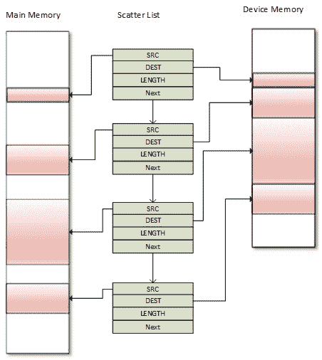
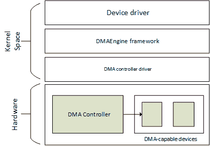
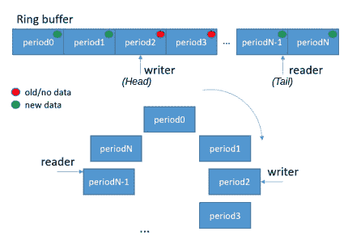

# 第十一章：*第十一章*：实现直接内存访问（DMA）支持

**直接内存访问**（**DMA**）是计算机系统的一项功能，允许设备在无需 CPU 干预的情况下访问主系统内存，从而使 CPU 能专注于其他任务。它的应用包括网络流量加速、音频数据或视频帧抓取，其使用范围不限于特定领域。负责管理 DMA 事务的外设是 DMA 控制器，现代大多数处理器和微控制器中都有该控制器。

该功能的工作原理如下：当驱动程序需要传输一块数据时，驱动程序设置 DMA 控制器，指定源地址、目标地址以及需要复制的字节总数。然后，DMA 控制器会自动将数据从源地址传输到目标地址，而无需占用 CPU 的周期。当剩余的字节数达到零时，数据块传输结束，驱动程序会收到通知。

注意

DMA 并不总是意味着复制操作会更快。它不会直接带来性能提升，但首先，它提供了一个真正的后台操作，释放 CPU 去处理其他任务；其次，在 DMA 操作过程中，由于保持了 CPU 缓存/预取器的状态，性能上会有所提升（如果使用普通的 memcpy，并由 CPU 执行，可能会导致状态紊乱）。

本章将处理一致性和非一致性 DMA 映射，以及一致性问题、DMA 引擎的 API 和 DMA 与 DT 绑定。更具体地说，我们将涵盖以下主题：

+   设置 DMA 映射

+   完成概念介绍

+   使用 DMA 引擎的 API

+   综合起来——单缓冲区 DMA 映射

+   关于循环 DMA 的说明

+   理解 DMA 和 DT 绑定

# 设置 DMA 映射

对于任何类型的 DMA 传输，您需要提供源地址、目标地址以及要传输的字数。在外设 DMA 的情况下，这个外设的 FIFO 会作为源或目标，取决于传输方向。当外设作为源时，目标地址是一个内存位置（内部或外部）。当外设作为目标时，源地址是一个内存位置（内部或外部）。

换句话说，DMA 传输需要适当的内存映射。接下来的章节将详细讨论这一点。

## 缓存一致性与 DMA 的概念

在配备缓存的 CPU 上，最近访问的内存区域会被缓存，包括为 DMA 映射的内存区域。事实上，两个独立设备之间共享的内存通常是缓存一致性问题的根源。缓存不一致性来源于其他设备可能没有意识到另一个设备的写操作。另一方面，缓存一致性确保每个写操作看起来都像是瞬间发生的，这意味着所有共享同一内存区域的设备看到的是完全相同的变化顺序。

在《*Linux 设备驱动程序（LDD3）*》第三版的以下摘录中，详细阐述了缓存一致性问题的情形：

“让我们假设一台 CPU 配备了缓存，并且外部内存可以通过 DMA 直接访问。当 CPU 访问内存中的位置 X 时，当前的值将被存储在缓存中。随后的对 X 的操作将更新 X 的缓存副本，但不会更新 X 在外部内存中的版本，假设是写回缓存。如果缓存没有在设备下次尝试访问 X 之前刷新到内存，设备将接收到 X 的过时值。同样地，如果当设备写入新值到内存时缓存副本没有失效，CPU 将对 X 的过时值进行操作。”

解决这个问题有两种方法：

+   一种基于硬件的解决方案。这种系统是一致性的系统。

+   一种基于软件的解决方案，操作系统负责确保缓存一致性。这种系统是非一致性的系统。

现在我们已经了解了 DMA 的缓存方面，让我们向前迈一步，学习如何执行 DMA 的内存映射。

## DMA 的内存映射

为 DMA 目的分配的内存缓冲区必须进行适当的映射。DMA 映射包括分配一个适合 DMA 的内存缓冲区，并为该缓冲区生成一个总线地址。

我们区分两种类型的 DMA 映射——**一致性 DMA 映射**和**流式 DMA 映射**。前者自动解决缓存一致性问题，使其成为多个传输中无需在传输之间取消映射而重复使用的好候选方案。这可能会在一些平台上带来相当大的开销，而且，保持内存同步本身就有成本。流式映射在编码方面有很多限制，并且不会自动解决一致性问题，尽管有一个解决方案，它由每次传输之间的多个函数调用组成。一致性映射通常在驱动程序的生命周期内存在，而一个流式映射通常在 DMA 传输完成后会被取消映射。

注意

建议在可以时使用流式映射，在必须时使用一致性映射。如果缓冲区会被 CPU 或 DMA 控制器不可预测地访问，你应该考虑使用一致性映射，因为内存始终会被同步。否则，你应该使用流式映射，因为你确切知道何时需要访问缓冲区，在这种情况下，你会先刷新缓存（从而同步缓冲区），然后再访问缓冲区。

处理 DMA 映射的主要头文件是：

```
 #include <linux/dma-mapping.h>
```

然而，根据映射的不同，可以使用不同的 API。在进一步讨论 API 之前，我们需要理解在 DMA 映射过程中执行的操作：

1.  假设设备支持 DMA，如果驱动程序使用`kmalloc()`设置缓冲区，它将获得一个虚拟地址（我们称之为*X*），但此时该地址尚未指向任何地方。

1.  虚拟内存系统（由 **MMU**，即**内存管理单元**协助）将 *X* 映射到系统 RAM 中的物理地址（我们称之为 *Y*），前提是系统中仍有可用的空闲内存。

由于 DMA 不通过 CPU 虚拟内存系统流动，驱动程序可以使用虚拟地址 *X* 来访问此时的缓冲区，但设备本身不能。

1.  在一些简单系统（没有 I/O MMU 的系统）中，设备可以直接对物理地址 *Y* 进行 DMA。但在许多其他系统中，设备通过 I/O MMU 观察主内存；因此，存在将 DMA 地址转换为物理地址的 I/O MMU 硬件，例如，它将 *Z* 转换为 *Y*。

1.  这时 DMA API 介入：

    +   驱动程序可以将虚拟地址 *X* 传递给类似于 `dma_map_single()` 的函数（我们将在本章的 *单缓冲区映射* 部分中讨论），该函数设置任何适当的 I/O MMU 映射并返回 DMA 地址 *Z*。

    +   驱动程序接着指示设备执行 DMA 操作到 *Z*。

    +   I/O MMU 最终将其映射到系统 RAM 中地址为 *Y* 的缓冲区。

现在我们已经介绍了用于 DMA 的内存映射概念，我们可以开始创建映射，从最简单的一致性 DMA 映射开始。

### 创建一致性的 DMA 映射

这种映射通常用于持久性双向 I/O 缓冲区。以下函数设置了一个一致性的映射：

```
void *dma_alloc_coherent(struct device *dev, size_t size,
                      dma_addr_t *dma_handle, gfp_t flag) 
```

这个函数负责缓冲区的分配和映射。它返回一个内核虚拟地址，该地址对应于该缓冲区，宽度为`size`字节，并且 CPU 可以访问。`size`参数可能会引起误解，因为它首先传递给`get_order()` API，以获得与此大小对应的页面顺序。因此，这个映射至少是页面大小的，并且页面数量是 2 的幂。`dev`是你的设备结构。第三个参数是一个输出参数，指向相关的总线地址。为映射分配的内存保证是物理连续的，标志决定了内存应如何分配，通常是`GFP_KERNEL`，或者在原子上下文中是`GFP_ATOMIC`。

请注意，这个映射称为以下内容：

+   一致性（coherent）是因为缓冲区内容在所有子系统中始终相同（无论是设备还是 CPU）。

+   同步，因为设备或 CPU 的写入可以立即读取，而无需担心缓存一致性。

要释放映射，可以使用以下 API：

```
void dma_free_coherent(struct device *dev, size_t size,
                 void *cpu_addr, dma_addr_t dma_handle);
```

在前面的原型中，`cpu_addr`和`dma_handle`分别对应由`dma_alloc_coherent()`返回的内核虚拟地址和总线地址。这两个参数是 MMU（返回虚拟地址）和 I/O MMU（返回总线地址）释放其映射时所需的。

### 创建流式 DMA 映射

流式 DMA 映射内存缓冲区通常在传输之前映射，传输之后取消映射。这种映射有更多的约束，并且与一致性映射不同，原因如下：

+   映射需要与先前动态分配的缓冲区一起工作。

+   映射可以接受多个不连续且分散的缓冲区。

+   对于读事务（设备到 CPU），缓冲区属于设备，而不是 CPU。在 CPU 使用这些缓冲区之前，应先取消映射（在`dma_unmap_{single,sg}()`之后），或者必须在这些缓冲区上调用`dma_sync_{single,sg}_for_cpu()`。这样做的主要原因是为了缓存目的。

+   对于写事务（CPU 到设备），驱动程序应在建立映射之前将数据放入缓冲区。

+   必须指定传输方向，并且数据应该按照该方向进行移动和使用。

流式映射有两种形式：

+   单缓冲区映射，允许映射一个物理连续的缓冲区

+   散射/聚集映射，允许传递多个缓冲区（分散在内存中）

对于这两种映射，传输方向应通过`enum dma_data_direction`类型的符号来指定，定义在`include/linux/dma-direction.h`中，如下所示：

```
enum dma_data_direction {
     DMA_BIDIRECTIONAL = 0,
     DMA_TO_DEVICE = 1,
     DMA_FROM_DEVICE = 2,
     DMA_NONE = 3,
};
```

在上面的摘录中，每个元素都相当自解释。

注意

一致性映射隐式地设置了一个方向属性，值为`DMA_BIDIRECTIONAL`。

现在我们已经了解了两种流式 DMA 映射方法，我们可以深入了解它们的实现，首先从单缓冲区映射开始。

#### 单缓冲区映射

单缓冲区映射是一种偶尔传输的流式映射。你可以使用`dma_map_single()`函数设置这样的映射，该函数具有以下定义：

```
dma_addr_t dma_map_single(struct device *dev, void *ptr,
        size_t size, enum dma_data_direction direction);
```

当 CPU 是源（它写入设备）、CPU 是目标（它从设备读取）或该映射的访问是双向的（在一致性映射中隐式使用）时，方向应分别为`DMA_TO_DEVICE`、`DMA_FROM_DEVICE`或`DMA_BIDIRECTIONAL`。`dev`是你硬件设备的底层`device`结构，`ptr`是一个输出参数，是缓冲区的内核虚拟地址。此函数返回`dma_addr_t`类型的元素，这是 I/O MMU（如果存在）返回的设备总线地址，以便设备能够进行 DMA 操作。你应该使用`dma_mapping_error()`（如果没有错误发生，必须返回`0`）来检查映射是否返回了有效地址，并且如果发生错误，不要继续操作。

这种映射可以通过以下函数释放：

```
void dma_unmap_single(struct device *dev, 
                      dma_addr_t dma_addr, size_t size, 
                      enum dma_data_direction direction);
int dma_mapping_error(struct device *dev, 
                      dma_addr_t dma_addr);
```

另一种映射是散列/收集映射，因为内存缓冲区在分配时被分散（散布）到系统中，并由驱动程序收集。

#### 散列/收集映射

散列/收集映射是一种特殊类型的流式 DMA 映射，允许在一次操作中传输多个内存缓冲区，而不是逐个映射每个缓冲区并依次传输它们。假设你有多个缓冲区，它们可能在物理上并不连续，但需要同时传输到设备或从设备传输。这种情况可能会由于以下原因发生：

+   一个`readv`或`writev`系统调用

+   一个磁盘 I/O 请求

+   或者仅仅是一个页面列表或一个 vmalloc 区域

在你可以发出这种映射之前，你必须设置一个散列元素数组，每个元素应描述单个缓冲区的映射。散列元素在内核中被抽象为`struct scatterlist`的实例，定义如下：

```
struct scatterlist {
     unsigned long page_link;
     unsigned int     offset;
     unsigned int     length;
     dma_addr_t       dma_address;
     unsigned int     dma_length;
};
```

要设置一个散列列表映射，你应当执行以下操作：

+   分配你的散布缓冲区。

+   创建一个散列元素数组，使用`sg_init_table()`初始化该数组，并使用`sg_set_buf()`将已分配的内存填充到此数组中。请注意，每个散列元素条目必须是页面大小，最后一个元素除外，最后一个元素可能不遵循此规则。

+   在散列列表上调用`dma_map_sg()`。

+   DMA 操作完成后，调用`dma_unmap_sg()`取消映射散列列表。

以下是描述散列列表大部分概念的图示：



图 11.1 – 散列/收集内存组织

虽然可以单独进行 DMA 操作每个缓冲区的内容，但散列/聚集（scatter/gather）使得可以通过将散列列表数组的指针和其长度（数组中的条目数）一起发送到设备，来一次性进行 DMA 操作整个列表。

`sg_init_table()`、`sg_set_buf()` 和 `dma_map_sg()` 的原型如下：

```
void sg_init_table(struct scatterlist *sgl, 
                   unsigned int nents)
void sg_set_buf(struct scatterlist *sg, const void *buf,
                unsigned int buflen)
int dma_map_sg(struct device *dev, 
               struct scatterlist *sglist, int nents,
               enum dma_data_direction dir);
```

在上述 API 中，`sgl` 是要初始化的 `scatterlist` 数组，`nents` 是该数组中的条目数量。`sg_set_buf()` 将 `scatterlist` 条目设置为指向给定数据。在其参数中，`sg` 是 `scatterlist` 条目，`data` 是与该条目对应的缓冲区，`buflen` 是缓冲区的大小。`dma_map_sg()` 返回已成功映射的列表中元素的数量，这意味着它永远不会小于零。如果发生错误，此函数将返回零。

以下是演示散列/聚集映射原理的代码示例：

```
u32 *wbuf, *wbuf2, *wbuf3;
wbuf = kzalloc(SDMA_BUF_SIZE, GFP_DMA);
wbuf2 = kzalloc(SDMA_BUF_SIZE, GFP_DMA);
wbuf3 = kzalloc(SDMA_BUF_SIZE/2, GFP_DMA);
struct scatterlist sg[3];
sg_init_table(sg, 3);
sg_set_buf(&sg[0], wbuf, SDMA_BUF_SIZE);
sg_set_buf(&sg[1], wbuf2, SDMA_BUF_SIZE);
sg_set_buf(&sg[2], wbuf3, SDMA_BUF_SIZE/2);
ret = dma_map_sg(dev, sg, 3, DMA_TO_DEVICE);
if (ret != 3) {
     /*handle this error*/
}
/* As of now you can use 'ret' or 'sg_dma_len(sgl)' to retrieve the
 * length of the scatterlist array.
 */
```

在散列/聚集映射中，单缓冲区映射部分中描述的相同规则也适用于散列/聚集。

要取消映射列表，必须使用 `dma_unmap_sg()`，其定义如下：

```
void dma_unmap_sg_attrs(struct device *dev, struct scatterlist *sg,
                          enum dma_data_direction dir, int nents)
```

`dev` 是指向已用于映射的相同设备的指针，`sg` 是要取消映射的散列列表（实际上是指向列表中第一个元素的指针），`dir` 是 DMA 方向，应该映射映射方向，`nents` 是列表中元素的数量。

以下是取消映射前一个实现的示例：

```
dma_unmap_sg(dev, sg, 3, DMA_TO_DEVICE);
```

在前面的示例中，我们使用了与映射过程中相同的参数。

#### 流式映射的隐式和显式缓存一致性

在任何流式映射中，`dma_map_single()`/`dma_unmap_single()` 和 `dma_map_sg()`/`dma_unmap_sg()` 成对调用时，会处理缓存一致性。在外向 DMA 传输（从 CPU 到设备，设置 `DMA_TO_DEVICE` 方向标志）情况下，由于数据必须在建立映射之前就位于缓冲区中，`dma_map_sg()`/`dma_map_single()` 将处理缓存一致性。在设备到 CPU 的情况（设置 `DMA_FROM_DEVICE` 方向标志），必须首先释放映射，然后 CPU 才能访问缓冲区。这是因为 `dma_unmap_single()`/`dma_unmap_sg()` 也会隐式处理缓存一致性。

然而，如果你需要多次使用相同的流式 DMA 区域，并在 DMA 传输之间访问数据，缓冲区必须正确同步，以便设备和 CPU 都能看到 DMA 缓冲区的最新正确副本。为了避免缓存一致性问题，驱动程序必须在从 RAM 向设备启动 DMA 传输之前（在将数据放入缓冲区并实际将缓冲区交给硬件之前）调用 `dma_sync_{single,sg}_for_device()`。这个函数调用会在必要时刷新与 DMA 缓冲区对应的缓存行。类似地，驱动程序在完成从设备到 RAM 的 DMA 传输后不应立即访问内存缓冲区；相反，在读取缓冲区之前，驱动程序应调用 `dma_sync_{single,sg}_for_cpu()`，如果需要，它将使相关硬件缓存行失效。换句话说，当源缓冲区是设备内存时，应使缓存失效（缓存数据并不脏，因为 CPU 没有向任何缓冲区写入数据）；而如果源是 RAM（目标是设备内存），这意味着 CPU 可能已经向源缓冲区写入了一些数据，并且这些数据可能在缓存行中，因此缓存应被刷新。

以下是这些同步 API 的原型：

```
void dma_sync_sg_for_cpu(struct device *dev,
                     struct scatterlist *sg,
                     int nents,
                     enum dma_data_direction direction);
void dma_sync_sg_for_device(struct device *dev,
                     struct scatterlist *sg, int nents,
                     enum dma_data_direction direction);
void dma_sync_single_for_cpu(struct device *dev, 
                     dma_addr_t addr, size_t size,
                     enum dma_data_direction dir)
void dma_sync_single_for_device(struct device *dev,
                     dma_addr_t addr, size_t size,
                     enum dma_data_direction dir)
```

在之前的所有 API 中，方向参数必须与映射相应缓冲区时指定的方向保持一致。

在本节中，我们已经学习了如何设置流式 DMA 映射。现在我们完成了映射的部分，接下来介绍完成概念，用于通知 DMA 传输完成。

# 完成概念介绍

本节将简要描述完成以及 DMA 传输使用的必要 API 部分。有关完整描述，请随时查看 `Documentation/scheduler/completion.txt` 中的内核文档。在内核编程中，典型的做法是启动当前线程外的某些活动，然后等待其完成。完成是等待非常常见的过程完成时，等待队列或休眠 API 的良好替代方案。完成变量使用等待队列来实现，唯一的区别是它们使开发者的工作变得更简单，因为不需要维护等待队列，这使得代码的意图非常清晰易懂。

使用完成时需要这个头文件：

```
#include <linux/completion.h> 
```

完成变量在内核中表示为一个结构体 `completion` 的实例，可以像下面这样静态初始化：

```
DECLARE_COMPLETION(my_comp);
```

动态分配初始化可以如下进行：

```
struct completion my_comp;
init_completion(&my_comp);
```

当驱动程序启动必须等待完成的工作（在我们这里是 DMA 事务）时，它只需要将完成事件传递给 `wait_for_completion()` 函数，该函数的原型如下：

```
void wait_for_completion(struct completion *comp);
```

当完成发生时，驱动程序可以使用以下 API 之一唤醒等待者：

```
void complete(struct completion *comp);
void complete_all(struct completion *comp);
```

`complete()` 只会唤醒一个等待的任务，而 `complete_all()` 会唤醒所有等待该事件的任务。完成操作是以一种确保即使在 `wait_for_completion()` 之前调用 `complete()` 时也能正常工作的方式实现的。

在本节中，我们已经学会了实现一个完成回调，以通知 DMA 传输的完成状态。现在我们已经掌握了 DMA 的所有常见概念，可以开始使用 DMA 引擎 API 来应用这些概念，这也有助于我们更好地理解当一切合并在一起时，事物是如何运作的。

# 使用 DMA 引擎的 API

DMA 引擎是一个通用的内核框架，用于开发 DMA 控制器驱动程序并从消费端利用该控制器。通过这个框架，DMA 控制器驱动程序暴露出一组可以供客户端设备使用的通道。这个框架使得客户端驱动（也称为从属驱动）能够请求并使用来自控制器的 DMA 通道来发起 DMA 传输。

以下图示展示了这一框架的分层结构，显示了该框架如何与 Linux 内核集成：



图 11.2 – DMA 引擎框架

在这里，我们将简单介绍该（从属）API，仅适用于从属 DMA 使用。这里的强制性头文件如下：

```
#include <linux/dmaengine.h>
```

从属 DMA 的使用是直接的，包括以下步骤：

1.  通知内核设备的 DMA 地址能力。

1.  请求 DMA 通道。

1.  如果成功，配置这个 DMA 通道。

1.  准备或配置 DMA 传输。在此步骤中，返回一个表示传输的传输描述符。

1.  使用描述符提交 DMA 传输。然后，传输被添加到控制器的待处理队列中，等待指定通道的处理。此步骤返回一个特殊的 cookie，你可以用它来检查 DMA 活动的进展。

1.  在指定通道上启动 DMA 传输，以便当通道空闲时，队列中的第一个传输开始。

现在我们已经了解了实现 DMA 传输所需的步骤，让我们在使用相应的 API 之前，先了解 DMA 引擎框架中涉及的数据结构。

## 简要介绍 DMA 控制器接口

Linux 中 DMA 的使用包括两个部分：控制器，执行内存传输（不需要 CPU 介入），以及通道，客户端驱动（即支持 DMA 的驱动）通过通道向控制器提交任务。无需多言，控制器和其通道是紧密耦合的，因为前者向客户端暴露后者。

尽管本章面向 DMA 客户端驱动，但为了便于理解，我们将介绍一些控制器数据结构和 API。

### DMA 控制器数据结构

DMA 控制器在 Linux 内核中作为`struct dma_device`的一个实例进行抽象。仅凭控制器本身，若没有客户端使用它暴露的通道，则控制器是无用的。此外，控制器驱动必须暴露用于通道配置的回调，正如其数据结构中所指定的那样，该数据结构具有以下定义：

```
struct dma_device {
    unsigned int chancnt;
    unsigned int privatecnt;
    struct list_head channels;
    struct list_head global_node;
    struct dma_filter filter;
    dma_cap_mask_t  cap_mask;
    u32 src_addr_widths;
    u32 dst_addr_widths;
    u32 directions;
    int (*device_alloc_chan_resources)(
                                  struct dma_chan *chan);
    void (*device_free_chan_resources)(
                                  struct dma_chan *chan);
    struct dma_async_tx_descriptor 
     *(*device_prep_dma_memcpy)(
        struct dma_chan *chan, dma_addr_t dst, 
        dma_addr_t src, size_t len, unsigned long flags);
    struct dma_async_tx_descriptor 
      *(*device_prep_dma_memset)(
       struct dma_chan *chan, dma_addr_t dest, int value,
       size_t len, unsigned long flags);
    struct dma_async_tx_descriptor
      *(*device_prep_dma_memset_sg)(
         struct dma_chan *chan, struct scatterlist *sg,
         unsigned int nents, int value,
         unsigned long flags);
    struct dma_async_tx_descriptor  
      *(*device_prep_dma_interrupt)(
         struct dma_chan *chan, unsigned long flags);
    struct dma_async_tx_descriptor 
      *(*device_prep_slave_sg)(
         struct dma_chan *chan, struct scatterlist *sgl,
           unsigned int sg_len,
           enum dma_transfer_direction direction,
           unsigned long flags, void *context);
    struct dma_async_tx_descriptor 
      *(*device_prep_dma_cyclic)(
           struct dma_chan *chan, dma_addr_t buf_addr,
           size_t buf_len, size_t period_len,
           enum dma_transfer_direction direction,
           unsigned long flags);
     void (*device_caps)(struct dma_chan *chan,
                     struct dma_slave_caps *caps);
     int (*device_config)(struct dma_chan *chan,
                     struct dma_slave_config *config);
     void (*device_synchronize)(struct dma_chan *chan);
     enum dma_status (*device_tx_status)(
              struct dma_chan *chan, dma_cookie_t cookie,
              struct dma_tx_state *txstate);
     void (*device_issue_pending)(struct dma_chan *chan);
     void (*device_release)(struct dma_device *dev);
};
```

该数据结构的完整定义可在`include/linux/dmaengine.h`中找到。本章节仅列出了我们关注的字段。它们的含义如下：

+   `chancnt`：指定该控制器支持多少个 DMA 通道

+   `channels`：`struct dma_chan`结构的列表，表示该控制器暴露的 DMA 通道

+   `privatecnt`：由`dma_request_channel()`请求的 DMA 通道数量，`dma_request_channel()`是 DMA 引擎 API 用于请求 DMA 通道

+   `cap_mask`：一个或多个`dma_capability`标志，表示该控制器的能力

以下是可能的值：

```
enum dma_transaction_type {
    DMA_MEMCPY,     /* Memory to memory copy */
    DMA_XOR,  /* Memory to memory XOR*/
    DMA_PQ,   /* Memory to memory P+Q computation */
    DMA_XOR_VAL, /* Memory buffer parity check using 
                  * XOR */
    DMA_PQ_VAL,  /* Memory buffer parity check using 
                  * P+Q */
    DMA_INTERRUPT,  /* The device can generate dummy
                     * transfer that will generate 
                     * interrupts */
    DMA_MEMSET_SG,  /* Prepares a memset operation over a 
                     * scatter list */
    DMA_SLAVE,      /* Slave DMA operation, either to or
                     * from a device */
    DMA_PRIVATE,    /* channels are not to be used 
                     * for global memcpy. Usually
                     *used with DMA_SLAVE */
    DMA_SLAVE,      /* Memory to device transfers */
    DMA_CYCLIC,     /* can handle cyclic tranfers */
    DMA_INTERLEAVE, /* Memory to memory interleaved
                     * transfer */
}
```

作为一个例子，这个元素在 i.MX DMA 控制器驱动中设置如下：

```
dma_cap_set(DMA_SLAVE, sdma->dma_device.cap_mask);
dma_cap_set(DMA_CYCLIC, sdma->dma_device.cap_mask);
dma_cap_set(DMA_MEMCPY, sdma->dma_device.cap_mask);
```

+   `src_addr_widths`：设备支持的源地址宽度的位掩码。此宽度必须以字节为单位提供；例如，如果设备支持`4`的宽度，则掩码应设置为`BIT(4)`。

+   `dst_addr_widths`：设备支持的目标地址宽度的位掩码。

+   `directions`：设备支持的从属方向的位掩码。由于`enum dma_transfer_direction`中没有为每种类型定义一个位标志，DMA 控制器应设置`BIT(<TYPE>)`，且控制器也应检查相同的内容。

它在 i.MX SDMA 控制器驱动中设置如下：

```
#define SDMA_DMA_DIRECTIONS (BIT(DMA_DEV_TO_MEM) | \
                     BIT(DMA_MEM_TO_DEV) | \
                       BIT(DMA_DEV_TO_DEV))
[...]
sdma->dma_device.directions = SDMA_DMA_DIRECTIONS;
```

+   `device_alloc_chan_resources`：分配资源并返回分配的描述符数量。由 DMA 引擎核心在请求该控制器的通道时调用。

+   `device_free_chan_resources`：一个回调，允许释放 DMA 通道的资源。

前述为通用回调，以下是依赖于控制器能力的控制器回调，只有在`cap_mask`中设置了相关能力位掩码时，必须提供此回调。

+   `device_prep_dma_memcpy`准备一个 memcpy 操作。如果`DMA_MEMCPY`在`cap_mask`中设置，则此元素必须设置。对于每个设置的标志，必须提供相应的回调，否则控制器注册将失败。所有`device_prep_*`回调都如此。

+   `device_prep_dma_xor`：准备一个 XOR 操作。

+   `device_prep_dma_xor_val`：准备一个异或验证操作。

+   `device_prep_dma_memset`：准备一个 memset 操作。

+   `device_prep_dma_memset_sg`：准备一个在散列表上进行 memset 操作。

+   `device_prep_dma_interrupt`：准备一个链终止中断操作。

+   `device_prep_slave_sg`：准备一个从属 DMA 操作。

+   `device_prep_dma_cyclic`：准备一个循环 DMA 操作。此类 DMA 操作通常用于音频或 UART 驱动程序。该函数需要一个大小为 `buf_len` 的缓冲区。每当传输 `period_len` 字节后，将调用回调函数。我们将在 *关于循环 DMA* 部分讨论此类 DMA。

+   `device_prep_interleaved_dma`：以通用方式传输表达式。

+   `device_config`：将新的配置推送到通道，成功时返回 `0`，否则返回错误代码。

+   `device_pause`：暂停通道上的任何当前传输，并返回 `0`（如果暂停有效），否则返回错误代码。

+   `device_resume`：恢复之前暂停的通道上的任何传输。返回 `0`，否则返回错误代码。

+   `device_terminate_all`：一个回调，用于中止通道上的所有传输，并在成功时返回 `0`，否则返回错误代码。

+   `device_synchronize`：一个回调函数，用于将传输结束的同步操作与当前上下文对接。

+   `device_tx_status`：轮询事务是否完成。可选的 `txstate` 参数可用于获取包含附加传输状态信息的结构体；否则，该调用将仅返回一个简单的状态代码。

+   `device_issue_pending`：一个强制性的回调，用于将待处理的事务推送到硬件。这是 `dma_async_issue_pending()` API 的后端实现。

虽然大多数驱动程序直接调用这些回调函数（通过 `dma_chan->dma_dev->device_prep_dma_*`），但你应该使用 `dmaengine_prep_*` DMA 引擎 API，这些 API 在调用相应回调之前会进行一些有效性检查。例如，对于内存到内存的传输，驱动程序应使用 `device_prep_dma_memcpy()` 包装函数。

### DMA 通道数据结构

DMA 通道是客户端驱动程序提交 DMA 事务（I/O 数据传输）给 DMA 控制器的方式。其工作原理是：支持 DMA 的驱动程序（客户端驱动程序）请求一个或多个通道，重新配置该通道，并要求控制器使用此通道执行已提交的 DMA 传输。通道定义如下：

```
struct dma_chan {
     struct dma_device *device;
     struct device *slave;
     dma_cookie_t cookie;
     dma_cookie_t completed_cookie;
[...]
};
```

你可以将 DMA 通道看作是用于 I/O 数据传输的高速公路。以下是该数据结构中每个元素的含义：

+   `device`：指向提供此通道的 DMA 设备（控制器）的指针。如果通道成功请求，字段绝不应为 `NULL`，因为一个通道始终属于一个控制器。

+   `slave`：指向使用此通道的设备底层 `struct device` 结构的指针（其驱动程序为客户端驱动程序）。

+   `cookie`：表示该通道返回给客户端的最后一个 cookie 值。

+   `Completed_cookie`：此通道的最后一个完成的 cookie。

此数据结构的完整定义可以在 `include/linux/dmaengine.h` 文件中找到。

注意

在 DMA 引擎框架中，cookie 只是一个 DMA 事务标识符，允许检查它标识的事务的状态和进展。

### DMA 事务描述符数据结构

事务描述符除了描述和表征 DMA 事务（或在语言滥用下称为 DMA 传输）外没有其他功能。这样的描述符在内核中使用`struct dma_async_tx_descriptor`数据结构表示，其定义如下：

```
struct dma_async_tx_descriptor {
     dma_cookie_t cookie;
     struct dma_chan *chan;
     dma_async_tx_callback callback;
     void *callback_param;
[...]
};
```

我们在这个数据结构中保留的每个元素的含义在这里列出：

+   `cookie`：此事务的跟踪 cookie。它允许检查此事务的进展。

+   `chan`：此操作的目标通道。

+   `callback`：一旦操作完成，应调用的函数。

+   `callback_param`：作为回调函数的参数传递。

你可以在`include/linux/dmaengine.h`中找到完整的数据结构描述。

## 处理设备的 DMA 地址能力

内核默认认为你的设备可以处理 32 位 DMA 地址。然而，设备能够访问的 DMA 内存地址范围可能是有限的，这可能是由于制造商或历史原因。例如，一些设备可能只支持地址的低 24 位。这一限制源于 ISA 总线，ISA 总线是 24 位宽，并且 DMA 缓冲区只能位于系统内存的底部 16 MB 区域。

然而，你可以使用 DMA 掩码的概念来告知内核这种限制，目的是通知内核你的设备的 DMA 地址能力。

这可以通过使用`dma_set_mask_and_coherent()`来实现，其原型如下：

```
int dma_set_mask_and_coherent(struct device *dev,
                              u64 mask);
```

上述函数会为流式映射和一致性映射设置相同的掩码，因为 DMA API 保证一致性 DMA 掩码可以设置为与流式 DMA 掩码相同或更小。

然而，对于特殊需求，你可以使用`dma_set_mask()`或`dma_set_coherent_mask()`来相应地设置掩码。这些 API 的原型如下：

```
int dma_set_mask(struct device *dev, u64 mask);
int dma_set_coherent_mask(struct device *dev, u64 mask);
```

在这些函数中，`dev`是底层设备结构，而`mask`是描述设备支持的地址位的位掩码，可以使用`DMA_BIT_MASK`宏和实际的位顺序来指定。

`dma_set_mask()`和`dma_set_coherent_mask()`都返回零，表示在给定的地址掩码下，设备可以在机器上正确执行 DMA。任何其他返回值都表示错误，意味着给定的掩码太小，无法在该系统上支持。在这种失败的情况下，你可以在驱动程序中回退到非 DMA 模式进行数据传输，或者如果 DMA 是强制性的，直接禁用设备中需要 DMA 支持的功能，甚至完全不探测该设备。

当设置 DMA 掩码失败时，建议驱动程序打印内核警告（`dev_warn()` 或 `pr_warn()`）消息。以下是一个声卡的伪代码示例：

```
#define PLAYBACK_ADDRESS_BITS DMA_BIT_MASK(32)
#define RECORD_ADDRESS_BITS DMA_BIT_MASK(24)
struct my_sound_card *card;
struct device *dev;
...
if (!dma_set_mask(dev, PLAYBACK_ADDRESS_BITS)) {
     card->playback_enabled = 1;
} else {
    card->playback_enabled = 0;
    dev_warn(dev,
     "%s: Playback disabled due to DMA limitations\n",
     card->name);
}
if (!dma_set_mask(dev, RECORD_ADDRESS_BITS)) {
    card->record_enabled = 1;
} else {
    card->record_enabled = 0;
    dev_warn(dev, 
          "%s: Record disabled due to DMA limitations\n",
          card->name);
}
```

在前面的示例中，我们使用了 `DMA_BIT_MASK` 宏来定义 DMA 掩码。然后，当所需的 DMA 掩码不被支持时，我们禁用了必须支持 DMA 的功能。在任何情况下，都会打印警告。

## 请求 DMA 通道

通过 `dma_request_channel()` 请求一个通道。它的原型如下：

```
struct dma_chan *dma_request_channel(
                      const dma_cap_mask_t *mask,
                      dma_filter_fn fn, void *fn_param);
```

在前面的例子中，掩码必须是一个位掩码，表示通道必须满足的能力。它本质上用于指定驱动程序需要执行的传输类型，该类型必须在 `dma_device.cap_mask` 中得到支持。

`dma_cap_zero()` 和 `dma_cap_set()` 函数用于清除掩码并设置所需的能力；例如：

```
dma_cap_mask my_dma_cap_mask;
struct dma_chan *chan;
dma_cap_zero(my_dma_cap_mask);
/* Memory 2 memory copy */
dma_cap_set(DMA_MEMCPY, my_dma_cap_mask); 
chan = dma_request_channel(my_dma_cap_mask, NULL, NULL);
```

`fn` 是一个回调指针，其类型具有以下定义：

```
typedef bool (*dma_filter_fn)(struct dma_chan *chan,
                void *filter_param);
```

实际上，`dma_request_channel()` 会遍历系统中可用的 DMA 控制器（`dma_device_list`，定义在 `drivers/dma/dmaengine.c` 中），并为每个控制器查找与请求匹配的通道。如果 `filter_fn` 参数（可选）为 `NULL`，则 `dma_request_channel()` 会直接返回第一个满足能力掩码的通道。否则，当掩码参数不足以指定所需的通道时，可以使用 `filter_fn` 例程作为过滤器，这样系统中的每个可用通道都会被传递给此回调函数，以供接受与否。内核会为系统中每个空闲的通道调用一次 `filter_fn` 例程。当发现合适的通道时，`filter_fn` 应返回 `DMA_ACK`，这将标记给定的通道为 `dma_request_channel()` 的返回值。

通过此接口分配的通道在调用 `dma_release_channel()` 之前是独占的。其定义如下：

```
void dma_release_channel(struct dma_chan *chan)
```

此 API 释放 DMA 通道并使其可以被其他客户端请求。

作为附加信息，可以使用 `ls /sys/class/dma/` 命令在用户空间列出系统中可用的 DMA 通道，如下所示：

```
root@raspberrypi4-64:~# ls /sys/class/dma/
dma0chan0  dma0chan1  dma0chan2  dma0chan3  dma0chan4  dma0chan5  dma0chan6  dma0chan7  dma1chan0  dma1chan1
```

在前面的代码片段中，`chan<chan-index>` 通道名称与其所属的 DMA 控制器 `dma<dma-index>` 连接。通过打印相应通道目录中的 `in_use` 文件值，可以查看一个通道是否正在使用，如下所示：

```
root@raspberrypi4-64:~# cat /sys/class/dma/dma0chan0/in_use 
1
root@raspberrypi4-64:~# cat /sys/class/dma/dma0chan1/in_use 
1
root@raspberrypi4-64:~# cat /sys/class/dma/dma0chan2/in_use 
1
root@raspberrypi4-64:~# cat /sys/class/dma/dma0chan3/in_use 
0
root@raspberrypi4-64:~# cat /sys/class/dma/dma0chan4/in_use 
0
root@raspberrypi4-64:~# cat /sys/class/dma/dma0chan5/in_use 
0
root@raspberrypi4-64:~# cat /sys/class/dma/dma0chan6/in_use 
0
root@raspberrypi4-64:~#
```

在前面的例子中，我们可以看到，`dma0chan1` 正在使用中，而 `dma0chan6` 并未使用。

## 配置 DMA 通道

为了让 DMA 传输在通道上正常工作，必须对该通道应用特定客户端的配置。因此，DMA 引擎框架通过使用`struct dma_slave_config`数据结构来允许此配置，该结构表示 DMA 通道的运行时配置。这使得客户端能够指定例如 DMA 方向、DMA 地址（源和目标）、总线宽度和 DMA 突发长度等参数，以适应外设。然后，这一配置通过`dmaengine_slave_config()`函数应用于底层硬件，函数定义如下：

```
int dmaengine_slave_config(struct dma_chan *chan,
                         struct dma_slave_config *config)
```

`chan`参数表示要配置的 DMA 通道，而`config`是要应用的配置。

为了更好地微调这个配置，我们需要查看定义如下的`struct dma_slave_config`结构：

```
struct dma_slave_config {
     enum dma_transfer_direction direction;
     phys_addr_t src_addr;
     phys_addr_t dst_addr;
     enum dma_slave_buswidth src_addr_width;
     enum dma_slave_buswidth dst_addr_width;
     u32 src_maxburst;
     u32 dst_maxburst;
     [...]
};
```

这里是结构体中每个元素的含义：

+   `direction`指示数据是否应在此从设备通道中流入或流出。目前的可能值如下：

    ```
    /* dma transfer mode and direction indicator */
    enum dma_transfer_direction {
        DMA_MEM_TO_MEM, /* Async/Memcpy mode */
        DMA_MEM_TO_DEV, /* From Memory to Device */
        DMA_DEV_TO_MEM, /* From Device to Memory */
        DMA_DEV_TO_DEV, /* From Device to Device */
        DMA_TRANS_NONE, 
    };
    ```

+   `src_addr`：这是 DMA 从设备读取数据的缓冲区的物理地址（实际上是总线地址）。如果源是内存，则此元素会被忽略。`dst_addr`是 DMA 将数据写入的缓冲区的物理地址（总线地址），如果源是内存，则会被忽略。`src_addr_width`是源（RX）寄存器的宽度，以字节为单位，DMA 数据应从中读取。如果源是内存，具体是否适用将取决于架构。同样，`dst_addr_width`与`src_addr_width`相同，但用于目标（TX）。

任何总线宽度必须是以下枚举值之一：

```
enum dma_slave_buswidth {
    DMA_SLAVE_BUSWIDTH_UNDEFINED = 0,
    DMA_SLAVE_BUSWIDTH_1_BYTE = 1,
    DMA_SLAVE_BUSWIDTH_2_BYTES = 2,
    DMA_SLAVE_BUSWIDTH_3_BYTES = 3,
    DMA_SLAVE_BUSWIDTH_4_BYTES = 4,
    DMA_SLAVE_BUSWIDTH_8_BYTES = 8,
    DMA_SLAVE_BUSWIDTH_16_BYTES = 16,
    DMA_SLAVE_BUSWIDTH_32_BYTES = 32,
    DMA_SLAVE_BUSWIDTH_64_BYTES = 64,
};
```

+   `src_maxburs`：这是可以在单个突发中发送到设备的最大字数（将字视为`src_addr_width`成员的单位，而不是字节）。在 I/O 外设上，通常使用 FIFO 深度的一半，以防溢出。在内存源上，这可能适用，也可能不适用。`dst_maxburst`与`src_maxburst`类似，但它用于目标设备。

以下是 DMA 通道配置的示例：

```
struct dma_chan *my_dma_chan;
dma_addr_t dma_src_addr, dma_dst_addr;
struct dma_slave_config channel_cfg = {0};
/* No filter callback, neither filter param */
my_dma_chan = dma_request_channel(my_dma_cap_mask,
                                   NULL, NULL);
/* scr_addr and dst_addr are ignored for mem to mem copy */
channel_cfg.direction = DMA_MEM_TO_MEM;
channel_cfg.dst_addr_width = DMA_SLAVE_BUSWIDTH_32_BYTES;
dmaengine_slave_config(my_dma_chan, &channel_cfg);
```

在前面的代码片段中，`dma_request_channel()`被用来请求一个 DMA 通道，接着通过`dmaengine_slave_config()`对其进行配置。

## 配置 DMA 传输

这一步允许定义传输的类型。通过与 DMA 通道关联的控制器的`device_prep_dma_*`回调函数来配置（或者说准备）DMA 传输。每个这些 API 返回一个传输描述符，表示为`struct dma_async_tx_descriptor`数据结构，可以在稍后提交传输之前用于定制。

对于内存到内存的传输，例如，你应该使用`device_prep_dma_memcpy`回调函数，如以下代码所示：

```
struct dma_device *dma_dev = my_dma_chan->device;
struct dma_async_tx_descriptor *tx_desc = NULL;
tx_desc = dma_dev->device_prep_dma_memcpy(
                          my_dma_chan, dma_dst_addr,
                          dma_src_addr, BUFFER_SIZE, 0);
if (!tx_desc) {
    /* dma_unmap_* the buffer */
    handle_error();
}
```

在前面的代码示例中，我们直接调用了控制器回调，虽然我们本可以先检查其是否存在。然而，出于合理性和可移植性考虑，建议使用 `dmaengine_prep_*` DMA 引擎 API，而不是直接调用控制器回调。我们的 `tx_desc` 赋值将具有以下形式：

```
tx_desc = dmaengine_prep_dma_memcpy(my_dma_chan,
             dma_dst_addr, dma_src_addr, BUFFER_SIZE, 0);
```

这种方法在涉及可能发生变化的控制器数据结构时更安全且具有可移植性。

此外，客户端驱动可以使用 `dma_async_tx_descriptor` 结构的 `callback` 元素（由 `dmaengine_prep_*` 函数返回）来提供完成回调。

## 提交 DMA 传输

为了将事务放入驱动程序待处理队列中，使用 `dmaengine_submit()`，它具有以下原型：

```
dma_cookie_t dmaengine_submit(
                  struct dma_async_tx_descriptor *desc)
```

这个 API 是控制器 `device_issue_pending` 回调的前端。此函数返回一个 cookie，你可以使用它来通过其他 DMA 引擎检查 DMA 活动的进展。为了检查返回的 cookie 是否有效，你可以使用 `dma_submit_error()` 辅助函数，正如我们在示例中将看到的那样。如果尚未提供完成回调，可以在提交传输之前进行设置，如下摘录所示：

```
struct completion transfer_ok;
init_completion(&transfer_ok);
/*
 * you can also set the parameter to be given to this 
 * callback in tx->callback_param
 */
Tx_desc->callback = my_dma_callback;
/* Submitting our DMA transfer */
dma_cookie_t cookie = dmaengine_submit(tx);
if (dma_submit_error(cookie)) {
    /* handle error */
    [...]
}
```

上面的摘录非常简短且易于理解。要传递给回调的参数必须设置在描述符的 `callback_param` 字段中。它可以是一个设备状态结构，例如。

注意

每当 DMA 传输完成后，DMA 控制器会产生一个中断，之后队列中的下一个传输将被启动，并激活一个任务。若客户端驱动提供了完成回调，则当任务被调度时，任务将调用该回调。因此，完成回调在中断上下文中运行。

## 发起待处理的 DMA 请求并等待回调通知

启动事务是 DMA 传输设置的最后一步。通过调用 `dma_async_issue_pending()` 在该通道上激活待处理队列中的事务。如果通道空闲，则队列中的第一个事务将被启动，随后的事务将排队。DMA 操作完成后，下一个事务会启动，并触发任务。该任务负责在设置了回调的情况下调用客户端驱动的完成回调例程以进行通知：

```
void dma_async_issue_pending(struct dma_chan *chan);
```

该函数是控制器 `device_issue_pending` 回调的封装。其用法示例如下所示：

```
dma_async_issue_pending(my_dma_chan);
wait_for_completion(&transfer_ok);
/* may be unmap buffer if necessary and if it is not
 * done in the completion callback yet
 */
[...]
/* Process buffer through rx_data and tx_data virtual addresses. */
[...]
```

`wait_for_completion()` 函数会阻塞，将当前任务挂起，直到我们的 DMA 回调被调用，更新（完成）我们的完成变量，以便恢复被阻塞的代码。这是 `while (!done) msleep(SOME_TIME);` 的一个很好的替代方案。以下是一个示例：

```
static void my_dma_complete_callback (void *param)
{
    complete(transfer_ok);
[...]
}
```

这一切都在我们的 DMA 传输实现中。当完成回调返回时，主代码将恢复并继续正常工作流程。

经过 DMA 引擎 API 的讲解后，我们可以通过一个完整的示例来总结这些知识，如下节所示。

# 将所有内容汇集在一起——单缓冲区 DMA 映射

假设我们希望映射一个单一缓冲区（流式映射），并将数据从源`src`通过 DMA 传输到目标`dst`。我们将使用一个字符设备，这样在该设备中进行任何写操作时都会触发 DMA，而任何读操作都会对比源和目标是否匹配。

首先，我们列出所需的头文件以便调用必要的 API：

```
#define pr_fmt(fmt) "DMA-TEST: " fmt
#include <linux/module.h>
#include <linux/slab.h>
#include <linux/init.h>
#include <linux/dma-mapping.h>
#include <linux/fs.h>
#include <linux/dmaengine.h>
#include <linux/device.h>
#include <linux/io.h>
#include <linux/delay.h>
```

现在让我们为驱动程序定义一些全局变量：

```
/* we need page aligned buffers */
#define DMA_BUF_SIZE  2 * PAGE_SIZE
static u32 *wbuf;
static u32 *rbuf;
static int dma_result;
static int gMajor; /* major number of device */
static struct class *dma_test_class;
static struct completion dma_m2m_ok;
static struct dma_chan *dma_m2m_chan;
```

在前面的代码中，`wbuf`代表源缓冲区，`rbuf`代表目标缓冲区。由于我们的实现是基于字符设备的，`gMajor`和`dma_test_class`用于表示字符设备的主设备号和类别。

由于 DMA 映射需要提供设备结构作为第一个参数，我们来创建一个虚拟的设备结构：

```
static void dev_release(struct device *dev)
{
    pr_info( "releasing dma capable device\n");
}
static struct device dev = {
    .release = dev_release,
    .coherent_dma_mask = ~0, // allow any address
    .dma_mask = &dev.coherent_dma_mask,// use the same mask
};
```

由于我们使用的是静态设备，我们在设备结构中设置了设备的 DMA 掩码。在平台驱动中，我们会使用`dma_set_mask_and_coherent()`来实现这一点。

现在是实现我们第一个文件操作——`open`方法的时候了，在我们的案例中，这个方法只是简单地分配缓冲区：

```
int dma_open(struct inode * inode, struct file * filp)
{     
     init_completion(&dma_m2m_ok);
     wbuf = kzalloc(DMA_BUF_SIZE, GFP_KERNEL | GFP_DMA);
     if(!wbuf) {
           pr_err("Failed to allocate wbuf!\n");
           return -ENOMEM;
     }
     rbuf = kzalloc(DMA_BUF_SIZE, GFP_KERNEL | GFP_DMA);
     if(!rbuf) {
           kfree(wbuf);
           pr_err("Failed to allocate rbuf!\n");
           return -ENOMEM;
     }
     return 0;
}
```

前述的字符设备的`open`操作除了分配将用于我们传输的缓冲区外，什么也不做。这些缓冲区将在设备文件关闭时被释放，这将导致调用我们设备的释放函数，具体实现如下：

```
int dma_release(struct inode * inode, struct file * filp)
{
     kfree(wbuf);
     kfree(rbuf);
     return 0;
}
```

我们进入了`read`方法的实现。这个方法将简单地向内核消息缓冲区添加一条记录，报告 DMA 操作的结果。它的实现如下：

```
ssize_t dma_read (struct file *filp, char __user * buf,
                   size_t count, loff_t * offset)
{
     pr_info("DMA result: %d!\n", dma_result);
     return 0;
}
```

现在进入与 DMA 相关的部分。我们首先实现完成回调，这个回调仅仅是调用`complete()`函数在我们的完成结构上，并在内核日志缓冲区中添加一条跟踪信息。其实现如下：

```
static void dma_m2m_callback(void *data)
{
    pr_info("in %s\n",__func__);
    complete(&dma_m2m_ok);
}
```

我们决定在`write`方法中实现所有的 DMA 逻辑。做出这个选择没有技术上的原因。用户可以根据以下实现自由地调整代码架构：

```
ssize_t dma_write(struct file * filp,
                  const char __user * buf,
                  size_t count, loff_t * offset)
{
    u32 *index, i;
    size_t err = count;
    dma_cookie_t cookie;
    dma_cap_mask_t dma_m2m_mask;
    dma_addr_t dma_src, dma_dst;
    struct dma_slave_config dma_m2m_config = {0};
    struct dma_async_tx_descriptor *dma_m2m_desc;
```

在前面的代码中，有些变量是我们执行内存到内存 DMA 传输时需要的。

既然我们的变量已经定义好了，我们就用一些内容初始化源缓冲区，这些内容稍后会通过 DMA 操作被复制到目标缓冲区：

```
    pr_info("Initializing buffer\n");
    index = wbuf;
    for (i = 0; i < DMA_BUF_SIZE/4; i++) {
        *(index + i) = 0x56565656;
    }
    data_dump("WBUF initialized buffer", (u8*)wbuf,
               DMA_BUF_SIZE);
    pr_info("Buffer initialized\n");
```

源缓冲区已经准备好，我们现在可以开始与 DMA 相关的代码。在第一步中，我们初始化能力并请求一个 DMA 通道：

```
     dma_cap_zero(dma_m2m_mask);
     dma_cap_set(DMA_MEMCPY, dma_m2m_mask);
     dma_m2m_chan = dma_request_channel(dma_m2m_mask,
                                         NULL, NULL);
     if (!dma_m2m_chan) {
           pr_err("Error requesting the DMA channel\n");
           return -EINVAL;
     } else {
           pr_info("Got DMA channel %d\n",
                    dma_m2m_chan->chan_id);
     }
```

在前面的代码中，通道也可以通过`dma_m2m_chan = dma_request_chan_by_mask(&dma_m2m_mask);`来注册。使用这种方法的好处是，只需要在参数中指定掩码，驱动程序就不需要关心其他参数。

在第二步中，我们设置从设备和控制器特定的参数，然后为源缓冲区和目标缓冲区创建映射：

```
     dma_m2m_config.direction = DMA_MEM_TO_MEM;
     dma_m2m_config.dst_addr_width =
                     DMA_SLAVE_BUSWIDTH_4_BYTES;
     dmaengine_slave_config(dma_m2m_chan,
                            &dma_m2m_config);
     pr_info("DMA channel configured\n");
     /* Grab bus addresses to prepare the DMA transfer */
     dma_src = dma_map_single(&dev, wbuf, DMA_BUF_SIZE,    
                               DMA_TO_DEVICE);
     if (dma_mapping_error(&dev, dma_src)) {
           pr_err("Could not map src buffer\n");
           err = -ENOMEM;
           goto channel_release;
     }
     dma_dst = dma_map_single(&dev, rbuf, DMA_BUF_SIZE,
                               DMA_FROM_DEVICE);
     if (dma_mapping_error(&dev, dma_dst)) {
           dma_unmap_single(&dev, dma_src,
                            DMA_BUF_SIZE, DMA_TO_DEVICE);
           err = -ENOMEM;
           goto channel_release;
     }
     pr_info("DMA mappings created\n");
```

在第三步中，我们获取事务的描述符：

```
    dma_m2m_desc = 
        dmaengine_prep_dma_memcpy(dma_m2m_chan,
                      dma_dst, dma_src, DMA_BUF_SIZE,0);
     if (!dma_m2m_desc) {
           pr_err("error in prep_dma_sg\n");
           err = -EINVAL;
           goto dma_unmap;
     }
     dma_m2m_desc->callback = dma_m2m_callback;
```

调用`dmaengine_prep_dma_memcpy()`会触发`dma_m2m_chan->device->device_prep_dma_memcpy()`。然而，建议使用 DMA 引擎方法，因为它更加便携。

在第四步中，我们提交 DMA 事务：

```
     cookie = dmaengine_submit(dma_m2m_desc);
     if (dma_submit_error(cookie)) {
           pr_err("Unable to submit the DMA coockie\n");
           err = -EINVAL;
           goto dma_unmap;
     }
     pr_info("Got this cookie: %d\n", cookie);
```

现在事务已被提交，我们可以进入第五步，也是最后一步，我们发起待处理的 DMA 请求，并等待回调通知：

```
     dma_async_issue_pending(dma_m2m_chan);
     pr_info("waiting for DMA transaction...\n");
     /* you also can use wait_for_completion_timeout() */
     wait_for_completion(&dma_m2m_ok);
```

在代码的这一点，DMA 事务已经完成，我们可以检查源缓冲区和目标缓冲区是否具有相同的内容。然而，在访问缓冲区之前，它们必须先同步；幸运的是，解除映射方法会隐式执行缓冲区同步：

```
dma_unmap:
    /* we do not care about the source anymore */
    dma_unmap_single(&dev, dma_src, DMA_BUF_SIZE,
                       DMA_TO_DEVICE);
    /* unmap the DMA memory destination for CPU access.
     * This will sync the buffer */
    dma_unmap_single(&dev, dma_dst, DMA_BUF_SIZE,
                       DMA_FROM_DEVICE);
    /* 
     * if no error occured, then we are safe to access 
     * the buffer. The buffer must be synced first, and 
     * thanks to dma_unmap_single(), it is.
     */
    if (err >= 0) {
        pr_info("Checking if DMA succeed ...\n");
        for (i = 0; i < DMA_BUF_SIZE/4; i++) {
            if (*(rbuf+i) != *(wbuf+i)) {
                pr_err("Single DMA buffer copy falled!, 
                        r=%x,w=%x,%d\n",
                        *(rbuf+i), *(wbuf+i), i);
                return err;
            }
        }
        pr_info("buffer copy passed!\n");
        dma_result = 1;
        data_dump("RBUF DMA buffer", (u8*)rbuf, 
                  DMA_BUF_SIZE);
    }
channel_release:
     dma_release_channel(dma_m2m_chan);
     dma_m2m_chan = NULL;
     return err;
}
```

在前面的写操作中，我们经历了执行 DMA 传输所需的五个步骤：请求 DMA 通道；配置该通道；准备 DMA 传输；提交该传输；然后触发传输并在此过程中提供完成回调。

完成操作定义后，我们可以设置文件操作数据结构，具体如下：

```
struct file_operations dma_fops = {
     .open = dma_open,
     .read = dma_read,
     .write = dma_write,
     .release = dma_release,
};
```

现在文件操作已设置完成，我们可以实现模块的`init`函数，在其中创建并注册字符设备，具体如下：

```
int __init dma_init_module(void)
{
    int error;
    struct device *dma_test_dev;
    /* register a character device */
    error = register_chrdev(0, "dma_test", &dma_fops);
    if (error < 0) {
      pr_err("DMA test driver can't get major number\n");
        return error;
    }
    gMajor = error;
    pr_info("DMA test major number = %d\n",gMajor);
    dma_test_class = class_create(THIS_MODULE, 
                                  "dma_test");
    if (IS_ERR(dma_test_class)) {
       pr_err("Error creating dma test module class.\n");
       unregister_chrdev(gMajor, "dma_test");
       return PTR_ERR(dma_test_class);
    }
    dma_test_dev = device_create(dma_test_class, NULL,
                     MKDEV(gMajor, 0), NULL, "dma_test");
    if (IS_ERR(dma_test_dev)) {
       pr_err("Error creating dma test class device.\n");
       class_destroy(dma_test_class);
       unregister_chrdev(gMajor, "dma_test");
       return PTR_ERR(dma_test_dev);
    }
     dev_set_name(&dev, "dmda-test-dev");
     device_register(&dev);
     pr_info("DMA test Driver Module loaded\n");
     return 0;
}
```

模块初始化将创建并注册一个字符设备。当模块卸载时，必须撤销此操作，即在模块的`exit`方法中，具体实现如下：

```
static void dma_cleanup_module(void)
{
    unregister_chrdev(gMajor, "dma_test");
    device_destroy(dma_test_class, MKDEV(gMajor, 0));
    class_destroy(dma_test_class);
    device_unregister(&dev);
    pr_info("DMA test Driver Module Unloaded\n");
}
```

在这一点上，我们可以将模块的初始化和退出方法注册到驱动核心，并为模块提供元数据。操作步骤如下：

```
module_init(dma_init_module);
module_exit(dma_cleanup_module);
MODULE_AUTHOR("John Madieu, <john.madieu@laabcsmart.com>");
MODULE_DESCRIPTION("DMA test driver");
MODULE_LICENSE("GPL");
```

完整代码可以在书籍的仓库中找到，位于`chapter-12/`目录下。

现在我们已经熟悉了 DMA 引擎 API，并通过具体示例总结了我们的技能，我们可以讨论一种特定的 DMA 传输模式——循环 DMA，它主要用于 UART 驱动程序。

# 关于循环 DMA

循环模式是一种特殊的 DMA 传输模式，在这种模式下，I/O 外设驱动数据事务，定期触发数据传输。在处理 DMA 控制器可能暴露的回调时，我们看到了`dma_device.device_prep_dma_cyclic`，它是`dmaengine_prep_dma_cyclic()`的后端，具有以下原型：

```
struct dma_async_tx_descriptor 
     *dmaengine_prep_dma_cyclic(
             struct dma_chan *chan, dma_addr_t buf_addr,
             size_t buf_len, size_t period_len,
             enum dma_transfer_direction dir,
             unsigned long flags)
```

上述 API 接受五个参数：`chan`，分配的 DMA 通道结构；`buf_addr`，映射的 DMA 缓冲区的句柄；`buf_len`，DMA 缓冲区的大小；`period_len`，一个循环周期的大小；`dir`，DMA 传输的方向；`flags`，此传输的控制标志。如果成功，该函数返回一个 DMA 通道描述符结构，可用于为 DMA 传输分配完成函数。大多数情况下，`flags` 对应于 `DMA_PREP_INTERRUPT`，这意味着每次周期完成时都应调用 DMA 传输回调函数。

循环模式主要用于 TTY 驱动程序，其中数据被输入到一个**先进先出**（**FIFO**）环形缓冲区。在这种模式下，分配的 DMA 缓冲区被划分为大小相等的周期（通常称为循环周期），以便每次完成一次传输时，回调函数都会被调用。

实现的回调函数用于跟踪环形缓冲区的状态，缓冲区管理则使用内核环形缓冲区 API 实现（因此需要包含 `<linux/circ_buf.h>`）：



图 11.3 – 循环 DMA 环形缓冲区

以下是 `drivers/tty/serial/atmel_serial.c` 中的一个例子，展示了循环 DMA 的原理。

驱动程序首先准备 DMA 资源，具体如下：

```
static int atmel_prepare_rx_dma(struct uart_port *port)
{
    struct atmel_uart_port *atmel_port = 
                       to_atmel_uart_port(port);
     struct device *mfd_dev = port->dev->parent;
     struct dma_async_tx_descriptor *desc;
     dma_cap_mask_t        mask;
     struct dma_slave_config config;
     struct circ_buf       *ring;
     int ret, nent;
     ring = &atmel_port->rx_ring;
     dma_cap_zero(mask);
     dma_cap_set(DMA_CYCLIC, mask);
    atmel_port->chan_rx = 
              dma_request_slave_channel(mfd_dev, "rx");
    sg_init_one(&atmel_port->sg_rx, ring->buf,
                  sizeof(struct atmel_uart_char) *
                    ATMEL_SERIAL_RINGSIZE);
    nent = dma_map_sg(port->dev, &atmel_port->sg_rx, 1,
                       DMA_FROM_DEVICE);
    /* Configure the slave DMA */
    [...]
    ret = dmaengine_slave_config(atmel_port->chan_rx,
                           &config);
    /* Prepare a cyclic dma transfer, assign 2
     * descriptors, each one is half ring buffer size */
     desc =
       dmaengine_prep_dma_cyclic(atmel_port->chan_rx,
           sg_dma_address(&atmel_port->sg_rx),
           sg_dma_len(&atmel_port->sg_rx),
           sg_dma_len(&atmel_port->sg_rx)/2,
           DMA_DEV_TO_MEM, DMA_PREP_INTERRUPT);
    desc->callback = atmel_complete_rx_dma;
    desc->callback_param = port;
    atmel_port->desc_rx = desc;
    atmel_port->cookie_rx = dmaengine_submit(desc);
    dma_async_issue_pending(chan);
    return 0;
chan_err:
[...]
}
```

为了提高可读性，省略了错误检查。该函数首先设置适当的 DMA 能力掩码（使用 `dma_set_cap()`），然后请求 DMA 通道。请求通道后，创建映射（一个流式映射），并使用 `dmaengine_slave_config()` 配置通道。随后，通过 `dmaengine_prep_dma_cyclic()` 获取一个循环 DMA 传输描述符，`DMA_PREP_INTERRUPT` 用于指示 DMA 引擎核心在每个周期的传输结束时调用回调函数。获取的描述符在提交给 DMA 控制器之前，会与回调函数及其参数一起配置，并通过 `dmaengine_submit()` 提交，并通过 `dma_async_issue_pending()` 激活。

`atmel_complete_rx_dma()` 回调将调度一个任务，该任务的处理函数是 `atmel_tasklet_rx_func()`，它将调用真正的 DMA 完成回调 `atmel_rx_from_dma()`，实现如下：

```
static void atmel_rx_from_dma(struct uart_port *port)
{
    struct atmel_uart_port *atmel_port =
                               to_atmel_uart_port(port);
    struct tty_port *tport = &port->state->port;
    struct circ_buf *ring = &atmel_port->rx_ring;
    struct dma_chan *chan = atmel_port->chan_rx;
    struct dma_tx_state state;
    enum dma_status dmastat;
    size_t count;
    dmastat = dmaengine_tx_status(chan,
                  atmel_port->cookie_rx, &state);
    /* CPU claims ownership of RX DMA buffer */
    dma_sync_sg_for_cpu(port->dev, &atmel_port->sg_rx, 1,
                        DMA_FROM_DEVICE);
    /* The current transfer size should not be larger 
     * than the dma buffer length.
     */
    ring->head =
         sg_dma_len(&atmel_port->sg_rx) - state.residue;

    /* we first read from tail to the end of the buffer
     * then reset tail */
    if (ring->head < ring->tail) {
        count =
            sg_dma_len(&atmel_port->sg_rx) - ring->tail;
        tty_insert_flip_string(tport,
                          ring->buf + ring->tail, count);
           ring->tail = 0;
           port->icount.rx += count;
     }
     /* Finally we read data from tail to head */
     if (ring->tail < ring->head) {
           count = ring->head - ring->tail;
        tty_insert_flip_string(tport,
                         ring->buf + ring->tail, count);
        /* Wrap ring->head if needed */
        if (ring->head >= sg_dma_len(&atmel_port->sg_rx))
            ring->head = 0;
        ring->tail = ring->head;
        port->icount.rx += count;
     }
    /* USART retrieves ownership of RX DMA buffer */
    dma_sync_sg_for_device(port->dev, &atmel_port->sg_rx,
                            1, DMA_FROM_DEVICE);
     [...]
     tty_flip_buffer_push(tport);
[...]
}
```

在 DMA 完成回调中，我们可以看到，在 CPU 访问缓冲区之前，调用了 `dma_sync_sg_for_cpu()` 来使相应的硬件缓存行无效。然后，执行一些环形缓冲区和 TTY 相关的操作（分别是读取接收到的数据并将其转发到 TTY 层）。最后，在调用 `dma_sync_sg_for_device()` 后，缓冲区被归还给设备。

总结一下，前面的示例不仅展示了循环 DMA 的工作原理，还展示了如何在传输之间（无论是 CPU 还是设备使用和重用缓冲区时）解决一致性问题。

现在我们已经熟悉了循环 DMA，我们已完成关于 DMA 传输和 DMA 引擎 API 的系列内容。我们学会了如何设置传输、启动它们，并等待它们完成。

在下一节中，我们将学习如何从设备树和代码中指定和获取 DMA 通道。

# 理解 DMA 和 DT 绑定

DMA 通道的 DT 绑定依赖于 DMA 控制器节点，这与 SoC 相关，并且某些参数（如 DMA 单元）可能因 SoC 的不同而有所变化。本示例仅关注 i.MX SDMA 控制器，可以在内核源代码中找到，路径为 `Documentation/devicetree/bindings/dma/fsl-imx-sdma.txt`。

## 消费者绑定

根据 SDMA 事件映射表，以下代码展示了 i.MX 6Dual/6Quad 中外设的 DMA 请求信号：

```
uart1: serial@02020000 {
    compatible = "fsl,imx6sx-uart", "fsl,imx21-uart";
    reg = <0x02020000 0x4000>;
    interrupts = <GIC_SPI 26 IRQ_TYPE_LEVEL_HIGH>;
    clocks = <&clks IMX6SX_CLK_UART_IPG>,
                <&clks IMX6SX_CLK_UART_SERIAL>;
    clock-names = "ipg", "per";
    dmas = <&sdma 25 4 0>, <&sdma 26 4 0>;
    dma-names = "rx", "tx";
    status = "disabled";
};
```

`dma` 属性中的第二个单元（25 和 26）对应于 DMA 请求/事件 ID。这些值来自 SoC 手册（在我们的例子中是 i.MX53）。你可以查看 [`community.nxp.com/servlet/JiveServlet/download/614186-1-373516/iMX6_Firmware_Guide.pdf`](https://community.nxp.com/servlet/JiveServlet/download/614186-1-373516/iMX6_Firmware_Guide.pdf) 和 Linux 参考手册 [`community.nxp.com/servlet/JiveServlet/download/614186-1-373515/i.MX_Linux_Reference_Manual.pdf`](https://community.nxp.com/servlet/JiveServlet/download/614186-1-373515/i.MX_Linux_Reference_Manual.pdf)。

第三个单元表示使用优先级。请求指定参数的驱动代码在接下来的部分中定义。你可以在内核源代码树中的 `drivers/tty/serial/imx.c` 文件中找到完整的代码。以下是从设备树中抓取元素的代码摘录：

```
static int imx_uart_dma_init(struct imx_port *sport)
{
    struct dma_slave_config slave_config = {};
    struct device *dev = sport->port.dev;
    int ret;
    /* Prepare for RX : */
    sport->dma_chan_rx =
               dma_request_slave_channel(dev, "rx");
    if (!sport->dma_chan_rx)
        /* cannot get the DMA channel. handle error */
        [...]
    [...] /* configure the slave channel */
    ret = dmaengine_slave_config(sport->dma_chan_rx,
                                 &slave_config);
[...]
    /* Prepare for TX */
    sport->dma_chan_tx =
                 dma_request_slave_channel(dev, "tx");
    if (!sport->dma_chan_tx) {
        /* cannot get the DMA channel. handle error */
        [...]
    [...] /* configure the slave channel */
    ret = dmaengine_slave_config(sport->dma_chan_tx,
                                 &slave_config);
    if (ret) {
        [...] /* handle error */
    }
    [...]
}
```

这里的关键调用是 `dma_request_slave_channel()`，它将使用 `of_dma_request_slave_channel()` 解析设备节点（在 DT 中），根据 DMA 通道名称收集通道设置（参考 *第六章*，*理解和利用设备树*）。

# 总结

DMA 是许多现代 CPU 中都具备的特性。本章将为你提供必要的步骤，帮助你充分利用该设备，使用内核 DMA 映射和 DMA 引擎 API。在本章结束后，我确信你将能够设置至少一个内存到内存的 DMA 传输。更多信息可以在 `Documentation/dmaengine/` 中找到，位于内核源代码树中。

然而，下一章将讨论 regmap，它引入了面向内存的抽象，并统一了对面向内存设备（如 I2C、SPI 或内存映射设备）的访问。
