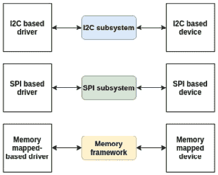
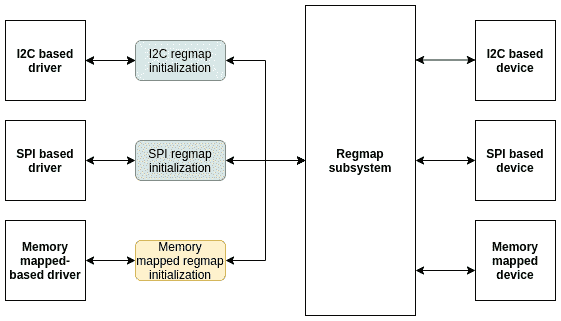

# 第十二章：*第十二章*：抽象内存访问 – Regmap API 简介：寄存器映射抽象

在开发 Regmap API 之前，处理 SPI、I2C 或内存映射设备的设备驱动程序存在冗余代码。这些驱动程序中有很多非常相似的代码用于访问硬件设备寄存器。

下图展示了在引入 Regmap 之前，SPI、I2C 和内存映射相关的 API 如何单独使用：



图 12.1 – Regmap 引入前的 I2C、SPI 和内存映射访问

Regmap API 于 Linux 内核的 v3.1 版本中引入，提出了一个解决方案，将这些相似的寄存器访问代码进行抽象并统一，节省了代码量，并使基础设施共享变得更加容易。接下来，便是如何初始化和配置 `regmap` 结构，并流畅地处理任何读写/修改操作，无论是 SPI、I2C 还是内存映射。

以下图示描述了此 API 的统一化：



图 12.2 – Regmap 引入后的 I2C、SPI 和内存映射访问

上图展示了 Regmap 如何统一设备与各自总线框架之间的事务。在本章中，我们将尽可能涵盖该框架提供的 API 的各个方面，从初始化到复杂的使用场景。

本章将通过以下主题详细讲解 Regmap 框架：

+   Regmap 数据结构简介

+   处理 Regmap 初始化

+   使用 Regmap 寄存器访问函数

+   基于 Regmap 的 SPI 驱动示例 – 整合所有内容

+   从用户空间利用 Regmap

# Regmap 数据结构简介

Regmap 框架通过 `CONFIG_REGMAP` 内核配置选项启用，由几个数据结构组成，其中最重要的是 `struct regmap_config`，它表示 Regmap 配置，和 `struct regmap`，它是 Regmap 实例本身。也就是说，所有 Regmap 数据结构都定义在 `include/linux/regmap.h` 中。因此，这个头文件必须在所有基于 Regmap 的驱动程序中包含：

```
#include <linux/regmap.h>
```

包含前述头文件足以充分利用 Regmap 框架。通过此头文件，许多数据结构将变得可用，其中 `struct regmap_config` 是最重要的，我们将在下一节中详细描述。

## 理解 `struct regmap_config` 结构体

`struct regmap_config` 存储驱动生命周期内寄存器映射的配置。你在此设置的内容会影响内存的读写操作。这是最重要的结构，定义如下：

```
struct regmap_config {
    const char *name;
    int reg_bits;
    int reg_stride;
    int pad_bits;
    int val_bits;
    bool (*writeable_reg)(struct device *dev, 
                          unsigned int reg);
    bool (*readable_reg)(struct device *dev, 
                         unsigned int reg);
    bool (*volatile_reg)(struct device *dev, 
                         unsigned int reg);
    bool (*precious_reg)(struct device *dev, 
                         unsigned int reg);
    bool disable_locking;
    regmap_lock lock;
    regmap_unlock unlock;
    void *lock_arg;
    int (*reg_read)(void *context, unsigned int reg,
                    unsigned int *val);
    int (*reg_write)(void *context, unsigned int reg,
                    unsigned int val);
    bool fast_io;
    unsigned int max_register;
    const struct regmap_access_table *wr_table;
    const struct regmap_access_table *rd_table;
    const struct regmap_access_table *volatile_table;
    const struct regmap_access_table *precious_table;
[...]
    const struct reg_default *reg_defaults;
    unsigned int num_reg_defaults;
    enum regcache_type cache_type;
    const void *reg_defaults_raw;
    unsigned int num_reg_defaults_raw;
    unsigned long read_flag_mask;
    unsigned long write_flag_mask;
    bool use_single_rw;
    bool can_multi_write;
    enum regmap_endian reg_format_endian;
    enum regmap_endian val_format_endian;
    const struct regmap_range_cfg *ranges;
    unsigned int num_ranges;
}
```

不要担心这个结构有多复杂，所有元素都是自解释的。然而，为了更清晰，下面将详细说明它们的含义：

+   `reg_bits` 是一个必填字段，它是寄存器地址中有效位的数量。这是寄存器地址的位大小。

+   `reg_stride` 表示有效寄存器地址必须是该值的倍数。如果设置为 `0`，则使用 `1` 作为默认值。如果设置为 `4`，例如，只有当地址是 `4` 的倍数时，该地址才被认为是有效的。

+   `pad_bits` 是寄存器和数值之间的填充位数。这是格式化时需要（左）移位寄存器值的位数。

+   `val_bits` 表示用于存储寄存器值的位数。它是一个必填字段。

+   `writeable_reg` 是一个可选的回调函数。如果提供，它将在需要写寄存器时由 Regmap 子系统使用。在写入寄存器之前，系统会自动调用此函数检查该寄存器是否可以写入。以下是使用该函数的示例：

    ```
    static bool foo_writeable_register(struct device *dev,
                                        unsigned int reg)
    {
        switch (reg) {
        case 0x30 ... 0x38:
        case 0x40 ... 0x45:
        case 0x50 ... 0x57:
        case 0x60 ... 0x6e:
        case 0x70 ... 0x75:
        case 0x80 ... 0x85:
        case 0x90 ... 0x95:
        case 0xa0 ... 0xa5:
        case 0xb0 ... 0xb2:
            return true;
        default:
            return false;
        }
    }
    ```

+   `readable_reg` 与 `writeable_reg` 相同，但用于所有寄存器读操作。

+   `volatile_reg` 是一个可选的回调函数，每次需要通过 Regmap 缓存读写寄存器时都会调用。如果寄存器是易失性的，该函数应返回 true。然后将直接对寄存器进行读写。如果返回 false，则表示寄存器是可缓存的。在这种情况下，读取操作将使用缓存，写入操作时缓存将被写入：

    ```
    static bool foo_volatile_register(struct device *dev,
                                        unsigned int reg)
    {
        switch (reg) {
        case 0x24 ... 0x29:
        case 0xb6 ... 0xb8:
            return true;
        default:
            return false;
        }
    }
    ```

+   `precious_reg`: 一些设备对其某些寄存器的读取很敏感，特别是像清除读中断状态寄存器这样的寄存器。设置此项后，如果指定寄存器属于此类，必须返回 true，防止核心（例如 `debugfs`）内部生成任何读取操作。这样，只有驱动程序显式读取时才允许操作。

+   `disable_locking` 表示是否应使用以下锁定/解锁回调。如果为 false，则表示不使用任何锁定机制。意味着该 `regmap` 对象要么由外部方式保护，要么保证不会被多个线程访问。

+   `lock`/`unlock` 是可选的锁定/解锁回调函数，覆盖 `regmap` 的默认锁定/解锁函数，基于自旋锁或互斥锁，具体取决于访问底层设备是否会使调用者进入休眠状态。

+   `lock_arg` 将作为锁定/解锁函数的唯一参数（如果未重写常规锁定/解锁函数，则忽略）。

+   `reg_read`: 您的设备可能不支持简单的 I2C/SPI 读操作。您将不得不编写自己的定制读函数。`reg_read` 应指向该函数。也就是说，大多数设备并不需要这样做。

+   `reg_write` 与 `reg_read` 相同，但用于写操作。

+   `fast_io`表示寄存器 IO 是快速的。如果设置该项，`regmap`将使用自旋锁而不是互斥锁来执行锁定操作。如果使用了自定义的锁/解锁函数（此处不讨论），则该字段将被忽略（请参阅内核源码中`struct regmap_config`的`lock`/`unlock`字段）。它应该仅用于“无总线”情况（MMIO 设备），因为访问 I2C、SPI 或类似总线可能会导致调用者被挂起。

+   `max_register`：这个可选元素指定了最大有效寄存器地址，超过该地址将不允许进行任何操作。

+   `wr_table`：你可以提供一个`regmap_access_table`对象，代替`writeable_reg`回调。该对象是一个结构体，包含`yes_ranges`和`no_range`字段，均为指向`struct regmap_range`的指针。任何属于`yes_range`条目的寄存器都被视为可写，而属于`no_range`条目的寄存器则被视为不可写。

+   `rd_table`与`wr_table`相同，但适用于任何读取操作。

+   `volatile_table`：你可以提供`volatile_table`代替`volatile_reg`。其原理与`wr_table`或`rd_table`相同，但适用于缓存机制。

+   `precious_table`：与上述类似，适用于珍贵寄存器。

+   `reg_defaults`是`reg_default`类型元素的数组，每个`reg_default`元素是一个`{reg, value}`结构，表示寄存器的上电复位值。与缓存一起使用，以便对该数组中存在的地址进行读取，并且自上电复位后未进行写操作时，将返回该数组中的默认寄存器值，而无需执行任何设备读取事务。一个例子是 IIO 设备驱动程序，链接如下：[`elixir.bootlin.com/linux/v5.10/source/drivers/iio/light/apds9960.c`](https://elixir.bootlin.com/linux/v5.10/source/drivers/iio/light/apds9960.c)。

+   `num_reg_defaults`是`reg_defaults`中元素的数量。

+   `cache_type`：实际的缓存类型，可以是`REGCACHE_NONE`、`REGCACHE_RBTREE`、`REGCACHE_COMPRESSED`或`REGCACHE_FLAT`。

+   `read_flag_mask`：这是读取操作时需要应用于寄存器高字节中的掩码。通常，SPI 或 I2C 中的写或读操作的高字节中的最高位被设置，以区分写操作和读操作。

+   `write_flag_mask`：写操作时需要在寄存器的高字节中设置的掩码。

+   `use_single_rw`是一个布尔值，如果设置该项，将指示寄存器映射将设备上的任何批量写入或读取操作转换为一系列单次写入或读取操作。这对于不支持批量读写的设备非常有用。

+   `can_multi_write`仅针对写操作。如果设置该项，表示该设备支持批量写操作的多重写模式。如果未设置，则多重写请求将被拆分为单独的写操作。

你可以查看`include/linux/regmap.h`获取每个元素的更多详细信息。以下是`regmap_config`初始化的示例：

```
static const struct regmap_config regmap_config = {
    .reg_bits       = 8,
    .val_bits       = 8,
    .max_register   = LM3533_REG_MAX,
    .readable_reg   = lm3533_readable_register,
    .volatile_reg   = lm3533_volatile_register,
    .precious_reg   = lm3533_precious_register,
};
```

前面的示例展示了如何构建一个基本的寄存器映射配置。尽管配置数据结构中只设置了少数几个元素，但通过学习我们描述的每个元素，可以设置更高级的配置。

现在我们已经了解了 Regmap 配置，接下来我们来看看如何使用这个配置与初始化 API 进行配合，满足我们的需求。

# 处理 Regmap 初始化

正如我们之前所说，Regmap API 支持 SPI、I2C 和内存映射寄存器访问。通过`CONFIG_REGMAP_SPI`、`CONFIG_REGMAP_I2C`和`CONFIG_REGMAP_MMIO`内核配置选项，可以在内核中启用它们各自的支持。它的功能远不止于此，还可以管理 IRQ，但这超出了本书的范围。根据驱动程序需要支持的内存访问方式，你需要在探测函数中调用`devm_regmap_init_i2c()`、`devm_regmap_init_spi()`或`devm_regmap_init_mmio()`之一。要编写通用驱动程序，Regmap 是你可以做出的最佳选择。

Regmap API 是通用且一致的，初始化只在总线类型之间有所不同。其他函数是相同的。一个好的实践是总是在探测函数中初始化寄存器映射，并且在使用以下 API 初始化寄存器映射之前，必须始终填写`regmap_config`元素：

```
struct regmap *devm_regmap_init_spi(struct spi_device *spi,
                            const struct regmap_config);
struct regmap *devm_regmap_init_i2c(struct i2c_client *i2c,
                            const struct regmap_config);
struct regmap * devm_regmap_init_mmio(
                        struct device *dev,
                        void __iomem *regs,
                        const struct regmap_config *config)
```

这些是资源管理的 API，其分配的资源会在设备离开系统或驱动程序卸载时自动释放。在前面的原型中，返回值将是指向有效的`struct regmap`对象的指针，或者在失败时返回`ERR_PTR()`错误。`regs`是指向内存映射 IO 区域的指针（由`devm_ioremap_resource()`或任何`ioremap*`系列函数返回）。`dev`是要与之交互的设备（`struct device`），在内存映射的`regmap`的情况下，`spi`和`i2c`分别是要与之交互的 SPI 或 I2C 设备，在 SPI 或 I2C 类型的`regmap`中。

调用其中一个函数即可开始与底层设备交互。无论 Regmap 是 I2C、SPI 还是内存映射寄存器映射，如果它没有通过资源管理的 API 变体进行初始化，则必须使用`regmap_exit()`函数来释放它：

```
void regmap_exit(struct regmap *map)
```

此函数简单地释放先前分配的寄存器映射。

现在寄存器访问方法已经定义，我们可以跳转到设备访问函数，这些函数允许从设备寄存器中读取或写入数据。

# 使用 Regmap 寄存器访问函数

重映射寄存器访问方法处理数据解析、格式化和传输。在大多数情况下，设备访问是通过`regmap_read()`、`regmap_write()`和`regmap_update_bits()`来执行的，这三个函数是进行设备数据读写时的重要 API。它们各自的原型如下：

```
int regmap_read(struct regmap *map, unsigned int reg,
                 unsigned int *val);
int regmap_write(struct regmap *map, unsigned int reg,
                 unsigned int val);
int regmap_update_bits(struct regmap *map,
                 unsigned int reg, unsigned int mask,
                 unsigned int val);
```

`regmap_write()` 向设备写入数据。如果在 `regmap_config` 中设置了 `max_register`，则会使用它来检查需要访问的寄存器地址是否超出范围。如果传递的寄存器地址小于或等于 `max_register`，则执行下一步操作；否则，Regmap 核心会返回无效的 I/O 错误（`-EIO`）。紧接着，调用 `writeable_reg` 回调函数。回调函数必须返回 true 才能进入下一步。如果返回 false，则返回 `-EIO`，并停止写操作。如果设置了 `wr_table` 而不是 `writeable_reg`，则会发生以下情况：

+   如果寄存器地址位于 `no_ranges` 中，则返回 `-EIO`。

+   如果寄存器地址位于 `yes_ranges` 中，则执行下一步操作。

+   如果寄存器地址不在 `yes_range` 或 `no_range` 中，则返回 `-EIO`，并终止操作。

如果 `cache_type != REGCACHE_NONE`，则启用缓存。在这种情况下，首先会使用新值更新缓存项，然后再执行硬件写入。否则，不执行缓存操作。如果提供了 `reg_write` 回调函数，则使用它来执行写操作。否则，将执行通用的 Regmap 写入功能，将数据写入指定的寄存器地址。

`regmap_read()` 从设备中读取数据。它与 `regmap_write()` 的工作方式完全相同，使用了适当的数据结构（`readable_reg` 和 `rd_table`）。因此，如果提供了 `reg_read`，则使用它来执行读取操作；否则，将执行通用的寄存器映射读取功能。

`regmap_update_bits()` 是一个三合一函数。它执行指定寄存器地址的读/修改/写周期。它是 `_regmap_update_bits` 的包装器，代码如下：

```
static int _regmap_update_bits(struct regmap *map,
             unsigned int reg, unsigned int mask,
             unsigned int val, bool *change,
             bool force_write)
{
    int ret;
    unsigned int tmp, orig;
    if (change)
        *change = false;
    if (regmap_volatile(map, reg) &&
                   map->reg_update_bits) {
        ret = map->reg_update_bits(map->bus_context,
                                   reg, mask, val);
        if (ret == 0 && change)
            *change = true;
    } else {
        ret = _regmap_read(map, reg, &orig);
        if (ret != 0)
            return ret;
        tmp = orig & ~mask;
        tmp |= val & mask;
        if (force_write || (tmp != orig)) {
            ret = _regmap_write(map, reg, tmp);
            if (ret == 0 && change)
                *change = true;
        }
    }
    return ret;
}
```

这样，你需要更新的位必须在 `mask` 中设置为 `1`，并且相应的位应设置为你需要赋予它们的值 `val`。

举个例子，若要将第一位和第三位设置为 `1`，则 `mask` 应该是 `0b00000101`，值应为 `0bxxxxx1x1`。若要清除第七位，`mask` 必须是 `0b01000000`，值应为 `0bx0xxxxxx`，依此类推。

## 批量和多个寄存器读/写的 API

`regmap_multi_reg_write()` 是允许你向设备写入多个寄存器的 API 之一。它的原型如下：

```
int regmap_multi_reg_write(struct regmap *map,
                    const struct reg_sequence *regs,
                    int num_regs)
```

在这个原型中，`regs` 是一个 `reg_sequence` 类型元素的数组，表示带有可选延迟（单位为微秒）的寄存器/值对的写入序列，延迟应用于每次写入之后。以下是该数据结构的定义：

```
struct reg_sequence {
    unsigned int reg;
    unsigned int def;
    unsigned int delay_us;
};
```

在前面的数据结构中，`reg` 是寄存器地址，`def` 是寄存器值，`delay_us` 是在寄存器写入后应用的延迟，单位为微秒。

以下是此类序列的一个用法：

```
static const struct reg_sequence foo_default_regs[] = {
    { FOO_REG1,       0xB8 },
    { BAR_REG1,       0x00 },
    { FOO_BAR_REG1,   0x10 },
    { REG_INIT,       0x00 },
    { REG_POWER,      0x00 },
    { REG_BLABLA,     0x00 },
};
static int probe ( ...)
{
    [...]
    ret = regmap_multi_reg_write(my_regmap,
                          foo_default_regs,
                          ARRAY_SIZE(foo_default_regs));
    [...]
}
```

在前面的内容中，我们学习了如何使用第一个多寄存器写入 API，该 API 接收一组寄存器及其对应的值。

还有`regmap_bulk_read()`和`regmap_bulk_write()`，可以用于从设备读取/写入多个寄存器。它们适用于大块数据，并定义如下：

```
int regmap_bulk_read(struct regmap *map,
                     unsigned int reg, void *val,
                     size_tval_count);
int regmap_bulk_write(struct regmap *map,
                      unsigned int reg,
                      const void *val, size_t val_count);
```

在前面函数的参数中，`map`是要操作的寄存器映射，`reg`是读取/写入操作开始的寄存器地址。在读取的情况下，`val`将包含读取的值；它必须被分配足够的空间来存储至少与设备本地寄存器大小相等的`count`值。在写入操作的情况下，`val`必须指向要写入设备的数据数组。最后，`count`是`val`中的元素数量。

## 理解 Regmap 缓存系统

显然，Regmap 支持数据缓存。是否使用缓存系统取决于`regmap_config`中`cache_type`字段的值。在查看`include/linux/regmap.h`时，接受的值如下：

```
/* An enum of all the supported cache types */
enum regcache_type {
   REGCACHE_NONE,
   REGCACHE_RBTREE,
   REGCACHE_COMPRESSED,
   REGCACHE_FLAT,
};
```

缓存类型默认为`REGCACHE_NONE`，意味着缓存被禁用。其他值仅定义了缓存应该如何存储。

你的设备可能在某些寄存器中有预定义的上电复位值。这些值可以存储在数组中，以便任何读取操作都返回数组中包含的值。然而，任何写入操作都会影响设备中的实际寄存器，并更新数组中的内容。这是一种我们可以用来加速设备访问的缓存。这个数组就是`reg_defaults`。查看源代码，其结构如下：

```
struct reg_default {
    unsigned int reg;
    unsigned int def;
};
```

在前面的数据结构中，`reg`是寄存器地址，`def`是寄存器的默认值。如果`cache_type`设置为 none，则会忽略`reg_defaults`。如果没有设置`default_reg`元素，但仍启用了缓存，相应的缓存结构将为你创建。

它使用起来非常简单。只需声明它，并将其作为参数传递给`regmap_config`结构体。让我们看一下`drivers/regulator/ltc3589.c`中的 LTC3589 调节器驱动程序：

```
static const struct reg_default ltc3589_reg_defaults[] = {
{ LTC3589_SCR1,   0x00 },
{ LTC3589_OVEN,   0x00 },
{ LTC3589_SCR2,   0x00 },
{ LTC3589_VCCR,   0x00 },
{ LTC3589_B1DTV1, 0x19 },
{ LTC3589_B1DTV2, 0x19 },
{ LTC3589_VRRCR,  0xff },
{ LTC3589_B2DTV1, 0x19 },
{ LTC3589_B2DTV2, 0x19 },
{ LTC3589_B3DTV1, 0x19 },
{ LTC3589_B3DTV2, 0x19 },
{ LTC3589_L2DTV1, 0x19 },
{ LTC3589_L2DTV2, 0x19 },
};
static const struct regmap_config ltc3589_regmap_config = {
        .reg_bits = 8,
        .val_bits = 8,
        .writeable_reg = ltc3589_writeable_reg,
        .readable_reg = ltc3589_readable_reg,
        .volatile_reg = ltc3589_volatile_reg,
        .max_register = LTC3589_L2DTV2,
        .reg_defaults = ltc3589_reg_defaults,
        .num_reg_defaults = ARRAY_SIZE(ltc3589_reg_defaults),
        .use_single_rw = true,
        .cache_type = REGCACHE_RBTREE,
};
```

对数组中任何一个寄存器进行读取操作时，将立即返回数组中的值。然而，写入操作会在设备本身上执行，并更新数组中受影响的寄存器。这样，读取`LTC3589_VRRCR`寄存器将返回`0xff`，并且向该寄存器写入任何值时，它会更新该寄存器在数组中的条目，以便任何新的读取操作都能直接从缓存中返回上次写入的值。

现在，我们能够使用 Regmap API 来访问设备寄存器，无论这些设备依赖于哪种底层总线，接下来是总结我们到目前为止所学到的知识，并通过一个实际的示例来展示。

# 基于 Regmap 的 SPI 驱动示例——将其整合在一起

设置 Regmap 所涉及的所有步骤，从配置到设备寄存器访问，可以列举如下：

+   根据设备的特性设置 `struct regmap_config` 对象。如果需要，可以定义寄存器范围、默认值、`cache_type` 等。如果需要自定义读/写函数，将其传递给 `reg_read`/`reg_write` 字段。

+   在 `probe` 函数中，根据与底层设备的连接类型（I2C、SPI 或内存映射）使用 `devm_regmap_init_i2c()`、`devm_regmap_init_spi()` 或 `devm_regmap_init_mmio()` 分配寄存器映射。

+   每当需要读/写寄存器时，调用 `remap_[read|write]` 函数。

+   当寄存器映射完成后，假设你使用了资源管理 API，devres 核心会负责释放 Regmap 资源，无需其他操作；否则，你必须调用 `regmap_exit()` 来释放在 probe 中分配的寄存器映射。

现在让我们在一个实际的驱动示例中实现这些步骤，利用 Regmap 框架的优势。

## 一个 Regmap 示例

为了实现我们的目标，首先让我们描述一个假设的 SPI 设备，以便我们可以使用 Regmap 框架编写驱动。为了便于理解，假设该设备具有以下特性：

+   该设备支持 8 位寄存器寻址和 8 位寄存器值。

+   该设备中可访问的最大地址是 `0x80`（这并不一定意味着该设备有 `0x80` 个寄存器）。

+   写掩码是 `0x80`，有效地址范围如下：

    +   `0x20` 到 `0x4F`

    +   `0x60` 到 `0x7F`

+   由于该设备支持简单的 SPI 读/写操作，因此无需提供自定义的读/写函数。

现在我们完成了设备和 Regmap 规范的定义，可以开始编写代码了。

以下是处理 Regmap 所需的头文件：

```
#include <linux/regmap.h>
```

根据驱动中所需的 API，可能还需要包括其他头文件。

接下来，我们按如下方式定义私有数据结构：

```
struct private_struct
{
    /* Feel free to add whatever you want here */
    struct regmap *map;
    int foo;
};
```

然后，我们定义一个读/写寄存器范围，即允许访问的寄存器：

```
static const struct regmap_range wr_rd_range[] =
{
    {
            .range_min = 0x20,
            .range_max = 0x4F,
    },{
            .range_min = 0x60,
            .range_max = 0x7F
    },
}; 
struct regmap_access_table drv_wr_table =
{
    .yes_ranges =   wr_rd_range,
    .n_yes_ranges = ARRAY_SIZE(wr_rd_range),
};
struct regmap_access_table drv_rd_table =
{
    .yes_ranges =   wr_rd_range,
    .n_yes_ranges = ARRAY_SIZE(wr_rd_range),
};
```

然而，必须注意，如果设置了 `writeable_reg` 和/或 `readable_reg`，则无需提供 `wr_table` 和/或 `rd_table`。

之后，我们定义回调函数，该函数将在每次进行写或读操作时调用。每个回调必须返回 `true`，如果允许对寄存器执行指定的操作：

```
static bool writeable_reg(struct device *dev,
                          unsigned int reg)
{
    if (reg>= 0x20 &&reg<= 0x4F)
        return true;
    if (reg>= 0x60 &&reg<= 0x7F)
        return true;
    return false;
}
static bool readable_reg(struct device *dev,
                         unsigned int reg)
{
    if (reg>= 0x20 &&reg<= 0x4F)
        return true;
    if (reg>= 0x60 &&reg<= 0x7F)
        return true;
    return false;
}
```

既然所有与 Regmap 相关的操作都已定义，我们可以按如下方式实现驱动的 `probe` 方法：

```
static int my_spi_drv_probe(struct spi_device *dev)
{
    struct regmap_config config;
    struct private_struct *priv;
    unsigned char data;
    /* setup the regmap configuration */
    memset(&config, 0, sizeof(config));
    config.reg_bits = 8;
    config.val_bits = 8;
    config.write_flag_mask = 0x80;
    config.max_register = 0x80;
    config.fast_io = true;
    config.writeable_reg = drv_writeable_reg;
    config.readable_reg = drv_readable_reg;
    /* 
     * If writeable_reg and readable_reg are set,
     * there is no need to provide wr_table nor rd_table.
     * Uncomment below code only if you do not want to use
     * writeable_reg nor readable_reg.
     */
    //config.wr_table = drv_wr_table;
    //config.rd_table = drv_rd_table;
    /* allocate the private data structures */
    /* priv = kzalloc */
    /* Init the regmap spi configuration */
    priv->map = devm_regmap_init_spi(dev, &config);
    /* Use devm_regmap_init_i2c in case of i2c bus */
    /* 
     * Let us write into some register
     * Keep in mind that, below operation will remain same
     * whether you use SPI, I2C, or memory mapped Regmap.
     * It is and advantage when you use regmap.
     */ 
    regmap_read(priv->map, 0x30, &data);
    [...] /* Process data */
    data = 0x24;
    regmap_write(priv->map, 0x23, data); /* write new value */
    /* set bit 2 (starting from 0) and bit 6
     * of register 0x44 */
    regmap_update_bits(priv->map, 0x44,
                       0b00100010, 0xFF);
    [...] /* Lot of stuff */     
    return 0;
}
```

在前面的 `probe` 方法中，命令比代码还要多。我们仅仅需要展示如何将设备规格转换为寄存器映射配置，并将其用作访问设备寄存器的主要方法。

现在我们已经完成了内核中的 Regmap 部分，接下来我们将在下一节中展示用户空间如何充分利用该框架。

# 从用户空间使用 Regmap

可以通过 debugfs 文件系统从用户空间监控寄存器映射。首先，需要通过`CONFIG_DEBUG_FS`内核配置选项启用 debugfs。然后，可以使用以下命令挂载 debugfs：

```
mount -t debugfs none /sys/kernel/debug
```

此后，debugfs 寄存器映射实现可以在`/sys/kernel/debug/regmap/`下找到。这个由`drivers/base/regmap/regmap-debugfs.c`实现的 debugfs 视图包含基于 Regmap API 的驱动程序/外设的寄存器缓存（镜像）。

从 Regmap 主调试文件系统（debugfs）目录中，我们可以使用以下命令获取基于 Regmap API 的驱动程序的设备列表：

```
root@jetson-nano-devkit:~# ls -l /sys/kernel/debug/regmap/
drwxr-xr-x   2 root  root   0 Jan  1  1970 4-003c-power-slave
drwxr-xr-x   2 root  root   0 Jan  1  1970 4-0068
drwxr-xr-x   2 root  root   0 Jan  1  1970 700e3000.mipical
drwxr-xr-x   2 root  root   0 Jan  1  1970 702d3000.amx
drwxr-xr-x   2 root  root   0 Jan  1  1970 702d3100.amx
drwxr-xr-x   2 root  root   0 Jan  1  1970 hdaudioC0D3-hdaudio
drwxr-xr-x   2 root  root   0 Jan  1  1970 tegra210-admaif
drwxr-xr-x   2 root  root   0 Jan  1  1970 tegra210-adx.0
[...]
root@jetson-nano-devkit:~#
```

在每个目录中，可能包含以下一个或多个文件：

+   `access`：对每个寄存器的各种访问权限进行编码，模式为`readable writable volatile precious`：

    ```
    root@jetson-nano-devkit:~# cat /sys/kernel/debug/regmap/4-003c-power-slave/access 
    00: y y y n
    01: y y y n
    02: y y y n
    03: y y y n
    04: y y y n
    05: y y y n
    06: y y y n
    07: y y y n
    08: y y y n
    [...]
    5c: y y y n
    5d: y y y n
    5e: y y y n
    ```

例如，`5e: y y y n`这一行表示地址为`5e`的寄存器是可读的、可写的、易失的，但不是珍贵的。

+   `name`：与寄存器映射相关联的驱动程序名称。检查相应的驱动程序。例如，`702d3000.amx`寄存器映射条目：

    ```
    root@jetson-nano-devkit:~# cat /sys/kernel/debug/regmap/702d3000.amx/name 
    tegra210-amx
    ```

然而，有些 Regmap 条目以`dummy-`开头，如下所示：

```
root@raspberrypi4-64:~# ls -l /sys/kernel/debug/regmap/
drwxr-xr-x  2 root root 0 Jan 1 1970 dummy-avs-monitor@fd5d2000
root@raspberrypi4-64:~#
```

当没有关联的`/dev`条目（`devtmpfs`）时，设置这种条目。您可以通过打印底层设备名称来检查这一点，名称将为`nodev`，如下所示：

```
root@raspberrypi4-64:~# cat /sys/kernel/debug/regmap/dummy-avs-monitor\@fd5d2000/name 
nodev
root@raspberrypi4-64:~#
```

您可以查找`dummy-`后缀名称，以便在设备树中找到相关节点，例如，`dummy-avs-monitor@fd5d2000`：

```
avs_monitor: avs-monitor@7d5d2000 {
    compatible = "brcm,bcm2711-avs-monitor",
                 "syscon", "simple-mfd";
    reg = <0x7d5d2000 0xf00>;
[...]
};
```

+   `cache_bypass`：将寄存器映射置于仅缓存模式。如果启用，写入寄存器映射将仅更新硬件，而不会直接更新缓存：

    ```
    root@jetson-nano-devkit:~# cat /sys/kernel/debug/regmap/702d3000.amx/cache_bypass 
    N
    ```

要启用缓存绕过，您应该在此文件中回显`Y`，如下所示：

```
root@jetson-nano-devkit:~# echo Y > /sys/kernel/debug/regmap/702d30[579449.571475] tegra210-amx tegra210-amx.0: debugfs cache_bypass=Y forced
00.amx/cache_bypass 
root@jetson-nano-devkit:~#
```

这将额外在内核日志缓冲区中打印一条消息。

+   `cache_dirty`：表示硬件寄存器已重置为默认值，并且硬件寄存器与缓存状态不匹配。读取的值可以是`Y`或`N`。

+   `cache_only`：在此文件中回显`N`将禁用此寄存器映射的缓存，同时触发缓存同步，而写入`Y`将强制此寄存器映射仅缓存。当读取此文件的值时，将根据当前启用的缓存状态返回`Y`或`N`。在此值为`true`时发生的任何写入都会被缓存（只会更新寄存器缓存，不会发生硬件更改）。

+   `range`：寄存器映射的有效寄存器范围：

    ```
    root@jetson-nano-devkit:~# cat /sys/kernel/debug/regmap/4-003c-power-slave/range 
    0-5e
    ```

+   `rbtree`：提供`rbtree`缓存增加的内存开销：

    ```
    root@jetson-nano-devkit:~# cat /sys/kernel/debug/regmap/4-003c-power-slave/rbtree 
    0-5e (95)
    1 nodes, 95 registers, average 95 registers, used 175 bytes
    ```

+   `registers`：用于读取和写入与寄存器映射关联的实际寄存器的文件：

    ```
    root@jetson-nano-devkit:~# cat /sys/kernel/debug/regmap/4-003c-power-slave/registers 
    00: d2
    01: 1f
    02: 00
    03: dc
    04: 0f
    05: 00
    06: 00
    07: 00
    08: 02
    [...]
    5c: 35
    5d: 81
    5e: 00
    #
    ```

在前面的输出中，首先显示寄存器地址，然后显示其内容。

本节非常简短，但简明扼要地描述了来自用户空间的 Regmap 监控。它允许读取和写入寄存器内容，并在某些情况下更改底层 Regmap 的行为。

# 总结

本章专注于与寄存器访问相关的 Regmap API。它的简单性应该能让你了解它有多么有用和广泛应用。本章展示了你需要了解的所有关于 Regmap API 的内容。现在你应该能够将任何标准的 SPI/I2C/内存映射驱动程序转换为 Regmap 驱动程序。

下一章将介绍 Linux 下的 IRQ 管理，然而在接下来的两章中，我们将讲解 IIO 设备，这是一种用于模拟到数字转换器的框架。这类设备通常位于 SPI/I2C 总线之上。对于我们来说，可能会面临一个挑战，那就是在本章结束时，使用 Regmap API 编写一个 IIO 驱动程序。
