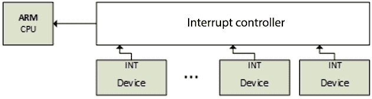
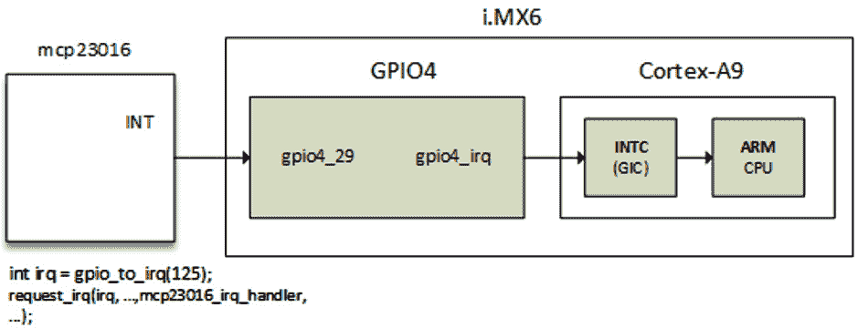

# 第十三章：*第十三章*：解密内核 IRQ 框架

Linux 是一个系统，在该系统中，设备通过**中断请求**（**IRQs**）通知内核事件，尽管某些设备是轮询的。CPU 显示 IRQ 线路，无论是否共享，供连接的设备使用，以便当设备需要 CPU 时，它会向 CPU 发送请求。当 CPU 收到请求时，它会停止当前工作并保存其上下文，以便处理设备发出的请求。在处理完设备请求后，CPU 会恢复到中断发生时停止的状态。

在本章中，我们将处理内核提供的用于管理 IRQ 的 API，以及如何进行多路复用。此外，我们还将分析并深入探讨**中断控制器**驱动的编写。

总结一下，本章将涵盖以下主题：

+   中断的简要介绍

+   理解中断控制器和中断多路复用

+   深入探讨高级外设 IRQ 管理

+   解密每个 CPU 的中断

# 中断的简要介绍

在许多平台上，有一个特殊的设备负责管理 IRQ 线路。这个设备就是中断控制器，它位于 CPU 和它所管理的中断线路之间。下面是一个展示发生交互的图示：



图 13.1 – 中断控制器与 IRQ 线路

不仅设备可以产生中断，一些处理器操作也可以。由此产生两种不同类型的中断：

+   同步中断，称为**异常**，是由 CPU 在处理指令时产生的。这些是**不可屏蔽中断**（**NMIs**），通常由硬件故障等严重故障引起。它们总是由 CPU 处理。

+   异步中断，称为**中断**，由其他硬件设备发出。这些是正常的并且是**可屏蔽中断**。这些是本章接下来部分将讨论的内容。

在深入了解 Linux 内核中的中断管理之前，我们先谈谈异常。

异常是编程错误的结果，由内核处理，内核会向程序发送信号并尝试从错误中恢复。这些错误分为两类，列举如下：

+   **处理器检测到的异常**：这些是 CPU 在响应异常情况时产生的异常，可分为三类：

    +   故障，通常可以纠正（虚假的指令）。

    +   陷阱，通常发生在用户进程中（无效的内存访问、除以零），也是一种响应系统调用而切换到内核模式的机制。如果内核代码导致了陷阱，它会立即引发 panic。

    +   中止 – 严重错误。

+   **程序化异常**：这些是由程序员请求的，并像陷阱一样处理。

现在我们已经介绍了不同类型的中断，接下来让我们学习它们在中断控制器中的实现。

# 理解中断控制器和中断复用。

来自 CPU 的单一中断通常不足以满足需求。大多数系统有数十个或数百个中断。此时就需要中断控制器，它允许这些中断进行复用。架构或平台特定的实现通常会提供一些特定的功能，如下所示：

+   屏蔽/解除屏蔽单个中断

+   设置优先级。

+   SMP 亲和性。

+   异常特性，例如唤醒中断。

IRQ 管理和中断控制器驱动都依赖于 IRQ 域的概念，该概念基于以下结构：

+   `struct irq_chip`：这是中断控制器的数据结构。该结构还实现了一组方法，用于驱动中断控制器，并且这些方法是由核心 IRQ 代码直接调用的。

+   `struct irqdomain`：该结构提供以下选项：

    +   指向中断控制器固件节点的指针（`fwnode`）

    +   用于将 IRQ 的固件描述转换为此中断控制器本地的 ID（`hwirq`，也称为硬件 IRQ 编号）的函数。

    +   一种从`hwirq`中获取 IRQ 的 Linux 视图（`virq`，也称为虚拟 IRQ 编号）的方法。

+   `struct irq_desc`：该结构是 Linux 对中断的表示。它包含有关中断的所有信息，并与 Linux 中断编号一一对应。

+   `struct irq_action`：该结构用于描述 IRQ 处理程序。

+   `struct irq_data`：该结构嵌套在`struct irq_desc`结构中，并提供以下信息：

    +   与管理此中断的 IRQ 芯片相关的数据。

    +   包含`virq`和`hwirq`。

    +   指向`struct irq_chip`（IRQ 芯片数据结构）的指针。请注意，大多数与 IRQ 芯片相关的函数调用都将`irq_data`作为参数传递，通过它可以获取相应的`struct irq_desc`。

上述所有数据结构都是 IRQ 域 API 的一部分。中断控制器在内核中由`struct irq_chip`结构的一个实例表示，该结构描述了实际的硬件设备，以及 IRQ 核心使用的一些方法。以下代码块展示了它的定义：

```
struct irq_chip {
    struct device    *parent_device;
    const char       *name;
    void   (*irq_enable)(struct irq_data *data);
    void   (*irq_disable)(struct irq_data *data);
    void   (*irq_ack)(struct irq_data *data);
    void   (*irq_mask)(struct irq_data *data);
    void   (*irq_unmask)(struct irq_data *data);
    void   (*irq_eoi)(struct irq_data *data);
    int    (*irq_set_affinity)(struct irq_data *data,
                const struct cpumask *dest, bool force);
    int    (*irq_retrigger)(struct irq_data *data);
    int    (*irq_set_type)(struct irq_data *data,
                           unsigned int flow_type);
    int    (*irq_set_wake)(struct irq_data *data,
                           unsigned int on);
    void   (*irq_bus_lock)(struct irq_data *data);
    void   (*irq_bus_sync_unlock)(struct irq_data *data);
    int   (*irq_get_irqchip_state)(struct irq_data *data,
               enum irqchip_irq_state which, bool *state);
    int   (*irq_set_irqchip_state)(struct irq_data *data,
               enum irqchip_irq_state which, bool state);
    void  (*ipi_send_single)(struct irq_data *data, 
                              unsigned int cpu);
   void   (*ipi_send_mask)(struct irq_data *data,
                           const struct cpumask *dest);
    unsigned long    flags;
};
```

以下列表解释了结构中各个元素的含义：

+   `parent_device`：这是指向此 IRQ 芯片父设备的指针。

+   `name`：这是`/proc/interrupts`文件的名称。

+   `irq_enable`：该钩子用于启用中断。如果未设置（即`NULL`），则默认为`chip->unmask`。

+   `irq_disable`：该函数用于禁用中断。

+   `irq_ack`：该回调函数用于确认一个中断。`handle_edge_irq()` 会在任何情况下调用该函数，因此对于使用 `handle_edge_irq()` 来处理中断的 IRQ 控制器驱动程序，必须定义此回调函数（即使是空壳函数）。对于这样的控制器，此回调函数会在中断开始时被调用。有些控制器不需要这个函数。Linux 在中断被触发后立即调用此函数，远在处理中断之前。某些实现中此函数被映射到 `chip->disable()`，以便如果有另一个中断请求在线路上，当前中断请求处理完之前不会再次触发中断。

+   `irq_mask`：这是一个钩子函数，用于在硬件中屏蔽中断源，以便该中断不再被触发。

+   `irq_unmask`：该钩子函数用于解除中断源的屏蔽。

+   `irq_eoi`：Linux 调用此 `chip->enable()` 来逆转 `chip->ack()` 中执行的操作。

+   `irq_set_affinity`：此函数仅在 SMP 机器上设置 CPU 亲和性。在这样的机器上，此函数用于指定处理中断的 CPU。单处理器环境中不使用此函数，因为中断始终在同一个 CPU 上处理。

+   `irq_retrigger`：此函数会在硬件中重新触发中断，从而将 IRQ 重新发送到 CPU。

+   `irq_set_type`：此函数设置 IRQ 的流类型，例如 `IRQ_TYPE_LEVEL`。

+   `irq_set_wake`：此函数用于启用/禁用 IRQ 的电源管理唤醒功能。

+   `irq_bus_lock`：此函数用于锁定对慢速总线（I2C）芯片的访问。在这里锁定一个互斥量就足够了。

+   `irq_bus_sync_unlock`：此函数同步并解锁慢速总线（I2C）芯片，同时解锁先前锁定的互斥量。

+   `irq_get_irqchip_state` 和 `irq_set_irqchip_state`：这两个函数分别用于返回或设置中断的内部状态。

+   `ipi_send_single` 和 `ipi_send_mask`：这两个函数分别用于向单个 CPU 或通过掩码定义的一组 CPU 发送 **处理器间中断**（**IPIs**）。在 SMP 系统中，IPIs 用于从本地 CPU 生成 CPU 远程中断。我们将在本章的 *破解每个 CPU 中断* 部分讨论这一点。

每个中断控制器都有一个域，这个域对控制器的作用类似于地址空间对进程的作用（参见 *第十章*，*理解 Linux 内核内存分配*）。中断控制器域在内核中通过 `struct irq_domain` 结构来描述。它管理硬件 IRQ 编号与 Linux IRQ 编号（即虚拟 IRQ）之间的映射。它是硬件中断编号转换对象。以下代码块展示了其定义：

```
struct irq_domain {
    const char *name;
    const struct irq_domain_ops *ops;
    void *host_data;
    unsigned int flags;
    unsigned int mapcount;
    /* Optional data */
    struct fwnode_handle *fwnode;
    [...]
};
```

为了可读性，只有与我们相关的元素被列出。以下列表告诉我们它们的含义：

+   `name`：这是中断域的名称。

+   `ops`：这是指向 IRQ 域方法的指针。

+   `host_data`：这是一个供拥有者使用的私有数据指针。IRQ 域核心代码不会修改它。

+   `flags`：这是每个 IRQ 域的标志。

+   `mapcount`：这是该 IRQ 域中已映射的中断数量。

+   与所有其他元素一样，`fwnode`是可选的。它是指向与 IRQ 域相关联的**设备树**（**DT**）节点的指针。用于解码 DT 中断说明符。

中断控制器驱动程序通过调用其中一个`irq_domain_add_<mapping_method>()`函数来创建并注册 IRQ 域，其中`<mapping_method>`是`hwirq`应如何映射到 Linux `virq`的映射方法。这些函数在下列列表中有详细描述：

+   `irq_domain_add_linear()`：该函数使用一个由`hwirq`编号索引的固定大小表。当一个`hwirq`编号被映射时，会为该`hwirq`分配一个`irq_desc`对象，并将 IRQ 编号存储在表中。这种线性映射适用于`hwirq`数量固定且较少的控制器或域（~ < 256）。这种映射的不便之处在于表的大小，它的大小与最大的`hwirq`编号相同。因此，IRQ 编号查找时间是固定的，IRQ 描述符只会为正在使用的 IRQ 分配。大多数驱动程序应使用线性映射。该函数的原型如下所示：

    ```
    struct irq_domain *irq_domain_add_linear(
                       struct device_node *of_node,
                       unsigned int size,
                       const struct irq_domain_ops *ops,
                       void *host_data)
    ```

+   `irq_domain_add_tree()`：使用这种映射，IRQ 域在基数树中维护`virqs`（Linux IRQ 编号）和`hwirq`（硬件中断编号）之间的映射。当一个`hwirq`被映射时，会分配一个`irq_desc`对象，并将该硬件 IRQ 编号用作基数树的查找键。如果`hwirq`编号可能非常大，那么树形映射是一个可行的解决方案，因为它不需要分配一个和最大`hwirq`编号一样大的表。缺点是，`hwirq`到 IRQ 编号的查找会受到表中条目数量的影响。只有极少数驱动程序需要这种映射。内核中使用此 API 的用户不到 10 个。它的原型如下所示：

    ```
    struct irq_domain *irq_domain_add_tree(
                      struct device_node *of_node,
                      const struct irq_domain_ops *ops,
                      void *host_data)
    ```

+   `irq_domain_add_nomap()`：你可能永远不会使用这种方法。不过，它的完整描述可以在`Documentation/IRQ-domain.txt`中找到，位于内核源代码树中。其原型如下所示：

    ```
    struct irq_domain *irq_domain_add_nomap(
                       struct device_node *of_node,
                       unsigned int max_irq,
                       const struct irq_domain_ops *ops,
                       void *host_data)
    ```

在这些函数中，`of_node`是指向中断控制器的 DT 节点的指针。`size`对应于域中中断的数量。`ops`表示映射/取消映射域的回调，`host_data`是控制器的私有数据指针。

当 IRQ 域最初创建时，它是空的（没有映射）。当 IRQ 芯片驱动程序调用`irq_create_mapping()`时，会创建并添加映射，函数原型如下所示：

```
unsigned int irq_create_mapping(struct irq_domain 
              *domain, irq_hw_number_t hwirq)
```

在前面的函数中，`domain`是此硬件中断所属的域，或者为`NULL`表示默认域；`hwirq`表示该域空间中的硬件中断编号。

如果 `hwirq` 数字在 IRQ 域中还不存在映射，该函数将分配一个新的 Linux IRQ 描述符（`struct irq_desc`）结构，同时返回一个虚拟中断号。然后，它将通过 `irq_domain_associate()` 函数将其与 `hwirq` 数字关联（该函数又调用 `irq_domain_ops.map` 回调，以便驱动程序可以执行任何所需的硬件设置）。为了理解这一段，我们需要描述 IRQ 域操作数据结构（`struct irq_domain_ops`），该结构在下面的代码块中定义：

```
struct irq_domain_ops {
    int (*map)(struct irq_domain *d, unsigned int virq,
          irq_hw_number_t hw);
    void (*unmap)(struct irq_domain *d, 
                   unsigned int virq);
    int (*xlate)(struct irq_domain *d, 
                   struct device_node *node,
                   const u32 *intspec,
                   unsigned int intsize,
                   unsigned long *out_hwirq, 
                   unsigned int *out_type);
[...]
};
```

数据结构中的元素已限制在本章的范围内。然而，完整的数据结构可以在内核源代码的 `include/linux/irqdomain.h` 中找到。以下列表告诉我们已列举元素的含义：

+   `map`: 这个回调函数创建或更新 `virq` 数字和 `hwirq` 数字之间的映射。该回调函数对于给定的映射只会被调用一次。它通常使用 `irq_set_chip_and_handler()` 将 `virq` 数字与给定的处理程序映射，以便调用 `generic_handle_irq()` 或 `handle_nested_irq()` 时触发该处理程序。`irq_set_chip_and_handler()` 函数定义如下所示：

    ```
    void irq_set_chip_and_handler(unsigned int irq,
                              struct irq_chip *chip,
                              irq_flow_handler_t handle)
    ```

在此函数中，`irq` 是作为参数传递给 `map()` 函数的 Linux IRQ，而 `chip` 是你的 IRQ 芯片。然而，有些虚拟控制器几乎不需要在其 `irq_chip` 结构中做任何事情。在这种情况下，驱动程序传递 `dummy_irq_chip`，它在 `kernel/irq/dummychip.c` 中定义，是为这类控制器预定义的内核 `irq_chip` 结构。`handle` 决定了中断流处理器，它是调用通过 `request_irq()` 注册的实际处理器的那个。它的值取决于 IRQ 是边沿触发还是电平触发。在两种情况下，`handle` 应设置为 `handle_edge_irq` 或 `handle_level_irq`。这两者都是内核帮助函数，在调用真实的 IRQ 处理程序之前和之后执行一些操作。示例如下所示：

```
static int ativic32_irq_domain_map(
                struct irq_domain *id,
                unsigned int virq, 
                irq_hw_number_t hw)
{
[...]
    if (int_trigger_type & (BIT(hw))) {
        irq_set_chip_and_handler(virq, 
                     &ativic32_chip,
                     handle_edge_irq);
        type = IRQ_TYPE_EDGE_RISING;
    } else {
        irq_set_chip_and_handler(virq, 
                     &ativic32_chip, 
                     handle_level_irq);
        type = IRQ_TYPE_LEVEL_HIGH;
    }
    irqd_set_trigger_type(irq_data, type);
    return 0;
}
```

+   `xlate`: 给定一个带有中断说明符的设备树节点，该钩子解码该说明符中的硬件中断号及其对应的 Linux 中断类型值。根据设备树控制器节点中指定的 `#interrupt-cells` 值，内核提供通用的翻译函数：

    +   `irq_domain_xlate_twocell()`: 用于直接两单元绑定的通用翻译函数。它与具有两单元绑定的设备树 IRQ 说明符一起工作，其中单元值直接映射到 `hwirq` 数字和 Linux IRQ 标志。

    +   `irq_domain_xlate_onecell()`: 一种通用的 `xlate` 方法，用于直接一单元绑定。

    +   `Irq_domain_xlate_onetwocell()`: 一种通用的 `xlate` 方法，用于一或两单元绑定。

域操作的示例如下所示：

```
static struct irq_domain_ops mcp23016_irq_domain_ops = {
    .map    = mcp23016_irq_domain_map,
    .xlate  = irq_domain_xlate_twocell,
};
```

当接收到中断时，`irq_find_mapping()` 函数会用来从 `hwirq` 编号查找 Linux IRQ 编号。当然，映射必须在返回之前存在。Linux IRQ 编号总是与一个 `struct irq_desc` 结构关联，后者是 Linux 描述 IRQ 的结构，定义如下：

```
struct irq_desc {
    struct irq_data        irq_data;
    unsigned int __percpu  *kstat_irqs;
    irq_flow_handler_t     handle_irq;
    struct irqaction       *action;
    unsigned int           irqs_unhandled;
    raw_spinlock_t         lock;
    struct cpumask         *percpu_enabled;
    atomic_t               threads_active;
    wait_queue_head_t      wait_for_threads;
#ifdef CONFIG_PM_SLEEP
    unsigned int           nr_actions;
    unsigned int           no_suspend_depth;
    unsigned int           force_resume_depth;
#endif
#ifdef CONFIG_PROC_FS
    struct proc_dir_entry   *dir;
#endif
    Int               parent_irq;
    struct module     *owner;
    const char        *name;
};
```

该数据结构中的一些字段故意缺失。其余字段的定义如下：

+   `kstat_irqs`：这是自启动以来每个 CPU 的 IRQ 统计信息。

+   `handle_irq`：这是高级的 IRQ 事件处理程序。

+   `action`：表示该描述符的 IRQ 动作列表。

+   `irqs_unhandled`：这是处理未被处理的虚假中断的统计字段。

+   `lock`：表示 SMP 的锁定。

+   `threads_active`：当前为该描述符运行的 IRQ 动作线程数量。

+   `wait_for_threads`：表示 `sync_irq` 等待线程处理程序的等待队列。

+   `nr_actions`：这是安装在该描述符上的动作数量。

+   `no_suspend_depth` 和 `force_resume_depth`：表示在具有 `IRQF_NO_SUSPEND` 或 `IRQF_FORCE_RESUME` 标志的 IRQ 描述符上 `irqaction` 实例的数量。

+   `dir`：表示 `/proc/irq/` 的 procfs 条目。

+   `name`：命名流处理程序，在 `/proc/interrupts` 输出中可见。

在注册中断处理程序时，该处理程序会被添加到与该中断线关联的 `irq_desc.action` 列表的末尾。例如，每次调用 `request_irq()`（或者线程版本的 `request_threaded_irq()`）都会创建并将一个 `struct irqaction` 结构添加到 `irq_desc.action` 列表的末尾（知道 `irq_desc` 是该中断的描述符）。对于共享中断，该字段将包含与注册的处理程序数量相等的 `irqaction` 对象。IRQ 动作数据结构的定义如下：

```
struct irqaction {
    irq_handler_t     handler;
    void              *dev_id;
    void __percpu     *percpu_dev_id;
    struct irqaction  *next;
    irq_handler_t     thread_fn;
    struct task_struct     *thread;
    unsigned int      irq;
    unsigned int      flags;
    unsigned long     thread_flags;
    unsigned long     thread_mask;
    const char        *name;
    struct proc_dir_entry   *dir;
};
```

该数据结构中每个元素的含义如下：

+   `handler`：这是非线程的（硬）中断处理程序函数。

+   `name`：设备名称。

+   `dev_id`：这是一个标识符，用于识别设备。

+   `percpu_dev_id`：这是一个每个 CPU 的标识符，用于识别设备。

+   `next`：这是指向共享中断的下一个 IRQ 动作的指针。

+   `irq`：这是 Linux 中断号（`virq`）。

+   `flags`：表示 IRQ 标志（见 `IRQF_*`）。

+   `thread_fn`：这是线程中断处理程序函数，适用于线程中断。

+   `thread`：这是指向线程结构的指针，适用于线程中断。

+   `thread_flags`：表示与线程相关的标志。

+   `thread_mask`：这是用于跟踪线程活动的位掩码。

+   `dir`：指向 `/proc/irq/NN/<name>/` 条目。

以下是 `struct irq_data` 结构中重要字段的定义，它是每个 IRQ 芯片的数据，传递给芯片函数：

```
struct irq_data {
    [...]
    unsigned int     irq;
    unsigned long           hwirq;
    struct irq_chip         *chip;
    struct irq_domain *domain;
    void              *chip_data;
};
```

以下列表给出了该数据结构中元素的含义：

+   `irq`: 这是中断编号（Linux IRQ 编号）。

+   `hwirq`: 这是硬件中断编号，局部于 `irq_data.domain` 中断域。

+   `chip`: 这是低级中断控制器硬件访问。

+   `domain`: 这是中断翻译域，负责在 `hwirq` 编号和 Linux IRQ 编号之间进行映射。

+   `chip_data`: 这是平台特定的、每个芯片私有的数据，用于芯片方法，以便共享芯片实现。

既然我们已经熟悉了 IRQ 框架的数据结构，我们可以更进一步，研究中断是如何被请求并在处理链中传播的。

# 深入研究高级外设 IRQ 管理

在 *第三章*，*处理内核核心助手* 中，我们介绍了外设 IRQ，使用 `request_irq()` 和 `request_threaded_irq()`。在前者中，您注册一个处理程序（上半部），该处理程序将在原子上下文中执行，从中您可以使用本章讨论的机制之一调度下半部。而在 `_threaded` 变体中，您可以为函数提供上半部和下半部，这样前者将作为硬 IRQ 处理程序运行，可能会决定是否提升第二个并在线程中运行的处理程序。

这些方法的问题在于，有时请求 IRQ 的驱动程序并不了解提供此 IRQ 线路的中断控制器的性质，尤其是在中断控制器是独立芯片（通常是通过 SPI 或 I2C 总线连接的 GPIO 扩展器）时。此时，`request_any_context_irq()` 函数应运而生，驱动程序请求 IRQ 时，可以知道处理程序是否会在线程上下文中运行，并相应地调用 `request_threaded_irq()` 或 `request_irq()`。这意味着，无论与我们的设备相关的 IRQ 是来自可能不会休眠的中断控制器（内存映射的）还是来自能够休眠的中断控制器（通过 I2C/SPI 总线），都不需要更改代码。其原型如下代码块所示：

```
int request_any_context_irq(unsigned int irq,
                            irq_handler_t handler,
                            unsigned long flags,
                            const char * name,
                            void * dev_id);
```

下面是函数中每个参数的含义：

+   `irq`: 这是要分配的中断线。

+   `handler`: 这是 IRQ 发生时调用的函数。根据上下文，这个函数可能作为硬 IRQ 运行，也可能是线程化的。

+   `flags`: 这是中断类型标志。与 `request_irq()` 中的标志相同。

+   `name`: 这将用于调试目的，在 `/proc/interrupts` 中命名中断。

+   `dev_id`: 这是一个传递回处理函数的 cookie。

`request_any_context_irq()` 表示你可以获得硬中断或线程中断。它的工作方式与常规的 `request_irq()` 相同，不同之处在于它会检查 IRQ 是否配置为嵌套中断，并调用正确的后端。换句话说，它根据上下文选择硬中断或线程处理方法。此函数在失败时返回负值。成功时，它返回 `IRQC_IS_HARDIRQ` 或 `IRQC_IS_NESTED`。以下代码块展示了一个用例：

```
static irqreturn_t packt_btn_interrupt(int irq,
                                        void *dev_id)
{
    struct btn_data *priv = dev_id;
    input_report_key(priv->i_dev, BTN_0,
                   gpiod_get_value(priv->btn_gpiod) & 1);
    input_sync(priv->i_dev);
    return IRQ_HANDLED;
}
static int btn_probe(struct platform_device *pdev)
{
    struct gpio_desc *gpiod;
    int ret, irq;
    [...]
    gpiod = gpiod_get(&pdev->dev, "button", GPIOD_IN);
    if (IS_ERR(gpiod))
        return -ENODEV;
    priv->irq = gpiod_to_irq(priv->btn_gpiod);
    priv->btn_gpiod = gpiod;
    [...]
    ret = request_any_context_irq(
            priv->irq,
            packt_btn_interrupt,
            (IRQF_TRIGGER_FALLING | IRQF_TRIGGER_RISING),
            "packt-input-button", priv);
    if (ret < 0) {
        dev_err(&pdev->dev,
           "Unable to request GPIO interrupt line\n");
        goto err_btn;
    }
    return ret;
}
```

上述代码摘自一个输入设备驱动的示例。使用 `request_any_context_irq()` 的优点是，你不需要关心 IRQ 处理程序可以做什么，因为处理程序运行的上下文取决于提供 IRQ 线路的中断控制器。在我们的示例中，如果 GPIO 属于一个通过 I2C 或 SPI 总线连接的控制器，那么处理程序将是线程化的。否则（内存映射），处理程序将在硬中断上下文中运行。

## 理解 IRQ 和传播

假设我们有一个 GPIO 控制器，其中断线路连接到 SoC 上的本地 GPIO，如下图所示：



图 13.2 – 中断传播

IRQ 始终基于 Linux IRQ 编号进行处理（而非 `hwirq`）。在 Linux 系统中请求 IRQ 的通用函数是 `request_threaded_irq()`。`request_irq()` 是 `request_threaded_irq()` 的封装，只是不提供底半部分。以下代码块展示了它的原型：

```
int request_threaded_irq(unsigned int irq, 
                  irq_handler_t handler,
                  irq_handler_t thread_fn, 
                  unsigned long irqflags,
                  const char *devname, void *dev_id)
```

当调用时，该函数使用 `irq_to_desc()` 宏提取与 IRQ 关联的 `struct irq_desc`。然后，它分配一个新的 `struct irqaction` 结构并进行设置，填充如处理程序和标志等参数。以下代码块是摘录：

```
action->handler = handler;
action->thread_fn = thread_fn;
action->flags = irqflags;
action->name = devname;
action->dev_id = dev_id;
```

同一个函数最终通过调用 `__setup_irq()`（通过 `setup_irq()`）函数将描述符插入/注册到适当的 IRQ 列表中，该函数定义在 `kernel/irq/manage.c` 中。

现在，当 IRQ 被触发时，内核执行一些汇编代码以保存当前状态，并跳转到特定架构的处理程序 `handle_arch_irq`。对于 ARM 架构，这个处理程序通过 `setup_arch()` 函数在 `arch/arm/kernel/setup.c` 中的 `struct machine_desc` 中设置，并分配 `handle_irq` 字段的值。赋值过程如下：

```
handle_arch_irq = mdesc->handle_irq
```

对于使用 ARM 的 SoC，`handle_irq` 回调设置为 `gic_handle_irq`，在 `drivers/irqchip/irq-gic.c` 或 `drivers/irqchip/irq-gic-v3.c` 中：

```
set_handle_irq(gic_handle_irq);
```

`gic_handle_irq()` 调用 `handle_domain_irq()`，接着执行 `generic_handle_irq()`，再调用 `generic_handle_irq_desc()`，最终调用 `desc->handle_irq()`。整个链条可以在 `arch/arm/kernel/irq.c` 中看到。现在，`handle_irq` 是流处理程序的实际调用，我们在图中将其注册为 `mcp23016_irq_handler`。

`gic_hande_irq()`是一个 GIC 中断处理程序。`generic_handle_irq()`将执行 SoC 的 GPIO4 IRQ 的处理程序，该处理程序将查找发出中断的 GPIO 引脚，并调用`generic_handle_irq_desc()`。

## 链接 IRQ

本节描述了父中断处理程序如何调用其子中断处理程序，进而调用其子中断处理程序，依此类推。内核提供了两种方法来在父设备（中断控制器）的 IRQ 处理程序中调用子设备的中断处理程序。这些方法是链式方法和嵌套方法。

### 链式中断

这种方法用于 SoC 内部的 GPIO 控制器，这些控制器是内存映射的，并且在访问这些控制器时不会使调用者进入睡眠状态。链式中断意味着这些中断只是函数调用的链（例如，SoC 的 GPIO 模块中断处理程序是从 GIC 中断处理程序中调用的，就像一个函数调用一样）。`generic_handle_irq()`用于中断链式处理。子 IRQ 处理程序是从父硬 IRQ 处理程序内部调用的。这意味着即使在子中断处理程序中，我们仍然处于一个原子上下文（硬件中断），并且驱动程序不得调用可能导致睡眠的函数。

### 嵌套中断

通过这种流程，函数调用是嵌套的，这意味着中断处理程序不会在父处理程序中被调用。`handle_nested_irq()`用于创建嵌套中断子 IRQ。处理程序是在为此目的创建的新线程中调用的。此方法用于那些位于慢速总线（如 SPI 或 I2C，如 GPIO 扩展器）上的控制器，其访问可能会进入睡眠状态（I2C 和 SPI 访问过程可能会进入睡眠）。在进程上下文中运行的嵌套中断处理程序可以调用任何可能进入睡眠状态的函数。

# 解密每 CPU 中断

最常见的 ARM 中断控制器，ARM 多核处理器中的 GIC，支持三种类型的中断：

+   **CPU 专用中断**：这些中断是每个 CPU 专用的。如果触发，类似每 CPU 的中断将仅在目标 CPU 或与之绑定的 CPU 上进行服务。专用中断可以分为两类：

    +   **专用外设中断**（**PPIs**）：这些中断是专用的，仅能由绑定到 CPU 的硬件生成。

    +   **软件生成的中断**（**SGIs**）：与 PPIs 不同，SGIs 是由软件生成的。由于这一点，SGIs 通常作为多核系统中核心间通信的中断 IPIs 使用，这意味着一个 CPU 可以生成一个中断（通过将适当的消息，包括中断 ID 和目标 CPU 写入 GIC 控制器）到其他 CPU。这就是本节要讨论的内容。

+   **共享外设中断**（**SPIs**）（与 SPI 总线不同）：这些是我们到目前为止讨论的经典中断。这些中断可以路由到任何 CPU。

在具有支持每核私有中断的中断控制器的系统中，某些 IRQ 控制器寄存器将被分区，这样它们只能从一个核心访问（例如，一个核心只能读取/写入它自己的中断配置）。通常，为了实现这一点，一些中断控制器寄存器是按 CPU 分区的；一个 CPU 可以通过写入它的分区寄存器来启用本地中断。

在 GIC 中，分配器块和 CPU 接口块在逻辑上是分区的。在与中断源交互时，分配器块对中断进行优先级排序，并将其传递给 CPU 接口块。CPU 接口块与系统中的处理器连接，管理与其连接的处理器的优先级屏蔽和抢占。

GIC 支持最多 8 个 CPU 接口，每个接口最多可以处理 1,020 个中断。中断 ID 号 0 到 1019 由 GIC 按如下方式分配：

+   中断号 0 到 31 是私有于 CPU 接口的中断。这些私有中断在分配器块中被分区，并按如下方式划分：

    +   SGIs 使用分区的中断号 0 到 15。

    +   PPIs 使用分区的中断号 16 到 31。例如，在 SMP 系统中，时钟事件设备提供的每 CPU 定时器可以生成这样的中断。

+   SPIs 使用中断号 32 到 1,019。

+   剩余的中断是保留的，即中断号 1020 到 1023。

现在我们已经熟悉了 ARM GIC 中断家族，接下来可以专注于我们感兴趣的家族，也就是 SGIs。

## SGIs 和 IPIs

在 ARM 处理器中，共有 16 个 SGI，编号从 0 到 15，但 Linux 内核仅注册了其中的一部分：精确来说是八个（从 0 到 7）。SGI8 到 SGI15 当前未被使用。已注册的 SGI 是那些在 `enum ipi_msg_type` 中定义的，具体如下：

```
enum ipi_msg_type {
    IPI_WAKEUP,
    IPI_TIMER,
    IPI_RESCHEDULE,
    IPI_CALL_FUNC,
    IPI_CPU_STOP,
    IPI_IRQ_WORK,
    IPI_COMPLETION,
    NR_IPI,
[...]
    MAX_IPI
};
```

它们各自的描述可以在一个字符串数组 `ipi_types` 中找到，该数组在下方代码块中定义：

```
static const char *ipi_types[NR_IPI] = {
    [IPI_WAKEUP] = "CPU wakeup interrupts",
    [IPI_TIMER] = "Timer broadcast interrupts",
    [IPI_RESCHEDULE] = "Rescheduling interrupts",
    [IPI_CALL_FUNC]  = "Function call interrupts",
    [IPI_CPU_STOP]   = "CPU stop interrupts",
    [IPI_IRQ_WORK]   = "IRQ work interrupts",
    [IPI_COMPLETION] = "completion interrupts",
};
```

IPI 在 `set_smp_ipi_range()` 函数中注册，具体定义见下方代码块：

```
void __init set_smp_ipi_range(int ipi_base, int n)
{
    int i;
    WARN_ON(n < MAX_IPI);
    nr_ipi = min(n, MAX_IPI);
    for (i = 0; i < nr_ipi; i++) {
        int err;
        err = request_percpu_irq(ipi_base + i,
                 ipi_handler, "IPI", &irq_stat);
        WARN_ON(err);
        ipi_desc[i] = irq_to_desc(ipi_base + i);
        irq_set_status_flags(ipi_base + i, IRQ_HIDDEN);
    }
    ipi_irq_base = ipi_base;
    /* Setup the boot CPU immediately */
    ipi_setup(smp_processor_id());
}
```

在前面的代码块中，每个 IPI 都是通过 `request_percpu_irq()` 在每个 CPU 上注册的。我们可以看到，所有的 IPI 都使用相同的处理程序 `ipi_handler()`，其定义如下：

```
static irqreturn_t ipi_handler(int irq, void *data)
{
    do_handle_IPI(irq - ipi_irq_base);
    return IRQ_HANDLED;
}
```

在处理程序中执行的底层函数是 `do_handle_IPI()`，其定义如下：

```
static void do_handle_IPI(int ipinr)
{
    unsigned int cpu = smp_processor_id();
    if ((unsigned)ipinr < NR_IPI)
        trace_ipi_entry_rcuidle(ipi_types[ipinr]);
    switch (ipinr) {
    case IPI_WAKEUP:
        break;
#ifdef CONFIG_GENERIC_CLOCKEVENTS_BROADCAST
    case IPI_TIMER:
        tick_receive_broadcast();
        break;
#endif
    case IPI_RESCHEDULE:
        scheduler_ipi();
        break;
    case IPI_CPU_STOP:
        ipi_cpu_stop(cpu);
        break;
[...]
    default:
        pr_crit("CPU%u: Unknown IPI message 0x%x\n",
                cpu, ipinr);
        break;
    }
    if ((unsigned)ipinr < NR_IPI)
         trace_ipi_exit_rcuidle(ipi_types[ipinr]);
}
```

从前面的函数中，

+   `IPI_WAKEUP`：用于唤醒并启动一个二级 CPU。它主要由引导 CPU 发出。

+   `IPI_RESCHEDULE`：Linux 内核使用重新调度中断来告诉其他 CPU 核心调度一个线程。SMP 系统上的调度器通过这种方式分配负载到多个 CPU 核心上。一般来说，理想的状态是让所有核心上尽可能多的进程在低功耗（低时钟频率）下运行，而不是让一个忙碌的核心全速运行，而其他核心处于睡眠状态。当调度器需要将任务从一个核心转移到另一个睡眠核心时，调度器会向该睡眠核心发送一个内核 IPI 消息，导致它从低功耗睡眠状态中醒来并开始执行进程。这些 IPI 事件会被 `powertop` 报告为“重新调度中断”。

+   `IPI_TIMER`：这是定时器广播中断。这个 IPI 模拟了在空闲 CPU 上的定时器中断。它是由广播时钟事件/滴答设备发送到 `tick_broadcast_mask` 中表示的 CPU 上，`tick_broadcast_mask` 是表示处于睡眠模式的处理器列表的位图。滴答设备和广播掩码将在 *第三章*中讨论，*处理内核核心助手*。

+   `IPI_CPU_STOP`：当一个 CPU 上发生内核恐慌时，其他 CPU 会通过 `IPI_CPU_STOP` IPI 消息指示转储它们的堆栈并停止执行。目标 CPU 并不会关闭或下线；相反，它们会停止执行并进入低功耗循环，处于**等待事件**（**WFE**）状态。

+   `IPI_CALL_FUNC`：用于在另一个处理器上下文中运行函数。

+   `IPI_IRQ_WORK`：用于在硬件 IRQ 上下文中运行任务。内核提供了一系列机制来推迟任务的执行，特别是将任务从硬件中断上下文中移出。然而，偶尔可能需要在硬件中断上下文中运行任务，而此时并没有硬件便捷地发出中断信号。为了实现这一点，可以使用 IPI 来在硬件中断上下文中运行任务。这主要用于从非屏蔽中断中运行的代码，这类代码需要与系统的其他部分进行交互。

在运行中的系统上，你可以通过 `/proc/interrupt` 文件查找可用的 IPI，如下所示的代码块所示：

```
root@udoo-labcsmart:~# cat /proc/interrupts | grep IPI
IPI0:          0          0  CPU wakeup interrupts
IPI1:         29         22  Timer broadcast interrupts
IPI2:      84306     322774  Rescheduling interrupts
IPI3:        970       1264  Function call interruptsIPI4:          0          0  CPU stop interrupts
IPI5:    2505436    4064821  IRQ work interrupts
IPI6:          0          0  completion interrupts
root@udoo-labcsmart:~#
```

在此处显示的命令输出中，第一列是 IPI 标识符，最后一列是 IPI 的描述。中间的列是每个 CPU 上相应的执行次数。

# 概述

现在，IRQ 多路复用对你来说没有什么秘密了。我们已经讨论了 Linux 系统中 IRQ 管理的最重要元素：IRQ 域 API。你已经掌握了理解现有中断控制器驱动程序的基础知识，以及它们在设备树中的绑定。我们讨论了 IRQ 传播，以便探索请求和处理程序调用之间发生了什么。

在下一章中，我们将讨论一个完全不同的话题：Linux 设备模型。
