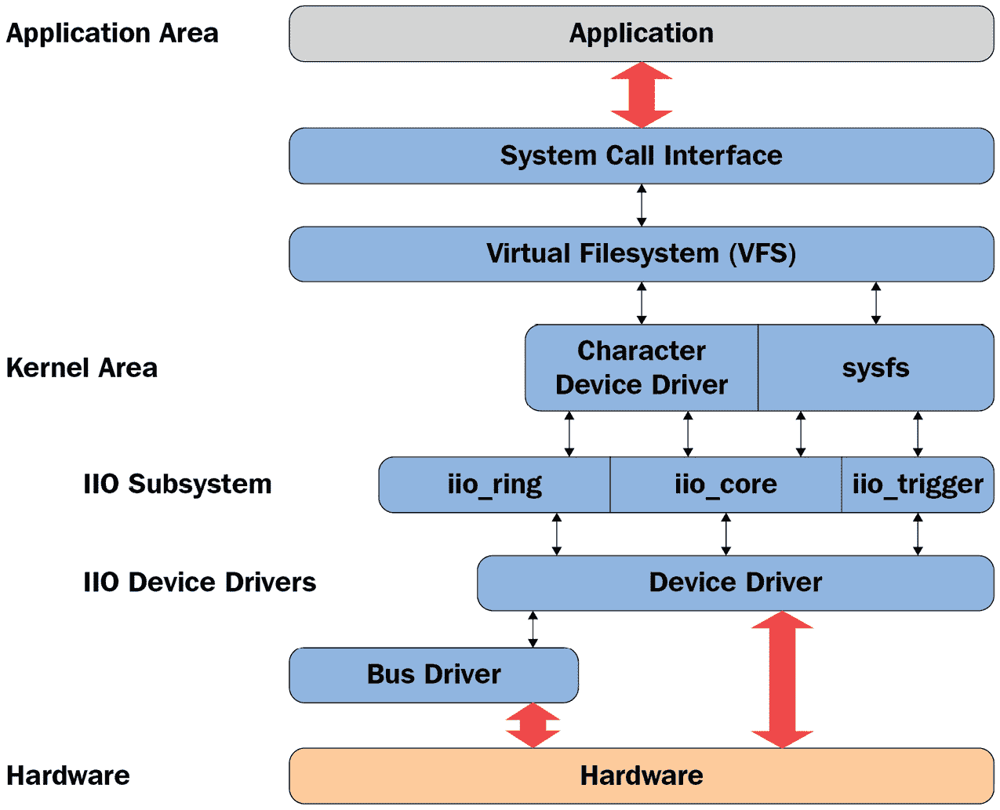
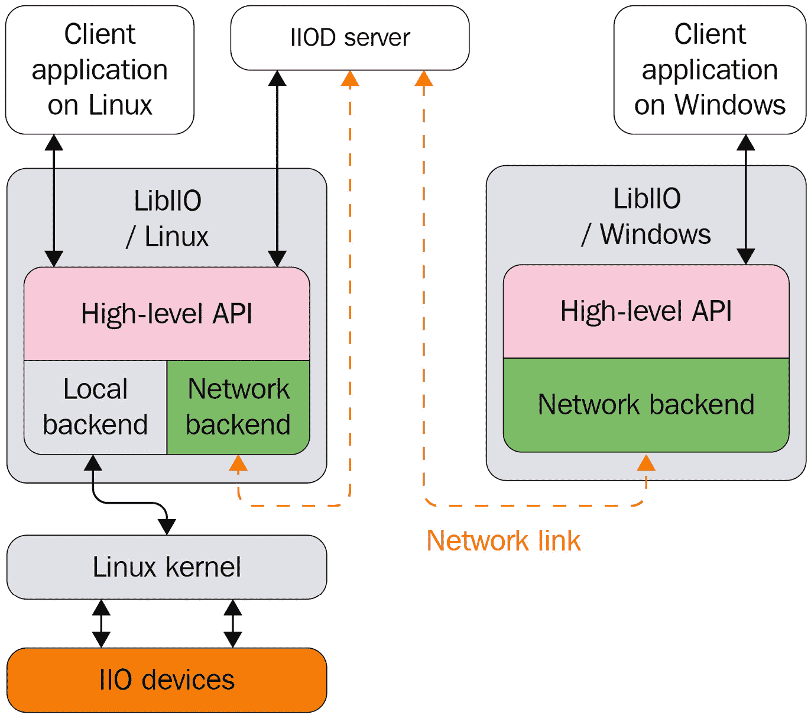

# 第十五章：*第十五章*：深入挖掘 IIO 框架

**工业输入/输出** (**IIO**) 是一个内核子系统，专门用于**模数转换器** (**ADC**) 和**数模转换器** (**DAC**) 。随着传感器数量的增加（具有模数转换或数模转换功能的测量设备），以及不同代码实现的散布在内核源代码中，收集它们变得必要。这正是 IIO 框架所做的，以一种通用的方式。Jonathan Cameron 和 Linux IIO 社区自 2009 年以来一直在开发该框架。加速度计、陀螺仪、电流/电压测量芯片、光传感器和压力传感器都属于 IIO 设备家族。

IIO 模型基于设备和通道架构：

+   该设备代表芯片本身，是层次结构的顶层。

+   通道代表设备的单个采集线路。一个设备可能有一个或多个通道。例如，加速度计是一个具有三个通道的设备，每个轴对应一个通道（*x*、*y* 和 *z*）。

IIO 芯片是物理硬件传感器/转换器。它作为字符设备（当支持触发缓冲区时）和一个 sysfs 目录条目暴露给用户空间，该条目将包含一组文件，其中一些文件代表通道。

这两种方式可以用来从用户空间与 IIO 设备进行交互：

+   `/sys/bus/iio/iio:deviceX/`，一个 sysfs 目录，表示设备及其通道

+   `/dev/iio:deviceX`，一个字符设备，导出设备的事件和数据缓冲区

一张图胜过千言万语，下面是展示 IIO 框架概述的图：



图 15.1 – IIO 框架概述

上图展示了 IIO 框架在内核和用户空间之间的组织方式。驱动程序管理硬件，并将处理信息报告给 IIO 核心，利用 IIO 核心暴露的一组设施和 API。然后，IIO 子系统通过 sysfs 接口和字符设备将整个底层机制抽象到用户空间，用户可以在其之上执行系统调用。

IIO API 分布在几个头文件中，具体如下：

```
/* mandatory, the core */
#include <linux/iio/iio.h>
/* mandatory since sysfs is used */
#include <linux/iio/sysfs.h>
/* Optional. Advanced feature, to manage iio events */
#include <linux/iio/events.h> 
/* mandatory for triggered buffers */
#include <linux/iio/buffer.h>
/* rarely used. Only if the driver implements a trigger */
#include <linux/iio/trigger.h>
```

在本章中，我们将描述并处理 IIO 框架中的每个概念，例如遍历其数据结构（设备、通道等），处理触发缓冲区支持和连续捕获，以及其 sysfs 接口，探索现有的 IIO 触发器，学习如何在单次模式或连续模式下捕获数据，并列出可以帮助开发者测试其设备的工具。

换句话说，本章将涵盖以下主题：

+   IIO 数据结构简介

+   集成 IIO 触发缓冲区支持

+   访问 IIO 数据

+   处理内核中的 IIO 消费者接口

+   浏览用户空间 IIO 工具

# IIO 数据结构简介

IIO 框架由几个数据结构组成，其中一个表示 IIO 设备，另一个描述该设备，最后一个列举设备暴露的通道。IIO 设备在内核中表示为 `struct iio_dev` 实例，并通过 `struct iio_info` 结构描述。所有重要的 IIO 结构都定义在 `include/linux/iio/iio.h` 中。

## 理解 `struct iio_dev` 结构

`struct iio_dev` 结构表示 IIO 设备，描述设备及其驱动程序。它告诉我们设备上可用的通道数量以及设备可以操作的模式（例如一次性转换或触发缓冲区）。此外，该数据结构还暴露了一些驱动程序需要提供的挂钩。

该数据结构的定义如下：

```
struct iio_dev {
    [...]
    int             modes;
    int             currentmode;
    struct device   dev;
    struct iio_buffer           *buffer;
    int                         scan_bytes;
    const unsigned long         *available_scan_masks;
    const unsigned long         *active_scan_mask;
    bool                        scan_timestamp;
    struct iio_trigger          *trig;
    struct iio_poll_func        *pollfunc;
    struct iio_chan_spec const  *channels;
    int                         num_channels;
    const char                  *name;
    const struct iio_info       *info;
    const struct iio_buffer_setup_ops   *setup_ops;
    struct cdev                 chrdev;
};
```

为了提高可读性，在前面的摘录中只列出了与我们相关的元素。完整的结构定义位于 `include/linux/iio/iio.h`。以下是数据结构中各元素的含义：

+   `modes` 表示设备支持的不同模式。可能的模式如下：

    +   `INDIO_DIRECT_MODE`：表示设备提供类似 sysfs 的接口。

    +   `INDIO_BUFFER_TRIGGERED`：表示设备支持与缓冲区相关的硬件触发。当你使用 `iio_triggered_buffer_setup()` 函数设置触发缓冲区时，此标志模式会自动设置。

    +   `INDIO_BUFFER_SOFTWARE`：在连续转换中，缓冲区将由内核软件实现。内核将数据推送到内部 FIFO，并在达到指定水位时可能会触发中断。

    +   `INDIO_BUFFER_HARDWARE`：表示设备具有硬件缓冲区。在连续转换中，缓冲区由设备处理。这意味着数据流可以直接从硬件后端获取。

    +   `INDIO_ALL_BUFFER_MODES`：前三种模式的联合。

    +   `INDIO_EVENT_TRIGGERED`：转换可以由某种事件触发，例如 ADC 上的阈值电压达到，但没有中断或定时器触发。此标志适用于没有其他触发转换方式的带有比较器的芯片。

    +   `INDIO_HARDWARE_TRIGGERED`：可以通过硬件事件触发，例如 IRQ 或时钟事件。

    +   `INDIO_ALL_TRIGGERED_MODES`：`INDIO_BUFFER_TRIGGERED`、`INDIO_EVENT_TRIGGERED` 和 `INDIO_HARDWARE_TRIGGERED` 的联合。

+   `currentmode`：表示设备使用的模式。

+   `dev`：表示 IIO 设备所绑定的 `struct device` 结构（根据 Linux 设备模型）。

+   `buffer`：这是你的数据缓冲区，当使用触发缓冲区模式时，它会被推送到用户空间。当你使用 `iio_triggered_buffer_setup` 函数启用触发缓冲区支持时，它会自动分配并与设备关联。

+   `scan_bytes`：这是捕获的字节数，用于填充缓冲区。在使用来自用户空间的触发缓冲区时，缓冲区的大小应该至少为`indio->scan_bytes`字节。

+   `available_scan_masks`：这是一个可选的允许的位掩码数组。使用触发缓冲区时，可以启用要捕获并输入 IIO 缓冲区的通道。如果不希望启用某些通道，应该仅在此数组中填写允许的通道。以下是一个加速度计（具有 X、Y 和 Z 通道）的示例：

    ```
    /*
     * Bitmasks 0x7 (0b111) and 0 (0b000) are allowed.
     * It means one can enable none or all of them.
     * You can't for example enable only channel X and Y
     */
    static const unsigned long my_scan_masks[] = {0x7, 0};
    indio_dev->available_scan_masks = my_scan_masks;
    ```

+   `active_scan_mask`：这是已启用通道的位掩码。只有来自这些通道的数据应该被推送到缓冲区。例如，对于一个八通道的 ADC 转换器，如果只启用第一个（索引 0）、第三个（索引 2）和最后一个（索引 7）通道，则位掩码将为`0b10000101`（`0x85`）。`active_scan_mask`将被设置为`0x85`。然后，驱动程序可以使用`for_each_set_bit`宏遍历每个位，获取相应通道的数据并填充缓冲区。

+   `scan_timestamp`：该字段指示是否将捕获的时间戳推送到缓冲区。如果为`true`，时间戳将作为缓冲区的最后一个元素推送。时间戳大小为 8 字节（64 位）。

+   `trig`：这是当前的设备触发器（当支持缓冲区模式时）。

+   `pollfunc`：这是在触发接收到时运行的函数。

+   `channels`：表示表通道规范结构，用于描述设备具有的每个通道。

+   `num_channels`：表示在`channels`中指定的通道数量。

+   `name`：表示设备名称。

+   `info`：来自驱动程序的回调和常量信息。

+   `setup_ops`：在缓冲区启用/禁用前后调用的一组回调函数。这个结构在`include/linux/iio/iio.h`中定义，如下所示：

    ```
    struct iio_buffer_setup_ops {
        int (* preenable) (struct iio_dev *);
        int (* postenable) (struct iio_dev *);
        int (* predisable) (struct iio_dev *);
        int (* postdisable) (struct iio_dev *);
        bool (* validate_scan_mask) (
                         struct iio_dev *indio_dev,
                         const unsigned long *scan_mask);
    };
    ```

请注意，数据结构中的每个回调都是可选的。

+   `chrdev`：IIO 核心创建的关联字符设备，文件操作表为`iio_buffer_fileops`。

现在我们已经熟悉了 IIO 设备结构，下一步是为其分配内存。实现此目标的合适函数是`devm_iio_device_alloc()`，它是`iio_device_alloc()`的管理版本，定义如下：

```
struct iio_dev *devm_iio_device_alloc(struct device *dev,
                                       int sizeof_priv)
```

推荐在新的驱动程序中使用管理版本，因为`devres`核心会在不再需要时自动释放内存。在上述函数原型中，`dev`是分配`iio_dev`的设备，`sizeof_priv`是为任何私有数据结构分配的额外内存空间。如果分配失败，函数将返回`NULL`。

在分配了 IIO 设备内存后，下一步是初始化不同的字段。完成后，设备必须使用`devm_iio_device_register()`函数注册到 IIO 子系统中，该函数的原型如下所示：

```
int devm_iio_device_register(struct device *dev,
                             struct iio_dev *indio_dev);
```

这个函数是`iio_device_register()`的托管版本，并负责在驱动程序分离时取消注册 IIO 设备。在其参数中，`dev`是与为其分配了 IIO 设备的设备相同的设备，`indio_dev`是先前初始化的 IIO 设备。此函数成功执行后（返回`0`），设备将准备好接受来自用户空间的请求。以下是一个示例，展示了如何注册 IIO 设备：

```
static int ad7476_probe(struct spi_device *spi)
{
    struct ad7476_state *st;
    struct iio_dev *indio_dev;
    int ret;
    indio_dev = devm_iio_device_alloc(&spi->dev, 
                                        sizeof(*st));
    if (!indio_dev)
         return -ENOMEM;
    /* st is given the address of reserved memory for
    * private data 
    */
    st = iio_priv(indio_dev);
    [...]
    /* iio device setup */
    indio_dev->name = spi_get_device_id(spi)->name;
    indio_dev->modes = INDIO_DIRECT_MODE;
    indio_dev->num_channels = 2;
    [...]
    return devm_iio_device_register(&spi->dev, indio_dev);
}
```

如果发生错误，`devm_iio_device_register()`将返回负的错误代码。非托管变体的反向操作（通常在释放函数中进行）是`iio_device_unregister()`，其声明如下：

```
void iio_device_unregister(struct iio_dev *indio_dev)
```

然而，托管注册负责在驱动程序分离或设备离开系统时取消注册设备。此外，由于我们使用了托管分配变体，因此无需手动释放内存，因为这将由核心内部处理。

你可能也注意到我们在摘录中使用了一个新函数，`iio_priv()`。这个访问器返回与 IIO 设备分配的私有数据的地址。建议使用这个函数，而不是直接解引用。例如，给定一个 IIO 设备，可以按如下方式检索相应的私有数据：

```
struct my_private_data *the_data = iio_priv(indio_dev);
```

IIO 设备本身是没有用的。现在我们完成了主要的 IIO 设备数据结构，我们必须添加一组钩子，以便与设备进行交互。

## 理解`struct iio_info`结构

`struct iio_info`结构用于声明 IIO 核心读取/写入通道/属性值时使用的钩子。以下是其声明的一部分：

```
struct iio_info {
    const struct attribute_group  *attrs;
    int (*read_raw)(struct iio_dev *indio_dev,
            struct iio_chan_spec const *chan,
            int *val, int *val2, long mask);
    int (*write_raw)(struct iio_dev *indio_dev,
             struct iio_chan_spec const *chan,
             int val, int val2, long mask);
    [...]
};
```

同样，完整的定义可以在`/include/linux/iio/iio.h`中找到。对于前面结构摘录中的枚举元素，以下是它们的含义：

+   `attrs`表示暴露给用户空间的设备属性。

+   `read_raw`是当用户读取设备 sysfs 文件属性时调用的回调。`mask`参数是一个位掩码，允许我们知道请求的值类型。`chan`参数让我们知道相关的通道。`*val`和`*val2`是输出参数，必须包含组成返回值的元素。它们必须使用从设备读取的原始值进行设置。

该回调的返回值是标准化的，指示 IIO 核心如何处理`*val`和`*val2`以计算真实值。可能的返回值如下：

+   `IIO_VAL_INT`：输出值是一个整数。在这种情况下，驱动程序必须仅设置`*val`。

+   `IIO_VAL_INT_PLUS_MICRO`：输出值由整数部分和微小部分组成。驱动程序必须使用整数值设置`*val`，而`*val2`必须设置为微小值。

+   `IIO_VAL_INT_PLUS_NANO`：这与微小部分相同，但`*val2`必须设置为纳米值。

+   `IIO_VAL_INT_PLUS_MICRO_DB`：输出值中的`*val`必须设置为整数部分，`*val2`必须设置为微部分（如果有的话）。

+   `IIO_VAL_INT_MULTIPLE`：`val`被视为整数数组，`*val2`是数组中的条目数。它们必须相应地设置。`val`的最大大小是`INDIO_MAX_RAW_ELEMENTS`，定义为`4`。

+   `IIO_VAL_FRACTIONAL`：最终值是分数形式。驱动程序必须将`*val`设置为分子，`*val2`设置为分母。

+   `IIO_VAL_FRACTIONAL_LOG2`：最终值是对数分数。IIO 核心期望分母（`*val2`）作为实际分母的*log2*形式指定。例如，对于 ADC 和 DAC，这通常是有效位数。`*val`是一个正常的整数分母。

+   `IIO_VAL_CHAR`：IIO 核心期望`*val`是一个字符。这个通常与`IIO_CHAN_INFO_THERMOCOUPLE_TYPE`掩码一起使用，在这种情况下，驱动程序必须返回热电偶的类型。

所有前述内容并不改变这一事实：在发生错误的情况下，回调必须返回一个负的错误代码，例如`-EINVAL`。我建议你查看`drivers/iio/inkern.c`源文件中`iio_convert_raw_to_processed_unlocked()`函数，了解最终值是如何处理的。

+   `write_raw`是用于将值写入设备的回调。例如，你可以用它来设置采样频率或改变量程。

设置`struct iio_info`结构体的示例如下：

```
static const struct iio_info iio_dummy_info = {
    .read_raw = &iio_dummy_read_raw,
    .write_raw = &iio_dummy_write_raw,
    [...]
};
/*
 * Provide device type specific interface functions and
 * constant data.
 */
indio_dev->info = &iio_dummy_info;
```

你不能将这个`struct iio_info`与用户空间的`iio_info`工具混淆，后者是`libiio`包的一部分。

## IIO 通道的概念

在 IIO 术语中，通道表示传感器的单一采集线路。这意味着传感器能够提供/感知的每一个数据测量实体称为`struct iio_chan_spec`，这是表示和描述内核中单一通道的结构体，如下所示：

```
struct iio_chan_spec {
    enum iio_chan_type    type;
    int               channel;
    int               channel2;
    unsigned long     address;
    int               scan_index;
    struct {
        char sign;
        u8   realbits;
        u8   storagebits;
        u8   shift;
        u8   repeat;
        enum iio_endian endianness;
    } scan_type;
    long              info_mask_separate;
    long              info_mask_shared_by_type;
    long              info_mask_shared_by_dir;
    long              info_mask_shared_by_all;
    const struct iio_event_spec *event_spec;
    unsigned int      num_event_specs;
    const struct iio_chan_spec_ext_info *ext_info;
    const char        *extend_name;
    const char        *datasheet_name;
    unsigned          modified:1;
    unsigned          indexed:1;
    unsigned          output:1;
    unsigned          differential:1;
};
```

以下是数据结构中各元素的含义：

+   `type`指定通道进行的测量类型。在电压测量的情况下，它应该是`IIO_VOLTAGE`。对于光传感器，是`IIO_LIGHT`。对于加速度计，使用`IIO_ACCEL`。所有可用的类型在`include/uapi/linux/iio/types.h`中定义，作为`enum iio_chan_type`。要为给定的转换器编写驱动程序，你需要查看该文件，以确定每个转换器通道属于哪种类型。

+   `channel`在`.indexed`被设置为`1`时指定通道索引。

+   `channel2`在`.modified`被设置为`1`时指定通道修改器。

+   `scan_index` 和 `scan_type` 字段用于在使用缓冲触发时识别缓冲区中的元素。`scan_index` 设置捕获的通道在缓冲区中的位置。通道按 `scan_index` 从最低索引（最先放置）到最高索引排列。将 `.scan_index` 设置为 `-1` 将防止通道被缓冲捕获（在 `scan_elements` 目录中没有条目）。此子结构中的元素具有以下含义：

    +   `sign`: `s` 或 `u` 指定符号（有符号（补码）或无符号）。

    +   `realbits`: 有效数据位的数量。

    +   `storagebits`: 此通道在缓冲区中占用的位数。也就是说，一个值可以用 12 位来编码，但它在缓冲区中占用了 16 位（存储位）。因此，数据必须右移四次才能得到实际值。此参数取决于设备，您应参考其数据手册。

    +   `shift`: 表示在屏蔽掉未使用的位之前，数据值应该右移的次数。此参数并非总是必需的。如果有效位数等于存储位数，则移位值为 `0`。此参数也可以在设备数据手册中找到。

    +   `repeat`: 实际/存储位重复的次数。

    +   `endianness`: 表示数据的字节序。它是 `enum iio_endian` 类型，应该设置为 `IIO_CPU`、`IIO_LE` 或 `IIO_BE` 中的一个，分别表示本地 CPU 字节序、小端字节序或大端字节序。

+   `modified` 字段指定是否对该通道属性名称应用修改器。如果是，修改器将设置在 `.channel2` 中。（例如，`IIO_MOD_X`、`IIO_MOD_Y` 和 `IIO_MOD_Z` 是针对 `X`、`Y` 和 `Z` 轴的轴向传感器的修改器）。可用的修改器列表在内核 IIO 头文件中定义为 `enum iio_modifier`。修改器仅在 sysfs 中改变通道属性名称，而不改变其值。

+   `indexed` 指定通道属性名称是否具有索引。如果有，索引将在 `.channel` 字段中指定。

+   `info_mask_separate` 将该属性标记为特定于此通道。

+   `info_mask_shared_by_type` 将该属性标记为同一类型的所有通道共享。导出的信息由同一类型的所有通道共享。

+   `info_mask_shared_by_dir` 将该属性标记为同一方向的所有通道共享。导出的信息由同一方向的所有通道共享。

+   `info_mask_shared_by_all` 将该属性标记为所有通道共享，无论其类型或方向如何。导出的信息由所有通道共享。

`iio_chan_spec.info_mask_*` 元素是掩码，用于根据其共享信息指定暴露给用户空间的通道 sysfs 属性。因此，掩码必须通过按位或（OR）一个或多个位掩码来设置，这些位掩码都在 `include/linux/iio/types.h` 中定义，如下所示：

```
enum iio_chan_info_enum {
    IIO_CHAN_INFO_RAW = 0,
    IIO_CHAN_INFO_PROCESSED,
    IIO_CHAN_INFO_SCALE,
    IIO_CHAN_INFO_OFFSET,
    IIO_CHAN_INFO_CALIBSCALE,
    [...]
    IIO_CHAN_INFO_SAMP_FREQ,
    IIO_CHAN_INFO_FREQUENCY,
    IIO_CHAN_INFO_PHASE,
    IIO_CHAN_INFO_HARDWAREGAIN,
    IIO_CHAN_INFO_HYSTERESIS,
    [...]
};
```

以下是指定给定通道的掩码的示例：

```
iio_chan->info_mask_separate = BIT(IIO_CHAN_INFO_RAW) |
                    BIT(IIO_CHAN_INFO_PROCESSED);
```

这意味着原始和处理过的属性是特定于通道的。

注意

虽然在前面的 `struct iio_chan_spec` 结构描述中没有明确指定，术语 *属性* 指的是 *sysfs 属性*。这适用于整章内容。

通过描述通道数据结构，我们来解开通道属性命名的谜团，它遵循特定的约定。

### 通道属性命名约定

属性的名称由 IIO 核心根据预定义模式自动生成，模式为 `{direction}_{type}{index}_{modifier}_{info_mask}`。以下是模式中每个字段的描述：

+   `{direction}` 对应于属性方向，依据 `drivers/iio/industrialio-core.c` 中的 `struct iio_direction` 结构：

    ```
    static const char * const iio_direction[] = {
        [0] = "in",
        [1] = "out",
    };
    ```

请注意，输入通道是可以生成样本的通道（此类通道在读取方法中处理，例如 ADC 通道）。另一方面，输出通道是可以接收样本的通道（此类通道在写入方法中处理，例如 DAC 通道）。

+   `{type}` 对应于通道类型字符串，依据 `drivers/iio/industrialio-core.c` 中的常量 `iio_chan_type_name_spec` 字符数组（由 `enum iio_chan_type` 类型的通道类型索引）定义，如下所示：

    ```
    static const char * const iio_chan_type_name_spec[] = {
        [IIO_VOLTAGE] = "voltage",
        [IIO_CURRENT] = "current",
        [IIO_POWER] = "power",
        [IIO_ACCEL] = "accel",
        [...]
        [IIO_UVINDEX] = "uvindex",
        [IIO_ELECTRICALCONDUCTIVITY] =
                      "electricalconductivity",
        [IIO_COUNT] = "count",
        [IIO_INDEX] = "index",
        [IIO_GRAVITY] = "gravity",
    };
    ```

+   `{index}` 取决于通道 `.indexed` 字段是否被设置。如果已设置，索引将从 `.channel` 字段中获取，并用来替代 `{index}` 模式。

+   `{modifier}` 模式取决于通道 `.modified` 字段是否被设置。如果已设置，修饰符将从 `.channel2` 字段中获取，且模式中的 `{modifier}` 字段将根据 `char` 数组 `struct iio_modifier_names` 结构进行替换：

    ```
    static const char * const iio_modifier_names[] = {
        [IIO_MOD_X] = "x",
        [IIO_MOD_Y] = "y",
        [IIO_MOD_Z] = "z",
        [IIO_MOD_X_AND_Y] = "x&y",
        [IIO_MOD_X_AND_Z] = "x&z",
        [IIO_MOD_Y_AND_Z] = "y&z",
        [...]
        [IIO_MOD_CO2] = "co2",
        [IIO_MOD_VOC] = "voc",
    };
    ```

+   `{info_mask}` 取决于通道信息掩码，私有或共享，索引 `iio_chan_info_postfix` 字符数组中的值，定义如下：

    ```
    /* relies on pairs of these shared then separate */
    static const char * const iio_chan_info_postfix[] = {
         [IIO_CHAN_INFO_RAW] = "raw",
         [IIO_CHAN_INFO_PROCESSED] = "input",
         [IIO_CHAN_INFO_SCALE] = "scale",
         [IIO_CHAN_INFO_CALIBBIAS] = "calibbias",
         [...]
         [IIO_CHAN_INFO_SAMP_FREQ] = "sampling_frequency",
         [IIO_CHAN_INFO_FREQUENCY] = "frequency",
         [...]
    };
    ```

通道命名约定现在应该没有更多的疑问了。既然我们已经熟悉了命名规则，接下来让我们学习如何准确地识别通道。

注意

在这个命名模式中，如果某个元素不存在，那么直接前面的下划线将被省略。例如，如果未指定修饰符，则模式将变为 `{direction}_{type}{index}_{info_mask}`，而不是 `{direction}_{type}{index}__{info_mask}`。

## 区分通道

当存在多个相同类型的数据通道时，你可能会遇到一些困难。这个难题是 *如何精确识别每个通道*。对此有两种解决方案：**索引**和**修饰符**。

### 使用索引进行通道标识

给定一个具有单个通道线的 ADC 设备，不需要索引。其通道定义如下：

```
static const struct iio_chan_spec adc_channels[] = {
        {
             .type = IIO_VOLTAGE,
             .info_mask_separate = BIT(IIO_CHAN_INFO_RAW),
        },
}
```

根据前面的摘录，属性名称将是 `in_voltage_raw`，其绝对 sysfs 路径将是 `/sys/bus/iio/iio:deviceX/in_voltage_raw`。

假设 ADC 有四个甚至八个通道。我们该如何识别每个通道？解决方案是使用索引。将 `.indexed` 字段设置为 `1`，可以通过 `.channel` 值修改通道属性名称，替换命名模式中的 `{index}`：

```
static const struct iio_chan_spec adc_channels[] = {
    {
        .type = IIO_VOLTAGE,
        .indexed = 1,
        .channel = 0,
        .info_mask_separate = BIT(IIO_CHAN_INFO_RAW),
    },
    {
        .type = IIO_VOLTAGE,
        .indexed = 1,
        .channel = 1,
        .info_mask_separate = BIT(IIO_CHAN_INFO_RAW),
    },
    {
        .type = IIO_VOLTAGE,
        .indexed = 1,
        .channel = 2,
        .info_mask_separate = BIT(IIO_CHAN_INFO_RAW),
    },
    {
        .type = IIO_VOLTAGE,
        .indexed = 1,
        .channel = 3,
        .info_mask_separate = BIT(IIO_CHAN_INFO_RAW),
    },
}
```

以下是生成的通道属性的完整 sysfs 路径：

```
/sys/bus/iio/iio:deviceX/in_voltage0_raw
/sys/bus/iio/iio:deviceX/in_voltage1_raw
/sys/bus/iio/iio:deviceX/in_voltage2_raw
/sys/bus/iio/iio:deviceX/in_voltage3_raw
```

如我们所见，即使它们都是同类型的，它们也通过索引区分开来。

### 使用修饰符进行通道识别

为了突出修饰符的概念，假设有一个带有两个通道的光传感器——一个用于红外光，另一个同时用于红外光和可见光。如果没有索引或修饰符，属性名称会是 `in_intensity_raw`。在这里使用索引可能会容易出错，因为如果有 `in_intensity0_ir_raw` 和 `in_intensity1_ir_raw`，它们看起来像是同类型的通道，这毫无意义。使用修饰符可以帮助我们获得有意义的属性名称。通道定义可以如下所示：

```
static const struct iio_chan_spec mylight_channels[] = {
    {
        .type = IIO_INTENSITY,
        .modified = 1,
        .channel2 = IIO_MOD_LIGHT_IR,
        .info_mask_separate = BIT(IIO_CHAN_INFO_RAW),
        .info_mask_shared = BIT(IIO_CHAN_INFO_SAMP_FREQ),
    },
    {
        .type = IIO_INTENSITY,
        .modified = 1,
        .channel2 = IIO_MOD_LIGHT_BOTH,
        .info_mask_separate = BIT(IIO_CHAN_INFO_RAW),
        .info_mask_shared = BIT(IIO_CHAN_INFO_SAMP_FREQ),
    },
    {
        .type = IIO_LIGHT,
        .info_mask_separate = BIT(IIO_CHAN_INFO_PROCESSED),
        .info_mask_shared = BIT(IIO_CHAN_INFO_SAMP_FREQ),
    },
}
```

结果生成的属性如下：

+   `/sys/bus/iio/iio:deviceX/in_intensity_ir_raw` 用于测量红外强度的通道

+   `/sys/bus/iio/iio:deviceX/in_intensity_both_raw` 用于同时测量红外和可见光的通道

+   `/sys/bus/iio/iio:deviceX/in_illuminance_input` 用于处理后的数据

+   `/sys/bus/iio/iio:deviceX/sampling_frequency` 用于采样频率，所有设备共享

这一点在加速度计中同样适用，我们将在后续的案例研究中看到。现在，让我们通过实现一个虚拟的 IIO 驱动来总结到目前为止讨论的内容。

## 将所有内容整合起来——编写一个虚拟的 IIO 驱动

让我们通过一个简单的虚拟驱动程序来总结到目前为止的内容，该驱动将暴露四个电压通道。暂时我们不关心 `read()` 或 `write()` 函数。

首先，让我们定义开发过程中需要的头文件：

```
#include <linux/init.h>
#include <linux/module.h>
#include <linux/kernel.h>
#include <linux/platform_device.h>
#include <linux/interrupt.h>
#include <linux/of.h>
#include <linux/iio/iio.h>
```

然后，由于通道描述是一个通用且重复的操作，我们可以定义一个宏，来为我们填充通道描述，如下所示：

```
#define FAKE_VOLTAGE_CHANNEL(num)                \
  {                                              \
     .type = IIO_VOLTAGE,                        \
     .indexed = 1,                               \
     .channel = (num),                           \
     .address = (num),                           \
     .info_mask_separate = BIT(IIO_CHAN_INFO_RAW),        \
     .info_mask_shared_by_type = BIT(IIO_CHAN_INFO_SCALE) \
  }
```

在定义了通道填充宏之后，我们可以定义我们的驱动状态数据结构，如下所示：

```
struct my_private_data {
    int foo;
    int bar;
    struct mutex lock;
};
```

之前定义的数据结构是没有用的。它仅仅是用来展示这个概念。接着，因为我们在这个虚拟驱动程序示例中不需要读取或写入操作，让我们创建空的读取和写入函数，这些函数只返回 `0`（表示一切正常）：

```
static int fake_read_raw(struct iio_dev *indio_dev,
    struct iio_chan_spec const *channel, int *val,
    int *val2, long mask)
{
    return 0;
}
static int fake_write_raw(struct iio_dev *indio_dev,
                     struct iio_chan_spec const *chan,
                     int val, int val2, long mask)
{
    return 0;
}
```

现在我们可以使用之前定义的宏来声明我们的 IIO 通道。此外，我们还可以按如下方式设置 `iio_info` 数据结构，并在同一时间分配虚拟的读取和写入操作：

```
static const struct iio_chan_spec fake_channels[] = {
     FAKE_VOLTAGE_CHANNEL(0),
     FAKE_VOLTAGE_CHANNEL(1),
     FAKE_VOLTAGE_CHANNEL(2),
     FAKE_VOLTAGE_CHANNEL(3),
};
static const struct iio_info fake_iio_info = {
     .read_raw  = fake_read_raw,
     .write_raw = fake_write_raw,
     .driver_module = THIS_MODULE,
};
```

现在，所有必要的 IIO 数据结构已经设置完毕，我们可以切换到与平台驱动相关的数据结构并实现其方法，如下所示：

```
static const struct of_device_id iio_dummy_ids[] = {
    { .compatible = "packt,iio-dummy-random", },
    { /* sentinel */ }
};
static int my_pdrv_probe (struct platform_device *pdev)
{
     struct iio_dev *indio_dev;
     struct my_private_data *data;
     indio_dev = devm_iio_device_alloc(&pdev->dev,
                                      sizeof(*data));
     if (!indio_dev) {
        dev_err(&pdev->dev, "iio allocation failed!\n");
        return -ENOMEM;
     }
    data = iio_priv(indio_dev);
    mutex_init(&data->lock);
    indio_dev->dev.parent = &pdev->dev;
    indio_dev->info = &fake_iio_info;
    indio_dev->name = KBUILD_MODNAME;
    indio_dev->modes = INDIO_DIRECT_MODE;
    indio_dev->channels = fake_channels;
    indio_dev->num_channels = ARRAY_SIZE(fake_channels);
    indio_dev->available_scan_masks = 0xF;
    devm_iio_device_register(&pdev->dev, indio_dev);
    platform_set_drvdata(pdev, indio_dev);
    return 0;
}
```

在前述的探测方法中，我们仅使用了资源管理的 API 进行分配和注册。这大大简化了代码，并且去除了驱动程序的 `remove` 方法。驱动程序的声明和注册将如下所示：

```
static struct platform_driver my_iio_pdrv = {
    .probe      = my_pdrv_probe,
    .driver     = {
        .name     = "iio-dummy-random",
        .of_match_table = of_match_ptr(iio_dummy_ids),  
        .owner    = THIS_MODULE,
    },
};
module_platform_driver(my_iio_pdrv);
MODULE_AUTHOR("John Madieu <john.madieu@labcsmart.com>");
MODULE_LICENSE("GPL");
```

加载上述模块后，在系统中列出可用的 IIO 设备时，您将看到以下输出：

```
~# ls -l /sys/bus/iio/devices/
lrwxrwxrwx    1 root     root             0 Jul 31 20:26 iio:device0 -> ../../../devices/platform/iio-dummy-random.0/iio:device0
lrwxrwxrwx    1 root     root             0 Jul 31 20:23 iio_sysfs_trigger -> ../../../devices/iio_sysfs_trigger

~# ls /sys/bus/iio/devices/iio\:device0/
dev                              in_voltage2_raw        name                uevent
in_voltage0_raw        in_voltage3_raw        power
in_voltage1_raw        in_voltage_scale        subsystem
~# cat /sys/bus/iio/devices/iio:device0/name 
iio_dummy_random
```

注意

一个非常完整的 IIO 驱动程序，可以用于学习目的或开发模型，是位于 `drivers/iio/dummy/iio_simple_dummy.c` 的 IIO 简单虚拟驱动程序。通过启用 `IIO_SIMPLE_DUMMY` 内核配置选项，可以在目标上使其可用。

现在我们已经介绍了基本的 IIO 概念，接下来我们可以进一步实现缓冲区支持和触发器概念。

# 集成 IIO 触发的缓冲区支持

在数据采集应用程序中，能够基于一些外部信号或事件（触发器）捕获数据可能会很有用。这些触发器可能包括以下几种：

+   一个数据就绪信号

+   一个连接到某个外部系统（如 GPIO 或其他）的 IRQ 线路

+   在处理器的周期性中断（例如定时器）

+   用户空间读取/写入 sysfs 中的特定文件

IIO 设备驱动程序与触发器完全解耦，触发器的驱动程序实现位于 `drivers/iio/trigger/` 中。触发器可以初始化一个或多个设备的数据采集。这些触发器用于填充缓冲区，并通过在 IIO 设备注册期间创建的字符设备暴露给用户空间。

您可以开发自己的触发器驱动程序，但这超出了本书的范围。我们将专注于现有的触发器。这些触发器如下：

+   `iio-trig-interrupt`：这允许使用 IRQ 作为 IIO 触发器。在旧版本的内核中（v3.11 之前），它曾经是 `iio-trig-gpio`。要支持此触发模式，您应在内核配置中启用 `CONFIG_IIO_INTERRUPT_TRIGGER`。如果作为模块构建，则模块将命名为 `iio-trig-interrupt`。

+   `iio-trig-hrtimer`：提供一个基于频率的 IIO 触发器，使用高分辨率定时器作为中断源（自内核 v4.5 起）。在旧版本的内核中，它曾经是 `iio-trig-rtc`。要在内核中支持此触发模式，必须启用 `IIO_HRTIMER_TRIGGER` 配置选项。如果作为模块构建，则模块将命名为 `iio-trig-hrtimer`。

+   `iio-trig-sysfs`：这允许我们使用 `SYSFS` 条目来触发数据采集。`CONFIG_IIO_SYSFS_TRIGGER` 是内核选项，用于支持此触发模式。

+   `iio-trig-bfin-timer`：这使我们能够使用 Blackfin 定时器作为 IIO 触发器（仍处于阶段中）。

IIO 提供了一个 API，允许我们执行以下操作：

+   声明任何数量的触发器。

+   选择哪些通道将其数据推送到缓冲区中。

如果你的 IIO 设备支持触发器缓冲区，你必须设置`iio_dev.pollfunc`，它会在触发器触发时执行。这个处理程序的职责是通过`indio_dev->active_scan_mask`查找启用的通道，获取它们的数据，并通过`iio_push_to_buffers_with_timestamp`函数将数据推送到`indio_dev->buffer`中。因此，在 IIO 子系统中，缓冲区和触发器是紧密关联的。

IIO 核心提供了一组辅助函数，用于设置触发器缓冲区，你可以在`drivers/iio/industrialio-triggered-buffer.c`中找到它们。以下是支持触发器缓冲区的步骤：

1.  如果需要，填写`iio_buffer_setup_ops`结构：

    ```
    const struct iio_buffer_setup_ops sensor_buffer_setup_ops = {
      .preenable    = my_sensor_buffer_preenable,
      .postenable   = my_sensor_buffer_postenable,
      .postdisable  = my_sensor_buffer_postdisable,
      .predisable   = my_sensor_buffer_predisable,
    };
    ```

1.  编写与触发器相关的上半部分。在 99%的情况下，你只需要提供与捕获相关的时间戳：

    ```
    irqreturn_t sensor_iio_pollfunc(int irq, void *p)
    {
        pf->timestamp = iio_get_time_ns(
                           (struct indio_dev *)p);
        return IRQ_WAKE_THREAD;
    }
    ```

然后我们返回一个特殊值，以便内核知道它必须调度底半部分，这将在一个线程上下文中运行。

1.  编写触发器的底半部分，它将从每个启用的通道获取数据并将其推送到缓冲区：

    ```
    irqreturn_t sensor_trigger_handler(int irq, void *p)
    {
        u16 buf[8];
        int bit, i = 0;
        struct iio_poll_func *pf = p;
        struct iio_dev *indio_dev = pf->indio_dev;
        /* one can use lock here to protect the buffer */
        /* mutex_lock(&my_mutex); */
        /* read data for each active channel */
        for_each_set_bit(bit, indio_dev->active_scan_mask,
                         indio_dev->masklength)
            buf[i++] = sensor_get_data(bit);
        /*
         * If iio_dev.scan_timestamp = true, the capture 
         * timestamp will be pushed and stored too, 
         * as the last element in the sample data buffer 
         * before pushing it to the device buffers.
         */
        iio_push_to_buffers_with_timestamp(indio_dev, buf,
                                            timestamp);
        /* Please unlock any lock */
        /* mutex_unlock(&my_mutex); */
        /* Notify trigger */
        iio_trigger_notify_done(indio_dev->trig);
        return IRQ_HANDLED;
    }
    ```

1.  最后，在探测函数中，你必须在注册设备之前设置缓冲区本身：

    ```
    iio_triggered_buffer_setup(
        indio_dev, sensor_iio_pollfunc,
        sensor_trigger_handler,
        sensor_buffer_setup_ops);
    ```

这里的关键函数是`iio_triggered_buffer_setup()`。它还会将`INDIO_BUFFER_TRIGGERED`能力授予设备，意味着可以使用轮询环形缓冲区。

当触发器（来自用户空间）被分配给设备时，驱动程序无法知道捕获何时被触发。这就是为什么，在连续缓冲捕获活动时，你应该阻止（通过返回错误）驱动程序处理 sysfs 每通道的数据捕获（由`read_raw()`钩子执行），以避免不确定的行为，因为触发器处理程序和`read_raw()`钩子会同时尝试访问设备。用于检查当前是否启用了缓冲模式的函数是`iio_buffer_enabled()`。该钩子如下所示：

```
static int my_read_raw(struct iio_dev *indio_dev,
               const struct iio_chan_spec *chan,
               int *val, int *val2, long mask)
{
    [...]
    switch (mask) {
    case IIO_CHAN_INFO_RAW:
        if (iio_buffer_enabled(indio_dev))
            return -EBUSY;
    [...]    
}
```

`iio_buffer_enabled()`函数只是测试设备当前模式是否与 IIO 缓冲区模式之一相对应。该函数在`include/linux/iio/iio.h`中定义如下：

```
static bool iio_buffer_enabled(struct iio_dev *indio_dev)
{
   return indio_dev->currentmode
       & (INDIO_BUFFER_TRIGGERED | INDIO_BUFFER_HARDWARE |
           INDIO_BUFFER_SOFTWARE);
} 
```

现在，让我们描述一下在前面的代码中使用的一些重要内容：

+   `iio_buffer_setup_ops`提供了在缓冲区配置过程中固定步骤时调用的缓冲区设置函数（启用/禁用前后）。如果没有指定，IIO 核心将为你的设备提供默认的`iio_triggered_buffer_setup_ops`。

+   `sensor_iio_pollfunc`是触发器的上半部分。像所有上半部分一样，它在中断上下文中运行，并且必须尽量减少处理工作。99%的情况下，记录与捕获相关的时间戳就足够了。你仍然可以使用默认的 IIO 函数`iio_pollfunc_store_time()`。

+   `sensor_trigger_handler` 是下半部分，运行在内核线程中，允许你进行任何处理，甚至获取互斥锁或休眠。重的处理工作应该在这里进行。这里的大部分工作包括从设备读取数据，并将这些数据与在上半部分记录的时间戳一起存储到内部缓冲区中，并将其推送到 IIO 设备缓冲区。

    注意

    触发缓冲区涉及一个触发器。它告诉驱动程序何时从设备读取样本并将其放入缓冲区。触发缓冲区并不是编写 IIO 设备驱动程序的必需条件。你也可以通过读取通道的原始属性来使用单次捕获，这将只执行单次转换（对于被读取的通道属性）。缓冲模式允许连续转换，从而在一次捕获中捕捉多个通道。

现在我们已经熟悉了触发缓冲区在内核中的所有方面，让我们介绍如何使用 sysfs 接口在用户空间进行设置。

## IIO 触发器和 sysfs（用户空间）

在运行时，有两个 sysfs 目录可以管理触发器：

+   `/sys/bus/iio/devices/trigger<Y>/`：一旦 IIO 触发器在 IIO 核心中注册，这个目录将会创建。在此路径中，`<Y>` 对应于具有索引的触发器。该目录中至少有一个 `name` 属性，这是触发器的名称，之后可以用于与设备关联。

+   `/sys/bus/iio/devices/iio:deviceX/trigger/*`：如果你的设备支持触发缓冲区，此目录将自动创建。通过在此目录中的 `current_trigger` 文件中写入触发器的名称，可以将触发器与我们的设备关联。

在枚举了与触发器相关的 sysfs 目录之后，让我们开始描述 sysfs 触发器接口是如何工作的。

### sysfs 触发器接口

在内核中通过 `CONFIG_IIO_SYSFS_TRIGGER=y` 配置选项启用 sysfs 触发器，这将自动创建 `/sys/bus/iio/devices/iio_sysfs_trigger/` 文件夹，该文件夹可用于 sysfs 触发器管理。该目录中将有两个文件，`add_trigger` 和 `remove_trigger`。其驱动程序是 `drivers/iio/trigger/iio-trig-sysfs.c`。以下是这些属性的描述：

+   `add_trigger`：用于创建一个新的 sysfs 触发器。你可以通过将一个正值（将用作触发器 ID）写入该文件来创建一个新的触发器。它会创建一个新的 sysfs 触发器，可以在`/sys/bus/iio/devices/triggerX`访问，其中`X`是触发器编号。例如，`echo 2 > add_trigger`将创建一个新的 sysfs 触发器，可以在`/sys/bus/iio/devices/trigger2`访问。如果系统中已经存在一个带有提供 ID 的触发器，将返回无效参数的消息。sysfs 触发器的名称模式为`sysfstrig{ID}`。`echo 2 > add_trigger`命令将创建`/sys/bus/iio/devices/trigger2`触发器，其名称为`sysfstrig2`，你可以通过`cat /sys/bus/iio/devices/trigger2/name`来检查它。每个 sysfs 触发器至少包含一个文件：`trigger_now`。将`1`写入该文件将指示所有设备，若其`current_trigger`中有相应的触发器名称，则开始捕获并将数据推送到各自的缓冲区。每个设备的缓冲区必须设置大小并启用（`echo 1 > /sys/bus/iio/devices/iio:deviceX/buffer/enable`）。

+   `remove_trigger`：用于删除触发器。以下命令足以删除之前创建的触发器：

    ```
    echo 2 > remove_trigger
    ```

如你所见，在创建触发器时使用的`add_trigger`中的值必须与删除触发器时使用的值相同。

注意

你应该注意，驱动程序只有在关联的触发器被触发时才会捕获数据。因此，使用 sysfs 触发器时，数据只会在`trigger_now`属性中写入`1`时被捕获。因此，要实现连续数据捕获，你应该在一个循环中根据需要的样本数多次运行`echo 1 > trigger_now`，例如。因为单次执行`echo 1 > trigger_now`相当于一次触发，因此只会执行一次捕获，并将其推送到缓冲区。对于基于中断的触发器，数据会在每次发生中断时被捕获并推送到缓冲区。

现在我们完成了触发器的设置，接下来必须将该触发器分配给设备，以便它可以在此设备上触发数据捕获，正如我们将在下一部分看到的那样。

### 将设备与触发器绑定

将设备与给定触发器关联的过程是将触发器的名称写入设备触发器目录下的`current_trigger`文件。例如，假设我们需要将设备与索引为`2`的触发器绑定：

```
# set trigger2 as current trigger for device0
echo sysfstrig2 > /sys/bus/iio/devices/iio:device0/trigger/current_trigger
```

要从设备中分离触发器，应将空字符串写入设备触发器目录下的`current_trigger`文件，如下所示：

```
echo "" > iio:device0/trigger/current_trigger
```

在本章后面的部分（*使用 sysfs 触发器捕获数据*部分），我们将看到一个实际的例子，涉及用于数据捕获的 sysfs 触发器。

### 中断触发器接口

假设我们有以下样本：

```
static struct resource iio_irq_trigger_resources[] = {
    [0] = {
        .start = IRQ_NR_FOR_YOUR_IRQ,
        .flags = IORESOURCE_IRQ | IORESOURCE_IRQ_LOWEDGE,
    },
};
static struct platform_device iio_irq_trigger = {
    .name = "iio_interrupt_trigger",
    .num_resources = ARRAY_SIZE(iio_irq_trigger_resources),
    .resource = iio_irq_trigger_resources,
};
platform_device_register(&iio_irq_trigger);
```

在此示例中，我们声明我们的 IRQ-（使用 `request_irq()` 注册的 IIO 中断触发器）作为平台设备。它将导致 IRQ 触发器独立模块（源文件为 `drivers/iio/trigger/iio-trig-interrupt.c`）被加载。探测成功后，将有一个与触发器相对应的目录。IRQ 触发器的名称采用 `irqtrigX` 形式，其中 `X` 对应于刚刚传递的 IRQ。此名称是您将在 `/proc/interrupt` 中看到的名称：

```
$ cd /sys/bus/iio/devices/trigger0/
$ cat name
    irqtrig85
```

就像我们对其他触发器所做的那样，您只需将该触发器分配给您的设备，将其名称写入设备的 `current_trigger` 文件中：

```
echo "irqtrig85" > /sys/bus/iio/devices/iio:device0/trigger/current_trigger
```

现在，每当中断触发时，将捕获设备数据。

IRQ 触发器驱动程序实现在 `drivers/iio/trigger/iio-trig-interrupt.c` 中。由于驱动程序需要资源，我们可以使用设备树进行配置，无需进行任何代码更改，唯一的条件是遵守 `compatible` 属性，如下所示：

```
mylabel: my_trigger@0{
    compatible = "iio_interrupt_trigger";
    interrupt-parent = <&gpio4>;
    interrupts = <30 0x0>;
};
```

本示例假设 IRQ 线为 `GPIO#30`，属于 `gpio4` GPIO 控制器节点。这包括使用 GPIO 作为中断源，因此每当 GPIO 变化到给定状态时，都会引发中断，从而触发捕获。

### hrtimer 触发器接口

`hrtimer trigger` 实现在 `drivers/iio/trigger/iio-trig-hrtimer.c` 中，并依赖于 `configfs` 文件系统（请参阅内核源中的 `Documentation/iio/iio_configfs.txt`），可以通过 `CONFIG_IIO_CONFIGFS` 配置选项启用，并安装在我们的系统上（通常位于 `/config` 目录下）：

```
$ mkdir /config
$ mount -t configfs none /config
```

现在，加载 `iio-trig-hrtimer` 模块将创建可在 `/config/iio` 下访问的 IIO 组，允许用户在 `/config/iio/triggers/hrtimer` 下创建 `hrtimer` 触发器。以下是一个示例：

```
# create a hrtimer trigger
$ mkdir /config/iio/triggers/hrtimer/my_trigger_name
# remove the trigger
$ rmdir /config/iio/triggers/hrtimer/my_trigger_name
```

每个 `hrtimer` 触发器在触发器目录中包含一个 `sampling_frequency` 属性。本章稍后的 *使用 hrtimer 触发器进行数据捕获* 部分提供了一个完整且可工作的示例。

## IIO 缓冲区

IIO 缓冲区提供连续数据捕获，允许同时读取多个数据通道。该缓冲区可通过用户空间中的 `/dev/iio:device` 字符设备节点访问。在触发器处理程序内部，用于填充缓冲区的函数是 `iio_push_to_buffers_with_timestamp()`。为了为设备分配和设置触发器缓冲区，驱动程序必须使用 `iio_triggered_buffer_setup()`。

### IIO 缓冲区 sysfs 接口

IIO 缓冲区有一个关联的属性目录，位于 `/sys/bus/iio/iio:deviceX/buffer/*` 下。以下是一些现有的属性：

+   `length`: 缓冲区的容量。它代表可以由缓冲区存储的总数据样本数。它是缓冲区包含的扫描次数。

+   `enable`: 激活缓冲区捕获并启动缓冲区捕获。

+   `watermark`：这个属性自内核版本 v4.2 起就已可用。它是一个正数，指定阻塞读取应等待多少个扫描元素。例如，使用 `poll()` 系统调用时，它会阻塞，直到达到水印值。只有当水印大于请求的读取数量时，这个参数才有意义。它不会影响非阻塞读取。通过在 `poll()` 上阻塞并设置超时，你可以获得最大延迟保证，并在超时后读取可用的样本。

既然我们已经列举并描述了 IIO 缓冲区目录中存在的属性，接下来让我们讨论如何设置 IIO 缓冲区。

### IIO 缓冲区设置

需要读取数据并将其推送到缓冲区的通道称为 `/sys/bus/iio/iio:deviceX/scan_elements/*` 目录，包含以下属性：

+   `*_en`：这是属性名的后缀，用于启用该通道。只有当其属性值非零时，触发的捕获才会包含该通道的数据样本。例如，`in_voltage0_en` 和 `in_voltage1_en` 是启用 `in_voltage0` 和 `in_voltage1` 的属性。因此，如果 `in_voltage1_en` 的值非零，那么触发捕获时底层 IIO 设备的输出将包括 `in_voltage1` 通道的值。

+   `type`：描述了缓冲区内扫描元素数据的存储方式，以及它是如何从用户空间读取的。例如，`in_voltage0_type` 是一个通道类型的示例。格式遵循以下模式：`[be|le]:[s|u]bits/storagebitsXrepeat[>>shift]`。以下是每个字段的含义：

    +   `be` 或 `le` 指定字节序（大端或小端）。

    +   `s` 或 `u` 指定符号，表示有符号（补码）或无符号。

    +   `bits` 是有效数据位的数量。

    +   `storagebits` 是该通道在缓冲区中占用的位数。也就是说，一个值可能实际是用 12 位（`bits`）编码的，但在缓冲区中占用 16 位（`storagebits`）。因此，你需要将数据右移四次以获得实际值。这个参数取决于设备，具体情况请参考设备的数据手册。

    +   `shift` 表示在屏蔽掉未使用的位之前，数据值需要右移的次数。这个参数并非总是需要的。如果有效位数等于存储位数，则 shift 为 `0`。你也可以在设备的数据手册中找到这个参数。

    +   `repeat` 元素指定 `bits`/`storagebits` 重复的次数。当 repeat 元素为 `0` 或 `1` 时，重复值会被省略。

最好的解释这个部分的方法是提供内核文档的摘录，你可以在这里找到：[`www.kernel.org/doc/html/latest/driver-api/iio/buffers.html`](https://www.kernel.org/doc/html/latest/driver-api/iio/buffers.html)。让我们考虑一个 12 位分辨率的三轴加速度计驱动程序，其中数据存储在两个 8 位（即 16 位）寄存器中，如下所示：

```
   7   6   5   4   3   2   1   0
 +---+---+---+---+---+---+---+---+
 |D3 |D2 |D1 |D0 | X | X | X | X | (LOW byte, address 0x06)
 +---+---+---+---+---+---+---+---+
   7   6   5   4   3   2   1   0
 +---+---+---+---+---+---+---+---+
 |D11|D10|D9 |D8 |D7 |D6 |D5 |D4 |(HIGH byte, address 0x07)
 +---+---+---+---+---+---+---+---+
```

根据前述描述，每个轴将具有以下扫描元素：

```
$ cat  /sys/bus/iio/devices/iio:device0/scan_elements/in_accel_y_type
le:s12/16>>4
```

你应该将其理解为小端有符号数据，大小为 16 位，需要右移 4 位，然后掩码出 12 位有效数据。

`struct iio_chan_spec`中负责确定如何将通道值存储到缓冲区的元素是`scant_type`：

```
struct iio_chan_spec {
    [...]
    struct {
        char sign; /* either u or s as explained above */
        u8 realbits;
        u8 storagebits;
        u8 shift;
        u8 repeat;
        enum iio_endian endianness;
    } scan_type;
    [...]
};
```

该结构完全匹配`[be|le]:[s|u]bits/storagebitsXrepeat[>>shift]`，这是前面描述的模式。让我们看看结构的每个部分：

+   `sign`表示数据的符号，并与模式中的`[s|u]`匹配。

+   `realbits`对应于模式中的`bits`。

+   `storagebits`与模式中的`storagebits`匹配。

+   `shift`对应于模式中的`shift`，以及`repeat`。

+   `iio_indian`表示字节序，并与模式中的`[be|le]`匹配。

此时，我们应该能够实现与前面解释的类型对应的 IIO 通道结构：

```
struct struct iio_chan_spec accel_channels[] = {
    {
        .type = IIO_ACCEL,
        .modified = 1,
        .channel2 = IIO_MOD_X,
        /* other stuff here */
        .scan_index = 0,
        .scan_type = {
            .sign = 's',
            .realbits = 12,
            .storagebits = 16,
            .shift = 4,
            .endianness = IIO_LE,
            },
    }
    /* similar for Y (with channel2 = IIO_MOD_Y, 
     * scan_index = 1) and Z (with channel2 
     * = IIO_MOD_Z, scan_index = 2) axis 
     */
}
```

缓冲区和触发支持是我们学习 IIO 框架的最后一个概念。现在我们已经熟悉了这些，我们可以将所有内容整合在一起，并通过一个具体的简洁示例总结我们所学到的知识。

## 将它们结合在一起

让我们仔细看看来自博世的 BMA220 数字三轴加速度传感器。这是一款兼容 SPI/I2C 的设备，具有 8 位大小的寄存器，并且配备了一个片上运动触发中断控制器，用于感应倾斜、运动和冲击振动。它的技术资料可以在这里找到：[`www.mouser.fr/pdfdocs/BSTBMA220DS00308.PDF`](http://www.mouser.fr/pdfdocs/BSTBMA220DS00308.PDF)。由于`CONFIG_BMA200`内核配置选项的支持，它的驱动程序也可以使用。我们一起来看一下。

我们首先使用`struct iio_chan_spec`声明通道。如果将使用触发缓冲区，则需要填写`scan_index`和`scan_type`字段。以下代码片段展示了我们声明的通道：

```
#define BMA220_DATA_SHIFT        2
#define BMA220_DEVICE_NAME       "bma220"
#define BMA220_SCALE_AVAILABLE   "0.623 1.248 2.491 4.983"
#define BMA220_ACCEL_CHANNEL(index, reg, axis) {    \ 
    .type = IIO_ACCEL,                            \
    .address = reg,                               \
    .modified = 1,                                \
    .channel2 = IIO_MOD_##axis,                   \
    .info_mask_separate = BIT(IIO_CHAN_INFO_RAW), \
    .info_mask_shared_by_type = BIT(IIO_CHAN_INFO_SCALE),\
    .scan_index = index,                          \
    .scan_type = {                                \
         .sign = 's',                             \
         .realbits = 6,                           \
         .storagebits = 8,                        \
         .shift = BMA220_DATA_SHIFT,              \
         .endianness = IIO_CPU,                   \
    },                                            \
}
static const struct iio_chan_spec bma220_channels[] = {
    BMA220_ACCEL_CHANNEL(0, BMA220_REG_ACCEL_X, X),
    BMA220_ACCEL_CHANNEL(1, BMA220_REG_ACCEL_Y, Y),
    BMA220_ACCEL_CHANNEL(2, BMA220_REG_ACCEL_Z, Z),
};
```

`.info_mask_separate = BIT(IIO_CHAN_INFO_RAW)`表示每个通道将有一个`*_raw`的 sysfs 条目（属性），而`.info_mask_shared_by_type = BIT(IIO_CHAN_INFO_SCALE)`表示所有同类型的通道只有一个`*_scale`的 sysfs 条目：

```
jma@jma:~$ ls -l /sys/bus/iio/devices/iio:device0/
(...)
# without modifier, a channel name would have in_accel_raw (bad)
-rw-r--r-- 1 root root 4096 jul 20 14:13 in_accel_scale
-rw-r--r-- 1 root root 4096 jul 20 14:13 in_accel_x_raw
-rw-r--r-- 1 root root 4096 jul 20 14:13 in_accel_y_raw
-rw-r--r-- 1 root root 4096 jul 20 14:13 in_accel_z_raw
(...)
```

读取`in_accel_scale`时调用`read_raw()`钩子，并将掩码设置为`IIO_CHAN_INFO_SCALE`。读取`in_accel_x_raw`时调用`read_raw()`钩子，并将掩码设置为`IIO_CHAN_INFO_RAW`。然后，真实值为`raw_value x scale`。

`.scan_type` 表示每个通道的返回值是带符号的，大小为 8 位（在缓冲区中占 8 位），但有效载荷只占 6 位，数据必须先右移两位，然后才能去除未使用的位。任何扫描元素类型将如下所示：

```
$ cat /sys/bus/iio/devices/iio:device0/scan_elements/in_accel_x_type
le:s6/8>>2
```

以下是我们的 `pullfunc`（实际上是底半部），它从设备读取一个样本并将读取的值推送到缓冲区（`iio_push_to_buffers_with_timestamp()`）。完成后，我们通知核心（`iio_trigger_notify_done()`）：

```
static irqreturn_t bma220_trigger_handler(int irq, void *p)
{
    int ret;
    struct iio_poll_func *pf = p;
    struct iio_dev *indio_dev = pf->indio_dev;
    struct bma220_data *data = iio_priv(indio_dev);
    struct spi_device *spi = data->spi_device;
    mutex_lock(&data->lock);
    data->tx_buf[0] =
                BMA220_REG_ACCEL_X | BMA220_READ_MASK;
    ret = spi_write_then_read(spi, data->tx_buf,
                       1, data->buffer,
             ARRAY_SIZE(bma220_channels) - 1);
    if (ret < 0)
         goto err;
    iio_push_to_buffers_with_timestamp(indio_dev,
                           data->buffer, pf->timestamp);
err:
    mutex_unlock(&data->lock);
    iio_trigger_notify_done(indio_dev->trig);
    return IRQ_HANDLED;
}
```

以下是读取功能。它是每次读取设备的 sysfs 条目时调用的钩子：

```
static int bma220_read_raw(struct iio_dev *indio_dev,
            struct iio_chan_spec const *chan,
            int *val, int *val2, long mask)
{
    int ret;
    u8 range_idx;
    struct bma220_data *data = iio_priv(indio_dev);
    switch (mask) {
     case IIO_CHAN_INFO_RAW:
           /* do not process single-channel read 
            * if buffer mode is enabled
            */
           if (iio_buffer_enabled(indio_dev))
                  return -EBUSY;
           /* Else we read the channel */
            ret = bma220_read_reg(data->spi_device,
                                    chan->address);
            if (ret < 0)
                     return -EINVAL;
             *val = sign_extend32(ret >> BMA220_DATA_SHIFT, 
                                   5);
             return IIO_VAL_INT;
     case IIO_CHAN_INFO_SCALE:
             ret = bma220_read_reg(data->spi_device,
                                    BMA220_REG_RANGE);
            if (ret < 0)
                     return ret;
             range_idx = ret & BMA220_RANGE_MASK;
             *val = bma220_scale_table[range_idx][0];
             *val2 = bma220_scale_table[range_idx][1];
             return IIO_VAL_INT_PLUS_MICRO;
    }
    return -EINVAL;
}
```

当你读取 `*raw` sysfs 文件时，钩子将根据 `mask` 参数中的 `IIO_CHAN_INFO_RAW` 和 `*chan` 参数中的相应通道进行调用。`*val` 和 `*val2` 实际上是输出参数，必须用原始值（从设备读取）设置它们。对 `*scale` sysfs 文件的任何读取都会调用带有 `IIO_CHAN_INFO_SCALE` 的钩子，其他属性掩码也类似。

相同的原理适用于写入功能，用于向设备写入一个值。你的驱动程序有 80% 的机会不需要 `write` 操作。在下面的示例中，`write` 钩子允许用户更改设备的缩放比例，尽管其他参数也可以更改，如采样频率或数字到模拟的原始值：

```
static int bma220_write_raw(struct iio_dev *indio_dev,
                  struct iio_chan_spec const *chan,
                  int val, int val2, long mask)
{
     int i;
     int ret;
     int index = -1;
     struct bma220_data *data = iio_priv(indio_dev);
     switch (mask) {
     case IIO_CHAN_INFO_SCALE:
      for (i = 0; i < ARRAY_SIZE(bma220_scale_table); i++)
      if (val == bma220_scale_table[i][0] &&
             val2 == bma220_scale_table[i][1]) {
                 index = i;
                 break;
             }
      if (index < 0)
        return -EINVAL;
      mutex_lock(&data->lock);
      data->tx_buf[0] = BMA220_REG_RANGE;
      data->tx_buf[1] = index;
      ret = spi_write(data->spi_device, data->tx_buf,
            sizeof(data->tx_buf));
      if (ret < 0)
           dev_err(&data->spi_device->dev,
               "failed to set measurement range\n");
       mutex_unlock(&data->lock);
      return 0;
    }
    return -EINVAL;
}
```

当你向设备写入一个值时，将调用此功能，并且仅支持缩放值的变化。在用户空间中的一个使用示例可能是 `echo $desired_scale > /sys/bus/iio/devices/iio:devices0/in_accel_scale`。

现在是时候填充一个 `struct iio_info` 结构体并将其传递给我们的 `iio_device` 了：

```
static const struct iio_info bma220_info = {
    .driver_module    = THIS_MODULE,
    .read_raw         = bma220_read_raw,
    .write_raw      = bma220_write_raw, 
      /* Only if your needed */
};
```

在 `probe` 函数中，我们分配并设置一个 `struct iio_dev iio` 设备。私有数据的内存也会被保留：

```
/*
 * We only provide two mask possibilities, 
 * allowing to select none or all channels.
 */
static const unsigned long bma220_accel_scan_masks[] = {
    BIT(AXIS_X) | BIT(AXIS_Y) | BIT(AXIS_Z),
    0
};
static int bma220_probe(struct spi_device *spi)
{
    int ret;
    struct iio_dev *indio_dev;
    struct bma220_data *data;
    indio_dev = devm_iio_device_alloc(&spi->dev,
                                        sizeof(*data));
    if (!indio_dev) {
        dev_err(&spi->dev, "iio allocation failed!\n");
         return -ENOMEM;
    }
    data = iio_priv(indio_dev);
    data->spi_device = spi;
    spi_set_drvdata(spi, indio_dev);
    mutex_init(&data->lock);
     indio_dev->dev.parent = &spi->dev;
     indio_dev->info = &bma220_info;
     indio_dev->name = BMA220_DEVICE_NAME;
     indio_dev->modes = INDIO_DIRECT_MODE;
     indio_dev->channels = bma220_channels;
     indio_dev->num_channels = ARRAY_SIZE(bma220_channels);
     indio_dev->available_scan_masks =
                                 bma220_accel_scan_masks;
    ret = bma220_init(data->spi_device);
    if (ret < 0)
        return ret;
    /* this will enable trigger buffer 
     * support for the device */
    ret = iio_triggered_buffer_setup(indio_dev,
                            iio_pollfunc_store_time,
                            bma220_trigger_handler, NULL);
    if (ret < 0) {
        dev_err(&spi->dev,
                    "iio triggered buffer setup failed\n");
        goto err_suspend;
    }
    ret = devm_iio_device_register(&spi->dev, indio_dev);
    if (ret < 0) {
        dev_err(&spi->dev, "iio_device_register 
                              failed\n");
        iio_triggered_buffer_cleanup(indio_dev);
        goto err_suspend;
    }
     return 0;
err_suspend:
    return bma220_deinit(spi);
}
```

你可以通过 `CONFIG_BMA220` 内核选项启用此驱动程序。这意味着，*该功能仅在内核版本 v4.8 或更高版本中可用*。对于旧版本内核，你可以使用 BMA180，它可以通过 `CONFIG_BMA180` 选项启用。

注意

要在 IIO 简单虚拟驱动程序中启用缓冲捕获，必须启用 `IIO_SIMPLE_DUMMY_BUFFER` 内核配置选项。

现在我们已经熟悉了 IIO 缓冲区，我们将学习如何访问来自 IIO 设备并由通道采集产生的数据。

# 访问 IIO 数据

你可能已经猜到了，使用 IIO 框架访问数据的方式只有两种：通过 sysfs 通道进行单次捕获，或者通过 IIO 字符设备进行连续模式（触发的缓冲区）。

## 单次捕获

单次数据捕获是通过 sysfs 接口完成的。通过读取与通道对应的 sysfs 条目，你只会捕获该通道的特定数据。假设我们有一个温度传感器，包含两个通道：一个用于环境温度，另一个用于热电偶温度：

```
# cd /sys/bus/iio/devices/iio:device0
# cat in_voltage3_raw
6646 
# cat in_voltage_scale
0.305175781
```

处理后的值是通过将缩放值与原始值相乘得到的：

*电压值：6646 * 0.305175781 = 2028.19824053*

设备数据表明，过程值以毫伏为单位。在我们的例子中，它对应于*2.02819 V*。

## 访问数据缓冲区

为了使触发采集工作，驱动程序必须实现触发器支持。然后，要从用户空间采集数据，您必须创建触发器、分配触发器、启用 ADC 通道、设置缓冲区的尺寸并启用它。以下部分提供了这部分代码。

### 使用 sysfs 触发器进行数据采集

使用 sysfs 触发器进行数据采集需要发送一组命令和几个 sysfs 文件。让我们通过以下步骤来了解如何实现：

1.  **创建触发器**：在触发器分配给任何设备之前，应先创建触发器：

    ```
    echo 0 > /sys/devices/iio_sysfs_trigger/add_trigger
    ```

在前面的命令中，`0`对应于我们需要分配给触发器的索引。执行此命令后，触发器目录将在`/sys/bus/iio/devices/`下作为`trigger0`可用。触发器的完整路径将是`/sys/bus/iio/devices/trigger0`。

1.  使用`0`作为索引，触发器将被命名为`sysfstrig0`：

    ```
    echo sysfstrig0 >
    /sys/bus/iio/devices/iio:device0/trigger/current_trigger
    ```

我们也可以使用这个命令：

```
cat /sys/bus/iio/devices/trigger0/name > /sys/bus/iio/devices/iio:device0/trigger/current_trigger. 
```

然而，如果您写入的值与现有触发器名称不对应，则不会发生任何事情。为了确保触发器已成功定义，您可以使用以下命令：

```
cat /sys/bus/iio/devices/iio:device0/trigger/current_trigger
```

1.  驱动程序中的`available_scan_masks`：

    ```
    echo 1 > /sys/bus/iio/devices/iio:device0/scan_elements/in_voltage4_en
    echo 1 > /sys/bus/iio/devices/iio:device0/scan_elements/in_voltage5_en
    echo 1 > /sys/bus/iio/devices/iio:device0/scan_elements/in_voltage6_en
    echo 1 > /sys/bus/iio/devices/iio:device0/scan_elements/in_voltage7_en
    ```

1.  **设置缓冲区大小**：在这里，您应该设置缓冲区可以容纳的样本集数：

    ```
    echo 100 > /sys/bus/iio/devices/iio:device0/buffer/length
    ```

1.  **启用缓冲区**：此步骤包括将缓冲区标记为准备好接收推送数据：

    ```
    echo 1 > /sys/bus/iio/devices/iio:device0/buffer/enable
    ```

要停止采集，我们必须在同一文件中写入`0`。

1.  **触发触发器**：启动采集。这必须根据缓冲区所需的数据样本数在循环中执行多次，例如：

    ```
    echo 1 > /sys/bus/iio/devices/trigger0/trigger_now
    ```

现在采集已完成，您可以执行以下操作。

1.  禁用缓冲区：

    ```
    echo 0 > /sys/bus/iio/devices/iio:device0/buffer/enable
    ```

1.  分离触发器：

    ```
    echo "" > /sys/bus/iio/devices/iio:device0/trigger/current_trigger
    ```

1.  转储我们的 IIO 字符设备内容：

    ```
    cat /dev/iio\:device0 | xxd –
    ```

现在我们已经学习了如何使用 sysfs 触发器，处理基于 hrtimer 的触发器会更容易一些，因为它们在理论原理上使用了相同的方法。

### 使用 hrtimer 触发器进行数据采集

hrtimer 是具有纳秒级粒度的高分辨率内核定时器，当硬件允许时。与基于 sysfs 的触发器一样，使用 hrtimer 触发器进行数据采集需要几个命令来进行设置。这些命令可以分为以下几个步骤：

1.  创建基于 hrtimer 的触发器：

    ```
    mkdir /sys/kernel/config/iio/triggers/hrtimer/trigger0
    ```

上述命令将创建一个名为`trigger0`的触发器。这个名称将用于将触发器分配给设备。

1.  定义采样频率：

    ```
    echo 50 > /sys/bus/iio/devices/trigger0/sampling_frequency
    ```

在`config`目录中没有`hrtimer`触发器类型的可配置属性。它引入了`samping_frequency`属性到触发器目录。该属性设置以赫兹为单位的轮询频率，精度为毫赫兹。在前面的示例中，我们定义了 50 Hz 的轮询（每 20 毫秒一次）。

1.  将触发器与 IIO 设备链接：

    ```
    echo trigger0 > /sys/bus/iio/devices/iio:device0/trigger/current_trigger
    ```

1.  选择要在哪些通道上捕获数据并推送到缓冲区：

    ```
    # echo 1 > /sys/bus/iio/devices/iio:device0/scan_elements/in_voltage4_en
    # echo 1 > /sys/bus/iio/devices/iio:device0/scan_elements/in_voltage5_en
    # echo 1 > /sys/bus/iio/devices/iio:device0/scan_elements/in_voltage6_en
    # echo 1 > /sys/bus/iio/devices/iio:device0/scan_elements/in_voltage7_en
    ```

1.  启动 hrtimer 捕获，它将在我们之前定义的频率下，并在先前启用的通道上执行周期性数据捕获：

    ```
    echo 1 > /sys/bus/iio/devices/iio:device0/buffer/enable
    ```

1.  最后，可以使用`cat /dev/iio\:device0 | xxd –`来转储数据。由于触发器是 hrtimer，数据将在每个 hrtimer 周期间隔捕获并推送。

1.  要禁用此周期性捕获，使用的命令如下：

**echo 0 > /sys/bus/iio/devices/iio:device0/buffer/enable**

1.  然后，要删除此 hrtimer 触发器，必须使用以下命令：

**rmdir /sys/kernel/config/iio/triggers/hrtimer/trigger0**

我们可以注意到，设置一个简单的 sysfs 触发器或基于 hrtimer 的触发器是多么容易。它们都只需要几个命令来设置并启动捕获。然而，如果没有按正确的方式解读，捕获的数据将毫无意义，甚至可能误导，这是我们将在下一节中讨论的内容。

### 解读数据

现在一切已设置好，我们可以使用以下命令转储数据：

```
# cat /dev/iio:device0 | xxd -
0000000: 0188 1a30 0000 0000 8312 68a8 c24f 5a14  ...0......h..OZ.
0000010: 0188 1a30 0000 0000 192d 98a9 c24f 5a14  ...0.....-...OZ.
[...]
```

上述命令将转储原始数据，这些数据需要进一步处理才能获得真实数据。为了能够理解数据输出并处理它，我们需要查看通道类型，如下所示：

```
$ cat /sys/bus/iio/devices/iio:device0/scan_elements/in_voltage_type
be:s14/16>>2
```

在前述内容中，`be:s14/16>>2`表示大端（`be:`）有符号数据（`s`），存储在 16 位中，但其实际位数为 14。此外，这也意味着数据必须右移两次（`>>2`）以获得实际值。例如，要获得第一个样本的电压值（`0x188`），该值必须右移两次以屏蔽未使用的位：*0x188 >> 2 = 0x62 = 98*。现在，实际值是*98 * 250 = 24500 = 24.5 V*。如果有一个偏移量属性，实际值将是`(raw + offset) * scale`。

我们现在已经熟悉了 IIO 数据访问（来自用户空间），并且也完成了内核中的 IIO 生产者接口。不仅仅是用户空间可以从 IIO 通道中消费数据，内核中也有一个接口，我们将在下一节中讨论。

# 处理内核中的 IIO 消费者接口

到目前为止，我们已经处理了用户空间消费者接口，因为数据是在用户空间中消费的。某些情况下，驱动程序需要一个专用的 IIO 通道。例如，一个需要测量电池电压的电池充电器。这种测量可以通过使用专用的 IIO 通道来实现。

IIO 通道的分配是在设备树中完成的。从生产者方面来看，只需要做一件事：根据 IIO 设备的通道数量指定`#io-channel-cells`属性。通常，对于单个 IIO 输出的节点，它为`0`；对于多个 IIO 输出的节点，它为`1`。以下是一个示例：

```
adc: max1139@35 {
    compatible = "maxim,max1139";
    reg = <0x35>;
    #io-channel-cells = <1>;
};
```

在消费者端，需要提供一些属性。以下是需要的属性：

+   `io-channels`：这是唯一的必需属性。它表示 phandle（设备树节点的引用或指针）和 IIO 指定符对的列表，每对表示设备的一个 IIO 输入。请注意，如果 IIO 提供者的`#io-channel-cells`属性为`0`，则在消费者节点中引用它时应仅指定 phandle 部分。这适用于单通道 IIO 设备，例如温度传感器。否则，必须同时指定 phandle 和通道索引。

+   `io-channel-names`：这是一个可选但推荐的属性，它是一个 IIO 通道名称字符串的列表。这些名称必须与其对应通道的顺序相同，这些通道在`io-channels`属性中枚举。消费者驱动程序应该使用这些名称将 IIO 输入名称与 IIO 指定符匹配。这可以简化驱动程序中的通道识别。

下面是一个示例：

```
device {
    io-channels = <&adc 1>, <&ref 0>;
    io-channel-names = "vcc", "vdd";
};
```

前面的节点描述了一个具有两个 IIO 资源的设备，分别命名为`vcc`和`vdd`。`vcc`通道来自于`&adc`设备的输出`1`，而`vdd`通道则来自于`&ref`设备的输出`0`。

另一个使用同一 ADC 的多个通道的示例如下：

```
some_consumer {
    compatible = "some-consumer";
    io-channels = <&adc 10>, <&adc 11>;
    io-channel-names = "adc1", "adc2";
};
```

现在我们已经熟悉了 IIO 绑定和通道占用的概念，可以看到如何使用内核 IIO 消费者 API 来操作这些通道。

## 消费者内核 API

内核 IIO 消费者接口依赖于一些函数和数据结构。以下是主要的 API：

```
struct iio_channel *devm_iio_channel_get(
       struct device *dev, const char *consumer_channel);
struct iio_channel * devm_iio_channel_get_all(
                                      struct device *dev);
int iio_get_channel_type(struct iio_channel *channel,
                     enum iio_chan_type *type);
int iio_read_channel_processed(struct iio_channel *chan,
                               int *val);
int iio_read_channel_raw(struct iio_channel *chan,
                         int *val);
```

以下是每个 API 的描述：

+   `devm_iio_channel_get()`：用于获取单个通道。`dev`是消费者设备的指针，`consumer_channel`是`io-channel-names`属性中指定的通道名称。成功时，它返回一个指向有效 IIO 通道的指针；如果无法获取 IIO 通道，则返回指向负错误号的指针。

+   `devm_iio_channel_get_all()`：用于查找 IIO 通道。如果无法获取 IIO 通道，它返回指向负错误号的指针；否则，它返回一个以空`iio_dev`指针终止的`iio_channel`结构体数组。假设我们有以下消费者节点：

    ```
    iio-hwmon {
        compatible = "iio-hwmon";
        io-channels = <&adc 0>, <&adc 1>, <&adc 2>,
        <&adc 3>, <&adc 4>, <&adc 5>,
        <&adc 6>, <&adc 7>, <&adc 8>,
        <&adc 9>;
    };
    ```

以下代码示例演示了如何使用`devm_iio_channel_get_all()`来获取 IIO 通道。该代码还展示了如何检查最后一个有效通道（即指针为空的`iio_dev`）：

```
    struct iio_channel *channels;
    struct device *dev = &pdev->dev;
    int num_adc_channels;
    channels = devm_iio_channel_get_all(dev);
    if (IS_ERR(channels)) {
        if (PTR_ERR(channels) == -ENODEV)
            return -EPROBE_DEFER;
            return PTR_ERR(channels);
    }
    num_adc_channels = 0;
    /* count how many attributes we have */
    while (channels[num_adc_channels].indio_dev)
            num_adc_channels++;
    if (num_adc_channels !=
        EXPECTED_ADC_CHAN_COUNT) {
            dev_err(dev,
               "Inadequate ADC channels specified\n");
           return -EINVAL;
    }
```

+   `iio_get_channel_type()`：返回通道的类型，例如 `IIO_VOLTAGE` 或 `IIO_TEMP`。此函数将通道的`enum iio_chan_type`填充到`type`输出参数中。如果出错，函数返回负错误号；否则，返回`0`。

+   `iio_read_channel_processed()`：读取通道的处理值，单位正确，例如电压为微伏，温度为毫度。`val`是读取的处理值。此函数在成功时返回`0`，否则返回负值。

+   `iio_read_channel_raw()`：用于从通道读取原始值。在这种情况下，消费者可能需要比例（`iio_read_channel_scale()`）和偏移（`iio_read_channel_offset()`）来计算处理后的值。`val` 是读取回来的原始值。

在前述的 API 中，`struct iio_channel` 表示从消费者角度来看 IIO 通道。它有以下声明：

```
struct iio_channel {
    struct iio_dev *indio_dev;
    const struct iio_chan_spec *channel;
    void *data;
};
```

在前面的代码中，`iio_dev` 是 IIO 设备，表示该通道所属的设备，而 `channel` 是提供者所看到的底层通道规范。

# 编写用户空间的 IIO 应用程序

在经历了内核端的实现后，可能会有兴趣看看另一个方面，即用户空间。用户空间中的 IIO 支持可以通过 sysfs 处理，也可以使用 **libiio**，这是一个专门为此目的开发的库，并且跟随内核端的演变。该库抽象了硬件的低级细节，并提供了一个简单且全面的编程接口，适用于复杂的项目。

在本节中，我们将使用版本 0.21 的库，文档可以在这里找到：[`analogdevicesinc.github.io/libiio/v0.21/libiio/index.html`](https://analogdevicesinc.github.io/libiio/v0.21/libiio/index.html)。

`libiio` 可以运行在以下平台上：

+   目标，即运行 Linux 的嵌入式系统，其中包括用于与物理连接到系统的设备（如 ADC 和 DAC）进行交互的 IIO 驱动程序。

+   通过网络、USB 或串行连接与嵌入式系统连接的远程计算机。该远程计算机可以是运行 Linux 发行版、Windows、macOS 或 OpenBSD/NetBSD 的 PC。此远程 PC 通过运行在目标上的 `iiod` 服务器与嵌入式系统通信。

以下图表总结了架构：



图 15.2 – libiio 概览

`libiio` 是围绕五个概念构建的，每个概念对应一个数据结构，共同构成几乎所有的 API。这些概念如下：

+   **后端**：表示您的应用程序与 IIO 设备所在目标之间的连接性（或通信通道）。此后端（即连接性）可以通过 USB、网络、串行或本地连接。无论硬件连接如何，支持的后端在库的编译时定义。

+   **上下文**：上下文是一个库实例，表示 IIO 设备的集合，在大多数情况下，它对应于运行目标上 IIO 设备的全局视图。通过这种方式，一个上下文聚合了目标包含的所有 IIO 设备、它们的通道以及它们的属性。例如，在查找 IIO 设备时，代码必须创建一个上下文，并从该上下文请求目标 IIO 设备。

由于应用可能远程运行在目标板上，上下文将需要与目标建立通信通道。这时后端将发挥作用。因此，一个上下文必须由后端支持，后端代表了目标和运行应用的机器之间的连接。然而，远程运行的应用并不总是能够了解目标环境；因此，库允许查找可用的后端，从而支持包括动态行为在内的多种功能。这一查找过程被称为 IIO 上下文扫描。也就是说，如果应用本地运行在目标上，可能不需要扫描。

一个上下文通过`struct iio_context`的实例表示。一个上下文对象可以包含零个或多个设备。然而，一个设备对象只与一个上下文关联。

+   `struct iio_device`，是用户空间（实际上是`libiio`）对应内核中的`struct iio_dev`。一个设备对象可以包含零个或多个通道，而一个通道只与一个设备关联。

+   `struct iio_buffer`。一个设备可以与一个缓冲区对象关联，而一个缓冲区只与一个设备关联。

+   `struct iio_channel`。一个设备可以包含零个或多个通道，而一个通道只与一个设备关联。

在熟悉这些概念之后，我们可以将 IIO 应用开发分为以下几个步骤：

1.  创建一个上下文，在（可选地）扫描可用的后端以创建该上下文之后。

1.  遍历所有设备，或寻找并选择感兴趣的设备，最终通过其属性获取/设置设备参数。

1.  遍历设备通道并启用感兴趣的通道（或禁用我们不感兴趣的通道）。最终通过其属性获取/设置通道参数。

1.  如果设备需要触发器，则将触发器与该设备关联。该触发器必须在创建上下文之前创建。

1.  创建缓冲区并将该缓冲区与设备关联，然后开始流式传输。

1.  启动捕获并读取数据。

## 扫描并创建 IIO 上下文

创建上下文时，库会识别可用的 IIO 设备（包括触发器），并为每个设备识别其通道；然后，它会识别所有设备和通道特定的属性，并识别所有通道共享的属性；最后，库会创建一个上下文，将所有这些实体放入其中。

可以使用以下 API 之一创建上下文：

```
iio_create_local_context()
iio_create_network_context()
iio_create_context_from_uri()
iio_context_clone(const struct iio_context *ctx)
```

每个这些函数在成功时返回有效的上下文对象，否则返回`NULL`，并且`errno`会适当设置。也就是说，尽管它们返回相同的值，它们的参数可能有所不同，如下所述：

+   `iio_create_local_context()`：用于创建本地上下文：

    ```
    struct iio_context * local_ctx;
    local_ctx = iio_create_local_context();
    ```

请注意，本地后端通过 sysfs 虚拟文件系统与 Linux 内核接口。

+   `iio_create_network_context()`：创建一个网络上下文。它的参数是一个字符串，表示远程目标的 IPv4 或 IPv6 网络地址：

    ```
    struct iio_context * network_ctx;
    network_ctx =
          iio_create_network_context("192.168.100.15");
    ```

+   可以使用基于 URI 的 API `iio_create_context_from_uri()` 创建 USB 上下文。参数是一个字符串，用于标识 USB 设备，使用以下模式：`usb:[device:port:instance]`：

    ```
    struct iio_context * usb_ctx;
    usb_ctx = iio_create_context_from_uri("usb:3.80.5");
    ```

+   串口上下文与 USB 上下文类似，使用基于 URI 的 API。但是，它的 URI 必须匹配以下模式：`serial:[port][,baud][,config]`：

    ```
    struct iio_context * serial_ctx;
    serial_ctx = iio_create_context_from_uri(
                       "serial:/dev/ttyUSB0,115200,8n1"); 
    ```

+   `iio_create_context_from_uri()` 是一个基于 URI 的 API，参数为一个有效的 URI（以要使用的后端开头）。对于本地上下文，URI 必须为 `"local:"`。对于基于 URI 的网络上下文，URI 模式必须匹配 `"ip:<ipaddr>"`，其中 `<ipaddr>` 是远程目标的 IPv4 或 IPv6 地址。有关基于 URI 的上下文的更多信息，请参见：[`analogdevicesinc.github.io/libiio/v0.21/libiio/group__Context.html#gafdcee40508700fa395370b6c636e16fe`](https://analogdevicesinc.github.io/libiio/v0.21/libiio/group__Context.html#gafdcee40508700fa395370b6c636e16fe)。

+   `iio_context_clone()` 复制给定的上下文，并返回新的克隆对象。此函数不支持 `usb:` 上下文，因为 `libusb` 只能一次性声明接口。

在创建上下文之前，用户可能希望扫描可用的上下文（即查找可用的后端）。为了找出哪些 IIO 上下文是可用的，用户的代码必须执行以下操作：

+   调用 `iio_create_scan_context()` 创建一个 `iio_scan_context` 对象的实例。此函数的第一个参数是一个字符串，用作过滤器（`usb:`、`ip:`、`local:`、`serial:`，或者它们的混合，例如 `usb:ip`，其中默认值（`NULL`）表示任何已编译的后端）。

+   调用 `iio_scan_context_get_info_list()`，将先前的 `iio_scan_context` 对象作为参数传递。此方法将返回一个 `iio_context_info` 对象数组，这些对象来自 `iio_scan_context` 对象。可以使用 `iio_context_info_get_description()` 和 `iio_context_info_get_uri()` 来检查每个 `iio_context_info` 对象，以确定要附加到哪个 URI。

+   完成后，必须分别使用 `iio_context_info_list_free()` 和 `iio_scan_context_destroy()` 释放 `info` 对象数组和 `scan` 对象。

以下是扫描可用上下文并创建一个上下文的演示：

```
int i;
ssize_t nb_ctx;
const char *uri;
struct iio_context *ctx = NULL;
#ifdef CHECK_REMOTE
struct iio_context_info **info;
struct iio_scan_context *scan_ctx =
                  iio_create_scan_context("usb:ip:", 0);
if (!scan_ctx) {
    printf("Unable to create scan context!\n");
    return NULL;
}
nb_ctx = iio_scan_context_get_info_list(scan_ctx, &info);
if (nb_ctx < 0) {
    printf("Unable to scan!\n");
    iio_scan_context_destroy(scan_ctx);
    return NULL;
}
for (i = 0; i < nb_ctx; i++) {
    uri = iio_context_info_get_uri(info[0]);
    if (strcmp ("usb:", uri) == 0) {
        ctx = iio_create_context_from_uri(uri);
        break;
    }
    if (strcmp ("ip:", uri) == 0) { 
        ctx = 
            iio_create_context_from_uri("ip:192.168.3.18");
        break;
    }
}
iio_context_info_list_free(info);
iio_scan_context_destroy(scan_ctx);
#endif
if (!ctx) {
    printf("creating local context\n");
    ctx = iio_create_local_context();
    if (!ctx) {
       printf("unable to create local context\n");
       goto err_free_info_list;
    }
}
return ctx;
```

在前面的代码中，如果定义了 `CHECK_REMOTE` 宏，代码将首先通过过滤 USB 和网络上下文来扫描可用的上下文（即后端）。代码首先查找 USB 上下文，然后再查找网络上下文。如果没有找到，它将回退到本地上下文。

此外，您可以使用以下 API 获取一些与上下文相关的信息：

```
int iio_context_get_version (
       const struct iio_context * ctx,
       unsigned int *major, unsigned int *minor,
       char git_tag[8])
const char * iio_context_get_name(
                      const struct iio_context *ctx)
const char * iio_context_get_description(
                      const struct iio_context *ctx)
```

在上述 API 中，`iio_context_get_version()`将返回正在使用的后端版本，输出参数包括`major`、`minor`和`git_tag`，`iio_context_get_name()`返回一个指向静态`NULL`终止字符串的指针，该字符串对应后端名称，当上下文是通过本地、XML 和网络后端创建时，名称分别为`local`、`xml`或`network`。

以下是一个演示：

```
unsigned int major, minor;
char git_tag[8];
struct iio_context *ctx;
[...] /* the context must be created */
iio_context_get_version(ctx, &major, &minor, git_tag);
printf("Backend version: %u.%u (git tag: %s)\n",
           major, minor, git_tag);
printf("Backend description string: %s\n",
           iio_context_get_description(ctx));
```

现在上下文已经创建，并且我们能够读取其信息，用户可能会有兴趣遍历上下文，即导航该上下文包含的实体，例如获取 IIO 设备的数量或获取给定设备的实例。

注意

上下文是目标上 IIO 实体的即时且固定的视图。例如，如果用户在创建上下文之后创建了一个 IIO 触发设备，则无法从该上下文访问该触发设备。由于没有上下文同步 API，因此正确的做法是销毁并重新创建对象，或者在程序开始时创建所需的动态 IIO 元素，再创建上下文。

## 遍历并管理 IIO 设备

以下是用于在 IIO 上下文中遍历设备的 API：

```
unsigned int iio_context_get_devices_count(
                            const struct iio_context *ctx)
struct iio_device * iio_context_get_device(
         const struct iio_context *ctx, unsigned int index)
struct iio_device * iio_context_find_device(
         const struct iio_context *ctx, const char *name)
```

从上下文中，`iio_context_get_devices_count()`返回该上下文中 IIO 设备的数量。

`iio_context_get_device()`返回指定 IIO 设备的句柄，该设备通过其索引（或 ID）来指定。该 ID 对应`/sys/bus/iio/devices/iio:device<X>/`中的`<X>`。例如，`/sys/bus/iio/devices/iio:device1`设备的 ID 为`1`。如果索引无效，则返回`NULL`。或者，给定设备对象，可以通过`iio_device_get_id()`获取其 ID。

`iio_context_find_device()`通过名称查找 IIO 设备。此名称必须与驱动程序中指定的`iio_indev->name`对应。你可以通过使用专门的`iio_device_get_name()`API 或读取该设备的 sysfs 目录中的`name`属性来获取此名称：

```
root:/sys/bus/iio/devices/iio:device1> cat name
ad9361-phy
```

以下是遍历所有设备并打印其名称和 ID 的示例：

```
struct iio_context * local_ctx;
local_ctx = iio_create_local_context();
int i;
for (i = 0; i < iio_context_get_devices_count(local_ctx);
     ++i) {
    struct iio_device *dev =
           iio_context_get_device(local_ctx, i);
    const char *name = iio_device_get_name(dev);
    printf("\t%s: %s\r\n", iio_device_get_id(dev), name );
}
iio_context_destroy(ctx);
```

上面的代码示例遍历上下文中存在的 IIO 设备（本地上下文），并打印它们的名称和 ID。

## 遍历并管理 IIO 通道

主要的通道管理 API 如下：

```
unsigned int iio_device_get_channels_count(
                              const struct iio_device *dev)
struct iio_channel* iio_device_get_channel(
         const struct iio_device *dev, unsigned int index)
struct iio_channel* iio_device_find_channel(
                            const struct iio_device *dev,
                            const char *name, bool output)
```

我们可以通过`iio_device_get_channels_count()`从`iio_device`对象中获取可用通道的数量。然后，可以通过`iio_device_get_channel()`访问每个`iio_channel`对象，指定该通道的索引。例如，在一个三轴(*x*, *y*, *z*)加速度计上，`iio_device_get_channel(iio_device, 0)`将对应获取通道 0，即`accel_x`。在一个八通道的 ADC 转换器上，`iio_device_get_channel(iio_device, 0)`将对应获取通道 0，即`voltage0`。

或者，可以使用`iio_device_find_channel()`按名称查找通道，该函数期望的参数是通道名称和一个布尔值，用于指示该通道是否为输出。如果你记得，在*通道属性命名约定*部分中，我们看到属性名称遵循以下模式：`{direction}_{type}{index}_{modifier}_{info_mask}`。在此模式中，需要与`iio_device_find_channel()`一起使用的子集是`{type}{index}_{modifier}`。然后，取决于布尔参数的值，最终名称将通过添加`in_`或`out_`作为前缀来获得。例如，要获取加速度计的`X`通道，我们将使用`iio_device_find_channel(iio_device, "accel_x", 0)`。对于模拟-数字转换器的第一个通道，我们将使用`iio_device_find_channel(iio_device, "voltage0", 0)`。

以下是遍历所有设备及每个设备的所有通道的示例：

```
struct iio_context * local_ctx;
struct iio_channel *chan;
local_ctx = iio_create_local_context();
int i, j;
for (i = 0; i < iio_context_get_devices_count(local_ctx);
       ++i) {
    struct iio_device *dev = 
           iio_context_get_device(local_ctx, i);
    printf("Device %d\n", i);
    for (j = 0; j < iio_device_get_channels_count(dev);
            ++j) {
        chan = iio_device_get_channel(dev, j);
        const char *name = iio_channel_get_name(ch) ? :
                              iio_channel_get_id(ch);
        printf("\tchannel %d: %s\n", j, name);
    }
}
```

上述代码创建一个本地上下文，并遍历该上下文中的所有设备。然后，对于每个设备，它遍历通道并打印其名称。

此外，还有一些杂项 API 允许我们获取通道属性。以下是这些 API：

```
bool iio_channel_is_output(const struct iio_channel *chn); 
const char* iio_channel_get_id(
                            const struct iio_channel *chn);
enum iio_modifier iio_channel_get_modifier(
                            const struct iio_channel *chn);
enum iio_chan_type iio_channel_get_type(
                            const struct iio_channel *chn);
const char* iio_channel_get_name(
                            const struct iio_channel *chn);
```

在上述 API 中，第一个检查 IIO 通道是否为输出，其他的主要返回名称模式中每个元素的值。

## 与触发器一起工作

在`libiio`中，触发器被视为设备，因为它们都由`struct iio_device`表示。触发器必须在创建上下文之前创建，否则该上下文无法看到/使用该触发器。

为此，您必须自己创建触发器，正如我们在*IIO 触发器和 sysfs（用户空间）*部分看到的那样。然后，要从上下文中找到此触发器，由于它被视为设备，您可以使用我们在*遍历和管理 IIO 设备*部分中描述的设备相关查找 API 之一。在本节中，让我们使用`iio_context_find_device()`，正如您所记得，它定义如下：

```
struct iio_device* iio_context_find_device(
          const struct iio_context *ctx, const char *name) 
```

该函数根据给定上下文中的设备名称查找设备。这就是为什么触发器必须在创建上下文之前创建的原因。在参数中，`ctx`是查找触发器的上下文，`name`是触发器的名称，就像你在`current_trigger` sysfs 文件中写的那样。

一旦找到触发器，必须使用`iio_device_set_trigger()`将其分配给设备，定义如下：

```
int iio_device_set_trigger(const struct iio_device *dev,
                          const struct iio_device *trig)
```

该函数将触发器`trig`与设备`dev`关联，并在成功时返回`0`，失败时返回负的`errno`代码。如果`trig`参数为`NULL`，则与给定设备关联的任何触发器将被解除关联。换句话说，要将触发器从设备中解除关联，应调用`iio_device_set_trigger(dev, NULL)`。

让我们通过一个小例子来看一下触发器查找和关联是如何工作的：

```
struct iio_context *ctx;
struct iio_device *trigger, *dev;
[...]
ctx = iio_create_local_context();
/* at least 2 iio_device must exist:
 * a trigger and a device */
if (!(iio_context_get_devices_count(ctx) > 1))
    return -1;
trigger = iio_context_find_device(ctx, "hrtimer-1");
if (!trigger) {
    printf("no trigger found\n");
    return -1;
}
dev = iio_context_find_device(ctx, "iio-device-dummy");
if (!dev) {
    printf("unable to find the IIO device\n");
    return -1;
}
printf("Enabling IIO buffer trigger\n");
iio_device_set_trigger(dev, trigger);
[...]
/* When done with the trigger */
iio_device_set_trigger(dev, NULL);
```

在前面的示例中，我们首先创建一个本地上下文，并确保该上下文包含至少两个设备。然后，从该上下文中查找一个名为`hrtimer-1`的触发器和一个名为`iio-device-dummy`的设备。一旦找到这两个对象，我们将触发器与设备关联。最后，当触发器不再使用时，它将与设备解除关联。

## 创建缓冲区并读取数据样本

请注意，我们感兴趣的通道需要在创建缓冲区之前启用。为此，你可以使用以下 API：

```
void iio_channel_enable(struct iio_channel * chn)
bool iio_channel_is_enabled(struct iio_channel * chn)
```

第一个函数启用通道，以便其数据将被捕获并推送到缓冲区。第二个是一个帮助函数，用于检查通道是否已经启用。

为了禁用通道，你可以使用`iio_channel_disable()`，其定义如下：

```
void iio_channel_disable(struct iio_channel * chn)
```

现在我们能够启用通道，我们需要捕获它们的数据。我们可以使用`iio_device_create_buffer()`创建一个缓冲区，其定义如下：

```
struct iio_buffer * iio_device_create_buffer(
        const struct iio_device *dev,
        size_t samples_count, bool cyclic)
```

该函数配置并启用缓冲区。在前面的函数中，`samples_count`是缓冲区能够存储的总数据样本数，无论启用的通道数量如何。它对应于*IIO 缓冲区 sysfs 接口*章节中描述的`length`属性。`cyclic`如果为`true`，则启用循环模式。此模式仅对输出设备有意义（如 DAC）。然而，在本节中，我们仅处理输入设备（即 ADC）。

一旦你完成了对缓冲区的操作，你可以调用`iio_buffer_destroy()`来销毁该缓冲区，这将禁用缓冲区（从而停止捕获）并释放数据结构。此 API 的定义如下：

```
void  iio_buffer_destroy(struct iio_buffer *buf)
```

请注意，捕获一旦缓冲区创建成功后就会开始，即在`iio_device_create_buffer()`成功后。然而，样本仅会被推送到内核缓冲区。为了将样本从内核缓冲区获取到用户空间缓冲区，我们需要使用`iio_buffer_refill()`。虽然`iio_device_create_buffer()`只需调用一次以创建缓冲区并启动内核中的连续捕获，`iio_buffer_refill()`必须每次调用来获取内核缓冲区中的样本。它可以在处理循环中使用，例如。以下是它的定义：

```
ssize_t iio_buffer_refill (struct iio_buffer *buf)
```

使用`iio_device_create_buffer()`，通过低速接口，内核会分配一个单独的底层缓冲区块（其大小为`samples_count * nb_buffers * sample_size`）来处理捕获，并立即开始将样本填充到其中。默认情况下，默认的块数量为`4`，可以通过`iio_device_set_kernel_buffers_count()`进行更改，其定义如下：

```
int iio_device_set_kernel_buffers_count(
                const struct iio_device *dev,
                unsigned int nb_buffers)
```

在高速模式下，内核分配 `nb_buffers` 个缓冲块，通过输入队列（空缓冲区）和输出队列（包含样本的缓冲区）以 FIFO 概念进行管理。在创建时，所有缓冲区都会填充样本并放入输出队列。当调用 `iio_buffer_refill()` 时，输出队列中的第一个缓冲区的数据会被推送（或映射）到用户空间，并且该缓冲区会被放回输入队列，等待再次填充。在下一次调用 `iio_buffer_refill()` 时，将使用第二个缓冲区，依此类推，不断循环。需要注意的是，小缓冲区会导致较低的延迟，但开销较大；而大缓冲区会导致较低的开销，但延迟较高。应用程序必须在延迟和管理开销之间做出权衡。当循环模式为 `true` 时，将只创建一个缓冲区，无论指定的块数是多少。

为了读取数据样本，可以使用以下 API：

```
void iio_buffer_destroy(struct iio_buffer *buf) 
void* iio_buffer_end(const struct iio_buffer *cbuf)  
void* iio_buffer_start(const struct iio_buffer *buf) 
ptrdiff_t iio_buffer_step(const struct iio_buffer *buf)
void* iio_buffer_first(const struct iio_buffer *buf,
                         const struct iio_channel *chn)
ssize_t iio_buffer_foreach_sample(struct iio_buffer *buf,
          ssize_t(*callback)(const struct iio_channel *chn,
                         void *src, size_t bytes, void *d),
          void *data)
```

以下是每个列出 API 的含义和用法：

+   `iio_buffer_end()` 返回指向缓冲区中最后一个样本之后的用户空间地址的指针。

+   `iio_buffer_start()` 返回用户空间缓冲区的地址。然而，请注意，在调用 `iio_buffer_refill()` 后，该地址可能会发生变化（尤其是在使用高速接口时，多个缓冲块被使用）。

+   `iio_buffer_step()` 返回缓冲区中样本集之间的间隔。也就是说，它返回同一通道中两个连续样本地址之间的差值。

+   `iio_buffer_first()` 返回给定通道的第一个样本的地址，如果缓冲区中没有该通道的样本，则返回缓冲区末尾的地址。

+   `iio_buffer_foreach_sample()` 遍历缓冲区中的每个样本，并为找到的每个样本调用提供的回调函数。

前述 API 列表可以根据读取数据样本的方式分为三类。

### 缓冲区指针读取

在这种读取方法中，`iio_buffer_first()` 与 `iio_buffer_step()` 和 `iio_buffer_end()` 配合使用，以便迭代缓冲区中给定通道的所有样本。可以通过以下方式实现：

```
for (void *ptr = iio_buffer_first(buffer, chan);
           ptr < iio_buffer_end(buffer);
           ptr += iio_buffer_step(buffer)) {
[...]
}
```

在前面的例子中，在循环中，`ptr` 将指向我们感兴趣的通道样本，即 `chan`。

以下是一个示例：

```
const struct iio_data_format *fmt;
unsigned int i, repeat;
struct iio_channel *channels[8] = {0};
ptrdiff_t p_inc;
char *p_dat;
[...]
IIOC_DBG("Enter buffer refill loop.\n");
while (true) {
    nbytes = iio_buffer_refill(buf);
    p_inc = iio_buffer_step(buf);
    p_end = iio_buffer_end(buf);
    for (i = 0; i < channel_count; ++i) {
        fmt = iio_channel_get_data_format(channels[i]);
        repeat = fmt->repeat ? : 1;
        for (p_dat = iio_buffer_first(rxbuf, channels[i]);
                     p_dat < p_end; p_dat += p_inc) {
            for (j = 0; j < repeat; ++j) {
                if (fmt->length/8 == sizeof(int16_t))
                    printf("Read 16bit value: " "%" PRIi16, 
                            ((int16_t *)p_dat)[j]);
                else if (fmt->length/8 == sizeof(int64_t))
                    printf("Read 64bit value: " "%" PRIi64,
                           ((int64_t *)p_dat)[j]);
            }
        }
    }
    printf("\n");
}
```

前面的代码读取通道数据格式，以检查值是否重复。这个重复对应于 `iio_chan_spec.scan_type.repeat`。然后，假设代码可以处理两种不同的转换器（第一种使用 16 位编码数据，第二种使用 64 位编码数据），会进行数据长度的检查，以便以适当的格式打印。这段长度对应于 `iio_chan_spec.scan_type.storagebits`。需要注意的是，`PRIi16` 和 `PRIi64` 是 `int16_t` 和 `int64_t` 的整数 `printf` 格式。

### 基于回调的样本读取

在基于回调的样本读取中，`iio_buffer_foreach_sample()` 是读取逻辑的核心。它的定义如下：

```
ssize_t iio_buffer_foreach_sample(struct iio_buffer *buf,
            ssize_t(*)(const struct iio_channel *chn,
                void *src, size_t bytes, void *d) callback,
            void *data)
```

此函数为缓冲区中找到的每个样本调用提供的回调。`data` 是用户数据，如果设置，将作为最后一个参数传递给回调。此函数迭代样本，每个样本都会被读取并传递给回调，以及产生该样本的通道。此回调具有以下定义：

```
ssize_t sample_cb(const struct iio_channel *chn,
              void *src, size_t bytes, __notused void *d)
```

回调函数接收四个参数，如下所示：

+   指向生成样本的 `iio_channel` 结构的指针

+   指向样本本身的指针

+   样本的长度（以字节为单位），即存储位数除以 8，即 `iio_chan_spec.scan_type.storagebits/8`

+   可选择传递给 `iio_buffer_foreach_sample()` 的用户指定指针

此方法可用于从缓冲区读取（对于输入设备）或写入（对于输出设备）。与前一方法的主要区别在于，回调函数对缓冲区中的每个样本进行调用，而不是按通道顺序，而是按照它们在缓冲区中出现的顺序。

以下是这种类型回调实现的示例：

```
static ssize_t sample_cb(const struct iio_channel *chn,
              void *src, size_t bytes, __notused void *d)
{
    const struct iio_data_format *fmt = 
                         iio_channel_get_data_format(chn);
    unsigned int j, repeat = fmt->repeat ? : 1;
    printf("%s ", iio_channel_get_id(chn));
    for (j = 0; j < repeat; ++j) {
        if (bytes == sizeof(int16_t))
            printf("Read 16bit value: " "%" PRIi16,
                   ((int16_t *)src)[j]);
        else if (bytes == sizeof(int64_t))
            printf("Read 64bit value: " "%" PRIi64, 
                   ((int64_t *)src)[j]);
    }
    return bytes * repeat;
}
```

然后，在主代码中，我们循环并迭代缓冲区中的样本，如下所示：

```
int ret;
[...]
IIOC_DBG("Enter buffer refill loop.\n");
while (true) {
    nbytes = iio_buffer_refill(buf);
    ret = iio_buffer_foreach_sample(buf, sample_cb, NULL);
    if (ret < 0) {
        char text[256];
        iio_strerror(-ret, buf, sizeof(text));
        printf("%s (%d) while processing buffer\n",
                text, ret);
    }
    printf("\n");
}
```

前述代码不直接处理样本，而是将工作委托给回调函数。

### 高级通道（原始）读取

此读取系列中的最后一种方法是使用 `iio_channel` 类提供的高级函数之一。这些函数包括 `iio_channel_read_raw()`、`iio_channel_write_raw()`、`iio_channel_read()` 和 `iio_channel_write()`，均定义如下：

```
size_t iio_channel_read_raw(const struct iio_channel *chn,
        struct iio_buffer *buffer, void *dst, size_t len) 
size_t iio_channel_read(onst struct iio_channel *chn,
        struct iio_buffer *buffer, void *dst, size_t len)
size_t iio_channel_write_raw(const struct iio_channel *chn,
        struct iio_buffer * buffer, const void *src,
        size_t len)
size_t iio_channel_write(const struct iio_channel *chn,
        struct iio_buffer *buffer, const void *src,
        size_t len)
```

前两者基本上会将通道（`chan`）的前 `N` 个样本复制到预先分配的用户指定缓冲区（`dst`）中（`N` 取决于此缓冲区的大小和样本的存储大小，即 `iio_chan_spec.scan_type.storagebits / 8`）。两者之间的区别在于 `_raw` 变体不会转换样本，并且用户缓冲区将包含原始数据，而另一个变体将转换每个样本，以便用户缓冲区将包含处理过的值。这些函数在某种程度上是分解（因为它们针对多个通道中的一个通道的样本）给定通道的样本。

另一方面，`iio_channel_write_raw()` 和 `iio_channel_write()` 将从用户指定的缓冲区复制样本数据到设备，通过定位给定的通道。这些函数在收集目标通道的样本时进行多路复用。两者之间的区别在于 `_raw` 变体会直接复制数据，而另一个会在发送到设备之前将数据转换为硬件格式。

让我们尝试使用前述的 API 从设备中读取数据：

```
#define CBUF_LENGTH 2048 /* the number of sample we need */
[...]
const struct iio_data_format *fmt;
unsigned int i, repeat;
struct iio_channel *chan[8] = {0};
[...]
IIOC_DBG("Enter buffer refill loop.\n");
while (true) {
    nbytes = iio_buffer_refill(buf);
    for (i = 0; i < channel_count; ++i) {
        uint8_t *c_buf;
        size_t sample, bytes;
        fmt = iio_channel_get_data_format(chan[i]);
        repeat = fmt->repeat ? : 1;
        size_t sample_size = fmt->length / 8 * repeat;
        c_buf = malloc(sample_size * CBUF_LENGTH);
        if (!c_buf) {
            printf("No memory space for c_buf\n");
            return -1;
        }
        if (buffer_read_method == CHANNEL_READ_RAW)
            bytes = iio_channel_read_raw(chan[i], buf,
                     c_buf, sample_size * CBUF_LENGTH);
        else
            bytes = iio_channel_read(chan[i], buf, c_buf,
                     sample_size * CBUF_LENGTH);
        printf("%s ", iio_channel_get_id(chan[i]));
        for (sample = 0; sample < bytes / sample_size;
               ++sample) {
            for (j = 0; j < repeat; ++j) {
               if (fmt->length / 8 == sizeof(int16_t))
                   printf("%" PRIi16 " ",
                           ((int16_t *)buf)[sample+j]);
               else if (fmt->length / 8 == sizeof(int64_t))
                   printf("%" PRId64 " ",
                          ((int64_t *)buf)[sample+j]);
            }
        }
        free(c_buf);
    }
    printf("\n");
}
```

在上述示例中，我们首先使用 `iio_buffer_refill()` 从内核获取数据样本。然后，对于每个通道，我们使用 `iio_channel_get_data_format()` 获取该通道的数据格式，并从中获取该通道的样本大小。之后，我们利用该样本的大小来计算为接收该通道样本而分配的用户缓冲区大小。获取通道的样本大小可以让我们准确地确定需要分配的用户缓冲区的大小。

# 探索用户空间的 IIO 工具

尽管我们已经完成了捕获 IIO 数据所需的步骤，但每个步骤必须手动执行，可能会显得繁琐且令人困惑。幸运的是，你可以使用一些有用的工具来简化并加速处理 IIO 设备的应用程序开发。这些工具都来自 `libiio` 包，它是由模拟器件公司（Analog Devices, Inc.）开发的，用于与 IIO 设备交互，获取地址：[`github.com/analogdevicesinc/libiio`](https://github.com/analogdevicesinc/libiio)。

用户空间应用程序可以轻松使用 `libiio` 库，该库实际上是一个包装器，依赖于以下接口：

+   `/sys/bus/iio/devices`，IIO sysfs 接口，主要用于配置/设置

+   `/dev/iio/deviceX` 字符设备，用于数据/采集

上述内容正是我们到目前为止手动操作过的内容。该工具的源代码可以在库的 `tests` 目录下找到：[`github.com/analogdevicesinc/libiio/tree/master/tests`](https://github.com/analogdevicesinc/libiio/tree/master/tests) 提供了以下工具：

+   `iiod` 服务器守护进程，作为网络后端，通过网络链接为任何应用程序提供服务

+   `iio_info` 用于转储属性

+   `iio_readdev` 用于从设备读取或扫描数据

本章结尾时，我们列举了一些工具，这些工具可以简化原型开发或设备/驱动程序测试。相关链接指向这些工具的源代码、文档或使用示例。

# 总结

阅读完本章后，你将熟悉 IIO 框架和词汇。你将了解通道、设备和触发器的概念。你甚至可以通过 sysfs 或字符设备从用户空间操作你的 IIO 设备。现在是编写你自己的 IIO 驱动程序的时候了。市面上有很多现有的驱动程序，它们不支持触发缓冲区。你可以尝试为其中之一添加此功能。

在下一章中，我们将探索 GPIO 子系统，它是本章也已经介绍的一个基本概念。
