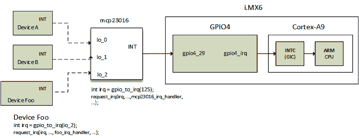

# 第十六章：*第十六章*：最大化利用引脚控制器和 GPIO 子系统

**系统芯片**（**SoC**）变得越来越复杂，功能越来越丰富。这些功能大多通过来自 SoC 的电气线路暴露出来，并被称为引脚。这些引脚大多数被路由到或与多个功能模块复用（例如，UART、SPI、RGMI、**通用输入输出**（**GPIO**）等），负责配置这些引脚并在操作模式之间切换（在功能模块之间切换）的底层设备被称为**引脚控制器**。

其中一种配置这些引脚的模式是**GPIO**。接着是 Linux GPIO 子系统，它使驱动程序能够读取 GPIO 配置引脚的高低电平信号，并且能够在 GPIO 配置的引脚上驱动信号的高/低电平。另一方面，**引脚控制**（简称**pinctrl**）子系统使得一些引脚/引脚组可以用于不同的功能，并能够配置引脚的电子属性，如上升/下降速率、上拉/下拉电阻、滞后等。

总结来说，引脚控制器主要做两件事：引脚复用，即将相同的引脚用于不同的目的，以及引脚配置，即配置引脚的电子属性。然后，GPIO 子系统允许驱动引脚，前提是这些引脚已经通过引脚控制器配置为 GPIO 模式。

在本章中，将通过以下主题介绍引脚控制器和 GPIO 子系统：

+   一些硬件术语介绍

+   引脚控制子系统简介

+   处理 GPIO 控制器接口

+   最大化利用 GPIO 消费者接口

+   学习如何不编写 GPIO 客户端驱动

# 一些硬件术语介绍

Linux 内核 GPIO 子系统不仅仅是 GPIO 翻转。它与引脚控制子系统紧密耦合；它们共享一些术语和概念，我们需要在此介绍：

+   **引脚**和**接触点**：引脚是一个物理输入或输出线/导线，用于传输电信号到或来自一个组件。在电路图中，“引脚”这一术语被广泛使用。另一方面，接触点是印刷电路板或集成电路的接触面区域。因此，引脚来源于接触点，且默认情况下，引脚即为接触点。

+   **GPIO**：大多数 MCU 和 CPU 可以在多个功能模块之间共享一个接触点。这是通过对接触点的输入和输出信号进行复用来实现的。引脚/接触点可以操作的不同模式被称为**ALT 模式**（或备用模式），通常 CPU 支持每个接触点最多八种设置（或模式）。GPIO 就是其中一种模式。它允许在配置为输入时改变引脚方向并读取其值，或在配置为输出时设置其值。其他模式包括 ADC、UART Tx、UART Rx、SPI MOSI、SPI MISO、PWM 等。

+   **引脚控制器**：这是底层设备或控制器（或者更确切地说，是一组寄存器），允许你执行**引脚复用**（也称为**pinmux**或**pinmuxing**），以便将同一个引脚用于不同的目的。除了引脚复用，它还允许引脚配置，即配置引脚的电子属性。以下是这些属性的一些示例：

    +   **偏置**，即设置初始工作条件，例如将引脚接地或连接到 Vdd。这与上拉和下拉有所不同，后者是另一种属性。

    +   **引脚去抖动**，即应在此时间后认为状态有效。例如，这可以防止按键盘上附着在 GPIO 线上的多个按键。

    +   **切换速率**，它决定了引脚在两个逻辑状态之间切换的速度。它使我们能够控制输出信号的上升和下降时间。必须找到一个权衡，因为快速切换状态会消耗更多的电力并产生尖峰，因此，除非是快速控制信号（如并行接口：EIM、EB&、SPI 或 SDRAM 等需要快速切换的信号），否则应偏好较低的切换速率。

    +   上拉/下拉电阻

+   **GPIO 控制器**：这是当引脚处于 GPIO 模式时，允许你驱动引脚的设备。它允许更改 GPIO 的方向和值。

根据之前的定义，已经为编写引脚控制器或 GPIO 控制器驱动程序建立了一些通用规则，它们如下所示：

+   如果你的 GPIO/引脚控制器仅能执行简单的 GPIO 操作，只需在`drivers/gpio/gpio-foo.c`中实现`struct gpio_chip`并留在那里。不要使用通用的或旧式的基于数字的 GPIO。

+   如果 GPIO/引脚控制器除了 GPIO 功能外还能生成中断，请将其保存在`drivers/gpio`中；只需填写`struct irq_chip`并将其注册到 IRQ 子系统中。

+   如果该控制器支持引脚复用、高级引脚驱动强度、复杂的偏置等，请在`drivers/pinctrl/pinctrl-foo.c`中实现复合引脚控制器驱动程序。

+   维护`struct gpio_chip`、`struct irq_chip`和`struct pinctrl_desc`接口。

现在我们已经熟悉了与底层硬件设备相关的术语，让我们介绍 Linux 实现，从引脚控制子系统开始。

# 引脚控制子系统介绍

引脚控制器允许收集引脚、这些引脚应该操作的模式及其配置。驱动程序负责根据要实现的功能提供适当的回调集，前提是底层硬件支持这些功能。

引脚控制器描述符数据结构定义如下：

```
struct pinctrl_desc {
     const char *name;
     const struct pinctrl_pin_desc *pins;
     unsigned int npins;
     const struct pinctrl_ops *pctlops;
     const struct pinmux_ops *pmxops;
     const struct pinconf_ops *confops;
     struct module *owner;
[...]
};
```

在该引脚控制器数据结构中，仅列出了相关元素，以下是它们的含义：

+   `name`是引脚控制器的名称。

+   `pins`: 描述此控制器可以处理的所有引脚的引脚描述符数组。需要注意的是，控制器方将每个引脚/垫片表示为`struct pinctrl_pin_desc`的实例，定义如下：

    ```
    struct pinctrl_pin_desc {
         unsigned number;
         const char *name;
    [...]
    };
    ```

在上述数据结构中，`number`表示来自引脚控制器全局引脚号空间的唯一引脚编号，`name`是该引脚的名称。

+   `npins`: `pins`数组中的描述符数量，通常通过`ARRAY_SIZE()`在`pins`字段中获得。

+   `pctlops`存储引脚控制操作表，用于支持引脚分组等全局概念。这是可选的。

+   `pmxops`表示如果您的驱动程序支持引脚多路复用，则为**pinmux**操作表。

+   `confops`: 如果您的驱动程序支持引脚配置，这是引脚配置操作表。

一旦适当的回调被定义，并且此数据结构已经初始化，它可以被传递给`devm_pinctrl_register()`，定义如下：

```
struct pinctrl_dev *devm_pinctrl_register(
                      struct device *dev,
                      struct pinctrl_desc *pctldesc,
                      void *driver_data);
```

上述函数将把引脚控制器注册到系统，并同时返回一个指向`struct pinctrl_dev`实例的指针，表示引脚控制器设备，作为参数传递给引脚控制器驱动暴露的绝大多数（如果不是所有）回调操作。出现错误时，函数返回一个错误指针，可以通过`PTR_ERR`进行处理。

控制器的控制、多路复用和配置操作表应根据底层硬件支持的特性进行设置。它们各自的数据结构在头文件中定义，这些头文件必须包含在驱动程序中，具体如下：

```
#include <linux/pinctrl/pinconf.h>
#include <linux/pinctrl/pinconf-generic.h>
#include <linux/pinctrl/pinctrl.h>
#include <linux/pinctrl/pinmux.h>
```

当涉及到引脚控制消费者接口时，必须使用以下头文件：

```
#include <linux/pinctrl/consumer.h>
```

在消费者驱动程序访问引脚之前，必须将引脚分配给需要控制它们的设备。推荐的引脚分配方式是通过**设备树**（**DT**）。引脚组如何在设备树中分配，密切依赖于平台，因此也与引脚控制器驱动程序及其绑定有关。

每个引脚控制状态都会分配一个连续的整数 ID，从 0 开始。可以使用`name`属性列表将字符串映射到这些 ID 上，以确保相同的名称始终指向相同的 ID。不言而喻，必须在每个设备的设备树节点（DT 节点）中定义的状态集由该设备的绑定决定。这个绑定还决定是否定义必须提供的状态 ID 集，或者是否定义必须提供的状态名称集。在任何情况下，都可以使用两个属性将引脚配置节点分配给设备：

+   `pinctrl-<ID>`：此项允许为设备的特定状态提供所需的引脚配置列表。它是一个由`<ID>`标识的`phandle`列表，每个`phandle`指向一个引脚配置节点。这些引用的引脚配置节点必须是它们所属引脚控制器节点的子节点（或嵌套节点）。该属性可以接受多个条目，以便为特定设备状态配置和使用多个引脚组，同时允许指定来自不同引脚控制器的引脚。

+   `pinctrl-names`：此项允许根据设备拥有引脚组的状态为`pinctrl-<ID>`属性命名。列表条目 0 为 ID 为 0 的状态定义名称，条目 1 为 ID 为 1 的状态定义名称，以此类推。状态 ID 0 通常命名为`default`。标准化状态的列表可以在`include/linux/pinctrl/pinctrl-state.h`中找到。然而，客户端或消费者驱动程序可以根据需要实现任何状态，只要该状态在设备绑定描述中有所记录。

下面是设备树的摘录，展示了一些设备节点以及它们的引脚控制节点。我们将此摘录命名为`pinctrl-excerpt`：

```
&usdhc4 {
[...]
     pinctrl-0 = <&pinctrl_usdhc4_1>;
     pinctrl-names = "default";
};
gpio-keys {
    compatible = "gpio-keys";
    pinctrl-names = "default";
    pinctrl-0 = <&pinctrl_io_foo &pinctrl_io_bar>;
};
iomuxc@020e0000 { /* Pin controller node */
    compatible = "fsl,imx6q-iomuxc";
    reg = <0x020e0000 0x4000>;
    /* shared pinctrl settings */
    usdhc4 { /* first node describing the function */
        pinctrl_usdhc4_1: usdhc4grp-1 { /* second node */
            fsl,pins = <
                MX6QDL_PAD_SD4_CMD__SD4_CMD    0x17059
                MX6QDL_PAD_SD4_CLK__SD4_CLK    0x10059
                MX6QDL_PAD_SD4_DAT0__SD4_DATA0 0x17059
                MX6QDL_PAD_SD4_DAT1__SD4_DATA1 0x17059
                MX6QDL_PAD_SD4_DAT2__SD4_DATA2 0x17059
                MX6QDL_PAD_SD4_DAT3__SD4_DATA3 0x17059
                [...]
            >;
        };
    };
    [...]
    uart3 {
        pinctrl_uart3_1: uart3grp-1 {
            fsl,pins = <
                MX6QDL_PAD_EIM_D24__UART3_TX_DATA 0x1b0b1
                MX6QDL_PAD_EIM_D25__UART3_RX_DATA 0x1b0b1
            >;
        };
    };
    // GPIOs (Inputs)
   gpios {
        pinctrl_io_foo: pinctrl_io_foo {
           fsl,pins = <
              MX6QDL_PAD_DISP0_DAT15__GPIO5_IO09  0x1f059
              MX6QDL_PAD_DISP0_DAT13__GPIO5_IO07  0x1f059
           >;
        };
        pinctrl_io_bar: pinctrl_io_bar {
           fsl,pins = <
              MX6QDL_PAD_DISP0_DAT11__GPIO5_IO05  0x1f059
              MX6QDL_PAD_DISP0_DAT9__GPIO4_IO30   0x1f059
              MX6QDL_PAD_DISP0_DAT7__GPIO4_IO28   0x1f059
           >;
        };
    };
};
```

在前面的例子中，引脚配置以`<PIN_FUNCTION> <PIN_SETTING>`的形式给出，其中`<PIN_FUNCTION>`可以看作是引脚功能或引脚模式，而`<PIN_SETTING>`表示引脚的电气特性：

```
MX6QDL_PAD_DISP0_DAT15__GPIO5_IO09 0x80000000
```

在这个摘录中，`MX6QDL_PAD_DISP0_DAT15__GPIO5_IO09`表示引脚功能/模式，在此情况下为 GPIO，而`0x80000000`表示引脚设置或电气特性。

让我们考虑一个新的例子，如下所示：

```
MX6QDL_PAD_EIM_D25__UART3_RX_DATA 0x1b0b1
```

在这个摘录中，`MX6QDL_PAD_EIM_D25__UART3_RX_DATA`表示引脚功能，是 UART3 的 RX 线路，而`0x1b0b1`表示其电气设置。

引脚功能是一个宏，其值对引脚控制器驱动程序有意义。通常，这些宏在`arch/<arch>/boot/dts/`目录下的头文件中定义。例如，如果使用的是 UDOO quad，它具有 i.MX6 四核（32 位 ARM），那么引脚功能头文件为`arch/arm/boot/dts/imx6q-pinfunc.h`。以下是 GPIO5 控制器第五行对应的宏：

```
#define MX6QDL_PAD_DISP0_DAT11__GPIO5_IO05 0x19c 0x4b0 0x000 0x5 0x0
```

`<PIN_SETTING>`可用于设置诸如上拉、下拉、保持器、驱动强度等功能。如何指定这些设置取决于引脚控制器绑定，且其值的含义依赖于 SoC 数据手册，通常在 IOMUX 部分中可以找到。在 i.MX6 IOMUXC 中，仅使用最低 17 位来实现此目的。

回到`pinctrl-excerpt`，在选择引脚组并应用其配置之前，驱动程序必须首先通过`devm_inctrl_get()`函数获取该引脚组的句柄，然后使用`pinctrl_lookup_state()`选择合适的状态，最后通过`pinctrl_select_state()`将相应的配置状态应用于硬件。

以下是一个示例，展示了如何抓取一个引脚控制组并应用其默认配置：

```
#include <linux/pinctrl/consumer.h>
int ret;
struct pinctrl_state *s;
struct pinctrl *p;
foo_probe()
{
    p = devm_pinctrl_get(dev);
    if (IS_ERR(p))
        return PTR_ERR(p);
    s = pinctrl_lookup_state(p, name);
    if (IS_ERR(s))
        return PTR_ERR(s);
    ret = pinctrl_select_state(p, s);
    if (ret < 0) // on error
        return ret;
[...]
}
```

与其他资源（如内存区域、时钟等）一样，从 `probe()` 函数中抓取引脚并应用其配置是一个良好的实践。然而，这一操作如此常见，以至于它已被集成到 Linux 设备核心中，作为设备探测过程中的一个步骤。因此，在设备探测时，设备核心会执行以下操作：

+   使用 `devm_pinctrl_get()` 抓取即将被探测的设备分配的引脚。

+   使用 `pinctrl_lookup_state()` 查找默认引脚状态（`PINCTRL_STATE_DEFAULT`）。

+   同时使用相同的 API 查找初始化（即设备初始化期间）引脚状态（`PINCTRL_STATE_INIT`）。

+   如果有初始化引脚状态，则应用它，否则应用默认引脚状态。

+   如果启用了电源管理，则查找可选的休眠（`PINCTRL_STATE_SLEEP`）和空闲（`PINCTRL_STATE_IDLE`）引脚状态，以便在后续的电源管理相关操作中使用。

请参阅 `pinctrl_bind_pins()` 函数（定义在 `drivers/base/pinctrl.c` 中）和 `really_probe()` 函数（定义在 `drivers/base/dd.c` 中），后者调用了前者。这些函数将帮助您了解如何在设备探测过程中将引脚绑定到设备。

注意

`pinctrl_select_state()` 内部调用 `pinmux_enable_setting()`，后者又在引脚控制（引脚组）节点中的每个引脚上调用 `pin_request()`。

`pinctrl_put()` 函数可用于释放通过非管理 API，即 `pinctrl_get()` 请求的引脚控制。也就是说，您可以使用 `devm_pinctrl_get_select()`，给定要选择的状态名称，以便一次性配置引脚复用。此函数在 `include/linux/pinctrl/consumer.h` 中定义，如下所示：

```
static struct pinctrl *devm_pinctrl_get_select(
                  struct device *dev, const char *name)
```

在前面的原型中，`name` 是在 `pinctrl-name` 属性中编写的状态名称。如果状态名称是 `default`，可以使用辅助函数 `devm_pinctr_get_select_default()`，它是 `devm_pinctrl_get_select()` 的一个封装，如下所示：

```
static struct pinctrl * pinctrl_get_select_default(
                                      struct device *dev)
{
   return pinctrl_get_select(dev, PINCTRL_STATE_DEFAULT);
}
```

现在我们已经熟悉了引脚控制子系统（包括控制器和消费者接口），我们可以学习如何处理 GPIO 控制器，了解 GPIO 是引脚可以工作的操作模式。

# 处理 GPIO 控制器接口

GPIO 控制器接口围绕一个单一的数据结构 `struct gpio_chip` 设计。这个数据结构提供了一组函数，其中包括设置 GPIO 方向（输入和输出）的方法、用于访问 GPIO 值（获取和设置）的方法、将特定 GPIO 映射到 IRQ 并返回相关 Linux 中断号的方法，以及 `debugfs` 转储方法（显示如拉高配置等附加状态）。除了这些函数外，该数据结构还提供了一个标志，用于确定控制器的性质，即允许检查该控制器的访问器是否可能进入休眠状态。在这个数据结构内，驱动程序还可以设置 GPIO 基础编号，从此编号开始 GPIO 编号。

回到代码，GPIO 控制器表示为 `struct gpio_chip` 的一个实例，该结构体在 `<linux/gpio/driver.h>` 中定义如下：

```
struct gpio_chip {
     const char       *label;
     struct gpio_device    *gpiodev;
     struct device         *parent;
     struct module         *owner;
     int        (*request)(struct gpio_chip *gc,
                           unsigned int offset);
     void       (*free)(struct gpio_chip *gc,
                           unsigned int offset);
     int       (*get_direction)(struct gpio_chip *gc,
                           unsigned int offset);
     int       (*direction_input)(struct gpio_chip *gc,
                           unsigned int offset);
     int       (*direction_output)(struct gpio_chip *gc,
                      unsigned int offset, int value);
     int       (*get)(struct gpio_chip *gc,
                           unsigned int offset);
     int       (*get_multiple)(struct gpio_chip *gc,
                           unsigned long *mask,
                           unsigned long *bits);
     void       (*set)(struct gpio_chip *gc,
                      unsigned int offset, int value);
     void       (*set_multiple)(struct gpio_chip *gc,
                           unsigned long *mask,
                           unsigned long *bits);
     int        (*set_config)(struct gpio_chip *gc,
                            unsigned int offset,
                            unsigned long config);
     int        (*to_irq)(struct gpio_chip *gc,
                           unsigned int offset);
     int       (*init_valid_mask)(struct gpio_chip *gc,
                              unsigned long *valid_mask,
                              unsigned int ngpios);
     int       (*add_pin_ranges)(struct gpio_chip *gc);
     int        base;
     u16        ngpio;
     const char *const *names;
     bool       can_sleep;
#if IS_ENABLED(CONFIG_GPIO_GENERIC)
     unsigned long (*read_reg)(void __iomem *reg);
     void (*write_reg)(void __iomem *reg, unsigned long data);
     bool be_bits;
     void __iomem *reg_dat;
     void __iomem *reg_set;
     void __iomem *reg_clr;
     void __iomem *reg_dir_out;
     void __iomem *reg_dir_in;
     bool bgpio_dir_unreadable;
     int bgpio_bits;
     spinlock_t bgpio_lock;
     unsigned long bgpio_data;
     unsigned long bgpio_dir;
#endif /* CONFIG_GPIO_GENERIC */
#ifdef CONFIG_GPIOLIB_IRQCHIP
     struct gpio_irq_chip irq;
#endif /* CONFIG_GPIOLIB_IRQCHIP */
     unsigned long *valid_mask;
#if defined(CONFIG_OF_GPIO)
     struct device_node *of_node;
     unsigned int of_gpio_n_cells;
     int (*of_xlate)(struct gpio_chip *gc,
                const struct of_phandle_args *gpiospec,
                u32 *flags);
#endif /* CONFIG_OF_GPIO */
};
```

以下是结构体中各个元素的含义：

+   `label`：这是 GPIO 控制器的功能名称。它可以是一个零件编号，或者是实现该功能的 SoC IP 块的名称。

+   `gpiodev`：这是 GPIO 控制器的内部状态容器。它也是通过该结构体暴露与该 GPIO 控制器相关联的字符设备。

+   `request` 是一个可选的挂钩，用于芯片特定的激活。如果提供，它会在每次调用 `gpio_request()` 或 `gpiod_get()` 时，在分配 GPIO 之前执行。

+   `free` 是一个可选的挂钩，用于芯片特定的停用。如果提供，它会在你调用 `gpiod_put()` 或 `gpio_free()` 时，在 GPIO 被释放之前执行。

+   `get_direction` 每当你需要知道 GPIO 偏移量的方向时执行。返回值应为 `0` 表示输出，`1` 表示输入（与 `GPIOF_DIR_XXX` 相同），或者返回负错误码。

+   `direction_input` 将信号偏移量配置为输入，或者返回一个错误。

+   `get` 返回 GPIO 偏移量的值；对于输出信号，这返回的是实际感测到的值，或者返回零。

+   `set` 将输出值分配给 GPIO 偏移量。

+   `set_multiple` 在需要为由 `mask` 定义的多个信号分配输出值时调用。如果未提供，内核将安装一个通用挂钩，遍历掩码位，并在每个设置的位上执行 `chip->set(i)`。请参见这里如何实现此功能：

    ```
     static void gpio_chip_set_multiple(
                        struct gpio_chip *chip,
                        unsigned long *mask,
                        unsigned long *bits)
    {
        if (chip->set_multiple) {
            chip->set_multiple(chip, mask, bits);
        } else {
            unsigned int i;
            /*
             * set outputs if the corresponding
             * mask bit is set
             */
            for_each_set_bit(i, mask, chip->ngpio)
                chip->set(chip, i, test_bit(i, bits));
            }
    }
    ```

+   `set_debounce` 如果控制器支持，此挂钩是一个可选的回调函数，用于设置指定 GPIO 的去抖动时间。

+   `to_irq` 是一个可选的挂钩，用于提供 GPIO 到 IRQ 的映射。每当你想执行 `gpio_to_irq()` 或 `gpiod_to_irq()` 函数时，它都会被调用。此实现可能不会进入休眠状态。

+   `base` 指示该芯片处理的第一个 GPIO 编号；或者，如果在注册时为负数，内核将自动（动态）分配一个编号。

+   `ngpio` 是该控制器提供的 GPIO 数量，从 base 开始到（`base` + `ngpio - 1`）。

+   `names`，如果不是 `NULL`，必须是一个字符串数组，用作此芯片中 GPIO 的替代名称。该数组必须与 `ngpio` 的大小一致，任何不需要别名的 GPIO 可以在数组中将其条目设置为 `NULL`。

+   `can_sleep` 是一个布尔标志，表示 `get()`/`set()` 方法是否可能会使系统进入休眠状态。这对于那些位于 I2C 或 SPI 总线上的 GPIO 控制器（也称为 GPIO 扩展器）来说是必需的，因为它们的访问可能会导致休眠。这意味着，如果芯片支持 IRQ，则这些 IRQ 必须使用线程处理，因为芯片访问可能会在读取 IRQ 状态寄存器时导致休眠。对于映射到内存的 GPIO 控制器（SoC 的一部分），此值可以设置为 `false`。

+   由 `CONFIG_GPIO_GENERIC` 启用的元素与通用内存映射的 GPIO 控制器有关，具有标准寄存器集。

+   `irq`：如果该 GPIO 控制器可以将 GPIO 映射到 IRQ，则为该控制器的 IRQ 芯片。在这种情况下，必须在注册 GPIO 控制器之前设置此字段。

+   `valid_mask`：如果不是 `NULL`，则此元素包含一个 GPIO 的位掩码，表示该芯片中哪些 GPIO 是有效的。

+   `of_node` 是指向表示该 GPIO 控制器的设备树节点的指针。

+   `of_gpio_n_cells` 是用于形成 GPIO 说明符的单元数量。

+   `of_xlate` 是一个回调函数，用于将设备树中的 GPIO 说明符转换为与芯片相关的 GPIO 编号和标志。当设备树中指定此控制器的 GPIO 引脚时，将调用此钩子进行解析。如果未提供此回调，GPIO 核心将默认设置为 `of_gpio_simple_xlate()`，这是一个通用的 GPIO 核心助手，支持两单元说明符。第一个单元表示 GPIO 编号，第二个单元表示 GPIO 标志。此外，在设置默认回调时，`of_gpio_n_cells` 将设置为 `2`。如果 GPIO 控制器需要一个或多个单元说明符，则必须实现相应的翻译回调。

每个 GPIO 控制器都会暴露多个信号，这些信号在函数调用中通过 `0` 到 (`ngpio - 1`) 范围内的偏移值来标识。当通过 `gpio_get_value(gpio)` 等调用引用这些 GPIO 引脚时，偏移量由将 `base` 从 GPIO 编号中减去得到，并传递给底层驱动程序函数（例如 `gpio_chip->get()`）。然后，控制器驱动程序应具有将此偏移量映射到与 GPIO 相关的控制/状态寄存器的逻辑。

## 编写 GPIO 控制器驱动程序

一个 GPIO 控制器只需要与其支持的功能相对应的一组回调。定义完所有感兴趣的回调并设置其他字段后，驱动程序应在配置的`struct gpio_chip`结构上调用`devm_gpiochip_add_data()`，以便将控制器注册到内核中。你可能已经猜到，最好使用托管 API（以`devm_`为前缀），因为它会在必要时处理芯片移除和资源释放。如果你使用了传统方法，则必须使用`gpiochip_remove()`在必要时移除芯片：

```
int gpiochip_add_data(struct gpio_chip *gc, void *data)
int devm_gpiochip_add_data(struct device *dev,
                        struct gpio_chip *gc, void *data)
```

在上述原型中，`gc`是要注册的芯片，`data`是与该芯片相关的驱动程序私有数据。如果芯片无法注册（例如，`gc->base`无效或已与其他芯片关联），它们将返回一个负的错误代码。否则，它们将返回零作为成功代码。

然而，也有一些引脚控制器与 GPIO 芯片紧密耦合，二者在同一个驱动程序中实现，很多代码都在`drivers/pinctrl/pinctrl-*.c`中。在这样的驱动程序中，当调用`gpiochip_add_data()`时，对于支持设备树的系统，GPIO 核心将检查引脚控制的设备节点是否具有`gpio-ranges`属性。如果存在，它将负责为驱动程序添加引脚范围。

然而，驱动程序必须调用`gpiochip_add_pin_range()`，以便与不设置`gpio-ranges`属性的旧设备树文件或使用 ACPI 的系统兼容。以下是一个示例：

```
if (!of_find_property(np, "gpio-ranges", NULL)) {
     ret = gpiochip_add_pin_range(chip,
                   dev_name(hw->dev), 0, 0, chip->ngpio);
     if (ret < 0) {
           gpiochip_remove(chip);
           return ret;
     }
}
```

再次强调，前述内容仅用于向后兼容那些没有`gpio-ranges`属性的旧`pinctrl`节点。否则，从支持设备树的引脚控制器驱动程序直接调用`gpiochip_add_pin_range()`已被弃用。请参阅`Documentation/devicetree/bindings/gpio/gpio.txt`中的*第 2.1 节*，了解如何通过`gpio-ranges`属性绑定引脚控制器和 GPIO 驱动程序。

我们可以看到编写一个 GPIO 控制器驱动程序是多么容易。在本书的源码仓库中，你将找到一个功能正常的 GPIO 控制器驱动程序，适用于来自 Microchip 的 MCP23016 I2C I/O 扩展器，其数据手册可以在[`ww1.microchip.com/downloads/en/DeviceDoc/20090C.pdf`](http://ww1.microchip.com/downloads/en/DeviceDoc/20090C.pdf)找到。

要编写此类驱动程序，应该包含以下头文件：

```
#include <linux/gpio.h> 
```

以下是我们为控制器编写的驱动程序的摘录：

```
#define GPIO_NUM 16
struct mcp23016 {
    struct i2c_client *client;
    struct gpio_chip gpiochip;
    struct mutex lock;
};
static int mcp23016_probe(struct i2c_client *client)
{
  struct mcp23016 *mcp;

  if (!i2c_check_functionality(client->adapter,
      I2C_FUNC_SMBUS_BYTE_DATA))
    return -EIO;
  mcp = devm_kzalloc(&client->dev, sizeof(*mcp),
                      GFP_KERNEL);
  if (!mcp)
    return -ENOMEM;
  mcp->gpiochip.label = client->name;
  mcp->gpiochip.base = -1;
  mcp->gpiochip.dev = &client->dev;
  mcp->gpiochip.owner = THIS_MODULE;
  mcp->gpiochip.ngpio = GPIO_NUM; /* 16 */
  /* may not be accessed from atomic context */
  mcp->gpiochip.can_sleep = 1; 
  mcp->gpiochip.get = mcp23016_get_value;
  mcp->gpiochip.set = mcp23016_set_value;
  mcp->gpiochip.direction_output =
                          mcp23016_direction_output;
  mcp->gpiochip.direction_input =
                          mcp23016_direction_input;
  mcp->client = client;
  i2c_set_clientdata(client, mcp);
  return devm_gpiochip_add_data(&client->dev,
                                &mcp->gpiochip, mcp);
}
```

在上述摘录中，GPIO 芯片数据结构在传递给`devm_gpiochip_get_data()`之前已经设置好，该函数用于将 GPIO 控制器注册到系统中。结果，GPIO 字符设备节点将出现在`/dev`下。

### 启用 IRQ 芯片的 GPIO 控制器

可以通过设置嵌入到 GPIO 控制器数据结构中的 `struct gpio_irq_chip` 结构来启用 IRQ 芯片支持。这个 `struct gpio_irq_chip` 结构用于将与 GPIO 芯片的中断处理相关的所有字段进行分组，定义如下：

```
struct gpio_irq_chip {
     struct irq_chip *chip;
     struct irq_domain *domain;
     const struct irq_domain_ops *domain_ops;
     irq_flow_handler_t handler;
     unsigned int default_type;
     irq_flow_handler_t parent_handler;
     union {
          void *parent_handler_data;
          void **parent_handler_data_array;
     };
     unsigned int num_parents;
     unsigned int *parents;
     unsigned int *map;
     bool threaded;
     bool per_parent_data;
     int (*init_hw)(struct gpio_chip *gc);
     void (*init_valid_mask)(struct gpio_chip *gc,
                      unsigned long *valid_mask,
                      unsigned int ngpios);
     unsigned long *valid_mask;
     unsigned int first;
     void       (*irq_enable)(struct irq_data *data);
     void       (*irq_disable)(struct irq_data *data);
     void       (*irq_unmask)(struct irq_data *data);
     void       (*irq_mask)(struct irq_data *data);
};
```

有一些架构可能涉及多个中断控制器，负责将设备的中断传递到目标 CPU。这个功能可以通过设置内核中的 `CONFIG_IRQ_DOMAIN_HIERARCHY` 配置选项来启用。

在前面的数据结构中，一些元素被省略了。这些是由 `CONFIG_IRQ_DOMAIN_HIERARCHY` 条件控制的元素，即 IRQ 域层次结构相关的字段，本章不会讨论这些内容。对于剩余的元素，以下是它们的定义：

+   `chip` 是 IRQ 芯片的实现。

+   `domain` 是与 `chip` 相关的 IRQ 中断转换域；它负责在 GPIO 硬件 IRQ 编号和 Linux IRQ 编号之间进行映射。

+   `domain_ops` 表示与 IRQ 域相关联的一组中断域操作。

+   `handler` 是 GPIO IRQ 的高级中断流处理程序（通常是预定义的 IRQ 核心函数）。本节稍后会对该字段进行说明。

+   `default_type` 是在 GPIO 驱动程序初始化期间应用的默认 IRQ 触发类型。

+   `parent_handler` 是 GPIO 芯片父中断的中断处理程序。如果父中断是嵌套的而不是链式的，这个字段可能为 `NULL`。此外，将此元素设置为 `NULL` 将允许在驱动程序中处理父 IRQ。如果提供了该处理程序，则 `gpio_chip.can_sleep` 不能设置为 `true`，因为无法在可能休眠的芯片上处理链式中断。

+   `parent_handler_data` 和 `parent_handler_data_array` 是与父中断关联的数据，并传递给父中断的处理程序。如果 `per_parent_data` 为 `false`，则它可以是一个单一的指针；如果为 `true`，则是一个包含 `num_parents` 指针的数组。若 `per_parent_data` 为 `true`，则 `parent_handler_data_array` 不能为 `NULL`。

+   `num_parents` 是 GPIO 芯片的中断父级数量。

+   `parents` 是 GPIO 芯片的中断父级列表。由于驱动程序拥有这个列表，核心只会引用它，而不会修改它。

+   `map` 是每个 GPIO 芯片引脚的中断父级列表。

+   `threaded` 表示中断处理是否是线程化的（使用嵌套线程）。

+   `per_parent_data` 指示 `parent_handler_data_array` 是否描述一个 `num_parents` 大小的数组，用作父数据。

+   `init_hw` 是一个可选的例程，用于在添加 IRQ 芯片之前初始化硬件。当驱动程序需要清除与 IRQ 相关的寄存器，以避免不必要的事件时，这非常有用。

+   `init_valid_mask`是一个可选的回调函数，可以用于初始化`valid_mask`，如果并非所有 GPIO 线路都可以作为有效的中断源，则使用此回调。可能存在一些无法触发中断的线路，当定义此回调时，它会接收到`valid_mask`中的位图，该位图会将`ngpios`个比特位（从`0..(ngpios-1)`）设置为`1`，表示有效。回调函数可以直接将一些位设置为`0`，如果这些线路不能用于中断。

+   `valid_mask` 如果不是 `NULL`，则包含一个 GPIO 位掩码，表示哪些 GPIO 是有效的，可以包含在芯片的 IRQ 域中。

+   `first` 在静态 IRQ 分配的情况下是必需的。如果设置了此选项，`irq_domain_add_simple()`将在初始化期间分配（从该值开始）并映射所有 IRQ。

+   `irq_enable`、`irq_disable`、`irq_unmask` 和 `irq_mask` 分别存储了旧的 `irq_chip.irq_enable`、`irq_chip.irq_disable`、`irq_chip.irq_unmask` 和 `irq_chip.irq_mask` 回调函数。详细说明请参见 *第十三章*，*揭开内核 IRQ 框架的神秘面纱*。

在假设你的中断是 1 对 1 映射到 GPIO 线路索引的前提下，`gpiolib`将处理大量的开销代码。在这种 1 对 1 映射中，GPIO 线路偏移量 0 映射到硬件 IRQ 0，GPIO 线路偏移量`1`映射到硬件 IRQ `1`，以此类推，直到 GPIO 线路偏移量`ngpio-1`，它映射到硬件 IRQ `ngpio-1`。位掩码`valid_mask`和`gpio_irq_chip`中的`need_valid_mask`标志可以用来屏蔽掉一些无效的 GPIO 线路，防止它们与 IRQ 关联，前提是某些 GPIO 线路没有对应的 IRQ。

我们可以将 GPIO IRQ 芯片分为两大类：

+   **级联中断芯片**：这表示 GPIO 芯片具有一条公共的中断输出线路，该线路会被该芯片上任何启用的 GPIO 线路触发。该中断输出线路随后会被路由到上一级的父中断控制器，在最简单的情况下就是系统的主中断控制器。IRQ 芯片通过检查 GPIO 控制器内部的位来实现此功能，以确定是哪一条线路触发了中断。为了弄清楚这一点，驱动程序中的 IRQ 芯片部分需要检查寄存器，几乎肯定需要通过清除一些位来确认它正在处理该中断（有时通过简单地读取状态寄存器来隐式完成），并且还需要设置诸如边缘敏感性（例如上升沿、下降沿或高/低电平中断等）等配置。

+   **层次化中断芯片**：这意味着每条 GPIO 线路通过一条专用的 IRQ 线路连接到上一级的父中断控制器。无需查询 GPIO 硬件即可确定哪条线路触发了中断，但你可能需要确认中断并配置边缘敏感性。

级联 GPIO IRQ 芯片通常可以分为以下三类：

+   **链式级联 GPIO IRQ 芯片**：这类芯片通常出现在 SoC 上。也就是说，GPIO 有一个快速的 IRQ 流量处理程序，该处理程序会在父 IRQ 处理程序（通常是系统中断控制器）的链式调用下被调用。这意味着父 IRQ 芯片会立即调用 GPIO IRQ 芯片的处理程序，同时禁用 IRQ。在其中断处理程序中，GPIO IRQ 芯片将调用类似如下的内容：

    ```
      static irqreturn_t foo_gpio_irq(int irq, void *data)
          chained_irq_enter(...);
          generic_handle_irq(...);
          chained_irq_exit(...);
    ```

由于一切都发生在回调中，链式 GPIO IRQ 芯片无法将 `.can_sleep` 标志设置为 `true`。因此，不能使用像 I2C 这样的慢速总线流量。

+   `链式 GPIO IRQCHIPS`，但它们不使用链式 IRQ 处理程序。GPIO IRQ 会通过通用的 IRQ 处理程序进行分发，该处理程序是通过 `request_irq()` 指定的。在这个 IRQ 处理程序中，GPIO IRQ 芯片最终会调用类似以下的代码：

    ```
    static irqreturn_t gpio_rcar_irq_handler(int irq,
                                        void *dev_id)
        /* go through the entire GPIOs and handle
         * all interrupts
         */
        for each detected GPIO IRQ
            generic_handle_irq(...);
    ```

+   **嵌套线程 GPIO IRQ 芯片**：离芯片的 GPIO 扩展器以及任何其他处于睡眠总线上的 GPIO IRQ 芯片，如 I2C 或 SPI，均属于此类别。

当然，这类驱动程序需要通过缓慢的总线流量来读取 IRQ 状态和其他信息，这些流量可能会导致进一步的 IRQ，因此不能在禁用 IRQ 的快速 IRQ 处理程序中处理。相反，它们必须创建一个线程，并在中断被驱动程序处理之前屏蔽父 IRQ 线。此类驱动程序的显著特点是它在中断处理程序中会调用类似以下的代码：

```
static irqreturn_t pcf857x_irq(int irq,
                               void *data)
{
     struct pcf857x *gpio = data;
     unsigned long change, i, status;
     status = gpio->read(gpio->client);
     mutex_lock(&gpio->lock);
     change = (gpio->status ^ status) &
              gpio->irq_enabled;
     gpio->status = status;
     mutex_unlock(&gpio->lock);
     for_each_set_bit(i, &change, gpio->chip.ngpio)
      child_irq = irq_find_mapping(
                     gpio->chip.irq.domain, i);
        handle_nested_irq(child_irq);
     return IRQ_HANDLED;
}
```

线程化 GPIO IRQ 芯片的特点在于，它们将 `.can_sleep` 标志设置为 `true`，表示在访问 GPIO 时该芯片可以进入休眠状态。

注意

值得回顾的是，`gpio_irq_chip.handler` 是中断流量处理程序。它是高级的 IRQ 事件处理程序，用于调用客户端驱动程序通过 `request_irq()` 或 `request_threaded_irq()` 注册的底层处理程序。其值取决于 IRQ 是否是边缘触发或电平触发。它通常是一个预定义的 IRQ 核心函数，介于 `handle_simple_irq`、`handle_edge_irq` 和 `handle_level_irq` 之间。这些都是内核助手函数，它们在调用真正的 IRQ 处理程序之前和之后执行一些操作。

当父中断处理程序调用 `generic_handle_irq()` 或 `handle_nested_irq()` 时，中断核心将查找与传递的 Linux IRQ 编号对应的 IRQ 描述符结构（Linux 对中断的视图，`struct irq_desc *desc = irq_to_desc(irq)`），并在该描述符上调用 `generic_handle_irq_desc()`，这将导致 `desc->handle_irq(desc)`。你应该注意，`desc->handle_irq` 对应的是之前提供的高级 IRQ 处理程序，该处理程序在通过 `irq_set_chip_and_handler()` 映射此 IRQ 时已分配给 IRQ 描述符。猜猜看，这些 GPIO IRQ 的映射是通过 `gpiochip_irq_map` 完成的，这是默认 IRQ 域操作表（`gpiochip_domain_ops`）的 `.map` 回调，如果驱动程序未提供，它将由 GPIO 核心分配给 GPIO IRQ 芯片。

总结一下，`desc->handle_irq = gpio_irq_chip.handler`，它可能是 `handle_level_irq`、`handle_simple_irq`、`handle_edge_irq` 或（很少）由驱动程序提供的函数。

#### 在 GPIO 芯片中添加 IRQ 芯片支持的示例

在本节中，我们将展示如何将 IRQ 芯片的支持添加到 GPIO 控制器驱动程序中。为此，我们将更新我们最初的驱动程序，更具体地说，是更新探测方法，并实现一个中断处理程序，该处理程序将包含 IRQ 处理逻辑。

让我们考虑以下图示：



图 16.1 – 中断复用

在之前的图示中，假设我们已经将 `io_0` 和 `io_1` 配置为中断线（这是 `DeviceA` 和 `deviceB` 所看到的）。

无论中断是否发生在 `io_0` 或 `io_1`，相同的父中断线将在 GPIO 芯片上被触发。在此步骤中，GPIO 芯片驱动程序必须通过读取 GPIO 控制器的 GPIO 状态寄存器，找出哪个 GPIO 线路（`io_0` 或 `io_1`）真正触发了中断。就像在 MCP23016 芯片的案例中一样，单一的中断线（实际是父中断线）可以用于复用 16 个 GPIO 中断。

现在，让我们更新最初的 GPIO 控制器驱动程序。必须注意的是，由于该设备位于一个较慢的总线上，我们别无选择，只能实现嵌套（线程化）中断流处理。

我们从定义 IRQ 芯片数据结构开始，其中包含 IRQ 核心可以使用的一组回调函数。以下是摘录：

```
static struct irq_chip mcp23016_irq_chip = {
     .name = "gpio-mcp23016",
     .irq_mask = mcp23016_irq_mask,
     .irq_unmask = mcp23016_irq_unmask,
     .irq_set_type = mcp23016_irq_set_type,
};
```

在前述内容中，已定义的回调函数取决于需要。在我们的案例中，我们只实现了与中断（取消）屏蔽相关的回调函数，以及允许设置 IRQ 类型的回调函数。要查看 `struct irq_chip` 结构的完整描述，您可以参考 *第十三章*，*揭开内核 IRQ 框架的面纱*。

现在 IRQ 芯片数据结构已经设置完成，我们可以按照以下方式修改探测方法：

```
static int mcp23016_probe(struct i2c_client *client)
{
    struct gpio_irq_chip *girq;
    struct irq_chip *irqc;
[...]
    girq = &mcp->gpiochip.irq;
    girq->chip = &mcp23016_irq_chip;
    /* This will let us handling the parent IRQ in the driver */
    girq->parent_handler = NULL;
    girq->num_parents = 0;
    girq->parents = NULL;
    girq->default_type = IRQ_TYPE_NONE;
    girq->handler = handle_level_irq;
    girq->threaded = true;
[...]
    /*
     * Directly request the irq here instead of passing
     * a flow-handler.
     */
    err = devm_request_threaded_irq(
                      &client->dev,
                      client->irq,
                      NULL, mcp23016_irq,
                      IRQF_TRIGGER_RISING | IRQF_ONESHOT,
                      dev_name(&i2c->dev), mcp);
[...]

    return devm_gpiochip_add_data(&client->dev,
                                &mcp->gpiochip, mcp);
}
```

在之前的探测方法更新中，我们首先初始化了嵌入到`struct gpio_chip`中的`struct gpio_irq_chip`数据结构，然后注册了一个 IRQ 处理程序，该处理程序作为父级 IRQ 处理程序，负责查询底层 GPIO 芯片，检查任何启用了 IRQ 的 GPIO 是否发生变化，并在有变化时运行其 IRQ 处理程序。

最后，以下是我们的 IRQ 处理程序，必须在`probe`函数之前实现：

```
static irqreturn_t mcp23016_irq(int irq, void *data)
{
    struct mcp23016 *mcp = data;
    unsigned long status, changes, child_irq, i;
    status = read_gpio_status(mcp);
    mutex_lock(&mcp->lock);
    change = mcp->status ^ status;
    mcp->status = status;
    mutex_unlock(&mcp->lock);
    /* Do some stuff, may be adapting "change" according to level */
    [...]
    for_each_set_bit(i, &change, mcp->gpiochip.ngpio) {
        child_irq =
           irq_find_mapping(mcp->gpiochip.irq.domain, i);
        handle_nested_irq(child_irq);
    }
    return IRQ_HANDLED;
}
```

在我们的中断处理程序中，我们简单地读取当前 GPIO，并将其与旧状态进行比较，以确定发生变化的 GPIO。所有的技巧都由`handle_nested_irq()`处理，具体说明请参见*第十三章*，*揭秘内核 IRQ 框架*。

现在我们完成了并且熟悉了 GPIO 控制器驱动程序中 IRQ 芯片的实现，我们可以学习这些 GPIO 控制器的绑定，这将允许在设备树中声明 GPIO 芯片硬件，驱动程序可以理解。

## GPIO 控制器绑定

设备树是嵌入式平台上声明和描述设备的事实标准，特别是在 ARM 架构中。因此，建议新的驱动程序提供相关的设备绑定。

回到 GPIO 控制器，有一些强制性的属性需要提供：

+   `compatible`：这是一个字符串列表，用于匹配将处理该设备的驱动程序。

+   `gpio-controller`：这是一个属性，表示此节点代表一个 GPIO 控制器，告知设备树核心。

+   `gpio-cells`：表示用于描述 GPIO 说明符的单元数。它应与`gpio_chip.of_gpio_n_cells`对应，或者与`gpio_chip.of_xlate`可以处理的值相匹配。对于一个不太复杂的控制器，通常是`<2>`，第一个单元表示 GPIO 编号，第二个单元定义标志位。

如果 GPIO 控制器支持 IRQ 芯片功能，则还需要定义额外的强制性属性，即该控制器是否允许将其 GPIO 线路映射到 IRQ。对于这样的 GPIO 控制器，必须提供以下强制性属性：

+   `interrupt-controller`：某些控制器提供映射到 GPIO 的 IRQ。在这种情况下，属性`#interrupt-cells`也应该设置，通常使用`2`，但这取决于您的需求。第一个单元是引脚编号，第二个单元表示中断标志。

+   `#interrupt-cells`：必须定义为 IRQ 域的`xlate`钩子支持的值，即`irq_domain_ops.xlate`。通常，`irq_domain_xlate_twocell`会作为这个钩子的设置，这是一个通用的内核 IRQ 核心辅助程序，能够处理一个二元单元说明符。

从列出的属性中，我们可以在其总线节点下声明 GPIO 控制器，如下所示：

```
&i2c1
    expander: mcp23016@20 {
        compatible = "microchip,mcp23016";
        reg = <0x20>;
        gpio-controller;
        #gpio-cells = <2>;
        interrupt-controller;
        #interrupt-cells = <2>;
        interrupt-parent = <&gpio4>;
        interrupts = <29 IRQ_TYPE_EDGE_FALLING>;
    };
};
```

这就是控制器端的所有内容。为了展示客户端如何使用 MCP23016 提供的资源，假设我们有两个设备，设备 A，名为`foo`，设备 B，名为`bar`。`bar`设备从我们的控制器中消耗了两个 GPIO 线（它们将用于输出模式），而`foo`设备希望将一个 GPIO 映射到 IRQ。这个配置可以在设备树中声明如下：

```
parent_node {
    compatible = "simple-bus";
    foo_device: foo_device@1c {
        [...]
        reg = <0x1c>;
        interrupt-parent = <&expander>;
        interrupts = <2 IRQ_TYPE_EDGE_RISING>;
    };
    bar_device {
        [...]
        reset-gpios = <&expander 8 GPIO_ACTIVE_HIGH>;
        power-gpios = <&expander 12 GPIO_ACTIVE_HIGH>;
        [...]
    };
};
```

在前面的摘录中，`parent_node`被赋予了`simple-bus`作为`compatible`字符串，以指示设备树核心和平台核心实例化两个平台设备，它们对应我们的节点。在该摘录中，我们还展示了如何指定 GPIO 以及来自我们控制器的 IRQ。每个属性使用的单元数与控制器绑定中的声明相匹配。

### GPIO 与针脚控制器的交互

这两个子系统是紧密相关的。针脚控制器可以将 GPIO 控制器提供的部分或所有 GPIO 路由到封装上的引脚。这允许这些引脚在 GPIO 和其他功能之间进行复用（也称为引脚复用）。

然后可能需要了解哪些 GPIO 与哪些针脚控制器上的引脚对应。`gpio-ranges`属性，下面将描述，表示通过一组离散的范围，映射从针脚控制器本地编号空间到 GPIO 控制器本地编号空间的引脚。

`gpio-ranges`格式如下：

```
<[pin controller phandle], [GPIO controller offset], [pin controller offset], [number of pins]>;
```

GPIO 控制器的偏移量指的是包含范围定义的 GPIO 控制器节点。必须遵循`Documentation/pinctrl/pinctrl-bindings.txt`中定义的绑定规则，这些绑定规则由`phandle`引用的针脚控制器节点来实现。

每个偏移量是一个介于 0 和 N 之间的数字。如果范围构造得当，理论上可以将任意数量的范围叠加起来，仅需一个引脚到 GPIO 线的映射，但在实际中，这些范围通常作为离散集一起收集。

以下是一个例子：

```
gpio-ranges = <&foo 0 20 10>, <&bar 10 50 20>;
```

这意味着以下内容：

+   针脚控制器`foo`上的十个引脚（`20..29`）被映射到 GPIO 线`0..9`。

+   针脚控制器`bar`上的二十个引脚（`50..69`）被映射到 GPIO 线`10..29`。

必须注意，GPIO 有一个全局编号空间，而针脚控制器有一个本地编号空间，因此我们需要定义一种方法来交叉引用它们。

我们希望将引脚`GPIO_5_29`与针脚控制器编号空间中的引脚编号`89`进行映射。以下是定义 GPIO 与引脚控制子系统之间映射的设备树属性：

```
&gpio5 {
    gpio-ranges = <&pinctrl 29 89 1> ;
}
```

在前面的摘录中，来自 GPIO 银行 5 的第 29 条 GPIO 线的 1 条 GPIO 线将被映射到针脚控制器`pinctrl`上从 89 开始的引脚范围。

为了在实际平台上说明这一点，假设我们有 i.MX6 SoC，它每个银行有 32 个 GPIO。以下是来自 i.MX6 SoC 的针脚控制器节点摘录，声明在`arch/arm/boot/dts/imx6qdl.dtsi`中，其驱动程序是`drivers/pinctrl/freescale/pinctrl-imx6dl.c`：

```
iomuxc: pinctrl@20e0000 {
    compatible = "fsl,imx6dl-iomuxc", "fsl,imx6q-iomuxc";
    reg = <0x20e0000 0x4000>;
};
```

现在引脚控制器已声明，在相同的基础设备树`arch/arm/boot/dts/imx6qdl.dtsi`中声明了一个 GPIO 控制器（bank3），如下所示：

```
gpio3: gpio@20a4000 {
    compatible = "fsl,imx6q-gpio", "fsl,imx35-gpio";
    reg = <0x020a4000 0x4000>;
    interrupts = <0 70 IRQ_TYPE_LEVEL_HIGH>,
                 <0 71 IRQ_TYPE_LEVEL_HIGH>;
    gpio-controller;
    #gpio-cells = <2>;
    interrupt-controller;
    #interrupt-cells = <2>;
};
```

供参考，这个 GPIO 控制器的驱动程序是`drivers/gpio/gpio-mxc.c`。在基础设备树中声明 GPIO 控制器节点后，类似的 GPIO 控制器节点将在 SoC 特定的基础设备树`arch/arm/boot/dts/imx6q.dtsi`中被覆盖，如下所示：

```
&gpio3 {
     gpio-ranges = <&iomuxc 0 69 16>, <&iomuxc 16 36 8>,
                  <&iomuxc 24 45 8>;
};
```

上述对 GPIO 控制器节点的覆盖意味着以下内容：

+   `<&iomuxc 0 69 16>`表示，从引脚控制器`iomuxc`上的引脚 69（到 84）开始的 16 个引脚被映射到从索引 0（到 15）开始的 GPIO 线路。

+   `<&iomuxc 16 36 8>`表示，从引脚控制器`iomuxc`上的引脚 36（到 43）开始的 8 个引脚被映射到从索引 16（到 23）开始的 GPIO 线路。

+   `<&iomuxc 24 45 8>`表示，从引脚控制器`iomuxc`上的引脚 45（到 52）开始的 8 个引脚被映射到从索引 24（到 31）开始的 GPIO 线路。

如预期的那样，我们有一个 32 线的 GPIO 银行，`16 + 8 + 8`。

目前，我们能够理解现有的 GPIO 控制器，并实例化与一个或多个引脚控制器交互的 GPIO 控制器。从 GPIO 控制器绑定学习曲线的最后一步开始，让我们学习如何占用 GPIO，以避免编写特定的驱动程序（或防止使用现有的驱动程序）来控制它们。

### 引脚占用（Pin hogging）

GPIO 芯片可以包含 GPIO hog 定义。GPIO 占用是一种机制，提供自动 GPIO 请求和配置，作为 GPIO 控制器驱动程序探测功能的一部分。这意味着，一旦引脚控制设备注册，GPIO 核心将尝试在其上调用`devm_pinctrl_get()`、`lookup_state()`和`select_state()`。

以下是每个 GPIO hog 定义所需的属性，这些属性表示为 GPIO 控制器的子节点：

+   `gpio-hog`：一个属性，指示该子节点是否代表一个 GPIO hog。

+   `gpios`：包含每个 GPIO 的 GPIO 信息（ID、标志等）。将包含其父节点（GPIO 控制器节点）指定的单元数的整数倍。

+   只能指定以下属性之一，按列出的顺序扫描。这意味着，当多个属性存在时，它们将按此顺序搜索，第一个匹配的将被视为预期配置：

    +   `input`：一个属性，指定 GPIO 方向应设置为输入。

    +   `output-low`：一个属性，指定 GPIO 应配置为输出，且初始状态为低。

    +   `output-high`：一个属性，指定 GPIO 方向应设置为输出，并且初始值为高。

一个可选的属性是`line-name`：GPIO 标签名称。如果没有该属性，将使用节点名称。

以下是一个摘录，其中我们首先在引脚控制器节点中声明（作为 GPIO）我们感兴趣的引脚：

```
&iomuxc {
[...]
    pinctrl_gpio3_hog: gpio3hoggrp {
        fsl,pins = <
            MX6QDL_PAD_EIM_D19__GPIO3_IO19      0x1b0b0
            MX6QDL_PAD_EIM_D20__GPIO3_IO20      0x1b0b0
            MX6QDL_PAD_EIM_D22__GPIO3_IO22      0x1b0b0
            MX6QDL_PAD_EIM_D23__GPIO3_IO23      0x1b0b0
        >;
    };
[...]
}
```

在声明了相关引脚之后，我们可以在 GPIO 控制器所在节点下占用每个 GPIO，如下所示：

```
&gpio3 {
    pinctrl-names = "default";
    pinctrl-0 = <&pinctrl_gpio3_hog>;
    usb-emulation-hog {
        gpio-hog;
        gpios = <19 GPIO_ACTIVE_HIGH>;
        output-low;
        line-name = "usb-emulation";
    };
    usb-mode1-hog {
        gpio-hog;
        gpios = <20 GPIO_ACTIVE_HIGH>;
        output-high;
        line-name = "usb-mode1";
    };
    usb-pwr-hog {
        gpio-hog;
        gpios = <22 GPIO_ACTIVE_LOW>;
        output-high;
       line-name = "usb-pwr-ctrl-en-n";
    };
    usb-mode2-hog {
        gpio-hog;
        gpios = <23 GPIO_ACTIVE_HIGH>;
        output-high;
        line-name = "usb-mode2";
    };
};
```

必须注意，GPIO 占用应仅用于那些没有被特定驱动程序控制的引脚。

GPIO 占用是 GPIO 控制器端的最后一部分。现在控制器已经没有什么秘密可言，让我们切换到消费者接口。

# 最大限度地利用 GPIO 消费者接口

GPIO 是一种功能或模式，指的是引脚在硬件中的操作方式。它不过是一个数字线路，可以作为输入或输出，只有两个值（或状态）：1 表示高，0 表示低。内核的 GPIO 子系统包含了你需要的所有功能，以便在驱动程序中设置和管理 GPIO 线路。

在驱动程序中使用 GPIO 之前，必须首先由内核声明它。这是一种控制 GPIO 并禁止其他驱动程序使用它的手段，同时也防止控制器驱动程序被卸载。

在声明 GPIO 的控制权后，可以执行以下操作：

+   设置方向，并根据需要设置 GPIO 配置。

+   如果作为输出使用，开始切换其输出状态（驱动线路为高或低）。

+   如果作为输入使用，设置防抖时间间隔（如果需要）并读取状态。对于映射到 IRQ 的 GPIO 线路，配置中断应在何种边缘/电平触发，并注册一个处理程序，当中断发生时该处理程序将被执行。

在 Linux 内核中，有两种不同的方式来处理 GPIO：

+   传统的、已弃用的基于整数的接口，使用整数来表示 GPIO。

+   新的基于描述符的接口，其中 GPIO 由一个不透明的结构表示和描述，并提供专用的 API。这是推荐的方式。

虽然我们将在本章中讨论这两种方法，但我们从传统接口开始。

## 基于整数的 GPIO 接口——现在已被弃用

基于整数的接口是 Linux 系统中最常见的 GPIO 使用方式，无论是在内核中还是在用户空间中。在这种模式下，GPIO 由一个整数标识，该整数用于每个需要在此 GPIO 上执行的操作。以下是包含传统 GPIO 访问函数的头文件：

```
#include <linux/gpio.h>
```

基于整数的接口依赖于一组函数，定义如下：

```
bool gpio_is_valid(int number);
int  gpio_request(unsigned gpio, const char *label);
int  gpio_get_value_cansleep(unsigned gpio);
int  gpio_direction_input(unsigned gpio);
int  gpio_direction_output(unsigned gpio, int value);
void gpio_set_value(unsigned int gpio, int value);
int  gpio_get_value(unsigned gpio);
void gpio_set_value_cansleep(unsigned gpio, int value);
int gpio_get_value_cansleep(unsigned gpio);
void gpio_free(unsigned int gpio);
```

所有前述功能都映射到由 GPIO 控制器通过其`struct gpio_chip`结构提供的一组回调函数，正是通过这些回调函数，它暴露了一个通用的回调函数集。

在所有这些函数中，`gpio`表示我们感兴趣的 GPIO 编号。在使用 GPIO 之前，客户端驱动程序必须调用`gpio_request()`来获取该线的所有权，并且非常重要的是，防止此 GPIO 控制器驱动程序被卸载。在同一个函数中，`label`是内核用于标记/描述 GPIO 的标签，它会出现在/sys/kernel/debug/gpio 中。`gpio_request()`在成功时返回`0`，在出错时返回负的错误代码。如果不确定，在请求 GPIO 之前，你可以使用`gpio_is_valid()`函数检查指定的 GPIO 编号在系统中是否有效。

一旦驱动程序拥有了 GPIO，它就可以根据需要改变方向，判断是应该设置为输入还是输出，可以使用`gpio_direction_input()`或`gpio_direction_output()`函数。在这些函数中，`gpio`是驱动程序需要设置方向的 GPIO 编号，这个编号应该已经被请求过。当配置 GPIO 为输出时，还会有第二个参数`value`，它是 GPIO 在输出方向生效后应该处于的初始状态。再次强调，这两个函数的返回值在成功时是`0`，失败时则返回一个负的错误代码。从内部来看，这些函数会映射到由 GPIO 芯片驱动程序导出的低级回调函数，这些回调函数提供了 GPIO 线`gpio`。

一些 GPIO 控制器允许你调整 GPIO 的去抖动间隔（这只有在 GPIO 线配置为输入时才有用）。这个参数可以通过`gpio_set_debounce()`函数来设置。在这个函数中，`debounce`参数是去抖动时间，单位是毫秒。

由于在驱动程序的探测方法中抓取和配置资源是一个好的实践，GPIO 线必须遵循这一规则。

需要注意的是，GPIO 管理（无论是配置还是获取/设置值）并不是与上下文无关的；也就是说，有一些内存映射的 GPIO 控制器可以在任何上下文（进程和原子上下文）中访问。另一方面，也有一些 GPIO 是由位于慢总线（如 I2C 或 SPI）的离散芯片提供的，这些 GPIO 可能会进入休眠状态（因为在这些总线上发送/接收命令需要等待进入队列的首位才能传输命令并获取响应）。这些 GPIO 必须仅能在进程上下文中操作。一个设计良好的控制器驱动程序必须能够告知客户端它的 GPIO 驱动方法是否可能会休眠。这可以通过`gpio_cansleep()`函数进行检查。该函数对于那些控制器位于慢总线上的 GPIO 线返回`true`，而对于属于内存映射控制器的 GPIO 返回`false`。

现在 GPIO 已经请求并配置完毕，我们可以使用适当的 API 来设置/获取它们的值。这里再次提到，使用的 API 取决于上下文。对于内存映射的 GPIO 控制器，可以使用`gpio_get_value()`或`gpio_set_value()`来访问其 GPIO 线路。第一个函数返回一个表示 GPIO 状态的值，第二个函数将设置 GPIO 的值，该 GPIO 应该通过`gpio_direction_output()`配置为输出。对于这两个函数，`value`可以视为布尔值，零表示低电平，非零值表示高电平。

如果不确定 GPIO 来源的 GPIO 控制器类型，驱动程序应该使用与上下文无关的 API，`gpio_get_value_cansleep()`和`gpio_set_value_cansleep()`。这些 API 在多线程上下文中安全使用，同时也能在原子上下文中工作。

注意

传统的（即基于整数的）接口支持通过设备树指定 GPIO，在这种情况下，用于获取这些 GPIO 的 API 是`of_get_gpio()`、`of_get_named_gpio()`或类似的 API。这里只是为了学习目的提及这些，本文将不再讨论。

### 映射到 IRQ 的 GPIO

有些 GPIO 控制器允许将它们的 GPIO 线路映射到 IRQ。这些 IRQ 可以是边缘触发或电平触发。配置取决于需求。GPIO 控制器负责提供 GPIO 与其 IRQ 之间的映射。

如果 IRQ 已经在设备树中指定，并且底层设备是 I2C 或 SPI 设备，那么消费者驱动程序只需要正常请求 IRQ，因为在设备树解析时，设备树中映射到 IRQ 的 GPIO 将由设备树核心转换并分配给你的设备结构，即`i2c_client.irq`或`spi_device.irq`。在我们在*GPIO 控制器绑定*章节中看到的`foo_device`示例中就是这种情况。对于其他设备类型，你需要调用`irq_of_parse_and_map()`或类似的 API。

然而，如果驱动程序收到一个 GPIO（例如来自模块参数）或从设备树中指定但没有映射到 IRQ，那么驱动程序必须使用`gpio_to_irq()`将给定的 GPIO 编号映射到其 IRQ 编号：

```
int gpio_to_irq(unsigned gpio)
```

该函数返回相应的 Linux IRQ 号，可以将其传递给`request_irq()`（或其线程版本`request_threaded_irq()`）来注册该 IRQ 的处理程序：

```
int request_threaded_irq (unsigned int irq,
                   irq_handler_t handler,
                   irq_handler_t thread_fn,
                   unsigned long irqflags,
                   const char *devname,
                   void *dev_id); 
int request_any_context_irq (unsigned int irq,
                       irq_handler_t handler,
                       unsigned long flags,
                       const char * name,
                       void * dev_id);
```

`request_any_context_irq()`足够智能，可以识别 GPIO 控制器中 IRQ 芯片支持的底层上下文。如果该控制器的访问者可以休眠，`request_any_context_irq()`将请求一个线程 IRQ，否则将请求一个原子上下文 IRQ。

以下是一个简短的示例，演示到目前为止我们所讨论的内容：

```
static irqreturn_t my_interrupt_handler(int irq,
                                        void *dev_id)
{
    [...]
    return IRQ_HANDLED;
}
static int foo_probe(struct i2c_client *client)
{
    [...]
    struct device_node *np = client->dev.of_node;
    int gpio_int = of_get_gpio(np, 0);
    int irq_num = gpio_to_irq(gpio_int);
    int error =
        devm_request_threaded_irq(&client->dev, irq_num,
               NULL, my_interrupt_handler,
               IRQF_TRIGGER_RISING | IRQF_ONESHOT,
               input_dev->name, my_data_struct);
    if (error) {
        dev_err(&client->dev, "irq %d requested failed,
                 %d\n", client->irq, error);
        return error;
    }
    [...]
    return 0;
}
```

在前面的摘录中，我们演示了如何使用基于整数的传统接口来获取设备树中指定的 GPIO，以及如何使用旧的 API 将该 GPIO 转换为有效的 Linux IRQ 号。这些是需要强调的主要内容。

尽管已经废弃，但我们简要介绍了传统的 GPIO API。如推荐的那样，在下一节中，我们将讨论新的基于描述符的 GPIO 接口。

## 基于描述符的 GPIO 接口：新的推荐方式

使用新的基于描述符的 GPIO 接口后，子系统已面向生产者/消费者。基于描述符的 GPIO 接口所需的头文件如下：

```
#include <linux/gpio/consumer.h>
```

使用基于描述符的接口时，GPIO 通过一个一致的数据结构`struct gpio_desc`进行描述和表征，该结构定义如下：

```
struct gpio_desc {
     struct gpio_chip *chip;
     unsigned long    flags;
     const char       *label;
};
```

在前述数据结构中，`chip`是提供该 GPIO 线路的控制器；`flags`是描述 GPIO 特性的标志，`label`是描述 GPIO 名称的标签。

在请求和获取 GPIO 的所有权之前，这些 GPIO 必须已经在某个地方被指定或映射。也就是说，它们应该分配给驱动程序，而在传统的基于整数的接口中，驱动程序可以直接从任何地方获取一个数字并将其请求为 GPIO。由于基于描述符的 GPIO 由不透明结构表示，因此不再可能使用这种方法。

使用新的接口时，GPIO 必须专门映射到名称或索引，并同时指定提供相关 GPIO 的 GPIO 芯片。这为我们提供了三种方式来指定和分配 GPIO 给驱动程序：

+   **平台数据映射**：在这种情况下，例如，映射是在板文件中完成的。

+   **设备树**：映射是在设备树中完成的。这是本书中我们将讨论的映射。

+   **高级配置和电源接口映射（ACPI）**：这是 ACPI 风格的映射。在基于 x86 的系统中，这是最常见的配置。

现在我们已经完成了 GPIO 描述符接口的介绍，让我们学习如何将其映射并分配给设备。

### 设备树中的 GPIO 描述符映射及其 API

GPIO 描述符映射在消费者设备的设备树节点中定义。GPIO 描述符映射属性必须命名为`<name>-gpios`或`<name>-gpio`，其中`<name>`应足够有意义，能够描述 GPIO 将用于的功能。这是强制性的。

其原因在于，基于描述符的 GPIO 查找依赖于`gpio_suffixes[]`变量，这是一个在`drivers/gpio/gpiolib.h`中定义的`gpiolib`变量，定义如下：

```
static const char * const gpio_suffixes[] =
                          { "gpios", "gpio" };
```

该变量在设备树查找和基于 ACPI 的查找中都会使用。为了查看它如何工作，我们来看它是如何在`of_find_gpio()`中使用的，这是设备树的低级 GPIO 查找函数，定义如下：

```
static struct gpio_desc *of_find_gpio(
                           struct device *dev,
                           const char *con_id,
                           unsigned int idx,
                           enum gpio_lookup_flags *flags)
{
    /* 32 is max size of property name */
    char prop_name[32];
    enum of_gpio_flags of_flags;
    struct gpio_desc *desc;
    unsigned int i;
    /* Try GPIO property "foo-gpios" and "foo-gpio" */
    for (i = 0; i < ARRAY_SIZE(gpio_suffixes); i++) {
        if (con_id)
            snprintf(prop_name, sizeof(prop_name),
                      "%s-%s", con_id,
                      gpio_suffixes[i]);
        else
            snprintf(prop_name, sizeof(prop_name), "%s",
                       gpio_suffixes[i]);
        desc = of_get_named_gpiod_flags(dev->of_node,
                                      prop_name, idx,
                                      &of_flags);
        if (!IS_ERR(desc) || PTR_ERR(desc) != -ENOENT)
            break;
[...]
}
```

现在我们来看以下节点，这是`Documentation/gpio/board.txt`的一个摘录：

```
foo_device {
    compatible = "acme,foo";
    [...]
    led-gpios = <&gpio 15 GPIO_ACTIVE_HIGH>, /* red */
                <&gpio 16 GPIO_ACTIVE_HIGH>, /* green */
                <&gpio 17 GPIO_ACTIVE_HIGH>; /* blue */
    power-gpio = <&gpio 1 GPIO_ACTIVE_LOW>;
    reset-gpio = <&gpio 1 GPIO_ACTIVE_LOW>;
};
```

这就是映射应如何显示的样子，包含有意义的名称，对应于分配给 GPIO 的功能。这个摘录将作为本节其余部分的基础，用于演示基于描述符的 GPIO 接口的使用。

现在，既然 GPIO 已在设备树中指定，首先要做的是分配 GPIO 描述符并获得这些 GPIO 的所有权。这可以通过使用 `gpiod_get()`、`gpiod_getindex()` 或 `gpiod_get_optional()` 来完成，定义如下：

```
struct gpio_desc *gpiod_get_index(struct device *dev,
                                 const char *con_id,
                                 unsigned int idx,
                                 enum gpiod_flags flags)
struct gpio_desc *gpiod_get(struct device *dev,
                            const char *con_id,
                            enum gpiod_flags flags)
struct gpio_desc *gpiod_get_optional(struct device *dev,
                                     const char *con_id,
                                     enum gpiod_flags flags);
```

必须注意，我们还可以使用这些 API 的设备管理变体，定义如下：

```
struct gpio_desc *devm_gpiod_get_index(
                                struct device *dev,
                                const char *con_id,
                                unsigned int idx,
                                enum gpiod_flags flags);
struct gpio_desc *devm_gpiod_get(struct device *dev,
                               const char *con_id,
                               enum gpiod_flags flags);
struct gpio_desc *devm_gpiod_get_optional(
                                struct device *dev,
                                const char *con_id,
                                enum gpiod_flags flags);
```

两个非 `_optional` 函数如果未分配指定功能的 GPIO，或者出现其他错误，将返回 `-ENOENT` 或负数错误。如果成功，将返回对应 GPIO 的 GPIO 描述符。第一种方法返回某个特定索引的 GPIO 的 GPIO 描述符（当规范器是 GPIO 列表时很有用），而第二个函数始终返回索引为 `0` 的 GPIO（单一 GPIO 映射）。`_optional` 变体对于需要处理可选 GPIO 的驱动程序很有用；它与 `gpiod_get()` 相同，只是当没有 GPIO 被分配给设备（即未在设备树中指定）时，返回 `NULL`。

在参数中，`dev` 是 GPIO 描述符所属的设备。它是驱动程序负责的底层 `device` 结构；例如，`i2c_client.dev`、`spi_device.dev` 或 `platform_device.dev`。`con_id` 是 GPIO 在消费者接口中的功能，它对应于设备树中 GPIO 规范器属性名称的 `<name>` 前缀。`idx` 是 GPIO 的索引（从 `0` 开始），当规范器包含 GPIO 列表时使用。`flags` 是一个可选参数，用于确定 GPIO 初始化标志，以配置方向和/或初始输出值。它是 `enum gpiod_flags` 的一个实例，定义在 `include/linux/gpio/consumer.h` 中，如下所示：

```
enum gpiod_flags {
    GPIOD_ASIS  = 0,
    GPIOD_IN = GPIOD_FLAGS_BIT_DIR_SET,
    GPIOD_OUT_LOW = GPIOD_FLAGS_BIT_DIR_SET |
                    GPIOD_FLAGS_BIT_DIR_OUT,
    GPIOD_OUT_HIGH = GPIOD_FLAGS_BIT_DIR_SET |
                     GPIOD_FLAGS_BIT_DIR_OUT |
                     GPIOD_FLAGS_BIT_DIR_VAL,
};
```

下面将演示如何在驱动程序中使用这些 API：

```
struct gpio_desc *red, *green, *blue, *power;
red = gpiod_get_index(dev, "led", 0, GPIOD_OUT_HIGH);
green = gpiod_get_index(dev, "led", 1, GPIOD_OUT_HIGH);
blue = gpiod_get_index(dev, "led", 2, GPIOD_OUT_HIGH);
power = gpiod_get(dev, "power", GPIOD_OUT_HIGH);
```

为了提高可读性，前面的代码没有执行错误检查。LED GPIO 将为高电平有效，但电源 GPIO 将为低电平有效（也就是说，`gpiod_is_active_low(power)` 在这种情况下返回 `true`）。

由于 `flags` 参数是可选的，可能存在未指定初始标志的情况，或者在需要更改 GPIO 初始功能时。为了解决这个问题，驱动程序可以使用 `gpiod_direction_input()` 或 `gpiod_direction_output()` 来更改 GPIO 方向。这些 API 定义如下：

```
int gpiod_direction_input(struct gpio_desc *desc);
int gpiod_direction_output(struct gpio_desc *desc,
                           int value);
```

在前面的 API 中，`desc` 是相关 GPIO 的 GPIO 描述符，而 `value` 是当 GPIO 配置为输出时要应用的初始值。

必须注意，与基于整数的接口一样，必须给予同样的关注。换句话说，驱动程序必须关注底层 GPIO 芯片是否是内存映射的（因此可以在任何上下文中访问），或者是否位于慢速总线上（这将要求仅在进程或线程上下文中访问芯片）。这可以通过使用`gpiod_cansleep()`函数来实现，定义如下：

```
int gpiod_cansleep(const struct gpio_desc *desc);
```

如果底层硬件可以在访问期间将调用者置于休眠状态，则此函数返回`true`。在这种情况下，驱动程序应该使用专用 API。

以下是用于获取或设置位于慢速总线上的控制器上的 GPIO 值的 API，即对于`gpiod_cansleep()`返回`true`的 GPIO 描述符：

```
int gpiod_get_value_cansleep(const struct gpio_desc *desc);
void gpiod_set_value_cansleep(struct gpio_desc *desc,
                              int value);
```

如果底层芯片是内存映射的，则可以使用以下 API：

```
int gpiod_get_value(const struct gpio_desc *desc);
void gpiod_set_value(struct gpio_desc *desc, int value);
```

只有在驱动程序打算从中断处理程序或任何其他原子上下文中访问 GPIO 时，才需要考虑上下文。否则，您可以直接使用常规 API，即没有`_cansleep`后缀的 API。

`gpiod_to_irq()`可用于获取与映射到 IRQ 的 GPIO 描述符对应的 IRQ 号：

```
int gpiod_to_irq(const struct gpio_desc *desc);
```

生成的 IRQ 号可以与`request_irq()`函数（或者线程化版本`request_threaded_irq()`）一起使用。如果驱动程序不需要关心底层硬件芯片所支持的上下文，则可以改用`request_any_context_irq()`。也就是说，驱动程序可以使用这些函数的设备管理变体，即`devm_request_irq()`、`devm_request_threaded_irq()`或`devm_request_any_context_irq()`。

如果由于某种原因模块需要在基于描述符的接口和基于整数的传统接口之间切换，可以使用`desc_to_gpio()`和`gpio_to_desc()`API 进行转换。它们的定义如下：

```
/* Convert between the old gpio_ and new gpiod_ interfaces */
struct gpio_desc *gpio_to_desc(unsigned gpio);
int desc_to_gpio(const struct gpio_desc *desc);
```

在前面的内容中，`gpio_to_desc()`接受一个传统的 GPIO 编号作为参数，并返回关联的 GPIO 描述符，而`desc_to_gpio()`则执行相反操作。

使用设备管理的 API 的优势在于，驱动程序无需关心释放 GPIO，因为这将由 GPIO 核心处理。如果使用的是非管理的 API 请求 GPIO 描述符，则必须显式地使用`gpiod_put()`释放该描述符，定义如下：

```
void gpiod_put(struct gpio_desc *desc);
```

现在我们已经完成了消费者端的描述符接口 API，接下来让我们通过一个具体的示例总结所学内容，从设备树的映射到基于消费者 API 的消费者代码。

### 将所有内容汇总

以下驱动程序总结了描述符接口中介绍的概念。在这个示例中，我们需要四个 GPIO，分配如下：两个用于 LED（红色和绿色，然后配置为输出），两个用于按钮（因此配置为输入）。要实现的逻辑是，只有当按钮 2 被按下时，按下按钮 1 才会切换两个 LED。

为了实现这一目标，让我们考虑设备树中的以下映射：

```
foo_device {
    compatible = "packt,gpio-descriptor-sample";
    led-gpios = <&gpio2 15 GPIO_ACTIVE_HIGH>, // red 
                <&gpio2 16 GPIO_ACTIVE_HIGH>, // green 
    btn1-gpios = <&gpio2 1 GPIO_ACTIVE_LOW>;
    btn2-gpios = <&gpio2 31 GPIO_ACTIVE_LOW>;
};
```

现在，GPIO 已经在设备树中映射完毕，让我们编写一个将利用这些 GPIO 的平台驱动程序：

```
#include <linux/init.h>
#include <linux/module.h>
#include <linux/kernel.h>
#include <linux/platform_device.h> /* platform devices */
#include <linux/gpio/consumer.h>   /* GPIO Descriptor */
#include <linux/interrupt.h>       /* IRQ */
#include <linux/of.h>              /* Device Tree */
static struct gpio_desc *red, *green, *btn1, *btn2;
static unsigned int irq, led_state = 0;
static irq_handler_t btn1_irq_handler(unsigned int irq,
                                      void *dev_id)
{
    unsigned int btn2_state;
    btn2_state = gpiod_get_value(btn2);
    if (btn2_state) {
        led_state = 1 – led_state;
        gpiod_set_value(red, led_state);
        gpiod_set_value(green, led_state);
    }
    pr_info("btn1 interrupt: Interrupt! btn2 state is %d)\n",
            led_state);
    return IRQ_HANDLED;
}
```

在前面的代码中，我们从 IRQ 处理程序开始。切换逻辑由`led_state = 1 – led_state`实现。接下来，我们实现驱动程序的`probe`方法，如下所示：

```
static int my_pdrv_probe (struct platform_device *pdev)
{
    int retval;
    struct device *dev = &pdev->dev;
    red = devm_gpiod_get_index(dev, "led", 0,
                               GPIOD_OUT_LOW);
    green = devm_gpiod_get_index(dev, "led", 1,
                                 GPIOD_OUT_LOW);
    /* Configure GPIO Buttons as input */
    btn1 = devm_gpiod_get(dev, "led", 0, GPIOD_IN);
    btn2 = devm_gpiod_get(dev, "led", 1, GPIOD_IN);
    irq = gpiod_to_irq(btn1);
    retval = devm_request_threaded_irq(dev, irq, NULL,
                         btn1_pushed_irq_handler,
                         IRQF_TRIGGER_LOW | IRQF_ONESHOT,
                         "gpio-descriptor-sample", NULL);
    pr_info("Hello! device probed!\n");
    return 0;
}
```

前面的`probe`方法相当简单。我们首先请求 GPIO，然后将按钮 1 的 GPIO 线转换为有效的 IRQ 号，接着为该 IRQ 注册一个处理程序。需要注意的是，我们在该方法中只使用了设备管理 API。

最后，我们在填充和注册平台设备驱动程序之前，设置一个设备 ID 表，如下所示：

```
static const struct of_device_id gpiod_dt_ids[] = {
    { .compatible = "packt,gpio-descriptor-sample", },
    { /* sentinel */ }
};
static struct platform_driver mypdrv = {
    .probe      = my_pdrv_probe,
    .driver     = {
        .name     = "gpio_descriptor_sample",
        .of_match_table = of_match_ptr(gpiod_dt_ids),  
        .owner    = THIS_MODULE,
    },
};
module_platform_driver(mypdrv);
MODULE_AUTHOR("John Madieu <john.madieu@labcsmart.com>");
MODULE_LICENSE("GPL");
```

我们可能会想，为什么没有释放 GPIO 描述符或中断。原因是我们在`probe`函数中只使用了设备管理 API。多亏了这些 API，我们不需要显式地释放任何内容，因此我们可以省略平台驱动程序中的`remove`方法。

如果我们使用非管理 API，`remove`方法可能如下所示：

```
static void my_pdrv_remove(struct platform_device *pdev)
{
    free_irq(irq, NULL);
    gpiod_put(red);
    gpiod_put(green);
    gpiod_put(btn1);
    gpiod_put(btn2);
    pr_info("good bye reader!\n");
}
static struct platform_driver mypdrv = {
    [...]
    .remove     = my_pdrv_remove,
    [...]
};
```

在前面的代码中，我们注意到使用了常规的`gpiod_put()`和`free_irq()`API 来释放 GPIO 描述符和 IRQ 线路。

在本节中，我们完成了 GPIO 管理的内核部分，包括控制器端和客户端端。如本书所述，有时我们可能希望避免编写特定的内核代码。关于 GPIO，下一节将教我们如何避免编写 GPIO 客户端驱动程序来控制这些 GPIO。

# 学习如何避免编写 GPIO 客户端驱动程序

在某些情况下，编写用户空间代码可以实现与编写内核驱动程序相同的目标。此外，GPIO 框架是用户空间中最常用的框架之一。因此，不言而喻，处理它的方式在用户空间中有多种可能性，其中一些我们将在本章中介绍。

## 告别传统的 GPIO sysfs 接口

Sysfs 已经在用户空间中管理 GPIO 很长时间了。尽管它计划被移除，但 sysfs GPIO 接口仍然有几天的使用时间。`CONFIG_GPIO_SYSFS`仍然可以启用它，但不推荐使用，并且它将从主线 Linux 中移除。该接口允许通过一组文件来管理和控制 GPIO。它位于`/sys/class/gpio/`，以下是涉及的常见目录路径和属性：

+   `/sys/class/gpio/`：这一切从这里开始。该目录下有两个特殊文件，`export`和`unexport`，以及与系统中注册的每个 GPIO 控制器相对应的多个目录：

    +   `export`：通过将 GPIO 的编号写入此文件，我们请求内核将该 GPIO 的控制权导出到用户空间。例如，输入`echo 21 > export`将为 GPIO`#21`创建一个`gpio21`节点（并创建一个相同名称的子目录），前提是该 GPIO 尚未被内核代码请求。

    +   `unexport`：通过将相同的 GPIO 编号写入此文件，可以撤销导出到用户空间的效果。例如，通过`export`文件导出的`gpio21`节点，将通过输入`echo 21 > unexport`删除。

在成功注册`gpio_chip`后，将创建一个目录项，其路径类似于`/sys/class/gpio/gpiochipX/`，其中`X`是 GPIO 控制器的基础（从`#X`开始提供 GPIO 的控制器），并具有以下属性：

+   `base`，其值与`X`相同，且对应于`gpio_chip.base`（如果是静态分配），并且是该芯片管理的第一个 GPIO。

+   `label`，用于诊断（不一定唯一）。

+   `ngpio`，告诉我们此控制器提供多少个 GPIO（从`N`到`N + ngpio - 1`）。这与`gpio_chip.ngpios`中定义的相同。

+   `/sys/class/gpio/gpioN/`：此目录对应于 GPIO 线路`N`，该线路通过`export`文件或直接从内核导出。`/sys/class/gpio/gpio42/`（用于 GPIO`#42`）是一个示例。此类目录包含以下读/写属性：

    +   `direction`：使用此文件来获取/设置 GPIO 方向。可接受的值是`in`或`out`字符串。该属性通常是可写的，写入`out`值将默认将 GPIO 初始化为低电平。为了确保无故障操作，可以写入低电平和高电平，以配置 GPIO 为输出并设置初始值。如果 GPIO 已从内核导出（请参阅`gpiod_export()`或`gpio_export()`函数），则该属性将缺失，同时禁用方向更改。

    +   `value`：该属性可用于根据 GPIO 线路的方向、输入或输出状态来获取或设置 GPIO 的状态。如果 GPIO 配置为输出，写入任何非零值将设置输出为高电平，而写入`0`将设置输出为低电平。如果该引脚可以设置为中断生成线路，并且已设置为这样，那么可以在该文件上使用`poll()`系统函数，并且当中断发生时会返回。使用`poll()`时，必须设置事件`POLLPRI`和`POLLERR`。如果使用的是`select()`，则应将文件描述符设置在`exceptfds`中。`poll()`返回后，用户代码应使用`lseek()`将光标移到 sysfs 文件的开头并读取新值，或者关闭文件并重新打开以读取值。这与我们讨论过的可轮询 sysfs 属性原理相同。

    +   `edge` 决定信号的边缘，决定何时返回 `poll()` 或 `select()` 函数。可接受的值有：`none`、`rising`、`falling` 或 `both`。此可读可写的文件仅在 GPIO 可配置为中断生成输入引脚时才会存在。

    +   `active_low`：读取时，属性值返回 `0`（表示 `false`）或 `1`（表示 `true`）。写入任何非零值将反转 `value` 属性的读取和写入值。现有的以及后续的 `poll()`/`select()` 函数支持通过 `edge` 属性来配置上升沿和下降沿的事件。

以下是一个简短的命令序列，演示了如何使用 sysfs 接口从用户空间驱动 GPIO：

```
# echo 24 > /sys/class/gpio/export
# echo out > /sys/class/gpio/gpio24/direction
# echo 1 > /sys/class/gpio/gpio24/value
# echo 0 > /sys/class/gpio/gpio24/value
# echo high > /sys/class/gpio/gpio24/direction # shorthand for out/1
# echo low > /sys/class/gpio/gpio24/direction # shorthand for out/0
```

我们不再花时间讨论这个遗留接口了。现在，马上切换到内核开发者提供的新 GPIO 管理接口——`Libgpiod` 库。

## 欢迎使用 Libgpiod GPIO 库

内核 Linux GPIO 用户空间 sysfs 已被弃用并且已停止维护。也就是说，它曾经面临许多问题，其中一些如下：

+   状态不再与进程绑定。

+   缺乏对 sysfs 属性的并发访问管理。

+   缺乏对批量 GPIO 操作的支持，也就是无法通过单个命令（一次性）对一组 GPIO 执行操作。

+   设置 GPIO 值时需要进行大量操作（打开并写入 export 文件，打开并写入 direction 文件，打开并写入 value 文件）。

+   不可靠的轮询——用户代码必须在 `/sys/class/gpio/gpioX/value` 上轮询，每次事件发生时，必须 `close/re-open` 或 `lseek` 文件后再重新读取新值，这可能导致事件丢失。

+   无法设置 GPIO 电气属性。

+   如果进程崩溃，GPIO 会保持已导出状态；没有上下文概念。

为了解决 sysfs 接口的局限性，已经开发了新的 GPIO 接口，基于描述符的 GPIO 接口。它包含 GPIO 字符设备——一种新的用户 API，合并在 Linux v4.8 中。这个新接口引入了以下改进：

+   每个 GPIO 芯片一个设备文件：`/dev/gpiochip0`、`/dev/gpiochip1`、`/dev/gpiochipX` 等。

+   这类似于其他内核接口：`open()` + `ioctl()` + `poll()` + `read()` + `close()`。

+   通过批量相关 API，可以一次请求多个线路（用于读取/设置值）。

+   可以通过名称查找 GPIO 线路和芯片，这样会更可靠。

+   开源和开漏标志，用户/消费者字符串，以及 uevents。

+   可靠的轮询，防止事件丢失。

`Libgpiod` 配备了 C API，允许你充分利用系统上注册的任何 GPIO 芯片。并且也支持 C++ 和 Python 语言。该 API 文档齐全，内容广泛，无法在这里完全覆盖。基本的使用案例通常遵循以下步骤：

1.  通过调用`gpiod_chip_open*`函数之一来打开所需的 GPIO 芯片字符设备，例如`gpiod_chip_open_by_name()`或`gpiod_chip_open_lookup()`。此函数将返回指向`struct gpiod_chip`的指针，该指针将在后续的 API 调用中使用。

1.  通过调用`gpiod_chip_get_line()`来获取所需 GPIO 线路的句柄，该函数将返回指向`struct gpiod_line`实例的指针。虽然之前的 API 返回的是单个 GPIO 线路的句柄，但如果需要一次获取多个 GPIO 线路，可以使用`gpiod_chip_get_lines()`函数。`gpiod_chip_get_lines()`将返回指向`struct gpiod_line_bulk`实例的指针，该实例可用于后续的批量操作。另一个可以返回一组 GPIO 句柄的 API 是`gpiod_chip_get_all_lines()`，它会返回给定 GPIO 芯片的所有线路，存储在`struct gpiod_line_bulk`中。当你拥有这样的 GPIO 对象集时，可以使用`gpiod_line_bulk_get_line()`API 来请求特定索引位置的 GPIO 线路。

1.  通过调用`gpiod_line_request_input()`或`gpiod_line_request_output()`来请求将线路用作输入或输出。对于一组 GPIO 线路的批量操作，可以改为使用`gpiod_line_request_bulk_input()`或`gpiod_line_request_bulk_output()`。

1.  通过调用`gpiod_line_get_value()`来读取单个 GPIO 线路的输入值，或者在处理一组 GPIO 时，使用`gpiod_line_get_value_bulk()`。对于输出 GPIO 线路，可以通过调用`gpiod_line_set_value()`来设置单个 GPIO 线路的电平，或者使用`gpiod_line_set_value_bulk()`来设置一组输出 GPIO 的电平。

1.  完成后，通过调用`gpiod_line_release()`或`gpiod_line_release_bulk()`来释放线路。

1.  一旦所有 GPIO 线路被释放，可以通过对每个 GPIO 芯片调用`gpiod_chip_close()`来释放相关芯片。

完成后应调用`gpiod_line_release()`来释放 GPIO 线路。释放的 GPIO 线路作为参数传入。然而，如果需要释放的是一组 GPIO，应该改为使用`gpiod_line_release_bulk()`。需要注意的是，如果这些线路之前没有一起请求过（没有使用`gpiod_line_request_bulk()`进行请求），那么调用`gpiod_line_release_bulk()`的行为是未定义的。

有一些可能值得一提的健全性 API，定义如下：

```
bool gpiod_line_is_free(struct gpiod_line *line);
bool gpiod_line_is_requested(struct gpiod_line *line);
```

在前面的 API 中，`gpiod_line_is_requested()`可用于检查调用的用户是否拥有该 GPIO 线路。此函数如果`line`已经被请求，则返回`true`，否则返回`false`。它不同于`gpiod_line_is_free()`，后者用于检查调用的用户是否既没有请求该`line`的所有权，也没有在其上设置任何事件通知。它如果`line`是空闲的，则返回`true`，否则返回`false`。

其他 API 可用于实现更高级的功能，如为上拉或下拉电阻配置引脚模式，或注册回调函数，在事件发生时调用该函数，例如输入引脚电平变化的情况，正如我们将在下一节中看到的。

### 事件驱动（中断驱动）GPIO

中断驱动的 GPIO 处理包括获取一个（`struct gpiod_line`）或多个（`struct gpiod_line_bulk`）GPIO 句柄，并监听这些 GPIO 线路上的事件，事件监听可以是无限期的或定时的。

GPIO 线路事件通过一个`struct gpiod_line_event`对象进行抽象，定义如下：

```
struct gpiod_line_event {
    struct timespec ts;
    int event_type;
};
```

在前述数据结构中，`ts`是表示等待事件超时的时间规范数据结构，`event_type`是事件类型，它可以是`GPIOD_LINE_EVENT_RISING_EDGE`或`GPIOD_LINE_EVENT_FALLING_EDGE`，分别表示上升沿事件或下降沿事件。

在使用`gpiod_chip_get_line()`、`gpiod_chip_get_lines()`或`gpiod_chip_get_all_lines()`获取 GPIO 句柄后，用户代码应使用以下 API 之一请求在这些 GPIO 句柄上发生感兴趣的事件：

```
int gpiod_line_request_rising_edge_events(
                          struct gpiod_line *line,
                          const char *consumer);
int gpiod_line_request_bulk_rising_edge_events(
                          struct gpiod_line_bulk *bulk,
                          const char *consumer);
int gpiod_line_request_falling_edge_events(
                          struct gpiod_line *line,
                          const char *consumer);
int gpiod_line_request_bulk_falling_edge_events(
                          struct gpiod_line_bulk *bulk,
                          const char *consumer);
int gpiod_line_request_both_edges_events(
                          struct gpiod_line *line,
                          const char *consumer);
int gpiod_line_request_bulk_both_edges_events(
                          struct gpiod_line_bulk *bulk,
                          const char *consumer);
```

上述 API 分别请求单个 GPIO 线路或一组 GPIO 线路上的上升沿、下降沿或双沿事件（即与批量相关的 API）。

在请求了事件之后，用户代码可以使用以下 API 之一，等待感兴趣的 GPIO 线路上的事件发生：

```
int gpiod_line_event_wait(struct gpiod_line *line,
                  const struct timespec *timeout);
int gpiod_line_event_wait_bulk(
                  struct gpiod_line_bulk *bulk,
                  const struct timespec *timeout,
                  struct gpiod_line_bulk *event_bulk);
```

在前述代码中，`gpiod_line_event_wait()`用于等待单个 GPIO 线路上的事件，而`gpiod_line_event_wait_bulk()`则会等待一组 GPIO 线路上的事件。在参数中，`line`是用于单个 GPIO 监控时等待事件的 GPIO 线路，而`bulk`是用于批量监控时的一组 GPIO 线路。最后，`event_bulk`是一个输出参数，保存着发生感兴趣事件的 GPIO 线路集合。这些都是阻塞 API，只有在感兴趣的事件发生或超时后，才会继续执行流程。

一旦阻塞函数返回，必须使用`gpiod_line_event_read()`来读取在之前提到的监控函数返回的 GPIO 线路上发生的事件。此 API 的原型如下：

```
int gpiod_line_event_read(struct gpiod_line *line,
                         struct gpiod_line_event *event);
```

如果出错，API 返回`-1`，否则返回`0`。在参数中，`line`是要读取事件的 GPIO 线路，`event`是输出参数，事件数据将被复制到该事件缓冲区。

以下是请求事件、读取和处理该事件的示例：

```
char *chipname = "gpiochip0";
int ret;
struct gpiod_chip *chip;
struct gpiod_line *input_line;
struct gpiod_line_event event;
unsigned int line_num = 25;  /* GPIO Pin #25 */
chip = gpiod_chip_open_by_name(chipname);
if (!chip) {
     perror("Open chip failed\n");
     return -1;
}
input_line = gpiod_chip_get_line(chip, line_num);
if (!input_line) {
     perror("Get line failed\n");
     ret = -1;
     goto close_chip;
}
ret = gpiod_line_request_rising_edge_events(input_line,
                                            "gpio-test");
if (ret < 0) {
     perror("Request event notification failed\n");
     ret = -1;
     goto release_line;
}
while (1) {
  gpiod_line_event_wait(input_line, NULL); /* blocking */
  if (gpiod_line_event_read(input_line, &event) != 0)
        continue;

    /* should always be a rising event in our example */
    if (event.event_type != GPIOD_LINE_EVENT_RISING_EDGE)
        continue;
    [...]
}
release_line:
     gpiod_line_release(input_line);
close_chip:
     gpiod_chip_close(chip);
     return ret;
```

在前面的代码片段中，我们首先通过名称查找 GPIO 芯片，并使用返回的 GPIO 芯片句柄获取 GPIO 线路#25 的句柄。接下来，我们请求在该 GPIO 线路上触发上升沿事件通知（中断驱动）。然后，我们进入循环，等待事件的发生，读取发生了什么事件，并验证它是否是上升沿事件。

除了前面的代码示例外，假设现在有一个更复杂的例子，我们监控五个 GPIO 线，首先需要引入必要的头文件：

```
// file event-bulk.c
#include <gpiod.h>
#include <error.h>
#include <stdlib.h>
#include <stdio.h>
#include <string.h>
#include <unistd.h>
#include <sys/time.h>
```

接着，让我们提供程序中使用的静态变量：

```
static struct gpiod_chip *chip;
static struct gpiod_line_bulk gpio_lines;
static struct gpiod_line_bulk gpio_events;
/* use GPIOs #4, #7, #9, #15, and #31 as input */
static unsigned int gpio_offsets[] = {4, 7, 9, 15, 31};
```

在前面的代码片段中，`chip`将持有我们感兴趣的 GPIO 芯片的句柄。`gpio_lines`将持有事件驱动的 GPIO 线的句柄，即需要被监控的 GPIO 线。最后，`gpio_events`将传递给库函数，监控过程中，该参数会被填充为发生事件的 GPIO 线的句柄。

最后，让我们开始实现`main`方法：

```
int main(int argc, char *argv[])
{
    int err;
    int values[5] = {-1};
    struct timespec timeout;
    chip = gpiod_chip_open("/dev/gpiochip0");
    if (!chip) {
        perror("gpiod_chip_open");
        goto cleanup;
    }
```

在前面的代码片段中，我们仅仅是打开了 GPIO 芯片设备并保持了指向它的指针。接下来，我们需要获取感兴趣的 GPIO 线句柄，并将它们存储在`gpio_lines`中：

```
    err = gpiod_chip_get_lines(chip, gpio_offsets, 5,
                               &gpio_lines);
    if (err) {
        perror("gpiod_chip_get_lines");
        goto cleanup;
    }
```

然后，我们使用这些 GPIO 线句柄来请求它们底层 GPIO 线的事件监控。因为我们感兴趣的是多个 GPIO 线，所以我们使用`bulk` API 变体，如下所示：

```
    err = gpiod_line_request_bulk_rising_edge_events(
                    &gpio_lines, "rising edge example");
    if(err) {
        perror(
           "gpiod_line_request_bulk_rising_edge_events");
        goto cleanup;
    }
```

在前面的代码片段中，`gpiod_line_request_bulk_rising_edge_events()`将请求上升沿事件通知。现在我们已经为 GPIO 请求了事件驱动的监控，可以在这些 GPIO 线上的阻塞监控 API 如下调用：

```
    /* Timeout of 60 seconds, pass in NULL to wait forever */
    timeout.tv_sec = 60;
    timeout.tv_nsec = 0;
    printf("waiting for rising edge event \n");
marker1:
    err = gpiod_line_event_wait_bulk(&gpio_lines,
                                     &timeout, &gpio_events);
    if (err == -1) {
        perror("gpiod_line_event_wait_bulk");
        goto cleanup;
    } else if (err == 0) {
        fprintf(stderr, "wait timed out\n");
        goto cleanup;
    }
```

在前面的代码片段中，由于我们需要时间限制的事件轮询，我们设置了一个`struct timespec`数据结构，其中包含期望的超时值，并将其传递给`gpiod_line_event_wait_bulk()`。

也就是说，达到这一步（通过轮询函数）意味着要么阻塞监控 API 超时，要么至少有一个被监控的 GPIO 线上发生了事件。发生事件的 GPIO 句柄存储在`gpio_events`中，这是一个输出参数，而被监控的 GPIO 线列表则通过`gpio_lines`传递。需要注意的是，`gpio_lines`和`gpio_events`都是批量 GPIO 数据结构。

如果我们有兴趣读取发生事件的 GPIO 线的值，可以按如下方式进行操作：

```
    err = gpiod_line_get_value_bulk(&gpio_events, values);
    if(err) {
        perror("gpiod_line_get_value_bulk");
        goto cleanup;
    }
```

如果我们不想读取发生事件的 GPIO 线的值，而是需要读取所有被监控 GPIO 线的值，我们可以将前面的代码中的`gpio_events`替换为`gpio_lines`。

接下来，如果我们对`gpio_events`中每个 GPIO 线发生的事件类型感兴趣，可以按如下方式操作：

```
    for (int i = 0;
         i < gpiod_line_bulk_num_lines(&gpio_events);
         i++) {
        struct gpiod_line* line;
        struct gpiod_line_event event;
        line = gpiod_line_bulk_get_line(&gpio_events, i);
        if(!line) {
           fprintf(stderr, "unable to get line %d\n", i);
           continue;
        }
        if (gpiod_line_event_read(line, &event) != 0)
            continue;
        printf("line %s, %d\n", gpiod_line_name(line),
           gpiod_line_offset(line));
    }
marker2:
```

在前面的代码中，我们遍历了`gpio_events`中的每个 GPIO 线，该列表表示已发生事件的 GPIO 线。`gpiod_line_bulk_num_lines()`函数获取线批量对象中所持有的 GPIO 线数量，`gpiod_line_bulk_get_line()`函数根据给定的偏移量，从线批量对象中获取对应的线句柄，这个偏移量是本地的。需要注意的是，为了实现相同的目标，我们本可以使用`gpiod_line_bulk_foreach_line()`宏。

然后，在每个批量对象中的 GPIO 引脚上，我们调用 `gpiod_line_event_read()`、`gpiod_line_name()` 和 `gpiod_line_offset()`。第一个函数将检索与该引脚上发生的事件对应的事件数据结构。接下来，我们可以使用类似 `if (event.event_type != GPIOD_LINE_EVENT_RISING_EDGE)` 这样的代码检查发生的事件类型（尤其是在同时监控两种事件类型时）是否符合预期。第二个函数是一个辅助函数，用于检索 GPIO 引脚名称，而第三个函数 `gpiod_line_offset()` 则检索 GPIO 引脚的偏移量，这是全局于运行中的系统的。

如果我们想要无限期地或在特定轮次内监控这些 GPIO 引脚，我们可以将 `marker1` 和 `marker2` 标签之间的代码包裹在 `while()` 或 `for()` 循环中。

在执行流程结束时，我们进行一些清理工作，例如：

```
cleanup:
    gpiod_line_release_bulk(&gpio_lines);
    gpiod_chip_close(chip);
    return EXIT_SUCCESS;
}
```

之前的清理代码片段首先释放我们请求的所有 GPIO 引脚，然后关闭相关的 GPIO 芯片。

注意

必须注意，批量 GPIO 监控必须按每个 GPIO 芯片进行。也就是说，不建议将来自不同 GPIO 芯片的 GPIO 引脚嵌入到同一批量对象中。

现在我们已经完成了 API 的使用并在实践中演示了它，我们可以切换到与 `libgpiod` 库一起提供的命令行工具。

### 命令行工具

如果你只需要执行简单的 GPIO 操作，`Gpiod` 库包括一组特别方便的命令行工具，这些工具可以用于交互式地探索 GPIO 功能，并可以在 shell 脚本中使用，避免编写 C 或 C++ 代码。以下是可用的命令：

+   `gpiodetect`: 显示系统上所有 GPIO 芯片的列表，包括它们的名称、标签和 GPIO 引脚的数量。

+   `gpioinfo`: 显示所选 GPIO 芯片所有引脚的名称、使用者、方向、活动状态和其他标志。`gpioinfo gpiochip6` 是一个示例。如果未指定 GPIO 芯片，命令将遍历系统中的所有 GPIO 芯片并列出其相关引脚。

+   `gpioget`: 获取指定的 GPIO 引脚的值。

+   `gpioset`: 设置指定 GPIO 引脚的值，并可能将其保持导出，直到发生超时、用户输入或信号。

+   `gpiofind`: 给定一个引脚名称，找到相关的 GPIO 芯片名称和引脚偏移量。

+   `gpiomon`: 通过等待这些引脚上的事件来监控 GPIO。此命令允许你指定要监控的事件以及在退出前应处理多少个事件，或者是否将事件报告到控制台。

现在我们列出了可用的命令行工具，我们可以继续了解 GPIO 子系统提供的另一种机制，这使得我们可以在用户空间中利用这些工具。

## GPIO 聚合器

现在，GPIO 访问控制使用新接口上的`/dev/gpiochip*`权限。典型的 Unix 文件系统权限使得这些字符设备的访问控制采用全有或全无的方式。与早期的`/sys/class/gpio`接口相比，这种新接口提供了许多优点，我们在*欢迎使用 Libgpiod GPIO 库*章节的开头列出了这些优点。然而，一个缺点是，它为每个 GPIO 芯片创建了一个设备文件，这意味着访问权限是在每个 GPIO 芯片的基础上定义的，而不是每个 GPIO 线路。

结果是`/dev/gpiochip*`设备。

该功能对于将一组 GPIO 指定给特定用户并实施访问控制非常有用。此外，将 GPIO 导出到虚拟机也变得更加简化和安全，因为虚拟机只需获取整个 GPIO 控制器，不再需要担心哪些 GPIO 需要获取，哪些不需要，从而减少了攻击面。其文档可以在`Documentation/admin-guide/gpio/gpio-aggregator.rst`中找到。

要在内核中支持 GPIO 聚合器，必须在内核配置中启用`CONFIG_GPIO_AGGREGATOR=y`。此功能可以通过 sysfs 或设备树配置，正如我们将在接下来的章节中看到的那样。

### 使用 sysfs 聚合 GPIO

聚合的 GPIO 控制器通过向 sysfs 中的只写属性文件写入进行实例化和销毁，主要来自`/sys/bus/platform/drivers/gpio-aggregator/`目录。

此目录包含以下属性：

+   `new_device`：用于通过写入描述要聚合的 GPIO 的字符串来请求内核实例化一个聚合的 GPIO 控制器。`new_device`文件理解格式`[<gpioA>] [<gpiochipB> <offsets>] ...`：

    +   `<gpioA>`是 GPIO 线路名称。

    +   `<gpiochipB>`是 GPIO 芯片标签。

    +   `<offsets>`是一个用逗号分隔的 GPIO 偏移量和/或 GPIO 偏移量范围（以破折号表示）的列表。

+   `delete_device`：用于请求内核在使用后销毁聚合的 GPIO 控制器。

以下是一个示例，通过将`e6052000.gpio`的 GPIO 线路 19 与`e6050000.gpio`的 GPIO 线路 20-21 聚合到一个新的`gpio_chip`中来实例化一个新的 GPIO 聚合器：

```
# echo 'e6052000.gpio 19 e6050000.gpio 20-21' > /sys/bus/platform/drivers/gpio-aggregator/new_device
# gpioinfo gpio-aggregator.0
     gpiochip12 - 3 lines:
     line 0: unnamed unused input active-high
     line 1: unnamed unused input active-high
     line 2: unnamed unused input active-high
# chown geert /dev/gpiochip12
```

使用后，可以通过以下命令销毁先前创建的聚合 GPIO 控制器，假设其名称为`gpio-aggregator.0`：

```
$ echo gpio-aggregator.0 > delete_device
```

从之前的示例来看，聚合后的 GPIO 芯片是`gpiochip12`，其拥有三条 GPIO 线路。我们本可以使用`gpioinfo gpiochip12`，而不是`gpioinfo gpio-aggregator.0`。

### 从设备树中聚合 GPIO

设备树也可以用来聚合 GPIO。为此，只需定义一个节点，使用`gpio-aggregator`作为兼容字符串，并将`gpios`属性设置为希望成为新 GPIO 芯片一部分的 GPIO 列表。此技术的一个独特之处在于，像任何其他 GPIO 控制器一样，GPIO 线路可以被命名，并随后通过使用`libgpiod`库的用户空间应用程序查询。

接下来，我们将演示如何使用来自设备树的多个 GPIO 线路与 GPIO 聚合器。首先，我们列出在新 GPIO 芯片中需要使用的引脚。我们在引脚控制器节点下进行如下操作：

```
&iomuxc {
[...]
   aggregator {
      pinctrl_aggregator_pins: aggretatorgrp {
         fsl,pins = <
           MX6QDL_PAD_EIM_D30__GPIO3_IO30      0x80000000  
           MX6QDL_PAD_EIM_D23__GPIO3_IO23      0x80000000 
           MX6QDL_PAD_ENET_TXD1__GPIO1_IO29    0x80000000
           MX6QDL_PAD_ENET_RX_ER__GPIO1_IO24   0x80000000
           MX6QDL_PAD_EIM_D25__GPIO3_IO25      0x80000000
           MX6QDL_PAD_EIM_LBA__GPIO2_IO27      0x80000000
           MX6QDL_PAD_EIM_EB2__GPIO2_IO30      0x80000000
           MX6QDL_PAD_SD3_DAT4__GPIO7_IO01     0x80000000
         >;
      };
   };
}
```

现在我们已经配置好了引脚，可以按如下方式声明我们的 GPIO 聚合器：

```
gpio-aggregator {
    pinctrl-names = "default";
    pinctrl-0 = <&pinctrl_aggregator_pins>;
    compatible = "gpio-aggregator";
    gpios = <&gpio3 30 GPIO_ACTIVE_HIGH>,
            <&gpio3 23 GPIO_ACTIVE_HIGH>,
            <&gpio1 29 GPIO_ACTIVE_HIGH>,
            <&gpio1 25 GPIO_ACTIVE_HIGH>,
            <&gpio3 25 GPIO_ACTIVE_HIGH>,
            <&gpio2 27 GPIO_ACTIVE_HIGH>,
            <&gpio2 30 GPIO_ACTIVE_HIGH>,
            <&gpio7 1 GPIO_ACTIVE_HIGH>;
    gpio-line-names = "line_a", "line_b", "line_c",
            "line_d", "line_e", "line_f", "line_g",
            "line_h";
};
```

在这个例子中，`pinctrl_aggregator_pins`是 GPIO 引脚节点，它必须已经在引脚控制器节点下实例化。`gpios`包含了新 GPIO 芯片必须由哪些 GPIO 线路组成的列表。最后，`gpio-line-names`的意思是：GPIO 控制器`gpio3`的第 30 号引脚被使用并命名为`line_a`，GPIO 控制器`gpio3`的第 23 号引脚被使用并命名为`line_b`，GPIO 控制器`gpio1`的第 29 号引脚被使用并命名为`line_c`，依此类推，到 GPIO 控制器`gpio7`的第 1 号引脚，命名为`line_h`。

从用户空间，我们可以看到 GPIO 芯片及其聚合的线路：

```
# gpioinfo
[...]
gpiochip9 - 8 lines:
    line 0: "line_a" unused input active-high
    line 1: "line_b" unused input active-high
[...]
    line 7: "line_g" unused input active-high
[...]
```

我们可以通过线路名称搜索 GPIO 芯片和线路号：

```
# gpiofind 'line_b'
gpiochip9 1
```

我们可以通过引脚名称访问 GPIO 线路：

```
# gpioget $(gpiofind 'line_b')
1
#
# gpioset $(gpiofind 'line_h')=1
# gpioset $(gpiofind 'line_h')=0
```

我们可以更改 GPIO 芯片设备文件的所有权，以允许用户或组访问附加的线路：

```
# chown $user:$group /dev/gpiochip9
# chmod 660 /dev/gpiochip9
```

由聚合器创建的 GPIO 芯片可以从 sysfs 中获取，路径为`/sys/bus/platform/devices/gpio-aggregator/`。

### 使用通用 GPIO 驱动程序聚合 GPIO

如果没有特定的内核驱动程序，GPIO 聚合器可以作为一个通用驱动程序，用于设备树中描述的简单 GPIO 操作设备。修改`gpio-aggregator`驱动程序或在 sysfs 中写入`driver_override`文件都是将设备绑定到 GPIO 聚合器的选项。

在继续之前，让我们先讨论一下`driver_override`文件；该文件位于`/sys/bus/platform/devices/.../driver_override`。此文件指定设备的驱动程序，将覆盖标准设备树、ACPI、ID 表和名称匹配，正如我们在*第六章*《设备、驱动程序与平台抽象介绍》中所见。需要注意的是，只有名称与写入`driver_override`的值匹配的驱动程序才能绑定到该设备。覆盖操作通过向`driver_override`文件写入一个字符串来设置（`echo vfio-platform > driver_override`），并且可以通过向文件写入空字符串来清除（`echo > driver_override`）。这将设备恢复到默认的匹配规则绑定。然而，必须注意，写入`driver_override`并不会解除设备与现有驱动程序的绑定，也不会自动加载提供的驱动程序。如果没有加载具有匹配名称的驱动程序，设备将不会绑定到任何驱动程序。设备还可以使用`driver_override`名称，如`none`，来选择不进行驱动程序绑定。`driver_override`不支持解析分隔符，并且只能提供一个驱动程序。

例如，给定一个`door`设备，它是一个由 GPIO 操作的设备，描述在设备树中，使用其自己的兼容值，如下所示：

```
door {
     compatible = "myvendor,mydoor";
     gpios = <&gpio2 19 GPIO_ACTIVE_HIGH>,
           <&gpio2 20 GPIO_ACTIVE_LOW>;
     gpio-line-names = "open", "lock";
};
```

它可以通过以下任一方法绑定到 GPIO 聚合器：

+   将其兼容值添加到`drivers/gpio/gpio-aggregator.c`中的`gpio_aggregator_dt_ids[]`

+   使用`driver_override`手动绑定

第一个方法非常直接：

```
$ echo gpio-aggregator > /sys/bus/platform/devices/door/driver_override
$ echo door > /sys/bus/platform/drivers/gpio-aggregator/bind
```

在之前的命令中，我们已将驱动程序的名称（此处为`gpio-aggregator`）写入设备目录`/sys/bus/platform/devices/<device-name>/`中的`driver_override`文件。之后，我们通过将设备名称写入驱动目录`/sys/bus/<bus-name>/drivers/<driver-name>/`中的`bind`文件，将设备绑定到驱动程序。需要注意的是，`<bus-name>`对应于驱动程序所属的总线框架。它可以是`i2c`、`spi`、`platform`、`pci`、`isa`、`usb`等。

绑定后，将创建一个新的 GPIO 芯片`door`。然后，可以如下操作获取其信息：

```
$ gpioinfo door
gpiochip12 - 2 lines:
     line   0:       "open"       unused   input  active-high
     line   1:       "lock"       unused   input  active-high
```

接下来，可以像任何其他正常（非虚拟）GPIO 芯片一样，使用库 API 在这个 GPIO 芯片上进行操作。

我们现在已经完成了特别是从用户空间的 GPIO 聚合，以及一般的用户空间 GPIO 管理。我们已经学会了如何创建虚拟 GPIO 芯片以隔离一组 GPIO，并且学会了如何使用 GPIO 库来驱动这些 GPIO。

# 总结

在本章中，我们介绍了引脚控制框架，并描述了它与 GPIO 子系统的交互。我们学习了如何从内核和用户空间处理 GPIO，无论是作为控制器还是消费者。尽管遗留的基于整数的接口已被弃用，但由于它仍然被广泛使用，因此我们介绍了它。此外，我们还介绍了一些高级话题，如 GPIO 芯片中的 IRQ 芯片支持以及 GPIO 与 IRQ 的映射。本章的结尾，我们学习了如何通过编写 C 代码或使用标准 Linux GPIO 库`libgpiod`提供的专用命令行工具，从用户空间处理 GPIO。

在下一章中，我们将讨论输入设备，它们可以通过 GPIO 实现。
