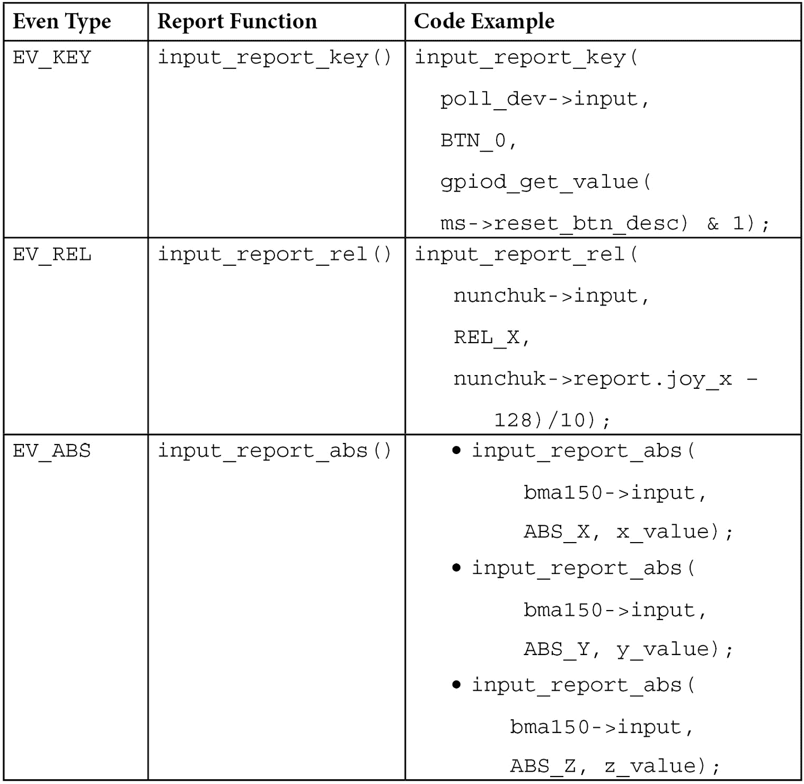

# 第十七章：*第十七章*：利用 Linux 内核输入子系统

输入设备是你用来与系统交互的设备。这些设备包括按钮、键盘、触摸屏、鼠标等。它们通过发送事件与系统交互，这些事件会被输入核心捕获并广播到系统中。本章将解释输入核心用来处理输入设备的每个结构，以及如何从用户空间管理事件。

本章将涵盖以下主题：

+   Linux 内核输入子系统介绍——其数据结构和 API

+   分配并注册输入设备

+   使用轮询输入设备

+   生成并报告输入事件

+   从用户空间处理输入设备

# Linux 内核输入子系统介绍——其数据结构和 API

该子系统的主要数据结构和 API 可以在`include`/`linux`/`input.h`文件中找到。任何输入设备驱动程序都需要包含以下行：

```
#include <linux/input.h>
```

无论是什么类型的输入设备，无论它发送什么类型的事件，输入设备在内核中都表示为`input_dev`结构的一个实例：

```
struct input_dev {
  const char *name;
  const char *phys;
  unsigned long evbit[BITS_TO_LONGS(EV_CNT)];
  unsigned long keybit[BITS_TO_LONGS(KEY_CNT)];
  unsigned long relbit[BITS_TO_LONGS(REL_CNT)];
  unsigned long absbit[BITS_TO_LONGS(ABS_CNT)];
  unsigned long mscbit[BITS_TO_LONGS(MSC_CNT)];
  unsigned int repeat_key;
  int rep[REP_CNT];
  struct input_absinfo *absinfo;
  unsigned long key[BITS_TO_LONGS(KEY_CNT)];
  int (*open)(struct input_dev *dev);
  void (*close)(struct input_dev *dev);
  unsigned int users;
  struct device dev;
  unsigned int num_vals;
  unsigned int max_vals;
  struct input_value *vals;
  bool devres_managed;
};
```

为了可读性，结构中的一些元素已被省略。我们将更详细地查看这些字段：

+   `name`表示设备的名称。

+   `phys`是设备在系统层次结构中的物理路径。

+   `evbit`是设备支持的事件类型的位图。以下是一些事件：

    +   `EV_KEY`用于支持发送键事件的设备（例如，键盘、按钮等）

    +   `EV_REL`用于支持发送相对位置的设备（例如，鼠标、数字化仪等）

    +   `EV_ABS`用于支持发送绝对位置的设备（例如，操纵杆）。事件的列表可以在内核源代码中的`include/linux/input-event-codes.h`文件中找到。你可以使用`set_bit()`宏根据输入设备的能力设置相应的位。当然，一个设备可以支持多个事件类型。例如，一个鼠标驱动程序将同时设置`EV_KEY`和`EV_REL`，如下所示：

        ```
            set_bit(EV_KEY, my_input_dev->evbit);
            set_bit(EV_REL, my_input_dev->evbit);
        ```

+   `keybit`用于`EV_KEY`启用的设备，包含设备暴露的键/按钮位图；例如，`BTN_0`、`KEY_A`、`KEY_B`等。键/按钮的完整列表可以在`include/linux/input-event-codes.h`文件中找到。

+   `relbit`用于`EV_REL`启用的设备，包含设备的相对轴位图；例如，`REL_X`、`REL_Y`、`REL_Z`等。可以查看`include/linux/input-event-codes.h`文件以获取完整的列表。

+   `absbit`用于`EV_ABS`启用的设备，包含设备的绝对轴位图；例如，`ABS_Y`、`ABS_X`等。可以查看前面同样的文件以获取完整的列表。

+   `mscbit`用于`EV_MSC`启用的设备，包含设备支持的各种事件的位图。

+   `repeat_key` 存储最后按下的按键码；当软件实现自动重复功能时会使用此值。

+   `rep` 存储当前的自动重复参数值，通常包括延迟和速率。

+   `absinfo` 是一个 `&struct input_absinfo` 元素的数组，保存关于绝对轴的信息（当前值、`min`、`max`、`flat`、`fuzz` 和分辨率）。你应该使用 `input_set_abs_params()` 函数来设置这些值：

    ```
    void input_set_abs_params(struct input_dev *dev,
                           unsigned int axis, int min,
                           int max, int fuzz, int flat)
    ```

+   `min` 和 `max` 分别指定下限和上限值，`fuzz` 表示指定输入设备指定通道上的预期噪声。以下示例中，我们设置了每个通道的边界：

    ```
    #define ABSMAX_ACC_VAL      0x01FF
    #define ABSMIN_ACC_VAL      -(ABSMAX_ACC_VAL)
    [...]
    set_bit(EV_ABS, idev->evbit);
    input_set_abs_params(idev, ABS_X, ABSMIN_ACC_VAL,
                         ABSMAX_ACC_VAL, 0, 0);
    input_set_abs_params(idev, ABS_Y, ABSMIN_ACC_VAL,
                         ABSMAX_ACC_VAL, 0, 0);
    input_set_abs_params(idev, ABS_Z, ABSMIN_ACC_VAL,
                         ABSMAX_ACC_VAL, 0, 0);
    ```

+   `key` 反映设备按键/按钮的当前状态。

+   `open` 是当第一个用户调用 `input_open_device()` 时调用的方法。使用此方法准备设备，例如中断请求、轮询线程启动等。

+   `close` 是当最后一个用户调用 `input_close_device()` 时调用的函数。在这里，你可以停止轮询（因为它消耗了大量资源）。

+   `users` 存储打开该设备的用户（输入处理程序）数量。它用于 `input_open_device()` 和 `input_close_device()`，确保 `dev->open()` 仅在第一个用户打开设备时调用，并且 `dev->close()` 仅在最后一个用户关闭设备时调用。

+   `dev` 是与该设备关联的 `struct device`（用于设备模型）。

+   `num_vals` 是当前帧中排队的值的数量。

+   `max_vals` 是在一帧中排队的最大值数量。

+   `Vals` 是当前帧中排队的值的数组。

+   `devres_managed` 表示设备是通过 **devres** 框架管理的，不需要显式地注销或释放。

现在你已经熟悉了主要输入设备的数据结构，我们可以开始在系统中注册这些设备。

# 分配和注册输入设备

在系统能够看到输入设备支持的事件之前，必须先使用 `devm_input_allocate_device()` API 为该设备分配内存。然后，设备需要通过 `input_device_register()` 注册到系统中。前者 API 会在设备离开系统时负责释放内存并注销设备。然而，仍然可以使用非管理的分配，但不推荐使用，`input_allocate_device()`。使用非管理分配时，驱动程序需要负责确保在卸载路径上分别调用 `input_unregister_device()` 和 `input_free_device()` 来注销设备和释放其内存。以下是这些 API 的原型：

```
struct input_dev *input_allocate_device(void)
struct input_dev *devm_input_allocate_device(
                                       struct device *dev)
void input_free_device(struct input_dev *dev)
int input_register_device(struct input_dev *dev)
void input_unregister_device(struct input_dev *dev)
```

设备分配可能会导致睡眠，因此不得在原子上下文中或持有自旋锁时调用。以下是一个位于 I2C 总线上的输入设备 `probe` 函数的摘录：

```
struct input_dev *idev;
int error;
/*
 * such allocation will take care of memory freeing and
 * device unregistering
 */
idev = devm_input_allocate_device(&client->dev);
if (!idev)
    return -ENOMEM;
idev->name = BMA150_DRIVER;
idev->phys = BMA150_DRIVER "/input0";
idev->id.bustype = BUS_I2C;
idev->dev.parent = &client->dev;
set_bit(EV_ABS, idev->evbit);
input_set_abs_params(idev, ABS_X, ABSMIN_ACC_VAL,
                     ABSMAX_ACC_VAL, 0, 0);
input_set_abs_params(idev, ABS_Y, ABSMIN_ACC_VAL,
                     ABSMAX_ACC_VAL, 0, 0);
input_set_abs_params(idev, ABS_Z, ABSMIN_ACC_VAL,
                     ABSMAX_ACC_VAL, 0, 0);
error = input_register_device(idev);
if (error)
    return error;
error = devm_request_threaded_irq(&client->dev,
            client->irq,
            NULL, my_irq_thread,
            IRQF_TRIGGER_RISING | IRQF_ONESHOT,
            BMA150_DRIVER, NULL);
if (error) {
    dev_err(&client->dev, "irq request failed %d, 
           error %d\n", client->irq, error);
    return error;
}
return 0;
```

如你所见，在前面的代码中，当发生错误时，没有进行内存释放或设备注销，因为我们对输入设备和中断请求（IRQ）都使用了托管分配。这意味着输入设备有一个 IRQ 线路，以便我们能接收到底层设备状态变化的通知。但这并不总是成立，因为系统可能没有可用的 IRQ 线路，在这种情况下，输入核心必须频繁地轮询设备，以免错过事件。我们将在下一节讨论这一点。

# 使用轮询输入设备

轮询输入设备是依赖于轮询来感知设备状态变化的特殊输入设备；通用输入设备类型则依赖 IRQ 来感知变化并将事件发送到输入核心。

在内核中，轮询输入设备被描述为 `struct input_polled_dev` 结构的一个实例，这是一个围绕通用 `struct input_dev` 结构的包装器。以下是它的声明：

```
struct input_polled_dev {
    void *private;
    void (*open)(struct input_polled_dev *dev);
    void (*close)(struct input_polled_dev *dev);
    void (*poll)(struct input_polled_dev *dev);
    unsigned int poll_interval; /* msec */
    unsigned int poll_interval_max; /* msec */
    unsigned int poll_interval_min; /* msec */

    struct input_dev *input;
    bool devres_managed;
};
```

让我们来看看这个结构体中的元素：

+   `private` 是驱动程序的私有数据。

+   `open` 是一个可选方法，用于准备设备进行轮询（启用设备，并有时刷新设备状态）。

+   `close` 是一个可选方法，当设备不再被轮询时会被调用。它用于将设备置于低功耗模式。

+   `poll` 是一个必需的方法，每当设备需要被轮询时就会被调用。它会以 `poll_interval` 的频率被调用。

+   `poll_interval` 是应该调用 `poll()` 方法的频率。除非在注册设备时进行覆盖，否则默认为 500 毫秒。

+   `poll_interval_max` 指定了轮询间隔的上限。默认为 `poll_interval` 的初始值。

+   `poll_interval_min` 指定了轮询间隔的下限。默认为 0。

+   `input` 是轮询设备所依赖的输入设备。它必须由驱动程序初始化（通过其 ID、名称和位）。轮询输入设备仅提供一个接口，使用轮询而不是 IRQ 来感知设备状态变化。

可以通过 `devm_input_allocate_polled_device()` 为轮询输入设备分配内存。这是一个托管分配 API，负责在适当的时候释放内存和注销设备。同样，非托管 API 也可以用于分配，即 `input_allocate_polled_device()`，在这种情况下，你必须自己负责调用 `input_free_polled_device()`。以下代码展示了这些 API 的原型：

```
struct input_polled_dev
     *devm_input_allocate_polled_device(
                                  struct device *dev)
struct input_polled_dev *input_allocate_polled_device(void)
void input_free_polled_device(struct 
                               input_polled_dev *dev)
```

对于资源管理设备，`input_dev->devres_managed` 字段将由输入核心设置为 `true`。然后，你应该初始化底层 `struct input_dev` 的必需字段，正如我们在前一节中看到的那样。轮询间隔也必须设置，否则它将默认为 500 毫秒。

一旦字段分配和初始化完成，可以使用 `input_register_polled_device()` 来注册轮询输入设备，成功时返回 `0`。对于托管分配，注销由系统处理；你需要自己调用 `input_unregister_polled_device()` 执行反向操作。以下是它们的原型：

```
int input_register_polled_device(
                        struct input_polled_dev *dev)
void  input_unregister_polled_device(
                        struct input_polled_dev *dev)
```

这样的设备的 `probe()` 函数的一个典型示例如下所示。首先，我们定义驱动程序数据结构，它将收集所有必要的资源：

```
struct my_struct {
    struct input_pulled_dev *polldev;
    struct gpio_desc *gpio_btn;
    [...]
}
```

一旦驱动程序数据结构被定义，`probe()` 函数就可以实现。以下是它的实现：

```
static int button_probe(struct platform_device *pdev)
{
    struct my_struct *ms;
    struct input_dev *input_dev;
    int error;
    struct device *dev = &pdev->dev;
    ms = devm_kzalloc(dev, sizeof(*ms), GFP_KERNEL);
    if (!ms)
        return -ENOMEM;
    ms->polldev = devm_input_allocate_polled_device(dev);
    if (!ms->polldev)
        return -ENOMEM;
    /* This gpio is not mapped to IRQ */
    ms->gpio_btn = devm_gpiod_get(dev, "my-btn", GPIOD_IN);
    ms->polldev->private = ms;
    ms->polldev->poll = my_btn_poll;
    ms->polldev->poll_interval = 200;/* Poll every 200ms */
    ms->polldev->open = my_btn_open;
     /* Initializing the underlying input_dev fields */
    input_dev = ms->poll_dev->input;
    input_dev->name = "System Reset Btn";
    /* The gpio belongs to an expander sitting on I2C */
    input_dev->id.bustype = BUS_I2C; 
    input_dev->dev.parent = dev;
    /* Declare the events generated by this driver */
    set_bit(EV_KEY, input_dev->evbit);
    set_bit(BTN_0, input_dev->keybit); /* buttons */
    retval = input_register_polled_device(ms->poll_dev);
    if (retval) {
        dev_err(dev, "Failed to register input device\n");
        return retval;  
    }
    return 0;
}
```

再次强调，当发生错误时，由于我们使用了托管分配，注销和释放操作并非由我们自己处理。

以下是我们的 `open` 回调可能的样子：

```
static void my_btn_open(struct input_polled_dev *poll_dev)
{
    struct my_strut *ms = poll_dev->private;
    dev_dbg(&ms->poll_dev->input->dev, "reset open()\n");
}
```

在我们的示例中，它没有任何操作。然而，`open` 方法用于准备设备所需的资源。

是否应实现轮询输入设备是一个简单的决策。通常，如果有 IRQ 线可用，可以使用经典的输入设备；否则，可以退而使用轮询设备：

```
if(client->irq > 0){
    /* Use generic input device */
} else {
    /* Use polled device */
}
```

在选择实现轮询输入设备还是基于 IRQ 的输入设备时，可能还需要考虑其他因素；前面的代码只是一个建议。

现在我们已经熟悉了这部分输入设备，我们可以考虑注册和注销输入设备。也就是说，即使输入设备已注册，我们仍然无法与其交互。在下一节中，我们将学习如何让输入设备向内核报告事件。

# 生成并报告输入事件

设备的分配和注册是必要的，但如果设备无法向输入核心报告事件，那么它们就毫无意义，因为输入设备的设计目的就是报告事件。根据我们设备可以支持的事件类型，内核提供了相应的 API 来将这些事件报告给核心。

对于一个支持 `EV_XXX` 的设备，对应的报告函数将是 `input_report_xxx()`。下表显示了最重要的事件类型与其报告函数之间的映射关系：



](img/B17934_Table_01.jpg)

表 17.1 – 映射输入设备的能力与报告 API

这些报告 API 的原型如下：

```
void input_report_abs(struct input_dev *dev,
                      unsigned int code, int value)
void input_report_key(struct input_dev *dev,
                      unsigned int code, int value)
void input_report_rel(struct input_dev *dev,
                      unsigned int code, int value)
```

可用报告函数的列表可以在内核源文件 `include/linux/input.h` 中找到。它们都有相同的框架：

+   `dev` 是负责该事件的输入设备。

+   `code` 表示事件代码；例如，`REL_X` 或 `KEY_BACKSPACE`。完整的列表可以在 `include/linux/input-event-codes.h` 中找到。

+   `value` 是事件携带的值。对于 `EV_REL` 事件类型，它携带相对变化。对于 `EV_ABS`（如摇杆等）事件类型，它包含绝对新值。对于 `EV_KEY` 事件类型，按键释放时应设置为 `0`，按键按下时为 `1`，自动重复时为 `2`。

一旦所有这些更改被报告，驱动程序应在输入设备上调用 `input_sync()`，以指示该事件已经完成。输入子系统将把这些事件收集到一个数据包中，并通过 `/dev/input/event<X>` 发送，这个字符设备代表我们在系统上的 `struct input_dev`。在这里，`<X>` 是输入核心分配给驱动程序的接口编号：

```
void input_sync(struct input_dev *dev)
```

让我们看一个例子。以下是 `drivers/input/misc/bma150.c` 的摘录：

```
static void threaded_report_xyz(struct bma150_data *bma150)
{
  u8 data[BMA150_XYZ_DATA_SIZE];
  s16 x, y, z;
  s32 ret;
  ret = i2c_smbus_read_i2c_block_data(bma150->client,
                       BMA150_ACC_X_LSB_REG,
                       BMA150_XYZ_DATA_SIZE, data);
  if (ret != BMA150_XYZ_DATA_SIZE)
    return;
  x = ((0xc0 & data[0]) >> 6) | (data[1] << 2);
  y = ((0xc0 & data[2]) >> 6) | (data[3] << 2);
  z = ((0xc0 & data[4]) >> 6) | (data[5] << 2);
  /* sign extension */
  x = (s16) (x << 6) >> 6;
  y = (s16) (y << 6) >> 6;
  z = (s16) (z << 6) >> 6;
  input_report_abs(bma150->input, ABS_X, x);
  input_report_abs(bma150->input, ABS_Y, y);
  input_report_abs(bma150->input, ABS_Z, z);
  /* Indicate this event is complete */
  input_sync(bma150->input);
}
```

在前面的摘录中，`input_sync()` 告诉核心将三个报告视为同一个事件。这是有道理的，因为位置有三个坐标轴（*X*，*Y*，*Z*），我们不希望 *X*、*Y* 或 *Z* 被单独报告。

报告事件的最佳位置是在轮询设备的轮询函数内部，或在启用中断（IRQ）的设备的 IRQ 例程（无论是线程化部分还是非线程化部分）中。如果您执行了可能导致睡眠的操作，您应在 IRQ 处理程序的线程化部分内处理报告。以下代码展示了我们的初始示例如何实现 `poll` 方法：

```
static void my_btn_poll(struct input_polled_dev *poll_dev)
{
    struct my_struct *ms = polldev->private;
    struct i2c_client *client = mcp->client;

    input_report_key(polldev->input, BTN_0,
                     gpiod_get_value(ms->rgpio_btn) & 1);
    input_sync(poll_dev->input);
}
```

在前面的代码中，我们的输入设备报告了 `0` 键码。在接下来的部分，我们将讨论用户空间如何处理这些报告事件和码值。

# 从用户空间处理输入设备

每个已经成功注册到系统中的输入设备（无论是否轮询）都会在 `/dev/input/` 目录下创建一个节点。在我的例子中，该节点对应于 `event0`，因为它是我目标板上的第一个也是唯一的输入设备。您可以使用 `udevadm` 工具来显示设备的信息：

```
# udevadm info /dev/input/event0 
P: /devices/platform/input-button.0/input/input0/event0
N: input/event0
S: input/by-path/platform-input-button.0-event
E: DEVLINKS=/dev/input/by-path/platform-input-button.0-event
E: DEVNAME=/dev/input/event0
E: DEVPATH=/devices/platform/input-button.0/input/input0/event0
E: ID_INPUT=1
E: ID_PATH=platform-input-button.0
E: ID_PATH_TAG=platform-input-button_0
E: MAJOR=13
E: MINOR=64
E: SUBSYSTEM=input
E: USEC_INITIALIZED=74842430
```

另一个可以使用的工具是 `evetest`，它允许您打印设备支持的按键。它还可以在设备报告事件时捕获并打印这些事件。以下代码展示了它在我们输入设备上的使用：

```
# evtest /dev/input/event0 
input device opened()
Input driver version is 1.0.1
Input device ID: bus 0x0 vendor 0x0 product 0x0 version 0x0
Input device name: "Packt Btn"
Supported events:
   Event type 0 (EV_SYN)
   Event type 1 (EV_KEY)
      Event code 256 (BTN_0)
```

不仅是我们为其编写了驱动程序的输入设备可以通过 `evetest` 管理。在以下示例中，我正在使用连接到我计算机的 USB-C 耳机。由于它提供了音量相关的按键，因此它具有输入设备功能：

```
jma@labcsmart-sqy:~$ sudo evtest /dev/input/event4
Input driver version is 1.0.1
Input device ID: bus 0x3 vendor 0x12d1 product 0x3a07 version 0x111
Input device name: "Synaptics HUAWEI USB-C HEADSET"
Supported events:
  Event type 0 (EV_SYN)
  Event type 1 (EV_KEY)
    Event code 114 (KEY_VOLUMEDOWN)
    Event code 115 (KEY_VOLUMEUP)
    Event code 164 (KEY_PLAYPAUSE)
    Event code 582 (KEY_VOICECOMMAND)
  Event type 4 (EV_MSC)
    Event code 4 (MSC_SCAN)
Properties:
Testing ... (interrupt to exit)
Event: time 1640231369.347093, type 4 (EV_MSC), code 4 (MSC_SCAN), value c00e9
Event: time 1640231369.347093, type 1 (EV_KEY), code 115 (KEY_VOLUMEUP), value 1
Event: time 1640231369.347093, -------------- SYN_REPORT ------------
Event: time 1640231369.487017, type 4 (EV_MSC), code 4 (MSC_SCAN), value c00e9
Event: time 1640231369.487017, type 1 (EV_KEY), code 115 (KEY_VOLUMEUP), value 0
Event: time 1640231369.487017, -------------- SYN_REPORT ------------
```

在前面的代码中，我按下了音量增大键以查看如何报告。`evtest` 甚至可以与您的键盘一起使用，唯一的条件是您需要在 `/dev/input/` 中识别相应的输入设备节点。

正如我们所见，每个注册的输入设备都由 `/dev/input/event<X>` 字符设备表示，我们可以使用它从用户空间读取事件。读取该文件的应用程序将收到以 `struct input_event` 格式的事件数据包，该格式有以下声明：

```
struct input_event {
  struct timeval time;
  __u16 type;
  __u16 code;
  __s32 value;
}
```

让我们看一下结构中每个元素的含义：

+   `time` 是一个时间戳，表示事件发生的时间。

+   `type` 是事件类型；例如，`EV_KEY` 表示按键按下或释放，`EV_REL` 表示相对运动，或 `EV_ABS` 表示绝对运动。更多类型可以在 `include/linux/input-event-codes.h` 中找到。

+   `code` 是事件代码；例如，`REL_X` 或 `KEY_BACKSPACE`。同样，完整的列表可以在 `include/linux/input-event-codes.h` 中找到。

+   `value` 是事件携带的值。对于 `EV_REL` 事件类型，它携带相对变化；对于 `EV_ABS`（例如游戏摇杆）事件类型，它包含绝对新值；对于 `EV_KEY` 事件类型，按键释放时设置为 `0`，按键按下时设置为 `1`，自动重复时设置为 `2`。

用户空间应用程序可以使用阻塞和非阻塞读取，也可以使用 `poll()` 或 `select()` 系统调用，在打开设备后被通知事件。以下是 `select()` 系统调用的示例。我们从列出需要实现示例的头文件开始：

```
#include <unistd.h>
#include <fcntl.h>
#include <stdio.h>
#include <stdlib.h>
#include <linux/input.h>
#include <sys/select.h>
```

然后，我们必须将输入设备路径定义为宏，因为它将被频繁使用：

```
#define INPUT_DEVICE "/dev/input/event0"
int main(int argc, char **argv)
{   
    int fd, ret;
    struct input_event event;
    ssize_t bytesRead;
    fd_set readfds;
```

接下来，我们必须打开输入设备，并保持其文件描述符以备后用。如果打开输入设备失败，将视为错误，因此我们必须退出程序：

```
    fd = open(INPUT_DEVICE, O_RDONLY);
    if(fd < 0){
        fprintf(stderr,
             "Error opening %s for reading", INPUT_DEVICE);
        exit(EXIT_FAILURE);
    }
```

现在，我们已经有了一个表示打开的输入设备的文件描述符。我们可以使用 `select()` 系统调用来感知任何按键按下或释放：

```
    while(1){ 
        FD_ZERO(&readfds);
        FD_SET(fd, &readfds);
        ret = select(fd + 1, &readfds, NULL, NULL, NULL);
        if (ret == -1) {
            fprintf(stderr,
                   "select call on %s: an error ocurred",
                    INPUT_DEVICE);
            break;
        }
        else if (!ret) { /* If we used timeout */
            fprintf(stderr,
                    "select on %s: TIMEOUT", INPUT_DEVICE);
            break;
        }
```

此时，我们已经对 `select()` 的返回路径进行了必要的有效性检查。请注意，如果在任何文件描述符准备好之前超时，`select()` 将返回零，因此在前面的代码中使用了 `else if`。

变更现在已经生效，让我们读取数据查看它对应的内容：

```
        /* File descriptor is now ready */
        if (FD_ISSET(fd, &readfds)) {
            bytesRead = read(fd, &event,
                             sizeof(struct input_event));
            if(bytesRead == -1)
                /* Process read input error*/
                [...]
            if(bytesRead != sizeof(struct input_event))
                /* Read value is not an input event */
                [...] /* handle this error */
```

如果执行流到达这一点，意味着一切顺利。现在，我们可以遍历输入设备支持的事件，并将它们与输入核心报告的事件进行比较，以便做出决策：

```
            /* We could have done a switch/case if we had
             * many codes to look for */
            if (event.code == BTN_0) {
                /* it concerns our button */
                if (event.value == 0) {
                    /* Process keyRelease if need be */
                    [...]
                }
                else if(event.value == 1){
                    /* Process KeyPress */
                    [...]
                }
            }
        }
    }
    close(fd);
    return EXIT_SUCCESS;
}
```

为了进一步调试，如果你的输入设备是基于 GPIO 的，你可以依次按下/释放按钮，检查 GPIO 的状态是否发生了变化：

```
# cat /sys/kernel/debug/gpio  | grep button
 gpio-195 (gpio-btn         ) in  hi    
# cat /sys/kernel/debug/gpio  | grep button
 gpio-195 (gpio-btn         ) in  lo
```

此外，如果输入设备有一个 IRQ 线路，检查该 IRQ 线路的统计数据可能是有意义的，以确保其一致性。例如，在这里，我们必须检查请求是否成功，以及它触发了多少次：

```
# cat /proc/interrupts | grep packt
160:      0      0      0      0  gpio-mxc   0  packt-input-button
```

在本节中，我们学习了如何处理用户空间中的输入设备，并提供了一些调试提示，以便在出现问题时进行排查。我们使用了 `select()` 系统调用来感知输入事件，尽管我们也可以使用 `poll()`。

# 概述

本章描述了输入框架，并强调了轮询输入设备和中断驱动输入设备之间的区别。到此为止，你应该已经具备了编写任何输入设备驱动程序的必要知识，无论其类型如何，支持何种输入事件。用户空间接口也进行了讨论，并提供了一个示例。
