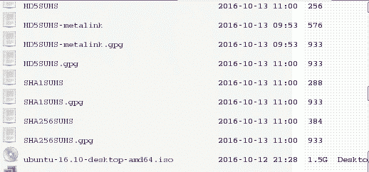

# 第二章：拥有一条好命令

在本章中，我们将介绍以下技巧：

+   使用`cat`连接文件

+   记录和回放终端会话

+   查找文件和文件列表

+   使用`xargs`进行操作

+   使用`tr`进行翻译

+   校验和和验证

+   加密工具和哈希

+   排序唯一行和重复行

+   临时文件命名和随机数

+   分割文件和数据

+   基于扩展名切割文件名

+   批量重命名和移动文件

+   拼写检查和字典操作

+   自动化交互式输入

+   通过运行并行进程加速命令执行

+   检查目录、文件及其子目录

# 介绍

类 Unix 系统拥有最好的命令行工具。每个命令执行简单的功能，以便使我们的工作更加轻松。这些简单的功能可以与其他命令组合在一起，解决复杂的问题。将简单命令组合起来是一门艺术；通过练习和积累经验，你会越来越擅长。 本章介绍了一些最有趣和最有用的命令，包括`grep`、`awk`、`sed`和`find`。

# 使用`cat`进行连接

`cat`命令显示或连接文件的内容，但`cat`命令能做更多的事情。例如，`cat`可以将标准输入数据与文件中的数据结合起来。将`stdin`数据与文件数据结合的一种方式是将`stdin`重定向到文件中，然后将两个文件合并。`cat`命令可以通过一次调用完成此操作。接下来的技巧展示了`cat`的基本和高级用法。

# 如何做到...

`cat`命令是一个简单且常用的命令，它代表**conCATenate**（连接）。

用于读取内容的`cat`命令的一般语法如下：

```
$ cat file1 file2 file3 ...

```

该命令将命令行参数中指定的文件的数据连接起来，并将这些数据发送到`stdout`。

+   要打印单个文件的内容，请执行以下命令：

```
        $ cat file.txt
 This is a line inside file.txt
 This is the second line inside file.txt

```

+   要打印多个文件的内容，请执行以下命令：

```
        $ cat one.txt two.txt 
 This line is from one.txt
 This line is from two.txt

```

`cat`命令不仅可以从文件中读取并连接数据，还可以从标准输入读取数据。

管道操作符将数据重定向到`cat`命令的标准输入，如下所示：

```
OUTPUT_FROM_SOME COMMANDS | cat

```

`cat`命令也可以将文件内容与终端输入结合起来。

将`stdin`和另一个文件中的数据结合起来，像这样：

```
$ echo 'Text through stdin' | cat - file.txt

```

在此示例中，`-`充当`stdin`文本的文件名。

# 还有更多...

`cat`命令有许多其他选项来查看文件。你可以通过在终端会话中输入`man cat`来查看完整的列表。

# 去除多余的空行

有些文本文件中包含两个或多个连续的空行。如果你需要去除多余的空行，可以使用以下语法：

```
$ cat -s file

```

考虑以下示例：

```
$ cat multi_blanks.txt
line 1

line 2

line 3

line 4

$ cat -s multi_blanks.txt # Squeeze adjacent blank lines
line 1

line 2

line 3

line 4

```

我们可以使用`tr`删除所有空行，正如本章中的*使用 tr 进行翻译*技巧所讨论的那样。

# 将标签显示为 ^I

很难区分制表符和重复的空格字符。像 Python 这样的语言可能会对制表符和空格进行不同的处理。制表符和空格的混合在编辑器中可能看起来相似，但对解释器来说却是不同的缩进。当在文本编辑器中查看文件时，很难识别制表符和空格之间的区别。`cat` 还可以识别制表符。这有助于你调试缩进错误。

`cat` 命令的 `-T` 选项将制表符显示为 `^I`：

```
$ cat file.py 
def function(): 
    var = 5 
        next = 6 
    third = 7 

$ cat -T file.py 
def function():
^Ivar = 5
^I^Inext = 6
^Ithird = 7^I

```

# 行号

`cat` 命令的 `-n` 标志会在每行前添加行号。请看这个示例：

```
$ cat lines.txt
line 
line
line

$ cat -n lines.txt
 1 line
 2 line
 3 line

```

`cat` 命令不会更改文件。它会在根据选项修改输入后将输出发送到 `stdout`。不要尝试使用重定向来覆盖输入文件。Shell 会在打开输入文件之前创建新的输出文件。`cat` 命令不会允许你将同一个文件作为输入和重定向输出。试图用管道和重定向输出来“欺骗” `cat` 会清空输入文件。

```
$> echo "This will vanish" > myfile
$> cat -n myfile >myfile
cat: myfile: input file is output file
$> cat myfile | cat -n >myfile
$> ls -l myfile
-rw-rw-rw-. 1 user user 0 Aug 24 00:14 myfile   ;# myfile has 0
bytes

```

`-n` 选项会为所有行生成行号，包括空白行。如果你想跳过空白行的编号，可以使用 `-b` 选项。

# 记录和回放终端会话

录制屏幕会话作为视频很有用，但对于调试终端会话或提供 Shell 教程来说，视频显得有些过于复杂。

Shell 提供了另一个选项。`script` 命令会记录你输入的按键和按键的时间，同时将你的输入和结果输出保存到一对文件中。`scriptreplay` 命令将重放这个会话。

# 准备好

`script` 和 `scriptreplay` 命令在大多数 GNU/Linux 发行版中都有提供。你可以通过录制终端会话来创建命令行技巧和技巧的教程。你还可以分享录制的文件，让别人回放并查看如何用命令行执行特定任务。你甚至可以调用其他解释器，并记录发送到该解释器的按键输入。你无法记录像 vi、emacs 或其他将字符映射到屏幕上特定位置的应用程序。

# 如何操作...

使用以下命令开始记录终端会话：

```
$ script -t 2> timing.log -a output.session

```

一个完整的示例如下：

```
$ script -t 2> timing.log -a output.session

# This is a demonstration of tclsh
$ tclsh
% puts [expr 2 + 2]
4
% exit
$ exit

```

注意，这个方法在不支持将 `stderr` 仅重定向到文件的 Shell 中（如 `csh` shell）无法使用。

`script` 命令接受一个文件名作为参数。这个文件将保存按键输入和命令结果。当使用 `-t` 选项时，`script` 命令将时间数据发送到 `stdout`。这些时间数据可以被重定向到一个文件（`timing.log`），记录每个按键输入和输出的时间信息。之前的示例使用了 `2>` 来将 `stderr` 重定向到 `timing.log`。

使用这两个文件，`timing.log` 和 `output.session`，我们可以按如下方式重放命令执行的序列：

```
$ scriptreplay timing.log output.session
# Plays the sequence of commands and output

```

# 如何工作...

我们经常录制桌面视频来准备教程。然而，视频需要大量存储空间，而终端脚本文件只是一个文本文件，通常只有几千字节大小。

你可以将`timing.log`和`output.session`文件共享给任何希望在终端中重放终端会话的人。

# 查找文件和文件列表

`find`命令是 Unix/Linux 命令行工具箱中的一个伟大工具。它在命令行和 Shell 脚本中都很有用。像`cat`和`ls`一样，`find`有许多功能，而大多数人并没有充分利用它。这个食谱介绍了几种常见的使用`find`来定位文件的方法。

# 准备工作

`find`命令采用以下策略：`find`通过文件层次结构进行递归查找，匹配满足指定条件的文件，并执行某些操作。默认操作是打印文件和文件夹的名称，可以通过`-print`选项指定。

# 如何实现...

要列出从给定目录递归查找的所有文件和文件夹，请使用以下语法：

```
$ find base_path

```

`base_path`可以是`find`开始递归查找的任何位置（例如，`/home/slynux/`）。

这是这个命令的一个示例：

```
$ find . -print
.history
Downloads
Downloads/tcl.fossil
Downloads/chapter2.doc
…

```

`.`指定当前目录，`..`指定父目录。这一约定在整个 Unix 文件系统中都得到了遵循。

`-print`选项将每个文件或文件夹的名称与`\n`（换行符）分开。`-print0`选项将每个名称与空字符`'\0'`分开。`-print0`的主要用途是将包含换行符或空格字符的文件名传递给`xargs`命令。`xargs`命令将在稍后详细讨论：

```
$> echo "test" > "file name"
$> find . -type f -print | xargs ls -l
ls: cannot access ./file: No such file or directory
ls: cannot access name: No such file or directory
$> find . -type f -print0 | xargs -0 ls -l
-rw-rw-rw-. 1 user group 5  Aug 24 15:00 ./file name

```

# 还有更多...

前面的示例演示了如何使用`find`列出文件系统层次结构中的所有文件和文件夹。`find`命令可以根据通配符或正则表达式规则、文件系统树中的深度、日期、文件类型等选择文件。

# 基于名称或正则表达式匹配的搜索

`-name`参数指定名称的选择模式。`-name`参数接受通配符样式和正则表达式。在下面的示例中，`'*.txt'`匹配所有以`.txt`结尾的文件或文件夹名称并将其打印出来。

请注意`*.txt`周围的单引号。没有引号或使用双引号（`"`）时，Shell 会展开通配符。单引号防止 Shell 展开`*.txt`，而是将该字符串传递给`find`命令。

```
$ find /home/slynux -name '*.txt' -print

```

`find`命令有一个`-iname`（忽略大小写）选项，它类似于`-name`，但它匹配不区分大小写的文件名。

请考虑以下示例：

```
$ ls
example.txt  EXAMPLE.txt  file.txt
$ find . -iname "example*" -print
./example.txt
./EXAMPLE.txt

```

`find`命令支持与选择选项的逻辑操作。`-a`和`-and`选项执行逻辑**与**，而`-o`和`-or`选项执行逻辑**或**。

```
$ ls
new.txt  some.jpg  text.pdf   stuff.png
$ find . \( -name '*.txt' -o -name '*.pdf' \) -print
./text.pdf
./new.txt

```

上一个命令将打印所有 `.txt` 和 `.pdf` 文件，因为 `find` 命令匹配了 `.txt` 和 `.pdf` 文件。`\( `和 `\)` 用来将 `-name "*.txt" -o -name "*.pdf"` 作为一个单一单元来处理。

以下命令演示了使用 `-and` 运算符仅选择以 `s` 开头并且名称中有 `e` 的文件。

```
$ find . \( -name '*e*' -and -name 's*' \) 
./some.jpg

```

`-path` 参数将匹配限制为同时匹配路径和名称的文件。例如，`$ find /home/users -path '*/slynux/*' -name '*.txt' -print` 将找到 `/home/users/slynux/readme.txt`，但不会找到 `/home/users/slynux.txt`。

`-regex` 参数类似于 `-path`，但 `-regex` 基于正则表达式来匹配文件路径。

正则表达式比通配符更复杂，支持更精确的模式匹配。一个典型的文本匹配示例是识别所有电子邮件地址。电子邮件地址通常是 `name@host.root` 的形式。它可以被概括为 `[a-z0-9]+@[a-z0-9]+\.[a-z0-9]+`。方括号内的字符表示一组字符。在这个例子中，`a-z` 和 `0-9`。`+` 符号表示前面的字符类别可以出现一次或多次。点号是一个通配符字符（类似于通配符中的 `?`），所以它必须用反斜杠转义以匹配电子邮件地址中的实际点。因此，这个正则表达式的意思是“一个字母或数字的序列，后跟一个 `@`，然后是一个字母或数字的序列，再后面是一个点，最后是一个字母或数字的序列”。有关更多详细信息，请参见 第四章 中的 *使用正则表达式* 章节，*开车与短信*。

这个命令匹配 `.py` 或 `.sh` 文件：

```
$ ls
new.PY  next.jpg  test.py script.sh $ find . -regex '.*\.(py\|sh\)$'
./test.py
script.sh

```

`-iregex` 选项忽略正则表达式匹配的大小写。

请考虑以下示例：

```
$ find . -iregex '.*\(\.py\|\.sh\)$'
./test.py
./new.PY
./script.sh

```

# 否定参数

`find` 命令也可以使用 `!` 来排除匹配模式的内容：

```
$ find . ! -name "*.txt" -print

```

这个命令将匹配所有文件名不以 `.txt` 结尾的文件。以下示例显示了命令的结果：

```
$ ls
list.txt  new.PY  new.txt  next.jpg  test.py

$ find . ! -name "*.txt" -print
.
./next.jpg
./test.py
./new.PY

```

# 基于目录深度进行搜索

`find` 命令会遍历所有子目录，直到到达每个子目录树的底部。默认情况下，`find` 命令不会跟随符号链接。`-L` 选项会强制它跟随符号链接。如果一个链接引用了指向原始文件的链接，`find` 会陷入循环。

`-maxdepth` 和 `-mindepth` 参数限制了 `find` 命令的遍历深度。这会打破 `find` 命令的无限搜索。

`/proc` 文件系统包含关于你的系统和正在运行任务的信息。任务的文件夹层级非常深，并且包含指向自身的符号链接。每个正在运行的进程在 `proc` 中都有一个条目，条目名称为进程 ID。每个进程 ID 下有一个名为 `cwd` 的文件夹，它是指向该任务当前工作目录的链接。

以下示例展示了如何列出文件夹中所有运行的任务，文件名为 `bundlemaker.def`：

```
$ find -L /proc -maxdepth 3 -name 'bundlemaker.def' 2>/dev/null

```

+   `-L` 选项告诉 `find` 命令跟踪符号链接

+   `/proc` 是开始搜索的文件夹

+   `-maxdepth 3` 选项将搜索限制在当前文件夹中，而不包括子文件夹

+   `-name 'bundlemaker.def'` 选项是要搜索的文件

+   `2>/dev/null` 将关于递归循环的错误信息重定向到空设备

`-mindepth` 选项类似于 `-maxdepth`，但它设置了 `find` 报告匹配项的最小深度。它可以用于查找并打印从基路径起至少有一定深度的文件。例如，要打印所有以 `f` 开头并且至少距离当前目录两级子目录的文件，可以使用以下命令：

```
$ find . -mindepth 2 -name "f*" -print
./dir1/dir2/file1
./dir3/dir4/f2

```

当前目录或 `dir1` 和 `dir3` 中以 `f` 开头的文件将不会显示。

`-maxdepth` 和 `-mindepth` 选项应放在 `find` 命令的前面。如果它们被指定为后续参数，可能会影响 `find` 的效率，因为它必须进行不必要的检查。例如，如果 `-maxdepth` 在 `-type` 参数之后指定，`find` 命令会首先找到具有指定 `-type` 的文件，然后过滤掉那些不匹配正确深度的文件。然而，如果深度在 `-type` 之前指定，`find` 会先收集具有指定深度的文件，再检查文件类型，这样是最有效的搜索方式。

# 基于文件类型进行搜索

类 Unix 操作系统将每个对象视为文件。文件有不同种类，如常规文件、目录、字符设备、块设备、符号链接、硬链接、套接字、FIFO 等。

`find` 命令通过 `-type` 选项过滤文件搜索。使用 `-type`，我们可以告诉 `find` 只匹配指定类型的文件。

仅列出包括后代在内的目录：

```
$ find . -type d -print

```

列出目录和文件是比较困难的，但 `find` 命令可以帮助完成。仅列出常规文件，如下所示：

```
$ find . -type f -print

```

仅列出符号链接，如下所示：

```
$ find . -type l -print

```

以下表格显示了 `find` 命令识别的类型和参数：

| **文件类型** | **类型参数** |
| --- | --- |
| 常规文件 | `f` |
| 符号链接 | `l` |
| 目录 | `d` |
| 字符特殊设备 | `c` |
| 块设备 | `b` |
| 套接字 | `s` |
| FIFO | `p` |

# 基于文件时间戳进行搜索

Unix/Linux 文件系统在每个文件上有三种时间戳。它们如下所示：

+   **访问时间** (`-atime`): 文件最后被访问时的时间戳

+   **修改时间** (`-mtime`): 文件最后修改时的时间戳

+   **修改时间** (`-ctime`): 文件元数据（如权限或所有权）最后修改时的时间戳

Unix 默认不存储文件创建时间；然而，一些文件系统（`ufs2`、`ext4`、`zfs`、`btrfs`、`jfs`）会保存创建时间。可以使用 `stat` 命令访问创建时间。

鉴于某些应用程序通过创建新文件然后删除原始文件来修改文件，因此创建日期可能不准确。

`-atime`、`-mtime` 和 `-ctime` 选项是 `find` 命令中可用的时间参数选项。它们可以使用整数值指定，以 *天数* 为单位。该数字可以带有 `-` 或 `+` 前缀。`-` 表示小于，而 `+` 表示大于。

请考虑以下示例：

+   打印在过去七天内被访问的文件：

```
        $ find . -type f -atime -7 -print

```

+   打印出访问时间恰好是七天前的文件：

```
        $ find . -type f -atime 7 -print

```

+   打印出访问时间超过七天的文件：

```
        $ find . -type f -atime +7 -print

```

`-mtime` 参数将根据修改时间搜索文件；`-ctime` 根据更改时间搜索文件。

`-atime`、`-mtime` 和 `-ctime` 使用以天为单位的时间。`find` 命令还支持按分钟为单位的时间选项。具体如下：

+   `-amin`（访问时间）

+   `-mmin`（修改时间）

+   `-cmin`（更改时间）

要打印出所有访问时间超过七分钟的文件，使用以下命令：

```
$ find . -type f -amin +7 -print

```

`-newer` 选项指定一个参考文件，其修改时间将用于选择比参考文件更近期修改的文件。

查找所有比 `file.txt` 文件更近期修改的文件：

```
$ find . -type f -newer file.txt -print

```

`find` 命令的时间戳标志对于编写备份和维护脚本非常有用。

# 基于文件大小的搜索

根据文件的大小，可以执行搜索：

```
# Files having size greater than 2 kilobytes
$ find . -type f -size +2k

# Files having size less than 2 kilobytes
$ find . -type f -size -2k

# Files having size 2 kilobytes
$ find . -type f -size 2k

```

除了 `k`，我们还可以使用这些不同的大小单位：

+   `b`：512 字节块

+   `c`：字节

+   `w`：双字节词

+   `k`：千字节（1,024 字节）

+   `M`：兆字节（1,024 千字节）

+   `G`：千兆字节（1,024 兆字节）

# 基于文件权限和所有权匹配

可以根据文件权限匹配文件。我们可以列出具有指定文件权限的文件：

```
$ find . -type f -perm 644 -print
# Print files having permission 644

```

`-perm` 选项指定 `find` 只匹配其权限设置为特定值的文件。权限的更多细节可以参考第三章《*文件进，文件出*》中的 *与文件权限、所有权和粘滞位* 配方。

作为一个使用案例，我们可以考虑 Apache web 服务器的情况。Web 服务器中的 PHP 文件需要适当的权限才能执行。我们可以找到没有适当执行权限的 PHP 文件：

```
$ find . -type f -name "*.php" ! -perm 644 -print
PHP/custom.php
$ ls -l PHP/custom.php
-rw-rw-rw-.  root   root   513 Mar 13  2016  PHP/custom.php

```

我们还可以基于文件的所有权进行搜索。可以使用 `-user USER` 选项找到由特定用户拥有的文件。

`USER` 参数可以是用户名或 UID。

例如，要打印出所有由 `slynux` 用户拥有的文件，可以使用以下命令：

```
$ find . -type f -user slynux -print

```

# 对文件执行操作

`find` 命令可以对其识别的文件执行操作。你可以删除文件，或对文件执行任意的 Linux 命令。

# 基于文件匹配删除

`find` 命令的 `-delete` 标志会删除匹配的文件，而不是显示它们。删除当前目录中的 `.swp` 文件：

```
$ find . -type f -name "*.swp" -delete

```

# 执行命令

`find` 命令可以使用 `-exec` 选项与其他许多命令配合使用。

考虑之前的示例。我们使用 `-perm` 查找没有正确权限的文件。类似地，在需要将某个用户（例如 `root`）拥有的所有文件的所有权更改为另一个用户（例如 `www-data`，Web 服务器中默认的 Apache 用户）时，我们可以使用 `-user` 选项查找所有 `root` 拥有的文件，并使用 `-exec` 执行所有权更改操作。

如果您想更改文件或目录的所有权，必须以 root 用户身份运行 `find` 命令。

`find` 命令使用一对大括号 `{}` 来表示文件名。在下一个示例中，每当 `find` 识别出一个文件时，它会用文件名替换 `{}` 并更改文件的所有权。例如，如果 `find` 命令找到两个 `root` 所有的文件，它将把它们都更改为 `slynux` 所有：

```
# find . -type f -user root -exec chown slynux {} \;

```

请注意，命令以 `\;` 结尾。分号必须被转义，否则它会被命令行 shell 作为 `find` 命令的结束符，而不是 `chown` 命令的结束符。

为每个文件调用命令会带来很大的开销。如果命令接受多个参数（如 `chown`），可以使用加号（`+`）而不是分号来结束命令。加号会使 `find` 创建一个包含所有匹配文件的列表，并使用单个命令行一次性执行该操作。

另一个用法示例是将给定目录中的所有 C 程序文件连接起来并写入一个单一的文件，比如 `all_c_files.txt`。以下每个示例都会执行这个操作：

```
$ find . -type f -name '*.c' -exec cat {} \;>all_c_files.txt
$ find . -type f -name '*.c' -exec cat {} > all_c_files.txt \;
$ fine . -type f -name '*.c' -exec cat {} >all_c_files.txt +

```

为了将 `find` 的数据重定向到 `all_c_files.txt` 文件中，我们使用了 `>` 操作符，而不是 `>>`（追加）。这是因为 `find` 命令的整个输出是一个单一的数据流（`stdin`）；当多个数据流需要追加到单个文件时，才需要使用 `>>`。

以下命令会将所有超过 10 天的 `.txt` 文件复制到 `OLD` 目录中：

```
$ find . -type f -mtime +10 -name "*.txt" -exec cp {} OLD  \;

```

`find` 命令可以与许多其他命令配合使用。

我们不能在 `-exec` 参数中使用多个命令。它只接受一个单独的命令，但我们可以使用一个技巧：将多个命令写入一个 shell 脚本（例如 `commands.sh`），并将其与 `-exec` 一起使用，如下所示：

```
-exec ./commands.sh {} \;

```

`-exec` 参数可以与 `printf` 配合使用，以产生 `joutput`。请考虑这个示例：

```
$ find . -type f -name "*.txt" -exec printf "Text file: %s\n" {} \;
Config file: /etc/openvpn/easy-rsa/openssl-1.0.0.cnf
Config file: /etc/my.cnf

```

# 使用 `find` 命令时跳过指定的目录

跳过某些子目录可能会在执行 `find` 时提高性能。例如，在使用版本控制系统（如 `Git`）的开发源代码树中进行文件搜索时，文件系统中每个子目录都包含一个用于存储与版本控制相关的信息的目录。这些目录可能不包含有用的文件，应该从搜索中排除。

排除文件和目录的技术被称为**修剪**。以下示例展示了如何使用`-prune`选项排除与模式匹配的文件。

```
$ find devel/source_path  -name '.git' -prune -o -type f -print

```

`-name ".git" -prune`是修剪部分，指定应该排除`.git`目录。`-type f -print`部分描述要执行的操作。

# 玩转 xargs

Unix 命令从标准输入（`stdin`）或作为命令行参数接受数据。前面的示例已经展示了如何通过管道将一个应用程序的标准输出传递给另一个应用程序的标准输入。

我们可以以其他方式调用接受命令行参数的应用程序。最简单的方法是使用反引号符号来运行命令，并将其输出作为命令行：

```
$ gcc `find '*.c'`

```

这个解决方案在许多情况下都能正常工作，但如果需要处理的文件很多，你会看到那个可怕的`Argument list too long`错误信息。`xargs`程序可以解决这个问题。

`xargs`命令从`stdin`读取一组参数，并使用这些参数在命令行中执行一个命令。`xargs`命令还可以将任何一行或多行文本输入转换为其他格式，比如多个行（指定列数）或单行，反之亦然。

# 准备工作

`xargs`命令应该是管道操作符后出现的第一个命令。它使用标准输入作为主要数据源，并通过将从`stdin`读取的值作为新命令的命令行参数来执行另一个命令。这个示例将在一组 C 语言文件中搜索主字符串：

```
ls *.c | xargs grep main

```

# 如何操作...

`xargs`命令通过重新格式化通过`stdin`接收到的数据来为目标命令提供参数。默认情况下，`xargs`将执行`echo`命令。在许多方面，`xargs`命令类似于`find`命令的`-exec`选项所执行的操作：

+   将多行输入转换为单行输出：

Xargs 的默认`echo`命令可以用于将多行输入转换为单行文本，像这样：

```
          $ cat example.txt # Example file
 1 2 3 4 5 6 
 7 8 9 10 
 11 12

 $ cat example.txt | xargs
 1 2 3 4 5 6 7 8 9 10 11 12

```

+   将单行转换为多行输出：

`xargs`的`-n`参数限制每次命令行调用时放入的元素数量。这个例子将输入分成每行*N*个项目：

```
          $ cat example.txt | xargs -n 3
 1 2 3 
 4 5 6 
 7 8 9 
 10 11 12

```

# 它是如何工作的...

`xargs`命令的工作方式是从`stdin`接收输入，将数据解析为单个元素，然后用这些元素作为最终命令行参数来调用程序。默认情况下，`xargs`将根据空格拆分输入，并执行`/bin/echo`。

当文件和文件夹名中包含空格（甚至换行符）时，基于空白字符拆分输入会成为问题。`My Documents`文件夹会被解析为两个元素`My`和`Documents`，而这两个元素并不存在。

大多数问题都有解决方案，这个也不例外。

我们可以定义用于分隔参数的分隔符。要为输入指定自定义分隔符，使用`-d`选项：

```
$ echo "split1Xsplit2Xsplit3Xsplit4" | xargs -d X
split1 split2 split3 split4

```

在前面的代码中，`stdin`包含由多个`X`字符组成的字符串。我们使用`-d`选项将`X`定义为输入分隔符。

使用`-n`与前面的命令一起使用，我们可以将输入拆分成每行两个单词，如下所示：

```
$ echo "splitXsplitXsplitXsplit" | xargs -d X -n 2
split split
split split

```

`xargs`命令与 find 命令的结合非常好。find 命令的输出可以通过管道传递给`xargs`，执行比`-exec`选项更复杂的操作。如果文件系统中有文件名带有空格，find 命令的`-print0`选项会使用`0`（NULL）来分隔元素，这与`xargs -0`选项配合使用，可以解析这些元素。以下示例在 Samba 挂载的文件系统中查找`.docx`文件，其中包含大写字母和空格的文件名很常见。它使用`grep`来报告带有图片的文件：

```
$ find /smbMount -iname '*.docx' -print0 | xargs -0 grep -L image

```

# 还有更多...

前面的示例展示了如何使用`xargs`来组织一组数据。接下来的示例展示了如何在命令行中格式化数据集。

# 通过读取 stdin 传递格式化的参数给命令

这是一个小的`echo`脚本，明确展示了`xargs`如何提供命令参数：

```
#!/bin/bash 
#Filename: cecho.sh 

echo $*'#'  

```

当参数传递给`cecho.sh`脚本时，它会打印以`#`字符结束的参数。考虑以下示例：

```
    $ ./cecho.sh arg1 arg2
 arg1 arg2 #

```

这是一个常见问题：

+   我有一个包含元素列表的文件（每行一个），需要提供给一个命令（比如`cecho.sh`）。我需要以几种方式应用这些参数。在第一种方法中，我需要每次调用一个参数，如下所示：

```
 ./cecho.sh arg1 
 ./cecho.sh arg2 
 ./cecho.sh arg3 

```

+   接下来，我需要每次执行命令时提供一个或两个参数，如下所示：

```
 ./cecho.sh arg1 arg2 
 ./cecho.sh arg3 

```

+   最后，我需要一次性提供所有参数给命令：

```
 ./cecho.sh arg1 arg2 arg3 

```

运行`cecho.sh`脚本并注意输出，然后再进行以下部分。`xargs`命令可以格式化每个要求的参数。参数列表存储在名为`args.txt`的文件中：

```
$ cat args.txt
arg1
arg2
arg3

```

对于第一种形式，我们多次执行命令，每次执行一个参数。`xargs -n`选项可以限制每次命令行参数为一个：

```
$ cat args.txt | xargs -n 1 ./cecho.sh
arg1 #
arg2 #
arg3 #

```

要限制参数数量为两个或更少，请执行以下操作：

```
$ cat args.txt | xargs -n 2 ./cecho.sh 
arg1 arg2 #
arg3 #

```

最后，为了在一次执行中使用所有参数，不要使用任何`-n`选项：

```
$ cat args.txt | xargs ./cecho.sh
arg1 arg2 arg3 #

```

在前面的示例中，`xargs`添加的参数被放置在命令的末尾。然而，我们可能需要在命令末尾保持一个常量短语，并希望`xargs`将它的参数替换到中间位置，如下所示：

```
./cecho.sh -p arg1 -l

```

在前面的命令执行中，`arg1`是唯一的变量文本。其他部分应该保持不变。从`args.txt`中的参数应按如下方式应用：

```
./cecho.sh -p arg1 -l
./cecho.sh -p arg2 -l
./cecho.sh -p arg3 -l

```

`xargs -I`选项指定一个替换字符串，该字符串会被 xargs 从输入中解析出的参数替换。当与`xargs`一起使用`-I`时，它会将每个参数执行一次命令。这一示例解决了问题：

```
$ cat args.txt | xargs -I {} ./cecho.sh -p {} -l
-p arg1 -l #
-p arg2 -l #
-p arg3 -l #

```

`-I {}`指定了替换字符串。对于命令的每个参数，`{}`字符串会被通过`stdin`读取的参数替换。

与`-I`一起使用时，命令会在循环中执行。当有三个参数时，命令会执行三次，并且每次都会替换`{}`为相应的参数。

# 使用 xargs 与 find

`xargs`和`find`命令可以结合使用来执行任务。然而，需要小心地组合它们。考虑以下示例：

```
$ find . -type f -name "*.txt"  -print | xargs rm -f 

```

这非常危险。它可能会导致意外文件的删除。我们无法预测`find`命令输出的分隔符（无论是`'\n'`还是`' '`）。如果任何文件名包含空格字符（`' '`），`xargs`可能会将其误解为分隔符。例如，`bashrc text.txt`会被`xargs`误解为`bashrc`和`text.txt`。此时，前一个命令不会删除`bashrc text.txt`，但会删除`bashrc`。

使用`find`的`-print0`选项来生成以空字符（`'\0'`）分隔的输出；你可以将`find`的输出用作`xargs`的输入。

这个命令将会`find`并删除所有`.txt`文件，而不会删除其他文件：

```
$ find . -type f -name "*.txt" -print0 | xargs -0 rm -f

```

# 统计源代码目录中 C 代码的行数

在某些时候，大多数程序员需要统计他们 C 程序文件中的**代码行数**（**LOC**）。完成此任务的代码如下：

```
$ find source_code_dir_path -type f -name "*.c" -print0 | xargs -0 wc -l 

```

如果你想获取更多关于源代码的统计信息，一个名为`SLOCCount`的工具非常有用。现代的 GNU/Linux 发行版通常会提供该工具的包，或者你可以从[`www.dwheeler.com/sloccount/`](http://www.dwheeler.com/sloccount/)下载。

# 使用`while`和子 Shell 技巧与 stdin

`xargs`命令将参数放在命令的末尾；因此，`xargs`不能为多个命令集提供参数。我们可以创建一个子 Shell 来处理复杂的情况。子 Shell 可以使用`while`循环读取参数，并以更复杂的方式执行命令，像这样：

```
$ cat files.txt  | ( while read arg; do cat $arg; done )
# Equivalent to cat files.txt | xargs -I {} cat {}

```

在这里，通过用`while`循环替换`cat $arg`为任何数量的命令，我们可以使用相同的参数执行多个命令操作。我们可以将输出传递给其他命令，而不需要使用管道。子 Shell`( )`技巧可以在多种复杂环境中使用。将命令封装在子 Shell 操作符内，它会作为一个整体执行，内部包含多个命令，像这样：

```
$ cmd0 | ( cmd1;cmd2;cmd3) | cmd4

```

如果`cmd1`在子 Shell 中是`cd /`，工作目录的路径会发生变化。然而，这种变化仅限于子 Shell 内。`cmd4`命令不会看到目录的变化。

shell 接受`-c`选项来调用带有命令行脚本的子 Shell。此选项可以与`xargs`结合使用，以解决需要多个替换的问题。以下示例查找所有的`C`文件并输出每个文件的名称，前面加上一个换行符（`-e`选项启用反斜杠替换）。在文件名之后，列出该文件中所有出现`main`的次数：

```
find . -name '*.c' | xargs -I ^ sh -c "echo -ne '\n ^: '; grep main ^"

```

# 使用 tr 进行翻译

`tr`命令是 Unix 命令战士工具包中的一个多功能工具。它用于编写优雅的单行命令。它执行字符替换、删除选定的字符，并可以从标准输入中压缩重复字符。`tr`是**translate**（翻译）的缩写，因为它将一组字符转换为另一组字符。在这个例子中，我们将看看如何使用`tr`在字符集之间进行基本的翻译。

# 准备好

`tr`命令通过**stdin**（**标准输入**）接收输入，不能通过命令行参数接收输入。它的调用格式如下：

```
tr [options] set1 set2

```

从`stdin`输入的字符从`set1`中的第一个字符映射到`set2`中的第一个字符，依此类推，输出写入`stdout`（标准输出）。`set1`和`set2`是字符类或字符集合。如果字符集的长度不相等，则`set2`会通过重复最后一个字符来扩展到与`set1`相同的长度；如果`set2`的长度大于`set1`，则`set1`长度以外的所有字符都将被忽略。

# 如何操作...

要执行将输入中的大写字符转换为小写字符的操作，请使用以下命令：

```
$ echo "HELLO WHO IS THIS" | tr 'A-Z' 'a-z'
hello who is this

```

`'A-Z'`和`'a-z'`是字符集。我们可以根据需要通过附加字符或字符类来指定自定义字符集。

`'ABD-}'`、`'aA.,'`、`'a-ce-x'`、`'a-c0-9'`等是有效的字符集。我们可以轻松定义字符集。无需写连续的字符序列，我们可以使用`'startchar-endchar'`格式。它还可以与其他任何字符或字符类结合使用。如果`startchar-endchar`不是有效的连续字符序列，则它们被视为三个字符的集合（例如，`startchar`、`-`和`endchar`）。你还可以使用特殊字符，例如`'\t'`、`'\n'`或任何 ASCII 字符。

# 它是如何工作的...

使用带有字符集概念的`tr`，我们可以轻松地将字符从一个集合映射到另一个集合。让我们通过一个示例来看看如何使用`tr`加密和解密数字字符：

```
$ echo 12345 | tr '0-9' '9876543210'
87654 #Encrypted

$ echo 87654 | tr '9876543210' '0-9'
12345 #Decrypted

```

`tr`命令可以用来加密文本。**ROT13**是一种著名的加密算法。在 ROT13 方案中，字符通过 13 个位置进行偏移，因此相同的功能可以同时加密和解密文本：

```
$ echo "tr came, tr saw, tr conquered." | tr 'a-zA-Z' 'n-za-mN-ZA-M'

```

输出将如下所示：

```
ge pnzr, ge fnj, ge pbadhrerq.

```

通过将加密文本再次发送给相同的 ROT13 函数，我们将得到以下结果：

```
$ echo ge pnzr, ge fnj, ge pbadhrerq. | tr 'a-zA-Z' 'n-za-mN-ZA-M'

```

输出将如下所示：

```
tr came, tr saw, tr conquered.

```

`tr`可以将每个制表符字符转换为单个空格，如下所示：

```
$ tr '\t' ' ' < file.txt

```

# 还有更多...

我们看到了一些使用`tr`命令的基本翻译方法。让我们看看`tr`还能帮助我们实现什么。

# 使用`tr`删除字符

`tr`命令有一个`-d`选项，用于删除在`stdin`中出现的字符集合，按照指定的字符集进行删除，如下所示：

```
$ cat file.txt | tr -d  '[set1]'
#Only set1 is used, not set2

```

考虑这个示例：

```
$ echo "Hello 123 world 456" | tr -d '0-9'
Hello world
# Removes the numbers from stdin and print

```

# 补充字符集

我们可以使用`-c`标志来补充`set1`字符集。以下命令中`set2`是可选的：

```
tr -c [set1] [set2]

```

如果仅有 `set1`，`tr` 将删除所有不在 `set1` 中的字符。如果 `set2` 也存在，`tr` 将把不在 `set1` 中的字符翻译为 `set2` 中的值。如果单独使用 `-c` 选项，你必须使用 `set1` 和 `set2`。如果同时使用 `-c` 和 `-d` 选项，则只使用 `set1`，其他字符将被删除。

以下示例删除输入文本中所有字符，除了互补集指定的字符：

```
$ echo hello 1 char 2 next 4 | tr -d -c '0-9 \n'
124

```

这个例子将所有不在 `set1` 中的字符替换为空格：

```
$ echo hello 1 char 2 next 4 | tr -c '0-9' ' '
 1      2     4

```

# 使用 `tr` 压缩字符

`tr` 命令可以执行许多文本处理任务。例如，它可以删除字符串中某个字符的多个出现。其基本形式如下：

```
tr -s '[set of characters to be squeezed]' 

```

如果你习惯在句号后加两个空格，你需要移除多余的空格，但不删除重复的字母：

```
$ echo "GNU is       not     UNIX.  Recursive   right ?" | tr -s ' '
GNU is not UNIX. Recursive right ?

```

`tr` 命令还可以用于去除多余的换行符：

```
$ cat multi_blanks.txt | tr -s '\n'
line 1
line 2
line 3
line 4

```

在前面的 `tr` 用法中，它去除了多余的 `'\n'` 字符。让我们用一种巧妙的方式来使用 `tr` 从文件中求出给定数字列表的和，如下所示：

```
$ cat sum.txt
1
2
3
4
5

$ cat sum.txt | echo $[ $(tr '\n' '+' ) 0 ]
15

```

这个技巧是如何工作的？

在此，`tr` 命令将 `'\n'` 替换为 `'+'` 字符，因此我们形成了字符串 `1+2+3+..5+`，但在字符串的末尾有一个额外的 `+` 运算符。为了消除 `+` 运算符的影响，附加了 `0`。

`$[ operation ]` 执行一个数值操作。因此，它形成了这个字符串：

```
echo $[ 1+2+3+4+5+0 ]

```

如果我们使用循环通过读取文件中的数字来执行加法，它会占用几行代码。而使用 `tr` 命令，单行代码即可完成此操作。

更棘手的是当我们有一个包含字母和数字的文件，并且我们希望求和这些数字时：

```
$ cat test.txt
first 1
second 2
third 3

```

我们可以使用 `tr` 删除字母，使用 `-d` 选项，然后将空格替换为 `+`：

```
$ cat test.txt | tr -d [a-z] | echo "total: $[$(tr ' ' '+')]"
total: 6

```

# 字符类

`tr` 命令可以使用不同的字符类作为集合。以下是支持的字符类：

+   `alnum`: 字母数字字符

+   `alpha`: 字母字符

+   `cntrl`: 控制字符（不可打印字符）

+   `digit`: 数字字符

+   `graph`: 图形字符

+   `lower`: 小写字母字符

+   `print`: 可打印字符

+   `punct`: 标点符号字符

+   `space`: 空白字符

+   `upper`: 大写字符

+   `xdigit`: 十六进制字符

我们可以选择所需的类，如下所示：

```
tr [:class:] [:class:]

```

考虑以下示例：

```
tr '[:lower:]' '[:upper:]'

```

# 校验和与验证

校验和程序用于从文件中生成一个相对较小的唯一键。我们可以重新计算该键，以确认文件未发生更改。文件可能被故意修改（添加新用户会更改密码文件）、意外修改（从 CD-ROM 驱动器读取数据时出错）或恶意修改（病毒被插入）。校验和可以让我们验证文件是否包含我们预期的数据。

校验和被备份应用程序用于检查文件是否已被修改并需要备份。

大多数软件分发包也提供校验和文件。即使像 TCP 这样强大的协议也可能允许文件在传输过程中被修改。因此，我们需要通过某种测试来确定接收到的文件是否为原始文件。

通过将我们下载的文件的校验和与分发者计算的校验和进行比较，我们可以验证接收到的文件是否正确。如果从源位置计算的原始文件校验和与目标位置计算的校验和匹配，则文件已成功接收。

一些系统验证套件会维护关键文件的校验和。如果恶意软件修改了文件，我们可以通过校验和的变化来检测到这一点。

在这个教程中，我们将学习如何计算校验和来验证数据的完整性。

# 准备工作

Unix 和 Linux 支持多个校验和程序，但最强大和广泛使用的算法是 **MD5** 和 **SHA-1**。**md5sum** 和 **sha1sum** 程序通过将相应的算法应用于数据来生成校验和字符串。让我们来看一下如何从文件生成校验和并验证该文件的完整性。

# 如何操作...

要计算 md5sum，请使用以下命令：

```
$ md5sum filename
68b329da9893e34099c7d8ad5cb9c940 filename

```

`md5sum` 是一个 32 字符的十六进制字符串，如下所示。

我们可以将校验和输出重定向到文件，以便稍后使用，如下所示：

```
$ md5sum filename > file_sum.md5

```

# 它是如何工作的...

`md5sum` 校验和计算的语法如下：

```
$ md5sum file1 file2 file3 ..

```

当使用多个文件时，输出将包含每个文件的校验和，每个校验和报告占一行：

```
[checksum1]   file1
[checksum1]   file2
[checksum1]   file3

```

文件的完整性可以通过生成的文件进行验证，操作如下：

```
$ md5sum -c file_sum.md5
# It will output a message whether checksum matches or not

```

如果我们需要检查所有使用 `.md5` 文件信息的文件，请使用以下命令：

```
$ md5sum -c *.md5

```

SHA-1 是另一个常用的校验和算法。它从输入中生成一个 40 字符的十六进制代码。`sha1sum` 命令计算一个 SHA-1 校验和。它的用法类似于 `md5sum`。只需在之前提到的所有命令中，将 `md5sum` 替换为 `sha1sum`。将输出文件名从 `file_sum.md5` 改为 `file_sum.sha1`。

校验和对于验证从互联网下载的文件的完整性非常有用。ISO 镜像容易受到错误位的影响。即使是几个错误的位，ISO 文件可能无法读取，或者更糟糕的是，它可能安装一些异常的应用程序。大多数文件仓库都提供一个 `md5` 或 `sha1` 文件，可以用来验证文件是否正确下载。



这是创建的 MD5 校验和：

```
3f50877c05121f7fd8544bef2d722824 *ubuntu-16.10-desktop-amd64.iso
e9e9a6c6b3c8c265788f4e726af25994 *ubuntu-16.10-desktop-i386.iso
7d6de832aee348bacc894f0a2ab1170d *ubuntu-16.10-server-amd64.iso
e532cfbc738876b353c7c9943d872606 *ubuntu-16.10-server-i386.iso

```

# 还有更多内容...

校验和在使用多个文件时也很有用。让我们来看一下如何对一组文件应用校验和并验证其准确性。

# 目录的校验和

校验和是针对文件计算的。计算目录的校验和需要递归地计算目录中所有文件的校验和。

`md5deep` 或 `sha1deep` 命令可以遍历文件树并计算所有文件的校验和。这些程序可能未安装在您的系统上。使用 `apt-get` 或 `yum` 安装 `md5deep` 包。此命令的示例如下：

```
$ md5deep -rl directory_path > directory.md5

```

`-r` 选项允许 md5deep 递归进入子目录。`-l` 选项启用显示相对路径，而不是默认的绝对路径。

```
# `-r` to enable recursive traversal
# `-l` to use relative path. By default it writes absolute file
path in output

```

`find` 和 `md5sum` 命令可以递归地计算校验和：

```
$ find directory_path -type f -print0 | xargs -0 md5sum >> directory.md5

```

要验证，请使用以下命令：

```
$ md5sum -c directory.md5

```

+   **md5** 和 **SHA-1 校验和** 是单向哈希算法，不能反向还原成原始数据。这些算法也用于从给定数据生成唯一密钥：

```
        $ md5sum file
 8503063d5488c3080d4800ff50850dc9  file
 $ sha1sum file
 1ba02b66e2e557fede8f61b7df282cd0a27b816b  file

```

这些哈希通常用于存储密码。只有密码的哈希值被存储。当需要验证用户身份时，密码会被读取并转换为哈希值，然后该哈希值与存储的哈希值进行比较。如果两者相同，则密码验证通过，允许访问。存储明文密码字符串是有风险的，存在安全隐患。

尽管 md5sum 和 SHA-1 常被使用，但它们已经不再被视为安全的算法。这是因为近年来计算能力的提升使得破解这些算法变得更加容易。建议您改用 `bcrypt` 或 **sha512sum** 等工具。有关更多信息，请阅读 [`codahale.com/how-to-safely-store-a-password/`](http://codahale.com/how-to-safely-store-a-password/)。

+   类似 Shadow 的哈希（加盐哈希）

下一段将展示如何为密码生成类似 Shadow 的加盐哈希。Linux 中用户密码的哈希存储在 `/etc/shadow` 文件中。`/etc/shadow` 中的一行典型样式如下：

```
 test:$6$fG4eWdUi$ohTKOlEUzNk77.4S8MrYe07NTRV4M3LrJnZP9p.qc1bR5c.
EcOruzPXfEu1uloBFUa18ENRH7F70zhodas3cR.:14790:0:99999:7::: 

```

`$6$fG4eWdUi$ohTKOlEUzNk77.4S8MrYe07NTRV4M3LrJnZP9p.qc1bR5c.EcOruzPXfEu1uloBFUa18ENRH7F70zhodas3cR` 是与其密码对应的哈希值。

在某些情况下，我们需要编写脚本来编辑密码或添加用户。在这种情况下，我们必须生成一个 shadow 密码字符串，并向 shadow 文件中写入类似前述的行。我们可以使用 `openssl` 生成一个 shadow 密码。

Shadow 密码通常是加盐密码。`SALT` 是用于混淆并增强加密强度的额外字符串。盐由随机位组成，作为密钥派生函数的输入之一，用于生成密码的加盐哈希。

有关盐的更多信息，请参考此维基百科页面：[h t t p ://e n . w i k i p e d i a . o r g /w i k i /S a l t _ (c r y p t o g r a p h y )](http://en.wikipedia.org/wiki/Salt_(cryptography))。

```
$ opensslpasswd -1 -salt SALT_STRING PASSWORD
$1$SALT_STRING$323VkWkSLHuhbt1zkSsUG.

```

将 `SALT_STRING` 替换为随机字符串，将 `PASSWORD` 替换为您想要使用的密码。

# 加密工具和哈希函数

加密技术用于保护数据免受未经授权的访问。与我们刚才讨论的校验和算法不同，加密程序可以在不丢失数据的情况下重构原始数据。现在有很多可用的算法，我们将讨论在 Linux/Unix 世界中最常用的那些。

# 如何执行...

让我们看看如何使用 `crypt`、`gpg` 和 `base64` 等工具：

+   `crypt` 命令在 Linux 系统上并不常见。它是一个简单且相对不安全的加密工具，接受来自 `stdin` 的输入，要求输入 `passphrase`（密码短语），并将加密后的输出发送到 `stdout`：

```
        $ crypt <input_file >output_file
 Enter passphrase:

```

我们可以在命令行中提供密码短语：

```
        $ crypt PASSPHRASE <input_file >encrypted_file

```

要解密文件，请使用此命令：

```
        $ crypt PASSPHRASE -d <encrypted_file >output_file

```

+   `gpg`（GNU 隐私保护工具）是一个广泛使用的工具，用于保护文件，确保数据在到达预定目的地之前不会被读取。

`gpg` 签名也广泛用于电子邮件通信中，以“签署”电子邮件消息，证明发件人的真实性。

若要使用 `gpg` 加密文件，请使用以下命令：

```
          $ gpg -c filename

```

此命令交互式地读取密码短语，并生成 `filename.gpg` 文件。若要解密一个 `gpg` 文件，请使用以下命令：

```
          $ gpg filename.gpg

```

此命令读取密码短语并解密文件。

本书中不详细介绍 `gpg`。有关更多信息，请参考 [`en.wikipedia.org/wiki/GNU_Privacy_Guard`](http://en.wikipedia.org/wiki/GNU_Privacy_Guard)。

+   **Base64** 是一类类似的编码方案，通过将二进制数据转换为 **radix-64** 表示法，来以 ASCII 字符串格式表示二进制数据。这些程序常用于通过电子邮件传输二进制数据。`base64` 命令用于编码和解码 Base64 字符串。要将二进制文件编码为 Base64 格式，请使用以下命令：

```
        $ base64 filename > outputfile

```

或者，使用此命令：

```
        $ cat file | base64 > outputfile

```

它可以从 `stdin` 读取。

按以下方式解码 Base64 数据：

```
        $ base64 -d file > outputfile

```

或者，使用此命令：

```
        $ cat base64_file | base64 -d > outputfile

```

# 排序唯一行和重复行

排序文本文件是一个常见任务。`sort` 命令可以排序文本文件和 `stdin`。它可以与其他命令结合使用以生成所需的输出。`uniq` 常与 `sort` 一起使用，以提取唯一（或重复）行。以下示例展示了 `sort` 和 `uniq` 的一些用法。

# 准备开始

`sort` 和 `uniq` 命令接受文件名或来自 `stdin`（标准输入）的输入，并通过写入 `stdout` 输出结果。

# 如何执行...

1.  我们可以对一组文件（例如 `file1.txt` 和 `file2.txt`）进行排序，如下所示：

```
        $ sort file1.txt file2.txt > sorted.txt

```

或者，使用以下命令：

```
        $ sort file1.txt file2.txt -o sorted.txt

```

1.  对于数字排序，使用以下命令：

```
        $ sort -n file.txt

```

1.  要按逆序排序，使用以下命令：

```
        $ sort -r file.txt

```

1.  要按月份排序（顺序为 1 月、2 月、3 月，...），请使用以下命令：

```
        $ sort -M months.txt

```

1.  要合并两个已排序的文件，请使用以下命令：

```
        $ sort -m sorted1 sorted2

```

1.  要从已排序的文件中提取唯一行，请使用此命令：

```
        $ sort file1.txt file2.txt | uniq

```

1.  要检查文件是否已排序，请使用以下代码：

```
        #!/bin/bash 
        #Desc: Sort 
        sort -C filename ; 
        if [ $? -eq 0 ]; then 
           echo Sorted; 
        else 
           echo Unsorted; 
        fi 

```

将 `filename` 替换为您要检查的文件并运行脚本。

# 它是如何工作的...

如示例所示，`sort` 命令接受多个参数来定义如何排序数据。`sort` 命令在与 `uniq` 命令结合使用时非常有用，`uniq` 期待排序过的输入。

`sort` 和 `uniq` 命令有很多种应用场景。让我们来看看各种选项和用法技巧。

要检查文件是否已经排序，我们可以利用`sort`命令的返回退出码（`$?`）。如果文件已排序，返回 0，否则返回非零值。

```
if sort -c fileToCheck ; then echo sorted ; else echo unsorted ; fi

```

# 还有更多...

这些是`sort`命令的一些基本用法。以下是使用它来完成复杂任务的部分：

# 根据键或列进行排序

如果输入数据格式如下，我们可以使用列与`sort`命令进行排序：

```
$ cat data.txt
1  mac    2000
2  winxp    4000
3  bsd    1000
4  linux    1000

```

我们可以通过多种方式进行排序；当前它按序列号（第一列）进行数字排序。我们还可以按第二列或第三列进行排序。

`-k`选项指定按字符排序。一个数字指定列。`-r`选项指定按逆序排序。请考虑以下示例：

```
# Sort reverse by column1
$ sort -nrk 1  data.txt
4  linux    1000 
3  bsd    1000 
2  winxp    4000 
1  mac    2000 
# -nr means numeric and reverse

# Sort by column 2
$ sort -k 2  data.txt
3  bsd    1000 
4  linux    1000 
1  mac    2000 
2  winxp    4000

```

始终小心使用用于数字排序的`-n`选项。`sort`命令对字母排序和数字排序的处理方式不同。因此，为了指定数字排序，应提供`-n`选项。

当`-k`后跟一个整数时，它指定文本文件中的一列。列之间由空格分隔。如果需要将键指定为一组字符（例如，第 2 列的第 4-5 个字符），我们通过使用两个由句点分隔的整数定义字符位置范围，并使用逗号连接第一个和最后一个字符位置：

```
$ cat data.txt

1 alpha 300
2 beta 200
3 gamma 100
$ sort -bk 2.3,2.4 data.txt   ;# Sort m, p, t
3 gamma 100
1 alpha 300
2 beta 200

```

突出的字符将用作数字键。要提取这些字符，请使用它们在行中的位置作为键格式（在上一个示例中，它们是`2`和`3`）。

要使用第一个字符作为键，请使用此命令：

```
$ sort -nk 1,1 data.txt

```

要使排序的输出与`xargs`兼容并使用`\0`终止符，请使用以下命令：

```
$ sort -z data.txt | xargs -0
# Use zero terminator to make safe use with xargs

```

有时，文本中可能包含不必要的多余字符，如空格。要按字典顺序排序并忽略标点符号和折叠，请使用以下命令：

```
$ sort -bd unsorted.txt

```

`-b`选项用于忽略文件中的前导空行，`-d`选项指定按字典顺序排序。

# uniq

`uniq`命令用于查找给定输入（`stdin`或文件名命令行参数）中的唯一行，并报告或删除重复的行。

此命令仅适用于已排序的数据。因此，`uniq`通常与`sort`命令一起使用。

要生成唯一的行（输入中的所有行都将被打印，重复的行只打印一次），请使用以下命令：

```
$ cat sorted.txt
bash 
foss 
hack 
hack

$ uniq sorted.txt
bash 
foss 
hack 

```

或者，使用此命令：

```
$ sort unsorted.txt | uniq

```

仅显示唯一行（输入文件中没有重复或复制的行）：

```
$ uniq -u sorted.txt
bash
foss

```

或者，使用以下命令：

```
$ sort unsorted.txt | uniq -u

```

要统计文件中每一行出现的次数，请使用以下命令：

```
$ sort unsorted.txt | uniq -c
 1 bash
 1 foss
 2 hack

```

要查找文件中的重复行，请使用以下命令：

```
$ sort unsorted.txt  | uniq -d
hack

```

要指定键，我们可以结合使用`-s`和`-w`参数：

+   `-s`：此选项指定跳过前*N*个字符的数量

+   `-w`：此选项指定要比较的最大字符数

以下示例描述了使用比较键作为`uniq`操作的索引：

```
$ cat data.txt
u:01:gnu 
d:04:linux 
u:01:bash 
u:01:hack

```

为了仅测试粗体字符（跳过前两个字符并使用接下来的两个字符），我们使用`-s 2`跳过前两个字符，使用`-w 2`来使用接下来的两个字符：

```
$ sort data.txt | uniq -s 2 -w 2
d:04:linux 
u:01:bash 

```

当一个命令的输出作为输入传递给`xargs`命令时，最好为每个数据元素使用零字节终止符。将`uniq`的输出传递给`xargs`命令时也遵循这一规则。如果没有使用零字节终止符，默认的空格字符将用来拆分`xargs`命令中的参数。例如，`stdin`中的一行文本`this is a line`将被`xargs`命令作为四个独立的参数处理，而不是一整行。当使用零字节终止符`\0`作为分隔符时，包括空格在内的完整行会被当作一个参数来处理。

`-z`选项会生成零字节终止的输出：

```
$ uniq -z file.txt

```

该命令会删除所有文件，这些文件名是从`files.txt`中读取的：

```
$ uniq -z file.txt | xargs -0 rm

```

如果一个文件名出现多次，`uniq`命令只会将文件名输出一次到`stdout`，从而避免出现`rm: cannot remove FILENAME: No such file or directory`错误。

# 临时文件命名和随机数字

Shell 脚本常常需要存储临时数据。最合适的位置是`/tmp`（该目录会在系统重启时被清空）。有两种方法可以为临时数据生成标准的文件名。

# 如何做...

`mktemp`命令会创建一个唯一的临时文件或文件夹名称：

1.  创建一个临时文件：

```
        $ filename=`mktemp`
 $ echo $filename
 /tmp/tmp.8xvhkjF5fH

```

这会创建一个临时文件，将文件名存储在 filename 中，然后显示该文件名。

1.  创建一个临时目录：

```
        $ dirname=`mktemp -d`
 $ echo $dirname
 tmp.NI8xzW7VRX

```

这会创建一个临时目录，将目录名存储在 filename 中，然后显示该目录名。

+   要生成一个文件名而不创建文件或目录，请使用以下命令：

```
                $ tmpfile=`mktemp -u`
 $ echo $tmpfile
 /tmp/tmp.RsGmilRpcT

```

在这里，文件名存储在`$tmpfile`中，但文件并不会被创建。

+   要根据模板创建临时文件名，请使用以下命令：

```
                $mktemp test.XXX
 test.2tc

```

# 它是如何工作的...

`mktemp`命令非常简单。它会生成一个具有唯一名称的文件，并返回其文件名（或在目录的情况下，返回目录名）。

提供自定义模板时，`X`将被随机的字母数字字符替换。还需要注意的是，模板中必须至少有三个`X`字符，`mktemp`才能正常工作。

# 拆分文件和数据

将一个大文件拆分成小块有时是必要的。很久以前，我们必须拆分文件以便通过软盘传输大数据集。今天，我们拆分文件是为了提高可读性，生成日志，或绕过电子邮件附件的大小限制。这些示例将演示如何将文件拆分成不同大小的块。

# 如何做...

`split`命令是为拆分文件而创建的。它接受文件名作为参数，并创建一组较小的文件，其中原始文件的第一部分被放入按字母顺序排列的新文件中，接下来的部分按字母顺序依次放入其它文件中，依此类推。

例如，可以通过指定拆分大小将一个 100 KB 的文件拆分为每个 10k 的较小文件。`split` 命令支持 `M` 表示 MB，`G` 表示 GB，`c` 表示字节，`w` 表示单词。

```
$ split -b 10k data.file
$ ls
data.file  xaa  xab  xac  xad  xae  xaf  xag  xah  xai  xaj

```

上述代码会将 `data.file` 拆分为每个 `10k` 的十个文件。新文件的命名为 `xab`、`xac`、`xad` 等。默认情况下，`split` 使用字母后缀。要使用数字后缀，请使用 `-d` 参数。还可以通过 `-a` 参数指定后缀长度：

```
$ split -b 10k data.file -d -a 4

$ ls
data.file x0009  x0019  x0029  x0039  x0049  x0059  x0069  x0079

```

# 还有更多...

`split` 命令有更多选项。让我们逐一了解它们。

# 为拆分文件指定文件名前缀

所有之前的拆分文件名都以 x 开头。如果我们拆分多个文件，想要给文件命名以便于区分，我们可以通过在最后一个参数提供前缀来使用自己的文件名前缀。

让我们使用 `split_file` 前缀来运行上面的命令：

```
$ split -b 10k data.file -d -a 4 split_file
$ ls
data.file       split_file0002  split_file0005  split_file0008
strtok.c
split_file0000  split_file0003  split_file0006  split_file0009
split_file0001  split_file0004  split_file0007

```

要根据每个拆分的行数而非块大小来拆分文件，请使用以下命令：

```
-l no_of_lines:
 # Split into files of 10 lines each.
 $ split -l 10 data.file 

```

`csplit` 工具根据上下文而非大小来拆分文件。它可以基于行数或正则表达式模式来拆分，特别适用于拆分日志文件。

看一下下面的示例日志：

```
$ cat server.log
SERVER-1 
[connection] 192.168.0.1 success 
[connection] 192.168.0.2 failed 
[disconnect] 192.168.0.3 pending 
[connection] 192.168.0.4 success 
SERVER-2 
[connection] 192.168.0.1 failed 
[connection] 192.168.0.2 failed 
[disconnect] 192.168.0.3 success 
[connection] 192.168.0.4 failed 
SERVER-3 
[connection] 192.168.0.1 pending 
[connection] 192.168.0.2 pending 
[disconnect] 192.168.0.3 pending 
[connection] 192.168.0.4 failed

```

我们可能需要根据每个文件中 `SERVER` 内容拆分文件成 `server1.log`、`server2.log` 和 `server3.log`。可以按以下方式执行：

```
$ csplit server.log /SERVER/ -n 2 -s {*}  -f server -b "%02d.log"       $ rm server00.log 
$ ls
server01.log  server02.log  server03.log  server.log

```

命令的详细信息如下：

+   `/SERVER/`：这是用于匹配拆分基准的行。

+   `/[REGEX]/`：这是格式。它将从当前行（第一行）复制到包含 `SERVER` 的匹配行，但不包括匹配行本身。

+   `{*}`：这指定了根据匹配一直拆分直到文件结束。我们可以通过在大括号中放置一个数字来指定拆分的次数。

+   `-s`：这是使命令静默运行的标志，而不是打印其他消息。

+   `-n`：这指定了用于后缀的数字位数。`01`、`02`、`03` 等。

+   `-f`：这指定了拆分文件的文件名前缀（在前面的示例中，`server` 是前缀）。

+   `-b`：这指定了后缀格式。`"%02d.log"` 类似于 C 语言中的 `printf` 参数格式，在这里，*文件名 = 前缀 + 后缀*，即 `"server" + "%02d.log"`。

我们移除 `server00.log`，因为第一个拆分文件是一个空文件（匹配词是文件的第一行）。

# 根据扩展名切割文件名

许多 Shell 脚本执行涉及修改文件名的操作。它们可能需要重命名文件并保留扩展名，或者将文件从一种格式转换为另一种格式并更改扩展名，同时保留文件名、提取文件名的一部分等等。

Shell 提供了内置功能来操作文件名。

# 如何执行...

`%` 操作符将从 `name.extension` 中提取文件名。此示例从 `sample.jpg` 中提取 `sample`：

```
file_jpg="sample.jpg" 
name=${file_jpg%.*} 
echo File name is: $name 

```

输出结果如下：

```
File name is: sample

```

`#` 操作符将提取文件扩展名：

从存储在 `file_jpg` 变量中的文件名中提取 `.jpg`：

```
extension=${file_jpg#*.} 
echo Extension is: jpg 

```

输出如下：

```
Extension is: jpg

```

# 它是如何工作的...

要从格式为 `name.extension` 的文件名中提取名称，我们使用 `%` 操作符。

`${VAR%.*}` 的解释如下：

+   从 `$VAR` 中删除右侧 `%`（在前面的示例中为 `.*`）的通配符模式中的字符串匹配。按照从右到左的顺序评估会找到通配符匹配。

+   将文件名存储为 `VAR=sample.jpg`。因此，从右到左的通配符匹配 `.*` 为 `.jpg`。因此，它会从 `$VAR` 字符串中移除并输出 `sample`。

`%` 是一个非贪婪操作。它从右到左找到通配符的最小匹配。`%%` 操作符与 `%` 类似，但它是贪婪的。这意味着它会找到通配符的最大匹配字符串。考虑这个例子，我们有：

```
VAR=hack.fun.book.txt

```

使用 `%` 操作符进行从右到左的非贪婪匹配，并匹配 `.txt`：

```
$ echo ${VAR%.*}

```

输出将是：`hack.fun.book`。

使用 `%%` 操作符进行贪婪匹配，并匹配 `.fun.book.txt`：

```
$ echo ${VAR%%.*}

```

输出将是：`hack`。

`#` 操作符提取文件名的扩展名。它与 `%` 类似，但从左到右进行评估。

`${VAR#*.}` 的解释如下：

+   从 `$VARIABLE` 中删除右侧 `#`（在前面的示例中为 `*.`）的通配符模式中的字符串匹配。按照从左到右的顺序评估应该会找到通配符匹配。

类似于 `%%` 的情况，操作符 `##` 是与 `#` 相对应的贪婪匹配。

它通过从左到右的顺序进行贪婪匹配，并从指定的变量中移除匹配的字符串。我们来看看这个例子：

```
VAR=hack.fun.book.txt

```

`#` 操作符从左到右执行非贪婪匹配，并匹配 `hack`：

```
$ echo ${VAR#*.} 

```

输出将是：`fun.book.txt`。

`##` 操作符从左到右进行贪婪匹配，并匹配 `hack.fun.book`：

```
$ echo ${VAR##*.}

```

输出将是：`txt`。

`##` 操作符比 `#` 操作符更优，用来提取文件名的扩展名，因为文件名中可能包含多个 `.` 字符。由于 `##` 进行的是贪婪匹配，因此它总是仅提取扩展名。

这里是一个实际的示例，提取域名（如 URL=`www.google.com`）的不同部分：

```

$ echo ${URL%.*} # Remove rightmost .*
www.google

$ echo ${URL%%.*} # Remove right to leftmost  .* (Greedy operator)
www

$ echo ${URL#*.} # Remove leftmost  part before *.
google.com

$ echo ${URL##*.} # Remove left to rightmost  part before *.
(Greedy operator) com

```

# 批量重命名和移动文件

我们经常需要移动文件，甚至可能重命名一组文件。系统维护通常需要将具有公共前缀或文件类型的文件移动到新文件夹中。从相机下载的图像可能需要重命名并排序。音乐、视频和电子邮件文件最终都需要重新组织。

许多操作有自定义应用程序，但我们可以编写自己的自定义脚本以 **我们** 的方式来执行这些操作。

让我们看看如何编写脚本来执行这些操作。

# 准备工作

`rename` 命令使用 Perl 正则表达式来更改文件名。通过结合使用 `find`、`rename` 和 `mv` 命令，我们可以执行很多操作。

# 如何执行...

以下脚本使用 `find` 查找 PNG 和 JPEG 文件，然后使用 `##` 操作符和 `mv` 命令将它们重命名为 `image-1.EXT`、`image-2.EXT` 等等。这会改变文件的名称，但不会改变文件扩展名：

```
#!/bin/bash 
#Filename: rename.sh 
#Desc: Rename jpg and png files 

count=1; 
for img in `find . -iname '*.png' -o -iname '*.jpg' -type f -maxdepth 1` 
do 
  new=image-$count.${img##*.} 

  echo "Renaming $img to $new" 
  mv "$img" "$new" 
  let count++ 

done  

```

输出如下：

```
$ ./rename.sh
Renaming hack.jpg to image-1.jpg
Renaming new.jpg to image-2.jpg
Renaming next.png to image-3.png

```

上述脚本将当前目录中的所有 `.jpg` 和 `.png` 文件重命名为新文件名，格式为 `image-1.jpg`、`image-2.jpg`、`image-3.png`、`image-4.png`，依此类推。

# 它是如何工作的...

上一个脚本使用 `for` 循环遍历所有以 `.jpg` 或 `.png` 扩展名结尾的文件名。`find` 命令执行此搜索，使用 `-o` 选项指定多个 `-iname` 选项，以进行不区分大小写的匹配。`-maxdepth 1` 选项限制搜索范围为当前目录，而不包括子目录。

`count` 变量初始化为 `1` 用于跟踪图像编号。然后，脚本使用 `mv` 命令重命名文件。文件的新名称通过 `${img##*.}` 构造，该部分解析当前正在处理的文件名的扩展名（有关 `${img##*.}` 的解释，请参见本章的 *基于扩展名切割文件名* 章节）。

`let count++` 用于在每次循环执行时递增文件编号。

这里是执行重命名操作的其他方式：

+   如此将 `*.JPG` 重命名为 `*.jpg`：

```
        $ rename *.JPG *.jpg

```

+   使用以下命令将文件名中的空格替换为 `"_"` 字符：

```
        $ rename 's/ /_/g' *

```

`# 's/ /_/g'` 是文件名中的替换部分，`*` 是目标文件的通配符。可以是 `*.txt` 或任何其他通配符模式。

+   使用以下命令将文件名从大写转换为小写，反之亦然：

```
        $ rename 'y/A-Z/a-z/' *
 $ rename 'y/a-z/A-Z/' *

```

+   使用以下命令递归地将所有 `.mp3` 文件移动到指定目录：

```
        $ find path -type f -name "*.mp3" -exec mv {} target_dir \;

```

+   使用以下命令递归地通过将空格替换为 `_` 字符来重命名所有文件：

```
        $ find path -type f -exec rename 's/ /_/g' {} \;

```

# 拼写检查和字典操作

大多数 Linux 发行版都包含一个字典文件。然而，极少有人知道这一点，因此拼写错误层出不穷。`aspell` 命令行工具是一个拼写检查工具。让我们一起了解一些利用字典文件和拼写检查器的脚本。

# 如何操作...

`/usr/share/dict/` 目录包含一个或多个字典文件，它们是包含单词列表的文本文件。我们可以使用这个列表来检查一个单词是否是字典中的单词：

```
$ ls /usr/share/dict/ 
american-english  british-english

```

要检查给定的单词是否为字典单词，请使用以下脚本：

```
#!/bin/bash 
#Filename: checkword.sh 
word=$1 
grep "^$1$" /usr/share/dict/british-english -q  
if [ $? -eq 0 ]; then 
  echo $word is a dictionary word; 
else 
  echo $word is not a dictionary word; 
fi 

```

用法如下：

```
$ ./checkword.sh ful 
ful is not a dictionary word 

$ ./checkword.sh fool 
fool is a dictionary word

```

# 它是如何工作的...

在 `grep` 中，`^` 是单词起始符号，`$` 是单词结束符号。`-q` 选项抑制任何输出，使得 `grep` 命令保持安静。

或者，我们可以使用拼写检查工具 `aspell` 来检查一个单词是否在字典中：

```
#!/bin/bash  
#Filename: aspellcheck.sh 
word=$1  

output=`echo \"$word\" | aspell list`  

if [ -z $output ]; then  
        echo $word is a dictionary word;  
else  
        echo $word is not a dictionary word;  
fi  

```

`aspell list` 命令在给定输入不是字典单词时返回输出文本，而在输入是字典单词时不输出任何内容。`-z` 命令检查 `$output` 是否为空字符串。

`look`命令将显示以给定字符串开头的行。你可以用它来查找日志文件中以给定日期开头的行，或者查找字典中以给定字符串开头的单词。默认情况下，`look`会搜索`/usr/share/dict/words`，你也可以提供一个文件进行搜索。

```
$ look word

```

或者，可以使用以下方法：

```
$ grep "^word" filepath

```

请考虑以下示例：

```
$ look android
android
android's
androids

```

使用此命令查找`/var/log/syslog`中具有特定日期的行：

```
$look 'Aug 30' /var/log/syslog

```

# 自动化交互式输入

我们查看了接受命令行参数的命令。Linux 还支持许多交互式应用程序，从`passwd`到`ssh`。

我们可以创建自己的交互式 Shell 脚本。对于普通用户来说，通过一系列提示与系统交互比记住命令行标志和正确的顺序要容易得多。例如，一个用于备份用户工作的脚本，但不备份和锁定文件，可能如下所示：

```
$ backupWork.sh

```

+   应该备份哪个文件夹？ `notes`

+   应该备份哪种类型的文件？ `.docx`

自动化交互式应用程序可以节省你在需要重新运行相同应用程序时的时间，并减少在开发应用程序时的挫败感。

# 正在准备

自动化任务的第一步是运行它并记录你所做的操作。之前讨论过的脚本命令可能会有帮助。

# 如何做到...

检查交互式输入的序列。从前面的代码中，我们可以像这样构造序列的步骤：

```
notes[Return]docx[Return] 

```

除了前面的步骤外，输入`notes`，按`Return`键，输入`docx`，最后按`Return`键，将其转换为如下所示的单一字符串：

```
    "notes\ndocx\n"

```

按下 Return 键时会发送`\n`字符。通过附加返回字符（`\n`），我们得到了传递给`stdin`（标准输入）的字符串。

通过发送用户输入的字符等效字符串，我们可以实现自动化地将输入传递给交互式进程。

# 它是如何工作的...

让我们编写一个脚本，以便交互式地读取输入，作为一个自动化示例：

```
#!/bin/bash 
# backup.sh 
# Backup files with suffix. Do not backup temp files that start with ~ 
read -p " What folder should be backed up: " folder 
read -p " What type of files should be backed up: " suffix 
find $folder -name "*.$suffix" -a ! -name '~*' -exec cp {} \   
    $BACKUP/$LOGNAME/$folder 
echo "Backed up files from $folder to $BACKUP/$LOGNAME/$folder" 

```

让我们自动化地将输入发送到命令：

```
$ echo -e "notes\ndocx\n" | ./backup.sh 
Backed up files from notes to /BackupDrive/MyName/notes

```

这种自动化交互式脚本的方式可以在开发和调试过程中节省大量输入时间。它还确保你每次都执行相同的测试，避免因为输入错误而追踪到一个虚假的 bug。

我们使用了`echo -e`来生成输入序列。`-e`选项指示`echo`解释转义序列。如果输入内容较大，我们可以使用输入文件和重定向操作符来提供输入：

```
$ echo -e "notes\ndocx\n"  > input.data
$ cat input.data
notes
docx

```

你可以手动编写输入文件，而不使用`echo`命令，通过手动键入。考虑以下示例：

```
$ ./interactive.sh < input.data

```

这会将交互式输入数据从文件中重定向。

如果你是一个逆向工程师，你可能玩过缓冲区溢出漏洞。为了利用这些漏洞，我们需要重定向一个如`\xeb\x1a\x5e\x31\xc0\x88\x46`这样的 Shell 代码，它是以十六进制书写的。这些字符无法直接在键盘上输入，因为这些字符的键并不存在。因此，我们使用：

```
echo -e \xeb\x1a\x5e\x31\xc0\x88\x46"

```

这将把字节序列重定向到一个易受攻击的可执行文件。

这些回显和重定向技术能够自动化交互式输入程序。然而，这些技术非常脆弱，因为没有有效性检查，并且假定目标应用程序始终按相同顺序接收数据。如果程序要求输入的顺序发生变化，或者某些输入并非始终需要时，这些方法就会失败。

`expect` 程序能够执行复杂的交互，并适应目标应用程序的变化。这个程序被广泛用于控制硬件测试、验证软件构建、查询路由器统计信息等。

# 还有更多……

`expect` 应用程序是一个类似于 shell 的解释器，它基于 TCL 语言。我们将讨论 `spawn`、`expect` 和 `send` 命令来进行简单的自动化。借助 TCL 语言的强大功能，`expect` 能执行更复杂的任务。你可以在 [www.tcl.tk](http://www.tcl.tk) 网站上了解更多关于 TCL 语言的信息。

# 使用 expect 进行自动化

`expect` 并不是所有 Linux 发行版的默认安装包。你可能需要通过包管理器（`apt-get` 或 `yum`）安装 expect 包。

`expect` 有三个主要命令：

| **命令** | **描述** |
| --- | --- |
| `spawn` | 运行新的目标应用程序。 |
| `expect` | 监视目标应用程序发送的模式。 |
| `send` | 向目标应用程序发送字符串。 |

以下示例生成备份脚本，并查找模式 `*folder*` 和 `*file*` 来确定备份脚本是要求文件夹名还是文件名。然后它会发送适当的回复。如果备份脚本被重写为首先请求文件然后是文件夹，这个自动化脚本仍然有效。

```
#!/usr/bin/expect  
#Filename: automate_expect.tcl 
spawn ./backup .sh  
expect { 
  "*folder*" { 
     send "notes\n" 
     exp_continue 
   } 
  "*type*" { 
     send "docx\n" 
     exp_continue 
  } 
} 

```

以以下方式运行：

```
$ ./automate_expect.tcl 

```

`spawn` 命令的参数是目标应用程序及其需要自动化的参数。

`expect` 命令接受一组要查找的模式，并在模式匹配时执行相应的操作。操作内容被大括号包围。

`send` 命令是要发送的消息。这类似于 `echo -n -e`，即它不会自动包括换行符，并且能够识别反斜杠符号。

# 通过运行并行进程来加快命令执行速度

计算能力不断提升，不仅是因为处理器的时钟周期更高，还因为它们拥有多个核心。这意味着在一个硬件处理器中有多个逻辑处理器。这就像拥有几台计算机，而不仅仅是一台。

然而，多个核心是没有用的，除非软件能够充分利用它们。例如，一个进行巨大计算的程序可能仅在一个核心上运行，而其他核心则处于空闲状态。如果我们希望程序运行得更快，软件必须能够识别并利用多个核心。

在这个示例中，我们将看到如何让命令运行得更快。

# 如何操作……

让我们来看一个我们在前面配方中讨论的`md5sum`命令的例子。这个命令执行复杂的计算，因此非常占用 CPU。如果我们有多个文件需要生成校验和，可以使用类似这样的脚本运行多个`md5sum`实例：

```
#/bin/bash 
#filename: generate_checksums.sh 
PIDARRAY=() 
for file in File1.iso File2.iso 
do 
  md5sum $file & 
  PIDARRAY+=("$!") 
done 
wait ${PIDARRAY[@]} 

```

当我们运行此命令时，得到以下输出：

```
$ ./generate_checksums.sh 
330dcb53f253acdf76431cecca0fefe7  File1.iso
bd1694a6fe6df12c3b8141dcffaf06e6  File2.iso

```

输出将与运行以下命令的结果相同：

```
md5sum File1.iso File2.iso

```

然而，如果`md5sum`命令同时运行，并且你的处理器是多核的，你会更快地获得结果（你可以使用`time`命令验证这一点）。

# 它是如何工作的...

我们利用 Bash 操作符`&`，它指示 Shell 将命令发送到后台并继续执行脚本。然而，这意味着脚本将在循环完成后退出，而`md5sum`进程仍在后台运行。为防止这种情况发生，我们使用`$!`获取进程的 PID，`$!`在 Bash 中保存最后一个后台进程的 PID。我们将这些 PID 添加到数组中，然后使用`wait`命令等待这些进程完成。

# 还有更多内容...

Bash 中的`&`操作符适用于少量任务。如果你有一百个文件需要生成校验和，脚本会尝试启动一百个进程，可能会导致系统交换，进而使任务运行变慢。

GNU parallel 命令并非所有安装中都有，但它可以通过包管理器加载。parallel 命令优化了资源的使用，而不会使其中任何一个过载。

parallel 命令读取`stdin`中的文件列表，并使用类似于 find 命令的`-exec`参数的选项来处理这些文件。`{}`符号表示要处理的文件，`{.}`符号表示没有后缀的文件名。

以下命令使用**Imagemagick 的**`convert`命令对文件夹中所有图片进行重新调整大小并生成新的图片：

```
ls *jpg | parallel convert {} -geometry 50x50 {.}Small.jpg

```

# 检查目录、文件和其中的子目录

我们处理的最常见问题之一是查找丢失的文件并整理混乱的文件层次结构。本节将讨论检查文件系统部分并展示其内容的技巧。

# 准备工作

我们讨论的`find`命令和循环为我们提供了检查目录及其内容并报告详细信息的工具。

# 如何做...

接下来的配方展示了检查目录的两种方法。首先，我们将显示文件结构为树形图，然后我们将看到如何生成目录下文件和文件夹的汇总。

# 生成目录的树状视图。

有时，如果文件系统以图形方式呈现，可能更容易进行可视化。

下一个配方将我们讨论过的几个工具组合在一起。它使用 find 命令生成当前文件夹下所有文件和子文件夹的列表。

`-exec`选项会创建一个子 shell，使用 echo 将文件名传递给`tr`命令的`stdin`。这里有两个`tr`命令，第一个删除所有字母数字字符，以及任何短横线（`-`）、下划线（`_`）或句点（`.`）。这样，路径中的斜杠（`/`）会传递到第二个`tr`命令，后者将斜杠转换为空格。最后，`basename`命令从文件名中去掉前缀路径并显示文件名。

使用以下命令查看`/var/log`目录中的文件夹树：

```
$ cd /var/log
$ find . -exec sh -c 'echo -n {} | tr -d "[:alnum:]_.\-" | \
    tr "/" " "; basename {}' \;

```

生成的输出如下：

```
mail
 statistics
gdm
 ::0.log
 ::0.log.1
cups
 error_log
 access_log
 ... access_l

```

# 生成文件和子目录的摘要

我们可以通过组合`find`命令、`echo`和`wc`命令来生成子目录的列表，以及其中文件的数量，接下来的章节会更详细地讨论这些命令。

使用以下命令获取当前文件夹的文件摘要：

```
for d in `find . -type d`;  
  do  
  echo `find $d -type f | wc -l` files in $d;  
done 

```

如果在`/var/log`目录下运行该脚本，它将生成如下输出：

```
103 files in .
17 files in ./cups
0 files in ./hp
0 files in ./hp/tmp

```
