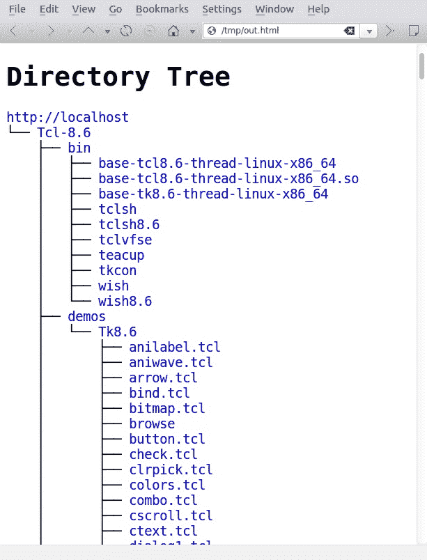

# 第三章：文件输入，文件输出

在本章中，我们将涵盖以下配方：

+   生成任意大小的文件

+   对文本文件进行交集和差集（A-B）操作

+   查找并删除重复文件

+   处理文件权限、所有权和粘滞位

+   使文件不可变

+   批量生成空白文件

+   查找符号链接及其目标

+   枚举文件类型统计信息

+   使用回环文件

+   创建 ISO 文件和混合 ISO

+   查找文件之间的差异，并进行修补

+   使用 head 和 tail 打印最后或最前面的 10 行

+   仅列出目录 - 替代方法

+   使用 `pushd` 和 `popd` 快速导航命令行

+   计算文件中的行数、单词数和字符数

+   打印目录树

+   操作视频和图像文件

# 介绍

Unix 提供了一种文件式接口来访问所有设备和系统功能。特殊文件提供了直接访问设备（如 USB 闪存和磁盘驱动器）的方式，还提供了访问系统功能（如内存使用情况、传感器和进程栈）的功能。例如，我们使用的命令终端与一个设备文件相关联。通过写入对应的设备文件，我们可以向终端写入数据。我们可以像操作文件一样访问目录、常规文件、块设备、字符特殊设备、符号链接、套接字、命名管道等。文件名、大小、文件类型、修改时间、访问时间、变更时间、inode、关联的链接以及文件所在的文件系统，都是文件可能具备的属性和特性。本章将介绍与文件相关的操作或属性的处理方法。

# 生成任意大小的文件

随机数据文件对于测试非常有用。你可以使用此类文件来测试应用程序效率，确认应用程序是否真正对输入数据中立，确认应用程序没有大小限制，创建回环文件系统（**回环文件**是可以包含文件系统本身的文件，并且这些文件可以像物理设备一样通过 `mount` 命令进行挂载），等等。Linux 提供了通用的工具来构建此类文件。

# 如何执行...

创建指定大小的大文件最简单的方法是使用 `dd` 命令。`dd` 命令将给定的输入克隆并将精确副本写入输出。输入可以是 `stdin`、设备文件、常规文件等。输出可以是 `stdout`、设备文件、常规文件等。以下是 `dd` 命令的示例：

```
$ dd if=/dev/zero of=junk.data bs=1M count=1
1+0 records in
1+0 records out
1048576 bytes (1.0 MB) copied, 0.00767266 s, 137 MB/s

```

该命令创建一个名为 `junk.data` 的文件，文件大小为 1 MB，全是零。

让我们了解一下参数：

+   `if` 定义 `input` 文件

+   `of` 定义 `output` 文件

+   `bs` 定义块中的字节数

+   `count` 定义要复制的块数

使用 `dd` 命令时要小心，因为它以低级方式操作设备。错误的操作可能会清除磁盘或破坏数据。务必仔细检查你的 `dd` 命令语法，尤其是 `=` 参数的准确性。

在前面的示例中，我们通过将`bs`设置为 1 MB 并设置`count`为 1 创建了一个 1 MB 的文件。如果`bs`设置为`2M`，`count`设置为`2`，那么总文件大小将为 4 MB。

我们可以使用不同的单位来指定**块大小**（**bs**）。将以下任何字符附加到数字后面来指定大小：

| **单位大小** | **代码** |
| --- | --- |
| 字节 (1 B) | `C` |
| 字节 (2 B) | `W` |
| 块 (512 B) | `B` |
| 千字节 (1024 B) | `K` |
| 兆字节 (1024 KB) | `M` |
| 千兆字节 (1024 MB) | `G` |

我们可以使用**bs**生成任何大小的文件。除了 MB 外，我们还可以使用表格中提到的其他单位表示法。

`/dev/zero`是一个字符特殊设备，返回零字节（`\0`）。

如果没有指定输入参数（`if`），`dd`将从`stdin`读取输入。如果没有指定输出参数（`of`），`dd`将使用`stdout`。

`dd`命令可以通过将大量数据传输到`/dev/null`并检查命令输出（例如，`1048576 bytes (1.0 MB) copied, 0.00767266 s, 137 MB/s`，如前面的示例所示）来测量内存操作的速度。

# 文本文件的交集和集合差异 (A-B)

交集和集合差异操作在数学课程中的集合理论中很常见。对字符串进行类似的操作在某些场景中也很有用。

# 准备中

`comm`命令是一个用于比较两个已排序文件的工具。它显示文件 1、文件 2 中的唯一行以及两个文件中共有的行。它有选项可以抑制某一列，使得执行交集和差异操作变得更加容易。

+   **交集**：交集操作将打印指定文件之间共有的行。

+   **差异**：差异操作将打印指定文件中存在的行，这些行在所有这些文件中并不相同。

+   **集合差异**：集合差异操作将打印文件`A`中不与所有指定文件的集合（例如，`B`和`C`）匹配的行。

# 如何执行...

请注意，`comm`需要两个已排序的文件作为输入。以下是我们的示例输入文件：

```
$ cat A.txt
apple
orange
gold
silver
steel
iron

$ cat B.txt
orange
gold
cookies
carrot

$ sort A.txt -o A.txt ; sort B.txt -o B.txt

```

1.  首先，执行没有任何选项的`comm`：

```
        $ comm A.txt B.txt 
 apple
 carrot
 cookies
 gold
 iron
 orange
 silver
 steel

```

输出的第一列包含仅出现在`A.txt`中的行。第二列包含仅出现在`B.txt`中的行。第三列包含来自`A.txt`和`B.txt`的共有行。每列都使用制表符（`\t`）字符进行分隔。

1.  为了打印两个文件的交集，我们需要移除第一列和第二列，并打印第三列。`-1`选项移除第一列，`-2`选项移除第二列，剩下第三列：

```
        $ comm A.txt B.txt -1 -2
 gold
 orange

```

1.  仅打印两个文件之间不同的行，方法是移除第 3 列：

```
        $ comm A.txt B.txt  -3
 apple
 carrot
 cookies
 iron
 silver
 steel

```

此输出使用两列并带有空白，显示文件 1 和文件 2 中的唯一行。我们可以通过将两列合并成一列，使其更加易读，如下所示：

```
        apple
 carrot
 cookies
 iron
 silver
 steel

```

1.  通过使用 `tr` 去除制表符字符，可以合并这些行（具体内容见 第二章，*掌握命令行*）

```
        $ comm A.txt B.txt  -3 | tr -d '\t'
 apple
 carrot
 cookies
 iron
 silver
 steel

```

1.  通过去除不必要的列，我们可以生成 `A.txt` 和 `B.txt` 的集合差异，如下所示：

+   `A.txt` 的集合差异：

```
                $ comm A.txt B.txt -2 -3

```

`-2 -3` 删除第二列和第三列

+   `B.txt` 的集合差异：

```
                $ comm A.txt B.txt -1 -3

```

`-2 -3` 删除第二列和第三列

# 它是如何工作的……

这些命令行选项可以减少输出：

+   `-1`：删除第一列

+   `-2`：删除第二列

+   `-3`：删除第三列

集合差异操作允许你比较两个文件，并打印出 `A.txt` 或 `B.txt` 中的所有行，排除 `A.txt` 和 `B.txt` 中的公共行。当 `A.txt` 和 `B.txt` 作为参数传递给 `comm` 命令时，输出将包含第一列为 `A.txt` 相对于 `B.txt` 的集合差异，第二列为 `B.txt` 相对于 `A.txt` 的集合差异。

`comm` 命令允许在命令行中使用 `-` 字符来从 `stdin` 读取一个文件。这为比较多个文件与给定输入提供了一种方式。

假设我们有一个 `C.txt` 文件，内容如下：

```
    $> cat C.txt
 pear
 orange
 silver
 mithral

```

我们可以将 `B.txt` 和 `C.txt` 文件与 `A.txt` 比较，像这样：

```
    $> sort B.txt C.txt | comm - A.txt
 apple
 carrot
 cookies
 gold
 iron
 mithral
 orange
 pear
 silver
 steel

```

# 查找和删除重复文件

如果你需要恢复备份，或者在断网模式下使用笔记本电脑，或者从手机下载图片，你最终会遇到重复文件：内容相同的文件。你可能会想删除重复的文件，并保留一份副本。我们可以通过使用 shell 工具来检查内容，从而识别重复文件。这个方法描述了如何找到重复文件并根据结果执行操作。

# 准备工作

我们通过比较文件内容来识别重复文件。校验和非常适合此任务。内容相同的文件会产生相同的校验和值。

# 如何操作……

按照以下步骤查找或删除重复文件：

1.  生成一些测试文件：

```
        $ echo "hello" > test ; cp test test_copy1 ; cp test test_copy2;
 $ echo "next" > other;
 # test_copy1 and test_copy2 are copy of test

```

1.  删除重复文件的脚本代码使用了 `awk`，这是在所有 Linux/Unix 系统中都可以使用的解释器：

```
        #!/bin/bash 
        #Filename: remove_duplicates.sh 
        #Description: Find and remove duplicate files and 
        # keep one sample of each file.
        ls -lS --time-style=long-iso | awk 'BEGIN { 
          getline; getline; 
          name1=$8; size=$5 
        } 
        { 
           name2=$8; 
           if (size==$5) 
        { 
           "md5sum "name1 | getline; csum1=$1; 
           "md5sum "name2 | getline; csum2=$1; 
           if ( csum1==csum2 ) 
           { 
              print name1; print name2 
            } 
        }; 

        size=$5; name1=name2; 
        }' | sort -u > duplicate_files 

         cat duplicate_files | xargs -I {} md5sum {} | \ 
         sort | uniq -w 32 | awk '{ print $2 }' | \ 
         sort -u > unique_files 

         echo Removing..  
         comm duplicate_files unique_files -3 | tee /dev/stderr | \
               xargs rm 
         echo Removed duplicates files successfully.

```

1.  按照以下方式运行代码：

```
        $ ./remove_duplicates.sh

```

# 它是如何工作的……

上面的代码会在一个目录中找到相同文件的副本，并删除除一份副本之外的所有文件。让我们来逐步了解这段代码是如何工作的。

`ls -lS` 按文件大小列出当前文件夹中文件的详细信息。`--time-style=long-iso` 选项告诉 `ls` 以 ISO 格式打印日期。`awk` 读取 `ls -lS` 的输出，并对输入文本的列和行进行比较，以查找重复文件。

代码背后的逻辑如下：

+   我们按文件大小列出文件，所以相同大小的文件将相邻。查找相同文件的第一步是找到大小相同的文件。接下来，我们计算文件的校验和。如果校验和匹配，则这些文件是重复文件，并且会删除其中一组副本。

+   `awk` 的 `BEGIN{}` 块在主要处理之前执行。它读取 "total" 行并初始化变量。大部分处理发生在 `{}` 块中，当 `awk` 读取并处理其余的 `ls` 输出时。`END{}` 块中的语句在所有输入读取完成后执行。`ls -lS` 的输出如下：

```
        total 16
 -rw-r--r-- 1 slynux slynux 5 2010-06-29 11:50 other
 -rw-r--r-- 1 slynux slynux 6 2010-06-29 11:50 test
 -rw-r--r-- 1 slynux slynux 6 2010-06-29 11:50 test_copy1
 -rw-r--r-- 1 slynux slynux 6 2010-06-29 11:50 test_copy2

```

+   第一行的输出告诉我们文件的总数，在这种情况下没有用处。我们使用 `getline` 来读取第一行，然后丢弃它。我们需要比较每一行和随后的行的大小。在 `BEGIN` 块中，我们读取第一行并存储文件名和大小（分别是第八列和第五列）。当 `awk` 进入 `{}` 块时，剩余的行会逐行读取。此块比较当前行获取的大小和先前存储在 `size` 变量中的大小。如果它们相等，则意味着这两个文件通过大小是重复的，必须通过 `md5sum` 进一步检查。

我们在解决方案的过程中玩了一些小技巧。

可以通过以下方式在 `awk` 中读取外部命令的输出：

```
      "cmd"| getline

```

一旦读取了行，整行内容就会存储在 `$0` 中，每一列的内容可通过 `$1`、`$2`、...、`$n` 获取。在这里，我们将文件的 md5sum 校验和读取到 `csum1` 和 `csum2` 变量中。`name1` 和 `name2` 变量存储连续的文件名。如果两个文件的校验和相同，则它们被确认是重复文件并被打印出来。

我们需要从每一组重复文件中找到一个文件，这样我们就可以删除所有其他的重复文件。我们计算重复文件的 `md5sum` 值，并通过查找唯一行来打印每组重复文件中的一个文件，通过使用 `-w 32` 来比较每行的 `md5sum`（`md5sum` 输出的前 32 个字符；通常 `md5sum` 的输出是一个 32 字符的哈希值，后跟文件名）。每组重复文件中的一个样本被写入 `unique_files`。

现在，我们需要删除 `duplicate_files` 中列出的文件，排除 `unique_files` 中列出的文件。`comm` 命令打印出在 `duplicate_files` 中但不在 `unique_files` 中的文件。

为此，我们使用集合差操作（参见交集、差集和集合差集的相关操作）。

`comm` 仅处理排序后的输入。因此，使用 `sort -u` 来过滤 `duplicate_files` 和 `unique_files`。

`tee` 命令用于将文件名传递给 `rm` 命令以及 `print`。`tee` 命令将其输入发送到 `stdout 和文件`。我们还可以通过重定向到 `stderr` 将文本打印到终端。`/dev/stderr` 是对应 `stderr`（标准错误）的设备。通过重定向到 `stderr` 设备文件，发送到 `stdin` 的文本将作为标准错误在终端中打印出来。

# 处理文件权限、所有权和粘滞位

文件权限和所有权是 Unix/Linux 文件系统的一个重要特征。这些特性在多用户环境中保护你的信息。不匹配的权限和所有权也可能导致共享文件变得困难。这些内容解释了如何有效地使用文件的权限和所有权。

每个文件都有多种权限类型。通常会操作三组权限（用户、组和其他）。

**用户**是文件的所有者，通常拥有所有的访问权限。**组**是由系统管理员定义的用户集合，可能被授权访问该文件。**其他用户**是指除了所有者或所有者组成员之外的任何用户。

`ls`命令的`-l`选项显示文件的多个方面，包括类型、权限、所有者和组：

```
    -rw-r--r-- 1 slynux users  2497  2010-02-28 11:22 bot.py
 drwxr-xr-x 2 slynux users  4096  2010-05-27 14:31 a.py
 -rw-r--r-- 1 slynux users  539   2010-02-10 09:11 cl.pl

```

输出的第一列定义了文件类型，具体如下：

+   `-`：如果是常规文件，则使用此标识

+   `d`：如果是目录，则使用此标识

+   `c`：用于字符设备

+   `b`：用于块设备

+   `l`：如果是符号链接，则使用此标识

+   `s`：用于套接字

+   `p`：用于管道

接下来的九个字符分为三组，每组三个字母（--- --- ---）。前三个字符对应用户（所有者）的权限，第二组三个字符对应组的权限，第三组三个字符对应其他用户的权限。九个字符中的每个字符指定是否设置权限。如果权限已设置，相应位置会出现一个字符，否则会出现`-`字符，这意味着对应的权限未设置（不可用）。

三个常见的字母组合如下：

+   `r 读取`：当这个设置时，文件、设备或目录可以被读取。

+   `w 写入`：当这个设置时，文件、设备或目录可以被修改。在文件夹上，这定义了是否可以创建或删除文件。

+   `x 执行`：当这个设置时，文件可以被执行。在文件夹上，这定义了文件夹中的文件是否可以被访问。

让我们来看看这些三个字符集对用户、组和其他的含义：

+   **用户**（权限字符串：`rwx------`）：这些定义了用户的选项。通常，数据文件的用户权限是`rw-`，而脚本或可执行文件的用户权限是`rwx`。用户还有一个特殊的权限，称为`setuid`（`S`），它出现在执行（`x`）的位置。`setuid`权限使得可执行文件即使由其他用户运行，也能像其所有者一样有效地执行。设置了`setuid`权限的文件示例是`-rwS------`。

+   **组**（权限字符串：`---rwx---`）：第二组三字符指定组权限。与`setuid`不同，组有一个`setgid`（`S`）位。这使得项目能够以其有效组为所有者组来运行可执行文件。但执行命令的组可能与文件所有者的组不同。一个组权限的例子是`----rwS---`。

+   **其他**（权限字符串：`------rwx`）：其他权限出现在权限字符串的最后三个字符中。如果这些权限被设置，任何人都可以访问该文件或文件夹。通常，您会希望将这些位设置为`---`。

目录有一个特殊权限，称为**粘滞位**。当目录设置了粘滞位时，即使组和其他用户有写权限，只有创建该目录的用户可以删除该目录中的文件。粘滞位出现在其他用户权限集中的执行字符（`x`）位置。若执行权限未设置且粘滞位已设置，`x`位置会显示为字符`t`。如果粘滞位和执行权限都已设置，则`x`位置显示为`T`。考虑这个例子：

```
    ------rwt , ------rwT

```

一个典型的启用了粘滞位的目录是`/tmp`，在该目录下，任何人都可以创建文件，但只有文件所有者可以删除文件。

在每一行`ls -l`输出中，字符串`slynux users`表示用户和组。这里，`slynux`是文件所有者，且是`users`组的成员。

# 如何执行...

为了设置文件权限，我们使用`chmod`命令。

假设我们需要设置权限为`rwx rw- r-`。

使用 chmod 设置这些权限：

```
    $ chmod u=rwx g=rw o=r filename

```

此处使用的选项如下：

+   `u`：此项指定用户的权限

+   `g`：此项指定组的权限

+   `o`：此项指定其他用户的权限

使用`+`可以向用户、组或其他用户添加权限，使用`-`可以删除权限。

给一个已经拥有权限`rwx rw- r-`的文件添加执行权限：

```
    $ chmod o+x filename

```

此命令为其他用户添加了`x`权限。

给所有权限类别添加执行权限，即用户、组和其他用户：

```
    $ chmod a+x filename

```

这里的`a`表示所有用户。

若要移除权限，请使用`-`。例如，**$ chmod a-x 文件名**。

权限可以用三位八进制数字表示，每一位分别对应用户、组和其他用户，顺序为用户、组、其他。

读取、写入和执行权限有各自独特的八进制值，如下所示：

+   `r` = 4

+   `w` = 2

+   `x` = 1

我们通过加和八进制值来计算所需的权限组合。考虑这个例子：

+   `rw-` = 4 + 2 = 6

+   `r-x` = 4 + 1 = 5

权限`rwx rw- r--`的数字表示方法如下：

+   `rwx` = 4 + 2 + 1 = 7

+   `rw-` = 4 + 2 = 6

+   `r--` = 4

因此，`rwx rw- r--`等于`764`，使用八进制值设置权限的命令是`$ chmod 764 文件名`。

# 还有更多内容...

让我们来看看还可以对文件和目录执行哪些任务。

# 更改所有权

`chown` 命令将更改文件和文件夹的所有权：

```
    $ chown user.group filename

```

考虑这个例子：

```
    $ chown slynux.users test.sh

```

这里，`slynux` 是用户，`users` 是组。

# 设置粘滞位

粘滞位可以应用于目录。当设置了粘滞位时，只有文件的所有者可以删除文件，即使其他人对文件夹有写权限。

粘滞位通过 `+t` 选项传递给 `chmod` 来设置：

```
    $ chmod a+t directory_name

```

# 递归应用文件权限

有时，你可能需要递归地更改当前目录中所有文件和目录的权限。`chmod` 的 `-R` 选项支持递归更改：

```
    $ chmod 777 . -R

```

`-R` 选项指定递归地更改权限。

我们使用 `.` 来指定路径为当前工作目录。这相当于 `$ chmod 777 "$(pwd)" -R`。

# 递归应用所有权

`chown` 命令也支持 `-R` 标志来递归地更改所有权：

```
    $ chown user.group . -R

```

# 以其他用户身份运行可执行文件（setuid）

一些可执行文件需要以当前用户之外的用户身份执行。例如，http 服务器可能会在启动过程中由 root 启动，但该任务应该由 `httpd` 用户拥有。`setuid` 权限使得文件可以在其他用户运行程序时，以文件所有者身份执行。

首先，将所有权更改为需要执行操作的用户，然后以该用户身份登录。接着，运行以下命令：

```
    $ chmod +s executable_file
 # chown root.root executable_file
 # chmod +s executable_file
 $ ./executable_file

```

现在无论谁调用它，都以 root 用户身份执行。

`setuid` 仅对 Linux ELF 二进制文件有效。你无法将 shell 脚本设置为以另一个用户身份运行。这是一项安全功能。

# 使文件不可变

读取、写入、执行和 Setuid 字段在所有 Linux 文件系统中都是常见的。**扩展文件系统**（ext2、ext3 和 ext4）支持更多属性。

扩展属性之一使文件不可变。当文件被设置为不可变时，任何用户或超级用户都无法删除该文件，直到不可变属性被从文件中移除。你可以使用 `df -T` 命令来确定文件系统的类型，或者通过查看 `/etc/mtab` 文件来确定。该文件的第一列指定了分区设备路径（例如，`/dev/sda5`），第三列指定了文件系统类型（例如，ext3）。

使文件不可变是一种防止文件被修改的方法。一个例子是将 `/etc/resolv.conf` 文件设置为不可变。`resolv.conf` 文件存储了 DNS 服务器的列表，这些服务器将域名（如 packtpub.com）转换为 IP 地址。DNS 服务器通常是你 ISP 的 DNS 服务器。但是，如果你更喜欢使用第三方服务器，可以修改 `/etc/resolv.conf` 来指向该 DNS。下次连接到 ISP 时，`/etc/resolv.conf` 会被覆盖为 ISP 的 DNS 服务器。为了防止这种情况发生，可以将 `/etc/resolv.conf` 设置为不可变。

在本教程中，我们将学习如何使文件不可变，并在需要时将其恢复为可变。

# 准备工作

`chattr` 命令用于更改扩展属性。它可以使文件不可变，还可以修改属性以调整文件系统同步或压缩。

# 如何操作...

要使文件不可变，请按照以下步骤操作：

1.  使用 `chattr` 使文件不可变：

```
        # chattr +i file

```

1.  该文件现在是不可变的。尝试以下命令：

```
        rm file
 rm: cannot remove `file': Operation not permitted

```

1.  为了使其可写，请移除不可变属性，如下所示：

```
        chattr -i file

```

# 批量生成空白文件

脚本必须在实际系统中使用之前进行测试。我们可能需要生成数千个文件，以确认没有内存泄漏或进程未结束。这个示例演示了如何生成空白文件。

# 正在准备

`touch` 命令用于创建空白文件或修改现有文件的时间戳。

# 如何操作...

要批量生成空白文件，请按照以下步骤操作：

1.  使用不存在的文件名调用 touch 命令会创建一个空文件：

```
        $ touch filename

```

1.  按照不同的命名模式生成批量文件：

```
        for name in {1..100}.txt 
        do 
          touch $name 
        done 

```

在前面的代码中，`{1..100}` 将扩展为字符串 `1, 2, 3, 4, 5, 6, 7...100`。我们可以使用各种简写模式，比如 `test{1..200}.c`、`test{a..z}.txt` 等，代替 `{1..100}.txt`。

如果文件已存在，`touch` 命令会将与文件相关的所有时间戳更改为当前时间。以下选项定义了要修改的时间戳子集：

+   `touch -a`：修改访问时间

+   `touch -m`：这会修改修改时间

我们可以指定时间和日期，而不是使用当前时间：

```
      $ touch -d "Fri Jun 25 20:50:14 IST 1999" filename

```

与 `-d` 一起使用的日期字符串不必是这个确切格式。它可以接受许多简单的日期格式。我们可以省略时间，只提供日期，如 *Jan 20*、*2010*。

# 查找符号链接及其目标

符号链接在类 Unix 系统中很常见。使用它们的原因包括方便访问、维护同一库或程序的多个版本等。这个示例将讨论处理符号链接的基本技术。

符号链接是指向其他文件或文件夹的指针。它们的功能类似于 MacOS X 中的别名或 Windows 中的快捷方式。当符号链接被删除时，不会影响原始文件。

# 如何操作...

以下步骤将帮助你处理符号链接：

1.  要创建符号链接，请运行以下命令：

```
        $ ln -s target symbolic_link_name

```

请参考此示例：

```
        $ ln -l -s /var/www/ ~/web

```

这会在当前用户的主目录中创建一个符号链接（称为 **web**），指向 `/var/www/`。

1.  要验证链接是否创建，运行此命令：

```
        $ ls -l ~/web
 lrwxrwxrwx 1 slynux slynux 8 2010-06-25 21:34 web -> /var/www

```

`web -> /var/www` 指定 `web` 指向 `/var/www`。

1.  要打印当前目录中的符号链接，请使用此命令：

```
        $ ls -l | grep "^l"

```

1.  要打印当前目录及子目录中的所有符号链接，请运行此命令：

```
        $ find . -type l -print

```

1.  要显示给定符号链接的目标路径，使用 `readlink` 命令：

```
        $ readlink web
 /var/www

```

# 如何工作...

当使用 `ls` 和 `grep` 显示当前文件夹中的符号链接时，`grep ^l` 命令过滤 `ls -l` 输出，仅显示以 `l` 开头的行。`^` 指定字符串的开始，紧随其后的 `l` 表示字符串必须以 `l` 开头，这是链接的标识符。

使用 `find` 时，我们使用参数 `-type l`，指示 `find` 查找符号链接文件。`-print` 选项将符号链接的列表打印到标准输出（`stdout`）。初始路径设置为当前目录。

# 枚举文件类型统计信息

Linux 支持多种文件类型。本示例描述了一个脚本，它遍历一个目录及其子目录中的所有文件，并打印一个报告，报告中包含文件类型的详细信息（不同文件类型的文件）以及每种文件类型的计数。这个示例是一个练习，旨在编写脚本以遍历大量文件并收集细节。

# 正在准备

在 Unix/Linux 系统中，文件类型并非由文件扩展名定义（如微软 Windows 所做）。Unix/Linux 系统使用 `file` 命令，通过检查文件的内容来确定文件类型。此示例收集了多个文件的文件类型统计信息。它将相同类型文件的计数存储在一个关联数组中。

关联数组在 bash 4 及更高版本中得到支持。

# 如何操作...

要枚举文件类型统计信息，请按照以下步骤操作：

1.  要打印文件的类型，请使用以下命令：

```
        $ file filename

 $ file /etc/passwd
 /etc/passwd: ASCII text

```

1.  打印文件类型而不打印文件名：

```
        $ file -b filename
 ASCII text

```

1.  文件统计脚本如下：

```
     #!/bin/bash 
     # Filename: filestat.sh 

     if [ $# -ne 1 ]; 
     then 
       echo "Usage is $0 basepath"; 
       exit 
     fi 
     path=$1 

     declare -A statarray; 

     while read line; 
     do 
       ftype=`file -b "$line" | cut -d, -f1` 
       let statarray["$ftype"]++; 

     done < (find $path -type f -print) 

     echo ============ File types and counts ============= 
     for ftype in "${!statarray[@]}"; 
     do 
       echo $ftype :  ${statarray["$ftype"]} 
     done 

```

使用方法如下：

```
        $ ./filestat.sh /home/slynux/temp

```

1.  示例输出如下所示：

```
        $ ./filetype.sh /home/slynux/programs
 ============ File types and counts =============
 Vim swap file : 1
 ELF 32-bit LSB executable : 6
 ASCII text : 2
 ASCII C program text : 10

```

# 如何实现...

这个脚本依赖于关联数组 `statarray`。该数组按文件类型索引：**PDF**、**ASCII** 等等。每个索引存储该类型文件的计数。它由 `declare -A statarray` 命令定义。

脚本包含两个循环：一个 `while` 循环处理来自 `find` 命令的输出，另一个是 `for` 循环，遍历 `statarray` 变量的索引并生成输出。

`while` 循环的语法如下所示：

```
while read line; 
do something 
done < filename 

```

对于这个脚本，我们使用 `find` 命令的输出，而不是文件，作为 `while` 的输入。

`(find $path -type f -print)` 命令等同于文件名，但它将文件名替换为子进程输出。

请注意，第一个 `<` 用于输入重定向，第二个 `<` 用于将子进程的输出转换为文件名。同时，它们之间有一个空格，以防止 shell 将其解释为 `<<` 操作符。

`find` 命令使用 `-type f` 选项来返回 `$path` 中定义的子目录下的文件列表。文件名由 `read` 命令逐行读取。当 `read` 命令接收到 **EOF**（**文件结束符**）时，它返回一个 *失败* 并且 `while` 命令退出。

在`while`循环中，使用 file 命令来确定文件的类型。`-b`选项用于显示文件类型而不显示文件名。

file 命令提供了比我们需要的更多的详细信息，如图像编码和分辨率（对于图像文件）。这些详细信息是以逗号分隔的，示例如下：

```
    $ file a.out -b
 ELF 32-bit LSB executable, Intel 80386, version 1 (SYSV),
    dynamically linked (uses shared libs), for GNU/Linux 2.6.15, not
    stripped

```

我们需要从之前的详细信息中提取出`ELF 32-bit LSB executable`。因此，我们使用`-d,`选项指定`,`为分隔符，并使用`-f1`选项选择第一个字段。

`<(find $path -type f -print)`相当于一个文件名，但它通过子进程输出替代文件名。注意，第一个`<`用于输入重定向，第二个`<`用于将子进程输出转换为文件名。同时，这两个`<`之间有一个空格，以免 Shell 将其解释为`<<`操作符。

在 Bash 3.x 及更高版本中，我们有一个新的操作符`<<<`，它允许我们将字符串输出作为输入文件。使用这个操作符，我们可以写出循环的完成行，如下所示：

```
    done <<< "`find $path -type f -print`"

```

`${!statarray[@]}` 返回数组索引的列表。

# 使用回环文件

Linux 文件系统通常存在于硬盘或内存棒等设备上。文件也可以作为文件系统挂载。这个文件中的文件系统可以用于测试、自定义文件系统，甚至作为加密磁盘存储机密信息。

# 如何操作...

要在文件中创建 1 GB 的 ext4 文件系统，请按照以下步骤操作：

1.  使用`dd`创建一个 1 GB 的文件：

```
        $ dd if=/dev/zero of=loobackfile.img bs=1G count=1
 1024+0 records in
 1024+0 records out
 1073741824 bytes (1.1 GB) copied, 37.3155 s, 28.8 MB/s

```

创建的文件大小超过 1 GB，因为硬盘是块设备，因此存储必须按块大小的整数倍分配。

1.  使用`mkfs`命令将 1 GB 的文件格式化为 ext4：

```
        $ mkfs.ext4 loopbackfile.img

```

1.  使用 file 命令检查文件类型：

```
        $ file loobackfile.img
 loobackfile.img: Linux rev 1.0 ext4 filesystem data,   
        UUID=c9d56c42-   
        f8e6-4cbd-aeab-369d5056660a (extents) (large files) (huge files)

```

1.  使用`mkdir`和 mount 创建挂载点，并挂载回环文件：

```
        # mkdir /mnt/loopback
 # mount -o loop loopbackfile.img /mnt/loopback

```

`-o loop`选项用于挂载回环文件系统。

这是一个简短的方法，将回环文件系统附加到操作系统选择的设备上，设备名称类似于`/dev/loop1`或`/dev/loop2`。

1.  要指定特定的回环设备，请运行以下命令：

```
        # losetup /dev/loop1 loopbackfile.img
 # mount /dev/loop1 /mnt/loopback

```

1.  要 umount（卸载），请使用以下语法：

```
        # umount mount_point

```

请考虑以下示例：

```
        # umount /mnt/loopback

```

1.  我们还可以使用设备文件路径作为`umount`命令的参数：

```
        # umount /dev/loop1

```

请注意，mount 和 umount 命令应该以 root 用户身份执行，因为它们是特权命令。

# 它是如何工作的...

首先，我们必须创建一个文件来制作回环文件系统。为此，我们使用`dd`，它是一个通用的原始数据复制命令。它将`if`参数指定的文件中的数据复制到`of`参数指定的文件中。我们指示`dd`以 1 GB 的块大小复制数据，并复制一个这样的块，从而创建一个 1 GB 的文件。`/dev/zero`文件是一个特殊文件，从中读取数据时总是返回 0。

我们使用`mkfts.ext4`命令在文件中创建一个 ext4 文件系统。任何可以挂载的设备都需要一个文件系统。常见的文件系统包括 ext4、ext3 和 vfat。

`mount` 命令将环回文件附加到 **挂载点**（在此情况下为 `/mnt/loopback`）。挂载点使用户能够访问文件系统上存储的文件。挂载点必须在执行 `mount` 命令之前使用 `mkdir` 命令创建。我们传递 `-o loop` 选项给 `mount`，告诉它我们挂载的是一个环回文件，而不是一个设备。

当 `mount` 知道它正在操作一个环回文件时，它会在 `/dev` 中设置一个与环回文件对应的设备，然后挂载它。如果我们希望手动执行此操作，我们可以使用 `losetup` 命令来创建设备，然后使用 `mount` 命令挂载它。

# 还有更多内容...

让我们探索一些环回文件和挂载的其他可能性。

# 在环回镜像中创建分区

假设我们想要创建一个环回文件，进行分区，然后最终挂载一个子分区。在这种情况下，我们不能使用 `mount -o loop`。我们必须手动设置设备并挂载其中的分区。

对一个零文件进行分区：

```
    # losetup /dev/loop1 loopback.img
 # fdisk /dev/loop1

```

`fdisk` 是 Linux 系统上的标准分区工具。关于使用 `fdisk` 创建分区的简明教程可在 [`www.tldp.org/HOWTO/Partition/fdisk_partitioning.html`](http://www.tldp.org/HOWTO/Partition/fdisk_partitioning.html) 上找到（请确保在本教程中使用 `/dev/loop1` 而不是 `/dev/hdb`）。

在 `loopback.img` 中创建分区并挂载第一个分区：

```
    # losetup -o 32256 /dev/loop2 loopback.img

```

在这里，`/dev/loop2` 代表第一个分区，`-o` 是偏移标志，`32256` 字节用于 DOS 分区方案。第一个分区从硬盘开始的第 `32256` 字节处开始。

我们可以通过指定所需的偏移量来设置第二个分区。挂载后，我们可以像在物理设备上进行所有常规操作一样进行操作。

# 更快速地挂载带有分区的环回磁盘镜像

我们可以手动将分区偏移量传递给 `losetup` 来挂载环回磁盘镜像中的分区。然而，使用 `kpartx` 有一种更快捷的方法来挂载该镜像中的所有分区。此工具通常未安装，因此您需要通过包管理器安装它：

```
    # kpartx -v -a diskimage.img 
 add map loop0p1 (252:0): 0 114688 linear /dev/loop0 8192
 add map loop0p2 (252:1): 0 15628288 linear /dev/loop0 122880

```

这会创建磁盘镜像中分区到 `/dev/mapper` 中设备的映射，之后您可以将其挂载。例如，要挂载第一个分区，请使用以下命令：

```
    # mount /dev/mapper/loop0p1 /mnt/disk1

```

当你完成设备操作（并使用 `umount` 卸载所有挂载的分区）后，通过运行以下命令删除映射：

```
    # kpartx -d diskimage.img 
 loop deleted : /dev/loop0

```

# 将 ISO 文件作为环回文件挂载

ISO 文件是光盘介质的归档。我们可以像挂载物理磁盘一样，使用环回挂载来挂载 ISO 文件。

我们甚至可以使用一个非空目录作为挂载路径。然后，挂载路径将包含来自设备的数据，而不是原始内容，直到设备被卸载为止。考虑以下示例：

```
    # mkdir /mnt/iso
 # mount -o loop linux.iso /mnt/iso

```

现在，从 `/mnt/iso` 执行操作。ISO 是一个只读文件系统。

# 使用 `sync` 立即刷新更改

在挂载设备上进行的更改不会立即写入物理设备。它们仅在内部内存缓冲区满时才会被写入。我们可以使用`sync`命令强制写入：

```
    $ sync

```

# 创建 ISO 文件和混合 ISO

ISO 镜像是一种存储光盘（如 CD-ROM、DVD-ROM 等）精确映像的归档格式。ISO 文件通常用于存储将要刻录到光盘介质的内容。

本节将描述如何将光盘中的数据提取到一个可以作为回环设备挂载的 ISO 文件中，然后解释如何生成可以刻录到光盘介质上的自定义 ISO 文件系统。

我们需要区分可引导光盘和不可引导光盘。可引导光盘能够从自身启动，并运行操作系统或其他产品。可引导的 DVD 包括安装包和*Live*系统，如 Knoppix 和 Puppy。

不可引导的 ISO 无法做到这一点。升级包、源代码 DVD 等都是不可引导的。

请注意，从可引导的 CD-ROM 复制文件到另一个 CD-ROM 并不足以使新光盘可引导。为了保留 CD-ROM 的引导特性，必须将其作为磁盘映像使用 ISO 文件进行复制。

许多人使用闪存驱动器来替代光盘。当我们将可引导的 ISO 写入闪存驱动器时，除非使用专门为此目的设计的混合 ISO 镜像，否则它将无法引导。

这些教程将为你提供有关 ISO 镜像及其操作的深入理解。

# 准备工作

如前所述，Unix 将一切视为文件。每个设备都是一个文件。因此，如果我们想复制设备的精确映像，我们需要从中读取所有数据并写入文件。光盘读取器将在`/dev`文件夹中，名称可能为`/dev/cdrom`、`/dev/dvd`，或者可能是`/dev/sd0`。访问`sd*`时需要小心。多个磁盘类型设备被命名为`sd#`。例如，你的硬盘可能是`sd0`，CD-ROM 可能是`sd1`。

`cat`命令将读取任何数据，并且重定向将该数据写入文件。这是可行的，但我们还将看到更好的方法来完成这项操作。

# 如何操作...

为了从`/dev/cdrom`创建 ISO 镜像，请使用以下命令：

```
    # cat /dev/cdrom > image.iso

```

虽然这也可以工作，但创建 ISO 镜像的首选方法是使用`dd`命令：

```
    # dd if=/dev/cdrom of=image.iso

```

`mkisofs`命令创建一个 ISO 镜像文件。由`mkisofs`创建的输出文件可以通过`cdrecord`等工具刻录到 CD-ROM 或 DVD-ROM 上。`mkisofs`命令将从包含所有要复制到 ISO 文件中的文件的目录中创建 ISO 文件：

```
    $ mkisofs -V "Label" -o image.iso source_dir/ 

```

`mkisofs`命令中的`-o`选项指定 ISO 文件的路径。`source_dir`是作为 ISO 文件内容的目录路径，`-V`选项指定用于 ISO 文件的标签。

# 还有更多内容...

让我们学习更多与 ISO 文件相关的命令和技术。

# 从闪存驱动器或硬盘引导的混合 ISO

启动 ISO 文件通常不能直接传输到 USB 存储设备上以创建可启动的 USB 闪存盘。然而，某些特殊类型的 ISO 文件称为混合 ISO，它们可以被刷写到设备上，生成一个可启动的设备。

我们可以使用`isohybrid`命令将标准 ISO 文件转换为混合 ISO。`isohybrid`命令是一个新的工具，大多数 Linux 发行版默认不包含它。你可以从[syslinux 包](http://syslinux.zytor.com/)下载，网址是[`www.syslinux.org`](http://www.syslinux.org)。该命令也可能在你的 yum 或`apt-get`软件库中作为`syslinux-utils`提供。

该命令将使 ISO 文件变得可启动：

```
    # isohybrid image.iso

```

现在可以将 ISO 文件写入 USB 存储设备。

要将 ISO 写入 USB 存储设备，使用以下命令：

```
    # dd if=image.iso of=/dev/sdb1 

```

使用适当的设备代替`/dev/sdb1`，或者你也可以使用`cat`，如下所示：

```
    # cat image.iso >> /dev/sdb1

```

# 从命令行刻录 ISO 文件

`cdrecord`命令将 ISO 文件刻录到 CD-ROM 或 DVD-ROM 上。

要将映像刻录到 CD-ROM 上，运行以下命令：

```
    # cdrecord -v dev=/dev/cdrom image.iso

```

有用的选项包括：

+   使用`-speed`选项指定刻录速度：

```
 -speed SPEED 

```

考虑以下示例：

```
      # cdrecord -v dev=/dev/cdrom image.iso -speed 8

```

这里，`8`表示指定的速度为 8 倍速。

+   CD-ROM 可以使用多重会话进行刻录，从而允许我们多次向同一磁盘写入数据。可以使用`-multi`选项进行多会话刻录：

```
      # cdrecord -v dev=/dev/cdrom image.iso -multi

```

# 操控 CD-ROM 托盘

如果你在桌面电脑上，尝试以下命令并享受乐趣：

```
    $ eject

```

该命令会弹出托盘。

```
    $ eject -t

```

该命令将关闭托盘。

为了加分，编写一个循环，使托盘反复打开和关闭几次。显然，你永远不会在同事去喝咖啡的时候悄悄地把这个脚本加到他们的`.bashrc`文件里。

# 查找文件之间的差异并打补丁

当有多个版本的文件可用时，突出显示文件之间的差异比手动比较它们更为有用。这个例子演示了如何生成文件之间的差异。在与多个开发者合作时，需要将更改分发给其他人。将整个源代码发送给其他开发者既耗时又麻烦。发送一个差异文件更为方便，因为它只包含被更改、添加或删除的行，并且附带行号。这个差异文件被称为**补丁文件**。我们可以使用`patch`命令将补丁文件中指定的更改应用到原始源代码中。如果需要，也可以通过再次应用补丁来撤销这些更改。

# 如何操作...

`diff`工具报告两个文件之间的差异。

1.  为了演示`diff`的行为，创建以下文件：

文件 1：`version1.txt`

```
         this is the original text 
         line2 
         line3 
         line4 
         happy hacking ! 

```

文件 2：`version2.txt`

```
       this is the original text  
       line2 
       line4 
       happy hacking !  
       GNU is not UNIX 

```

1.  非统一的`diff`输出（没有`-u`标志）是：

```
        $ diff version1.txt version2.txt 
 3d2
 <line3
 6c5
 > GNU is not UNIX

```

1.  统一的`diff`输出是：

```
        $ diff -u version1.txt version2.txt
 --- version1.txt  2010-06-27 10:26:54.384884455 +0530 
 +++ version2.txt  2010-06-27 10:27:28.782140889 +0530 
 @@ -1,5 +1,5 @@ 
 this is the original text 
 line2
 -line3
 line4 
 happy hacking ! 
 -
 +GNU is not UNIX

```

`-u`选项会生成统一格式的输出。统一格式的差异输出更具可读性，也更容易解读。

在统一`diff`中，以`+`开头的行表示添加的行，以`-`开头的行表示删除的行。

1.  可以通过将 `diff` 输出重定向到文件来生成补丁文件：

```
        $ diff -u version1.txt version2.txt > version.patch

```

`patch` 命令可以对两个文件应用更改。当应用到 `version1.txt` 时，我们得到 `version2.txt` 文件。当应用到 `version2.txt` 时，我们生成 `version1.txt`。

1.  此命令应用补丁：

```
        $ patch -p1 version1.txt < version.patch
 patching file version1.txt

```

我们现在有了 `version1.txt`，它的内容与 `version2.txt` 相同。

1.  要撤销更改，请使用以下命令：

```
        $ patch -p1 version1.txt < version.patch 
 patching file version1.txt
 Reversed (or previously applied) patch detected!  Assume -R? [n] y
 #Changes are reverted.

```

如图所示，给已应用补丁的文件再次打补丁会撤销更改。为了避免提示用户进行 `y/n` 选择，我们可以使用 `-R` 选项与 `patch` 命令一起使用。

# 还有更多...

让我们了解 `diff` 的其他功能。

# 生成目录间的差异

`diff` 命令可以递归地作用于目录。它将为目录中的所有子文件生成差异输出。使用以下命令：

```
    $ diff -Naur directory1 directory2

```

此命令中每个选项的解释如下：

+   `-N`：用于将缺失的文件视为空文件

+   `-a`：用于将所有文件视为文本文件

+   `-u`：用于生成统一格式的输出

+   `-r`：用于递归遍历目录中的文件

# 使用 `head` 和 `tail` 打印文件的最后或前 10 行

当检查一个非常大的文件时，`cat` 命令（会显示所有行）并不适用。相反，我们希望查看文件的某个子集（例如，文件的前 10 行或最后 10 行）。我们可能需要打印前 *n* 行或最后 *n* 行，或者打印除去最后 *n* 行或除去前 *n* 行的内容，或者打印两个位置之间的行。

`head` 和 `tail` 命令可以做到这一点。

# 如何执行...

`head` 命令读取输入文件的开头部分。

1.  打印前 10 行：

```
        $ head file

```

1.  从 `stdin` 读取数据：

```
        $ cat text | head

```

1.  指定要打印的前几行数量：

```
        $ head -n 4 file

```

此命令打印前四行。

1.  打印所有行，但不包括最后 `M` 行：

```
        $ head -n -M file 

```

请注意，它是负 M。

例如，要打印所有行，但不包括最后五行，可以使用以下命令：

```
        $ seq 11 | head -n -5
 1
 2
 3
 4
 5
 6

```

此命令打印第 1 到第 5 行：

```
      $ seq 100 | head -n 5

```

1.  打印除去最后几行是 `head` 的常见用途。在查看日志文件时，我们最常想查看最新的（即最后）几行。

1.  要打印文件的最后 10 行，请使用此命令：

```
      $ tail file

```

1.  要从 `stdin` 读取数据，请使用以下命令：

```
      $ cat text | tail

```

1.  打印最后五行：

```
      $ tail -n 5 file

```

1.  要打印所有行，但不包括前 M 行，请使用此命令：

```
      $ tail -n +(M+1)

```

例如，要打印所有行，但不包括前五行，*M + 1 = 6*，则命令如下：

```
      $ seq 100 | tail -n +6 

```

这将打印第 6 行到第 100 行。

`tail` 的一个常见用途是监控增长中的文件中的新行，例如系统日志文件。由于新行会追加到文件的末尾，`tail` 可以用于在数据写入时显示它们。为了监控文件的增长，`tail` 有一个特殊选项 `-f` 或 `--follow`，它允许 `tail` 跟踪追加的行并在数据被添加时显示它们：

```
    $ tail -f growing_file

```

你可能会希望将此用在日志文件上。监控文件增长的命令是：

```
    # tail -f /var/log/messages

```

或者，可以使用以下命令：

```
    $ dmesg | tail -f

```

`dmesg` 命令返回内核环形缓冲区的消息内容。我们可以使用它来调试 USB 设备、检查磁盘行为或监控网络连接。`-f` 参数的 `tail` 可以添加一个休眠间隔 `-s`，用于设置监控文件更新时的间隔。

`tail` 命令可以指示在给定的进程 ID 终止后停止运行。

假设进程 `Foo` 正在向我们正在监控的文件中附加数据。`-f` 参数的 `tail` 命令应当在进程 `Foo` 结束前一直执行。

```
    $ PID=$(pidof Foo)
 $ tail -f file --pid $PID

```

当进程 `Foo` 终止时，`tail` 也会终止。

让我们做一个例子。

1.  创建一个新文件 `file.txt`，并在你喜欢的文本编辑器中打开该文件。

1.  现在运行以下命令：

```
        $ PID=$(pidof gedit)
 $ tail -f file.txt --pid $PID

```

1.  向文件添加新行并频繁保存文件。

当你向文件末尾添加新行时，`tail` 命令会将新行写入终端。当你关闭编辑会话时，`tail` 命令将终止。

# 仅列出目录 - 替代方法

仅通过脚本列出目录是相当困难的。此配方介绍了多种仅列出目录的方法。

# 准备工作

准备工作 有多种方法可以仅列出目录。`dir` 命令类似于 `ls`，但选项较少。我们还可以使用 `ls` 和 `find` 来列出目录。

# 如何实现...

当前路径中的目录可以通过以下方式显示：

1.  使用 `ls` 和 `-d` 参数来打印目录：

```
        $ ls -d */

```

1.  使用 `ls -F` 和 `grep`：

```
        $ ls -F | grep "/$"

```

1.  使用 `ls -l` 和 `grep`：

```
        $ ls -l | grep "^d"

```

1.  使用 `find` 打印目录：

```
         $ find . -type d -maxdepth 1 -print

```

# 工作原理...

当 `-F` 参数与 `ls` 一起使用时，所有条目都会附加一些文件字符，如 `@`、`*`、`|` 等等。对于目录，条目会附加 `/` 字符。我们使用 `grep` 来过滤出仅以 `/$` 结束的条目。

`ls -l` 输出的每一行的第一个字符是文件类型字符。对于目录，文件类型字符为 `d`。因此，我们使用 `grep` 来过滤以 `"d."` 开头的行。`^` 是行首指示符。

`find` 命令可以将参数类型设置为目录，并将 `maxdepth` 设置为 `1`，因为我们不希望它在子目录中进行搜索。

# 使用 `pushd` 和 `popd` 进行快速命令行导航

在文件系统中导航多个位置时，一种常见做法是通过复制和粘贴路径来 `cd`。如果涉及多个位置，这种做法效率较低。当我们需要在不同位置之间来回切换时，每次使用 `cd` 命令输入或粘贴路径会非常浪费时间。Bash 和其他 Shell 支持 `pushd` 和 `popd` 用于在目录之间循环切换。

# 准备工作

`pushd` 和 `popd` 用于在多个目录之间切换，而无需重新输入目录路径。`pushd` 和 `popd` 会创建一个路径栈——一个 **后进先出**（**LIFO**）的目录列表，记录我们访问过的目录。

# 如何操作...

`pushd` 和 `popd` 命令替代 `cd` 来更改工作目录。

1.  要推入并切换到一个目录路径，使用此命令：

```
        ~ $ pushd /var/www

```

现在栈中包含 `/var/www ~`，当前目录已经切换到 `/var/www`。

1.  现在，推入下一个目录路径：

```
        /var/www $ pushd /usr/src

```

现在栈中包含 `/usr/src` `/var/www ~`，当前目录是 `/usr/src`。

你可以根据需要推入任意数量的目录路径。

1.  查看栈的内容：

```
        $ dirs
 /usr/src /var/www ~ /usr/share /etc
 0           1              2  3              4 

```

1.  现在，当你想切换到列表中的任何路径时，给每个路径编号，从 `0` 到 `n`，然后使用需要切换的路径编号。考虑以下示例：

```
        $ pushd +3

```

现在它将旋转栈并切换到 `/usr/share` 目录。

`pushd` 总是将路径添加到栈中。要从栈中移除路径，使用 `popd`。

1.  删除最后一个推入的路径并切换到下一个目录：

```
        $ popd

```

假设栈是 `/usr/src /var/www ~ /usr/share /etc`，当前目录是 `/usr/src`。执行 `popd` 命令会将栈更改为 `/var/www ~ /usr/share /etc`，并将当前目录更改为 `/var/www`。

1.  要从列表中移除特定路径，使用 `popd +num`。`num` 是从左到右按 `0` 到 `n` 计数的。

# 还有更多...

让我们来看看基本的目录导航操作。

# 当使用超过三个目录路径时，`pushd` 和 `popd` 非常有用。然而，当你只使用两个位置时，有一种更简单的替代方法，即 `cd -`。

当前路径是 `/var/www`。

```
    /var/www $  cd /usr/src
/usr/src $ # do something

```

现在，要切换回 `/var/www`，你不需要重新输入 `/var/www`，只需执行：

```
    /usr/src $ cd -

```

要切换到 `/usr/src`：

```
    /var/www $ cd -

```

# 计算文件中的行数、单词数和字符数

计算文本文件中的行数、单词数和字符数是非常常用的操作。本书的其他章节包含一些复杂的示例，这些计数用于生成所需的输出。**计算 LOC**（**代码行数**）是开发人员常见的应用场景。我们可能需要计算某些文件的子集，例如，所有源代码文件，但不包括目标文件。结合 `wc` 和其他命令可以实现这个目的。

`wc` 工具用于统计行数、单词数和字符数。它代表 **word count**（字数统计）。

# 如何操作...

`wc` 命令支持选项来计算行数、单词数和字符数：

1.  计算行数：

```
      $ wc -l file

```

1.  要使用 `stdin` 作为输入，使用此命令：

```
      $ cat file | wc -l

```

1.  计算单词数：

```
      $ wc -w file
 $ cat file | wc -w

```

1.  计算字符数：

```
      $ wc -c file
 $ cat file | wc -c

```

要计算文本字符串中的字符数，使用此命令：

```
      echo -n 1234 | wc -c
 4

```

在这里，`-n` 会删除最后一个换行符。

1.  要打印行数、单词数和字符数，执行没有任何选项的 `wc`：

```
      $ wc file
 1435   15763  112200

```

这些是行数、单词数和字符数。

1.  使用 `-L` 选项打印文件中最长行的长度：

```
      $ wc file -L
 205

```

# 打印目录树

通过树状层级图形表示目录和文件系统，可以更容易地进行可视化。监控脚本使用这种表示方式将文件系统以易读的格式展示出来。

# 准备工作

`tree` 命令打印文件和目录的图形化树状结构。`tree` 命令并没有预安装在 Linux 发行版中，你需要通过包管理器安装它。

# 如何做...

以下是一个示例 Unix 文件系统树，用于展示一个例子：

```
    $ tree ~/unixfs
 unixfs/
 |-- bin
 |   |-- cat
 |   `-- ls
 |-- etc
 |   `-- passwd
 |-- home
 |   |-- pactpub
 |   |   |-- automate.sh
 |   |   `-- schedule
 |   `-- slynux
 |-- opt
 |-- tmp
 `-- usr
 8 directories, 5 files

```

`tree` 命令支持多个选项：

+   要仅显示与模式匹配的文件，请使用 `-P` 选项：

```
      $ tree path -P PATTERN # Pattern should be wildcard in single    
      quotes

```

看这个例子：

```
      $ tree PATH -P '*.sh' # Replace PATH with a directory path
 |-- home
 |   |-- packtpub
 |   |   `-- automate.sh

```

+   要显示与模式不匹配的文件，请使用 `-I` 选项：

```
      $ tree path -I PATTERN

```

+   要显示文件和目录的大小，请使用 `-h` 选项：

```
      $ tree -h

```

# 还有更多内容...

`tree` 命令可以生成 HTML 输出，也可以输出到终端。

# `tree` 的 HTML 输出

这个命令创建一个带有 `tree` 输出的 HTML 文件：

```
    $ tree PATH -H http://localhost -o out.html

```

将 `http://localhost` 替换为你打算托管文件的 URL。将 `PATH` 替换为真实的基础目录路径。对于当前目录，使用 `.` 作为 `PATH`。

从目录列表生成的网页将如下所示：



# 处理视频和图像文件

Linux 和 Unix 支持许多用于处理图像和视频文件的应用程序和工具。大多数 Linux 发行版都包括 **ImageMagick** 套件及其用于图像处理的 **convert** 应用程序。功能全面的视频编辑应用程序如 **kdenlive** 和 **openshot** 是基于 **ffmpeg** 和 **mencoder** 命令行工具构建的。

`convert` 应用程序有数百个选项。我们只使用一个用于提取图像部分的选项。

`ffmpeg` 和 `mencoder` 选项和功能足够多，几乎可以写成一本书。我们只看几个简单的用法。

本节包含一些处理静态图像和视频的命令。

# 准备工作

大多数 Linux 发行版都包含了 **ImageMagick** 工具。如果你的系统没有包含，或者工具版本过旧，可以参考 ImageMagick 网站上的说明下载和安装最新版本：[www.imagemagick.org](http://www.imagemagick.org/)。

与 ImageMagick 类似，许多 Linux 发行版已经包含了 `ffmpeg` 和 `mencoder` 工具集。最新版本可以在 `ffmpeg` 和 `mencoder` 的官网找到：[`www.ffmpeg.org`](http://www.ffmpeg.org/) 和 [`www.mplayerhq.hu`](http://www.mplayerhq.hu/)。

构建和安装视频工具可能需要加载编解码器和其他带有复杂版本依赖的附加文件。如果你打算将 Linux 系统用于音视频编辑，最简单的方法是使用专为此设计的 Linux 发行版，比如 Ubuntu Studio。

这里有几个常见音视频转换的示例：

# 从电影文件（mp4）中提取音频

音乐视频很好看，但音乐的重点是听。提取视频中的音频部分很简单：

# 如何做到...

以下命令接受一个`mp4`视频文件（`FILE.mp4`），并将音频部分提取到一个新的文件（`OUTPUTFILE.mp3`）中，以`mp3`格式保存：

```
ffmpeg -i FILE.mp4 -acodec libmp3lame OUTPUTFILE.mp3

```

# 从一组静态图像制作视频

许多相机支持间隔拍摄。你可以利用这个功能进行自己的延时摄影或制作定格动画视频。在[www.cwflynt.com](http://www.cwflynt.com/)上有相关示例。你可以使用 OpenShot 视频编辑包或者通过命令行工具 mencoder 将一组静态图像转换为视频。

# 如何做到...

这个脚本将接受一个图像列表，并从中创建一个 MPEG 视频文件：

```
$ cat stills2mpg.sh
echo $* | tr ' ' '\n' >files.txt mencoder mf://@files.txt -mf fps=24 -ovc lavc \ -lavcopts vcodec=msmpeg4v2 -noskip -o movie.mpg

```

要使用这个脚本，复制/粘贴命令到一个名为`stills2mpg.sh`的文件中，使其具有可执行权限，并按如下方式调用：

```
./stills2mpg.sh file1.jpg file2.jpg file3.jpg ...

```

或者，使用以下方式调用它：

```
./stills2mpg.sh *.jpg

```

# 它是如何工作的...

`mencoder`命令要求输入文件格式为每行一个图像文件。脚本的第一行通过 tr 命令回显命令行参数，将空格分隔符转换为换行符。这将把单行列表转换为每行一个文件的文件列表。

你可以通过重置**FPS**（**每秒帧数**）参数来改变视频的速度。例如，将 fps 值设置为`1`将制作一个每秒换图的幻灯片。

# 从静态相机拍摄制作推移视频

如果你决定制作自己的视频，可能会想在某个时刻录制一段景观的推移镜头。你可以用大多数相机录制视频图像，但如果你只有一张静态图像，仍然可以制作推移视频。

# 如何做到...

相机通常拍摄的图像比视频所能容纳的要大。你可以使用 convert 应用程序从大图像中提取部分，利用`mencoder`将它们拼接成一个视频文件，从而制作一个动态电影效果：

```
$> makePan.sh
# Invoke as: 
# sh makePan.sh OriginalImage.jpg prefix width height xoffset yoffset # Clean out any old data
rm -f tmpFiles
# Create 200 still images, stepping through the original xoffset and yoffset
# pixels at a time
for o in `seq 1 200`
 do
 x=$[ $o+$5 ]
 convert -extract $3x$4+$x+$6 $1 $2_$x.jpg
 echo $2_$x.jpg >> tmpFiles
done
#Stitch together the image files into a mpg video file
mencoder mf://@tmpFiles -mf fps=30 -ovc lavc -lavcopts \  
        vcodec=msmpeg4v2 -noskip -o $2.mpg

```

# 它是如何工作的...

这个脚本比我们之前看到的脚本更复杂。它使用七个命令行参数来定义输入图像、输出文件的前缀、中间图像的宽度和高度以及原始图像的起始偏移量。

在`for`循环中，它创建一组图像文件，并将文件名存储在名为`tmpFiles`的文件中。最后，脚本使用`mencoder`将提取的图像文件合并成一个 MPEG 视频，可以导入到视频编辑器中，如 kdenlive 或 OpenShot。
