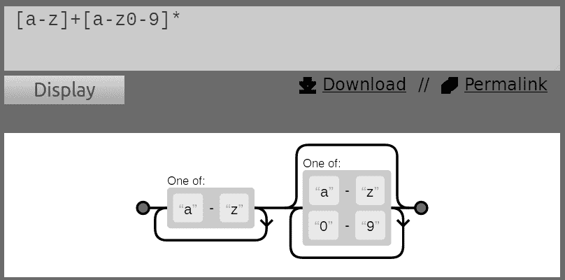

# 第四章：开车与发短信

本章将介绍以下几种解决方案：

+   使用正则表达式

+   使用`grep`在文件中搜索和挖掘文本

+   使用`cut`按列切割文件

+   使用`sed`执行文本替换

+   使用`awk`进行高级文本处理

+   查找文件中单词的使用频率

+   压缩或解压 JavaScript

+   将多个文件合并为列

+   打印文件或行中的第 n^(th)个单词或列

+   打印行号或模式之间的文本

+   按反向顺序打印行

+   从文本中解析电子邮件地址和 URL

+   删除包含某个单词的文件中的一句话

+   在目录中的所有文件中用文本替换模式

+   文本切片和参数操作

# 介绍

Shell 脚本包括许多问题解决工具。它提供了丰富的文本处理工具集。这些工具包括`sed`、`awk`、`grep`和`cut`等实用程序，它们可以组合起来执行文本处理任务。

这些工具通过字符、行、单词、列或行来处理文件，能够以多种方式处理文本文件。

正则表达式是一种基本的模式匹配技术。大多数文本处理工具都支持正则表达式。通过正则表达式字符串，我们可以在文本文件中进行过滤、去除、替换和搜索。

本章包括一系列解决方案，帮助你了解如何处理各种文本处理问题。

# 使用正则表达式

正则表达式是基于模式的文本处理的核心。为了有效使用正则表达式，我们需要理解它们。

每个使用`ls`的人都熟悉 glob 样式的模式。glob 规则在很多情况下都很有用，但对于文本处理来说，它们的功能太有限了。正则表达式允许你比 glob 规则更详细地描述模式。

一个典型的正则表达式来匹配电子邮件地址可能是这样的：

```
[a-z0-9_]+@[a-z0-9]+\.[a-z]+. 

```

如果这看起来有些奇怪，别担心；一旦你通过本教程理解了这些概念，实际上它非常简单。

# 如何操作...

**正则表达式**由文本片段和具有特殊含义的符号组成。利用这些，我们可以构建一个正则表达式来匹配任何文本。正则表达式是许多工具的基础。本节介绍了正则表达式，但没有介绍使用它们的 Linux/Unix 工具。稍后的教程将介绍这些工具。

正则表达式由一个或多个元素组成，这些元素结合成一个字符串。一个元素可以是位置标记、标识符或计数修饰符。位置标记将正则表达式固定到目标字符串的开头或结尾。标识符定义一个或多个字符。计数修饰符定义标识符出现的次数。

在我们查看一些示例正则表达式之前，先来看一下规则。

# 位置标记

位置标记将正则表达式固定到字符串中的某个位置。默认情况下，任何与正则表达式匹配的字符集都可以使用，而不论它们在字符串中的位置。

| **正则表达式** | **描述** | **示例** |
| --- | --- | --- |
| `^` | 这指定正则表达式匹配的文本必须从字符串的开头开始 | `^tux` 匹配以 `tux` 开头的行 |
| `$` | 这指定正则表达式匹配的文本必须以目标字符串的最后一个字符结尾 | `tux$` 匹配以 `tux` 结尾的行 |

# 标识符

标识符是正则表达式的基础。这些定义了必须存在（或不存在）的字符，以匹配正则表达式。

| **正则表达式** | **描述** | **示例** |
| --- | --- | --- |
| `A` 字符 | 正则表达式必须匹配此字母 | `A` 将匹配字母 A |
| `.` | 这匹配任意一个字符 | `"Hack."` 匹配 `Hack1`、`Hacki`，但不匹配 `Hack12` 或 `Hackil`；仅匹配一个额外字符 |
| `[]` | 这匹配方括号内的任意一个字符。方括号内的字符可以是一个集合或范围 | `coo[kl]` 匹配 `cook` 或 `cool`；`[0-9]` 匹配任意一个数字 |
| `[^]` | 这匹配除了方括号内的字符之外的任意一个字符。方括号内的字符可以是一个集合或范围。 | `9[⁰¹]` 匹配 `92` 和 `93`，但不匹配 `91` 和 `90`；`A[⁰-9]` 匹配字母 `A` 后跟除数字外的任意字符 |

# 计数修饰符

一个标识符可以出现一次、永不出现或多次。计数修饰符定义了一个模式可以出现多少次。

| **正则表达式** | **描述** | **示例** |
| --- | --- | --- |
| `?` | 这意味着前面的项必须匹配一次或零次 | `colou?r` 匹配 `color` 或 `colour`，但不匹配 `colouur` |
| `+` | 这意味着前面的项必须匹配一次或多次 | `Rollno-9+` 匹配 `Rollno-99` 和 `Rollno-9`，但不匹配 `Rollno-` |
| `*` | 这意味着前面的项必须匹配零次或多次 | `co*l` 匹配 `cl`、`col` 和 `coool` |
| `{n}` | 这意味着前面的项必须匹配 n 次 | `[0-9]{3}` 匹配任意三位数；`[0-9]{3}` 可以扩展为 `[0-9][0-9][0-9]` |
| `{n,}` | 这指定了前面的项必须至少匹配 n 次 | `[0-9]{2,}` 匹配任意一个两位数或更长的数字 |
| `{n, m}` | 这指定了前面的项应至少匹配 n 次，最多匹配 m 次 | `[0-9]{2,5}` 匹配任何一个两位数到五位数的数字 |

# 其他

下面是一些其他字符，用来微调正则表达式的解析方式。

| `()` | 这将括号内的内容视为一个整体 | `ma(tri)?x` 匹配 `max` 或 `matrix` |
| --- | --- | --- |
| `&#124;` | 这指定了交替；`&#124;` 两边的任意一项应匹配 | `Oct (1st &#124; 2nd)` 匹配 `Oct 1st` 或 `Oct 2nd` |
| `\` | 这是转义字符，用于转义前面提到的任何特殊字符 | `a\.b` 匹配 `a.b`，但不匹配 `ajb`；它忽略了 `.` 的特殊含义，因为有了 `\` |

关于可用的正则表达式组件的更多细节，你可以参考[`www.linuxforu.com/2011/04/sed-explained-part-1/`](http://www.linuxforu.com/2011/04/sed-explained-part-1/)。

# 还有更多...

让我们看一些正则表达式的例子：

这个正则表达式会匹配任何单个单词：

```
( +[a-zA-Z]+ +) 

```

最初的`+`字符表示我们需要一个或多个空格。

`[a-zA-Z]`集合是所有大写和小写字母。后面的加号表示我们需要至少一个字母，并且可以有更多字母。

最后的`+`字符表示我们需要以一个或多个空格终止单词。

这将不会匹配句子中的最后一个单词。为了匹配句子中的最后一个单词或逗号前的单词，我们可以这样写表达式：

```
( +[a-zA-Z]+[?,\.]? +) 

```

`[?,\.]?`短语表示我们可能有一个问号、逗号或句点，但最多只有一个。句点被反斜杠转义，因为裸句点是一个通配符，能够匹配任何字符。

匹配 IP 地址更容易了。我们知道我们会有四个三位数的数字，且这些数字由句点分隔。

`[0-9]`短语定义了一个数字。`{1,3}`短语定义了计数为至少一个数字，最多三个数字：

```
[0-9]{1,3}\.[0-9]{1,3}\.[0-9]{1,3}\.[0-9]{1,3} 

```

我们还可以使用`[[:digit:]]`构造来定义一个数字，从而定义 IP 地址：

```
[[:digit:]]{1,3}\.[[:digit:]]{1,3}\.[[:digit:]]{1,3}\.[[:digit:]]{1,3} 

```

我们知道，IP 地址由四个整数（每个整数从 0 到 255）组成，且由点分隔（例如，`192.168.0.2`）。

这个正则表达式将匹配正在处理文本中的 IP 地址。然而，它并没有检查地址的有效性。例如，形式为`123.300.1.1`的 IP 地址虽然无效，但也会被这个正则表达式匹配。

# 它是如何工作的...

正则表达式是通过一个复杂的状态机解析的，状态机会尝试找到一个正则表达式与目标文本字符串的最佳匹配。这个文本可以是管道的输出、一个文件，甚至是你在命令行上输入的字符串。如果有多种方式可以满足正则表达式，引擎通常会选择匹配字符最多的一组。

例如，给定字符串`this is a test`和正则表达式`s.*s`，匹配结果将是`s is a tes`，而不是`s is`。

关于可用的正则表达式组件的更多细节，你可以参考[`www.linuxforu.com/2011/04/sed-explained-part-1/`](http://www.linuxforu.com/2011/04/sed-explained-part-1/)。

# 还有更多...

前面的表格描述了正则表达式中使用字符的特殊含义。

# 特殊字符的处理

正则表达式使用一些字符，如`$`、`^`、`.`、`*`、`+`、`{`和`}`，作为特殊字符。但是，如果我们想将这些字符作为普通文本字符使用呢？我们来看一个正则表达式的例子，`a.txt`。

这将匹配字符`a`，后面跟着任何字符（因为`.`字符），然后是`txt`字符串。然而，我们希望`.`匹配字面上的`.`而不是任意字符。为了实现这一点，我们在字符前加上反斜杠`\`（这种做法称为转义字符）。这表示正则表达式要匹配字面字符，而不是它的特殊含义。因此，最终的正则表达式变为`a\.txt`。

# 正则表达式的可视化

正则表达式可能难以理解。幸运的是，有一些工具可以帮助可视化正则表达式。页面[`www.regexper.com`](http://www.regexper.com)允许你输入正则表达式，并创建一个图形来帮助你理解它。以下是描述一个简单正则表达式的截图：



# 使用`grep`在文件中搜索和挖掘文本

如果你忘记了把钥匙放在哪里，你只需搜索它们。如果你忘记了哪个文件包含某些信息，`grep`命令会为你找到它。本篇将教你如何定位包含模式的文件。

# 如何操作...

`grep`命令是一个强大的 Unix 工具，用于搜索文本。它接受正则表达式并可以以各种格式生成报告。

1.  在`stdin`中搜索与模式匹配的行：

```
        $ echo -e "this is a word\nnext line" | grep word 
 this is a word

```

1.  在单个文件中搜索包含给定模式的行：

```
        $ grep pattern filename
 this is the line containing pattern

```

或者，这也会执行相同的搜索：

```
        $ grep "pattern" filename
 this is the line containing pattern

```

1.  在多个文件中搜索与模式匹配的行：

```
        $ grep "match_text" file1 file2 file3 ... 

```

1.  要突出显示匹配的模式，可以使用`-color`选项。虽然选项的位置无关紧要，但约定是将选项放在前面。

```
        $ grep -color=auto word filename
 this is the line containing word

```

1.  `grep`命令默认使用基本正则表达式。这些是前面描述的规则的子集。`-E`选项将使`grep`使用**扩展正则表达式**语法。`egrep`命令是`grep`的变体，默认使用扩展正则表达式：

```
        $ grep -E "[a-z]+" filename

```

或者：

```
        $ egrep "[a-z]+" filename

```

1.  `-o`选项将仅报告匹配的字符，而不是整个行：

```
        $ echo this is a line. | egrep -o "[a-z]+\."
 line

```

1.  `-v`选项将打印所有行，除了包含`match_pattern`的行：

```
        $ grep -v match_pattern file

```

添加`-v`选项到`grep`将反转匹配结果。

1.  `-c`选项将统计模式出现的行数：

```
        $ grep -c "text" filename
 10

```

应该注意的是，`-c`统计的是匹配行的数量，而不是匹配的次数。请看这个例子：

```
        $ echo -e "1 2 3 4\nhello\n5 6" | egrep  -c "[0-9]"
 2

```

即使有六个匹配项，`grep`只报告`2`，因为只有两行匹配。单行中的多个匹配项只计算一次。

1.  要计算文件中匹配项的数量，请使用这个技巧：

```
        $ echo -e "1 2 3 4\nhello\n5 6" | egrep -o "[0-9]" | wc -l
 6

```

1.  `-n`选项将打印匹配字符串的行号：

```
        $ cat sample1.txt
 gnu is not unix
 linux is fun
 bash is art
 $ cat sample2.txt
 planetlinux
 $ grep linux -n sample1.txt
 2:linux is fun

```

或者

```
        $ cat sample1.txt | grep linux -n

```

如果使用多个文件，`-c`选项将打印带有结果的文件名：

```
        $ grep linux -n sample1.txt sample2.txt
 sample1.txt:2:linux is fun
 sample2.txt:2:planetlinux

```

1.  `-b`选项将打印匹配发生的行的偏移量。添加`-o`选项将打印模式匹配的精确字符或字节偏移量：

```
        $ echo gnu is not unix | grep -b -o "not"
 7:not

```

字符位置从`0`开始编号，而不是从`1`开始。

1.  `-l`选项列出哪些文件包含模式：

```
        $ grep -l linux sample1.txt sample2.txt
 sample1.txt
 sample2.txt

```

`-l`参数的反向参数是`-L`。`-L`参数返回不匹配的文件列表。

# 还有更多...

`grep`命令是最通用的 Linux/Unix 命令之一。它还包括选项来搜索文件夹、选择要搜索的文件以及更多用于识别模式的选项。

# 递归搜索多个文件

要递归地搜索文件层级结构中的文件中的文本，请使用以下命令：

```
    $ grep "text" . -R -n

```

在这个命令中，`.`指定当前目录。

当与`grep`一起使用时，`-R`和`-r`选项的含义相同。

考虑以下示例：

```
    $ cd src_dir
 $ grep "test_function()" . -R -n
 ./miscutils/test.c:16:test_function();

```

`test_function()`位于`miscutils/test.c`的第 16 行。`-R`选项在搜索网站或源代码树中的短语时特别有用。它等同于以下命令：

```
    $ find . -type f | xargs grep "test_function()"

```

# 忽略模式中的大小写

`-i`参数在匹配模式时不考虑大小写：

```
    $ echo hello world | grep -i "HELLO"
 hello

```

# 使用多个模式进行`grep`匹配

`-e`参数指定多个用于匹配的模式：

```
    $ grep -e "pattern1" -e "pattern2"

```

这将打印包含任意模式的行，并为每个匹配输出一行。考虑以下示例：

```
    $ echo this is a line of text | grep -o -e "this" -e "line"
 this
 line

```

可以在一个文件中定义多个模式。`-f`选项将读取文件并使用按行分隔的模式：

```
    $ grep -f pattern_filesource_filename

```

考虑以下示例：

```
    $ cat pat_file
 hello
 cool

 $ echo hello this is cool | grep -f pat_file
 hello this is cool

```

# 在`grep`搜索中包括和排除文件

`grep`可以通过通配符模式包含或排除文件进行搜索。

要仅递归搜索`.c`和`.cpp`文件，请使用`-include`选项：

```
    $ grep "main()" . -r  --include *.{c,cpp}

```

请注意，`some{string1,string2,string3}`扩展为`somestring1 somestring2 somestring3`。

使用`-exclude`标志排除所有`README`文件的搜索：

```
    $ grep "main()" . -r --exclude "README" 

```

`--exclude-dir`选项将排除指定目录的搜索：

```
    $ grep main . -r -exclude-dir CVS

```

要从文件中读取排除文件的列表，使用`--exclude-from FILE`。

# 使用带有零字节后缀的`xargs`与`grep`

`xargs`命令将一系列命令行参数提供给另一个命令。当文件名作为命令行参数使用时，请使用零字节终止符代替默认的空格终止符。文件名可以包含空格字符，这将被误解释为名称分隔符，导致文件名被拆分成两个文件名（例如，`New file.txt`可能会被解释为两个文件名`New`和`file.txt`）。使用零字节后缀选项可以解决此问题。我们使用`xargs`从诸如`grep`和`find`等命令接收`stdin`文本。这些命令可以生成带有零字节后缀的输出。当使用`-0`标志时，`xargs`命令会期望使用零字节终止符。

创建一些测试文件：

```
    $ echo "test" > file1
 $ echo "cool" > file2
 $ echo "test" > file3

```

`-l`选项告诉`grep`仅输出匹配发生的文件名。`-Z`选项使`grep`为这些文件使用零字节终止符（`\0`）。这两个选项通常一起使用。`xargs`的`-0`参数使其读取输入并以零字节终止符分隔文件名：

```
    $ grep "test" file* -lZ | xargs -0 rm

```

# `grep`的静默输出

有时，我们并不关心匹配的字符串，而只关心是否有匹配。安静选项（`-q`）使 `grep` 静默运行，并且不会生成任何输出。相反，它运行命令并返回基于成功或失败的退出状态。返回状态为 `0` 表示成功，非零表示失败。

`grep` 命令可以在安静模式下使用，用于测试匹配文本是否出现在文件中：

```
#!/bin/bash  
#Filename: silent_grep.sh 
#Desc: Testing whether a file contain a text or not  

if [ $# -ne 2 ]; then 
  echo "Usage: $0 match_text filename" 
  exit 1 
fi 

match_text=$1  
filename=$2 
grep -q "$match_text" $filename 

if [ $? -eq 0 ]; then 
  echo "The text exists in the file" 
else 
  echo "Text does not exist in the file" 
fi 

```

`silent_grep.sh` 脚本接受两个命令行参数，一个是匹配词（`Student`），另一个是文件名（`student_data.txt`）：

```
    $ ./silent_grep.sh Student student_data.txt 
 The text exists in the file 

```

# 打印匹配文本前后行

基于上下文的打印是 `grep` 的一个优点。当 `grep` 找到与模式匹配的行时，它只会打印匹配的行。我们可能需要查看匹配行之前或之后的 *n* 行。`-B` 和 `-A` 选项分别显示匹配前后的行。

`-A` 选项打印匹配后的行：

```
    $ seq 10 | grep 5 -A 3
 5
 6
 7
 8

```

`-B` 选项打印匹配前的行：

```
    $ seq 10 | grep 5 -B 3
 2
 3
 4
 5

```

`-A` 和 `-B` 选项可以一起使用，或者使用 `-C` 选项打印匹配前后相同数量的行：

```
    $ seq 10 | grep 5 -C 3
 2
 3
 4
 5
 6
 7
 8

```

如果有多个匹配项，则每个部分由 `--` 行分隔：

```
    $ echo -e "a\nb\nc\na\nb\nc" | grep a -A 1
 a
 b
 --
 a
 b

```

# 使用 `cut` 按列切割文件

`cut` 命令按列拆分文件，而不是按行拆分。这对于处理具有固定宽度字段的文件、**逗号分隔值**（**CSV** 文件）或像标准日志文件这样的空格分隔文件非常有用。

# 如何做到...

`cut` 命令提取字符位置或列之间的数据。你可以指定分隔符来分隔每一列。在 `cut` 的术语中，每一列被称为 **字段**。

1.  `-f` 选项定义要提取的字段：

```
        cut -f FIELD_LIST filename

```

`FIELD_LIST` 是一个要显示的列的列表。该列表由用逗号分隔的列号组成。参考以下示例：

```
        $ cut -f 2,3 filename

```

在这里，显示了第二列和第三列。

1.  `cut` 命令也可以从 `stdin` 读取输入。

*Tab* 是字段的默认分隔符。没有分隔符的行将被打印。`-s` 选项将禁用打印没有分隔符字符的行。以下命令演示了如何从制表符分隔的文件中提取列：

```
        $ cat student_data.txt 
 No  Name  Mark  Percent
 1  Sarath  45  90
 2  Alex  49  98
 3  Anu  45  90

 $ cut -f1 student_data.txt
 No 
 1 
 2 
 3 

```

1.  要提取多个字段，请提供多个由逗号分隔的字段编号，使用以下选项：

```
        $ cut -f2,4 student_data.txt
 Name     Percent
 Sarath   90
 Alex     98
 Anu      90

```

1.  `--complement` 选项将显示除了 `-f` 定义的字段之外的所有字段。此命令显示除了 `3` 之外的所有字段：

```
        $ cut -f3 --complement student_data.txt
 No  Name    Percent 
 1   Sarath  90
 2   Alex    98
 3   Anu     90

```

1.  `-d` 选项将设置分隔符。以下命令展示了如何使用 `cut` 处理冒号分隔的列表：

```
        $ cat delimited_data.txt
 No;Name;Mark;Percent
 1;Sarath;45;90
 2;Alex;49;98
 3;Anu;45;90

 $ cut -f2 -d";" delimited_data.txt
 Name
 Sarath
 Alex
 Anu

```

# 还有更多内容

`cut` 命令有更多选项来定义显示的列。

# 将字符或字节的范围指定为字段

固定宽度列的报告将在列之间有不同数量的空格。你不能根据字段位置提取值，但可以根据字符位置提取。`cut` 命令可以基于字节或字符以及字段进行选择。

逐个字符位置提取是不合理的，因此`cut`命令接受这些符号以及逗号分隔的列表：

| `N-` | 从*第 N 次*字节、字符或字段到行的末尾 |
| --- | --- |
| `N-M` | 从*第 N 次*到*第 M 次*（包括）字节、字符或字段 |
| `-M` | 从第一个到*第 M 次*（包括）字节、字符或字段 |

我们使用前面的符号来指定字节、字符或字段的范围，使用以下选项：

+   `-b`表示字节

+   `-c`表示字符

+   `-f`用于定义字段

考虑这个示例：

```
    $ cat range_fields.txt
 abcdefghijklmnopqrstuvwxyz
 abcdefghijklmnopqrstuvwxyz
 abcdefghijklmnopqrstuvwxyz
 abcdefghijklmnopqrstuvwxy

```

显示第二到第五个字符：

```
    $ cut -c2-5 range_fields.txt
 bcde
 bcde
 bcde
 bcde

```

显示前两个字符：

```
    $ cut -c -2  range_fields.txt
 ab
 ab
 ab
 ab

```

用`-b`替换`-c`以按字节计数。

`-output-delimiter`选项指定输出分隔符。这在显示多个数据集时特别有用：

```
    $ cut range_fields.txt -c1-3,6-9 --output-delimiter ","
 abc,fghi
 abc,fghi
 abc,fghi
 abc,fghi

```

# 使用`sed`执行文本替换

`sed`代表**流编辑器**。它最常用于文本替换。本教程涵盖了许多常见的`sed`技巧。

# 如何实现...

`sed`命令可以将模式的出现替换为另一字符串。该模式可以是简单的字符串或正则表达式：

```
 $ sed 's/pattern/replace_string/' file 

```

或者，`sed`可以从`stdin`读取：

```
 $ cat file | sed 's/pattern/replace_string/'

```

如果你使用`vi`编辑器，你会注意到，替换文本的命令与此处讨论的非常相似。默认情况下，`sed`仅打印替换后的文本，可以在管道中使用它。

```
 $ cat /etc/passwd | cut -d : -f1,3 | sed 's/:/ - UID: /'
 root - UID: 0
 bin - UID: 1
 ...

```

1.  `-I`选项将使`sed`用修改后的数据替换原始文件：

```
        $ sed -i 's/text/replace/' file

```

1.  上一个示例替换了每行中模式的第一次出现。`-g`参数将使`sed`替换每次出现：

```
        $ sed 's/pattern/replace_string/g' file

```

`/#g`选项将从*第 N 次*出现位置开始替换：

```
        $ echo thisthisthisthis | sed 's/this/THIS/2g' 
 thisTHISTHISTHIS

 $ echo thisthisthisthis | sed 's/this/THIS/3g' 
 thisthisTHISTHIS

 $ echo thisthisthisthis | sed 's/this/THIS/4g' 
 thisthisthisTHIS

```

`sed`命令将`s`后面的字符视为命令分隔符。这样我们就可以更改包含`/`字符的字符串：

```
        sed 's:text:replace:g'
 sed 's|text|replace|g'

```

当分隔符字符出现在模式内部时，必须使用`\`前缀对其进行转义，如下所示：

```
        sed 's|te\|xt|replace|g'

```

`\|`是出现在模式中的分隔符，被转义替代。

# 还有更多内容…

`sed`命令支持正则表达式作为要替换的模式，并提供更多选项来控制其行为。

# 删除空行

正则表达式支持使得删除空行变得容易。`^$`正则表达式定义了一个从开始到结束之间没有任何内容的行==空行。最后的`/d`命令告诉`sed`删除这些行，而不是进行替换。

```
    $ sed '/^$/d' file

```

# 在文件中直接进行替换

当文件名传递给`sed`时，它通常会打印到`stdout`。`-I`选项将使`sed`直接在文件中修改内容：

```
    $ sed 's/PATTERN/replacement/' -i filename

```

例如，在文件中将所有三位数字替换为另一个指定的数字，如下所示：

```
    $ cat sed_data.txt
 11 abc 111 this 9 file contains 111 11 88 numbers 0000

 $ sed -i 's/\b[0-9]\{3\}\b/NUMBER/g' sed_data.txt
 $ cat sed_data.txt
 11 abc NUMBER this 9 file contains NUMBER 11 88 numbers 0000

```

上述单行命令只替换三位数的数字。`\b[0-9]\{3\}\b`是用来匹配三位数的正则表达式。`[0-9]`是从`0`到`9`的数字范围。`{3}`定义了数字的数量。反斜杠用于赋予`{`和`}`特殊意义，`\b`表示空白字符，表示单词边界。

一个有用的做法是首先尝试没有`-i`的`sed`命令，以确保你的正则表达式是正确的。等你对结果满意后，再加上`-i`选项以修改文件。或者，你也可以使用以下形式的`sed`：

```
    sed -i .bak 's/abc/def/' file

```

在这种情况下，`sed`会在文件上执行替换，并且还会创建一个名为`file.bak`的文件，包含原始内容。

# 匹配字符串标记()

`&`符号是匹配到的字符串。这个值可以在替换字符串中使用：

```
    $ echo this is an example | sed 's/\w\+/[&]/g'
 [this] [is] [an] [example]

```

这里，`\w\+`正则表达式匹配每个单词。然后，我们用`[&]`替换它，`&`对应于匹配的单词。

# 子字符串匹配标记（\1）

`&`对应给定模式的匹配字符串。正则表达式中的括号部分可以用`\#`来匹配：

```
    $ echo this is digit 7 in a number | sed 's/digit \([0-9]\)/\1/'
 this is 7 in a number

```

上述命令将`digit 7`替换为`7`。匹配到的子字符串是`7`。`\ (pattern\)`匹配该子字符串。模式被包含在`()`中，并使用反斜杠进行转义。对于第一个子字符串匹配，相应的标记是`\1`，对于第二个是`\2`，以此类推。

```
    $ echo seven EIGHT | sed 's/\([a-z]\+\) \([A-Z]\+\)/\2 \1/'
 EIGHT seven

```

`([a-z]\+\)`匹配第一个单词，`\([A-Z]\+\)`匹配第二个单词；`\1`和`\2`用来引用它们。这种引用方式叫做**反向引用**。在替换部分，它们的顺序被更改为`\2 \1`，因此出现的是反向顺序。

# 组合多个表达式

多个`sed`命令可以通过管道符连接，模式由分号分隔，或者使用`-e PATTERN`选项：

```
    sed 'expression' | sed 'expression'

```

上述命令等同于以下命令：

```
    $ sed 'expression; expression'

```

或者：

```
    $ sed -e 'expression' -e expression'

```

看这些例子：

```
    $ echo abc | sed 's/a/A/' | sed 's/c/C/'
 AbC
 $ echo abc | sed 's/a/A/;s/c/C/'
 AbC
 $ echo abc | sed -e 's/a/A/' -e 's/c/C/'
 AbC

```

# 引号

`sed`表达式通常用单引号引起来。也可以使用双引号，shell 会在调用 sed 之前展开双引号。使用双引号在我们想在`sed`表达式中使用变量字符串时非常有用。

看这个例子：

```
 $ text=hello
 $ echo hello world | sed "s/$text/HELLO/" 
 HELLO world 

```

`$text`被评估为`hello`。

# 使用 awk 进行高级文本处理

`awk`命令处理数据流。它支持关联数组、递归函数、条件语句等。

# 准备工作

一个`awk`脚本的结构是：

```
awk ' BEGIN{ print "start" } pattern { commands } END{ print "end"}' file

```

`awk`命令也可以从`stdin`读取数据。

一个`awk`脚本包含最多三部分：`BEGIN`，`END`，以及带有模式匹配选项的常规语句块。这些部分是可选的，脚本中可以没有任何一部分。

`awk` 会逐行处理文件。在 `<code>awk</code>` 开始处理文件之前，`BEGIN` 后的命令会被先行评估。`awk` 会处理与 PATTERN 匹配的每一行，并执行紧随其后的命令。最后，在处理完所有文件内容后，`<CODE>awk</CODE>` 会执行 `END` 后的命令。

# 如何做...

让我们写一个简单的 `awk` 脚本，用单引号或双引号括起来：

```
    awk 'BEGIN { statements } { statements } END { end statements }'

```

或者：

```
    awk "BEGIN { statements } { statements } END { end statements }"

```

该命令将报告文件中的行数：

```
    $ awk 'BEGIN { i=0 } { i++ } END{ print i}' filename

```

或者：

```
    $ awk "BEGIN { i=0 } { i++ } END{ print i }" filename

```

# 它是如何工作的...

`awk` 命令按以下顺序处理参数：

1.  首先，它执行 `BEGIN { commands }` 代码块中的命令。

1.  接下来，`awk` 会从文件或 `stdin` 中读取一行，并在可选模式匹配时执行 `commands` 代码块。它会重复这个过程直到文件末尾。

1.  当输入流结束时，它会执行 `END { commands }` 代码块。

`BEGIN` 代码块在 `awk` 开始读取输入流中的行之前执行。它是一个可选的代码块。诸如变量初始化和为输出表格打印标题等命令，通常出现在 `BEGIN` 代码块中。

`END` 代码块类似于 `BEGIN` 代码块。它会在 `awk` 完成读取输入流中的所有行后执行。通常在分析完所有行后，使用该代码块打印结果。

最重要的代码块包含常见命令和模式代码块。这个代码块也是可选的。如果未提供该代码块，`{ print }` 会被执行来打印每一行。这个代码块会在 `awk` 读取的每一行上执行。它类似于一个 `while` 循环，循环体内会执行语句。

当一行被读取时，`awk` 会检查该行是否与模式匹配。模式可以是正则表达式匹配、条件、行范围等。如果当前行与模式匹配，`awk` 会执行 `{ }` 中的命令。

模式是可选的。如果不使用模式，则匹配所有行：

```
    $ echo -e "line1\nline2" | awk 'BEGIN{ print "Start" } { print } \   
        END{ print "End" } '
 Start
 line1
 line2
 End

```

当 `print` 未带任何参数时，`awk` 会打印当前行。

`print` 命令可以接受多个参数。这些参数用逗号分隔，并会以空格为分隔符打印。双引号用于字符串连接操作。

看这个例子：

```
    $ echo | awk '{ var1="v1"; var2="v2"; var3="v3"; \
 print var1,var2,var3 ; }'

```

上述命令将显示如下内容：

```
    v1 v2 v3

```

`echo` 命令将一行内容写入标准输出。因此，`awk` 中 `{ }` 代码块的语句只会执行一次。如果 `awk` 的输入包含多行，`awk` 中的命令将会执行多次。

字符串连接通过引用的字符串来完成：

```
    $ echo | awk '{ var1="v1"; var2="v2"; var3="v3"; \
 print var1 "-" var2 "-" var3 ; }'
 v1-v2-v3

```

`{ }` 就像是一个循环中的代码块，用来逐行遍历文件。

在 `BEGIN` 代码块中，通常会放置初始变量赋值语句，如 `var=0;`。`END{}` 代码块包含打印结果的命令。

# 还有更多内容...

`awk` 命令与诸如 `grep`、`find` 和 `tr` 等命令不同，因为它具有更多的单一功能选项来更改行为。`awk` 命令是一个解释和执行程序的程序，包括像 shell 一样的特殊变量。

# 特殊变量

一些可以与 `awk` 一起使用的特殊变量如下：

+   `NR`：这代表当前记录号，当 `awk` 使用行作为记录时，它对应于当前行号。

+   `NF`：这代表字段的数量，对应于正在处理的当前记录中的字段数量。默认字段分隔符是空格。

+   `$0`：这是一个变量，包含当前记录的文本。

+   `$1`：这是一个变量，保存第一个字段的文本。

+   `$2`：这是一个变量，保存第二个字段的文本。

考虑这个例子：

```
    $ echo -e "line1 f2 f3\nline2 f4 f5\nline3 f6 f7" | \

 awk '{
 print "Line no:"NR",No of fields:"NF, "$0="$0,   
        "$1="$1,"$2="$2,"$3="$3 
 }' 
 Line no:1,No of fields:3 $0=line1 f2 f3 $1=line1 $2=f2 $3=f3 
 Line no:2,No of fields:3 $0=line2 f4 f5 $1=line2 $2=f4 $3=f5 
 Line no:3,No of fields:3 $0=line3 f6 f7 $1=line3 $2=f6 $3=f7

```

我们可以打印一行的最后一个字段为 `print $NF`，倒数第二个为 `$(NF-1)`，依此类推。

`awk` 还支持与 C 中相同语法的 `printf()` 函数。

以下命令打印每行的第二个和第三个字段：

```
    $awk '{ print $3,$2 }'  file

```

我们可以使用 `NR` 计算文件中的行数：

```
    $ awk 'END{ print NR }' file

```

在这里，我们只使用 `END` 块。当 `awk` 到达文件末尾时，`NR` 会包含最后一行的行号。可以按如下方式汇总每行的 `field 1` 中的所有数字：

```
    $ seq 5 | awk 'BEGIN{ sum=0; print "Summation:" } 
 { print $1"+"; sum+=$1 } END { print "=="; print sum }' 
 Summation: 
 1+ 
 2+ 
 3+ 
 4+ 
 5+ 
 ==
 15

```

# 将外部变量传递给 `awk`

使用 `-v` 参数，我们可以传递除 `stdin` 以外的外部值给 `awk`，如下所示：

```
    $ VAR=10000
 $ echo | awk -v VARIABLE=$VAR '{ print VARIABLE }'
 10000

```

有一种灵活的替代方法可以从外部传递许多变量值到 `awk`。考虑以下示例：

```
    $ var1="Variable1" ; var2="Variable2"
 $ echo | awk '{ print v1,v2 }' v1=$var1 v2=$var2
 Variable1 Variable2

```

当通过文件而非标准输入给出输入时，请使用以下命令：

```
    $ awk '{ print v1,v2 }' v1=$var1 v2=$var2 filename

```

在前面的方法中，变量被指定为键值对，用空格分隔，`(v1=$var1 v2=$var2 )` 作为 `awk` 命令的参数，紧跟在 `BEGIN`、`{ }` 和 `END` 块之后。

# 明确使用 `getline` 读取一行

`awk` 程序默认读取整个文件。`getline` 函数将读取一行。这可用于在 `BEGIN` 块中从文件中读取标题信息，然后在主块中处理实际数据。

语法是 `getline var`。`var` 变量将包含该行的内容。如果调用 `getline` 时没有参数，我们可以使用 `$0`、`$1` 和 `$2` 访问行的内容。

考虑这个例子：

```
    $ seq 5 | awk 'BEGIN { getline; print "Read ahead first line", $0 }     
    { print $0 }'
 Read ahead first line 1 
 2
 3
 4
 5

```

# 用过滤模式过滤 `awk` 处理的行

我们可以指定处理行的条件：

```
 $ awk 'NR < 5' # first four lines
    $ awk 'NR==1,NR==4' #First four lines
    $ # Lines containing the pattern linux (we can specify regex)
    $ awk '/linux/' 
    $ # Lines not containing the pattern linux
    $ awk '!/linux/' 

```

# 设置字段的分隔符

默认情况下，字段的分隔符是空格。`-F` 选项定义了一个不同的字段分隔符。

```
    $ awk -F: '{ print $NF }' /etc/passwd

```

或：

```
    awk 'BEGIN { FS=":" } { print $NF }' /etc/passwd

```

我们可以通过在 `BEGIN` 块中设置 `OFS="delimiter"` 来设置输出字段分隔符。

# 从 `awk` 读取命令输出

`awk` 可以调用命令并读取输出。将命令字符串放在引号内，并使用竖线将输出传输给 `getline`：

```
    "command" | getline output ;

```

以下代码从`/etc/passwd`中读取一行，并显示登录名和主目录。它在`BEGIN`块中重置字段分隔符为`:`，并在主块中调用`grep`。

```
    $ awk 'BEGIN {FS=":"} { "grep root /etc/passwd" | getline; \
        print $1,$6 }'
 root /root

```

# Awk 中的关联数组

Awk 支持包含数字或字符串的变量，还支持关联数组。关联数组是一种由字符串而非数字作为索引的数组。你可以通过方括号中的索引识别出关联数组：

```
    arrayName[index]

```

数组可以通过等号进行赋值，就像简单的用户定义变量一样：

```
    myarray[index]=value

```

# 在 Awk 中使用循环

Awk 支持一个类似于`C`语言的数值`for`循环语法：

```
    for(i=0;i<10;i++) { print $i ; } 

```

Awk 还支持一种列表风格的循环，它将显示数组的内容：

```
    for(i in array) { print array[i]; } 

```

以下示例展示了如何将数据收集到一个数组中并显示它。此脚本从`/etc/password`读取行，将其按`:`符号分割成字段，并创建一个名字数组，其中索引是登录 ID，值是用户的名字：

```
    $ awk 'BEGIN {FS=":"} {nam[$1]=$5} END {for {i in nam} \
        {print i,nam[i]}}' /etc/passwd
 root root
 ftp FTP User
 userj Joe User

```

# Awk 中的字符串处理函数

`awk`语言包含了许多内置的字符串处理函数：

+   `length(string)`：此函数返回字符串的长度。

+   `index(string, search_string)`：此函数返回在字符串中找到`search_string`的位置。

+   `split(string, array, delimiter)`：此函数将字符串按分隔符字符拆分后，填充到一个数组中。

+   `substr(string, start-position, end-position)`：此函数返回从起始位置到结束位置之间的子字符串。

+   `sub(regex, replacement_str, string)`：此函数将替换字符串中第一次出现的符合正则表达式的匹配项，替换为`replacment_str`。

+   `gsub(regex, replacment_str, string)`：此函数类似于`sub()`，但它会替换每一个符合正则表达式的匹配项。

+   `match(regex, string)`：此函数返回正则表达式（regex）是否在字符串中找到匹配。如果找到了匹配项，则返回非零值，否则返回零。`match()`函数有两个与之关联的特殊变量，分别是`RSTART`和`RLENGTH`。`RSTART`变量包含正则表达式匹配开始的位置，`RLENGTH`变量包含匹配的字符串长度。

# 查找文件中单词的使用频率

计算机擅长计数。我们经常需要计算一些项目，比如发送垃圾邮件的站点数量，不同网页的下载量，或者文本中单词的使用频率。本例展示了如何计算文本中的单词使用情况。这些技术同样适用于日志文件、数据库输出等。

# 准备工作

我们可以使用`awk`的关联数组以不同的方式解决这个问题。**单词**是字母字符，以空格或句号为分隔符。首先，我们需要解析给定文件中的所有单词，然后找出每个单词的出现次数。可以使用正则表达式通过`sed`、`awk`或`grep`等工具解析单词。

# 如何做...

我们刚刚探讨了解决方案的逻辑和思路，现在让我们按照如下方式创建 shell 脚本：

```
#!/bin/bash 
#Name: word_freq.sh 
#Desc: Find out frequency of words in a file 

if [ $# -ne 1 ]; 
then 
  echo "Usage: $0 filename"; 
  exit -1 
fi 

filename=$1 
egrep -o "\b[[:alpha:]]+\b" $filename | \
  awk '{ count[$0]++ }
    END {printf("%-14s%s\n","Word","Count") ;
      for(ind in count)
        { printf("%-14s%d\n",ind,count[ind]); 
        }
      }

```

脚本将生成以下输出：

```
    $ ./word_freq.sh words.txt 
 Word          Count 
 used           1
 this             2 
 counting   1

```

# 它是如何工作的...

`egrep`命令将文本文件转换为单词流，每行一个单词。`\b[[:alpha:]]+\b`模式匹配每个单词，并移除空白字符和标点符号。`-o`选项将匹配的字符序列作为每行的一个单词打印出来。

`awk`命令统计每个单词的出现次数。它会对每一行执行`{ }`块中的语句，因此我们无需为此专门编写循环。计数通过`count[$0]++`命令递增，其中`$0`表示当前行，`count`是一个关联数组。处理完所有行后，`END{}`块将打印出单词及其计数。

本过程的主体可以使用我们之前讨论过的其他工具进行修改。我们可以使用`tr`命令将大写和小写单词合并为一个计数，并使用`sort`命令对输出进行排序，如下所示：

```
egrep -o "\b[[:alpha:]]+\b" $filename | tr [A=Z] [a-z] | \ 
  awk '{ count[$0]++ } 
    END{ printf("%-14s%s\n","Word","Count") ; 
      for(ind in count) 
        {  printf("%-14s%d\n",ind,count[ind]); 
        }
      }' | sort 

```

# 另见

+   本章中的*使用 awk 进行高级文本处理*一节介绍了`awk`命令。

+   本书中第一章的*数组和关联数组*一节，介绍了 Bash 中的数组。

# 压缩或解压 JavaScript

JavaScript 在网站中广泛使用。在开发 JavaScript 代码时，我们使用空白符、注释和制表符来提高代码的可读性和可维护性。这会增加文件大小，从而降低页面加载速度。因此，大多数专业网站使用压缩后的 JavaScript 来加速页面加载。此压缩（也称为**最小化 JS**）通过移除空白字符和换行符来实现。一旦 JavaScript 被压缩，可以通过替换足够的空白字符和换行符将其解压缩，使其可读。这个过程在 shell 中实现类似的功能。

# 准备工作

我们将编写一个 JavaScript 压缩工具以及一个解压缩工具。请考虑以下 JavaScript：

```
    $ cat sample.js
 function sign_out()
 { 

 $("#loading").show(); 
 $.get("log_in",{logout:"True"},

 function(){ 
 window.location="";
 }); 
 }

```

我们的脚本需要执行以下步骤来压缩 JavaScript：

1.  移除换行符和制表符。

1.  移除重复的空格。

1.  替换类似`/* content */`的注释。

要解压缩或使 JavaScript 更具可读性，我们可以执行以下任务：

+   将`;`替换为`;\n`

+   将`{`替换为`{\n`，将`}`替换为`\n}`

# 如何做...

通过这些步骤，我们可以使用以下命令链：

```
    $ cat sample.js |  \
 tr -d '\n\t' |  tr -s ' ' \
 | sed 's:/\*.*\*/::g' \
 | sed 's/ \?\([{}();,:]\) \?/\1/g' 

```

输出如下：

```
    function sign_out(){$("#loading").show();$.get("log_in",  
    {logout:"True"},function(){window.location="";});}

```

以下解压脚本将使混淆的代码变得可读：

```
    $ cat obfuscated.txt | sed 's/;/;\n/g; s/{/{\n\n/g; s/}/\n\n}/g' 

```

或者：

```
    $ cat obfuscated.txt | sed 's/;/;\n/g' | sed 's/{/{\n\n/g' | sed   
    's/}/\n\n}/g'

```

脚本有一个限制：它会去掉本应存在的额外空格。例如，如果你有以下一行： `var a = "hello world"`

这两个空格将被转换为一个空格。你可以使用我们讨论过的模式匹配工具来修复类似的问题。此外，在处理关键的 JavaScript 代码时，建议使用成熟的工具来完成这一操作。

# 它是如何工作的...

压缩命令执行以下任务：

+   移除 `\n` 和 `\t` 字符：

```
 tr -d '\n\t'  

```

+   移除多余的空格：

```
 tr -s ' ' or sed 's/[ ]\+/ /g' 

```

+   移除注释：

```
 sed 's:/\*.*\*/::g' 

```

`:` 被用作 `sed` 的分隔符，避免了转义 `/` 的需要，因为我们需要使用`/*`和`*/`。

在 sed 中，`*` 被转义为 `\*`。

`.*` 匹配`/*`和`*/`之间的所有文本。

+   移除 `{`、`}`、`(`、`)`、`;`、`:` 和 `,` 字符前后所有空格：

```
 sed 's/ \?\([{}();,:]\) \?/\1/g' 

```

上面的 `sed` 语句是这样工作的：

+   `/ \?\([{}();,:]\) \?/` 在 `sed` 代码中是匹配部分，`/\1 /g` 是替换部分。

+   `\([{}();,:]\)` 用于匹配`[ { }( ) ; , : ]`集合中的任何一个字符（为可读性插入空格）。`\(` 和 `\)` 是分组操作符，用于记住匹配并在替换部分进行反向引用。`(` 和 `)` 被转义以赋予它们作为分组操作符的特殊含义。`\?` 前后加在分组操作符旁，用来匹配可能出现在集合中的任意字符前后的空格字符。

+   在替换部分，匹配的字符串（即`:`, 空格（可选），字符集中的字符，以及可选的空格）被替换为匹配的字符。它使用反向引用来引用通过分组操作符 `()` 记住的匹配字符。反向引用的字符通过 `\1` 符号引用分组匹配。

解压命令的工作方式如下：

+   `s/;/;\n/g` 将 `;` 替换为 `;\n`。

+   `s/{/{\n\n/g` 将 `{` 替换为 `{\n\n`。

+   `s/}/\n\n}/g` 将 `}` 替换为 `\n\n}`。

# 另见

+   本章中的*使用 sed 进行文本替换*食谱解释了`sed`命令。

+   第二章中的*使用 tr 进行翻译*食谱解释了`tr`命令。

# 将多个文件合并为列。

`can` 命令可用于按行合并两个文件，一个文件接一个文件。有时我们需要将两个或多个文件并排合并，将文件 1 的行与文件 2 的行连接在一起。

# 如何做...

`paste`命令执行按列拼接：

```
    $ paste file1 file2 file3 ...

```

下面是一个例子：

```
    $ cat file1.txt
 1
 2
 3
 4
 5
 $ cat file2.txt
 slynux
 gnu
 bash
 hack
 $ paste file1.txt file2.txt
 1 slynux
 2 gnu
 3 bash
 4 hack
 5

```

默认的分隔符是制表符。我们可以使用`-d`来指定分隔符：

```
    $ paste file1.txt file2.txt -d ","
 1,slynux
 2,gnu
 3,bash
 4,hack
 5,

```

# 另见

+   本章中的*使用 cut 按列切割文件*食谱解释了如何从文本文件中提取数据。

# 打印文件或行中的第 n 个单词或列。

我们常常需要从文件中提取几列有用的数据。例如，在一个按分数排序的学生列表中，我们想找到第四名得分者。本食谱展示了如何做到这一点。

# 如何做...

`awk`命令通常用于此任务。

1.  要打印第五列，请使用以下命令：

```
        $ awk '{ print $5 }' filename

```

1.  我们可以打印多个列，并在列之间插入自定义字符串。

以下命令将打印当前目录中每个文件的权限和文件名：

```
        $ ls -l | awk '{ print $1 " :  " $8 }'
 -rw-r--r-- :  delimited_data.txt
 -rw-r--r-- :  obfuscated.txt
 -rw-r--r-- :  paste1.txt
 -rw-r--r-- :  paste2.txt

```

# 另请参见

+   本章中的*使用 awk 进行高级文本处理*食谱解释了`awk`命令。

+   本章中的*通过 cut 按列裁剪文件*食谱解释了如何从文本文件中提取数据。

# 打印行号或模式之间的文本

我们可能需要打印文件的选定部分，可能是一个行号范围，或者是由开始和结束模式匹配的范围。

# 准备工作

`Awk`、`grep`或`sed`将根据条件选择要打印的行。使用`grep`打印包含某个模式的行是最简单的。`awk`是功能最强大的工具。

# 如何做到这一点...

要打印行号或模式之间的文本，请按照以下步骤操作：

1.  打印文本的行号范围，`M`到`N`：

```
        $ awk 'NR==M, NR==N' filename

```

`awk`可以从`stdin`读取：

```
        $ cat filename | awk 'NR==M, NR==N'

```

1.  替换`M`和`N`为数字：

```
        $ seq 100 | awk 'NR==4,NR==6' 
 4 
 5 
 6

```

1.  打印`start_pattern`和`end_pattern`之间的文本行：

```
        $ awk '/start_pattern/, /end _pattern/' filename

```

请参考此示例：

```
        $ cat section.txt 
 line with pattern1 
 line with pattern2 
 line with pattern3 
 line end with pattern4 
 line with pattern5 

 $ awk '/pa.*3/, /end/' section.txt 
 line with pattern3 
 line end with pattern4

```

`awk`中使用的模式是正则表达式。

# 另请参见

+   本章中的*使用 awk 进行高级文本处理*食谱解释了`awk`命令。

# 按逆序打印行

这个食谱可能看起来不太有用，但它可以用来模拟 Bash 中的堆栈数据结构。

# 准备工作

实现这一目标最简单的方法是使用`tac`命令（`cat`的反向命令）。此任务也可以通过`awk`来完成。

# 如何做到这一点...

我们首先来看如何使用` tac`做到这一点。

1.  `tac`的语法如下：

```
        tac file1 file2 ...

```

`tac`命令也可以从`stdin`读取：

```
        $ seq 5 | tac
 5 
 4 
 3 
 2 
 1

```

`tac`的默认行分隔符是`\n`。-s 选项将重新定义此分隔符：

```
        $ echo "1,2" | tac -s ,
 2
 1

```

1.  这个`awk`脚本将按逆序打印行：

```
        seq 9 | \
          awk '{ lifo[NR]=$0 } \
            END { for(lno=NR;lno>-1;lno--) { print lifo[lno]; }
                }'

```

在 shell 脚本中，`\`用于将单行命令序列拆分为多行。

# 它是如何工作的...

`awk`脚本将每一行存储到一个关联数组中，使用行号作为索引（`NR`返回行号）。读取完所有行后，`awk`会执行`END`块。`NR`变量由`awk`维护，它保存当前行号。当`awk`开始执行 END 块时，`NR`的值就是行数。通过在`{ }`块中使用`lno=NR`，从最后一行号迭代到`0`，以逆序打印行。

# 从文本中解析电子邮件地址和 URL

解析电子邮件地址和 URL 等元素是常见任务。正则表达式使得查找这些模式变得简单。

# 如何做到这一点...

匹配电子邮件地址的正则表达式模式如下：

```
    [A-Za-z0-9._]+@[A-Za-z0-9.]+\.[a-zA-Z]{2,4} 

```

请参考以下示例：

```
    $ cat url_email.txt 
 this is a line of text contains,<email> #slynux@slynux.com.    
    </email> and email address, blog "http://www.google.com",    
    test@yahoo.com dfdfdfdddfdf;cool.hacks@gmail.com<br />
 <a href="http://code.google.com"><h1>Heading</h1>

```

由于我们使用的是扩展正则表达式（例如`+`），所以我们应使用`egrep`：

```
    $ egrep -o '[A-Za-z0-9._]+@[A-Za-z0-9.]+\.[a-zA-Z]{2,4}'    
    url_email.txt
 slynux@slynux.com 
 test@yahoo.com 
 cool.hacks@gmail.com

```

`egrep`正则表达式模式用于 HTTP URL 如下：

```
    http://[a-zA-Z0-9\-\.]+\.[a-zA-Z]{2,4}

```

请参考此示例：

```
    $ egrep -o "http://[a-zA-Z0-9.]+\.[a-zA-Z]{2,3}" url_email.txt 
 http://www.google.com 
 http://code.google.com

```

# 它是如何工作的...

正则表达式易于逐部分设计。在电子邮件的正则表达式中，我们都知道电子邮件地址的形式是`name@domain.some_2-4_letter_suffix`。在正则表达式语言中编写这个模式应该是这样的：

```
[A-Za-z0-9.]+@[A-Za-z0-9.]+\.[a-zA-Z]{2,4} 

```

`[A-Za-z0-9.]+`表示我们需要一个或多个字符在`[]`块中（`+`表示至少一个，可能更多）。这个字符串后面跟着一个`@`字符。接下来，我们将看到域名，它由字母或数字、一个点和 2-4 个字母组成。`[A-Za-z0-9]+`模式定义了一个字母数字字符串。`\.`模式表示必须出现一个字面上的点。`[a-zA-Z]{2,4}`模式定义了 2、3 或 4 个字母。

HTTP URL 类似于电子邮件，但我们不需要电子邮件正则表达式中的`name@`匹配部分：

```
http://[a-zA-Z0-9.]+\.[a-zA-Z]{2,3} 

```

# 另见

+   本章中的*使用 sed 进行文本替换*章节解释了`sed`命令

+   本章中的*使用正则表达式*章节解释了如何使用正则表达式

# 删除包含特定单词的文件中的一句话

删除包含特定单词的句子是一个简单的任务，可以通过正则表达式实现。本例展示了解决类似问题的技巧。

# 准备工作

`sed`是执行替换操作的最佳工具。本例使用`sed`将匹配的句子替换为空白。

# 如何操作...

让我们创建一个包含一些文本的文件来进行替换。考虑这个例子：

```
    $ cat sentence.txt 
 Linux refers to the family of Unix-like computer operating systems   
    that use the Linux kernel. Linux can be installed on a wide variety   
    of computer hardware, ranging from mobile phones, tablet computers   
    and video game consoles, to mainframes and supercomputers. Linux is 
    predominantly known for its use in servers.

```

要删除包含`mobile phones`的句子，请使用以下`sed`表达式：

```
    $ sed 's/ [^.]*mobile phones[^.]*\.//g' sentence.txt
 Linux refers to the family of Unix-like computer operating systems   
    that use the Linux kernel. Linux is predominantly known for its use   
    in servers.

```

本例假设没有句子跨越多行，例如，一个句子应该始终在文本的同一行开始和结束。

# 它是如何工作的...

`sed`正则表达式`'s/ [^.]*mobile phones[^.]*\.//g'`的格式是`'s/substitution_pattern/replacement_string/g`。它将每个`substitution_pattern`的出现替换为替代字符串。

替换模式是句子的正则表达式。每个句子以空格开始，以`.`结束。正则表达式必须匹配格式为“空格 一些文本 匹配字符串 一些文本 点”的文本。一个句子可以包含除“点”之外的任何字符，“点”是分隔符。`[^.]`模式匹配任何非句点`.`字符。`*`模式定义了任意数量的这些字符。`mobile phones`文本匹配字符串放置在非句点字符的模式之间。每个匹配的句子被`//`（空）替换。

# 另见

+   本章中的*使用 sed 进行文本替换*章节解释了`sed`命令

+   本章中的*使用正则表达式*章节解释了如何使用正则表达式

# 在目录中所有文件中用文本替换模式

我们经常需要在目录中的每个文件中将某些文本替换为新文本。例如，可能需要在网站的源代码目录中更改一个常见的 URI。

# 如何操作...

我们可以使用`find`来定位需要修改文本的文件。我们可以使用`sed`来执行实际的替换操作。

要将所有`.cpp`文件中的`Copyright`文本替换为`Copyleft`，请使用以下命令：

```
 find . -name *.cpp -print0 | \
        xargs -I{} -0 sed -i 's/Copyright/Copyleft/g' {}

```

# 它是如何工作的……

我们在当前目录（` . `）使用`find`查找具有`.cpp`后缀的文件。`find`命令使用`-print0`打印一个以空字符分隔的文件列表（当文件名中有空格时，请使用`-print0`）。我们将该列表通过管道传递给`xargs`，`xargs`将文件名传递给`sed`，以进行修改。

# 还有更多……

如果你还记得，`find`有一个`-exec`选项，可以用于对匹配搜索条件的每个文件运行命令。我们可以使用这个选项来实现相同的效果或将文本替换为新文本：

```
    $ find . -name *.cpp -exec sed -i 's/Copyright/Copyleft/g' \{\} \;

```

或：

```
    $ find . -name *.cpp -exec sed -i 's/Copyright/Copyleft/g' \{\} \+

```

这些命令执行相同的功能，但第一种形式会为每个文件调用一次`sed`，而第二种形式会将多个文件名合并并一起传递给`sed`。

# 文本切片和参数操作

本配方介绍了一些简单的文本替换技巧和在 Bash 中可用的参数扩展快捷方式。几种简单的技巧可以帮助避免编写多行代码。

# 如何做到这一点……

让我们进入任务。

替换变量中的一些文本：

```
    $ var="This is a line of text"
 $ echo ${var/line/REPLACED}
 This is a REPLACED of text"

```

`line`词被替换为`REPLACED`。

我们可以通过指定起始位置和字符串长度来生成一个子字符串，使用以下语法：

```
    ${variable_name:start_position:length}

```

从第五个字符开始打印：

```
    $ string=abcdefghijklmnopqrstuvwxyz
 $ echo ${string:4}
 efghijklmnopqrstuvwxyz

```

从第五个字符开始打印八个字符：

```
    $ echo ${string:4:8}
 efghijkl

```

字符串中的第一个字符位于位置`0`。我们可以从最后一个字母开始计数为`-1`。当`-1`位于括号内时，`(-1)`是最后一个字母的索引：

```
    echo ${string:(-1)}
 z
 $ echo ${string:(-2):2}
 yz

```

# 参见

+   本章中的*使用 sed 进行文本替换*配方解释了其他字符操作技巧
