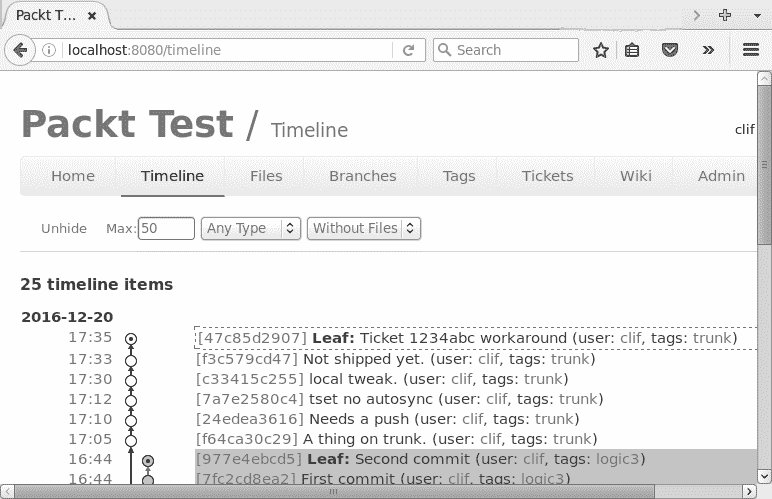

# 第六章：仓库管理

在本章中，我们将介绍以下操作：

+   创建一个新的 git 仓库

+   克隆一个远程 git 仓库

+   使用 git 添加并提交更改

+   使用 git 创建和合并分支

+   分享你的工作

+   将分支推送到服务器

+   获取当前分支的最新源代码

+   检查 git 仓库的状态

+   查看 git 历史

+   查找 bugs

+   提交信息的道德规范

+   使用 fossil

+   创建一个新的 fossil 仓库

+   克隆一个远程 fossil 仓库

+   打开一个 fossil 项目

+   使用 Fossil 添加并提交更改

+   使用 fossil 的分支和分叉

+   使用 fossil 分享你的工作

+   更新本地 fossil 仓库

+   检查 fossil 仓库的状态

+   查看 fossil 历史

# 介绍

你花在开发应用程序上的时间越多，就越能理解那些能够追踪你版本历史的软件。版本控制系统可以让你为新的问题解决方法创建一个沙盒，维护多个发布代码的分支，并在知识产权争议发生时提供开发历史。Linux 和 Unix 支持多种源代码控制系统，从早期的、原始的 SCCS 和 RCS，到并发系统如 **CVS** 和 **SVN**，以及现代的分布式开发系统如 **GIT** 和 **FOSSIL**。

Git 和 Fossil 相对于早期的系统如 CVS 和 SVN 的一个重大优势是，开发者可以在不连接到网络的情况下使用它们。像 CVS 和 RCS 这样的旧系统在你在办公室时工作得很好，但在远程工作时你无法检查新代码或查看旧代码。

Git 和 Fossil 是两种不同的版本控制系统，它们既有相似之处，也有不同之处。两者都支持分布式开发模型的版本控制。Git 提供源代码控制，并且有多个附加应用程序提供更多信息，而 Fossil 是一个单一的可执行文件，提供版本控制、故障单、Wiki、网页和技术笔记。

Git 被用于 Linux 内核开发，并且已被许多开源开发者采用。Fossil 是为 SQLite 开发团队设计的，也广泛应用于开源和闭源社区。

Git 已包含在大多数 Linux 发行版中。如果你的系统中没有，您可以通过 yum（Redhat 或 SuSE）或 apt-get（Debian 或 Ubuntu）安装它。

```
    $ sudo yum install git-all
 $ sudo apt-get install git-all

```

Fossil 可从 [`www.fossil-scm.org`](http://www.fossil-scm.org) 作为源代码或可执行文件下载。

**使用 Git**

git 系统使用 `git` 命令和多个子命令来执行单个操作。我们将讨论 git clone、git commit、git branch 等命令。

要使用 git，你需要一个代码仓库。你可以自己创建一个（用于你的项目），或者克隆一个远程仓库。

# 创建一个新的 git 仓库

如果你在自己的项目中工作，你将需要创建自己的仓库。你可以在本地系统上创建仓库，或者在远程站点上创建，例如 GitHub。

# 准备工作

所有 git 项目都需要一个主文件夹来存放其他项目文件。

```
    $ mkdir MyProject
 $ cd MyProject

```

# 如何操作...

`git init` 命令在你当前的工作目录中创建 `.git` 子文件夹，并初始化配置 `git` 的文件。

```
    $ git init

```

# 它是如何工作的...

`git init` 命令为本地使用初始化一个 `git` 仓库。如果你希望允许远程用户访问这个仓库，你需要使用 `update-server-info` 命令来启用它：

```
    $ git update-server-info

```

# 克隆一个远程 git 仓库

如果你打算访问他人的项目，无论是为了贡献新代码还是仅仅使用该项目，你都需要将代码克隆到你的系统中。

克隆仓库时你需要保持在线。将文件复制到你的系统后，你可以提交新代码、回退到旧版本等等。你不能将任何新代码变更推送到你克隆的站点，直到你再次上线。

# 如何操作...

`git clone` 命令将文件从远程站点复制到你的本地系统。远程站点可能是一个匿名仓库，例如 GitHub，或者是一个你需要使用帐户名和可能的密码进行登录的系统。

从一个已知的远程站点克隆，例如 GitHub：

```
    $ git clone http://github.com/ProjectName

```

从需要登录/密码保护的站点克隆（可能是你自己的服务器）：

```
    $ git clone clif@172.16.183.130:gitTest
 clif@172.16.183.130's password:

```

# 使用 git 添加和提交更改

使用分布式版本控制系统，如 git，你大部分工作都是在本地复制的仓库中进行的。你可以添加新代码、修改代码、测试、修改，最后提交完全测试的代码。这鼓励你在本地仓库中进行频繁的小提交，代码稳定时再做一次大的提交。

# 如何操作...

`git add` 命令将你工作区的更改添加到暂存区。它不会改变仓库，只是将这个更改标记为下次提交时包含的内容：

```
    $ vim SomeFile.sh
 $ git add SomeFile.sh

```

每次编辑会话后执行 `git add` 是一个好习惯，如果你希望确保不会在提交时遗漏任何更改。

你也可以使用 git add 命令将新文件添加到仓库中：

```
    $ echo "my test file" >testfile.txt
 $ git add testfile.txt

```

另外，你可以添加多个文件：

```
    $ git add *.c

```

`git commit` 命令将更改提交到仓库：

```
    $ vim OtherFile.sh
 $ git add OtherFile.sh
 $ git commit

```

`git commit` 命令将打开你在 **EDITOR** shell 变量中定义的编辑器，并像这样预填充：

```
    # Please enter the commit message for your changes. Lines starting   
    # with '#' will be ignored, and an empty message aborts the commit. 
 #
 # Committer: Clif Flynt <clif@cflynt.com>
 #
 # On branch branch1
 # Changes to be committed:
 #   (use "git reset HEAD <file>..." to unstage)
 #
 #       modified:   SomeFile.sh
 #       modified:   OtherFile.sh

```

在输入注释后，你的更改将保存在本地仓库的副本中。

这不会将你的更改推送到主仓库（可能是 `github`），但其他开发者如果在你的系统上有账户，还是可以从你的仓库中 **拉取** 新的代码。

你可以使用 `-a` 和 `-m` 参数来简化 add/commit 操作：

+   `-a`：在提交前添加新的代码

+   `-m`：这是在不进入编辑器的情况下定义消息

```
    git commit -am "Add and Commit all modified files."

```

# 使用 git 创建和合并分支

如果你在维护一个应用程序，你可能需要返回到早期的分支进行测试。例如，你正在修复的 bug 可能已经存在，但没有被报告过很长时间。你会想要找出这个 bug 是何时引入的，以追踪导致问题的代码。（请参阅本章节中的*查找 bug*食谱中的`git bisect`命令。）

当你添加新功能时，你应该创建一个新分支来标识你的更改。项目维护者可以在新代码经过测试和验证后，将新分支合并到主分支中。你可以使用 git 的`checkout`子命令来改变和创建新分支。

# 准备中...

使用`git init`或`git clone`来在你的系统中创建项目。

# 如何操作...

要切换到之前定义的分支：

```
    $ git checkout OldBranchName

```

# 工作原理...

checkout 子命令会检查系统上的`.git`文件夹，并恢复与所需分支关联的快照。

注意，如果你当前工作区中有未提交的更改，你无法切换到现有的分支。

在当前工作区有未提交的更改时，你可以创建一个新分支。要创建新分支，可以使用`git checkout`的`-b`选项：

```
    $ git checkout -b MyBranchName
 Switched to a new branch 'MyBranchName'

```

这将定义你的当前工作分支为`MyBranchName`。它设置一个指针，将`MyBranchName`与之前的分支匹配。随着你添加和提交更改，指针会进一步偏离初始分支。

当你在新的分支中测试过代码后，可以将更改合并回你最初开始的分支。

# 还有更多...

你可以使用`git branch`命令查看分支：

```
    $ git branch
 * MyBranchName
 master

```

当前分支会用星号（`*`）标记。

# 合并分支

在你编辑、添加、测试并提交之后，你会想要将你的更改合并回初始分支。

# 如何操作...

在你创建了新分支并添加并提交了更改后，切换回原始分支，使用`git merge`命令将新分支中的更改合并：

```
    $ git checkout originalBranch 
 $ git checkout -b modsToOriginalBranch
 # Edit, test
 $ git commit -a -m "Comment on modifications to originalBranch"
 $ git checkout originalBranch 
 $ git merge modsToOriginalBranch

```

# 工作原理...

第一个`git checkout`命令会检索起始分支的快照。第二个`git checkout`命令将你的当前工作代码标记为一个新的分支。

`git commit`命令（或命令集）将新分支的快照指针逐渐移离原始分支。第三个`git checkout`命令会将你的代码恢复到你进行编辑和提交之前的初始状态。

`git merge`命令会将初始分支的快照指针移动到你正在合并的分支的快照。

# 还有更多...

合并一个分支后，你可能不再需要它。`-d`选项会删除该分支：

```
    $ git branch -d MyBranchName

```

# 分享你的工作

Git 允许你在没有连接互联网的情况下工作。最终，你会希望共享你的工作。

这是有两种方法来实现：创建补丁或将你新的代码推送到主代码库。

**制作补丁...**

补丁文件是已提交更改的描述。其他开发人员可以将你的补丁文件应用到他们的代码中，以使用你的新代码。

`format-patch`命令将收集你的更改并创建一个或多个补丁文件。补丁文件将以数字、描述和`.patch`命名。

# 如何执行...

`format-patch`命令需要一个标识符来告诉 Git 第一个补丁应该是什么。Git 会创建需要的补丁文件，直到它把代码从原始状态更改为目标状态。

有多种方法可以识别起始快照。一组补丁常见的用途是将你对特定分支所做的更改提交给包维护者。

例如，假设你为一个新功能从 master 分支创建了一个新分支。当你完成测试后，可以将一组补丁文件发送给项目维护者，以便他们验证你的工作并将新功能合并到项目中。

带有父分支名称的`format-patch`子命令将生成用于创建当前分支的补丁文件：

```
    $ git checkout master
 $ git checkout -b newFeature
 # Edits, adds and commits.
 $ git format-patch master
 0001-Patch-add-new-feature-to-menu.patch
 0002-Patch-support-new-feature-in-library.patch

```

另一个常见的标识符是 git 快照**SHA1**。每个 git 快照都通过一个 SHA1 字符串来标识。

你可以使用`git log`命令查看仓库中所有提交的日志：

```
    $ git log
 commit 82567395cb97876e50084fd29c93ccd3dfc9e558
 Author: Clif Flynt <clif@example.com>
 Date:   Thu Dec 15 13:38:28 2016 -0500

 Fixed reported bug #1

 commit 721b3fee54e73fd9752e951d7c9163282dcd66b7
 Author: Clif Flynt <clif@example.com>
 Date:   Thu Dec 15 13:36:12 2016 -0500

 Created new feature

```

带有 SHA1 标识符的`git format-patch`命令如下所示：

```
    $ git format-patch SHA1

```

你可以使用 SHA1 标识符的唯一前段或完整的长字符串：

```
    $ git format-patch 721b
 $ git format-patch 721b3fee54e73fd9752e951d7c9163282dcd66b7

```

你也可以通过其与当前位置的距离来识别快照，使用`-#`选项。

该命令将为 master 分支的最新更改创建补丁文件：

```
    $ git format-patch -1 master

```

该命令将为`bleedingEdge`分支的最近两次更改创建补丁文件：

```
    $ git format-patch -2 bleedingEdge

```

**应用补丁**

`git apply`命令将补丁应用到你的工作代码集。在执行此命令之前，你必须签出相应的快照。

你可以使用`--check`选项测试补丁是否有效。

如果你的环境适用于此补丁，将不会返回任何信息。如果你没有签出正确的分支，补丁`-check`命令将生成错误条件：

```
    $ git apply --check 0001-Patch-new-feature.patch
 error: patch failed: feature.txt:2
 error: feature.txt: patch does not apply

```

当`--check`选项没有生成错误信息时，使用`git apply`命令应用补丁：

```
    $ git apply 0001-Patch-new-feature.patch

```

# 将分支推送到服务器

最终，你会希望与所有人分享你的新代码，而不仅仅是将补丁发送给个别人员。

`git push`命令将分支推送到 master。

# 如何执行...

如果你有一个唯一的分支，它可以始终推送到 master 仓库：

```
    $ git push origin MyBranchName

```

如果你修改了现有的分支，你可能会收到如下错误信息：

+   `remote: error`: 拒绝更新已签出的分支：`refs/heads/master`

+   `remote: error`: 默认情况下，在非裸仓库中更新当前分支

在这种情况下，你需要将你的更改推送到远程站点的一个新分支：

```
    $ git push origin master:NewBranchName

```

你还需要通知包维护者将此分支合并到 master 分支中：

```
    # On remote
 $ git merge NewBranchName

```

获取当前分支的最新源代码。如果项目有多个开发者，你需要定期与远程仓库同步，获取其他开发者推送的数据。

`git fetch` 和 `git pull` 命令会从远程站点下载数据到你的本地仓库。

更新你的仓库而不更改工作代码。

`git fetch` 和 `git pull` 命令会下载新代码，但不会修改你当前的工作代码集。

```
    get fetch SITENAME

```

克隆你仓库的站点被命名为 origin：

```
    $ get fetch origin

```

要从其他开发者的仓库获取数据，使用以下命令：

```
    $ get fetch Username@Address:Project

```

更新你的仓库和工作代码。

`git pull` 命令执行获取操作并将更改合并到当前代码中。如果存在冲突需要解决，这个操作会失败：

```
    $ git pull origin
 $ git pull Username@Address:Project

```

# 检查 git 仓库的状态

在进行集中的开发和调试后，你很可能会忘记所有的更改。`>git status` 命令会提醒你。

# 如何操作……

`git status` 命令报告当前项目的状态。它会告诉你所在的分支，是否有未提交的更改，以及你是否与远程仓库不同步：

```
    $ git status
 # On branch master
 # Your branch is ahead of 'origin/master' by 1 commit.
 #
 # Changed but not updated:
 #   (use "git add <file>..." to update what will be committed)
 #   (use "git checkout -- <file>..." to discard changes in working   
     directory)
 #
 #modified:   newFeature.tcl

```

# 它是如何工作的……

上一个示例显示了在添加并提交更改后，`git status` 输出的内容，并且有一个文件已被修改但尚未提交。

这行表示有一个提交尚未被推送：

```
# Your branch is ahead of 'origin/master' by 1 commit. 

```

这种格式的行报告了已经修改但尚未提交的文件：

```
    #modified:   newFeature.tcl
 git config --global user.name "Your Name"
 git config --global user.email you@example.com

```

如果用于此提交的身份信息错误，你可以使用以下命令来修复：

```
    git commit --amend --author='Your Name <you@example.com>'
 1 files changed, 1 insertions(+), 0 deletions(-)
 create mode 100644 testfile.txt

```

# 查看 git 历史

在开始一个项目之前，你应该回顾一下已完成的工作。你可能需要回顾最近的工作，以便跟上其他开发者的进度。

`git log` 命令生成一份报告，帮助你跟踪项目的更改。

# 如何操作……

`git log` 命令生成一个包含 SHA1 ID、提交该快照的作者、提交日期和日志信息的报告：

```
    $ git log
 commit fa9ef725fe47a34ab8b4488a38db446c6d664f3e
 Author: Clif Flynt <clif@noucorp.com>
 Date:   Fri Dec 16 20:58:40 2016 -0500
 Fixed bug # 1234

```

# 查找 bug

即使是最好的测试小组也难免会让 bug 滑出去。当这种情况发生时，开发者需要弄清楚是什么问题以及如何修复它。

Git 提供了工具来帮助你。

没有人故意制造 bug，所以问题可能是由修复旧 bug 或添加新特性导致的。

如果你能够隔离出引发问题的代码，可以使用 `git blame` 命令找到是谁提交了这段代码，以及提交的 SHA 编码是什么。

# 如何操作……

`git blame` 命令返回一个包含提交哈希码、作者、日期和提交消息第一行的列表：

```
    $ git blame testGit.sh 
 d5f62aa1 (Flynt 2016-12-07 09:41:52 -0500 1) Created testGit.sh
 063d573b (Flynt 2016-12-07 09:47:19 -0500 2) Edited on master repo.
 2ca12fbf (Flynt 2016-12-07 10:03:47 -0500 3) Edit created remotely   
    and merged.

```

# 还有更多……

如果你有一个测试表明问题所在，但不清楚是哪行代码出了问题，你可以使用 `git bisect` 命令来找到引入问题的提交。

# 如何操作……

`git bisect` 命令需要两个标识符，一个是最后已知的良好代码，另一个是已知的坏版本。bisect 命令会为您识别一个位于好版本和坏版本之间的修订版本，供您进行测试。

测试完代码后，您可以重置好版本或坏版本的指针。如果测试成功，重置好版本指针；如果测试失败，重置坏版本指针。

Git 会在新的好版本和坏版本之间检查一个新的快照：

```
 # Pull the current (buggy) code into a git repository
 $ git checkout buggyBranch

 # Initialize git bisect.
 $ git bisect start

 # Mark the current commit as bad
 $ git bisect bad

 # Mark the last known good release tag
 # Git pulls a commit at the midpoint for testing.

 $ git bisect good v2.5
 Bisecting: 3 revisions left to test after this (roughly 2 steps)
 [6832085b8d358285d9b033cbc6a521a0ffa12f54] New Feature

 # Compile and test
 # Mark as good or bad
 # Git pulls next commit to test
 $ git bisect good
 Bisecting: 1 revision left to test after this (roughly 1 step)
 [2ca12fbf1487cbcd0447cf9a924cc5c19f0debf9] Merged. Merge branch   
    'branch1'

```

# 它是如何工作的...

`git bisect` 命令可以在已知良好版本和已知坏版本之间识别代码的版本。现在，您可以构建并测试该版本。测试后，重新运行 `git bisect` 以声明该分支是好版本还是坏版本。分支声明后，`git bisect` 会识别一个新版本，该版本位于新的好坏标记之间的中间位置。

# 标记快照

Git 支持使用助记符字符串和附加消息标记特定快照。您可以使用标签使开发树更加清晰，提供如 *已合并新内存管理* 之类的信息，或者标记沿分支的特定快照。例如，您可以使用标签标记 **release-1.0** 和 **release-1.1**，这两者位于 **release-1** 分支上。

Git 支持轻量级标签（仅标记快照）和带注释的标签。

Git 标签是仅限本地的。`git push` 默认不会推送标签。要将标签发送到远程仓库，必须包含 -tags 选项：

```
    $ git push origin --tags

```

`git tag` 命令有添加、删除和列出标签的选项。

# 如何操作...

`git tag` 命令没有参数时，会列出所有可见标签：

```
    $ git tag
 release-1.0
 release-1.0beta
 release-1.1

```

您可以通过添加标签名在当前检出的版本上创建标签：

```
    $ git tag ReleaseCandidate-1

```

您可以通过在 git tag 命令后添加 SHA-1 标识符，向之前的提交添加标签：

```
    $ git log --pretty=oneline
 72f76f89601e25a2bf5bce59551be4475ae78972 Initial checkin
 fecef725fe47a34ab8b4488a38db446c6d664f3e Added menu GUI
 ad606b8306d22f1175439e08d927419c73f4eaa9 Added menu functions
 773fa3a914615556d172163bbda74ef832651ed5 Initial action buttons

 $ git tag menuComplete ad606b

```

`-a` 选项会将注释附加到标签：

```
    $ git tag -a tagWithExplanation
 # git opens your editor to create the annotation

```

您可以在命令行上使用 `-m` 选项来定义消息：

```
    $ git tag -a tagWithShortMessage -m "A short description"

```

当您使用 `git show` 命令时，将显示该消息：

```
    $ git show tagWithShortMessage

 tag tagWithShortmessage
 Tagger: Clif Flynt <clif@cflynt.com>
 Date:   Fri Dec 23 09:58:19 2016 -0500

 A short description
 ...

```

`-d` 选项会删除标签：

```
    $ git tag
 tag1
 tag2
 tag3 
 $ git tag -d tag2
 $ git tag
 tag2
 tag3F

```

# 提交信息伦理

提交信息是自由格式的文本。它可以是任何您认为有用的内容。然而，Git 社区中有一些注释规范。

# 如何操作...

+   每行使用 72 个字符或更少。使用空行分隔段落。

+   第一行应为 50 个字符或更少，并总结为什么做出此提交。它应该足够具体，让阅读此行的人了解发生了什么。

+   不要写 `Fix bug` 或者甚至是 `Fix bugzilla bug #1234`，而是写 `删除每年 4 月 1 日出现的愚蠢消息`。

以下段落描述了对跟踪您工作的人很重要的细节。提及您的代码使用的任何全局状态变量、副作用等。如果您修复了某个问题，包含该问题报告或功能请求的 URL。

# 使用 fossil

Fossil 应用程序是另一种分布式版本控制系统。像 Git 一样，它会记录更改，无论开发者是否能够访问主仓库站点。与 Git 不同，Fossil 支持自动同步模式，如果远程仓库可用，它会自动将提交推送到远程仓库。如果在提交时远程站点不可用，Fossil 会保存更改，直到远程站点可用为止。

Fossil 与 Git 在多个方面有所不同。Fossil 仓库使用一个单一的 SQLite 数据库来实现，而 Git 则使用一组文件夹来实现。Fossil 应用程序包括多个其他工具，例如 Web 界面、故障单系统和 Wiki，而 Git 则使用附加应用程序来提供这些服务。

像 Git 一样，Fossil 的主要界面是 `fossil` 命令，带有子命令来执行特定操作，如创建新仓库、克隆现有仓库、添加、提交文件等。

Fossil 包含一个帮助功能。`fossil help` 命令将生成一个支持命令的列表，而 `fossil help CMDNAME` 将显示帮助页面：

```
    $ fossil help
 Usage: fossil help COMMAND
 Common COMMANDs:  (use "fossil help -a|-all" for a complete list)
 add        cat        finfo      mv         revert     timeline 
 ...

```

# 准备工作

Fossil 可能尚未安装在你的系统上，并且并非所有仓库都由其维护。

Fossil 的官方网站是 [h t t p ://w w w . f o s s i l - s c m . o r g](http://www.fossil-scm.org)。

# 如何操作...

从 [`www.fossil-scm.org`](http://www.fossil-scm.org) 下载适用于你的平台的 Fossil 可执行文件，并将其移至你的 `bin` 文件夹。

# 创建一个新的 Fossil 仓库

Fossil 对于你的个人项目以及你加入的现有项目来说，设置和使用都非常简单。

`fossil new` 和 `fossil init` 命令是相同的。你可以根据自己的偏好选择使用其中之一。

# 如何操作...

`fossil new` 和 `fossil init` 命令会创建一个空的 Fossil 仓库：

```
    $ fossil new myProject.fossil
 project-id: 855b0e1457da519d811442d81290b93bdc0869e2
 server-id:  6b7087bce49d9d906c7572faea47cb2d405d7f72
 admin-user: clif (initial password is "f8083e")

 $ fossil init myProject.fossil
 project-id: 91832f127d77dd523e108a9fb0ada24a5deceedd
 server-id:  8c717e7806a08ca2885ca0d62ebebec571fc6d86
 admin-user: clif (initial password is "ee884a")

```

# 它是如何工作的...

`fossil init` 和 `fossil new` 命令是相同的。它们会创建一个空的仓库数据库，并命名为你请求的名称。`.fossil` 后缀不是必需的，但它是一个常见的约定。

# 还有更多...

让我们来看一些更多的操作方法：

# Fossil 的 Web 界面

Fossil 的 Web 服务器提供本地或远程访问 Fossil 系统的许多功能，包括配置、故障单管理、Wiki、提交历史图表等。

`fossil ui` 命令启动一个 http 服务器，并尝试将你的本地浏览器连接到 Fossil 服务器。默认情况下，该界面将连接到 UI，你可以执行任何需要的任务。

# 如何操作...

```
    $ fossil ui
 Listening for HTTP requests on TCP port 8080

 #> fossil ui -P 80
 Listening for HTTP requests on TCP port 80

```

# 使仓库可供远程用户使用

fossil server 命令启动一个 fossil 服务器，允许远程用户克隆你的仓库。默认情况下，fossil 允许任何人克隆项目。禁用 `Admin/Users/Nobody` 和 `Admin/Users/Anonymous` 页面上的提交、签出、克隆和下载 zip 功能，以将访问权限限制为仅注册用户。

当运行 fossil server 时，支持通过 Web 界面进行配置，但与默认设置不同，必须使用创建仓库时提供的凭据登录。

`fossil server` 可以通过提供仓库的完整路径来启动：

```
    $ fossil server /home/projects/projectOne.fossil

```

`fossil server` 可以在不定义仓库的情况下从包含 fossil 仓库的文件夹启动：

```
    $ cd /home/projects
 $ ls
 projectOne.fossil

 $ fossil server
 Listening for HTTP requests on TCP port 8080

```

# 克隆远程 fossil 仓库

由于 fossil 仓库包含在一个单一的文件中，你可以通过复制该文件来简单地克隆它。你可以将一个 fossil 仓库作为电子邮件附件发送给其他开发者，放到网站上，或复制到 USB 闪存驱动器中。

`fossil scrub` 命令会从数据库中删除 Web 服务器可能需要的用户和密码信息。建议在分发仓库副本之前执行此步骤。

# 如何操作...

你可以使用 `fossil clone` 命令从运行 fossil 的服务器模式网站克隆化石库。`fossil clone` 命令会分发版本历史，但不会包含用户和密码信息：

```
    $ fossil clone http://RemoteSite:port projectName.fossil

```

# 它是如何工作的...

`fossil clone` 命令将指定网站上的仓库复制到你提供的本地文件中（示例中为 `projectName.fossil`）。

# 打开一个 fossil 项目

`fossil open` 命令会提取仓库中的文件。通常最好在包含 fossil 仓库的文件夹下创建一个子文件夹，用于存放项目。

# 如何操作...

下载 fossil 仓库：

```
    $ fossil clone http://example.com/ProjectName project.fossil

```

为你的工作目录创建一个新文件夹并切换到该目录：

```
    $ mkdir newFeature
 $ cd newFeature

```

在工作文件夹中打开仓库：

```
    $ fossil open ../project.fossil

```

# 它是如何工作的...

`fossil open` 命令会提取所有已检查到 fossil 仓库中的文件夹、子文件夹和文件。

# 还有更多...

你可以使用 `fossil open` 提取仓库中特定版本的代码。这个示例展示了如何签出 1.0 版本来修复旧的 bug。为你的工作目录创建一个新文件夹，并按以下方式更改：

```
    $ mkdir fix_1.0_Bug
 $ cd fix_1.0_Bug

```

在工作文件夹中打开仓库：

```
    $ fossil open ../project.fossil release_1.0

```

# 使用 fossil 添加和提交更改

创建仓库后，你可以添加和编辑文件。`fossil add` 命令将新文件添加到仓库，而 `fossil commit` 命令则将更改提交到仓库。这与 Git 不同，在 Git 中，`add` 命令标记要添加的更改，而 `commit` 命令则执行提交操作。

# 如何操作...

以下示例展示了如果没有定义 `EDITOR` 或 `VISUAL` shell 变量时，fossil 的行为。如果定义了 `EDITOR` 或 `VISUAL`，fossil 将使用该编辑器，而不是在命令行中提示你：

```
    $ echo "example" >example.txt
 $ fossil add example.txt
 ADDED  example.txt

 $ fossil commit
 # Enter a commit message for this check-in. Lines beginning with #   
    are ignored.
 #
 # user: clif
 # tags: trunk 
 #
 # ADDED      example.txt

 $ echo "Line 2" >>example.txt
 $ fossil commit
 # Enter a commit message for this check-in. Lines beginning with #    
    are ignored.
 #
 # user: clif
 # tags: trunk
 #
 # EDITED     example.txt

```

# 还有更多...

当你编辑文件时，只需要提交。默认情况下，提交会记住你对本地仓库的所有更改。如果启用了自动同步，提交也会推送到远程仓库：

```
    $ vim example.txt
 $ vim otherExample.txt
 $ fossil commit
 # Enter a commit message for this check-in. Lines beginning with #    
    are ignored.
 #
 # user: clif
 # tags: trunk
 #
 # EDITED     example.txt, otherExample.txt

```

# 使用分支和分叉与 fossil

在理想的情况下，开发树是一个直线，每个修订版紧接着上一个修订版。然而，在现实中，开发人员通常从一个稳定的代码库开始工作，并进行更改，然后将其合并回主线开发。

Fossil 系统区分主线代码的临时分歧（例如，你仓库中的一个 bug 修复）和永久分歧（例如 1.x 版本仅进行 bug 修复，而新特性则进入 2.x 版本）。

在 Fossil 中的约定是将有意的分歧称为分支，而将无意的分歧称为分叉。例如，你可能会为正在开发的新代码创建一个分支，而在你尝试提交对某个文件的修改时，如果另一个人已经提交了更改，那么除非你先更新并解决冲突，否则这将会导致分叉。

分支可以是临时的，也可以是永久的。临时分支可能是在你开发新特性时创建的分支。永久分支则是在你进行版本发布时，打算与主线代码分歧的分支。

临时和永久分支都通过标签和属性进行管理。

当你使用 `fossil init` 或 `fossil new` 创建一个 Fossil 仓库时，它会将标签 `trunk` 分配给树。

`fossil branch` 命令用于管理分支。它有子命令可以创建新分支、列出分支和关闭分支。

# 如何操作

1.  使用分支的第一步是创建一个分支。`fossil branch new` 命令可以创建一个新分支。它可以基于你当前检出的项目创建分支，也可以在项目的早期状态下创建分支。

1.  `fossil branch new` 命令将从指定的检查点创建一个新分支：

```
        $ fossil branch new NewBranchName Basis-Id
 New branch: 9ae25e77317e509e420a51ffbc43c2b1ae4034da

```

1.  `Basis-Id` 是一个标识符，用于告诉 Fossil 从哪个代码快照创建分支。定义 `Basis-Id` 有多种方法，最常见的方法将在下一节中讨论。

1.  请注意，你需要执行检出操作，将工作文件夹更新到新分支：

```
        $ fossil checkout NewBranchName

```

# 它是如何工作的...

`NewBranchName` 是新分支的名称。一个常见的约定是按描述所做修改的方式命名分支。例如，`localtime_fixes` 或 `bug_1234_fix` 等分支名称较为常见。

`Basis-Id` 是一个字符串，标识分支分歧的节点。如果你从某个分支的头部开始分歧，这个 `Basis-Id` 可以是分支的名称。

以下命令展示了如何从主干的最新状态创建一个分支：

```
    $ fossil branch new test_rework_parse_logic trunk
 New branch: 9ae25e77317e509e420a51ffbc43c2b1ae4034da

 $ fossil checkout test_rework_parse_logic 

```

`fossil commit` 命令允许你在提交时使用 `--branch` 选项指定一个新的分支名称：

```
    $ fossil checkout trunk

 # Make Changes

 $ fossil commit --branch test_rework_parse_logic

```

# 还有更多...

# 合并分叉和分支

分支和分叉都可以合并回其父分支。分叉被认为是临时的，应在修改得到批准后尽快合并。分支被认为是永久性的，但即使是这些也可以合并回主线代码。

`fossil merge` 命令将合并一个临时分叉到另一个分支中。

# 如何操作...

1.  要创建一个临时分支并将其合并回现有分支，您必须首先检出您打算进行开发的分支：

```
        $ fossil checkout trunk

```

1.  现在您可以编辑并进行测试。当您对新代码满意时，将新代码提交到新的分支上。`--branch`选项会在必要时创建一个新分支，并将您的当前分支设置为新的`branch`：

```
        $ fossil commit --branch new_logic

```

1.  在代码经过测试和验证后，您可以通过检出要合并的分支，然后调用 fossil merge 命令来安排合并，最后提交合并：

```
        $ fossil checkout trunk
 $ fossil merge new_logic
 $ fossil commit

```

1.  在这一点上，Fossil 和 Git 的行为略有不同。`git merge`命令会更新仓库，而化石合并命令则不会修改仓库，直到合并被提交。

# 与化石共享您的工作

如果您在多个平台上进行开发，或者您在参与他人的项目，您需要将本地仓库与远程主仓库进行同步。Fossil 有几种方式来处理这种情况。

# 如何操作...

默认情况下，fossil 在`autosync`模式下运行。在这种模式下，您的提交会立即传播到远程仓库。

`autosync`设置可以通过 fossil 设置命令启用或禁用：

```
    $ fossil setting autosync off
 $ fossil setting autosync on

```

当`autosync`被禁用（fossil 在手动合并模式下运行）时，您必须使用 fossil push 命令将本地仓库的更改发送到远程仓库：

```
    $ fossil push

```

# 它是如何工作的...

`push`命令会将本地仓库中的所有更改推送到远程仓库。它不会修改任何已检出的代码。

# 更新您的本地 fossil 仓库

将您的工作推送到远程仓库的反面是更新您的本地仓库。如果您在笔记本电脑上进行开发，而主仓库在公司服务器上，或者您正在与多人合作的项目中工作并需要保持与他们的新功能同步，您将需要执行此操作。

# 如何操作...

化石服务器不会自动将更新推送到远程仓库。`fossil pull`命令将会将更新拉取到您的仓库中。它会更新仓库，但不会更改您的工作代码：

```
    $ fossil pull

```

`fossil checkout`命令将在仓库发生更改时更新您的工作代码：

```
    $ fossil checkout

```

您可以将 pull 和 checkout 子命令与`fossil update`命令结合使用：

```
    $ fossil update
 UPDATE main.tcl
 -------------------------------------------------------------------   
    ------------
 updated-to:   47c85d29075b25aa0d61f39d56f61f72ac2aae67 2016-12-20    
    17:35:49 UTC
 tags:         trunk
 comment:      Ticket 1234abc workaround (user: clif)
 changes:      1 file modified.
 "fossil undo" is available to undo changes to the working checkout.

```

# 检查化石仓库的状态

在开始任何新开发之前，您应当将本地仓库的状态与主仓库进行比较。您不想浪费时间编写与已接受代码冲突的代码。

# 如何操作...

`fossil status`命令将报告项目的当前状态，包括是否有未提交的编辑，以及您的工作代码是否处于最新状态：

```
    $ fossil status
 repository:   /home/clif/myProject/../myProject.fossil
 local-root:   /home/clif/myProject/
 config-db:    /home/clif/.fossil
 checkout:     47c85d29075b25aa0d61f39d56f61f72ac2aae67 2016-12-20     
    17:35:49 UTC
 parent:       f3c579cd47d383980770341e9c079a87d92b17db 2016-12-20     
    17:33:38 UTC 
 tags:         trunk
 comment:      Ticket 1234abc workaround (user: clif) 
 EDITED     main.tcl

```

如果自您上次检出以来，您正在工作的分支上有新的提交，状态将包括一行类似于以下内容：

```
    child:         abcdef123456789...  YYYY-MM-DD HH:MM::SS UTC

```

这表示在你的代码之后有一个提交。在你提交到分支头之前，你需要执行 `fossil update` 将你的工作副本同步。这可能需要你手动解决冲突。

请注意，fossil 只能报告你本地仓库中的数据。如果提交已经完成，但尚未推送到服务器并拉取到本地仓库，它们将不会显示。在执行 `fossil status` 之前，你应该先执行 `fossil sync`，以确认你的仓库已包含所有最新信息。

# 查看 fossil 历史

`fossil server` 和 `fossil ui` 命令启动 fossil 的 Web 服务器，并允许你通过你最喜欢的浏览器查看提交历史并浏览代码。

时间轴标签提供了一个树状结构的视图，展示了分支、提交和合并。Web 界面支持查看与提交相关联的源代码，并在不同版本之间执行差异比较。

# 如何操作...

启动 fossil 的 UI 模式。它会尝试找到你的浏览器并打开主页。如果失败，你可以手动将浏览器指向 fossil：

```
    $ fossil ui
 Listening for HTTP requests on TCP port 8080

 $ konqueror 127.0.0.1:8080

```



# 查找 bug

Fossil 提供了帮助定位引入 bug 的提交的工具：

| **工具** | **描述** |
| --- | --- |
| `fossil diff` | 该命令显示文件两个修订版本之间的差异 |
| `fossil blame` | 该命令生成一份报告，显示文件中每行代码的提交信息 |
| `fossil bisect` | 该命令使用二分查找法在应用程序的良好和坏版本之间进行切换 |

# 如何操作...

`fossil diff` 命令有多个选项。在寻找引入问题的代码时，我们通常需要对两个版本的文件进行差异比较。`fossil diff` 的 `-from` 和 `-to` 选项可以执行此操作：

```
    $ fossil diff -from ID-1 -to ID-2FILENAME

```

`ID-1` 和 `ID-2` 是在仓库中使用的标识符。它们可能是 SHA-1 哈希值、标签、日期等。`FILENAME` 是提交到 fossil 的文件。

例如，要查找 `main.tcl` 两个修订版本之间的差异，请使用以下命令：

```
    $ fossil diff -from 47c85 -to 7a7e25 main.tcl

 Index: main.tcl
 ==================================================================
 --- main.tcl
 +++ main.tcl
 @@ -9,10 +9,5 @@

 set max 10
 set min 1
 + while {$x < $max} { 
 - for {set x $min} {$x < $max} {incr x} {
 -   process $x
 - }
 -

```

# 还有更多...

两个修订版本之间的差异很有用，但查看整个文件的注释版更有帮助，这样你就能看到每一行代码的添加时间。

`fossil blame` 命令生成一个带有注释的文件列表，显示每一行代码的添加时间：

```
$ fossil blame main.tcl
7806f43641 2016-12-18    clif: # main.tcl
06e155a6c2 2016-12-19    clif: # Clif Flynt
b2420ef6be 2016-12-19    clif: # Packt fossil Test Script
a387090833 2016-12-19    clif:
76074da03c 2016-12-20    clif: for {set i 0} {$i < 10} {incr
i} {
76074da03c 2016-12-20    clif: puts "Buy my book"
2204206a18 2016-12-20    clif: }
7a7e2580c4 2016-12-20    clif:

```

当你知道某个版本存在问题，但另一个版本没有时，你需要集中精力查找引入问题的版本。

`fossil bisect` 命令提供了对这一过程的支持。它允许你定义代码的良好和坏版本，并自动检出这两个版本之间的版本进行测试。然后，你可以将此版本标记为好或坏，fossil 将重复此过程。Fossil bisect 还会生成报告，显示已测试的版本数量和待测试的版本数量。

如何操作...

`fossil bisect reset` 命令初始化好与坏指针。`fossil bisect good` 和 `fossil bisect bad` 命令将版本标记为好或坏，并检出介于好坏版本之间的代码版本：

```
$ fossil bisect reset
$ fossil bisect good 63e1e1
$ fossil bisect bad 47c85d
UPDATE main.tcl
-----------------------------------------------------------------------
updated-to:   f64ca30c29df0f985105409700992d54e 2016-12-20 17:05:44 UTC
tags:         trunk
comment:      Reworked flaky test. (user: clif)
changes:      1 file modified.
 "fossil undo" is available to undo changes to the working checkout.
 2 BAD     2016-12-20 17:35:49 47c85d29075b25aa
 3 CURRENT 2016-12-20 17:05:44 f64ca30c29df0f98
 1 GOOD    2016-12-19 23:03:22 63e1e1290f853d76

```

在测试完`f64ca`版本的代码后，你可以将其标记为好或坏，`fossil bisect`将检出下一个版本进行测试。

还有更多内容…

`fossil bisect status` 命令生成一个报告，列出可用版本并标记已测试的版本：

```
$ fossil bisect status
2016-12-20 17:35:49 47c85d2907 BAD
2016-12-20 17:33:38 f3c579cd47
2016-12-20 17:30:03 c33415c255 CURRENT NEXT
2016-12-20 17:12:04 7a7e2580c4
2016-12-20 17:10:35 24edea3616
2016-12-20 17:05:44 f64ca30c29 GOOD

```

# 标记快照

Fossil 图中的每个节点都可以附加一个或多个标签。标签可以标识发布、分支或你可能希望引用的特定里程碑。例如，你可能希望创建一个 release-1 分支，并标记 release-1.0、release-1.1 等。标签可以与 checkout 或 merge 一起使用，而不是使用 SHA1 标识符。

标签通过 fossil tag 命令实现。Fossil 支持多个子命令来添加、取消、查找和列出标签。

`fossil tag add` 命令创建一个新标签：

```
    $ fossil tag add TagName Identifier

```

# 如何操作…

`TagName`是你为分支命名的任何名称。

标识符是要标记的节点的标识符。标识符可以是以下之一：

1.  **一个分支名称**：标记此分支上最新的提交

1.  **一个 SHA1 标识符**：用这个 SHA1 标识符标记提交

1.  **一个日期戳 (YYYY-MM-DD)**：标记此日期戳之前的提交

1.  **一个时间戳 (YYYY-MM-DD HH:MM:SS)**：标记此时间戳之前的提交

```
 # Tag the current tip of the trunk as release_1.0
        $ fossil add tag release_1.0 trunk

        # Tag the last commit on December 15 as beta_release_1
        $ fossil add tag beta_release_1 2016-12-16

```

# 还有更多内容…

标签可以作为标识符来创建一个分支或分支：

```
    $ fossil add tag newTag trunk
 $ fossil branch new newTagBranch newTag
 $ fossil checkout newTagBranch

```

标签可以使用`-branch`选项与提交一起创建分支：

```
    $ fossil add tag myNewTag 2016-12-21
 $ fossil checkout myNewTag
 # edit and change
 $ fossil commit -branch myNewTag

```
