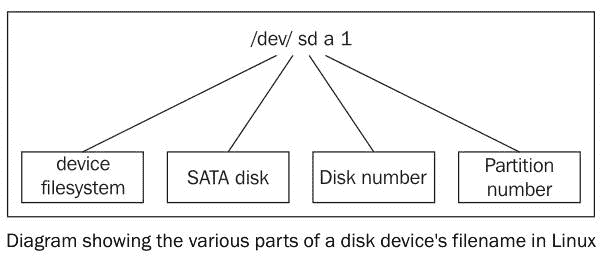

# 备份计划

本章将介绍以下配方：

+   使用`tar`进行归档

+   使用`cpio`进行归档

+   使用`gzip`压缩数据

+   使用`zip`进行归档和压缩

+   使用`pbzip2`更快速地进行归档

+   使用压缩创建文件系统

+   使用`rsync`进行备份快照

+   差异归档

+   使用`fsarchiver`创建整个磁盘映像

# 介绍

没有人在需要备份时关心备份，除非被迫，否则没人会主动进行备份。因此，备份需要自动化。随着磁盘驱动技术的进步，最简单的做法是添加一个新硬盘或使用云存储进行备份，而不是备份到磁带驱动器。即便是便宜的硬盘或云存储，备份数据仍然应该压缩，以减少存储需求和传输时间。在存储数据到云之前，数据应该先进行加密。数据通常在加密之前会被归档并压缩。许多标准的加密程序可以通过脚本自动化。本章的配方描述了如何创建和维护文件或文件夹归档、压缩格式以及加密技术。

# 使用`tar`进行归档

`tar`命令最初是为了归档文件而编写的。它最初设计用于将数据存储到磁带中，因此得名**Tape ARchive**（磁带归档）。`tar`允许你将多个文件和目录合并为一个文件，同时保留文件属性，如所有者和权限。`tar`命令创建的文件通常被称为**tarball**。这些配方描述了使用`tar`创建归档的方法。

# 准备工作

`tar`命令默认在所有类 Unix 操作系统中都有。它具有简单的语法，并以便携的文件格式创建归档。它支持许多选项来微调其行为。

# 如何操作...

`tar`命令用于创建、更新、检查和解包归档。

1.  使用`tar`创建归档文件：

```
        $ tar -cf output.tar [SOURCES]  

```

`c`选项创建一个新归档，`f`选项告诉`tar`使用哪个文件名作为归档文件。`f`选项后面必须跟一个文件名：

```
        $ tar -cf archive.tar file1 file2 file3 folder1 ..  

```

1.  `-t`选项列出归档的内容：

```
        $ tar -tf archive.tar
 file1
 file2  

```

1.  `-v`或`-vv`标志会在输出中包含更多信息。这些功能分别称为详细输出（`v`）和非常详细输出（`vv`）。`-v`约定通常用于通过打印到终端生成报告的命令。`-v`选项会显示更多细节，例如文件权限、所有者组和修改日期：

```
        $ tar -tvf archive.tar 
 -rw-rw-r-- shaan/shaan       0 2013-04-08 21:34 file1
 -rw-rw-r-- shaan/shaan       0 2013-04-08 21:34 file2  

```

文件名必须紧跟在`-f`后面，并且它应该是参数组中的最后一个选项。例如，如果你想要详细输出，你应该像这样使用选项：

`$ tar -cvf output.tar file1 file2 file3 folder1 ..`

# 它是如何工作的...

`tar`命令接受文件名列表或通配符（如`*.txt`）来指定源文件。当完成时，`tar`会将源文件归档到指定的文件中。

我们不能将成百上千的文件或文件夹作为命令行参数传递。因此，如果要归档许多文件，最好使用追加选项（稍后会解释）。

# 还有更多...

让我们一起看看`tar`命令支持的其他功能。

# 向归档文件中追加文件

`-r`选项将新文件追加到现有归档的末尾：

```
    $ tar -rvf original.tar new_file

```

下一个示例创建一个包含一个文本文件的归档：

```
    $ echo hello >hello.txt
 $ tar -cf archive.tar hello.txt

```

`-t`选项显示归档中的文件。`-f`选项定义归档的名称：

```
    $ tar -tf archive.tar
 hello.txt

```

`-r`选项用于追加文件：

```
    $ tar -rf archive.tar world.txt
 $ tar -tf archive.tar
 hello.txt
 world.txt

```

现在归档包含了这两个文件。

# 从归档中提取文件和文件夹

`-x`选项将提取归档文件的内容到当前目录：

```
    $ tar -xf archive.tar

```

当使用`-x`时，`tar`命令将提取归档的内容到当前目录。`-C`选项指定一个不同的目录来接收提取的文件：

```
    $ tar -xf archive.tar -C /path/to/extraction_directory

```

该命令将归档内容提取到指定目录中。它会提取归档的全部内容。我们也可以通过将文件作为命令参数指定，仅提取部分文件：

```
    $ tar -xvf file.tar file1 file4

```

前面的命令只提取了`file1`和`file4`，并忽略了归档中的其他文件。

# stdin 和 stdout 与 tar

在归档时，我们可以指定`stdout`作为输出文件，这样管道中的另一个命令就可以将其作为`stdin`读取并处理归档。

该技术将通过**安全外壳**（**SSH**）连接传输数据，例如：

```
    $ tar cvf - files/ | ssh user@example.com "tar xv -C Documents/"

```

在前面的示例中，文件/目录被添加到一个 tar 归档中，输出到`stdout`（由`-`表示），并提取到远程系统的`Documents`文件夹中。

# 拼接两个归档

`-A`选项将合并多个 tar 归档。

给定两个 tar 包，`file1.tar` 和 `file2.tar`，以下命令将把`file2.tar`的内容合并到`file1.tar`中：

```
    $ tar -Af file1.tar file2.tar

```

通过列出内容来验证：

```
    $ tar -tvf file1.tar

```

# 使用时间戳检查更新归档中的文件

追加选项会将给定的任何文件追加到归档中。如果文件已经存在于归档中，tar 将追加该文件，归档将包含重复的文件。更新选项`-u`只会追加比归档中现有文件更新的文件。

```
    $ tar -tf archive.tar 
 filea
 fileb
 filec  

```

如果只有在`filea`自上次被添加到`archive.tar`以来有修改，才将`filea`追加到归档中，使用以下命令：

```
    $ tar -uf archive.tar filea

```

如果归档外的`filea`与归档内的`filea`具有相同的时间戳，则不会发生任何事情。

使用`touch`命令修改文件时间戳，然后再次尝试`tar`命令：

```
    $ tar -uvvf archive.tar filea
 -rw-r--r-- slynux/slynux     0 2010-08-14 17:53 filea

```

由于文件的时间戳比归档内的时间戳更新，因此该文件被追加，如`-t`选项所示：

```
    $ tar -tf archive.tar 
 -rw-r--r-- slynux/slynux     0 2010-08-14 17:52 filea
 -rw-r--r-- slynux/slynux     0 2010-08-14 17:52 fileb
 -rw-r--r-- slynux/slynux     0 2010-08-14 17:52 filec
 -rw-r--r-- slynux/slynux     0 2010-08-14 17:53 filea

```

注意，新的`filea`已经被追加到`tar`归档中。提取此归档时，tar 将选择`filea`的最新版本。

# 比较归档中的文件和文件系统中的文件

`-d`标志比较归档内的文件和文件系统中的文件。此功能可用于确定是否需要创建新的归档。

```
    $ tar -df archive.tar
 afile: Mod time differs
 afile: Size differs

```

# 从归档中删除文件

`-delete`选项从归档中删除文件：

```
    $ tar -f archive.tar --delete file1 file2 ..

```

或者，

```
    $ tar --delete --file archive.tar [FILE LIST]

```

下一个示例演示删除文件：

```
    $ tar -tf archive.tar
 filea
 fileb
 filec
 $ tar --delete --file archive.tar filea
 $ tar -tf archive.tar
 fileb
 filec

```

# 使用 tar 归档进行压缩

默认情况下，`tar`命令归档文件，它不会压缩文件。Tar 支持选项来压缩生成的归档。压缩可以显著减少文件的大小。Tarball 通常被压缩成以下格式之一：

+   **gzip 格式**：`file.tar.gz`或`file.tgz`

+   **bzip2 格式**：`file.tar.bz2`

+   **Lempel-Ziv-Markov 格式**：`file.tar.lzma`

不同的`tar`标志用于指定不同的压缩格式：

+   **bunzip2**的`-j`

+   **gzip**的`-z`

+   **lzma**的`--lzma`

可以使用压缩格式，而无需像之前那样明确指定特殊选项。`tar`可以根据输出的扩展名来压缩或根据输入文件的扩展名来解压缩。`-a`或**auto-compress**选项会使 tar 自动根据文件扩展名选择压缩算法：

```
    $ tar acvf archive.tar.gz filea fileb filec
 filea
 fileb
 filec
 $ tar tf archive.tar.gz 
 filea
 fileb
 filec  

```

# 排除一组文件不进行归档

`-exclude [PATTEN]`选项将排除与通配符模式匹配的文件不被归档。

例如，要排除所有`.txt`文件不被归档，可以使用以下命令：

```
    $ tar -cf arch.tar * --exclude "*.txt"

```

请注意，模式应当用引号括起来，以防止 shell 展开它。

也可以通过`-X`标志排除在列表文件中提供的文件列表，方法如下：

```
    $ cat list
 filea
 fileb

 $ tar -cf arch.tar * -X list

```

现在它将`filea`和`fileb`排除在归档之外。

# 排除版本控制目录

tarball 的一种用途是分发源代码。许多源代码使用版本控制系统进行维护，如 subversion、Git、mercurial 和 CVS（请参阅前一章节）。版本控制下的代码目录通常包含如`.svn`或`.git`这样的特殊目录。这些由版本控制应用程序管理，对开发者之外的人没有用处。因此，它们应该从分发给用户的源代码 tarball 中排除。

为了在归档时排除与版本控制相关的文件和目录，可以与`tar`一起使用`--exclude-vcs`选项。考虑这个示例：

```
    $ tar --exclude-vcs -czvvf source_code.tar.gz eye_of_gnome_svn

```

# 打印总字节数

`-totals`选项将打印复制到归档中的总字节数。请注意，这是实际数据的字节数。如果你包含了压缩选项，文件大小将小于归档的字节数。

```
    $ tar -cf arc.tar * --exclude "*.txt" --totals
 Total bytes written: 20480 (20KiB, 12MiB/s)

```

# 另见

+   本章节中的*使用 gzip 压缩数据*配方解释了`gzip`命令

# 使用 cpio 进行归档

`cpio`应用程序是另一种类似于`tar`的归档格式。它用于将文件和目录存储在一个具有权限和所有权等属性的归档中。`cpio`格式用于 RPM 包归档（例如 Fedora 等`distros`使用），包含内核镜像的 Linux 内核`initramfs`文件等。这个示例将给出`cpio`的简单示例。

# 如何操作...

`cpio`应用程序通过`stdin`接收输入文件名，并将归档写入`stdout`。我们必须将`stdout`重定向到文件，以保存`cpio`输出：

1.  创建测试文件：

```
        $ touch file1 file2 file3

```

1.  归档测试文件：

```
        $ ls file* | cpio -ov > archive.cpio

```

1.  列出`cpio`档案中的文件：

```
        $ cpio -it < archive.cpio

```

1.  从`cpio`档案中提取文件：

```
        $ cpio -id < archive.cpio

```

# 它是如何工作的...

对于归档命令，选项如下：

+   `-o`：指定输出

+   `-v`：用于打印归档文件列表

使用`cpio`，我们也可以使用文件作为绝对路径进行归档。`/usr/``somedir`是一个绝对路径，因为它包含从根目录（`/`）开始的完整路径。

相对路径不会以`/`开头，而是从当前目录开始路径。例如，`test/file`意味着有一个名为`test`的目录，`file`位于`test`目录中。

在提取时，`cpio`会提取到绝对路径本身。然而，在`tar`的情况下，它会去除绝对路径中的`/`，并将其转换为相对路径。

列出给定`cpio`档案中所有文件的命令选项如下：

+   `-i`用于指定输入

+   `-t`用于列出

在提取命令中，`-o`表示提取，`cpio`会覆盖文件而不提示。`-d`选项告诉`cpio`根据需要创建新目录。

# 使用 gzip 压缩数据

**gzip**应用程序是 GNU/Linux 平台上常见的压缩格式。`gzip`、`gunzip`和`zcat`程序都处理`gzip`压缩。这些工具仅压缩/解压单个文件或数据流，不能直接归档目录和多个文件。幸运的是，`gzip`可以与`tar`和`cpio`一起使用。

# 如何做...

`gzip`将压缩文件，`gunzip`将其解压回原始状态：

1.  使用`gzip`压缩文件：

```
        $ gzip filename
 $ ls
 filename.gz

```

1.  提取`gzip`压缩的文件：

```
        $ gunzip filename.gz
 $ ls
 filename

```

1.  要列出压缩文件的属性，可以使用以下命令：

```
        $ gzip -l test.txt.gz
 compressed        uncompressed  ratio uncompressed_name
 35                   6 -33.3% test.txt

```

1.  `gzip`命令可以从`stdin`读取文件，并将压缩文件写入`stdout`。

从`stdin`读取数据并将压缩数据输出到`stdout`：

```
         $ cat file | gzip -c > file.gz

```

`-c`选项用于指定将输出发送到`stdout`。

`gzip`的`-c`选项与`cpio`配合得很好：

```
        $ ls * | cpio -o | gzip -c > cpiooutput.gz
 $ zcat cpiooutput.gz | cpio -it

```

1.  我们可以使用`--fast`或`--best`选项来指定`gzip`的压缩级别，分别提供低压缩比和高压缩比。

# 还有更多内容...

`gzip`命令通常与其他命令一起使用，并提供高级选项来指定压缩比。

# 使用 gzip 压缩 tar 包

一个 gzip 压缩的 tar 包是一个使用 gzip 压缩的 tar 档案。我们可以使用两种方法来创建这样的 tar 包：

+   第一种方法如下：

```
        $ tar -czvvf archive.tar.gz [FILES]

```

另外，可以使用以下命令：

```
        $ tar -cavvf archive.tar.gz [FILES]

```

`-z`选项指定`gzip`压缩，`-a`选项指定压缩格式应根据扩展名确定。

+   第二种方法如下：

首先，创建一个 tar 包：

```
        $ tar -cvvf archive.tar [FILES]

```

然后，压缩 tar 包：

```
        $ gzip archive.tar

```

如果有许多文件（几百个）需要归档为 tar 包并进行压缩，我们可以使用第二种方法并做一些修改。命令行定义许多文件的问题是它只能接受有限数量的文件作为参数。为了解决这个问题，我们通过在循环中逐个添加文件并使用附加选项（`-r`）来创建 `tar` 文件，方法如下：

```
FILE_LIST="file1  file2 file3  file4  file5" 
for f in $FILE_LIST;
  do
  tar -rvf archive.tar $f
done
gzip archive.tar

```

以下命令将提取一个 gzipped tar 包：

```
    $ tar -xavvf archive.tar.gz -C extract_directory

```

在前面的命令中，`-a` 选项用于检测压缩格式。

# zcat - 无需解压即可读取 gzipped 文件

`zcat` 命令从 `.gz` 文件中将未压缩的数据输出到 `stdout`，而不会重新创建原始文件。`.gz` 文件保持不变。

```
    $ ls
 test.gz

 $ zcat test.gz
 A test file
 # file test contains a line "A test file"

 $ ls
 test.gz

```

# 压缩比

我们可以指定压缩比，压缩比的范围为 1 到 9，其中：

+   1 是最低的，但最快。

+   9 是最佳的，但最慢。

你可以按如下方式指定该范围内的任何比率：

```
      $ gzip -5 test.img

```

默认情况下，`gzip` 使用值 `-6`，在牺牲一些速度的情况下，偏向于更好的压缩。

# 使用 bzip2

`bzip2` 在功能和语法上与 `gzip` 类似。不同之处在于，`bzip2` 提供更好的压缩效果，但比 `gzip` 更慢。

要使用 `bzip2` 压缩文件，请按以下方式使用命令：

```
      $ bzip2 filename

```

按如下方式提取 bzipped 文件：

```
      $ bunzip2 filename.bz2

```

压缩和提取 tar.bz2 文件的方式与之前讨论的 tar.gz 文件类似：

```
      $ tar -xjvf archive.tar.bz2

```

这里，`-j` 指定使用 `bzip2` 格式压缩归档。

# 使用 lzma

`lzma` 压缩比 `gzip` 和 `bzip2` 提供更好的压缩比。

要使用 `lzma` 压缩文件，请按以下方式使用命令：

```
    $ lzma filename

```

要提取 `lzma` 文件，请使用以下命令：

```
    $ unlzma filename.lzma

```

tar 包可以使用 `-lzma` 选项进行压缩：

```
    $ tar -cvvf --lzma archive.tar.lzma [FILES]

```

另外，可以使用以下方式：

```
    $ tar -cavvf archive.tar.lzma [FILES]

```

要将使用 `lzma` 压缩的 tar 包提取到指定目录，请使用以下命令：

```
    $ tar -xvvf --lzma archive.tar.lzma -C extract_directory

```

在前面的命令中，`-x` 用于提取文件。`--lzma` 指定使用 `lzma` 来解压缩生成的文件。

或者，可以使用以下命令：

```
    $ tar -xavvf archive.tar.lzma -C extract_directory

```

# 另见

+   本章中的 *使用 tar 归档* 说明了 `tar` 命令。

# 使用 zip 进行归档和压缩

ZIP 是一种流行的压缩归档格式，适用于 Linux、Mac 和 Windows。虽然它在 Linux 上不像 `gzip` 或 `bzip2` 那么常用，但在向其他平台分发数据时非常有用。

# 如何操作...

1.  以下语法用于创建 zip 归档：

```
        $ zip archive_name.zip file1 file2 file3...

```

考虑以下示例：

```
        $ zip file.zip file

```

此处，将生成 `file.zip` 文件。

1.  `-r` 标志将递归归档文件夹：

```
        $ zip -r archive.zip folder1 folder2

```

1.  `unzip` 命令会从 ZIP 文件中提取文件和文件夹：

```
        $ unzip file.zip

```

`unzip` 命令提取内容，但不会删除归档文件（不同于 `unlzma` 或 `gunzip`）。

1.  `-u` 标志用于更新归档中的文件，替换为更新的文件：

```
 $ zip file.zip -u newfile 

```

1.  `-d` 标志会删除压缩包中的一个或多个文件：

```
 $ zip -d arc.zip file.txt 

```

1.  `-l` 标志用于列出归档中的文件：

```
 $ unzip -l archive.zip 

```

# 它是如何工作的...

虽然与我们已经讨论过的大多数归档和压缩工具类似，`zip`与`lzma`、`gzip`或`bzip2`不同的是，它在归档后不会删除源文件。虽然`zip`与`tar`类似，但它同时执行归档和压缩，而`tar`本身不执行压缩。

# 使用 pbzip2 更快的归档

大多数现代计算机至少有两个 CPU 核心。这几乎相当于两个真实的 CPU 在为你工作。然而，拥有多核 CPU 并不意味着程序一定会运行得更快；重要的是该程序能够充分利用多个核心。

到目前为止讲解的压缩命令只使用一个 CPU。`pbzip2`、`plzip`、`pigz`和`lrzip`命令是多线程的，能够使用多个核心，从而减少压缩文件所需的整体时间。

这些大多数发行版都没有预装，但可以通过 apt-get 或 yum 添加到你的系统中。

# 准备工作

`pbzip2`通常不会随大多数发行版预安装，你需要使用包管理器来安装它：

```
    sudo apt-get install pbzip2

```

# 如何操作...

1.  `pbzip2`命令将压缩单个文件：

```
        pbzip2 myfile.tar

```

`pbzip2`检测到系统上的核心数量，并将`myfile.tar`压缩为`myfile.tar.bz2`。

1.  要压缩和归档多个文件或目录，我们将`pbzip2`与`tar`结合使用，如下所示：

```
 tar cf sav.tar.bz2 --use-compress-prog=pbzip2 dir

```

另外，可以使用以下方法：

```
        tar -c directory_to_compress/ | pbzip2 -c > myfile.tar.bz2

```

1.  解压一个`pbzip2`压缩文件的方法如下：

`-d`标志将解压文件：

```
        pbzip2 -d myfile.tar.bz2

```

可以使用管道解压和提取 tar 归档：

```
        pbzip2 -dc myfile.tar.bz2 | tar x

```

# 它是如何工作的...

`pbzip2`应用程序使用与`bzip2`相同的压缩算法，但它使用`pthreads`，一种线程库，同时压缩数据的不同块。线程对用户是透明的，但提供了更快的压缩速度。

像`gzip`或`bzip2`一样，`pbzip2`不创建归档文件。它只对单个文件起作用。要压缩多个文件和目录，我们需要将其与`tar`或`cpio`结合使用。

# 还有更多...

还有一些我们可以与`pbzip2`一起使用的有用选项：

# 手动指定 CPU 数量

`-p`选项指定要使用的 CPU 核心数。如果自动检测失败或你需要为其他任务释放核心，这是非常有用的：

```
    pbzip2 -p4 myfile.tar

```

这将告诉`pbzip2`使用 4 个 CPU。

# 指定压缩比

从`-1`到`-9`的选项指定最快和最佳的压缩比，**1**是最快的，**9**是最好的压缩比。

# 创建带有压缩的文件系统

`squashfs`程序创建了一个只读的、压缩性很强的文件系统。`squashfs`程序可以将 2 到 3GB 的数据压缩成一个 700MB 的文件。Linux LiveCD（或 LiveUSB）发行版就是使用` squashfs`构建的。这些 CD 使用一个只读压缩文件系统，将根文件系统保存在一个压缩文件中。该压缩文件可以通过回环挂载加载完整的 Linux 环境。当需要文件时，它们会被解压并加载到内存中运行，然后内存会被释放。

`squashfs`程序在你需要一个压缩存档并且需要随机访问文件时非常有用。完全解压缩一个大型压缩存档需要很长时间。回环挂载的存档提供了快速的文件访问，因为只有请求的部分存档会被解压。

# 准备工作

挂载`squashfs`文件系统是所有现代 Linux 发行版都支持的。然而，创建`squashfs`文件需要`squashfs-tools`，你可以通过包管理器安装它：

```
    $ sudo apt-get install squashfs-tools

```

另外，可以使用以下方式：

```
    $ yum install squashfs-tools

```

# 如何操作...

1.  使用`mksquashfs`命令通过添加源目录和文件来创建`squashfs`文件：

```
        $ mksquashfs SOURCES compressedfs.squashfs

```

源可以是通配符、文件或文件夹路径。

考虑以下示例：

```
        $ sudo mksquashfs /etc test.squashfs
 Parallel mksquashfs: Using 2 processors
 Creating 4.0 filesystem on test.squashfs, block size 131072.
 [=======================================] 1867/1867 100%  

```

更多详细信息将在终端上显示。为了节省空间，输出将被简化。

1.  要将`squashfs`文件挂载到挂载点，使用回环挂载，方法如下：

```
        # mkdir /mnt/squash
 # mount -o loop compressedfs.squashfs /mnt/squash

```

你可以在`/mnt/squashfs`访问内容。

# 还有更多...

`squashfs`文件系统可以通过指定额外的参数进行定制。

# 在创建`squashfs`文件时排除文件

`-e`标志将排除文件和文件夹：

```
    $ sudo mksquashfs /etc test.squashfs -e /etc/passwd /etc/shadow

```

`-e`选项将排除`/etc/``passwd`和`/etc/``shadow`文件来自`squashfs`文件系统。

`-ef`选项读取包含排除文件列表的文件：

```
    $ cat excludelist
 /etc/passwd
 /etc/shadow

 $ sudo mksquashfs /etc test.squashfs -ef excludelist

```

如果我们想在排除列表中支持通配符，请使用`-wildcard`作为参数。

# 使用 rsync 备份快照

数据备份是需要定期进行的。除了本地备份，我们可能还需要进行远程位置之间的数据备份。`rsync`命令能够在最小化传输时间的同时，将文件和目录从一个位置同步到另一个位置。`rsync`相比`cp`命令的优点是：`rsync`会比较修改日期，只复制较新的文件，`rsync`支持跨远程机器的数据传输，并且支持压缩和加密。

# 如何操作...

1.  要将源目录复制到目标位置，请使用以下命令：

```
        $ rsync -av source_path destination_path

```

考虑以下示例：

```
        $ rsync -av /home/slynux/data 
        slynux@192.168.0.6:/home/backups/data

```

在上述命令中：

+   `-a`表示归档

+   `-v`（详细模式）在标准输出上打印详细信息或进度

上述命令将递归地将所有文件从源路径复制到目标路径。源路径和目标路径可以是远程的或本地的。

1.  要将数据备份到远程服务器或主机，请使用以下命令：

```
        $ rsync -av source_dir username@host:PATH

```

要在目标位置保持镜像，请定期运行相同的`rsync`命令。它只会将更改过的文件复制到目标位置。

1.  要将数据从远程主机恢复到`localhost`，请使用以下命令：

```
        $ rsync -av username@host:PATH destination  

```

`rsync`命令使用 SSH 连接到远程机器，因此你需要以`user@host`格式提供远程机器的地址，其中 user 是用户名，host 是附加在远程机器上的 IP 地址或主机名。`PATH`是远程机器上需要复制数据的路径。

确保远程机器上已安装并运行 OpenSSH 服务器。此外，为避免在远程机器上输入密码，请参考第八章中的*无密码 SSH 自动登录*示例，*老男孩网络*。

1.  在传输过程中压缩数据可以显著优化传输速度。`rsync -z`选项`指定`在传输过程中压缩数据：

```
        $ rsync -avz source destination    

```

1.  要将一个目录同步到另一个目录，请使用以下命令：

```
        $ rsync -av /home/test/ /home/backups    

```

上述命令将源路径(`/home/test`)复制到一个名为 backups 的现有文件夹中。

1.  要将一个完整的目录复制到另一个目录中，请使用以下命令：

```
        $ rsync -av /home/test /home/backups  

```

此命令将源路径(`/home/test`)复制到一个名为 backups 的目录中，创建该目录。

对于路径格式，如果源路径末尾有`/`，`rsync`将会把`source_path`指定的末尾目录的内容复制到目标位置。

如果源路径末尾没有`/`，`rsync`将会把整个目录复制到目标位置。

添加`-r`选项将强制`rsync`递归复制目录的所有内容。

# 它是如何工作的...

`rsync`命令与源路径和目标路径一起工作，路径可以是本地的也可以是远程的。两个路径都可以是远程路径。通常，远程连接使用 SSH 进行，以提供安全的双向通信。本地路径和远程路径如下所示：

+   `/home/user/data`（本地路径）

+   `user@192.168.0.6:/home/backups/data`（远程路径）

`/home/user/data`指定了执行`rsync`命令的机器中的绝对路径。`user@192.168.0.6:/home/backups/data`指定了该路径是在 IP 地址为`192.168.0.6`的机器上，并以`user`用户登录，路径为`/home/backups/data`。

# 还有更多内容...

`rsync`命令支持多个命令行选项，用于精细调整其行为。

# 使用 rsync 进行归档时排除文件

`-exclude`和`-exclude-from`选项指定不应被传输的文件：

```
    --exclude PATTERN

```

我们可以指定一个排除文件的通配符模式。请参考以下示例：

```
$ rsync -avz /home/code/app /mnt/disk/backup/code --exclude "*.o" 

```

此命令会排除`.o`文件的备份。

或者，我们也可以通过提供一个列表文件来指定需要排除的文件。

使用`--exclude-from FILEPATH`。

# 在更新 rsync 备份时删除不存在的文件

默认情况下，`rsync`不会从目标位置删除那些在源位置不存在的文件。`-delete`选项会删除那些在源位置不存在的目标文件：

```
    $ rsync -avz SOURCE DESTINATION --delete

```

# 安排定期备份

你可以创建一个`cron`作业，定期安排备份。

示例如下：

```
    $ crontab -ev

```

添加以下行：

```
    0 */10 * * * rsync -avz /home/code user@IP_ADDRESS:/home/backups

```

前面的`crontab`条目将`rsync`安排为每 10 小时执行一次。

`*/10`是`crontab`语法中的小时位置。`/10`表示每 10 小时执行一次备份。如果`*/10`写在分钟位置，则表示每 10 分钟执行一次。

查看 第十章 中的 *使用 cron 调度* 章节，*管理调用*，了解如何配置 `crontab`。

# 差异归档

到目前为止描述的备份解决方案是文件系统在当时状态的完整副本。当你立即发现问题并需要最新快照来恢复时，这个快照非常有用。如果你没有及时发现问题，直到新快照创建时，之前的好数据已被当前坏数据覆盖，那么它就无法工作。

文件系统的归档提供了文件变更的历史记录。当你需要恢复损坏文件的旧版本时，这非常有用。

`rsync`、`tar` 和 `cpio` 可以用来制作文件系统的每日快照。然而，每天备份整个文件系统是非常昂贵的。为每周的每一天创建一个单独的快照将需要原始文件系统七倍的空间。

差异备份仅保存自上次完整备份以来发生变化的数据。Unix 的 dump/restore 工具支持这种类型的归档备份。不幸的是，这些工具是围绕磁带驱动器设计的，并且不容易使用。

`find` 工具可以与 `tar` 或 `cpio` 配合使用，以复制这种功能。

# 如何操作...

使用 tar 创建初始完整备份：

```
    tar -cvz /backup/full.tgz /home/user

```

使用 `find` 的 `-newer` 标志来确定自完整备份创建以来哪些文件发生了变化，并创建新的归档：

```
    tar -czf day-`date +%j`.tgz `find /home/user -newer 
    /backup/full.tgz`

```

# 它是如何工作的...

`find` 命令生成一个自完整备份创建以来已被修改的所有文件的列表 `(/backup/full.tgz)`。

`date` 命令根据儒略日期生成文件名。因此，年度的第一个差异备份将是 `day-1.tgz`，1 月 2 日的备份将是 `day-2.tgz`，依此类推。

随着越来越多的文件从初始完整备份中发生变化，差异归档会每天变得更大。当差异归档变得太大时，进行新的完整备份。

# 使用 fsarchiver 创建整个磁盘镜像

`fsarchiver` 应用程序可以将磁盘分区的内容保存为压缩归档文件。与 `tar` 或 `cpio` 不同，`fsarchiver` 保留扩展文件属性，并且可以恢复到没有当前文件系统的磁盘。`fsarchiver` 应用程序能够识别并保留 Windows 文件属性以及 Linux 属性，因此适合用于迁移 Samba 挂载的分区。

# 准备工作

`fsarchiver` 应用程序在大多数发行版中默认未安装。你需要使用你的包管理器安装它。更多信息，请访问 [`www.fsarchiver.org/Installation`](http://www.fsarchiver.org/Installation)。

# 如何操作...

1.  创建一个 `filesystem/partition` 的备份。

像这样使用 `fsarchiver` 的 `savefs` 选项：

```
        fsarchiver savefs backup.fsa /dev/sda1

```

这里，`backup.fsa` 是最终的备份文件，`/dev/sda1` 是要备份的分区

1.  同时备份多个分区。

如前所述，使用`savefs`选项并将分区作为最后的参数传递给`fsarchiver`：

```
        fsarchiver savefs backup.fsa /dev/sda1 /dev/sda2

```

1.  从备份归档中恢复一个分区。

如此使用`fsarchiver`的`restfs`选项：

```
        fsarchiver restfs backup.fsa id=0,dest=/dev/sda1

```

`id=0`表示我们希望从归档中选择第一个分区，并将其恢复到指定的分区`dest=/dev/sda1`。

从备份归档中恢复多个分区。

如前所述，使用`restfs`选项，方法如下：

```
      fsarchiver restfs backup.fsa id=0,dest=/dev/sda1    
      id=1,dest=/dev/sdb1

```

在这里，我们使用两组`id,dest`参数来告诉`fsarchiver`从备份中恢复前两个分区到两个物理分区。

# 它是如何工作的...

与 tar 类似，`fsarchiver`检查文件系统以创建文件列表，然后将这些文件保存到一个压缩归档文件中。不同于仅保存文件信息的 tar，`fsarchiver`也会执行文件系统的备份。这使得在新分区上恢复备份时更为方便，因为不需要重新创建文件系统。

如果你第一次看到`/dev/sda1`这样的分区标记，这需要一些解释。Linux 中的`/dev`目录保存着被称为设备文件的特殊文件，这些文件指向物理设备。`sda1`中的`sd`代表**SATA**磁盘，接下来的字母可以是 a、b、c 等，后面跟着分区号。


