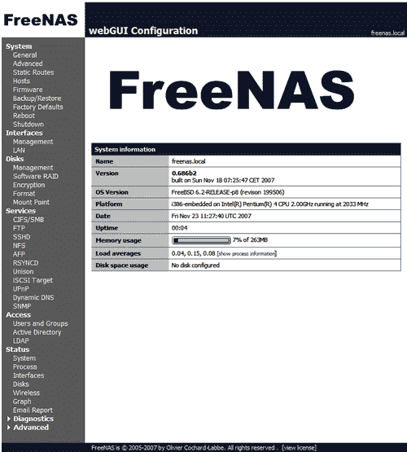
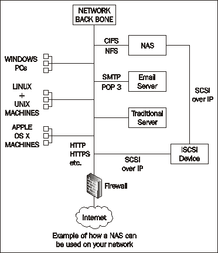

# 第一章：关于 NAS 和 FreeNAS 的全部内容

第一章是对网络附加存储（NAS）的高层次概述，特别是 FreeNAS 软件的介绍。我们将介绍 NAS 的基本理念以及 FreeNAS 服务器的哲学。本章的内容比书中的其他章节更加理论化，但理解网络附加存储的概念以及 FreeNAS 服务器在您业务中的作用仍然非常重要。本章的主要内容包括：

+   什么是网络附加存储？

+   什么是 FreeNAS？

+   FreeNAS 有哪些功能？

+   FreeNAS 为我和我的企业做了什么？

# 网络附加存储

在 80 年代中期，两个著名的计算机公司独立开始研究如何通过网络访问另一台计算机上的文件，就像那台远程计算机的硬盘直接连接到本地机器一样。这两家公司是 Sun Microsystems 和 Microsoft。Sun Microsystems 的方法是为其 UNIX 操作系统设计的，被称为网络文件系统（NFS），并随后在几乎所有版本的 UNIX 操作系统中得到了实现，包括 Linux。而微软的解决方案（最初与 IBM 共同开发）被称为 SMB（服务器消息块），但后来被重命名为公共互联网文件系统（CIFS）。

NFS 和 CIFS 的基本功能非常相似，安装任一协议的网络计算机都可以读取和写入另一台网络计算机上的文件系统。Windows 用户通常通过“网络邻居”（Windows 95/98）或“我的网络位置”（Windows ME、2000 和 XP）或更近一些的“网络和共享中心”（Vista）来接触这一概念。在这里，你可以浏览本地网络上的其他 PC，并读取和写入该机器上的文件，只要文件的所有者与您共享它。

使用远程计算机（文件服务器）存储文件的能力，促使许多公司部署了大型的集中式 NFS 服务器或 Windows 服务器，这些服务器被数百甚至上千台 UNIX 工作站或 PC 客户端访问。用户通常会被鼓励将所有重要文件存储在这些服务器上，因为 IT 人员会定期备份服务器，从而备份用户的重要文件。

存储空间一直是计算机系统中的一个重要方面。今天，硬盘空间比以往任何时候都更为紧缺。回到 1960 年代，存储是以字节（8 位二进制数字，值为 0 或 1）和千字节为单位来衡量的。随着计算机的进步，存储（包括硬盘）从兆字节（1024 千字节）发展到吉字节（1024 兆字节），直到今天，随着 21 世纪的推进，计算机存储已经进入了太字节（1024 吉字节）的领域。

随着现代对视频和音频的需求，结合高速的局域网和 CIFS 与 NFS 访问协议，一种新的存储解决方案应运而生：网络附加存储（简称 NAS）。NAS 服务器在许多方面与传统的文件服务器相似，尤其是在服务器硬件方面。但 NAS 服务器比传统的办公或部门服务器更加专业化，因为它只通过网络提供存储访问。它并不设计用来运行像数据库或邮件服务器这样的应用程序，而这些应用程序可能是其他类型服务器的功能。通常，NAS 服务器不需要永久连接键盘、鼠标或显示器，日常管理则通过网页界面进行。

下面是 FreeNAS 网络界面的一个示例：

要访问服务器上的数据，典型的 NAS 将支持多个访问协议，从而允许 Microsoft Windows 客户端、Apple OS X 客户端和 UNIX（包括 Linux）客户端连接并使用服务器上的数据。

NAS 服务器通常包含一个或多个硬盘，这些硬盘可以组合成大块连续存储区域，或以冗余的方式使用。在冗余设置中，如果一个硬盘发生故障，系统仍然能继续工作，而且您的数据不会丢失。

NAS 服务器有各种形状和尺寸。有几家公司提供嵌入式操作系统的紧凑型 NAS 服务器，并且可能只能安装两个硬盘。这些设备相对便宜，但扩展空间有限。在另一端，有专门的 NAS 服务器，它们更像传统的文件服务器，具有较强的处理能力，并且支持多个硬盘（这使得 NAS 能够托管几个 TB 的数据）。

下面是一个 NAS 如何适应您的网络环境的示例：

与传统的文件服务器相比，网络附加存储具有几个优势：

+   NAS 提供更好的安全性。由于服务器只运行提供数据访问的专用操作系统，因此没有其他服务（如电子邮件服务器和通用 Web 服务器）运行，从而减少潜在的安全风险。

+   NAS 服务器旨在提供更高的可用性（减少停机时间）。NAS 服务器设计有硬盘冗余模型，从而在硬件故障时不丢失宝贵的数据。

+   NAS 服务器使用和管理起来更简单，因为大多数配置通过网页界面完成，而该界面是专为执行运行 NAS 所需的特定任务而设计的。

+   NAS 的系统要求较为简单，不需要尖端的处理能力。

+   NAS 服务器可以在异构网络环境中工作，因此可以让不同类型的计算机连接并使用其存储。

因此，NAS 的整体成本低于传统服务器，同时允许扩展并提高可用性和安全性。

本书聚焦于一种名为 FreeNAS（免费网络附加存储）的 NAS 实现，它将普通 PC 或服务器转变为 NAS。

# 什么是 FreeNAS？

FreeNAS 是一款免费的软件，将个人电脑转换为 NAS 服务器。它支持来自 Microsoft Windows、Apple OS X、Linux 和 FreeBSD 的连接。它支持硬盘冗余，拥有简单的 Web 管理界面，并且系统要求较为适中。

FreeNAS 是一种被称为嵌入式操作系统的操作系统。这意味着它紧凑、高效，并且专门用于完成单一任务，在这种情况下是 NAS。一旦 FreeNAS 安装在 PC 上，该 PC 就会变成一个专用的 NAS，无法同时执行其他一般任务。

要使用 FreeNAS，您需要从 [`www.freenas.org`](http://www.freenas.org) 下载该软件，并在您希望将其变成 NAS 的计算机上启动它。我们将在下一章中详细讨论这一点。

FreeNAS 有两个版本；一个是 Live CD，另一个是可安装套件。Live CD 将计算机启动为 NAS，并使用软盘或 USB 闪存驱动器存储配置信息。可安装版本将自己安装到服务器上（就像传统操作系统那样），并使用系统硬盘存储配置信息。

那么，为什么 FreeNAS 是免费的呢？FreeNAS 是一种开源软件。它最初由 Olivier Cochard-Labbé 编写，现在由一个小型国际团队维护，Oliver 是项目负责人。作为开源软件，意味着 FreeNAS 团队已将软件授权方式设定为允许用户自由访问该软件及其源代码。您可以自由使用和部署 FreeNAS，且没有任何限制。您还可以获取源代码并为自己构建或修改软件。唯一的限制是，当重新分发 FreeNAS 时，无论是否有修改，原始的版权声明必须保持完整。Olivier Cochard-Labbé 是版权持有者，他还持有 FreeNAS 名称的商标。

FreeNAS 由几个不同的组件组成。在最低层次上，是操作系统（FreeBSD，详见下文）。然后是提供网络服务的各种服务器组件，最后是 Web 管理界面。

### 注意

在本书中多次提到的操作系统是 FreeBSD。FreeBSD 是一种类 UNIX 操作系统，源自原始 AT&T 版本的 UNIX，通过伯克利软件分发（BSD）分支传承下来。FreeNAS 建立在 FreeBSD 之上并依赖于 FreeBSD。由于 FreeNAS 和 FreeBSD 之间高度的协同效应，第九章和第十章将帮助您排除 FreeNAS 中的问题，并涉及 FreeBSD 操作系统的低级命令。

# 特性

FreeNAS 软件的功能非常强大，随着每次发布，功能列表都在不断增长，同时保持提供简单 NAS 服务器的目标。那么，FreeNAS 能做些什么呢？

FreeNAS 可以安装在硬盘或 USB 闪存驱动器上，安装完成后占用不到 32MB 的磁盘空间。

支持使用通用互联网文件系统（CIFS）协议的 Microsoft Windows 计算机。这是微软用于通过网络访问文件的协议。CIFS 也被 Linux 操作系统和苹果的 OS X 所支持。这意味着 Linux 和 Macintosh 计算机也可以访问 NAS。通过 CIFS，NAS 的区域可以永久挂载到客户端机器上，就像它们是本地硬盘一样。

FreeNAS 支持网络文件系统（NFS）。NFS 是一种成熟的网络文件访问协议，通常用于 UNIX 类型的环境中。使用 NFS，NAS 服务器上的存储区域可以像客户端的本地磁盘一样使用。

文件传输协议（FTP）是被支持的。FTP 是一种成熟的协议，用于通过网络传输文件。FTP 是一个客户端/服务器协议，通常用于在机器之间传输文件，以“一次性”的方式进行。建立连接后，文件传输完成，连接关闭。这是一种常用于允许人们从互联网上下载文件的协议。在 NAS 环境中，它非常适合提供网络上的软件库（例如软件、公司模板和杀毒软件更新）。

FreeNAS 服务器可以通过不同的工具（如 Unison 和 RSYNC（远程同步））作为备份服务器使用。使用 RSYNC，可以高效地将整个磁盘或文件夹（及其子文件夹）与备份服务器同步。RSYNC 相较于直接通过网络复制文件的优势在于，RSYNC 只会复制文件中已更改的部分。

FreeNAS 还支持安全外壳协议（SSH）进行加密连接和数据交换，支持苹果文件协议（AFP），为 Mac OS X 和经典 Mac OS 提供文件访问服务，还支持 UNISON（另一种文件同步协议）。

为了提供对 NAS 存储的访问，并扩展服务器的存储能力，FreeNAS 支持 Internet 小型计算机系统接口（iSCSI）。iSCSI 通过 IP 网络模拟本地 SCSI 硬盘的存在。FreeNAS 可以充当 iSCSI 服务器（通过 SCSI over IP 协议导出 RAW 本地存储），在技术上称为 iSCSI 目标。FreeNAS 也可以充当客户端，连接到其他 iSCSI 目标并挂载 iSCSI 磁盘。挂载到本地的 iSCSI 磁盘成为服务器的通用存储资源的一部分；而 FreeNAS 服务器可以充当这些磁盘的网关或主控，允许其他机器（如 Windows PC）通过 CIFS、FTP 等使用 iSCSI 磁盘。这种设置在存储区域网络（SAN）模型中非常流行。

FreeNAS 支持多种文件系统。文件系统是文件在磁盘上存储和组织的方式。不同的文件组织方法具有不同的特点，如速度、最大文件大小、以及系统崩溃后的恢复能力。FreeNAS 可以使用 UNIX 文件系统（UFS），这是 FreeNAS 的默认文件系统。它还可以使用 Linux 文件系统 ext2 和 ext3，以及 NT 文件系统（NTFS），后者是 Microsoft Windows NT/2000/XP、Windows Server 2003/2008 和 Vista 的本地文件系统。

支持多种类型的硬盘，包括当前所有流行的硬盘（SATA/PATA、SCSI、iSCSI、USB 和 Firewire）。FreeNAS 还可以处理大于 2TB 的硬盘，只要文件系统允许。

所有受 FreeBSD 支持的流行网络卡（包括有线和无线网络卡）都可以在不需要下载和安装额外驱动程序的情况下与 FreeNAS 兼容。

FreeNAS 包括硬盘故障转移和镜像技术。使用一种名为 RAID（冗余廉价磁盘阵列）系统，你可以将硬盘配置成多个磁盘组，通过组合磁盘使数据在 2 个或更多的磁盘上分布，以便在某个磁盘发生故障时，数据完整性得以保持，且你的 NAS 继续工作。FreeNAS 可以使用硬件 RAID（由控制卡负责控制所有磁盘），也可以使用软件 RAID，其中 FreeBSD 操作系统负责运行 RAID 阵列。FreeNAS 通过 FreeBSD 提供的驱动程序支持许多流行的硬件 RAID 卡。

# FreeNAS 能为我和我的企业做些什么？

网络附加存储（NAS）是解决一个问题的方案。为了了解 NAS，特别是 FreeNAS，能为你带来什么，我们首先需要看看问题的本质。

简单来说，问题在于对高度可访问存储空间的需求。存储空间的需求因三个明确但重要的原因而增加。首先，企业中创建的数字信息量在增加。其次，这些数字信息的大小在增加，最后，在一些有法定长期数据存储要求的国家，对旧数据进行全面归档和管理的需求也在增加。

创建的数字信息量增加，因为越来越多的业务数据存储在计算机上，企业对纸张的依赖性降低了。以电子邮件为例。10 到 15 年前，电子邮件可能不是您业务的关键部分。它可能存在并被使用，但尚未成为关键。而今天，电子邮件已成为使命关键。像 Yahoo!、Gmail 和 Hotmail 这样的在线电子邮件服务最初提供的是 5 或 10 兆字节的邮箱，而今天它们提供的邮箱容量已经是以吉字节计。一个拥有 100 人的组织每年会生成吉字节级别的电子邮件数据。如果您的业务扩展并雇佣更多人员，那么电子邮件的数量也会随之增加。随着您的客户数量增加，您的电子邮件数据量也会增加，依此类推。

然后，如果你考虑到文件、合同、会计、库存、演示文稿、销售材料等等，你就会发现数据量在增长。每个新的销售线索，每个新客户和每份支持合同都会增加生成的数据量。

其次，数字信息的性质正在发生变化，数据的大小也在随之改变。在过去，数据更多地以文本为导向，但今天数据已经多媒体化。照片、视频和音乐现在是正常的数据类型。其中一个显著的区别当然是，文本类型的数据（包括简单的文字处理器文档）较小，而多媒体文件则大得多。这反映在可用的光盘类型上。最初的 CD-ROM 容量为 650 兆字节，足够存放 72 分钟的音乐。然后出现了 6 倍大的 DVD，容量为 4.7 吉字节（单层盘）。现在，有高密度光盘如蓝光光盘，双层蓝光光盘可存储 50 GB，几乎是双层 DVD 的 6 倍大小，容量为 8.5 GB。与此同时，硬盘的容量也在增长，达到了几 TB 的大小。

第三，企业如何管理旧数据变得越来越重要。世界各国政府已通过立法，要求企业保存数据更长时间。数据的价值是不断波动的。看似只是来自一位前员工的旧文件，可能在一夜之间变成系统中最重要的文件，因为你发现其中包含了重要的信息。旧邮件的价值也同样波动。你今天认为的旧邮件，可能在明天变得至关重要，因为律师可能因为某些法律事务需要查看它。保持旧数据的安全并易于访问（通过将其复制到 FreeNAS 服务器，并配合其他备份方法）至关重要。但由于其本身的特性，旧数据的体积将随着时间的推移不断增加，你对存储的需求也会随之增加。

### 注意

**当 FreeNAS 不是正确的解决方案时**

FreeNAS 并不是在所有情况下都能提供最佳解决方案。最明显的例子是，当你在网络上只有非常少的用户，比如少于 3 个时。在这种情况下，直接附加存储（即外部 USB 硬盘或向现有的网络 PC 添加另一个硬盘）是另一种解决方案。

随着存储空间需求的增加，数据需要在你网络上的不同类型计算机（Windows、UNIX、OS X）之间可访问，并且需要在没有长时间停机的情况下，以一致的方式提供访问。

传统上，Windows 桌面机器与 Windows 服务器配合使用，而 UNIX 桌面机器与 UNIX 服务器配合使用，但 Windows 和 UNIX 系统之间的互通较少。虽然许多网络协议都可供 Windows 和 UNIX 使用，但这两个不同的系统往往是孤立使用的。Windows 服务器有自己的系统管理员，而 UNIX 机器也有自己的管理员。

为了降低成本并提高可用性，网络附加存储需要提供从 Windows PC 和 UNIX 客户端访问数据的功能。拥有一个可以服务网络中所有客户端的统一服务器，是管理数据的一个重要方面。

## FreeNAS 如何满足这些需求

为了解决更多存储空间的需求，你可以使用 NAS。但要对你的企业有价值，这个 NAS 需要易于使用、易于安装和部署、易于管理、可扩展，且没有高昂的许可证费用。

**易用性—** 由于 FreeNAS 的设计目标是做一件事，那就是将一台 PC 或服务器转换为网络附加存储，因此它简单易用且易于管理。从用户的角度来看，它就像是一个存储设备。如果在 Windows 平台上使用，它只会显示为一个额外的硬盘；在内网环境下，它则是一个 FTP 存储库。大多数系统管理操作都是通过 Web 界面完成的，甚至可以通过 Web 界面重启机器。

**易于安装和部署——** 启动 FreeNAS 非常简单，特别是在使用 USB 闪存驱动器和现场 CD 时。只需将 CD 插入驱动器并启动。在下一章中，我们将进行快速安装，帮助你熟悉 FreeNAS 及其 Web 界面。

**易于管理——** 正如上文“易用性”部分提到的，FreeNAS 是专门为 NAS 设计的软件。与传统服务器操作系统的完整安装不同，你只需担心存储配置，没有复杂的系统服务需要配置，且不会有 101 个选项让你头疼。但不要被误导，FreeNAS 是功能丰富且非常智能的软件，管理界面简洁易用，同时又不失全面性。

**可扩展性——** 可扩展性和稳定性是 FreeNAS 的核心功能，因为它基于 FreeBSD 操作系统。FreeBSD 被证明是一个成熟且适合生产环境的操作系统。许多小型、中型和大型企业都成功部署了 FreeBSD，甚至像 Yahoo! 这样的公司也曾依赖 FreeBSD 作为服务器操作系统。FreeBSD 以其网络性能和可靠性而闻名，这也是为什么 FreeNAS 选择 FreeBSD 的原因。可扩展性的真正限制是服务器能够容纳的硬盘数量。但超出物理硬盘限制后，FreeNAS 可以使用网络上的 iSCSI 设备，从而使服务器进一步扩展。

### 注意

如果你将 FreeNAS 安装在 USB 闪存驱动器上或使用现场 CD 版本，那么大部分磁盘空间将用于存储，当然这是 NAS 的目标。如果你使用的是传统操作系统，那么在初始安装时，几 GB 的硬盘空间可能就会被占用。

**许可证费用——** 使用传统服务器操作系统时，通常需要支付操作系统厂商的许可证费用。有时，这还包括基于组织用户数量的“按席位”许可证费用。由于 FreeNAS 是开源的，所以**没有许可证费用**。这意味着你可以自由地使用和部署 FreeNAS，使用量没有限制。

## FreeNAS 服务器的实际用途

那么 FreeNAS 服务器有哪些实际用途呢？以下是一些 FreeNAS 服务器的简要用途：

+   作为企业中资源的公共存储区域，包括销售资料、演示文稿、传单、宣传册、模板、软件包、软件更新、流行的办公软件和流行的互联网软件。

+   为每个用户提供一个只有他/她可以访问的网络文件夹，这样他们就可以将所有工作保存到服务器上，而不是保存在本地 PC 上。这有时被称为“网络驱动器”，意味着可以通过网络访问的硬盘。这样有两个明显的优点：

    +   备份变得更加容易，因为所有数据都存储在一个中央位置（即 FreeNAS 服务器）。

    +   用户不依赖于他们使用的 PC，因为所有数据都存储在一个中央位置，此外，每个用户 PC 的硬盘也不需要太大，而且可以随时被清空（比如为了重新安装操作系统）而不必担心。

+   作为大型文件的中央存储，这些文件很快就会占满桌面 PC 的硬盘。如果你的业务涉及使用大型文件，如多媒体文件（视频、音频和照片），那么 FreeNAS 服务器可以为这些文件提供一个方便的中央存储位置，否则它们会使桌面 PC 的硬盘不堪重负。

+   作为你内网的 FTP 仓库（内网是一个私有的、内部网络，使用与公共互联网相同的协议）。假设你有一个内网，可能会有一些常见资源，如展示模板，供所有员工使用。如果你的 web 服务器没有足够的磁盘空间（许多 web 服务器因为优化了性能而不是存储，所以没有大容量存储空间），那么通过 FTP 协议将 FreeNAS 服务器链接到 web 服务器，可以减轻 web 服务器的负担。

+   作为备份服务器。你可以将 FreeNAS 服务器仅用作备份服务器。无论是通过微软 Windows 文件共享协议（CIFS）还是使用 RSYNC，你网络上的每一台 PC 都可以配置为将用户数据从本地 PC 复制到 FreeNAS 服务器。或者，如果你已经在网络上使用了通用服务器，FreeNAS 服务器也可以作为该服务器的备份存储。

+   作为 iSCSI 头/网关。如果你已经投资了 SCSI over IP 技术，那么 FreeNAS 是一个很好的方式，通过多种协议提供对你的 iSCSI 设备的访问。iSCSI 设备仅使用一种协议，即 SCSI over IP，它们无法理解像 Windows 文件共享协议（CIFS）或 FTP、NFS 等其他协议。但 FreeNAS 可以理解这些协议以及 SCSI over IP。因此，它可以充当你的 iSCSI 设备和网络计算机之间的中介（网关）。

## 整合

FreeNAS 可以实现整合（将多个服务器合并为一个）的两个方面。第一个是基于访问协议的整合。如前所述，Windows 服务器和 UNIX 服务器使用不同的协议来访问它们存储的数据。FreeNAS 支持多种访问协议，包括 CIFS（Windows 协议）和 NFS（UNIX 协议）。一个 UNIX 文件服务器和一个 Windows 文件服务器可以整合为一个支持来自两种系统的客户端的 FreeNAS 服务器。第二种整合方式是数据整合。如果你创建一个具有高初始存储空间的 FreeNAS 服务器，你可以将现有的通用服务器替换为一个 FreeNAS 服务器。之前，每个通用服务器都需要独立的管理（通常是专门的），但只需一个 FreeNAS 服务器，你的管理工作量就能大大减少。

# 总结

本章介绍了网络附加存储（NAS）和 FreeNAS 服务器的概念。我们查看了 FreeNAS 服务器的特点以及 FreeNAS 如何为您的业务提供帮助。最后，我们探讨了 FreeNAS 服务器的一些实际应用。在下一章中，我们将讨论如何在您的环境中规划 FreeNAS，包括查看网络影响以及规划磁盘冗余。
