# 第三章：探索 FreeNAS

现在是安装 FreeNAS 服务器并开始查看基本配置的时候了。本章分为五个主要部分：

+   不耐烦的快速入门指南

+   安装的详细概述

+   基本配置

+   安装到硬盘

+   从之前的版本升级 FreeNAS。

# 下载 FreeNAS

在你安装 FreeNAS 服务器之前，你需要从 FreeNAS 网站（[`www.freenas.org`](http://www.freenas.org)）下载最新版本。进入下载区并找到最新的“LiveCD”版本。LiveCD 版本是所谓的 ISO 镜像文件，文件扩展名为 `.iso`。ISO 镜像是 CD 或 DVD 光盘结构和数据的精确副本。使用 CD 刻录程序，你可以制作一个 FreeNAS 启动 CD。稍后我们将更详细地讨论这个过程。

# 我需要什么硬件？

在本章中，我们将开始探索 FreeNAS，因此你需要一台可以安装 FreeNAS 软件的机器。此时，它不必是你最终将用作 FreeNAS 服务器的机器。你现在可以使用一台“测试”机器，学完 FreeNAS 后，你可以再构建、安装并部署生产机器（或多台机器）。

所以，我们现在需要的是一台至少有 96MB 内存的 PC（推荐 128MB 或更多），一个可启动的 CD-ROM 驱动器，一个网络卡，一块或多块硬盘，和一个软盘驱动器（以及一张空白格式化磁盘）或一个 USB 闪存盘（已格式化为 MS-DOS 并且为空）。

硬盘将用于存储你想要保存的数据，软盘或 USB 闪存盘将用于存储配置信息。

在安装和初始化阶段，你还需要将显示器和键盘（但不需要鼠标）连接到 PC 上。FreeNAS 启动并运行后，你可以移除显示器。

## 警告

FreeNAS 作为 LiveCD 启动，这意味着它在启动时不会使用主机机器上的磁盘。然而，当你开始配置 FreeNAS 服务器上的存储（特别是当你格式化磁盘时），磁盘上的所有数据将会丢失。请不要使用包含重要数据或操作系统的机器，以免丢失数据。

### 注意

**虚拟化与 VMware**

一台普通 PC 通常只运行一个操作系统，在该操作系统内你会运行如文字处理和电子邮件等应用程序。现在有一项技术（称为虚拟化），它允许 PC 运行多个操作系统，或者更准确地说，它允许一个虚拟 PC 在你的实际 PC 内运行。这个虚拟 PC 是一个独立的软件盒子，可以运行自己的操作系统和应用程序，就像一台物理计算机一样。虚拟 PC 的行为完全类似于物理 PC，拥有自己的虚拟 CPU、内存、硬盘和网络接口卡（NIC）。

你可以在虚拟 PC 上安装 FreeNAS，而 FreeNAS 无法区分虚拟 PC 和任何其他物理机器，此外，它会像真实 PC 一样在网络上出现，运行 FreeNAS。

如今，Windows、Linux 和 Apple OS X 都有许多虚拟化产品可供选择。你可以在维基百科上了解更多内容：[`en.wikipedia.org/wiki/Virtualization`](http://en.wikipedia.org/wiki/Virtualization)

一个非常受欢迎的虚拟化解决方案来自 VMWare（[`www.vmware.com`](http://www.vmware.com)）。VMWare 提供商业版和免费版，并且有适用于 VMWare 系列产品的预配置 FreeNAS 镜像。这使得它成为一个理想的环境来测试 FreeNAS 服务器。

# 给急于上手的快速入门指南

如果你熟悉将 ISO 镜像刻录到 CD、设置电脑的 BIOS 从 CDROM 启动、磁盘分区和 TCP/IP 网络，那么这本简短的指南应该能帮助你在几分钟内启动一个简单版本的 FreeNAS 服务器。

然而，如果这些步骤让你觉得有些艰巨，那么跳过这一部分，继续下一部分，我们将逐步讲解安装过程。

在这个例子中，我们将使用 USB 闪存盘来存储配置文件。你也可以使用软盘，但请小心，在启动过程中，PC 不要先尝试从软盘启动，再从 CDROM 启动。

## 刻录和启动

一旦你从 FreeNAS 网站下载了 ISO 镜像文件，就需要将其刻录到 CD 上。完成后，将 CD 和 U 盘插入 PC 并打开电源。确保 BIOS 设置为从 CD 启动。如果没有，你需要进入 BIOS 并配置其从 CD 启动。在许多现代 PC 上，启动时可以通过按一个特殊的键（通常是 F8 或 F12）来选择启动设备，从而显示启动设备菜单。你可以选择 CD 作为启动设备。

启动过程分为四个明显的部分：

1.  第一阶段，PC 将进行自检（POST，开机自检）。此时，PC 会检查已安装的内存数量（通常可以在屏幕上看到内存的计数）以及连接的设备（如硬盘和 CDROM）。

1.  接下来，系统应该会从 CD 启动。在此时，FreeBSD（FreeNAS 的底层操作系统）将开始启动，你可以通过简单的旋转图标来辨认（这些图标由简单的文本字符如 |、-、/ 和 \ 组成，通过动画效果表现出旋转的样子）。

1.  第三步是 FreeNAS 启动菜单。它会出现几秒钟，你只需要让它按默认设置正常启动即可。

1.  最后的阶段是当 FreeNAS 的标志出现时，系统将作为 FreeNAS 服务器启动。你可以通过 PC 扬声器发出一些短促但悦耳的蜂鸣声来判断系统是否完全加载。

为了启用网页界面的访问，必须配置 FreeNAS 服务器的网络。按下键盘上的空格键，FreeNAS 标志将消失，简单的文本菜单将出现。

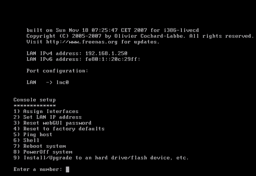

配置网络有两个方面，首先，你需要选择使用哪个网卡；其次，你需要为其分配一个地址。如果你机器中只有一个网卡，那么 FreeNAS 服务器应该已经找到并自动分配它作为局域网（LAN）接口。

### 注意

**如果找不到我的网卡怎么办？**

这可能意味着你机器中的网卡不被 FreeNAS 或更具体地说不被 FreeBSD 支持。你需要更换为一个 FreeBSD 支持的网卡。请查看 FreeBSD 硬件兼容性页面以获取更多信息：[`www.freebsd.org/releases/6.2R/hardware-i386.html`](http://www.freebsd.org/releases/6.2R/hardware-i386.html)

如果你看到类似这样的内容：

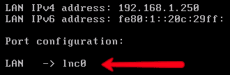

那么网络已经被 FreeNAS 自动识别并分配。

FreeNAS 的默认 IPv4 地址是 192.168.1.250，如果这个地址适合你的网络，那么你可以保持不变。然而，如果你需要更改地址，请按 2 然后按 *ENTER* 键。如果你希望机器通过 DHCP（动态主机配置协议）获取地址，回答 IPv4 DHCP 提问时选择是（y），否则选择否（n）。如果你不使用 DHCP，现在可以输入所需的 IP 地址。接下来，你需要输入子网掩码。如果是 255.255.255.0，输入 24；如果是 255.255.0.0，输入 16；如果是 255.0.0.0，输入 8。此时，你可以跳过默认网关和 DNS 问题（直接按 *ENTER*）。如果你确实想在此时输入默认网关和 DNS 服务器，它们通常是你 Internet 路由器的 IP 地址。我们不会使用 IPv6，因此此时最简单的做法是回答 *yes*，即“是否要使用自动配置 IPv6？”这个问题。这样 FreeNAS 会尝试（并可能失败）获取 IPv6 地址，虽然有一点小延迟，但比手动输入 IPv6 地址要简单！

现在你已经准备好访问网页界面。可以从任何网络上的机器（包括 Windows、Linux 和 OS X 机器）使用网页浏览器访问 FreeNAS 网页界面。在这台客户端机器上，在网页浏览器中输入带有 `http://` 前缀的 FreeNAS 服务器地址。例如：

[`192.168.1.250`](http://192.168.1.250)。

## 配置

第一次访问 FreeNAS 网页界面时，你需要输入用户名和密码。默认的用户名是 *admin*，默认的密码是 *freenas*。

现在你应该已经进入了网页界面。要配置一些存储空间，你需要处理“磁盘”。操作的逻辑顺序是必须先添加磁盘，然后格式化（如果需要），然后挂载。最后，通过配置不同的系统服务如 CIFS 和 FTP 给各种已挂载的磁盘提供访问权限。

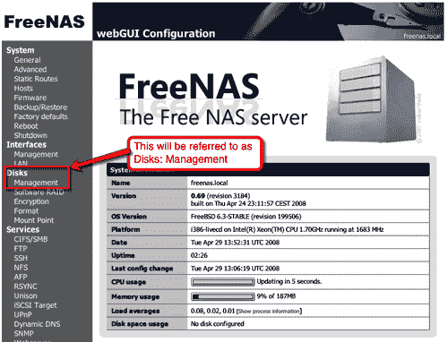

因此，要添加磁盘，转到**磁盘: 管理**。页面右侧有一个带圆圈的**+**符号（第一次可能会被忽略），点击它添加磁盘。在下一页上，选择要添加的磁盘。如果点击下拉菜单，应该看到机器的硬盘、光盘和 USB 闪存磁盘。

### 注意

**FreeBSD 中的磁盘名称**

FreeBSD 中的磁盘命名约定是：

**/dev/ad0:** *是 IDE/ATA 主设备*

**/dev/ad1** *是 IDE/ATA 主从设备*

**/dev/ad2** *是 IDE/ATA 二级主设备*

**/dev/ad3:** *是 IDE/ATA 二级从设备*

**/dev/acd0:** *是检测到的第一台 ATA CD/DVD 驱动器*

**/dev/da0:** *是第一个 SCSI 硬盘，/dev/da1 是第二个，依此类推。*

USB 闪存磁盘使用 SCSI 驱动程序控制，因此它们也会显示为 /dev/daN 驱动器。

确保默认选择了 ad0。页面的其余部分可以不动。点击**添加**将磁盘添加到系统中。然后你需要点击**应用**以使更改生效。现在你将看到一个表格，显示你添加的磁盘，包括其大小和描述。

### 注意

**应用**

在 FreeNAS 中，大多数步骤需要通过点击*应用*按钮（将配置文件保存到磁盘）来应用。通常这个按钮位于页面顶部，在任何表格或配置信息之前。如果你不应用这些更改，界面通常会记住你的更改，但它们不会在系统中生效。重启后，未应用的更改将会消失。在某些页面上，可以执行多个操作，然后一次性应用它们。

接下来，需要格式化磁盘。在**磁盘: 格式**中，选择磁盘 ad0（刚刚添加的）。保持其他设置不变，点击**格式化磁盘**。然后磁盘将会被格式化。格式化命令的低级输出将显示在一个框中。应该以**完成！**结束。

现在需要挂载磁盘。转到**磁盘: 挂载点**。点击圆圈中的**+**（我将其称为“添加圆圈”）。将**类型**保持为*磁盘*，再次选择磁盘*ad0*。你需要输入一个名称，*store*是一个很好的名称，但随意使用任何你想要的描述性名称。

### 注意

**描述性命名**

在设置和配置 FreeNAS 服务器时，你需要为挂载点、共享名称等发明各种名称。尽量用描述性强的名称，但不要过于冗长。Temp、scratch、blob 甚至 zob 可以用于测试，但最好使用更有意义的名称，如 storeage1、storage60gb 或 backupstorage 等。名称中不要使用空格，使用下划线代替，并且一般来说，名称长度不应超过 15 个字符。

虽然在 Web 界面中填写描述不是强制性的，但还是值得使用的。填写完表单后，点击**添加**，然后应用更改。

## 与 Windows 机器共享

现在磁盘已被添加、格式化并挂载，接下来是将其共享到网络上，并赋予其他用户读写权限。FreeNAS 支持许多不同类型的访问协议，在本入门指南中，我们只会介绍 Microsoft 的 CIFS 协议，它主要允许 Windows 机器（但也支持 Apple OS X 和 Linux 机器）访问存储。

1.  1\. 在服务：**CIFS/SMB**中，勾选启用框（在配置数据表的标题处）。此时，除了工作组名称外，你几乎可以保持其他设置不变。我们将保持认证方法为“匿名”，因为这是最容易设置的方式，并且提供对所有人的无限制读写访问权限。

1.  2\. 为确保 Windows 机器能够找到共享存储，我们需要将 FreeNAS 服务器上的工作组名称设置为与将访问共享的 Windows PC 的工作组名称相同。Windows Vista 的默认工作组名称是 WORKGROUP，但请注意，Windows XP 家庭版的默认工作组名称是 MSHOME。

1.  3\. 现在点击**保存并重启**。这将保存你所做的更改并重启 CIFS 服务。

1.  4\. 进入**共享**标签页并点击添加共享。输入共享的名称。重复挂载点名称可能是最安全的做法，因此在这种情况下，输入“store”并同时添加评论。然后点击**..**，在**路径**部分。这将弹出一个简单的文件系统浏览器。你看到的文件位于 FreeNAS 服务器上，而不是本地 PC 上。点击**store**，**/mnt/store/**会出现在小的编辑框中。点击**确定**，你将返回到共享页面。现在，**/mnt/store/**已作为路径被添加。

1.  5\. 保持其他设置不变，点击**添加**，然后应用更改。

现在计算机的第一个硬盘已经格式化、挂载并共享到网络上的其他设备。接下来，我们将在 Windows Vista 机器上访问该共享。

## 测试共享

你可以从任何支持 CIFS 协议的机器进行此测试，包括 Windows 95/98/ME、Windows 2000/XP、Apple OS X 和 Linux。这里，我们将使用 Windows Vista。

1.  1\. 点击 **开始** 菜单中的 **网络**，打开网络和共享中心。窗口出现时，Vista 会自动扫描网络上的共享资源。扫描完成后，你将看到网络上的可用计算机，包括 **FREENAS**。

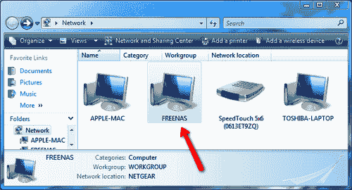

1.  2\. 打开 **FREENAS** 计算机，你会看到你配置的存储区域。双击它，你现在就可以从 Windows 机器内部访问 FreeNAS 服务器了。尝试将一些文件拖放到存储区域中，然后再试着删除它们。

1.  3\. 如果不想通过网络和共享中心访问 FreeNAS 服务器，可以点击 **开始**，输入 **\\freenas** 然后按 *Enter*。这将直接显示 FreeNAS 服务器上可用的共享资源：

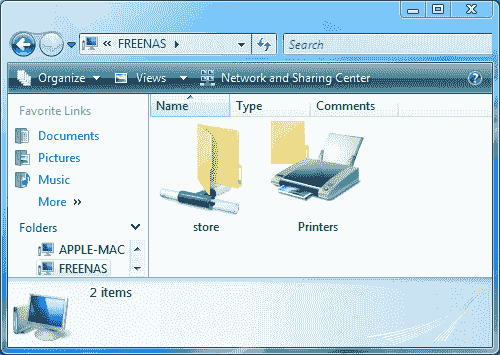

# 安装的详细概述

是时候着手配置一个可用的 FreeNAS 服务器了，为此，我们需要将其启动到一台 PC 上。这个过程有几个步骤。首先，你需要刻录你下载的 ISO 镜像文件到光盘上。然后，需要从光盘启动 PC；这可能需要你在 BIOS 中进行设置，使计算机从光驱启动。接下来，你可以配置 FreeNAS 服务器，让网络上可以使用存储空间。

在使用 LiveCD 启动 FreeNAS 时，FreeNAS 上有两种类型的存储：数据存储和配置存储。数据将保存在 PC 的硬盘上，但配置需要保存在软盘或 USB 闪存盘上。在本示例中，我们将使用 USB 闪存盘来存储配置文件。

## 制作 FreeNAS 光盘

要将 PC 启动到 FreeNAS，你需要一张光盘。你下载的 ISO 镜像文件包含了刻录光盘所需的所有信息，但它需要被写入到实际的光盘中。这个过程通常被称为*刻录*光盘，因为激光通过加热和标记或灼烧表层的方式将数据写入光盘。

你需要一台带有 CD-RW 光驱的 PC 和一张空白的 CD-R 光盘（我建议使用一个知名品牌的 CD-R 光盘以获得最佳效果）。将 FreeNAS 的 ISO 镜像下载到该机器上。带有 CD 刻录机的 PC 应该安装了某些 CD 刻录软件（例如 Roxio Easy CD 或 Nero）。如果你熟悉 CD 刻录软件，直接将 ISO 文件刻录到 CD-R 光盘上即可。

### 注意

如果你不熟悉 CD 刻录软件，或者没有安装任何 CD 刻录软件，那么我推荐使用 ISO Recorder。你可以从[`isorecorder.alexfeinman.com/isorecorder.htm`](http://isorecorder.alexfeinman.com/isorecorder.htm)下载它。

## 从光盘启动

将你新制作的 FreeNAS CD 插入你希望安装 FreeNAS 的机器的 CD 驱动器中，同时将 USB 闪存盘插入 USB 端口。闪存盘将用于存储配置数据。（你也可以使用软盘。如果同时插入了 USB 闪存盘和软盘，FreeNAS 会将配置保存在 USB 设备上。）现在，你需要开启 PC。当 PC 启动时，它会经过所谓的自检（Power On Self Test，POST）过程。在这个过程中，PC 会检查安装的内存大小，并检测已安装的硬盘。在自检后，PC 会尝试从一个硬盘、CD-ROM、软盘甚至 USB 闪存盘启动。PC 选择哪个设备作为启动设备，可以通过内置的设置程序来更改。设置程序允许你修改基本的系统配置设置。这些设置存储在计算机内存的一个特殊的电池供电区域，即使关机时也能保持这些设置。在 POST 过程中，通常会显示一条信息，告诉你如何进入内置设置程序。通常是 *DEL* 键或 *F2* 键，在某些系统中，也可能是 *F10* 键。

你需要进入设置程序检查和/或更改第一个启动设备为 CD-ROM，以便计算机能够从 FreeNAS 启动。每台 PC 的设置程序略有不同，所以你需要到处查找，直到找到所需的设置。三种最流行的设置程序（也称为 BIOS——基本输入输出程序）是 Phoenix 设置程序、Phoenix-Award 设置程序和 AMI 设置程序。

### 注意

有很多种类的 BIOS 设置程序，每个 PC 制造商都会根据自己的需求修改设置程序。以下信息仅是一个“粗略指南”，帮助你熟悉操作。你的 BIOS 设置程序可能与下面的示例有很大不同。最好的信息来源是随 PC 或主板附带的手册。如果你没有手册，大多数 PC 制造商会在他们的网站上提供下载。

### Phoenix BIOS

如果你的机器使用的是 Phoenix BIOS，通常需要按 F2 键进入设置程序。设置程序顶部有一个菜单，你可以使用左右箭头键进行导航，你需要选择 **Boot** 菜单。

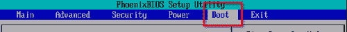

在 **Boot** 菜单页面上，你可以使用上下箭头键选择可用的启动设备。你可以使用 *ENTER* 键展开或收起各个部分。要更改启动顺序，使用 **+** 和 **-** 键。你需要确保 CD-ROM 是列表中的第一个设备。在你更改了启动顺序后，需要进入退出菜单（按右箭头键），然后选择 **Exit Saving Changes**。此时，PC 会重新启动，在 POST 后，它将从 FreeNAS CD 启动。

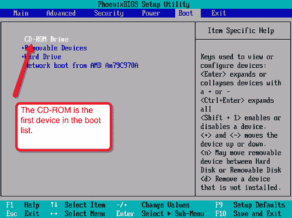

### Phoenix-Award BIOS

如果你的 PC 使用 Phoenix-Award BIOS，通常需要按 DEL 进入设置程序。进入后，你可以使用上下左右键在菜单中导航。进入 *Advanced BIOS Features*，然后使用 **+** 和 **-** 键将 *First Boot Device* 设置为 CDROM。现在，你需要保存更改并退出。按 *ESC* 键会返回主菜单，然后选择 **Save & Exit Setup**。通常，按 *F10* 键也会达到相同效果。此时，PC 会重新启动，如果你正确进行了更改，它会从 FreeNAS CD 启动。

### AMI BIOS

美国 Megatrends 公司（AMI）BIOS 通常会显示一条信息，提示你**按 <DEL> 进入设置**。进入设置后，与 Phoenix 或 Award 的设置程序有很大的不同。在这里，*Tab* 键用于导航，方向键用于更改值。要从一页跳转到下一页，按 *ALT+P* 键。此信息通常也会打印在 BIOS 设置页面的底部。你需要找到变量 *Boot Sequence* 并确保它设置为首先从 CDROM 启动。

## 初次体验 FreeNAS

启动过程分为 4 个独立的部分。首先，PC 会执行其 POST（Power On Self Test）序列。在此过程中，PC 会检查已安装的内存数量（通常可以在屏幕上看到内存计数）以及连接的设备（如硬盘和 CDROM）。然后，它应该开始从 CD 启动。在这一阶段，FreeBSD（FreeNAS 的底层操作系统）将开始启动，可以通过简单的旋转小圆圈（由简单的文本字符如 | - / 和 \ 组成，这些字符动画化呈现出旋转的效果）来识别。第三步是 FreeNAS 启动菜单。这个菜单将只显示五秒钟，你应该让它正常启动，这是默认选项。最后阶段是 FreeNAS 标志的出现，系统将作为 FreeNAS 服务器启动。你可以通过 PC 喇叭发出的短促而悦耳的哔哔声来判断系统是否完全加载。

## 配置网络

FreeNAS 的大部分配置通过网页界面完成，但在你使用网页界面之前，FreeNAS 服务器需要配置为适应你的网络。这是通过连接到运行 FreeNAS 的 PC 的键盘和显示器上的简单文本菜单系统完成的。你可能只需要执行一次此操作，之后这些网络配置信息将保存在 USB 闪存盘（或软盘）中，并且服务器每次启动时都会加载这些配置。

如果你在 FreeNAS 机器上按空格键，FreeNAS 标志会消失，并出现一个简单的菜单。

在这里，你有多个选项，包括重启或关闭系统的选项。前两个选项是关于配置网络的，它们反映了配置网络的两个部分：首先，你需要选择使用哪个网络卡（选项 1）；其次，你需要为其分配一个地址（选项 2）。

如果你的机器只有一张网卡，那么 FreeNAS 服务器应该已经找到了它并自动将其分配为局域网（LAN）接口。

### 注意

**如果找不到我的网卡怎么办？**

这可能意味着你的机器中的网卡不被 FreeNAS 或更具体地说，FreeBSD 所支持。你需要更换一个被 FreeBSD 支持的网卡。请查看 FreeBSD 硬件兼容页面以获取更多信息：[`www.freebsd.org/releases/6.2R/hardware-i386.html`](http://www.freebsd.org/releases/6.2R/hardware-i386.html)

如果你看到以下截图：

那么网络已经被 FreeNAS 识别并自动分配。

### 什么是局域网 IP 地址？

IP 代表互联网协议，它是计算机在互联网上相互通信的基本低级语言。它也用于私人网络（如办公室或家庭网络），将不同的 PC 甚至打印机连接在一起。IPv4 地址由 4 组数字（0 到 255）组成，并以点分十进制表示（意味着每组数字之间有一个点）。例如，192.168.1.250 是一个 IP 地址，它也恰好是 FreeNAS 服务器的默认 IP 地址。就像电子邮件、邮政服务和电话一样，每个目的地（电子邮件账户、邮箱或电话）需要一种唯一的标识方式。这就是 IP 地址的作用；它们使得网络上的每个设备都有一个唯一的标识符，以便消息能够被准确地传送到网络中的正确位置。

### 注意

**如何发音 IP 地址**

如果你需要与某人讨论 IP 地址，最简单的方式是分别说出每个数字。例如，192.168.1.250 不是“one hundred and ninety two dot”，而是“one nine two dot one six eight dot one dot two five zero”。

有两种方式可以为 FreeNAS 服务器获取 IP 地址。第一种是通过 DHCP 服务（动态主机配置协议）自动分配地址，第二种是手动分配地址。

### 注意

**什么是 DHCP？**

动态主机配置协议（DHCP）自动分配 IP 地址和其他 IP 参数（如子网掩码和默认网关）。需要 IP 地址的计算机会向 DHCP 服务器发送请求，服务器将从为此目的预留的地址池中回复一个 IP 地址。DHCP 服务器可以是 PC 或服务器（运行 Windows、OS X 或 Linux），也可以是小型设备，如现代 DSL 调制解调器和防火墙。

DHCP 方法的优点在于 IP 地址的分配完全在后台进行，你无需担心手动设置。缺点是，首先，你的网络中必须已经配置并运行着 DHCP 服务器；其次，DHCP 是从可用地址池中分配地址。这意味着每次 FreeNAS 服务器启动时，它不一定会拥有之前相同的地址。当使用 CIFS 协议时，这不是问题，但如果要访问 Web 界面或使用像 FTP 这样的协议，最好是有一个稳定的 IP 地址进行引用。不过，出于测试 FreeNAS 服务器或了解其工作方式的目的，使用 DHCP 分配的地址现在是可以接受的。

### 注意

事实上，可以通过 DHCP 为某些硬件（包括 FreeNAS 服务器）分配固定的、永久的 IP 地址，但这需要在 DHCP 服务器上进行额外的高级配置更改，这些更改本书无法涵盖。

因此，选择手动设置 IP 地址后，你现在需要获取两条信息。第一条是 FreeNAS 的实际 IP 地址，第二条是所谓的子网掩码。子网掩码也会以点分十进制表示，通常类似于 255.255.255.0。如果你在办公环境中工作，需要与网络管理员联系，他/她会提供所需的信息。如果你是在管理自己的网络，则需要选择一个当前未分配给网络中其他计算机的 IP 地址（同时，这个地址也不能属于网络中任何 DHCP 服务器的地址池）。

在获得了 IP 地址和子网掩码后，你可以为你的网络配置 FreeNAS 服务器。在控制台菜单中选择选项 2。如果你选择了让 DHCP 分配地址，请对关于使用 DHCP 为 IPv4 配置的第一个问题回答“是”（y）。否则回答“否”（n）。

如果你正在手动设置地址，可以现在使用点分十进制输入地址，例如：192.168.1.240。接下来是子网掩码。如果你的子网掩码是 255.255.255.0：输入 24；如果是 255.255.0.0：输入 16；如果是 255.0.0.0：输入 8。此时，你可以跳过默认网关和 DNS 设置（只需按 *ENTER* 键）。

我们不会使用 IPv6，因此最简单的方法是对“是否要使用 IPv6 自动配置？”这个问题回答“是”。这将导致 FreeNAS 尝试（并且可能失败）获取 IPv6 地址时出现短暂的延迟，但比手动输入 IPv6 地址要简单！

在成功设置 IP 地址后，屏幕上会显示一条小信息，邀请你通过在浏览器中打开列出的 URL 来访问 Web 界面。如果你使用了 DHCP，请记下列出的 URL。如果你手动设置了 IP 地址，请检查列出的 URL 是否与设置的 IP 地址相同，并在其前面加上 [http://](http://)。

现在你可以访问 Web 界面了。

### 注意

**什么是 IPv4 和 IPv6？**

互联网协议自 1980 年代中期以来就已存在，在设计时并未预见到互联网的普及。连接到互联网的计算机数量正在迅速增长，已经超出了原始协议的寻址能力。为此，设计了新的 IP 协议版本，并被命名为 IPv6（即 IP 版本 6），而旧版本则被称为 IPv4（即 IP 版本 4）。FreeNAS 支持这两种版本的互联网协议。在本书中，我们将只专注于 IPv4，因为它仍然是这两种协议中最为流行的。

# 基本配置

现在 FreeNAS 服务器已经启动并运行，是时候访问 Web 界面了。在与 FreeNAS 服务器同一网络上的计算机上打开浏览器，输入 FreeNAS 服务器的 URL。该地址应与服务器的 IP 地址相同，并以 [http://](http://) 开头。默认的 URL 是 [`192.168.1.250`](http://192.168.1.250)。

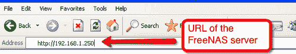

第一次访问 FreeNAS Web 界面时，系统会要求输入用户名和密码。默认的用户名是*admin*，默认的密码是*freenas*。

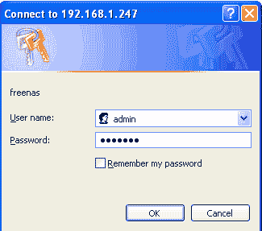

## FreeNAS Web 界面

现在你应该已经可以在浏览器中看到 Web 界面。界面分为两大部分：左侧是菜单，右侧是配置页面。菜单分为多个部分：系统、网络接口、磁盘、服务、访问、状态、诊断和高级。

### 注意

当谈到某个特定的菜单项时，我们会使用“子部分: 菜单项”的格式来帮助你快速找到正确的菜单选项。例如，位于磁盘子部分中的管理选项，我们将称其为**磁盘: 管理**。

### 系统

这一部分是用于系统级配置和操作的，例如你可以在这里更改用户名和密码，备份和恢复配置数据，以及关闭或重启服务器。

### 网络接口

在这里，你可以像通过控制台菜单一样配置 FreeNAS 服务器的网络。你可以更改用于 Web 界面的网卡，并为其分配永久或自动的 IP 地址。

在这里进行更改时要小心，因为有些更改需要重启才能生效。如果你更改了任何寻址信息，你需要使用新的 IP 地址访问 Web 界面。

### 磁盘

这个菜单部分用于管理服务器上的磁盘。在这里，你可以设置磁盘冗余（RAID）、控制加密、格式化磁盘，并将磁盘挂载到服务器上。

### 服务

各种访问协议如 CIFS、NFS 和 FTP 都可以从这里控制。每个服务都可以单独管理，默认情况下没有启用任何服务，因此在您能够访问存储在 FreeNAS 服务器上的文件之前，您需要启用至少一个服务。

### 访问

FreeNAS 提供的大多数服务使用某种形式的用户列表来控制谁可以访问，谁不能访问。本节用于定义这些用户及其所属的组，并将 FreeNAS 服务器连接到其他目录服务。

### 状态

状态菜单有几个报告工具，您可以通过这些工具查看 FreeNAS 服务器的当前状态，包括概述、内存使用情况、磁盘使用情况和网络使用情况。您还可以配置定期发送有关服务器状态的电子邮件。

### 诊断

诊断菜单包含不同的工具，帮助诊断 FreeNAS 服务器的任何问题，包括所有重要服务的日志和来自硬盘及其他系统模块的诊断信息。

### 高级

高级部分提供了一些简单的工具，用于在操作系统级别执行命令，不熟悉 FreeBSD 的用户不应使用。

## 添加磁盘

要配置一些存储空间，您需要使用“磁盘”。与磁盘工作的逻辑顺序如下：

1.  1\. 首先，需要告诉 FreeNAS 它可以使用哪些磁盘。磁盘可以是物理硬盘，也可以是 CD-ROM 或 iSCSI 目标。

1.  2\. 接下来，需要对磁盘进行格式化（如果需要的话）。

1.  3\. 之后，磁盘需要被挂载。这意味着它们被用作工作磁盘空间，可以被系统使用。在挂载之前，磁盘不可用作存储空间。

1.  4\. 最后，存储空间需要通过一种访问协议提供给网络，例如 CIFS、NFS 或 FTP。为此，需要启用相应的服务并配置使用磁盘。

下面是详细步骤：

1.  1\. 进入 **磁盘：管理**。

    +   在页面右侧有一个带圆圈的 + 号（以下称为“添加圆圈”），点击它可以添加磁盘。

    +   在下一页，选择您要添加的磁盘。如果点击下拉菜单，您应该能看到计算机的硬盘、光驱和 USB 闪存磁盘。

        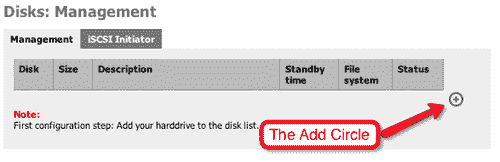

        ### 注意

        **FreeBSD 中的磁盘名称**

        FreeBSD 中的磁盘命名约定是：

        **/dev/ad0:** *是 IDE/ATA 主硬盘*

        **/dev/ad1** : *是 IDE/ATA 主从硬盘*

        **/dev/ad2** : *是 IDE/ATA 次级主硬盘*

        **/dev/ad3:** *是 IDE/ATA 次级从硬盘*

        **/dev/acd0:** *是检测到的第一个 ATA CD/DVD 驱动器*

        **/dev/da0:** *是第一个 SCSI 硬盘，/dev/da1 是第二个，依此类推。*

        USB 闪存磁盘使用 SCSI 驱动程序进行控制，因此它们也会显示为 **/dev/daN** 驱动器。

    +   确保选择了 ad0（默认情况下应该是选中的）。

    +   页面其余部分可以保持不变。

    +   点击 **Add** 将磁盘添加到系统中。

    +   然后，您需要点击 **Apply**，以使更改生效。现在您将看到一张显示已添加磁盘的表格，包括其大小和描述。

        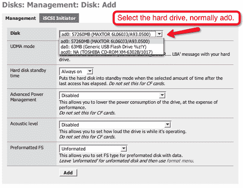

1.  2\. 接下来，磁盘需要格式化。请注意，此磁盘上的所有数据将丢失。在 **Disks: Format** 中，选择磁盘 ad0（您刚刚添加的磁盘）。保持其他设置不变。默认情况下，这意味着我们将使用 UFS 格式化磁盘，UFS 是 FreeBSD 的原生文件系统。如果需要，您可以输入卷名称。点击 **Format disk**，磁盘将被格式化。格式化命令的低级输出将显示在一个框中。格式化磁盘所需的时间取决于磁盘的大小。格式化完成后，屏幕上会显示 **Done!**

1.  3\. 现在需要挂载磁盘。前往 **Disks: Mount Point**。点击添加圆圈。将 **Type** 保持为 *Disk*，然后再次选择磁盘 *ad0*。您需要输入一个名称，*store* 这个名称就可以，但也可以自由选择任何您喜欢的描述性名称。

    ### 注意

    **具有描述性**

    在设置和配置您的 FreeNAS 服务器时，您需要为挂载点、共享名称等发明各种名称。尽量简洁且具有描述性，不要啰嗦。用于测试的名称如 temp、scratch、blob，甚至 zob 都可以，但建议使用更有意义的名称，如 storage1、storage60gb 或 backupstorage 等。

    虽然在 Web 界面中填写描述不是强制性的，但建议使用。完成表单后，点击 **Add** 然后应用更改。

    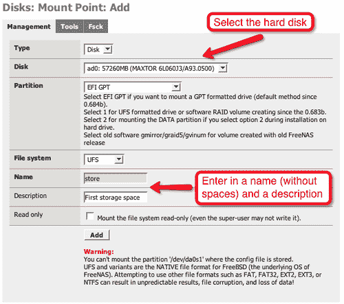

1.  4\. 现在磁盘已经添加、格式化并挂载，接下来是共享它到网络，并赋予其他用户读写权限。FreeNAS 支持许多不同类型的访问协议。首先，我们将查看 Microsoft 的 CIFS 协议，它主要允许 Windows 计算机（但也支持 Apple OS X 和 Linux 计算机）访问存储。接着，我们将进行第二次测试，配置 FTP 协议。

## 通过 CIFS 访问磁盘

1.  1\. 在 Services: **CIFS/SMB** 中，勾选启用框（在配置数据表的标题中）。此时，除了工作组名称外，几乎可以保持其他设置不变。

1.  2\. 为确保 Windows 机器能够找到共享存储，我们需要将 FreeNAS 服务器上的工作组名称设置为与将访问共享的 Windows 计算机的工作组名称相同。Windows Vista 的默认工作组名称是 WORKGROUP，但请注意，Windows XP 家庭版的默认工作组名称是 MSHOME。

### 注意

**检查工作组**

在 Windows XP 中，你可以通过点击**开始**，然后右键点击**我的电脑**来发现你的工作组名称。现在点击**属性**。在弹出的**系统属性**对话框中，点击**计算机名称**标签。你可以通过点击**更改...**按钮来更改工作组名称。

在 Windows Vista 中，你可以通过点击**开始**，然后右键点击**计算机**来找到你的工作组名称。现在点击**属性**。工作组名称位于*计算机名称、域和工作组设置*中。你可以通过点击**更改设置**，然后点击**更改...**按钮来更改工作组名称。

1.  3\. 将身份验证方法保持为**匿名**，因为这是最容易设置的方式，并且为每个人提供了不受限制的读/写访问权限。然后点击**保存并重启**。这将保存你所做的更改并重启 CIFS 服务。

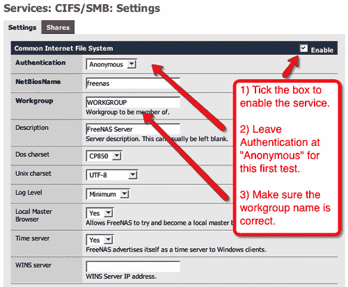

1.  4\. 现在，进入**共享**标签并点击添加按钮。输入共享的名称。重复挂载点的名称是最安全的做法，所以在这种情况下使用*store*，并添加一个备注。然后点击路径部分的**...**。这将打开一个简单的文件系统浏览器。你看到的文件在 FreeNAS 服务器上，而不是你本地的 PC 上。点击**store**，**/mnt/store/** 将出现在小的编辑框中。点击**确定**，你将返回到共享页面。现在，**/mnt/store/** 已作为路径添加。

1.  5\. 其他设置保持不变，点击**添加**，然后应用更改。

现在，计算机的第一个硬盘已经格式化、挂载，并共享给网络中的其他设备。接下来，我们将从一台 Windows Vista 机器访问这个共享。

### 测试共享

你可以从任何支持 CIFS 协议的机器进行此测试，包括 Windows、OS X 和 Linux。这里我们将使用 Windows Vista：

1.  1\. 通过点击开始菜单中的**网络**打开网络和共享中心。当窗口出现时，Vista 会自动扫描网络中共享的资源。扫描完成后，你将看到网络中可用的机器，包括 FREENAS。

1.  2\. 打开 FREENAS 计算机，你会看到你配置的*store*存储区。双击它，你现在就能在 Windows 机器中“进入” FreeNAS 服务器了。尝试将一些文件拖放到*store*区中。然后再试着删除它们。

1.  3\. 要访问 FreeNAS 服务器，可以不使用网络和共享中心，点击**开始**，输入**\\freenas**，然后按*Enter*键。这样你可以直接查看到 FreeNAS 服务器上可用的共享。

## 通过 FTP 访问

文件传输协议（FTP）是一种快速且稳定的网络文件传输协议。FTP 是一种客户端/服务器协议，通常用于将文件从一台计算机传输到另一台计算机，通常是一次性的。建立连接后，文件传输完成，连接关闭。这个协议常用于允许用户从互联网下载文件。在 NAS 的应用场景中，它对于在网络上提供软件仓库非常有用（例如软件、公司模板、以及杀毒软件更新）。

1.  1\. 要启用 FTP 服务，请进入**服务：FTP**并勾选启用。

1.  2\. 现在点击**保存并重启**。

这将保存你所做的更改并重启 FTP 服务。默认情况下，启用匿名 FTP 登录。这意味着任何用户都可以登录并访问存储。

### 测试 FTP 访问

所有现代操作系统，包括 Windows、Linux 和 OS X，都包含命令行 FTP 客户端。这些客户端使用起来非常简单，但如果你习惯使用图形用户界面，学习起来可能会有点困难。一个适用于 Windows 的免费 FTP 客户端是 Core FTP，你可以从[`www.coreftp.com`](http://www.coreftp.com)下载。

1.  1\. 要使用 Core FTP 测试 FreeNAS 的 FTP 服务，首先下载并安装它。

1.  2\. 启动 Core FTP 时，第一个看到的窗口是**站点管理器**。在这里，你可以输入连接服务器的参数。

1.  3\. 在**站点名称**字段中输入**FreeNAS_Server**，以便记住这个特定的服务器连接。

1.  4\. 在**主机/IP/URL**字段中输入 FreeNAS 服务器的 IP 地址。

1.  5\. 勾选**匿名**，这样可以在不输入用户名和密码的情况下连接（实际上，用户名是匿名，Core FTP 会自动为你填入）。

1.  6\. 现在点击**连接**。

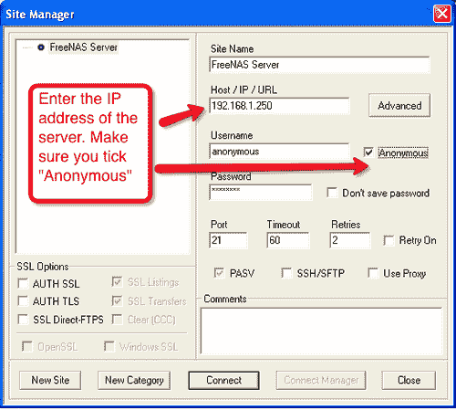

一旦你点击*连接*，Core FTP 将连接到 FreeNAS 服务器。在左侧，你会看到 Windows 机器上的文件，在右侧，你会看到 FreeNAS 机器上的文件。FTP 服务将你带到顶级目录，所以你需要双击*store*以进入之前配置的*store*文件夹。你可以尝试从 Windows 机器中拖动一些文件，看看它们是否被复制到 FreeNAS 服务器上。

最后，你可以尝试通过 CIFS 再次访问 FreeNAS 服务器（只需点击**开始**并输入**\\freenas**，然后打开*store*共享文件夹），你将看到刚刚通过 FTP 复制过来的文件。

### 注意

**使用 Windows 内置 FTP 客户端**

现代版本的 Windows 也内置了一个简单的 FTP 客户端，可以通过 Windows 资源管理器打开。你可以通过在我的电脑（或 Internet Explorer）地址栏中输入**ftp://192.168.1.250**（如果这个不是你的 FreeNAS 服务器的 IP 地址，请相应修改）来建立与 FreeNAS 服务器的 FTP 连接。从这里，你可以像操作本地硬盘一样拖放文件，并使用 Windows 资源管理器。

# 安装到硬盘

直到现在，FreeNAS 一直在从“LiveCD”运行，这意味着它从 CD 启动并从内存运行，无需将操作系统复制到硬盘。FreeNAS 提供了将其安装到硬盘或 USB 闪存盘的选项，安装后将从硬盘或 USB 闪存盘启动，而无需使用 CD。对于硬盘安装，配置数据将保存在硬盘上，而不是保存在 USB 闪存盘或软盘中。

安装 FreeNAS 的首选方式是将其安装到 USB 闪存盘上，因为这样可以释放一个 IDE 或 SCSI 通道用于额外的存储。FreeNAS 已针对闪存盘进行了优化。为了避免频繁写入导致闪存盘损坏（过多的写操作），FreeNAS 的嵌入式版本在从闪存盘启动后，会直接从内存中运行。要使用 USB 闪存盘版本，您的 BIOS 必须支持从 USB 闪存盘启动。

### 注意

在继续之前，您应该注意，安装 FreeNAS 到硬盘上会清除该硬盘上的所有数据。

安装 FreeNAS 到硬盘时，您可以选择将硬盘分为两个部分。第一个是引导分区，其中将包含 FreeNAS 服务器。这只是一个小分区，其余的磁盘将作为较大的数据分区。

要将 FreeNAS 安装到硬盘，您需要返回控制台（因为这无法从 Web 界面完成）。

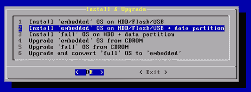

### 注意

关于“嵌入式”与“完整版”之间的区别，请参见下面的*嵌入式与完整版*部分。

1.  1\. 选择选项**9**，然后选择**2**，以将 FreeNAS 的“嵌入式”版本安装到带数据分区的硬盘上。

1.  2\. 系统会显示安装将执行的操作摘要。选择**OK**以继续。

1.  3\. 接下来，系统会要求您确认 CDROM 设备的名称（该 CDROM 包含 FreeNAS 文件）。

1.  4\. 然后，您需要选择您希望安装 FreeNAS 的硬盘。系统会列出所有可用的硬盘。您需要将 FreeNAS 安装到 ad0，这是主要的主 IDE 驱动器。如果您使用的是 SCSI 硬盘，应该选择 da0。请注意，如果您插入了 USB 闪存盘，它也可能会显示为 da0，因此不要将其与真正的 SCSI 硬盘混淆。

1.  5\. 系统现在将开始安装。

一旦安装了 FreeNAS，控制台将显示成功消息。此时，理解以下几点非常重要：

1.  1\. 安装了 FreeNAS 的磁盘现在已被分区为两个部分。这两个分区分别称为 ad0 分区 1（简称 ad0p1）和 ad0 分区 2（ad0p2）。分区 1 包含 FreeNAS 软件，分区 2 用于存储数据。

1.  2\. 您需要重新访问**磁盘：挂载点**页面，因为磁盘的底层结构发生了变化，任何先前的挂载点可能无效。

1.  3\. 您无需再次格式化 ad0。它已经为您使用 UFS 进行了格式化。

1.  4. 您需要将磁盘从 CD 驱动器中取出并重启机器。为此，请移除磁盘，按 *Enter* 返回安装子菜单，然后选择 *EXIT* 返回主菜单，最后使用选项 **7** 重启机器。

要挂载分区 2，您需要进入 **磁盘：挂载点** 页面。如果在安装 FreeNAS 时已为磁盘定义了现有的挂载点，您需要先将其移除，然后继续操作。要挂载分区 2，点击添加按钮，选择磁盘（可能是 ad0 或 da0），然后选择分区 2。这与您之前使用整个磁盘时不同。分区 2 是数据分区，而分区 1 包含 FreeNAS 软件。填写名称和描述后点击 **添加**。

之后，您可以像之前一样启用 CIFS 和 FTP 等服务。

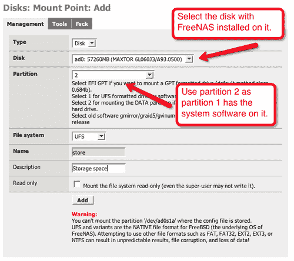

## 嵌入版与完整版

当您进入安装子菜单时，您会看到还有一个所谓的 FreeNAS “完整版”安装。这并不意味着它比“嵌入版”有更多功能或更完整。而是它是一种像传统操作系统一样安装 FreeNAS 的方式。文件会安装到硬盘上，如果编辑或删除文件，这些更改将是永久性的。嵌入版则是从 RAM 运行（并最初从硬盘加载），对操作系统文件的任何更改都将是临时性的，重启系统后它会恢复到原始状态。这意味着完整版可以进行调整和更改，这对于开发 FreeNAS 插件的人来说是个好事，但也意味着不熟悉 FreeBSD 的人可能会不小心破坏系统。然而，嵌入版增加了一层保护，如果出现问题，重启将恢复系统文件到已安装的状态。

### 注意

本讨论涉及的是系统文件，而不是通过 Web 界面操作更新和控制的配置文件。重启将**不会**恢复配置文件到先前的状态，除非更改尚未应用。

推荐的安装 FreeNAS 的方式是使用嵌入版。只有在以下情况之一成立时，您才应该考虑使用完整版：

+   您需要为您的 FreeNAS 服务器安装额外的 FreeBSD 软件包。

+   您需要自定义根文件系统的大小。

+   您的系统内存不足，需要从硬盘运行 FreeBSD，而不是从 RAM 磁盘运行。

# 从先前版本升级 FreeNAS

如果您使用的是 FreeNAS 的 LiveCD 版本，那么升级非常简单。只需下载新版本并将其刻录到 CD 上，然后使用新 CD 重启 FreeNAS 服务器。请始终记得查看 FreeNAS 网站，以获取有关升级的任何信息，特别是关于配置文件格式等内部更改。

如果您已经在硬盘（或 USB 闪存盘）上安装了 FreeNAS，那么可以通过 Web 界面进行升级。在 FreeNAS 网站上，您可以找到嵌入式版本的 FreeNAS 进行下载。这些文件不是像 LiveCD 版本那样的 ISO 文件，而是用于升级现有安装的文件。嵌入式下载是一个`.img`文件。下载正确的文件并将其保存在硬盘上。进入 Web 界面，找到**系统：固件**页面，点击**启用固件上传**，然后使用**浏览..**按钮找到您下载的文件。

最后，点击**升级固件**。耐心等待，FreeNAS 将在升级完成后重启，您的配置数据将被保留。

### 注意

升级固件后，切勿中断升级过程。一旦开始固件更新，至少需要 128 MB 的内存才能完成更新。升级固件之前，您应始终备份系统配置。您可以在“系统：备份/恢复”页面进行此操作。

# 摘要

本章中，我们已经安装并配置了 FreeNAS 服务器。我们从 LiveCD 磁盘启动 FreeNAS 服务器，并配置了一个通过 CIFS 和 FTP 访问的简单磁盘。我们还介绍了如何将 FreeNAS 安装到硬盘上以及如何升级它。

在下一章中，我们将详细了解您可以通过不同方式连接到 FreeNAS 服务器，包括从 Windows 机器、OS X 和 Linux 系统连接。
