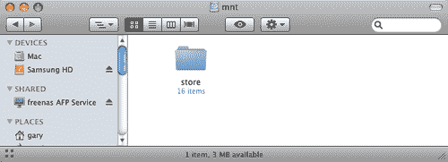

# 第四章 连接到 FreeNAS

FreeNAS 服务器的强大之处在于许多不同的操作系统可以连接到它并使用它的服务。在本章中，我们将探讨 FreeNAS 支持的不同服务和协议，并展示如何在 Windows、OS X 和 Linux 等平台上使用 FreeNAS 服务器进行文件共享、备份和流媒体处理。

# 引言

FreeNAS 服务器是“多语言”的，因为它可以通过多种协议与不同类型的计算机系统通信。在详细了解每个协议之前，值得先整体了解它们，看看每个协议的存在意义以及它最适合处理哪些任务。

下表列出了每个协议及其可以连接到 FreeNAS 服务器的计算机类型（Windows、Apple Mac 等）。某些协议是某个平台的原生协议，例如 CIFS 是 Windows 机器的原生协议，但其他操作系统如 OS X 也能“支持” CIFS。同时，还列出了该协议的主要用途。

|   | Windows | OS X | Linux/UNIX | 用途 |
| --- | --- | --- | --- | --- |
| CIFS | 是的，原生支持。 | 是的，内置支持。 | 是的，内置支持。 | 文件共享 |
| NFS | 是的，需要第三方软件。 | 是的，原生支持。 | 是的，原生支持。 | 文件共享 |
| FTP | 是的，内置支持，或者你可以使用第三方软件。 | 是的，内置支持，且你可以使用第三方软件。 | 是的，内置支持，且你可以使用第三方软件。 | 上传和下载文件 |
| RSYNCD | 是的，需要第三方软件。 | 是的，内置支持，你也可以使用第三方软件。 | 是的，内置支持。 | 备份与同步 |
| Unison | 是的，需要第三方软件。 | 是的，需要第三方软件。 | 是的，需要第三方软件。 | 备份与同步 |
| AFP | 否。 | 原生支持。 | 否。 | Apple 的文件共享 |
| UPnP | 是的，需要第三方软件。 | 是的，需要第三方软件。 | 是的，需要第三方软件或专门的发行版（见下文）。 | 流媒体 |
| iSCSI | 是的，一些 Windows 版本内置支持，例如 Windows Vista。 | 是的，需要第三方软件。 | 是的，内置支持。 | 使用 IP 上的 SCSI 协议连接远程原始磁盘 |

在本章中，我们将详细探讨各种协议。为了帮助你理解，最好有一个正在运行的测试 FreeNAS 服务器，并且你已经按照第二章的快速安装和配置指南进行了操作。

# 通过 CIFS 连接

通用互联网文件系统（CIFS）是访问远程 Windows 计算机文件的标准方式。它由微软开发并维护，用于其 Windows 平台，此外，CIFS 还在包括 OS X 和 Linux 在内的大多数主要操作系统上通过第三方软件实现，其中最流行的叫做 Samba。Samba 是一个开源软件，它为 CIFS 客户端提供远程文件访问服务，支持多个平台（包括 Windows 客户端）。Samba 已包含在 FreeNAS 服务器中。

CIFS 的功能实际上比仅仅访问文件要大。通过它，网络上的其他资源，如打印机，也可以共享。但对于 FreeNAS，CIFS 用于共享服务器上的磁盘，并使其他理解 CIFS 协议的计算机能够访问它们。这意味着 Windows、Linux 和 OS X 机器都可以通过 CIFS 协议访问 FreeNAS 服务器上的文件。

### 注意

有时，在阅读 CIFS 相关内容时，您可能会看到“SMB”或“服务器消息块”（Server Message Block）这个术语。SMB 是 CIFS 协议的原始名称，它源自 IBM 和后来的微软的工作。1996 年，SMB 被重命名为 CIFS。

## 配置 FreeNAS 服务器上的 CIFS

在尝试通过 CIFS 将另一台计算机连接到 FreeNAS 服务器之前，您需要确保在 FreeNAS 服务器上正确配置了 CIFS。

1.  1\. 转到服务：**CIFS/SMB**。此页面包含两个标签，首先是 **设置** 页面，然后是 **共享** 页面。首先，确保通过勾选配置表标题栏中的“启用”框来启用该服务。

1.  2\. 要使 CIFS 在默认设置下工作，您需要至少设置认证系统、NetBios 名称和工作组。认证暂时应保持为匿名。我们将在下一章中深入讨论 FreeNAS 中的认证和用户管理。NetBios 名称是 FreeNAS 服务器在 Windows 网络中使用的名称。当您想要访问服务器时，Windows 允许您使用一个友好的名称，而不是 IP 地址。在本示例中，我们将使用名称 FreeNAS。最后，您需要输入工作组。所有 Windows 计算机都属于一个工作组或一个域。

    ### 注意

    **工作组和域**

    家庭网络和小型办公室局域网使用工作组，工作组本质上是共享相似标签或名称的计算机集合。在家庭网络中，通常只有一个名为“WORKGROUP”（如果主要使用 Windows XP 计算机，则可能是 MSHOME）的工作组。对于小型办公室环境，可能有 2 或 3 个工作组，分别是“SALES”（销售）、“ENGINEERING”（工程）和“ACCOUNTS”（财务）。工作组将计算机连接在一起，这样当查看网络时，这些计算机会被分组在一起。工作组中的计算机通常不超过十到二十台，且所有计算机必须在同一局域网内。

    较大的企业网络使用域而非工作组。在域中，存在一台服务器（称为域控制器），它负责控制该域中的资源和安全性。一旦用户拥有域帐户，他们就可以登录域内的任何计算机，而不需要在任何特定机器上拥有本地帐户。域可以包含数千台计算机，分布在多个网络中。

1.  3\. 输入 FreeNAS 服务器的工作组名称。如果你网络中有许多 Windows XP 机器，它可能是 WORKGROUP，或者是 XPHOME。

1.  4\. 下一步是配置共享在网络上的磁盘。点击页面底部的 **保存并重启**，然后点击顶部的 **共享** 标签。在这里，你可以添加通过 CIFS 协议共享的磁盘。你只能共享已配置的磁盘。如果有需要添加到 FreeNAS 的磁盘，请前往磁盘菜单。有关更多信息，请参阅第二章的快速入门指南，或查看第六章获取高级信息。

1.  5\. 点击添加圆圈。现在你进入了 **服务：CIFS/SMB：共享：添加** 页面。这里的最少数据是你要为共享指定的 **名称**，关于共享的注释或描述，以及共享的位置——路径。

1.  6\. 名称和注释应该很容易填写。对于这个示例，我们将分别使用 store 和 storage place 作为名称。现在是路径部分。在 FreeNAS 中，所有磁盘都挂载在 **/mnt** 目录下。这意味着路径将类似于 **/mnt/diskname**。要找到正确的路径名称，请点击 **...**，这将弹出一个新窗口。


在顶部，你会看到 **/mnt**，然后更下方是 **store**。这就是在 **磁盘：挂载点：添加** 中配置的磁盘名称。点击 store，路径将更改为 **/mnt/path**。


1.  7\. 点击 **确定**，然后点击 **添加**，最后应用更改。

此时，CIFS 已配置完成并准备就绪。在了解不同版本的 Windows 以及 OS X 和 Linux 如何使用 CIFS 连接到 FreeNAS 之前，让我们详细了解一下其他参数。

### CIFS 设置说明

| 参数 | 含义 |
| --- | --- |
| 描述 | 服务器描述。这个字段可以留空，但你可能会发现添加描述会很有用。 |
| Dos 字符集 | 这是 FreeNAS 与 Windows 9x/Me 客户端通信时使用的字符集。它将与所有较新的客户端进行 Unicode 通信。默认是 CP850，这对于英语和其他西欧语言非常合适。 |
| Unix 字符集 | 这是 FreeNAS 内部使用的字符集。默认是 UTF-8，适用于大多数系统，并涵盖所有语言的所有字符。 |
| 日志级别 | 设置发送到日志文件的日志/调试消息的数量。可以在“诊断：日志：系统”中查看这些信息。除非你正在尝试解决 CIFS 连接问题，否则应将其保持为最低。 |
| 本地主浏览器 | 允许 FreeNAS 尝试成为本地主浏览器。在“我的网络邻居”（或 Vista 中的等效位置）中，图标表示计算机。本地主浏览器收集信息以创建浏览列表。除非你在域中运行 FreeNAS，否则可以将此项安全地设置为“是”。 |
| 时间服务器 | 如果你的 FreeNAS 服务器有准确的时钟，你可以指示它将自己作为 SMB 时间服务器向 Windows 客户端广播。 |
| WINS 服务器 | WINS（Windows 网络名称服务器）允许 FreeNAS 服务器发现其他网络上计算机的友好 CIFS 名称。你可以通过将其指向 WINS 服务器的 IP 地址来设置 FreeNAS 使用网络上的其他 WINS 服务器。如果你仅在本地局域网中使用 FreeNAS，那么可以将此项留空。 |

### CIFS 高级设置

这些是高级参数，只有在你知道自己在做什么并且了解为什么要更改它们时，才应进行更改。在 99.9% 的情况下，这些参数可以保持不变。

| 参数 | 含义 |
| --- | --- |
| 创建掩码 | 每个在 FreeNAS 上创建的数据文件都有一些默认的读写权限。使用此选项覆盖文件创建权限。（默认 0666）。有关更多信息，请参阅下面的提示。 |
| 目录掩码 | 在 FreeNAS 服务器上创建的所有目录都有默认的读写权限。使用此选项覆盖目录创建权限（默认 0777）。有关更多信息，请参阅下面的提示。 |
| 发送缓冲区大小 | 发送缓冲区的大小（默认 16384）。对于 Windows 95/98，你需要使用 8192 缓冲区大小。 |
| 接收缓冲区大小 | 接收缓冲区的大小（默认 16384）。对于 Windows 95/98，你需要使用 8192 缓冲区大小。 |
| 大文件读写 | 使用 Windows 2000 引入的新 64k 流媒体读写变种 SMB 请求。 |
| 扩展属性支持 | 扩展属性支持。允许客户端尝试在共享上存储 OS/2 风格的扩展属性。 |

### 注意

**创建掩码**

在 FreeBSD（以及大多数 UNIX 操作系统）中，每个文件或目录有三个级别的读/写权限：用户、组和世界。可以在每个级别设置读取、写入或执行文件的权限。

当 FreeNAS 创建通过网络复制的文件时，会为该文件设置一组默认的文件权限。这是由默认的创建和目录掩码决定的（见上文）。

使用数字方案，创建或目录掩码有四个数字位置，始终从 0 开始，例如 0744，表示三个级别。左侧的第一个数字表示“用户”，中间的数字表示“组”，右侧的数字表示“世界”。以下是每个数字的含义：

0 = 无访问权限，1 = 仅执行，2 = 仅写入，3 = 写入和执行，4 = 仅读取，5 = 读取和执行，6 = 读取和写入，7 = 读取、写入和执行（完全访问）。

### 添加共享时的选项

与一般的 CIF 设置类似，当你在 **服务：CIFS/SMB：共享：添加页面** 中添加共享时，有几种不同的选项可供选择。这里简要介绍这些选项及其作用。

| 参数 | 含义 |
| --- | --- |
| 可浏览 | 该设置控制是否在网络视图和浏览列表中显示此共享。如果不可浏览，该共享仍然可访问，但只能在直接指定地址时访问。 |
| 继承权限 | 新文件和目录的权限通常由创建掩码和目录掩码控制，但继承权限参数会覆盖这些设置。这在有很多用户的系统中特别有用，可以让每个用户灵活使用同一个共享。 |
| 回收站 | 这将在共享上创建一个回收站。如果你创建了回收站，你必须手动清空它。 |
| 允许主机 | 该参数是一个由逗号、空格或制表符分隔的主机集，允许访问此共享。使用关键词 ALL 允许所有人访问。如果不填写此字段，则会禁用此设置。 |
| 拒绝主机 | 该参数是一个由逗号、空格或制表符分隔的主机集，不允许访问此共享。在列表冲突时，允许列表优先。如果需要默认拒绝所有主机，请使用关键词 ALL（或子网掩码 0.0.0.0/0），然后明确指定允许访问的主机。若不填写此字段，则会禁用此设置。 |

## 映射网络驱动器是什么意思？

当通过网络访问文件时，有两种方式可以找到数据。一种是通过 *我的网络邻居*（或根据你 Windows 版本不同而名称略有不同）浏览到它。在这里，你可以找到一台计算机，然后逐层深入，直到找到你想要的文件夹。另一种方法是将远程共享文件夹挂载为你计算机上的一个驱动器。这个 *网络驱动器* 会始终带你到远程服务器上正确的位置，你的数据所在。你还可以配置它在每次启动 Windows 时自动挂载。这对于像 FreeNAS 服务器这样的情况尤其有用，因为它提供的存储空间始终可以在你的 PC 上访问。

## 通过 Windows Millennium 连接 CIFS

双击 **我的网络邻居**。在这里，你可以浏览本地网络并查看最近访问的网络资源。

1.  1\. 双击 **整个网络** 将带你进入本地网络上的工作组和域列表。在一个小网络中，这可能只有一个工作组，最可能的是 **WORKGROUP** 或 **MSHOME**。


1.  2\. 双击 **工作组**，你将看到该工作组中的计算机列表。

1.  3\. 查找 FreeNAS 服务器，它可能叫做 **Freenas**。现在双击它，你将看到 FreeNAS 服务器上可用的共享列表。

1.  4\. 如果你使用的是根据第二章快速安装指南设置的测试 FreeNAS 服务器，那么你只会看到一个名为*store*的共享。如果双击*store*，你将能够访问 FreeNAS 服务器上的该存储空间。你可以尝试将一些文件复制到*store*中，看看 FreeNAS 服务器如何运作。

    ### 注意

    为了节省寻找 FreeNAS 服务器的时间，你可以直接在“我的网络位置”的地址栏中输入其地址。地址的格式为**\\server\share**，所以在我们的示例中，我们将使用**\\freenas\store**。

    现在只需按下*Enter*，你就可以访问 FreeNAS 服务器了。

1.  5\. 在 Windows Millennium 中有几种方法可以映射网络驱动器。一种方法是在“我的网络位置”中打开 FreeNAS 机器。与其双击*store*，不如右键单击它。这将弹出一个小菜单。现在点击**映射网络驱动器...**


+   现在，选择你希望映射到该网络共享的驱动器字母，如果希望每次启动 Windows 时自动挂载该驱动器，请勾选**开机时重新连接**。

完成此操作后，网络驱动器将出现在*我的电脑*中，你可以像使用其他硬盘一样使用它。

## 使用 Windows XP 的 CIFS

假设你的 FreeNAS 和 Windows XP 计算机在同一个工作组内，当你打开*我的网络位置*时，*store*共享应该会自动显示。如果没有显示，请稍等片刻（因为有时 Windows 需要几分钟来整理工作组中所有可用资源的列表），然后按*F5*刷新显示。

另一种访问 FreeNAS 服务器的方法是点击窗口左侧的**查看工作组计算机**，这是**网络任务**面板中的选项。这样你可以看到工作组中所有的计算机，应该包括 FreeNAS 服务器。在这里，你可以进一步查找并找到网络共享*store*。

像 Windows Millennium 和 Windows Vista 一样，你可以直接在*我的网络位置*窗口的地址栏中输入 FreeNAS 服务器的地址。

要将驱动器从*我的网络位置*映射到 FreeNAS 服务器，首先通过工作组找到*Freenas*计算机，或者在地址栏中输入它的名称。

1.  1\. 右键点击你想映射的共享文件夹，然后点击**映射网络驱动器**。

1.  2\. 点击你想使用的驱动器字母，然后指定是否希望每次登录计算机时自动重新连接。

### 注意

网络驱动器通过从字母 Z 开始的字母映射。这是你创建的第一个映射驱动器的默认驱动器字母。不过，如果你想使用 Z 以外的字母，可以选择其他字母。

1.  3\. 点击**完成**。

1.  4\. 会打开一个窗口，显示你已映射的*store*共享内容，且驱动器字母（例如 Z）将在**我的电脑**中显示。


## FreeNAS、CIFS 和 Windows Vista

在 Windows Vista 中通过 CIFS 访问 FreeNAS 服务器与以前版本的 Windows 非常相似，之前在第二章也有介绍。总的来说，点击**网络**按钮打开“网络和共享中心”。当窗口出现时，Vista 会自动扫描网络中的共享资源。扫描完成后，您将看到网络中可用的计算机，包括 FREENAS。

此外，要在不使用“网络和共享中心”的情况下访问 FreeNAS 服务器，点击 **开始**，输入 **\\freenas**，然后按 *Enter* 键。这将直接显示 FreeNAS 服务器上的共享资源。

要映射网络驱动器，点击 **开始**，输入 **\\freenas**，然后按 *Enter* 键。右键点击您想映射的共享（例如 store），并点击菜单中出现的 **映射网络驱动器..** 项。与 XP 类似，网络驱动器通过字母进行映射，从字母 Z 开始。这是您创建的第一个映射驱动器的默认驱动器字母。不过，如果您希望使用 Z 以外的字母，可以选择其他字母。点击 **完成**，驱动器将被映射。

## 从 Linux 访问 FreeNAS 的 CIFS

所有流行的 Linux 发行版都通过一个名为 Samba 的软件支持 CIFS 协议。Samba 是一个开源套件，允许非 Windows 操作系统（如 Linux）的用户与 Windows 计算机和服务器进行互操作。Samba 项目的目标是消除互操作性障碍。

在 Linux 中使用 Samba 客户端（因为 Samba 也可以作为服务器使用）非常简单。例如，在 Kubuntu 中，要获取类似 Windows 中的“我的网络位置”的列表，打开 Konqueror 并在地址栏输入 **smb:/**。这时将显示可用的工作组。从这里，您可以深入到 FreeNAS 服务器及其共享目录。这对所有基于 KDE 的发行版（如 Mandriva 和 SuSE）都适用。或者，您可以使用系统菜单上的 **远程位置** 图标（这与 K 菜单不同）。在这里，您可以点击 **Samba 共享**，这将带您进入 smb:/ 列表。


## 从 OS X 连接 CIFS

苹果的 OS X 操作系统完全支持 Windows 连接。随着 OS X 10.5 Leopard 的发布，其易用性也得到了改进。Leopard 会自动检测局域网中可用的 CIFS 共享资源。它们会出现在 Finder 窗口左侧的 **共享** 部分。点击您想使用的资源（在 FreeNAS 的情况下，会显示“freenas SMB 服务”），然后您就可以像访问其他文件夹一样访问它们。


# FTP

虽然 CIFS 和 NFS 是文件系统协议，这意味着可以在网络上共享整个文件系统，并且其他计算机可以像本地附加一样使用这些文件系统，但 FTP 在设计上更为有限，仅用于从一台计算机向另一台计算机传输文件。在 CIFS 和 NFS 中，当您读取或写入文件时，它们仍然位于远程服务器上，而使用 FTP 时，文件会从服务器传输到本地计算机或反之。一旦您下载到计算机上的文件并对其进行更改，这些更改将不会反映在服务器上的文件中。

FTP 协议的主要用途是从服务器下载文件到本地计算机。文件可以通过 FTP 上传到服务器（也可以通过 FTP），然后那些需要文件的人可以多次下载文件。这在以下两种情况下很有用：

+   对于小型办公室或家庭环境，它非常适合作为下载软件和驱动程序的存储库。由于所有的 Web 浏览器都支持 FTP，这意味着只需使用标准的 Web 浏览器就可以将文件下载到本地计算机，或者可以使用更复杂的 FTP 客户端。

+   在企业环境中，如果有公司内部网络（Intranet），那么各个内部网站的链接可以通过 FTP 链接到 FreeNAS 服务器上的文件。如果需要下载不必存放在 Web 服务器上的大文件，这一点尤为有用。

FTP 还支持将文件上传到服务器。在这里，负责 Intranet 或文件存储库的人员将文件上传到 FreeNAS 服务器，需要这些文件的人员可以像上述描述的那样下载它们。

要配置 FTP 服务，请转到**服务: FTP**并勾选**启用**框。点击**保存并重新启动**，FTP 即配置完成。其余设置可以保持不变。但如果考虑更改任何设置，下面是每个参数的表格说明。

| 参数 | 含义 |
| --- | --- |
| TCP 端口 | 如果出于网络原因需要更改 FTP 端口，则可以在这里更改。默认端口是 21。 |
| 客户端数 | 最大同时客户端数。 |
| 最大连接数每 IP | 每个 IP 地址的最大连接数（0 = 无限制）。 |
| 超时 | 最大空闲时间（以分钟为单位）。 |
| 允许 root 登录 | 指定是否允许连接用户直接以超级用户（root）身份登录。请谨慎使用此选项，因为启用它可能存在安全风险。 |
| 匿名登录 | 启用匿名登录。 |
| 本地用户 | 启用本地用户登录。 |
| 横幅 | FTP 在第一次连接时显示的问候横幅。 |

还有几个高级 FTP 选项。下表描述了它们：

| 参数 | 含义 |
| --- | --- |
| 创建掩码 | 使用此选项设置新的默认文件创建掩码（初始默认为 077）。 |
| 目录掩码 | 使用此选项设置新的默认目录创建掩码（初始默认为 022）。 |
| FXP | 启用 FXP 协议。FXP 允许在两台远程服务器之间进行传输，而不需要任何文件数据传输到请求传输的客户端（不安全！）。 |
| NAT 模式 | 强制使用 NAT 模式。如果你的 FTP 服务器位于不支持应用层 FTP 代理的 NAT 设备后面，请启用此选项。 |
| 保留所有文件 | 允许用户恢复和上传文件，但不能删除或重命名它们。目录可以被删除，但只能在为空时删除。然而，仍然允许覆盖现有文件。 |
| chroot 所有人 | 除 root 外，对所有人使用 chroot()。 |
| 被动 IP 地址 | 强制在回应 PASV/EPSV/SPSV 命令时使用指定的 IP 地址。如果服务器位于一个没有正确处理状态 FTP 伪装的 NAT 设备后面，请将该设备的 IP 地址放在这里。如果你有动态 IP 地址，可以放入网关的公共主机名，每次新客户端连接时都会解析这个主机名。 |
| pasv_min_port | 分配给 PASV 风格数据连接的最小端口（0 = 使用任何端口）。 |
| pasv_max_port | 分配给 PASV 风格数据连接的最大端口（0 = 使用任何端口）。 |

## 使用命令行 FTP 客户端

在第二章中，我们展示了如何使用免费的 FTP 客户端 CoreFTP 从 Windows 机器连接到 FreeNAS 服务器，我们还提到过 Windows 资源管理器自带的内建 FTP 客户端。所有主要的操作系统（包括 Windows）都包含一个内建的命令行 FTP 程序。它们本质上是相同的，不管操作系统是什么，所以如果你知道如何使用 OS X 上的命令行 FTP 程序，你也能在 Linux 等操作系统上管理。对于本例，我们将使用苹果的 OS X。

首先，你需要打开一个终端窗口（在 OS X 或 Linux 上）或命令提示符（在 Windows 上）。要连接到 FreeNAS 服务器，你需要输入：

```
ftp 192.168.1.250

```

其中，`192.168.1.250`是 FreeNAS 服务器的 IP 地址，如果你的 IP 地址不同，需要输入你自己的 FreeNAS IP 地址。

第一个需要输入的是用户名，现在我们将使用匿名 FTP，这意味着任何人都可以访问 FTP。下一章我们将讨论用户管理和认证。所以输入：

```
anonymous

```

现在，你需要输入密码。因为我们进行的是匿名登录，任何密码都可以，包括直接按*ENTER*。

然后你会进入 FTP 程序，并看到**ftp>**提示符。

要查看目录中的文件列表，我们使用`ls`命令。所以输入`ls`然后按*ENTER*。结果会类似于以下内容：

```
ftp> ls
227 Entering Passive Mode (192,168,1,250,112,201)
150 Accepted data connection
drwxrwxrwx 3 0 0 512 Jan 22 11:59 store
226-Options: -l
226 1 matches total
ftp> 

```

在这些信息中，重要的一行是以`drwxrwxrwx`开头的那一行。你会在右侧看到“store”这个词。这就是在第二章快速入门指南中添加、格式化并挂载的名为 store 的磁盘。`drwxrwxrwx`告诉我们它是一个目录（因为前面的`d`），并且每个人都有读、写和执行权限。

现在我们想要切换到*store*目录，使用`cd`命令来实现：

```
ftp> cd store
250 OK. Current directory is /store
ftp> 

```

对存储文件夹进行目录列出后显示：

```
-rwx------ 1 21 0 135477136 Jan 22 12:45 W2KSP4_EN.EXE 

```

这是 Windows 2000 的服务包 4。我已将其复制到我的 FreeNAS 服务器上作为示例。如果我的网络中有一台或多台需要升级到服务包 4 的 Windows 2000 计算机，我可以从 FreeNAS 服务器上下载该文件，并在每台计算机上运行。

为了获取文件并将其下载到我的计算机上，我使用`get`命令：

```
ftp> get W2KSP4_EN.EXE 

```

传输将开始，并以类似以下内容的摘要结束：

```
135477136 bytes received in 00:15 (8.50 MB/s) 

```

要退出 FTP 程序，只需键入`quit`。

这里有更多 FTP 命令帮助你前进：

| 命令 | 描述 |
| --- | --- |
| 删除 | 删除当前远程目录中的文件。 |
| lcd | 更改本地计算机上的目录。 |
| mkdir | 在当前远程目录内创建一个新目录。 |
| mget | 将多个文件从远程计算机复制到本地计算机；在传输每个文件之前，会提示你回答 y/n，除非你事先使用了关闭提示命令。 |
| mput | 将多个文件从本地计算机复制到远程计算机；在传输每个文件之前，会提示你回答 y/n，除非你事先使用了关闭提示命令。 |
| put | 将一个文件从本地计算机复制到远程计算机。 |
| pwd | 显示远程计算机上的当前工作目录。 |
| rmdir | 删除当前远程目录中的目录。 |

## 使用网页浏览器进行 FTP

所有网页浏览器都包含一个简单的 FTP 客户端，可以浏览 FTP 区域并下载文件。启动你的网页浏览器，然后在地址栏中输入：

```
ftp://192.168.1.250/ 

```

请注意，地址以`ftp://`开头，而不是`http://`。

网页浏览器将显示如下内容：


在这里，网页浏览器显示了*store*，这是先前配置的磁盘。与 CIFS 不同，你不需要单独添加每个磁盘；所有已挂载的磁盘都可以使用。

如果你点击**store**，你将进入**store**文件夹，看到如下内容：


在这里，你可以点击服务包，网页浏览器将开始为你下载它。

# NFS

网络文件系统（NFS）是 UNIX 系统等同于 CIFS 协议的技术。虽然有第三方包可以让 Windows 计算机使用 NFS 资源，但 NFS 在 UNIX/Linux 操作系统上仍然占据主导地位。

要配置 NFS 服务，请进入**服务：NFS**页面。与其他所有服务一样，要启用它，你需要勾选启用框。

NFS 的参数很少，但它们非常重要。

### 注意

以下说明适用于 0.68 系列的 FreeNAS 版本。0.69 和 0.7 版本的 FreeNAS 在处理 NFS 时略有不同，但本质上的思想是相同的。

在 0.69 和 0.7 版本中，请注意以下差异：

服务：NFS 设置页面现在有两个选项卡；*设置*和*共享*。

设置选项卡有一个新参数：*服务器数量*，它指定要创建多少个 NFS 进程。需要有足够的进程来处理来自网络上 NFS 客户端的最大并发量。典型的数字是四到六个。

现在的 NFS 设置有了共享（share）这个概念（与 CIFS 非常相似），要使文件夹或磁盘在网络上可用，必须为其创建一个“共享”。为此，你需要点击*共享*选项卡，并点击添加按钮。

以下描述的其余参数现在是按共享（share）单独设置的，而不是针对整个服务器。

第一个参数是*将所有用户映射为 root*。这意味着在 FreeNAS 机器上，远程用户在通过 NFS 访问磁盘时将拥有 root 权限（或 Windows 术语中的管理员权限）。这通常是一个不好的做法，尽管默认设置是*是*，但最好将其更改为*否*。另外，任何通过 NFS 连接到 FreeNAS 的 OS X 客户端将会发出一些警告，提示需要用户名和密码。当*将所有用户映射为 root*设置为*否*时，这些警告就不会出现。

第二个参数是授权网络列表，允许通过 NFS 连接到 FreeNAS 服务器。这个授权网络列表是通过设置哪些地址组可以访问服务器来定义的。

如果你的 FreeNAS 服务器的子网掩码是 255.255.255.0（这很可能是默认情况），那么：

点击添加按钮，输入 FreeNAS 服务器 IP 地址的前三个数字（中间有点），然后以点零（.0）结束。例如，如果 FreeNAS 服务器的 IP 地址是 192.168.1.250，那么你需要输入 192.168.1.0 作为授权网络。最后，在下拉框中选择 24（也就是 255.255.255.0）。

如果你使用的子网掩码是 255.255.0.0，那么你需要输入 IP 地址的前两个数字，并以点零点零（.0.0）结束，例如 192.168.0.0。将下拉框设置为 16。

如果你使用的子网掩码是 255.0.0.0，那么你只需要输入 IP 地址的第一个数字，并以点零点零点零（.0.0.0）结束，例如 192.0.0.0。下拉框需要设置为 8。

如果你不确定子网掩码的值是什么，请转到接口：LAN 并查看 IP 地址字段。你需要在服务：NFS 页面的下拉框中设置与 IP 地址字段下拉框中的值相同的选项。

## 从 OS X 使用 NFS

苹果 OS X 的核心是一个名为 Darwin 的开源 UNIX 操作系统。因此，OS X 本身就理解 NFS 协议。要从 OS X 连接到 FreeNAS 服务器，请打开 Finder，选择 Go->连接到服务器...（或者使用快捷键 Apple-K）。

在服务器地址字段中输入：

```
 nfs://192.168.1.250/mnt/store 

```

地址由三部分组成。首先是 `nfs://`，告诉 OS X 我们要通过 NFS 进行通信。接着是 FreeNAS 服务器的地址（192.168.1.250，根据需要修改），最后是我们要连接的资源。所有磁盘都作为 /mnt/name 导出。在这个例子中，名称是 store，因为我们之前在“磁盘：挂载点：管理”中定义了 *store*。挂载后，它会出现在 Finder 左侧的“共享”下。

## 在 Linux 上通过 NFS 挂载 FreeNAS

您使用的特定 Linux 发行版可能有图形界面工具来挂载 NFS 共享，但适用于所有 Linux 版本的最低通用标准是使用命令行。

通过 NFS 挂载 FreeNAS 服务器非常简单，且大部分与 OS X 相同，但与在 GUI 中输入命令不同，它是在命令行中输入的。在 Linux 中，要挂载任何类型的设备，无论是远程的还是本地的，都需要有一个挂载点，即一个用于挂载资源的位置。所以，打开一个终端窗口并以 root 身份登录（通常使用 *su* 命令，或者您也可以在以下命令前加上 *sudo*）。

首先，您需要切换到 /mnt 目录：

```
# cd /mnt 

```

现在创建一个目录以挂载 FreeNAS 服务器：

```
# mkdir freenas 

```

现在挂载 FreeNAS 服务器：

```
# mount 192.168.1.250:/mnt/store /mnt/freenas 

```

完成后，磁盘上存储在 FreeNAS 服务器上的所有文件和文件夹将出现在 `/mnt/freenas` 下。因此，使用之前的示例，您将会在 `/mnt/freenas/W2KSP4_EN.EXE` 找到 Windows 2000 Service Pack 4，不过这里可能没什么用处！

# RSYNCD、Unison、AFP 和 UPnP

CIFS、NFS 和 FTP 是 FreeNAS 的三种主要文件访问协议，但 FreeNAS 不止如此，它还有另外四种协议用于不同的专门任务，包括备份和流媒体多媒体。

## 使用 RSYNC 进行备份

RSYNC 以高效的方式在机器之间复制文件，因此非常适合做备份。RSYNC 协议允许 RSYNC 仅传输两组文件之间的差异，通过高效的算法进行传输。RSYNC 是一个客户端/服务器系统，意味着有一个服务器在运行以接收备份文件，而客户端则从本地机器发送文件。对于 FreeNAS，这意味着可以配置 RSYNC 服务，并且您网络中的计算机可以使用 RSYNC 客户端备份到它。

要启用 RSYNC 服务，请在服务页面 **RSYNCD: 服务器** 上勾选启用框。其他参数可以保持默认设置。

RSYNC 本质上是一个命令行工具，具有 Linux/UNIX 背景，但也有一些 Windows 程序可以通过 RSYNC 进行备份管理。欲了解更多信息，请访问以下网站：

+   DeltaCopy ([`www.aboutmyip.com/AboutMyXApp/DeltaCopy.jsp`](http://www.aboutmyip.com/AboutMyXApp/DeltaCopy.jsp))

+   NasBackup ([`www.nasbackup.com`](http://www.nasbackup.com))

这两个工具都是开源的，并且可以免费下载和使用，没有任何限制。

从 Linux（或 OS X）命令行，你可以像这样开始备份本地机器上的文件：

```
rsync -a /home/user/backup rsync://192.168.1.250/store 

```

这将把目录 `/home/user/backup` 备份到 FreeNAS 上的存储磁盘。`-a` 参数将 RSYNC 设置为归档模式，这意味着任何子目录也将被复制，同时保留时间戳。

如前所述，你需要将 IP 地址（192.168.1.250）更改为你的 FreeNAS 服务器的 IP 地址。

### 注意

FreeNAS 还可以作为 RSYNC 客户端，这意味着它可以将文件从服务器发送到另一台服务器，从而允许 FreeNAS 服务器进行备份。我们将在第七章中更详细地讨论这一点。

## 使用 Unison 进行备份和同步

Unison 是一个用于 UNIX 和 Windows 的文件同步工具。它允许将一组文件和目录的两个副本存储在不同的主机（或同一主机上的不同磁盘）上，分别修改，然后通过将每个副本中的更改传播到另一个副本来更新它们。它与 RSYNC 类似，都可以执行两个目录的镜像/同步操作，但与 RSYNC 不同，Unison 可以处理分布式目录结构中两个副本的更新。没有冲突的更新会自动传播。冲突的更新会被检测并显示。Unison 是开源的，且根据 GNU 公共许可证发布。

要启用 Unison 服务，请转到**服务：Unison**并勾选启用框。你需要选择 Unison 服务将使用的共享，并且可以将其他设置保留为默认值。

为了让 Unison 正常工作，必须启用安全外壳（SSH）（服务：SSH），且用户必须启用 Shell 访问（访问：用户）。

SSH 和用户管理将在下一章中详细介绍。

## 通过 AFP 连接到 FreeNAS

与 Windows 的 CIFS 和 UNIX 的 NFS 类似，Apple 也有一个名为 AFP（Apple Filing Protocol）的文件系统协议。它允许 Apple Mac 本地连接到 FreeNAS 服务器。与 CIFS 一样，Mac 会自动发现本地网络上提供的任何 AFP 服务。AFP 服务将在 Finder 的**共享**部分出现。



要启用 AFP，请转到**服务：AFP**页面，勾选启用框。接着勾选**启用来宾访问**框并点击**保存并重启**。本地认证方法将在下一章中与所有其他用户管理问题一起讨论。AFP 现在已启动。前往你的 Mac，你将看到如上所述的服务器。

配置 AFP 时有一些选项，下面是对它们的简要介绍：

| 参数 | 说明 |
| --- | --- |
| 服务器名称 | 服务器的名称。如果此字段为空，则指定默认服务器。 |
| 认证 | 来宾访问或本地用户认证。你必须选择其中之一，如果选择匿名访问，请选择来宾访问。 |

## 使用 UPnP 进行流媒体

UPnP（即插即用）是一组网络协议，允许设备无缝连接并简化家庭网络的实现。它因轻松启用从服务器到客户端的多媒体数据流而广受欢迎。在 FreeNAS 环境中，UPnP 允许将先前配置的目录提供给 UPnP 多媒体客户端，如连接到电视的无线媒体中心。UPnP 客户端将通过 UPnP 协议找到 FreeNAS 服务器，并通过选择菜单播放存储在 FreeNAS 服务器中的多媒体文件。

要启用 UPnP，请进入**服务：UPnP**页面并勾选启用框。

您可以将名称和网络接口保持默认设置。

现在，您需要选择要在 FreeNAS 服务器上共享的磁盘。点击添加圆圈将弹出一个熟悉的窗口，供您选择要共享的磁盘。在我们的测试设置中，我们需要共享**/mnt/store**。输入此路径后，点击**添加**。

最后，点击**保存并重启**。

还有一些可以更改的参数：

| 参数 | 含义 |
| --- | --- |
| 端口 | 如果您希望覆盖默认端口（49152），请输入自定义端口号。只能使用动态或私有端口（从 49152 到 65535）。 |
| 配置文件 | 要使用的符合规范的配置文件。UPnP 有多个配置文件，您需要根据所使用的设备来调整。如果您使用的是微软的 Xbox 360，则选择 Xbox 360；如果您使用的是符合数字生活网络联盟（前身为数字家庭工作组）标准的设备，则选择 DLNA。 |
| 控制网页 | 启用控制网页。可以通过[`ip_address:port/web/ushare.html`](http://ip_address:port/web/ushare.html)访问。这是一个基础的网页，允许您添加更多共享内容。它也是 Windows 双击 FreeNAS UPnP 图标时显示的页面。 |

作为测试客户端，我们可以使用 GeexBox Linux 发行版（[`geexbox.org`](http://geexbox.org)）。GeeXboX 是一个免费的 Linux 发行版，可以将计算机转变为家庭影院 PC 或媒体中心。它是一个独立的基于 LiveCD 的发行版，这意味着它可以从 CD 启动，并能在任何现代 PC 上即刻运行。它甚至可以在无盘计算机上使用，因为整个系统是加载到内存中的。与 FreeNAS 类似，您需要下载 `.ISO` 镜像文件，将其刻录到 CD 上，然后从 CD 启动 PC。

启动后，您可以从主菜单选择**打开**，然后选择**打开文件...**，接着选择 UPNP 选项，最后选择 FreeNAS 服务器。如果您已经将任何多媒体文件复制到 FreeNAS 服务器上，您可以播放它们。


# iSCSI 目标

iSCSI 是 SCSI 协议的演变，允许通过网络发送 SCSI 命令。它允许两个主机进行协商，然后使用 IP 网络交换 SCSI 命令。其结果是，具有 iSCSI 功能的远程设备可以被视为本地磁盘驱动器，但该设备的命令和数据通过网络发送，而不是通过机器中的电缆传输。

FreeNAS 可以配置为 iSCSI 目标，这意味着它充当一个远程 SCSI 磁盘，并可以接收 SCSI 命令并将其应用于本地磁盘。一旦配置好，iSCSI 启动器可以连接到 FreeNAS 的 iSCSI 目标并将指定的磁盘用作本地磁盘。

### 注意

要使用 FreeNAS 的 iSCSI 功能，您的服务器至少需要 256MB 的内存。

iSCSI 配置从 **服务：iSCSI 目标** 页面开始。iSCSI 目标由以下两种之一组成：一个扩展（实际存储文件或硬盘）或一个设备（在 RAID 0 或 RAID 1 配置中，由其他扩展或设备组合而成）。因此，配置 iSCSI 目标需要几个步骤：

1.  1. 首先，需要创建或定义一个扩展。

1.  2. 可选地，可以配置一个设备。

1.  3. 最后，需要使用有关扩展或设备的信息来定义目标。

在此上下文中，扩展是指最终充当 iSCSI 设备的设备或文件。从 iSCSI 目标页面，点击扩展部分的添加按钮。在这里，您需要输入两项内容：名称，默认情况下为 **extent0**，然后是扩展的路径。在此，您可以选择一个设备，如 **/dev/ad0** 或一个文件。作为示例，我将选择一个文件，因为它提供了最大的灵活性，即同一物理磁盘可以用来托管多个 iSCSI 目标（但请注意，使用整个设备时性能会更高）。文件的名称格式为 **/mnt/sharename/extentname**，因此在此示例中它将是 **/mnt/store/extent0**。最后，输入大小，单位为兆字节，例如 2048，表示 2GB。

如果您希望将多个扩展或设备结合在一起，接下来可以创建一个设备。这是一个可选步骤，如果您只使用一个扩展（无论是文件还是硬盘），则不需要此步骤。点击设备部分的添加按钮。您需要输入一个设备名称，默认情况下为 **device0**。接下来，选择如何组合扩展（使用 RAID 0 或 RAID 1，更多关于 RAID 的信息请参见第三章）。

最后，您需要定义 iSCSI 目标本身。点击目标部分的添加按钮。输入目标名称，默认值为 **target0**。然后勾选构成目标的扩展，在此例中为 **extent0**。您还需要配置可以访问此 iSCSI 目标的授权网络。这类似于 NFS 网络授权的方式。

iSCSI 磁盘的行为与本地磁盘完全相同，你只能有一台计算机控制该磁盘。因此，确保只有一个 iSCSI 发起程序使用特定的 iSCSI 目标非常重要。如果两个（或更多）iSCSI 发起程序使用一个 iSCSI 目标，会导致数据损坏。

确保只有一个 iSCSI 发起程序使用 iSCSI 目标的一种方法是将授权网络限制为仅一个 IP 地址。如果我的 iSCSI 发起程序的 IP 地址是 192.168.1.100，那么输入该地址并选择下拉框中的 32，将会限制 iSCSI 连接只允许该 IP 地址。

然而，如果你的 iSCSI 发起程序没有固定的 IP 地址（而是使用 DHCP），那么你将无法永久设置 IP 地址。在这种情况下，你只能将 IP 地址限制在网络中的一个范围内。假设你的 FreeNAS 服务器的子网掩码是 255.255.255.0，输入 FreeNAS 服务器 IP 地址的前三个数字（中间用点分隔），然后以点零（.0）结尾。例如，如果 FreeNAS 服务器的 IP 地址是 192.168.1.250，那么你应该输入 192.168.1.0 作为授权网络。最后，在下拉框中选择 24（即 255.255.255.0）。

完成上述操作后，应用更改。FreeNAS 服务器将创建 2GB 的文件 **extent0 在 /mnt/store** 中，并将 iSCSI 目标提供到网络上。

你需要记录下显示的目标名称，因为在 iSCSI 发起程序中将需要此信息。


## 使用另一台 FreeNAS 服务器测试 iSCSI 目标

为了测试 iSCSI 目标，我们可以使用另一台 FreeNAS 服务器，并将其连接到 iSCSI 目标 FreeNAS 服务器上的 iSCSI 磁盘，查看磁盘如何使用。为了避免混淆，我将把定义 iSCSI 目标的 FreeNAS 服务器称为 FreeNAS 目标服务器，将挂载远程 iSCSI 磁盘的服务器称为 FreeNAS 发起服务器。

### 注意

**只有一台 FreeNAS 服务器可用**

如果你只有一个 FreeNAS 服务器，也可以通过使用同一台 FreeNAS 服务器来执行此测试。在这种情况下，iSCSI 发起程序将回环到同一台 FreeNAS 服务器并使用定义的 iSCSI 目标。虽然这不是很实用，但它证明了你的 iSCSI 已经工作。

1.  1\. 在 FreeNAS 发起服务器上，进入 **磁盘：管理** 页面并点击 iSCSI 发起程序标签。然后点击添加按钮。

1.  2\. 输入一个 iSCSI 磁盘的名称，比如 iSCSI0。这个名称不太重要，因为它仅供参考（在 iSCSI 协商过程中并未使用）。

1.  3\. 对于发起程序名称，输入：**iqn.1994-04.org.netbsd.iscsi-initiator:freenas**。

    这些名称确实有一个特殊的格式（见下文），但最重要的方面是它们是唯一的。为了确保唯一性，你可以在最后一个冒号后改变部分内容，**freenas2** 等等。

1.  4\. 对于目标名称，输入：**iqn.1994-04.org.netbsd.iscsi-target:target0**，这应该是你在 FreeNAS 目标服务器上记录下来的目标名称。

1.  5. 最后，输入 FreeNAS 目标服务器的 IP 地址，然后点击**添加**。

### 注意

iSCSI 名称可能看起来很长且复杂，但它们是可以理解的。它们技术上被称为 iSCSI 合格名称（IQN），简而言之，它们都以 iqn 开头。

这是目标名称的提醒：

**iqn.1994-04.org.netbsd.iscsi-initiator:freenas**

在**iqn**之后，是一个日期代码，指定了组织注册域名的年份和月份，这里是 1994 年 4 月。

接下来是域名，它是反向的：**iscsi-initiator.netbsd.org**

NetBSD 是 FreeBSD 的姊妹项目，FreeBSD 的 iSCSI 部分来自 NetBSD，因此使用了他们的域名。

最后，后面会有一个**:**和本地定义的字符串，确保地址唯一，在这种情况下是**freenas**，它是目标服务器的名称。

如果你有多个 iSCSI 目标和发起器，可能需要考虑使用 IP 地址的最后一位数字以及单词 freenas 来创建唯一的名称，例如 freenas-250。

如果出现任何错误，请尝试查看日志页面，寻找可能导致问题的线索：

+   **诊断：日志：系统**

+   **诊断：信息：磁盘**

+   **诊断：信息：iSCSI 发起器**

此外，在第九章中有更多关于追踪 iSCSI 问题的帮助。

1.  1. 现在回到**磁盘：管理**页面。点击添加圆圈并从磁盘下拉菜单中选择 iSCSI 设备。它应该显示如下内容：

```
da0: 2048MB (NetBSD NetBSD iSCSI 0)

```

1.  2. 以正常方式添加磁盘并应用更改。

1.  3. 现在，磁盘可以通过**磁盘：格式化**页面进行格式化，并且可以像我们在第二章快速入门指南中所做的那样，挂载到**磁盘：挂载点：管理**页面。

之后，你就可以通过你选择的任何协议使用该磁盘，包括 CIFS、NFS、AFP 和 FTP。

### 注意

你注意到 iSCSI 磁盘需要像物理磁盘一样进行格式化和挂载吗？这是因为 iSCSI 磁盘是低级设备，发起连接的操作系统将 iSCSI 视为系统中的普通硬盘。这意味着它可以像其他本地磁盘一样进行分区、格式化和使用。


## 在 Windows Vista 中测试 iSCSI 目标

Microsoft Windows Vista 自带一些内置的 iSCSI 发起器软件（Windows XP 也可以从微软网站下载独立版）。这使得 Windows 可以连接到 iSCSI 设备，并将其作为本地硬盘使用。

1.  1. 在 FreeNAS 服务器上定义了 iSCSI 目标后，转到 Windows 计算机并启动 iSCSI 发起器工具。它可以在控制面板的管理工具区域找到。具体位置为：**控制面板 | 系统和维护 | 管理工具 | iSCSI 发起器**。

1.  2\. 点击 **发现** 标签页，然后点击 **添加门户...** 在 **IP 地址或 DNS 名称** 字段中输入您的 FreeNAS 服务器的 IP 地址，并将 **端口** 保持为默认值 3260。点击 **确定**。如果 FreeNAS 服务器的 iSCSI 组件正常运行，您将很快返回到 **发现** 标签页。如果无法连接到 iSCSI 目标，将会弹出错误对话框。如果发生错误，请返回并验证 FreeNAS iSCSI 目标设置。

1.  3\. 现在点击 **目标** 标签页。FreeNAS iSCSI 目标会列出类似 **iqn.1994-04.org.netbsd.iscsi-target:target0** 的内容。点击它，然后点击 **登录...**

1.  4\. 在下一个对话框中，您有机会配置 Windows **在计算机启动时自动恢复此连接**，如果这将成为该 PC 的永久存储选项，这将非常有用。点击 **确定**。Windows 现在将连接到 iSCSI 目标，并且其 **状态** 将变为 **已连接**。您现在可以点击 **确定** 以关闭 iSCSI 启动工具。

1.  5\. 如果您现在打开 **计算机**，您会发现没有任何变化。但不要担心，这是预期的。iSCSI 连接是最低级别的，它类似于在您的机器上添加一块新硬盘。在这块硬盘可以使用之前，必须先格式化。

1.  6\. 要初始化和格式化驱动器，您需要使用计算机管理工具。要启动它，点击 **开始** 按钮，点击 **控制面板**，然后点击 **系统和维护**，接着点击 **管理工具**，然后双击 **计算机管理**。（如果系统提示需要管理员密码或确认，请输入密码或提供确认）。最后，在导航窗格中，点击 **磁盘管理**，位于存储下。

1.  7\. 该 iSCSI 硬盘将被列为一块磁盘，并标记为 **未初始化**。要初始化磁盘，右键点击磁盘标签（显示为 **未初始化** 的位置），然后点击 **初始化磁盘**。在弹出的对话框中接受默认设置，然后点击 **确定**。磁盘的状态将从 **未初始化** 改为 **在线**。

1.  8\. 要格式化驱动器，您需要先创建一个分区，然后对其进行格式化。右键点击硬盘上未分配的区域，然后点击 **新建简单卷**。在 **新建简单卷向导** 中，点击 **下一步**。输入您要创建的卷的大小（默认是最大大小），然后点击 **下一步**。选择一个驱动器字母以标识该分区，然后点击 **下一步**。要使用默认设置格式化该卷，点击 **下一步**。检查您的选择，然后点击 **完成**。

1.  9\. 现在，您的计算机上将会有一块新的硬盘。每当您使用这块硬盘时，控制、读写硬盘的命令将通过 iSCSI 协议发送到 FreeNAS 服务器。

# 使用 HTTP 和内置 Web 服务器访问您的文件

Web 浏览器已经成为桌面上的普及工具，因此，使用 web 浏览器访问 FreeNAS 服务器上的文件已经成为一种重要的文件访问方式。此外，Web 背后的协议 HTTP（超文本传输协议）是防火墙设备所熟知的。因此，使用 HTTP 可以使得防火墙通过（当然是在受控的方式下并且在需要时），让你在穿越防火墙后仍能访问它。

### 注意

要使用内置的 web 服务器，你需要使用 FreeNAS v0.69 或更高版本。

启用了通用 web 服务器的 FreeNAS 服务器后，开发者还添加了使用 PHP 和 HTML 的功能。然而，FreeNAS 的 web 服务器并不打算成为一个全面的 web 服务器。它不支持任何类型的数据库连接，也没有 URL 重写或带宽配额等高级功能。

要启用内置的 web 服务器，进入 **服务：Web 服务器** 并勾选启用框。Web 服务器有 5 个参数：

| 参数 | 含义 |
| --- | --- |
| 协议 | 选择 HTTP 或 HTTPS 作为连接协议。如果选择 HTTPS，你需要在证书字段中粘贴一个 X.509 证书。 |
| 端口 | 服务器的 TCP 端口。端口 80 是 HTTP 的默认端口，但它用于 Web 管理界面。你需要在这里选择另一个端口，或者将 web 界面移到另一个端口（在系统：常规设置页面上），并在此使用 80。标准的备用端口包括 81 和 8080。 |
| 文档根目录 | Web 服务器的文档根目录。这里是 Web 服务器查找请求提供的网页和文件的地方。 |
| 认证 | 仅允许本地用户访问 web 服务器。你可以定义哪些目录需要授权才能访问。任何本地定义的用户都可以访问该页面。 |
| 目录列表 | 如果请求某个目录并且该目录中没有找到索引文件（如 index.php、index.html、index.htm 或 default.htm），则会生成目录列表。如果你只想提供某些文件的访问权限，而不需要生成 HTML 或 PHP 文件，这会很有用。 |

一旦输入了参数，你需要点击**保存并重启**。一些参数的更改将需要重启服务器才能生效。

测试 web 服务器的最简单参数集是使用端口 8080 的 HTTP，文档根目录为 /mnt，并启用目录列表。要测试 web 服务器，在你的 web 浏览器中输入以下 URL：

```
http://192.168.1.250:8080 

```

其中 192.168.1.250 是你的 FreeNAS 的 IP 地址。

你将看到一个简单的列表：


# 概述

在本章中，我们已经研究了可以用于从各种操作系统（包括 Windows、Linux 和 OS X）连接到 FreeNAS 服务器的不同协议。

我们已经看到，CIFS 在各个平台上都可用，而 NFS 对于 Linux 或 OS X 网络非常有用。此外，我们还了解了像 RSYNC 和 UPnP 这样的专用协议，它们分别允许 FreeNAS 服务器作为备份服务器或多媒体流媒体服务器使用。

在下一章，我们将讨论各种用户和系统管理任务。
