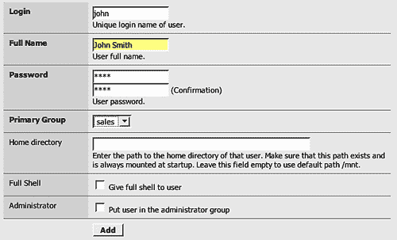
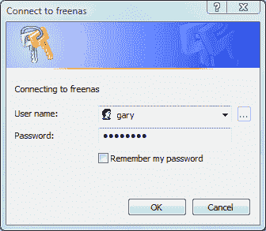
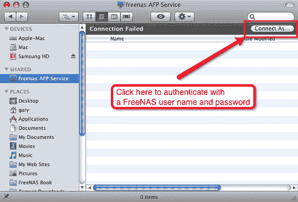
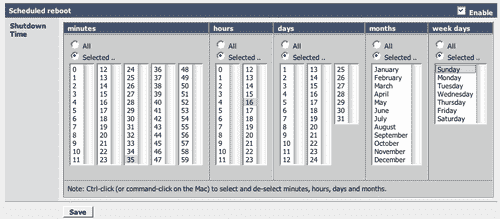
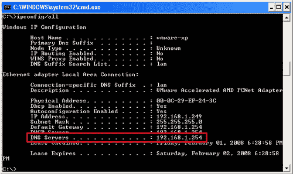
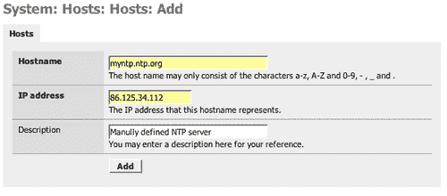
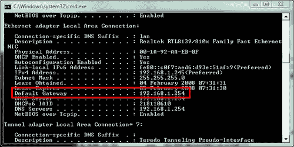
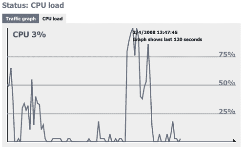

# 第五章 用户与系统管理

本章将讨论 FreeNAS 服务器的不同系统管理任务以及用户管理。涉及的内容包括：

+   添加新用户

+   使用本地用户认证结合 CIFS、FTP、AFP 和 SSH

+   重启和关闭服务器

+   简单的网络管理，包括配置 FreeNAS 使用 DNS 并设置默认网关

+   获取服务器状态信息

# 介绍

一般来说，一旦 FreeNAS 服务器配置并运行，它其实不需要太多关注，它应该可以正常工作。然而，有很多不同的功能是可以配置的。本章将介绍一些常见的 FreeNAS 服务器设置管理任务。

# 本地用户管理

到目前为止，我们只在“匿名”模式下使用 FreeNAS 服务器，意味着任何人都可以连接到服务器并读取、创建和删除文件。这并不总是你想要的，因此 FreeNAS 提供了一些用户管理功能，可以改变 CIFS、FTP 和 AFP 允许用户连接到服务器的方式。

### 注意

FreeNAS 0.6 版本系列的用户管理相当简单。已定义的用户要么有访问权限，要么没有访问权限，只有这两种状态。没有颗粒度的控制；例如，不能将一些用户设置为只读访问，而另一些用户可以读写访问。

0.7 版本的发布路线图承诺提供创建共享（意味着在选定的磁盘上创建一个文件夹）的功能，并且在这个共享上具有用户/组/配额属性。这意味着可以实现更高层次的控制。

创建用户的第一步实际上是创建一个组。每个用户必须属于一个组。组是相互关联的一组用户。因此，在你的公司中，可能会有一个*销售*组和一个*工程*组。在家里，你可能只需要一个组，例如*家庭*组。

1.  1\. 要创建一个组，请转到**访问：用户和组**，然后点击**组**选项卡。

1.  2\. 现在点击添加圆圈。

1.  3\. 表单非常简单；你只需要添加一个名称和描述。例如，销售和“销售人员”。

1.  4\. 现在点击**添加**，然后应用更改。

### 注意

组名只支持 a-z、A-Z 和 0-9 字符。_（下划线）和空格不支持，标点符号如 $%&* 等也不支持。

现在你已经创建了一个组，你可以创建一个用户。

1.  1\. 点击**用户**选项卡。

1.  2\. 然后点击添加圆圈。

    有四个必填字段：

    +   **登录名：** 这是用户的唯一登录名。如果该用户在其他服务器或工作站（如 Windows 用户名或 Linux 用户名）上已有登录名，最好在这里保持一致。这样，用户不需要记住额外的用户名，并且一些程序（特别是 Windows）会尝试使用 Windows 用户名登录，然后再询问应该使用哪个名字。保持一致将有助于集成。

    +   **全名：** 用户的全名。通常，登录名是用户的缩写或简称，如 john、gary。在这里你需要输入全名，以便轻松区分哪个登录名属于哪个人。

    +   **密码：** 用户的密码（并确认密码）。密码中不允许使用冒号（':'）字符。

    +   **主组：** 用户所属的组，例如销售组。

    

1.  3. 最后，你需要点击 **添加** 并应用更改。

现在，你已经在 FreeNAS 服务器上添加了一个用户。

添加用户时，还有三个可选字段：主目录、完整 Shell 和管理员，稍后我们会讨论这些内容，但首先让我们看看添加用户对 FreeNAS 服务器其余部分的影响。

## 使用 CIFS 与本地用户

要使用在 Windows 网络中定义的用户，你需要进入 **服务：CIFS/SMB** 页面，并将 **身份验证** 字段更改为 **本地用户**。然后点击 **保存并重启** 以应用更改。

这意味着现在只有经过身份验证的用户才能通过 CIFS 访问 FreeNAS 共享文件。

### 注意

在 0.6 版本中，这种用户身份验证适用于所有共享，用户要么可以访问所有内容，要么根本无法访问。这应该会在 0.7 版本中有所改变。

当你现在尝试从 Windows Vista 机器连接时，会弹出一个窗口要求输入用户名和密码。



一旦身份验证通过，用户就可以访问 FreeNAS 服务器上的所有用户共享文件。

## FTP 和用户登录

在 **服务：FTP** 页面中，有两个字段控制用户如何登录到 FreeNAS 服务器：

+   **匿名登录：** 这允许启用匿名登录。这意味着用户可以使用用户名 **anonymous** 和任何密码进行连接。

+   **本地用户：** 这使得本地用户能够登录。用户通过在“访问：用户和组”页面中定义的用户名和密码登录。

这两者可以一起使用；然而，它们在安全性方面是相互抵消的。最好运行 FTP 时，要么启用匿名登录并禁用本地用户登录，要么反之。如果两者都启用，那么即使没有用户账户，用户也能通过匿名方式登录，从而减少了启用用户账户的安全性优势。

除了安全性上的好处，使用 FTP 的本地用户登录的另一个优势是，你可以为用户定义一个主目录，当用户登录时，他们会被带到该目录，且只有他们能访问该目录及其下属目录。这实际上为每个用户提供了他们在服务器上的私人空间，其他用户无法干扰他们的文件。

要使其工作，你需要在共享磁盘上创建一个目录。你可以通过 CIFS、NFS、FTP 和 AFS 等任何访问协议来执行此操作。你需要连接到共享磁盘并创建一个新文件夹。

然后，在**访问：用户**中，您可以创建一个新用户或编辑现有用户（通过点击圆圈中的“e”）。在**主目录**中，您需要为该用户输入目录。例如，对于用户 john，您可以创建一个巧妙命名的目录*john*。假设磁盘名为*store*（按照快速入门指南），那么主目录的路径将是：/mnt/store/john。

点击**保存**并应用更改。现在，当 John 使用用户名*john*登录时，他将直接进入*john*目录。他无法访问存储磁盘上的其他文件或文件夹，只有*john*目录及其子文件夹可以访问。

### 注意

**chroot() 除 Root 外所有人**

在服务：FTP 页面的高级设置部分，有一个名为**chroot() 除 root 外所有人**的字段。这意味着，当用户通过 FTP 登录时，他们的根目录（顶级或起始目录）将是**主目录**字段中设置的目录。如果没有设置此项，用户将登录到物理根目录/，并能够看到整个服务器，包括 FreeNAS 和 FreeBSD 的系统文件。勾选此框会更安全。例外情况是用户 root（在 FreeBSD 术语中是系统管理员帐户）。如果启用了**允许 root 登录**，那么用户 root 可以登录，并将被带到实际服务器的根目录。如果你需要修改 FreeNAS 上的任何系统文件，这可能会很有用，但除非你完全了解操作，否则不推荐这样做！

## 身份验证 AFP 用户

像 CIFS 和 FTP 一样，Apple 文件协议（AFP）也可以使用 FreeNAS 的本地用户身份验证功能。

在**服务：AFP**页面中，有两个选项可以控制通过 AFP 访问服务器：

+   **启用访客访问**，意味着任何人都可以在不提供用户名和密码的情况下连接。用户拥有完全的读写访问权限。

+   **启用本地用户身份验证**，意味着只有在 FreeNAS 服务器上定义的用户（在**访问：用户**页面上）才能访问服务器。需要提供在 FreeNAS 服务器上设置的用户名和密码以进行身份验证。

像 FTP 一样，这两者可以一起使用，但在安全性方面会互相抵消。最好是在启用访客登录并禁用本地用户登录，或者反之操作时运行 AFP 服务。如果同时启用这两项，那么即使用户没有账户，访客账户仍然可以登录，从而降低启用用户账户的好处。

仅启用本地用户身份验证时，从 Apple Macintosh 的初始连接会失败。在 Finder 窗口的右上角，有一个标记为**连接为..**的按钮。使用此按钮输入用户名和密码。



## 通过 SSH 连接到 FreeNAS 服务器

目前为止，本书中提到较少的一项服务是安全外壳访问（SSH）。它主要面向高级用户，在第十章中，我们将使用 SSH 连接服务器，介绍 FreeBSD 和可用的命令行工具。

然而，SSH 在很大程度上依赖于服务器上定义的本地用户，因此现在值得查看一下。

SSH 是一种网络协议，允许在两台计算机之间通过加密（安全）通道交换数据。它通常用作连接远程计算机的安全命令行接口。这意味着你可以从远程计算机访问 FreeNAS 服务器的命令行界面，而无需访问 FreeNAS 服务器的键盘和显示器。在 FreeNAS 服务器上，它还与 Unison 程序套件一起使用。Unison 使用 SSH 登录服务器并启动同步过程。

在**访问：用户：添加**页面，有一个名为**完整 Shell**的字段，启用后，用户可以通过 SSH 访问 FreeNAS 服务器。

测试 SSH 连接：

1.  1\. 创建一个用户并确保启用**完整 Shell**。

1.  2\. 转到**服务：SSHD**并启用该服务。

1.  3\. 确保已勾选密码验证选项。

1.  4\. 点击**保存并重启**。

1.  5\. 使用 SSH 客户端连接到 FreeNAS 服务器（见下文）。

### 注意

**密码验证**

你可以通过不输入用户名和密码，而是依赖于交换加密密钥来连接到 FreeNAS 服务器，这些密钥可以验证你是否为你声称的身份。启用密码验证后，你可以仅使用用户名和密码登录。

你可以通过命令行程序 ssh 连接到 FreeNAS 服务器，适用于 Linux 和 Mac OS X。对于 Windows，你需要一个 SSH 客户端，最好的一个是 Putty（[`www.chiark.greenend.org.uk/~sgtatham/putty/`](http://www.chiark.greenend.org.uk/~sgtatham/putty/)）。我们将在第十章中更详细地讨论 Putty。

在 Linux 或 OS X 命令行中输入：

```
ssh -l john 192.168.1.250 

```

### 注意

如果你没有使用默认地址，别忘了将地址更改为你的 FreeNAS 地址。

`-l` 告诉 SSH 程序你希望使用哪个用户作为登录名，在本例中，我选择了`john`。

第一次登录时，系统可能会询问你是否信任远程机器，因为你将与其进行加密通信。它应该会显示类似以下内容：

```
The authenticity of host '192.168.1.250 (192.168.1.250)' can't be established.
DSA key fingerprint is b2:d0:99:cb:6e:b2:53:95:4d:f6:b3:02:1d:bc:36:db.
Are you sure you want to continue connecting (yes/no)? yes
Warning: Permanently added '192.168.1.250' (DSA) to the list of known hosts 

```

输入“是”并键入该用户的密码。现在，你已通过 SSH 连接到 FreeNAS 服务器。在这里，你可以访问 FreeNAS 服务器的命令行工具。更多详细信息请参见第十章。

## 不使用本地用户帐户的服务

并非 FreeNAS 提供的所有服务都使用本地账户进行身份验证，最显著的是 NFS。这需要注意。如果你启用了 NFS，并且正在为 CIFS、FTP 和 AFP 使用本地用户身份验证，请注意，用户仍然可以通过 NFS 连接到 FreeNAS 服务器，而无需用户名和密码。这是绕过本地用户身份验证的简便方法。

# 使用 FreeNAS 配合 Microsoft Active Directory

到目前为止，我们已经在 FreeNAS 服务器上本地定义了所有用户信息。这对于小型网络是可以的，但如果你有一个大型企业网络，可能已经部署了 Microsoft 的 Active Directory。FreeNAS 可以使用 Microsoft Active Directory（Windows 2000/2003）的用户数据库来验证用户名和密码，从而无需在本地定义用户。

当使用 Active Directory 时，FreeNAS 服务器将使用该目录来验证以下服务的用户：CIFS、FTP、SSH 和 Unison。

### 注意

**Windows 2000 之前**

FreeNAS 被视为 Windows 2000 之前的客户端，因此 Active Directory 必须配置为兼容 Windows 2000 之前的版本。

假设 Active Directory 已安装并正在运行：

1.  1\. 转到 **访问：Active Directory**。

1.  2\. 勾选表格标题栏中的启用复选框。

1.  3\. 在 **AD 服务器名称** 字段中输入 Active Directory 服务器名称。例如，我的测试网络上的 Windows Server 2003 服务器名为 WS2003，所以我输入了 WS2003。

1.  4\. 在 **AD 服务器 IP** 字段中输入 Active Directory 服务器的 IP 地址。

1.  5\. 输入 Active Directory 的域名。此格式为 Windows 2000 之前的格式。

1.  6\. 输入域管理员账户的用户名（可能是 Administrator）和密码。

1.  7\. 最后，点击 **保存**。

要检查 FreeNAS 是否能够与 Active Directory 正常通信：

1.  1\. 转到 **诊断：信息**

1.  2\. 点击 **MS 域** 标签。

这将测试连接到 Active Directory。

成功的测试将如下所示：

`测试与 MS 域的可访问性：`

`net rpc testjoin 的结果：`

`加入 'FREENAS' 成功`

`Ping winbindd 查看它是否正常：`

`成功 ping 通了 fd 4 上的 winbindd`

`检查共享密钥：`

`通过 RPC 调用检查信任密钥成功`

配置完 Active Directory 后，CIFS、FTP、SSH 和 Unison 的身份验证将 **仅** 依赖于 Active Directory 中的账户信息。

当配置 Active Directory 以供使用时，CIFS/SMB 的身份验证方式会自动更改为 *域*。

要检查这一点，请进入 **服务：CIFS/SMB**，并注意 **身份验证** 现在已设置为 **域**。

为了测试 Active Directory 的使用，尝试通过 CIFS、FTP 或 SSH 连接到 FreeNAS 服务器，并使用来自 Active Directory 的账户信息。

# 系统管理员

一些系统管理员的常见管理任务：

## 如何更改 Web GUI 用户名和密码

当你首次安装或启动 FreeNAS 服务器时，它有一个默认的用户名和密码，用于访问 Web GUI。这些分别是*admin*和*freenas*。如果你的 FreeNAS 处于一个可能被其他人访问并修改设置的环境中，无论是恶意的还是偶然的/出于好奇心的，建议你更改密码，甚至可能需要更改用于访问 Web GUI 的用户名。

要更改密码，请进入**系统：常规**并点击**密码**标签。输入当前的 Web GUI 密码（可能是*freenas*），然后输入新的密码两次，第二次用于确认，以确保你输入的字符正确。现在点击**保存**。

一旦保存，你将自动被要求重新登录。此时，输入用户名（可能是*admin*），然后输入你刚刚设置的新密码。

### 注意

选择一个好密码

### 注意

你需要选择一个强密码，这意味着一个难以猜测的密码。

最好选择一个你能记住的密码，这样你就不需要写下来或把它留在显眼的地方。

但避免使用字典中的完整单词或名字。

密码包含的字符越多，被猜测的难度就越大。通常，一个较长但简单的密码比一个短且复杂的密码更安全；它还有一个优点，那就是更容易记住。

使用大小写字母、数字和标准符号（! @ # $ % ^ & *）的组合。FreeNAS 的 Web GUI 密码区分大小写，这意味着大写字母 Z 与小写字母 z 是不同的。

不要使用你的生日、孩子或宠物的名字、你的电话号码等。个人信息很容易被别人猜到。

避免使用明显的密码，如 "123456"、"test" 或 "password"。

你还可以将默认用户名从*admin*更改为你选择的其他名称。要更改，请进入**系统：常规**并在**用户名**字段中输入新用户名。点击保存以应用更改。系统会要求你重新登录，这时你需要输入新的用户名。

## 重启和关机

可以通过 Web 界面关机和重启 FreeNAS 服务器。在 Web 界面中，重启和关机的方式非常相似。要重启，请进入**系统：重启**，要关机，请进入**系统：关机**。

重启/关机有两种类型，立即（现在）或计划的。要立即重启或关机，请进入相应页面，并在**确定吗？**的问题上点击**是**。点击**是**后，系统将开始关机/重启。

对于计划的重启或关机，请点击**计划**标签。



重启和关机是通过选择重启或关机的分钟、小时、日期和月份来安排的。这是一个重复的事件，您还可以选择一周中的某一天，而不是一个月中的某一天进行重启。

要启用计划的重启或关机，请勾选启用框并选择您希望重启或关机的时间。例如，要在每周日的下午 4:35 重启服务器，您需要选择：

+   从分钟部分选择 35

+   从小时部分选择 16（记住这是 24 小时制）

+   从星期几中选择星期日

+   天数和月份将保持为空

## 如何设置服务器的主机名

您的 FreeNAS 服务器有一个名称，称为主机名。此名称唯一标识该服务器。如果您的网络中有多个 FreeNAS 服务器，您需要更改主机名，以确保每个主机名都是唯一的。

要更改主机名，请进入**系统：常规**，并在**主机名**字段中输入一个新的主机名。如果您在一个也使用 Internet 域名进行身份识别的网络环境中部署 FreeNAS，您还可以在**域名**字段中输入一个域名（例如：yourcompany.com）。

## 配置 Web 界面使用 HTTPS

HTTPS（超文本传输协议安全套接层）是一种通过加密连接让您的网页浏览器连接到 FreeNAS 服务器的方式。如果您的 FreeNAS 服务器处于一个可能被人“窃听”网络的环境中，导致密码被发现，那么最好使用 HTTPS。如果您的网络配置使得 FreeNAS 可以从互联网进行管理（可能通过防火墙），这也是必需的。这样做可以在 FreeNAS 服务器与负责管理它的人之间的物理位置不同的情况下非常有用。

要启用 HTTPS，请进入**系统：常规**，然后在**WebGUI 协议**字段中勾选 HTTPS 复选框。在点击**保存**后，您需要重启服务器以使更改生效。

重启后，您现在可以通过以下方式连接到 Web GUI：

```
https://192.168.1.250 

```

请注意，网址现在以`https`开头，而不是之前的`http`。连接到服务器后，您的浏览器几乎肯定会告诉您此安全连接的证书由一个未知的机构签发。它会询问您是否可以信任该服务器。不要惊慌，这并不是问题。接受证书并继续。根据您的浏览器，您可能能够永久接受该证书，以免在未来收到警告。现在，您可以像往常一样登录。

### 注意

当一个网页浏览器通过 HTTPS 连接到一个安全网站时，网页服务器会向浏览器提供一个证书来标识自己。这个证书包含了关于证书所有者的唯一且经过认证的信息。为了确保这些信息是正确的，需要一个第三方来担保该证书并声明它是可信的。这个第三方被称为证书颁发机构（CA），它们验证证书所有者的身份，并建立信任。如果*它们*说这个证书有效，那么我*相信*它们。

网页浏览器预先编程了一个证书颁发机构（CA）的接受列表，当它们看到一个不在该列表中的 CA 时，浏览器会询问该证书是否可信。

FreeNAS 使用的是自签名证书，这意味着它为自己担保。对于一个接受在线支付的主要网站来说，这会是一个问题，但对于 FreeNAS 来说，这是可以接受的，因为这里所需要的不是服务器的信任，而是安全通信的能力。一旦你接受了证书，基于证书中的一些信息，与 FreeNAS 服务器的安全通信就会开始。

## 更改 Web 界面端口

有时候，将 Web 服务器端口从默认值 80（HTTPS 为 443）更改为其他端口是有用的。例如，如果你想通过互联网管理你的 FreeNAS 服务器，并且需要在防火墙中配置转发规则，那么将 Web 服务器设置为不同的端口会更方便。

要更改端口号，进入 **系统：常规** 并在 **WebGUI 端口** 字段中输入新的端口号。当你更改端口号时，需要重启服务器才能使设置生效。重启后，你需要使用新的 URL：

```
http ://192.168.1.250:8080

```

其中，8080 是你选择的新端口号，当然 192.168.1.250 是你的 FreeNAS 服务器的 IP 地址，你需要相应地进行更改。

## 如何设置 DNS 服务器

FreeNAS 服务器上的一些服务，如网络时间协议服务和发送电子邮件状态报告，要求 FreeNAS 使用 DNS。DNS 是一种将域名转换为 IP 地址的互联网服务。每次你使用域名（例如在浏览器中）时，DNS 就会被用来将该名称转换为相应的 IP 地址。为了找到互联网上的不同服务器，比如邮件服务器，FreeNAS 也需要使用 DNS。

你可以从多个来源确定需要使用的 DNS 服务器：

+   如果你在公司网络中使用 FreeNAS，你很可能在局域网内有 DNS 服务器。你需要联系你的网络管理员以获取正确的信息。

+   如果你在家使用 FreeNAS 服务器，那么你的 DNS 可能是你的 ADSL/DSL 调制解调器的地址。

+   另外，对于家庭用户来说，DNS 服务器可能是你的 ISP 提供的服务器。你需要联系你的 ISP（或搜索他们的网站）以查找应该使用的 DNS 服务器。

如果找不到要使用的 DNS 服务器，可以复制网络中现有机器的设置。例如，要查看 Windows XP、Windows Server 2003 和 Vista 中的 DNS 设置，点击**开始**，然后选择**运行..**，输入**cmd**并按*ENTER*。命令提示符将会出现。现在输入：

```
C:\>ipconfig /all 

```

结果将列出有关您的网络连接的各种信息。在**以太网适配器本地连接：**部分，将显示 DNS 服务器的信息。



## 如何设置网页界面的语言

除了英语外，FreeNAS 网页界面还支持包括：保加利亚语、中文、荷兰语、法语、德语、希腊语、匈牙利语、意大利语、日语、挪威语、波兰语、葡萄牙语、罗马尼亚语、俄语、斯洛文尼亚语、西班牙语和瑞典语等多种语言。

要更改网页界面的语言，进入**系统：常规设置**，并从**语言**下拉框中选择所需的语言。一旦点击**保存**，语言应该会立即更改，但有时由于浏览器缓存，您可能需要点击网页界面的另一个部分，才能看到语言变化。

## 日期和时间配置

所有电脑都有时钟并能追踪日期和时间。保持日期和时间正确很重要，原因包括：

+   文件将标注正确的创建和修改时间戳。

+   定时重启和关机将在正确的时间进行。

+   FreeNAS 服务器可以作为 Windows 机器的时间服务器。

+   通过电子邮件发送的定时状态报告将在正确的时间发送，并带有正确的时间和日期。

+   日志文件将具有正确的时间戳，有助于诊断。

日期和时间可以通过三种方式设置：

+   在电脑的 BIOS 中设置

+   通过网页 GUI 设置

+   配置通过 NTP 进行自动时间调整

时间和日期的配置可以在**系统：常规**页面上进行设置。

首先需要设置的是时区，这可以通过从**时区**下拉框中选择来完成。您需要选择离您最近的位置（通常是您所在国家的首都或州首府），例如**America/New York**。您也可以以更手动的方式选择时区，例如**Etc/GMT-1**。使用**保存**按钮应用更改。

如果您需要设置日期和时间，可以选择通过在**系统时间**字段中输入日期和时间来设置。格式为 mm/dd/yyyy hh:mm。您也可以使用图标从简单的日历小工具中选择日期和时间。值得注意的是，使用这种方法无法设置秒。使用**保存**按钮应用更改。

您可以选择使用网络时间协议（NTP）自动配置日期和时间。NTP 是一种通过互联网同步计算机时钟的方法。时间服务器通常连接有非常精确的原子钟，并且其他计算机会向其询问时间并相应地设置其时钟。该协议具有特殊的算法，以允许在互联网上传送请求时的延迟。使用此协议，时钟可以准确到秒的小数部分。

要启用 NTP，请勾选 **Enable NTP** 字段。接下来，您需要输入要使用的时间服务器，`pool.ntp.org` 是默认设置，对您的用途来说应该足够了。如果您的 FreeNAS 无法访问互联网，则需要在本地网络上找到一个 NTP 服务器。虽然使用一个 NTP 服务器已经足够，但来自 NTP 项目的建议是指定 3 个服务器：

+   `0.pool.ntp.org`

+   `1.pool.ntp.org`

+   `2.pool.ntp.org`

使用空格分隔主机。

### 注意

`pool.ntp.org` 项目是一个大型的虚拟时间服务器集群，致力于为数百万客户提供可靠易用的 NTP 服务，而不会给热门的大时间服务器带来负担。

为了分担负载并处理偶尔的宕机服务器，NTP 项目创建了使用 0、1 和 2.pool.ntp.org 名称的随机服务器集合。每个集合中的服务器每小时随机更改。

最后需要设置的是网络时间同步的间隔，单位为分钟。默认设置为 300，即每 5 小时进行一次同步。对大多数需求来说，这应该足够了。

要使 NTP 协议正常工作，确保至少定义了一个 DNS 服务器进行名称解析。有关更多详细信息，请参阅 *如何设置 DNS 服务器* 部分。

## 如何禁用控制台菜单

除了初始网络设置外，FreeNAS 服务器主要使用 Web 界面进行大部分配置。然而，即使您不再需要控制台菜单，控制台菜单仍然保持活动状态。这可能会构成安全风险，因为任何有键盘和显示器访问权限的人都可以有意或意外地更改设置。

要禁用控制台菜单，请转到 **System: Advanced** 并选中 **Disable console menu** 复选框。点击 **Save** 后，您需要重新启动以禁用控制台。

## 如何停止启动和关闭时的蜂鸣声

当 FreeNAS 启动和关闭时，会播放几声悦耳的蜂鸣声以指示其已启动。如果您想要禁用它们，请转到 **System: Advanced Setup** 页面并勾选 **the System Beep** 复选框，这将禁用启动和关闭时的扬声器蜂鸣声。

## 添加预定义的网络主机

在罕见情况下，如果您没有访问 DNS 服务器的权限，但仍想使用 NTP 协议或发送电子邮件状态报告，则需要手动定义 NTP 服务器或电子邮件（SMTP）服务器。您可以在 **System: Hosts** 页面上进行设置。

要添加一个 NTP 服务器，例如地址为 86.125.34.112，点击添加按钮，然后输入该服务器的主机名和 IP 地址。您还可以添加描述。



## 将服务器重置为出厂默认设置

如果您想将 FreeNAS 服务器重置为其原始安装状态（或 Live CD 启动状态），这通常被称为出厂设置（比喻来说：就是它离开工厂时的设置），那么您可以在**系统：出厂**设置中执行此操作。

如果您点击**是**，FreeNAS 服务器将恢复到出厂默认设置，并立即重启。整个系统配置将被覆盖。LAN IP 地址将重置为 192.168.1.250，密码将设置为‘freenas’。

### 注意

值得注意的是，当您将服务器重置为出厂默认设置时，磁盘上的数据不会被触动。这意味着您可以重置服务器，然后重新配置它以找回您的数据。但请非常小心，如果在重新配置阶段您重新格式化了磁盘或应用了与之前不同的配置，那么很可能会丢失数据。

## 简单网络管理

在**接口：LAN**页面，您可以执行一些有限的网络管理任务，例如为 FreeNAS 服务器定义一个新的 IP 地址，并为服务器定义一个默认网关。

默认网关是网络上另一个设备的 IP 地址，该设备将接受网络流量并将其转发到另一个网络。在家庭环境中，最常见的默认网关类型是由您的互联网服务提供商（ISP）提供的 ADSL/DSL 调制解调器/路由器。调制解调器的工作是将来自家庭网络的流量路由到互联网，反之亦然。

在企业环境中，设置可能相同，或者如果您拥有全面的网络基础设施，默认网关将是一个网络设备，它将您的网络段与其他企业网络连接起来。

您几乎肯定需要设置默认网关，以便为 FreeNAS 服务器提供访问互联网的权限，尤其是当您使用互联网 NTP 服务时。

您需要向您的网络管理员或 ISP 询问默认网关的详细信息。另一个确认默认网关设置的方法是查看您网络中其他计算机上的默认网关设置。

例如，要在 Windows XP、Windows Server 2003 和 Vista 中查找默认网关，请点击**开始**，然后点击**运行..**，输入**cmd**并按回车。命令提示符将会出现。现在输入：

```
C:\>ipconfig /all 

```

结果将列出有关您的网络连接的各种信息。在**以太网适配器局域网连接：**部分，将显示有关默认网关的信息。



## 禁用 Bonjour/ZeroConf

默认情况下，FreeNAS 会通过 Zeroconf 协议宣布其提供的服务（如 CIFS、AFP 等）。这使得局域网上的其他计算机可以检测到有提供网络服务的服务器。Zeroconf/Bonjour 被苹果的 OS X 操作系统以及最近的 Linux 发行版所使用。

如果你希望禁用此功能，可以在 **系统：高级设置** 页面中取消 **Zeroconf** 选项的勾选。

## 获取服务器状态信息

FreeNAS 提供了一些优秀的工具来监控服务器的状态。所有这些工具都被归类在左侧菜单栏中的 **状态** 下。

不同的状态类别包括：

+   **系统：** 这是首次连接到 Web 界面时显示的摘要页面。它将告诉你诸如运行的 FreeNAS 版本、服务器的运行时间、使用的内存量和磁盘空间使用情况等信息。

+   **进程：** 这将显示一些关于 FreeNAS 服务器上运行的进程的摘要信息，并列出主要的进程。

+   **接口：** 这会显示服务器中网络接口的摘要以及它们的流量负载的简单统计数据。

+   **磁盘：** 在这里，你可以查看系统中当前配置的磁盘列表，包括每个磁盘的大小、描述和状态。

+   **无线：** 这会显示服务器中无线网络接口的摘要以及它们的流量负载的简单统计数据。

+   **图表：** 该页面分为两部分，流量图表和 CPU 负载图表。第一个是实时显示网络卡上的流量量，第二个是显示 CPU 使用量。两者都在 2 分钟的时间窗口内工作。

### 注意

FreeBSD 能够同时运行多个程序，FreeNAS 利用 FreeBSD 的这一多任务处理能力来同时运行 Web 服务器、CIFS 服务器、FTP 等服务。

每个程序或服务作为一个独立的 **进程** 运行。每个进程会占用系统的 CPU 时间，以及其他系统资源，如内存和磁盘空间。

各种状态页面帮助你监控 FreeNAS 服务器的进程和所使用的资源。



### 注意

如果你不熟悉 UNIX 类型系统，进程状态页面的输出可能看起来有点奇怪，以下是一个快速指南：

**PID：** 每个进程都有一个唯一的进程 ID，称为 PID。

**SIZE：** SIZE 是进程使用的总内存量，以千字节为单位。

**RES：** 这是进程实际使用的物理内存量。由于 FreeBSD 会在具有相同值且未被更改的进程之间共享内存区域（称为页面），因此与 SIZE 可能不同。

**状态：** 这是进程的当前状态（可能是休眠、等待、运行、空闲、僵尸或停止）。

**时间：** 这是进程使用的系统和用户 CPU 时间，以秒为单位。

**WCPU：** 这是当时 CPU 的使用百分比。

**命令：** 是启动该进程的命令行。

## 通过电子邮件发送状态报告

FreeNAS 具有在预设时间通过电子邮件发送状态报告的功能。要配置这些报告，请转到 **状态：电子邮件报告**。FreeNAS 不包括电子邮件服务器（SMTP 服务器），因此您需要告诉它使用哪个服务器。如果您是家庭用户，那么将使用由您的 ISP 提供的 SMTP 服务器。对于商业环境，您需要询问网络管理员您的网络中 SMTP 服务器的地址。如果您通过域名地址（例如 mail.myisp.com）访问 SMTP 服务器，则需要确保已配置 DNS，以便 FreeNAS 能够查找邮件服务器的 IP 地址。您也可以在系统：主机中预定义服务器。

如果您的 SMTP 服务器需要身份验证（如果您使用的是 ISP 提供的 SMTP 服务器，几乎可以确定需要身份验证），则勾选 **身份验证** 框并输入适当的用户名和密码。

接下来，您需要设置邮件的发件人和收件人。**收件人电子邮件** 需要是您希望接收电子邮件的地址，**发件人电子邮件** 则是发送邮件的地址。对于 **发件人电子邮件**，您需要输入一个有效的地址，因为任何邮件投递失败的通知都将发送到该地址。此外，您希望 **发件人电子邮件** 地址是有效的，以免触发邮件系统中的垃圾邮件过滤。

您可以填写所需的邮件主题行，并微调邮件报告中包含的内容。

最后，您需要定义这些状态消息发送的时间。该表与用于计划重启/关机的表完全相同。消息的发送时间是通过选择希望消息发送的分钟、小时、日期和月份来安排的。这是一个周期性事件，因此，您还可以选择一周中的某一天，而不是选择一个月份的某一天。例如，要在每月的 1 号上午 9:00 发送状态消息，您需要选择：

+   来自分钟部分的 0。

+   来自小时的 9。

+   来自日期的 1。

+   选择 *全部* 作为月份。

+   工作日将保持未使用状态。

# 总结

在本章中，我们已经探讨了设置 FreeNAS 服务器的不同管理任务，包括用户管理及其对访问协议（如 CIFS 和 FTP）的影响。我们还了解了一些系统管理选项，以及一些简单的管理任务，如关机和重启。

在下一章中，我们将更深入地探讨在 FreeNAS 服务器上配置磁盘，包括设置软件 RAID。
