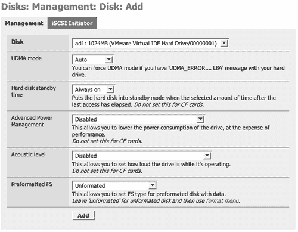
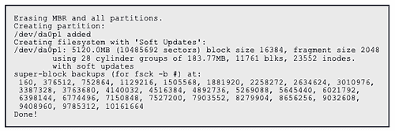
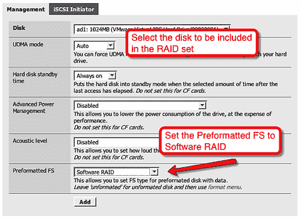
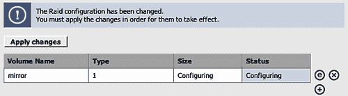
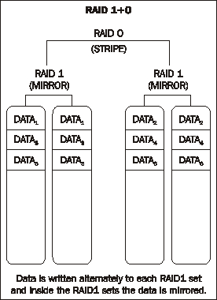
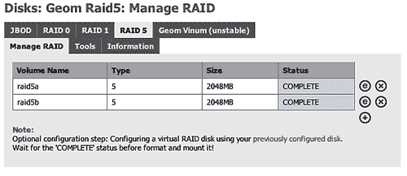

# 第六章：配置存储

在本章中，我们将学习如何在 FreeNAS 服务器中管理硬盘，并如何配置它们以形成 RAID 集合，提升容错性并提高磁盘性能。

# 介绍

FreeNAS 服务器的本质是提供一个可以轻松从网络访问的存储。因此，了解 FreeNAS 如何处理存储，或更具体地说，如何处理硬盘，并了解如何配置和使用它们以提供最佳、最可靠的存储对于网络非常重要。在本章中，我们将几乎交替使用存储和硬盘这两个词。技术上讲，硬盘是一种存储设备，除了硬盘，还有许多其他类型的存储，但由于 FreeNAS 主要关注将硬盘用作存储，因此这两个术语有时会显得相似。唯一的例外是当我们讨论 iSCSI 时，因为 iSCSI 允许将远程存储添加到 FreeNAS 服务器，就像它是本地硬盘一样。当然，最终远程存储也是一种硬盘！

# FreeNAS 如何处理数据磁盘

如第二章所述，将存储添加到 FreeNAS 服务器是通过 4 个步骤完成的：

1.  1. FreeNAS 服务器被“告知”了一个物理硬盘。

1.  2. 该磁盘已格式化。

1.  3. 结果存储空间被挂载并在内部提供。

1.  4. 挂载的存储空间通过 CIFS 和 NFS 等服务在网络上提供。

第一步，告知 FreeNAS 服务器可以使用哪些磁盘，是通过“磁盘：管理”来处理的。打开此页面时，您将看到已经配置的磁盘列表，通过点击添加按钮，您可以添加更多磁盘。要添加磁盘，点击添加按钮，您将进入 **磁盘：管理：磁盘：添加** 页面。



这一页面上最重要的字段是 **磁盘** 字段，在这里您可以选择要添加到 FreeNAS 配置中的磁盘。您可以通过下拉框选择磁盘。

## UNIX 设备名称

在 UNIX 类型的操作系统中，包括 FreeBSD，像硬盘这样的设备通常会以一种略显晦涩的名称来引用，类似于以下形式：

```
/dev/ad0

```

其实一旦了解了名称的组成方式，实际上并不那么难。第一部分 `/dev` 是很简单的，它是服务器上的一个特殊目录，存储着系统中所有设备的信息，dev 是 device（设备）的缩写。因此，所有设备都以 `/dev` 开头。

第二部分是设备本身。在这里，它可能会稍微复杂一些，但 `ad0` 代表的是 `disk 0`，即 BIOS 列表中的第一个硬盘。以下是一些常见设备名称的表格：

| Free BSD 设备名称 | 描述 |
| --- | --- |
| /dev/ad* | ATA 和 SATA 硬盘 |
| /dev/da* | SCSI 和 USB 闪存存储 |
| /dev/acd* | IDE CD 驱动器 |
| /dev/cd* | SCSI CD 驱动器 |
| /dev/fd* | 软盘 |

`*` 是一个通配符，实际应用中它代表从 0 开始的数字。所以 `/dev/da2` 是系统中第 3 个（从 0 开始计算）SCSI 硬盘。

### 注意

**RAID 控制器**

如果你使用的是硬件 RAID 控制器，连接到它的磁盘不要使用标准的设备名称，而是这些 RAID 控制器会为每个 RAID 集合提供一个虚拟磁盘，使用以 RAID 控制器驱动程序命名的设备。例如，*amr* 驱动程序（支持 MegaRAID 和部分 Dell 与 Intel 卡的控制器）会将虚拟磁盘呈现为 `/dev/amrd*`。此外，一些 RAID 卡将其硬盘呈现为 `/dev/da*` 设备。

## 添加磁盘

一旦你从下拉框中选择了正确的磁盘，通常可以直接点击 **添加** 按钮。然而，有一些参数你可以调整，并且如果该磁盘已经格式化并且上面有数据，那么最后一个字段 **预格式化文件系统（Preformatted FS）** 需要正确设置。

| 磁盘参数 | 描述 |
| --- | --- |
| UDMA 模式 | 通常情况下，硬盘的接口速度会自动检测。如果你在硬盘上看到 'UDMA_ERROR.... LBA' 的信息，你可以强制设置接口速度（称为 UDMA 模式）。 |
| 硬盘待机时间 | 在最后一次访问后的选定时间后，将硬盘置于待机模式。请不要在闪存设备上使用此功能。 |
| 高级电源管理 | 这允许你在牺牲性能的情况下降低硬盘的功耗。成功与否取决于你的 BIOS 和硬盘。请不要在闪存设备上使用此功能。 |
| 声音级别 | 这允许你设置硬盘在操作时的音量。成功与否取决于你的 BIOS 和硬盘。请不要在闪存设备上使用此功能。 |
| 预格式化文件系统（Pre-formatted FS） | 这允许你设置已预格式化并含有数据的磁盘的文件系统类型。对于未格式化的磁盘，保持为 '未格式化'，然后使用格式菜单进行格式化。 |

### 注意

**小心不要误删现有数据**

如果你已经将现有服务器转换为 FreeNAS 服务器，或者你已经将带有数据的磁盘放入 FreeNAS 服务器中，你需要确保正确设置 **预格式化文件系统（Preformatted FS）** 字段。除了 FreeBSD 的原生 UFS 格式外，FreeNAS 还支持 FAT32、NTFS 和 EXT2 格式。

一旦你从下拉菜单中选择了磁盘并设置了任何可选参数，你可以点击 **添加** 按钮。别忘了，你还需要应用这些更改。

**磁盘：管理** 页面现在会显示你的磁盘（们）以表格形式，包含磁盘名称、大小和文件系统的信息。

下一步是格式化磁盘。

## 格式化新添加的磁盘

一旦磁盘被 *添加* 到 FreeNAS 服务器，它需要被格式化。

1.  1. 转到 **磁盘：格式化** 页面。

1.  2\. 选择要格式化的磁盘。只有您在**磁盘：管理**页面中添加的磁盘才能被格式化。如果您要格式化的磁盘没有出现在下拉列表中，请返回**磁盘：管理**页面，检查磁盘是否已正确添加。

1.  3\. 接下来，您必须选择要在此磁盘上使用的文件系统。默认情况下将选择 UFS，除非您特别需要 FAT32 或 EXT2，否则最好使用 UFS 格式化磁盘。

    ### 注意

    **UFS 是最佳选择**

    UFS 是 FreeBSD（FreeNAS 底层操作系统）的原生文件格式。尝试使用其他文件格式，如 FAT、FAT32、EXT2、EXT3 或 NTFS，可能会导致不可预见的结果、文件损坏和数据丢失！

1.  4\. 您还可以为磁盘输入一个可选的卷标签，但由于在 FreeNAS 的网页界面中并不使用此标签，因此其实际用途不大。

1.  5\. 将最小空闲空间百分比保持为默认的 8%，因为降低该阈值可能会影响性能和自动碎片整理功能。

1.  6\. 最后一个选项允许您调整磁盘的格式化方式，特别是避免在格式化过程中替换主引导记录（MBR）。通常，这不需要，但某些硬件 RAID 卡将信息存储在 MBR 中。如果您发现磁盘格式化不正确并且使用了硬件 RAID 卡，可以尝试启用此选项进行格式化。

1.  7\. 一旦点击**格式化磁盘**，系统会询问您是否确定要格式化磁盘。点击**确定**以继续操作。

格式化磁盘后的输出结果大致如下：



关键是要寻找**完成！**的评论以及它前面的一长串超级块编号。如果看到这些，那么一切正常。如果格式化因某些原因失败，您会在**完成！**之前看到错误消息。例如，如果卷标签中不允许使用空格，尝试格式化这样的磁盘时，输出的最后几行将显示：

```
newfs: bad volume label. Valid characters are alphanumerics.
Done!

```

## 挂载您刚格式化的磁盘

格式化磁盘后，您需要在 FreeNAS 服务器内部使其可用。此过程称为*挂载*磁盘，这是计算机早期时代遗留下来的术语，当时操作员需要在使用磁带或硬盘之前将其挂载到主轴上。挂载磁盘后，它可以在服务器内部使用，只有以前*添加*并*格式化*过的磁盘才能挂载。

1.  1\. 要挂载磁盘，请转到**磁盘：挂载点**并点击添加按钮。

    这里有五个重要字段需要填写：**类型、磁盘、分区、文件系统**和**名称**。

    ### 注意

    **分区**

    对磁盘进行分区意味着将其划分为多个部分。所有磁盘至少需要一个分区，且使用单个分区即表示使用整个磁盘。也可以将磁盘分成多个部分。在 FreeNAS 中，如果你在硬盘上安装了服务器软件，则会创建两个分区，第一个用于操作系统软件，第二个用于数据存储。在挂载磁盘时，你需要知道你想挂载哪个分区。

    默认情况下，FreeNAS 不使用传统的分区方法，即将分区数据存储在主引导记录（MBR）中；相反，它使用 GUID 分区表（GPT），这是英特尔提出的可扩展固件接口（EFI）标准的一部分，用来替代即将过时的 PC BIOS。

    +   **类型：** 在这里，你可以选择是要挂载磁盘还是 ISO 文件。对于新的物理磁盘，你需要选择磁盘。如果你有一个`.iso`文件并希望将其内容提供到网络上，选择 ISO 选项将非常有用。

    +   **磁盘：** 选择你希望挂载的磁盘。这个磁盘将与在**磁盘：管理**（添加磁盘）和**磁盘：格式化**（格式化磁盘）中使用的磁盘相同。

    +   **分区：** 如果你刚刚使用 FreeNAS 格式化了这个磁盘，那么你需要在这里选择 EFI GPT。如果磁盘上已有数据，你需要选择数据所在的分区。如果你已经在某个磁盘上安装了 FreeNAS 并希望将剩余的磁盘空间用于数据存储，那么选择 2。

    +   **文件系统：** 对于已使用 FreeNAS 格式化的磁盘，你需要选择 UFS。如果你选择了其他文件系统格式或磁盘上已有数据，你需要选择适当的文件系统类型（FAT、NTFS、EXT2 中的一种）。

    +   **名称：** 每个挂载的磁盘需要一个名称，以便与其他磁盘区分开来。名称中似乎可以使用空格，但为了安全起见，我建议使用一个简单的单词作为挂载点名称。指定的名称将用于在 FreeNAS 服务器上的**/mnt**目录下挂载磁盘，因此，如果我们使用*store2*，那么磁盘将被挂载在**/mnt/store2**，这个名称也将用于通过 CIFS 等共享该磁盘。

    +   **描述：** 你可以为此挂载点填写一个可选的描述。

    +   **只读：** 勾选此项将文件系统挂载为只读，即使是管理员账户（超级用户/root）也无法对其进行写操作。

        ### 注意

        **使用在旧版本 FreeNAS 下格式化的磁盘**

        如果你的磁盘是在 FreeNAS 0.683b 版本之前配置的，那么你需要手动选择 UFS 格式化驱动器或软件 RAID 卷的分区 1。*文件系统*类型应设置为 UFS。

1.  2. 填写完所有数据后，点击**添加**按钮。

1.  3. 你将看到一个包含 FreeNAS 服务器上已挂载驱动器列表的表格。它们的状态将显示为**正在配置**。

1.  4\. 现在你需要点击**应用更改**。一旦更改应用成功，新的显示表格应包括新的挂载点，状态为 OK。

## 在网络上使新磁盘可用

现在，新磁盘已经格式化并挂载，可以通过网络提供使用。为此，启用相应的网络服务，如 CIFS、NFS 和 AFP，如果需要（例如对于 CIFS），将新磁盘添加为共享资源。对于 NFS 和 AFP，所有挂载的驱动器会自动共享。更多细节请参见第四章。

# 在 FreeNAS 上配置软件 RAID

FreeNAS 具有将磁盘合并的功能，可以选择以串联的方式使用它们（意味着它们被合并在一起，并显示为一个大磁盘），或者将它们一起使用以实现冗余和提高性能（通过将数据分布在多个磁盘上）。将多个磁盘按这种方式组合使用被称为 RAID（廉价冗余磁盘阵列）配置。我们在第三章中详细讨论了 RAID，但为了节省你翻到那一章的时间，下面是一个总结（如果你需要更多详细信息，还是需要回到第三章）。

RAID 是一种将数据分割并复制到多个硬盘上的系统。根据你使用的方案，你的数据将完全或部分地复制到 RAID 集中的其他磁盘上，如果其中一个磁盘发生故障，其他磁盘（含有数据副本的磁盘）继续工作，数据整体保持完整。

FreeNAS 支持几种不同的 RAID 配置，这些配置被称为 RAID 级别：

**JBOD**（仅为一堆磁盘）：这是一种简单的磁盘串联形式，结果磁盘显示为一个大磁盘，并没有尝试将数据分布在两个磁盘上。RAID 磁盘的前半部分数据写入磁盘 1，后半部分数据写入磁盘 2。没有容错机制。

**RAID 0**（没有冗余的条带集）：RAID 0 是一种将两个磁盘结合起来创建一个大磁盘的方式。数据被交替存储在两个磁盘之间，因此它提高了性能，但没有冗余容错。

**RAID 1**（镜像）：这里，使用两个磁盘，其中一个磁盘镜像另一个磁盘的内容。如果其中一个磁盘发生故障，RAID 会继续使用剩余的磁盘。当故障磁盘被替换后，新磁盘将与正常磁盘同步，镜像将像之前一样继续。

**RAID 5**（带有分布式奇偶校验的条带集）：这是最受欢迎且可能是最有用的 RAID 级别之一。它允许你合并多个物理磁盘，同时保持一定的冗余。RAID 5 可以在三个或更多磁盘上使用。如果其中一个磁盘发生故障，数据仍然完好无损。RAID 5 可以在发生一个磁盘故障时继续运行。

## RAID 的开始从添加磁盘开始

配置 RAID 集的第一步是在**磁盘：管理**页面添加磁盘。点击添加圆圈，然后选择你希望成为 RAID 集一部分的第一个磁盘。你可以从可用磁盘的下拉框中选择它。不能使用已经挂载的磁盘。

诀窍是将**预格式化 FS**字段设置为**软件 RAID**。这并不立即显现出来，因为磁盘并未预先格式化，实际上，它将在之后格式化，但本质上发生的情况是，该磁盘被标记为可用于软件 RAID 的磁盘。然后，在下一步中，当 RAID 集定义好后，它将出现在可用于 RAID 的磁盘列表中。



点击**添加**，然后点击**应用更改**。磁盘列表现在会显示已添加的磁盘，但请注意，现在“文件系统”列显示的是 SoftRaid，而不是 UFS。

你需要至少添加两个磁盘才能使用 JBOD、RAID 0 和 RAID 1。对于 RAID 5，至少需要三个磁盘。重复上述步骤以添加其他磁盘。

下一步是将磁盘添加到一起以创建 RAID 集（有时也称为 RAID 数组）。对于所有 RAID 等级，此过程几乎是相同的。

## 配置 RAID 1

要定义一个 RAID 1 集，转到**磁盘：软件 RAID**页面。初始页面的标题将显示为**磁盘：Geom Mirror：管理 RAID**。在页面顶部，有一系列标签可以选择其他 RAID 页面，包括 JBOD、RAID 0、RAID 1 和 RAID 5。

### 注意

**GEOM**

GEOM 是 FreeBSD 的磁盘管理系统。GEOM 提供了一个基础设施系统，允许 FreeBSD 开发者轻松编写不同类型磁盘功能的模块。FreeNAS 服务器的 RAID 功能来自 GEOM Concat、Geom Stripe、Geom Mirror 和 Geom Raid5 模块。

要设置镜像，你需要两个磁盘，其中一个将是另一个的镜像，也就是说，如果一个磁盘发生故障，另一个磁盘将顶替它。在从磁盘集中读取数据时，任何一个磁盘都可以用来提取数据，因此读取性能得到了显著提升。

要创建一个 RAID 数组，点击添加圆圈。本质上，要使 RAID1 数组工作，你需要输入一个你选择的数组名称，然后勾选属于该数组的磁盘。最后，点击**添加**。

数组名称应该具有描述性，并且你应该考虑在名称中使用有用的信息，如 RAID 类型和磁盘的大小，因此，两个 80GB 磁盘的镜像可以命名为*mirror80gb*或*80gbraid*1 等。

**此卷的成员**字段提供了一个磁盘列表，这些磁盘之前已被添加到系统中，并且**预格式化 FS**字段设置为**软件 RAID**。勾选你希望包含在 RAID 数组中的每个磁盘。

### 注意

**混合你的总线**

可以在 RAID 阵列中使用 IDE、SCSI 和 SATA 磁盘，并将它们混合使用。在“专业”服务器上，通常有多个 SCSI 卡和磁盘，通过不同的 SCSI 卡来构建阵列。这样做的原因是为了限制系统某一部分的负载。因此，你可能会发现，通过同时使用 SATA 和 SCSI 磁盘，性能有所提升。当然，如果其中一个磁盘的物理速度显著慢于另一个，那么任何性能提升都将被抵消。在这种情况下，瓶颈变成了磁盘本身，而不是它的接口。如果你有快速且昂贵的 SCSI 驱动器，但只有“消费级”SATA 驱动器，那么混合这些磁盘不会提高整体系统速度。

在 RAID1 中，有一个在其他 RAID 配置中不可用的选项，那就是**平衡算法（Balance algorithm）**。FreeBSD 提供了三种不同的算法来控制如何从镜像集读取数据。

+   **循环读取（Round-robin read）**：在这里，磁盘轮流读取 RAID 阵列中的数据，因此负载均匀分配到两个磁盘上。

+   **分割请求（Split request）**：在这里，较大的读取请求被分割成两个请求，一个发送到磁盘 1，另一个发送到磁盘 2。

+   **从最低负载磁盘读取（Read from lowest load）**：此算法尝试从负载最小的磁盘读取数据。

一般认为，循环平衡算法是最好的。你当然可以尝试其他设置，看看是否能获得任何性能提升。

一旦点击**添加**，RAID 阵列将开始创建。创建 RAID 阵列不是瞬间完成的，有时可能需要几分钟（甚至几个小时）才能完成阵列设置。别忘了应用更改。**磁盘：软件 RAID**页面将实时显示阵列的状态。当阵列正在创建时，阵列状态将显示为**配置中（Configuring）**，当阵列完成时，它将显示为**完成（COMPLETE）**。你需要不断返回**磁盘：软件 RAID**页面来检查进度。



从此处开始，FreeNAS 将此 RAID 阵列视为一个单一的磁盘。当然，它由两个磁盘组成，但在逻辑上，它现在是一个磁盘。它可以像其他任何磁盘一样进行格式化、挂载和共享。

所以，一旦阵列准备好，下一步就是格式化它。**在阵列准备好之前不要尝试格式化它**。

转到**磁盘：格式化**页面。在下拉磁盘菜单中找到 RAID 阵列。它将根据你创建阵列时为镜像命名的名称显示，后面跟着其大小，最后是**软件 gmirror RAID 1**。

确保**文件系统**设置为 UFS，输入可选的卷名称并点击**格式化磁盘**。确认是否格式化镜像，就像格式化单个驱动器一样，你将看到用于格式化 RAID 阵列的命令输出，并且它应以超级块号码列表和令人安心的**完成！**结束。

现在，磁盘可以像任何其他磁盘一样挂载。要挂载磁盘，请前往**磁盘：挂载点**并点击添加圆圈。从下拉菜单中选择磁盘。在格式页面上，它会按照你创建阵列时给镜像命名，后面跟上大小，最后是**软件 gmirror RAID 1**。确保**类型**为**磁盘**，**分区**为**EFI GPT**，**文件系统**为**UFS**。输入挂载点的名称并点击**添加**。应用更改后，你的磁盘现在已经准备好并挂载。它现在可以像之前一样通过 CIFS、NFS 和 AFP 导出到网络。

## 配置 RAID 5

RAID 5 使用 RAID 0 的条带化技术，但现在阵列中有三个磁盘，并且还存储了校验数据。如果其中一个磁盘发生故障，数据仍然保持完整。配置 RAID 5 集与 RAID 1 非常相似，唯一的区别是 RAID 5 阵列必须至少包含 3 个磁盘。

要定义 RAID 5 阵列，请前往**磁盘：软件 RAID**页面，并点击**RAID 5**标签。然后点击添加圆圈。定义 RAID 阵列的页面与 RAID 1 非常相似。输入阵列的名称（记得描述性命名），然后勾选你想要包含在阵列中的磁盘（至少需要 3 个磁盘）。

点击**添加 RAID 阵列**，开始阵列的创建。应用更改并等待阵列准备好。返回 RAID 5 页面，直到状态显示**完成**。

前往**磁盘：格式化**页面。在下拉磁盘菜单中找到 RAID 集。它的名称会按照你创建 RAID 5 阵列时给 RAID 5 集命名，后面跟上大小，最后是**软件 graid5 RAID 5**。

确保**文件系统**设置为**UFS**，输入可选的卷名称并点击**格式化磁盘**。确认你要格式化逻辑磁盘，就像格式化单个驱动器一样，你将看到格式化 RAID 集所使用的命令输出，并且应该以超级块编号列表和令人放心的**完成！**结束。

现在，磁盘可以像任何其他磁盘一样挂载。要挂载磁盘，请前往**磁盘：挂载点**并点击添加圆圈。从下拉菜单中选择磁盘。在格式页面上，它会按照你创建阵列时给 RAID 5 集命名，后面跟上大小，最后是**软件 graid5 RAID 5**。确保**类型**为**磁盘**，**分区**为**EFI GPT**，**文件系统**为**UFS**。输入挂载点的名称并点击**添加**。应用更改后，你的磁盘现在已经准备好并挂载。它现在可以像之前一样通过 CIFS、NFS 和 AFP 导出到网络。

## 配置 JBOD 或 RAID 0

JBOD（只是一些磁盘）和 RAID 0（条带集）的配置方式与 RAID 1 非常相似。进入**磁盘：软件 RAID**页面，点击所需的**JBOD**或**RAID 0**标签。然后点击添加圆圈。定义 RAID 阵列的页面与 RAID 1 非常相似。输入阵列的名称（记得具有描述性），然后勾选你想要包含在阵列中的磁盘。

点击**添加 RAID 阵列**开始阵列的创建。应用更改并等待阵列准备好。重新访问页面，直到状态显示为**完成**。

进入**磁盘：格式化**页面。找到下拉菜单中的 RAID 集。它将根据你创建阵列时给 RAID 集命名的方式命名，后面跟着其大小，最后是**软件 gconcat JBOD**或**软件 gstripe RAID 0**，分别用于 JBOD 和 RAID 0。

现在，逻辑 RAID 磁盘可以像其他任何磁盘一样挂载。要挂载磁盘，进入**磁盘：挂载点**页面，点击添加圆圈。从下拉菜单中选择磁盘。它将按照格式化页面中的命名方式显示。确保**类型**是**磁盘**，**分区**是**EFI GPT**，**文件系统**是**UFS**。输入挂载点的名称并点击**添加**。应用更改，你的磁盘现在已经准备好并被挂载。它现在可以像之前一样通过 CIFS、NFS 和 AFP 导出到网络中。

## 嵌套 RAID 配置



除了标准的 RAID 级别外，还可以通过将一个逻辑 RAID 磁盘与另一个逻辑 RAID 磁盘结合在一个新的 RAID 阵列中来创建混合级别。这有时被称为嵌套 RAID 级别。

例如，你可以将两个磁盘配置为 RAID 1 镜像，然后将另外两个磁盘配置为第二个 RAID 1 镜像。这两个镜像集可以与 RAID 0 结合，形成一个新的条带 RAID 集。

RAID 级别有很多可能的组合，其中一些最常见的组合是 RAID 1+0、RAID 0+1、RAID 5+0 和 RAID 5+1。

有时，这些混合 RAID 级别会去掉加号，因此 RAID 1+0 变成 RAID 10，RAID 5+1 变成 RAID 51，依此类推。

### 注意

**倒着阅读 RAID 级别**

理解每个 RAID 级别的最简单方法是倒着阅读 RAID 级别，因此 RAID 1+0 是一个 RAID 0 阵列，其上面是 RAID 1 集合。或者，理解这一点可能有助于你通过从左到右阅读，逐步进入嵌套的 RAID 树，最底层的 RAID 级别操作的是实际的硬盘。

## 配置 RAID 1+0

RAID 1+0 是一个镜像条带，意味着有两个（或更多）RAID 1（镜像）阵列，这些阵列在 RAID 0 条带集中组合在一起。

1.  1\. 要在 FreeNAS 中创建 RAID 1+0 集，您至少需要 4 个硬盘。按照上面*配置 RAID 1*部分描述的方式创建两个 RAID 1 镜像集（我将其称为 mirror1 和 mirror2），但不要格式化或挂载 RAID 数组。

1.  2\. 转到**磁盘：格式**页面，并选择**mirror1**。将**文件系统**更改为**软件 RAID**并格式化磁盘。输出将简短而简单：

```
Erasing MBR and all partitions.
Formating disk.
Done!

```

发生的事情是，RAID 1 镜像集 mirror1 目前已经标记为软件 RAID 的磁盘（尽管是逻辑磁盘）。

1.  3\. 重复 mirror2 的过程。

1.  4\. 现在，返回到**磁盘：软件 RAID**页面。在**RAID 1**选项卡上，将列出两个镜像集。单击**RAID 0**选项卡，然后单击添加圆圈。

**这卷的成员**字段中的第一件事是，现在列出了另外两个附加的磁盘：

```
mirror1 (, Software gmirror RAID 1)
mirror2 (, Software gmirror RAID 1)

```

在它们上面，会有另外 4 个驱动器，这些驱动器用于创建这两个镜像集。同时注意到它们变灰且无法勾选以包含在另一个 RAID 设置中，这当然是正确的，因为它们已经用于 mirror1 和 mirror2。

1.  5\. 输入 RAID 设置的名称，比如**raid10**，然后勾选**mirror1**和**mirror2**以将它们包含在 RAID 阵列中。点击**添加**并应用更改。

1.  6\. 一旦 RAID 形成，其状态将显示为**UP**。一旦 RAID 1+0 为**UP**，它可以像任何其他磁盘一样格式化和挂载。

1.  7\. 转到**磁盘：格式**页面。在下拉磁盘菜单中找到 RAID 1+0 集。它将根据创建数组时给予 RAID 设置的名称（**raid10**）命名，后跟其大小，最后是**软件 gstripe RAID 0**。

1.  8\. 现在逻辑 RAID 1+0 磁盘可以像任何其他磁盘一样挂载。要挂载磁盘，转到**磁盘：挂载点**并点击添加圆圈。从下拉菜单中选择磁盘。它将与格式页面中的命名相同。确保**类型**为**磁盘**，分区为**EFI GPT**，**文件系统**为**UFS**。输入挂载点的名称，然后点击**添加**。应用更改，您的磁盘现在已准备好并已挂载。现在可以像以前一样通过 CIFS、NFS 和 AFP 导出到网络。

## 配置 RAID 0+1

RAID 0+1 是两个条带集的镜像。与 RAID 1+0 的主要区别在于 RAID 0+1 创建一个次要条带集来镜像第一个条带集。RAID 1+0 设置可以处理两个磁盘故障，只要它们位于同一条带集中，换句话说，镜像配置的整个一侧可以失败，而镜像仍将继续工作。

创建 RAID 0+1 配置类似于 RAID 1+0 设置，最好在进行本操作之前已经阅读了该部分。

1.  1\. 要创建 RAID 0+1 集，需要像**配置 JBOD 或 RAID 0**章节描述的那样创建两个 RAID 0 集。让我们称这些为 **raid0a** 和 **raid0b**。创建完集后，需要在 **磁盘：格式** 页面上将它们格式化为软件 RAID。

1.  2\. 现在，回到 **磁盘：软件 RAID** 页面。在 **RAID 0** 选项卡上，将列出这两个 **raid0** 集。在 **RAID 1** 选项卡上，点击添加按钮。

在 **此卷的成员** 字段中将列出两个 RAID 0 集，**raid0a** 和 **raid0b**。

1.  3\. 输入 RAID 集的名称，假设为 **raid01**，然后选中 **raid0a** 和 **raid0b** 以包含它们在 RAID 阵列中。点击 **添加** 并应用更改。

RAID 形成后，其状态将显示为 **已完成**。现在可以像任何其他磁盘一样格式化和挂载它。

1.  4\. 转到 **磁盘：格式** 页面。在下拉磁盘菜单中找到 RAID 0+1 集。它将根据您在创建阵列时给出的名称（**raid01**）命名，并按其大小和最后按 **软件 gmirror RAID 1**。

1.  5\. 现在，逻辑 RAID 0+1 磁盘可以像任何其他磁盘一样挂载。要挂载磁盘，转到 **磁盘：挂载点** 并点击添加按钮。从下拉菜单中选择磁盘。它将按照格式页面中的名称命名。确保 **类型** 为 **磁盘，分区** 为 **EFI GPT**，**文件系统** 为 **UFS**。输入挂载点名称，然后点击 **添加**。应用更改，您的磁盘现在已准备就绪并已挂载。现在可以像以前一样使用 CIFS、NFS 和 AFP 导出到网络。

## 配置 RAID 5+0

RAID 5+0 是 RAID 5 集的条带化，意味着有两个（或更多）RAID 5（带奇偶校验的条带）阵列，并且这些阵列组合在一个 RAID 0 条带集中。构建 RAID 5+0 阵列至少需要 6 块磁盘。

1.  1\. 要创建 RAID 5+0 阵列，必须首先创建两个 RAID 5 集，例如称为 **raid5a** 和 **raid5b**。这在 *配置 RAID 5* 章节中有描述。不要将它们格式化为 UFS 磁盘。



1.  2\. 转到 **磁盘：格式** 页面，选择 **raid5a**。将 **文件系统** 更改为 **软件 RAID** 并格式化磁盘。输出将简短而简单：

```
Erasing MBR and all partitions.
Formating disk.
Done!

```

RAID 5 集 **raid5a** 现在被标记为一个磁盘（虽然是逻辑磁盘），准备在软件 RAID 集中使用。

1.  3\. 重复 raid5b 的过程。

1.  4\. 现在，返回到 **磁盘：软件 RAID** 页面。在 **RAID 5** 选项卡上，将列出这两个 RAID 集。现在转到 **RAID 0** 选项卡，然后点击添加按钮。

注意，在 **此卷的成员** 字段中，现在列出了两个额外的磁盘：

```
raid5a (, Software graid5 RAID 5)
raid5b (, Software graid5 RAID 5)

```

在它们上方将是您用来创建这两个 RAID 5 集的其他 6 个驱动器。

1.  5\. 输入 RAID 集的名称，例如 **raid50**，然后选中 **raid5a** 和 **raid5b** 以包含它们在 RAID 阵列中。点击 **添加** 并应用更改。

1.  6\. 一旦 RAID 阵列形成，其状态将显示为**UP**。当 RAID 5+0 阵列显示为**UP**时，就可以像其他磁盘一样进行格式化和挂载。

1.  7\. 进入**磁盘：格式化**页面。在下拉磁盘菜单中找到 RAID 5+0 阵列。它将按照你在创建阵列时为 RAID 阵列设置的名称（**raid50**），后面跟着大小，最后是**Software gstripe RAID 0**。

1.  8\. 现在，逻辑 RAID 5+0 磁盘可以像其他磁盘一样进行挂载。要挂载磁盘，进入**磁盘：挂载点**并点击添加圆圈。从下拉菜单中选择磁盘。它将按照格式化页面中的名称命名。确保**类型**为**磁盘，分区**为**EFI GPT**，文件系统为**UFS**。输入挂载点的名称并点击**添加**。应用更改后，磁盘现在已经准备好并成功挂载。它现在可以像之前一样通过 CIFS、NFS 和 AFP 导出到网络。

## 配置 RAID 5+1

RAID 5+1 阵列是两个 RAID 5 阵列的镜像。这样的配置可以承受两个磁盘的故障，只要每个磁盘位于不同的 RAID 5 阵列中，并且多个磁盘故障发生在同一个 RAID 5 阵列内。

配置 RAID 5+1 与 RAID 5+0 阵列非常相似，在继续操作之前，你应该先熟悉*配置 RAID 5+0*部分。

1.  1\. 和 RAID 5+0 一样，你必须首先创建两个 RAID 5 阵列，例如命名为**raid5a**和**raid5b**。这部分内容在**配置 RAID 5**中有描述。请**不要**将它们格式化为 UFS 磁盘。

1.  2\. 进入**磁盘：格式化**页面，选择**raid5a**。将**文件系统**更改为**Software RAID**并格式化磁盘。RAID 5 阵列**raid5a**现在被标记为磁盘（尽管是逻辑磁盘），可以用于软件 RAID 阵列。对**raid5b**重复相同的过程。

1.  3\. 现在返回**磁盘：软件 RAID**页面。在**RAID 5**标签页下，将列出这两个 RAID 阵列。然后点击**RAID 1**标签页，并点击添加圆圈。

请注意，在**该卷的成员**字段中，现在列出了另外两个磁盘：

```
raid5a (, Software graid5 RAID 5)
raid5b (, Software graid5 RAID 5)

```

在它们上方将会显示你用来创建这两个 RAID 5 阵列的其他 6 个磁盘。

1.  4\. 输入 RAID 阵列的名称，比如**raid51**，然后勾选**raid5a**和**raid5b**，将它们包含在 RAID 阵列中。点击**添加**并应用更改。

1.  5\. 一旦 RAID 阵列形成，其状态将显示为**UP**。当 RAID 5+1 阵列显示为**UP**时，它可以像其他磁盘一样进行格式化和挂载。

1.  6\. 进入**磁盘：格式化**页面。在下拉磁盘菜单中找到 RAID 5+1 阵列。它将按照你在创建阵列时为 RAID 阵列设置的名称（**raid51**），后面跟着大小，最后是**Software gmirror RAID 1**。

1.  7\. 现在，逻辑 RAID 5+1 磁盘可以像其他磁盘一样挂载。要挂载该磁盘，前往**Disks: Mount Point**并点击添加按钮。通过下拉菜单选择磁盘。它将按格式页面中的名称显示。确保**Type**为**Disk，Partition**为**EFI GPT**，并且**File system**为**UFS**。输入挂载点名称并点击**Add**。应用更改后，磁盘即已准备好并挂载。现在，可以像以前一样通过 CIFS、NFS 和 AFP 将其导出到网络。

## RAID 10+0 及更高版本

由于任何 RAID 阵列都可以格式化为**软件 RAID**，并且该逻辑磁盘可以在另一个 RAID 阵列中使用，因此嵌套 RAID 级别的排列组合是无穷无尽的，尽管并不总是有用。从技术上讲，可以创建镜像的镜像（RAID 1+1）或三个镜像集的 RAID 5（RAID 15），或两个 RAID 15 阵列的条带（RAID 150——两个包含三个镜像集的 RAID 5 阵列），依此类推。

另一种流行的 RAID 格式是所谓的 RAID 10+0 或 RAID 100。RAID 10+0 是两个 RAID 10 阵列的条带。它通常通过在硬件 RAID 10 上实现软件 RAID 0 来实现。使用 FreeNAS，只需通过软件就能实现它。

对于复杂的 RAID 阵列，硬件 RAID 和软件 RAID 的结合非常强大，并且可以通过不同的接口卡分担负载。无论你需要什么样的 RAID，FreeNAS 几乎都能满足！

# iSCSI 发起器

将存储添加到 FreeNAS 服务器的另一种方式是通过 iSCSI。在第四章中，我们介绍了 FreeNAS 服务器如何作为 iSCSI 目标，即可以通过 iSCSI 发起器（客户端）访问的远程硬盘。我们还展示了如何通过 iSCSI 连接一个 FreeNAS 服务器到另一个 FreeNAS 服务器，并将目标服务器的存储像本地存储一样使用。

FreeNAS 中的 iSCSI 技术不仅限于在 FreeNAS 服务器之间工作。FreeNAS 服务器还可以连接到 Windows、Linux 和 Solaris iSCSI 目标。通过这种方式，你可以通过 SCSI over IP 扩展 FreeNAS 服务器的存储容量。

为了演示 FreeNAS 服务器如何使用 iSCSI 连接到其他平台，我们将以 Windows 为例。

Windows 有几种不同的 iSCSI 解决方案，包括一个名为 Windows Storage Server 的 Windows 服务器特别版本。然而，Windows Storage Server 是 Windows 的 OEM 版本，无法供消费者购买。但也有其他适用于 Windows 的 iSCSI 解决方案。Rocket Division Software 公司（[`www.rocketdivision.com`](http://www.rocketdivision.com)）提供了一款名为 StarWind 的免费 iSCSI 目标解决方案（仅供个人使用）。它允许你创建 RAM 磁盘和镜像文件，并将它们作为 iSCSI 目标提供。

要在 Windows 上使用 StarWind 测试 FreeNAS，您需要下载并安装 StarWind 软件。使用文档熟悉 StarWind 软件，然后创建一个名为*istore*的 iSCSI 目标。这可以是一个 RAM 磁盘或镜像文件。

### 注意

使用 Windows 上的 iSCSI 软件时需要注意的一点是，您可能需要在 Windows 防火墙中显式打开 3260 端口，以确保连接正常工作。

要在 FreeNAS 上配置 iSCSI 发起者，您需要：

1.  1\. 在 FreeNAS 发起者服务器上，进入**磁盘：管理**页面，并点击**iSCSI 发起者**标签。然后点击添加按钮。

1.  2\. 输入 iSCSI 磁盘的名称，例如**iSCSI0**。这个名称并不重要，因为它仅供参考（在 iSCSI 协商过程中并不会使用）。

1.  3\. 对于发起者名称，输入：**iqn.1994-04.org.netbsd.iscsi-initiator:freenas**。

1.  4\. 对于目标名称，输入：**istore**，这是您在 StarWind 中创建的目标名称。

1.  5\. 输入 Windows 目标服务器的 IP 地址，然后点击**添加**。

1.  6\. 现在返回**磁盘：管理**页面。点击添加按钮，并从磁盘下拉菜单中选择 iSCSI 设备。它应显示类似如下内容：

```
da0: 16MB (ROCKET RAM DISK 16 MB 0001)

```

或

```
da0: 2048MB (ROCKET IMAGEFILE 0001)

```

1.  7\. 以正常方式添加磁盘并应用更改。

1.  8\. 现在，可以从**磁盘：格式**页面格式化磁盘，并像我们在第二章的快速入门指南中所做的那样，在**磁盘：挂载点：管理**页面上挂载它。

之后，您将能够通过选择的任何协议使用该磁盘，包括 CIFS、NFS、AFP 和 FTP。

# 总结

在本章中，我们已经探讨了 FreeNAS 如何处理磁盘，以及如何将这些磁盘结合使用来创建 RAID 阵列，这些阵列相比单独使用磁盘提供了容错能力和更好的性能。

在下一章中，我们将讨论可以与 FreeNAS 服务器一起使用的不同备份策略。
