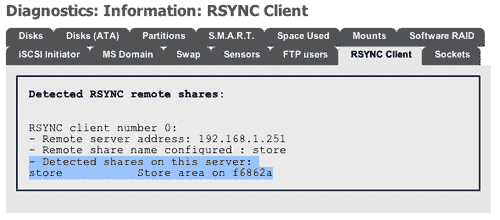

# 第七章. 备份策略

现在您已将数据存储在 FreeNAS 服务器上，并且可以通过 PC、Mac、Linux 或 UPnP 设备访问它，是时候考虑备份了。在本章中，我们将探索多种备份 FreeNAS 服务器数据的选项，包括使用 RSYNC 备份到第二个本地磁盘以及远程计算机。

从某个角度来看，FreeNAS 服务器不支持磁带或光盘（DVD 或蓝光）备份是一个弱点。但从另一个角度来看，这是正常的，因为网络附加存储的本质是可以通过网络访问的。所有操作，包括配置、管理和数据访问，都是通过网络进行的。因此，备份也是通过网络进行的。

进行基于网络的备份有两种主要策略。第一种是直接从远程服务器或工作站启动备份到磁带、压缩文件档案（如 ZIP 或压缩的 tar 文件）或光盘。在这种情况下，数据从 FreeNAS 服务器（通过 CIFS、NFS 或 AFP）提取并写入备份存储（磁带、硬盘或光盘存储）。第二种选择是在 FreeNAS 服务器内部复制数据。在这种情况下，数据仍然保留在 FreeNAS 服务器上，但存储在第二个磁盘或 RAID 集合中。

## 使用 Windows XP 内置的备份工具备份您的 FreeNAS

Windows XP 自带备份程序，要启动它，请点击**开始**，指向**所有程序**，指向**附件**，指向**系统工具**，然后点击**备份**。

### 注

**Windows XP 家庭版**

如果您使用的是 Windows XP 专业版，Windows 备份工具应该已经准备好使用。如果您使用的是 Windows XP 家庭版，您需要按照以下步骤安装该工具：

1\. 将 Windows XP 光盘插入驱动器，如果需要，请在**我的电脑**中双击光盘图标。

2\. 在“欢迎使用 Microsoft Windows XP”屏幕上，点击**执行附加任务**。

3\. 点击**浏览此 CD**。

4\. 在 Windows 资源管理器中，双击**ValueAdd**文件夹，然后是**Msft**，接着是**Ntbackup**。

5\. 双击**Ntbackup.msi**以安装备份工具。

1.  1\. 默认情况下，备份工具会以向导模式启动，如果您对手动配置备份有信心，可以选择进入高级模式。在这里，我们将使用向导模式以便简化操作。

1.  2\. 第一个向导问题是**您想做什么？**，指的是进行备份或恢复文件。默认选项应该是**备份文件和设置**，这正是你想要的，所以只需点击**下一步**。

1.  3\. 现在您可以选择要备份的内容。备份程序主要用于备份本地计算机，但它也可以用于备份网络共享。选择最后一个选项**让我选择要备份的内容**，然后点击**下一步**。


1.  4\. 下一步是选择要备份的项目。在左侧面板中，你可以从 **我的电脑、我的文档** 以及 **我的网络位置** 中选择文件，这些都是你需要备份 FreeNAS 服务器的内容。点击 **我的网络位置** 旁边的小加号 **+**，这将展开 **我的网络位置** 树。在这里，FreeNAS 服务器上的可用共享将被列出。勾选你想要备份的每个共享。使用第二章快速入门指南中的示例配置，其中有一个名为 store 的共享。勾选 store 旁边的框，进行备份。


1.  5\. 点击 **下一步** 进入 **备份类型、目标位置** 和 **名称** 页面。在这里，你可以指定备份数据的存储位置。如果你想使用磁带驱动器，备份工具会在 **选择备份类型** 框中提供一些选项。如果你没有磁带驱动器，那么默认的备份类型将是 **文件**。默认情况下，备份工具会建议将所有内容保存到软盘驱动器。这显然不是一个理智的选择，因此点击 **浏览** 并选择你希望保存备份的位置。

    你可以将备份存储到多个位置：

    +   计算机的硬盘。你需要确保本地硬盘足够大，能容纳备份数据。

    +   共享网络驱动器。你可以将 FreeNAS 服务器备份到另一个网络服务器，甚至是另一个 FreeNAS 服务器。需要注意的是，这种方式可能不是最有效的，因为很可能这个中间的 Windows XP 机器可以从流程中移除，剩下的两台机器（FreeNAS 服务器和另一个网络服务器）可以直接通信进行备份。

    +   外部硬盘驱动器。USB 2.0 和 FireWire 驱动器已经变得非常便宜，而且驱动器的存储空间现在是以 TB 为单位。添加外部硬盘并将其用作备份解决方案既实用又便宜。

    ### 注意

    Windows XP 中的内置备份程序不支持将备份存储到光盘驱动器，如 DVD 或 Blu-ray 光盘。如果你需要这些功能，你需要探索一些其他的免费或商业备份程序。

1.  6\. 最后一步是为备份输入一个名称。像往常一样，要具有描述性。点击 **下一步** 显示向导的最后页面，然后点击 **完成** 立即开始备份。

## 设置定期备份与 XP 内置的备份工具

XP 内置的备份工具也有一些高级选项，包括定期备份的计划安排功能。

1.  1\. 要安排备份，请按照上面描述的步骤开始备份，但当你进入备份向导的最后页面时，不要点击 **完成**，而是点击 **高级** 按钮。

1.  2\. 高级选项的第一页是**备份类型**页面。在这里，你可以选择希望进行的备份类型，包括完全备份（**正常**）或**差异备份**。如果不确定，请保留**正常**（但请注意，这样会每次调度备份时都创建一个完整的 FreeNAS 数据备份）。如果只想备份自上次正常备份以来创建或更改的文件，请选择**差异备份**。

1.  3\. 点击**下一步**进入**如何备份**页面。

### 注意

**备份类型**

以下是不同类型的备份：

**正常备份**——正常备份会复制所有选定的文件，并将每个文件标记为已备份（换句话说，归档属性会被清除）。使用正常备份时，只需要最新的备份文件或磁带就可以恢复所有文件。通常，在第一次创建备份集时，会执行正常备份。

**差异备份**——差异备份会复制自上次正常备份或增量备份以来创建或更改的文件。它不会标记文件为已备份（换句话说，归档属性不会被清除）。如果你进行正常备份和差异备份的组合，恢复文件和文件夹时，需要有最后一次正常备份以及最后一次差异备份。差异备份与正常备份结合使用，是不需要每次备份时都创建完整数据备份的最简便方式。

**复制备份**——复制备份会复制所有选定的文件，但不会将每个文件标记为已备份（换句话说，归档属性不会被清除）。复制备份在正常备份和增量备份之间进行时非常有用，因为复制不会影响这些其他备份操作。

**每日备份**——每日备份会复制当天所有已修改的选定文件。备份后的文件不会标记为已备份（换句话说，归档属性不会被清除）。

**增量备份**——增量备份只会备份自上次正常备份或增量备份以来创建或更改的文件。它将文件标记为已备份（换句话说，归档属性会被清除）。如果你使用正常备份和增量备份的组合，你将需要有最后一次正常备份集以及所有增量备份集才能恢复数据。

1.  4\. 在此页面上，您可以勾选框以在备份完成后验证备份数据。验证备份能为您提供额外的保障，确保备份操作正确，但会延长备份的时间。如需验证数据，请勾选**备份后验证数据**，然后点击**下一步**。在**备份选项**页面，保持选择**将此备份追加到现有备份中**并点击**下一步**。在使用增量备份或差异备份时，建议不要选择**替换现有备份**选项，因为先前的备份对于恢复文件至关重要，以防将来需要恢复。

1.  5\. 在**何时备份**页面上，选择**稍后**而不是**立即**。为此备份任务输入一个名称（例如 FreeNAS 夜间备份），然后点击**设置计划..**。

1.  6\. 现在，您可以为备份设置不同的时间间隔，包括每日、每周和每月。下图显示了设置为每天凌晨 12:05 进行备份，周末除外的配置。


1.  7\. 点击**确定**以退出调度页面，然后点击**下一步**。系统可能会要求您输入将执行此任务的用户的用户名和密码。最好输入管理员的用户名和密码。

1.  8\. 在最终总结页面，点击**完成**以计划备份任务。

### 注意

**移除计划的备份**

如果您希望删除之前设置的备份任务，请进入**控制面板**并双击**计划任务**。在这里，您可以删除备份任务。

# 使用 XP 内置备份工具恢复 FreeNAS 备份

一旦您完成了备份，了解如何在最坏的情况下恢复它是很重要的。

1.  1\. 启动备份程序，并在向导的第一页选择**恢复文件和设置**。

1.  2\. 点击**下一步**，然后双击右侧窗格中列出的备份文件名。

1.  3\. 要进行完整恢复，请勾选所有列出的备份集，然后点击**下一步**。

1.  4\. 要选择性恢复某些文件，请展开不同的备份集并找到您要恢复的文件。勾选文件或文件夹旁的小框，然后点击**下一步**。

    

1.  5\. 在总结页面上，点击**完成**，恢复将开始。

### 注意

默认情况下，文件将恢复到其原始位置，在此情况下为 FreeNAS 服务器。如果您希望将文件恢复到其他位置，请在总结页面点击**完成**之前，点击**高级**。在那里，您可以指定一个不同的恢复位置，并且控制恢复的执行方式（例如，是否覆盖文件等）。

# 备份 FreeNAS 配置文件

在讨论备份时，同样需要提到备份配置文件。这一点很重要，原因有两个：

+   在执行升级时，建议始终备份你的配置信息，以防升级过程中出现问题，并且希望恢复到之前正常的状态。

+   如果你需要重新安装 FreeNAS 软件（无论出于何种原因，包括硬件故障），那么通过恢复配置文件，新的安装可以在几秒钟内配置成和旧的安装完全相同的状态。

## 配置备份

要备份你的配置，进入**系统：备份/恢复**页面。该页面分为两部分：一部分用于备份，另一部分用于恢复。要备份配置，点击**下载配置**。FreeNAS 服务器将把配置文件发送到你的网页浏览器。然后，浏览器会询问你是否希望保存该文件。你应将文件保存到硬盘上。配置文件的文件名格式为*config-<hostname>-<year><month><day> <hour><minute>.xml*，例如：*config-f6862a.local-20080304150414.xml*。

### 什么是 XML？

XML 代表可扩展标记语言，它是一种通用规范，用于创建简单且非常灵活的文本文件，这些文件描述了不同类型的数据。之所以叫做可扩展，是因为它允许用户定义自己的元素。在 FreeNAS 中，它用于存储有关系统的所有信息。

以下是 FreeNAS 配置文件的一个片段：

```
<interfaces>
<lan>
<ipaddr>192.168.1.251</ipaddr>
<subnet>24</subnet>
<gateway>192.168.1.254</gateway>
</lan>
</interfaces>

```

由于 XML 相对容易阅读，我们可以看到这个示例涉及 FreeNAS 服务器的网络组件，我们可以相对容易地找到 IP 地址、子网掩码和默认网关。

## 恢复配置

要恢复配置文件，点击**浏览..**按钮，找到你希望恢复的`.xml`配置文件。然后，点击**恢复配置**。FreeNAS 配置文件将被恢复，之后 FreeNAS 服务器将重启。

# 使用另一个 FreeNAS 服务器作为备份服务器

显然，一个非常有用的选项是使用第二台 FreeNAS 服务器作为主 FreeNAS 服务器的备份。有两种可能的方法来实现这一点：

+   使用内建的 Windows 备份软件

+   连接两个 FreeNAS 服务器

第一种方法已在上一节中介绍，方法是我们在 FreeNAS 备份服务器上创建 FreeNAS 主服务器的备份。

第二种方法的好处是，如果第一台机器的硬件出现故障，第二台机器可以迅速接替故障机器的位置。为了在主服务器和备份机器之间传输数据，我们将使用 RSYNC。

RSYNC 是一种网络协议，专门用于执行网络备份。RSYNC 通过网络创建数据的精确副本，但为了节省网络带宽，它内置了一个算法，只复制与原文件不同的部分。这使得它高效且有效。

在开始之前，你需要设置第二台 FreeNAS 服务器。你需要按照设置 FreeNAS 服务器的常规步骤进行操作：

+   刻录一张 CD 并从中启动（并可选择安装到硬盘）

+   配置网络

+   配置存储（无论是 RAID 还是简单的磁盘）

现在，在主 FreeNAS 服务器上，你需要配置 RSYNC 服务器。

1.  1\. 转到**服务：RSYNCD**并启用 RSYNC 守护进程。你可以保留其余设置不变。

1.  2\. 点击**模块**标签。

1.  3\. 在 RSYNC 中，谈论模块类似于 CIFS 中的共享。要让其他人访问你 FreeNAS 服务器上的特定区域，你需要为其创建一个模块。点击添加圆圈以添加一个新模块。

有 3 个必填字段：名称、评论和路径：

+   **名称**—这是模块的标签，将由 RSYNC 客户端用来识别这个特定的共享资源。

+   **评论**—这是模块的描述，例如：销售材料。这里有一个好的评论对于调试和解决问题至关重要。

+   **路径**—这是通过 RSYNC 共享的存储路径。其格式为*/mnt/storagename*，其中存储名称是你在**磁盘**部分配置的磁盘或 RAID 阵列的挂载点名称。点击路径部分末尾的**...**。这将打开一个简单的文件系统浏览器。点击所需的挂载点（例如 store），然后点击**确定**，你将返回到 RSYNC 模块页面。现在，挂载点（例如*/mnt/store/*）已经作为路径添加了。

1.  4\. 为了额外的安全性，你可以将**访问模式**设置为**只读**，这样可以确保该模块不能被其他 RSYNC 客户端写入。一旦 RSYNC 服务器配置完成，任何网络上的 RSYNC 客户端都可以访问这些文件。为了防止意外发生，最好将其限制为只读。

1.  5\. 剩下的选项可以保留默认设置。

1.  6\. 点击**添加**并应用更改。


现在，在 FreeNAS 备份服务器上，我们需要创建一个 RSYNC 客户端。客户端将连接到服务器并复制本地存储中的文件。每次运行 RSYNC 客户端时，它将把主服务器上的数据备份到备份服务器。由于 RSYNC 算法的特性，只有已更改的数据会被复制，从而减少了复制文件的开销。

1.  1\. 要创建 RSYNC 客户端，请转到备份服务器上的**服务：RSYNCD**。

1.  2\. 点击**客户端**标签。

1.  3\. 点击添加圆圈以创建一个新客户端。

    在**客户端：添加**页面，有 4 个必填字段；本地共享、远程 RSYNC 服务器、远程模块名称和同步时间：

    +   **本地共享**—这是从主 FreeNAS 服务器复制文件的本地存储。它需要足够大，以容纳从主服务器复制过来的所有文件。其格式为**/mnt/storagename**，其中存储名称是你在**磁盘**部分配置的磁盘或 RAID 集的挂载点名称。点击路径部分末尾的**...**，将弹出一个简单的文件系统浏览器。点击所需的挂载点（例如 backup），然后点击**确定**，你将返回到 RSYNC 模块页面。现在，挂载点（例如 */mnt/backup*）已被添加为路径。

    +   **远程 RSYNC 服务器**—这是主 FreeNAS 服务器的 IP 地址。地址将采用点分十进制表示法，例如 192.168.1.250。

    +   **远程模块名称**—这是你在主 FreeNAS 机器的 RSYNC 服务器的模块页面中配置的标签或模块名称。你需要在此准确输入你在该处输入的名称。

    +   **同步时间**—客户端运行以在预定时间同步备份服务器与主服务器。这些同步是通过选择希望同步发生的分钟、小时、天和月来安排的。由于这是一个重复事件，你可以选择备份发生的时间、日期和星期几。例如，要在每周一至周五的凌晨 12:05 AM 备份，你需要选择：

        +   从分钟部分减去 5

        +   从小时中减去 0（记住它是 24 小时制）

        +   从星期几中选择星期一至星期五

        +   天和月将保持为 ALL

        ### 注意

        使用*CTRL*点击（或者在 Mac 上是 Command-click）来选择和取消选择分钟、小时、天、月和星期几。

1.  4\. 你还可以设置可选参数**删除发送方不存在的文件**。选中此项意味着，如果主 FreeNAS 服务器上的文件被删除，则同步发生时备份服务器上的文件也将被删除。这样做的负面影响是，如果主服务器上的文件被删除，它将永久丢失（除非你也使用其他类型的备份系统），因为它也会从备份服务器上删除。需要注意的另一点是，如果文件未被删除，备份数据的大小将不断增加，即使主服务器上的文件被删除，它也不会减少。

1.  5\. 现在点击**保存**并应用更改。

就这样，当下一个同步间隔到来时，两个服务器应该会自动同步。

## 调试你的 RSYNC 设置

如果你的备份计划每天执行一次，验证备份是否发生可能是一个漫长的过程。每次输入简单的错误时，你都需要等待 24 小时才能检查备份是否已执行。这可能会非常令人沮丧。你可以做几件事来确保 RSYNC 配置正确。

为了缩短等待时间，你可以将备份临时安排在几分钟后执行。然后，当你确认备份正常工作时，你可以安排你希望的备份时间。

在备份服务器上，可以检查 RSYNC 客户端是否能够与主 FreeNAS 服务器上的 RSYNC 服务器通信，并且模块是否可见。进入**诊断：信息**并点击**RSYNC 客户端**标签。在这里，每个配置过的 RSYNC 客户端将会列出，并显示其配置参数。最有用的信息是**此服务器上检测到的共享**部分。在这里，RSYNC 客户端已经联系了服务器并请求模块列表。可用的模块将列出。

如果模块列出并且特别是备份服务器所需要的模块可用，那么你就知道配置是正确的。



在主服务器上，有一个 RSYNC 活动的日志文件。这将帮助你检查备份是否正在进行。进入**诊断：日志**并点击**RSYNCD**标签。默认情况下，日志底部显示的是最新的条目。你需要查找类似于下面的内容：

**3 月 4 日 12:35:00 rsyncd[3545]：来自 UNKNOWN (192.168.1.252) 的连接**

**3 月 4 日 12:35:00 rsyncd[3545]：来自 UNKNOWN (192.168.1.252) 的存储同步**

**3 月 4 日 12:35:00 rsyncd[3545]：正在构建文件列表**

**3 月 4 日 12:35:00 rsyncd[3545]：发送 673 字节，接收 70 字节，总大小 3998023**

这表明已经建立了连接（在这个例子中是从我的备份服务器），并且启动了*store*模块的同步。最后一行显示了网络流量的大小，在这个例子中，由于没有需要同步的更改，流量很小。

# RSYNC 内部备份

与两台 FreeNAS 服务器使用 RSYNC 同步数据类似，FreeNAS 也有一个选项，可以使用 RSYNC 在同一 FreeNAS 服务器内部从一个硬盘到另一个硬盘同步数据。这被称为本地 RSYNC 同步。要使用此功能，你需要至少两块硬盘或 RAID 阵列（源和目标），并且它们都需要配置并挂载。

要启用此功能，进入**服务：RSYNCD**并点击**本地**标签。然后点击添加按钮来配置新的本地同步。你需要填写三个字段来配置同步：**源共享、目标共享**和**同步时间：**

+   **源共享**—这是需要备份的数据的挂载点。格式为*/mnt/storagename*，其中存储名称是你在**磁盘**部分配置的磁盘或 RAID 阵列的挂载点名称。点击路径部分末尾的**...**，这将弹出一个简单的文件系统浏览器。点击所需的挂载点（例如 store），然后点击**OK**。你将被带回到 RSYNC 模块页面。现在，挂载点（例如 /mnt/store/）已作为路径添加。

+   **目标共享**—这是你希望数据被复制到的挂载点。格式为/mnt/storagename，其中存储名称是你在**磁盘**部分配置的磁盘或 RAID 阵列的挂载点名称。点击路径部分末尾的“...”这将弹出一个简单的文件系统浏览器。点击所需的挂载点（例如 backup），然后点击**OK**，你将被带回到 RSYNC 模块页面。现在，挂载点（例如 /mnt/backup/）已作为路径添加。

+   **同步时间**—程序按计划时间运行，以同步两个存储区域。这些同步是通过选择希望它们发生的分钟、小时、日期和月份来安排的。由于这是一个周期性事件，你可以选择备份的时间、日期和星期几。

## 调试你的内部 RSYNC 设置

与基于网络的 RSYNC 进程一样，如果你的备份是每天安排一次，验证备份是否发生可能是一个漫长的过程。你可以做几件事来确保你的 RSYNC 配置正确。

确保备份正常工作的方法是将第一次备份安排在几分钟后。然后，当你确认备份正常工作时，可以安排你希望的备份时间。

你还可以在日志文件中检查 RSYNC 活动。为此，请转到**诊断：日志**并点击**RSYNCD**标签。默认情况下，最新的条目会显示在日志底部。查找类似以下内容的条目：

**3 月 4 日 14:48:00 root: 本地 RSYNC 从 /mnt/store2/ 到 /mnt/backup/ 开始**

**3 月 4 日 14:48:00 root: 本地 RSYNC 同步从 /mnt/store2/ 到 /mnt/backup/ 结束**

为了将其与基于网络的 RSYNC 活动区分开，注意第一行写着**本地 RSYNC 开始**，然后列出了源和目标。不幸的是，没有更多的信息，但你可以看到同步完成的时间。在这个特定示例中，它是在不到 1 秒的时间内完成的，但没有需要执行的同步，并且文件数量有限。

# 镜像与传统备份

如果您使用 RSYNC（或 RAID），是否需要进行其他类型的备份？这是一个重要问题，简单的回答是：是的，您需要。使用 RAID 或镜像备份（通过 RSYNC）的主要优势在于您可以避免硬件故障的风险。在 RAID 的情况下，如果某个磁盘发生故障，服务器会继续运行，磁盘更换后，系统恢复如初，数据不会丢失。当数据在另一台服务器上进行镜像时，如果主服务器出现故障，数据仍然完整保存在另一台服务器上。

然而，RAID 和 RSYNC 并不能保护您免受人为错误的影响。场景是这样的：您有一份重要的文件，被某人不小心删除了。该文件的唯一副本存在于 FreeNAS 服务器上。如果您使用 RAID，那么文件在被删除的瞬间会从 RAID 阵列中的所有磁盘上被删除。如果您使用镜像备份，那么在镜像副本被删除之前，您有一个短暂的窗口期。这些备份方式没有历史记录，无法回到过去找到某个文件的特定版本或已删除的文件。

离线备份到磁带或光盘的优势在于，一旦备份完成，磁带或光盘可以存放在架子上（最好是保险箱里），当您在 1 个月或 1 年后需要该备份时，它仍然在那里，且数据完好（前提是您在备份时验证了其完整性）。

除了 RAID 和 RSYNC 镜像备份外，您还应该考虑进行其他类型的离线备份，像本章前面所述的*使用 Windows XP 内置的备份工具备份您的 FreeNAS*的过程那样。市面上有许多商业和免费程序可以帮助您完成这一操作。

# 总结

在本章中，我们已经讨论了为您的 FreeNAS 服务器提供的不同备份策略。由于它是面向网络的，因此备份也必须通过网络进行。我们介绍了如何使用 Windows XP 备份服务器，并使用 RSYNC 在远程服务器和另一块硬盘上创建数据副本。

在下一章中，我们将讨论高级系统配置。
