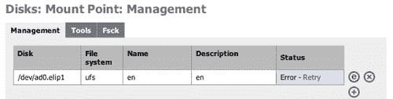
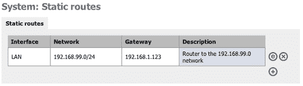

# 第八章 高级系统配置

如果你到目前为止已经完成了本书中的所有内容，你几乎已经成为 FreeNAS 方面的专家。只需再学习几个知识点，你的培训就会完成。本章将介绍一些高级系统配置内容，如磁盘加密、添加交换空间以及调整 FreeBSD。

# 磁盘加密

如果你在 FreeNAS 服务器上存储的数据属于敏感性质（例如军事、医疗、金融或其他机密数据），那么在服务器可能落入不当之手的情况下，考虑使用加密来保护数据是值得的。

如果安全性对你来说是重中之重，那么加密磁盘上的数据只是你应采取的几项措施中的一项。举例来说，如果你的建筑物或建筑物内的人（例如员工）没有严格的安全措施，那么加密硬盘的意义就不大。某些人（无论是内部人员还是外部人员）可以通过网络访问你的数据，复制敏感数据，然后将其通过电子邮件发送到几乎任何地方。加密硬盘并不能阻止这种情况发生。

FreeNAS 提供了对整个磁盘进行强加密的功能。如果服务器被盗，罪犯将很难访问磁盘上的数据。

通常，向 FreeNAS 服务器添加新磁盘的步骤如下：

1.  1\. 在 **磁盘：添加** 中添加磁盘。

1.  2\. 在 **磁盘：格式化** 中格式化磁盘。

1.  3\. 在 **磁盘：挂载点** 中添加挂载点。

添加新加密磁盘的步骤几乎与添加普通磁盘相同，唯一不同的是在第 1 步和第 2 步之间需要新增一个创建加密卷的步骤。新的操作流程为：

1.  1\. 在 **磁盘：添加** 中添加磁盘。

1.  2\. 使用先前添加的磁盘在 **磁盘：加密** 中创建加密卷。

1.  3\. 在 **磁盘：格式化** 中格式化磁盘。

1.  4\. 在 **磁盘：挂载点** 中添加挂载点。

请注意，加密卷的创建发生在磁盘格式化之前。这是因为 FreeNAS 使用的加密方式非常底层。它不是基于文件的（意味着每个文件都被单独加密），而是基于扇区的，这意味着写入硬盘的每一条信息（包括目录名等）都会被加密。

### 注意

**你真的需要加密吗？**

加密你的数据实际上增加了数据丢失的可能性。你的数据更有可能因为加密配置错误或丢失密钥而丢失，而不是因为被盗。**加密硬盘没有密码恢复系统**。如果密码丢失、遗失、忘记或持有者无法访问，那么数据实际上就丢失了。

## 在 FreeNAS 中加密磁盘

如果你正在加密一个之前存有数据的磁盘，重要的是在使用该磁盘进行加密之前完全擦除所有旧数据。因为当磁盘为加密初始化时，旧数据并不会被物理覆盖，因此如果磁盘被盗并进行分析，旧数据仍然可以在硬盘的扇区级别访问。不幸的是，FreeNAS 没有提供此功能，你需要将磁盘从 FreeNAS 服务器中移除，并在其他机器上进行安全擦除。

要加密磁盘，首先要确保它已经通过**磁盘：添加页面**添加到系统中。然后，转到**磁盘：加密**。

点击添加圆圈以添加一个新的加密磁盘。添加加密磁盘时有四个参数：

+   **磁盘—** 选择你想要加密的磁盘。它必须是整个磁盘，而不能是磁盘的分区。这意味着你不能加密安装了 FreeNAS 的第一个分区上的磁盘的第二个分区。此外，该磁盘必须先在**磁盘：添加**中添加。

+   **加密算法—** 你可以选择三种不同的加密算法来加密你的数据。如果不确定，建议使用 AES，因为它是美国政府使用的标准加密方法，经过广泛分析，现在已在全球范围内使用。

+   **密码短语—** 密码。每当磁盘在 FreeNAS 服务器上挂载时（通常是在重新启动后），需要输入密码才能解锁加密驱动器。使用一个强且安全的密码对于确保磁盘加密的有效性至关重要。不要使用你的生日或女儿的名字！

+   **初始化—** 如果该磁盘以前从未作为加密磁盘使用过，则需要初始化并为加密过程做好准备。除非这是一个以前是加密磁盘的磁盘，否则需要勾选此框，才能将其添加回 FreeNAS 服务器。

### 注意

初始化磁盘将导致该磁盘上的所有数据丢失。

在从下拉框中选择磁盘并选择一个算法后，你需要输入一个不可猜测的强密码，并勾选**初始化**框。然后点击**添加**。磁盘将被准备好并进行加密。输出结果如下所示：

```
Encrypting '/dev/ad1'... Please wait!
Calculating number of iterations...
Done, using 38638 iterations.
Metadata value stored on /dev/ad1.
Done.
Attaching provider '/dev/ad1'.
Attached to /dev/ad1.
Done.

```

让人放心的**完成**，告诉你一切顺利。最好还是双重检查输出，以确保没有错误。

现在磁盘已设置为加密状态，可以像其他磁盘一样使用。你可以格式化它、挂载它，并通过 CIFS、NFS、AFP 等共享它。

## 重新启动时输入密码

由于该卷已加密，因此需要密码才能解锁并访问它。每当 FreeNAS 服务器重新启动时，在输入密码之前，加密卷将无法访问。

系统启动后，前往**磁盘：挂载点**。你会看到一个错误，因为 FreeNAS 无法在没有密码的情况下挂载加密卷。



现在前往**磁盘：加密**。加密卷的状态为**未附加**。要输入密码，请点击**工具**标签。选择*加密磁盘名称*下拉列表中的加密磁盘，然后选择命令**附加**（这应该是默认的）。现在输入密码并点击**发送命令！** 输出应该类似于以下内容：

```
Attached to /dev/ad0.
Done.
Mounting device.
Successful.

```

如果你输入了错误的密码，输出可能会是这样的：

```
Wrong key for ad0.

```

点击**管理**标签，磁盘状态现在将显示为**已附加**。最后，返回到**磁盘：挂载点**并检查挂载点状态是否为**OK**。如果不是，请点击**重试**（强制 FreeNAS 重新挂载磁盘），然后它应该显示为**OK**。

## 加密工具

当 FreeNAS 服务器重新启动时，需要输入密码以解锁卷。为此，你需要使用**磁盘：加密**中的**工具**标签（参见上面的*重新启动时输入密码*）。以下是对加密磁盘可以执行的其他操作的概述。

### 如何解锁加密磁盘——附加和拆卸

附加和拆卸是 FreeBSD 中的技术术语，表示解锁和锁定。附加意味着提供的密码将用于打开磁盘并设置必要的解密参数。一旦成功附加，磁盘就可以像其他硬盘一样使用。拆卸是相反的操作。在这里，磁盘被锁定，没有正确的密码数据无法访问。要拆卸一个已附加的磁盘，从*加密磁盘名称*下拉列表中选择已附加的加密磁盘，选择命令**拆卸**，然后点击**发送命令！**

### 如何更改加密磁盘的密码——setkey

保持在**磁盘：加密**页面的**工具**标签，你可以通过使用 setkey 命令来更改加密磁盘的密码。从*加密磁盘名称*下拉列表中选择加密磁盘，然后选择命令*setkey*。现在输入旧密码和新密码，然后点击**发送命令！** 输出只是一个简单的**完成**。

### 注意

系统不会要求你确认新密码。如果你在输入新密码时犯了错误，所有数据将丢失，因为你无法解锁磁盘。

### 检查加密磁盘的状态——list 和 status

要获取有关加密驱动器的简单状态信息，你可以使用`status`和`list`命令。

`status`简单列出哪些驱动器被加密，实际上可能甚至不会告诉你它们的状态！以下是一个示例输出：

```
Name Status Components
ad0.eli N/A ad0

```

list 命令更加详细。一个示例输出会是：

```
Geom name: ad0.eli
EncryptionAlgorithm: AES-CBC
KeyLength: 128
Crypto: software
UsedKey: 0
Flags: NONE
Providers:
1\. Name: ad0.eli
Mediasize: 10262568448 (9.6G)
Sectorsize: 512
Mode: r1w1e2
Consumers:
1\. Name: ad0
Mediasize: 10262568960 (9.6G)
Sectorsize: 512
Mode: r1w1e1

```

`Geom name:`告诉你加密硬盘的名称。它将是磁盘设备的名称（比如第一个 IDE 硬盘是 ad0），后面跟着`.eli`，在我们的例子中是：`ad0.eli`。`EncryptionAlgorithm:`告诉你使用的是哪种算法（在此情况下是 AES），而`KeyLength:`告诉你加密的强度。

提供者和消费者是加密过程的两个端点。在 FreeBSD 术语中，这意味着物理硬盘（ad0）和伪设备（ad0.eli），后者是加密后的硬盘。当 FreeBSD 写入硬盘的伪版本（ad0.eli）时，加密软件应用其算法，并将加密数据写入真实硬盘（ad0）。读取过程则相反；加密数据从硬盘中读取，并传递给解密软件，然后再传递给更高层次。

# 高级硬盘参数（S.M.A.R.T）

自监测、分析与报告技术（Self-Monitoring, Analysis, and Reporting Technology，简称 S.M.A.R.T）是一个用于监测硬盘的系统，报告涉及硬盘可靠性的各种特征。理论上，监控这些特征应有助于预测硬盘故障。根据硬盘制造商 Seagate 的说法，机械故障（通常是可以预测的故障）占硬盘故障的 60%。

不是所有硬盘都具备 S.M.A.R.T 功能，不同的制造商测量不同的特征，并定义不同的故障阈值。实际上，每个硬盘型号根据其制造商设定的规则定义其健康状况。因此，一种硬盘型号在某些特征上可能与另一种硬盘型号有所不同，但两者都被制造商定义为可接受。

每个硬盘的特征或属性有两个值：一个是原始值，其含义由硬盘制造商定义。另一个是标准化值，范围从 1 到 253（其中 1 为最差，253 为最好）。

## 启用并使用 FreeNAS 的 S.M.A.R.T

在你能在 FreeNAS 服务器上使用 S.M.A.R.T 之前，你需要检查硬盘是否支持 S.M.A.R.T。进入**诊断：信息**并点击**S.M.A.R.T**标签页。输出将显示一个磁盘列表（包括 IDE、SATA、SCSI，甚至闪存磁盘），以及所有可用的 S.M.A.R.T 信息。

如果某个特定设备不支持 S.M.A.R.T，输出将简单地显示：

```
Device does not support SMART

```

如果设备支持 S.M.A.R.T，它将报告更多关于硬盘的信息，包括型号编号。以下是一个老化的 10GB 量子火球磁盘的示例：

```
Device Model: QUANTUM FIREBALLlct10 10
Serial Number: 872001057089
Firmware Version: A03.0900
User Capacity: 10,262,568,960 bytes
Device is: Not in smartctl database [for details use: -P showall]
ATA Version is: 4
ATA Standard is: ATA/ATAPI-4 T13 1153D revision 15
Local Time is: Tue Mar 18 21:22:34 2008 UTC
SMART support is: Available - device has SMART capability.
SMART support is: Disabled

```

这里需要注意的关键是*SMART 支持：已启用—设备具有 SMART 功能*，但*SMART 支持：已禁用*。

要启用此磁盘的 S.M.A.R.T 监控，进入**系统：高级**并勾选**S.M.A.R.T 守护进程**框。这将启用 S.M.A.R.T 守护进程（监控进程）并将状态记录到日志文件中。

现在，如果返回到 **诊断：信息** 页面，再次点击 **S.M.A.R.T** 标签，你将看到输出发生了显著变化。第一个不同点是 *SMART 支持：已启用*。在初步摘要下方，现在有一份关于硬盘可靠性的各项驱动属性的全面列表。

第一行通常是硬盘整体健康状态的报告。如果硬盘健康，它应该显示如下内容：

```
SMART overall-health self-assessment test result: PASSED

```

如果整体健康状态被列为“失败”，你需要立即备份硬盘并更换为其他硬盘。

在整体健康检查下方，是一份硬盘特定信息的列表，最终以一份*厂商特定的 S.M.A.R.T 属性及阈值*清单作为总结。此列表展示了每个属性及其标准化值、该属性在硬盘生命周期中的最差值以及该值的阈值。在查看这些值时，需要记住 1 是最差情况，253 是最好情况。例如：

```
Vendor Specific SMART Attributes with Thresholds:
ATTRIBUTE_NAME FLAG VALUE WORST THRESH RAW_VALUE
Raw_Read_Error_Rate 0x0029 100 253 020 0
Spin_Up_Time 0x0027 083 081 020 2195
Start_Stop_Count 0x0032 093 093 008 5025
Reallocated_Sector_Ct 0x0033 100 100 020 0
Seek_Error_Rate 0x000b 100 100 023 0
Power_On_Hours 0x0012 090 090 001 6675
Calibration_Retry_Count 0x0013 100 100 020 0
Power_Cycle_Count 0x0032 093 093 008 4740
Read_Soft_Error_Rate 0x000b 100 100 023 0
UDMA_CRC_Error_Count 0x001a 116 116 000 84
Reallocated_Event_Count 0x0010 100 100 020 0
Current_Pending_Sector 0x0032 100 100 020 0
Offline_Uncorrectable 0x0010 100 253 000 0

```

查看 `Raw_Read_Error_Rate`，可以看到其标准化值为 `100`，但原始值为 `0`。这意味着硬盘上没有读取错误，磁盘制造商已将其标准化为 `100`。然而，重要的是阈值为 `20`。因此，如果此硬盘开始出现读取错误，标准化值将开始减少，直到达到 `20`，此时硬盘的整体健康状态将报告为“失败”。

一个故障硬盘的属性可能如下所示：

```
ATTRIBUTE_NAME VALUE WORST THRESH WHEN_FAILED
Reallocated_Sector_Ct 136 136 140 FAILING_NOW

```

请注意，`when_failing` 列报告硬盘正处于故障过程中。查看标准化值时，我们看到 `136`，而阈值为 `140`。记住，数字越低，情况越糟，我们看到这个特定属性刚刚超过了其阈值，因此触发了故障警告。

在 FreeNAS 服务器上，当某个属性超过阈值时，它会在 **诊断：日志** 页面上的 SMARTD 日志中报告。

下面是一些关键的 S.M.A.R.T 属性列表，如果它们超过阈值，硬盘处于临界状态：

| 属性 | 含义 |
| --- | --- |
| 读取错误率 | 测量在读取磁盘数据时发生的读取错误的速率。 |
| 重映射扇区计数 | 重映射的扇区数量。当硬盘发现某个扇区有错误时，它会将该扇区标记为“重映射”并将数据转移到专用的保留区域。如果重映射扇区的数量增加过多，硬盘开始出现故障。 |
| 旋转重试次数 | 表示旋转启动尝试的重试次数。这是总的重试次数。如果这个数字增加，通常是机械故障的迹象。 |
| 不可修正扇区计数 | 这是读取或写入某个扇区时发生的不可修正错误的总数。如果这个数字开始增加，可能表示硬盘的磁性表面存在问题。 |

# 文件系统一致性检查—FSCK

FreeNAS 服务器提供了一个工具来验证磁盘上的文件系统是否健康。这与检查硬盘的 S.M.A.R.T 状态不同，S.M.A.R.T 是硬件级别的，且由磁盘制造商提供支持。然而，FreeBSD/FreeNAS 以特定顺序和使用特殊结构写入磁盘数据，这使得它能够查找文件和文件夹。这种特殊结构被称为文件系统，定期验证文件系统的完整性并确保其没有错误是很重要的。文件系统错误最常发生在 FreeNAS 服务器在没有正确关机的情况下关闭时。这意味着文件系统可能处于一个写操作已排队或缓存但未实际完成的状态。因此，剩下的就是文件系统不一致。FreeBSD 用于检查文件系统一致性的工具叫做 fsck（文件系统一致性检查）。

要运行文件系统一致性检查，请转到**磁盘：挂载点**并点击**Fsck**选项卡。首先，您需要从下拉框中选择要检查的磁盘。接下来，您需要决定如何运行文件系统检查。

如果未勾选**卸载磁盘/分区**，则 fsck 将在只读模式下运行。在此模式下，文件系统会检查错误，但任何错误都只会报告而**不会**被修复。在忙碌的磁盘上运行文件系统检查可能会降低性能。

如果勾选了**卸载磁盘/分区**，磁盘将首先被卸载，所有错误将自动修复。在文件系统检查期间，磁盘上的数据将无法提供给网络用户。

fsck 的输出结果将类似于以下内容：

```
** /dev/ad0p1 (NO WRITE)
** Last Mounted on /mnt/store
** Phase 1 - Check Blocks and Sizes
** Phase 2 - Check Pathnames
** Phase 3 - Check Connectivity
** Phase 4 - Check Reference Counts
** Phase 5 - Check Cyl groups
317 files, 17249 used, 4833873 free (121 frags, 604219 blocks, 0.0% fragmentation)
Successful

```

### 注意

**大型磁盘和 fsck**

根据硬盘的大小，运行 fsck 可能需要几分钟到几小时不等。因此，在大型硬盘上，从 Web 界面运行 fsck 可能会导致超时。fsck 将修复文件系统上的所有错误，但您不会在 Web 界面看到输出。

另外，请注意，fsck 运行时需要大量的 RAM。对于大容量（2TB 或更大）的磁盘，建议至少配备 512MB RAM。

也可以通过命令行运行 fsck 工具。如果在等待命令完成时 Web 界面超时，这对大型硬盘可能很有用。有关更多详细信息，请参阅第十章。

# 高级操作系统调优

FreeNAS 的底层操作系统是 FreeBSD。像所有复杂的系统一样，FreeBSD 有许多配置参数可以改变其行为。在 FreeBSD 系统的核心部分是其内核，内核可以被“调节”以在某些情况下表现得更好。FreeNAS 开发人员定义了一组可以通过点击鼠标轻松调节的内核参数。这些参数如下：

| 参数 | 正常值 | 调整后的值 | 含义 |
| --- | --- | --- | --- |
| `net.inet.tcp.delayed_ack:` | 1 | 0 | 这个参数告诉 FreeBSD 尝试在数据包中包含 TCP ACK 信息，而不是发送额外的包来表示连接结束。 |
| `net.inet.tcp.sendspace:` | 32768 | 65536 | 这个参数与`net.inet.udp.recvspace`一起定义了最大网络数据包大小。增大数据包大小可以提高网络性能，但也会增加内存使用。 |
| `net.inet.udp.recvspace:` | 42080 | 65536 | 请参见上面。 |
| `net.inet.udp.maxdgram:` | 9216 | 57344 | 这是最大外发 UDP 数据报大小。增加它可以改善网络性能，但也会增加内存使用。 |
| `net.local.stream.recvspace:` | 8192 | 65535 | 这个和下面的.sendspace 是网络缓冲区的进一步调节。性能可以提高，但内存使用也会增加。 |
| `net.local.stream.sendspace :` | 8192 | 65535 | 请参见上面。 |
| `kern.ipc.maxsockbuf:` | 262144 | 2097152 | 这是 TCP 套接字两端的最大合并缓冲区大小。随着其他网络相关参数的增加，该值也会增加，从而提升网络性能。 |
| `kern.ipc.somaxconn:` | 128 | 8192 | 这个参数控制系统能够处理的同时连接请求数。 |
| `kern.ipc.maxsockets:` | 3072 | 16424 | 这个参数控制系统可用的最大套接字数。每个网络连接都需要一个套接字。 |
| `kern.ipc.nmbclusters:` | 3072 | 60000 | 这个参数控制系统分配的*mbufs*数量。*mbuf*是内核用于网络的内存块。这个值随着其他网络缓冲区的增加而增加。 |
| `kern.maxfiles:` | 1064 | 65536 | 系统在任何时候可以打开进行读取或写入的最大文件数。 |
| `kern.maxfilesperproc:` | 957 | 32768 | 这是单个进程可以打开的最大文件数。 |

启用内核调优会带来两件事情。首先，FreeNAS 服务器的性能可能会提高；其次，FreeNAS 服务器的内存使用量也会增加。如果你的系统有足够的内存（256MB 或更多），并且服务器面临较重的网络流量，尝试启用内核调优。

要启用它，请转到**系统：高级**并勾选**调优**框。点击**保存**以应用更改。

# 调整网络设置

FreeNAS 服务器有几个高级部分用于控制网络。第一个是为机器中每个网络安装的全局网络配置，第二个是向网络路由表添加静态路由的能力。

## MTU、设备轮询、速度和双工

在**接口：LAN**页面（其中 LAN 代表默认网络卡），有四个参数可以更改，以提高网络性能。

| 参数 | 解释 |
| --- | --- |
| MTU | 最大传输单元（MTU）是您网络中可以发送的最大数据包大小（以字节为单位）。更高的 MTU 意味着更高的带宽效率。对于 10/100 以太网网络，1500 是允许的最大 MTU。对于千兆以太网网络（支持 Jumbo Frame），9000 是最佳（也是最大）选项。 |
| 设备轮询 | 设备轮询是一种技术，它使系统定期轮询网络设备以获取新数据，而不是依赖中断。这可以减少 CPU 负载，从而提高吞吐量，但代价是稍微增加了转发延迟（设备每秒轮询 1000 次）。并非所有网络卡都支持轮询。 |
| 速度 | 网络卡的速度应该自动选择（自动选择），但如果您发现没有被自动选择，您可以手动选择以下几种：10baseT/UTP、100baseTX、1000baseTX 和 1000baseSX。 |
| 双工 | 如果您的网卡和它所连接的交换机都支持全双工通信（即网卡和交换机可以在发送的同时接收，反之亦然），那么您可以在这里进行设置。 |

### 注意

避免双工不匹配

双工不匹配发生在两个连接的设备在不同的双工模式下运行时（一个是半双工，另一个是全双工）。双工不匹配的结果是网络没有完全“断开”，但非常慢。双工不匹配可能是由于错误地手动设置两个连接的网络接口在不同的双工模式下，或者由于将执行自动协商的设备连接到一个手动设置为全双工模式的设备。自动协商设备如果未能协商成功，会假定为半双工。

## 添加静态路由

如果您使用两个或更多的网卡，有时添加静态路由到网络路由表是有益的。网络路由表定义了每个网络连接的路由去向，换句话说，就是数据流在网络中所走的路径。默认路由在配置默认网关时定义，无论是在控制台菜单中还是在 Web 界面的接口部分。通过定义默认网关，您为所有未指定目标为本地网络的流量创建了默认路径。假设路由器（可以是另一台 PC、一台 DSL 调制解调器或者网络路由器）能够正确地将流量指向目的地。如果您有多个网卡，或者有第二个路由器处理网络中特定部分的流量，添加静态路由来指示 FreeNAS 服务器将该特定网络的所有流量定向到第二个路由器而不是默认网关是有益的。

要添加静态路由，请进入**系统：静态路由**，然后点击添加圆圈。需要完成三个必填字段：

| 参数 | 含义 |
| --- | --- |
| 接口 | 指定此路由适用的接口。 |
| 目标网络 | 此静态路由的目标网络。 |
| 网关 | 用于到达目标网络的网关。 |

目标网络的形式为点分地址（或更具体地说，是子网地址，其末尾数字将根据网络掩码变为 0），后面跟着指定的网络掩码，例如 8、16 或 24 分别表示 255.0.0.0、255.255.0.0 或 255.255.255.0。

例如，如果我的 FreeNAS 服务器的 IP 地址是 192.168.1.250，并且有一个除了默认网关之外的路由器，可以将流量路由到 192.168.99.0 网络（意味着所有 IP 地址从 192.168.99.1 到 192.168.99.254 的机器），且该路由器的 IP 地址是 192.168.1.123，那么设置将是：

目标网络：192.168.99.0/24

网关：192.168.1.123

点击**添加**并应用更改以添加静态路由。



# 使用无线网络

如果您有一块 FreeNAS 支持的无线网卡，您可以将其配置为提供无线访问给 FreeNAS 服务器。

要配置无线网卡，请进入**接口：管理**页面。在这里，您可以配置网卡并设置各种无线参数，例如服务集标识符（SSID）和频道号。您还可以使用有线等效隐私（WEP）来配置无线安全。

# 添加交换文件

在 FreeNAS 服务器上的一些操作，特别是使用 iSCSI 目标和对大硬盘运行 fsck，要求至少有 256MB 的内存（随机存取内存）。如果系统没有 256MB 的内存，可以使用交换文件临时扩展系统内存。

FreeBSD 将其物理内存分割成称为页面的内存块。交换是将一页内存复制到交换文件的过程，以释放该页面的内存。物理内存和交换文件的总大小就是可用的虚拟内存量。

当系统需要更多内存，而物理内存不足时，交换就变得必要；内核（FreeBSD 的核心）会将较少使用的页面交换出去，并为当前需要立即使用内存的应用程序（进程）提供内存。

然而，交换确实有其缺点。与内存相比，磁盘非常慢。访问磁盘的速度可能比访问物理内存慢几万倍。交换越多，系统的速度就会越慢。

在添加交换文件之前，最好考虑为系统增加更多的内存。

要添加交换文件，请前往**系统：高级**并点击**交换**标签。要启用交换文件的使用，勾选标题栏中的**启用**框。选择你希望用来存放交换文件的磁盘，它会在**用于交换的挂载点**下拉框中按挂载点名称列出。现在，输入你需要的交换空间大小。256MB 足够用了（注意，你不需要输入 MB，只需输入 256）。

一旦你点击**保存**，一个名为`swap_file`的文件将会在指定的磁盘上创建，并用于交换。

为了再次确认你的交换文件配置正确，请前往**诊断：信息**并点击**交换**标签。输出应该如下所示：

```
Swap Status:
Device 512-blocks Used Avail Capacity
/dev/md0 524288 0 524288 0%

```

这显示当前正在使用一个 256MB 的交换文件（524288 除以 2，因为它以 512 字节块的形式显示，而不是以千字节显示）。目前，所有的交换空间都是可用的，因为没有任何交换空间被使用。

# 启用安全外壳连接（SSH）

在第九章和第十章中，可能需要连接到 FreeNAS 服务器并使用 FreeBSD 的命令行。命令行通常称为终端或 Shell（以同名的命令行解释器命名）。安全外壳（SSH）是一种通过加密连接在 FreeNAS 上使用命令行的方式，它使你能够在不担心别人窥探网络并窃取密码的情况下使用 FreeNAS 服务器。

默认情况下，SSH 访问是禁用的，要启用它，请前往**服务：SSHD**并通过勾选配置数据表标题中的**启用**来启用**SSH 守护进程**（服务器）。点击**保存并重启**以启动 SSH 服务器。

默认情况下，SSH 仅允许本地 FreeNAS 用户登录，如果他们被授予了**完整 Shell**访问权限。前往**访问：用户和组**。如果你没有创建任何用户，请先创建一个（在创建组后）。创建用户时，确保勾选**完整 Shell**框。这样 FreeNAS 就会知道该用户可以通过 SSH 连接到服务器并访问命令行。有关用户管理的更多细节，请参见第五章。

如果你已经创建了一个用户，并希望授予其 **完全 Shell** 访问权限，那么点击用户名旁边的 **编辑** 按钮（一个圆圈中的“e”字母），勾选 **完全 Shell** 属性。点击 **保存** 来存储新设置并应用更改。

在 FreeBSD 中，有两类用户，一类是普通用户，权限有限（例如无法停止或启动服务），另一类是管理员，在 FreeBSD 中称为 **root**。Root 是一个超级用户，可以对服务器执行任何操作。

## 允许 Root 登录

在故障排除和使用 FreeBSD 时，最有用的用户是 root。默认情况下，root 用户不允许通过 SSH 登录到 FreeNAS 服务器，因为这可能带来安全风险。要允许 root 登录，请前往 **服务：SSHD** 并勾选 **允许 root 登录**。然后点击 **保存并重启** 来启动 SSH 服务器。

### 注意

**Root 密码**

root 密码与 web 界面密码相同，默认情况下是 *freenas*。如果 web 界面密码发生更改，root 密码也会随之更改。

## SSH 身份验证的类型

SSH 有两种身份验证方法。第一种是所谓的 *键盘交互式身份验证*，简单来说——意味着你输入用户名和密码来登录。第二种是 *公钥身份验证*，这里使用一种叫做公钥加密的系统，使远程 SSH 客户端能够在没有密码的情况下登录到 FreeNAS。

在公钥加密中，有两个密钥，分别是私钥和公钥。公钥加密的魔力在于，你可以自由地（实际上，是鼓励）将你的公钥提供给任何需要它的人。然后，那个人可以使用公钥加密一些信息，一旦加密，只有私钥可以解锁它。拥有你的公钥的人无法解锁用你的公钥加密的信息。

对 SSH 来说，这意味着如果 FreeNAS 拥有你的公钥副本，它可以正确验证你是私钥的持有者。因此，在你与 FreeNAS 服务器之间建立了安全连接，你可以使用命令行，且密码和命令无法被窥视。

要使其与 FreeNAS 服务器正常工作，需要执行以下几个简单步骤：

1.  1\. 需要生成一对公钥和私钥。

1.  2\. 公钥需要被复制到 FreeNAS 服务器。

1.  3\. 你连接到 FreeNAS 服务器，通过使用公钥加密并用私钥解密的数据交换，建立了安全的通信。

以下示例适用于 Apple OS X 和 Linux。如果你使用 Linux，需要确保已安装 OpenSSH 包（大多数 Linux 发行版默认安装）。

首先，需要生成一对公钥和私钥。这可以通过 *ssh-keygen* 命令完成：

```
ssh-keygen

```

输出将类似于以下内容：

```
Generating public/private rsa key pair.
Enter file in which to save the key (/Users/gary/.ssh/id_rsa):
Enter passphrase (empty for no passphrase):
Enter same passphrase again:
Your identification has been saved in /Users/gary/.ssh/id_rsa.
Your public key has been saved in /Users/gary/.ssh/id_rsa.pub.
The key fingerprint is:
18:fa:6b:68:c7:9f:49:80:bb:0a:1a:2e:15:86:99:e6 gary@apple-mac.local

```

在我的 Apple Mac 上，创建了两个文件 `id_rsa` 和 `id_rsa.pub`。`.pub` 文件是公钥，可以自由分发。`id_rsa` 文件是私钥，必须加以保护。在这个示例中，我没有使用密码。这意味着开始解密过程时，不需要输入密码。这样做的好处是客户端的 SSH 程序可以连接到 FreeNAS 服务器，并且无需用户任何输入即可进行身份验证。缺点是，如果有人拿到了你的私钥 (`id_rsa`)，他们也可以毫无障碍地进行相同的操作。因此，建议如果你需要额外的安全性，应该为你的私钥设置密码。

下一步是将你的公钥告诉 FreeNAS 服务器。最好的方法是使用 SCP 程序将其复制到服务器上。SCP 代表安全复制，它是一种通过安全方式将文件从一台机器复制到另一台机器的方法。`id_rsa.pub` 文件需要被复制到 FreeNAS 服务器上的 `/root/.ssh/authorized_keys2` 文件中。

主要问题是 `/root/.ssh` 目录不存在，SCP 无法将文件复制到一个不存在的目录。有几个解决方案，其中最简单的是进入 FreeNAS 控制台（如果需要，按 *ENTER* 键去掉 logo 并显示菜单）。现在选择 **6) Shell**。在 # 提示符下输入：

```
mkdir .ssh

```

现在，要使用 SCP 将 `id_rsa.pub` 文件复制到 FreeNAS 服务器上的 `/root/.ssh/authorized_keys2` 文件中，你需要输入：

```
scp ~/.ssh/id_rsa.pub root@192.168.1.250:.ssh/authorized_keys2

```

其中 192.168.1.250 是你的 FreeNAS 服务器的地址。系统会要求你输入 root 密码。

最后一步是使用 SSH 连接到 FreeNAS 服务器：

```
ssh -l root 192.168.1.250

```

`-l` 选项指定登录的用户名（在本例中是 root），而 192.168.1.250 是 FreeNAS 服务器的 IP 地址。

当你连接后，你会看到类似这样的内容：

```
Last login: Wed Mar 19 14:20:52 2008 from 192.168.1.249
Copyright (c) 1980, 1983, 1986, 1988, 1990, 1991, 1993, 1994
The Regents of the University of California. All rights reserved.
freenas:~#

```

# 总结

在这一章节中，我们已经探讨了包括磁盘加密、S.M.A.R.T 和 SSH 访问等高级系统配置。

下一章节将讲解故障排除，帮助你解决最常见的 FreeNAS 问题。
