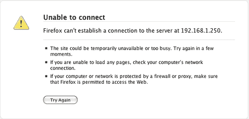
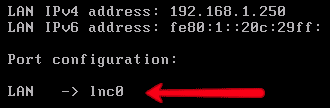
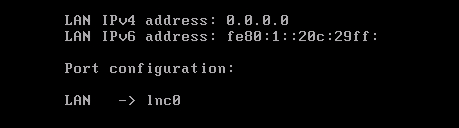
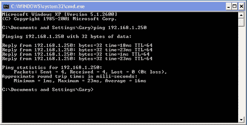
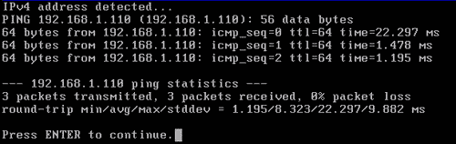
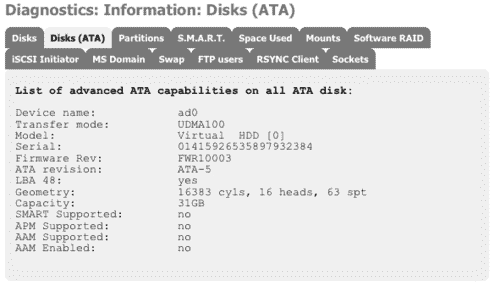
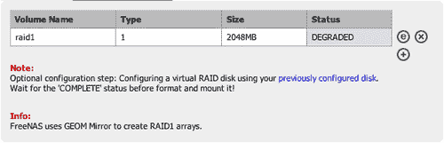
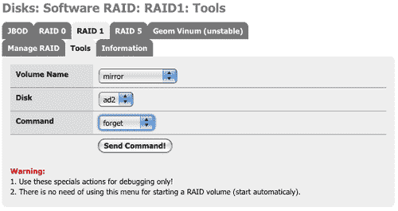
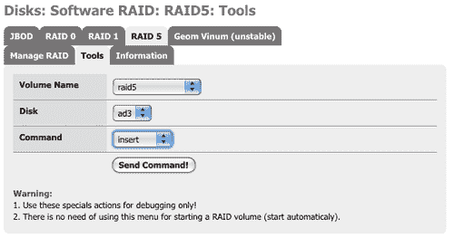

# 第九章。一般故障排除

我们所有人都有过这样的经历：有时我们的计算机无法按照预期工作，我们需要寻找并解决它们的问题。故障排除可能会非常耗时，特别是如果你对所使用的软件或系统经验有限时。本章是关于如何解决 FreeNAS 服务器问题的指南。它涵盖了在哪里查找问题的信息，以及如何通过系统化的方式排查问题。它还讨论了人们常遇到的 FreeNAS 服务器问题，包括网络问题和 RAID 问题。

# 查找日志信息的位置

每当你遇到 FreeNAS 配置问题时，首先应该查看相关的配置部分，检查是否按预期进行了配置。如果经过仔细检查设置后，问题依然存在，下一步就是查看 Web 界面中诊断部分的日志和信息文件。

### 注意

**保持诊断部分展开**

默认情况下，Web 界面中诊断部分的菜单树是折叠的，这意味着菜单项不可见。要查看菜单项，你需要点击“诊断”一词，菜单树将展开。在初始设置过程中，如果你进行大量故障排除，可以通过让诊断部分始终展开来节省点击次数。要设置此选项，请转到“系统：高级”并勾选 **导航 - 保持诊断在导航中展开** 复选框。

诊断部分包含五个小节，前两个是关于 FreeNAS 服务器状态的日志和信息页面。其他三个是网络诊断工具和信息。

## 诊断：日志

本节将 FreeNAS 服务器生成的所有不同日志文件整理到一个方便的地方。有多个标签，每个标签对应不同的服务日志文件类型。有些信息可能非常技术性，特别是在“系统”标签中。然而，通过一些关键信息，它们可以变得更易读。标签如下：

| 标签 | 含义 |
| --- | --- |
| 系统 | 当 FreeBSD（FreeNAS 的底层操作系统）启动时，这里记录了有关服务器硬件的各种日志条目以及启动过程中的各类信息。 |
| FTP | 这显示了 FTP 服务器上的活动，包括成功的登录和登录失败的记录。 |
| RSYNC | RSYNC 服务器的日志信息（参见第七章）分为三个部分：服务器、客户端和本地。根据你感兴趣的 RSYNC 操作类型，点击相应的标签。 |
| SSHD | 在这里你将找到来自 SSH 服务器的日志条目，包括一些有限的启动信息以及登录和登录失败尝试的记录。 |
| SMARTD | 这个标签记录了 S.M.A.R.T 守护进程的输出。有关 S.M.A.R.T 的更多细节，请参见第八章。 |
| Daemon | 任何其他较小的系统服务，如内置的 HTTP 服务器、Apple 文件协议服务器和 Windows 网络服务器（Samba），都会将信息记录到此页面。 |
| UPnP | 这里显示的是 FreeNAS UPnP 服务器“MediaTomb”的日志信息。日志记录可能会非常详细，因此阅读时需要特别注意。不要被类似“INFO: Config: option not found:”这样的条目分心，因为这只是服务器记录它将使用该特定属性的默认值。 |
| 设置 | 设置标签允许你更改日志信息的显示方式，包括排序顺序和显示的条目数。 |

### 注意

**什么是守护进程？**

在 UNIX 术语中，守护进程（Daemon）是一个系统服务。它是一个在后台运行的程序，执行某些任务。FreeNAS 中的守护进程不与用户进行交互（通过显示器、鼠标和键盘），因此需要一个地方来记录其活动的结果（或问题）。FreeNAS 中的守护进程在 FreeBSD 启动时自动启动，有些守护进程依赖于在 Web 界面中启用。

## 理解诊断—日志：系统

所有日志页面中最复杂的是系统日志页面。在这里，FreeBSD 记录有关系统、硬件和启动过程的信息。刚开始时，这个页面可能会让人觉得有些吓人，但稍加帮助后，这个页面可以非常有用，特别是在追踪硬件或驱动程序相关问题时。

### 注意

**50 条日志条目可能不够**

在“诊断：日志”页面上，默认显示的日志条目数量是 50\。在大多数情况下，这个数量是足够的，但有时候它可能不足。例如，在“诊断：日志：系统”标签中，启动过程中产生的日志条目总数超过了 50\。如果你想查看 FreeBSD 识别了多少系统内存，你不会在标准的 50 条条目中找到它。解决方法是增加“诊断：日志：设置”标签中的*显示的日志条目数*参数。

学习如何读取“诊断：日志：系统”页面的最佳方式是通过示例，下面是几种不同的日志条目示例，包括关于 CPU、内存、磁盘和磁盘控制器的日志：

```
kernel: FreeBSD 6.2-RELEASE-p11 #0: Wed Mar 12 18:17:49 CET 2008 

```

第一个条目显示了 FreeNAS 服务器的起源。它基于 FreeBSD，在这个特定的案例中，我们看到这个版本的 FreeNAS 使用的是 FreeBSD 6.2\. 计划中（也许已经实现）是将 FreeBSD 7.0 作为 FreeNAS 的基础。

```
kernel: CPU: Intel(R) Xeon(TM) CPU 1.70GHz (1680.52-MHz 686-class CPU) 

```

在这里，显示了 FreeBSD 检测到的 CPU 类型。在这种情况下，它是一个运行在 1.7GHz 的 Intel Xeon CPU。

```
kernel: FreeBSD/SMP: Multiprocessor System Detected: 2 CPUs 

```

如果你的系统有多个 CPU 或是双核机器，那么你将在日志文件中看到一个条目（如上所示）识别第二个 CPU。如果你的机器支持超线程技术，那么第二个逻辑处理器将以这种方式显示：*每个核心的逻辑 CPU 数：2*

```
Apr 1 11:06:00 kernel: real memory = 268435456 (256 MB)
Apr 1 11:06:00 kernel: avail memory = 252907520 (241 MB) 

```

这些日志条目显示了系统检测到的内存大小。实际内存和可用内存之间的大小差异是计算机中实际安装的内存量与 FreeBSD 内核加载后剩余内存量之间的差距。

```
kernel: atapci0: <Intel PIIX4 UDMA33 controller> port 0x1f0-0x1f7,0x3f6,0x170-0x177,0x376,0x1050-0x105f at device 7.1 on pci0
kernel: ata0: <ATA channel 0> on atapci0
kernel: ata1: <ATA channel 1> on atapci0 

```

要让磁盘在你的 FreeNAS 服务器上正常工作，必须有一个磁盘控制器，它可以是标准的 ATA/IDE 控制器、SATA 控制器或 SCSI 控制器。上面是内建在主板上的标准 ATA 控制器的日志条目。你可以看到它是一个英特尔控制器，并且已经识别到两个通道（主通道和次通道）。

```
kernel: atapci1: <SiS 181 SATA150 controller> irq 17 at device 5.0 on pci0
kernel: ata2: <ATA channel 0> on atapci1
kernel: ata3: <ATA channel 1> on atapci1 

```

像之前提到的 ATA 控制器一样，SATA 控制器在启动时会被系统识别。这里是一个 SiS 181 SATA 150 控制器，具有两个通道。它们分别列为设备`ata2`和`ata3`——因为`ata0`和`ata1`已被标准 ATA/IDE 控制器占用。

```
kernel: mpt0: <LSILogic 1030 Ultra4 Adapter> irq 17 at device 16.0 on pci0 

```

像 IDE 和 SATA 控制器一样，所有已识别的 SCSI 驱动程序都会在启动时的系统日志中列出。这里，控制器是 LSILogic 1030 Ultra4。

```
kernel: ad0: 476940MB <WDC WD5000AAJB-00YRA0 12.01C02> at ata0-master UDMA100
kernel: ad4: 476940MB <Seagate ST3500320AS SD04> at ata2-master SATA150 

```

一旦磁盘控制器被系统识别，FreeBSD 就可以开始搜索哪些磁盘已连接。上面是一个西部数据 500GB 硬盘的示例，使用标准 ATA100 接口，速度为 100MB/s。还有一个 500GB 的希捷硬盘，连接使用 SATA 接口。

```
acd0: CDROM <TOSHIBA CD-ROM XM-7002B/1005> at ata1 as master UDMA33 

```

当 CDROM（通常连接到 ATA/IDE 控制器）被识别时，它会像上面那样显示。

```
kernel: da0 at ahd0 bus 0 target 0 lun 0
kernel: da0: <MAXTOR ATLAS10K4_73WLS DFL0> Fixed Direct Access SCSI-3 device
kernel: da0: 320.000MB/s transfers (160.000MHz, offset 127, 16bit), Tagged Queueing Enabled
kernel: da0: 70149MB (143666192 512 byte sectors: 255H 63S/T 8942C) 

```

SCSI 寻址比 ATA/IDE 更复杂。在 SCSI 系统中，你有控制器、通道（总线）、磁盘（目标）和逻辑单元号（LUN）。上面的示例显示了一个磁盘（已被分配设备名称`da0`）位于控制器`ahd0`的`bus 0`上，作为`target 0`，并且具有`LUN 0`。SCSI 控制器可以有多个总线和多个目标。进一步来看，你会看到该磁盘是一个 MAXTOR 73GB SCSI-3 磁盘。

```
kernel: da0 at umass-sim0 bus 0 target 0 lun 0
kernel: da0: <Verbatim Store 'n' Go 1.30> Removable Direct Access SCSI-2 device
kernel: da0: 40.000MB/s transfers
kernel: da0: 963MB (1974271 512 byte sectors: 64H 32S/T 963C) 

```

如果你使用 USB 闪存盘存储配置信息，它很可能在日志文件中显示为一种 SCSI 磁盘类型。上面的示例显示的是一个 1GB 的 Verbatim Store 'n' Go 磁盘。

```
kernel: lnc0: <PCNet/PCI Ethernet adapter> irq 18 at device 17.0 on pci0
kernel: lnc0: Ethernet address: 00:0c:29:a5:9a:28 

```

另一个需要在系统上正常工作的设备是网络接口卡。像磁盘控制器和磁盘一样，当 FreeBSD 识别到它时，它会在日志文件中记录。上面是一个基于 AMD Lance/PCNet 的以太网适配器示例。每个以太网卡都有一个唯一的地址，称为以太网地址或 MAC 地址。它由 6 个数字组成，并使用冒号分隔符表示。一旦发现，FreeBSD 会查询该卡以获取其 MAC 地址并记录结果。在上述示例中，它是"00:0c:29:a5:9a:28"。

### 在设备名称与实际设备之间进行转换

在上面的 SCSI 例子中，列出的 SCSI 控制器是*ahd0*。理解这些日志条目的关键是了解如何解释设备名称*ahd0*。首先，*ahd0*表示这是一个使用*ahd*驱动的设备，并且它是系统中的第一个设备（编号从 0 开始）。

那么，什么是 ahd 呢？首先需要查看日志文件的上方。应该会有类似以下的条目：

```
kernel: ahd0: <Adaptec 39320 Ultra320 SCSI adapter> irq 11 at device 1.0 on pci2 

```

这显示了特定设备是`Adaptec 39320 SCSI 3`控制器。你还可以在以下链接中找到更多关于*ahd*驱动的信息（以及所有 FreeBSD 驱动）：

[`www.freebsd.org/releases/6.2R/hardware-i386.html`](http://www.freebsd.org/releases/6.2R/hardware-i386.html)

搜索 ahd，你将能找到该驱动支持的控制器（在这种情况下，它们都是来自 Adaptec 的控制器。如果你点击提供的链接，将会跳转到有关该驱动的具体帮助页面）。

当 FreeNAS 升级到 FreeBSD 7 时，相应的网页将会是：

[`www.freebsd.org/releases/7.0R/hardware.html`](http://www.freebsd.org/releases/7.0R/hardware.html)

# 网络问题

与网络附加存储（NAS）建立可靠的网络连接，当然是至关重要的。本节内容是针对那些遇到网络问题的用户。

一般来说，网络问题可以分为两类：物理问题和软件问题。物理问题包括如断开电缆和硬件故障，而软件问题则涵盖了从设备驱动问题到网络配置错误等各种情况。

从表面上看，大多数网络问题看起来都是一样的，网络无法正常工作，你无法连接。为了找出问题，你可以尝试不同的方法。

## 常见连接问题

启动你的 FreeNAS 服务器后，第一步是配置网络。这部分内容将在第二章详细介绍。假设你已配置好网络，下一步是使用网页浏览器连接到 FreeNAS 服务器。如果网页浏览器连接失败，网页浏览器（此处以 Firefox 为例）会显示类似如下的内容：



此操作涉及两台机器，一台是 FreeNAS 服务器，另一台是带有网页浏览器的计算机。首先，测试带有网页浏览器的机器是否正常工作。确保它能访问互联网以及网络中的其他机器或设备。如果不能，你需要从那里开始排查！

如果网页浏览器所在的机器工作正常，那么问题可能出在 FreeNAS 服务器上，这时就该开始排查问题了。使用以下检查清单来确保一切都按预期进行：

+   检查电缆是否插入了 FreeNAS 服务器的网络卡。听起来很简单，但我曾经遇到过电缆插得不完全正确，导致网络无法工作的情况。假设电缆的另一端也插入正确，请检查 FreeNAS 服务器上的连接 LED 是否亮起，以及交换机或集线器上的指示灯是否亮起。如果看到全绿的指示灯，那就说明一切正常。

+   检查 FreeNAS 服务器启动时是否识别了网络。由于无法访问 web 界面，您需要在控制台上检查此项。您需要查看类似这样的信息：



### 注意

**如果找不到我的网络卡怎么办？**

这很可能意味着您的机器中的网络卡不被 FreeNAS 或更具体地说，FreeBSD 支持。请查看 FreeBSD 硬件兼容页面获取更多信息：[`www.freebsd.org/releases/6.2R/hardware-i386.html`](http://www.freebsd.org/releases/6.2R/hardware-i386.html)

+   如果电缆连接正确且网络已找到，就该仔细检查网络设置了。最常见的错误是设置子网掩码时出错。子网掩码决定了设备所在的网络。当您使用控制台菜单系统设置子网掩码时，如果子网掩码与使用浏览器的机器不相同，可能会导致连接丢失。此外，错误的子网掩码可能会引起异常行为，例如使用浏览器的机器能够连接到 FreeNAS 服务器，但服务器可能无法回复。比如，子网掩码输入 25（而不是预期的 24）可能会导致连接问题。

+   IP 地址是唯一的吗？如果您设置了静态 IP 地址，是否设置了正确的地址？如果两台机器分配了相同的 IP 地址，就会发生奇怪的事情。例如，数据包本应发送到一台机器，却到达了另一台机器，等等。确保 IP 地址正确且唯一。

+   如果您使用的是 DHCP，请确保 DHCP 服务器正在运行并且有可分配的地址。如果您看到 FreeNAS 服务器的地址是 0.0.0.0，这意味着它无法从 DHCP 服务器获取 IP 地址。



## 使用 Ping

大多数操作系统（包括 Windows、Linux 和 OS X）都有一个叫做 ping 的工具，可以用来测试两台机器之间的低层连接。为了测试与 FreeNAS 机器的连接，您可以*ping*它，也可以让 FreeNAS 服务器*ping*其他机器。

在 Windows XP 中运行 *ping*，点击 **运行...**，然后在对话框中输入 **cmd**。按 Enter 键后，黑色的命令提示符将会出现。执行 *ping* 的命令就是输入 *ping*，后面跟上 IP 地址。例如，要对 FreeNAS 服务器的标准地址 192.168.1.250 进行 *ping*，你可以输入：

```
ping 192.168.1.250 

```

如果一切正常，那么 FreeNAS 服务器会回复。输出应该类似于下面这样：



如果 PC 无法联系到 FreeNAS 服务器，则会报告“请求超时”错误。

你还可以使用 FreeNAS 服务器 ping 网络上的其他机器。在控制台选择选项 5。然后系统会要求你输入一个 IP 地址。这次输入的 IP 地址不是 FreeNAS 服务器的，而是网络上另一台机器的 IP 地址。输入地址并按回车。输出应该如下所示：



### 注意

**发现 XP 机器的 IP 地址**

要查找 XP 机器的 IP 地址：点击**开始**，然后**运行...** 在对话框中输入**cmd**并按*ENTER*。在命令提示符窗口中，输入**ipconfig /all**。结果输出将显示 IP 地址、子网掩码等信息。

## 在 Web 界面中使用 Ping

如果你可以访问 FreeNAS 服务器的 Web 界面，并且你想要*ping*另一台机器以确保 FreeNAS 服务器能够与其通信，那么进入诊断：Ping。输入你希望 ping 的机器的 IP 地址到*主机*栏并点击*Ping*。

成功 ping 的输出如下所示：

```
PING 192.168.1.110 (192.168.1.110): 56 data bytes
64 bytes from 192.168.1.110: icmp_seq=0 ttl=64 time=1.148 ms
64 bytes from 192.168.1.110: icmp_seq=1 ttl=64 time=0.697 ms
64 bytes from 192.168.1.110: icmp_seq=2 ttl=64 time=0.638 ms
--- 192.168.1.110 ping statistics ---
3 packets transmitted, 3 packets received, 0% packet loss
round-trip min/avg/max/stddev = 0.638/0.828/1.148/0.228 ms 

```

失败的 ping 输出如下所示：

```
PING 192.168.1.100 (192.168.1.100): 56 data bytes
--- 192.168.1.100 ping statistics ---
3 packets transmitted, 0 packets received, 100% packet loss 

```

注意到`100%数据包丢失`，这意味着没有任何 ping 到达其目的地。

如果你的机器有多个网络卡，你可以在*接口*下拉框中选择使用哪个卡。当你想要检查第二个以太网接口卡的连接性时，这非常有用。

如果你想查看网络数据包走的是哪条路（通过哪些交换机和网关），你可以使用位于 Traceroute 中的 traceroute 工具。

## 使用 ARP 表来解决网络问题

以太网的内部深处有一个被称为 ARP 的东西。地址解析协议（ARP）是查找主机硬件地址（或 MAC 地址）时的标准方法，当只知道其 IP 地址时。为了向 IP 地址发送信息包，网络软件需要知道服务该 IP 地址的网卡的物理地址。为此，它会发送一个 ARP 请求并得到一个包含 MAC 地址的 ARP 响应。

在诊断：ARP 表页面上，有一个显示所有 FreeNAS 服务器已知的 MAC 地址及其对应 IP 地址的表格。这个表格非常有用，因为它可以让你查看 FreeNAS 服务器的网络层，我们至少能够发现目标远程服务器/PC 的 MAC 地址。如果已知 MAC 地址但 ping 失败，那么问题可能是防火墙。

此表格也有助于确保两台机器不会误用相同的 IP 地址。你可以通过比对 IP 地址和 MAC 地址，确认已联系到正确的服务器。

### 注意

**什么是 MAC 地址？**

媒体访问控制地址（MAC 地址）或以太网地址是附加到大多数网络适配器上的全球唯一标识符，由制造商指定。它可以比作你家里的邮政地址，地址是唯一的，所有寄送到这个地址的东西都会由你收到。该地址由 6 个数字组成，采用冒号表示法。一个示例 MAC 地址是"00:0c:29:a5:9a:28"。

[`www.coffer.com/mac_find/`](http://www.coffer.com/mac_find/) 是一个有用的网站，用于查找哪个制造商（或称为供应商）创建了任何给定的 MAC 地址。

## 千兆传输很慢

千兆网络并不是一些人认为的万能法宝。不幸的是，你永远无法在 FreeNAS 和你的 PC 之间达到 125MB/s（1000 除以 8）的传输速度。造成这种情况的原因有几个，其中一些是理论性的，有一些则是实际问题。要获得最佳的千兆以太网传输速度，进出 FreeNAS 服务器时，你需要考虑以下几点：

+   首先，确保你已启用某些内核变量的调优。你可以在“系统：高级：高级设置”页面找到这个选项。勾选*调优*框并保存设置。

+   确保你的千兆以太网交换机和千兆以太网卡能够处理 Jumbo 帧。没有 Jumbo 帧支持，超过 100Mb/s 的网络速度提升将是微乎其微的。

+   尽可能使用 PCI Express 千兆网络卡。

+   确保你的 CPU 能够处理网络和磁盘活动带来的负载。

+   根据速度吞吐量优化配置磁盘。这几乎肯定意味着你需要使用某种类型的 RAID，无论是硬件 RAID 还是软件 RAID。

# 连接共享时的问题（通过 CIFS）

连接 FreeNAS 服务器的最常见方式之一是通过 Windows 协议 CIFS。在大多数环境中，人们会从 Windows 机器连接到 FreeNAS，并可能将“共享”挂载为该机器上的网络驱动器。

如今使用的 Microsoft Windows 版本有很多，有些人仍在使用 Windows 98 或 Millennium，而其他人则在使用 Windows 2000、Windows XP 或 Windows Vista。每个 Windows 版本对网络和设置有略微不同的理解——在 Windows 2000 或 Windows 98 中可行的设置可能在 Windows Vista 中无法工作。

以下是使用 Microsoft Windows 与 FreeNAS 时可能遇到的一些问题。

## Windows Vista 要求提供我的用户名和密码以访问匿名共享

当“服务：CIFS/SMB”页面中的*空密码*字段启用时，可能会发生这种情况（在高级设置部分）。要解决此问题，请禁用*空密码*字段。

## 网络中有两台 FreeNAS 服务器，但 Windows 只能看到一台。

在配置这两台 FreeNAS 服务器时，你可能已经确保每台机器都有自己的 IP 地址和主机名。你还需要确保 FreeNAS 中 CIFS 服务器的默认名称对于两台服务器不是相同的。尽管你可以毫无问题地连接它们的 Web 界面，但在尝试使用 Windows 网络时，只能看到其中一台机器。

为了解决这个问题，请进入“服务：CIFS/SMB”，将*NetBiosName*设置为每台服务器的唯一名称。

## 开启日志记录以帮助解决 Windows 网络问题

如果你发现无法解决 Windows 网络（CIFS）问题，可以尝试启用更多 Windows 网络服务器（称为 Samba）的日志记录，看看日志文件中是否有提示问题所在。

要启用日志记录，请进入“服务：CIFS/SMB”，将*日志级别*设置为正常（Normal），而不是最小（Minimal）。Samba 生成的日志将显示在诊断：日志页面的守护进程（Daemon）标签下。以*smbd*开头的条目是关于 Windows 网络服务器的，而以*nmdb*开头的条目是关于 Windows 网络名称服务的。

如果正常日志级别没有帮助，你可以尝试全级别（Full）甚至调试级别（Debug），但这些会产生大量输出，可能会让你感到难以理解。

如果日志生成了大量的日志条目，请参考本章早些时候《理解诊断：日志：系统》部分中的“50 个日志条目可能不足够”提示。还要记住，你可以通过在任何诊断：日志页面上按下“清除日志”按钮来随时清除日志。

完成后，别忘了将日志级别设置回最小（Minimal）。

# 诊断：信息

除了诊断：日志页面外，诊断：部分还有一个信息页面。日志页面集中显示来自 FreeNAS 服务器中各种系统服务的输出，而信息页面则旨在提供关于 FreeNAS 服务器各个部分的状态和配置信息。



要访问此页面，请进入“诊断：信息”。页面顶部有很多标签。以下是它们的含义：

| 标签 | 信息 |
| --- | --- |
| 磁盘 | 列出检测到的所有硬盘，包括 ATA/IDE 磁盘、SATA 磁盘和 SCSI 磁盘。 |
| 磁盘（ATA） | 列出所有 ATA/IDE 磁盘的高级功能，包括 ATA 版本、磁盘几何结构、磁盘容量和 S.M.A.R.T 功能。 |
| 分区 | 关于每个磁盘上分区的信息。 |
| S.M.A.R.T. | 列出所有检测到的磁盘的 SMART 功能。 |
| 已用空间 | 关于服务器磁盘空间使用情况的信息。每个文件系统都会列出其总大小、已用空间、可用空间以及磁盘的使用百分比。 |
| 挂载点 | 列出带有文件系统类型的挂载点列表。 |
| Software RAID | FreeNAS 服务器的软件 RAID 配置的信息。每个 RAID 级别单独列出，并显示使用的磁盘信息。 |
| iSCSI Initiator | 关于 iSCSI 启动器的信息。 |
| MS Domain | Microsoft Active Directory 信息。 |
| Swap | 当前配置的交换空间列表。 |
| FTP users | 当前连接的 FTP 用户列表。 |
| RSYNC Client | 每个配置的 RSYNC 客户端都会列出及其配置参数。最有用的信息是“检测到的此服务器共享”部分。它显示 RSYNC 客户端可以联系到服务器，并列出可用的 RSYNC 模块。 |
| Sockets | 这是活动的互联网连接（包括服务器）以及活动的 UNIX 域套接字的列表。通过此列表，你可以看到哪些网络服务器正在运行，以及是否有用户连接到该服务器。 |

# 在 RAID 阵列中更换故障硬盘

RAID 的关键特点是当一个磁盘故障时，RAID 阵列仍然能够继续工作。当磁盘故障时，RAID 阵列进入 DEGRADED 状态，这意味着系统仍在运行，但其中一个磁盘已故障。该磁盘需要尽快更换。

要检查 RAID 磁盘的状态，请进入**Disks: Software RAID**页面。点击你在 FreeNAS 服务器上拥有的所有 RAID 类型，检查它们是否处于 COMPLETE 状态。如果某个 RAID 阵列处于 DEGRADED 状态，你需要更换磁盘。

这是一个 RAID 1 阵列处于降级状态的示例：



首先，你需要知道应该更换哪个磁盘。进入**Disk: Management**页面，检查每个磁盘的状态。如果磁盘正常，它应该显示为 ONLINE。一旦你找到了故障磁盘，需要更换它。有些磁盘控制器具有热插拔功能，这意味着即使系统正在运行，也可以拔掉磁盘并插入新磁盘。这通常是 SATA 控制器的一个特点（但并非仅限于此）。如果不确定，最好关闭 FreeNAS 服务器，并在服务器关闭时更换磁盘。

## 磁盘故障后重建 RAID 1 阵列

现在你已经更换了磁盘，是时候将系统恢复到正常操作水平了。这个过程包括两个步骤，全部在**RAID 1**标签页下的**Disks: Software RAID**页面的工具部分中完成。

第一步是告诉 FreeNAS 服务器忘记任何曾经在此 RAID 阵列中但现在已不再连接的设备。

1.  1\. 进入**Disks: Software RAID**页面，点击**RAID 1**标签。

1.  2\. 点击**Tools**标签。

1.  3\. 在**Volume Name**字段中选择降级阵列的名称，并选择**Command forget**。**Disk**字段在忘记命令中不使用。

1.  4\. 点击**Send Command!**，阵列将被指示忘记未连接的设备。

1.  5\. 命令的输出应显示**Done**。



第二步是将新磁盘重新插入阵列。继续在 RAID 1 阵列的**工具**标签页中：

1.  1\. 在**卷名称**字段中选择降级的阵列。

1.  2\. 从**磁盘**下拉框中选择新磁盘。

1.  3\. 选择**插入**命令并点击**发送命令！**

1.  4\. 命令的输出应该显示为**Done**。

阵列现在开始重建。你可以在**诊断：信息：软件 RAID**页面上检查它是否正在重建（查看**同步：**字段中的完成百分比），并且在**磁盘：软件 RAID：RAID1：**页面的管理 RAID 标签中，当 RAID 重建完成时会显示为 COMPLETE。

## RAID 5 阵列重建后，硬盘故障替换

更换磁盘后，你准备好与 RAID 阵列中的其他磁盘同步。这个过程包括一个步骤，在**磁盘：软件 RAID**页面的 RAID 5 标签页中的工具部分执行。

你需要将新磁盘重新插入阵列。在 RAID 1 阵列的**工具**标签页中：

1.  1\. 在**卷名称**字段中选择降级的阵列。

1.  2\. 从**磁盘**下拉框中选择新磁盘。

1.  3\. 选择**插入**命令并点击**发送命令！**

1.  4\. 命令的输出应该显示为 Done。



阵列现在开始重建。你可以在**诊断：信息：软件 RAID**页面上检查它是否正在重建（查看**同步：**字段中的完成百分比），并且在**磁盘：软件 RAID：RAID 5：**页面的管理 RAID 标签中，当 RAID 重建完成时会显示为 COMPLETE。

# 寻求更多帮助的地方

如果你发现自己真的卡住了，无法找出问题所在，最好的支持地方是 FreeNAS 的在线帮助论坛。

这些可以在 SourceForge.net 网站上找到，你需要注册一个免费的 SourceForge.net 账户才能在论坛上发布内容。

要查找支持论坛，请访问 FreeNAS 网站：[`freenas.org`](http://freenas.org)，然后点击“Support”链接。从那里，进入 Help 论坛。

# 总结

在本章中，我们介绍了一些可以帮助跟踪 FreeNAS 服务器配置问题的工具。我们讨论了网络问题及其可能的解决方案，以及如何处理 RAID 故障。

下一章也是最后一章将介绍 FreeBSD，这是 FreeNAS 的底层操作系统。
