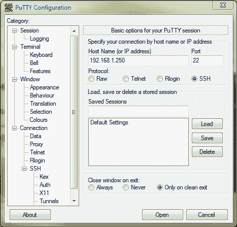

# 第十章 FreeBSD 与命令行工具

FreeBSD 是 FreeNAS 服务器的基石。在本章中，我们将介绍一些简单的 FreeBSD 命令以及一些基础的 FreeBSD 管理任务，包括停止和启动不同的服务，以及从命令行控制 RAID。

# FreeBSD 简介

每台计算机都有一个被称为操作系统的特殊软件，用于控制和管理计算机中的各种资源，包括内存、视频、网络和硬盘。现在一些流行的操作系统包括 Microsoft Windows、Apple OS X、Linux 和 FreeBSD。

作为一种操作系统，FreeBSD 有着非常值得尊敬的历史，并且可以追溯到 1970 年代末期的原始 UNIX 操作系统。FreeBSD 的第一个版本于 1993 年问世，因此已经有超过 15 年的发展历程。结果是一个稳定、强大、设计良好且可扩展的操作系统，能够与最好的操作系统竞争。

从本质上讲，FreeBSD 是一个基于终端或控制台的操作系统。这意味着你不需要一张花哨的显卡、一个高分辨率的显示器以及一个光学鼠标来运行 FreeBSD。所有命令都是通过在键盘上输入并按下*ENTER*来执行的。当 FreeBSD 作为服务器使用时，这一点尤为重要。服务器通常不具备强大的图形能力，甚至可能没有连接显示器。因此，能够使用简单的命令行工具来连接和管理服务器是非常重要的。

除了作为一个坚固的服务器操作系统，FreeBSD 还可以作为桌面操作系统使用，并配有完整的窗口桌面环境。

## 你的第一个 FreeBSD 命令

进入 FreeBSD 命令行的最简单方法是通过 FreeNAS 控制台菜单。FreeNAS 启动并运行后，前往 FreeNAS 机器并按下*ENTER*键，使启动画面消失，控制台菜单将出现。选项 6 是 Shell，输入 6 并按下 ENTER。

你现在将看到一个像这样的提示：

```
freenas:~# 

```

### 使用 pwd 打印工作目录

这就是 FreeBSD！要运行你的第一个 FreeBSD 命令，输入`pwd`并按下 ENTER。

```
freenas:~# pwd
/root 

```

`pwd`意味着打印工作目录。它告诉你当前的文件夹。在此例中，它是名为`root`的文件夹。在 FreeBSD 中，管理员用户被称为 root。当你通过 FreeNAS 控制台连接到 FreeBSD 时，你会自动以 root 身份登录，并且拥有完全的管理员权限。`/root`文件夹是 root 用户的家目录。

### 注意

**考虑禁用控制台菜单**

如你所见，默认情况下，控制台为你提供了对 FreeBSD 命令行的完全访问权限，并且从一开始就赋予你完全的管理员权限。如果你的 FreeNAS 服务器处于他人可以访问控制台菜单的环境中，那么你应该考虑禁用控制台（在 Web 界面的**System: Advanced**页面中）。这将防止未经授权和可能具有危险的访问你的 FreeNAS 服务器。

禁用控制台菜单后，你仍然可以通过 SSH 协议访问 FreeBSD 命令行。

### 目录列表（ls）

要查看当前文件夹的内容，你可以使用`ls`（列出）命令：

```
freenas:~# ls
.cshrc .dialogrc .history .profile 

```

默认情况下，`/root`文件夹中没有太多内容。在这里，我们可以看到有 4 个文件。注意，它们的名字都以点（.）开头。这意味着它们是隐藏文件，但因为你是管理员，隐藏文件默认会显示。如果普通用户使用`ls`命令，文件名以点开头的文件将不会显示。

要获取更多文件的信息，例如文件大小及其读写权限，请使用`-l`（长格式）选项：

```
freenas:~# ls -l
total 8
-rw-r--r-- 1 root wheel 843 Apr 14 10:52 .cshrc
-rw-r--r-- 1 root wheel 57 Feb 22 21:16 .dialogrc
-rw------- 1 root wheel 123 Apr 2 13:13 .history
-rw-r--r-- 1 root wheel 236 Feb 22 21:16 .profile 

```

这种长格式会显示关于每个文件的更多信息，首先是文件权限、链接数量、所有者名称、组名称、文件大小（以字节为单位）、文件最后修改的日期和时间，当然还有文件名。

文件权限字段可能看起来有点复杂，但稍加指导就能理解。该字段由 10 个标志组成，标志可以是字母，如 r 或 w，或者是连字符（-）。

| 文件类型（1 个标志） | 用户权限（3 个标志） | 组权限（3 个标志） | 其他权限（3 个标志） |
| --- | --- | --- | --- |
| d 表示目录，-表示常规文件。 | r、w 和 x 表示用户可读、可写和可执行。 | r、w 和 x 表示组用户可读、可写和可执行。 | r、w 和 x 表示所有人可读、可写和可执行。 |

例如，上面的目录列表包含了`.cshrc`文件的条目。

```
-rw-r--r-- 1 root wheel 843 Apr 14 10:52 .cshrc 

```

这意味着它是一个常规文件（因为第一个标志是`-`），并且它对于用户来说是可读可写的，但不可执行（`rw-`）。文件不可执行是正常的，因为它不是一个程序文件。组权限（`r--`）意味着同组用户（wheel 组）可以读取该文件，但不能写入，其他用户（`r--`）的权限也是如此。

### 使用`cd`命令更改目录

为了完成简单的文件系统命令，可以使用`cd`（更改目录）命令。这个命令会将当前工作目录更改为指定的其他目录。要将目录切换到文件系统的最顶层，你可以输入：

```
freenas:~# cd / 

```

从这里，你可以看到所有位于最上层下面的文件夹，呈树状结构显示。

```
freenas:/# ls
conf etc mnt usr
bin ftmp root var
boot dev lib sbin
cf entropy libexec tmp 

```

要切换到另一个目录，只需输入`cd`后跟目录名：

```
freenas:/# cd /usr
freenas:/usr# ls
X11R6 bin lib libexec local sbin share 

```

然后，继续深入：

```
freenas:/usr# cd bin
freenas:/usr/bin# pwd
/usr/bin 

```

要返回上一级目录，使用特殊名称：

```
freenas:/usr/bin# cd ..
freenas:/usr# pwd
/usr 

```

你也可以通过在`cd`命令中指定完整路径，直接进入一个深层文件夹。在此之前，我们已将目录切换到`/usr`目录，然后进一步进入`bin`目录。你可以通过输入以下命令一次性完成：

```
freenas:/# cd /usr/bin
freenas:/usr/bin# pwd
/usr/bin 

```

### 复制文件并更改文件权限（cp 和 chmod）

要复制一个文件，你需要使用`cp`（复制）命令。要将`.cshrc`文件复制到`test`目录，你可以输入：

```
freenas:~# cp .cshrc test
freenas:~# ls
.cshrc .dialogrc .history .profile test 

```

在使用`ls`命令后，可以看到文件已被复制。要查看`test`文件夹中文件的权限，可以输入：

```
freenas:~# ls -l test
-rw-r--r-- 1 root wheel 843 Apr 14 12:06 test 

```

要更改文件，使得只有用户具有读写权限，且其他任何人（包括同组成员）都无法读取，使用 `chmod`（更改文件模式）命令。

```
freenas:~# chmod 600 test
freenas:~# ls -l test
-rw------- 1 root wheel 843 Apr 14 12:06 test 

```

`chmod` 需要两个参数：第一个是一个三位数，表示您希望设置的文件权限，第二个是您希望更改的文件或目录的名称。每个数字表示文件的权限，分别是用户、组和其他用户（按此顺序）。

文件权限的数字表示如下：

| 文件权限 | 标志 | 含义 |
| --- | --- | --- |
| 0 | --- | 无权限，既不能读、写也不能执行 |
| 1 | --x | 执行 |
| 2 | -w- | 写 |
| 3 | -wx | 执行 & 写 |
| 4 | r-- | 只读 |
| 5 | r-x | 执行 & 读 |
| 6 | rw- | 读与写 |
| 7 | rwx | 执行 & 读 & 写 |

因此，将文件权限设置为 600 表示用户具有读写权限，组和其他用户没有权限（rw-------）。类似地，640 表示用户具有读写权限，组具有读权限，其他用户没有权限（rw-r-----）。您可以为文件设置的最大权限是 777，这意味着用户、组和其他用户都具有读、写和执行权限（rwxrwxrwx）。

可选地，chmod 所有文件可以使用 -R 标志，该标志可以用于目录，并将使 chmod 设置该目录及其所有子文件夹的文件权限。

## 使用 Putty 连接到 FreeBSD

要访问 FreeBSD 命令行而不使用控制台，您可以通过 SSH 连接到 FreeNAS 服务器。

SSH（安全外壳协议）是一种网络协议，它允许通过加密（安全）通道在两台计算机之间交换数据。它最常用于作为远程计算机的安全命令行接口。这意味着，您可以从远程计算机访问 FreeNAS 服务器的命令行接口，而无需访问 FreeNAS 服务器的键盘和显示器。

默认情况下，SSH 访问是禁用的，要启用它，请转到**服务：SSHD**并通过选中配置数据表标题中的**启用**来启用**SSH 守护进程**（服务器）。点击**保存并重启**以启动 SSH 服务器。

FreeNAS 服务器上有两种类型的 SSH 用户。第一种是没有管理员访问权限的普通用户。对于在**访问：用户**页面上创建的每个用户，您可以启用完全 Shell 访问，这将允许用户通过 SSH 连接并使用服务器上的 FreeBSD 命令行。

第二种类型的用户是 root。默认情况下，root 用户不允许通过 SSH 登录 FreeNAS 服务器。要允许 root 登录，请转到**服务：SSHD**并勾选**允许 root 登录**。然后点击**保存并重启**，以完成启动 SSH 服务器。

### 注意

**根密码**

根密码与 Web 界面密码相同，默认情况下是*freenas*。如果 Web 界面密码被更改，根密码也会随之更改。

要在 Linux 或 Apple OS X 上通过 SSH 连接，您可以使用 SSH 命令行程序。所以，要连接到 FreeNAS 服务器，您可以使用：

```
ssh -l root 192.168.1.250

```

`-l`参数允许你指定用户名，在本例中为 root。

Windows 默认没有 SSH 工具，所以你需要使用一个名为 PuTTY 的免费工具。PuTTY 是由 Simon Tatham 编写的一个非常棒的工具。

你可以从[`www.chiark.greenend.org.uk/~sgtatham/putty/`](http://www.chiark.greenend.org.uk/~sgtatham/putty/)下载 PuTTY。



下载后，双击可执行文件（PuTTY 没有安装程序，你只需要使用下载的文件）。主 PuTTY 窗口有很多选项，但你只需要做的就是在窗口上半部分的主机名字段中输入 FreeNAS 服务器的 IP 地址。其他设置保持不变，点击“Open”。将会出现一个黑色背景的窗口。如果这是你第一次使用 PuTTY 连接到这个 FreeNAS 服务器，你还会被询问是否信任连接的机器。点击“Yes”。

在“login as:”提示符下输入 root 并按*ENTER*，然后输入与网页界面密码相同的密码。你将看到， hopefully 现在已经熟悉的*freenas*:~# 提示符。

从此处开始，你可以像在控制台菜单 shell 中一样访问 FreeBSD。

## 从命令行监控你的 FreeNAS 服务器

FreeBSD 包含多个用于系统监控的工具，包括监控磁盘空间和系统进程。

### 查看哪些磁盘已挂载使用 mount 命令

要查看哪些磁盘已挂载到 FreeNAS 服务器上，请使用`mount`命令：

```
 freenas:~# mount
/dev/ad0s1a on / (ufs, local, soft-updates)
devfs on /dev (devfs, local)
/dev/raid5/raid5p1 on /mnt/raid5 (ufs, local, soft-updates, acls) 

```

这将产生与**诊断：信息：挂载**页面相同的输出。每个设备都列出其挂载点、文件系统类型和任何选项。从上面可以看到，包含 FreeBSD 和 FreeNAS 软件的最顶层目录/（也称为根目录，但不要与用户 root 混淆）位于第一个 IDE 驱动器（ad0）上。我们还可以看到，这台 FreeNAS 服务器有一个 raid5 配置，挂载在/mnt/raid 上。

### 使用 df 命令检查磁盘空间使用情况

另一个有用的命令（也可以在网页界面的**诊断：信息：已用空间**中找到）是 df 命令。df 显示磁盘空间的使用情况。它有一个可选参数`-h`（人类可读标志），使输出更友好。

```
 freenas:~# df -h
Filesystem Size Used Avail Capacity Mounted on
/dev/ad0s1a 121M 56M 56M 50% /
devfs 1.0K 1.0K 0B 100% /dev
/dev/raid5/raid5p1 3.9G 239M 3.3G 7% /mnt/raid5 

```

每个文件系统都会列出其总大小、已用空间、可用空间以及磁盘使用的百分比。

### 使用 du 命令发现目录的大小

另一个非常有用的命令是*du*命令，虽然它没有包含在网页界面中。*du*命令显示每个文件和每个文件夹（包括子文件夹）的磁盘空间使用情况，或者如果未指定文件夹，则显示当前文件夹的磁盘空间使用情况。

从上面的例子可以看出，RAID 5 数组已使用了 239MB。如果我们进入`/mnt/raid5`目录，然后运行带有`-h`（人类可读）和`-s`（汇总）标志的`du`命令，我们会发现`df`命令中列出的 239MB 也出现在`du`命令的输出中。

```
 freenas:~# cd /mnt/raid5/
freenas:/mnt/raid5# du -hs
239M . 

```

在`/mnt/raid5`内，有一个名为`pictures`的文件夹，要查看`pictures`文件夹使用了多少磁盘空间，可以使用`du`命令，可以直接切换到该文件夹或直接指定它：

```
 freenas:~# du -h /mnt/raid5/pictures
2.5M /mnt/raid5/pictures 

```

### 使用 ps 和 top 进行进程监控

FreeBSD 能够同时运行许多程序。FreeNAS 服务器包括 Web 服务器、FTP 服务器和 SSH 服务器等，它们都同时运行。每个程序作为一个单独的进程运行。每个进程都使用系统的 CPU 时间，以及内存和磁盘空间等其他系统资源。如果程序出现问题，它可能会开始使用过多的 CPU 时间或内存，从而拒绝其他程序运行所需的资源。有一些 FreeBSD 命令可以监视服务器上正在运行的进程的状态。

`ps`显示当前在机器上运行的进程。`ps`有许多不同的选项，但最有用的之一是`ps aux`，它显示系统上的每个进程。

正常的 FreeNAS 服务器在启动后会运行大约 60 到 70 个进程，因此`ps`命令的输出可能会相当长。以下是从 FreeNAS 服务器中提取的前几行：

```
 freenas:~# ps aux
USER PID %CPU %MEM VSZ RSS TT STAT STARTED TIME COMMAND
root 10 84.6 0.0 0 8 ?? RL 10:28AM 69:12.51 [idle: cpu0]
root 0 0.0 0.0 0 0 ?? WLs 10:28AM 0:00.00 [swapper]
root 1 0.0 0.2 772 388 ?? SLs 10:28AM 0:00.09 /sbin/init --
root 2 0.0 0.0 0 8 ?? DL 10:28AM 0:01.22 [g_event]
root 3 0.0 0.0 0 8 ?? DL 10:28AM 0:01.14 [g_up]
root 4 0.0 0.0 0 8 ?? DL 10:28AM 0:01.60 [g_down]
root 5 0.0 0.0 0 8 ?? DL 10:28AM 0:00.00 [crypto]
root 6 0.0 0.0 0 8 ?? DL 10:28AM 0:00.00 [crypto returns] 

```

下面是每列的简要解释：

| 列名 | 含义 |
| --- | --- |
| USER | 这是拥有进程的用户的名称。 |
| PID | 每个进程都有一个唯一的进程 ID（或简称 PID）。 |
| %CPU | 显示进程的 CPU 利用率。这是前面（实际）时间的一分钟的衰减平均值。 |
| %MEM | 进程使用的物理内存量。 |
| VSZ | 显示进程的虚拟内存大小（以千字节为单位）。 |
| RSS | 类似于 VSZ，但 RSS 显示进程正在使用的非交换物理内存大小（以千字节为单位）。 |
| TT | 控制终端。表示没有一个。 |
| STAT | 进程的状态，其中 S 表示进程正在睡眠并且可以随时唤醒，L 表示进程正在等待获取锁定。R 标记一个可运行的进程。 |
| STARTED | 显示进程启动的时间。 |
| TIME | 累积的 CPU 时间。这包括运行进程和代表该进程在内核中运行的时间。 |
| COMMAND | 显示启动程序时给出的命令。 |

在如此长的列表中找到特定的进程可能会有问题。为了帮助解决问题，您可以使用 grep 命令在文本中查找匹配项。例如，要查找 ftp 服务器进程，可以使用以下命令：

```
 freenas:~# ps aux | grep ftp
root 981 0.0 0.8 3636 1904 ?? Ss 0:00.07 pure-ftpd
root 1407 0.0 0.4 1528 984 p0 R+ 0:00.02 grep ftp 

```

运行时，`grep` 命令本身会显示（在本例中为 PID 1407），因为它与我们正在查找的字符串匹配，即 ftp。但当然，它并不是 ftp 服务的一部分。

虽然 `ps` 仅显示系统进程的快照，但 `top` 程序提供动态实时的系统视图。它显示系统摘要（包括 CPU 使用率、内存使用率和其他统计信息），以及一个动态变化的运行进程列表，按照 CPU 使用率最高的顺序排列。

```
 The first few lines of top look something like this:
last pid: 1410; load av: 0.00, 0.00, 0.00 up 0+01:39:09 12:07
23 processes: 2 running, 21 sleeping
CPU: 0.0% user, 0.0% nice, 3.8% sys, 0.0% interrupt, 96.2% idle
Mem: 10M Active, 12M Inact, 13M Wired, 68K Cache, 9648K Buf, 207M Free
Swap:
PID USERNAME THR PRI NICE SIZE RES STATE TIME WCPU COMMAND
1087 root 1 4 0 3168K 2212K kqread 0:02 0.00% lighttpd
1023 root 3 20 0 7160K 4104K kserel 0:01 0.00% mediatom
1250 root 1 76 0 5640K 2720K RUN 0:01 0.00% sshd
927 root 1 76 0 5496K 3208K select 0:01 0.00% nmbd
1253 root 1 20 0 4000K 2780K pause 0:01 0.00% csh 

```

输出的底部部分类似于 `ps` 命令的输出。

# FreeNAS 的高级 FreeBSD 命令

直到现在，我们实际上一直处于只读模式，只是使用底层的 FreeBSD 系统进行查看和监控，但我们实际上还没有做任何更改。这将要改变。

## 启动和停止服务

你可能已经注意到，在 Web 界面上许多配置页面上都写着 **保存并重启**。这是因为许多 FreeNAS 服务器组件需要重新启动才能接受新的配置。因此，也可以使用命令行手动重启服务。如果某个特定服务停止响应，例如 FTP 服务器或 AFP 服务器，这可能是必要的（这并不是针对 FTP 服务器或 AFP 服务器的诋毁，只是一个例子）。

使用命令行，可以启动、停止和重启每个单独的服务。所有控制各种服务的脚本都保存在 `/etc/rc.d` 中，要管理一个服务，可以直接从该目录调用相应的脚本。要重新启动 AFP 服务，可以键入：

```
 freenas:~# /etc/rc.d/afpd restart
Stopping afpd.
Starting afpd. 

```

重启并不是脚本接受的唯一命令：

| Command | 意义 |
| --- | --- |
| start | 启动服务。如果服务已经运行，则不会执行任何操作。 |
| stop | 停止服务。如果服务未运行，则不会发生任何操作。 |
| restart | 执行停止然后启动。如果服务未运行，则停止将失败，但脚本将继续启动服务。 |
| status | 显示服务是否正在运行。 |

这里是你可以启动和停止的可能服务的表格：

| Name | 服务描述 |
| --- | --- |
| afpd | 苹果文件协议守护程序。提供与苹果 Mac 计算机的连接。 |
| lighttpd | 内置的 Web 服务器，用于 Web 接口。 |
| mediatomb.sh | UPnP 服务器。 |
| nfsd | 用于与 UNIX 类型客户端共享文件的 NFS 服务器。 |
| nfslocking | NFS 服务器的一部分，需要单独控制。 |
| pureftpd | FTP 服务器。 |
| rsync_client | RSYNC 客户端。 |
| rsync_local | 用于在两个本地磁盘之间同步的本地 RSYNC 客户端。 |
| rsyncd | RSYNC 服务器。 |
| samba | 用于 Windows 连接的 CIFS/SMB 服务器。 |
| smartd | 硬盘监控服务。 |
| sshd | 安全 Shell 服务。 |
| unison | unison 同步服务。 |

### 用 kill 和 killall 实现极端控制

`kill`命令尝试关闭正在运行的进程。在 FreeBSD 中，当操作系统向进程发送信号以告知其关闭时，进程会停止。`kill`的默认信号是 TERM（信号 15），表示软件终止。当进程接收到该信号时，它应该以有序的方式关闭。如果进程变得异常，可能不会响应“请正常关闭”的指令。在这种情况下，你必须发送 KILL 信号（简写为信号 9）。因此，要杀死一个正在运行的进程（例如，进程 1234），我们会使用`kill -9 1234`。

`killall`命令通过进程名称而非 PID 来杀死正在运行的进程。这有一个优点，即在杀死进程时，你无需使用`ps`命令来查找 PID。与`kill`一样，`killall`也接受信号参数，`-9`用于终止进程。因此，要杀死所有的 ftp 进程，你可以使用：

```
 freenas:~# killall -9 pure-ftpd 

```

关于`killall`有一点需要注意：你需要指定进程的确切名称，使用`killall -9 pure`或`killall -9 ftp`不会停止 FTP 服务器。

`killall`的几个有用参数是`-s`和`-v`。

`-s`只会显示将要执行的操作，但不会发送任何信号。

`-v`会显示类似于`-s`的输出，但它实际上会在报告所做操作时发送信号。

```
 freenas:~# killall -9 -s pure-ftpd
kill -KILL 2045 

```

## RAID 命令行工具

阅读 FreeNAS 的支持论坛，似乎有相当一部分用户在 RAID 配置上遇到困难。FreeNAS 中的 RAID 软件质量非常高，但总会有一些问题出现。所有在 Web 界面中可用的 RAID 功能（及更多）在命令行中也同样可用。

每种 RAID 级别（RAID 0、RAID 1 等）使用不同的命令，因为它们是专门用来处理该 RAID 级别的程序。管理 RAID 1 阵列的工具对 RAID 5 一无所知，反之亦然。RAID 工具有：gconcat、gstripe、gmirror 和 graid5。

### 警告

在开始之前有个警告。使用命令行时，你可以完全自由地管理和控制你的 RAID 阵列。但这也意味着你完全有可能破坏你的 RAID 阵列。小心不要错误地摧毁 RAID 阵列。如果你对通过命令行管理 RAID 阵列感到不舒服，你应该回到使用 Web 界面，因为它提供了一定的保护。

另一个可能的问题是，当你使用命令行时，Web 界面可能与当前的服务器配置不同步。从某种意义上来说，这就像是你在 Web 界面背后做事，而它并不知道发生了什么变化。例如，如果 RAID 阵列中的磁盘*da0*出现故障，且添加了另一块磁盘*da1*到系统中，并用该磁盘修复 RAID 阵列，那么尽管 RAID 将正常运行，Web 界面却对磁盘*da1*一无所知。在最糟糕的情况下，这只是一个困扰，尤其是当新磁盘*da1*挽救了你宝贵的数据时。

### 列表和状态命令

尽管管理 RAID 级别的每个工具有所不同，但它们有一些共同的命令。每个工具都接受 `list` 和 `status` 命令。

`status` 命令提供了组成 RAID 阵列的磁盘及其当前状态的简要概述。以下是 RAID 5 阵列的状态输出示例：

```
 freenas:~# graid5 status
Name Status Components
raid5/myraid5 COMPLETE CALM da0
ad3
ad1 

```

从这可以看出，RAID5 阵列为 COMPLETE（没有磁盘丢失），这也意味着它没有在重建，并且磁盘 *da0, ad3* 和 *ad1* 组成了该 RAID 阵列。

`list` 命令的输出更加全面，并且在许多方面是调试信息。当 RAID 阵列运行正常时，这些信息并不有趣，但在遇到 RAID 阵列问题时，这些信息可能非常有价值。

要获取 RAID 5 的列表信息，可以输入：

```
 freenas:~# graid5 list 

```

我已将输出分成不同的部分，以便更容易阅读：

```
 Geom name: myraid5
State: COMPLETE CALM
Status: Total=3, Online=3 

```

第一部分显示了该 RAID 阵列名为 `myraid5`，并且状态为 `COMPLETE` 和 `CALM`。该阵列由 3 个磁盘组成，所有磁盘都在线。

```
 Type: AUTOMATIC
Pending: (wqp 0 // 0)
Stripesize: 131072
MemUse: 0 (msl 0)
Newest: -1
ID: 1419279684 

```

下一部分展示了有关 RAID 阵列实现的不同内部信息。每个 RAID 级别在此部分会有不同的信息。

```
 Providers:
1\. Name: raid5/myraid5
Mediasize: 4294705152 (4.0G)
Sectorsize: 512
Mode: r1w1e2 

```

本部分展示了该 RAID 阵列为系统提供的内容。它提供了一个 4GB 大小的 RAID 5 阵列。

```
 Consumers:
1\. Name: da0
Mediasize: 2147483648 (2.0G)
Sectorsize: 512
Mode: r2w2e3
DiskNo: 2
Error: No
2\. Name: ad3
Mediasize: 2147483648 (2.0G)
Sectorsize: 512
Mode: r2w2e3
DiskNo: 1
Error: No
3\. Name: ad1
Mediasize: 2147483648 (2.0G)
Sectorsize: 512
Mode: r2w2e3
DiskNo: 0
Error: No 

```

消费者是用来构建该 RAID 阵列的磁盘。磁盘名称列出时会显示其大小、磁盘编号（磁盘在阵列中的使用顺序）和错误状态。

### JBOD 和 gconcat

由于 JBOD（Just a Bunch of Disks）没有提供任何磁盘故障保护，因此在命令行上无法做太多操作。可以使用 `gconcat status` 来检查 JBOD 阵列的状态，如下所示：

```
 freenas:~# gconcat status
Name Status Components
concat/myjbod UP ad3
ad1 

```

可以完全通过命令行创建、格式化和挂载 JBOD 阵列，但这没有太大意义，因为 web 界面无法识别新创建的阵列，因此无法通过 web 界面使用。此外，由于该阵列未保存在 FreeNAS 配置中，机器重启后会丢失。

### RAID 0 和 gstripe

与 JBOD 类似，RAID 0 不提供任何磁盘故障保护，因此在命令行上无法做太多操作。RAID 0 阵列的状态可以通过 `gstripe status` 命令检查：

```
 freenas:~# gstripe status
Name Status Components
stripe/myraid0 UP da0
da1 

```

可以完全通过命令行创建、格式化和挂载 RAID1 阵列，但这没有太大意义，因为 web 界面无法识别新创建的阵列，因此无法通过 web 界面使用。此外，由于该阵列未保存在 FreeNAS 配置中，因此机器重启后会丢失。

### RAID 1 和 gmirror

RAID 1（镜像）是 FreeBSD/FreeNAS 提供的四个基本 RAID 级别中的第一个，它对磁盘故障提供了一定的保护。

当镜像阵列中的一个磁盘（da0）丢失时，gmirror 状态的输出如下：

```
 freenas:~# gmirror status
Name Status Components
mirror/mymirror DEGRADED ad1 

```

重建镜像阵列的步骤与第九章中描述的相同。可以使用命令行来重建阵列，而不是使用网页界面。将新的磁盘重新安装到系统后，需要使用 `forget` 命令。这个命令听起来有点严厉，但不用担心，它不会忘记整个镜像集合，只会忘记那些当前不可用的硬盘。执行 `forget` 命令后，可以插入新磁盘，阵列将开始重建。

```
 freenas:~# gmirror forget mymirror
freenas:~# gmirror insert mymirror da0
freenas:~# gmirror status
Name Status Components
mirror/mymirror DEGRADED ad0
da0 (17%) 

```

一旦镜像集合重建完成，状态将变成这样：

```
 freenas:~# gmirror status
Name Status Components
mirror/mymirror COMPLETE ad1
da1 

```

### RAID 5 和 graid5

磁盘故障后修复 RAID 5 阵列的过程与第九章中描述的完全相同，但这次我们将使用命令行而非网页界面。

使用 `status` 命令，我们可以看到该阵列存在问题：

```
 freenas:~# graid5 status
Name Status Components
raid5/myraid5 DEGRADED CALM ad3
ad1 

```

磁盘 `da0` 丢失，RAID 正在以降级状态运行。在替换磁盘后，我们准备与 RAID 集合中的其他磁盘同步。

新的磁盘需要被放回阵列中。可以使用 `graid5 insert` 命令来完成此操作。

```
 freenas:~# graid5 insert myraid5 da0 

```

阵列现在将开始重建。你可以通过再次使用 `graid5 status` 命令来检查它是否正在重建：

```
 freenas:~# graid5 status
Name Status Components
raid5/myraid5 REBUILDING CALM ad3
ad1
da0 (543162368 / 25% (p:0)) 

```

一旦阵列重建完成，它将恢复为 `COMPLETE` 状态。

```
 freenas:~# graid5 status
Name Status Components
raid5/myraid5 COMPLETE CALM ad3
ad1
da0 

```

# FreeNAS 存储数据的位置

FreeNAS 服务器在多个地方（如 /etc/rc.d）存储重要文件。以下是 FreeBSD 系统中一些 FreeNAS 服务器使用的关键目录的汇总。

| 目录 | 重要性 |
| --- | --- |
| /root | root 用户的主目录 |
| /mnt | 所有磁盘和 RAID 集合都挂载在此目录下 |
| /bin & /usr/bin | 存储所有用户可执行的工具，如 *chmod* 和 *kill* |
| /sbin & /usr/sbin | 存储所有 root 可执行的工具，如 RAID 工具 |
| /etc | 该目录包含 FreeNAS 所需的各种配置文件。许多文件在启动时会创建。 |
| /usr/local/www | 这里存储了 FreeNAS 网页界面的网页文件。 |
| /var/log | 这里以及其下的所有目录中存储了 FreeNAS 服务器的日志文件。 |

### 注意

请注意，FreeNAS 的嵌入式版本只运行在 RAM 中（最初从硬盘或 USB 闪存盘加载），对操作系统文件所做的任何更改将是临时性的，系统重启后将恢复到原始状态。

# 杂项 & 零散

有许多命令在使用命令行时非常有用，虽然它们不大到足以单独成章，因此我将它们都放在这里一起介绍。

## 使用命令行中的 ping 和 arp

在第九章中，我们看过 ping 和 arp 命令。这些命令可以通过网页界面使用，也可以通过命令行使用。要从命令行 ping 另一台机器，输入：

```
 freenas:~# ping 192.168.1.42
PING 192.168.1.42 (192.168.1.42): 56 data bytes
64 bytes from 192.168.1.42: icmp_seq=0 ttl=64 time=0.718 ms
64 bytes from 192.168.1.42: icmp_seq=1 ttl=64 time=0.613 ms
64 bytes from 192.168.1.42: icmp_seq=2 ttl=64 time=0.536 ms
64 bytes from 192.168.1.42: icmp_seq=3 ttl=64 time=0.697 ms
^C
--- 192.168.1.42 ping statistics ---
4 packets transmitted, 4 packets received, 0% packet loss
round-trip min/avg/max/stddev = 0.536/0.641/0.718/0.072 ms

```

ping 命令与其他平台（如 Windows）有所不同，它会一直 ping，直到你按下 *CTRL+C* 停止。或者，你可以使用 `-c` 参数，只发送指定数量的 ping：

```
 freenas:~# ping -c 1 192.168.1.42
PING 192.168.1.42 (192.168.1.42): 56 data bytes
64 bytes from 192.168.1.42: icmp_seq=0 ttl=64 time=0.685 ms
--- 192.168.1.42 ping statistics ---
1 packets transmitted, 1 packets received, 0% packet loss
round-trip min/avg/max/stddev = 0.685/0.685/0.685/0.000 ms 

```

同时，要查看 ARP 表，可以输入：

```
 freenas:~# arp -a
? (192.168.1.42) at 00:08:02:5a:9b:f5 on lnc0 [ethernet]
Mac-Mini.lan (192.168.1.110) at 00:16:cb:a3:72:1c on lnc0
Toshiba-Laptop.lan (192.168.1.242) at 00:1b:9e:36:d9:ad on lnc0
speedtouch.lan (192.168.1.254) at 00:14:7f:2e:32:2d on lnc0 

```

## 创建目录和删除文件

之前我们看了一些简单的文件系统命令，比如更改目录（cd）、打印工作目录（pwd）和复制（cp）。这里有一些你在使用命令行操作文件系统时可能会用到的其他命令：

| 命令 | 描述 |
| --- | --- |
| mv | 将文件从一个位置移动到另一个位置，也可以实现重命名。例如 *mv oldfilename newfilename* |
| mkdir | 创建一个目录。例如 *mkdir temp* |
| rmdir | 删除一个目录。目录必须为空。例如 *rmdir temp* |
| rm | 删除（删除）一个文件。例如 *rm deleteme* |
| rm -rf | 删除（删除）一个非空目录，并删除其中的所有文件和子目录。使用时请小心！例如 *rm -rf goodbyeworld* |

## 使用 nano 编辑文件

FreeNAS 软件中包括一个名为 nano 的小型文本编辑器。它由 GNU 提供，nano 体积小且易于使用。除了基本的文本编辑功能，nano 还提供了许多额外的功能，如交互式查找与替换、跳转到行和列号、自动缩进、功能切换、国际化支持和文件名自动补全。

要编辑一个文件，例如在某个磁盘上的文本文件，你可以输入：

```
 freenas:~# nano /mnt/store/readme.txt 

```

基本快捷键会显示在文本编辑器底部，帮助你快速找到所需的按键。如果你不熟悉编辑器，这一点特别有用。^ 符号表示按住 *CTRL* 键和提到的字母同时按下，因此 ^X 表示 *CTRL+X*。

基本的快捷键包括：

^O 写出（保存）

^R 读取文件

^Y 上一页

^X 退出

^J 对齐

^V 下一页

你可以在此获取更多关于 nano 的信息：[`www.nano-editor.org/`](http://www.nano-editor.org/)

## 使用命令行关闭系统

我们现在已经来到了本书最后一章的最后部分，随着书籍的结束，似乎适合展示如何通过命令行关闭 FreeNAS 服务器。要关闭服务器，请使用 `shutdown` 命令。使用 `-p` 参数时，服务器将关闭并关闭电源（如果硬件支持），使用 `-r` 参数时，服务器将重启。该命令还需要指定关闭时间，若立即关机，请使用 `now` 关键字。

```
 freenas:~# shutdown -p now 

```

或

```
 freenas:~# shutdown -r now 

```

如果你不想立即关机，而是想安排未来某个时间关机，你可以将 `now` 改为以加号开头的数字，表示多少分钟后关机。例如，若要在 5 分钟后关机，可以使用：

```
 freenas:~# shutdown -p +5 

```

最后，如果你想安排在某个特定的时间关机，可以使用 *yymmddhhmm* 格式指定关机时间，如果省略 *yymmdd*，则默认为今天。

今晚 23:15 的关机命令是：

```
 freenas:~# shutdown -p 2315 

```

在 2009 年 5 月 1 日 22:30（恰好是星期五）关闭的命令是：

```
 freenas:~# shutdown -p 0905012230 

```

# 总结

在本章中，我们已经了解了 FreeBSD。我们介绍了用于文件操作的基本命令，以及一些更复杂的命令来管理进程，包括启动和停止各种 FreeNAS 服务。我们还介绍了用于管理 RAID 阵列的命令。
