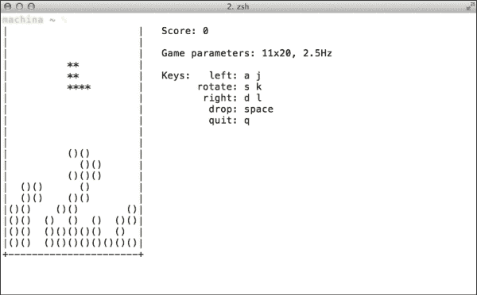

# 第三章：高级编辑

在本章中，我们将从基础的 zsh 使用方法迈出一步，深入探讨命令行的更高级功能。我们将亲密接触并了解 zsh 行编辑器，理解它是如何工作的，以及为什么 zsh 需要专门的输入编辑器。我们将探索新的方法来访问并利用 shell 的历史记录，并学习一些新的命令行编辑技巧，以便加快我们大部分常规任务的处理速度，避免重复劳动造成的乏味。最后，我们将发现，使用 zsh 时，实际上并不需要局限于单行文本。

# Zsh 行编辑器

在上一章中，我们学习了如何访问 shell 的历史记录，以及如何使用一些特殊的转义序列来访问这些记录。然而，我们假设查看先前历史记录的唯一方法是使用键盘上的上箭头和下箭头键，按顺序浏览它们。嗯，正如你可以想象的那样，是时候了解 zsh 另一个强大功能了：zsh 行编辑器。

与其他 shell 不同——我在说你，Bash——zsh 并不依赖于 GNU 的 `readline` 库，而是使用自己的命令行编辑器版本，这个编辑器具备了你期望在一个完善应用程序中找到的大部分功能。zsh 行编辑器，简称 ZLE，允许你定义自己的键绑定（按键组合）和自定义键映射集（键绑定的集合），此外还可以扩展预定义的条目。ZLE 还是 zsh 的一个关键模块，任何交互式 shell 中都会存在它。幸运的是，zsh 足够聪明，知道在不需要 ZLE 时避免加载它，从而节省不必要的资源。

## 了解 ZLE

到现在为止，你已经使用 zsh 足够长的时间，开始注意到有些事情似乎有些奇怪；比如当你按下一个键时，比如 *PageUp*，你肯定会看到一些神秘的符号，就像使用 *Ctrl* + 左箭头快捷键在单词之间移动光标时一样。实际上，ZLE 就是负责理解这些符号的含义以及与之相关的行为的，我们需要通过键绑定来设置这一任务。我们甚至可以将一组键绑定按相同名称分组，并为完全不同的用途使用不同的集合，例如使用 *Home* 键在编辑命令时移动到行首，或者在浏览历史记录时选择第一个条目。但首先，让我们利用 zsh 默认安装和原始 ZLE 中已经定义的内容。

## 使用键映射

ZLE 本身提供了一些便捷的绑定，以便满足 Emacs 和 vi 用户的需求，它们是最流行的编辑器之一。ZLE 支持 vi *插入*模式和 *读取*模式，但默认使用 Emacs，因为这对于新用户来说似乎是最友好的映射。

你可以随时通过在命令行中输入 `bindkey` `-e` 来访问它。我们将在本书中使用 Emacs 键绑定，但如果你对 vi 模式更为熟悉，也可以选择使用 vi 模式。你可以随时通过在终端中输入 `bindkey` `-e` 来返回 Emacs 模式。不论你选择哪种模式，请记住，ZLE 只在交互式 shell 会话中工作，你需要将不同的配置条目和绑定添加到 `.zshrc` 文件中，因为它们需要在每个会话中设置。

### 注意

Zsh 根据你的环境变量 `$EDITOR` 和 `$VISUAL` 来猜测——准确地说，是做出一个合理的猜测——它将默认使用哪个 ZLE 键绑定。然而，请注意，像 `vile` 这样的名字，它包含 `vi` 字符串，会触发使用 vi 键映射。你可以通过在 `.zshrc` 文件中添加 `bindkey -e` 来设置自己的安全网，以避免可能的冲突并显式设置键盘布局。

例如，为了将每个新会话默认设置为 Emacs 模式，打开你的 `.zshrc` 文件并附加以下行：

```
bindkey -e

```

在启动文件中设置默认值并不意味着你必须一直使用它。你可以通过输入以下命令在 vi 和 Emacs 模式之间切换：

```
% bindkey -e

```

或者

```
% bindkey -v

```

通过使用 `e` 或 `v` 选项，你是在告诉 `bindkey` 将提供的 `emacs` 或 `viins` 键映射链接到 `main` 别名，后者将在启动时默认加载。如果发生错误，ZLE 会默认使用 `.safe` 模式，这是一个非常受限的模式，仅提供最基本的功能。在这种情况下，你最好的办法是通过输入 `bindkey -e` 并按 *return* 键来切换键绑定。正如你可能预料的那样，使用 `.safe` 模式意味着你的配置出现了问题，因此，这种绑定你真的不希望频繁看到。

### 注意

正如 vi 用户可能预期的那样，zsh 提供了两个 vi 键映射：`viins` 和 `vicmd`。不过要小心修改这些设置，因为默认使用 `vicmd` 会导致你无法插入任何文本。

## 基本编辑

现在我们已经将默认键映射设置为 Emacs，可以开始讨论一些更有趣的功能，比如能加速任务的键盘快捷键。

以下表格包含一些有用的 Emacs 映射：

| *Ctrl* + *A* | 将光标移动到行首 |
| --- | --- |
| *Ctrl* + *E* | 将光标移动到行尾 |
| *Ctrl* + *W* | 删除光标位置前的整个单词 |
| *Esc* + *B* | 将光标向后移动一个单词 |
| *Esc* + *F* | 将光标向前移动一个单词 |
| *Ctrl* + *D* | 删除一个字符（向前移动）/ 列出补全项 / 登出 |
| *Ctrl* + *U* | 删除整行 |
| *Ctrl* + *K* | 删除到行尾的内容 |
| *Esc* + *D* | 删除光标右侧的一个单词 |
| *Esc* + *Backspace* | 删除光标右侧的一个单词 |
| *Ctrl* + *Y* | 拉取最后一个删除的单词 |
| *Esc* + *Y* | 切换最后一次拉取的单词 |
| *Ctrl* + *T* | 转置两个字符 |
| *Esc* + *T* | 转置两个单词 |
| *Ctrl* + *R* | 向后增量搜索 |
| *Ctrl* + *S* | 向前增量搜索（自动启用 `NO_FLOW_CONTROL` 选项） |

### 注意

根据你的键盘和输入配置，你可以将 *Esc* + 按键序列替换为通常所说的 Meta 键。这个键通常映射到 *Alt* 键；然而，本文中我们将使用 *Esc* + 按键序列来指代这些映射，因为它们具有相同的行为，且更具可移植性。

### 在单词之间来回跳转

*Esc* + *B* 和 *Esc* + *F* 绑定键与 `WORDCHARS` shell 变量密切相关。这是 zsh 判断给定单词开始位置的一种方式，尽管对于来自其他 shell 的用户来说，“单词”的定义可能相当特殊。特别地，`WORDCHARS` shell 变量默认值是……嗯，看看你自己就明白了：

```
% echo $WORDCHARS
> *?_-.[]~=/&;!#$%^(){}<>

```

看到这些符号了吗？这些也被认为是单词的一部分（除了字母数字字符）。在这里需要记住的是 shell 的二元行为；一个字符要么是单词的一部分，要么不是。在使用 *Esc* + *B* 或 *Esc* + *F* 这样的快捷键时请记住这一点，并且在那些特殊情况下，你总是可以覆盖 `WORDCHARS` 的定义。

### 拉取和转置文本

你可能注意到在快捷键表中有 *yanking* 和 *transposing* 这些术语，可能立即想到了“什么？”这种疑问。所以让我们来进一步解释一下。

转置（*Ctrl* + *T*）可能是个花哨的名字，但请放心，其功能远没有听起来那么复杂。简单来说，转置一个字符会将它与右边紧挨着的字符交换位置，使其勇敢地向行尾移动，一次交换一个位置。一旦到达行尾，它只会与前一个字符交换位置。这可能有些困惑，我们通过一个例子来说明：

```
% echo bca
> bca

```

这不对。让我们编辑一下之前的历史记录：

```
% echo bca

```

现在将光标移到 `a` 上——最直接的方法是按行尾快捷键 *Ctrl* + *E*——然后按下转置快捷键 *Ctrl* + *T*。

```
% echo bac

```

`a` 和 `c` 交换了位置。进展！现在再回退一个字符，光标重新定位到 `a` 上，然后再次按下转置快捷键。

```
% echo abc

```

成功！正如我们将在第五章中看到的，*自动补全*将修正这些愚蠢的错误；然而，在你输入诸如参数标志或 URL 之类的错误时，转置功能就非常有用了。

```
% git psuh origin master

```

错误输入的 `git push` 命令可以通过简单地导航到 `psuh` 中的 `u` 并按下转置快捷键来轻松修复。

```
% git push origin master

```

同样的规则适用于单词交换机制 (*Esc* + *T*)。唯一的不同，正如你可能已经猜到的，它作用于整个单词，而不仅仅是字符。

正如古老的谚语所说，行动胜于言辞，以下是另一个例子，这次是通过交换单词来演示：

```
% echo 'world hello,'

```

哎呀！完全弄反了，赶紧来一个 *Esc* + *T*。将光标放在 `hello` 上，按下交换位置的快捷键。

```
% echo 'hello, world'

```

的确，这将让 *Backspace* 键得到了应得的休假。

粘贴操作看起来有点难以解释，但基本上就是插入你之前通过任一 kill 快捷键删除的单词（*Ctrl* + *W*、*Ctrl* + *U*、*Ctrl* + *K*、*Esc* + *D*、*Esc* + *Backspace*）。其工作原理如下：

开始输入你的命令。

```
% echo world hello

```

意识到你犯了个错误，然后删除错误的部分。在这个例子中，我们使用 *Esc* + *Backspace* 删除 `hello` 字符串。

```
% echo world _

```

现在，使用 *Esc* + *B* 快捷键将光标向后移动一个单词。

```
% echo _world

```

然后通过按 *Ctrl* + *Y* 将 `hello` 字符串粘贴到当前行（请注意，在此情况下，你需要在单词之间加一个额外的空格，`_` 字符表示光标应放置的位置）。

```
% echo hello_world

```

在使用 *Ctrl* + *Y* 快捷键进行粘贴后，你可以通过 *Esc* + *Y* 快捷键来在之前删除的单词之间切换。你所看到的 shell 会保留最多 10 个删除的单词，以防你需要再次使用它们。这种“删除单词剪贴板”因其行为被称为 kill ring —— 你会交换每个已删除的单词直到最后一个，然后通过反复按 *Esc* + *Y* 从第一个开始重新循环。然而，注意再次按 *Ctrl* + *Y* 只会插入一个新的先前粘贴的单词。

## 回顾历史

正如你可能在 Emacs 快捷键表中注意到的那样，我们可以使用相当多的快捷键来操作历史记录。那么，让我们更好地利用 ZLE，并结合我们新学到的绑定，进一步扩展 第二章 中的 *历史扩展* 部分。

原来我们可以使用 *Esc* + *<* 跳到历史文件的最开始，也就是日志的第一个条目。同样，按 *Esc* + *>* 可以将我们送到历史文件的末尾。不过，这对于较大的历史日志并不方便。我们真正需要的是执行增量搜索。*Ctrl* + *R* 是 zsh 提供的默认机制，它会显示一个提示框，你可以在其中输入以作为即时搜索过滤器。你输入的越多，匹配就越精确。

```
% # press Ctrl + R
bck-i-search: _

```

开始输入，一旦找到你想要的历史记录条目，你可以按 *return* 执行它，或者按左箭头/右箭头键编辑选中的条目。你可以随时通过按 *Ctrl* + *G* 退出此模式。

### 提示

增量搜索模式有自己的键映射，称为 `isearch`。

很可能你的终端设置了使用*Ctrl* + *Q*和*Ctrl* + *S*组合键来进行流控，分别用于停止和恢复终端输出。为了避免与默认的`history-search-forward`绑定（也就是*Ctrl* + *S*）冲突，zsh 提供了`NO_FLOW_CONTROL`选项，可以在启动文件中进行设置。

```
setopt NO_FLOW_CONTROL

```

这将安全地禁用终端内的该行为（其他程序通常依赖于流控），因此，使用*Ctrl* + *S*时建议采用这种方式。

# 高级编辑

到目前为止，我们已经掌握了命令行的基本操作，并且开始习惯 ZLE 的使用。现在是时候更进一步，看看行编辑器到底能做什么了。

## ZLE 相关选项

如果没有一些选项让我们现在来调试一下，这一章怎么能算完呢？以下是一些可以尝试的内容，如果你想修改 ZLE 的默认行为：

+   `NO_BEEP`: 该选项可以跳过错误时的蜂鸣提示。

+   `OVERSTRIKE`: 该选项将编辑器默认设置为插入模式。其工作原理是每输入一个新字符，它会替换当前光标右侧的字符，而不是像默认设置那样将其推移到右边一个位置。

+   `SINGLELINEZLE`: 关闭多行编辑。不，我没有吸毒。这可以作为一种提醒，提醒我们曾经度过的黑暗时光。

将这些选项添加到你的启动文件（特别是`.zshrc`）中，你就完成了设置。

## 定义你自己的键映射

除了 Emacs 和 vi 模式设置选项外，`bindkey`内置命令还允许你创建自己的键映射，并使用几个简单的选项将它们定义为别名。特别是，`-N`标志让你可以即时定义一个新的键映射。

```
% bindkey -N newmap # this creates a keybind named 'newmap'

```

或者基于现有的配置创建一个新的。

```
% bindkey -N mycoolmap emacs # this creates a new keymap based off the existing 'emacs'

```

然后你可以通过简单地输入以下命令，使用`-A`选项将新的键映射定义为别名：

```
% bindkey -A mycoolmap mymacs # this creates an alias 'mymacs' for 'mycoolmap'

```

为现有的`mycoolmap`键绑定创建别名`mymacs`，可以让你在以后使用`bindkey -D mycoolmap`删除它，而无需担心丢失设置。事实证明，这两个别名被视为独立的键绑定；因此，删除其中一个不会影响另一个。这在你尝试修改绑定时非常有用，尤其是在你希望从头开始，或者只是希望有一个备份，以防设置出现问题。不过要小心命名你的别名，因为如果它们的名称相同，任何现有的键绑定都会立即被新的别名替换！

### 注意

你应该避免命名自己的键映射以点符号`.`开头，因为 zsh 的未来版本可能会带有冲突的命名空间。

`bindkey`命令还有许多其他可用的选项。特别是在填充启动文件时，列出选项很有用。具体来说，`l`和`L`允许你以不同格式列出可用的键映射。通过输入`bindkey -l`，你可以快速查看当前可用的键映射，而输入`bindkey -lL`则会将输出格式化为一系列`bindkey`命令。

```
% bindkey -lL
> bindkey -N command
 bindkey -N emacs
 bindkey -N isearch
 bindkey -N listscroll
 bindkey -A emacs main
 bindkey -N menuselect
 bindkey -N vicmd
 bindkey -N viins

```

你还可以使用此选项来检查某个特定的键映射是否是链接：

```
% bindkey -lL mymacs
> bindkey -A mycoolmap mymacs

```

这告诉你，正如预期的那样，`mymacs`是我们之前定义的`mycoolmap`键映射的别名。通过使用`-lL`选项来检查`main`别名，你就有了一个实用的方法来确定当前正在使用的键映射。

```
% bindkey -lL main
> bindkey -A emacs main

```

最后，你可以使用`-L`选项列出所有当前绑定的键，包括内置键映射的绑定，并将其格式化为可以在脚本中使用的方式：

```
% bindkey -L
 bindkey "^@" set-mark-command
 bindkey "^A" beginning-of-line
 bindkey "^B" backward-char
 bindkey "^D" delete-char-or-list
 bindkey "^E" end-of-line
 bindkey "^F" forward-char
 bindkey "^G" send-break
 bindkey "^H" backward-delete-char
 # [...] large list of bindings omitted
 bindkey -R "\M-^@"-"\M-^?" self-insert

```

只需将输出复制并粘贴到启动文件中，你就有了自定义键映射的基础。你只需将操作或快捷键替换为更适合你需求的内容，完成即可。很方便，不是吗？

### 提示

你可以使用`read`工具来找出终端仿真器发送给 shell 的实际转义序列；只需调用`read`，然后输入你想尝试的序列。例如，以下是*Ctrl* + back-arrow 在我的系统上发送的内容：

```
% read
> ^[[1;5D
```

一些键，例如*Backspace*，可能需要你使用`-k`选项，这样你可以指定要读取的字符数。单独使用时，它将默认读取一个字符。

```
% read -k
```

现在（按下*Backspace*键）。

```
^?
% # and you are back to the prompt
```

请记住，你可以随时通过按下*Ctrl* + *C*来退出`read`命令。

Emacs 用户会发现自己对*Esc* + *X*组合键非常熟悉。按下*Esc*，然后按*X*键，ZLE 会向你展示`execute`提示符。然后你可以开始输入命令，甚至可以使用*Tab*键来获得自动补全帮助。例如：

```
# type in "hello" and navigate to the beginning of the line (Ctrl + A) followed by Esc + X
% _hello
execute:
# ZLE waits for your command, type `ca` and press Tab key:
% _hello
execute: ca

% _hello
execute: capitalize-word
# now press return and watch how the command is applied

% Hello

```

我们使用*Ctrl* + *A*的原因是为了让提示符出现在行的最开始位置，紧跟其后的字符串之前。

### 提示

记住，你可以随时通过使用*Ctrl* + *G*组合键退出`execute`提示符。

正如敏锐的读者可能注意到的那样，确实有许多方法可以实现相同的行为，但这在某种程度上偏离了`execute`序列的重点。它的存在仅仅是为了让你做一些平时不会做的事情（可能是因为快捷键不便或缺乏肌肉记忆）；执行它及其完成机制将使得回忆命令变得轻而易举。

与`execute`类似，`where-is`——默认情况下没有绑定任何序列——将向你展示如何执行给定的命令。只需调用`execute`，输入`where-is`（就像之前一样，你可以使用 Tab 进行自动补全），然后按下*return*键。这时，你将看到`Where is:`提示符，你也可以使用补全来列出你需要的命令。按下*return*键，ZLE 将显示绑定到该命令的序列。例如，我们可以使用`where-is`来找到我们`capitalize-word`示例的替代快捷键，如下所示：

```
% # enter where-is mode via Esc + X
> Where is: capitalize-word
> capitalize-word is on "^[C" "^[c"

```

哇，看看这个。原来我们可以通过使用*Esc* + *C*组合键，在提示符后立即将单词首字母大写。

# 别叫它们小部件

每个渴望学习 zsh 的学生都会经历谈论小部件的时刻。是时候你我一起谈谈它了。

曾经想过所有那些键绑定和特殊动作是如何组合在一起并完美运行的吗？嗯，我们得感谢小部件。看看，zsh 喜欢在能委派责任的地方就委派，而小部件就是一个典型的例子；它不需要处理每一个由按键序列执行的小动作（类似于你在键映射中定义的那些），而是依赖小部件来做实际的工作。把它们想象成执行简单任务的小函数。另一方面，我更喜欢把它们想象成那些在厨房里悄悄施展魔法的小矮人，只要我不在场。

ZLE 自带了相当多的内置小部件，每个小部件都有两个名称，一个是常规名称，另一个是隐藏名称，隐藏名称就是在常规名称前加上一个点（`.`）字符。隐藏名称的存在仅仅是为了表示它们不能被重新绑定到其他小部件（从而创建一个备份副本，确保在你的键绑定定义出错时始终可用）。

正如你可能猜到的，这并不是全部；小部件可以是用户自定义的，也可以由其他模块（如 ZLE 或内置的 FTP 客户端`zftp`）定义。

## 定义你自己的小部件

定义你自己的小部件并不会比用`zle -N`命令调用小部件的名称更复杂。

```
autoload -Uz tetris
zle -N tetris
bindkey '\et' tetris
```

上面的例子稍微改编自 zsh wiki 网站的建议之一（[`zshwiki.org`](http://zshwiki.org)），将*Esc* + *T*组合键绑定到内置的 tetris 模块，这样你就可以在命令行的空闲时光中更加娱乐。

让我们逐行解析一下：

```
autoload -Uz tetris
```

这是老掉牙的`autoload`模块，用于处理在 shell 中加载不同的模块和函数。在这个特定的例子中，我们正在导入`tetris`模块以供后续使用。

```
zle -N tetris
```

这里就是魔法真正发生的地方；我们通过调用 ZLE 并使用`-N`选项，告诉它我们新小部件的名称是`tetris`，来定义新的小部件。

### 注意

请记住，隐藏名称对于小部件来说是特殊的，因此避免使用以点（`.`）开头的名称。

我们通过将新定义的小部件绑定到键盘上的*Esc* + *T*快捷键，简单地完成了定义：

```
bindkey '\et' tetris

```

请注意，**tetris**的粗体调用指的是我们定义的小部件，而不是实际的`tetris`模块。

现在，为了实际看到它的效果，你必须将其添加到你的`.zshrc`文件中，或者将其保存为单独的文件并从`.zshrc`中引用，就像我们之前做的那样。所以，去吧，把它保存为`.zsh_tetris`到你的`$HOME`文件夹中，并通过添加以下行从`.zshrc`引用它：

```
source .zsh_tetris
```

现在按下*Esc* + *T*组合键，享受你新的小部件。



只是玩了几局俄罗斯方块。是的，我有点生疏了。

### 特殊变量

在 ZLE 中，有些特殊变量在定义你自己的小部件以编辑和/或操作命令行时会派上用场。

以下列表包含了一些最常用的引用：

+   `CURSOR`：这是当前光标在命令行上的位置。

+   `BUFFER`：这是当前编辑缓冲区的内容，可以跨越多行。

+   `LBUFFER`/`RBUFFER`：分别表示当前光标左侧和右侧的内容。它们也可以跨越多行。

+   `PREBUFFER`：这是编辑续行时已经读取的缓冲区内容。

+   `WIDGET`：这是当前编辑器正在使用的小部件的名称。

通过使用这些变量，你可以例如通过简单地使用`${BUFFER[CURSOR]}`表达式来精确知道当前光标下的字符是什么。这也可以理解为“`BUFFER`数组中`CURSOR`位置的值”（记住，`CURSOR`只是一个数字，表示提示符所在的列）。

## 你的第一个函数

你可以通过定义自己的函数来实现更复杂的行为。每次小部件执行时，它都会调用相应的函数。让我们用第二个小部件把它提升到一个新层次。

在下面的示例中，我们将使用一个改进版的优秀`rationalize-dot`小部件，正如在 ZSH-LOVERS 的 man 页中展示的那样（[`grml.org/zsh/zsh-lovers.html`](http://grml.org/zsh/zsh-lovers.html)）：

```
function rationalize-dot {
  if [[ $LBUFFER = *.. ]]; then
    LBUFFER+=/..
  else
    LBUFFER+=.
  fi
}
zle -N rationalize-dot
bindkey . rationalize-dot
```

现在让我们逐行讲解它。

首先，我们在这里定义了自己的函数，叫做`rationalize-dot`。声明函数的方法很简单，就是给它起一个特殊的名字，后跟圆括号，如下所示：

```
my_function() {
    my_code
}
```

你看到的花括号`{}`是函数体的定界符；它们之间的内容视为函数的一部分，就像前面示例中的`my_code`占位符。

另外，你也可以使用保留关键字`function`来定义函数，并略微变化之前的语法，如下所示：

```
    function my_function {
        my_code
    }
```

如你所见，我们将圆括号换成了前面的函数关键字。否则，两种语法表示的是相同的内容，可以互换使用。所以，随便选择一个你喜欢的方式。

同样，调用一个函数并不会比明确写出它的名称更复杂；在这个例子中就是`my_function`。

回到`rationalize-dot`的例子，第二行是一个`if`语句，这是 shell 提供的最基本的控制流机制。用最完整的形式时，`if`语句将类似于如下：

```
if condition; then
    my_code
elif another_condition; then
    more_code
else
    even_more_code
fi

```

在最基本的形式中，`if`语句测试一个布尔条件，即一个表达式或命令，结果为真或假（或具有表示这一点的退出状态），并据此采取相应的行动。对于第一个条件不适用的部分，`else`部分将会处理如下：

```
if condition; then
    do_a_barrel_roll
else
    echo "can't do it"
fi

```

### 提示

注意结尾的`fi`吗？把第一个`if`当作是一个打开的花括号`{`，而`fi`就是闭合的花括号`}`。

上面的示例会测试条件`condition`，如果其评估为真，我们的模拟函数将调用`do_a_barrel_roll`代码。如果`condition`不为真（即通常所说的假），那么`else`块将被调用，并负责发出`echo "can't do it"`命令。

`elif`语句意味着“否则，如果”，用于进一步评估条件。你可以根据选项的数量添加尽可能多的`elif`子句，但在遍历这个过程时要小心；如果不恰当地处理，整洁的代码会迅速变成混乱的“意大利面”代码。

在`rationalize-dot`的例子中，`if`语句会检查`LBUFFER`变量是否匹配表达式`*..`，实际上是“用户是否输入了某些内容并跟着两个句号？”如果是这样，那么将`/..`表达式追加到缓冲区变量中。否则，让`else`语句来处理它。

根据`else`块，它只会向缓冲区添加一个实际的句号：

```
else
    LBUFFER+=.
fi
```

起初，这可能看起来并不合逻辑，直到我们进入接下来的几行：

```
zle -N rationalize-dot
bindkey . rationalize-dot
```

第一个是我们之前见过的标准小部件声明，但紧接其后的绑定使得`rationalize-dot`函数需要`else`语句来添加一个句号。因为它在每次按下句号键时被调用（即它所绑定的快捷键），所以如果用户还没有输入任何内容，它就需要像一个实际的句号键那样表现。

如同之前一样，你可以将其添加到`.zshrc`文件中（或其他任何由其加载的模块），然后进行测试；只需输入`...`，看看按下第三个句号后会发生什么。

正如我们稍后将在第五章中看到的，*补全*，你还可以通过扩展或将它们添加到你的`$fpath`变量中，让 shell 自动加载函数。

这在与`cd`命令和大量嵌套文件夹结合使用时尤其有用。

想更进一步吗？你会在`zshzle(1)`手册页的*标准小部件*部分找到大量用于自定义快捷键绑定的预定义内建小部件。只需输入`man zshzle`来开始。

# 使用区域

继续延续 Emacs 继承的行为，你可以通过按住*Ctrl*键并按下空格键来设置命令行中的区域。这将触发一个区域选择机制，你可以通过箭头键进行扩展，就像你用鼠标点击并拖动来高亮文本一样。

那么，为什么要使用区域呢？举个例子，你可以通过*Ctrl* + 空格键组合标记一个区域，然后在其上执行一个命令（类似于我们之前看到的`capitalize-word`），或者甚至将前面提到的`execute-command`混合进来，调用一个没有绑定的函数。总体来说，这些来自 Emacs 的小细节使得 ZLE（当然，还有 zsh）具备了几乎像一个完整编辑器一样的多功能性。

## 多行编辑

到此为止，得知 zsh 足够聪明，能够识别你是否完成了一行的输入，应该不会感到惊讶。不过，与大多数其他 shell 不同，zsh 还能够建议你可能缺少的内容，甚至允许你使用多行输入命令。不同于传统的续行方式，在那种方式中你在行末加上`\`字符并按*回车*继续输入下一行，ZLE 会用`$PS2`提示符迎接你，并且添加更多的上下文信息。

在大多数 Bourne 衍生的 shell 中，你可以使用以下命令：

```
% ls \

```

按*回车*（注意在`\`字符后面什么也没有）。

```
> -a

```

再次按*回车*，它将像`ls -a`命令一样工作。Zsh 会给你更多的上下文信息，像这样：

```
% echo " # press return immediately after the double quotes
dquote> _

```

`$PS2`提示符（备用/第二个提示符）会被调用，用来表示 shell 在等待剩余的双引号赋值。继续并按如下方式完成：

```
dquote> $HOME" # press return here
> /home/gfestari

```

多行编辑不仅仅是备用提示符那么简单。你可以使用*Esc* + *回车*快捷键来添加一个新的继续行：

```
% echo hello world # press Esc + return
echo goodbye world

```

再次按*回车*，你将看到两行代码按顺序执行，就像它们是一个脚本一样。记住，你不只限于两行，你可以添加任意多的行。

这项魔法的力量归功于`self-insert-unmeta`命令，它的作用仅仅是将回车符插入到行中。所以现在你知道，每次按下*Esc* + *回车*，你实际上是在使用`self-insert-unmeta`命令的快捷方式。

除了明显的“不同”的感觉之外，*Esc* + *回车*方法的真正便利之处在于，你可以通过使用箭头键在行间随意移动。更棒的是，每个多行输入会被当作一整行处理。只需按上箭头，你会看到你之前输入的代码重新回到屏幕上，供你编辑。既然我们在讲这个，我还想让你了解一下`push-line-or-edit`命令，它允许你在继续输入时将之前输入的一块行转换成一个单独的块（否则它将像普通的 push-line 命令一样工作）。它大致是这样工作的：

在命令行中开始输入你的函数，在第一个`if`语句之后按*回车*：

```
% if [[ true = false ]]; then # press return here
then> echo _

```

停下来。意识到你在`if`语句的条件子句中犯了一个严重的错误（除了那个极其简单的逻辑...但嘿，这是一个示例）。不幸的是，由于你已经按下了*回车*，你无法通过上箭头按钮滚动回上一行，这会触发历史搜索行为，那么接下来该怎么办呢？当然是`push-line-or-edit`。按下*Esc* + *X*来执行一个命令，输入`push-line-or-edit`（你可以使用*Tab*键进行自动补全），然后按下*回车*。

提示符将变为传统样式（去掉了续行中的`then>`指示符），你将拥有一个新缓冲区，里面填充了你之前输入的所有行，当然，你可以像这样随意编辑：

```
% if [[ true = false ]]; then
echo_

```

看到了`push-line-or-edit`有多么优越，显然建议将其绑定到默认的`push-line`快捷键，`^q` 或 `\eq`：

```
bindkey '^Q' push-line-or-edit
bindkey '\eQ' push-line-or-edit

```

现在，你可以使用*Ctrl* + *Q* 或 *Esc* + *Q* 快捷键来编辑整个块，就像它是单行一样。与我们之前看到的`history-search-forward`绑定（默认是*Ctrl* + *S*）类似，*Ctrl* + *Q* 需要设置`NO_FLOW_CONTROL`选项，以避免与终端驱动程序的行为冲突。

这一切都始于`push-line-or-edit`，所以看起来我们应该讨论一下实际的`push-line`部分。当你不在续行时，这将是默认行为。只需像往常一样输入命令，但不要按*return*键：

```
% ls -a

```

意识到自己进入了错误的目录后，通过*Ctrl* + *Q*调用我们新绑定的`push-line-or-edit`命令，提示符会被清空，如下所示：

```
# push-line-or-edit
% _

```

现在，使用`cd`进入你想列出的文件夹，看看缓冲区如何重新激活：

```
% cd myfolder
myfolder % ls -a

```

一旦你执行了一行命令，提示符会填充你在调用`push-line`之前编辑的行。

## 把所有内容整合在一起

如我们之前所见，ZLE 的一个特殊之处在于它能够访问 Shell 的历史记录，这当然意味着我们可以利用一些我们学到的技巧，进一步改善与历史记录的互动。

利用上下箭头键的一种巧妙方法是通过`history-beginning-search`命令。我们可以定义自己的映射，以便为默认行为添加一些额外的增强，示例如下：

```
bindkey '\e[A' history-beginning-search-backward
bindkey '\e[B' history-beginning-search-forward

```

请注意，`\e`转义序列也可以用`^[`替代，这样绑定就分别变为`^[[A`和`^[[B`。

现在，如果你有一个空的提示符并按上箭头键，它会像往常一样检索历史记录中的最近条目。然而，一旦你输入内容并按上箭头键，它会自动补全与输入匹配的最近条目。

举个例子，输入以下内容，在每一行后按*return*键：

```
% echo hello world
% ls
% echo bye world

```

现在，按上箭头键。自然的向后滚动序列应如下所示：

```
> echo bye world
> ls
> echo hello world

```

按*Ctrl* + *G*退出搜索模式。现在输入`ec`并按上箭头键：

```
% ec
> echo bye world

```

在你忘记了一行内容并且不想进行搜索或丢弃当前行时，这非常有用。只需记住，如果你希望在会话之间保留这些更改，必须将绑定添加到启动文件中！

# 总结

在这一章中，我们深入探讨了在你按下*回车*之前，提示符与 shell 之间发生了什么。我们发现了一些新的技巧来处理历史记录，并通过创建自己的键位映射和绑定，征服了默认的快捷键。就像这还不够一样，你现在知道我们不再仅限于处理一行文本，错误和干扰也能通过几个按键轻松解决，而不必重新输入整行内容。

好吧，我承认，在这一章我们确实很忙。所以现在是时候稍微休息一下了，让我们回顾一下在这一节课中所涵盖的内容。我们做了以下几点：

+   了解到 zsh 是由多个模块组成的，并熟悉了 ZLE

+   使用键位映射来编辑文本，学习了各种快捷键，提升了在命令行中的工作效率

+   定义了我们自己的自定义键位映射，并与不同的区域和多行提示进行了互动

+   了解了小部件，这些是执行编辑器中每个小任务的特殊函数

+   编写了我们的第一个示例小部件，进一步扩展了编辑器的功能，提升了我们的 shell 使用体验

+   通过 `if` 语句了解了函数和控制流

+   最后，我们了解到模块和函数都有特别的权限，可以访问 shell 的不同部分，我们可以做一些操作，比如将 ZLE 小部件与键位绑定连接起来，以便搜索历史记录

说一天不算糟吧。接下来，让我们进入下一章，在这一章中我们将学习关于 Globbing 和文件名生成的内容，这也是 zsh 在其中大放异彩的特性之一。如果你以为在这一章里通过 ZLE 学会了如何减少打字量，等你见识了大括号和限定符的实际应用后，你会更加惊讶。不过，保持你的自信和活力，因为前方还有更多的内容等着我们。
