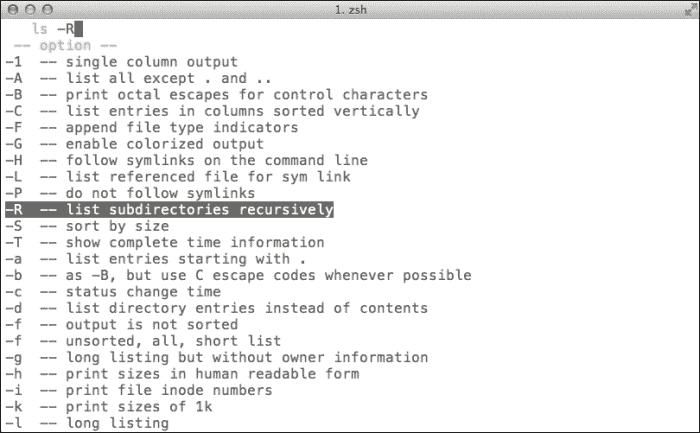

# 第五章：补全

这就是大多数用户切换到 zsh 的原因：补全。在这一章中，我们将介绍 zsh 的最佳功能之一：`compsys`。被称为“新”的补全机制，本章将重点讲解它的各种功能和配置。我们将学习如何调整补全行为，使其不再仅限于文件名，并通过样式和我们自己的函数进一步提升它。完成后，你应该能够阅读大多数 zsh 脚本，并调整许多现有的函数。

# 开始使用补全

没有人真正喜欢输入枯燥的文件名，这也是补全功能最初出现的原因——输入几个字母，按下*Tab*，然后 Shell 会帮你完成其余部分。不过 zsh 更进一步，实际上允许你补全几乎任何东西。默认情况下，*Tab*键在 zsh 中绑定到补全命令。

和 Bash 一样，zsh 默认启用文件名补全。不过与其他任何东西不同，zsh 可以启用几乎所有在命令行中出现的内容的补全——路径、外部和内建命令、别名、函数和选项，应有尽有。即使你说不出它的名字，你也可以编程来补全它，稍后我们将会学习这一点。

最初，zsh 使用内建模块和特殊语法来提供自动补全。幸运的是，这最终被一个更加简单的机制所替代。我们将重点介绍这个完全基于 Shell 函数的新补全系统。

打开你的`.zshrc`文件，添加以下内容以激活 Shell 补全功能：

```
autoload -U compinit
compinit
```

这个新增功能将使 Shell 加载并自动启动补全系统。`-U`标志告诉 Shell 避免展开任何别名。这将使双击*Tab*键触发补全模式。

### 注意

`compinit`是补全系统的核心部分。因此，直到你更新并引用了你的`.zshrc`文件，或者至少在终端中运行了`autoload -U compinit && compinit`，你无法进行任何测试。

记得给你的文件加上源文件引用，然后让我们尝试一下新启用的补全功能。输入`ec`并按下*Tab*：

```
% ec <Tab>
% echo 

```

Shell 会自动补全外部命令，如`echo`。zsh 真是太贴心了，不是吗？

### 提示

正如我们之前提到的，zsh 有两种方式来执行命令行补全。你可以通过输入`man zshcompctl`来了解“旧方式”是如何工作的，当然，这只是为了学术目的。

补全也可以应用于环境变量，例如：

```
% echo $HOM <Tab>
% echo $HOME

```

默认情况下，zsh 启用`AUTO_LIST`选项，用于处理歧义匹配的解析，向你提供所有可能的补全。为了演示这一点，让我们回到之前的例子，这次我们只输入`HO`，看看补全是如何工作的：

```
% echo $HO<Tab>
Completing parameter
HOME  HOST

```

Shell 并不完全知道我们想要的是什么，所以它会在提示符下方展示一份可能匹配的列表。当标准发生变化时，这个列表会被更新，因此我们只需担心按下*Tab*键。

现在，让我们尝试使用`ls`进行选项补全，如下所示：

```
% ls -<Tab>

```

下方的截图展示了如何触发`ls`命令的补全：



菜单选择演示

看到有几个可选项可以选择，zsh 会为你展示一个菜单，你可以通过反复按*Tab*键或使用箭头键来浏览。

最后，你还可以使用补全来扩展命令，如下所示：

```
% echo `which zsh`<Tab>
% echo /usr/local/bin/zsh

```

你可以看到补全的效果——它足够强大，让我们希望能在所有地方都能使用，而不仅仅是输入的单词上。然而，在我们开始编写自己的函数之前，我们先来看看 zsh 样式，即我们用来配置`zstyle`内建行为的选项。

## 与 zstyle 打交道

与我们在本书中设置和取消设置的 Shell 选项不同，zstyle 要求更复杂的语法作为启用上下文敏感补全的交换条件。

zstyle 是通过`zstyle`关键字来定义的，后面跟着一个以冒号分隔的参数列表：

```
:completion:function:completer:command:argument:tag
```

第一个参数`completion`用于定义一个上下文，因为在不同的上下文中，某个样式的行为可能会有所不同。不过这并不复杂，我们很快就会看到。

第二个参数是样式的名称，用来供内建引用。其余的参数则赋予该样式独特的补全行为。

这里模式也会回归，你可以将它们用作每个后续参数的标记。当你定义样式时，顺序非常重要，因此尽量将不太具体或通用的样式放在定义的底部，否则你会覆盖掉更具体的功能。

你可以定义的最通用的样式类型是`:completion:*`，它几乎适用于所有情况，因此在定义时要小心，避免错误地将其排在前面。

正如你所想，zsh 有一些技巧，比如能够在匹配列表中显示一些有用的消息。不过，为了使这个功能生效，我们需要启用以下样式：

```
zstyle ':completion:*' format %d
```

通过将这个添加到你的`.zshrc`文件中，每当 zsh 执行补全时，你现在可以获取更多的信息。例如：

```
% true<Tab>
no argument or option

```

细心的读者可能已经注意到样式格式中有`%d`模式。没错，我们可以使用与定义提示符时相同的转义序列。

### 提示

已经厌烦听到提示音了吗？那是 zsh 在告诉我们，尝试了一个模糊的补全。你可以通过在`.zshrc`文件中取消设置`LIST_BEEP`选项，来避免这种烦人的模糊提示：

```
unsetopt LIST_BEEP
```

正如我们之前提到的，你还可以将你的样式行为缩小到更具体的上下文。例如，你可以使用以下任意一个：

```
zstyle ':completion:*:descriptions' format '%B%d%b'
zstyle ':completion:*:messages' format %d
zstyle ':completion:*:warnings' format 'No matches for: %d'
```

这只是为了为属于`warnings`、`messages`和`descriptions`组的消息设置一个自定义模式。正如你所看到的，`warnings`现在将报告为`No matches for: <argument>`，这就不那么单调了。

你也可以为结果增加一点点装饰，像这样：

```
zstyle ':completion:*' group-name ''
```

这将单独显示所有不同类型的匹配项。如果没有为某个特定匹配项定义标签或组，它将显示在`default`组下。

### 提示

菜单选择让你心动了吗？下面是如何让它对你所有的匹配项都可用：

```
zstyle ':completion:*' menu select=1
```

对样式感觉舒服了吗？很高兴听到这个。正如从这些示例中可以看到的，这里没有神秘的魔法——只有一些文档和创造力，填补你和自定义样式之间的空白。

# 命令更正

补全也可以更正你可能输入的任何拼写错误的命令。我们将使用以下格式来定义样式：

```
zstyle ':completion:*' completer _expand _complete _correct
```

然后我们将使用以下命令来测试自动更正功能：

```
% prnti<Tab>
corrections (2 errors)
print   printf
original
prnti

```

Zstyle 注意到我们拼错了`print`，并对此进行了详细说明。记住，你可以使用*Tab*键在可用选项之间切换。

或者，如果你想要一个更“手把手指导”的方式，你可以使用`correct`选项。具体来说，这个选项会让 zsh 在每次建议更正时都要求你确认：

```
% setopt correct
% prnti<Tab>
zsh: correct 'prnti' to 'print' [nyae]?

```

这个特殊的`nyae`首字母缩写代表*No*、*Yes*、*Abort*和*Edit*，其工作方式如下：

+   `n`：这将强制 shell 执行你在命令行中输入的内容（在这个例子中是`prnti`）。

+   `y`：这将执行更正（在此示例中，将`prnti`更正为**print**）。

+   `a`：这将中止并允许你输入一个完全不同的命令。可以把它当作一个紧急按钮。

+   `e`：这将允许你编辑命令行中的当前文本。如果你觉得 shell 提供的建议完全不对劲，可以使用此选项进行更精细的控制。

命令选项呢？你知道的，那些我们经常传递的标志？结果，竟然也有样式可以处理这个。以下内容将使命令显示它们选项的描述：

```
zstyle ':completion:*' verbose yes
```

这些可以很容易地解释清楚；现在，继续输入以下内容：

```
% print -<Tab>

```

```
-- option --
-C  -- print arguments in specified number of columns
-D  -- substitute any arguments which are named directories using ~ notation
-N  -- print arguments separated and terminated by nulls
-O  -- sort arguments in descending order
(list goes on...)

```

还不错吧？记得我提过在我们学会一些样式后，就不那么依赖 man 页面了吗？没有？没关系，反正我们不会那么...算了。

## 补全器

zstyle 中的第三个条目是为补全器保留的。这些是处理不同类型补全的函数。默认情况下，补全器列表包含一个函数，`_complete`，但补全器家族中的每个成员都会为你的样式添加独特的行为。

```
zstyle ':completion:*' completer _expand _complete _correct
```

在你的`.zshrc`文件中使用时，这个补全器将使用通配符扩展输入并与`_complete`和`_correct`补全器进行匹配。这里使用`_correct`补全器来修正任何打字错误和拼写错误。我们将其放在参数列表的最后，这样`_complete`就可以优先使用。

### 注意

当在样式中使用时，补全器名称会省略前导的下划线：

```
zstyle ':completion::complete:*' use-cache on
```

这个样式通过为任何需要的补全启用缓存层，来配置`_complete`补全器，从而提高此类功能的整体响应速度。

与`_correct`类似，`_approximate`将执行相同的任务，额外的好处是允许在光标位置输入一些额外的错误字符。请注意，如果你需要同时使用这两者，`_approximate`需要放在`_correct`之前。

作为一个函数，zstyle 也使用标志。我们特别关心的是`-e`选项，它告诉 zstyle 在每次调用时将最终的字符串作为一个参数进行评估。这使得我们可以使用更加动态的样式，例如以下：

```
# One error for every three characters
zstyle -e ':completion:*:approximate:*' max-errors 'reply=( $(( ($#PREFIX+$#SUFFIX)/3 )) numeric )'
```

这会配置`approximate`补全器，动态地评估`max-errors`参数的每个调用的参数。`reply=( $(( ($#PREFIX+$#SUFFIX)/3 )) numeric )`字符串使用`reply`钩子在行编辑器中显示结果，并将其值设置为表达式`(PREFIX + SUFFIX)/3`。这意味着“每三个字符一个错误”。`PREFIX`和`SUFFIX`分别是包含光标位置之前和之后的值的变量。

## 忽略匹配项

有时，某些匹配建议会让你感觉完全不合适。幸运的是，zsh 的开发者们为我们提供了一个`_ignore`补全器。

以以下目录树为例：

```
zsh
├── README.md
├── Completion/
├── Misc/
├── Scripts/
└── Util/
```

当我们在前面提到的任何子目录中工作时——例如，`Completion`文件夹——看一下我们尝试使用`cd`命令更改目录到同一级别的其他目录时发生了什么：

```
% cd ../ <Tab>
directory
Completion/
Misc/
Scripts/
Util/

```

让`Completion`机制显示我们当前所在的文件夹有点尴尬，而且这让整个`cd`命令显得有些没必要。为了让 shell 变得更具上下文敏感性，我们可以使用`ignore-parents`、`parent`和`pwd`选项来修改`cd`命令的补全行为：

```
zstyle ':completion:*:cd:*' ignore-parents parent pwd
```

以下将从补全结果中移除相应的匹配项。注意，现在`Completion`已经从结果中消失：

```
% cd ../ <Tab>
directory
Misc/
Scripts/
Util/

```

在此期间，你可以使用以下样式，当使用目录作为参数时，去除末尾的斜杠：

```
zstyle ':completion:*' squeeze-slashes true
```

# 函数定义

最后，我们将关注`compsys`，即 zsh 的补全系统。这是 shell 中最复杂的部分之一，对于用户和开发者来说都不容易。然后，在我们深入了解`compsys`之前，我们需要稍微停一下，见见一个实际的函数。

### 小贴士

和往常一样，你可以通过 man 页面了解更多关于 `compsys` 的信息，特别值得关注的是 `man zshcompsys` 和 `man zshcompwid`。

下面是其中一个例子：

```
hi() {
print 'Hello, world'
}
```

在这里，我们定义了 `hi` 函数，这就是我们以后需要时调用它的方式。每次使用时，它都会打印 `Hello, world`。那我们就开始吧，怎么样？

打开你选择的终端模拟器，逐行输入以下内容：

```
% hi() {
function> print 'Hello, World!'
function> }

```

注意 zsh 是如何识别出我们正在定义一个函数，并立即使用继续提示符（`function>`），让我们可以继续操作吗？真是太好了，zsh 等着我们直到我们正确关闭花括号。

现在，来测试你的第一个函数吧：

```
% hi
Hello, World!

```

它们增长得如此之快！

接下来是让人遗憾的部分——这个函数只在你当前的会话中有效，就像我们在第二章，*别名和历史*中定义别名时一样，这是我们 zsh 冒险的开始。如果你希望 `hi()` 或其他任何函数在每个交互会话中都能使用，你需要把它添加到启动文件中。

需要提醒的是：一旦你开始使用补全和函数，这些启动文件会变得相当拥挤。因此，最好是将函数移到一个更合适的地方，比如它们自己的 `.zsh_functions` 文件。别担心，这个过程非常简单。

首先，我们创建一个隐藏文件；你可以随意命名，但我们这里使用 `.zsh_functions`（注意前面的点，这样系统就会把它隐藏起来）。

```
% touch ~/.zsh_functions

```

一旦你在 `$HOME` 目录中创建了文件，接下来就是在其中添加你的函数。你可以使用你最喜欢的编辑器；我们这里为了方便，就用 `cat`：

```
% cat >> ~/.zsh_functions
greet() {
 print 'Hello, World!'
}

```

按 *Ctrl* + *D* 关闭文件。

现在，正如我们之前所学，这个文件本身不会执行任何操作，除非我们让它生效。因为每次手动加载文件会很麻烦，所以我们只需再往前一步，把 `.zsh_functions` 的加载过程添加到启动文件中。接下来，打开你的 `.zshrc` 文件，添加以下内容：

```
[[ -f ~/.zsh_functions ]] && source ~/.zsh_functions
```

这是一个条件语句。这里使用的双中括号（`[`）是 `test` 命令（或者说是*新测试*，如果你已经使用命令行一段时间了），它帮助你比较字符串并测试文件属性。`-f` 选项用于常规文件，只有在文件存在时才会成功。所以我们实际上是在说“测试 `~/.zsh_functions` 文件是否存在”。如果测试通过，接下来的命令部分会被执行，我们最终就能加载我们的函数文件。

顺便提一下，这个表达式支持文件名通配符，因此我们在[第四章中学到的所有技巧，*通配符*，仍然适用。

你可以使用相同的机制来源代码多个文件；只需要记得在 `.zshrc` 文件中添加这行，别忘了测试失败开关，这样就能避免加载系统中不存在的文件（当然也避免错误）。

和往常一样，你可以通过在终端中输入 `man [` 来深入了解 `test` 命令。关于 `[[` 复合命令的更多细节，请参阅 `zshmisc(1)` 手册中的 *条件表达式* 部分。

好的，我明白了。那么，函数和补全有什么关系呢？其实，关系很大！看，`compsys` 完全是由函数组成的：每当你按下 *Tab* 键时，函数会自动被调用。区别在于，这些函数如何利用一些其他特殊命令与我们的老朋友 ZLE 进行交互，从而展示可用的补全项。不过别担心；与广泛的看法相反，这里没有任何神秘的魔法。

## 函数的路径

那么，函数。更准确地说，是一堆函数（嗯，这个你可以自己判断）。zsh 怎么知道该去哪里找呢？其实比听起来要简单；shell 会加载属于其函数路径或 `$fpath` 的任何东西，这是一系列包含补全所需函数文件的目录。去看看吧：

```
% print -l $fpath

```

在启动时，shell 会扫描并加载函数路径列表中出现的所有目录，前提是你首先调用了 `compinit`。所以记得在 `.zshrc` 文件中调用 `autoload –U compinit`。不过需要注意的是，这个调用会加载 `$fpath` 中的所有内容。如果你有单独的函数需求，可以通过 `autoload` 显式地调用它。如果你将之前的函数保存为名为 `_greet` 的文件，并将其放入 `$fpath` 中的某个目录，那么你可以在启动文件中使用以下内容，自动将该函数加载到 shell 中：

```
% cat >> _greet
echo 'Hello world!'

autoload -Uz _greet

```

看那个 `-Uz` 标志吗？`-U` 标志的作用是告诉 shell 使用名称 `_greet` 来引用我们刚创建的函数，而 `-z` 标志则告诉 zsh 以原生模式加载该函数。每次调用 `autoload` 时，`-U` 和 `-z` 标志都会隐式地添加，但我留着它们是为了让你注意到。

好的，单行函数很有趣，直到有人需要一些更复杂的东西。文件中的单个函数会毫无问题地加载。那么，我们如何在文件中使用辅助函数（用于我们主要功能的辅助方法）呢？zsh 的方式是我们应该定义一个函数，命名和文件名相同，并在文件的最后一行调用它：

```
_greet() {
    echo "Hello, World!"
}

_meet() {
    _greet
    echo "Ohai there $@"
}

_meet "$@"
```

文件中的最后一行负责调用文件中的 `_foo` 函数，并传递相同的参数。如果你调用的是 `meet John`，那么这些参数就会传递给 `meet` 函数。

将文件保存为`meet`（没有扩展名），并将其放置在任何一个`$fpath`文件夹内；重新启动你的 shell 并调用以下命令：

```
% meet John
Hello, World!
Ohai there john

```

### 提示

**扩展你的 fpath**

如果你不想对函数的副本或链接进行修改，可以通过如下设置变量，轻松地使用更多的文件夹扩展`fpath`：

```
fpath=(~/my_folder $fpath)
```

这将把文件夹`my_folder`添加到 shell 的`fpath`，有效地扩展了其内容。这在你缺乏某些系统权限时特别有用。请注意，我们使用的是文件夹的绝对路径。

现在让我们来看看一个正式的完成函数。别担心，我们从一个简单的开始，比如`_md5sum`，它通常位于`$ZSH_INSTALL_DIR/functions/`文件夹下。它在这里显现出它的全部光辉：

```
#compdef md5sum

_arguments -S \
  '(-b --binary)'{-b,--binary}'[read in binary mode]' \
  '(-c --check)'{-c,--check}'[read MD5 sums from the FILEs and check them]' \
  '(-t --text)'{-t,--text}'[read in text mode]' \
  '--status[no output, status code shows success]' \
  '(-w --warn)'{-w,--warn}'[warn about improperly formatted checksum lines]' \
  '--help[display help and exit]' \
  '--version[output version information and exit]' \
  '*:files:_files'
```

尝试通过输入`md5sum -`，然后按下*Tab*键，你将看到来自`arguments`的选项。

任何完成函数的第一行代码必须是`#compdef`语句，后跟由该函数完成的程序的名称（在本例中是`md5sum`）。

接下来是对内部`_arguments`函数的调用，该函数实际上处理格式化并显示在屏幕上的选项。此函数通常在指定符合标准 Unix 约定的命令完成时使用，选项和参数列表遵循这些约定。通过使用`-S`选项，我们声明在`--`出现在行上时，不会再完成任何选项。`--`是用于结束选项解析的分隔符，因此，除非我们明确指定，否则此参数通常会被忽略。

如果你仔细观察，你会发现每个参数项（通过`\`分割为续行）遵循相同的模式：

```
'(optional exclusion list)'{options}'[help text in brackets]'
```

请注意，选项及其详细版本周围的花括号是用来将它们分组的，否则它们是可选的。

排除列表通过明确告诉 zsh 哪些内容不应包含在结果中来工作。换句话说，每当输入`option`参数时，隐藏所有来自`(exclusions)`的其他选项。以下这一行就是一个例子：

```
'(-t --text)'{-t,--text}'[read in text mode]'
```

如果命令行中出现了`-t`或`--text`，则不要显示`-t`或`--text`选项作为完成项。

这对像`ln`这样的命令更有意义，你可能想避免提供一些可能误导的选项：

```
'(-L -P)-H[with -R, follow symlinks on the command line]'
```

如果使用了`-H`选项，则隐藏`-L`和`-P`选项；这是因为这两个选项分别用于“始终跟随符号链接”和“永不跟随符号链接”。

最后是`_md5sum`函数的最后一行：

```
'*:files:_files'
```

这使用了`_files`助手函数，这是一个完成文件名的标准工具。通过这一行，我们确保即使没有建议其他选项标志，文件名仍然会被完成。

此外，`_files` 使用了一个额外的函数`_path_files`，并将其参数传递给后者。单独看，`_path_files` 是补全系统中用于完成文件名的事实标准函数。如果这还不够，`_path_files` 还有一些非常实用的技巧，例如部分路径的补全，这使得像`/u/bi/zs`这样的路径可以补全为`/usr/bin/zsh`。

另外，还有一些辅助函数，如`_call_program`，用于执行系统可用的任何命令。使用`_call_program`的常见做法是将标准错误重定向到`/dev/null`（这是一种婉转的方式，表示它会抑制任何由错误引发的错误信息），并允许我们将命令的输出保存到一个变量中。

就这样了。嗯，至少对于开始使用补全机制和自定义函数来说是这样的。虽然在某些情况下，亲自动手扩展补全系统和编写自己的函数只会让你走得更远，但这次快速浏览应该足以让你对那些可能性感到兴奋。再说一次，建议你尽量避免重复造轮子——正如我们将在下一章看到的那样，外面有许多其他项目可以在补全方面给你带来很大的帮助。

现在，你可以深入`functions`文件夹，开始熟悉你 zsh 安装中的成千上万行代码了。谁知道呢？也许下一个补全函数的起始模板就在那里等着你。

# 总结

我们几乎完成了这段旅程，现在看起来你比以往任何时候都更准备好应对一些常见的麻烦，比如你最喜欢的程序没有一组补全定义。更棒的是，你还可以调整并改善现有的功能，否则这些问题会让你的工作变得非常让人沮丧。

除了编写自己的函数，我们还学习了如何调整 shell 行为，并进一步提升文件名补全功能。通过一些练习和进一步的调整，你现在可以成为命令行的真正高手。最棒的是，只需要按下几次*Tab*键就能达到这个水平。

总结一下，本章涉及的内容如下：

+   zsh 提供的补全类型——zstyles 和函数，允许你自定义补全机制的行为并扩展其功能

+   不同类型的补全器（特别是`correct`、`approximate` 和 `ignore`）及其在定义 zstyles 时的作用

+   创建和扩展你自己的补全函数的小贴士

好的，那么在我开始变得感性之前，我们应该赶紧进入下一章，那里有一些建议，在我们结束这段旅程之前。
