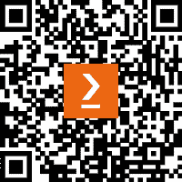

# 前言

*掌握 Linux 系统管理*提供了现代服务器和云管理技术的终极覆盖。

技术以空前的速度发展，Linux 及相关技术处于创新的最前沿。这使得跟上步伐并学习新事物变得非常困难。当前的 Linux 管理员不仅需要了解 Linux，还需要掌握容器化和云技术，这对于未来的 DevOps 专家至关重要。

Linux 是驱动几乎所有事物的操作系统，从物联网到个人计算机，再到服务器，它是所有云技术的基础。通过命令行的强大功能，Linux 使你能够掌握云计算。

你将从学习命令行、处理文件、进程、用户、软件包和文件系统开始，然后将学习如何管理网络服务和加强安全性，最后，你将学习云计算、容器和编排技术。你将学会如何在命令行工作，学习最重要的 Linux 命令，并掌握用户、进程和服务的管理。你还将学习如何使用 iptables 来加强 Linux 安全性。最后，你将学习如何使用容器、虚拟化技术、虚拟机、Ansible 和 Kubernetes，并学会如何在 AWS 和 Azure 上部署 Linux。本书结束时，你将完全掌握 Linux，并且能够从裸机到云端以纯粹的 DevOps 方式自信地使用 Linux。

# 本书适合的读者

本书适合那些想要理解 Linux 系统管理基础知识以及现代概念的 Linux 管理员。希望将知识拓展到 Linux 操作系统的 Windows 系统管理员也会从本书中受益。

# 本书的内容

*第一章*，*安装 Linux*，向你展示了如何在物理硬件（裸机）和 Windows 中的虚拟机上安装 Linux。由于我们面向的是未来的 Linux 系统管理员，本书大部分时间将使用命令行，并且很少提及 GUI。未来的 Linux 专业人员将学习如何安装 Linux 以及引导过程的工作原理。

*第二章*，*Linux Shell 与文件系统*，教你如何使用命令行，并介绍了 Linux 中最常用的命令。你将学习基本命令的结构、Linux 文件系统的组织方式、Linux 操作系统的结构以及文件的结构。在本章结束时，你还将学会如何使用 VI/VIM，这是 Linux 中广泛使用的命令行文本编辑器之一。

*第三章*，*Linux 软件管理*，解释了如何使用特定的软件管理命令，软件包在不同 Linux 发行版中的工作原理，以及如何构建自己的软件包。

*第四章*，*管理用户和组*，向您展示如何在 Linux 中管理用户账户。这是 Linux 系统管理员应该掌握的最重要任务之一。您将了解一般概念，用于用户管理的特定文件，以及如何管理账户。本章结束时，您将了解如何处理权限及其更改，并理解特殊权限和属性。

*第五章*，*处理进程、守护进程和信号*，探讨了 Linux 中的进程、信号和服务。您将学习如何管理它们，如何使用它们，以及它们之间的区别。

*第六章*，*处理磁盘和文件系统*，教您如何管理磁盘和文件系统，在 Linux 中理解存储，使用**逻辑卷管理**（**LVM**）系统，以及如何挂载和分区。

*第七章*，*Linux 网络*，讨论了 Linux 中的网络工作原理，包括关键概念以及如何从命令行和图形界面配置您的网络。

*第八章*，*Linux Shell 脚本编程*，向您展示如何在 Linux 中创建和使用 Bash shell 脚本进行任务自动化。这对任何系统管理员都是非常宝贵的资产。

*第九章*，*Linux 安全*，深入探讨了 Linux 安全的高级主题。您将学习如何使用 SELinux 和 AppArmor。

*第十章*，*灾难恢复、诊断和故障排除*，向您展示了如何在灾难恢复场景中进行系统备份和恢复。此外，您还将学习如何诊断和排除各种常见问题。

*第十一章*，*虚拟机操作*，描述了如何在 Linux 上设置和使用 KVM 虚拟机。

*第十二章*，*使用 Docker 管理容器*，介绍了容器的概念，并讨论如何使用特定于 Docker 的工具来部署您的应用程序。

*第十三章*，*配置 Linux 服务器*，向您展示如何配置不同类型的 Linux 服务器，包括**域名系统**（**DNS**）、**动态主机配置协议**（**DHCP**）、**安全外壳**（**SSH**）、**Samba**文件共享服务器和**网络文件系统**（**NFS**）。这是任何优秀的 Linux 系统管理员的核心基础之一。

*第十四章*，*云计算简介*，涵盖了云计算的基础知识。您将了解核心技术，如**基础设施即服务**（**IaaS**）、**平台即服务**（**PaaS**）、**容器即服务**（**CaaS**）、**DevOps**以及云管理工具。

*第十五章*，*使用 AWS 和 Azure 部署至云端*，解释了如何将 Linux 部署到 AWS 和 Azure。

*第十六章*，*使用 Kubernetes 部署应用程序*，教您如何使用 Kubernetes 监控和保护您的部署，以及如何管理容器和网络。您将了解 Kubernetes 的概念及其多样的社区方法。

*第十七章*，*使用 Ansible 进行基础设施和自动化*，介绍了 Ansible 的配置方法，以及如何管理 playbook、模块和服务器。本章结束时，您将成为自动化的大师。

# 要充分利用本书

您需要 Ubuntu Linux LTS 或 Debian Linux 才能执行本书中的示例。不需要 Linux 的先前知识。

**如果您正在使用本书的数字版本，建议您自行输入代码或从书籍的 GitHub 存储库中访问代码（下一节中提供链接）。这样做将有助于避免与复制粘贴代码相关的任何潜在错误。**

# 下载示例代码文件

您可以从 GitHub 下载本书的示例代码文件，地址为[`github.com/PacktPublishing/Mastering-Linux-Administration-Second-Edition`](https://github.com/PacktPublishing/Mastering-Linux-Administration-Second-Edition)。如果代码有更新，将会在 GitHub 存储库中更新。

我们还有来自我们丰富书籍和视频目录的其他代码包，可在[`github.com/PacktPublishing/`](https://github.com/PacktPublishing/)获取。快来看看吧！

# 使用的约定

本书中使用了多种文本约定。

`文本中的代码`：表示文本中的代码字词、数据库表名、文件夹名、文件名、文件扩展名、路径名、虚拟网址、用户输入和 Twitter 句柄。例如：“要检查二进制`deb`包的内容，可以使用`ar`命令。”

代码块设置如下：

```
spec: 
     replicas: 1 
```

任何命令行输入或输出如下所示：

```
$ sudo zypper search nmap
```

当我们希望引起您对代码块或命令的特别关注时，相关的行或条目会以粗体显示：

```
uid=1004(alex2) gid=1100(admin) groups=1100(admin),1200(developers),1300(devops),1400(managers)
```

**粗体**：表示一个新术语、重要词汇或屏幕上看到的词汇。例如，菜单或对话框中的词语会显示为**粗体**。例如：“导航至**虚拟机**，选择您的实例，并在**可用性 + 缩放**下点击**大小**。”

提示或重要笔记

将呈现如此。

# 联系我们

我们始终欢迎读者的反馈。

**一般反馈**：如果您对本书的任何方面有疑问，请发送电子邮件至 customercare@packtpub.com，并在主题中提及书名。

**勘误表**：虽然我们已经尽力确保内容的准确性，但难免会出现错误。如果您在本书中发现错误，我们非常感激您能向我们报告。请访问[www.packtpub.com/support/errata](http://www.packtpub.com/support/errata)并填写表单。

**盗版**：如果您在互联网上发现任何非法的我们作品的复制品，感谢您提供相关网址或网站名称。请通过 copyright@packt.com 联系我们并附上该资料的链接。

**如果你有兴趣成为作者**：如果你擅长某个领域并有兴趣撰写或参与撰写书籍，请访问[authors.packtpub.com](http://authors.packtpub.com)。

# 分享您的想法

一旦您阅读完*掌握 Linux 管理*，我们非常希望听到您的想法！请[点击这里直接前往亚马逊书籍评论页面](https://packt.link/r/1837630690)并分享您的反馈。

您的评论对我们以及技术社区至关重要，它将帮助我们确保提供优质的内容。

# 下载本书的免费 PDF 版本

感谢您购买本书！

您是否喜欢在旅途中阅读，但无法随身携带印刷版书籍？

您的电子书购买是否与您选择的设备不兼容？

不用担心，现在每本 Packt 书籍都附带免费的无 DRM 保护的 PDF 版本。

随时随地在任何设备上阅读。在您最喜爱的技术书籍中搜索、复制并粘贴代码，直接应用到您的程序中。

福利不仅仅如此，您还可以独家获得折扣、新闻通讯以及每日送达的精彩免费内容。

按照以下简单步骤即可获得福利：

1.  扫描二维码或访问以下链接



[`packt.link/free-ebook/9781837630691`](https://packt.link/free-ebook/9781837630691)

1.  提交您的购买凭证

1.  就这些！我们会直接将您的免费 PDF 和其他福利发送到您的邮箱。

# 第一部分：基本 Linux 管理

在本部分中，您将掌握 Linux 命令行和基本的管理任务，例如用户管理、软件包管理、文件管理、服务管理、进程管理、信号处理以及磁盘管理。

本部分包含以下章节：

+   *第一章*，*安装 Linux*

+   *第二章*，*Linux Shell 与文件系统*

+   *第三章*，*Linux 软件管理*

+   *第四章*，*管理用户与组*

+   *第五章*，*处理进程、守护进程与信号*
