# 1

# 安装 Linux

近年来，**Linux**作为服务器和桌面计算平台的首选操作系统得到了显著的增长。从企业级服务器、大规模云基础设施，到个人工作站和小型家用设备，Linux 已成为广泛应用平台。

Linux 的普及，现在可能比以往任何时候都更加重要，凸显了系统管理员和开发者日益增长的管理技能需求。在本书中，我们以实践为导向，讲解了 Linux 管理基础，面向现代的系统管理员、DevOps 团队成员以及开发者。

在第二版中，我们将采用略有不同的方式来安装 Linux。由于本书面向的是更高级的读者，我们将不再像第一版那样详细讨论操作系统安装的基本内容。信息已经更新，涵盖了截至 2023 年初与操作系统版本相关的最重要方面。

在本章中，我们将指导你完成 Linux 的安装过程，无论是在物理硬件（裸金属）上，还是使用**虚拟机**（**VM**）。

本章中涉及的主题包括：

+   介绍 Linux 操作系统

+   安装 Linux – 基础

+   启用 Windows 子系统 Linux

+   安装 Linux – 高级阶段

+   Linux 发行版 – 实践指南

# 技术要求

我们将在本章中使用以下平台和技术：

+   Linux 发行版：Ubuntu

+   VM 虚拟机监控程序：Oracle VM VirtualBox、VMware Workstation Player 和 Hyper-V

+   VM 主机平台：Windows 11（同样适用于 macOS）

# 介绍 Linux 操作系统

Linux 是由芬兰赫尔辛基的计算机科学学生 Linus Torvalds 于 1991 年创建的一个相对现代的操作系统。最初发布时为免费和开源平台，禁止商业重新分发，Linux 最终在 1992 年采用了 GNU **通用公共许可证**（**GPL**）模型。这一举措对其在开发者社区和商业企业中的广泛采用起到了重要作用。需要注意的是，自由软件基金会社区特别称 Linux 操作系统（或发行版）为 **GNU/Linux**，以强调 GNU 对自由软件的重要性。

最初为英特尔 x86 处理器架构设计，Linux 现已被移植到多种平台，成为目前使用最广泛的操作系统之一。Linux 的起源可以看作是对其强大前身 Unix 的开源替代方案的诞生。这个系统是 AT&T 贝尔实验室的 Ken Thompson 和 Dennis Ritchie 于 1969 年开发的商业级操作系统。

## 探索 Linux 发行版

Linux 操作系统通常被称为**发行版**。一个 Linux 发行版，或称**distro**，是一个操作系统安装包（通常是 ISO 镜像），它包含了工具、库以及安装在 Linux**内核**之上的附加软件包。内核是计算机硬件与进程之间的核心接口，负责控制两者之间的通信，并尽可能高效地管理底层资源。

与 Linux 内核捆绑的软件集合通常包括引导加载程序、shell、包管理系统、图形用户界面以及各种软件实用工具和应用程序。

以下图示是通用 Linux 发行版架构的简化示意图：

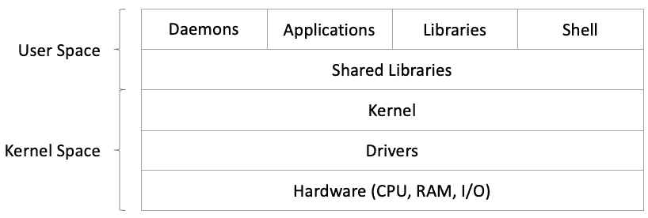

图 1.1 – 简化版的通用 Linux 架构

目前有数百个 Linux 发行版可供选择。其中最古老且 arguably 最受欢迎的包括**Debian**、**Fedora**、**openSUSE**、**Arch Linux**和**Slackware**，此外还有许多其他 Linux 发行版要么基于它们，要么从它们派生。部分这些发行版被分为商业平台和社区支持平台。

重要提示

在编写本书第二版时，CentOS 已经转变为滚动更新版，并成为未来**Red Hat Enterprise Linux**（**RHEL**）版本的基础。它的位置被其他使用 RHEL 二进制文件的免费社区发行版所取代。其中，**Rocky Linux**是一个很好的例子，我们将在本书中对其进行引用。另一个基于 RHEL 的社区发行版是**AlmaLinux**。

不同的 Linux 发行版之间的一个关键区别是它们使用的包管理系统和相关的 Linux 包格式。我们将在*第三章*中详细讨论这个话题。现在，重点是根据我们的需求选择合适的 Linux 发行版。但在做出决定之前，你首先需要了解一些最常用的发行版。因此，在接下来的部分，我们将简要介绍一些 Linux 发行版。

### 常见的 Linux 发行版

本节总结了在编写本版时最流行和最常见的 Linux 发行版，重点介绍它们的包管理器类型。大多数这些发行版是免费的开源平台。如果有商业级变体，会特别注明：

+   **Fedora、CentOS Stream 和 RHEL**：CentOS 及其衍生版本使用**Red Hat 包管理器**（**RPM**）作为包管理器。**CentOS Stream**，现在是一个滚动更新的发行版，基于开源的 Fedora 项目。它适用于服务器和工作站。RHEL 是从 CentOS Stream 派生出的商业级版本，旨在成为一个具有长期支持的稳定平台。使用 RHEL 二进制文件的社区发行版是 Rocky Linux。

+   **Debian**：Debian 及其大多数衍生版的包管理器是**Debian 包**（**DPKG**）。与 Linux Mint 或 Ubuntu 等其他 Linux 发行版相比，Debian 的发布速度较慢，但它相对更加稳定。

+   **Ubuntu**：Ubuntu 使用**高级包工具**（**APT**）和 DKPG 作为包管理器。Ubuntu 是最流行的 Linux 发行版之一，每 6 个月发布一次，并且每隔一年发布一次更稳定的**长期支持**（**LTS**）版本。

+   **Linux Mint**：Linux Mint 也使用 APT 作为包管理器。Linux Mint 基于 Ubuntu 构建，主要适用于桌面使用，内存使用比 Ubuntu 更低（使用 Cinnamon 桌面环境，相比 Ubuntu 的 GNOME）。还有一个基于 Debian 直接构建的 Linux Mint 版本，称为**Linux Mint Debian** **Edition**（**LMDE**）。

+   **openSUSE**：openSUSE 使用**RPM**、**又一个设置工具**（**YaST**）和**Zypper**作为包管理器。openSUSE 有两个版本：一个叫做 Tumbleweed，是一个滚动发布版，属于领先的 Linux 发行版；另一个是 Leap，一个常规发布版，使用与 SUSE Linux Enterprise 相同的代码库。两个版本都适用于桌面和服务器环境。SUSE Linux Enterprise Server 是一个商业级平台。在 Ubuntu 崛起之前，openSUSE 被认为是最用户友好的桌面 Linux 发行版之一。

重要提示

本书的重点主要是介绍在社区和商业部署中广泛使用的 Linux 发行版，例如**Ubuntu**、**Fedora/Rocky Linux**和**openSUSE**。本书中的大部分示例适用于任何 Linux 发行版。我们会明确说明在给定的示例或场景中使用的是哪一个。

现在你已经了解了关于最常见的 Linux 发行版的一些信息，在接下来的部分，我们将给你一些选择 Linux 发行版的提示。

## 选择一个 Linux 发行版

选择一个 Linux 发行版涉及多个方面，基于各种功能需求。全面的分析远远超出了本章的范围。然而，考虑到一些基本要点可能有助于做出正确的决定：

+   **平台**：在选择 Linux 发行版时，选择服务器、桌面或嵌入式平台可能是最重要的决策之一。Linux 服务器平台和嵌入式系统通常配置有核心操作系统服务和特定应用所需的基本组件（如网络、HTTP、FTP、SSH 和电子邮件），主要是出于性能和优化的考虑。另一方面，Linux 桌面工作站预装了大量软件包，包括图形用户界面，以提供更加友好的用户体验。一些 Linux 发行版有服务器和桌面版本（例如 **Ubuntu**、**Fedora** 和 **openSUSE**），但大多数发行版提供的是最小操作系统，需要进一步配置（例如 **Rocky Linux** 和 **Debian**）。通常，这些发行版是 Linux 服务器平台的良好候选者。还有一些专门为桌面使用设计的 Linux 发行版，如 **elementary OS**、**Pop!_OS** 或 **Deepin**。对于嵌入式系统，我们有高度优化的 Linux 发行版，如 **Raspbian** 和 **OpenWRT**，可以适应硬件资源有限的小型设备。

+   **基础设施**：如今，我们看到从硬件和本地（本地数据中心）到虚拟化管理程序、容器和云基础设施的各种应用和服务器平台部署。选择 Linux 发行版时，应考虑这些类型的部署所涉及的资源和成本。例如，多 CPU、大内存且一般需要较大资源占用的 Linux 实例在云端或 **虚拟专用服务器**（**VPS**）托管基础设施中运行可能会更昂贵。轻量级的 Linux 发行版占用较少资源，并且在容器化工作负载和服务的环境中更容易扩展（例如，使用 Kubernetes 和 Docker）。大多数 Linux 发行版现在都提供适用于主要公共云服务提供商的云镜像（例如，Amazon AWS、Microsoft Azure 和 Google Compute Engine）。各种 Linux 发行版的 Docker 容器镜像可以在 Docker Hub ([`hub.docker.com`](https://hub.docker.com)) 下载。有些 Docker 镜像比其他镜像大（重）。例如，**Ubuntu Server** 的 Docker 镜像比 **Alpine Linux** 的 Docker 镜像要重得多，这可能会在选择某个发行版时影响决策。此外，为了应对容器化工作流程和服务的相对新变化，一些 Linux 发行版提供了精简或优化版本的操作系统，以支持底层应用基础设施。例如，Fedora 提供了 **Fedora CoreOS**（用于容器化工作流程）和 **Fedora IoT**（用于物联网生态系统）。

+   **性能**：可以说，所有 Linux 发行版都可以在 CPU、GPU、内存和存储方面进行调整，以达到高性能基准。性能应该与平台和所选应用程序紧密关联。例如，邮件后台在树莓派上运行效果不会很好，而媒体流服务器则能正常运行（附加一些外部存储）。调整性能的配置工作也应当考虑在内。**Rocky Linux**、**Debian**、**openSUSE**、**Fedora** 和 **Ubuntu** 都提供了经过合理优化的服务器和桌面版本，适合各自的用途。服务器版本可以通过将软件包限制为应用程序所需的基本部分，轻松地根据特定的应用程序或服务进行定制。为了进一步提升性能，有些人会选择重新编译一个轻量级的 Linux 发行版（例如，**Gentoo**），以通过针对特定子系统（例如，网络栈或用户权限）的内核编译优化来提高性能。与任何其他标准一样，基于某些应用程序或平台性能选择 Linux 发行版是一种平衡行为，大多数时候，常见的 Linux 发行版都能表现出色。

+   **安全性**：在考虑安全性时，我们必须牢记，系统的安全性取决于其最薄弱的环节。一个不安全的应用程序或系统组件会使整个系统面临风险。因此，Linux 发行版的安全性应该根据相关应用程序和平台环境进行严格审查。我们可以讨论一下作为桌面工作站的 Linux 发行版的*桌面安全性*，例如，用户浏览互联网、下载媒体、安装各种软件包和运行不同应用程序时的安全性。所有这些操作的安全处理（防止恶意软件、病毒和入侵）将成为系统安全性的重要指标。有些 Linux 发行版专门针对应用程序的安全性和隔离进行了高度优化，非常适合桌面使用：**Qubes OS**、**Kali Linux**、**Whonix**、**Tails** 和 **Parrot Security OS**。其中一些发行版是为了渗透测试和安全研究而开发的。

另一方面，我们可能需要考虑 Linux 服务器发行版的*服务器安全*问题。在这种情况下，定期进行操作系统更新，包括最新的仓库、软件包和组件，将大大增强系统的安全性。移除未使用的面向网络的服务，并配置更严格的防火墙规则，是进一步减少潜在攻击面的重要步骤。大多数 Linux 发行版都配备了所需的工具和服务，支持此类重新配置。选择一个*频繁*且*稳定*升级或发布周期的发行版，通常是确保平台安全的首要条件（例如，**Rocky Linux**、**RHEL**、**Ubuntu LTS** 或 **SUSE** **Enterprise Linux**）。

+   **可靠性**：具有激进发布周期且每个版本添加大量新代码的 Linux 发行版通常不太稳定。对于此类发行版，选择一个*稳定*版本至关重要。以 **Fedora** 为例，它具有快速的发布周期，是进展最快的 Linux 平台之一。然而，我们不应听信那些声称 Fedora 或其他类似的快速发展的 Linux 发行版（如 openSUSE Tumbleweed）不可靠的谣言。别忘了，一些最可靠的 Linux 发行版，如 **RHEL** 和 **SUSE Linux Enterprise (SLE)**，分别源自 Fedora 和 openSUSE。

选择一个 Linux 发行版没有所谓的“魔法公式”。在大多数情况下，平台的选择（无论是服务器、桌面还是物联网）与个人偏好结合，决定了要选择哪种 Linux 发行版。在生产级环境中，之前列出的许多标准变得至关重要，我们所选择的 Linux 平台的可选方案会缩小为几个行业认可的解决方案。

重要提示

本书的重点主要是广泛应用于社区和商业部署的 Linux 发行版，如 **Ubuntu**、**Fedora/Rocky Linux** 和 **openSUSE**。尽管如此，本书中的大部分示例同样适用于任何 Linux 发行版。我们会明确指出在具体示例或场景中使用的发行版。

现在你已经了解了什么是 Linux 发行版，以及最常用的几种发行版及其使用场景，在接下来的两部分中，我们将介绍 Linux 安装的基本和高级方面。

# 安装 Linux – 基础知识

本节作为快速指南，介绍了任意 Linux 发行版的基本安装方法。为了提供实际示例和具体的指导，我们使用了 Ubuntu。我们还简要地回顾了托管 Linux 安装的不同环境。目前，混合云基础设施的趋势正在兴起，这种基础设施结合了本地数据中心和公共云部署，其中 Linux 主机可以是裸金属系统、虚拟机监控器、虚拟机或 Docker 容器。

在大多数情况下，进行 Linux 安装时所遵循的相同原则适用。有关 Docker 容器化 Linux 部署的详细信息，请参见*第十三章*。

在接下来的章节中，我们将向您展示如何在裸机和 Windows 11 主机上使用不同的虚拟机管理程序安装 Linux，以及使用 WSL 安装。安装在 macOS 主机上的过程与在 Windows 上使用虚拟机管理程序安装基本相同，我们不会涉及这一部分内容。

## 如何在裸机上安装 Linux

本节描述了在**裸机**上安装 Linux 所需的基本步骤。我们使用“裸机”一词指的是笔记本、台式机、工作站和服务器等硬件。简而言之，主要步骤是下载 ISO 镜像、创建可启动媒体、尝试使用 live 模式，最后进行安装。

这里使用的步骤同样适用于虚拟机安装，正如接下来的章节所示。

### 第 1 步 – 下载

我们首先下载选择的 Linux 发行版。大多数发行版通常可以在发行版官网以 ISO 格式下载。例如，我们可以在[`ubuntu.com/download/desktop`](https://ubuntu.com/download/desktop)下载 Ubuntu Desktop。

使用 ISO 镜像，在下一步中我们可以创建 Linux 安装所需的可启动媒体。我们还可以使用 ISO 镜像在虚拟机中安装 Linux，如下一节所示。

### 第 2 步 – 创建可启动媒体

当我们在 PC 台式机或工作站（*裸机*）系统上安装 Linux 时，可启动的 Linux 媒体通常是 CD/DVD 或 USB 设备。如果手头有 DVD 可写光驱，我们可以简单地将 Linux 发行版 ISO 刻录到 DVD 上。但由于现代计算机，特别是笔记本电脑，通常不配备任何类型的 CD 或 DVD 驱动器，因此更常见的可启动媒体选择是 USB 驱动器。

重要提示

还有第三种可能性是使用**预启动执行环境**（**PXE**）引导服务器。PXE（发音为*pixie*）是一个客户端-服务器环境，其中一个支持 PXE 的客户端（PC/BIOS）通过局域网或广域网从支持 PXE 的服务器加载并启动软件包。PXE 消除了物理启动设备（CD/DVD、USB）的需求，并减少了安装开销，特别是对于大量客户端和操作系统。深入探讨 PXE 内部机制超出了本章的范围，但我们将在本章末尾简要介绍如何通过 PXE 在 Linux 安装中使用它。学习更多关于 PXE 的好起点是[`en.wikipedia.org/wiki/Preboot_Execution_Environment`](https://en.wikipedia.org/wiki/Preboot_Execution_Environment)。

一个相对简单的方法是通过使用像 **UNetbootin** ([`unetbootin.github.io`](https://unetbootin.github.io)) 或 **Balena Etcher** ([`www.balena.io/etcher`](https://www.balena.io/etcher)) 这样的工具来制作一个包含我们所选 Linux 发行版的可启动 USB 驱动器。UNetbootin 和 Etcher 都是跨平台工具，可以在 Windows、Linux 和 macOS 上运行。

在这个示例中，我们将使用 Balena Etcher 在 Windows 上创建可启动的 USB 驱动器：

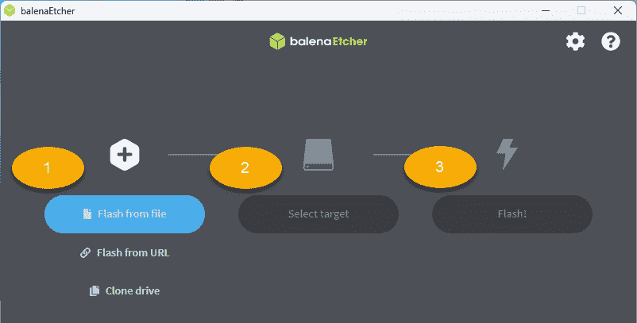

图 1.2 – 使用 Balena Etcher 创建可启动的 USB 驱动器

以下是使用 Balena Etcher 创建 Ubuntu Desktop 可启动 USB 驱动器的基本步骤。我们假设 Ubuntu Desktop 的 ISO 镜像已经下载，且 Etcher 已安装（在我们的例子中是 Windows 11）：

1.  选择你所选择的 Linux 发行版的 ISO 文件。

1.  选择 USB 目标磁盘。

1.  使用你选择的 ISO 镜像刷新之前选定的磁盘。

该过程应当花费几分钟，USB 驱动器就会准备好。现在，让我们看看如何使用这个可启动媒体。

### 步骤 3 – 在 live 模式下尝试

这一步是可选的。

大多数 Linux 发行版提供了作为 *live* 媒体下载的 ISO 镜像。我们之所以说“大多数”，是因为并非所有发行版都提供这个选项，至少不是默认提供。然而，提供 live 媒体作为默认选项的有 **Ubuntu** 和 **Fedora**。

一旦我们用自己选择的 Linux 发行版创建了可启动媒体，就可以运行该 Linux 平台的 live 环境，而无需实际安装它。换句话说，我们可以在决定是否安装之前评估和测试该 Linux 发行版。live Linux 操作系统被加载到我们电脑的系统内存（RAM）中，而不会使用任何磁盘存储。我们需要确保电脑有足够的 RAM 来容纳我们 Linux 发行版所需的最低内存。

当从可启动媒体启动 PC 时，我们需要确保 BIOS 中的启动顺序已设置为优先读取我们的驱动器。在 Mac 上，我们需要在重启时听到启动提示音后立即按下 *Option* 键，然后选择我们的 USB 驱动器启动。在 PC 上，确保进入 BIOS 界面并选择正确的启动设备。根据不同的系统，你可能需要在按下 *Enter* 后按下 *F2*、*F10*、*F12* 或 *F1* 键，或者通常是 *Delete* 键。在某些特定情况下，可能会分配其他 *功能* 键来执行此操作。你需要按下的键通常会在初始启动画面的底部进行说明。

重启后，我们的 Linux 发行版的第一个启动画面应该会给出运行 live 模式的选项，如下图所示为 Ubuntu Desktop （**尝试 Ubuntu**）：

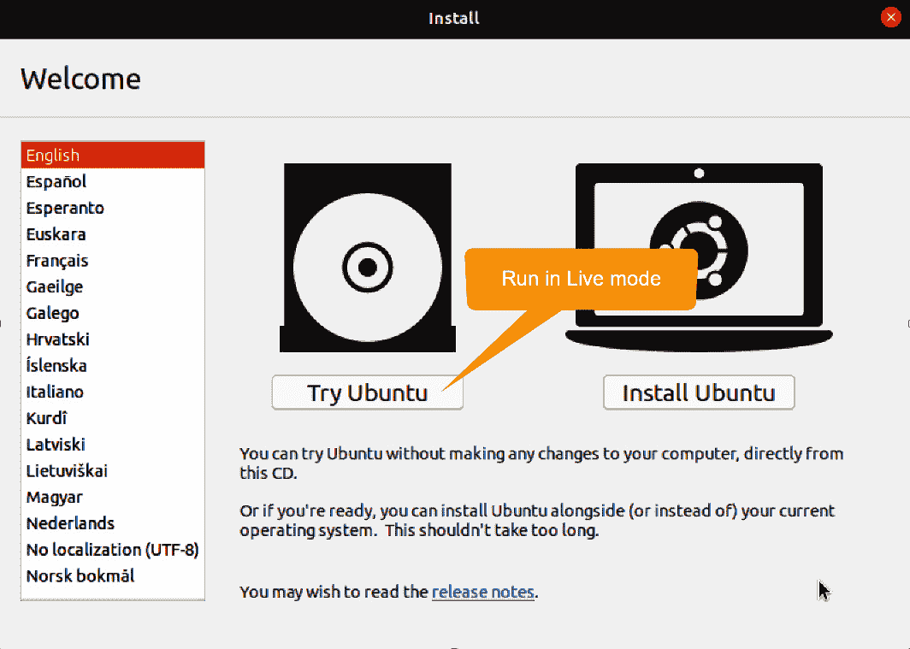

图 1.3 – 选择 Ubuntu Desktop 的 live 模式

接下来，让我们看看使用启动媒体进行 Linux 发行版安装的过程。

### 步骤 4 – 执行安装

我们通过从 *步骤 2* 中创建的启动媒体启动 PC，开始安装 Linux 发行版。为了确保系统可以从外部设备启动，有时我们需要在 BIOS 中更改启动顺序，特别是当我们从 USB 驱动器启动时。请按照前述步骤选择正确的启动驱动器。

在接下来的部分，我们展示了使用 Ubuntu 的 ISO 镜像进行安装的过程。我们选择了 Ubuntu 的桌面版和服务器版，并重点介绍了它们之间的主要区别。作为对比，Rocky Linux 和 CentOS Stream 都只有一种版本，本质上是一个服务器平台，并提供可选的图形用户界面。类似地，openSUSE 提供了一个安装介质，适用于桌面和服务器安装。而 Fedora 则提供不同的安装介质，分别适用于桌面和服务器。

我们现在将引导您完成在虚拟机中安装 Linux 的过程。

## 虚拟机中的 Linux

在 *安装 Linux* 部分的每个子部分中，我们还将提供如何为相关的 Linux 平台准备虚拟机环境的简要指南。

虚拟机（VM）是物理机器的隔离软件抽象。虚拟机部署在 **hypervisor** 之上，**hypervisor** 提供虚拟机的运行时配置和资源管理。以下是几个常用的通用 **hypervisor**：

+   **Oracle VM** **VirtualBox** ([`www.virtualbox.org`](https://www.virtualbox.org))

+   **VMware** **Workstation** ([`www.vmware.com/products/workstation-pro.html`](https://www.vmware.com/products/workstation-pro.html))

+   **Hyper-V**（仅在 Windows Pro、Enterprise 或 Education 版本中提供）

这两个 **hypervisors** 是跨平台虚拟化应用，支持在 Windows、macOS 和 Linux 上运行，适用于 Intel 和 AMD 处理器架构。后者仅在 Windows Pro 版本、10 和 11 上可用。

重要提示

在撰写本书时，Apple Silicon Macs 的 **hypervisor** 仅由 VMware Player 和 Parallels 提供。Oracle VirtualBox 对 **高级 RISC 机器**（**ARM**）架构仍处于预览阶段。来自 VMware 和 Parallels 的这两款解决方案是 macOS 上的付费软件，因此您需要购买它们才能使用。

在虚拟机上安装 Linux 与在物理机器上安装的区别很小。显著的区别与虚拟机的大小和配置步骤有关，确保满足 Linux 发行版的最低系统要求。因此，在接下来的部分中，我们将在 Windows 下的 VMware Workstation 上安装 Ubuntu。

请注意，在 macOS 下使用 VMware Player 安装 Linux 非常相似，我们在本书的本版中不会重复此过程。macOS 功能在本书的第一版中有所讨论，但鉴于 Apple Silicon 平台上虚拟化程序的可用性有限，我们决定在本版中跳过该部分。关于在裸机 Apple Silicon Mac 上使用 Linux，您可以访问 Asahi Linux，这是一个旨在将功能完整的 Linux 发行版带到 Apple Silicon 计算机上的项目。Asahi Linux 可以在[`asahilinux.org/`](https://asahilinux.org/)找到。

在接下来的部分，我们简要说明 Ubuntu Server LTS 的安装。如果我们计划在虚拟机中安装 Ubuntu，需要进行一些前期的虚拟机环境配置步骤。否则，我们将直接进入*安装*部分。

### 使用 VMware Workstation 配置虚拟机

在接下来的步骤中，我们将使用 VMware Workstation 在 Windows 11 上创建一个基于 Ubuntu Server 的虚拟机。撰写时，版本 17 的软件可供免费和商业使用。

1.  初始化虚拟化程序后的第一步是点击**创建新虚拟机**。这将打开一个新窗口，显示新的虚拟机向导，您可以选择要安装的 Linux 发行版的 ISO 镜像。

1.  点击**浏览**，然后从您的硬盘或下载目标中打开镜像文件。

1.  点击`Ubuntu` `Server 22.04.1`。

1.  点击**下一步**。在随后的窗口中，您需要为虚拟机指定最大磁盘大小。默认情况下，它被设置为 20 GB，这是为 Ubuntu Server 推荐的大小。我们将保持原样。

1.  再次点击**下一步**后，将显示一个包含虚拟机设置的窗口。默认情况下，虚拟化程序为虚拟机提供 2 个 CPU 核心和 4 GB 的内存。您可以点击**自定义硬件**按钮来更改默认设置，具体取决于您的硬件资源。一般来说，我们建议您的系统至少拥有 16 GB 的内存和 8 核 CPU，以便创建合适大小的虚拟机。当一切设置完成后，点击窗口右下角的**关闭**按钮。您现在回到主向导窗口。

1.  点击**完成**以完成设置并创建和初始化虚拟机。在下图中，您可以看到新创建的虚拟机，正在 VMware 中运行。

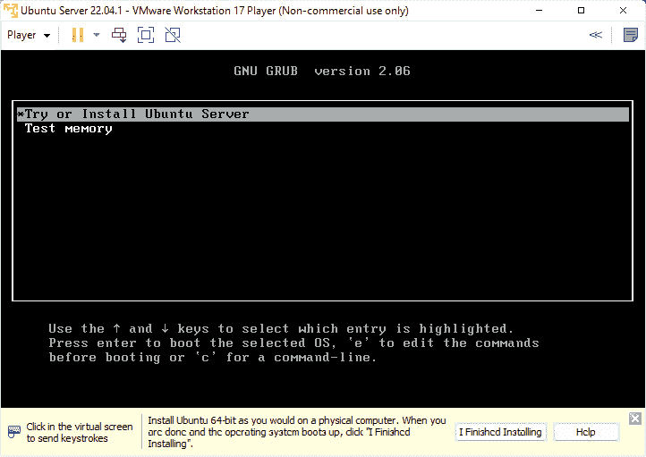

图 1.4 – 在新虚拟机上启动和安装 Linux

### 安装过程

以下是 Ubuntu Server LTS 的正常安装过程，按照初始启动进入设置模式后进行：

1.  初始欢迎屏幕会提示选择您偏好的**语言**。选择您喜欢的语言并按下键盘上的*Enter*键。

1.  如果有可用的*安装程序更新*，您可能会被提示进行更新。您可以选择更新安装程序或继续不更新。如果出现提示，我们选择更新安装程序。

1.  如果没有可用的更新，接下来的屏幕会提示您选择**键盘布局**。请根据需要进行选择。在我们的例子中，选择的是英语。选择**Done**并按*Enter*键。

1.  接下来的提示要求您从以下选项中选择**安装基础**：**Ubuntu Server**和**Ubuntu Server (minimized)**。您还可以选择搜索**第三方驱动程序**。我们选择**Ubuntu Server**并选择第三方驱动程序选项。您可以使用*Tab*键或*Arrow*键在屏幕上的选项之间移动。要选择一个选项，请按*Space*键。选择**Done**并按*Enter*键。

1.  接下来的屏幕将显示**网络连接**。如果默认设置适合您，按*Enter*键进入下一个设置界面。

1.  系统会询问您关于**代理配置**的问题。如果您不需要此设置，直接按*Enter*键进入下一个界面。

1.  系统将要求您配置默认的 Ubuntu**镜像**用于存储库档案。根据您的位置进行编辑，或者保持安装程序提供的默认设置。按*Enter*键。

1.  接下来的屏幕提示您配置**存储**和**分区**。我们将使用整个 20 GB 磁盘并采用默认设置，所以选择**Done**并按*Enter*键。

1.  提供了一个存储**配置总结**。如果一切符合您的要求，只需按*Enter*键。

1.  会弹出一个**警告**，询问您是否确认满意当前设置并愿意继续安装。按*Enter*键。

1.  接下来的屏幕会要求您输入**个人资料信息**，包括您的姓名、服务器名称、用户名和密码。设置好后进入下一个界面。

1.  系统会询问您是否要**安装 openSSH** **服务器**。选择安装 openSSH 的选项。如果您有任何想要导入的 SSH 密钥，可以在此提供。完成后，进入下一个界面。

1.  系统将提示您选择并安装`docker`、`microk8s`、`powershell`、`nextcloud`和`livepatch`。选择符合需求的组件，然后继续到下一个界面。

1.  **安装过程**开始了。可能需要几分钟时间。耐心等待，直到操作系统安装完成并出现重启选项。

重启后，登录界面会出现，您可以通过 VMware Workstation 在 Windows 11 中使用新的 Ubuntu Server 虚拟机。现在我们已经完成了 Ubuntu Server 的安装。

安装其他发行版的过程与安装 Ubuntu 非常相似。当安装桌面版本时，会提供图形用户界面。在上述示例中，由于我们安装的是专为服务器设计的操作系统，因此没有图形用户界面，仅有一个最小的基于文本的界面。

我们不会逐步指导其他发行版的安装过程，但我们会展示 Rocky Linux 的安装界面：

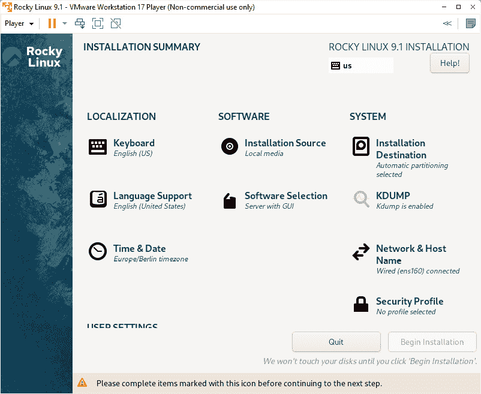

图 1.5 – Rocky Linux 安装 GUI

到目前为止，我们已经学习了如何进行 Linux 的基本安装。在此过程中，我们为安装媒体创建了一个可启动的 USB 闪存驱动器，这在 Linux PC 平台安装中最常用。我们简要介绍了在 Windows 11 上使用 VMware Workstation hypervisor 进行 VM 特定的 Linux 环境。

在接下来的部分中，我们将学习如何在 Windows 平台上安装和运行 Linux 发行版，而无需使用独立的虚拟化程序，而是使用 Windows 子系统来实现。

## 使用 Hyper-V 进行虚拟机配置

在接下来的步骤中，我们将基于 Ubuntu Server 创建一个 VM，使用 Windows 11 Pro 上提供的 Microsoft Hyper-V 解决方案。

第一步是激活 Hyper-V hypervisor，因为默认情况下它未激活。为此，我们需要进入**Windows 功能**，并选中**Hyper-V**复选框，如下图所示。激活后需要重新启动。

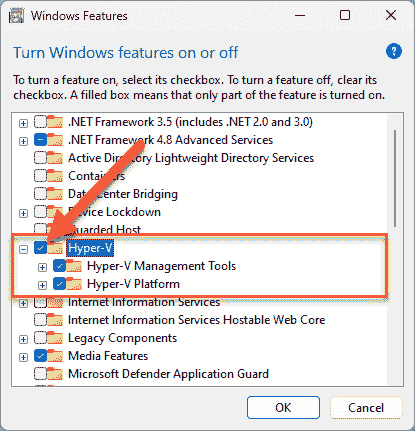

图 1.6 – 在 Windows 11 Pro 上激活 Hyper-V

要创建新的虚拟机，您需要启动**Hyper-V 管理器**。该应用程序具有三窗格界面。在右侧的**操作**窗格中，您应该看到**新建**选项。单击它并选择**虚拟机…**选项。这将打开一个新窗口，您可以按以下步骤配置新虚拟机：

1.  设置名称和位置；我们将其命名为`Ubuntu`，并保留默认位置。点击**下一步**。

1.  设置虚拟机的生成。您有两个选项，**第一代**和**第二代**。第二个选项适用于基于 UEFI 的 BIOS 和网络安装（PXE）。我们将选择**第一代**并点击**下一步**。

1.  指定内存量。默认情况下，最小设置为 4GB，并选择了动态内存选项。我们将保留默认设置。点击**下一步**。

1.  通过从下拉菜单中选择适当选项配置网络。您有三个选项：**未连接**，**默认交换机**，**WSL**；我们将选择**默认交换机**并点击**下一步**。

1.  配置虚拟硬盘，设置大小和位置。点击**下一步**。

1.  在接下来的窗口中，您可以选择立即或稍后安装操作系统。我们将从我们选择的位置选择 Ubuntu Desktop ISO 映像，然后点击**下一步**。

1.  以下窗口显示了 VM 配置的摘要。您可以从此处返回更改任何内容。完成后，点击**完成**按钮，虚拟机将被创建。

以下截图显示了在 Hyper-V 内运行的新 Ubuntu 虚拟机：

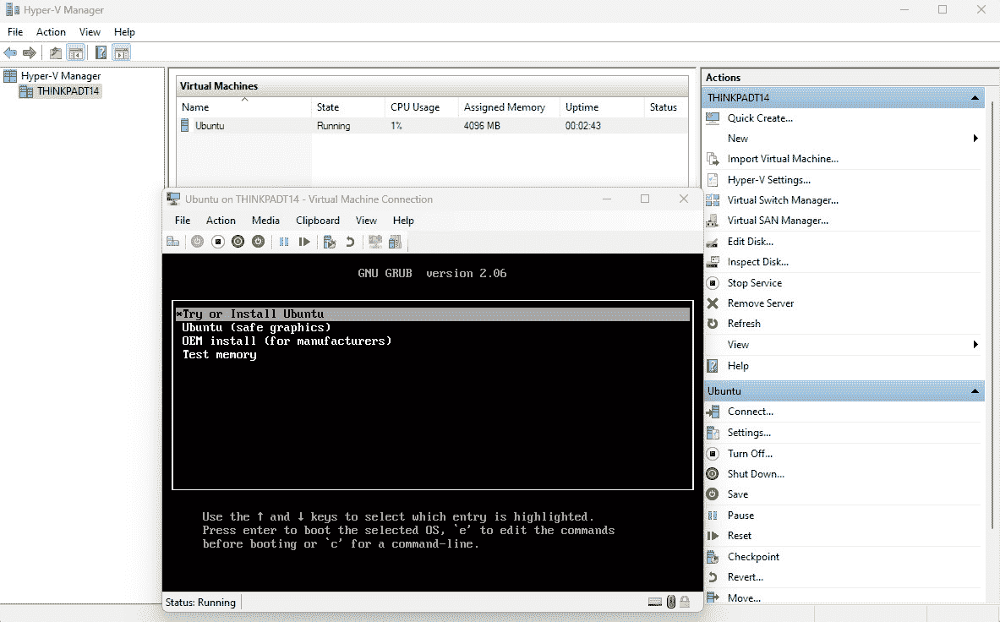

图 1.7 – 使用 Hyper-V 创建新的 Ubuntu 虚拟机

安装过程与上一节中展示的相似，因此我们在这里不再重复。在下一节中，我们将使用另一种虚拟化管理程序，这次来自 Oracle。

## 使用 Oracle 的 VirtualBox 进行虚拟机配置

Oracle 的 **VirtualBox** 是一款免费的跨平台软件，支持 Windows、macOS 和 Linux。我们将向您展示如何在 Windows 11 上创建一个 Linux 虚拟机。我们假设您已经安装了 VirtualBox。启动后，您会看到一个用户友好的界面。以下步骤将指导您创建一个新的虚拟机。我们将以 Fedora Workstation 为例：

1.  点击**新建**图标以开始创建新的虚拟机。此操作将打开一个新窗口，您需要在其中提供虚拟机的名称、操作系统类型和 ISO 文件的位置。此新窗口默认处于**引导模式**。您可以在窗口右下方选择**专家模式**，这样可以让您在创建过程中有更多的控制权。

1.  提供所有需要的信息。在我们的例子中，我们将使用 Fedora，所以我们将它命名为 `Fedora`。指向 ISO 文件的位置，操作系统类型会自动更改。如果您处于**专家模式**，会有一些额外的自动隐藏部分，如**无人值守安装**、**硬件**和**硬盘**选项。

1.  由于我们正在安装 Fedora，因此**无人值守安装**部分是灰色的（见*图 1.11*）。此选项仅被少数操作系统支持（如 Ubuntu、RHEL、Oracle Linux 和 Windows）。

1.  在**硬件**部分，我们将提供虚拟机所需的系统内存和处理器数量。根据您的硬件资源进行选择，但请记住，每个操作系统都有特定的系统要求。在我们的例子中，我们选择 4 GB 的内存和 2 个虚拟 CPU。

1.  **硬盘**部分是您选择虚拟机硬盘空间的地方。再次根据您的资源进行选择，但请记住，满足特定系统要求所需的最小空间是必须的。在我们看来，应该提供至少 20 GB 的硬盘空间。选择虚拟硬盘的位置并点击**完成**。

1.  虚拟机将被创建，窗口会关闭，将您带回到初始的 VirtualBox 窗口。在这里，您将看到关于虚拟机的所有相关信息。要启动虚拟机，只需点击**启动**按钮（带有大绿色右箭头的那个按钮）。

1.  一个新的窗口将会显示虚拟机。

以下截图展示了 VirtualBox 中的虚拟机创建窗口：

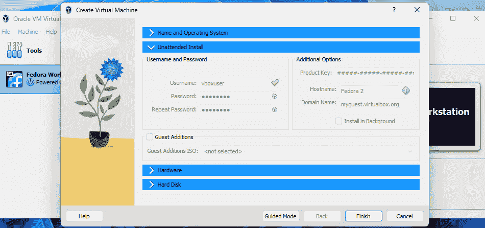

图 1.8 – VirtualBox 界面

正如您所见，使用所有三个主要虚拟化管理程序（来自 VMware、Oracle 和 Microsoft）创建 Linux 虚拟机是非常直接且相对简单的。无论使用哪个解决方案，安装 Linux 虚拟机的过程都是相同的。

除了虚拟机配置外，微软 Windows 还提供了一种相对较新的运行 Linux 的方式，那就是通过使用 Windows 子系统 Linux。在下一节中，我们将展示如何操作。

# 启用 Windows 子系统 Linux

软件开发人员和系统管理员经常面临一个艰难的选择，即为特定的工作或环境需求选择合适的硬件和操作系统平台。过去，Windows 专业人士经常发现一些标准开发工具、框架或服务器组件虽然在 Linux 或 macOS 平台上可用，但在 Windows 上缺乏原生支持。**Windows 子系统 Linux**（**WSL**）试图弥补这一差距。

WSL 是一个 Windows 平台特性，提供了本地的 GNU/Linux 运行时环境，并与 Windows 桌面环境兼容，适用于 Windows 10 和 11 版本。WSL 使得可以无缝地在 Windows 内核之上部署和集成选定的 Linux 发行版，而无需专用虚拟化程序。在启用 WSL 后，你可以轻松安装并运行 Linux，像运行本地 Windows 应用一样。

重要提示

如果没有 WSL，我们只能通过使用独立的虚拟化程序，例如 Hyper-V、Oracle VM VirtualBox 或 VMware Workstation，来在 Windows 平台上部署和运行 Linux 发行版。而 WSL 消除了对专用虚拟化程序的需求。撰写本文时，WSL 是一个内嵌虚拟化程序的 Windows 内核扩展。

在本节中，我们提供了启用 WSL 并在 Windows 上运行 Ubuntu 发行版所需的步骤。从 Windows 11 版本 21H2 和 Windows 10 版本 21H2、22H2 开始，WSL 默认可以通过 Windows 商店获取，因此无需使用命令行进行安装和设置。请进入 Microsoft Store，搜索 `WSL`。从显示的列表中，选择下图所示的应用：

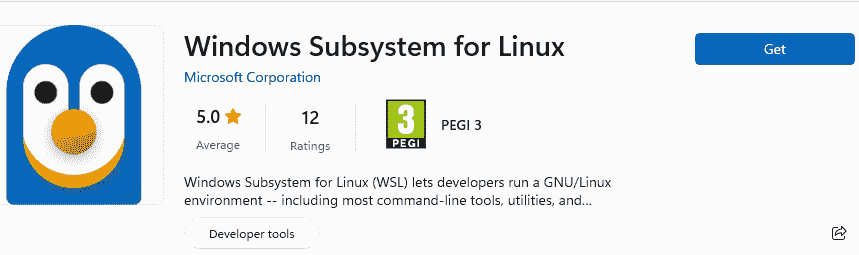

图 1.9 – 来自 Windows 商店的 WSL 应用

安装 WSL 后，你只需要安装任何可用的 Linux 发行版。如果你尝试打开刚安装的 WSL 应用，终端将显示一条消息，提示 WSL 没有安装任何发行版。这意味着你需要返回到 Microsoft Store 搜索并安装一个发行版。例如，如果你在 Microsoft Store 中搜索 `Linux`，你会看到包括 SUSE Linux Enterprise Server、Oracle Linux、Kali Linux、Ubuntu LTS、Debian 和 openSUSE Leap 等结果。

重要提示

请确保在 Windows 中启用了 Hyper-V，因为它是负责运行 WSL 的服务。要启用它，请进入**Windows 功能**，从列表中选择**Hyper-V**，然后点击**确定**。安装必要的组件后，系统需要重启。Hyper-V 默认在 Windows 11 Pro、Enterprise 和 Education 版本中可用，但在家庭版中*不可用*。

现在，您可以从 Microsoft Store 安装 Linux 发行版。我们将尝试使用 Ubuntu 进行演示。安装完成后，您可以打开应用程序，在命令行中创建用户，并开始使用它 – 就是这么简单。要打开新的 Linux 发行版，请在搜索栏中输入其名称，按 *Enter* 键，然后在 Windows 终端应用程序中直接打开了带有 Linux 发行版的新终端窗口，如下屏幕截图所示：

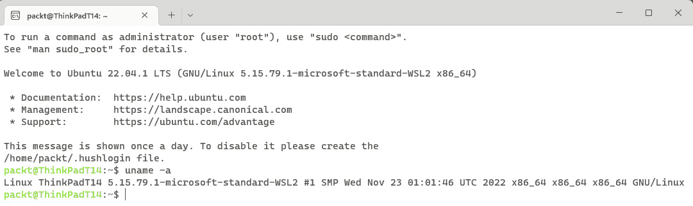

图 1.10 – 使用 WSL 在 Windows 终端窗口中运行的 Ubuntu

此外，您将可以直接从 **文件资源管理器** 中访问分布的文件系统。以下屏幕截图显示了从 **文件资源管理器** 中访问的 Ubuntu 文件系统：

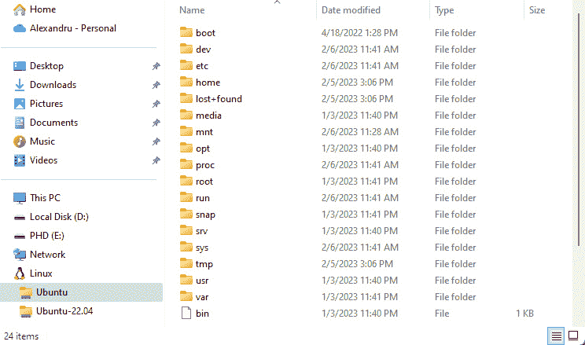

图 1.11 – Windows 11 中文件资源管理器中的 Ubuntu 文件系统

WSL 让越来越多的 Windows 专业人士迅速采用 Linux。正如本节所示，WSL 相对容易配置，而且使用 WSL 时，无需专用的虚拟化软件来运行 Linux 实例。

到目前为止，您已经学会了如何使用三种不同的虚拟化软件在 Windows 中的虚拟机上安装 Linux，包括 VMware Workstation、Microsoft 自家的 Hyper-V 以及 Oracle 的 VirtualBox。正如我们之前所述，macOS 上的安装过程非常类似，因此我们没有必要再多花篇幅介绍，因为这只会重复输出。在 macOS 上，VMware Fusion 的界面与 Windows 中使用的界面类似，只有细微的差别。

在裸金属上安装类似；唯一的区别在于您需要物理访问目标机器。正如本章开头所述，还有一种安装 Linux 的方法，那就是通过网络。这是一个更高级的任务，需要更加注意细节以及基本的网络知识。同时，理解 Linux 的启动过程是必需的。

下一节中，我们将提供有关网络安装过程的详细信息。

# 安装 Linux – 进阶阶段

在本节中，我们将涵盖安装 Linux 的更高级别方面。正如我们在之前的章节中看到的，裸金属和虚拟机的安装都需要直接访问指定的机器。但是，如果我们无法访问该位置怎么办？或者需要设置的机器太多，手动完成任务将会非常繁琐，甚至是不可行的？

在一个有数十台或数百台机器的企业环境中安装 Linux，可以通过网络启动的方式在自动化环境中完成。正如我们之前所说，关于网络启动技术的详细概述超出了本书的范围；然而，我们将描述这一过程并向你展示其中最重要的方面，因为目前没有哪些书籍深入讨论这个话题。

但首先，为了更好地理解网络启动是如何工作的，我们先简要看一下 Linux 启动过程。

## Linux 启动过程

Linux 是如何启动的？我们将为你提供一个全面的过程概述，而不涉及过多细节。

当你第一次启动你的 Linux 操作系统的计算机或虚拟机时，**BIOS**（或启动固件）开始加载并启动引导加载程序。BIOS 有特定的配置，并由制造商加载到主板上的内存芯片中（在物理计算机的情况下，而非虚拟机）。BIOS 包含关于硬件的信息，并具有控制外设（如键盘和显示器）的能力。它还包含操作系统的信息和引导加载程序的位置。这些信息中的一部分是由用户控制的，可以根据用户的需求进行更改，例如引导顺序或密码保护。BIOS 还控制着 **网络接口控制器** (**NICs**) 和所有外部端口，包括 USB 和显示端口。但这就是它能做的一切，因为它需要引导加载程序来进一步启动磁盘上存在的任何操作系统。

BIOS 的更新版是 **统一可扩展固件接口** (**UEFI**)。它具有旧版 BIOS 的优点，但提供了更多互动界面，并更好地支持新操作系统。然而，缺点是缺乏第三方软件供应商的支持。

另外还有 **安全启动**，这是为了提供额外的操作系统和运行软件的安全性而引入的功能。一些 Linux 发行版支持它，但并非所有发行版都支持。安全启动使用数字签名来证明操作系统的真实性。为了支持安全启动，操作系统开发人员必须为该软件获得有效的证书，并在启动时进行验证，以证明系统是有效的且没有被篡改。

现在我们了解了 BIOS、UEFI 和安全启动，接下来让我们来了解引导加载程序。完成 **开机自检** (**POST**) 后，将访问 **引导加载程序** 来加载操作系统。POST 是在启动时进行的一系列测试，确保硬件完全正常。什么是引导加载程序？它是硬件和操作系统之间的桥梁。它存储在可启动存储设备的引导扇区中。它可以是一个分区，也可以是存储介质的第一个块。

Linux 使用的引导加载程序是**大统一引导加载程序**（**GRUB**）。它负责加载操作系统的内核。内核是 Linux 的核心组件，负责所有软件组件、驱动程序、服务和硬件集成。所有这些组成了我们所说的用户空间。正是 GRUB 具备支持网络启动的能力。

本节提供的信息足以让你掌握 Linux 的启动过程。接下来我们将详细介绍如何使用网络启动来安装 Linux。

## PXE 网络启动说明

在本章早些时候我们提到了**PXE**（发音为*pixie*）启动选项。PXE 到底是什么呢？它是一项使用不同网络协议进行网络启动的服务。它基于四十年前引入的不同协议和标准，旨在定义迫切需要的网络启动互操作性，也被称为**网络引导程序**（**NBP**）。

PXE 所依赖的协议是**简单文件传输协议**（**TFTP**）、**动态主机配置协议**（**DHCP**）以及使用**超文本传输协议**（**HTTP**）的 UDP/IP 协议栈。这三者构成了 PXE 的应用程序接口基础。如今，市面上大多数网络卡已经预装了 PXE 固件，这使得 PXE 成为许多架构上网络启动的标准。有关最新 PXE 版本 2.1 的更多信息，请访问以下链接：[`web.archive.org/web/20110524083740/http://download.intel.com/design/archives/wfm/downloads/pxespec.pdf`](https://web.archive.org/web/20110524083740/http://download.intel.com/design/archives/wfm/downloads/pxespec.pdf)。

要使 PXE 工作，我们需要在网络上设置一个 PXE 服务器。这台机器将根据网络上的客户端请求提供必要的启动文件。为此，PXE 服务器至少需要安装一个 DHCP 和一个 TFTP 服务器。此外，必须安装一个**网络文件系统**（**NFS**）服务器，因为该协议用于网络文件共享，并且在现代 Linux 操作系统中使用。

在我们进一步详细讨论之前，让我们先了解一下网络启动的工作原理。PXE 依赖于客户端/服务器环境，其中不同的机器配备了支持 PXE 的网卡。PXE 环境的网络配置被开发成不会干扰现有的网络配置。由于需要 DHCP 和 TFTP，PXE 环境确保不会干扰来自本地网络的非 PXE 路由器的现有 DHCP 配置。这是一个为企业环境精心设计的方案。

在一个基本场景中，所有客户端都设置好 PXE 启动（几乎每台计算机的 BIOS 都提供此选项）后，网卡会通过网络发送 DHCP 请求，以便找到本地 PXE 服务器。为了能正确回应这些请求，PXE 使用一种代理 DHCP 方式，将 TFTP 服务器的 IP 和掩码信息返回给启用 PXE 的客户端。这样，它就不会干扰本地网络的 DHCP 服务器。

设置 PXE 服务器超出了本章的范围，但有关它是什么及其工作原理的有用信息仍然相关，可以在[`ubuntu.com/server/docs/install/netboot-amd64`](https://ubuntu.com/server/docs/install/netboot-amd64)和[`www.redhat.com/sysadmin/pxe-boot-uefi`](https://www.redhat.com/sysadmin/pxe-boot-uefi)找到。不过，如何实际设置 DHCP 服务器等更多详细内容，请参阅*第十三章*。

要使 PXE 服务器正常工作，必须按照所遵循的安装根目录进行一些特定步骤。可以选择多种选项，比如使用 iPXE（开源网络引导固件）、`cloud-init`（特定于 Ubuntu）或 kickstart（适用于基于 Fedora 的系统）。尽管如此，设置 DHCP、TFTP 和 NFS 服务器是必需的，而 DNS 服务器则是可选的（关于如何设置这些服务器的详细信息请参考*第十三章*）。

如你所见，后续会介绍这些细节，因此这里不做详细讲解。本章是引言，旨在让你熟悉不同的 Linux 安装方式，在书中的后续章节中，我们将逐步构建这个基础，帮助你准备好迎接更高级的内容。

在接下来的部分中，我们将给出一些根据特定需求使用不同 Linux 发行版的场景。我们将展示我们认为在不同案例研究中适用的发行版和应用程序。请记住，安装应用程序和使用包管理器的相关内容将在*第三章*中详细讨论。

# Linux 发行版 – 实用指南

以下用例灵感来自现实中的问题，主要来源于作者在系统管理和软件工程领域的个人经验。每个场景都呈现了选择合适 Linux 发行版来应对不同任务的挑战。

## 案例研究 – 开发工作站

本案例研究基于以下从软件开发人员角度出发的场景：

我是一名后端/前端开发人员，主要使用 Java、Node.js、Python 和 Golang 编程，并以 IntelliJ 和 VS Code 作为主要 IDE。我开发环境广泛使用 Docker 容器（包括构建和部署），并且偶尔使用虚拟机（通过 VirtualBox）进行本地代码的部署和测试。我需要一个强大且多功能的开发平台。

在决定选择哪个 Linux 发行版之前，让我们先看看功能性和系统要求：

+   **功能性要求**：要求是一个相对强大的日常开发平台，可以是 PC/桌面或笔记本电脑。开发者依赖本地资源来部署和测试代码（例如，Docker 容器和虚拟机），如果在外出时，可能会经常处于离线（飞行模式）环境中。

+   **系统要求**：系统将主要使用 Linux 桌面环境和窗口管理器，**集成开发环境**（**IDE**）和终端窗口之间需要频繁切换。IDE、Docker、虚拟机管理器（VirtualBox）和工具所需的软件包应当可以轻松从开源或商业供应商那里获得，理想情况下，始终保持最新，并且需要最小的安装和定制工作。

### 选择 Linux 发行版

这里选择的 Linux 发行版是 **Ubuntu Desktop 长期支持版**（**LTS**）平台。Ubuntu LTS 相对稳定，几乎可以在任何硬件平台上运行，并且大部分硬件驱动程序都保持最新。所需应用和工具的软件包通常可用且稳定，并且会频繁更新。Ubuntu LTS 是一个企业级、经济高效且安全的操作系统，适合组织和家庭用户。

除了 Ubuntu，**Fedora** 和 **openSUSE** 同样适合用作开发者工作站。选择它们取决于你需要基于 **Debian** 还是 **Red Hat**/**SUSE** 的生态系统，以及是否需要更新的包。

## 案例研究 – 安全的 Web 服务器

该案例研究基于以下场景，从 DevOps 工程师的角度出发：

我需要一个稳健的平台，运行一个安全、相对轻量且企业级的 Web 服务器。该 Web 服务器处理 HTTP/SSL 请求，在将请求路由到其他后台 Web 服务器、网站和 API 端点之前先卸载 SSL。无需负载均衡功能。

让我们看看该案例研究中的 **功能性要求**。当涉及到开源、安全且企业级的 Web 服务器时，常见的选择通常是 NGINX、Apache HTTP Server、Node.js、Apache Tomcat 和 lighttpd。在不深入选择某一 Web 服务器的细节之前，我们假设选择了 Apache HTTP Server。它拥有先进的 SSL/TLS 支持，卓越的性能，并且配置相对简单。

我们可以在 VPS 环境、本地（*本地数据中心*）或公共云中部署该 Web 服务器。部署形式为虚拟机或 Docker 容器。我们需要一个相对低占用空间、企业级的 Linux 平台。

### 选择 Linux 发行版

我们选择的 Linux 发行版是**Rocky Linux** 或 **AlmaLinux**。通常，这两个发行版与 Apache HTTP Server 非常匹配。它们相对轻量，只有最基本的服务器组件和操作系统网络堆栈。Rocky 和 Alma 都可以广泛作为 VPS 部署模板，从私人和公共云提供商处获得。我们的 Apache HTTP Server 可以作为 Docker 容器运行在 Rocky Linux 或 AlmaLinux 上，因为我们可能需要水平扩展到多个 Web 服务器实例。有关设置 Web 服务器的更多细节，请参见 *第十三章*。

## 用例 – 个人博客

本案例研究基于以下场景，从软件工程师和博客作者的角度出发：

我想创建一个软件工程博客。我将使用 Ghost 博客平台，运行在 Node.js 上，MySQL 作为后台数据库。我正在寻找由主要云服务提供商提供的托管虚拟专用服务器（VPS）解决方案。我将自行安装、维护和管理相关平台。我应该使用哪个 Linux 发行版？

让我们讨论一下这个用例的**功能需求**。我们需要一个自主管理的公开托管**虚拟专用服务器**（**VPS**）解决方案。相关的托管成本是一个敏感问题。此外，所需软件包的维护应该相对简单。我们预计会有频繁的更新，包括 Linux 平台本身。

### 选择 Linux 发行版

我们在这种情况下选择的 Linux 发行版要么是**Debian Stable**，要么是**Ubuntu Server LTS**。如前所述，Ubuntu 是一个强大、安全且适合企业级使用的 Linux 发行版。**Debian** 同样稳定，并且为应用程序提供了不错的选择。平台的维护和管理工作并不繁重。所需的软件包——Node.js、Ghost 和 MySQL——都可以轻松获取，并且得到了良好的维护。Ubuntu Server 的占用空间相对较小。我们可以在 Ubuntu 系统的要求范围内轻松运行所需的软件堆栈用于博客，因此托管成本是合理的。

## 用例 – 媒体服务器

本案例研究基于以下场景，从家庭影院爱好者的角度出发：

我有一个中等大小的电影（个人 DVD/Blu-ray 备份）、视频、照片和其他媒体的收藏，存储在网络附加存储（NAS）上。NAS 有自己的媒体服务器，但流媒体性能相当差。我使用 Plex 作为媒体播放器系统，Plex Media Server 作为后台。那么，我应该使用哪个 Linux 平台？

根据这个描述，让我们来确定该用例的**系统要求**。一个媒体服务器的关键系统要求包括速度（以确保高质量、流畅的流媒体体验）、安全性和稳定性。相关的软件包和流媒体编解码器需要频繁更新，因此平台维护任务和升级相当频繁。该平台托管在本地 PC 桌面系统上，通常具备充足的内存和计算能力。媒体内容通过**局域网**（**LAN**）从 NAS 进行流式传输，内容通过 NFS 共享提供。

### 选择 Linux 发行版

**Debian** 和 **Ubuntu** 都是优秀的媒体服务器平台选择。Debian 的*稳定*版本被 Linux 社区认为是非常可靠且坚如磐石，尽管它有些过时。两者都具备先进的网络和安全功能，但选择这两者的一个决定性因素是 Plex Media Server 为 Debian 提供了 ARM 兼容的包。Ubuntu 的媒体服务器包仅适用于 Intel/AMD 平台。如果我们拥有一个小型 ARM 处理器的设备，那么 Debian 将是正确的选择。否则，**Ubuntu LTS** 也能很好地满足我们的需求。

现在你已经了解了不同的使用场景，是时候选择适合你的 Linux 发行版并开始体验了。在本章中，我们为你提供了大量信息，这些信息将在你开始 Linux 之旅时变得非常宝贵。

# 总结

在本章中，我们学习了 Linux 发行版，并重点讲解了如何根据需求选择合适的平台，并执行相关的安装步骤。

本章的重点是 Ubuntu 发行版。为了实践，我们介绍了运行 Linux 的虚拟机环境。我们还简单涉及了 Windows 领域，探讨了 WSL，这是 Linux 作为本地 Windows 应用程序的现代抽象。

通过本章学到的技能，我们希望你能更好地理解如何根据需求选择不同版本的 Linux 发行版。你已经学会了如何在多种平台上安装和配置 Linux。你将在本书接下来的章节中使用这些技能，但最重要的是，你现在能够快速部署并测试自己选择的 Linux 发行版。

从下一章开始，我们将更详细地探讨各种 Linux 子系统、组件、服务和应用程序。*第二章*，*Linux Shell 和* *文件系统*，将使你熟悉 Linux 文件系统的内部结构和相关工具。

# 问题

这里有几个问题和思维实验，供你思考，部分基于本章所学的技能，其他则在书籍后面的部分揭示：

1.  如果我们同时部署并运行了大量的 Linux 虚拟机实例或发行版，我们该如何更容易地管理它们？

**提示**：使用**Vagrant**，一个用于构建和管理虚拟机环境的工具。

1.  我们可以在 WSL 中运行多个 Linux 实例吗？

**提示**：我们可以。

# 进一步阅读

以下是一些可以帮助你完成 Linux 安装任务的 Packt 出版书籍：

+   *Linux 基础*，作者：Oliver Pelz

+   *精通 Ubuntu 服务器 – 第四版*，作者：Jay LaCroix

+   *精通 Linux 管理 – 第一版*，作者：Alexandru Calcatinge 和 Julian Balog
