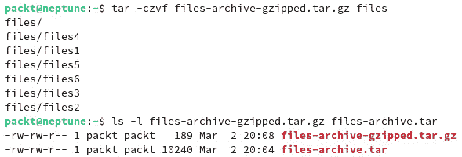

# 2

# Linux shell 和文件系统

理解 **Linux 文件系统**、**文件管理** 基础知识，以及 **Linux shell** 和 **命令行界面** (**CLI**) 的基本知识，对于现代 Linux 专业人员来说至关重要。

在本章中，您将学习如何使用 Linux shell 和一些 Linux 中最常用的命令。您将了解一个基本的 Linux 命令的结构，以及 Linux 文件系统的组织方式。我们将探索处理文件和目录的各种命令。过程中，我们还将介绍最常用的命令行文本编辑器。希望通过本章的学习，您能够熟练使用 Linux CLI，为以后更深入的学习做好准备。本章将为使用 Linux shell 打下基础，关于 shell 的更多信息，请访问 *第八章*，*Linux* *Shell 脚本编写*。

我们将涵盖以下主要主题：

+   介绍 Linux shell

+   Linux 文件系统

+   操作文件和目录

+   使用文本编辑器创建和编辑文件

# 技术要求

本章需要在标准 Linux 发行版的工作环境中进行安装，支持服务器、桌面、PC 或 **虚拟机** (**VM**) 平台。我们的示例和案例研究使用 Ubuntu 和 Fedora 平台，但所探讨的命令和示例同样适用于任何其他 Linux 发行版。

# 介绍 Linux shell

Linux 起源于 Unix 操作系统，其中一个主要优势是命令行界面。以前，这被称为 *shell*。在 `sh` 命令中，shell 是一个程序，它有两个流：*输入流* 和 *输出流*。输入是用户输入的命令，而输出是该命令的结果或其解释。换句话说，shell 是用户与机器之间的主要接口。

主要的 Linux 发行版中的默认 shell 称为 **Bash**，它是 **Bourne Again Shell** 的缩写，命名来源于 UNIX 中原始 shell 的创建者 Steve Bourne。除了 Bash，Linux 中还提供了其他几种 shell，如 **ksh**、**tcsh** 和 **zsh**。在本章及全书中，我们将主要讨论 Bash shell，因为它是现代 Linux 发行版中最广泛使用的 shell。

重要提示

Debian、Ubuntu、Fedora、CentOS Stream、RHEL、openSUSE、SLE 和 Linux Mint 等发行版默认使用 *Bash* Shell。其他一些发行版，如 Kali Linux，已默认切换到 *zsh*。Manjaro 在某些版本中提供 zsh。对于使用 macOS 的用户，你应该知道 zsh 已成为默认 Shell 已有几年了。不过，你可以在 Linux 上安装任何你想要的 Shell，并将其设置为默认 Shell。一般来说，Shell 功能非常相似，因为它们做的是相同的事情，但在可用性和功能上有所不同。如果你对某个特定的 Shell 感兴趣，可以随意使用它，并测试与其他 Shell 的差异。

每个用户都可以分配一个 Shell。系统中的不同用户可以使用不同的 Shell。检查默认 Shell 的一种方法是访问 `/etc/passwd` 文件。关于这个文件和用户账户的更多细节将在 *第四章*中讨论，*管理用户和组*。现在，重要的是知道如何查找默认的 Shell。在此文件中，每行的最后字符表示该用户的默认 Shell。`/etc/passwd` 文件列出了每个用户的信息，包括 **进程标识号** (**PID**)、**组标识号** (**GID**)、用户名、主目录和基本 Shell。

要查看每个用户的默认 Shell，请使用你用户的用户名执行以下命令（在我们的例子中是 `packt`）：

```
cat /etc/passwd | grep packt
```

输出应该是 `/etc/passwd` 文件内容的列表。根据你系统中用户的数量，你将看到所有用户的信息，每个用户占一行。查看 *当前 Shell* 的一个更简单的方法是运行以下命令：

```
echo $0
```

这展示了究竟是什么在运行你的命令，在命令行界面（CLI）的情况下，就是 Shell。`$0` 部分是 Ubuntu 和 Debian 上的 `echo $0` 命令：


图 2.1 – 查看正在运行的 Shell 的命令

如你所见，运行 `echo $0` 命令给出的输出不同，但传递的信息是一样的：正在运行的 Shell 是 Bash。如果你有其他喜欢的 Shell，你可以很容易地为你的用户分配另一个 Shell，前提是你已经安装了它。不过，如果你了解 Bash，那么你将能够轻松使用其他所有可用的 Shell。

重要说明

*Linux Shell 是区分大小写的*。这意味着你在命令行中输入的每个命令都必须遵循这一规则。例如，之前使用的 `cat` 命令是小写的。如果你输入 `Cat` 或 `CAT`，Shell 将无法识别它是一个有效的命令。这个规则同样适用于文件路径。你会注意到，默认的目录在你的主目录中使用大写字母作为首字母，例如 `~/Documents`、`~/Downloads` 等等。这些名称与 `~/documents` 或 `~/downloads` 是不同的。

在本章中，您将学习如何使用 Linux 命令和终端，同时了解其文件系统。关于软件管理，您将在*第三章*中学习，因此现在讲解如何安装新终端会让我们提前讨论。我们希望您能够逐步稳步地建立 Linux 知识，因此我们将在下一章向您展示如何安装新终端。现在，Bash 已经足够了，我们将在全书中使用它。

如果您想查看系统上已安装的所有终端，可以运行以下命令：

```
cat /etc/shells
```

在我们的案例中，Ubuntu Server 22.04.2 LTS 中所有已安装的终端（默认设置）如下图所示：


图 2.2 – Ubuntu 默认提供的终端

这将显示所有已安装的终端。您可以使用这些终端中的任何一个，或者像我们将在*第三章*中所示的那样安装新的终端。此外，在*第四章*中，当我们处理用户帐户时，您将学习如何更改用户的终端。

下一节将介绍终端连接类型。

## 建立终端连接

我们可以通过两种不同的方式连接到终端：`tty`和`pts`。`tty`代表**电传打字机**，它是计算机早期使用的一种终端类型。这种连接被视为本地连接，其端口是与计算机直接连接的。用户与计算机之间的链接通常通过键盘来实现，键盘被认为是本地终端设备。

`pts`连接是通过 SSH 或 Telnet 类型的连接生成的。它的名称代表`ssh`或`xterm`，是`pty`的从属设备。

在下一节中，我们将进一步探讨 Linux 中可用的虚拟终端连接。

### 虚拟控制台/终端

终端被认为是一个管理输入字符串（即命令）与其他 I/O 设备（如键盘和屏幕）之间的设备。还有**伪终端**，它是模拟终端，行为与**经典终端**相同。不同之处在于，它不会直接与设备交互，因为这一切都由 Linux 内核模拟，并将 I/O 传输给一个叫做 shell 的程序。

`tty1`、`tty2`、`tty3`、`tty4`、`tty5`和`tty6`，分别在您的计算机上。

我们将以 Ubuntu 22.04.2 LTS Server 虚拟机安装为例进行解释，但在 Rocky Linux 中也是相同的。启动虚拟机后，提示输入用户名和密码时，屏幕上的第一行将显示类似以下内容：

```
Ubuntu 22.04.2 LTS neptune tty1
```

如果你按下任何前述的键盘组合，你将看到终端从 `tty1` 切换到其他 `tty` 实例。例如，如果你按下 *Ctrl* + *Alt* + *F6*，你将看到以下内容：

```
Ubuntu 22.04.2 LTS neptune tty6
```

因为我们使用的是 Ubuntu 的服务器版本，所以没有安装图形界面。但是，如果你使用的是桌面版，你将能够使用 *Ctrl* + *Alt* + *F7* 进入 `X 图形` 模式。例如，`neptune` 字符串是我们为虚拟机起的名字。

如果你无法使用前述的键盘组合，可以使用专门的命令来更改虚拟终端。这个命令叫做 `chvt`，其语法是 `chvt N`。虽然我们还没有讨论 shell 命令，但我们会给你展示如何使用它们以及其他相关命令的示例。此操作只能由管理员账户执行，或者通过 `sudo` 使用。简而言之，`sudo` 代表 *superuser do*，它允许任何用户以管理员权限或其他用户的权限运行程序（有关更多细节，请参阅 *第四章*，*管理用户* *和组*）。

在接下来的示例中，我们将使用 Ubuntu 向你展示如何更改虚拟终端。首先，我们将查看当前使用的是哪个虚拟终端，然后在不使用 *Ctrl* + *Alt* + *Fn* 键的情况下切换到另一个虚拟终端。

`who` 命令将显示当前登录计算机的用户信息。在我们的例子中，由于我们是通过 SSH 连接到虚拟机，它将显示用户 `packt` 当前正在使用伪终端零（`pts/0`）：

```
packt    pts/0        2023-02-28 10:45 (192.168.122.1)
```

如果我们直接在虚拟机的控制台中运行相同的命令，输出将是以下内容：

```
packt    pts/0        2023-02-28 10:45 (192.168.122.1)
packt    tty1         2023-02-28 10:50
```

它显示用户同时连接到虚拟终端 1（`tty1`）和通过 SSH 从宿主操作系统连接到虚拟机（`pts/0`）。

现在，通过使用 `chvt` 命令，我们将向你展示如何切换到第六个虚拟终端。运行 `sudo chvt 6` 后，你将被提示输入密码，并立即切换到第六个虚拟终端。再次运行 `who` 将显示所有已登录的用户及其使用的虚拟终端。在我们的例子中将是 `pts/0`、`tty2` 和 `tty6`。请注意，你的输出可能不同，因为虚拟终端的编号不同。

现在我们知道了有哪些类型的 shell 连接，接下来我们将在下一节学习 shell 提示符的相关内容。

## 命令行提示符

**命令行提示符** 或 **shell 提示符** 是你输入命令的地方。通常，命令提示符会显示用户名、主机名、当前工作目录和一个表示正在运行 shell 的用户类型的符号。

这是来自 Ubuntu 22.04.2 LTS 服务器版的示例（与 Debian 类似）：

```
packt@saturn:~$
```

这是来自 Fedora 37 服务器的示例（与 Rocky Linux、RHEL 或 AlmaLinux 类似）：

```
[packt@localhost ~]$
```

这是对提示符的简短解释：

+   `packt` 是当前登录用户的用户名

+   `saturn` 和 `localhost` 是主机名

+   `~` 代表家目录（它被称为波浪符）

+   `$` 表示用户是一个普通用户（当您以管理员身份登录时，符号会变成井号 `#`）

此外，当使用 openSUSE 时，您会注意到提示符与 Ubuntu/Debian 和 Fedora/RHEL 的提示符不同。以下是运行 Leap 15.4 服务器版时的提示符示例：

```
packt@localhost:~>
```

如您所见，没有美元符号 (`$`) 或井号 (`#`)，只有大于符号 (`>`)。刚开始可能会有些困惑，但当您使用 root 用户时，符号最终会变成井号 (`#`)。以下是一个示例：

```
localhost:/home/packt #
```

接下来，让我们看看 shell 命令类型。

## Shell 命令类型

Shell 使用 `type` 命令。例如，您可以检查 `cd`（更改目录）是什么类型的命令：

```
packt@neptune:~$ type cd
cd is a shell builtin
```

输出显示 `cd` 命令是一个内部命令，它内置在 shell 中。如果你感兴趣，你可以通过在命令名前加上 `type` 来了解我们将在接下来的章节中展示的其他命令类型。接下来我们可以通过以下图像查看更多示例：


图 2.3 – Linux 中不同类型的命令

现在您知道一些 Linux 命令的类型，让我们分析命令的结构并了解其组成部分。

## 解释命令结构

我们已经使用过一些命令，但我们没有解释 Linux 命令的结构。现在我们将为您讲解，以便您能够理解如何使用这些命令。简而言之，Unix 和 Linux 命令有以下形式：

+   命令的名称

+   命令的选项

+   命令的参数

在 shell 中，您将看到类似以下的结构：

```
command [-option(s)] [argument(s)]
```

一个合适的例子是使用 `ls` 命令（`ls` 来自 *list*）。这个命令是 Linux 中最常用的命令之一，它用于列出文件和目录，并且可以与选项和参数一起使用。

我们可以使用最简单的 `ls` 命令，既不加选项也不加参数。它会列出当前工作目录（`pwd`）的内容。在我们的例子中，它是家目录，在 shell 提示符中由 `~` 波浪符表示（见 *图 2.10*）。

带有 `-l` 选项（小写 L）的 `ls` 命令使用长格式列出，提供关于当前工作目录（`pwd`）中文件和目录的更多信息：


图 2.4 – 使用 `ls` 命令结合选项和属性

在前面的示例中，我们使用了 `ls -l ~/Documents/` 来显示 `~/Documents` 目录的内容。这里展示了一种使用命令结合选项和属性的方式，而不需要将当前工作目录切换到 `~/Documents`。

在接下来的部分中，我们将向你展示如何使用 Linux 中默认提供的手册页面。

## 查阅手册

每位 Linux 系统管理员的好伙伴就是手册。每个 Linux 命令都有一个手册页面，向用户提供有关其使用、选项和属性的详细信息。如果你知道想要了解的命令，直接使用 `man` 命令进行查阅。例如，要查看 `ls` 命令的手册，你可以使用 `man ls`。

手册将命令信息组织成不同的章节，每个章节都按约定命名，在所有发行版中都是一样的。简要地说，这些章节包括 `name`、`synopsis`、`configuration`、`description`、`options`、`exit status`、`return value`、`errors`、`environment`、`files`、`versions`、`conforming to`、`notes`、`bugs`、`example`、`authors`、`copyright` 和 `see also`。

类似于手册页面，几乎所有的 Linux 命令都有一个 `-help` 选项。你可以利用这个选项来进行快速查阅。

要了解更多关于 `help` 和 `man` 页面的信息，你可以查阅每个命令的帮助或手册页面。尝试以下命令：

```
$ man man
$ help help
```

当你使用手册时，请记住它并不是一本逐步操作的指南。它是技术文档，刚开始时可能会让人感到困惑。我们的建议是尽可能多地使用 `man` 页面。在你去互联网搜索任何内容之前，先试着阅读手册。这将是一个很好的练习，并且你将很快熟练掌握 Linux 命令。

把手册当作你的朋友，类似于你在高中或大学时使用的教科书。它将在你最需要的时候提供第一手信息。如果你考虑到在某些情况下无法访问互联网，也无法使用搜索引擎，内建的手册将是你最好的伙伴。学会利用它的功能，充分发挥它的优势。

在接下来的部分中，你将了解 Linux 文件系统。

# Linux 文件系统

`/ (root)` 文件系统和另一个 `/home` 文件系统。或者，可能只有一个文件系统包含所有的文件系统。

通常来说，按每个分区使用一个文件系统被认为是良好的做法，它有助于逻辑上的维护和管理。由于 Linux 中的一切都是文件，硬盘、DVD 驱动器、USB 设备和软盘驱动器等物理设备也被视作文件。在本节中，你将了解目录结构，如何操作文件，以及一些非常有用的命令行编辑技巧。

## 目录结构

Linux 在文件系统的基础处使用`` `/` ``)。从此位置开始，所有的分支（目录）都向文件系统扩展。

**文件系统层次标准**（**FHS**）定义了类似 Unix 系统文件系统的结构。然而，Linux 文件系统还包含一些标准未定义的目录。

### 从命令行探索 Linux 文件系统

可以通过使用`tree`命令自由地探索文件系统。在 Fedora Linux 中，`tree`已预安装，但如果你使用 Ubuntu，需要使用以下命令进行安装：

```
$ sudo apt install tree
```

不要害怕探索文件系统，因为单纯浏览是不会造成任何损害的。你可以使用`ls`命令列出目录的内容，但`tree`提供了不同的图形化显示。以下图像展示了两者输出的区别：


图 2.5 – 比较`ls -la`命令和`tree -a`命令的输出

`tree`命令有不同的选项，你可以通过手册了解它们。我们将使用`tree`命令并调用`-L`选项，这告诉命令应该向下查看多少级目录，最后的属性则指定从哪个目录开始。在我们的示例中，命令将从`root`目录开始，向下查看一级，该目录由正斜杠作为参数表示（见*图 2.12*）：

```
$ tree -L 1 /
```

通过使用`tree`命令开始探索目录结构，如下所示：


图 2.6 – 在 Ubuntu 上使用带选项和参数的`tree`命令

重要提示

请记住，某些你即将打开的目录中将包含大量文件和/或其他目录，这将使你的终端窗口变得杂乱无章。

以下是几乎所有版本的 Linux 上都存在的目录。以下是 Linux 根文件系统的快速概览：

+   `/`：根目录。所有其他目录的根目录。

+   `/bin`：必要的命令二进制文件。存储二进制程序的位置。

+   `/boot`：引导加载程序的静态文件。存储内核、引导加载程序和`initramfs`的位置。

+   `/dev`：设备文件。指向设备设备节点，是内核设备列表。

+   `/etc`：特定主机的系统配置。系统的必要配置文件、启动时加载的脚本、`crontab`、`fstab`设备存储表、`passwd`用户帐户文件。

+   `/home`：用户的主目录。存储用户文件的位置。

+   `/lib`：必要的共享库和内核模块。共享库类似于 Windows 中的**动态链接库**（**DLL**）文件。

+   `/media`：可移动媒体的挂载点。用于外部设备和 USB 外部媒体。

+   `/mnt`：用于临时挂载文件系统的挂载点。用于旧版系统。

+   `/opt`：附加应用程序软件包。安装*可选*软件的位置。

+   `/proc`：由内核管理的虚拟文件系统。一个包含系统所需文件的特殊目录结构。

+   `/sbin`：必要的系统二进制文件。系统运行所需的重要程序。

+   `/srv`：本系统提供的服务的数据。

+   `/tmp`：临时文件。

+   `/usr`：次级层级。Linux 中最大的目录，包含普通系统用户所需的支持文件：

    +   `/usr/bin` – 系统可执行文件

    +   `/usr/lib` – 来自 `/usr/bin` 的共享库

    +   `/usr/local` – 源代码编译的程序，不包括在发行版中

    +   `/usr/sbin` – 特定的系统管理程序

    +   `/usr/share` – 程序在 `/usr/bin` 中共享的数据，例如配置文件、图标、壁纸或音频文件

    +   `/usr/share/doc` – 系统范围文件的文档

+   `/var`：可变数据。只有用户可修改的数据存储在这里，例如数据库、打印缓存文件、用户邮件等；`/var/log` – 包含记录系统活动的日志文件

接下来，我们将学习如何操作这些文件和目录。

# 操作文件和目录

记住，在 Linux 中一切都是文件。目录也是文件。因此，了解如何操作它们是至关重要的。在 Linux 中操作文件意味着使用多个命令来执行基本的文件和目录操作，如文件查看、文件创建、文件定位、文件属性和链接。一些命令虽然在此不会详细介绍，但与文件密切相关，接下来的章节将涵盖它们。

## 理解文件路径

FHS 中的每个文件都有一个*路径*。路径是文件位置的易读表示。在 Linux 中，所有文件都存储在根目录下，使用 FHS 作为标准来组织它们。系统内文件和目录之间的关系通过正斜杠字符（`/`）表示。在计算机历史上，正斜杠被用作描述地址的符号。路径实际上是文件的地址。

Linux 中有两种路径类型，相对路径和绝对路径。**绝对路径**总是以根目录开始，并沿着系统的分支直到所需的文件。**相对路径**总是指向**当前工作目录**（**pwd**），并表示到该目录的相对路径。因此，相对路径总是相对于当前工作目录的路径。

例如，我们从主目录引用一个现有的文件，名为 `poem`。如果我们在主目录内，并且 `pwd` 命令显示为 `packt` 的主目录，那么名为 `poem` 的文件的绝对路径将如下所示：

```
/home/packt/poem
```

如果我们想使用 `cat` 命令查看该文件的内容，例如，我们可以使用带有绝对路径的命令：

```
cat /home/packt/poem
```

同一个文件的相对路径是相对于 `pwd` 的，因此在我们的例子中，如果我们已经在主目录内，使用 `cat` 命令将是这样的：

```
cat poem
```

绝对路径在操作文件时非常有用。经过一段时间的实践，你将会学会如何访问最常用的文件路径。例如，你需要学习的一个文件路径是`passwd`文件，它位于`/etc`目录中。因此，当你引用它时，你将使用它的绝对路径`/etc/passwd`。如果使用相对路径来引用该文件，则意味着你要么已经在其父目录中，要么在 FHS 中某个靠近的地方。

使用相对路径涉及到了解两个用于操作 FHS（文件层次结构）的特殊字符。第一个特殊字符是点（`.`），它表示当前目录。另一个是两个连续的点（`..`），它表示当前目录的父目录。在使用相对路径时，确保始终检查你所在的目录。使用`pwd`命令可以显示你当前的工作目录。

使用相对路径的一个好例子是，当你已经在父目录中，并且需要引用它时。如果你需要查看系统中的账户列表，而这些信息存储在`passwd`文件中，你可以通过相对路径引用它。在这个例子中，我们处在我们的主目录中：


图 2.7 – 使用文件的相对路径

在这里，我们首先通过`pwd`命令检查当前的工作目录，输出将是我们的主目录路径，即`/home/packt`。接着，我们尝试从主目录直接显示`passwd`文件的内容，使用的是`cat`命令，但输出将是一个错误信息，表示在主目录中没有这样的文件或目录。我们使用了相对路径，而相对路径始终是相对于当前的工作目录，因此出现了错误。接下来，我们使用了两个连续点的特殊字符来通过相对路径引用该文件。在这种情况下，命令是`cat ../../etc/passwd`。

提示

始终使用键盘上的*Tab*键进行自动补全，并检查你输入的路径是否正确。在前面的例子中，我们输入了`../../etc`并按下了*Tab*，它自动补全为一个斜杠。然后，我们输入了文件名的前两个字母并再次按下*Tab*。这时，它展示了`/etc`目录中所有以`pa`开头的文件列表。看到`passwd`文件在其中后，我们确认路径正确，于是再输入两个`s`字符并按下*Tab*。这时，命令就自动完成了，我们按下*Enter*/*Return*键来执行命令。

最终命令中的路径是相对于我们的主目录的，它的翻译如下：*将文件与名为* `passwd` *的文件连接，该文件位于* `/etc` *目录中，该目录位于我们当前目录（主目录）的父目录（第一个两个点）和父目录的父目录（第二个两个点）中*。因此，`/etc/passwd` 的绝对路径被转换为相对于我们主目录的相对路径，如下所示：`../../etc/passwd`。

接下来，我们将学习 Linux 中的基本文件操作。

## 基本文件操作

作为系统管理员，你每天都会操作文件。这包括创建、复制、移动、列出、删除、链接等操作。这些操作的基本命令在本章中已经讨论过，现在是时候深入了解它们的使用、选项和属性了。接下来的章节将详细介绍一些更高级的命令。

### 创建文件

有时候你需要使用 `touch` 命令。当你使用它时，它会创建一个新的文件，文件所有者是你，且文件大小为零，因为它是一个空文件。

在下面的示例中，我们将在 `~/``packt/` 目录下创建一个名为 `new-report` 的新文件：


图 2.8 – 使用 touch 命令创建和修改文件

`touch` 命令还用于更改文件的修改时间，而不更改文件本身。请注意，当我们首次创建 `new-report` 文件时的初始时间与使用 `touch` 命令之后的时间之间的差异。你还可以通过使用 `touch` 命令的 `-a` 选项来更改访问时间。默认情况下，`ls` 命令的长格式列表仅显示修改/创建时间。如果你想查看访问时间，可以使用 `- time` 选项中的 `atime` 参数。请参见下面的示例：


图 2.9 – 使用 touch 命令修改访问时间

修改、创建和访问时间戳非常有用，特别是在使用 `find` 等命令时。它们为你提供了更 *细致* 的搜索模式。我们将在未来的章节中通过更多示例回到这个命令。

也可以通过使用重定向和 `echo` 命令来创建文件。`echo` 是一个将作为参数传递的字符串打印到标准输出（屏幕）的命令。`echo` 命令的输出可以通过使用输出重定向直接写入文件：


图 2.10 – 使用 echo 命令与输出重定向

在前面的示例中，我们将 `echo` 命令的文本重定向到演示文件中。该文件最初并不存在，因此由命令自动创建。第一个 `echo` 命令使用 `>` 操作符向文件中添加了一行内容。第二个 `echo` 命令使用 `>>` 操作符将新的一行文本追加到文件末尾。

### 列出文件

我们之前已经用过一些 `ls` 命令的示例，所以你对它有一定的了解。我们将 `-l` 选项作为命令结构的示例进行讲解，因此这里不再赘述。我们将探讨一些新的选项，这些选项对于这个基本而有用的命令非常重要：

+   `ls -lh`：`-l` 选项以扩展格式列出文件，而 `-h` 选项以人类可读的格式显示文件大小，单位为千字节或兆字节，而不是字节。

+   `ls -la`：`-a` 选项显示所有文件，包括隐藏文件。与 `-l` 选项结合使用时，输出将是一个包含所有文件及其详细信息的列表。

+   `ls -ltr`：`-t` 选项按修改时间排序文件，最新的文件排在最前面。`-r` 选项则是将排序顺序反转。

+   `ls –lS`：`-S` 选项按文件大小排序，最大的文件排在最前面。

+   `ls -R`：`-R` 选项以递归模式显示当前目录或指定目录的内容。

一个常用的列出文件和目录的方法是 `ls -la` 命令。让我们在这里详细看看它，尽管我们将在*第四章*《用户与组管理》中详细讨论这个问题。

我们在家目录中使用长列表的一种示例可以在*图 2.11*中看到，当我们将 `ls -la` 的输出与 `tree` 命令的输出进行比较时。以下是一个简短的示例：

```
total 48
drwxr-x--- 5 packt packt 4096 Mar  2 14:44 .
drwxr-xr-x 3 root  root  4096 Feb 27 08:58 ..
-rw-rw-r-- 1 packt packt   55 Mar  2 14:46 art-file
-rw------- 1 packt packt 1039 Mar  1 18:56 .bash_history
```

在输出中，命令后的第一行显示了目录中块的数量。之后，每一行代表一个文件或子目录，并显示以下详细信息：

+   第一个字符表示文件类型：`d` 代表目录，`:` 代表文件，`l` 代表链接，`c` 代表字符设备，`b` 代表块设备。

+   接下来的九个字符表示文件的权限（详细内容见*第四章*《用户与组管理》）。

+   该文件的硬链接（请参阅本章中的*处理链接*小节）。

+   文件所有者的 PID 和 GID（详细内容见*第四章*《用户与组管理》）。

+   文件的大小（该数字取决于是否采用人类可读格式）。

+   文件的最后修改时间。

+   文件或目录的名称

前两行分别是对自身（点）和父目录（第二行中的两个点）的引用。

下一部分将教你如何复制和移动文件。

### 复制和移动文件

在 Linux 中，`cp` 命令用于复制文件。`mv` 命令用于在文件系统中移动文件。这个命令也可以用来重命名文件。

要复制文件，你可以使用最简单的 `cp` 命令：

```
cp source_file_path destination_file_path
```

这里，`source_file_path` 是要复制的文件名，`destination_file_path` 是目标文件名。你也可以复制一个已存在目录中的多个文件。如果目标目录不存在，shell 会提示你目标不是一个目录。

现在让我们来看看这些命令的一些变体：

+   `cp -a`：`-a` 选项以递归模式复制整个目录层次结构，同时保留所有的属性和链接。在以下示例中，我们使用 `-a` 选项将之前在主目录中创建的 `dir1` 目录完整复制到新创建的 `backup_dir1` 目录中：


图 2.11 – 使用带有 -a 选项的复制命令

+   `cp -r`：这个选项类似于`-a`，但它不保留文件属性，仅保留符号链接。

+   `cp -p`：`-p` 选项保留文件的权限和时间戳。否则，使用最简单形式的 `cp` 命令进行复制时，文件副本将归当前用户所有，并且时间戳为你进行复制操作时的时间。

+   `cp -R`：`-R` 选项允许你递归复制一个目录。在以下示例中，我们将使用 `ls` 命令显示 `~/packt/` 目录的内容，然后使用 `cp -R` 命令将 `/files` 目录的内容复制到 `/new-files` 目录。`/new-files` 目录之前并不存在。`cp -R` 命令创建了它：


图 2.12 – 使用 cp -R 命令

移动文件是通过 `mv` 命令完成的。它用于将文件和目录从一个位置移动到另一个位置，或者用于重命名文件。以下是一个示例，我们使用 `mv` 命令将 `files1` 重命名为 `old-files1`：`mv files1 old-files1`。

还有许多其他选项，你可以通过查阅手册页面来了解它们。随时可以探索它们，并将它们应用到你的日常任务中。

### 处理链接

链接在 Linux 中是一个非常有用的选项。它们可以用来保护原始文件，或者作为一种工具，避免需要多个文件的独立副本。可以将它视为为同一文件创建不同名称的工具。

`ln` 命令可用于创建两种类型的链接：

+   符号链接

+   硬链接

这两种链接是不同类型的文件，指向原始文件。**符号链接**是一个指向原始文件的物理文件；它们是链接的并且具有相同的内容。此外，符号链接可以跨越不同的文件系统和物理介质，这意味着它可以链接到存储在其他驱动器或分区上的原始文件，且文件系统类型不同。使用的命令如下：

```
ln -s [original_filename] [link_filename]
```

下面是一个示例，我们列出了`~/packt`目录的内容，然后使用`ln -s`命令为`new-report`文件创建了一个符号链接，并再次列出了目录内容：


图 2.13 – 使用符号链接

你可以看到，创建的链接名为`new-report-link`，并且通过`->`箭头的视觉表示，指向了原始文件。你还可以看出两个文件之间的大小差异，链接和原始文件的权限也不同。这表明它们是两个*不同*的物理文件。为了进一步确认它们是不同的物理文件，你可以使用`ls -i`命令查看`new-report`和`new-report-link`的 inode 不同：


图 2.14 – 比较符号链接和原始文件的 inode

如果你想知道链接指向哪里，而又不想使用`ls -l`，可以使用`readlink`命令。它在 Ubuntu 和 CentOS 中都可用。该命令的输出将只是符号链接所指向的文件名。它只在符号链接的情况下有效：

```
packt@neptune:~$ readlink new-report-link
new-report
```

在前面的示例中，你可以看到输出显示`new-report-link`文件是指向名为`new-report`的文件的符号链接。

相比之下，`ln`命令如果没有任何选项：

```
ln [original-file] [linked-file]
```

在以下示例中，我们为`new-report`文件创建了一个硬链接，并将其命名为`new-report-ln`：


图 2.15 – 使用硬链接

在输出中，你会看到它们具有相同的大小和相同的 inode，且在使用`echo`和输出重定向更改原始文件后，两个文件都能看到这些更改。这两个文件与符号链接的表示方式不同。它们在你的目录列表中会显示为两个不同的文件，且没有任何视觉标识来显示哪个文件被指向。实质上，硬链接是与原始文件的 inode 相连接的。你可以将其视为文件的新名称，类似于但不完全相同于重命名文件。

### 删除文件

在 Linux 中，删除文件可以使用`rm`命令。在最简单的形式下，`rm`命令是没有选项的。如果你想更精确地控制删除方式，可以使用`-i`、`-f`和`-r`选项：

+   `rm -i`：此选项启用交互模式，在删除前会要求你确认：


图 2.16 – 交互式删除文件

在前面的示例中，我们使用 `-i` 选项删除了 `art-file`。在要求互动时，你有两个选择。你可以通过输入 `y` （是）来批准该操作，或者输入 `n` （否）来取消该操作。

+   `rm -f` ：`-f` 选项会强制删除文件，无需用户互动：


图 2.17 – 强制删除文件

我们使用 `rm -f` 命令删除了之前创建的 `new-report-link` 文件。该命令没有要求我们的确认，直接删除了文件。

+   `rm -r` ：此选项以递归模式删除文件，用于删除多个文件和目录。例如，我们将尝试删除 `new-files` 目录。使用最简单的 `rm` 命令时，输出会显示错误，表示无法删除目录。但当与 `-r` 选项一起使用时，目录会立即被删除：


图 2.18 – 递归删除目录

重要提示

我们建议使用 `rm` 命令时要*格外小心*。最具破坏性的方法是使用 `rm -rf`。这将毫不警告地删除文件、目录及任何内容。请注意，一旦执行了此操作，无法恢复，后果将是不可挽回的。

大多数情况下，删除文件是单向操作，无法回头。这使得删除文件的过程非常重要，在删除之前进行备份可以帮你避免许多不必要的压力。

### 创建目录

在 Linux 中，你可以使用 `mkdir` 命令创建新目录。在以下示例中，我们将创建一个名为 `development` 的新目录：

```
mkdir development
```

如果你想一次创建多个目录和子目录，你需要使用 `-p` 选项（`p` 来自父目录），如以下图所示：


图 2.19 – 创建父目录

在 Linux 中，目录也是文件，只是它们具有特殊的属性。它们对于组织文件系统至关重要。如需了解更多此有用工具的选项，欢迎查阅手册页面。

### 删除目录

Linux 中删除目录的命令是 `rmdir`。它默认只删除空目录。让我们看看如果尝试删除一个非空目录会发生什么：


图 2.20 – 使用 rmdir 命令

这是来自 shell 的一种预防性措施，因为删除一个非空目录可能会产生灾难性的后果，正如我们在使用`rm`命令时所看到的那样。`rmdir`命令不像`rm`那样有`-i`选项。使用`rmdir`命令删除目录的唯一方法是先手动删除目录中的文件。然而，前面展示的`rm -r`命令在删除目录时仍然有用且更具灵活性。

现在你已经知道如何在 Linux 中操作目录了，我们将继续展示文件查看命令。

## 文件查看命令

由于 Linux 中的一切都是文件，能够查看和操作文件内容是任何系统管理员的必备技能。在这一节中，我们将学习文件查看命令，因为几乎所有的文件都包含文本，某个时刻这些文本都应该是可读的。

### `cat`命令

这个命令在本章之前的一些示例中已经使用过。它是*concatenate*（拼接）的缩写，用来将文件内容打印到屏幕上。我们在本章中已经多次使用了`cat`，这里再举一个例子。我们有两个现有文件，一个叫`new-report`，另一个叫`users`。让我们通过以下图示来展示如何使用`cat`：


图 2.21 – 使用`cat`命令的示例

在这个例子中，我们首先使用命令显示了仅一个文件`new-report`的内容。第二个命令则用来同时显示两个文件`new-report`和`users`的内容。`cat`命令将这两个文件的内容显示在屏幕上。两个文件都位于同一目录中，也就是用户的工作目录。如果你想拼接那些不在当前工作目录中的文件内容，你需要使用它们的绝对路径。

`cat`命令有多个可用选项，我们这里不作详细介绍，因为在大多数情况下，它最纯粹的形式是最常用的。更多详情请参阅手册页。

### `less`命令

有时候，文件的内容太多，会占据多个屏幕，单纯用`cat`命令在终端上查看很困难。这时，`less`命令就派上用场了。它一次只显示一个屏幕的内容。一个屏幕显示多少内容，取决于你的终端窗口的大小。以`/etc/passwd`文件为例，它可能包含多行内容，无法完全显示在一个屏幕上。你可以使用以下命令：

```
$ less /etc/passwd
```

当你按下*Enter*时，文件的内容将显示在你的屏幕上。要在其中浏览，你可以使用以下按键：

+   空格键：向前移动一个屏幕

+   *Enter*: 向前移动一行

+   *b*: 向后移动一个屏幕

+   */*: 进入搜索模式；在文件中向前搜索

+   *?*: 搜索模式；在文件中向后搜索

+   *v*: 使用默认编辑器编辑文件

+   *g*: 跳转到文件开头

+   *Shift* + *g*：跳转到文件末尾

+   *q*：退出输出。

`less` 命令有许多可以使用的选项。我们建议你查阅手册页，了解更多关于该命令的信息。

### head 命令

当你只想将文本文件的开头（头部）打印到屏幕时，这个命令非常有用。默认情况下，它只会打印文件的前 10 行。你可以使用相同的 `/etc/passwd` 文件来进行 head 操作，并执行以下命令。观察发生的情况。它会打印前 10 行，然后退出命令，带你回到 shell 提示符：

```
head /etc/passwd
```

这个命令的一个有用选项是打印文件的多行或少行。为此，你可以使用 `-n` 参数，或者直接使用 `–` 后跟你想打印的行数。对于 `/etc/passwd` 文件，我们首先使用没有任何选项的 head 命令，然后使用带有行数参数的命令，如下图所示：


图 2.22 – 使用 head 命令

这个命令提供的许多其他选项对于作为系统管理员的工作非常有用，但我们在此不会涵盖它们。你可以自行探索。

### tail 命令

`tail` 命令与 `head` 命令类似，只不过它默认打印文件的最后 10 行。你可以使用与 head 命令相同的 `-n` 参数，以查看文件末尾的特定行数。然而，`tail` 命令通常用于实时监视不断变化的日志文件。它可以在其他应用程序写入文件时打印文件的最后几行。例如，考虑以下行：

```
tail -f /var/log/syslog
```

使用 `-f` 选项将使该命令在写入 `/var/log/syslog` 文件时进行监视。它将有效地在屏幕上显示文件内容。`-f` 选项会导致 tail 命令在日志轮换时停止，这时应该使用 `-F` 选项。使用 `-F` 选项时，命令会在日志轮换期间继续显示输出。要退出该屏幕，你需要按 *Ctrl* + *C* 返回到 shell 提示符。以下是前述命令输出的示例：


图 2.23 – 使用 tail 命令进行实时日志文件观察

接下来，让我们了解如何在 Linux 中查看文件属性。

## 文件属性命令

有时，仅查看文件内容是不够的，你可能需要该文件的额外信息。还有其他一些实用的命令可以使用，我们将在接下来的部分中介绍它们。

### stat 命令

`stat` 命令提供比 `ls` 命令更多的信息。下面的示例展示了对于同一文件，`ls` 和 `stat` 输出的对比：


图 2.24 – 使用 stat 命令

`stat`命令可以提供有关文件名、大小、块数、文件类型、inode、链接数、权限、UID 和 GID，以及`atime`、`mtime`和`ctime`的更多信息。如需了解更多信息，请参考 Linux 手册页。

### 文件命令

这个命令只是报告文件的类型。这里有一个文本文件和一个命令文件的示例：


图 2.25 – 使用 file 命令

Linux 不像其他操作系统那样依赖文件扩展名和类型。在这方面，`file`命令更侧重于根据文件内容来确定文件类型，而非其他。

### 配置文件所有权和权限的命令

在 Linux 中，使用`chown`命令。当设置组所有权时，你可以为该组中的所有人确定权限。这是通过使用`chgrp`命令来设置的。至于其他用户，指的是该系统中其他任何人，即那些没有创建文件、不是文件所有者并且不属于文件所有者所在组的人。其他用户也被称为“世界”。

除了设置用户所有权，系统还必须知道如何确定用户行为，而它是通过使用`ls -l`命令来实现的：


图 2.26 – 长格式列出输出

在前面的示例中，你会看到我们家目录中的文件有两种不同类型的权限。每行都有 12 个字符，分别用于特殊属性和权限。在这 12 个字符中，前 10 个被用于前面的示例。九个字符表示权限，第一个字符表示文件类型。权限有三个容易记住的缩写：

+   `r`表示`读`权限

+   `w`表示`写`权限

+   `x`表示`执行`权限

+   `-`表示没有权限

这九个字符被分为三个区域，每个区域由三个字符组成。前三个字符用于用户权限，接下来的三个字符用于组权限，最后三个字符代表其他权限，或称全局权限。

文件类型也有它们的代码，具体如下：

+   `d`：字母`d`表示这是一个目录

+   `-`：连字符表示这是一个文件

+   `l`：字母`l`表示这是一个符号链接

+   `p`：字母`p`表示这是一个命名管道；一个特殊文件，方便程序间的通信

+   `s`：字母`s`表示这是一个套接字，类似于管道，但具有双向和网络通信功能

+   `b`：字母`b`表示这是一个块设备；一个对应硬件设备的文件

+   `c`：字母`c`表示这是一个字符设备；类似于块设备

权限字符串是一个 10 位的字符串。第一位用于文件类型。接下来的九位通过分成 3 位一组来表示权限。每组由一个**八进制数**表示（因为八进制数有三位）。因此，权限是用二的幂来表示的：

+   `read` 是 2 ^ 2（2 的幂），等于 4

+   `write` 是 2 ^ 1（1 的幂），等于 2

+   `execute` 是 2 ^ 0（零的幂），等于 1

在这方面，文件权限应按以下图示表示：


图 2.27 – 文件权限解释

在上面的图示中，权限以九个字符的字符串显示，正如你在 `ls -la` 输出中看到的那样。该行被分为三个部分，一个是用户/所有者的权限，一个是组的权限，另一个是其他/世界的权限。这些信息在前两行中展示。其他两行展示了权限的类型（`read`、`write` 和 `execute`），以及下文中提到的八进制数。

这非常有用，因为它将八进制表示与字符表示的权限关联起来。因此，如果你将一个权限表示为 `rwx r-x` 转换为八进制，依据前面的图示，你可以轻松地说它是 `755`。这是因为，对于第一个组，即所有者，你有所有权限（`rwx`），这转换为 *4+2+1=7*。对于第二个组，你只有两个权限是激活的，`r` 和 `x`，这转换为 *4+1=5*。最后，对于第三组，你也有两个权限是激活的，类似于第二组（`r` 和 `x`），这也转换为 *4+1=5*。现在你知道，该权限的八进制表示是 `755`。

作为练习，你应该尝试将以下权限转换为八进制：

+   `rwx rwx`

+   `rwx r-x`

+   `rwx r-x - - -`

+   `rwx - - - - - -`

+   `rw-` `rw- rw-`

+   `rw- rw- r - -`

+   `rw- rw- - - -`

+   `rw- r- -` `r- -`

+   `rw- r- - - - -`

+   `rw- - - - - - -`

+   `r - - - - - - - -`

重要说明

还有一些其他重要的命令，如 `umask`、`chown`、`chmod` 和 `chgrp`，分别用于更改或设置默认创建模式、所有者、模式（访问权限）和组。它们将在此简要介绍，因为它们涉及到设置文件的属性，但要了解更详细的描述，请参考*第四章*，*用户*和*组的管理*。

### 文件压缩、解压缩和归档的命令

在 Linux 中，标准的归档工具叫做 `tar`，即磁带归档。最初用于 Unix 中将文件写入外部磁带设备进行归档。如今，在 Linux 中，它也用于将文件以压缩格式写入文件。除了 `tar` 归档格式，其他常用的压缩归档格式包括 `gzip` 和 `bzip`，以及 Windows 系统中的流行格式 `zip`。现在我们来详细了解一下 `tar` 命令。

#### 用于压缩和解压的 tar 命令

这个命令需要与选项一起使用，默认情况下不提供压缩功能。要使用压缩，我们需要使用特定的选项。以下是 `tar` 提供的一些最有用的选项：

+   `tar -c`：创建归档文件

+   `tar -r`：将文件追加到已有的归档文件中

+   `tar -u`：只将已更改的文件追加到现有的归档文件中

+   `tar -A`：将归档追加到另一个归档的末尾

+   `tar -t`：列出归档文件的内容

+   `tar -x`：提取归档文件内容

+   `tar -z`：使用 `gzip` 压缩归档文件

+   `tar -j`：使用 `bzip2` 压缩归档文件

+   `tar -v`：使用详细模式，在屏幕上打印额外的信息

+   `tar -p`：恢复提取文件的原始权限和所有权

+   `tar -f`：指定输出文件的名称

在你的日常任务中，你可能会需要将这些选项组合使用。

例如，要创建一个 `files` 目录的归档文件，我们可以将 `-cvf` 选项组合使用，示例如下：


图 2.28 – 使用 tar 命令

创建的归档文件未压缩。要使用压缩，我们需要添加 `-z` 或 `-j` 选项。接下来，我们将使用 `-z` 选项来进行 `gzip` 压缩。请参见以下示例，并比较两个归档文件的大小。一般来说，建议为此类文件使用扩展名：



图 2.29 – 使用 gzip 压缩 tar 文件

要解压一个 tar 归档文件，你可以使用 `-x` 选项（如本小节开头所示）。例如，我们可以解压我们在本小节前面创建的 `files-archive.tar` 文件，并使用 `-C` 选项指定解压后的文件存放目标目录。目标目录需要事先创建。我们将使用以下命令：

```
mkdir uncompressed-directory
tar -xvf files-archive.tar -C uncompressed-directory
```

这将从归档中提取文件，并将它们添加到未压缩目录中。例如，要解压一个 `gzip` 压缩的归档文件，如 `files-archive-gzipped.tar.gz`，我们将添加 `-z` 选项，并结合前面的命令使用，示例如下：

```
tar -xvzf files-archive-gzipped.tar.gz -C uncompressed-directory
```

就这样，现在你知道如何在 Linux 中归档和解压文件了。Linux 中还有其他有用的归档工具，但 `tar` 仍然是最常用的。你可以自由探索其他工具或 `tar` 的其他有用选项。

### 查找文件的命令

在 Linux 中查找文件是任何系统管理员的重要任务。由于 Linux 系统包含大量文件，查找文件可能是一个让人头疼的任务。不过，你手头有许多有用的工具，学会如何使用它们将是你最大的资产之一。在接下来的章节中，我们将讨论 `locate`、`which`、`whereis` 和 `find` 等命令。

#### locate 命令

`locate` 命令在 Ubuntu 中默认未安装。要安装它，请使用以下命令创建系统上所有文件位置的索引：

```
sudo apt install mlocate
```

因此，当你执行该命令时，它会在数据库中搜索你的文件。它使用 `updatedb` 命令作为辅助工具。

在开始使用 locate 命令之前，你应该先执行 `updatedb` 来更新位置数据库。更新后，你可以开始定位文件。在以下示例中，我们将定位任何文件，其名称中包含 `new-report`：


图 2.30 – 使用 locate 命令

如果我们搜索一个更通用的文件名，例如 `presentation`，输出会过长且不相关。以下是一个示例，我们使用了输出重定向到文件并使用 `wc`（字数统计）命令仅显示文件的行数、单词数和字节数：


图 2.31 – 使用 locate 命令并进行输出重定向和 wc 命令

在前面的输出中，结果文件有八行。这意味着找到了八个文件，它们的文件名中包含字符串 `presentation`。确切的数字是针对文件中的单词，因为路径之间没有空格，所以每一行都会被检测为一个单独的单词。此外，结果文件的大小是 663 字节。你可以尝试使用其他字符串。有关 `locate` 命令的更多选项，请参考 Linux 手册页面。

#### which 命令

该命令用于定位 shell 搜索路径中的可执行文件（程序或命令）。例如，要定位 `ls` 命令，输入以下内容：

```
packt@neptune:~$ which ls
/usr/bin/ls
```

你会看到输出是 `ls` 命令的路径：`/usr/bin/ls`。

现在尝试使用 `cd` 命令：

```
which cd
```

你会看到没有任何输出。这是因为 `cd` 命令是内建的 shell 命令，没有其他位置可以显示该命令。

#### whereis 命令

该命令*仅*查找可执行文件、文档文件和源代码文件。因此，它可能无法找到你想要的文件，请谨慎使用：


图 2.32 – 使用 whereis 命令

再次，`cd` 命令的输出没有显示任何相关内容，因为它是一个内建的 shell 命令。至于 `ls` 命令，输出显示了该命令本身的位置以及手册页面的位置。

#### find 命令

这个命令是 Linux 中最强大的命令之一。它可以根据特定的标准在目录和子目录中查找文件，具有超过 50 个选项。它的主要缺点是语法，因为它与其他 Linux 命令有所不同。学习 `find` 命令的最佳方法是通过示例。因此，我们将通过大量示例来展示这个命令，希望你能熟练掌握它的使用。要了解它的强大选项，请参考手册页。

以下是一些使用 `find` 命令的练习，我们认为这些对你非常有用。我们将提供使用的命令，但不会提供所有的输出结果，因为有些结果可能非常长。

+   在根目录下查找所有文件名中包含`e100`字符串的文件，并将它们打印到标准输出：

    ```
    sudo find / -name e100 -print
    ```

+   在根目录下查找所有文件名中包含`file`字符串且类型为`file`的文件，并将结果打印到标准输出：

    ```
    sudo find / -name file -type f -print
    ```

+   查找所有文件名中包含`print`字符串的文件，仅在`/opt`、`/usr` 和 `/var` 目录中查找：

    ```
    sudo find /opt /usr /var -name print -type f -print
    ```

+   查找根目录中所有扩展名为 `.conf` 的文件：

    ```
    sudo find / type f -name "*.conf"
    ```

+   查找根目录中所有文件名中包含`file`字符串且没有扩展名的文件：

    ```
    sudo find / -type f -name "file*.*"
    ```

+   在根目录中查找所有具有以下扩展名的文件：`.c`、`.sh` 和 `.py`，并将列表添加到名为 `findfile` 的文件中：

    ```
    sudo find / -type f \( -name "*.c" -o -name "*.sh" -o -name "*.py" \) > findfile
    ```

+   在根目录中查找所有 `.c` 扩展名的文件，对其进行排序，并将其添加到一个文件中：

    ```
    sudo find / -type f -name "*.c" -print | sort > findfile2
    ```

+   查找根目录中所有权限设置为 `0664` 的文件：

    ```
    sudo find / -type f -perm 0664
    ```

+   查找根目录中所有所有者具有只读权限的文件：

    ```
    sudo find / -type f -perm /u=r
    ```

+   查找根目录中所有可执行的文件：

    ```
    sudo find / -type f -perm /a=x
    ```

+   查找根目录中所有在两天前修改过的文件：

    ```
    sudo find / -type f -mtime 2
    ```

+   查找根目录中在过去两天内被访问过的所有文件：

    ```
    sudo find / -type f -atime 2
    ```

+   查找所有在过去两到五天内修改过的文件：

    ```
    sudo find / -type f -mtime +2 -mtime -5
    ```

+   查找所有在过去 10 分钟内修改过的文件：

    ```
    sudo find / -type f -mmin -10
    ```

+   查找所有在过去 10 分钟内创建的文件：

    ```
    sudo find / -type f -cmin -10
    ```

+   查找所有在过去 10 分钟内被访问过的文件：

    ```
    sudo find / -type f -amin -10
    ```

+   查找所有大小为 5 MB 的文件：

    ```
    sudo find / -type f -size 5M
    ```

+   查找所有大小在 5 MB 到 10 MB 之间的文件：

    ```
    sudo find / -type f -size +5M -size -10M
    ```

+   查找所有空文件和空目录：

    ```
    sudo find / -type f -empty
    sudo find / -type d -empty
    ```

+   查找`/etc`目录中所有最大的文件，并将前五个打印到标准输出。请注意，这个命令可能会占用大量系统资源。不要尝试对整个根目录执行此操作，因为可能会耗尽系统内存：

    ```
    sudo find /etc -type f -exec ls -l {} \; | sort -n -r | head -5
    ```

+   查找 `/etc` 目录中最小的前五个文件：

    ```
    sudo find /etc -type f -exec ls -s {} \; | sort -n | head -5
    ```

随意尝试你想要的所有类型的 `find` 选项。这个命令非常灵活且强大，但使用时需要小心。

### 文本处理命令

`grep`、`tee`以及更强大的命令如`sed`和`awk`。不过，我们将在*第八章*中再次介绍这些命令，当时我们会向你展示如何创建和使用脚本。在本节中，我们只会给你一些如何在命令行中使用它们的提示。

#### `grep`命令

这是 Linux 中最强大的命令之一，也是非常实用的命令。它具有在文本文件中搜索字符串的能力，且有许多强大的选项：

+   `grep -v`：显示不符合搜索条件的行

+   `grep -l`：仅显示符合条件的文件名

+   `grep -L`：仅显示*不*符合条件的行

+   `grep -c`：一个计数器，显示符合条件的行数

+   `grep -n`：显示找到字符串的行号

+   `grep -i`：搜索不区分大小写

+   `grep -r`：在目录结构中递归搜索

+   `grep -R`：在目录结构中递归搜索*并*跟踪所有符号链接

+   `grep -E`：使用扩展正则表达式

+   `grep -F`：使用严格的字符串列表而不是正则表达式

以下是如何使用`grep`命令的一些示例：

+   查找最后一次使用`sudo`命令的时间：

    ```
    sudo grep sudo /var/log/auth.log
    ```

+   在`/etc`目录中的文本文件中搜索`packt`字符串：

    ```
    grep -R packt /etc
    ```

+   显示匹配结果所在的确切行：

    ```
    grep -Rn packt /etc
    ```

+   如果你不想看到每个文件中找到匹配项的文件名，可以使用`-h`选项。然后，`grep`只会显示找到匹配项的行：

    ```
    grep -Rh packt /etc
    ```

+   要仅显示找到匹配项的文件名，可以使用`-l`：

    ```
    grep -Rl packt /etc
    ```

`grep`很可能与 Shell 管道一起使用。以下是一些示例：

+   如果你只想查看当前工作目录中的目录，可以将`ls`命令的输出通过管道传给`grep`。在以下示例中，我们只列出了以字母`d`开头的行，这些行代表目录：

    ```
    ls -la | grep '^d'
    ```

+   如果你想显示你的 CPU 型号，可以使用以下命令：

    ```
    cat /proc/cpuinfo | grep -i 'Model'
    ```

作为 Linux 系统管理员，你会发现`grep`是你最亲密的朋友之一，所以不要害怕深入了解它的选项和隐藏的宝藏。

#### tee 命令

这个命令与`cat`命令非常相似。基本上，它做的事情是将标准输入复制到标准输出而不做任何更改，但它还会将这些内容复制到一个或多个文件中。

在以下示例中，我们使用`wc`命令来统计`/etc/passwd/`文件中的行数。我们将输出通过管道传给`tee`命令，并使用`-a`选项（如果文件已经存在，则追加），该命令将输出写入名为`no-users`的新文件，并同时打印到标准输出。然后，我们使用`cat`命令再次检查新文件的内容：


图 2.33 – 使用 tee 命令

`tee` 命令是文件操作命令中的“黑马”。虽然它非常强大，但其使用往往容易被忽视。尽管如此，我们鼓励你尽可能多地使用它的强大功能。

在接下来的章节中，我们将展示如何在 Linux 的命令行中使用文本编辑器。

# 使用文本编辑器创建和编辑文件

Linux 有多个命令行文本编辑器可供使用。包括 **nano**、**Emacs** 和 **Vim** 等等，它们是使用最多的。还有 **Pico**、**JOE** 和 **ed** 等编辑器，相比前面提到的，使用频率较低。我们将重点介绍 Vim，因为几乎可以确定你在使用的任何 Linux 系统中都会找到它。然而，目前的趋势是用 nano 取代 Vim 作为默认文本编辑器。例如，Ubuntu 默认没有安装 Vim，但 CentOS 安装了 Vim。Fedora 目前也在尝试将 nano 作为默认文本编辑器。因此，你可能需要学习 nano，但出于遗留原因，Vim 仍然是一个非常有用的工具。

## 使用 Vim 编辑文本文件

**Vim** 是 **vi** 的改进版，后者是 Unix 系统中的默认文本编辑器。Vim 是一个非常强大的编辑工具。这种强大伴随着许多可以简化工作的选项，可能让人感到不知所措。在这一小节中，我们将向你介绍文本编辑器的基本命令，足以帮助你熟练使用它。

Vim 是一个基于模式的编辑器，它的操作是围绕不同的模式组织的。简而言之，这些模式如下：

+   `command` 模式是默认模式，等待执行命令。

+   `insert` 模式是文本插入模式

+   `replace` 模式是文本替换模式

+   `search` 模式是用于搜索文档的特殊模式。

让我们来看一下如何在这些模式之间切换。

### 在不同模式之间切换

当你第一次打开 Vim 时，你将看到一个空白的编辑器，里面仅显示所用版本信息和一些帮助命令。你处于 `command` 模式。这意味着 Vim 正在等待命令的操作。

要激活 `insert` 模式，按下键盘上的 *I* 键。你将能够在光标当前位置开始插入文本。你也可以按 *A* 键（追加模式）开始在光标位置的右侧编辑。*I* 和 *A* 都会激活 `insert` 模式。要退出当前模式，按下 *Esc* 键，这样你就会回到 `command` 模式。

如果你打开一个已有文本的文件，在 `command` 模式下，你可以使用箭头键浏览文件。由于 Vim 继承了 vi 的工作流，你还可以使用 *H*（向左移动）、*J*（向下移动）、*K*（向上移动）和 *L*（向右移动）。这些是来自早期终端键盘的传统按键，那时的键盘没有独立的箭头键。

仍然处于 `command` 模式下（默认模式），你可以通过按键盘上的 *R* 来激活 `replace` 模式。在这个模式下，你可以替换光标所在位置的字符。

在`command`模式下，按下*/*键可以激活`search`模式。进入该模式后，你可以开始输入搜索字符串，然后按*Enter*键。

还有`last line`模式，或称为`ex command`模式。按下*:*键可以激活此模式。这是一个扩展模式，可以执行诸如`w`保存文件，`q`退出，或`wq`同时保存并退出等命令。

### 基本 Vim 命令

使用 Vim 意味着你需要熟练使用键盘快捷键来执行基本命令。我们将引导你访问 Vim 的文档页面（[`vimdoc.sourceforge.net/`](https://vimdoc.sourceforge.net/)）查看所有可用的命令，并且我们会在下图中快速展示一些最有用的命令：


图 2.34 – 基本 Vim 命令

对于 Linux 新手来说，Vim 可能相当令人畏惧。如果你更喜欢其他编辑器也没有关系，因为有很多选择。现在，我们将向你展示 nano 的简要介绍。

## nano 文本编辑器

Vim 是一个强大的文本编辑器，学会如何使用它对任何系统管理员来说都非常重要。然而，其他文本编辑器同样强大，且使用起来更加简单。

通过使用`$EDITOR`变量，这是`.bashrc`文件的情况。然而，在 Ubuntu 中，你可以通过以下命令查看系统上的默认编辑器：


图 2.35 – 检查 Ubuntu 上的默认文本编辑器

你可以通过在 Ubuntu/Debian 和 Fedora/Rocky Linux 或 openSUSE 上使用`nano`命令来调用 nano 编辑器。当你输入该命令时，nano 编辑器将打开，界面非常简洁，比 Vim 或 Emacs 等编辑器更容易使用。你可以随时使用你喜欢的文本编辑器。

# 总结

在这一章中，你学会了如何使用 Linux 中最常用的命令。你现在知道如何管理（创建、删除、复制和移动）文件，了解了文件系统的组织方式，学会了如何操作目录，并查看文件内容。你现在理解了 shell 和基本权限。你所学到的技能将帮助你管理任何 Linux 发行版中的文件，并编辑文本文件。你已经学会了如何使用 Vim，这是 Linux 中最广泛使用的命令行文本编辑器之一。这些技能将帮助你学习如何使用其他文本编辑器，如 nano 和 Emacs。你将在本书的几乎每一章中使用这些技能，并且在你作为系统管理员的日常工作中也会使用到它们。

在下一章中，你将学习如何管理软件包，包括如何在 Debian 和基于 Red Hat 的发行版中安装、删除和查询软件包。这项技能对任何管理员都很重要，必须成为任何基础培训的一部分。

# 问题

在我们的第二章中，我们介绍了 Linux 文件系统及基本命令，这些将构成整本书的基础。这里有一些问题供你测试自己的知识，并进行进一步练习：

1.  创建一个压缩归档，包含 `/etc` 目录下所有 `.``conf` 扩展名文件的命令是什么？

`tar` 命令，如本章所示。

1.  列出 `/etc` 目录下前五个文件并按尺寸降序排序的命令是什么？

`find` 命令与 `sort` 和 `head` 结合使用。

1.  创建层级目录结构的命令是什么？

`mkdir` 命令，如本章所示。

1.  查找根目录下具有三种不同扩展名的文件的命令是什么？

`find` 命令。

1.  查找 Linux 中哪些命令设置了 **设置所有者用户 ID**（**SUID**）。

带有 `-``perm` 参数的 `find` 命令。

1.  哪个命令用于创建一个包含 1,000 行随机生成的单词（每行一个单词）的文件？

`shuf` 命令（本章未展示）。

1.  执行与之前相同的操作，但这次生成一个包含 1,000 个随机生成数字的文件。

`for` 循环。

1.  如何查找上次使用 `sudo` 的时间以及通过它执行的命令？

`grep` 命令。

# 进一步阅读

如需了解本章所涉及内容的更多信息，请参考以下 Packt 出版的书籍：

+   *Linux 基础知识*，作者：*Oliver Pelz*

+   *掌握 Ubuntu 服务器 – 第四版*，作者：*Jay LaCroix*
