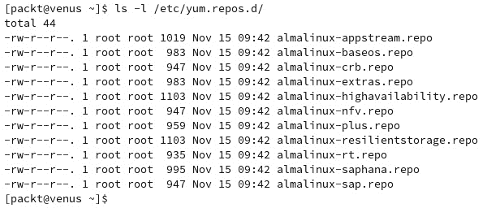

# 3

# Linux 软件管理

**软件管理**是 Linux 系统管理中的一个重要方面，因为作为系统管理员，你在某个层面上必须与软件包打交道。掌握如何处理软件包是你完成本章节后的一项重要技能。

在本章节中，你将学习如何使用特定的软件管理命令，并了解软件包的工作方式，这取决于你选择的发行版。你将学习如何在现代 Linux 发行版上使用最新的**Snap**和**Flatpak**包类型。

在本章节中，我们将覆盖以下主要内容：

+   Linux 软件包类型

+   软件包管理

+   在 Linux 中安装新的桌面环境

# 技术要求

本章节不需要特别的技术要求，只需在系统上安装一个正常工作的 Linux。**Ubuntu**、**Fedora**（或**AlmaLinux**）以及**openSUSE**都适用于本章节的练习，因为我们将涵盖所有类型的包管理器。

# Linux 软件包类型

正如你目前已经学到的，Linux 发行版包含一个内核和其上的应用程序。虽然默认情况下已经安装了许多应用程序，但确实会有需要安装新应用程序或删除不需要的应用程序的情况。

在 Linux 中，应用程序捆绑在**仓库**中。仓库是一个集中管理的地点，包含由开发者维护的软件包。这些包可能包含单独的应用程序或与操作系统相关的文件。每个 Linux 发行版都有几个官方仓库，但除了这些，你还可以添加一些新的仓库。添加仓库的方式特定于每个发行版，我们将在本章稍后的内容中详细介绍。

Linux 有几种类型的包可用。Ubuntu 使用`deb`包，因为它基于 Debian，而 Fedora（或 Rocky Linux 和 AlmaLinux）使用`rpm`包，因为它基于 RHEL。还有 openSUSE，它也使用`rpm`包，但最初基于 Slackware。除此之外，还有两种新型包类型最近被引入——由 Canonical 公司（Ubuntu 背后的公司）开发的 Snap 包，以及由 GNOME、Red Hat 和 Endless 等多个开发者和组织开发的 Flatpak 包。

## DEB 和 RPM 包类型

DEB 和 RPM 是最古老的包类型，分别用于 Ubuntu 和 Fedora。即使是前面提到的两种新包类型（snap 和 flatpak）开始在 Linux 桌面上得到应用，它们依然被广泛使用。

这两种包类型都符合**Linux 标准基础**（**LSB**）规范。LSB 的最后一个版本是 5.0，于 2015 年发布。你可以在[`refspecs.linuxfoundation.org/lsb.shtml#PACKAGEFMT`](https://refspecs.linuxfoundation.org/lsb.shtml#PACKAGEFMT)找到更多信息。

### DEB 包的结构

DEB 包在 1993 年随 Debian 发行版首次推出，并自那时起一直在每个 Debian 和 Ubuntu 衍生版中使用。`deb`包是一个二进制包。这意味着它包含了程序本身的文件，以及其依赖项和元信息文件，所有内容都包含在一个归档文件中。

要查看二进制`deb`包的内容，你可以使用`ar`命令。它在 Ubuntu 22.04.2 LTS 中默认没有安装，因此你需要使用以下命令自行安装：

```
$ sudo apt install binutils
```

好了——你已经在 Ubuntu 上安装了一个软件包！现在，一旦`ar`被安装，你就可以查看任何`deb`包的内容。为了这个练习，我们已经下载了一个名为**1password**的密码管理器的`deb`包并查看了它的内容。要查询该包，执行以下步骤：

1.  使用`wget`命令；文件将被下载到当前工作目录：

    ```
    ar t 1password-latest.deb command to view the contents of the binary package. The t option will display a table of contents for the archive:
    ```


图 3.1 – 使用 ar 命令查看 deb 文件的内容

如你所见，输出列出了四个文件，其中两个是归档文件。你也可以使用`ar`命令调查这个包。

1.  使用`ar x 1password-latest.deb`命令将包的内容提取到当前工作目录：

    ```
    ls command to list the contents of your directory. You will see that the four files have been extracted and are ready to inspect. The debian-binary file is a text file that contains the version of the package file format, which in our case is 2.0\. You can concatenate the file to verify your package with the help of the following command:

    ```

    control.tar.gz 存档包含元信息包和在安装过程中或之前和之后运行的脚本，具体取决于情况。data.tar.xz 存档包含将在安装过程中提取的程序可执行文件和库。你可以使用以下命令检查其内容：

    ```
    gpg signature file.
    ```

    ```

    ```

重要提示

`gpg`文件是一个使用 GNU Privacy Guard 加密的文件。它使用一种称为 OpenGPG（由 RFC4880 标准定义）的加密标准。它通常用于签署软件包文件，因为它为开发者提供了一种安全的方式来分发软件。有关此问题的更多信息，请阅读官方文档：[`www.openpgp.org/`](https://www.openpgp.org/)。

以下截图显示了这些命令的输出：


图 3.2 – deb 包的内容

每个包的元信息是一组文件，对于程序的运行至关重要。它们包含关于某些包的先决条件、所有依赖项、冲突和建议的信息。你可以使用与包装相关的命令自由探索包的所有组成部分。

现在我们知道了一个基于 Debian 的软件包由什么组成，接下来我们来看一下 Red Hat 软件包的组成部分。

### RPM 包的结构

**Red Hat 包管理器**（**RPM**）包是由 Red Hat 开发的，广泛应用于 Fedora、CentOS、RHEL、AlmaLinux、Rocky Linux、SUSE 和 openSUSE 等系统。RPM 二进制包类似于 DEB 二进制包，因为它们也以归档格式进行打包。

让我们测试一下 `1password` 的`rpm`包，就像我们在上一节中测试 `deb` 包一样：

1.  使用以下命令下载 `rpm` 包：

    ```
    # wget https://downloads.1password.com/linux/rpm/stable/x86_64/1password-latest.rpm
    ```

如果你想使用相同的`ar`命令，你会发现对于 `rpm` 包，归档工具无法识别该文件格式。不过，还有其他更强大的工具可以使用。

1.  我们将使用`rpm`命令，它是指定的低级包管理器，专门用于 rpm 包。我们将使用`-q`（查询）、`-p`（包名）和`-l`（列表）选项：

    ```
    # rpm -qpl 1password-latest.rpm
    ```

输出与 `deb` 包相反，将是与应用程序相关的所有文件的列表，以及它们在你系统中的安装位置。

1.  要查看包的元信息，运行带有`-q`、`-p`和`-i`（安装）选项的`rpm`命令。以下是该命令输出的一个简短摘录：


图 3.3 – rpm 包的元信息

输出将包含应用程序的名称、版本、发行版、架构、安装日期、分组、大小、许可证、签名、源 RPM、构建日期和主机、URL、重定位和摘要等信息。

1.  要查看该包在安装时需要哪些其他依赖项，可以运行相同的 `rpm` 命令，附加`-q`、`-p` 和 `--requires` 选项：

    ```
    $ rpm -qp --requires 1password-latest.rpm
    ```

输出如下所示的截图：


图 3.4 – 包要求

现在你已经了解了 Debian 和 Red Hat 包的概念以及它们包含的内容。DEB 和 RPM 包并不是 Linux 上唯一的包类型。它们可能是最常用和最广为人知的，但根据你选择的发行版，还有其他类型的包可用。此外，正如我们之前所提到的，现在有新的包类型可用于跨平台的 Linux 使用。这些新包被称为 flatpaks 和 snaps，我们将在接下来的章节中详细介绍它们。

## snap 和 flatpak 包类型

**Snap** 和 **Flatpak** 是相对较新的包类型，被认为是 Linux 上应用程序的未来。它们都在隔离的容器中构建和运行应用程序，以提高安全性和可移植性。两者都旨在克服桌面应用程序安装的便捷性和可移植性的需求。

即使主要的 Linux 发行版拥有庞大的应用程序库，分发适用于众多 Linux 发行版的软件（每个发行版都有自己的包类型）也可能成为**独立软件供应商**（**ISV**）或社区维护者的一个严重问题。在这种情况下，snap 和 flatpak 便应运而生，旨在减轻软件分发的负担。

假设我们是独立软件开发商（ISV），目标是在 Linux 上开发我们的产品。一旦我们的软件有了新版本，我们需要至少创建两种类型的包，以便直接从我们的网站下载 —— 一个用于 Debian/Ubuntu/Mint 及其他衍生版的 `.deb` 包，一个用于 Fedora/RHEL/SUSE 及其他衍生版的 `.rpm` 包。

但如果我们想要克服这个问题，并使我们的应用程序能够跨多个 Linux 发行版使用，我们可以将其作为 flatpak 或 snap 进行分发。flatpak 包将通过**Flathub**提供，这是一个集中式的 flatpak 仓库，而 snap 包将通过 Snap Store 提供，这是一个集中式的 snap 仓库。无论哪种方式，都同样适用于我们的目标，即以最小的资源消耗和集中化的努力将应用程序分发到所有主要的 Linux 发行版上。

重要说明

这两种包类型都在努力克服 Linux 生态系统中包管理的整体碎片化问题。然而，这两种包有着不同的哲学，尽管它们的目标是解决相同的问题。Snap 作为一种新型的包出现，旨在支持 Canonical 的 Ubuntu 在物联网和服务器版本中的使用，而 flatpak 则源自于需要为 Linux 桌面应用程序提供一个统一的包类型。因此，flatpaks 仅适用于 Linux 的桌面版本，而在服务器或物联网版本中并不提供。随着这两种包的发展，越来越多的发行版开始默认提供它们，其中 flatpak 在默认提供的发行版数量上领先。另一方面，snap 主要在官方 Ubuntu 版本中默认提供，从 23.04 版本开始。flatpaks 在 Fedora、openSUSE、Pop!_OS、Linux Mint、KDE neon 和其他发行版中默认提供。

从这种情况中我们可以得出的结论是，Linux 的软件分发工作量比 Windows 或 macOS 的相同应用程序的打包要大。希望未来会有一个通用的 Linux 软件分发包，这样对用户和开发者来说都会更加有利。

### snap 包的结构

snap 文件是一个**SquashFS**文件。这意味着它有自己的文件系统，封装在一个不可变的容器中。它有一个非常严格的环境，具有特定的隔离和限制规则。每个 snap 文件都有一个元信息目录，存储控制其行为的文件。

与 flatpaks 不同，snaps 不仅用于桌面应用程序，还广泛用于服务器和嵌入式应用程序。这是因为 Snap 起源于用于物联网和手机的 Ubuntu **Snappy**，这是 Canonical（Ubuntu 开发商）所推出的一个汇聚性努力的分发版本。

### flatpak 包的结构

Flatpak 基于一种名为 **OSTree** 的技术。该技术由 GNOME 和 Red Hat 的开发者启动，现在在 Fedora Silverblue 中以 **rpm-ostree** 形式广泛使用。这是一个旨在与现有包管理系统并行工作的 Linux 升级系统。它的灵感来源于 Git，因为它的工作方式相似。可以将其视为操作系统级的版本控制系统。它使用内容寻址的对象存储，允许共享分支，并为操作系统提供事务性升级、回滚和快照选项。

目前，该项目已经更名为 `btrfs` 文件系统。

Flatpak 使用 libostree，它类似于 rpm-ostree，但仅用于桌面应用程序容器，并不涉及引导加载器管理。Flatpak 使用基于另一个名为 **Bubblewrap** 的项目的沙箱技术，允许非特权用户访问用户命名空间并使用容器功能。

Snaps 和 flatpaks 都完全支持图形化安装，但也提供了通过命令行进行更简便的安装和设置命令。在接下来的章节中，我们将专注于所有包类型的命令操作。

# 管理软件包

每个发行版都有自己的 `rpm` 命令，而高级工具包括 `yum` 和 `dnf` 命令。对于 openSUSE，另一个主要的基于 RPM 的发行版，低级工具是相同的 `rpm` 命令，但在高级工具方面，则使用 `zypper` 命令。对于基于 DEB 的发行版，低级命令是 `dpkg`，高级命令是 `apt`（或现在已弃用的 `apt-get`）。

Linux 中低级包管理器和高级包管理器的区别是什么？低级包管理器负责处理任何包操作的后端，并能够解包包、运行脚本和安装应用。高级包管理器负责依赖关系解析、安装和下载包（及一组包）以及元数据搜索。

## 管理 DEB 包

通常，对于任何发行版，包管理由管理员或具有 root 权限的用户（`sudo`）来处理。包管理包括任何类型的包操作，例如安装、搜索、下载和删除。对于所有这些操作，都有特定的 Linux 命令，我们将在接下来的章节中向你展示如何使用它们。

### Ubuntu 和 Debian 的主要软件仓库

Ubuntu 的官方软件仓库包含约 60,000 个软件包，形式为二进制 `.deb` 包或 snap 包。系统仓库的配置存储在一个文件中，即 `/etc/apt/sources.list` 文件。Ubuntu 有四个主要的仓库，也称为包源，你可以在 `sources.list` 文件中看到它们的详细信息。这些仓库如下：

+   `Main`：包含由 Canonical 支持的自由和开源软件

+   `Universe`：包含由社区支持的自由和开源软件

+   `Restricted`：包含专有软件

+   `Multiverse`：包含受版权限制的软件

所有的仓库在`/etc/apt/sources.list`文件中默认启用。如果你想禁用其中的一些，可以根据需要编辑该文件。

在 Debian 中，仓库信息存储在相同的`/etc/apt/sources.list`文件中。唯一的区别是，它使用不同的名称来标识主软件包源，如下所示：

+   `main`：包含符合 Debian 自由软件准则的软件

+   `contrib`：可能符合或不符合自由软件准则，但不是主发行版的一部分的软件

+   `non-free`：非开源软件且不符合自由软件准则的软件

Debian 和 Ubuntu 的源文件非常相似，因为它们内部具有相同的信息结构。不同之处在于各自特定的包源部分。

两者都基于 Debian 的**高级包管理工具**（**APT**），因此我们将在接下来的章节中详细讲解。

### 与 APT 相关的命令

直到四年前，任何基于 Debian 的发行版都使用`apt-get`命令来实现软件包管理。从那时起，一个新的改进版命令`apt`诞生了（源自`apt-get`的缩写，因此提供了更集成的体验）。

在使用`apt`命令进行任何操作之前，你应该更新所有可用软件包的列表。你可以通过以下命令来完成此操作：

```
$ sudo apt update
```

前面命令的输出将显示是否有可用的更新。需要更新的软件包的数量会显示出来，并附有一个命令，若你想了解更多详情，可以执行该命令。

在继续之前，我们建议你使用`apt --help`命令，因为它会显示最常用的与 APT 相关的命令。输出如下截图所示：


图 3.5 – 最常用的 apt 命令

让我们更详细地了解其中的一些内容。

#### 安装和删除软件包

基本的系统管理任务包括安装和删除软件包。在本节中，我们将向你展示如何使用`apt`命令安装和删除软件包。

要安装一个新的软件包，你可以使用`apt install`命令。我们在本章开始时谈到 DEB 包的结构时使用了此命令。记得当时我们必须安装`ar`命令作为替代品来检查`.deb`包。那时我们使用的命令是：

```
$ sudo apt install binutils
```

该命令在系统上安装了几个软件包，其中包括我们需要的用于完成操作的那个。`apt`命令还会自动安装任何必需的依赖项。

要删除一个包，你可以使用`apt remove`或`apt purge`命令。前者会删除已安装的软件包及所有由`apt install`命令安装的依赖项。后者将卸载软件包，就像`apt remove`一样，但也会删除所有由应用程序创建的配置文件。

在下面的例子中，我们正在移除之前通过`apt`的`remove`命令安装的`binutils`应用：

```
$ sudo apt remove binutils
```

输出将显示不再需要的软件包列表，并将其从系统中删除，系统会要求你确认是否继续。这是一个非常好的安全措施，它允许你审查将要删除的文件。如果你确信操作无误，可以在命令末尾添加`-y`参数，这样系统会自动回答命令中的任何问题为*是*。

然而，使用`apt remove`并不会移除所有与已删除应用相关的配置文件。为了查看系统上仍然存在的文件，你可以使用`find`命令。例如，要查看与`binutils`包相关但没有被删除的文件，可以使用以下命令：

```
sudo find / -type d -name *binutils 2>/dev/null
```

输出将显示目录（因此命令中使用了`-type d`选项），这些目录中仍然包含在删除包后残留的与`binutils`相关的文件。

另一个用于删除软件包及其所有相关配置文件的工具是`apt purge`。如果你想使用`apt purge`命令来代替`apt remove`，可以按如下方式使用它：

```
$ sudo apt purge binutils
```

输出类似于`apt remove`命令，显示将被删除的软件包以及将释放多少磁盘空间，并要求你确认是否继续操作。

重要提示

如果你打算使用`apt purge`来移除相同的包（在我们这个例子中是`binutils`），你将需要重新安装它，因为它是通过`apt`的`remove`命令被移除的。

`apt remove`命令也有一个`purge`选项，其效果与`apt purge`命令相同。语法如下：

```
sudo apt remove --purge [packagename]
```

如前所述，使用`apt remove`命令时，一些配置文件会被保留下来，以防操作是意外的，用户想要恢复到之前的配置。没有被`remove`命令删除的文件是一些小的用户配置文件，可以轻松恢复。如果操作不是意外的，并且你仍然想删除所有文件，你仍然可以使用`apt purge`命令来完成这个任务，方法是使用与已删除软件包相同的名称。

#### 升级系统

时不时地，你需要进行系统升级，以确保你安装了所有最新的安全更新和补丁。在 Ubuntu 和 Debian 中，你始终需要使用两个不同的命令来完成这项任务。一个是 `apt update`，它将更新仓库列表，并确保获取所有可用的系统更新信息。另一个命令是 `apt upgrade`，它会升级包。你可以使用元字符将这两个命令一起执行：

```
$ sudo apt update; sudo apt upgrade
```

`update` 命令有时会显示哪些包不再需要，并给出类似以下的消息：

```
The following packages were automatically installed and are no longer required:
  libfprint-2-tod1 libllvm9
Use 'sudo apt autoremove' to remove them.
```

升级完成后，你可以使用 `sudo apt autoremove` 命令来删除不再需要的包。`autoremove` 命令的输出将显示哪些包将被删除，以及将释放多少磁盘空间，并会请求你批准继续操作。

假设在我们使用 Ubuntu 的过程中，发布了一个新的发行版，我们希望使用它，因为它包含了我们使用的软件的更新版本。通过命令行，我们可以进行一次完整的发行版升级。执行此操作的命令如下：

```
$ sudo apt dist-upgrade
```

同样，我们也可以使用以下命令：

```
$ sudo apt full-upgrade
```

升级到较新版本的发行版应该是一个无故障的过程，但这并不是始终能保证的。一切取决于你的自定义配置。无论情况如何，我们建议你在升级到新版本之前，先进行完整的系统备份。

#### 管理包信息

处理包时有时需要使用信息收集工具。仅仅安装和删除包是不够的。你需要搜索某些包以显示它们的详细信息，创建基于特定标准的列表，等等。

要搜索特定的包，你可以使用 `apt search` 命令。它会列出所有包，这些包的名称中包含搜索的字符串，也包括其他以不同方式使用该字符串的包。例如，我们来搜索 `nmap` 包：

```
$ sudo apt search nmap
```

输出将显示一个相当长的包列表，这些包以各种方式使用 `nmap` 字符串。你仍然需要上下滚动列表，找到你想要的包。为了获得更好的结果，你可以将输出通过管道传递给 `grep` 命令，但你会注意到一个警告，类似于下面截图所示：


图 3.6 – apt search 命令的输出

在警告之后，输出将显示一个包含 `nmap` 字符串的短包列表，其中有我们正在寻找的实际包，如 *图 3.5* 所示。

为了克服那个警告，你可以使用一个旧的命令 `apt-cache search`。执行此命令后，你将得到一个包的列表，但它的输出不会像 `apt` `search` 命令的输出那样详细：


图 3.7 – apt-cache 命令的输出

现在我们知道`nmap`包存在于 Ubuntu 的仓库中，我们可以通过使用`apt`的`show`命令显示更多详细信息，进一步研究它：

```
$ apt show nmap
```

输出将显示详细的描述，包括包的名称、版本、优先级、来源和部分、维护者、大小、依赖关系、建议的额外包、下载大小、APT 源和描述。

`apt`也有一个有用的`list`命令，可以根据某些条件列出包。例如，如果我们单独使用`apt list`命令，它将列出所有可用的包。但如果我们使用不同的选项，输出将是个性化的。

要显示已安装的包，我们可以使用`--` `installed`选项：

```
$ sudo apt list --installed
```

要列出所有的包，请使用以下命令：

```
$ sudo apt list
```

为了比较的目的，我们将把每个输出重定向到不同的文件中，然后比较这两个文件。由于列表相当大，这样做是更容易查看两个输出之间的差异。我们现在将运行以下特定命令：

```
$ sudo apt list --installed > list-installed
$ sudo apt list > list
```

你可以使用`ls -la`命令比较两个结果文件，并观察大小的差异。你会看到`list`文件的大小明显大于`list-installed`文件。

还有其他方式可以比较这两个输出，我们希望你能通过自己探索来发现它们，作为本小节的练习。随时使用任何其他与 APT 相关的命令，并练习它们，直到熟悉它们的用法。APT 是一个强大的工具，每个系统管理员都需要知道如何使用它来维持一个可用且维护良好的 Linux 系统。可用性与所使用的应用程序以及它们的系统级优化紧密相关。

## 管理 RPM 包

RPM 包是 Fedora、AlmaLinux、Rocky Linux、RHEL 和 openSUSE/SLES 等 Linux 发行版的等效包。它们有专门的高级工具，包括`dnf`、`yum`和`zypper`。低级工具是`rpm`命令。

在 RHEL 中，默认的包管理器是**Yellow Dog Updater, Modified**（**YUM**），它基于**Dandified YUM**（**DNF**），这是 Fedora 中的默认包管理器。如果你同时使用 Fedora 和 RHEL，为了方便起见，你可以只使用其中一个，因为它们是相同的命令。为了保持一致性，我们将在本章的所有示例中使用 YUM。

YUM 是默认的高级管理工具。它可以安装、删除、更新、查询包，并解决依赖关系。YUM 可以管理从仓库或本地`.rpm`包安装的包。

### Fedora/RHEL 基础发行版的主要仓库

仓库都由`/etc/yum.repos.d/`目录管理，配置文件位于`/etc/yum.conf`文件中。如果你列出`repos`目录，输出将类似于以下截图：



图 3.8 – RHEL 衍生版仓库

列出的所有这些文件包含关于仓库的关键信息，例如名称、镜像列表、`gpg`密钥的位置和启用状态。列出的所有都是官方仓库。

### 与 YUM 相关的命令

YUM 有许多命令和选项，但最常用的命令与软件包的安装、删除、搜索、信息查询、系统更新和仓库列出相关。

#### 安装和删除软件包

要从 AlmaLinux/Rocky Linux（或 Fedora）的仓库中安装软件包，只需运行`yum install`命令。在以下示例中，我们将从命令行安装 GIMP 应用程序：

```
$ sudo yum install gimp
```

如果你已经下载了一个软件包并希望安装它，可以使用`yum localinstall`命令。这里，我们已经下载了 1password 的`.rpm`包：

```
wget https://downloads.1password.com/linux/rpm/stable/x86_64/1password-latest.rpm
```

然后，我们使用以下命令安装它：

```
sudo yum localinstall 1password-latest.rpm
```

`localinstall`命令会自动解决所需的依赖关系，并显示每个依赖项的来源（仓库）。

这是一个非常强大的命令，在某些情况下，使用`rpm`命令本身几乎变得多余。`yum install`和`yum localinstall`命令的主要区别在于后者能够解决本地下载包的依赖问题。前者会在活动的仓库中查找包，而后者则会在当前工作目录中查找要安装的包。

要从系统中删除一个软件包，请使用`yum remove`命令。我们将删除刚刚安装的 1password 软件包：

```
sudo yum remove 1password.x86_64
```

系统会询问你是否要删除应用程序安装的所有软件包。根据需要选择并继续。

重要说明

在 Fedora 或 RHEL 衍生版的命令对话框中，按下*Enter*或*Return*键的默认操作是*N*（即否），而在 Ubuntu 中，默认操作是设置为*Y*（即是）。这是一个预防性的安全措施，需要你额外的注意和干预。

输出与安装命令的输出非常相似，会显示如果你继续执行命令，将移除哪些软件包和依赖项。

如你所见，使用`yum localinstall`命令安装的所有依赖项将通过`yum remove`命令被移除。如果系统提示你继续，输入`y`并继续操作。

#### 更新系统

要升级一个基于 Fedora/RHEL 的系统，可以使用`yum upgrade`命令。还有一个`yum update`命令，效果相同，通过更新已安装的软件包：

```
$ sudo yum upgrade
```

你可以使用`-y`选项自动回答命令的提问。

还有一个`upgrade-minimal`命令，它仅安装软件包的最新安全更新。

#### 管理软件包信息

使用 `yum` 管理文件与使用 `apt` 管理文件非常相似。有很多命令可以使用，我们将详细介绍其中一些——我们认为最常用的那些命令。要了解更多这些命令及其用法，可以运行 `yum --help`。

要查看 `yum` 命令历史和管理的包概览，请使用以下命令：

```
$ sudo yum history
```

这将输出每个运行的 `yum` 命令、修改的包的数量以及执行操作的时间和日期，如以下示例所示：


图 3.9 – 使用 yum history 命令

要显示有关某个包的详细信息，我们有 `yum info` 命令。我们将查询 `nmap` 包，类似于我们在 Ubuntu 中所做的。在 CentOS 中，命令如下：


图 3.10 – 使用 yum info 命令

输出将显示包的名称、版本、发布、源、仓库和描述，与我们在 `.deb` 包中看到的非常相似。

要列出所有已安装的包或所有包，我们可以使用 `yum` 的 `list` 命令：

```
# yum list
```

要只查看已安装的包，请运行以下命令：

```
# yum list installed
```

如果我们将每个命令的输出重定向到特定文件，然后比较这两个文件，我们将看到它们之间的差异，类似于我们在 Ubuntu 中所做的。输出显示包的名称，接着是版本和发布号，以及它被安装的仓库。以下是一个简短的摘录：


图 3.11 – yum list installed 命令摘录

由于我们已经介绍了 DEB 和 RPM 文件中最常用的命令，我们并没有涵盖 openSUSE 和 SUSE SLE 中特定的包管理器 **Zypper**。我们将快速展示一些命令，让你熟悉 Zypper，并尝试一下 openSUSE。

### 使用 Zypper

在 openSUSE 中，**Zypper** 是包管理器，类似于 Debian/Ubuntu 和 Fedora/RHEL 中的 APT 和 DNF。以下部分涵盖了一些有用的命令。

#### 安装和删除包

与使用 APT 和 DNF 类似，openSUSE 中的 Zypper 包管理器使用几乎相同的语法来安装和删除包。例如，我们将使用 `zypper` 命令安装 `nmap`。但首先，我们先在各自的仓库中搜索包名，看看它是否存在。我们将使用以下命令：

```
sudo zypper search nmap
```

此命令的输出是一个包含包名中有 `nmap` 字符串的包列表，后面跟着类型和摘要：


图 3.12 – 在 openSUSE 中使用 zypper search 命令

你会在列表的第一列看到`S`。它表示包的状态，如果该包已经安装，输出会有所不同。

从搜索输出中，我们可以看到 Nmap 应用程序的包名是`nmap`（它可能有不同的名称，这也是我们最初使用`search`命令的原因），因此我们将继续在系统上安装它。我们将使用`zypper install`命令来完成安装。

重要提示

在 openSUSE 中，你可以使用命令的简短版本。例如，可以使用`zypper in`代替`zypper install`，并跟上你要安装的包名。同样，`zypper update`可以用`zypper up`，`dist-upgrade`可以用`dup`，还可以将`zypper remove`简写为`zypper rm`。更多信息请查看手册页。

这里是安装`nmap`包的命令：

```
sudo zypper install nmap
```

另外，你可以使用以下命令：

```
sudo zypper in nmap
```

你可以在以下屏幕截图中看到输出：


图 3.13 – 使用 zypper in 命令

输出显示了将要安装的包。这里需要注意的是，Zypper 会自动处理依赖项，就像其他包管理器一样。除了`nmap`，还有两个库包准备安装。键入`y`继续安装，包将被安装。

现在，让我们再一次使用`zypper search nmap`命令，看看列表中关于`nmap`包的信息发生了什么变化：


图 3.14 – 使用 zypper search 检查 nmap 的状态

在输出中，你会看到列表的第一列在我们刚刚安装的`nmap`包前面有`i+`。这意味着该包及其依赖项已经安装。因此，如果你正在查找某个包并且它已经安装，你可以通过检查列表的第一列，也就是状态列，来判断。

现在，让我们移除我们已经安装过的相同包。我们将使用以下命令：

```
sudo zypper remove nmap
```

另外，我们可以使用以下命令：

```
sudo zypper rm nmap
```

输出显示在以下屏幕截图中：


图 3.15 – 使用 zypper remove 命令

这个命令的输出显示了将要被移除的包。如你所见，只有`nmap`包会被移除，其他一起安装的依赖包则不会被移除。要将它们与包一起移除，请在使用命令时加上`--clean-deps`参数。详情请参见下图：


图 3.16 – 移除依赖

现在你已经学会了如何使用`zypper`在 openSUSE 中安装和删除软件包，接下来让我们学习如何使用它来更新或升级整个系统。

#### 升级和更新系统

在更新系统之前，你可能想查看哪些更新是可用的。为此，你可以使用以下命令：

```
zypper list-updates
```

该命令的输出将显示系统上所有可用的更新。要安装更新，请使用以下命令：

```
sudo zypper update
```

另一种方法是以下命令：

```
sudo zypper up
```

如果你在没有参数的情况下使用这些命令，就像我们刚才展示的那样，所有可用的更新都会被安装。你也可以通过在`update`命令中包含软件包名称作为参数来更新单独的软件包。

在 openSUSE 中，一些有用的命令用于为软件包添加和管理锁定，以防我们不希望它被更新或删除。让我们使用相同的`nmap`软件包来学习如何操作。如果你像我们在上一节中所做的那样删除了它，请重新安装它。我们将添加一个锁，检查这个锁，然后移除这个锁。

要为软件包添加锁定，请使用`add-lock`或`zypper al`命令。要查看系统中已锁定的软件包，可以使用`zypper ll`命令（列出锁定）；要从软件包中移除锁定，可以使用`zypper rl`命令（移除锁定）：


图 3.17 – 使用 Zypper 为软件包添加和移除锁

现在，让我们再次锁定`nmap`软件包并尝试删除它。你会看到该软件包不会被删除。首先，会询问你应该如何操作才能删除它。详情请参见下图：


图 3.18 – 尝试删除一个被锁定的包

更新过程很简单，你还学会了如何在 Zypper 中使用锁定选项来保护不同的软件包。现在你知道如何更新你的 openSUSE 系统了，接下来我们将在下节中学习如何查找特定软件包的信息。

#### 管理软件包信息

如在使用 Ubuntu 和 Fedora 中的 APT 和 DNF 包管理器时所示，我们可以在 openSUSE 中使用 Zypper 获取软件包的信息。让我们使用与上一节相同的`nmap`软件包并获取更多关于它的信息。为此，我们将使用`zypper` `info`命令：

```
sudo zypper info nmap
```

如*图 3.19*所示，提供的信息与基于 Ubuntu 和 RHEL 的发行版类似。当我们卸载了`nmap`软件包时，输出中显示的信息会说明该软件包未安装。还有该软件包的更长描述，在下面的截图中没有包含：


图 3.19 – 使用 zypper info 命令

现在，让我们学习如何在 Linux 机器上管理 flatpaks 和 snaps。

## 使用 snap 和 flatpak 软件包

Snap 和 flatpak 是相对较新的包类型，广泛应用于各种 Linux 发行版。在本节中，我们将向你展示如何管理这些类型的包。对于 snap，我们将使用 Ubuntu 作为测试发行版，而对于 flatpak，我们将使用 Fedora，尽管只需做一点工作，这两种包类型也可以在任何一个发行版上运行。

### 在 Ubuntu 上管理 snap 包

Snap 在 Ubuntu 22.04.2 LTS 中默认安装。因此，你无需做任何事情来安装它。只需开始搜索你想要的包，并将其安装到系统中。我们将使用 Slack 应用程序来向你展示如何使用 snap 包。

#### 搜索 snap 包

Slack 可以在 Snap Store 中找到，因此你可以安装它。为了确认，可以使用 `snap find` 命令进行搜索，如下例所示：

```
$ snap find "slack"
```

在命令输出中，你会看到许多包含 `slack` 字符串或与 Slack 应用相关的包，但列表中只有第一个是我们要寻找的。

重要提示

在任何 Linux 发行版中，来自不同包的两个应用程序可以共存，且通过不同的包管理器进行安装。例如，Slack 可以通过网站提供的 `deb` 文件安装，也可以通过 Snap Store 安装。

如果输出显示该包可用，我们可以继续在系统上安装它。

#### 安装 snap 包

要安装 Slack 的 `snap` 包，我们可以使用 `snap` `install` 命令：


图 3.20 – 安装 Slack snap 包

接下来，让我们看看如何查看我们刚刚安装的 `snap` 包的更多信息。

#### Snap 包信息

如果你想了解更多关于该包的信息，可以使用 `snap` `info` 命令：

```
$ snap info slack
```

输出将显示与该包相关的信息，包括其名称、摘要、发布者、描述和 ID。显示的最后一项信息将是关于可用的 **渠道**，在我们 Slack 包的情况下如下所示：


图 3.21 – 显示 Slack 应用的 Snap 渠道

每个渠道包含有关特定版本的信息，知道选择哪个版本非常重要。默认情况下，`install` 命令会选择稳定版本，但如果你想选择不同的版本，可以在安装过程中使用 `--channel` 选项。在前面的示例中，我们使用了默认选项。

#### 显示已安装的 snap 包

如果你想查看系统上已安装的 snap 包列表，可以使用 `snap list` 命令。尽管我们只在系统上安装了 Slack，但在输出中，你会看到还有很多其他应用程序已经安装。其中一些，如 `core` 和 `snapd`，是从发行版安装时默认安装的，是系统所需的：


图 3.22 – `snap list` 命令的输出

现在，我们将学习如何更新一个 snap 包。

#### 更新一个 snap 包

Snaps 会自动更新。因此，你无需自己做任何事情。你能做的最少的就是检查是否有更新，并使用 `snap refresh` 命令加速安装，命令如下：

```
$ sudo snap refresh slack
```

更新后，如果你想回到之前使用的版本，可以使用 `snap revert` 命令，如以下示例所示：

```
$ sudo snap revert slack
```

在下一节中，我们将学习如何启用和禁用 snap 包。

#### 启用或禁用 snap 包

如果我们决定暂时不使用某个应用程序，可以使用 `snap disable` 命令禁用该应用。如果我们决定重新使用该应用，可以使用 `snap enable` 命令再次启用它：


图 3.23 – 启用和禁用 snap 应用程序

记得使用`sudo`来启用和禁用 snap 应用程序。如果禁用不是你想要的操作，你可以完全移除该 snap。

#### 移除 snap 包

在移除 snap 应用程序时，相关的配置文件、用户和数据也会被删除。你可以使用 `snap remove` 命令来执行此操作，如以下示例所示：

```
$ sudo snap remove slack
```

移除后，应用程序的内部用户、配置和系统数据将保存并保留 31 天。这些文件被称为快照，它们被归档并保存在 `/var/lib/snapd/snapshots` 目录下，包含以下类型的文件：一个 `.json` 文件，描述了该快照；一个 `.tgz` 文件，包含系统数据；以及特定的 `.tgz` 文件，包含每个系统的用户详细信息。以下是该目录的简短列出，展示了 Slack 的自动创建快照：


图 3.24 – 显示移除后的现有快照

如果你不想创建快照，可以在 `snap remove` 命令中使用 `--purge` 选项。对于使用大量数据的应用程序，这些快照可能会占用大量空间，并影响可用磁盘空间。要查看系统上保存的快照，可以使用 `snap saved` 命令：


图 3.25 – 显示已保存的快照

输出显示，在我们的案例中，列表中仅移除了一个应用程序，第一列显示的是快照的 ID (`set`)。如果你想删除一个快照，可以使用 `snap forget` 命令。我们可以使用以下命令删除 Slack 应用程序的快照：


图 3.26 – 使用 `snap forget` 命令删除快照

为了验证快照是否已被移除，我们再次使用了 `snap saved` 命令，如前面的图示所示。

Snaps 是多功能的包，使用起来非常方便。这种包类型是 Ubuntu 开发者的首选，但在其他发行版上并不常见。如果你想在 Ubuntu 以外的发行版上安装 snaps，可以参考 [`snapcraft.io/docs/installing-snapd`](https://snapcraft.io/docs/installing-snapd) 上的说明，测试它的全部功能。

现在，我们将测试另一个新兴的包：flatpaks。我们的测试发行版将是 Fedora，但请记住，flatpaks 也被 Ubuntu 系统的发行版（如 Linux Mint 和 elementary OS）以及基于 Debian 的发行版（如 PureOS 和 Endless OS）所支持。所有支持的 Linux 发行版的列表可以在 [flatpak.org](http://flatpak.org) 找到。

### 在 Fedora Linux 上管理 flatpak 包

由于 flatpak 仅作为桌面应用程序提供，我们将以 Fedora Linux Workstation 为使用案例。在这种情况下，你可以在服务器上使用 RHEL/AlmaLinux/Rocky Linux，但在工作站上使用 Fedora。

与 snaps 类似，flatpaks 是在沙盒中运行的独立应用程序。每个 flatpak 包含应用程序所需的运行时和库。flatpaks 完全支持图形用户界面管理工具，并提供一整套命令，可以通过 `flatpak` 使用，这个命令本身还有其他一些内建命令用于包管理。要查看所有命令，可以使用以下命令：

```
$ flatpak --help
```

在以下章节中，我们将详细介绍一些广泛使用的 flatpak 包管理命令。但在此之前，先简单说明一下 flatpak 应用程序的命名方式及它们在命令行中的显示方式，以避免在这方面产生混淆。

每个应用程序都有一个类似于 `com.company.App` 的标识符。每一部分都旨在方便地识别应用程序及其开发者。最后一部分标识应用程序的名称，而前一部分标识开发该应用程序的实体。这是开发者发布和交付多个应用程序的一种简便方式。

#### 添加 flatpak 仓库

如果你希望安装应用程序，必须设置仓库。flatpak 将仓库称为**远程仓库**，因此我们将使用这一术语来指代它们。

在我们的 Fedora 37 机器上，flatpak 已经安装，但我们需要添加 `flathub` 仓库。我们将通过 `flatpak remote-add` 命令来添加它，如以下示例所示：

```
$ sudo flatpak remote-add --if-not-exists flathub https://dl.flathub.org/repo/flathub.flatpakrepo
```

在这里，我们使用了 `--if-not-exists` 参数，如果仓库已存在，命令会停止执行，不会显示任何错误。仓库添加完成后，我们可以开始从中安装包，但必须先进行一次系统重启。

在 Fedora 37 及之前版本中，Flathub 仓库中的并非所有应用程序默认可用，但从版本 38 开始，开发者的目标是默认提供 Flathub 中的所有应用程序。让我们学习如何在 Fedora Workstation 上从 Flathub 安装应用程序。

#### 安装 flatpak 应用程序

要安装一个包，我们需要知道它的名称。我们可以访问 [`flathub.org/home`](https://flathub.org/home) 并在那里搜索应用程序。我们将在网站上搜索一款名为 **Open Broadcaster Software** (**OBS**) 的软件，并按照提供的说明操作。我们可以点击右上角的 **Install** 按钮，也可以使用网页下半部分的命令。我们将使用以下命令：

```
$ sudo flatpak install flathub com.obsproject.Studio
```

在 flatpak 的最新版本（自版本 1.2 起）中，安装可以通过更简单的命令进行。在这种情况下，你只需要应用程序的名称，如下所示：

```
$ sudo flatpak install slack
```

结果与之前展示的第一个 `install` 命令相同。

#### 管理 flatpak 应用程序

安装应用程序后，你可以通过以下命令在命令行中运行它：

```
$ flatpak run com.obsproject.Studio
```

如果你想更新所有应用程序和运行时，可以使用以下命令：

```
$ sudo flatpak update
```

要卸载一个 flatpak 包，只需运行 `flatpak` `uninstall` 命令：

```
$ sudo flatpak uninstall com.obsproject.Studio
```

要列出所有已安装的 flatpak 应用程序和运行时，可以使用 `flatpak` `list` 命令：


图 3.27 – flatpak list 命令的输出

要只查看已安装的应用程序，可以使用 `--``app` 参数：

```
$ flatpak list --app
```

这里显示的命令是 flatpak 包管理中最常用的命令。不用说，实际上还有许多其他命令，我们在这里不会一一覆盖，但你可以自由查阅并在系统上测试它们。要快速了解基本的 flatpak 命令，你可以参考以下链接：[`docs.flatpak.org/en/latest/flatpak-command-reference.html`](https://docs.flatpak.org/en/latest/flatpak-command-reference.html)。

Flatpak 非常灵活，能够提供较新版本的应用程序。假设你想使用一个稳定的基础操作系统，但这样做的缺点是你默认获得的基础应用程序版本较旧。使用 flatpak 可以解决这个问题，让你访问较新版本的应用程序。随时浏览 Flathub 上的应用程序，并测试你认为有趣和有用的应用。

现在你已经知道如何通过命令行或图形用户界面在操作系统上安装新应用程序。除此之外，你还可以安装新的桌面环境。我们将在接下来的章节中展示如何操作。

# 在 Linux 中安装新的桌面环境

我们将继续以 Fedora 为例，但这里展示的命令同样适用于任何基于 RHEL 的发行版，如 AlmaLinux 或 Rocky Linux。

默认情况下，Fedora Workstation 使用 GNOME 作为桌面环境，但如果你想使用另一个桌面环境，比如 KDE，该怎么做呢？在展示如何操作之前，我们先为你提供一些关于 Linux 上可用的图形桌面环境的信息。

Linux 的核心在于选择，而在**桌面环境**（**DEs**）方面这一点尤为真实。Linux 上有许多种桌面环境可供选择，比如 GNOME、KDE、Xfce、LXDE、LXQT、Pantheon 等。最广泛使用的桌面环境是 GNOME、KDE 和 Xfce，其中前两者拥有最大社区。如果你想使用最新的 GNOME，你可以尝试像 Fedora、带有 GNOME 的 openSUSE Tumbleweed，或者 Arch Linux（或 Manjaro）这样的发行版。如果你想使用最佳的 KDE，可以尝试 KDE neon、带有 KDE 的 openSUSE Tumbleweed，或带有 KDE 的 Arch Linux（或 Manjaro）。对于 Xfce，你可以尝试 MX Linux（基于 Debian），它默认使用 Xfce，或者使用带有 Xfce 的 openSUSE。通常，最广泛使用的 Linux 发行版提供了不同桌面环境的变种，也叫做*flavors*（比如 Ubuntu）或*spins*（比如 Fedora）。RHEL 和 SUSE 的商业版本默认仅提供 GNOME。有关此处描述的桌面环境的更多信息，请参考以下网站：

+   要了解 KDE，请访问 [www.kde.org](http://www.kde.org)

+   要了解 GNOME，请访问 [www.gnome.org](http://www.gnome.org)

+   要了解 Xfce，请访问 [www.xfce.org](http://www.xfce.org)

现在，让我们学习如何在默认的 Fedora Workstation 上安装一个不同的桌面环境。

## 在 Fedora Linux 上安装 KDE Plasma

在 Fedora 及其衍生发行版（以及 openSUSE）中，有一些应用程序组，这些组简化了安装大型应用及其依赖项的过程。当你计划安装多个应用作为一个更大*组*（就像一个桌面环境一样）时，这将非常有用。

要安装一个组，可以使用`dnf install`命令，并通过`@`符号和组名来调用该组。或者，你可以使用`dnf groupinstall`命令，并在引号内使用组名。

要查看 Fedora 仓库中可用的组，可以使用以下命令：

```
$ dnf group list --all | grep "KDE"
```

输出将是一个来自 Fedora 仓库的组列表，里面会包含**KDE Plasma 工作区**。要安装它，可以使用以下命令：

```
$ sudo dnf groupinstall "KDE Plasma Workspaces"
```

另外，你可以使用以下命令：

```
$ sudo dnf install @kde-desktop-environment
```

此命令将安装新的 KDE Plasma 环境，如下图所示：


图 3.28 – 安装 KDE Plasma 桌面环境

安装过程可能会花费一些时间，具体取决于你的网络连接速度。要开始使用 KDE Plasma 作为你的桌面环境，你需要退出当前会话。在登录屏幕上，选择你的用户，然后在右下角点击齿轮图标，在选项出现时选择**Plasma**。你将有两个选项，一个是**Wayland**，另一个是**X11**显示管理器：


图 3.29 – 在登录屏幕上选择 Plasma（Wayland）

Wayland 是较新的选项，可能在 KDE 中的支持不如在 GNOME 中的支持。你可以根据自己的偏好来选择。

现在，你可以登录到 Fedora Workstation 上的 KDE Plasma。以下截图显示了 KDE Plasma 中的**信息中心**应用程序，其中包含已安装版本和硬件的详细信息：


图 3.30 – Fedora 37 上 KDE Plasma 的信息中心

这样，你已经了解了如何在 Linux 中使用包管理工具，甚至如何安装新的桌面环境（DE）。这些知识足以让你开始在新的操作系统中进行一些探索。你可以安装新的应用程序，配置它们，并将你的发行版设置成你想要的样子。

# 总结

在本章中，你学习了如何在 Ubuntu、Fedora/AlmaLinux 和 openSUSE 中使用包管理工具，所学的技能将帮助你在任何 Linux 发行版中管理包。你学会了如何处理 `.deb` 和 `.rpm` 包，还学习了新的包管理方式，如 flatpaks 和 snaps。你在这里学到的技能将在本书的每一章中帮助你，甚至在你作为系统管理员的日常工作中，或者在闲暇时间享受 Linux 操作系统时，也会派上用场。

在下一章，我们将向你展示如何管理用户账户和权限，在那里你将了解一般概念和具体工具。

# 问题

现在你已经清楚了如何管理软件包，下面是一些练习，帮助你进一步巩固所学知识：

1.  列出你系统中安装的所有包。

`apt list --installed` 命令。

1.  在 Ubuntu 系统上添加对 flatpak 的支持。

**提示**：请参考 [flatpak.org](http://flatpak.org) 上的文档。

1.  测试其他发行版并使用它们的包管理工具。我们推荐你尝试 openSUSE，如果你感觉有信心，可以试试 Arch Linux。

# 深入阅读

关于本章内容的更多信息，请参考以下资源：

+   *Linux 管理精通 – 第一版*，Alexandru Calcatinge，Julian Balog

+   Snapcraft.io 官方文档：[`snapcraft.io/docs`](https://snapcraft.io/docs)

+   Flatpak 文档：[`docs.flatpak.org/en/latest/`](https://docs.flatpak.org/en/latest/)

+   openSUSE 官方文档：[`doc.opensuse.org/`](https://doc.opensuse.org/)
