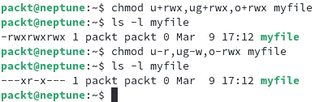

# 第四章：管理用户和用户组

Linux 是一个多用户、多任务的操作系统，这意味着多个用户可以同时访问操作系统，并共享平台资源，内核为每个用户并发独立地执行任务。Linux 提供了所需的隔离和安全机制，以防止多个用户访问或删除彼此的文件。

当多个用户访问系统时，权限将发挥作用。我们将学习如何使用 `root` 帐户，完全访问操作系统资源。

在这个过程中，我们将采取实践操作的方法来加深对关键概念的理解，通过实际示例进一步巩固所学内容。本章涵盖以下主题：

+   管理用户

+   管理用户组

+   管理权限

我们希望在本章结束时，你能熟练使用命令行工具来创建、修改和删除用户和用户组，同时熟练处理文件和目录权限。

让我们快速看一下本章的技术要求。

# 技术要求

你需要在 **虚拟机**（**VM**）或桌面平台上安装一个工作的 Linux 发行版。如果你还没有安装，可以参考 *第一章*，*安装 Linux*，它将引导你完成相关的过程。在本章中，我们将使用 Ubuntu 或 Fedora，但大部分命令和示例也适用于其他任何 Linux 平台。

# 管理用户

在这个上下文中，**用户**是指任何使用计算机或系统资源的人。最简单的形式下，Linux *用户* 或 *用户帐户* 是通过一个名称和一个 **唯一标识符**（即 **UID**）来识别的。

从纯粹的技术角度来看，Linux 中有以下几种类型的用户：

+   **普通（或常规）用户**：通用的日常用户帐户，主要适用于个人使用和常见应用程序及文件管理任务，访问系统范围资源的权限有限。常规用户帐户通常具有 *登录* shell 和 *主目录*。

+   `root` 权限。因此，通过 web 服务器暴露的潜在漏洞将严格局限于相关系统帐户的操作范围。

+   `root` 用户是超级用户的一个例子。

在 Linux 中，只有 `root` 用户或具有 `sudo` 权限的用户（**sudoers**）才能创建、修改或删除用户帐户。

## 理解 sudo

`root` 用户是 Linux 中的默认超级用户帐户，具有在系统上执行任何操作的能力。理想情况下，由于安全和保护原因，应该尽量避免以 `root` 身份在系统上操作。通过 `sudo`，Linux 提供了一种将普通用户帐户提升为超级用户权限的机制，并增加了安全层级。通过这种方式，通常使用 `sudo` 用户，而不是 `root` 用户。

`sudo` 是一个命令行工具，允许被授权的用户以超级用户或其他用户（取决于本地系统的安全策略）的权限执行命令。`sudo` 最初代表 *superuser do*，因为最初它仅作为超级用户使用，但后来扩展为支持不仅是超级用户，还有其他（受限）用户的身份模拟。因此，它也被称为 *substitute user do*。然而，由于它在 Linux 管理任务中的频繁使用，它通常仍然被看作是 *superuser do*。

大多数用于管理 Linux 用户的命令行工具需要 `sudo` 权限，除非相关任务是由 `root` 用户执行。如果我们想避免使用 root 上下文，在我们拥有超级用户权限的用户帐户之前，不能真正继续本章的其余内容——特别是创建用户。因此，让我们先解决这个“先有鸡还是先有蛋”的问题。

大多数 Linux 发行版在安装过程中除了 `root` 用户外，还会创建一个具有超级用户权限的附加用户帐户。如前所述，这是为了在进行高级操作时提供额外的安全保护。检查用户帐户是否具有 `sudo` 权限的最简单方法是，在终端中以相关用户帐户登录时运行以下命令：

```
sudo -v
```

根据 `sudo` 手册（`man sudo`），`-v` 选项会使 `sudo` 更新用户的缓存凭证，并在缓存凭证过期时重新认证用户。

如果用户（例如，`julian`）在本地机器上没有超级用户权限（例如，`neptune`），前面的命令将产生如下错误（或类似错误）：

```
Sorry, user sudo command usually grants elevated permissions for a limited time. Ubuntu, for example, has a 15-minute sudo elevation span, after which time a sudo user would need to authenticate again. Subsequent invocations of sudo may not prompt for a password if done within the sudo cache credential timeout.
If we don’t have a default superuser account, we can always use the root context to create new users (see the next chapter) and elevate them to **sudoer** privileges. We’ll learn more about this in the *Creating a superuser* section, later in this chapter.
Now, let’s have a look at how to create, modify, and delete users.
Creating, modifying, and deleting users
In this section, we explore a few command-line tools and some common tasks for managing users. The example commands and procedures are shown for Ubuntu and Fedora, but the same principles apply to any other Linux distribution. Some user management `useradd` is not available on Alpine Linux, and `adduser` should be used instead). Please check the documentation of the Linux distribution of your choice for the equivalent commands.
Creating users
To create users, we can use either the `useradd` or the `adduser` command, although on some Linux distributions (for example, Debian or Ubuntu), the recommended way is to use the `adduser` command in favor of the low-level `useradd` utility. We’ll cover both in this section.
`adduser` is a Perl script using `useradd`—basically, a shim of the `useradd` command—with a user-friendly guided configuration. Both command-line tools are installed by default in Ubuntu and Fedora. Let’s take a brief look at each of these commands.
Creating users with useradd
The syntax for the `useradd` command is shown here:

```

useradd [OPTIONS] USER

```

 In its simplest invocation, the following command creates a user account (`julian`):

```

sudo useradd julian

```

 The user information is stored in a `/etc/passwd` file. Here’s the related user data for `julian`:

```

sudo cat /etc/passwd | grep julian

```

 In our case, this is the output:


Figure 4.1 – The user record created with useradd
Let’s analyze the related user record. Each entry is delimited by a colon (`:`) and is listed here:

*   `julian`: Username
*   `x`: Encrypted password (password hash is stored in `/etc/shadow`)
*   `1001`: The UID
*   `1001`: The user **group** **ID** (**GID**)
*   `::` The **General Electric Comprehensive Operating Supervisor** (**GECOS**) field—for example, display name (in our case, empty), explained later in this section
*   `/home/julian`: User home folder
*   `/bin/sh`: Default login shell for the user

Important note
The GECOS field is a string of comma-delimited attributes, reflecting general information about the user account (for example, real name, company, and phone number). In Linux, the GECOS field is the fifth field in a user record. See more information at [`en.wikipedia.org/wiki/Gecos_field`](https://en.wikipedia.org/wiki/Gecos_field).
We can also use the `getent` command to retrieve the preceding user information, as follows:

```

getent passwd julian

```

 To view the UID (`uid`), GID (`gid`), and group membership associated with a user, we can use the `id` command, as follows:

```

id julian

```

 This command gives us the following output:


Figure 4.2 – The UID information
With the simple invocation of `useradd`, the command creates the user (`julian`) with some immediate default values (as enumerated), while other user-related data is empty—for example, we have no full name or password specified for the user yet. Also, while the home directory has a default value (for example, `/home/julian`), the actual filesystem folder will not be created unless the `useradd` command is invoked with the `-m` or the `--create-home` option, as follows:

```

sudo useradd -m julian

```

 Without a home directory, regular users would not have the ability to save their files in a private location on the system. On the other hand, some system accounts may not need a home directory since they don’t have a login shell. For example, a database server (for example, PostgreSQL) may run with a non-root system account (for example, `postgres`) that only needs access to database resources in specific locations (for example, `/var/lib/pgsql`), controlled via other permission mechanisms (for example, **Security-Enhanced** **Linux** (**SELinux**)).
For our regular user, if we also wanted to specify a full name (display name), the command would change to this:

```

sudo useradd -m -c "Julian" julian

```

 The `-c, --comment` option parameter of `useradd` expects a *comment*, also known as the GECOS field (the fifth field in our user record), with multiple comma-separated values. In our case, we specify the full name (for example, `Julian`). For more information, check out the `useradd` manual (`man useradd`) or `useradd --help`.
The user still won’t have a password yet, and consequently, there would be no way for them to log in (for example, via a `julian`, we invoke the `passwd` command, like this:

```

sudo passwd julian

```

 You can see the following output:


Figure 4.3 – Creating or changing the user password
The `passwd` command will prompt for the new user’s password. With the password set, there will be a new entry added to the `/etc/shadow` file. This file stores the secure password hashes (not the passwords!) for each user. Only superusers can access the content of this file. Here’s the command to retrieve the related information for the user `julian`:

```

sudo getent shadow julian

```

 You can also use the following command:

```

sudo cat /etc/shadow | grep julian

```

 The output of both commands is shown in the following screenshot:


Figure 4.4 – Information about the user from the shadow file
Once the password has been set, in normal circumstances, the user can log in to the system (via SSH or GUI). If the Linux distribution has a GUI, the new user will show up on the login screen.
As noted, with the `useradd` command, we have low-level granular control over how we create user accounts, but sometimes we may prefer a more user-friendly approach. Enter the `adduser` command.
Creating users with adduser
The `adduser` command is a Perl wrapper for `useradd`. The syntax for this command is shown here:

```

adduser [OPTIONS] USER

```

 `sudo` may prompt for the superuser password. `adduser` will prompt for the new user’s password and other user-related information (as shown in *Figure 4**.5*).
Let’s create a new user account (`alex`) with `adduser`, as follows:

```

sudo adduser alex

```

 The preceding command yields the following output:


Figure 4.5 – The adduser command
In Fedora, the preceding invocation of the `adduser` command will simply run without prompting the user for a password or any other information.
We can see the related user entry in `/etc/passwd` with `getent`, as follows:

```

getent passwd alex

```

 The following is the output:


Figure 4.6 – Viewing user information with getent
In the preceding examples, we created a regular user account. Administrators or superusers can also elevate the privileges of a regular user to a superuser. Let’s see how in the following section.
Creating a superuser
When a regular user is given the power to run `sudo`, they become a superuser. Let’s assume we have a regular user created via any of the examples shown in the *Creating* *users* section.
Promoting the user to a superuser (or *sudoer*) requires a `sudo` group membership. In Linux, the `sudo` group is a reserved system group for users with elevated or `root` privileges. To make the user `julian` a sudoer, we simply need to add the user to the `sudo` group, like this (in Ubuntu):

```

sudo usermod -aG sudo julian

```

 The `-aG` options of `usermod` instruct the command to append (`-a, --append`) the user to the specified group (`-G, --group`)—in our case, `sudo`.
To verify our user is now a sudoer, first make sure the related user information reflects the `sudo` membership by running the following command:

```

id julian

```

 This gives us the following output:


Figure 4.7 – Looking for the sudo membership of a user
The output shows that the `sudo` group membership (GID) in the `groups` tag is `27(sudo)`.
To verify the `sudo` access for the user `julian`, run the following command:

```

su - julian

```

 The preceding command prompts for the password of the user `julian`. A successful login would usually validate the superuser context. Alternatively, the user (`julian`) can run the `sudo -v` command in their terminal session to validate the `sudo` privileges. For more information on superuser privileges, see the *Understanding sudo* section earlier in the chapter.
With multiple users created, a system administrator may want to view or list all the users in the system. In the next section, we provide a few ways to accomplish this task.
Viewing users
There are a few ways for a superuser to view all users configured in the system. As previously noted, the user information is stored in the `/etc/passwd` and `/etc/shadow` files. Besides simply viewing these files, we can parse them and extract only the usernames with the following command:

```

cat /etc/passwd | cut -d: -f1 | less

```

 Alternatively, we can parse the `/etc/shadow` file, like this:

```

sudo cat /etc/shadow | cut -d: -f1 | less

```

 In the preceding commands, we read the content from the related files (with `cat`). Next, we piped the result to a delimiter-based parsing (with `cut`, on the `:` delimiter) and picked the first field `(-f1`). Finally, we chose a paginated display of the results, using the `less` command (to exit the command’s output, press *Q*).
Note the use of `sudo` for the `shadow` file since access is limited to superusers only, due to the sensitive nature of the password hash data. Alternatively, we can use the `getent` command to retrieve the user information.
The following command lists all the users configured in the system:

```

getent passwd

```

 The preceding command reads the `/etc/passwd` file. Alternatively, we can retrieve the same information from `/etc/shadow`, as follows:

```

sudo getent shadow

```

 For both commands, we can further pipe the `getent` output to `| cut -d: -f1` to list only the usernames, like this:

```

sudo getent shadow | cut -d: -f1 | less | column

```

 The output will be similar to this:


Figure 4.8 – Viewing usernames
With new users created, administrators or superusers may want to change certain user-related information, such as password, password expiration, full name, or login shell. Next, we take a look at some of the most common ways to accomplish this task.
Modifying users
A superuser can run the `usermod` command to modify user settings, with the following syntax:

```

usermod [OPTIONS] USER

```

 The examples in this section apply to a user we previously created (`julian`) with the simplest invocation of the `useradd` command. As noted in the previous section, the related user record in `/etc/passwd` has no full name for the user, and the user has no password either.
Let’s change the following settings for our user (`julian`):

*   `Julian` (initially empty)
*   `/local/julian` (from default `/home/julian`)
*   `/bin/bash` (from default `/bin/sh`)

The command-line utility for changing all the preceding information is shown here:

```

sudo usermod -c "Julian" -d /local/julian -m -s /bin/bash julian

```

 Here are the command options, briefly explained:

*   `-c, --comment "Julian"`: The full username
*   `-d, --home local/julian`: The user’s new home directory
*   `-m, --move`: Move the content of the current home directory to the new location
*   `-s, --shell /bin/sh`: The user login shell

The related change, retrieved with the `getent` command, is shown here:

```

getent passwd julian

```

 We get the following output:


Figure 4.9 – The user changes reflected with getent
Here are a few more examples of changing user settings with the `usermod` command-line utility.
Changing the username
The `-l, --login` option parameter of `usermod` specifies a new login username. The following command changes the username from `julian` to `balog` (that is, first name to last name), as illustrated here:

```

sudo usermod -l "balog" julian

```

 In a production environment, we may have to add to the preceding command, as we may also want to change the display name and the home directory of the user (for consistency reasons). In a previous example in the *Creating users with useradd* section, we showcased the `-d, --home` and `-m, --move` option parameters, which would accommodate such changes.
Locking or unlocking a user
A superuser or administrator may choose to temporarily or permanently lock a specific user with the `-L, --lock` option parameter of `usermod`, as follows:

```

sudo usermod -L julian

```

 As a result of the preceding command, the login attempt for the user `julian` would be denied. Should the user try to SSH into the Linux machine, they would get a **Permission denied, please try again** error message. Also, the related username will be removed from the login screen if the Linux platform has a GUI.
To unlock the user, we invoke the `-U, --unlock` option parameter, as follows:

```

sudo usermod -U julian

```

 The preceding command restores system access for the user.
For more information on the `usermod` utility, please check out the related documentation (`man usermod`) or the command-line help (`usermod --help`).
Although the recommended way of modifying user settings is via the `usermod` command-line utility, some users may find it easier to manually edit the `/etc/passwd` file. The following section shows you how.
Modifying users via /etc/passwd
A superuser can also manually edit the `/etc/passwd` file to modify user data by updating the relevant line. Although the editing can be done with a text editor of your choice (for example, `nano`), we recommend the use of the `vipw` command-line utility for a safer approach. `vipw` enables the required locks to prevent possible data corruption—for example, in case a superuser performs a change at the same time regular users change their password.
The following command initiates the editing of the `/etc/passwd` file by also prompting for the preferred text editor (for example, `nano` or `vim`):

```

sudo vipw

```

 For example, we can change the settings for user `julian` by editing the following line:

```

julian:x:1001:1001:Julian,,,:/home/julian:/bin/bash

```

 The meaning of the colon (`:`)-separated fields was previously described in the *Creating users with useradd* section. Each of these fields can be manually altered in the `/etc/passwd` file, resulting in changes equivalent to the corresponding `usermod` invocation.
For more information on the `vipw` command-line utility, you can refer to the related system manual (`man vipw`).
Another relatively common administrative task for a user account is to change a password or set up a password expiration. Although `usermod` can change a user password via the `-p` or `--password` option, it requires an encrypted hash string (and not a cleartext password). Generating an encrypted password hash would be an extra step. An easier way is to use the `passwd` utility to change the password.
A superuser (administrator) can change the password of a user (for example, the user `julian`) with the following command:

```

sudo passwd julian

```

 The output will ask for the new password for the respective user. To change the expiration time of a password (the password age), the `chage` command is used. For example, to set a 30-day password age for the user `julian`, we will use the following command:

```

sudo chage -M 30 julian

```

 This will force the user `julian` to change their password every month. The password time availability is defined system-wide by the password policy. It is found inside the `/etc/login.defs` file, inside the `julian` as our example again):

```

sudo chage -d 0 julian

```

 This command will force the user `julian` to enter their own password the first time they log in to the system.
Sometimes, administrators are required to remove specific users from the system. The next section shows a couple of ways of accomplishing this task.
Deleting users
The most common way to remove users from the system is to use the `userdel` command-line tool. The general syntax of the `userdel` command is shown here:

```

userdel [OPTIONS] USER

```

 For example, to remove the user `julian`, a superuser would run the following command:

```

sudo userdel -f -r julian

```

 Here are the command options used:

*   `-f, --force`: Removes all files in the user’s home directory, even if not owned by the user
*   `-r, --remove`: Removes the user’s home directory and mail spool

The `userdel` command removes the related user data from the system, including the user’s home directory (when invoked with the `-f` or `--force` option) and the related entries in the `/etc/passwd` and `/``etc/shadow` files.
There is also an alternative way, which could be handy in some odd cleanup scenarios. The next section shows how.
Deleting users via /etc/passwd and /etc/shadow
A superuser can edit the `/etc/passwd` and `/etc/shadow` files and manually remove the corresponding lines for the user (for example, `julian`). Please note that both files have to be edited for consistency and complete removal of the related user account.
Edit the `/etc/passwd` file using the `vipw` command-line utility, as follows:

```

sudo vipw

```

 Remove the following line (for the user `julian`):

```

julian:x:1001:1001:Julian,,,:/home/julian:/bin/bash

```

 Next, edit the `/etc/shadow` file using the `-s` or `--shadow` option with `vipw`, as follows:

```

sudo vipw -s

```

 Remove the following line (for the user `julian`):

```

julian:$6$xDdd7Eay/RKYjeTm$Sf.../:18519:0:99999:7:::

```

 After editing the preceding files, a superuser may also need to remove the deleted user’s home directory, as follows:

```

sudo rm -rf /home/julian

```

 For more information on the `userdel` utility, please check out the related documentation (`man userdel`) or the command-line help (`userdel --help`).
The user management concepts and commands learned so far apply exclusively to individual users in the system. When multiple users in the system have a common access level or permission attribute, they are collectively referred to as a group. Groups can be regarded as standalone organizational units we can create, modify, or delete. We can also define and alter user memberships associated with groups. The next section focuses on group management internals.
Managing groups
Linux uses groups to organize users. Simply put, a group is a collection of users sharing a common attribute. Examples of such groups could be *employees*, *developers*, *managers*, and so on. In Linux, a group is uniquely identified by a GID. Users within the same group share the same GID.
From a user’s perspective, there are two types of groups, outlined here:

*   **Primary group**: The user’s initial (default) login group
*   **Supplementary groups**: A list of groups the user is also a member of; also known as **secondary groups**

Every Linux user is a member of a primary group. A user can belong to multiple supplementary groups or no supplementary groups at all. In other words, there is one mandatory primary group associated with each Linux user, and a user can have multiple or no supplementary group memberships.
From a practical point of view, we can look at groups as a permissive context of collaboration for a select number of users. Imagine a *developers* group having access to developer-specific resources. Each user in this group has access to these resources. Users outside the *developers* group may not have access unless they authenticate with a group password if the group has one.
In the following section, we provide detailed examples of how to manage groups and set up group memberships for users. Most related commands require *superuser* or `sudo` privileges.
Creating, modifying, and deleting groups
While our primary focus remains on group administrative tasks, some related operations still involve user-related commands. Command-line utilities such as `groupadd`, `groupmod`, and `groupdel` are targeted strictly at creating, modifying, and deleting groups, respectively. On the other hand, the `useradd` and `usermod` commands carry group-specific options when associating users with groups. We’ll also introduce you to `gpasswd`, a command-line tool specializing in group administration, combining user- and group-related operations.
With this aspect in mind, let’s take a look at how to create, modify, and delete groups and how to manipulate group memberships for users.
Creating groups
To create a new group, a superuser invokes the `groupadd` command-line utility. Here’s the basic syntax of the related command:

```

groupadd [OPTIONS] GROUP

```

 Let’s create a new group (`developers`), with default settings, as follows:

```

sudo groupadd developers

```

 The group information is stored in the `/etc/group` file. Here’s the related data for the `developers` group:

```

cat /etc/group | grep developers

```

 The command yields the following output:


Figure 4.10 – The group with default attributes
Let’s analyze the related group record. Each entry is delimited by a colon (`:`) and is listed here:

*   `developers`: Group name
*   `x`: Encrypted password (password hash is stored in `/etc/gshadow`)
*   `1003`: GID

We can also use the `getent` command to retrieve the preceding group information, as follows:

```

getent group developers

```

 A superuser may choose to create a group with a specific GID, using the `-g, --gid` option parameter with `groupadd`. For example, the following command creates the `developers` group (if it doesn’t exist) with a GID of `1200`:

```

sudo groupadd -g 1200 developers

```

 For more information on the `groupadd` command-line utility, please refer to the related documentation (`man groupadd`).
Group-related data is stored in the `/etc/group` and `/etc/gshadow` files. The `/etc/group` file contains generic group membership information, while the `/etc/gshadow` file stores the encrypted password hashes for each group. Let’s take a brief look at group passwords.
Understanding group passwords
By default, a group doesn’t have a password when created with the simplest invocation of the `groupadd` command (for example, `groupadd developers`). Although `groupadd` supports an encrypted password (via the `-p, --password` option parameter), this would require an extra step to generate a secure password hash. There’s a better and simpler way to create a group password: by using the `gpasswd` command-line utility.
Important note
`gpasswd` is a command-line tool that helps with everyday group administration tasks.
The following command creates a password for the `developers` group:

```

sudo gpasswd developers

```

 We get prompted to enter and re-enter a password, as illustrated here:


Figure 4.11 – Creating a password for the developers group
The purpose of a group password is to protect access to group resources. A group password is inherently insecure when shared among group members, yet a Linux administrator may choose to keep the group password private while group members collaborate unhindered within the group’s security context.
Here’s a quick explanation of how it works. When a member of a specific group (for example, `developers`) logs in to that group (using the `newgrp` command), the user is not prompted for the group password. When users who don’t belong to the group attempt to log in, they will be prompted for the group password.
In general, a group can have administrators, members, and a password. Members of a group who are the group’s administrators may use `gpasswd` without being prompted for a password, as long as they’re logged in to the group. Also, group administrators don’t need superuser privileges to perform group administrative tasks for a group they are the administrator of.
We’ll take a closer look at `gpasswd` in the next sections, where we further focus on group management tasks, as well as adding users to a group and removing users from a group. But for now, let’s keep our attention strictly at the group level and see how we can modify a user group.
Modifying groups
The most common way to modify the definition of a group is via the `groupmod` command-line utility. Here’s the basic syntax for the command:

```

groupmod [OPTIONS] GROUP

```

 The most common operations when changing a group’s definition are related to the GID, group name, and group password. Let’s take a look at each of these changes. We assume our previously created group is named `developers`, with a GID of `1003`.
To change the GID to `1200`, a superuser invokes the `groupmod` command with the `-g, --gid` option parameter, as follows:

```

sudo groupmod -g developers to devops，我们调用`-n, --new-name`选项，如下所示：

```
sudo groupmod -n devops group with the following command:

```

getent group devops

```

 The command yields the following output:


Figure 4.12 – Verifying the group changes
To change the group password for `devops`, the simplest way is to use `gpasswd`, as follows:

```

sudo gpasswd devops

```

 We are prompted to enter and re-enter a password.
To remove the group password for `devops`, we invoke the `gpasswd` command with the `-r, --remove-password` option, as follows:

```

sudo gpasswd -r devops

```

 As the command has no visible outcome or message, we will be prompted back to the shell:


Figure 4.13 – Setting a new group password and removing a group password
For more information on `groupmod` and `gpasswd`, refer to the system manuals of these utilities (`man groupmod` and `man gpasswd`), or simply invoke the `-h, --help` option for each.
Next, we look at how to delete groups.
Deleting groups
To delete groups, we use the `groupdel` command-line utility. The related syntax is shown here:

```

groupdel [OPTIONS] GROUP

```

 By default, Linux enforces referential integrity between a primary group and the users associated with that primary group. We cannot delete a group that has been assigned as a primary group for some users before deleting the users of that primary group. In other words, by default, Linux doesn’t want to leave the users with dangling primary GIDs.
For example, when we first added the user `julian`, they were assigned automatically to the `julian` primary group. We then added the user to the `sudoers` group.
Let’s attempt to add the user `julian` to the `devops` group. A superuser may run the `usermod` command with the `-g, --gid` option parameter to *change* the primary group of a user. The command should be invoked for each user. Here’s an example of removing the user `julian` from the `julian` primary group. First, let’s get the current data for the user, as follows:

```

id julian

```

 This is the output:


Figure 4.14 – Retrieving the current primary group for the user
Now, let us add the user `julian` to the `devops` group. The `-g, --gid` option parameter of the `usermod` command accepts both a *GID* and a group *name*. The specified group name must already be present in the system; otherwise, the command will fail. If we want to change the primary group (for example, to `devops`), we simply specify the group name in the `-g, --gid` option parameter, as follows:

```

sudo usermod -g devops julian

```

 The output is shown in the following screenshot:


Figure 4.15 – Changing the primary group of the user
The result is that the user `julian` is now part of the `devops` group.
Now, let us attempt to delete the `devops` group, which is the primary group for the user `julian`. Attempting to delete the `devops` group results in an error, as can be seen in *Figure 4**.16* (the first command used). Therefore, we cannot delete a group that is not empty.
A superuser may choose to *force* the deletion of a primary group, invoking `groupdel` with the `-f, --force` option, but this would be ill advised. This is because the command would result in users with orphaned primary GIDs and a possible security hole in the system. The maintenance and removal of such users would also become problematic.
In order to be able to delete the `devops` group, we need to assign another group to the user `julian`. What we can do is assign it to the initial primary group called `julian`, and then attempt to delete the `devops` group, now that it is empty. First, let us assign the user `julian` to the `julian` group with the following command:

```

sudo usermod -g julian julian

```

 At this point, it’s safe to delete the group (`devops`), as follows:

```

sudo groupdel devops

```

 The outcome from the preceding commands is this:


Figure 4.16 – Successful attempt to delete the group
For more information on the `groupdel` command-line utility, check out the related system manual (`man groupdel`), or simply invoke `groupdel --help`.
Modifying groups via /etc/group
An administrator can also manually edit the `/etc/group` file to modify group data by updating the related line. Although the editing can be done with a text editor of your choice (for example, `nano`), we recommend the use of the `vigr` command-line utility for a safer approach. `vigr` is similar to `vipr` (for modifying `/etc/passwd`) and sets safety locks to prevent possible data corruption during concurrent changes of group data.
The following command opens the `/etc/group` file for editing by also prompting for the preferred text editor (for example, `nano` or `vim`):

```

sudo vigr

```

 For example, we can change the settings for the `developers` group by editing the following line:

```

developers:x:1200:julian,alex

```

 When deleting groups using the `vigr` command, we’re also prompted to remove the corresponding entry in the group shadow file `(/etc/gshadow`). The related command invokes the `-s` or `--shadow` option, as illustrated here:

```

sudo vigr -s

```

 For more information on the `vigr` utility, please refer to the related system manual (`man vigr`).
As with most Linux tasks, all the preceding tasks could have been accomplished in different ways. The commands chosen are the most common ones, but there might be cases when a different approach may prove more appropriate.
In the next section, we’ll take a glance at how to add users to primary and secondary groups and how to remove users from these groups.
Managing users in groups
So far, we’ve only created groups that have no users associated. There is not much use for empty user groups, so let’s add some users to them.
Adding users to a group
Before we start adding users to a group, let’s create a few groups. In the following example, we create the groups by also specifying their GID (via the `-g, --gid` option parameter of the `groupadd` command):

```

sudo groupadd -g 1100 admin

sudo groupadd -g 1200 developers

sudo groupadd -g 1300 devops

```

 We can check the last groups created by using the following command:

```

cat /etc/group | tail -n 5

```

 It will show us the last five lines of the `/etc/group` file. We can see the last five groups created.
Next, we create a couple of new users (`alex2` and `julian2` as we already have users `alex` and `julian`) and add them to some of the groups we just created. We’ll have the `admin` group set as the *primary group* for both users, while the `developers` and `devops` groups are defined as *secondary* (or *supplementary*) *groups*. The code can be seen here:

```

sudo useradd -g admin -G developers,devops alex2

sudo useradd -g admin -G developers,devops julian2

```

 The `-g, --gid` option parameter of the `useradd` command specifies the (unique) primary group (`admin`). The `-G, --groups` option parameter provides a comma-separated list (without intervening spaces) of the secondary group names (`developers``,``devops`).
We can verify the group memberships for both users with the following commands:

```

id alex2

id julian2

```

 The output is shown in the following screenshot:


Figure 4.17 – Assigning groups to new users
As we can see, the `gid` attribute shows the primary group membership: `gid=1100(admin)`. The `groups` attribute shows the supplementary (secondary) groups: `groups=1100(admin),1200(developers),1300(devops)`.
With users scattered across multiple groups, an administrator is sometimes confronted with the task of moving users between groups. The following section shows how to do this.
Moving and removing users across groups
Building upon the previous example, let’s assume the administrator wants to move (or add) the user `alex2` to a new secondary group called `managers`. Please note that, according to our previous examples, the user `alex2` has `admin` as the primary group and `developers`/`devops` as secondary groups (see the output of the `id alex2` command in *Figure 4**.18*).
Let’s create a `managers` group first, with GID `1400`. The code can be seen here:

```

sudo groupadd -g 1400 managers

```

 Next, add our existing user, `alex2`, to the `managers` group. We use the `usermod` command with the `-G, --groups` option parameter to specify the secondary groups the user is associated with.
The simplest way to *append* a secondary group to a user is by invocation of the `-a, --append` option of the `usermod` command, as illustrated here:

```

sudo usermod -a -G managers alex2

```

 The preceding command would preserve the existing secondary groups for the user `alex2` while adding the new `managers` group. Alternatively, we could run the following command:

```

sudo usermod -G developers,devops,managers alex2

```

 In the preceding command, we specified multiple groups (with no intervening whitespace!).
Important note
We preserved the existing secondary groups (`developers`/`devops`) and *appended* to the comma-separated list the `managers` additional secondary group. If we only had the `managers` group specified, the user `alex2` would have been *removed* from the `developers` and `devops` secondary groups.
To verify whether the user `alex2` is now part of the `managers` group, run the following command:

```

id alex2

```

 This is the output of the command:

```

uid=1004(alex2) gid=1100(admin) groups 属性（高亮显示）包括与管理组相关的条目：1400(managers)。

同样，如果我们想要*移除*用户`alex2`从`developers`和`devops`次要组，仅与`managers`次要组关联，我们将运行以下命令：

```
sudo usermod -G managers alex2
```

这是输出结果：


图 4.18 – 验证用户的次要组

`groups`标签现在显示主组`admin`（默认）和次要组`managers`。

删除用户`alex2`所有次要组的命令如下所示：

```
sudo usermod -G '' alex2
```

`usermod`命令的`-G, --groups`选项参数为空字符串（`''`），以确保用户没有关联任何次要组。我们可以通过以下命令验证用户`alex2`不再属于任何次要组：

```
id alex
```

这是输出结果：


图 4.19 – 验证用户没有次要组

如我们所见，`groups`标签仅包含`1100(admin)`主 GID，这是默认情况下每个用户都会显示的主组。

如果管理员选择将用户`alex2`从主组中移除或将其分配到不同的主组，他们必须运行`usermod`命令并使用`-g, --gid`选项参数，指定新的主组名称。每个用户都必须有一个主组，而且主组必须存在。

例如，要将用户`alex2`移到`managers`主组，管理员需要运行以下命令：

```
sudo usermod -g managers alex2
```

相关的用户数据可以使用以下命令获得：

```
id alex2
```

该命令输出如下：


图 4.20 – 验证用户已被分配到新的主组

用户记录中的`gid`属性在*图 4.21*中反映了新的主组：`gid=1400(managers)`。

如果管理员选择为用户`alex2`配置没有特定主组的情况，他们必须首先创建一个专用的*组*（方便起见，命名为`alex2`），并确保该组的 GID 与用户`alex2`的 UID（`1004`）匹配，如下所示：

```
sudo groupadd -g 1004 alex2
```

现在，我们可以通过指定刚才创建的专属主组（`alex2`）来将用户`alex2`从当前主组（`managers`）中移除，命令如下：

```
sudo usermod -g alex2 alex2
```

相关的用户记录变为：

```
id alex2
```

这是输出：


图 4.21 – 验证用户已从主组中移除

用户记录的`gid`属性反映了专属主组（与用户匹配）：`gid=1004(alex2)`。我们的用户不再属于任何其他主组。

添加、移动和删除用户在组之间的操作可能成为 Linux 管理员日益棘手的任务。随时了解哪些用户属于哪些组，是非常有价值的信息，既用于报告目的，也用于用户自动化工作流。以下部分提供了一些查看用户和组数据的命令。

查看用户和组

本节将提供一些可能有用的命令，用于检索组和组成员信息。在进入具体命令之前，我们应当记住，组信息存储在`/etc/group`和`/etc/gshadow`文件中。两者中，前者包含我们最感兴趣的信息。

我们可以解析`/etc/group`文件来检索所有组，方法如下：

```
cat /etc/group | cut -d: -f1 | column | less
```

该命令产生以下输出：


图 4.22 – 检索所有组名

类似的命令可以使用`getent`，我们可以像这样使用：

```
getent group | cut -d: -f1 | column | less
```

上述命令的输出与*图 4.22*中显示的输出完全相同。我们可以使用以下命令检索单个组（例如，`developers`）的信息：

```
getent group developers
```

这是输出：


图 4.23 – 检索单个组的信息

上述命令的输出还显示了`developers`组的成员（`julian2`）。

要列出某个特定用户是哪些组的成员，我们可以使用`groups`命令。例如，以下命令列出用户`alex`是哪些组的成员：

```
groups alex
```

这是命令输出：


图 4.24 – 检索用户的组成员信息

上一个命令的输出显示了用户`alex`的组，首先是主组（`alex`）。

用户可以使用`groups`命令行工具检索自己的组成员信息，而无需指定组名。以下命令在用户`packt`的终端会话中执行，该用户也是管理员（超级用户）：

```
groups
```

该命令的输出如下：


图 4.25 – 当前用户的组

还有许多其他方法和命令可以检索与用户和组相关的信息。我们希望前面的示例能为您提供一些关于如何查找这些信息的基本思路。

接下来，让我们看看用户如何切换或登录到特定的组。

组登录会话

当用户登录系统时，组成员身份上下文会自动设置为用户的主组。一旦用户登录，任何用户发起的任务（如创建文件或运行程序）都将与用户的主组成员权限相关联。用户还可以选择访问自己所属的其他组中的资源（即附加或次要组）。要切换组上下文或以新组成员身份登录，用户可以调用 `newgrp` 命令行工具。

`newgrp` 命令的基本语法如下：

```
newgrp GROUP
```

在以下示例中，我们假设用户（`julian`）是多个组的成员——`admin` 为主组，`developers`/`devops` 为次要组：

```
id julian
```

输出如下：


图 4.26 – 一个拥有多个组成员身份的用户

让我们暂时以 `julian` 用户身份进行操作。目前我们以 `packt` 用户登录。要切换到 `julian` 用户，我们将使用以下命令：

```
su julian
```

请记住，用户 `julian` 需要设置密码以进行身份验证。

当以 `julian` 用户登录时，默认的登录会话具有以下用户和组上下文：

```
whoami
```

在我们的例子中，输出如下：


图 4.27 – 获取当前用户

`whoami` 命令提供当前的 UID（有关该命令的更多细节，请使用 `man whoami` 或 `whoami --help`），输出如下：

```
groups
```

输出如下：


图 4.28 – 获取当前用户的组信息

`groups` 命令显示当前用户所属的所有组（有关该命令的更多细节，请使用 `man groups` 或 `groups --help`）。

用户还可以通过调用 `id` 命令查看其 ID（用户和 GID），输出如下：

```
id
```

输出如下：


图 4.29 – 查看当前用户和 GID 信息

`id` 命令有多种调用方式，可以提供当前用户和组会话的信息。以下命令（带有 `-g, --group` 选项）检索当前用户的组会话 ID：

```
id -g
1100
```

在我们的案例中，上述命令显示 `1100`——即用户的主要组对应的 GID，这个组是 `admin`（见 *图 4.30* 中的 `gid` 属性）。登录时，默认的组会话总是与用户对应的主要组。如果用户创建文件，举例来说，文件的权限属性将反映主要组的 ID。在 *管理权限* 部分中，我们将更详细地查看文件权限。

现在，让我们将当前用户的组会话切换为 `developers`，如下所示：

```
newgrp developers
```

当前组会话如下：

```
id -g
1200
```

GID 对应于 `developers` 的次要 GID，如 *图 4.30* 中的 `groups` 属性所显示的那样：`1200(developers)`。如果用户现在创建任何文件，相关的文件权限属性将具有 `developers` GID：


图 4.30 – 切换组会话

如果用户尝试登录到他们不是成员的组（例如 `managers`），`newgrp` 命令会提示输入 `managers` 组的密码：

```
newgrp managers
```

如果我们的用户拥有 `managers` 组的密码，或者他们是超级用户，则该组的登录尝试会成功。否则，用户将无法访问 `managers` 组的资源。

在此，我们总结管理用户和组的话题。本节中使用的相关行政任务示例无疑是全面的。在许多情况下，可以使用不同的命令或方法来实现相同的结果。

到目前为止，你应该已经相对熟练地管理用户和组，并且能够熟练使用各种命令行工具来操作相关的更改。用户和组是以关联的方式进行管理的，其中用户属于某个组，或者组与用户相关联。我们还学到，创建和管理用户及组需要超级用户权限。在 Linux 中，用户数据存储在 `/etc/passwd` 和 `/etc/shadow` 文件中，而组信息则存储在 `/etc/group` 和 `/etc/gshadow` 文件中。除了使用专用的命令行工具外，用户和组也可以通过手动编辑这些文件来修改。

接下来，我们将关注多用户组环境中的安全性和隔离上下文。在 Linux 中，相关功能通过一个系统级访问层来完成，该访问层控制特定用户和组对文件和目录的读、写和执行权限。

接下来的部分将探讨与这些权限相关的管理和行政任务。

管理权限

Linux 的一个关键原则是允许多个用户同时访问系统并执行独立任务。这个多用户、多任务的环境通过**权限**来控制其顺畅运行。Linux 内核提供了一个强大的框架，支撑着底层的安全性和隔离模型。在用户层面，专用的工具和命令行实用程序帮助 Linux 用户和系统管理员处理相关的权限管理任务。

对于一些 Linux 用户，尤其是初学者，Linux 权限有时可能会显得困惑。本节旨在解开一些关于 Linux 中文件和目录权限的关键概念。你将了解访问文件和目录的基本权限*权利*——*读取*、*写入*和*执行*权限。我们将探讨一些必要的管理任务，包括使用系统级命令行工具查看和更改权限。

本节讨论的大多数主题应当与用户和组密切相关。相关的表达可以简单到*用户可以读取或更新文件*，*一个组可以访问这些文件和目录*，或者*用户可以执行* *这个程序*。

从基础开始，介绍文件和目录权限。

文件和目录权限

在 Linux 中，权限可以看作是对文件或目录的*操作权利*或*特权*。基本的权利，或称*权限属性*，如下所示：

+   **读取**：文件的*读取*权限允许用户查看文件内容。对于目录，读取权限允许用户列出目录中的内容。

+   **写入**：文件的*写入*权限允许用户修改文件内容。对于目录，写入权限允许用户通过添加、删除或重命名文件来修改目录内容。

+   `cd`命令）。

首先，我们来看看如何显示文件和目录的权限。

查看权限

查看文件或目录权限的最常用方法是使用`ls`命令行工具。该命令的基本语法如下：

```
ls [OPTIONS] FILE|DIRECTORY
```

以下是使用`ls`命令查看`/etc/passwd`文件权限的一个示例：

```
ls -l /etc/passwd
```

该命令的输出如下：

```
-rw-r--r-- 1 root root 2010 Mar  9 08:57 /etc/passwd
```

`ls`命令的`-l`选项提供了详细的输出，使用*长列表格式*，根据`ls`文档（`man ls`）。

让我们分析一下输出结果，如下所示：

```
-rw-r--r-- 1 root root 2010 Mar  9 08:57 /etc/passwd
```

我们有九个部分，用空格分隔（分隔符）。这些如下所示：

+   `-rw-r--r--`：文件访问权限

+   `1`：硬链接数量

+   `root`：文件的*所有者用户*

+   `root`：文件的*所属组*

+   `2010`：文件的大小

+   `Mar`：文件创建的月份

+   `9`：文件创建的日期

+   `08:57`：文件创建的时间

+   `/etc/passwd`：文件名

让我们来看看文件访问权限字段（`-rw-r--r--`）。文件访问权限定义为一个 10 个字符的字段，按如下方式分组：

+   第一个字符（属性）保留用于文件类型（参见*文件* *类型*部分）。

+   接下来的 9 个字符表示一个 9 位字段，定义了有效权限，分为 3 组每组 3 个属性（位）：*用户所有者*权限、*组所有者*权限和*所有其他用户*权限（参见*权限* *属性*部分）。

让我们看看文件类型属性。

文件类型属性

这里列出了文件类型属性：

+   `d`：目录

+   `-`：常规文件

+   `l`：符号链接

+   `p`：命名管道—一种特殊文件，便于程序之间的通信

+   `s`：套接字—类似管道，但具有双向网络通信

+   `b`：块设备—与硬件设备对应的文件

+   `c`：字符设备—类似块设备

让我们更仔细地看看权限属性。

权限属性

如前所述，访问权限由一个 9 位字段表示，分为 3 组，每组 3 位，定义如下：

+   **位 1-3**：*用户*所有者权限

+   **位 4-6**：*组*所有者权限

+   **位 7-9**：*所有*其他用户（或*世界*）的权限

每个权限属性都是与相关的 3 位序列的二进制表示中的一个位标志。它们可以表示为字符或等效的数值，也就是*八进制*值，具体取决于它们所代表的位的范围。

这里是权限属性及其相应的八进制值：

+   `r`：*读取*权限；2 ^ 2 = `4`（位 2 设置）

+   `w`：*写入*权限：2 ^ 1 = `2`（位 1 设置）

+   `x`：*执行*权限：2 ^ 0 = `1`（位 0 设置）

+   `-`：*无*权限：`0`（没有位被设置）

得到的校对数字也被称为文件权限的*八进制值*（参见*文件权限示例*部分）。以下是文件权限属性的示例：


图 4.31 – 文件权限属性

接下来，让我们来看一些例子。

文件权限示例

现在，让我们回头看看`/etc/passwd`的文件访问权限：`-rw-r--r--`，如下所示：

+   `-`：第一个字符（字节）表示文件类型（在我们的例子中是常规文件）

+   `rw-`：接下来的三字符序列表示用户所有者权限；（在我们的例子中，读（`r`）；写（`w`）；八进制值 = `4`（`r`） + `2`（`w`） = `6`（`rw`））

+   `r--`：接下来的 3 字节序列定义了组所有者权限（在我们的例子中，读取（`r`）；八进制值 = `4`（`r`））

+   `r--`：最后三个字符表示系统中所有其他用户的权限（在我们的例子中，读取（`r`）；八进制值 = `4`（`r`））

根据前面的信息，`/etc/passwd` 文件的访问权限的八进制值为 `644`。另外，我们也可以通过 `stat` 命令查询八进制值，方法如下：

```
stat --format '%a' /etc/passwd
```

该命令的输出结果如下：

```
644
```

`stat` 命令显示文件或文件系统的状态。`--format` 选项指定以八进制格式（`'%a'`）输出访问权限。

这里有几个访问权限的例子，带有相应的八进制值和描述。三个字符的权限序列有意用空格分隔，以便更清晰地查看。前导的文件类型已省略：

+   `rwx`（`777`）：所有用户，包括所有者、组和世界，均可读写执行

+   `rwx r-x`（`755`）：所有用户可读执行；文件所有者具有写入权限

+   `rwx r-x ---`（`750`）：所有者和组可读执行；所有者具有写入权限，其他用户没有访问权限

+   `rwx --- ---`（`700`）：所有者可读写执行；其他人没有权限

+   `rw- rw- rw-`（`666`）：所有用户可读写；没有执行权限

+   `rw- rw- r--`（`664`）：所有者和组可读写；其他用户可读

+   `rw- rw- ---`（`660`）：所有者和组可读写；其他没有权限

+   `rw- r-- r--`（`644`）：所有者可读写；组和其他用户可读

+   `rw- r-- ---`（`640`）：所有者可读写；组可读；其他没有权限

+   `rw- --- ---`（`600`）：所有者可读写；组和其他没有权限

+   `r-- --- ---`（`400`）：所有者可读；其他没有权限

读取、写入和执行是最常见的文件访问权限类型。到目前为止，我们主要关注权限类型及其表示方法。在接下来的部分，我们将探讨一些用于更改权限的命令行工具。

更改权限

修改文件和目录的访问权限是常见的 Linux 管理任务。在本节中，我们将了解一些在更改文件和目录的权限及所有权时非常方便的命令行工具。这些工具在任何现代 Linux 发行版中都会预安装，且其使用方式在大多数 Linux 平台中类似。

使用 chmod

`chmod` 命令是 *change mode* 的缩写，用于设置文件和目录的访问权限。`chmod` 命令可以由当前用户（所有者）和超级用户使用。

更改权限可以通过两种模式完成：**相对模式**和**绝对模式**。让我们来看一下它们的区别。

在相对模式下使用 chmod

在 **相对** 模式下更改权限可能是两者中最简单的一种。记住以下几点很重要：

+   *我们改变权限的对象*：`u` = 用户（所有者），`g` = 组，`o` = 其他

+   *我们如何改变权限*：`+` = 添加，`-` = 删除，`=` = 恢复原状

+   *我们更改哪个权限*：`r` = 读取，`w` = 写入，`x` = 执行

让我们来探讨几个在相对模式下使用 `chmod` 的例子。

在我们的第一个示例中，我们想要为所有*其他*（`o`）用户（*世界*）向`myfile`添加写（`w`）权限，如下所示：

```
chmod o+w myfile
```

相关的命令行输出如下所示：


图 4.32 – 为所有其他用户设置写权限

在下一个示例中，我们将为当前用户所有者（`u`）删除`myfile`的读取（`r`）和写入（`w`）权限，如下所示：

```
chmod u-rw myfile
```

命令行输出如下所示：


图 4.33 – 删除所有者的读写权限

在前面的例子中，我们没有使用`sudo`，因为我们以当前文件所有者（`packt`）的身份执行操作。

在以下示例中，我们假设`myfile`对所有人都有读取、写入和执行权限。然后，我们执行以下更改：

+   删除所有者（`u`）的读取（`r`）权限

+   删除所有者（`u`）和组（`g`）的写入（`w`）权限

+   为所有其他用户（`o`）删除读取（`r`）、写入（`w`）和执行（`x`）权限

下面的代码片段展示了这一点：

```
chmod u-r,ug-w,o-rwx myfile
```

命令行输出如下所示：



图 4.34 – 以相对模式调用 chmod 的一个相对复杂的示例

接下来，让我们看看另一种更改权限的方法：通过指定与访问权限相对应的八进制数字，使用`chmod`命令行工具进行绝对模式的操作。

使用绝对模式的 chmod

`chmod`一次性更改所有权限属性，使用*八进制*数字。这种方法被称为*绝对*模式，因为它通过直接分配与访问权限相对应的八进制值来更改权限，而不参考现有的权限。

以下是有效权限对应的八进制值简要列表：

+   `7` `rwx`：读取、写入和执行

+   `6` `rw-`：读和写

+   `5` `r-w`：读取和执行

+   `4` `r--`：读取

+   `3` `-wx`：写和执行

+   `2` `-``w-`：写入

+   `1` `--``x`：执行

+   `0` `---`：无权限

在以下示例中，我们将`myfile`的权限更改为所有人可读（`r`）、可写（`w`）和可执行（`x`）：

```
chmod 777 myfile
```

相关的更改通过以下命令行输出来展示：


图 4.35 – 以绝对模式调用 chmod

欲了解有关`chmod`命令的更多信息，请参阅相关文档（`man chmod`）。

现在让我们来看下一个命令行工具，它专门用于文件和目录所有权的更改。

使用 chown

`chown` 命令（即 *更改所有者*）用于设置文件和目录的所有权。通常，`chmod` 命令只能在 *超级用户* 权限下运行（也就是由 *sudoer* 执行）。普通用户只能更改其文件的 *组* 所有权，而且只有在他们是目标组的成员时才行。

`chown` 命令的语法如下所示：

```
chown [OPTIONS] [OWNER][:[GROUP]] FILE
```

通常，我们使用 `chown` 命令同时设置用户 *和* 组所有权，例如如下所示：

```
sudo chown julian:developers myfile
```

相关的命令行输出如下所示：


图 4.36 – 简单调用 chown 命令

`chown` 最常见的用途之一是以 *递归模式* 调用，使用 `-R, --recursive` 选项。以下示例将 `mydir`（目录）中所有文件的所有权权限从最初由 `root` 拥有更改为 `julian`：

```
sudo chown -R julian:julian mydir/
```

相关的更改显示在以下命令行输出中：


图 4.37 – 以递归模式调用 ls 和 chown

如需了解更多关于 `chown` 命令的信息，请参考相关文档（`man chown`）。

接下来，让我们简要了解一下专门用于更改组所有权的类似命令行工具。

使用 chgrp

`chgrp` 命令（即 *更改组*）用于更改文件和目录的 *组* 所有权。在 Linux 中，文件和目录通常属于一个用户（所有者）或一个组。我们可以使用 `chown` 命令行工具设置用户所有权，而组所有权则可以通过 `chgrp` 设置。

`chgrp` 的语法如下所示：

```
chgrp [OPTIONS] GROUP FILE
```

以下示例将 `myfile` 的组所有权更改为 `developers` 组：

```
sudo chgrp developers myfile
```

更改显示在以下输出中：


图 4.38 - 使用 chgrp 更改组所有权

由于当前用户（`packt`）不是 `developers` 组的管理员，所以下面的命令以超级用户权限（`sudo`）调用。

如需了解更多关于 `chgrp` 工具的信息，请参考工具的命令行帮助（`chgrp --help`）。

使用 umask

`umask` 命令用于查看或设置系统中的默认 *文件模式掩码*。文件模式表示用户创建的任何新文件和目录的默认权限。例如，Ubuntu 中的默认文件模式掩码如下所示：

+   `0002` 用于普通用户

+   `0022` 用于 `root` 用户

在 Linux 中的一般规则是，新的文件和目录的 *默认权限* 按照以下公式计算：

+   `0666 – umask`：对于普通用户创建的新文件

+   `0777 – umask`：对于普通用户创建的新目录

根据前述公式，在 Ubuntu 中，我们有以下默认权限：

+   文件（普通用户）：`0666 – 0002 =` `0664`

+   文件（`root`）：`0666 – 0022 =` `0644`

+   目录（普通用户）：`0777 – 0002 =` `0775`

+   目录（`root`）：`0777 – 0022 =` `0755`

在以下示例中，我们在 Ubuntu 上运行，创建了一个文件（`myfile`）和一个目录（`mydir`），使用的是普通用户（`packt`）的终端会话。然后，我们查询每个文件的 `stat` 命令，并验证默认权限是否与之前列出的普通用户权限（文件：`664`，目录：`775`）匹配。

让我们首先从默认文件权限开始，如下所示：

```
touch myfile2
stat --format '%a' myfile2
```

相关输出如下所示：

```
664
```

接下来，让我们验证默认目录权限，如下所示：

```
mkdir mydir2
stat --format '%a' mydir2
```

相关输出如下所示：

```
775
```

这是 Linux 系统中文件和目录的典型 `umask` 值列表：


图 4.39 – Linux 上典型的 umask 值

关于 `umask` 工具的更多信息，请参阅该工具的命令行帮助（`umask --help`）。

文件和目录权限对于安全环境至关重要。用户和进程应仅在由权限控制的隔离和安全约束内操作，以避免无意或故意干扰系统资源的使用和所有权。在一些情况下，特别是在用户伪装的情况下，访问权限可能涉及一些特殊的权限属性。让我们来看看它们。

特殊权限

在 Linux 中，文件和目录的所有权通常由创建它们的用户或用户组的 UID 和 GID 决定。相同的原则适用于应用程序和进程——它们由启动它们的用户所拥有。特殊权限旨在在需要时更改这种默认行为。

这是一些特殊权限标志及其相应的八进制值：

+   `setuid`：2 ^ 2 = `4`（位 2 设置）

+   `setgid`：2 ^ 1 = `2`（位 1 设置）

+   `sticky`：2 ^ 0 = `1`（位 0 设置）

当这些特殊位中的任何一个被设置时，访问权限的整体八进制数字将有一个额外的数字，前导（高位）数字对应于特殊权限的八进制值。

让我们看看这些特殊权限标志，并为每个标志提供示例。

setuid 权限

设置了 `setuid` 位时，当可执行文件启动时，它将以文件所有者的权限运行，而不是启动它的用户的权限。例如，如果可执行文件由 `root` 拥有并由普通用户启动，它将以 `root` 权限运行。`setuid` 权限在不当使用时可能会带来潜在的安全风险，或者当底层进程的漏洞被利用时。

在文件访问权限字段中，`setuid` 位可以有以下几种表示方式：

+   `s` *替换* 相应的可执行位（`x`）（当可执行位存在时）

+   `S`（大写字母）表示不可执行文件

`setuid` 权限可以通过以下 `chmod` 命令设置（例如，对于 `myscript.sh` 可执行文件）：

```
chmod u+s myscript.sh
```

结果文件权限如下所示（包括八进制值）：`-rwsrwxr-x` (`4775`)。

下面是相关的命令行输出：


图 4.40 – setuid 权限

在前面的截图中，你可以看到权限的差异。在应用`chmod`命令之前，权限为`-rwxrwxr-x`，在应用了`setuid`权限的`chmod`命令之后，用户权限中包含一个`s`（表示`setuid`），变为`-rwsrwxr-x`。关于`setuid`的更多信息，请访问[`docs.oracle.com/cd/E19683-01/816-4883/secfile-69/index.html`](https://docs.oracle.com/cd/E19683-01/816-4883/secfile-69/index.html) 或参考`chmod`命令行工具文档（`man chmod`）。

setgid 权限

虽然`setuid`控制用户伪装权限，但`setgid`对组伪装权限有类似的作用。

当一个可执行文件设置了`setgid`位时，它将使用文件所属组的权限运行，而不是启动它的用户的组权限。换句话说，进程的 GID 与文件的 GID 相同。

当`setgid`用于目录时，它会改变默认的所有权行为，使得在目录内创建的文件将继承父目录的组所有权，而不是与创建它们的用户相关联的组。这种行为在文件共享场景中是足够的，当文件可以由父目录所有组中的所有用户更改时。

`setgid`权限可以通过以下`chmod`命令设置（例如，对于`myscript.sh`可执行文件，应用`setuid`之前的原始文件）：

```
chmod g+s myscript.shw
```

结果文件权限如下所示（包括八进制值）：`-rwxrwsr-x` (`2775`)。

命令行输出如下所示：


图 4.41 – setgid 权限

关于`setgid`的更多信息，请访问[`en.wikipedia.org/wiki/Setuid`](https://en.wikipedia.org/wiki/Setuid) 或参考`chmod`命令行工具文档（`man chmod`）。

sticky 权限

`sticky`位对文件没有影响。对于具有`sticky`权限的目录，只有目录的用户所有者或组所有者可以删除或重命名该目录中的文件。通过用户或组所有权具有写入权限的用户或组，不能删除或修改目录中的文件。`sticky`权限在目录由一个特权组拥有，并且该组成员共享对目录中文件的写入访问权限时非常有用。

`sticky`权限可以通过以下`chmod`命令设置（例如，对于`mydir`目录）：

```
chmod +t mydir
```

结果目录权限如下所示（包括八进制值）：`drwxrwxr-t` (`1775`)。

命令行输出如下所示：


图 4.42 – 粘滞权限

有关`sticky`的更多信息，请访问[`en.wikipedia.org/wiki/Setuid`](https://en.wikipedia.org/wiki/Setuid)或查阅`chmod`命令行工具文档（`man chmod`）。

解读权限可能是一项艰巨的任务。本节旨在解开一些相关的复杂性，我们希望你在处理日常 Linux 管理任务中的文件和目录权限时会更加得心应手。

总结

在本章中，我们探讨了与 Linux 中用户和组管理相关的一些基本概念。我们了解了文件和目录权限，以及多用户环境中的不同访问级别。对于每个主要主题，我们重点介绍了基本的管理任务，提供了各种实际示例，并使用典型的命令行工具来执行日常的用户访问和权限管理操作。

管理用户和组，以及相关的文件系统权限，是 Linux 管理员必备的技能。我们希望，本章获得的知识能帮助你踏上成为熟练超级用户的道路。

在接下来的章节中，我们将继续探索 Linux 内部的掌握之旅，探讨进程、守护进程和**进程间通信**（**IPC**）机制。一个需要记住的重要方面是，进程和守护进程也由用户或组*拥有*。本章学习的技能将帮助我们在查看系统中任何时刻*谁运行了什么*时，顺利掌握相关领域。

问题

以下是总结本章主要内容的一些想法和问题：

1.  什么是超级用户？

`sudo`

1.  想想创建用户的命令行工具，你还能想到其他的吗？

`adduser` 和 `useradd`

1.  `-rw-rw-r—` 访问权限的八进制值是什么？

`r`，`w`，和 `x` 分别是：`4`，`2` 和 `1`

1.  主组和辅助（附加）组之间有什么区别？

1.  如何更改用户主目录的所有权？

1.  你能在不删除用户的主目录的情况下将其从系统中移除吗？怎么做？

进一步阅读

以下是一些可以帮助你进行用户管理的 Packt 书籍：

+   *Mastering Ubuntu Server – 第四版*，*Jay LaCroix*

+   *Red Hat Enterprise Linux 9 管理 – 第二版*，*Pablo Iranzo Gómez*，*Pedro Ibáñez Requena*，*Miguel Pérez Colino* 和 *Scott McCarty*

```

```

```

```
