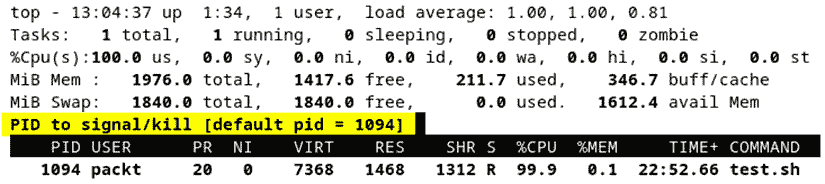

# 第五章：工作与进程、守护进程和信号

Linux 是一种多任务操作系统。多个程序或任务可以并行运行，每个都有自己的身份、调度、内存空间、权限和系统资源。**进程**封装了任何这种程序的执行上下文。理解进程如何工作并相互通信是任何经验丰富的 Linux 系统管理员和开发人员必备的重要技能。

本章探讨了 Linux 进程背后的基本概念。我们将研究不同类型的进程，如**前台**和**后台**进程，特别强调**守护进程**作为一种特定类型的后台进程。我们将深入研究进程的解剖结构以及 Linux 中的各种进程间通信机制 —— 特别是**信号**。在此过程中，我们还将了解一些管理进程和守护进程、处理信号的基本命令行实用工具。我们还会在本书中首次介绍**脚本**，稍后在*第八章*，*Linux Shell 脚本编程*中详细描述。如果您在处理本章脚本时需要更多信息，请提前参阅*第八章*。

在本章中，我们将涵盖以下主题：

+   介绍进程

+   工作与进程

+   工作与守护进程

+   探索进程间通信

重要提示

在内容导航过程中，我们将偶尔提前引用信号，在本章后半部分正式介绍之前。在 Linux 中，信号几乎只与进程关联，因此我们首先熟悉进程的方法。然而，从某些进程内部省略信号会对理解进程如何工作造成不利影响。提到信号时，我们会指向相关部分以供进一步参考。我们希望这种方法能让您更好地掌握整体和进程、守护进程的内部工作方式。

在我们开始之前，让我们先看一下我们学习所需的基本要求。

# 技术要求

熟能生巧。通过手动运行本章中的命令和示例，您将更好地了解进程的工作原理。与本书中的任何章节一样，我们建议您在虚拟机或 PC 桌面平台上安装工作中的 Linux 发行版。我们将使用 Ubuntu 或 Fedora，但大多数命令和示例在任何其他 Linux 平台上都会类似。

# 介绍进程

**进程**代表程序的运行实例。通常，程序是一组指令和数据，编译为可执行单元。当程序运行时，将创建一个进程。换句话说，进程只是一个活动中的程序。进程执行特定任务，有时也被称为**作业**（或**任务**）。

创建或启动进程的方式有很多。在 Linux 中，每个命令都会启动一个进程。命令可以是终端会话中用户启动的任务、脚本或手动或自动调用的程序（可执行文件）。

通常，进程的创建方式以及它如何与系统（或用户）交互决定了它的进程类型。让我们更仔细地看一下 Linux 中的不同类型的进程。

## 理解进程类型

从高层次来看，Linux 中有两种主要的进程类型：

+   **前台**（*交互式*）

+   **后台**（*非交互式*或*自动化*）

交互式进程假定在进程生命周期内会进行某种用户交互。非交互式进程是无人值守的，这意味着它们要么是自动启动的（例如，在系统启动时），要么是通过作业调度程序在特定时间和日期安排运行的（例如，使用`at`和`cron`命令行工具）。

我们探索进程类型的方法主要围绕上述分类展开。关于进程定义，还有其他多种视角或分类法，但最终可以归结为前台进程或后台进程。

例如，批处理进程和守护进程本质上是后台进程。批处理进程是自动化的，因为它们不是由用户生成的，而是由调度任务触发的。守护进程是后台进程，通常在系统启动时启动并无限期运行。

还有父进程和子进程的概念。父进程可以创建其他从属的子进程。

我们将在接下来的章节中详细介绍这些类型（及其他类型）。让我们从关键的进程类型——前台进程和后台进程开始。

### 前台进程

`stdout`或`stderr`）或接受用户输入。前台进程的生命周期与终端会话（父进程）紧密相关。如果启动前台进程的用户在进程仍在运行时退出终端，该进程将被突然终止（通过父进程发送的`SIGHUP`信号；有关详细信息，请参阅*信号*部分中的*进程间通信探索*）。

前台进程的一个简单例子是调用系统参考手册（`man`）来查看某个 Linux 命令（例如，`ps`）：

```
man ps
```

`ps`命令显示有关活动进程的信息。你将在*处理进程*章节中学习更多关于进程管理工具和命令行实用程序的内容。

一旦前台进程启动，用户提示符将被捕获并由新启动的进程界面控制。用户在交互式进程放弃对终端会话的控制之前，无法与初始命令提示符进行交互。

让我们看另一个前台进程的例子，这次调用一个长期运行的任务。以下命令（单行命令）会在显示任意消息的同时，运行一个无限循环，每几秒钟更新一次：

```
while true; do echo "Wait..."; sleep 5; done
```

只要命令没有被中断，用户将不会在终端中看到交互式提示符。使用*Ctrl* + *C*会停止（中断）相关前台进程的执行，并返回一个响应式命令提示符：


图 5.1 – 一个长时间运行的前台进程

重要提示

当你在前台进程运行时按下*Ctrl* + *C*，当前（父）终端会话会向运行中的进程发送`SIGINT`信号，从而中断前台进程。有关更多信息，请参阅*信号*部分。

如果我们希望在运行特定命令或脚本时保持终端会话中的交互式命令提示符，我们应当使用后台进程。

### 后台进程

**后台进程**—也称为**非交互式进程**或**自动进程**—独立于终端会话运行，不需要任何用户交互。用户可以在同一个终端会话中启动多个后台进程，而无需等待它们完成或退出。

后台进程通常是长时间运行的任务，不需要直接的用户监督。相关进程仍然可以在终端控制台中显示其输出，但这类后台任务通常将结果写入不同的文件中（例如日志文件）。

最简单的后台进程调用是在相关命令的末尾添加符号（`&`）。基于我们之前在*前台进程*部分中的示例，以下命令创建了一个后台进程，该进程运行一个无限循环，每隔几秒钟回显一个任意的消息：

```
while true; do echo "Wait..."; sleep 10; done &
```

请注意命令末尾的符号（`&`）。默认情况下，通过符号（`&`）调用的后台进程仍然会将输出（`stdout`和`stderr`）发送到控制台，如前所示。然而，终端会话保持交互式。在下图中，我们在之前的进程仍然运行时使用了`echo`命令：


图 5.2 – 运行后台进程

如前面的截图所示，后台进程被分配了`983`。在进程运行时，我们仍然可以控制终端会话并执行不同的命令，像这样：

```
echo "Interactive prompt..."
```

最终，我们可以使用`kill`命令强制终止该进程：

```
kill -9 983
```

上述命令*杀死*了我们的后台进程（PID 为`983`）。父终端会话通过命令中的`-9`参数发送的信号是`SIGKILL`（有关更多信息，请参见*信号*部分），用于终止该进程。

前台和后台进程通常都在用户的直接控制下。换句话说，这些进程是通过命令或脚本的调用手动创建或启动的。虽然如此，也有一些例外，特别是在批处理进程的情况下，这些进程会通过计划任务自动启动。

还有一类选择性的后台进程，它们会在系统启动时自动启动，并在关机时终止，无需用户干预。这些后台进程也被称为守护进程。

### 介绍守护进程

一个 `root` 用户（或其他）以相关的权限运行。

守护进程通常用于服务客户端请求或与其他前台或后台进程进行通信。以下是一些常见的守护进程示例，它们通常在大多数 Linux 平台上可用：

+   `systemd`：所有进程的父进程（以前称为 `init`）

+   `crond`：一个在后台运行任务的作业调度器

+   `ftpd`：一个处理客户端 FTP 请求的 FTP 服务器

+   `httpd`：一个处理客户端 HTTP 请求的 Web 服务器（Apache）

+   `sshd`：一个处理 SSH 客户端请求的安全外壳服务器

通常，Linux 系统中的守护进程名称以 `d` 结尾，表示它是一个守护进程。守护进程由通常存储在 `/etc/init.d/` 或 `/lib/systemd/` 系统目录中的 Shell 脚本控制，这取决于 Linux 平台。例如，Ubuntu 将守护进程脚本文件存储在 `/etc/init.d/` 中，而 Fedora 将它们存储在 `/lib/systemd/` 中。这些守护进程文件的位置取决于 `init` 的平台实现，它是一个针对所有 Linux 进程的系统级服务管理器。

Linux 的 `init` 风格启动过程通常会在系统启动时调用这些 Shell 脚本。但是，通常通过服务控制命令也可以调用这些脚本，这些命令通常由拥有特权的系统用户执行，以管理特定守护进程的生命周期。换句话说，特权用户或系统管理员可以通过命令行界面来*停止*或*启动*某个特定的守护进程。此类命令会在执行相关操作的同时立即将用户的控制权交还给终端，并在后台执行相关任务。

让我们更深入地了解 `init` 进程。

### `init` 进程

在本章中，我们将 `init` 称为 Linux 平台上的*通用*系统初始化引擎和服务管理器。多年来，Linux 发行版经历了各种 `init` 系统实现的演变，比如 `SysV`、`upstart`、`OpenRC`、`systemd` 和 `runit`。Linux 社区关于这些实现的优劣存在持续的辩论。现在，我们将 `init` 简单地看作一个系统进程，并简要了解它与其他进程的关系。

`init`（或 `systemd` 等）本质上是一个系统守护进程，它是 Linux 启动时最早启动的进程之一。相关的守护进程将持续在后台运行，直到系统关闭。`init` 是所有其他进程的根（父）进程，处于整个进程层次结构的树顶。换句话说，它是系统中所有进程的直接或间接祖先。

在 Linux 中，`pstree` 命令显示整个进程树，且在树的根部显示 `init` 进程——在我们的案例中是 `systemd`（在 Ubuntu 或 Fedora 上）。

上述命令的输出可以在以下截图中看到：


图 5.3 – init（systemd），所有进程的父进程

`pstree` 命令的输出展示了进程的层次结构，其中一些进程作为父进程出现，而其他进程则作为子进程出现。我们来看看父进程和子进程的类型以及它们之间的一些动态。

### 父进程和子进程

一个由父进程在终止时触发的 `SIGHUP` 信号（例如，通过 `nohup` 命令）。更多信息请参见 *信号* 部分。

在 Linux 中，除了 `init` 进程（及其变种）外，所有进程都是某个特定进程的子进程。终止子进程不会停止相关的父进程的运行。当子进程完成处理后，终止父进程的一个良好做法是让父进程本身退出。

有时进程会根据特定的计划无须人工干预地运行。没有用户交互的进程称为批处理进程。接下来，我们将讨论批处理进程。

### 批处理进程

`at` 和 `cron`。`cron` 更适合复杂的定时任务管理，而 `at` 是一个轻量级的工具，更适合一次性任务。对这些命令的详细研究超出了本章的范围。你可以参考相关的系统参考手册以获取更多信息（`man at` 和 `man cron`）。

我们将以孤儿进程和僵尸进程结束对进程类型的研究。

### 孤儿进程和僵尸进程

当子进程被终止时，相关的父进程会收到一个 `SIGCHILD` 信号。父进程可以继续执行其他任务，或选择生成另一个子进程。然而，也有可能父进程在相关子进程完成执行（或退出）之前就被终止。在这种情况下，子进程会变成 `init` 进程——所有进程的父进程——自动成为孤儿进程的新父进程。

`ps` 命令）。

僵尸进程和孤儿进程的主要区别在于，僵尸进程是已死（终止）的进程，而孤儿进程仍在运行。

当我们区分不同的进程类型及其行为时，相关信息的一个重要部分反映在进程本身的组成或数据结构中。在下一节中，我们将更深入地了解进程的构成，这主要通过 `ps` 命令行工具来体现——这是 Linux 系统上一个普通但非常有用的进程查看器。

## 进程的结构

本节中，我们将通过 `ps` 和 `top` 命令行工具，探讨 Linux 进程的一些常见属性。我们希望通过这些工具的实际应用，帮助你更好地理解进程的内部机制，至少从 Linux 管理员的角度来看。我们先简单了解一下这些命令。`ps` 命令显示系统进程的当前快照。此命令的语法如下：

```
ps [OPTIONS]
```

以下命令显示当前终端会话拥有的进程：

```
ps
```

前面的命令输出可以在下面的截图中看到：


图 5.4 – 显示当前 shell 拥有的进程

让我们来看看输出的顶部（标题）行中的每个字段，并解释它们在我们相关进程——也就是 `bash` 终端会话中的含义：

+   `PID`：在 Linux 中，每个进程都有一个由内核自动分配的 `PID` 值。`PID` 值是一个正整数，并且始终保证是唯一的。

在我们的示例中，相关的进程是 `bash`（当前 shell），其 PID 为 `171233`。

+   `TTY`：`TTY` 属性表示进程与之交互的终端类型。在我们的示例中，代表终端会话的 `bash` 进程的 `TTY` 类型是 `pts/0`。`pts` 代表 `/0` 表示相关终端会话的序列号。例如，额外的 SSH 会话将会有 `pts/1`，依此类推。

+   `TIME`：`TIME` 字段表示该进程所消耗的累计 CPU 使用时间（以 `[DD-]hh:mm:ss` 格式显示）。为什么在我们的示例中，`bash` 进程的 `TIME` 是零（`00:00:00`）？我们可能在终端会话中运行了多个命令，但 CPU 使用时间仍然为零。这是因为 CPU 使用时间是针对每个命令所消耗的时间进行测量（并累积），而不是针对整个父终端会话。如果命令在几分之一秒内完成，那么它们所消耗的 CPU 时间不会在 `TIME` 字段中显示出显著的数值。

+   `CMD`：`CMD` 字段代表命令，指示创建该进程的命令的名称或完整路径（包括参数）。对于常见的系统命令（例如，`bash`），`CMD` 会显示命令名称，包括其参数。

到目前为止，我们探讨的进程属性代表了 Linux 进程的相对简单视图。但有时我们可能需要更多的信息。例如，以下命令提供了当前终端会话中运行进程的额外详细信息：

```
ps -l
```

`-l` 选项参数调用了所谓的 *长格式* 以显示 `ps` 的输出：


图 5.5 – 进程的更详细视图

以下是 `ps` 命令的一些更相关的输出字段：

+   `F`：进程标志（例如，`0` – 无，`1` – 已分叉，`4` – 超级用户权限）

+   `S`：进程状态代码（例如，`R` – 运行中，`S` – 可中断休眠，等等）

+   `UID`：进程的用户名或所有者（用户 ID）

+   `PID`：进程 ID

+   `PPID`：父进程的进程 ID

+   `PRI`：进程的优先级（数字越大表示优先级越低）

+   `SZ`：虚拟内存使用量

还有许多其他这样的属性，探索它们超出了本书的范围。如需更多信息，请参考 `ps` 系统参考手册（`man ps`）。

迄今为止，我们使用的 `ps` 命令示例只显示了当前终端会话所拥有的进程。我们认为这种方式有助于减少分析进程属性时的复杂度。

除了 `ps`，另一个常用命令是 `top`，它提供了系统中所有运行进程的实时（动态）视图。其语法如下：

```
top [OPTIONS]
```

`ps` 命令显示的许多进程输出字段也在 `top` 命令中有所体现，尽管有些字段的表示方式略有不同。让我们来看看 `top` 命令以及显示的输出字段的含义。以下命令显示正在运行进程的实时视图：

```
top
```

上述命令的输出可以在以下截图中看到：


图 5.6 – 当前进程的实时视图

下面是一些输出字段的简要说明：

+   `USER`：进程的用户名或所有者

+   `PR`：进程的优先级（数字越小表示优先级越高）

+   `NI`：进程的 nice 值（一种动态/自适应的优先级）

+   `VIRT`：虚拟内存大小（以 KB 为单位）– 进程使用的总内存

+   `RES`：常驻内存大小（以 KB 为单位）– 进程使用的物理内存（非交换内存）

+   `SHR`：共享内存大小（以 KB 为单位）– 进程与其他进程共享的内存子集

+   `S`：进程的状态（例如，`R` – 运行中，`S` – 可中断休眠，`I` – 空闲，等等）

+   `%CPU`：CPU 使用率（百分比）

+   `%MEM`：`RES` 内存使用率（百分比）

+   `COMMAND`：命令名称或命令行

这些字段（以及更多字段）在 `top` 系统参考手册中有详细说明（`man top`）。

每天，Linux 管理任务经常使用基于上述字段的与进程相关的查询。*处理进程*部分将探讨`ps`和`top`命令的一些更常见用法，以及更多内容。

进程生命周期的一个重要方面是`ps`和`top`命令通过`S`字段提供有关进程状态的信息。让我们更仔细地查看这些状态。

### 进程状态

在其生命周期内，进程可能会根据情况改变状态。根据`ps`和`top`命令的`S`（状态）字段，Linux 进程可以具有以下任一状态：

+   `D`: 不可中断的睡眠

+   `I`: 空闲

+   `R`: 运行

+   `S`: 睡眠（可中断的睡眠）

+   `T`: 被作业控制信号停止

+   `t`: 在跟踪期间被调试器停止

+   `Z`: 僵尸

在高层次上，可以将这些状态识别为以下过程状态：

+   `R` 状态）或是空闲进程（`I` 状态）。在 Linux 中，空闲进程是分配给系统中每个处理器（CPU）的特定任务，只有在相关 CPU 上没有其他进程运行时才会被调度运行。在空闲任务上花费的时间占了`top`命令报告的空闲时间。

+   `S` 状态）和不可中断的睡眠（`D` 状态）。可中断的睡眠可以通过特定的进程信号中断，从而产生进一步的进程执行。另一方面，不可中断的睡眠是一个进程被阻塞在系统调用中的状态（可能在等待某些硬件条件），它无法被中断。

+   `T` 状态）或是调试信号（`t` 状态）。

+   `Z` 状态）- 它在没有被其父进程回收的情况下终止。僵尸进程本质上是系统进程表中已终止进程的死引用。这将在*孤儿和僵尸进程*部分详细讨论。

要总结我们对进程状态的分析，让我们来看一下 Linux 进程的生命周期。通常，进程从运行状态（`R`）开始，并在其父进程从僵尸状态（`Z`）中回收它后终止。下图提供了进程状态的简略视图及其之间可能的转换：


图 5.7 - Linux 进程的生命周期

现在我们已经介绍了进程，并为您提供了它们类型和结构的初步概念，我们准备与它们进行交互。在接下来的章节中，我们将探讨一些用于处理进程和守护程序的标准命令行实用工具。这些工具大多数操作输入和输出数据，我们在*进程的解剖*部分已经涵盖了这些。接下来我们将看看如何处理进程。

# 处理进程

本节作为通过资源丰富的命令行工具来管理进程的实用指南，这些工具用于日常的 Linux 管理任务。在之前的章节中我们提到了一些工具（例如 `ps` 和 `top`），当时我们讲解了特定进程的内部结构。在这里，我们将调用到目前为止我们收集的大部分知识，并通过一些实际的示例来实际应用它们。

让我们从 `ps` 命令开始——Linux 进程探测器。

## 使用 ps 命令

我们在*进程结构*部分描述了 `ps` 命令及其语法。以下命令显示当前系统中运行的一些进程：

```
ps -e | head
```

`-e` 选项（或 `-A`）选择系统中的*所有*进程。`head` 管道调用仅显示前几行（默认显示 10 行）：


图 5.8 – 显示前几个进程

上述信息可能并不总是特别有用。也许我们想了解更多关于每个进程的内容，而不仅仅是 `PID` 或 `CMD` 字段在 `ps` 命令输出中的内容。（我们在*进程结构*部分描述了一些进程的属性）。

以下命令更详细地列出了当前用户拥有的进程：

```
ps -fU $(whoami)
```

`-f` 选项指定完整格式的列表，显示每个进程的更多详细信息。`-U $(whoami)` 选项指定当前用户（`packt`）作为我们想要检索的进程的实际用户（所有者）。换句话说，我们想列出我们拥有的所有进程：


图 5.9 – 显示当前用户拥有的进程

有时我们可能需要查找特定的进程，无论是为了监控目的还是对它们进行操作。让我们回顾之前的例子，其中我们展示了一个长期运行的进程，并将相关命令包装成一个简单的脚本。这个命令是一个简单的 `while` 循环，它会无限期地运行：

```
while true; do x=1; done
```

使用我们偏好的编辑器（例如 `nano`），我们可以创建一个脚本文件（例如 `test.sh`），并编写以下内容：


图 5.10 – 一个简单的测试脚本无限运行

我们可以使测试脚本可执行并将其作为后台进程运行：

```
chmod +x test.sh
./test.sh &
```

注意命令末尾的与号（`&`），它用于启动后台进程：


图 5.11 – 作为后台进程运行脚本

运行我们脚本的后台进程的进程 ID（`PID`）是 `1094`。假设我们想通过进程名称（`test.sh`）来查找我们的进程。为此，我们可以使用 `ps` 命令并加上 `grep` 管道：

```
ps -ef | grep test.sh
```

上述命令的输出可以在以下截图中看到：


图 5.12 – 使用 ps 命令通过名称查找进程

上面的输出显示我们的进程具有`PID`值为`1094`，`CMD`值为`/bin/bash ./test.sh`。`CMD`字段包含了我们脚本的完整命令调用，包括命令行参数。

我们需要注意的是，`test.sh`脚本的第一行包含`#!/bin/bash`，它提示操作系统调用`bash`来执行脚本。这一行也被称为`CMD`字段，在我们的例子中，命令是`/bin/bash`（根据 shebang 调用），相关的命令行参数是`test.sh`脚本。换句话说，`bash`执行了`test.sh`脚本。

上述`ps`命令的输出还包括了我们`ps | grep`命令的调用，这有些不相关。改进版的相同命令如下：

```
ps -ef | grep test.sh | grep -v grep
```

上述命令的输出可以在以下截图中看到：


图 5.13 – 使用 ps 命令通过名称查找进程（改进版）

`grep -v grep`管道用于过滤掉`ps`命令结果中不需要的`grep`调用。

如果我们想根据进程 ID（`PID`）查找进程，可以使用`-p|--pid`选项参数调用`ps`命令。例如，以下命令显示了有关我们的进程（`PID`为`1094`，运行`test.sh`脚本）的详细信息：


图 5.14 – 使用 ps 命令根据 PID 查找进程

`-f`选项显示详细的（*长格式*）进程信息。

`ps`命令还有许多其他用法，探索所有用法超出了本书的范围。我们在此列出的调用应该为你提供了基本的探索指南。有关更多信息，请参阅`ps`系统参考手册（`man ps`）。

## 使用 pstree 命令

`pstree`以层次化、树状的视图显示正在运行的进程。从某种程度上来说，`pstree`充当了`ps`命令的可视化工具。`pstree`命令输出的根节点是`init`进程，或者是命令中指定的`PID`值对应的进程。`pstree`命令的语法如下：

```
pstree [OPTIONS] [PID] [USER]
```

以下命令显示了当前终端会话的进程树：

```
pstree $(echo $$)
```

上述命令的输出可以在以下截图中看到：


图 5.15 – 当前终端会话的进程树

在前面的命令中，`echo $$` 提供了当前终端会话的 `PID` 值。`$$` 是一个 Bash 内建变量，包含了当前正在运行的 shell 的 `PID` 值。`PID` 值作为参数传递给 `pstree` 命令。要显示相关的 PID，我们可以使用 `-``p|--show-pids` 选项来调用 `pstree` 命令：

```
pstree -p $(echo $$)
```

上述命令的输出可以在以下截图中看到：


图 5.16 – 当前终端会话的进程树（及其 PID）

以下命令显示当前用户拥有的进程：

```
pstree $(whoami)
```

上述命令的输出可以在以下截图中看到：


图 5.17 – 当前用户拥有的进程树

更多关于 `pstree` 命令的信息，请参考相关系统参考手册（`man pstree`）。

## 使用 top 命令

在实时监控进程时，`top` 工具是 Linux 管理员最常使用的工具之一。相关的命令行语法如下：

```
top [OPTIONS]
```

以下命令显示系统中当前运行的所有进程，并实时更新（包括内存、CPU 使用情况等）：

```
top
```

按 *Q* 会退出 `top` 命令。默认情况下，`top` 命令按 CPU 使用情况排序输出（显示在 `%``CPU` 字段/列中）。

我们还可以选择按其他字段对 `top` 命令的输出进行排序。在 `top` 正在运行时，按 *Shift* + *F*（`F`）启用交互模式。

使用方向键，我们可以选择按某一字段排序（例如，`%MEM`），然后按 *S* 设置新的字段，接着按 *Q* 退出交互模式。交互模式排序的替代方法是调用 `top` 命令的 `-o` 选项参数，指定排序字段。

例如，以下命令列出了按 CPU 使用排序的前 10 个进程：

```
top -b -o %CPU | head -n 17
```

类似地，以下命令列出了按 CPU 和内存使用排序的前 10 个进程：

```
top -b -o +%MEM | head -n 17
```

`-b` 选项参数指定批处理模式操作（而非默认的交互模式）。`-o +%MEM` 选项参数表示与默认的 `%CPU` 字段一起，附加的（`+`）排序字段是 `%MEM`。`head -n 17` 管道命令选择输出的前 17 行，包括 `top` 命令的七行头部：


图 5.18 – 按 CPU 和内存使用排序的前 10 个进程

以下命令列出了当前用户（`packt`）拥有的按 CPU 使用排序的前五个进程：

```
top -u $(whoami) -b -o %CPU | head -n 12
```

`-u $(whoami)` 选项参数指定了 `top` 命令的当前用户。

使用 `top` 命令时，我们也可以使用 `-p` PID 参数来监控特定进程。例如，以下命令监控我们的测试进程（PID 为 `243436`）：

```
top -p 1094
```

上述命令的输出可以在以下截图中看到：


图 5.19 – 使用 top 命令监控特定 PID

我们可以选择在使用 `top` 命令时通过按 *K* 来*杀死*进程。此时，我们会被提示输入我们希望终止的进程的 PID：



图 5.20 – 使用 top 命令杀死进程

`top` 工具可以以许多创新的方式使用。我们希望本节提供的示例能够启发你根据特定需求探索更多用例。欲了解更多信息，请参考 `top` 命令的系统参考手册（`man top`）。

## 使用 kill 和 killall 命令

我们使用`kill`命令来终止进程。该命令的语法如下：

```
kill [OPTIONS] [ -s SIGNAL | -SIGNAL ] PID [...]
```

`kill` 命令向进程发送一个*信号*，尝试停止其执行。如果没有指定信号，系统会发送 `SIGTERM`（`15`）。信号可以通过其名称（不带 `SIG` 前缀）指定（例如，`KILL` 对应 `SIGKILL`），或者通过数值指定（例如，`9` 对应 `SIGKILL`）。

`kill -l` 和 `kill -L` 命令提供了可以在 Linux 中使用的信号的完整列表：


图 5.21 – Linux 信号

每个信号都有一个数值，如前述输出所示。例如，`SIGKILL` 对应 `9`。以下命令将杀死我们的测试进程（PID 为 `243436`）：

```
kill -9 1094
```

以下命令也会与前面的命令做相同的操作：

```
kill -KILL 1094
```

在某些情况下，我们可能希望一次性杀死多个进程。此时，`killall` 命令将派上用场。`killall` 命令的语法如下：

```
killall [OPTIONS] [ -s SIGNAL | -SIGNAL ] NAME...
```

`killall` 向所有运行指定命令的进程发送信号。如果没有指定信号，则发送 `SIGTERM`（`15`）。信号可以通过信号名称（不带 `SIG` 前缀）指定（例如，`TERM` 对应 `SIGTERM`），或者通过数值指定（例如，`15` 对应 `SIGTERM`）。

例如，以下命令终止所有运行 `test.sh` 脚本的进程：

```
killall -e -TERM test.sh
```

上述命令的输出可以在以下截图中看到：


图 5.22 – 使用 killall 终止多个进程

杀死一个进程通常会从系统进程表中移除相关的引用。被终止的进程将不再出现在 `ps`、`top` 或类似命令的输出中。

欲了解更多关于 `kill` 和 `killall` 命令的信息，请参考相关的系统参考手册（`man kill` 和 `man killall`）。

## 使用 pgrep 和 pkill 命令

`pgrep` 和 `pkill` 是基于模式查找命令，用于探索和终止正在运行的进程。它们的语法如下：

```
pgrep [OPTIONS] PATTERN
pkill [OPTIONS] PATTERN
```

`pgrep`遍历当前进程并列出与选择模式或标准匹配的 PID。同样，`pkill`终止与选择标准匹配的进程。

以下命令会查找我们的测试进程（`test.sh`），并在找到相关进程时显示`PID`值。在使用以下命令之前，请重新启动该进程，因为我们在上一节中已经终止了它。这将导致一个不同的`PID`值：

```
pgrep -f test.sh
```

上述命令的输出可以在以下截图中看到：


图 5.23 – 使用 pgrep 根据名称查找 PID

`-f|--full`选项强制执行我们查找进程的完整名称匹配。我们可以将`pgrep`与`ps`命令结合使用，以获得关于进程的更多详细信息，像这样：

```
pgrep -f test.sh | xargs ps -fp
```

上述命令的输出可以在以下截图中看到：


图 5.24 – 链接 pgrep 和 ps 获取更多信息

在前面的单行命令中，我们将`pgrep`命令的输出（PID 为`243436`）通过管道传递给了`ps`命令，该命令使用了`-f`（长格式）和`-p|--pid`选项。`-p`选项的参数获取了管道传递的 PID 值。

`xargs`命令将来自`pgrep`命令的输入转换为`ps`命令的参数。因此，当从`pgrep`传递到`ps`时，第一个命令的输出会自动转换为第二个命令的参数。默认情况下，`xargs`读取标准输入。

要终止我们的`test.sh`进程，我们只需调用`pkill`命令，如下所示：

```
pkill -f test.sh
```

上述命令将*静默*地终止相关进程，这是基于`-f|--full`选项强制执行的完整名称查找。如果希望从`pkill`命令的操作中获得一些反馈，我们需要调用`-e|--echo`选项，像这样：

```
pkill -ef test.sh
```

上述命令的输出可以在以下截图中看到：


图 5.25 – 使用 pkill 按名称终止进程

有关更多信息，请参考`pgrep`和`pkill`的系统参考手册（`man pgrep`和`man pkill`）。

本节介绍了一些在日常 Linux 管理任务中经常使用的命令行工具，涉及到进程管理。请记住，在 Linux 中，大多数时候，有很多方法可以完成特定任务。我们希望本节中的示例能帮助你想出创意方法和技巧来处理进程。

接下来，我们将介绍一些与守护进程交互的常见方法。

# 与守护进程协作

正如在引言部分提到的，守护进程是背景进程中的一种特殊类型。因此，大多数用于操作进程的方法和技术同样适用于守护进程。然而，当涉及到管理（或控制）相关进程的生命周期时，有一些特定的命令是专门用于守护进程的。

正如在 *Introducing daemons* 部分提到的，守护进程由 shell 脚本控制，这些脚本通常存储在 `/etc/init.d/` 或 `/lib/systemd/` 系统目录中，具体取决于 Linux 平台。在老旧的 Linux 系统（例如 RHEL 6）和 Ubuntu（即使是在最新的发行版中），守护进程脚本文件存储在 `/etc/init.d/` 中。而在 RHEL 7 / Ubuntu 18.04 及更新的平台中，这些文件通常存储在 `/lib/systemd/` 中。你可以随意列出这两个目录的内容来查看其中的文件。

守护进程文件和守护进程命令行工具的位置在很大程度上取决于 `init` 初始化系统和服务管理器。在 *The init process* 部分，我们简要提到了在 Linux 发行版中存在的多种 `init` 系统。为了说明守护进程控制命令的使用，我们将探讨一种广泛应用于各种 Linux 平台的 `init` 系统——`systemd`。

## 使用 systemd 守护进程

`init` 系统的基本要求是在 Linux 内核启动时初始化并协调各种进程的启动和依赖关系。这些进程也被称为 `init` 引擎，它还在系统运行时控制服务和守护进程。

在过去几年中，大多数 Linux 平台已经将 `systemd` 作为默认的 `init` 引擎。由于其广泛的应用，熟悉 `systemd` 及其相关命令行工具至关重要。考虑到这一点，本节的主要重点是 `systemctl`——管理 `systemd` 守护进程的核心命令行工具。

`systemctl` 命令的语法如下：

```
systemctl [OPTIONS] [COMMAND] [UNITS...]
```

`systemctl` 命令触发的操作是针对单位（unit）的，这些单位是由 `systemd` 管理的系统资源。`systemd` 中定义了几种单位类型（例如，服务、挂载、套接字等）。每个单位都有一个对应的文件。这些文件类型可以通过相关文件名的后缀推断出来；例如，`httpd.service` 是 Apache 网络服务（守护进程）的服务单位文件。有关 `systemd` 单位的完整列表及详细说明，请参考 `systemd.unit` 系统参考手册（`man systemd.unit`）。

以下命令使守护进程（例如 `httpd`，Web 服务器）在启动时自启：

```
sudo systemctl enable httpd
```

通常，调用 `systemctl` 命令需要超级用户权限。我们应该注意到，在我们指定服务单位时，`systemctl` 并不需要 `.service` 后缀。以下的调用也是可以接受的：

```
sudo systemctl enable httpd.service
```

禁用 `httpd` 服务在启动时自启的命令如下：

```
sudo systemctl disable httpd
```

要查询 `httpd` 服务的状态，我们可以运行以下命令：

```
sudo systemctl status httpd
```

另外，我们可以使用以下命令检查 `httpd` 服务的状态：

```
sudo systemctl is-active httpd
```

以下命令停止或启动 `httpd` 服务：

```
sudo systemctl stop httpd
sudo systemctl start httpd
```

有关 `systemctl` 的更多信息，请参考相关的系统参考手册（`man systemctl`）。有关 `systemd` 内部结构的更多信息，请参考相应的参考手册（`man systemd`）。

处理进程和守护进程是日常 Linux 管理任务中的常见主题。掌握相关的命令行工具是任何有经验的用户的基本技能。然而，运行中的进程或守护进程也应当与其他进程或守护进程之间的关系一同考虑，后者可能是在本地或远程系统上运行的。进程之间如何相互通信对某些人来说可能是一个小谜题。我们将在下一部分中讨论这一点，解释进程间通信是如何工作的。

# 解释进程间通信

**进程间通信**（**IPC**）是通过共享机制或接口在进程之间进行交互的一种方式。在本节中，我们将以简要的理论方式探讨进程之间的各种通信机制。有关此问题的更多细节以及使用的一些机制，请参阅 *第八章*，*Linux* *Shell 脚本*。

Linux 进程通常可以通过以下接口共享数据并同步它们的操作：

+   **共享存储**（**文件**）：在最简单的形式下，IPC 机制的共享存储可以是已保存到磁盘的简单文件。生产者写入文件，而消费者从同一文件中读取。在这个简单的用例中，显而易见的挑战是由于底层操作之间可能存在竞争条件，导致读/写操作的完整性问题。为了避免竞争条件，文件必须在写操作期间被锁定，以防止与其他读/写操作发生重叠。为了简化起见，我们不会在简单的示例中解决这个问题，但我们认为有必要指出这一点。

+   `/dev/shm` 临时文件存储系统，使用系统的 RAM 作为其后备存储（即，RAM 磁盘）。

使用 `/dev/shm` 作为共享内存，我们可以重新使用前面提到的关于 *共享存储* 的生产者-消费者模型，在该模型中，我们只需将存储文件指向 `/dev/shm/storage`。

共享内存和共享存储 IPC 模型在处理大量数据时可能表现不佳，特别是海量数据流的情况下。替代方法是使用 IPC 通道，这可以通过管道、消息队列或套接字通信层来启用。

+   **命名与未命名管道**：**未命名**或**匿名管道**，也叫**常规管道**，将一个进程的输出传递到另一个进程的输入。使用我们的生产者-消费者模型，最简单的方式来说明未命名管道作为两个进程之间的 IPC 机制如下：

    ```
    producer.sh | consumer.sh
    ```

上述代码的关键元素是管道（`|`）符号。管道的左侧生成输出，并直接传送到管道右侧供消费。

**命名管道**，也叫**先进先出（FIFO）**，与传统的（未命名）管道类似，但在语义上有显著不同。未命名管道仅在相关进程运行时存在。然而，命名管道有后备存储，并且只要系统运行，它就会持续存在，而不管相关进程是否在运行。通常，命名管道表现得像一个文件，并且在不再使用时可以删除。

+   **消息队列**：消息队列是一种异步通信机制，通常用于分布式系统架构中。消息被写入并存储在队列中，直到被处理并最终删除。消息由生产者写入（发布），并且只会被处理一次，通常由单个消费者处理。从高层次来看，消息包含序列、有效载荷和类型。消息队列可以调节消息的获取（顺序）（例如，根据优先级或类型）：


图 5.26 – 消息队列（简化视图）

消息队列的详细分析或其模拟实现并非简单之事，超出了本章的范围。大多数 Linux 平台上都有许多开源的消息队列实现（如 RabbitMQ、ActiveMQ、ZeroMQ、MQTT 等）。

基于消息队列和管道的 IPC 机制是单向的。一种进程写入数据，另一种进程读取数据。虽然有命名管道的双向实现，但其中的复杂性会对底层通信层产生负面影响。对于双向通信，你可以考虑使用基于套接字的 IPC 通道（在*第八章*中有详细介绍，*Linux* *Shell 脚本*）。

+   **套接字**：有两种基于 IPC 套接字的设施：

    +   **IPC 套接字**：也叫做 Unix 域套接字，IPC 套接字使用本地文件作为套接字地址，允许在同一主机上的进程之间进行双向通信。

    +   **网络套接字**：**传输控制协议**（**TCP**）和**用户数据报协议**（**UDP**）套接字。它们通过 TCP/UDP 网络扩展了 IPC 数据连接层，跨越本地机器。

除了显而易见的实现差异，IPC 套接字和网络套接字的数据通信通道行为相同。

两个套接字都配置为流式通信，支持双向通信，并模拟客户端/服务器模式。套接字的通信通道在任一端关闭之前保持活动，从而断开了 IPC 连接。

+   **信号**：在 Linux 中，信号是一种单向异步通知机制，用于响应特定的条件。信号可以朝以下任何一个方向传递：

    +   从 Linux 内核到任意进程

    +   从进程到进程

    +   从进程到它自己

我们在本节开始时提到过，信号是另一种 IPC 机制。实际上，它们是一种有限的 IPC 形式，因为通过信号，进程可以相互协调同步。但信号不会携带任何数据负载。它们只是通知进程某些事件，进程可以选择针对这些事件采取特定的行动。

在下一节中，我们将详细讲解如何在 Linux 中处理信号。

## 处理信号

信号通常会提醒 Linux 进程某个特定事件的发生，例如，由内核触发的段错误（`SIGSEGV`），或者用户按下 *Ctrl* + *C* 中断执行（`SIGINT`）。在 Linux 中，进程通过信号进行控制。Linux 内核定义了几十种信号。每个信号都有一个对应的非零正整数值。

以下命令列出了在 Linux 系统中注册的所有信号：

```
kill -l
```

前一个命令的输出可以在*图 5.21*中看到。从输出中可以看出，`SIGHUP` 例如，信号值为 `1`，并且在终端会话退出时，它会传递给所有子进程。`SIGKILL` 的信号值为 `9`，并且最常用于终止进程。进程通常可以控制信号的处理方式，除了 `SIGKILL`（`9`）和 `SIGSTOP`（`19`），这两个信号总是分别终止或停止进程。

进程以以下两种方式之一处理信号：

+   执行信号所暗示的默认操作；例如，停止、终止、核心转储一个进程，或什么也不做。

+   执行一个自定义的操作（除了 `SIGKILL` 和 `SIGSTOP`）。在这种情况下，进程捕获信号并以特定方式处理它。

当一个程序实现一个自定义的信号处理程序时，通常会定义一个信号处理函数，来改变进程的执行，如下所示：

+   当信号被接收时，进程的执行会在当前指令处被中断

+   进程的执行会立即跳转到信号处理函数

+   信号处理函数运行

+   当信号处理函数退出时，进程将恢复执行，从之前中断的指令开始

以下是与信号相关的一些简要术语：

+   信号由产生它的进程触发

+   信号由处理它的进程捕获

+   如果进程有一个相应的**空操作**（**no-op**，**NOOP**）处理程序，信号将被忽略

+   如果进程在捕获到信号时执行特定操作，那么该信号就被处理了。

在所有信号中，`SIGKILL`和`SIGSTOP`是唯一无法被捕获或忽略的信号。

让我们探索几个信号处理的使用案例：

+   当内核发送`SIGKILL`、`SIGFPE`（浮点异常）、`SIGSEGV`（段错误）、`SIGTERM`或类似的信号时，通常接收信号的进程会立即终止执行，并可能生成一个核心转储——用于调试目的的进程镜像。

+   当用户按下*Ctrl* + *C*时——这时会发送一个`SIGINT`信号到进程。除非底层程序为`SIGINT`实现了特殊的处理程序，否则进程将终止。

+   使用`kill`命令，我们可以根据进程的 PID 向任何进程发送信号。以下命令向 PID 为`3741`的终端会话发送`SIGHUP`信号：

    ```
    kill -HUP 3741
    ```

在前面的命令中，我们可以指定信号值（例如，`1`表示`SIGHUP`）或直接使用信号名称，而不带`SIG`前缀（例如，`HUP`表示`SIGHUP`）。

使用`killall`，我们可以向多个正在运行特定命令的进程发送信号（例如，`test.sh`）。以下命令终止所有运行`test.sh`脚本的进程，并将结果输出到控制台（通过`-e`选项）：

```
killall -e -TERM test.sh
```

该命令的输出可以在*图 5.22*中看到。

Linux 进程和信号是一个庞大的领域。我们在这里提供的信息远非该主题的全面指南。我们希望这种简短的实践方法，展示了一些常见的使用案例，能激发你去解决并可能掌握更具挑战性的问题。

# 总结

对 Linux 进程和守护进程的详细研究可能是一个重大的工作。尽管有一些在这一主题上极为成功的著作，但相对简短的一章可能会相形见绌。然而，在本章中，我们尝试为我们考虑的每个内容披上一件现实、实用的外衣，以弥补我们在抽象或学术领域可能的不足。

到目前为止，我们希望你已经能够熟练地处理进程和守护进程。你目前所掌握的技能应包括对进程类型和内部机制的较好理解，以及对进程属性和状态的合理理解。我们特别关注了进程间通信机制，特别是信号。关于这些主题，我们将在*第八章*中进行更详细的探讨。现在，我们认为我们提供的信息足以帮助理解进程间通信的工作原理。

下一章将进一步探讨如何操作 Linux 磁盘和文件系统。我们将探讨 Linux 存储、磁盘分区和**逻辑卷管理**（**LVM**）概念。放心，到目前为止我们学到的一切将在接下来的章节中立即派上用场。

# 问题

如果你已经快速浏览了本章的某些部分，可能需要回顾一些关于 Linux 进程和守护进程的基本细节：

1.  想一想几种进程类型。它们之间有什么不同？

1.  想一想进程的构成。你能列出一些在检查进程时可能关注的基本进程属性（或者是 `ps` 命令行输出中的字段）吗？

**提示**：除了 CPU、RAM 或磁盘使用情况之外，还有哪些对你来说是相关的？

1.  你能想到几种进程状态以及它们之间的一些动态变化或可能的转换吗？

1.  如果你正在寻找一个占用系统大部分 CPU 的进程，你会怎么做？

1.  你能编写一个简单的脚本并将其作为一个长时间运行的后台进程吗？

**提示**：查看 *第八章*，我们将在那里教你如何创建和使用 shell 脚本。

1.  列举至少四个你能想到的进程信号。你会在什么情况下触发这些信号？

`kill -l` 命令。欲了解更多信息，请阅读手册。

1.  想一想几种进程间通信（IPC）机制。试着列出它们的优缺点。

**提示**：在 *第八章* 中的内容可能对你有所帮助。

# 进一步阅读

欲了解本章所涉及的更多信息，您可以参考以下 Packt 出版社的书籍：

+   *Linux 管理最佳实践*，作者：Scott Alan Miller

+   *使用 systemd 简化 Linux 服务管理*，作者：Donald A. Tevault

# 第二部分：高级 Linux 管理

在第二部分中，您将学习高级的 Linux 系统管理任务，包括磁盘操作、网络配置、强化 Linux 安全性，以及系统特定的故障排除和诊断。

本部分包含以下章节：

+   *第六章*，*磁盘和文件系统管理*

+   *第七章*，*与 Linux 的网络连接*

+   *第八章*，*Linux Shell 脚本编写*

+   *第九章*，*Linux 安全性*

+   *第十章*，*灾难恢复、诊断与故障排除*
