# 6

# 使用磁盘和文件系统

在本章中，你将学习如何管理磁盘和文件系统，如何使用**逻辑卷管理**（**LVM**）系统，以及如何挂载和分区硬盘，并且深入了解 Linux 中的存储。你还将学习如何对磁盘进行分区和格式化，如何创建逻辑卷，并对文件系统类型有更深刻的理解。在本章中，我们将涵盖以下主要内容：

+   了解 Linux 中的设备

+   了解 Linux 中的文件系统类型

+   了解磁盘和分区

+   在 Linux 中介绍 LVM

# 技术要求

了解磁盘、分区和文件系统的基础知识是推荐的。没有其他特殊的技术要求，只需要你的系统上有一个正常运行的 Linux 安装。我们将在本章练习中主要使用 Ubuntu 或 Debian。即使你不使用 Debian 或 Ubuntu，本章中使用的所有命令都可以在任何 Linux 发行版上复制。

# 了解 Linux 中的设备

正如本书中多次提到的，Linux 中的一切都是文件。设备也不例外。**设备文件**是 Unix 和 Linux 操作系统中的特殊文件。这些特殊文件是设备驱动程序的接口，并且作为常规文件出现在文件系统中。

不再多说，我们来看看 Linux 的抽象层如何工作。这将为你提供硬件与软件如何相互关联和交织的概览。

## Linux 抽象层

现在是讨论 Linux 系统抽象层以及设备如何融入整体架构的最佳时机。任何计算机通常都被组织为两个层级（或级别）——硬件层和软件层：

+   **硬件层级**：此层包含你计算机的硬件组件，如内存（RAM）、**中央处理单元**（**CPU**）和设备，包括磁盘、网络接口、端口和控制器。

+   **软件层级**：为了让这些硬件组件正常工作，操作系统（在本书中为 Linux）使用**抽象层**。这些层存在于**内核**中，内核是 Linux 的主要软件组件。在不深入更多信息的前提下，你只需知道，Linux 有这些层，负责访问低级资源，并为不同硬件组件提供特定的驱动程序。当计算机启动时，Linux 内核会从磁盘加载到系统内存（RAM）中。因此，在内存中将有两个独立的区域，称为**内核空间**和**用户空间**，这将构成**软件层级**：

    +   内核是 Linux 操作系统的核心。内核驻留在内存（RAM）中，管理所有硬件组件。它是你 Linux 系统中软件与硬件之间的*接口*。

    +   用户空间级别是执行用户进程的层次。正如在 *第五章* 《处理进程、守护进程和信号》 中所展示的，进程是程序的运行实例。

在这个宏大的体系结构中，设备在哪里呢？设备由 *内核* 来管理。总的来说，内核负责管理进程、系统调用、内存和设备。在处理设备时，内核管理 **设备驱动程序**，它们是硬件组件与软件之间的接口。所有设备只能在内核模式下访问，以确保更加安全和高效的操作。

这一切是如何运作的呢？实际上，内存（也就是 RAM）由用于临时存储信息的单元组成。这些单元被不同的程序访问，这些程序作为 CPU 和存储之间的中介。访问内存的速度非常高，以确保执行过程的流畅性。用户空间内的用户进程管理是内核的工作。内核确保没有任何进程会相互干扰。内核空间通常只由内核访问，但有时用户进程也需要访问这个空间。这是通过 **系统调用** 来实现的。系统调用是用户进程通过内核空间内的活动进程请求内核服务的一种方式，涉及的内容包括 **输入/输出**（**I/O**）请求，来与内部或外部设备进行交互。所有这些请求都将数据从 CPU 通过 RAM 传输，以完成任务。

在接下来的章节中，我们将介绍 Linux 中的命名规则以及设备文件的管理方式。

## 设备文件和命名规则

在了解了抽象层的工作原理后，你可能会想知道 Linux 如何管理设备。其实，Linux 是通过 **用户空间 /dev**（**udev**）来管理设备的，它是一个为内核提供服务的设备管理器。它通过 **设备节点** 来工作，设备节点是特殊的文件（也叫 **设备文件**），用于作为驱动程序的接口。

### Linux 中的设备文件

`udev` 作为一个守护进程运行，监听内核发送的用户空间调用，因此它能够知道使用了哪些设备，以及如何使用这些设备。这个守护进程叫做 `udevd`，其配置文件目前存储在 `/etc/udev/udev.conf` 下。你可以通过运行以下命令来查看 `/etc/udev/udev.conf` 文件的内容：

```
cat /etc/udev/udev.conf
```

每个 Linux 发行版都有一套默认的规则来管理 `udevd`。这些规则通常存储在 `/etc/udev/rules.d/` 目录下，正如下面的截图所示：

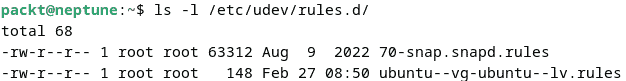

图 6.1 – udevd 规则位置

注意

内核通过 **Netlink** 套接字发送事件调用。Netlink 套接字是一种用于进程间通信的接口，适用于用户空间和内核空间的进程。

`/dev` 目录是用户进程与内核管理的设备之间的接口。如果你使用 `ls -la /dev` 命令，你会看到很多文件，每个文件都有不同的名称。如果你使用长格式列出文件，你会看到不同的文件类型。某些文件名以 *b* 和 *c* 开头，但根据你的系统，也可能会看到 *p* 和 *s* 开头的文件。以这些字母开头的文件是设备文件。以 *b* 开头的是**块设备**，而以 *c* 开头的是**字符设备**，如下所示的屏幕截图所示：

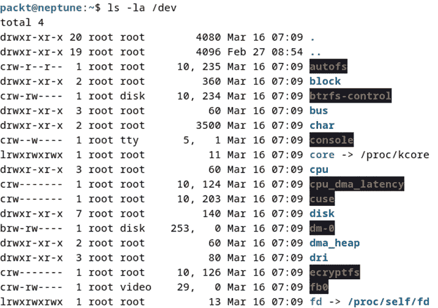

图 6.2 – /dev 目录中的设备文件

让我们看看磁盘设备如何在 `/dev` 目录中呈现。但首先，我们在以下提示中提供了有关工作环境的几句话。

重要提示

本书中的大部分练习将使用以行星名称为主机名的虚拟机，运行不同的基于 Linux 的操作系统。例如，`neptune` 运行的是 Ubuntu 22.04.2 LTS Server，因此当你在终端提示符中看到 `neptune` 主机名时，你就知道我们正在使用基于 Ubuntu 的系统。我们还使用了 `jupiter`，运行在 openSUSE 15.4 Leap 服务器上，`saturn` 运行在 Fedora 37 Workstation 上，`venus` 运行在 AlmaLinux 上，`mars` 运行在 Debian 11.6 服务器上。在虚拟机中，设备驱动程序的命名与裸机系统有所不同。我们将在接下来的部分讨论设备命名约定时提供详细信息。不过，对于一些示例（已做标记），我们也会使用我们的主工作站，运行的是 Debian 12 GNU/Linux。

如 *图 6.3* 所示，磁盘设备 `sda` 作为块设备表示。块设备具有固定大小，可以方便地进行索引。另一方面，字符设备可以通过数据流进行访问，因为它们不像块设备那样有固定的大小。例如，打印机作为字符设备表示。在下面的屏幕截图中，`sg0` 是一个 SCSI 通用设备，在我们的例子中没有分配给任何磁盘。我们使用了运行在 Debian GNU/Linux 上的主工作站，作为 `sda` 展示的设备是一个外部 USB 设备：

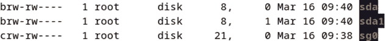

图 6.3 – /dev 目录中的磁盘驱动器

相比之下，当列出 `neptune` 虚拟机中的设备时，我们将看到如下所示的输出：

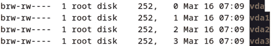

图 6.4 – 虚拟机中的虚拟设备

以 `vdaX` 表示的设备块是虚拟机中的虚拟设备。你将在*第十一章*中了解到更多关于虚拟机的内容，*与虚拟机的工作*。

但现在，让我们先了解一下 Linux 中的设备命名约定。

### 理解设备命名规范

Linux 使用一种设备命名规范，使得设备管理在整个 Linux 生态系统中变得更加容易和一致。`udev` 使用几种特定的命名方案，默认情况下将固定的名称分配给设备。这些名称是根据设备类别标准化的。例如，在命名网络设备时，内核使用来自固件、拓扑和位置等来源的信息。在基于 Red Hat 的系统中，有五种方案用于命名网络接口，我们鼓励你查看 Red Hat 客户门户官网文档：[`access.redhat.com/documentation/en-us/red_hat_enterprise_linux/9`](https://access.redhat.com/documentation/en-us/red_hat_enterprise_linux/9)。

在基于 Debian 的系统中，命名规范也类似，它是基于硬件总线名称来实现可预测性。这与所有现代 Linux 操作系统类似。

你还可以查看系统上哪些`udev`规则是活跃的。在基于 Debian 和 Red Hat 的发行版中，它们存储在 `/lib/udev/rules.d/` 目录下。

在硬盘或外部硬盘方面，命名规范更加简化。以下是一些示例：

+   `hda`（主设备）、`hdb`（第一个通道上的从设备）、`hdc`（第二个通道上的主设备）、`hdd`（第二个通道上的从设备）

+   `nvme0`（第一个设备控制器 – 字符设备）、`nvme0n1`（第一个命名空间 – 块设备），以及`nvme0n1p1`（第一个命名空间，第一个分区 – 块设备）

+   `mmcblk`（用于使用 eMMC 芯片的 SD 卡）、`mmcblk0`（第一个设备），以及`mmcblk0p1`（第一个设备，第一个分区）

+   `sd`（用于大容量存储设备）、`sda`（第一个注册设备）、`sdb`（第二个注册设备）、`sdc`（第三个注册设备），依此类推，以及`sg`（用于通用 SCSI 层 – 字符设备）

本章中我们最关注的设备是大容量存储设备。这些设备通常是**硬盘驱动器**（**HDDs**）或**固态硬盘**（**SSDs**），用于计算机内部存储数据。这些驱动器很可能会根据文件系统提供的特定结构被划分为多个分区。我们之前在本书的*第二章*《Linux Shell 和 文件系统》中简单讨论了文件系统，当时我们提到过 Linux 目录结构，但现在，是时候深入了解 Linux 中的文件系统类型了。

# 理解 Linux 中的文件系统类型

在谈论物理介质时，比如硬盘或外部硬盘时，我们*并不是*在讨论目录结构。这里我们讨论的是在格式化和/或分区时，在物理硬盘上创建的结构。这些结构根据其类型被称为文件系统，它们决定了文件在存储到硬盘时如何被管理。

存在多种类型的文件系统，其中一些是 Linux 生态系统的原生文件系统，而其他则不是，例如特定的 Windows 或 macOS 文件系统。在本节中，我们将仅描述 Linux 原生的文件系统。

在 Linux 中最常用的文件系统包括 `Ext`、`Ext2`、`Ext3` 和 `Ext4`，`XFS` 文件系统，`ZFS` 和 `btrfs`（简而言之，`Ext4` 是 `Ext3` 的最新版本，它在支持更大文件、碎片管理和性能方面进行了改进，比 `Ext3` 更好。`Ext3` 文件系统使用 32 位寻址，而 `Ext4` 使用 48 位寻址，因此支持最大 16 TB 的文件大小。它还支持无限子目录，因为 `Ext3` 仅支持 32k 个子目录。此外，`Ext4` 中还新增了对扩展时间戳的支持，提供额外的两位，以支持到公元 2446 年，并且支持在内核层面进行在线碎片整理。

尽管如此，`Ext4` 仍然不是一个真正的下一代文件系统；它更像是一个经过改进、值得信赖、稳健且稳定的 *工作马*，但在数据保护和完整性方面并未通过测试。它的日志系统不适合检测和修复数据损坏或降级问题。这就是为什么其他文件系统，如 `XFS` 和 `ZFS`，开始重新出现并被应用于 Red Hat Enterprise Linux 7 版本开始使用 `XFS`，以及从 Ubuntu 16.04 版本起使用 `ZFS` 的原因。

`btrfs` 的情况有些争议。它被认为是一个现代文件系统，但由于与其他文件系统相比存在多个性能问题，它仍然只作为单盘文件系统使用，并未在多盘卷管理器中得到广泛应用。它被用于 SUSE Linux Enterprise 和 openSUSE，但不再被 Red Hat 支持，并已被投票选为 Fedora 从版本 33 开始的未来默认文件系统。

以下是一些主要文件系统特性的详细信息：

+   `Ext4` 文件系统从一开始就为 Linux 设计。尽管它正在被其他文件系统逐渐替代，但它仍然具有强大的功能。它提供了块大小选择，大小范围在 512 到 4,096 字节之间。它还具有 inode 保留功能，在创建目录时保留一些 inode，从而在创建新文件时提高性能。

    布局简单，`Ext4` 文件系统在此方面有所利用。在讨论中，我们将涉及以下几点：最大文件系统大小、使用 `fsck` 命令进行快速文件系统检查、为日志系统使用校验和提高可靠性，以及改进的时间戳使用。

+   **ZFS**：这个文件系统是在 Sun Microsystems 创建的，它将文件系统和逻辑卷管理器结合为一个解决方案。它于 2004 年发布，开发始于 2001 年，最初集成到 Solaris 操作系统中，后来被 Debian、FreeBSD 等使用（虽然不是默认的）。ZFS 是一个高度可扩展的 128 位系统，提供简单的管理、数据完整性、可扩展性和性能。该文件系统的开发通过 **OpenZFS** 开源项目进行。ZFS 采用了一种写时复制机制，与传统文件系统不同，从而提供了一种复杂的结构。有关 ZFS 的更多详细信息，我们推荐以下链接：[`openzfs.github.io/openzfs-docs/Getting%20Started/index.html`](https://openzfs.github.io/openzfs-docs/Getting%20Started/index.html)。

+   `Ext4` 以及其他有竞争力的文件系统类型。其中之一是 `XFS`。这个文件系统最初由 Silicon Graphics, Inc 创建，并在 IRIX 操作系统中使用。它最重要的设计元素是性能，因为它能够处理大型数据集。此外，它被设计为能够处理并行 I/O 任务，保证高 I/O 速率。该文件系统支持最大 16 EB，单个文件最大支持 8 EB。`XFS` 有一个日志记录配额信息的功能，并支持在线维护任务，如碎片整理、扩展和恢复。还提供了备份和恢复的专用工具，包括 `xfsdump` 和 `xfsrestore`。

+   `btrfs` 仍在开发中，但它解决了现有文件系统的一些问题，包括缺少快照、池化、校验和和多设备跨越等功能。这些都是企业 Linux 环境中所需的功能。能够对文件系统进行快照并维护其内部框架以管理新的分区，使得 `btrfs` 在企业关键生态系统中成为一个可行的新兴选项。

还有一些我们没有在此讨论的文件系统，包括使用 `cat /``proc/filesystems` 命令查看的文件系统。

Linux 实现了一个特殊的软件系统，旨在运行文件系统的特定功能。它被称为**虚拟文件系统**，充当内核与文件系统类型和硬件之间的桥梁。因此，当应用程序想要打开文件时，操作通过虚拟文件系统作为抽象层传递：

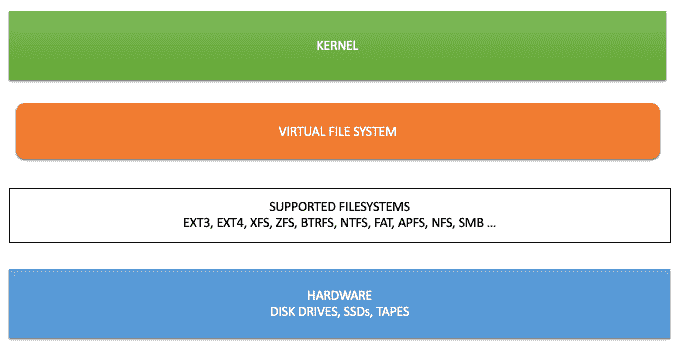

图 6.5 – Linux 虚拟文件系统抽象层

基本的文件系统功能包括为分层目录结构提供命名空间、元数据结构作为逻辑基础、磁盘块使用情况、文件大小和访问信息，以及逻辑卷和分区的高级数据。每个文件系统还有一个**应用程序编程接口**（**API**）。因此，开发人员可以访问系统功能调用，利用特定的算法进行文件的创建、移动、删除，或进行索引、搜索和查找文件。此外，每个现代文件系统都提供了一个特殊的访问权限方案，用于确定用户访问文件的规则。

到目前为止，我们已经介绍了主要的 Linux 文件系统，包括`EXT4`、`btrfs`和`XFS`。在下一节中，我们将教授你 Linux 中磁盘和分区管理的基础知识。

# 理解磁盘和分区

理解磁盘和分区是任何系统管理员的关键技能。格式化和分区磁盘至关重要，从系统安装开始。了解系统上可用的硬件类型非常重要，因此必须掌握如何使用这些硬件。其中之一就是磁盘；我们来进一步了解一下。

## 常见的磁盘类型

**磁盘**是存储数据的硬件组件。它有多种类型，并使用不同的接口。主要的磁盘类型包括广为人知的**旋转硬盘 HDD**、SSD 和**非易失性存储器 Express**（**NVMe**）。SSD 和 NVMe 使用类似 RAM 的技术，具有比传统旋转硬盘更低的能耗和更高的传输速率。以下是使用的接口：

+   **集成驱动电子**（**IDE**）：这是一种旧标准，广泛应用于具有较小传输速率的消费类硬件，现已被弃用。

+   **串行先进技术附件**（**SATA**）：这取代了 IDE，具有最高 16 GB/s 的传输速率。

+   **小型计算机系统接口**（**SCSI**）：这主要用于具有 RAID 配置的企业服务器，配备了复杂的硬件组件。

+   **串行附加 SCSI**（**SAS**）：这是一种点对点串行协议接口，传输速率类似于 SATA。它主要用于企业环境，因为其可靠性。

+   **通用串行总线**（**USB**）：这用于外部硬盘和存储设备。

每个磁盘都有特定的几何结构，包括磁头、磁道、柱面和扇区。在 Linux 系统中，要查看磁盘几何结构的信息，可以使用`fdisk -l`命令。

在我们的主要工作站上，我们有一个单独的 SSD 运行 Debian 12 GNU/Linux，并且一个 USB 设备插入其中一个端口。我们将运行以下命令以获取有关机器上驱动器的信息：

```
sudo fdisk -l
```

以下截图展示了`fdisk`命令输出的摘录，涉及两块驱动器：

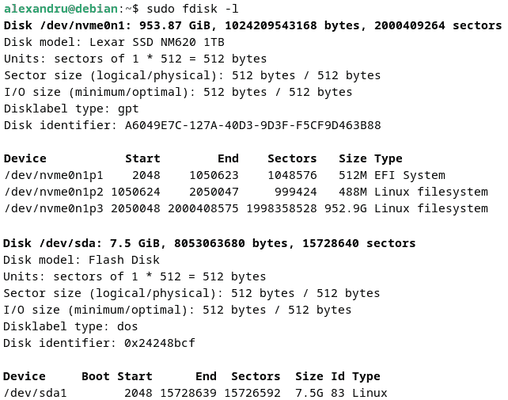

图 6.6 – fdisk -l 命令输出显示磁盘信息

`fdisk` 工具的输出初看起来可能让人感到有些复杂，但请放心，我们会为你解释，使其从现在开始变得更容易理解。通过不指定特定分区作为参数来使用 `fdisk` 工具，所有 `/proc/partitions` 中可用的分区信息都会显示出来。在前面的截图中，你可以看到系统中有两个磁盘的详细信息：一块 1 TB 的 Lexar NM620 SSD 和一块 8 GB 的 USB 闪存驱动器。我们来解释一下如何显示 1 TB 硬盘的信息：

+   首先，你会看到 `Disk model` 显示的是驱动器的名称，`Units` 为扇区，每个扇区大小为 512 字节，`Disklabel type` 为 GPT，`Disk identifier` 是每个驱动器唯一的标识符。

+   接下来是磁盘上可用分区的表格。这个表有六列（有时是七列，比如在截图底部显示的 USB 闪存驱动器）。第一列有 `Device` 标头，显示分区命名方案。第二列和第三列（在我们的例子中）显示分区的起始和结束扇区。第四列显示分区的总扇区数。第五列显示分区的大小（以人类可读的格式），最后一列显示文件系统的类型。

了解系统上磁盘设备的基本信息仅仅是操作 Linux 系统中磁盘和分区的起点。如果我们不对磁盘进行格式化和分区，它们只是大块的金属。因此，在下一节中，我们将教你什么是分区。

## 磁盘分区

一般来说，磁盘使用**分区**。要理解分区，了解磁盘的几何结构是至关重要的。这些传统的知识即使在处理 SSD 时仍然有用。分区是连续的扇区和/或磁道集合，它们可以有几种类型：**主分区**、**扩展分区**和**逻辑分区**。每个磁盘最多可以有 15 个分区。前四个分区将是主分区或扩展分区，其余的则是逻辑分区。此外，磁盘上只能有一个扩展分区，但它可以被划分为多个逻辑分区，直到达到最大数量为止。

### 分区类型

有两种主要的分区类型 – `0x0c` 代表 FAT，`0x07` 代表 NTFS，`0x83` 代表 Linux 文件系统类型，`0x82` 代表交换分区（swap）。GPT 成为**统一扩展固件接口**（**UEFI**）标准的一部分，解决了 MBR 的一些问题，包括分区限制、寻址方式、只使用一个分区表副本等等。它支持最多 128 个分区，磁盘大小可以达到 75.6 **泽字节**（**ZB**）。

### 分区表

磁盘的 **分区表** 存储在磁盘的 MBR 中。MBR 是磁盘的前 512 字节。其中，分区表占 64 字节，存储在前 446 字节的记录之后。在 MBR 的末尾，有 2 字节称为扇区结束标记。前 446 字节保留给通常属于引导加载程序的代码。在 Linux 中，引导加载程序称为 **GRand Unified** **Bootloader** (**GRUB**)。

当您启动 Linux 系统时，引导加载程序会查找活动分区。单个磁盘上只能有一个活动分区。找到活动分区后，引导加载程序会加载相关项目。分区表有 4 个条目，每个条目的大小为 16 字节，每个条目属于系统中的某个可能的主分区。此外，每个条目包含有关 `柱面/磁头/扇区` 的起始地址、分区类型代码、`柱面/磁头/扇区` 的结束地址、起始扇区和分区内扇区的数量等信息。

### 分区命名

内核通过低级方式与磁盘交互。这是通过存储在 `/dev` 目录中的设备节点来完成的。设备节点使用简单的命名约定，告诉您哪个磁盘需要关注。查看 `/dev` 目录的内容，您可以看到所有可用的磁盘节点，也称为磁盘驱动器，参见本节前面的 *图 6.2* 和 *图 6.3*。简短的说明总是很有用，因此磁盘和分区的识别如下：

+   第一块硬盘始终是 `/dev/sda`（对于 SCSI 或 SATA 设备）

+   第二块硬盘是 `/dev/sdb`，第三块是 `/dev/sdc`，以此类推

+   第一个磁盘的第一个分区是 `/dev/sda1`

+   第二个磁盘的第一个分区是 `/dev/sdb1`

+   第二个磁盘的第二个分区是 `/dev/sdb2`，以此类推

我们指定在 SCSI 和 SATA 的情况下是这样的，接下来我们需要稍微详细地解释一下。内核会根据 SCSI 设备的 ID 号给出字母标识，例如 *a*、*b* 和 *c*，而不是根据硬件总线的位置来决定。

### 分区属性

要了解分区的属性，您可以使用 `lsblk` 命令。我们将在我们的 Debian 系统上运行它，如下图所示：

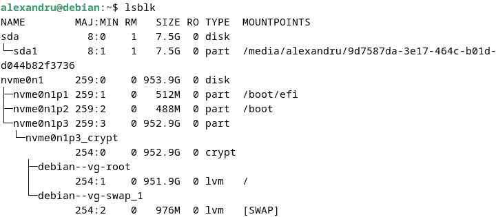

图 6.7 – lsblk 输出

`lsblk` 命令显示设备的名称（来自 `sysfs` 和 `udev` 数据库的节点名称）、主设备号和次设备号、设备的可拆卸状态（`0` 表示非可拆卸设备，`1` 表示可拆卸设备）、以人类可读格式显示的大小、只读状态（使用 `0` 表示非只读，`1` 表示只读）、设备类型以及设备的挂载点（如果有的话）。

现在我们对驱动器有了更多了解，接下来我们来学习如何修改磁盘的分区表。

### 分区表编辑器

在 Linux 中，管理分区表时有几种工具可以使用。最常用的工具包括以下几种：

+   `fdisk`：一个命令行分区编辑器，可能是最广泛使用的一个

+   `Sfdisk`：一个非交互式的分区编辑器，主要用于脚本编写

+   `parted`：GNU（GNU 是*GNU's Not Unix*的递归首字母缩写）分区操作软件

+   `gparted`：`parted`的图形界面

在这些工具中，我们只详细介绍如何使用`fdisk`，因为它是 Linux 中最广泛使用的命令行分区编辑器。它在 Ubuntu/Debian、RHEL/Fedora、openSUSE 以及许多其他发行版中都能找到。

在使用`fdisk`之前，我们希望查看操作系统已知的分区。如果你不确定刚刚完成的操作，可以使用`cat`命令查看`/proc/partitions`文件的内容：

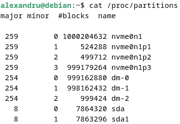

图 6.8 – 列出/proc/partitions 文件

要使用`fdisk`，你必须是 root 用户。我们建议你在使用`fdisk`时要小心，因为它可能会损坏你现有的分区和磁盘。你可以在特定磁盘上使用`fdisk`，方法如下：

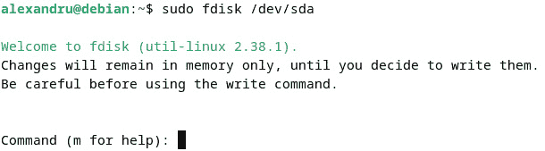

图 6.9 – 第一次使用 fdisk

你会注意到，在第一次使用`fdisk`时，会有警告提示，表示只有在你决定将更改写入磁盘时，才会对磁盘进行更改。系统还会提示你输入命令，并会显示`m`选项以供帮助。我们建议你始终使用帮助菜单，即使你已经知道最常用的命令。

当你输入`m`时，将显示`fdisk`的完整命令列表。你将看到用于管理分区、创建新引导记录、保存更改等选项。分区表编辑器是管理 Linux 磁盘的重要工具。如果你不知道如何格式化分区，使用它们是不完整的。在接下来的部分，我们将向你展示如何对磁盘进行分区。

### 创建和格式化分区

我们将使用`fdisk`工具在插入主工作站上的 USB 闪存驱动器（运行 Debian GNU/Linux）上创建一个新的分区表。我们将使用以下命令创建 MBR 分区表：

```
sudo fdisk /dev/sda
```

我们将使用`o`选项创建一个空的 MBR 分区表，然后使用`w`选项将更改保存到磁盘。命令的输出如下所示：

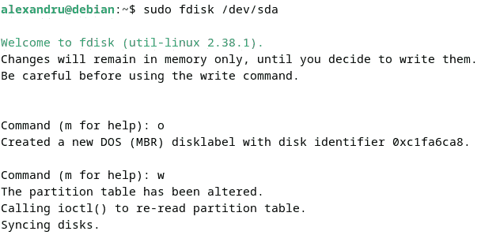

图 6.10 – 使用 fdisk 创建新的 MBR 分区表

到此为止，分区表已创建，但磁盘上尚未定义任何分区。仍然处于 `fdisk` 命令行界面时，您可以使用 `v` 选项验证新创建的分区表，使用 `I` 选项查看现有分区的信息。您将看到一些输出，表明尚未定义任何分区。因此，现在是时候设置一个新分区了。

要创建一个新分区，我们将使用以下系列选项：

+   使用 `n` 选项启动创建过程

+   当提示创建主分区（`p`）或扩展分区（`e`）类型时，使用 `p` 选项

+   输入分区号（使用默认值 `1`）

+   输入第一个扇区（使用默认值 `2048`）

+   输入最后一个扇区 – 如果您希望分区具有特定大小，可以使用 KB、MB、GB 等单位的大小值，或使用扇区值（默认是磁盘的最大大小）

+   如果提示删除任何签名，输入 `Y` 以删除它们

+   `w` 用于将更改写入磁盘

上一系列操作的输出显示在以下屏幕截图中：

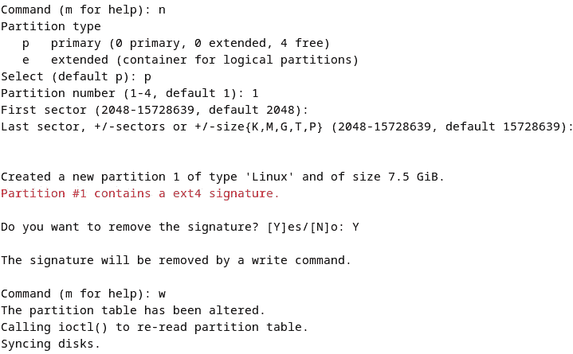

图 6.11 – 使用 fdisk 创建新分区

到此为止，分区已创建，但尚未格式化。在学习如何格式化分区之前，我们先来学习如何备份分区表。

有时您需要备份并恢复您的 `dd` 工具。使用的命令如下：

```
sudo dd if=/dev/sda of=mbr-backup bs=512 count=1
```

这个程序非常有用且强大，因为它可以克隆磁盘或擦除数据。以下是一个展示命令输出的例子：

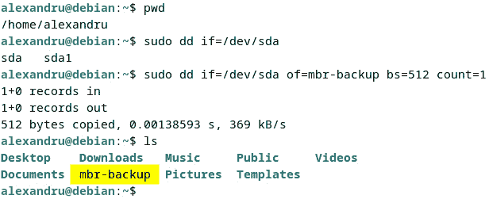

图 6.12 – 使用 dd 命令备份 MBR

`dd` 命令有一个清晰的语法。默认情况下，它使用标准输入和标准输出，但您可以通过指定新输入文件（使用 `if` 选项）和输出文件（使用 `of` 选项）来更改这些。我们将输入文件指定为要备份的磁盘的设备文件，并为备份输出文件指定了名称。我们还使用 `bs` 选项指定了块大小，并使用 `count` 选项指定了要读取的块数。

要恢复引导加载程序，我们可以使用 `dd` 命令，如下所示：

```
sudo dd if=~/mbr-backup of=/dev/sda bs=512 count=1
```

现在您已经学习了如何使用 `dd` 备份分区表，我们来格式化之前创建的分区。格式化分区的最常用程序是 `mkfs`。格式化分区也称为*创建*文件系统，因此该工具的名称就是这么来的。它有针对不同文件系统的特定工具，但都使用相同的前端工具。以下是 `mkfs` 支持的所有文件系统列表：

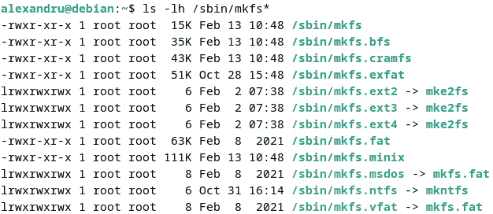

图 6.13 – 关于 mkfs 工具的详细信息

要将目标磁盘格式化为 `Ext4` 文件系统，我们将使用 `mkfs` 工具。执行的命令如下：

1.  首先，我们将运行`fdisk`工具，以确保正确选择最大磁盘。运行以下命令：

    ```
    sudo fdisk -l
    ```

1.  然后，极其小心地检查输出并选择正确的磁盘名称。

1.  现在我们已经知道要操作的磁盘，接下来我们将使用`mkfs`将其格式化为`Ext4`文件系统。输出如下所示：

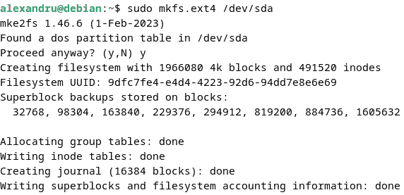

图 6.14 – 使用 mkfs 格式化 Ext4 分区

使用`mkfs`时，有多个选项可供选择。要创建一个`Ext4`类型的分区，你可以使用*图 6.14*中显示的命令，也可以使用`-t`选项后跟文件系统类型。你还可以使用`-v`选项以获取更详细的输出，使用`-c`选项扫描坏道并创建文件系统。如果你想在命令中直接添加分区标签，还可以使用`-L`选项。以下是创建一个名为`newpartition`的`Ext4`文件系统分区的示例：

```
sudo mkfs -t ext4 -v -c -L newpartition /dev/sda
```

一旦分区格式化完成，建议检查其是否存在错误。类似于`mkfs`，有一个名为`fsck`的工具。这是一个有时会在异常关机后或按设定间隔自动运行的工具。它针对最常用的文件系统有特定的程序，就像`mkfs`一样。以下是运行`fsck`时显示的输出。运行后，它会显示是否有任何问题。在以下截图中，输出显示检查分区时没有发现错误：

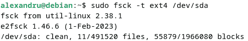

图 6.15 – 使用 fsck 检查分区

创建分区后，需要将其挂载；否则，无法使用。

重要提示

**挂载**是 Linux 以及任何其他操作系统中的一项重要操作。通过挂载，你为操作系统提供了访问磁盘资源的方式，使其看起来就像使用本地磁盘一样。在 Linux 中，挂载的外部磁盘会链接到挂载点，即本地文件系统上的一个目录。挂载点对于 POSIX 兼容的操作系统（如 Linux）至关重要。挂载磁盘后，操作系统可以通过挂载点访问整个磁盘。有关挂载的更多信息，请访问[`docs.oracle.com/cd/E19455-01/805-7228/6j6q7ueup/index.html`](https://docs.oracle.com/cd/E19455-01/805-7228/6j6q7ueup/index.html)。

每个分区将在现有的文件系统结构中挂载。挂载可以在树结构的任何位置进行。每个文件系统都会挂载在某些目录下，这些目录是在目录结构内部创建的。我们将在下一节中探讨挂载和卸载分区的过程。

### 挂载和卸载分区

`mount`和`umount`。要查看某个分区是否已挂载，你可以简单地输入`mount`并查看输出，该输出可能会非常庞大。你可以使用`grep`来筛选它：

```
mount | grep /dev/sda
```

我们在输出中查找 `/dev/sda`，但未显示出来。这意味着该驱动器未挂载。

为了挂载它，我们需要创建一个新的目录。为了简便起见，我们将展示从创建目录到挂载并使用分区所需的所有步骤：

1.  创建一个新的目录来挂载分区。在我们的例子中，我们在`/home/alexandru`目录下创建了一个名为 `USB` 的新目录：

    ```
    mkdir USB
    ```

1.  使用以下命令挂载分区：

    ```
    mbr-backup file we created a few steps back to the newly mounted USB memory stick using the following command:

    ```

    sudo cp mbr-backup USB/

    ```

    ```

以下是前面列表中所有命令的输出：

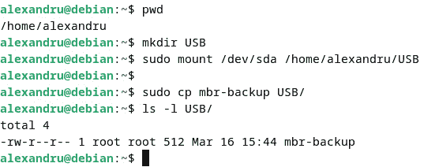

图 6.16 – 挂载外部存储设备

`mount` 命令需要超级用户权限。如果你尝试在没有 `sudo` 的情况下挂载外部 USB 设备，你将看到以下消息：

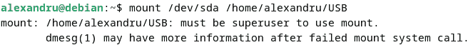

图 6.17 – 未使用 sudo 执行 mount 命令时的错误

`mount` 工具有许多可用选项。使用帮助菜单可以查看它的所有功能。现在分区已经挂载，你可以开始使用它。如果你想卸载它，可以使用 `umount` 工具。你可以按照以下方式使用它：

```
sudo umount /dev/sda
```

卸载文件系统时，如果该分区仍在使用中，你可能会收到错误信息。被使用意味着该文件系统中的某些程序仍在内存中运行，并正在使用该分区中的文件。因此，你必须首先关闭所有正在运行的应用程序，如果其他进程正在使用该文件系统，你也需要终止它们。有时，文件系统忙碌的原因起初并不明显，你可以使用 `lsof` 命令来查看哪些文件正在被打开和使用：

```
sudo lsof | grep /dev/sda
```

挂载文件系统只会使其在系统关闭或重启之前可用。如果你希望更改具有持久性，你需要相应地编辑 `/etc/fstab` 文件。首先，用你喜欢的文本编辑器打开该文件：

```
sudo nano /etc/fstab
```

添加一行与以下内容类似的新行：

```
/dev/sda /mnt/sdb ext4 defaults 0 0
```

`/etc/fstab` 文件是文件系统表的配置文件。它包含了一组用于控制文件系统使用方式的规则。通过大大减少可能的错误，它简化了每次使用时手动挂载和卸载每个磁盘的需求。该表有六列结构，每列对应特定的参数。参数的顺序是固定的，必须按正确顺序排列才能正常工作：

+   **设备名称**：可以使用 UUID 或已挂载设备名称

+   **挂载点**：设备所在的目录，或者设备将被挂载的目录

+   **文件系统类型**：所使用的文件系统类型

+   **选项**：显示的选项，如果有多个选项，则用逗号分隔

+   `0` = 不进行备份，`1` = 执行 dump 工具备份

+   `0` = 不进行 `fsck` 文件系统检查，`1` 代表根文件系统，`2` 代表其他分区

通过更新`/etc/fstab`文件，挂载将变为永久性的，不会受到任何关机或系统重启的影响。通常，`/etc/fstab`文件只存储内部硬盘分区和文件系统的信息。外部硬盘或 USB 驱动器会通过内核的**硬件抽象层**（**HAL**）自动挂载到`/media`下。

到目前为止，你应该已经掌握了在 Linux 中管理分区的方法，但还有一种我们尚未讨论的分区类型：**交换分区**。在下一节中，我们将介绍交换在 Linux 中的工作原理。

### 交换分区

Linux 使用了一个健壮的交换（swap）实现。当物理内存满时，虚拟内存会通过交换使用硬盘空间。这些额外的空间可以提供给那些没有使用完所有分配内存的程序，或者在内存压力很大时使用。交换通常是通过一个或多个专用分区来完成的，因为 Linux 允许多个交换区域。推荐的交换空间大小至少是系统总内存的大小。要查看系统上实际使用的交换空间，可以连接`/proc/swaps`文件或使用`free`命令来查看交换的利用率，如下图所示：

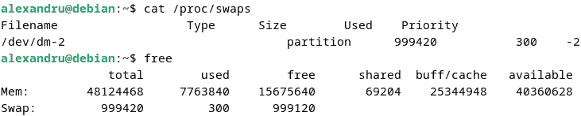

图 6.18 – 检查当前使用的交换空间

如果系统没有设置交换空间，你可以将一个分区格式化为交换空间并激活它。执行此操作的命令如下：

```
mkswap /dev/sda1
swapon /dev/sda1
```

操作系统会将文件内容缓存到内存中，以尽量避免使用交换空间。这是因为内存的工作速度比硬盘或硬盘驱动器要快得多。只有在可用内存有限时才会使用交换空间。然而，内核使用的内存永远不会被交换；只有用户空间使用的内存才会被交换。这保证了内核的数据完整性。请参考我们在*第五章*中使用的工具，查看 Linux 中的内存使用情况。

文件系统和分区是任何磁盘管理任务的基础，但管理员仍然需要克服一些难题，这可以通过使用逻辑卷来解决。这就是为什么在下一节中，我们将介绍 LVM。

# 在 Linux 中介绍 LVM

你们中的一些人可能已经听说过**LVM**。对于那些不知道它是什么的人，我们将在本节简要说明。假设你的硬盘空间已满。你总是可以将数据迁移到一个更大的硬盘并替换小的那个，但这需要系统重启并导致不必要的停机。为了解决这个问题，你可以考虑使用 LVM，它提供了更大的灵活性和效率。通过使用 LVM，你可以在仍在使用的情况下，向现有的卷组中添加更多的物理硬盘。这样仍然可以将数据迁移到新硬盘，但无需停机——一切都可以在文件系统在线的情况下完成。

在 Linux 中用于 LVM 管理的工具包括`pvcreate`、`vgcreate`、`vgdisplay`、`lvcreate`、`lvextend`和`lvdisplay`。让我们来学习如何使用它们。

由于我们还没有配置 LVM 的系统，我们将展示如何在另一个系统上创建新的 LVM 卷，该系统有两个内部硬盘：一个上安装了操作系统，另一个是空闲的。我们将使用 Debian GNU/Linux，但这些命令对于任何其他基于 Linux 的操作系统都是相同的。

按照以下步骤创建 LVM 卷：

1.  使用`fdisk`命令验证可用磁盘的名称（你也可以使用`lsblk`来完成这一步）：

    ```
    /dev/sda.
    ```

1.  使用`pvcreate`命令创建 LVM 物理卷：

    ```
    wipefs utility. The output is shown in the following screenshot:
    ```

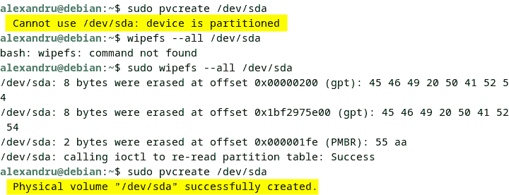

图 6.19 – 使用 pvcreate 创建 LVM 物理卷

1.  使用`vgcreate`命令创建一个新的卷组，将新物理卷添加到其中：

    ```
    vgdisplay command:
    ```

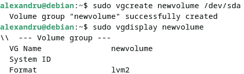

图 6.20 – 创建并查看新卷的详细信息

1.  现在，让我们使用`lvcreate`从卷组中使用一些可用空间创建一个逻辑卷。使用`-n`选项为逻辑卷添加名称，使用`-L`选项设置大小（我们创建了一个名为`projects`的 5 GB 逻辑卷）：

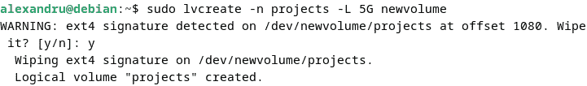

图 6.21 – 使用 lvcreate 创建逻辑卷

1.  检查逻辑卷是否存在：

    ```
    sudo ls /dev/mapper/newvolume-projects
    ```

1.  新创建的设备只有在使用已知的文件系统格式化并挂载之后才能使用，方法与普通分区相同。首先，让我们格式化新卷：

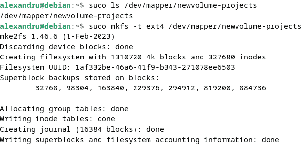

图 6.22 – 将新逻辑卷格式化为 Ext4 文件系统

1.  现在，是时候挂载逻辑卷了。首先，创建一个新的目录，并将逻辑卷挂载到该目录中。然后，使用`df`命令检查其大小：

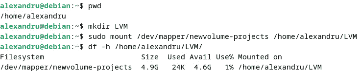

图 6.23 – 挂载逻辑卷

1.  到目前为止实施的所有更改都不是永久性的。为了使它们永久生效，你需要编辑`/etc/fstab`文件，并在文件中添加以下内容：

    ```
    vgdisplay command to see the following details:

    ```

    lvextend 命令。我们将把初始大小扩展 5 GB，总共为 10 GB。以下是一个示例：

    ```

    ```

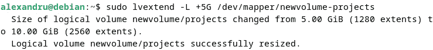

图 6.24 – 使用 lvextend 扩展逻辑卷

1.  现在，使用`resize2fs`调整文件系统的大小以适应逻辑卷的新大小，并使用`df`检查大小：

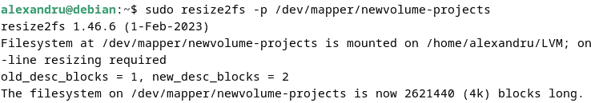

图 6.25 – 使用 resize2fs 调整逻辑卷的大小，并使用 df 检查大小

LVM 是一个高级主题，对于任何 Linux 系统管理员来说，都必不可少。我们在这一部分提供的简单操作示例只展示了你需要使用 LVM 的基本操作。如果需要，你可以深入研究这个主题。

在接下来的部分中，我们将讨论更多高级的 LVM 主题，包括如何创建完整的文件系统快照。

## LVM 快照

什么是 LVM 快照？它是 LVM 逻辑卷的冻结实例。更具体来说，它使用 **写时复制** 技术。这项技术会监控现有卷的每一个块，当块发生变化时，由于新的写入，该块的值将被复制到快照卷中。

快照会持续不断地创建并即时生效，直到它们被删除为止。这样，你可以从任何快照创建备份。由于快照会不断变化，受写时复制技术的影响，在创建快照时，应该提前考虑快照的大小。如果可能的话，考虑在快照存在期间，数据将会发生多少变化。一旦快照满了，它将会被自动禁用。

### 创建一个新的快照

要创建一个新的快照，可以使用 `lvcreate` 命令，并加上 `-s` 选项。你还可以使用 `-L` 选项指定大小，使用 `-n` 选项为快照命名，示例如下：

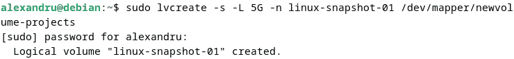

图 6.26 – 使用 lvcreate 命令创建 LVM 快照

在前面的命令中，我们设置了 5 GB 的大小并使用了名称 `linux-snapshot-01`。命令的最后部分指定了我们为其创建快照的卷的目标位置。要列出新创建的快照，可以使用 `lvs` 命令：

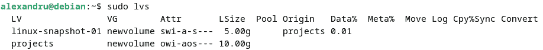

图 6.27 – 列出可用的卷和新创建的快照

要了解更多关于逻辑卷的信息，请运行`lvdisplay`命令。输出将显示所有卷的信息，其中你会看到我们刚刚创建的快照。

当我们创建快照时，给它设置了 5 GB 的大小。现在，我们想将其扩展到源卷的大小，即 10 GB。我们将使用 `lvextend` 命令来实现这一点：

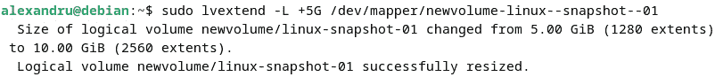

图 6.28 – 将快照从 5 GB 扩展到 10 GB

如前面的截图所示，快照卷使用的名称与我们使用的名称不同。尽管我们为快照卷使用了名称 `linux-snapshot-01`，但如果我们列出 `/dev/mapper/` 目录，看到的名称实际上会包含两个额外的连字符。这是用来表示逻辑卷文件的命名约定。

现在你已经知道如何创建快照，让我们来学习如何恢复快照。

### 恢复快照

要恢复一个快照，首先，你需要卸载文件系统。要卸载，我们将使用`umount`命令：

```
sudo umount /home/alexandru/LVM
```

然后，我们可以使用`lvconvert`命令恢复快照。在快照合并到源后，我们可以使用`lvs`命令检查这一点。两个命令的输出如以下截图所示：

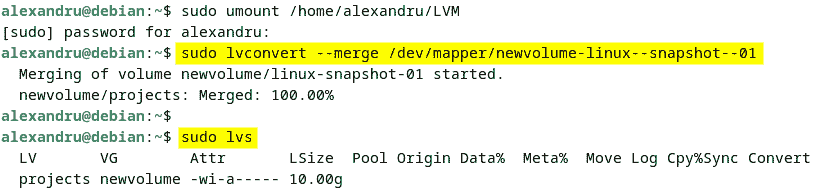

图 6.29 – 恢复和检查快照

合并后，快照会被自动移除。

我们现在已经涵盖了 Linux 中 LVM 的所有基础知识。LVM 比普通的磁盘分区更为复杂，可能会让许多人感到望而却步，但在需要时它能够展现其优势。然而，它也有一些缺点——例如，在灾难恢复或硬件故障发生时，它可能增加不必要的复杂性。但撇开这些不谈，它仍然值得学习。

# 总结

管理文件系统和磁盘是任何 Linux 系统管理员的重要任务。了解 Linux 中设备的管理方式，以及如何格式化和分区磁盘，是非常必要的。此外，学习 LVM 也很重要，因为它提供了一种灵活的分区管理方式。

掌握这些技能将为你提供任何基础管理任务的坚实基础。在接下来的章节中，我们将向你介绍 Linux 中广阔的**网络管理**领域。

# 问题

如果你成功浏览了本章的部分内容，你可能想回顾一下关于 Linux 文件系统和磁盘管理的一些重要细节：

1.  想到另一个工具用于处理磁盘并安装它。

    使用`parted`并从命令行使用它。你也可以从 GUI 使用 GParted。

1.  尝试使用 Disks（在 GNOME 中）和 KDE Partition Manager（在 KDE 中），并将命令行界面并排使用。

    **提示**：保持两个应用程序打开，并将命令行工具并排使用。尝试在保持 GUI 应用程序打开的同时从命令行格式化和挂载磁盘。

1.  使用不同的文件系统格式化新的分区。

    使用`btrfs`替代`ext4`。

1.  探索你的文件系统和磁盘。

    `lsblk`、`df`和`fdisk`。

# 进一步阅读

如需了解本章中涵盖的更多信息，请参考以下 Packt 出版的书籍：

+   *Linux 管理最佳实践*，作者：Scott Alan Miller

+   *Mastering Ubuntu Server – 第四版*，作者：Jay LaCroix
