# 7

# 与 Linux 的网络连接

**Linux 网络**是一个广阔的领域。在过去几十年里，关于 Linux 网络管理内部机制的书籍和参考资料数不胜数。有时，仅仅是理解基本概念，对初学者和高级用户来说都会感到不小的压力。本章提供了一个相对简洁的 Linux 网络概述，重点介绍网络通信层、套接字和端口、网络服务和协议以及网络安全。

我们希望本章内容既能为初学者提供一个舒适的 Linux 网络基本概念入门，也能为高级 Linux 管理员提供一个很好的复习资料。

在本章中，我们将涵盖以下主题：

+   探索基础网络——重点介绍计算机网络、网络模型、协议、网络地址和端口。我们还将介绍一些使用命令行终端配置 Linux 网络设置的实际操作。

+   使用网络服务——介绍在 Linux 上运行的常见网络服务器。

+   理解网络安全。

# 技术要求

在本章中，我们将一定程度上使用 Linux 命令行。建议安装一个工作中的 Linux 发行版，可以是在 **虚拟机**（**VM**）或桌面平台上。如果你还没有安装，请返回到*第一章*，*安装 Linux*，它将引导你完成安装过程。本章中大多数命令和示例使用的是 Ubuntu 和 Fedora，但同样适用于其他任何 Linux 平台。

# 探索基础网络

今天，几乎无法想象一台没有连接到某种网络或互联网的计算机。我们的日益增长的在线存在、云计算、移动通信和 **物联网**（**IoT**）都离不开为底层数据流量提供服务的高度分布式、高速、可扩展的网络；然而，现代互联网背后的基本网络原理已有几十年历史。网络和通信范式将继续发展，但一些原始的基础元素和概念仍将对塑造未来通信的基石产生持久影响。

本节将介绍其中的一些网络基础知识，并希望能激发你进一步探索的兴趣。让我们从计算机网络开始。

## 计算机网络

**计算机网络**是指通过物理介质（电缆、无线、光纤）连接的两台或更多计算机（或节点），并通过标准的协议集进行相互通信。从宏观角度看，**网络通信基础设施**包括计算机、设备、交换机、路由器、以太网或光纤电缆、无线环境以及各种网络设备。

除了*物理*连接和布置外，网络还通过网络拓扑、层级和相关的数据流定义了*逻辑*布局。一个逻辑网络层次结构的例子是**非军事区**（**DMZ**）、*防火墙*和*内部*网络的三层结构。DMZ 是组织面向外部的网络，具有额外的安全层来防御公共互联网。防火墙控制着 DMZ 与内部网络之间的网络流量。

网络设备的标识由以下几个方面决定：

+   **网络地址**：这些有助于通过**通信协议**定位网络上的节点，例如**互联网协议**（**IP**）（有关 IP 的更多内容，请参见本章后面的*TCP/IP 协议*部分）

+   **主机名**：这些是与设备相关的用户友好的标签，比网络地址更容易记住

一种常见的分类标准是考虑计算机网络的*规模*和*扩展*。让我们来介绍一下**局域网**（**LANs**）和**广域网**（**WANs**）：

+   **局域网**（**LANs**）：LAN 表示一组连接并位于单一物理位置的设备，例如私人住宅、学校或办公室。LAN 可以是任何规模，从只有少数设备的家庭网络，到拥有成千上万用户和计算机的大型企业网络。

    无论网络的规模如何，LAN 的基本特征是它将设备连接在一个有限的区域内。LAN 的例子包括单户住宅的家庭网络或你所在的咖啡店的免费无线服务。

    关于 LAN 的更多信息，请参见[`www.cisco.com/c/en/us/products/switches/what-is-a-lan-local-area-network.html`](https://www.cisco.com/c/en/us/products/switches/what-is-a-lan-local-area-network.html)。

    当计算机网络跨越多个区域或多个互联的 LAN 时，WAN 开始发挥作用。

+   **广域网**（**WANs**）：WAN 通常是一个由多个或分布式的局域网（LAN）相互通信的网络。从这个角度看，我们可以将互联网视为全球最大的 WAN。WAN 的一个例子是跨国公司在全球各地地理分布的办公地点的计算机网络。有些 WAN 是由服务提供商构建的，供全球各地的企业和机构租用。

    WAN 有几种变体，具体取决于它们的类型、范围和用途。WAN 的典型例子包括**个人区域网络**（**PANs**）、**城市区域网络**（**MANs**）和**云**或**互联网区域****网络**（**IANs**）。

    关于 WAN 的更多信息，请参见[`www.cisco.com/c/en/us/products/switches/what-is-a-wan-wide-area-network.html`](https://www.cisco.com/c/en/us/products/switches/what-is-a-wan-wide-area-network.html)。

我们认为，对于基础网络原理的适当介绍应当包括简要介绍支配网络通信的理论模型。接下来，我们将讨论这一点。

## OSI 模型

**开放系统互联**（**OSI**）模型是一个理论性的表示，描述了计算机系统之间通过网络进行多层次通信的机制。OSI 模型于 1983 年由**国际标准化组织**（**ISO**）提出，旨在为不同计算机系统之间的通信提供标准。

我们可以将 OSI 模型视为网络通信的通用框架。如以下图所示，OSI 模型定义了七层协议栈，指引着通信流的方向：

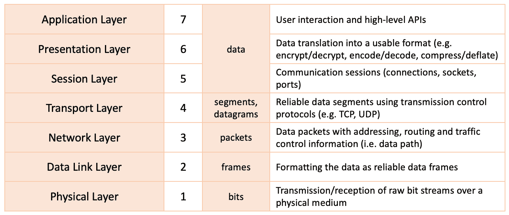

图 7.1 – OSI 模型

在前述图所示的分层视图中，通信流从上至下（在发送端）或从下至上（在接收端）移动。在详细查看每一层之前，我们先简要解释一下 OSI 模型以及数据封装和解封装的工作原理。

### OSI 模型中的数据封装和解封装

在使用网络将数据从一台计算机传输到另一台计算机时，需要遵循一些特定的规则。在 OSI 模型中，网络数据流有两种不同的传输方式。一种是从第 7 层到第 1 层的下行传输，这被称为**数据封装**。另一种是从第 1 层到第 7 层的上行传输，这被称为**数据解封装**。数据封装表示从一台计算机向另一台计算机发送数据的过程，而数据解封装表示接收数据的过程。让我们更详细地了解这些过程：

+   **封装**：在发送数据时，来自一台计算机的数据会被转换为可以通过网络发送的格式，并且在经过协议栈的每一层时，数据会附加额外的信息。应用层（第 7 层）是用户直接与应用程序交互的地方。接着，数据会通过表示层（第 6 层）和会话层（第 5 层），在这些层中，数据被转化为可用的格式。在传输层（第 4 层），数据被分割成较小的块（段），并获得一个新的 TCP 头部。在网络层（第 3 层），数据被称为数据包，获得一个 IP 头部，并被发送到数据链路层（第 2 层），在此它被称为帧，并包含 TCP 和 IP 头部。在第 2 层，每个帧都会接收到源地址和目的地址的硬件信息（**媒体访问控制**（**MAC**）地址），以及网络层中将要使用的协议的信息（由**逻辑链路控制**（**LLC**）数据通信协议创建）。此时，添加了一个新的字段，称为**帧校验序列**（**FCS**），用于检查错误。接着，帧会被传递到物理层（第 1 层）。

+   **去封装**：当数据接收时，过程是相同的，但顺序是相反的。从物理层（第一层）开始，首先发生同步，然后帧通过数据链路层（第二层），在那里进行错误检查，通过验证 FCS 字段。这一过程称为**循环冗余检查**（**CRC**）。现在是数据包的数据，经过所有其他层。此时，在封装过程中添加的头信息被去除，直到它们到达上层并准备在目标计算机上使用。以下图形提供了详细的解释：

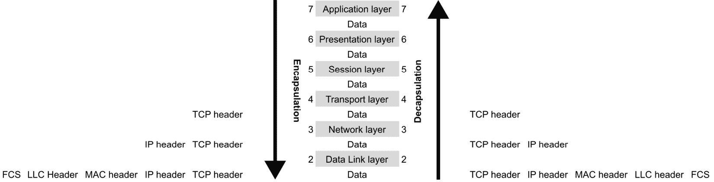

图 7.2 – OSI 模型中的封装与去封装

让我们详细看一下这些层，并描述它们在塑造网络通信中的功能。

### 物理层

**物理层**（或*第一层*）由连接设备并提供通信服务的网络设备或基础设施组成，例如电缆、无线或光学环境、连接器和交换机。该层处理原始比特流与通信媒介（包括电信号、无线电信号或光学信号）之间的转换，同时调节相应的比特率控制。

在物理层上运行的协议示例包括以太网、**Universal Serial Bus**（**USB**）和**数字用户线**（**DSL**）。

### 数据链路层

**数据链路层**（或*第二层*）在网络中建立两个直接连接设备之间可靠的数据流，无论是作为广域网中的相邻节点，还是局域网中的设备。数据链路层的责任之一是流量控制，适应物理层的通信速度。在接收设备上，数据链路层修正源自物理层的通信错误。数据链路层由以下子系统组成：

+   **媒体访问控制**（**MAC**）：此子系统使用 MAC 地址来标识和连接网络中的设备。它还控制设备访问权限，以在网络上传输和接收数据。

+   **逻辑链路控制**（**LLC**）：该子系统识别并封装网络层协议，并在传输或接收数据时执行错误检查和帧同步。

数据链路层控制的协议数据单元也被称为**帧**。帧是数据传输单元，充当单个网络数据包的容器。网络数据包在下一个 OSI 层（*网络层*）中被处理。当多个设备同时访问同一物理层时，可能会发生帧碰撞。数据链路层协议可以检测并恢复此类碰撞，并进一步减少或防止它们的发生。

例如，还有以太网帧，这些是为 MAC 实现定义的封装数据。原始的 IEEE 802.3 以太网格式、802.3 **子网络访问协议** (**SNAP**) 和以太网 II（扩展）帧格式也可用。

另一个数据链路协议的例子是 **点对点协议** (**PPP**)，这是一种用于高速宽带通信网络的二进制网络协议。

### 网络层

**网络层**（或 *第 3 层*）发现网络上设备之间的最佳通信路径（或路由）。该层使用基于参与数据交换设备 IP 地址的路由机制，将数据包从源端传送到目标端。

在发送端，网络层将源自 *传输层* 的数据段拆分成网络包。在接收端，数据帧从下层（*数据链路层*）重新组装成数据包。

一个在网络层运行的协议是 **互联网控制消息协议** (**ICMP**)。ICMP 被网络设备用于诊断网络通信问题。当请求的端点不可用时，ICMP 会通过发送诸如 *目标网络不可达*、*定时器过期*、*源路由失败* 等消息来报告错误。

### 传输层

**传输层**（或 *第 4 层*）处理 **数据段** 或 **数据报**。该层主要负责将数据从源传输到目标，并保证特定的 **服务质量** (**QoS**)。在发送端，来自上层（*会话层*）的数据被拆分成数据段；在接收端，传输层将从下层（*网络层*）接收到的数据包重新组装成数据段。

传输层通过流量控制和错误控制功能保持数据传输的可靠性。流量控制功能调整具有不同连接速度的端点之间的数据传输速率，以避免发送方压倒接收方。当接收到的数据不正确时，错误控制功能可能会请求数据重传。

传输层协议的例子包括 **传输控制协议** (**TCP**) 和 **用户数据报协议** (**UDP**).

### 会话层

**会话层**（或 *第 5 层*）控制设备间通信连接通道（或会话）的生命周期。在这一层，会话或网络连接通常由网络地址、套接字和端口定义。我们将在 *套接字和端口* 以及 *IP 地址* 部分解释这些概念。会话层负责通信通道或会话内数据传输的完整性。例如，如果会话被中断，数据传输会从先前的检查点恢复。

一些典型的会话层协议包括**远程过程调用**（**RPC**）协议，通常用于进程间通信，以及**网络基础输入输出系统**（**NetBIOS**），这是一个文件共享和名称解析协议。

### 表示层

**表示层**（或*第六层*）充当*应用层*和*会话层*之间的数据转换层。在发送端，这一层会将数据格式化为独立于系统的表示形式，然后发送到网络上。在接收端，表示层将数据转化为适合应用的格式。此类转换的例子包括加密与解密、压缩与解压缩、编码与解码，以及序列化与反序列化。

通常，表示层和应用层之间没有实质性的区别，主要是由于各种数据格式与其使用应用之间的相对紧密耦合。标准数据表示格式包括**美国信息交换标准代码**（**ASCII**）、**可扩展标记语言**（**XML**）、**JavaScript 对象表示法**（**JSON**）、**联合图像专家组**（**JPEG**）、ZIP 等。

### 应用层

**应用层**（或*第七层*）是离 OSI 模型中最终用户最近的一层。该层以某种有意义的方式收集或提供应用数据的输入或输出。该层并不包含或运行应用程序本身。相反，它充当应用程序、实现通信组件与底层网络之间的抽象。与应用层交互的典型应用程序包括网页浏览器和电子邮件客户端。

第七层协议的几个例子包括 DNS 协议、**超文本传输协议**（**HTTP**）、**文件传输协议**（**FTP**）以及电子邮件消息协议，如**邮局协议**（**POP**）、**互联网消息访问协议**（**IMAP**）和**简单邮件传输协议**（**SMTP**）。

在结束之前，我们需要注意，OSI 模型是一个通用的网络通信层次模型，并为网络通信的工作原理提供了理论指导。类似的，但更具实际应用的网络协议栈模型是 TCP/IP 模型。这两种模型在网络设计、实现、故障排除和诊断方面都非常有用。OSI 模型使网络操作员能够很好地理解完整的网络协议栈，从物理媒介到应用层，每一层都有**协议数据单元**（**PDU**）和通信内部结构。然而，TCP/IP 模型相对简化，将一些 OSI 模型的层次合并为一层，并且采用了一种更为以协议为中心的网络通信方式。我们将在下一节中详细探讨这一点。

## TCP/IP 网络协议栈模型

**TCP/IP 模型**是对 OSI 网络堆栈的四层解释，其中一些等效的 OSI 层被合并，如下图所示：

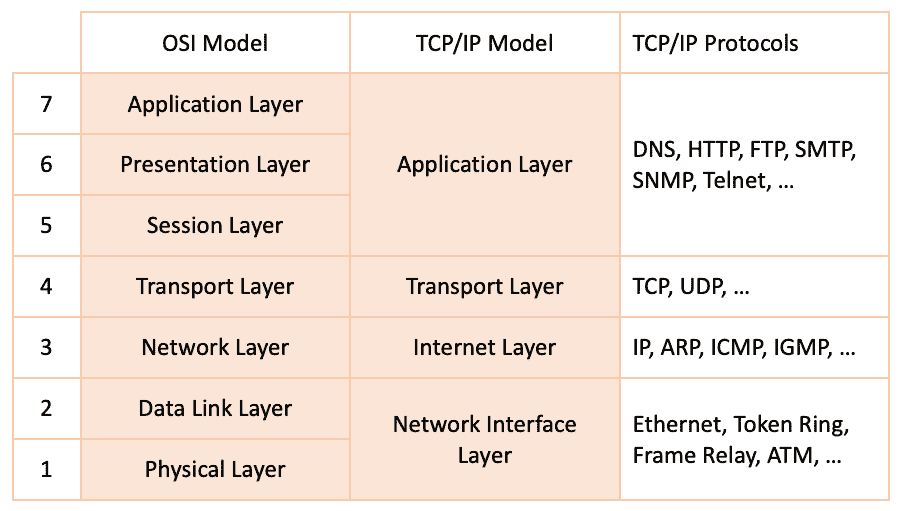

图 7.3 – OSI 和 TCP/IP 模型

按时间顺序，TCP/IP 模型比 OSI 模型更早。它最初由美国 **国防部**（**DoD**）提出，作为由 **国防高级研究计划局**（**DARPA**）开发的一个互联网络项目的一部分。这个项目最终成为了现代互联网的雏形。

TCP/IP 模型的各个层次封装了与其对应的 OSI 层相似的功能。以下是 TCP/IP 模型中各层的总结。

### 网络接口层

**网络接口层**负责通过物理介质（如电缆、无线或光纤）传输数据。该层操作的网络协议包括以太网、令牌环和帧中继。该层对应于 OSI 模型中的 *物理层和数据链路层* 的组合。

### 网络层

**网络层**提供 *无连接* 的数据传输服务，允许网络节点之间进行数据交换。无连接协议描述了一种网络通信模式，其中发送方将数据传输给接收方，而无需双方事先建立连接。该层负责在发送端将数据拆解为网络数据包，并在接收端将其重新组装。网络层通过路由功能来识别网络节点之间的最佳路径。该层与 OSI 模型中的 *网络层* 对应。

### 传输层

**传输层**（也称为 **传输层** 或 **主机到主机层**）负责保持连接网络节点之间的通信会话。传输层实现了错误检测和修正机制，以确保端点之间可靠的数据传输。该层与 OSI 模型中的 *传输层* 相对应。

### 应用层

**应用层**提供了软件应用程序与底层网络之间的数据通信抽象。该层对应于 OSI 模型中的 *会话层、表示层和应用层* 的组合。

如本章前面所讨论的，TCP/IP 模型是一个以协议为中心的网络堆栈表示模型。该模型通过逐步定义和开发用于互联网通信的网络协议，为互联网奠定了基础。这些协议统称为 *IP 套件*。以下部分描述了一些最常见的网络协议。

## TCP/IP 协议

在本节中，我们将描述一些广泛使用的网络协议。这里提供的参考内容不应被视为全面的指南。TCP/IP 协议数量庞大，全面研究超出了本章的范围。然而，有一些值得探索的协议，它们在日常网络通信和管理工作流中经常被使用。

以下列表简要描述了每个 TCP/IP 协议及其相关的**请求评论**（**RFC**）标识符。RFC 代表详细的技术文档——在我们这种情况下是协议的文档——通常由**互联网工程任务组**（**IETF**）编写。欲了解更多有关 RFC 的信息，请访问[`www.ietf.org/standards/rfcs/`](https://www.ietf.org/standards/rfcs/)。以下是最常用的协议：

+   **IP**：IP（*RFC 791*）通过固定长度的地址（也称为 IP 地址）标识网络节点。IP 地址将在下一节中更详细地描述。IP 协议使用数据报作为数据传输单元，并提供大数据报的分片和重组功能，以适应小数据包网络（并避免传输延迟）。IP 协议还提供路由功能，用于查找网络节点之间的最佳数据传输路径。IP 在 OSI 模型的网络层（*Layer 3*）中运行。

+   **ARP**：**地址解析协议**（**ARP**）（*RFC 826*）由 IP 协议用于将 IP 网络地址（具体来说是**IP 版本 4**或**IPv4**）映射到数据链路协议使用的设备 MAC 地址。ARP 在 OSI 模型的数据链路层（*Layer 2*）中运行。

+   **NDP**：**邻居发现协议**（**NDP**）（*RFC 4861*）类似于 ARP 协议，也控制**IP 版本 6**（**IPv6**）地址映射。NDP 在 OSI 模型的数据链路层（*Layer 2*）中运行。

+   **ICMP**：ICMP（*RFC 792*）是一个用于检查传输问题的支持协议。当设备或节点在给定超时时间内不可达时，ICMP 会报告错误。ICMP 在 OSI 模型的网络层（*Layer 3*）中运行。

+   **TCP**：TCP（*RFC 793*）是一种面向连接的、高度可靠的通信协议。TCP 要求节点之间建立逻辑连接（如*握手*）后，才能启动数据交换。TCP 在 OSI 模型的传输层（*Layer 4*）中运行。

+   **UDP**：UDP（*RFC 768*）是一种无连接的通信协议。与 TCP 相比，UDP 没有握手机制。因此，使用 UDP 时无法保证数据传输的可靠性。它也被称为*尽力而为协议*。UDP 使用数据报作为数据传输单元，适用于对错误检查不严格要求的网络通信。UDP 在 OSI 模型的传输层（*Layer 4*）中运行。

+   **动态主机配置协议**（**DHCP**）：DHCP（*RFC 2131*）提供了一个框架，用于请求和传递 TCP/IP 网络上设备所需的主机配置信息。DHCP 实现了可重用 IP 地址的自动（动态）分配和其他配置选项。DHCP 被视为 OSI 模型中的应用层协议（*第 7 层*），但初始的 DHCP 发现机制在数据链路层（*第 2 层*）操作。

+   `dns.google.com`）转换为 IP 地址（例如 `8.8.8.8`）。DNS 协议在 OSI 模型中操作于应用层（*第 7 层*）。

+   **HTTP**：HTTP（*RFC 2616*）是互联网的车辆语言。HTTP 是一种基于请求和响应的无状态应用级协议，用于客户端应用程序（例如浏览器）和服务器端点（例如 Web 服务器）之间的通信。HTTP 支持从文本到图像和视频流等多种数据格式。HTTP 在 OSI 模型中操作于应用层（*第 7 层*）。

+   **FTP**：FTP（*RFC 959*）是一个用于从 FTP 服务器请求文件传输的标准协议。FTP 在 OSI 模型中操作于应用层（*第 7 层*）。

+   **TELNET**：**终端网络协议**（**TELNET**）（*RFC 854*）是一种应用层协议，提供客户端和服务器机器之间的双向文本导向网络通信，使用虚拟终端连接。TELNET 在 OSI 模型中操作于应用层（*第 7 层*）。

+   **SSH**：**安全外壳协议**（**SSH**）（*RFC 4253*）是一种安全的应用层协议，封装强加密和加密主机认证。SSH 使用客户端和服务器机器之间的虚拟终端连接。SSH 在 OSI 模型中操作于应用层（*第 7 层*）。

+   **SMTP**：SMTP（*RFC 5321*）是用于在电子邮件客户端（例如 Outlook）和电子邮件服务器（例如 Exchange Server）之间发送和接收电子邮件的应用层协议。SMTP 支持强加密和主机认证。SMTP 在 OSI 模型中操作于应用层（*第 7 层*）。

+   **SNMP**：**简单网络管理协议**（**SNMP**）（*RFC 1157*）用于远程设备管理和监控。SNMP 在 OSI 模型中操作于应用层（*第 7 层*）。

+   **NTP**：**网络时间协议**（**NTP**）（*RFC 5905*）是用于在网络中多台机器之间同步系统时钟的互联网协议。NTP 在 OSI 模型中操作于应用层（*第 7 层*）。

大多数之前列举的互联网协议使用 IP 协议来识别参与通信的设备。网络上的设备通过 IP 地址唯一标识。让我们更仔细地检查这些网络地址。

## IP 地址

**IP 地址**是网络中设备的固定长度**唯一标识符**（**UID**）。设备基于 IP 地址来定位并与彼此通信。IP 地址的概念非常类似于住宅的邮政地址，通过地址来发送邮件或包裹到目的地。

最初，IP 将 IP 地址定义为一个 32 位数字，称为**IPv4 地址**。随着互联网的发展，网络中的 IP 地址总数已被耗尽。为了解决这个问题，IP 协议的一个新版本设计了一个 128 位的 IP 地址编号方案。一个 128 位的 IP 地址也被称为**IPv6 地址**。

在接下来的几节中，我们将更深入地了解在 IP 地址中起重要作用的网络构造，例如 IPv4 和 IPv6 地址格式、网络类别、子网和广播地址。

### IPv4 地址

一个` . `）。这四组数字中的每个数字是一个介于`0`和`255`之间的整数。一个 IPv4 地址的例子是`192.168.1.53`。

下图展示了 IPv4 地址的二进制表示：

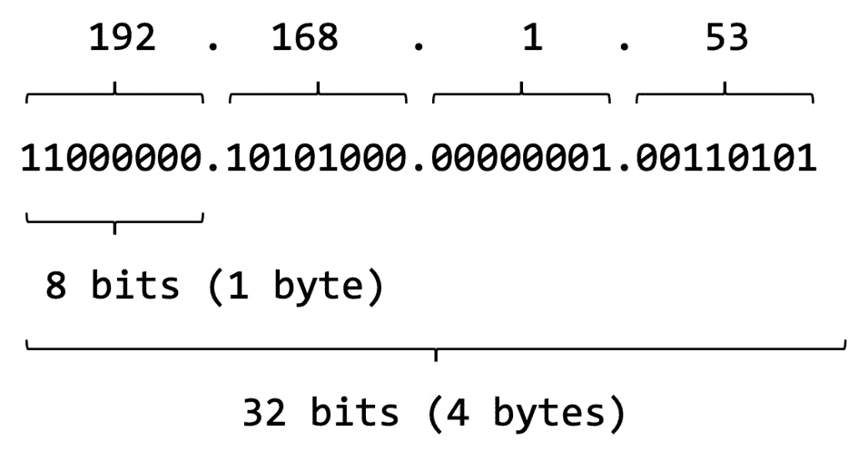

图 7.4 – 网络类别

IPv4 地址空间的总数限制为 4,294,967,296（2³²）个地址（大约 40 亿）。其中，大约 1800 万个地址保留用于特殊目的（例如，私有网络），约有 2.7 亿个是组播地址。

**组播地址**是一组 IP 地址的逻辑标识符。如需了解更多关于组播地址的信息，请参考 *RFC* *6308*（[`tools.ietf.org/html/rfc6308`](https://tools.ietf.org/html/rfc6308)）。

### 网络类别

在互联网早期，IPv4 地址中的最高位字节（第一组）表示**网络号**。随后的字节进一步表示网络层次结构和子网，最低位字节标识设备本身。这个方案很快证明不足以满足网络层次结构和分隔的需求，因为它仅允许 256（2⁸）个网络，由 IPv4 地址的首字节表示。随着额外网络的加入，每个网络都有自己的身份，IP 地址规范需要进行特别修订，以适应标准模型。1981 年推出的 *Classful Network* 规范通过根据地址的前 4 位将 IPv4 地址空间划分为五个类别，解决了这个问题，具体如下面的图所示：

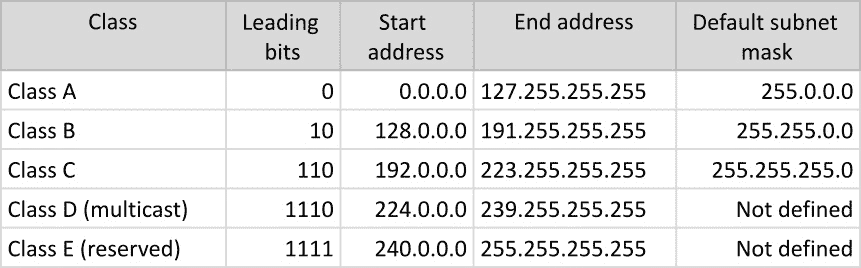

图 7.5 – 网络类别

如需了解更多关于网络类别的信息，请参考 *RFC 870*（[`tools.ietf.org/html/rfc870`](https://tools.ietf.org/html/rfc870)）。在上图中，最后一列指定了每个网络类别的默认子网掩码。接下来我们将查看子网（或子网络）。

### 子网

**子网络**（或**子网**）是 IP 网络的逻辑子划分。子网的引入是为了识别属于同一网络的设备。处于同一网络的设备的 IP 地址具有相同的最高有效位组。子网定义将 IP 地址逻辑上划分为两个字段：**网络标识符**和**主机标识符**。子网的数字表示称为**子网掩码**或**网掩码**。下图提供了网络标识符和主机标识符的示例：

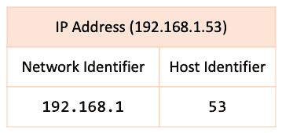

图 7.6 – 带有网络和主机标识符的子网

对于我们的 IPv4 地址（`192.168.1.53`），我们可以设计出一个网络标识符`192.168.1`，其中主机标识符是`53`。生成的子网掩码如下所示：

```
192.168.1.0
```

我们丢弃了子网掩码中的最低有效组，代表主机标识符（`53`），并将其替换为`0`。这里的`0`表示子网中的起始地址。换句话说，子网中允许任何主机标识符值在`0`到`255`的范围内。例如，`192.168.1.92`是`192.168.1.0`网络中的一个有效（并被接受的）IP 地址。

子网的另一种表示方法使用所谓的`/`和*前缀的位长度*。在我们的例子中，`192.168.1.0`子网的 CIDR 表示法如下：

```
192.168.1.0/24
```

网络地址中的前三组构成*3 x 8 = 24*位，因此采用`/24`表示法。

通常，它以`100`开始，以`125`结束。让我们看看如何实现这一点。

首先，让我们看看`192.168.1.100`的二进制表示：

```
11000000.10101000.00000001.100). Remember that we want the network to start with 100 and end with 125\. This means that the closest binary value to the reserved 99 addresses that would not be permitted in our subnet is *96 = 64 + 32*. The equivalent binary value for it is as follows:

```

1. 这些位将被添加到网络地址（192.168.1）中已经保留的 24 位中，总共占用*27 = 24 + 3*位。以下是等效的表示：

```
11111111.11111111.11111111.11100000
```

因此，生成的子网掩码如下所示：

```
255.255.255.224
```

对应子网的 CIDR 表示法如下所示：

```
192.168.1.96/27
```

主机标识符组中的剩余五个位表示子网中可能的*2⁵ = 32*个地址，从`97`开始。这将限制最大主机标识符值为*127 = 96 + 32 – 1*（我们减去 1 是为了排除包含在 32 个地址总数中的起始数字 97）。在这 32 个地址的范围内，最后一个 IP 地址保留作为**广播地址**，如图所示：

```
192.168.1.127
```

广播地址是保留为网络或子网中的最大数字，在适用时。回到我们的例子，除去广播地址后，子网中最大主机 IP 地址如下所示：

```
192.168.1.126
```

你可以在*RFC 1918*中了解更多关于子网的内容 ([`tools.ietf.org/html/rfc1918`](https://tools.ietf.org/html/rfc1918))。由于我们提到了广播地址，接下来我们快速了解一下它。

广播地址

**广播地址**是在网络或子网中预留的 IP 地址，用于向属于该网络的所有设备传送集体消息（数据）。广播地址是网络或子网中的最后一个 IP 地址（如果适用）。

例如，`192.168.1.0/24` 网络的广播地址是 `192.168.1.255`。在上一节中的示例中，`192.168.1.96/27` 子网的广播地址是 `192.168.1.127`（*127 = 96 + 32 –* *1*）。

如需了解更多有关广播地址的信息，请参阅 [`www.sciencedirect.com/topics/computer-science/broadcast-address`](https://www.sciencedirect.com/topics/computer-science/broadcast-address)。

IPv6 地址

IPv6 地址是一个 128 位（16 字节）的数字，通常表示为最多八组 2 字节（16 位）的数字，每组数字之间用冒号（`:`）分隔。每组数字是一个十六进制数字，值在 `0000` 和 `FFFF` 之间。下面是一个 IPv6 地址的示例：

```
2001:0b8d:8a52:0000:0000:8b2d:0240:7235
```

上述 IPv6 地址的等效表示如下：

```
2001:b8d:8a52::8b2d:240:7235/64
```

在第二种表示法中，前导零被省略，所有零组（`0000:0000`）被压缩成一个空组（`::`）。末尾的`/64`符号表示的是`1`和`128`。

在我们的例子中，前缀长度为 64（*4 x 16*）位，子网看起来是这样的：

```
2001:b8d:8a52::
```

子网表示的是前四个组（`2001`、`0b8d`、`8a52` 和 `0000`），这将总共产生*4 x 16 = 64*位。在简化表示的 IPv6 子网中，前导零被省略，所有零组被压缩成 `::`。

IPv6 的子网划分与 IPv4 非常相似。我们在这里不会详细讨论，因为相关概念已在*IPv4 地址*部分介绍。有关 IPv6 的更多信息，请参阅*RFC* *2460*（[`tools.ietf.org/html/rfc2460`](https://tools.ietf.org/html/rfc2460)）。

现在，既然你已经熟悉了 IP 地址，接下来介绍一些与 IP 地址的软件实现相关的网络构造——即套接字和端口。

套接字和端口

**套接字**是一个用于表示网络节点的软件数据结构，供通信使用。虽然它是一个编程概念，但在 Linux 中，**网络套接字**最终是一个文件描述符，通过网络**应用程序编程接口**（**API**）进行控制。套接字被应用程序进程用于数据的发送和接收。应用程序可以创建和删除套接字。套接字不能在创建它的进程生命周期之外处于活动状态（发送或接收数据）。

网络套接字在 OSI 模型的*传输层*操作。套接字连接有两个端点——发送方和接收方。发送方和接收方都有一个 IP 地址。因此，套接字数据结构中的一个关键部分是拥有该套接字的端点的*IP 地址*。

两个端点通过网络进程使用这些套接字来创建和管理它们的套接字。发送方和接收方可以达成共识，使用多个连接来交换数据。有些连接甚至可能并行运行。我们如何区分这些套接字连接？单独的 IP 地址是不够的，这时 **端口** 就发挥了作用。

`0` 和 `65535`。通常，`0` 和 `1024` 之间的端口分配给系统上使用最频繁的服务。这些端口也被称为 **知名端口**。以下是一些知名端口及其相关网络服务的示例：

+   `25`: SMTP

+   `21`: FTP

+   `22`: SSH

+   `53`: DNS

+   `67`，`68`: DHCP（客户端 = `68`，服务器 = `67`）

+   `80`: HTTP

+   `443`: **HTTP** **Secure**（**HTTPS**）

`1024` 以上的端口号供一般使用，也称为 **临时端口**。

端口总是与 IP 地址关联。最终，套接字是 IP 地址和端口的组合。有关网络套接字的更多信息，请参阅 *RFC 147*（[`tools.ietf.org/html/rfc147`](https://tools.ietf.org/html/rfc147)）。有关常见端口的信息，请参阅 *RFC* *1340*（[`tools.ietf.org/html/rfc1340`](https://tools.ietf.org/html/rfc1340)）。

现在，让我们运用迄今为止所学的知识，看看如何配置 Linux 中的本地网络栈。

Linux 网络配置

本节描述了适用于 Ubuntu 和 Fedora 平台的 TCP/IP **网络配置**，使用的是它们目前发布的最新版本。相同的概念适用于大多数 Linux 发行版，尽管其中一些网络配置工具和文件可能有所不同。

我们可以使用 `ip` 命令行工具来检索系统当前的 IP 地址，方法如下：

```
ip addr show
```

下面是输出的一个示例：

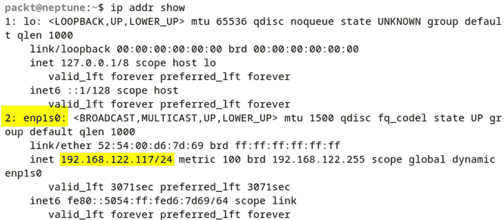

图 7.7 – 使用 ip 命令检索当前的 IP 地址

我们在这里突出显示了一些相关信息，例如网络接口 ID（`2: enp1s0`）和带有子网前缀的 IP 地址（`192.168.122.117/24`）。

接下来我们来看 Ubuntu 的网络配置。在编写本书时，Ubuntu 的发布版本是 22.04.2 LTS。

Ubuntu 网络配置

Ubuntu 22.04 提供了 `netplan` 命令行工具，以便轻松进行网络配置。`netplan` 使用一个配置文件，该文件位于 `/etc/netplan/` 目录中，我们可以使用以下命令访问它：

```
ls /etc/netplan/
```

在我们的例子中，配置文件是 `00-installer-config.yaml`。

更改网络配置涉及编辑 `netplan` YAML 配置文件。作为良好的实践，我们应始终在更改之前备份当前的配置文件。更改网络配置通常包括设置动态或静态 IP 地址。我们将在接下来的几个部分中展示如何配置这两种类型的 IP 地址。我们将首先介绍动态 IP 地址配置。

动态 IP 配置

要启用动态（DHCP）IP 地址，我们必须编辑 `netplan` 配置文件，并将所选网络接口（我们选择的是 `ens33`）的 `dhcp4` 属性设置为 `true`（如 *图 7.8* 所示）。使用你喜欢的文本编辑器（在我们这里是 nano）打开 `00-installer-config.yaml` 文件：

```
sudo nano /etc/netplan/00-installer-config.yaml
```

以下是相关的配置摘录，并标出了关键点：

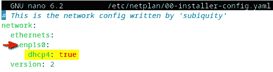

图 7.8 – 在 netplan 配置中启用 DHCP

保存配置文件后，我们可以使用以下命令测试相关更改：

```
sudo netplan try
```

我们将获得以下响应：

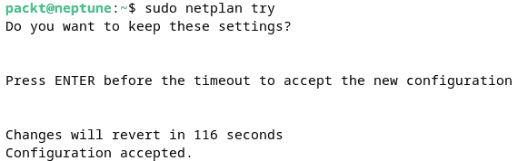

图 7.9 – 测试并接受 netplan 配置更改

`netplan` 关键字验证新的配置并提示用户接受更改。以下命令将当前更改应用到系统中：

```
sudo netplan apply
```

接下来，我们将使用 `netplan` 配置静态 IP 地址。

静态 IP 配置

要设置网络接口的静态 IP 地址，我们首先编辑 `netplan` 配置 YAML 文件，内容如下：

```
sudo nano /etc/netplan/00-installer-config.yaml
```

这是一个静态 IP 地址 `192.168.122.22/24` 的配置示例：

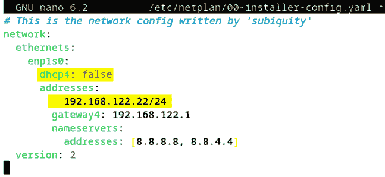

图 7.10 – 使用 netplan 配置静态 IP 示例

保存配置后，我们可以像在 *动态 IP* 部分中那样，使用以下命令测试并接受配置，更改并应用：

```
sudo netplan try
sudo netplan apply
```

有关 `netplan` 命令行工具的更多信息，请参见 `netplan --help` 或相关系统手册（`man netplan`）。

接下来我们将看看 Fedora 的网络配置。本文写作时，当前发布的 Fedora 版本为 37。

Fedora/RHEL 网络配置

从 Fedora 33 和 RHEL 9 开始，网络配置文件 *不再* 存放在 `/etc/sysconfig/network-scripts/` 目录下。要了解有关新配置选项的更多信息，请阅读以下文件：

```
cat /etc/sysconfig/network-scripts/readme-ifcfg-rh.txt
```

在 Fedora/RHEL 中，配置网络的首选方法是使用 `nmcli` 工具。此位置已经被弃用，并且在 Fedora 中不再被 NetworkManager 使用；它仍然可以使用，但我们不推荐使用它。新的 NetworkManager 密钥文件存储在 `/etc/NetworkManager/system-connections/` 目录中。

让我们使用一些基本的 `nmcli` 命令查看有关连接的信息。要了解 `nmcli`，请阅读相关的手册页。首先，让我们使用以下命令查找有关我们活动连接的信息：

```
nmcli connection show
```

输出将显示有关连接名称、UUID、类型和使用的设备的基本信息。以下截图显示了我们在 Fedora 37 虚拟机上的相关信息：

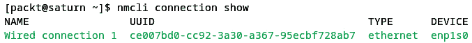

图 7.11 – 使用 nmcli 查看连接信息

与 Ubuntu 类似，在使用 Fedora/RHEL 时，更改网络配置通常涉及设置动态或静态 IP 地址。我们将在接下来的章节中展示如何配置这两种类型的 IP 地址。让我们先看看动态 IP 地址配置。

动态 IP 配置

要使用 `ncmli` 配置动态 IP 地址，我们可以运行以下命令：

```
sudo nmcli connection modify 'Wired connection 1' ipv4.method auto
```

`ipv4.method auto` 指令启用 DHCP。该命令没有输出；执行后，您将返回到提示符。您可以通过查看 `/etc/NetworkManager/system-connections/` 目录来检查命令是否生效。在我们的案例中，目录内会有一个新的密钥文件。它与我们的连接名称相同。以下是一个摘录：

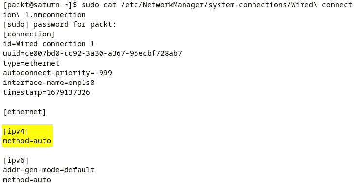

图 7.12 – 新的配置密钥文件

接下来，我们将配置静态 IP 地址。

静态 IP 配置

要使用 `ncmli` 执行等效的静态 IP 地址更改，我们需要运行多个命令。首先，我们必须设置静态 IP 地址，如下所示：

```
sudo nmcli connection modify 'Wired connection 1' ipv4.address 192.168.122.3/24
```

如果之前没有配置静态 IP 地址，我们建议在继续下一步之前保存前面的更改。可以使用以下代码保存这些更改：

```
sudo nmcli connection down 'Wired connection 1'
sudo nmcli connection up 'Wired connection 1'
```

接下来，我们必须设置网关和 DNS IP 地址，如下所示：

```
sudo nmcli connection modify 'Wired connection 1' ipv4.gateway 192.168.122.1
sudo nmcli connection modify 'Wired connection 1' ipv4.dns 8.8.8.8
```

最后，我们必须使用以下代码禁用 DHCP：

```
sudo nmcli connection modify 'Wired connection 1' ipv4.method manual
```

在进行这些更改后，我们需要使用以下代码重新启动 `'Wired connection 1'` 网络接口：

```
sudo nmcli connection down 'Wired connection 1'
sudo nmcli connection up 'Wired connection 1'
```

现在，让我们查看我们执行的所有命令的结果。重新启动连接后，我们来检查新的 IP 地址和网络密钥文件的内容。下图显示了我们通过使用 `ip addr` `show` 命令分配给系统的新的 IP（`192.168.122.3`）：

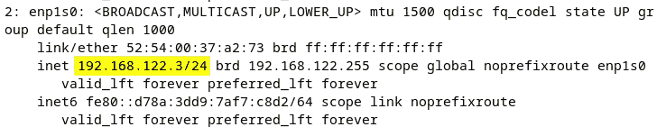

图 7.13 – 检查新的 IP 地址

现在，让我们查看网络密钥文件的内容，看看为静态 IP 配置所做的更改。请记住，文件的位置是`/etc/NetworkManager/system-connections/`：

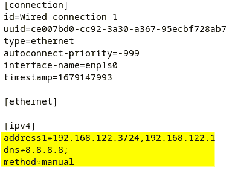

图 7.14 – 静态 IP 地址的新密钥文件配置

`nmcli` 工具是一个功能强大且有用的工具。在本章末尾，我们将为你提供一些有用的链接，帮助你进一步了解它。接下来，我们将看看如何在 openSUSE 上配置网络服务。

openSUSE 网络配置

openSUSE 提供了几种网络配置工具：**Wicked** 和 NetworkManager。根据官方的 SUSE 文档，Wicked 适用于各种类型的机器，从服务器到笔记本电脑和工作站，而 NetworkManager 仅用于笔记本电脑和工作站的配置，不适用于服务器配置。然而，在 openSUSE Leap 中，默认情况下，无论是桌面配置还是服务器配置，都会使用 Wicked，而笔记本电脑配置则默认使用 NetworkManager。

例如，在我们的主工作站（笔记本电脑）上，如果我们想查看 openSUSE Leap 默认运行的是哪个服务，可以使用以下命令：

```
sudo systemctl status network
```

输出会显示正在运行的服务，在我们的情况下，它是 NetworkManager：

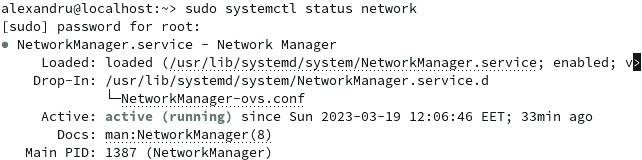

图 7.15 – 检查哪个网络服务在 openSUSE 中运行

当在 openSUSE Leap 服务器虚拟机中运行相同命令时，结果会有所不同。输出显示 Wicked 默认运行。以下截图展示了一个示例：

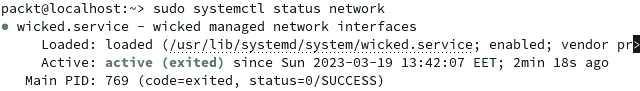

图 7.16 – Wicked 在 openSUSE 服务器中运行

因此，我们将在本节中所有的示例都在 openSUSE Leap 服务器虚拟机上进行，从而使用 Wicked 作为默认的网络配置工具。在下一节中，我们将配置 openSUSE 机器上的动态 IP。

动态 IP 配置

在进行任何配置之前，让我们检查一下活动连接和设备。我们可以通过使用以下命令来完成此操作：

```
wicked show all
```

输出将显示所有活动设备。以下截图展示了我们机器上输出的摘录：

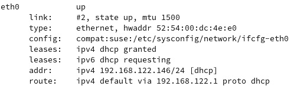

图 7.17 – 有关活动设备的信息

有两个活动连接，一个是回环（`lo`），另一个是以太网端口（`eth0`）。我们将仅显示与 `eth0` 相关的信息。Wicked 在 openSUSE 中存储配置文件的位置是 `/etc/sysconfig/network`。如果我们列出该目录内容，我们会看到其中已经有现有连接的配置文件：

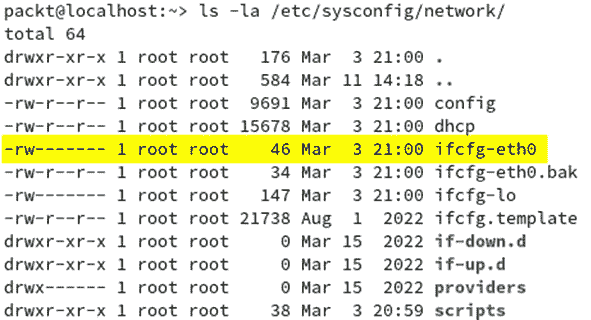

图 7.18 – Wicked 配置文件的位置

在我们的案例中，可能你也会遇到相同的情况，感兴趣的文件叫做 `ifcfg-eth0`；我们可以用文本编辑器打开它，或者将其连接输出。让我们来看看文件的内容：

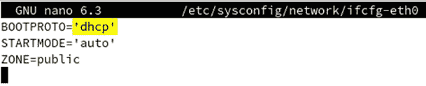

图 7.19 – 配置文件提供的信息

如前面的截图所示，提供的信息相对较少，但仍然相关。为了获得更详细的输出，我们可以使用以下命令：

```
sudo wicked show-config
```

这将直接向显示器提供更多相关信息。以下截图展示了我们输出的摘录，包含详细的 IPv4 DHCP 信息：

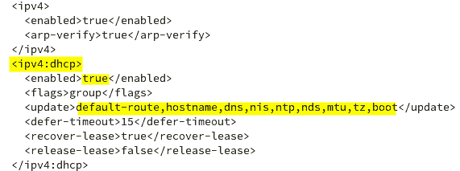

图 7.20 – Wicked 提供的详细信息

为了更好地理解该输出，我们建议您阅读`config`文件，并且如果有的话，查看`dhcp`文件，这些文件位于`/etc/sysconfig/network`目录中。它们提供了有关配置网络设备所需的特定变量和默认参数的信息。

安装操作系统时，通常默认设置动态 IP 地址。如果您的系统未配置动态 IP 地址，您只需要在`/etc/sysconfig/network`目录中创建一个配置文件，并根据您用来连接网络的设备为其命名，例如`ifcfg-eth0`。在该文件中，您只需提供三行内容，如*图 7.19*所示。以下命令是执行本段操作所需的：

+   使用`ip` `addr`命令检查您的设备名称：

    ```
    /etc/sysconfig/network directory:

    ```

    sudo nano /etc/sysconfig/network/ifcfg-eth0

    ```

    ```

    *   提供 DHCP 配置的相关信息：

    ```
    BOOTPROTO='dhcp'
    STARTMODE='auto'
    ZONE=public
    ```

    *   重启 Wicked 服务：

    ```
    ping command. Here’s an example:

    ```

    ping google.com

    ```

    ```

在接下来的部分中，我们将展示如何设置静态 IP 配置。

静态 IP 配置

要设置静态 IP 配置，您需要手动为配置文件提供变量。这些文件与上一部分中介绍的文件相同。文件的路径是`/etc/sysconfig/network`。例如，您可以为`eth0`设备连接创建一个新文件，并提供所需的信息。让我们看一下使用我们 openSUSE Leap 服务器虚拟机的示例。但在此之前，我们建议您打开`ifcfg`工具的手册页，因为它们提供了有关本次操作所需变量的有价值信息。

因此，我们将按如下方式设置`ifcfg`配置文件：

+   首先，我们将检查 IP 地址和网络设备名称；在我们的案例中，动态分配的 IP 为`192.168.122.146`，设备名称为`eth0`：

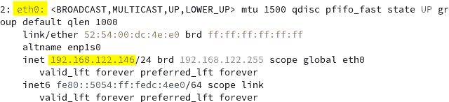

图 7.21 – IP 和设备信息

+   进入`/etc/sysconfig/network`目录并编辑`ifcfg-eth0`文件；我们将使用以下变量进行静态 IP 配置：

    +   `BOOTPROTO='static'`：这允许我们使用由`IPADDR`变量提供的固定 IP 地址

    +   `STARTMODE='auto'`：该接口将在启动时自动启用

    +   `IPADDR='192.168.122.144'`：我们为机器选择的 IP 地址

    +   `ZONE='public'`：`firewalld`工具使用的区域

    +   `PREFIXLEN='24'`：`IPADDR`变量中的位数

    它将如下所示：

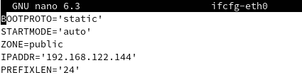

图 7.22 – 静态 IP 配置的新变量

+   保存更改到新文件，并重启 Wicked 守护进程：

    ```
    sudo systemctl restart wickedd.service
    ```

    *   启用接口，以便更改生效：

    ```
    ip addr show command again to check for the new IP address:
    ```

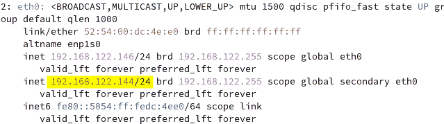

图 7.23 – 新分配给 eth0 的 IP 地址

到目前为止，你已经了解了如何在所有主要的 Linux 发行版中配置网络设备，并使用它们首选的工具。我们仅仅触及了这个话题的表面，但已经提供了足够的信息，帮助你开始在 Linux 中操作网络接口。更多信息，请随时阅读操作系统自带的手册页。在下一节中，我们将讨论主机名配置的问题。

主机名配置

要在 Linux 机器上获取当前主机名，我们可以使用`hostname`或`hostnamectl`命令，如下所示：

```
hostname
```

更改主机名的最便捷方法是使用`hostnamectl`命令。我们可以使用该命令的`set-hostname`参数将主机名更改为`earth`：

```
sudo hostnamectl set-hostname earth
```

让我们再次使用`hostname`命令来验证主机名的更改。你也可以使用`hostnamectl`命令来验证主机名。与`hostname`命令相比，`hostnamectl`命令的输出提供了更详细的信息，如下图所示：

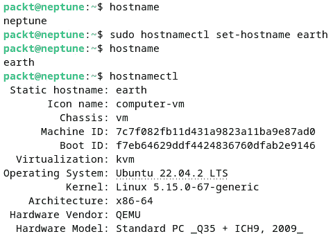

图 7.24 – 使用不同命令获取当前主机名

另外，我们可以使用`hostname`命令来*临时*更改主机名，如下所示：

```
sudo hostname jupiter
```

然而，这个更改在重启后不会生效，除非我们还在`/etc/hostname`和`/etc/hosts`文件中更改主机名。在编辑这两个文件时，按照需要更改主机名。以下截图显示了命令的顺序：

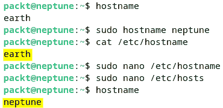

图 7.25 – /etc/hostname 和 /etc/hosts 文件

在重新配置主机名后，通常需要注销再登录才能反映更改。主机名在一致的网络管理中非常重要，网络上的每个系统都应该设置相关的主机名。在接下来的章节中，你将了解 Linux 中的网络服务。

使用网络服务

在这一节中，我们将列出 Linux 上最常见的网络服务。并非所有这里提到的服务都在你选择的 Linux 平台上默认安装或启用。*第九章*，*保护* *Linux*，和 *第十章*，*灾难恢复、诊断和故障排除*，将深入探讨如何安装和配置其中一些服务。本节的重点仍然是这些网络服务是什么，它们如何工作，以及它们使用哪些网络协议进行通信。

**网络服务**通常是一个系统进程，实施应用层（OSI *第 7 层*）功能，用于数据通信目的。网络服务通常设计为对等或客户端-服务器架构。

在对等网络中，多个网络节点各自运行自己同等特权的网络服务实例，同时共享和交换一组公共数据。例如，一个 DNS 服务器网络，所有服务器共享并更新它们的域名记录。

客户端-服务器网络通常涉及一个或多个服务器节点和多个客户端与这些服务器进行通信。SSH 就是一个客户端-服务器网络服务的例子。SSH 客户端通过安全的终端会话连接到远程 SSH 服务器，可能是为了远程管理目的。

以下各小节简要描述了网络服务，我们鼓励你在*第十三章*或本章末推荐的其他相关标题中探索与这些网络服务相关的主题。我们从 DHCP 服务器开始。

DHCP 服务器

**DHCP 服务器**使用 DHCP 协议，使网络上的设备能够请求动态分配的 IP 地址。DHCP 协议在本章前面的*TCP/IP 协议*部分中有简要描述。

请求 DHCP 服务的计算机或设备会向网络发送一个广播消息（或查询），以定位 DHCP 服务器，后者提供所请求的 IP 地址和其他信息。DHCP 客户端（设备）与服务器之间的通信使用 DHCP 协议。

DHCP 协议的初始*发现*工作流在客户端和服务器之间发生在数据链路层（*第 2 层*）中。由于第 2 层使用网络帧作为 PDU，DHCP 发现包无法跨越本地网络边界。换句话说，DHCP 客户端只能与*本地*DHCP 服务器发起通信。

在初始的*握手*（在第 2 层）之后，DHCP 转向 UDP 作为其传输协议，使用数据报套接字（*第 4 层*）。由于 UDP 是无连接协议，DHCP 客户端和服务器在没有事先安排的情况下交换消息。因此，客户端和服务器的两个端点都需要一个众所周知的 DHCP 通信端口用于双向数据交换。这些端口是`68`（用于 DHCP 服务器）和`67`（用于 DHCP 客户端）。

DHCP 服务器维护一系列 IP 地址和其他客户端配置信息（如 MAC 地址和域服务器地址），用于网络上请求 DHCP 服务的每个设备。

DHCP 服务器使用 **租赁机制** 来动态分配 IP 地址。租赁一个 IP 地址受 **租期** 的制约，租期可以是有限的或无限的。当 IP 地址的租期到期时，DHCP 服务器可能会根据请求将其重新分配给其他客户端。设备通过定期向 DHCP 服务器请求 **续租** 来保持其动态 IP 地址。若未及时续租，设备的动态 IP 地址可能会丧失。延迟（或租期后）发出的 DHCP 请求可能会导致获取一个新的 IP 地址，尤其是在之前的地址已经被 DHCP 服务器分配的情况下。

从 Linux 机器查询 DHCP 服务器的一个简单方法是执行以下命令：

```
ip route
```

这是前面命令的输出：

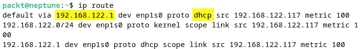

图 7.26 – 查询 DHCP 信息的 IP 路由

输出的第一行提供了 DHCP 服务器（`192.168.122.1`）。

*第十三章*，*配置 Linux 服务器*，将进一步介绍安装和配置 DHCP 服务器的实际细节。

如需了解有关 DHCP 的更多信息，请参考 *RFC* *2131*（[`tools.ietf.org/html/rfc2131`](https://tools.ietf.org/html/rfc2131)）。

DNS 服务器

一个 `wikipedia.org`）将被转换为一个 IP 地址（例如 `208.80.154.224`）。名称解析协议是 DNS，在本章之前的 *TCP/IP 协议* 部分有简要描述。在一个 DNS 管理的 TCP/IP 网络中，计算机和设备可以通过主机名进行识别和相互通信，而不仅仅是通过 IP 地址。

作为一个合理的类比，DNS 非常像一本地址簿。主机名比 IP 地址更容易记住。即使在一个局部网络中，只有几台计算机和设备连接，单纯使用 IP 地址识别（或记住）任何主机也会相当困难。互联网依赖于一个全球分布的 DNS 服务器网络。

DNS 服务器有四种不同类型：**递归服务器**、**根服务器**、**顶级域**（**TLD**）**服务器**和**权威服务器**。所有这些 DNS 服务器类型共同协作，将你带入浏览器中所体验到的互联网。

**递归 DNS 服务器**是一个解析器，帮助你查找你搜索的网站的目标（IP）。当你执行查询操作时，递归 DNS 服务器会连接到不同的 DNS 服务器，以找到你正在寻找的 IP 地址，并以网站的形式将其返回给你。递归 DNS 查询更快速，因为它们缓存了每一个执行过的查询。在递归类型的查询中，DNS 服务器会调用自身并进行递归，同时仍然将请求发送给另一个 DNS 服务器以找到答案。

相比之下，**迭代 DNS**查询是由每个 DNS 服务器直接完成的，不使用缓存。例如，在一次迭代查询中，每个 DNS 服务器都会响应另一个 DNS 服务器的地址，直到其中一个服务器有与查询的主机名匹配的 IP 地址，并将结果返回给客户端。有关 DNS 服务器类型的更多详情，请查看以下 Cloudflare 学习方案：[`www.cloudflare.com/learning/dns/what-is-dns/`](https://www.cloudflare.com/learning/dns/what-is-dns/)。

DNS 服务器维护（并可能共享）一个`/etc/resolv.conf`文件。

要查询管理本地计算机的 DNS 服务器，我们可以通过运行以下代码查询`/etc/resolv.conf`文件：

```
cat /etc/resolv.conf | grep nameserver
```

前面的代码返回以下输出：


图 7.27 – 使用/etc/resolv.conf 查询 DNS 服务器

查询网络中任意主机的名称服务器数据的一个简单方法是使用`nslookup`工具。如果您的系统上没有安装`nslookup`工具，您可以按照此处概述的命令进行安装。

在 Ubuntu/Debian 上，运行以下命令：

```
sudo apt install dnsutils
```

在 Fedora 上，运行以下命令：

```
sudo dnf install bind-utils
```

例如，要查询本地网络中名为`neptune.local`的计算机的名称服务器信息，可以运行以下命令：

```
nslookup neptune.local
```

输出如下所示：

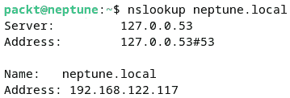

图 7.28 – 使用 nslookup 查询名称服务器信息

我们也可以通过交互式方式使用`nslookup`工具。例如，要查询`wikipedia.org`的名称服务器信息，我们只需运行以下命令：

```
nslookup
```

然后，在交互式提示符下，我们必须输入`wikipedia.org`，如下所示：

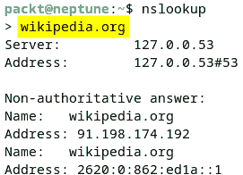

图 7.29 – 使用 nslookup 工具进行交互式查询

要退出交互式 Shell 模式，请按*Ctrl* + *C*。以下是前面输出信息的简要说明：

+   `127.0.0.53`）和端口（`53`）的本地 DNS 服务器

+   `wikipedia.org`）

+   `91.198.174.192`）和 IPv6（`2620:0:862:ed1a::1`）地址对应于查询域（`wikipedia.org`）

`nslookup`也能够进行反向 DNS 搜索，方法是提供一个 IP 地址。以下命令检索与 IP 地址`8.8.8.8`对应的名称服务器（`dns.google`）：

```
nslookup 8.8.8.8
```

前面的命令返回以下输出：

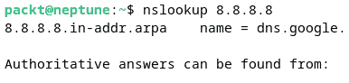

图 7.30 – 使用 nslookup 进行反向 DNS 搜索

要获取有关`nslookup`工具的更多信息，您可以参考`nslookup`的系统参考手册（`man nslookup`）。

另外，我们可以使用 `dig` 命令行工具。如果你的系统上没有安装 `dig` 工具，你可以通过在 Ubuntu/Debian 上安装 `dnsutils` 包或在 Fedora 平台上安装 `bind-utils` 来安装它们。安装包的相关命令之前已经通过 `nslookup` 展示过。

例如，以下命令检索 `google.com` 域的名称服务器信息：

```
dig google.com
```

这是结果（请查看突出显示的 `ANSWER SECTION`）：

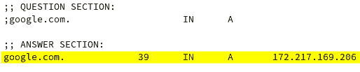

图 7.31 – 使用 dig 进行 DNS 查询

要使用 `dig` 执行反向 DNS 查询，我们必须指定 `-x` 选项，然后是 IP 地址（例如，`8.8.4.4`），如下所示：

```
dig -x 8.8.4.4
```

该命令将输出以下内容（请查看突出显示的 `ANSWER SECTION`）：

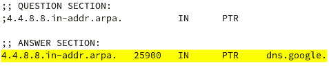

图 7.32 – 使用 dig 进行反向 DNS 查询

有关 `dig` 命令行工具的更多信息，请参阅相关系统手册（`man dig`）。

DNS 协议在 OSI 模型中工作于应用层（*第 7 层*）。标准 DNS 服务的知名端口是 `53`。

*第八章*，*Linux* *Shell 脚本*，将详细介绍安装和配置 DNS 服务器的实际细节。有关 DNS 的更多信息，请参阅 *RFC* *1035* ([`www.ietf.org/rfc/rfc1035.txt`](https://www.ietf.org/rfc/rfc1035.txt))。

DHCP 和 DNS 网络服务可以说是最接近 TCP/IP 网络栈的，同时在计算机或设备连接到网络时发挥着至关重要的作用。毕竟，没有正确的 IP 地址和名称解析，就无法进行网络通信。

分布式网络和相关应用服务器不仅仅是由 DNS 和 DHCP 服务器执行的纯粹网络管理栈。在接下来的章节中，我们将快速浏览一些在分布式 Linux 系统上运行的最相关的应用服务器。

认证服务器

独立的 Linux 系统通常使用默认的认证机制，其中用户凭据存储在本地文件系统中（如 `/etc/passwd` 和 `/etc/shadow`）。我们在 *第四章*，*用户和组管理* 中探讨了相关的用户认证内部机制。然而，当我们将认证范围扩展到本地机器之外时——例如，访问文件或邮件服务器——将用户凭据在远程和本地主机之间共享将成为一个严重的安全问题。

理想情况下，我们应该在整个网络中拥有一个由安全认证服务器处理的集中式认证端点。用户凭据在用户访问远程系统资源之前，应使用强大的加密机制进行验证。

让我们考虑如何安全地访问任意文件服务器上的网络共享。假设该访问要求 **Active Directory** (**AD**) 用户认证。将相关的挂载（共享）本地创建在用户的客户端机器上时，将提示输入用户凭证。文件服务器（代表客户端）向认证服务器发出认证请求。如果认证成功，服务器共享将对客户端可用。下图表示客户端与服务器之间的简单远程认证流程，使用 **轻量级目录访问协议** (**LDAP**) 认证端点：

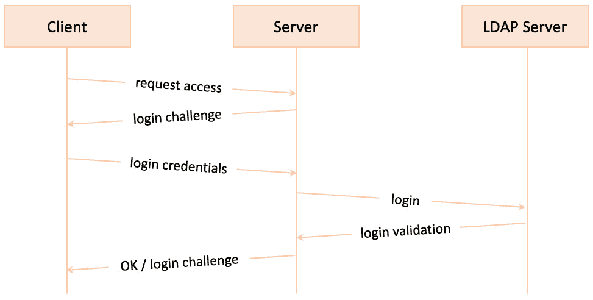

图 7.33 – 使用 LDAP 的认证工作流

下面是一些标准的安全认证平台示例（适用于 Linux）：

+   **Kerberos** ([`web.mit.edu/kerberos/`](https://web.mit.edu/kerberos/))

+   **LDAP** ([`www.redhat.com/en/topics/security/what-is-ldap-authentication`](https://www.redhat.com/en/topics/security/what-is-ldap-authentication))

+   **远程认证拨号用户服务** (**RADIUS**) ([`freeradius.org/documentation/`](https://freeradius.org/documentation/))

+   **Diameter** ([`www.f5.com/glossary/diameter-protocol`](https://www.f5.com/glossary/diameter-protocol))

+   **终端访问控制访问控制系统** (**TACACS+**) ([`datatracker.ietf.org/doc/rfc8907/`](https://datatracker.ietf.org/doc/rfc8907/))

可以使用 OpenLDAP 配置 Linux LDAP 认证服务器，这在本书的第一版中有讲解。

在本节中，我们通过一个使用文件服务器的示例说明了认证工作流。为了保持主题的连贯性，接下来我们将探讨网络文件共享服务。

文件共享

在常见的网络术语中，**文件共享**表示客户端机器能够 *挂载* 并访问属于服务器的远程文件系统，就像访问本地文件一样。运行在客户端机器上的应用程序可以直接访问服务器上的共享文件。例如，文本编辑器可以加载并修改远程文件，然后将其保存回同一远程位置，整个过程无缝且透明。底层的远程过程——远程文件系统像本地文件系统一样工作——是通过文件共享服务和协议实现的。

对于每种文件共享网络协议，都有一个对应的客户端-服务器文件共享平台。虽然大多数网络文件服务器（和客户端）都有跨平台实现，但某些操作系统平台更适合特定的文件共享协议，正如我们在接下来的子节中将看到的那样。选择不同的文件服务器实现和协议，最终是关于兼容性、安全性和性能的问题。

下面是一些最常见的文件共享协议，并对每种协议做了简要描述：

+   **服务器消息块**（**SMB**）：SMB 协议提供网络发现和文件及打印机共享服务。SMB 还支持网络上的进程间通信。SMB 是一个相对较老的协议，由**国际商业机器公司**（**IBM**）在 1980 年代开发。最终，微软接管并通过多次修订（SMB 1.0、2.0、2.1、3.0、3.0.2 和 3.1.1）对其进行了相当大的修改，形成了当前的版本。

+   **通用互联网文件系统**（**CIFS**）：该协议是 SMB 协议的一个特定实现。由于底层协议相似，SMB 客户端可以与 CIFS 服务器通信，反之亦然。虽然 SMB 和 CIFS 在使用上是相同的，但它们在文件锁定、批处理以及最终的性能上有着明显的不同。除了旧系统外，如今 CIFS 很少使用。应始终优先选择 SMB，特别是 SMB 2 或 SMB 3 的较新版本。

+   **Samba**：与 CIFS 类似，Samba 是 SMB 协议的另一种实现。Samba 为各种服务器平台上的 Windows 客户端提供文件和打印共享服务。换句话说，Windows 客户端可以像与 Windows 服务器通信一样，顺畅地访问 Linux Samba 服务器上的目录、文件和打印机。

    从版本 4 开始，Samba 原生支持 Microsoft AD 和 Windows NT 域。实质上，Linux Samba 服务器可以充当 Windows AD 网络中的域控制器。因此，Windows 域中的用户凭证可以透明地在 Linux 服务器上使用，而无需重新创建，并手动与 AD 用户保持同步。

+   **网络文件系统**（**NFS**）：该协议由 Sun Microsystems 开发，基本上与 SMB 的原理相同——通过网络访问文件，就像它们是本地的一样。NFS 与 CIFS 或 SMB 不兼容，这意味着 NFS 客户端不能直接与 SMB 服务器通信，反之亦然。

+   **苹果文件协议**（**AFP**）：AFP 是由苹果设计的专有文件共享协议，专门在 macOS 网络环境中运行。我们应该注意到，除了 AFP，macOS 系统还支持标准的文件共享协议，如 SMB 和 NFS。

大多数情况下，NFS 是 Linux 网络中首选的文件共享协议。对于混合网络环境——例如 Windows、Linux 和 macOS 的互操作性——Samba 和 SMB 最适合用于文件共享。

一些文件共享协议（如 SMB）还支持打印共享，并被打印服务器使用。接下来，我们将更详细地看看打印共享。

打印服务器

**打印服务器**（或**打印机服务器**）通过使用打印协议将打印机连接到网络中的客户端计算机或移动设备。打印协议负责以下通过网络进行远程打印的任务：

+   发现打印机或打印服务器

+   查询打印机状态

+   发送、接收、排队或取消打印任务

+   查询打印任务状态

常见的打印协议包括以下几种：

+   **行式打印守护进程**（**LPD**）协议

+   **通用协议**，如 SMB 和 TELNET

+   **无线打印**，如苹果的 AirPrint

+   **互联网打印协议**，如 Google Cloud Print

在通用打印协议中，SMB（也是一种文件共享协议）在*文件共享*部分已作介绍。TELNET 通信协议则在*远程* *访问*部分有详细描述。

文件和打印共享服务主要涉及在网络上的计算机之间*共享*文档，既可以是数字文档也可以是打印文档。涉及到*交换*文档时，其他网络服务将发挥作用，如*文件传输*和*电子邮件*服务。接下来我们将讨论文件传输。

文件传输

FTP 是一种标准网络协议，用于在网络中的计算机之间传输文件。FTP 在客户端-服务器环境中运行，其中 FTP 客户端发起与 FTP 服务器的远程连接，文件可以双向传输。FTP 维护一个 `21` 端口，用于在客户端和服务器之间交换命令。数据连接专门用于数据传输，并且通过控制连接在客户端和服务器之间协商。数据连接通常涉及临时端口进行入站流量，在实际数据传输期间保持开启，传输完成后立即关闭。

FTP 在以下两种模式之一中协商数据连接：

+   向 FTP 服务器发送 `PORT` 命令，表示客户端*主动*提供入站数据连接的端口号

+   向 FTP 服务器发送 `PASV` 命令，表示客户端*被动*地等待服务器提供入站数据连接的端口号

由于数据连接的动态特性，FTP 在防火墙配置方面是一个相对*复杂*的协议。控制连接端口通常是众所周知的（例如，不安全的 FTP 的 `21` 端口），但数据连接源自于不同的端口（通常是 `20`），而在接收端，入站套接字在预配置的临时端口范围内（`1024` 到 `65535`）打开。

FTP 通常通过以下方法之一安全实现：

+   `990`

+   `22`。有关 SSH 协议和客户端-服务器连接的更多信息，请参阅本章稍后的*SSH*部分中的*远程访问*内容。

接下来，我们将了解邮件服务器以及其底层的电子邮件交换协议。

邮件服务器

**邮件服务器**（或 **电子邮件服务器**）负责通过网络传送电子邮件。邮件服务器可以在同一网络（域）内的客户端（用户）之间交换电子邮件——例如在一个公司或组织内部——或者将电子邮件传递给其他邮件服务器，可能超出本地网络，例如互联网。

一个电子邮件交换通常涉及以下参与者：

+   一个**电子邮件客户端**应用程序（如 Outlook 或 Gmail）

+   一个或多个**邮件服务器**（如 Exchange 或 Gmail 服务器）

+   电子邮件交换中涉及的**收件人**——一个*发件人*和一个或多个*接收者*

+   一个**电子邮件协议**，用于控制电子邮件客户端与邮件服务器之间的通信

最常用的电子邮件协议是**POP3**、**IMAP**和**SMTP**。让我们详细了解每个协议。

POP3

**POP 版本 3**（**POP3**）是一种标准的电子邮件协议，用于将电子邮件从远程邮件服务器接收并下载到本地电子邮件客户端。使用 POP3，电子邮件可以离线阅读。下载后，电子邮件通常会从 POP3 服务器中删除，从而节省空间。现代 POP3 邮件客户端-服务器实现（如 Gmail、Outlook 等）也可以选择保留邮件副本在服务器上。当用户从多个地点（客户端应用程序）访问电子邮件时，将邮件保留在 POP3 服务器上变得非常重要。

默认的 POP3 端口在此列出：

+   `110`: 用于不安全（非加密的）POP3 连接

+   `995`: 用于安全的 POP3，使用 SSL/TLS 加密

POP3 是一种相对较旧的电子邮件协议，并不总是适用于现代的电子邮件通信。当用户从多个设备访问电子邮件时，IMAP 是一个更好的选择。接下来，我们将看一下 IMAP 电子邮件协议。

IMAP

IMAP 是一种标准的电子邮件协议，用于访问远程 IMAP 邮件服务器上的电子邮件。使用 IMAP，电子邮件始终保留在邮件服务器上，而电子邮件的副本可供 IMAP 客户端使用。用户可以在多个设备上访问电子邮件，每个设备上都有 IMAP 客户端应用程序。

默认的 IMAP 端口在此列出：

+   `143`: 用于不安全（非加密的）IMAP 连接

+   `993`: 用于安全的 IMAP，使用 SSL/TLS 加密

POP3 和 IMAP 都是接收电子邮件的标准协议。要发送电子邮件，则需要使用 SMTP。接下来，我们将了解 SMTP 电子邮件协议。

SMTP

SMTP 是一种标准的电子邮件协议，用于通过网络或互联网发送电子邮件。

默认的 SMTP 端口在此列出：

+   `25`: 用于不安全（非加密的）SMTP 连接

+   `465` 或 `587`: 用于安全的 SMTP，使用 SSL/TLS 加密

在使用或实施本节中描述的任何标准电子邮件协议时，始终建议使用对应的安全实现，并且最好使用最新的 TLS 加密（如果可能）。POP3、IMAP 和 SMTP 也支持用户身份验证，这是一个附加的安全层——在商业或企业级环境中也建议使用。

为了了解 SMTP 协议如何操作，我们将通过一些初步步骤来启动与 Google Gmail SMTP 服务器的 SMTP 握手。

我们将首先通过 `openssl` 命令使用安全（TLS）连接连接到 Gmail SMTP 服务器，具体如下：

```
openssl s_client -starttls smtp -connect smtp.gmail.com:587
```

在这里，我们调用了 `openssl` 命令，模拟了一个客户端（`s_client`），启动了一个 TLS SMTP 连接（`-starttls smtp`），并通过端口 `587` 连接到远程 Gmail SMTP 服务器（`-connect smtp.gmail.com:587`）。

Gmail SMTP 服务器响应一个相对较长的 TLS 握手块，最终返回以下代码：

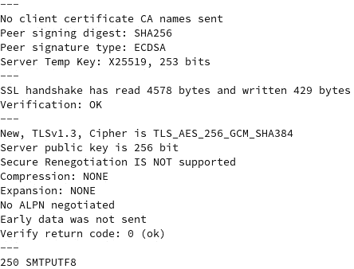

图 7.34 – 与 Gmail SMTP 服务器的初始 TLS 握手

在 `openssl` 命令的交互式提示符下，我们使用 `HELO` 命令（准确拼写）启动 SMTP 通信。`HELO` 命令*向*服务器问候。它是一个特定的 SMTP 命令，用于启动客户端和服务器之间的 SMTP 连接。还有一个 `EHLO` 变体，用于 ESMTP 服务扩展。Google 期望以下 `HELO` 问候：

```
HELO hellogoogle
```

随后进行另一次握手，最终返回 `250 smtp.gmail.com at your service`，如图所示：

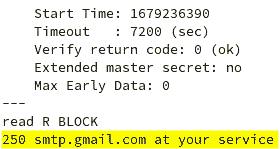

图 7.35 – Gmail SMTP 服务器已准备好进行通信

接下来，Gmail SMTP 服务器要求通过 `AUTH LOGIN` SMTP 命令进行身份验证。我们不再深入探讨，但这里需要强调的一点是，SMTP 协议在客户端与服务器之间遵循明文命令序列。因此，采用安全（加密）SMTP 通信通道并使用 TLS 非常重要。其他电子邮件协议（POP3 和 IMAP）也同样适用。

到目前为止，我们已经涵盖了多个网络服务，其中一些跨越多个网络甚至互联网。网络数据包携带数据和目的地址在负载中，但也有用于通信端点之间的同步信号，主要是区分发送和接收的工作流程。网络数据包的同步基于时间戳。如果没有网络节点之间高度准确的时间同步，可靠的网络通信将无法实现。接下来，我们将讨论网络时间服务器。

NTP 服务器

NTP 是一种标准的网络协议，用于网络中计算机之间的时钟同步。NTP 尝试将参与计算机的系统时钟同步到**协调世界时**（**UTC**）——世界时间参考标准，精度通常在几毫秒之内。

NTP 协议的实现通常假设客户端-服务器模型。NTP 服务器通过广播或发送更新的**时间戳数据报**到客户端，作为网络上的时间源。NTP 服务器根据全球公认的准确时间服务器不断调整其系统时钟，使用专门的算法来减轻网络延迟。

在我们选择的 Linux 平台上检查 NTP 同步状态的一个相对简单的方法是使用 `ntpstat` 工具。`ntpstat` 可能在我们的系统中未默认安装。在 Ubuntu 上，我们可以使用以下命令进行安装：

```
sudo apt install ntpstat
```

在 Fedora 上，我们可以使用以下命令安装 `ntpstat`：

```
sudo dnf install ntpstat
```

`ntpstat` 需要本地运行的 NTP 服务器。要设置本地 NTP 服务器，你需要执行以下操作（此处所有示例均为 Ubuntu 22.04.2 LTS）：

+   使用以下命令安装 `ntp` 包：

    ```
    ntp service’s status:

    ```

    ntp 服务：

    ```
    sudo systemctl enable ntp
    ```

    ```

    ```

    *   修改防火墙设置：

    ```
    ntpdate package:

    ```

    ntp 服务：

    ```
    sudo systemctl restart ntp
    ```

    ```

    ```

在安装 `ntp` 工具之前，请考虑到 Ubuntu 默认使用名为 `timesyncd` 的工具，而不是 `ntpd`。当安装 `ntpd` 后，默认工具将被禁用。

要查询 NTP 同步状态，我们可以运行以下命令：

```
ntpstat
```

这是输出结果：

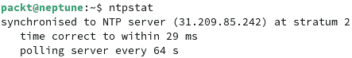

图 7.36 – 查询 NTP 同步状态，使用 ntpstat

`ntpstat` 提供了系统与之同步的 NTP 服务器的 IP 地址（`31.209.85.242`），同步边际（`29` 毫秒），以及时间更新轮询间隔（`64` 秒）。要了解更多关于 NTP 服务器的信息，我们可以使用以下命令 `dig` 它的 IP 地址：

```
dig -x 31.209.85.242
```

看起来它是一个 `lwlcom` 时间服务器（`ntp1.lwlcom.net`），如下所示：

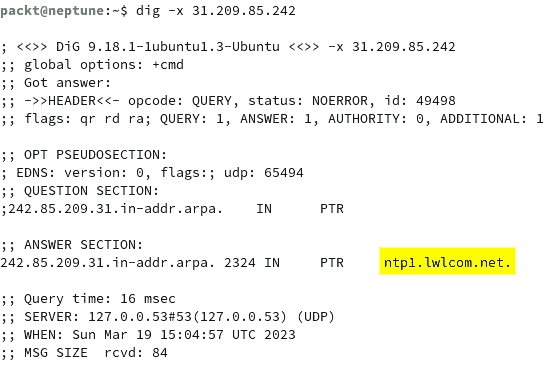

图 7.37 – 查询 NTP 同步状态，使用 [ntpstat](https://en.wikipedia.org/wiki/Network_Time_Protocol)

[NTP 客户端-服务器](https://en.wikipedia.org/wiki/Network_Time_Protocol)通信使用 UDP 作为传输协议，端口号为 `123`。*第九章*，*Securing* *Linux* 中有一节专门介绍如何安装和配置 NTP 服务器。有关 NTP 的更多信息，请参见 [`en.wikipedia.org/wiki/Network_Time_Protocol`](https://en.wikipedia.org/wiki/Network_Time_Protocol)。

至此，我们对网络服务器和协议的简短探索也已经结束。日常的 Linux 管理任务通常需要某种形式的远程访问。远程访问计算机的方式有很多种。下一部分将描述一些最常见的远程访问设施和相关的网络协议。

远程访问

大多数 Linux 网络服务提供相对有限的 **远程管理** 接口，它们的管理 **命令行接口** (**CLI**) 工具主要在运行服务的同一系统上本地操作。因此，相关的管理任务假定有本地终端访问权限。有时无法直接访问系统控制台。在这种情况下，远程访问服务器将发挥作用，通过远程机器启用虚拟终端登录会话。

让我们看看一些最常见的远程访问服务和应用程序。

SSH

SSH 可能是最流行的远程访问安全登录协议。SSH 使用强加密，并结合用户认证机制，实现客户端和服务器之间的安全通信。SSH 服务器安装和配置相对简单，*第十三章* 中的 *配置 Linux 服务器* 部分专门描述了相关步骤。SSH 的默认网络端口是 `22`。

SSH 支持以下认证类型：

+   公钥认证

+   密码认证

+   键盘交互认证

以下章节简要描述了这些形式的 SSH 认证。

公钥认证

**公钥认证**（或 **SSH 密钥认证**）可以说是最常见的 SSH 认证类型。

重要提示

本节将交替使用 *公钥* 和 *SSH 密钥* 这两个术语，主要是为了反映 Linux 社区中相关的 SSH 认证命名法。

SSH 密钥认证机制使用 *证书/密钥* 对 — 通过 `ssh-keygen` 工具，使用标准的加密算法，如 **Rivest–Shamir–Adleman** 算法（**RSA**）或 **数字签名** **算法**（**DSA**）。

SSH 公钥认证支持 **基于用户的认证** 或 **基于主机的认证** 模型。这两种模型的区别在于所涉及证书/密钥对的所有权。使用客户端认证时，每个用户都有一个证书/密钥对用于 SSH 访问。另一方面，主机认证每个系统（主机）只涉及一个证书/密钥对。

以下章节中将说明并解释两种 SSH 密钥认证模型。这两种模型的基本 SSH 握手和认证工作流是相同的：

+   首先，SSH 客户端生成一个安全的证书/密钥对，并将其公钥分享给 SSH 服务器。这是启用公钥认证的单次操作。

+   当客户端发起 SSH 握手时，服务器请求客户端的公钥，并将其与服务器允许的公钥进行验证。如果匹配，则 SSH 握手成功，服务器将公钥分享给客户端，SSH 会话建立。

+   进一步的客户端-服务器通信遵循标准的加密/解密工作流。客户端使用其私钥对数据进行加密，而服务器使用客户端的公钥对数据进行解密。在响应客户端时，服务器使用自己的私钥加密数据，客户端则使用服务器的公钥解密数据。

SSH 公钥认证也被称为 **无密码认证**，并且在自动化脚本中经常使用，在这些脚本中，命令通过多个远程 SSH 连接执行，而无需提示输入密码。

让我们更深入地了解基于用户和基于主机的公钥认证机制：

+   **基于用户的认证**：这是最常见的 SSH 公钥认证机制。根据这种模型，每个连接到远程 SSH 服务器的用户都有自己的 SSH 密钥。同一主机（或域）上的多个用户帐户将有不同的 SSH 密钥，每个密钥都能访问远程 SSH 服务器，如下图所示：

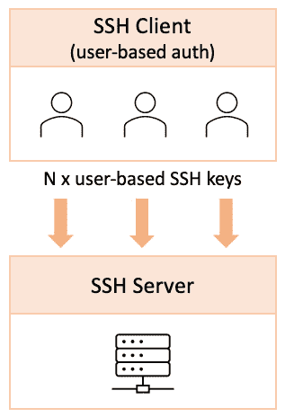

图 7.38 – 基于用户的密钥认证

+   **基于主机的认证**：这是另一种 SSH 公钥认证形式，每个系统（主机）使用一个 SSH 密钥来连接远程 SSH 服务器，如下图所示：

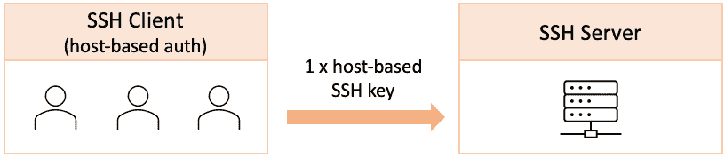

图 7.39 – 基于主机的密钥认证

使用基于主机的认证时，底层的 SSH 密钥只能认证来自单一客户端主机的 SSH 会话。基于主机的认证允许来自同一主机的多个用户连接到远程 SSH 服务器。如果用户尝试从与 SSH 服务器允许的主机不同的机器上使用基于主机的 SSH 密钥，访问将被拒绝。

有时，SSH 访问使用两种公钥认证方式的混合——基于用户和主机的认证——这种方法为 SSH 访问提供了更高的安全性。

当安全性要求不高时，更简单的 SSH 认证机制可能更合适。密码认证就是其中一种机制。

密码认证

`/etc/passwd`) 或选择在 SSH 服务器配置中定义的用户帐户（`/etc/ssh/sshd_config`）。在*第九章*中，*Securing* *Linux* 对此进行了进一步详细阐述。

除了本地认证，SSH 还可以利用远程认证方法，如 Kerberos、LDAP、RADIUS 等。在这种情况下，SSH 服务器将用户认证委托给远程认证服务器，正如本章前面的*认证服务器*部分所描述的那样。

密码认证需要用户交互或某种自动化方式来提供所需的凭证。另一种类似的认证机制是接下来的键盘交互认证。

键盘交互认证

**键盘交互认证**基于 SSH 客户端（用户）和 SSH 服务器之间多轮挑战-响应对话。这种对话是明文形式的问答交换，服务器可以要求用户完成多个挑战。从某种意义上说，密码认证是一种**单一挑战交互式** **认证**机制。

这种认证方法的*交互性*含义可能会让我们认为用户交互是实现该方法的必要条件。其实不然。基于键盘交互的认证也可以用于实现基于自定义协议的认证机制，其中底层的消息交换将被建模为认证协议。

在继续讨论其他远程访问协议之前，我们应该提到 SSH 的广泛使用，因为它具有安全性、灵活性和高性能。然而，在特定场景下，SSH 连接可能并不总是可行或足够。此时，*TELNET* 可能会派上用场。接下来我们将深入了解它。

TELNET

**TELNET** 是一个用于双向网络通信的应用层协议，它使用明文 CLI 与远程主机进行交互。从历史上看，TELNET 是最早的远程连接协议之一，但它始终缺乏安全实现。最终，SSH 成为了从一台计算机登录到另一台计算机的标准方式，但在某些应用层协议的故障排除（如 Web 或邮件服务器通信）中，TELNET 相对于 SSH 具有一定的优势。你将在*第九章*中了解更多关于如何使用 TELNET 的内容，*加固* *Linux*。

TELNET 和 SSH 是基于命令行的远程访问接口。有时，可能需要通过**图形用户界面**（**GUI**）直接连接到远程计算机的桌面。接下来我们将讨论桌面共享。

VNC

**虚拟网络计算**（**VNC**）是一个桌面共享平台，允许用户访问和控制远程计算机的图形用户界面（GUI）。VNC 是一个跨平台的客户端-服务器应用程序。例如，在 Linux 机器上运行的 VNC 服务器可以允许多个在 Windows 或 macOS 系统上运行的 VNC 客户端访问桌面。VNC 网络通信使用**远程帧缓冲区**（**RFB**）协议，该协议由*RFC 6143*定义。设置 VNC 服务器相对简单。VNC 假定存在图形桌面系统。更多细节将会在*第十三章*中提供，*配置* *Linux 服务器*。

本节结束后，我们将介绍网络服务和协议。我们尝试涵盖了有关通用网络服务器和应用程序的最常见概念，这些服务器和应用程序大多以客户端-服务器或分布式方式运行。对于每个网络服务器，我们描述了相关的网络协议和一些涉及的内部机制。*第九章*，*加固* *Linux*，以及*第十三章*，*配置 Linux 服务器*，将展示一些这些网络服务器的实际应用。

在下一节中，我们将重点讨论网络安全的内部机制。

理解网络安全

**网络安全**代表了防止、监控和保护计算机网络免受未经授权访问的过程、行动和政策。网络安全范式涵盖了各种各样的技术、工具和实践。以下是一些重要的范式：

+   **访问控制**：基于用户认证和授权机制选择性地限制访问。访问控制的例子包括用户、组和权限。相关概念已在*第四章*《*管理用户和组*》中讨论过。

+   **应用安全**：保护和保障服务器和终端用户应用程序（电子邮件、Web 和移动应用）。应用安全的例子包括**增强型 Linux 安全**（**SELinux**）、强加密连接、防病毒和反恶意软件程序。我们将在*第十章*《*灾难恢复、诊断和故障排除*》中介绍**SELinux**。

+   **终端安全**：保护和保障网络中的服务器和终端用户设备（智能手机、笔记本电脑和台式电脑）。终端安全的例子包括*防火墙*和各种入侵检测机制。我们将在*第十章*《*灾难恢复、诊断和故障排除*》中讨论防火墙。

+   **网络分段**：将计算机网络划分为更小的段或**虚拟局域网**（**VLAN**）。这与子网划分不同，后者是通过地址对网络进行逻辑分割。

+   **VPN**：通过安全加密隧道从公共网络或互联网访问公司网络。我们将在*第九章*《*保护 Linux*》和*第十三章*《*配置 Linux 服务器*》中更详细地探讨 VPN。

在日常的 Linux 管理中，设置网络安全边界应该始终遵循前面列举的范式，大致按顺序进行。从访问控制机制开始，最后到 VPN，保护网络采用的是一种*由内而外*的方法，从本地系统和网络到防火墙、VLAN 和 VPN。

摘要

本章提供了 Linux 网络基本原理的相对简明的视图。我们了解了网络通信层和协议、IP 地址方案、TCP/IP 配置、常见的网络应用服务器以及 VPN。对网络范式的良好掌握将使 Linux 管理员能够更全面地了解分布式系统及其应用端点之间的通信。

本章中涵盖的一些理论方面将在*第十三章*，*配置 Linux 服务器*中进行实际演练，我们将重点关注网络服务器的实际实现。*第十章*，*灾难恢复、诊断与故障排除*，将进一步探讨网络安全的内部机制和 Linux 防火墙的实际应用。我们到目前为止所学的一切，将为接下来的章节提供良好的基础。

下一章将介绍 Linux Shell 脚本，你将学习最常见的 Shell 功能，以及如何使用决策、循环、变量、数组和函数。

问题

这是一个快速小测，旨在概述并测试本章中涵盖的一些基本概念：

1.  OSI 模型与 TCP/IP 模型有何区别？

    **提示**：*图 7.2*可能会有所帮助。

1.  想想几种 TCP/IP 协议，并试着看看它们在你熟悉的一些网络管理任务或应用程序中是如何运作的。

1.  HTTP 协议在网络层的哪个层级上运行？DNS 呢？

    **提示**：它们都在相同的层级上操作。

1.  IP 地址`192.168.0.1`属于哪个网络类别？

    **提示**：参见*图 7.5*。

1.  对应网络掩码`255.255.0.0`的网络前缀是什么？

    **提示**：再次查看*图 7.5*。

1.  如何使用`nmcli`工具配置静态 IP 地址？

    `connection modify`。

1.  如何更改 Linux 机器的主机名？

    `hostnamectl`工具。

1.  POP3 和 IMAP 电子邮件协议之间有什么区别？

1.  SSH 的基于主机认证与基于用户的 SSH 密钥认证有何不同？

1.  SSH 和 TELNET 之间有什么区别？

进一步阅读

有关本章所涵盖内容的更多信息，请参阅以下 Packt 出版物：

+   *《Linux 管理最佳实践》*，作者：Scott Alan Miller

+   *《面向网络专业人员的 Linux》*，作者：Rob VandenBrink

```

```
