# 第八章：Linux Shell 脚本编写

了解如何使用 Linux Shell 编程基础和**命令行界面**（**CLI**）对现代 Linux 专业人员至关重要。

在本章中，你将学习如何利用 Linux Shell 的编程功能来自动化 Linux 中的不同任务。你将了解基本 Linux Shell 脚本的结构，以及它是如何组织和执行的。我们将探索之前章节中已经介绍的大多数命令，特别是那些用于操作文件和目录以及输入输出重定向的命令。过程中，我们将引导你学习编写脚本、Shell 编程的结构和复杂性，以及如何使用 `sed` 和 `gawk` 等专用工具。我们希望到本章结束时，你能熟练地在日常工作流中使用脚本，并为未来更高级的探索做好准备。

我们将涵盖以下主要主题：

+   介绍 Shell 特性

+   Shell 脚本的结构

+   决策、循环、变量、数组和函数

+   使用 `sed` 和 (`g`)`awk`

# 技术要求

本章需要在标准的 Linux 发行版上进行安装并正常运行，无论是服务器、桌面、PC 还是**虚拟机**（**VM**）。我们的示例和案例研究主要使用 Ubuntu/Debian 和 RHEL/Fedora 平台，但我们将探讨的命令和示例同样适用于其他 Linux 发行版，如 openSUSE/SLE。

# 探索 Linux Shell

回到*第二章*，*Linux Shell 和文件系统*，我们通过探索可用的虚拟控制台、命令类型和文件系统介绍了 Shell。这为我们在本章要探索的内容提供了一个良好的基础。到目前为止，通过本书所展示的内容，你已经熟练掌握了命令行的使用；你了解了一些在 Linux 中最常用和最有用的命令，我们探讨了文件操作、软件包、用户和磁盘管理，直到网络管理。所有这些知识将在本章中得到应用，我们将探讨高级 Shell 特性、Shell 变量、正则表达式，以及如何利用 Bash Shell 强大的编程和自动化功能。

在下一部分，我们将开始探索 Shell 的高级特性。

## Bash Shell 特性

Shell 不仅执行命令，还有许多其他特性，使得系统管理员在命令行中的工作更加轻松。这些特性包括使用 `PATH` 和别名。

在继续之前，让我们了解一下 shell 所基于的标准的历史。早在 UNIX 作为操作系统出现时，便出现了对标准化需求的呼声，用以监督不同版本的系统。因此，**电气与电子工程师协会**（**IEEE**）创建了**可移植操作系统接口**（**POSIX**），它是一个包含多种标准的体系，旨在确保不同操作系统之间的兼容性。因此，UNIX 和 Linux 以及 macOS（基于 Darwin，macOS 的内核来源于 UNIX）、AIX、HP-UX 和 Oracle Solaris 都是符合 POSIX 标准的。POSIX 为 C 语言 API、文件格式定义、目录结构、环境变量定义、区域设置、字符集和正则表达式等提供了不同的标准。

在了解了这些历史背景后，我们继续。在下一节中，我们将向你展示如何使用 shell 通配符和元字符。

### 通配符和元字符

在 Linux 中，**通配符**用于匹配文件名。主要有三种类型的通配符：

+   `*`): 这个符号用于匹配零个或多个字符

+   `?`): 这个符号用于匹配一个单独的字符

+   `[ ]`): 这个符号用于匹配方括号内的任意字符

**元字符**是用于 Linux 和任何基于 UNIX 的系统中的特殊字符。以下是这些元字符：

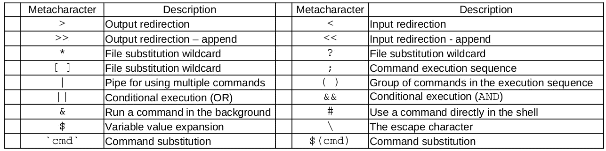

图 8.1 – 元字符列表

让我们看两个使用元字符进行命令替换的示例。我们将一个命令的输出作为另一个命令的输入。这个过程可以通过两种方式实现，如下图所示：

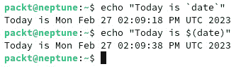

图 8.2 – 命令执行与替换示例

上述示例的目的是向你展示如何在 shell 中使用命令替换，但我们也许应该进一步解释所用命令的作用。我们使用了两个命令：`echo` 和 `date`。我们将 `date` 命令的输出嵌入到 `echo` 命令的输出中。`echo` 命令是 Linux 中最简单的命令之一，它将引号中的消息输出到标准输出。在我们的例子中，这个消息还包括了 `date` 命令的输出，显示系统当前日期，格式如图所示。

你还可以将两个或多个命令组合起来，在 Linux 中我们使用管道符来实现这一点。管道符将第一个命令的输出作为第二个命令的输入，依此类推，具体取决于你使用了多少个管道符。

在下面的示例中，我们使用 `ls -l /etc` 命令对 `/etc` 目录的内容进行长格式列出；然后将其通过管道传递给 `less` 命令。请按照以下代码使用：

```
ls -l /etc | less
```

`less` 命令一次显示一页内容，允许你查看所有内容。你可以使用箭头键或翻页键（Page Up 和 Page Down）在输出中导航，查看 `/etc` 目录的所有内容。

管道和命令替换将非常有用，特别是当你处理复杂命令或编写脚本时，正如你在本章后面学习如何创建和使用脚本时会看到的那样。

现在，让我们执行一些命令序列。然后，我们将使用元字符来分组命令并将输出重定向到一个文件。所有这些内容将在以下截图中显示：

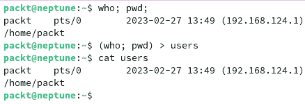

图 8.3 – 命令序列执行示例

如你在前面的输出中所看到的，第一行执行的两个命令可以很容易地通过大括号进行分组，并且它们的输出可以重定向到一个文件中。

我们使用了三种元字符——*命令执行顺序* (`;`)、用于*分组命令*的括号，以及*输出重定向* (`>`) 将输出重定向到文件。该文件最初并不存在，只有在命令执行时才会创建。我们使用的最后一个命令是 `cat` 命令，它*连接*了新创建文件的内容。

使用的前两个命令是 `who`，它将当前登录的用户信息打印到标准输出，和 `pwd`，它打印出我们所在的当前工作目录的位置。接下来的部分，我们将展示如何在 Shell 中使用大括号扩展。

### 大括号扩展

大括号也可以用来扩展命令的参数。**大括号**不仅限于文件名，不像通配符那样，它们可以与任何类型的字符串一起使用。在这些大括号中，你可以使用单个字符串、一个序列或由逗号分隔的多个字符串。

在这一部分，我们将展示一些使用这种扩展类型的示例。首先，我们将在当前工作目录中使用 `report` 和 `new-report`，并希望一次性删除它们。我们可以使用以下命令：

```
rm {report,new-report}
```

要创建多个文件（例如五个文件），它们共享部分名称，如 `file1`、`file2`、… `filen`，我们可以使用以下命令：

```
touch file{1..5}
```

以下截图显示了这两个命令的输出：

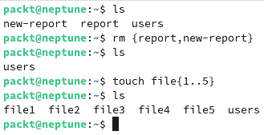

图 8.4 – 使用大括号扩展的示例

重要提示

大括号扩展是一个强大的工具，它为任何系统管理员的工作流增添了灵活性和强大功能。比如在学习如何编写脚本时，它将非常有用。

现在我们已经创建了这些文件，你应该能很容易地弄明白如何使用大括号扩展一次删除多个文件。将以下命令输入到你的控制台中，看看会发生什么：

```
rm file{1..5}
```

它将删除我们之前创建的所有五个文件。使用 `ls` 命令查看当前工作目录的内容。

在接下来的章节中，我们将讨论 shell 命令别名，它们是什么以及如何使用它们。

### shell 的别名

Linux shell 支持 `ll`，这是 `ls -alF` 的缩写。你也可以定义自己的别名，可以将它们设置为临时的或永久的，类似于变量。在以下示例中，我们更改了 `ll` 命令的别名：

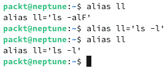

图 8.5 – 更改命令的别名

这个修改只是临时的，重新启动或 shell 重启后将恢复为默认版本。如果你想使其永久生效，应该编辑 `~/.bashrc` 文件，并将之前创建的别名添加到该文件中。为此，使用你喜欢的文本编辑器打开该文件，并将你在终端中使用的行添加到文件中。保存文件并执行它。同时，最佳实践是将这些行添加到一个名为 `.bash_aliases` 的新文件中。你可以查看 `.bashrc` 文件的默认内容，了解如何使用别名。

重要说明

`.bashrc` 文件是一个隐藏的脚本文件，包含不同的终端会话配置。此外，该文件还可以包含不同的函数，帮助用户完成重复任务。它会在用户登录时自动执行，也可以通过使用 `source .bashrc` 命令手动执行。

在接下来的章节中，我们将展示什么是 shell 变量以及如何使用它们。

## Bash shell 变量

Bash shell 使用不同类型的变量，和你在任何编程语言中使用它们的方式相同。Bash shell 有一些内置变量和间接变量，并且还允许你定义自己的变量。

Linux 有两种主要的 shell 变量类型：**全局变量**和**局部变量**。它们对于所有的 Linux 发行版通常是相同的，但也有一些例外。你需要查阅你发行版的文档，以了解任何特定的环境变量修改。

我们将带你了解 Linux 中最常用的变量，从内置变量开始。

### 内置 shell 变量

以下是一些标准内置变量的简短列表：

+   `HOME`: 用户的主目录（例如，`/home/packt`）

+   `LOGNAME`: 用户的登录名（例如，`packt`）

+   `PWD`: 当前的工作目录

+   `OLDPWD`: shell 的上一个工作目录

+   `PATH`: shell 的搜索路径（由冒号分隔的目录列表）

+   `SHELL`: shell 的路径

+   `USER`: 用户的登录名

+   `TERM`: 终端的类型

在 shell 中调用变量时，只需在变量名的前面加上美元符号 `$`。以下是一个简短的示例，展示了如何使用我们刚才列出的变量：

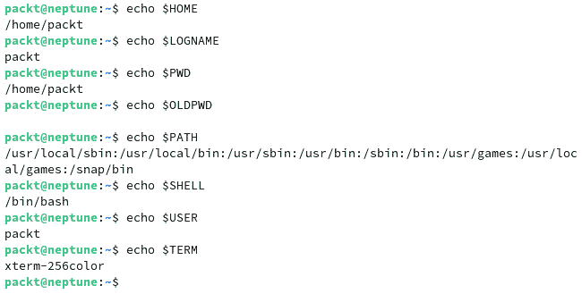

图 8.6 – 从 shell 调用变量

你还可以像下面的例子一样赋值自己的 shell 变量。在这里，我们将 `sysadmin` 字符串赋值给一个名为 `MYVAR` 的新变量，然后将其打印到标准输出：

```
MYVAR=sysadmin; echo $MYVAR
```

本节开头列出的变量只是 shell 中默认提供的所有变量的一部分。要查看所有 shell 变量，可以使用 `printenv` 命令。如果列表太长，可以将其重定向到文件中。在下面的例子中，你的变量列表存储在 `shell_variables` 文件中，你可以通过串联或在文本编辑器（如 Vim）中编辑来查看它：

```
printenv > ~/shell_variables
```

在这里，我们使用波浪号符号（`~`）来指定已登录用户的主目录。Shell 变量仅在 shell 内部可用。如果你希望某些变量能被 shell 运行的其他程序所知道，必须通过使用 `export` 命令将其导出。一旦变量从 shell 导出，它就成为 **环境变量**。

### Shell 的搜索路径

`PATH` 变量是 Linux 中一个重要的变量。它帮助 shell 知道所有程序的位置。当你在 Bash shell 中输入命令时，它首先必须通过 Linux 文件系统搜索该命令。有些目录已经列在 `PATH` 变量中，但你也可以添加新的目录。根据你的操作方式，添加的内容可以是临时的或永久的。要使一个目录的路径临时可用，只需将其添加到 `PATH` 变量中。在下面的例子中，我们将 `/home/packt` 目录添加到 `PATH` 中：

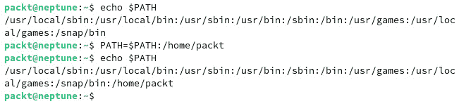

图 8.7 – 添加新位置到 PATH

要使任何更改永久生效，我们必须在名为 `~/.bash_profile` 或 `~/.bashrc` 的文件中修改 `PATH` 变量。

重要提示

一些发行版，如 openSUSE，会在用户的主目录中添加一个额外的 `bin` 目录。这是你可以放置希望 shell 执行的文件的地方，例如脚本文件。

Shell 的 `$PATH` 变量很重要，特别是在使用脚本时，因为你通常需要在一个 shell 已知的目录中创建脚本。在下一节中，我们将向你展示如何创建你的第一个 Bash 脚本。

# Shell 脚本基础

我们已经介绍了 Linux 命令行、shell 变量、通配符和元字符的关键内容。现在，我们将开始探索什么是脚本，如何创建它们以及如何在 Linux CLI 中使用它们。我们将不使用图形用户界面，仅使用 CLI，这是我们在前面章节中主要使用的。让我们从一些关于 shell 脚本的基本但重要的概念开始。

首先，让我们了解什么是 **脚本**。如果我们在字典中查找这个术语的意思，答案是脚本是一系列由计算机执行的指令，主要用于自动化特定任务。指令也可以很容易地看作是命令。因此，一系列由 shell 执行的命令可以被视为一个脚本。这是一个非常基础的脚本，但它仍然是一个脚本。让我们看看如何创建一个脚本文件。

## 创建一个 shell 脚本文件

编写脚本最合适的方法是将它们创建为一个文件，为了清晰起见，我们使用 `.sh` 扩展名。然而，这并不是强制性的，因为在 Linux 中，文件不像 Windows 那样使用扩展名。使文件被认为是脚本的独特特征是该文件中的 *第一行* 文本。对于 Bash shell 脚本，这一行的格式如下：

```
#!/bin/bash
```

当文件被打开并执行时，第一行告诉 shell 解释器它正在处理一个脚本文件，在我们的例子中，这个脚本将由 Bash shell 执行。如果你使用的是不同的 shell，这第一行会指向它。在 shell 脚本文件中，井号（`#`）表示注释行，除了这一行，它与感叹号（`!`）结合使用，指向 shell 的解释器。`#!` 的组合也被称为 **shebang**。

让我们创建一个基本的脚本文件。我们将使用以下代码：

```
#!/bin/bash
whoami
who
date
uptime
```

在这里，我们在第一个基本脚本中使用了四个不同的命令。我们为每个命令使用了单独的一行，但也可以用另一种方式来编写：将所有命令写在同一行并使用分号分隔它们。然而，为了清晰起见，使用不同的行会更有用。

现在我们有了第一个脚本，让我们运行它。我们在主目录下创建了名为 `basic-script.sh` 的脚本文件。让我们尝试通过在命令行中简单地调用它的名称来运行它：

```
$ basic-script.sh
```

我们将看到一个错误提示，如下图所示：

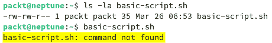

图 8.8 – 运行新脚本时出现的错误

你可能会想知道为什么会出现这个错误。是因为 shell 不知道你的脚本，它在 `PATH` 变量中找不到它。正如你从前一节中记得的那样，`PATH` 是 shell 用来查找特定文件位置并执行的变量。为了克服这个错误，我们有两个选择：

+   我们可以将脚本所在目录添加到 shell 的路径中

+   在命令行调用脚本时，我们可以使用相对路径或绝对路径

我们将使用第二种方法，因为它更方便。然而，你可以使用第一种方法作为一个很好的练习，尝试将你的目录位置添加到 shell 的 `PATH` 变量中。让我们通过指定位置来调用脚本文件：

```
$ ./basic-script.sh
```

我们会遇到另一个错误，这次是不同的错误，显示 `Permission denied`。这是因为我们没有权限执行该文件。当我们在 Ubuntu 机器内创建文件时，由于默认的 `umask` 值，该文件只为文件所有者和其组提供了读写权限。为了改变这一点，我们需要使用以下命令使文件可执行：

```
$ chmod u+x basic-script.sh
```

设置了文件的可执行权限之后，我们可以再次运行它，这次脚本将被执行。输出将显示脚本内的每个命令都被执行了：

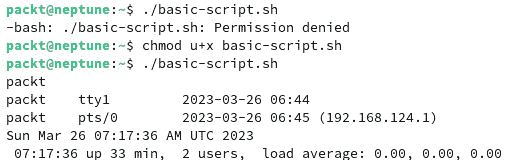

图 8.9 – 运行可执行脚本文件

如前面的截图所示，脚本已被执行，输出显示了每个命令的结果。第一行显示用户名（`whoami` 命令的输出），第二行显示已登录用户的信息（`who` 命令的输出），第三行显示当前日期的信息（`date` 命令的输出），最后一行显示当前会话的信息（`uptime` 命令的输出）。

重要说明

一般来说，当编写脚本时，我们建议*尽可能使用注释*来详细说明您选择的每个变量和参数。这被认为是一种良好的编程实践，可以使您的代码编写更加愉快和相关。记录您的编码步骤将使您的脚本在以后更容易阅读，无论是您自己还是其他任何可能遇到您代码的人。在本书中使用的示例中，我们并未使用太多注释，这是由于页面数量的限制。尽管如此，我们鼓励您使用它们。

有了这些知识，您就知道如何创建一个 shell 脚本文件以及如何执行它。现在让我们继续更高级的话题。在接下来的部分，我们将向您展示如何在您的脚本中使用变量。

## shell 脚本中的变量

在本章的开头，我们向您介绍了变量。现在是时候学习如何在脚本内使用它们了。回顾一下，让我们看看 Linux 中使用哪些类型的变量。我们可以使用 `printenv` 和/或 `set` 命令。我们在本章的*内置 shell 变量*部分列出了一些最常用的变量。

### 理解命名规范

在 Linux shell 内，系统的环境变量仅使用大写字母。因此，在创建用户指定的变量时，应遵循相关的命名考虑因素。在这方面，没有一个适用于所有情况的命名约定。但您应考虑变量名*区分大小写*且应最多*20 个字符*的长度。赋值给变量的方法是使用等号（`=`）符号。

如果你打算在变量名称中只使用大写字母，你应该考虑到这可能带来的灾难性后果，因为环境变量只使用大写字母。我们建议你在创建 shell 中的变量名称时，遵循以下规则之一：

+   仅使用小写字母、下划线和数字

+   将变量名中的单词首字母大写

重要提示

在考虑变量名长度时，尽量避免使用过长的名称；可以使用简洁且相关的名称或缩写。这样会让你的脚本更易于阅读和理解。

现在，让我们学习如何在 shell 中定义和使用第一个变量。我们将在下一节中探讨这个内容。

### 定义和使用变量

让我们创建一个名为`user-script.sh`的新文件，通过使用环境变量来显示相关的用户信息。创建文件并输入相关代码后，我们将使其可执行，然后运行它。以下是相关命令：

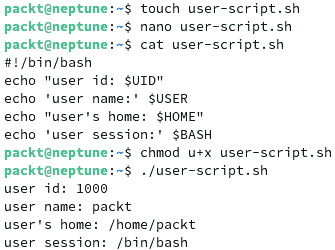

图 8.10 – 在脚本中使用环境变量

在前面的图中，我们使用了两种不同的方式来显示信息。使用双引号时，环境变量会被插入到引号字符串中，并且它的值会显示在输出中。请记住，使用单引号时，变量的值不会传递给 shell 解释器。我们使用了四个不同的环境变量来显示用户信息。它们分别是`UID`、`USER`、`HOME`和`BASH`。这是一种非常基本且直接的在脚本中使用 shell 变量的方式。

你还可以使用自己的变量，而不仅仅是 shell 提供的那些。Shell 解释器的一个非常有用的功能是它能够自动确定变量所使用的数据类型。你还应该知道，脚本中定义的变量值仅在 shell 运行时有效，之后会丢失。让我们创建一个新的 shell 脚本，并这次使用我们自己的变量。以下是输出：

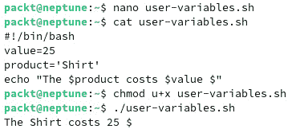

图 8.11 – 一个使用用户定义变量的基本脚本

在这里，我们创建了一个名为`user-variables.sh`的文件，并定义了两个变量，一个叫`value`，其值为`25`，另一个叫`product`，其值为`Shirt`。当我们在`echo`命令中调用这些变量时，我们使用了与环境变量相同的调用符号。

现在你已经知道如何命名、定义和使用变量，让我们继续深入学习更高级的主题。在下一节中，我们将展示如何在 shell 脚本中使用数学表达式。

## 在 shell 脚本中使用数学表达式

Shell 是一种编程语言，因此它具有用于处理数字的内建功能。Bash Shell 提供了`expr`命令，用于执行各种数学运算。要了解所有受支持的运算，请访问`expr`命令的内部手册页面，我们在这里不会完全列出：

```
man expr
```

然而，我们将展示如何使用`expr`命令提供的某些操作。请记住，正如手册中所述，你需要使用反斜杠字符(`\`)来转义一些`expr`命令使用的字符，否则它们会被 Shell 误解。让我们创建一个新的脚本文件并进行一些基本的数学运算。我们的新文件名为`math.sh`，可以使用以下代码创建：

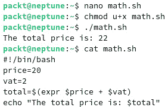

图 8.12 – 在脚本中使用 expr 命令

除了`expr`命令外，我们还可以使用方括号作为一种更简单的数学运算方式。让我们修改前面的脚本，替换掉`expr`命令：

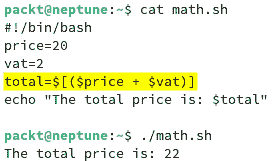

图 8.13 – 使用方括号进行数学运算

如前面的示例所示，我们使用了整数值。你可以尝试为`vat`变量使用浮动点值，例如，你会看到运行脚本时会显示错误。这是因为 Shell 只支持整数运算。为了克服这个限制，有一些解决方法，其中最可行的是使用 Bash 计算器，或者`bc`命令。

重要提示

如果你希望在 Shell 中完全支持浮动点运算，可能需要考虑使用**Z shell**（**Zsh**）。它在一些 Linux 发行版（如 Manjaro 和 Kali Linux）以及 macOS 中默认安装。你也可以在你的发行版中安装它。

让我们看看如何在我们的`math.sh`脚本中使用`bc`命令。我们将按照以下方式修改代码：

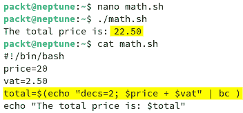

图 8.14 – 使用 bc 命令进行浮动点运算

在前面的示例中，我们将一个浮动点值赋给了`vat`变量，并使用`bc`命令来计算浮动点总数。我们可以像这样在变量中使用`bc`命令：

```
var=$(echo "option; expression" | bc)
```

`option`值为`bc`提供了选项。在我们的例子中，我们使用了一个名为`decs`（这是我们选择的一个任意名称）的变量来指定我们想要提供的小数位数。`expression`参数指定了我们使用的操作，在我们的例子中是加法。我们将`echo`命令的输出通过管道传递给`bc`命令，结果被赋值给了`var`变量。

创建 Bash Shell 脚本不仅仅是进行数学运算或执行一系列连续的 Shell 命令。有时候，脚本内部需要根据输入和期望的输出做出决策。这就是特定编程结构介入的地方。我们将在下一节中详细讲解这些结构。

# 使用编程结构

在本节中，我们将向你展示如何使用**条件语句**和**循环语句**。在编写高级 Shell 脚本时，它们非常有用。我们还将展示如何使用数组，如何在脚本中读取输入，以及如何格式化和打印输出数据。

## 在 Bash 中使用数组

我们在前面的章节中展示了如何使用变量。现在，是时候提升我们的技能，展示如何利用`filename1`、`filename2`、`filename3` …… `filenameN`，我们可以创建一个数组来存储所有的文件名。如果你熟悉其他编程语言，数组对你来说可能已经很熟悉。但如果你不了解其他编程语言，不用担心，因为 Bash 提供了一种简单的数组使用方法。

让我们从一个简单的例子开始。假设我们需要处理不同的用户名。为了避免为每个用户名使用不同的变量，我们可以使用**索引数组**：

```
usernames=("paul" "janet" "mike" "john" "anna" "martha")
```

数组中的元素从索引号`0`（零）开始。这一点很重要，尤其是在需要访问数组内容时。如果我们想访问用户名数组中的第三个元素（即`"mike"`字符串），我们必须使用以下代码：

```
echo ${usernames[2]}
```

输出将是`mike`（没有引号）。要打印整个数组，可以使用以下代码：

```
echo ${usernames[*]} or echo ${usernames[@]}
```

要打印数组的大小，也就是元素的数量，可以使用以下代码：

```
echo ${#usernames[@]} or echo ${#usernames[*]}
```

在我们的例子中，数组中有六个元素，输出将是`6`。

假设我们需要将一个新的用户名（`"alex"`）添加到数组中。有不同的方法来添加它。如果我们只想将其添加到数组末尾，而不指定位置，我们可以使用以下代码：

```
usernames+=("alex")
```

新的用户名将被附加到数组的末尾。此时，数组中的名字是无序的，我们需要将它们按字母顺序排列。我们将在*使用循环语句*部分介绍这一点，之后我们将教你如何进行输出格式化以及使用不同的条件语句和循环语句。

另外，我们也可以通过使用以下代码，在数组中的特定位置（比如位置 2）添加一个新元素（例如`"zack"`）：

```
usernames[1]="zack"
```

到目前为止，我们只在数组中使用了字符串作为示例。你也可以在索引数组中使用整数。创建数组的内置命令是`declare`。要创建一个索引数组，可以使用以下命令：

```
declare -a array_name
```

你还可以使用以下命令创建关联数组：

```
declare -A array_name
```

**关联数组**是基于键值对的元素。以下是一个关联数组声明的示例：

```
declare -A linux_distros=( [KDE]="openSUSE" [GNOME]="Fedora" [Xfce]="Debian" [Cinnamon]="Mint" )
```

方括号内展示的是用于映射值的键。双引号内的是值。要打印这些值，可以使用与索引数组相同的命令：

```
echo ${linux_distros[@]}
```

要打印键，请使用以下命令：

```
echo ${!linux_distros[@]}
```

索引数组与关联数组之间的主要区别在于，索引数组是基于索引值的，每个元素在数组中都有一个特定的索引位置，而关联数组则使用特定的键来映射值。

数组是 Bash 中重要的数据结构，稍后我们将在本章讨论循环语句时使用它们。但首先，让我们学习如何在脚本中读取输入数据，以及如何格式化输出数据。在下一节中，我们将展示如何从标准输入读取数据。

## 读取输入数据

默认情况下，Shell 从标准输入（即键盘）读取输入数据。要从标准输入读取数据，可以使用 `read` 命令。此命令会读取所有输入数据，直到提供新的行。每当你按下键盘上的 *Enter* 键时，就会发生这种情况。

使用 `read` 命令时，可以提供一个或多个变量。如果使用更多的变量，通过标准输入提供的每个单词将被分配给一个变量。以下是一个示例：


图 8.15 – 使用 `read` 命令进行标准输入

在前面的截图中，我们使用了 `read` 命令，并为四个变量 `a`、`b`、`c` 和 `d` 提供了值。当我们首次输入数据时，只为第一个变量提供了值，这意味着在输入第一个单词后，我们按下了 *Enter* 键。因此，`a` 只有一个值，而其他变量没有值。当我们第二次使用 `read` 命令时，为每个变量提供了值，在输入完单词 `Thursday` 后按下 *Enter* 键。这样，每个变量都接收了相应的值。`read` 命令有多个选项可用，但你需要阅读手册来了解它们的详细信息。与从标准输入提供值类似，`read` 命令还可以通过重定向从文件接收输入。例如，如果我们有一个名为 `week-days` 的文件，可以将其内容重定向到 `read` 命令：


图 8.16 – 使用 `read` 命令与文件重定向

`read` 命令用于在创建脚本时读取输入。我们已经向你展示了如何在命令行中使用该命令，但在本章稍后我们将回到这一部分，讨论更高级的脚本。在接下来的章节中，我们将介绍输出数据格式。

## 格式化输出数据

在 Linux 中，标准输出默认会定向到显示器。对于这个任务，你将有两个可以使用的命令。其中一个是我们在本书中广泛使用的 `echo` 命令。另一个命令是 `printf`，我们将在本节中讲解它的使用。

`printf` 命令类似于 C 编程语言中使用的命令。快速查阅 `printf` 命令的手册会向我们展示它应该使用的形式：

```
printf FORMAT [ARGUMENT] …
```

命令的所有参数会根据提供的格式字符串进行打印。格式控制符可以包含常规字符或**转义序列**，这些序列由反斜杠和字母组成。转义序列在可用的手册中有清晰的说明。简而言之，一些常用的序列如下：

+   `\``b`：退格符

+   `\``e`：转义

+   `\f`：换页符

+   `\n`：新行

+   `\r`：回车符

+   `\t`：水平制表符

+   `\v`：垂直制表符

使用反斜杠与`printf`时，应该通过使用双引号或另一个反斜杠从 shell 中进行转义。有关更多详细信息，请参考手册。

除了转义序列，`printf` 命令还具有格式化符。以下是一些常见格式化符所代表的含义：

+   `%s`：这是一个字符串格式化符，用于基本的字符串输出

+   `%b`：这是一个字符串格式化符，它允许解释转义序列

+   `%d`：这是一个整数格式化符，用于整数值

+   `%f`：这与整数格式化符类似，但用于浮点值

+   `%x`：用于整数的十六进制值和输出填充

现在你已经了解了 `printf` 命令的基础知识，让我们看一些如何使用它的示例。

在下图中，我们使用 `printf` 格式化符来展示使用与不使用格式化符之间的区别：

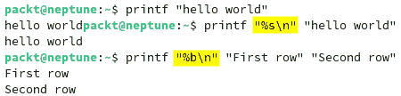

图 8.17 – printf 命令的基本用法

如下所示，使用默认设置时，`printf` 会打印双引号内的字符串，但行尾不会换行。使用 `%s` 格式化符时，命令打印作为参数提供的字符串，并将其解释为字符——在我们的例子中，就是双引号之间的字符串。使用 `\n` 会在每个字符串后创建一个新行。

现在我们在脚本中使用 `printf` 命令。以下是一个使用 `%s` 格式化符的 `printf` 示例。请注意，由于输出类似于使用双引号，因此我们使用单引号来调用该命令：

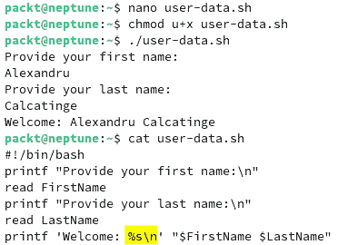

图 8.18 – 在脚本中使用 printf

前面的图示展示了一个脚本，它从标准输入设备读取两个变量，并将这两个变量显示到标准输出（显示器）上。我们使用了字符串格式符（`%s`）和换行符转义序列（`\n`）。现在，让我们深入探讨输出格式化。在接下来的示例中，我们将使用新的制表符转义序列（`\t`）以及换行符转义序列（`\n`）和字符串格式符。请看以下图示，看看格式化是如何工作的：

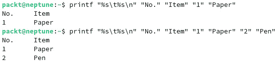

图 8.19 – 使用制表符和换行符转义序列

我们刚刚展示的示例使用了转义序列来模拟输出的表格格式化。我们可以通过使用一个包含比之前更复杂格式符的脚本来实现这一点。在以下示例中，我们使用了字符串（`%s`）、整数（`%d`）和浮点数（`%f`）格式符来格式化表格输出：

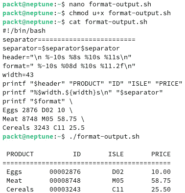

图 8.20 – 使用复杂格式符和转义序列进行表格格式化

让我们详细解释一下我们的 `format-output.sh` 脚本。我们有一个名为 `separator` 的变量，用于在标题和内容之间打印出图形边框。接下来，我们有 `header` 和 `format` 变量，每个都使用格式符和序列来进行格式化。`header` 以换行符（`\n`）开始，后跟一个宽度为 10 字符、左对齐的字符串格式符（`%-10s`），接着是一个宽度为 8 字符、右对齐的格式符（`%8s`），一个宽度为 10 字符、右对齐的格式符（`%10s`），以及一个宽度为 11 字符、右对齐的格式符（`%11s`），最后以换行符结束（`\n`）。`format` 变量用于通过两个字符串列（使用 `%s` 格式符）、一个整数（`%d`）和一个浮点数（`%f`）格式符来格式化表格的内容。整数值用于产品 ID，浮点值用于价格。我们使用 `%08d` 格式符来打印 ID，这意味着输出将是宽度为 8 字符。前面的 `0` 表示任何空格都会被零填充。这确保了即使 ID 号码少于八位数，剩余的宽度也会用零填充，以保持所需的 8 字符宽度。结果显示在前面截图的下方，我们有一个包含产品、ID、位置和价格的表格。

因此，`printf` 是一个非常多功能且强大的工具，可以在你的脚本中带来很好的效果。现在你已经掌握了 Bash 脚本中输入和输出数据格式化的基本工具，我们可以继续探讨其他有用和重要的结构。

在接下来的部分，我们将讨论退出状态。

## 理解退出状态和测试结构

为了使用条件和循环语句，我们需要理解 `$?`。问号的位置是一个整数，表示命令的状态。例如，如果命令执行成功，问号的值将是 `0`（零），参数将显示为 `$0`。如果命令执行不成功，问号的值可能是从 1 到 255 之间的任何值。通常，错误代码是 `1`，因此参数将是 `$1`。这些也被称为**退出代码**。

除了退出代码，**测试结构**在 Bash 的条件和循环语句中也很重要。这些测试结构通常是前述语句的构建模块。它们被视为 Shell 的关键字，表示方式如下：

+   `[[ ]]`：双方括号用于测试命令的真假状态；它也可以对正则表达式执行操作

+   `(( ))`：双括号用于算术运算

+   `test`：该关键字用于评估表达式，如字符串、整数和文件属性

重要提示

Bash 的语法要求在括号前后使用空格——例如，`[` `operation ]`。

在条件语句中，还会使用一些其他类型的操作符进行测试。我们来看一些常用的条件操作符，用于**整数测试**：

+   `-eg`：等于检查操作符

+   `-ne`：不等于操作符

+   `-lt`：小于操作符

+   `-le`：小于或等于操作符

+   `-gt`：大于操作符

+   `-ge`：大于或等于操作符

此外，Linux shell 脚本中还有参数操作符。`$0` 变量代表用于运行脚本的命令，而 `$1` 到 `$n` 代表传递给命令的第一个到第 *n* 个参数。例如，`$1` 代表第一个参数，`$2` 代表第二个参数，依此类推，`$n` 代表命令的第 *n* 个参数。

除了本节展示的操作符，基本的数学运算符在条件语句中也会被使用。

也有用于**字符串**的测试结构：

+   `=`：测试字符串是否相同（`==` 也可以接受）

+   `!=`：测试字符串是否*不*相同

+   `\<` 和 `\>`：小于和大于符号用于字符串比较，但必须进行转义（我们已经使用了反斜杠字符）

也有用于**文件类型**的测试操作符，它们以选项的形式出现：

+   `-f`：测试是否为常规文件

+   `-d`：测试是否为目录

+   `-h` 或 `-L`：测试是否为符号链接

+   `-e`：测试文件是否存在

这里是一些用于测试的其他操作符：

+   `-a`：逻辑“与”操作符

+   `-o`：逻辑“或”操作符

+   `-z`：检查是否输入了字符串

测试操作符既复杂又实用，因此学习它们非常重要。

在下一节中，我们将讨论 Bash 的条件语句。

## 使用条件 if 语句

就像其他编程语言一样，Bash 也有条件执行语句，如`if-then-fi`、`if-then-else-fi`和*嵌套*`if`，以及条件操作符，如`&&`（*与*）和`||`（*或*）。我们将在本节中展示如何使用它们。

我们将在本节中展示所有形式的`if`语句（`if-then`、`if-then-else`和嵌套`if`）：

+   `if-then-fi`语句在最常见的形式中具有以下语法：

    ```
    if [condition]
    then
         commands
    fi
    ```

    这个 Bash `if`语句在`if`关键字后运行`condition`。如果命令成功完成，即其退出状态为零，那么它将执行`then`关键字后列出的命令。

+   `if-then-else-fi`语句与`if-then`语句类似，具有以下语法：

    ```
    if [condition]
    then
         commands
    else
         commands
    fi
    ```

    与更简单的`if-then`语句类似，`condition`会被执行，并且根据其退出状态，结果会有所不同。如果它成功完成，`then`关键字后的命令将被执行；但是如果有其他退出状态（非零），则`else`关键字后的命令将被执行。这为你提供了更多的选择和替代方案，具体取决于条件的结果。有些情况需要在单个`if-then`命令内部检查更多条件，因此可以使用嵌套的`if`语句来实现。

现在，让我们讨论一些在`if`语句中使用的基本条件参数，并附上一些示例：

+   在这个例子中，我们将检查用户输入的数字是偶数还是奇数。脚本将使用`read`命令获取用户输入；然后，它将检查该数字除以二的余数是否为零。通过这种方式，它确定数字是奇数还是偶数。我们将在这个例子中使用`if-then-else`语句，并结合`read`和`printf`命令。以下截图展示了代码和执行输出：

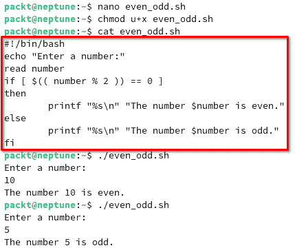

图 8.21 – 确定偶数或奇数的脚本

+   以下脚本通过使用`test -f`操作符检查用户输入的文件名是否确实是一个文件。我们将输入要检查的文件的绝对路径。该脚本名为`testing_file.sh`，其代码如下所示：

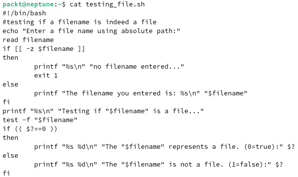

图 8.22 – 检查输入的文件名是否为文件

运行此脚本时，系统会提示你提供现有（或不存在）文件的文件名和完整路径。让我们进行一些测试。你将看到下图所示的输出。我们测试了在三种不同情况下脚本是否正常工作：当我们不提供文件名时，当我们输入正确的文件名时，以及当我们输入错误的文件名时：

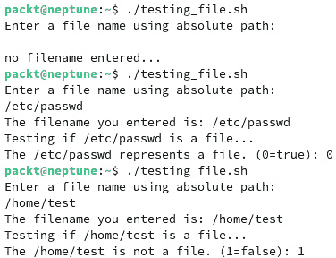

图 8.23 – 运行文件检查脚本

既然我们已经涵盖了`if`条件语句的基本用法，让我们继续学习其他类型的语句，如循环语句。

## 使用循环语句

在 Bash 中，`for`、`while` 和 `until` 命令，我们将在本节中向您展示如何使用它们。循环语句用于需要重复处理的情况，例如循环执行多个命令，直到满足某个条件。

### 使用 for 语句

和任何其他编程语言一样，当需要执行重复任务时，就会出现迭代的需求。这意味着一些命令需要重复执行，直到满足条件。这在 Bash 中与其他编程语言类似，其中一个可以使用的命令就是`for`命令。它的结构如下：

```
for var in list
do
     commands
done
```

如果你之前没有接触过这样的语句，我们将帮助你理解它的含义。通过`var`参数提供的变量会在每次迭代中被赋予`list`参数中提供的一系列值。在迭代开始时，变量会被设置为列表中的当前（或起始）值。每次迭代将使用列表中的另一个值，直到列表中的最后一项。列表中的项数将决定迭代的次数。在每次迭代中，`commands`块中的命令将被执行。这是我们描述的基本循环。

让我们看看`for`命令的一些基本用法。我们将遍历一个静态声明的数组。这意味着我们不会使用用户的输入；相反，我们将在脚本中直接指定数组。我们将使用一个临时变量（或计数器）`i`来遍历数组的整个长度。我们使用`${array[@]}`来指定数组的长度。当计数器（`i`）达到该长度时，循环将停止。下图展示了脚本的代码、运行该脚本的命令以及输出。请记住，我们提供了一个已经排序的数组。这不是排序算法：

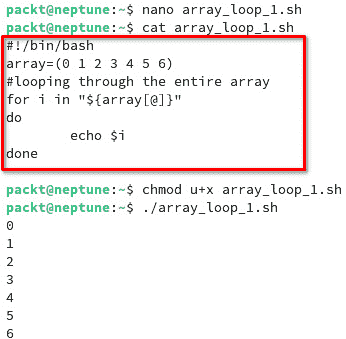

图 8.24 – 使用 for 语句遍历数组

在下面的示例中，我们将重新讨论数组，并在`for`语句中使用其中的一些。这次，我们将展示如何对数组进行排序。我们将使用我们已经学习过的大部分结构，例如输入读取、输出格式化、数组和`for`语句。

重要提示

排序算法超出了本书的范围。我们只使用一种排序方法（冒泡排序）来展示如何使用数组和`for`语句，以及 Bash 的强大功能。然而，如果你计划在使用 Shell 时进行任何严肃的编程，我们建议你使用其他更适合这类操作的编程语言，例如 Python。Python 非常灵活，可以成功用于许多管理任务。

让我们回到排序问题上。假设我们有一个随机数组，我们希望对其进行排序。我们将使用一个只包含整数元素的数组。为了让事情更有趣，我们将提示用户从标准输入中输入数组元素。下图展示了脚本的代码：

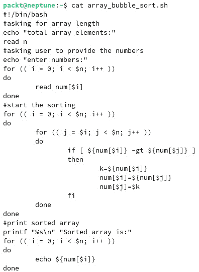

图 8.25 – 使用冒泡排序算法对数组进行排序

让我们解释一下代码。我们使用了一个变量`n`来指定数组的长度。然后，我们用这个变量遍历用户提供的所有数字。在第一个`for`语句中，我们遍历所有数字，并小心地通过每一步增加计数器（使用`I`变量）（`i++`结构）。用户提供的数字随后存储在一个名为`num`的数组中。当排序开始时，我们使用两个嵌套的`for`语句和一个`if`语句。我们使用了一个新的计数器`j`，用于存储数组中新的连续数字的值。`if`语句比较数组中连续两个数字哪个更大，从而在数组的前两个元素之间进行交换。为了进行交换，我们使用一个临时计数器`k`来保持较大数字的值，以便交换这两个正在比较的数字。循环在所有数字都被遍历后结束。最终的`for`语句打印出新排序后的数组内容。

用户输入和命令输出如下所示：

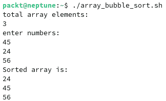

图 8.26 – 显示我们的排序脚本的输入和输出

在上面的例子中，冒泡排序的工作原理如下：

+   第一步是比较数组中的前两个元素，即`45`和`24`，看看哪个更大；`45`大于`24`，所以新的数组将是`24 45` `56`（该算法在`45`和`24`之间进行交换）。

+   第二步是比较下两个元素，它们现在是`45`和`56`（因为`45`大于`24`，现在排在第二位；由于`45`不大于`56`，它们的位置将保持不变）。

+   第三步是再对所有元素进行一次遍历，并继续进行比较。

重要提示

冒泡排序并不是一种高效的排序算法，但它是一个很好的示例，展示了如何使用数组、`for`和`if`语句、用户输入和输出格式化。有关冒泡排序算法或其他任何类型排序算法的更多信息，建议您进行深入的在线搜索，或者阅读本章结尾的*进一步阅读*部分中提供的书目。

现在你知道如何使用`for`语句了，接下来我们来看看`while`语句。

### 使用`while`语句

`while` 循环与 `for` 循环类似，不同之处在于它某种程度上也结合了 `if` 语句。只要条件为真，循环就会执行命令。其语法如下：

```
while condition
do
     commands
done
```

每次开始一次迭代时，都会测试条件。如果条件保持为真，退出状态为零，命令将继续执行直到条件状态发生变化。我们来看一些例子。

在以下脚本中，我们使用 `while` 语句以降序遍历数字列表：


图 8.27 – 使用 `while` 语句

`while` 语句会评估 `[ $max -gt 0 ]` 条件，并在条件为假时停止迭代。这意味着，只要你提供的数字大于 (`-gt`) 零，命令就会执行。`while` 循环内部的命令只是通过每次迭代减少数字。否则，你将陷入无限循环。因此，`while` 循环每执行一次，`max` 变量的值就会减少 1。我们用两个值进行了测试，分别是 10 和 30；你可以在*图 8.27*中看到输出结果。

`while` 语句非常有用且直观，它是对 `for` 语句的一个重要补充。现在，让我们来看一下 `until` 语句。

### 使用 `until` 语句

这种循环结构与 `while` 相反。它使用一个从一开始就是假的条件，只有当条件保持为假时，结构内的命令才会被执行。其语法如下：

```
until condition
do
     commands
done
```

快速示例，让我们将之前的 `while` 循环用 `until` 语句重新做一次。以下是代码：


图 8.28 – 一个 `until` 语句的示例

你能找出 `until` 循环和 `while` 循环之间的区别吗？在 `until` 循环中，迭代会继续直到变量的值等于零，`[ $max -eq 0 ]`。`until` 循环内部的命令与 `while` 循环中的命令相同，唯一不同的是条件。输出结果，正如你预期的那样，和使用 `while` 循环时是一样的。

在我们继续学习更高级的编程结构之前，我们将提供一些关于使用特定关键字控制循环执行的基本信息。

### 退出循环语句

Bash 中用于退出循环的两个命令是 `break` 和 `continue`。它们非常简单直观。每当你想退出一个循环时，可以使用其中一个。让我们使用一个简单的脚本，遍历一系列整数，直到达到指定值并退出迭代。以下是代码：


图 8.29 – 使用 `break` 命令退出循环

在执行时，系统会要求用户输入序列的最大值和`break`的值。`for`循环会遍历序列，直到达到`break`的值，然后退出循环。我们使用`break`命令退出循环，并从零开始迭代。你可以尝试使用不同的值来测试结果。以下是使用最大序列值为`10`、`break`值为`5`时的输出：

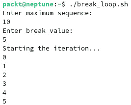

图 8.30 – 使用 break 脚本示例的输出

如你所见，循环在达到 5 后退出。然而，它显示了 5 的值，并没有跳过它。这个问题可以解决（这不一定是问题，更像是算法设计的决策）。让我们看一下以下代码：

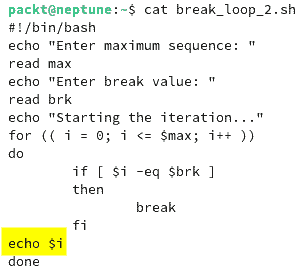

图 8.31 – 优化后的中断循环

为了让中断值不显示，我们将`echo $i`命令移到条件语句之后。这样可以防止脚本显示用户提供的中断值。两种用例都是有效的，并且提供相同的输出，因此输出打印命令的位置只与你的需求相关。

在下面的示例中，我们将展示如何使用`continue`命令退出循环。这个算法与`break`示例中使用的类似，只是这次用户提供的值不会显示在输出中。当满足条件时，`break`命令会退出循环，而`continue`命令则会跳过条件后面的其余命令执行，继续进行下一次循环。这种区别足以让你理解`break`和`continue`之间的差异。让我们看看使用`continue`命令的相同脚本的代码：

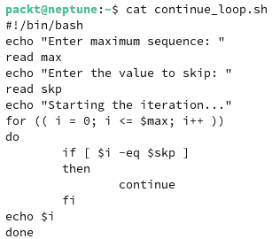

图 8.32 – 在循环中使用 continue 命令

如你所见，代码与前一个示例中使用的类似。唯一的区别是使用了`continue`命令，而不是`break`。现在，让我们看看获得的输出：

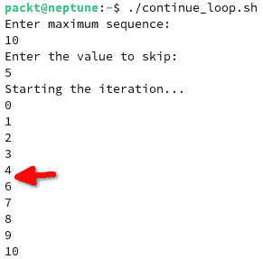

图 8.33 – 使用 continue 命令时的输出

如前图所示，数字 5 没有显示，这意味着当使用`continue`命令时，循环跳过了它。

现在你已经掌握了不少 Linux 脚本编写的知识。你知道如何使用变量、数组、if 和循环语句，甚至如何退出循环。在下一节中，我们将向你展示如何使用更高级的编程结构，如函数。

## 使用函数

与大多数编程语言一样，`function`关键字后跟函数名，如以下语法所示：

```
function name {
     commands
}
```

另外，你可以在函数名称后面使用括号，如下所示的语法：

```
name() {
     commands
}
```

语法中的名称是一个独特的名称，函数将在整个脚本中使用。命令由一个或多个 Shell 命令表示，这些命令会按照它们出现的顺序由函数执行。简而言之，你可以将函数看作是脚本中的脚本。让我们来看一些示例。

有些冗余的风险，我们将使用之前创建的一个脚本并将其作为函数使用，先给你展示一下函数是如何工作的。我们将使用排序数字的脚本，并将它变成一个函数。但在此之前，让我们先给你一些关于函数的注意事项。

重要提示

函数必须在调用之前创建。调用函数是指在脚本中运行它。如果你在调用函数之后创建它，脚本会给你一个错误，因为 Bash 是一个单次解释器。一个好的做法是将函数创建在脚本的开头。这样，脚本中任何需要使用它们的地方，它们都会随时可用。

所以，这就是它——我们的第一个函数显示在下面的截图中。如你所见，首先，我们创建了`sorting`函数，然后调用了它：

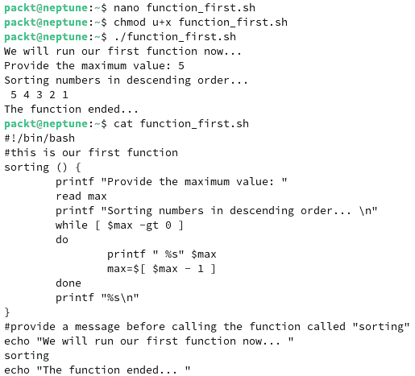

图 8.34 – 运行我们的第一个函数

到此为止，你已经知道如何在 Shell 脚本中创建和调用函数，但这仅仅是个开始。我们将尽力为你提供所有关于函数的必要信息，这样你就能在脚本中使用它们。如果你想了解更多信息，请参考*进一步* *阅读*部分中的标题。

在下一节中，我们将带你了解不同的函数功能，如输出、变量和数组处理。

### 高级函数功能

正如之前所说，Bash shell 中的每个函数本身就像一个脚本。这意味着它可以像脚本一样管理变量、数组和输出。在本节中，我们将展示如何在函数中使用变量、数组和输出。

#### 在函数中使用变量

两种类型的变量（全局变量和局部变量）都可以在函数内使用。让我们概述一下这两种变量之间的区别。全局变量在整个系统中都是可见且可用的，而局部变量仅在声明它们的函数内部可用。默认情况下，Bash 中的所有变量都被定义为全局变量，包括在函数内定义的变量。要在函数内声明局部变量，我们可以使用`local`关键字。让我们看一个基本的例子，来理解这一点是如何工作的：

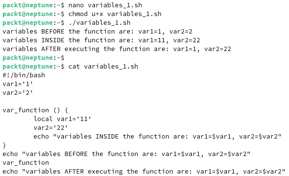

图 8.35 – 显示局部变量和全局变量在函数中的作用

上述图展示了变量是如何声明的。例如，首先我们声明了 `var1='1'` 和 `var2='2'` 变量。默认情况下，它们被设置为全局变量。然后，在 `var_function` 函数内，我们修改了这两个变量的值，但其中一个变量我们使用了 `local` 关键字来定义它为函数内局部变量。对于另一个变量，我们没有使用相同的关键字——我们按函数外的定义方式进行定义。因此，当函数运行后打印变量到标准输出时，只有 `var2` 会保留函数内给定的值，而 `var1` 由于在函数内部是局部定义的，因此其值只在函数内有效。

#### 在函数中使用数组

与变量不同，函数中的数组有些问题。需要考虑两种情况：一种是当你需要将数组从脚本传递到函数时，另一种是当你需要将数组从函数返回到脚本时。在第一种情况下，你不能将数组作为函数参数传递，因为函数只会使用数组的第一个值。因此，便捷的做法是将数组拆开，然后在函数内部重新构建它，尽管这听起来不实际，且经验证明确实不太实用。在第二种情况下，处理数组的方式与第一种情况类似，因为函数会按照正确的顺序输出值，而脚本则会将这些值重新组合成数组。来看一个例子：

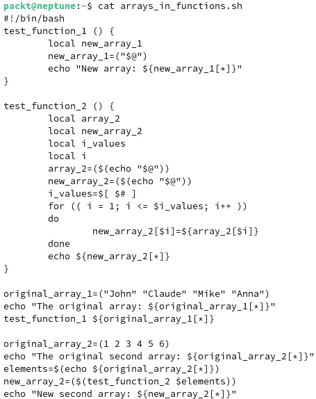

图 8.36 – 在函数中使用数组

在前面的例子中，我们使用了两个函数，每个函数分别处理了前面小节开头描述的两种情况。脚本中的 `test_function_1` 函数展示了我们如何将数组元素传递给函数。`test_function_2` 函数展示了如何从函数中返回数组。下面是输出结果：

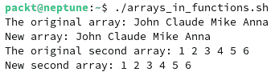

图 8.37 – 在函数中使用数组的输出

到此为止，你已经学习了如何创建脚本，以及如何使用数组、变量、编程结构和函数。现在，是时候学习如何在命令行和脚本中同时使用 `sed` 和 (`g`)`awk` 了。

## 使用 `sed` 和 (`g`)`awk` 命令

`sed` 和 (`g`)`awk` 都是用于处理文本文件的高级工具。`sed` 是流编辑器，而 `awk` 是一种编程语言。我们还使用 `gawk` 这个术语（因此括号内的 `g` 字母）是因为它是 `awk` 的 GNU 实现，提供了更多的功能和扩展。让我们学习如何在命令行中使用这两者。

### 在命令行中使用 `sed`

`sed` 不仅仅是一个简单的命令。它是一个数据流编辑器，基于预先提供的一组严格规则编辑文件。根据这些规则，命令逐行读取文件，然后对文件中的数据进行操作。`sed` 是一个非交互式流编辑器，它基于脚本进行更改，因此非常适合一次编辑多个文件或执行繁琐的重复任务。`sed` 命令的一般语法如下：

```
sed OPTIONS… [SCRIPT] [FILE…]
```

`sed` 命令使用不同的脚本子命令，其中一个常用的子命令用于文本替换。这里有许多其他用法，我们不会在此讨论，但如果你想了解更多关于 `sed` 工具的信息，网上和书籍中有很多很好的资料。例如，以下链接可能会有所帮助：[`www.ibm.com/docs/en/aix/7.2?topic=s-sed-command`](https://www.ibm.com/docs/en/aix/7.2?topic=s-sed-command)。

文本替换常用的语法如下：

```
sed 's/regex/replacement/flag'
```

以下是一些 `sed` 最常见用法的示例：

+   在文本文件中将一个名称替换为另一个名称。以此示例，我们将在家目录中使用一个名为 `poem` 的新文件。在该文件中，我们生成了一首随机诗歌。任务是将文件中的 `Jane` 替换为 `Elane`。字母 `g` 作为命令的标志，指定操作应为全局操作——即应应用于整个文本文件。结果如下：

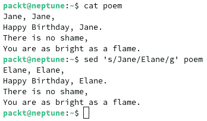

图 8.38 – 使用 sed 命令替换文本文件中的字符串

如果你使用 `cat` 命令检查原始文件，你会发现 `sed` 只将更改后的名称结果输出到标准输出，并没有对原始文件进行任何更改。要使更改永久生效，你必须使用 `-i` 属性。

+   在以下示例中，我们将在每行的开头添加新空格，并将输出重定向到一个新文件。我们使用的是之前的 `poem` 文件。文件的开头由 `^` 字符表示：

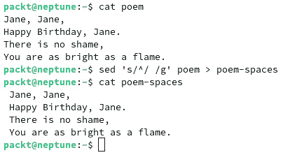

图 8.39 – 使用 sed 添加空格

+   我们将使用 `sed` 仅显示 `poem` 文件中的第二行，并显示除了*第 2 行*之外的所有行：

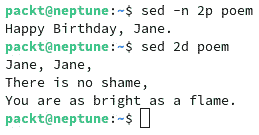

图 8.40 – 使用 sed 显示文件中的特定行

+   让我们仅显示文件中的*第 4 行到第 6 行*——在我们的例子中，是 `/etc/passwd` 文件：

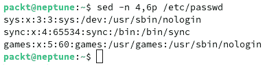

图 8.41 – 使用 sed 显示文本文件中的特定行数

+   这是一个更实际的练习。我们将显示 Ubuntu 中 `/etc/apt/sources.list` 的内容，排除注释行。为此，请使用以下命令：

    ```
    #) character, represented by the ^# characters inside the command. Those are the comments inside the file. We also use the g flag to specify that the operation is global for that file. The following is part of the output provided by the command. Use it on your Ubuntu system and analyze your output as well:
    ```

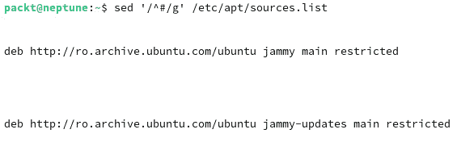

图 8.42 – 使用 sed 仅显示没有注释的行

在以下小节中，我们将探讨命令行中的`awk`命令。

### 从命令行使用 awk

`awk`不仅仅是一个简单的命令——它是一个模式匹配语言。它是一个完整的编程语言，是 PERL 的基础。它用于从文本文件中提取数据，语法类似于 C。它将文件视为由字段和记录组成。`awk`命令的一般结构如下：

```
awk '/search pattern 1/ {actions} /search pattern 2/ {actions}' file
```

`awk`的真正强大之处超出了本章的范围，因此我们将仅展示一个简单的例子，它可能对未来的系统管理员有所帮助。

作为示例，我们将生成一个包含所有已安装包名称的列表。我们只想打印每个包的名称，而不显示其他所有细节。为此，我们将使用以下命令：

```
sudo dpkg -l | awk '{print $2}' > package-list
```

此命令仅显示已安装的包的名称。以下是输出：


图 8.43 – 使用 awk 生成包名称列表

通常，要查看 Ubuntu 中已安装的包，我们会运行`dpkg -l`命令。在前面的示例中，我们将该命令的输出通过管道传递给`awk`命令，后者打印了`dpkg -l`输出的第二列（字段）（`'{print $2}'`）。然后，我们将所有内容重定向到一个名为`package-list`的新文件，并使用`tail`命令查看新创建文件的最后 10 行。

`sed`和`awk`都是非常强大的工具，我们仅仅触及了它们能做的一部分。请随意深入了解这两个极具潜力的工具。

# 使用脚本展示进程间通信

`producer.sh`和`consumer.sh`），从而模拟生产者和消费者进程。我们希望使用这样简单的模型仍然能为现实世界应用提供合理的类比。

现在，让我们来看看共享存储、命名管道和无名管道，以及我们在*第五章*中介绍过的套接字 IPC 机制，但没有详细讨论。

## 共享存储

在它最简单的形式下，`storage`文件。

在这个简单的用例中，显而易见的挑战是由于潜在的竞争条件，读写操作的完整性受到影响。为了避免竞争条件，在写操作期间必须对文件进行锁定，以防止与其他读或写操作发生重叠。为了简化问题，我们在我们的简单示例中不解决这个问题，但我们认为值得提及。

在我们的示例中，生产者每`5`秒将一组新的数据（`10`个随机 UUID 字符串）写入`storage`文件。以下截图展示了生产者的脚本：

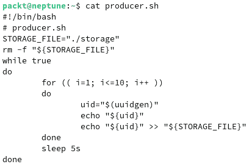

图 8.44 – 生产者脚本（使用共享存储）

消费者每秒钟读取一次 `storage` 文件的内容。下图显示了消费者的脚本：

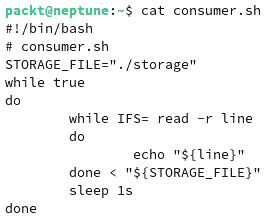

图 8.45 – 消费者脚本（使用共享存储）

运行两个脚本时，生产者生成随机字符串并将其写入 `storage` 文件，而消费者从同一个文件中读取生产者的输出。输出如下截图所示：

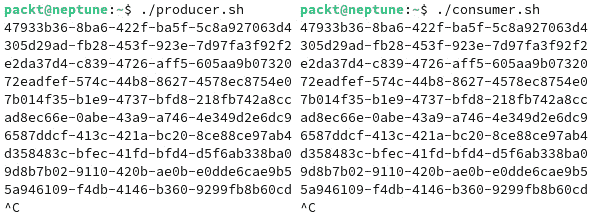

图 8.46 – 生产者（左）和消费者（右）通过共享存储进行通信

接下来，我们将向您展示无名管道是如何工作的。

## 无名管道

**无名**管道或**匿名**管道，也称为**常规**管道，将一个进程的输出传递到另一个进程的输入。以我们的生产者-消费者模型为例，最简单的方式来说明无名管道作为进程间通信机制的使用方式是：

```
producer.sh | consumer.sh
```

前述示意图中的关键元素是管道符号 (`|`)。管道的左侧产生一个输出，并直接传递给管道右侧进行消费。为了适应匿名管道 IPC 层，我们将创建两个新的脚本，分别叫做 `producer2.sh` 和 `consumer2.sh`。代码如下截图所示：

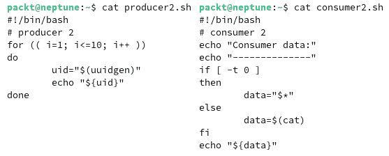

图 8.47 – 生产者 2（左）和消费者 2（右）脚本（使用无名管道）

在我们修改后的实现中，`producer2.sh` 向控制台打印一些数据（`10` 个随机的 UUID 字符串）。`consumer2.sh` 读取并显示通过 `/dev/stdin` 管道传来的数据，或者在管道为空时显示输入的参数。`consumer2.sh` 脚本中的 *第 6 行* 检查 `/dev/stdin` 中是否有管道数据（`fd0` 对应的值为 `0`）：

```
if [ -t 0 ]
```

生产者-消费者通信的输出如下截图所示：


图 8.48 – 生产者通过无名管道将数据传递给消费者

输出清晰地显示了消费者进程打印的数据。（请注意 `"Consumer data:"` 标题前面的 UUID 字符串。）

IPC 匿名管道的一个问题是，生产者和消费者之间传输的数据并没有通过任何存储层持久化。如果生产者或消费者进程被终止，管道会消失，底层数据也会丢失。命名管道解决了这个问题，接下来我们将在下一节中展示。

## 命名管道

**命名管道**，也称为**先进先出**（**FIFO**），与传统的（无名）管道相似，但在语义上有很大不同。无名管道仅在相关进程运行时存在。然而，命名管道具有持久存储，且只要系统处于运行状态，它就会一直存在，无论与相关 IPC 通道连接的进程是否正在运行。

通常，命名管道充当一个文件，当不再使用时可以删除它。让我们修改生产者和消费者脚本，以便使用命名管道作为它们的 IPC 通道：

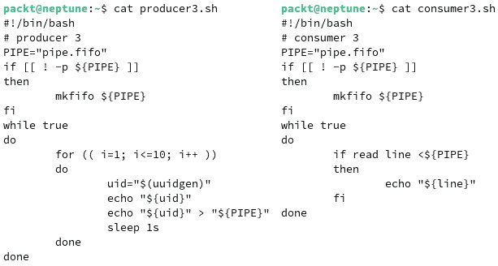

图 8.49 – producer3（左）和 consumer3（右）脚本（使用命名管道）

命名管道是 `pipe.fifo`（两个脚本中的 *第 3 行*）。当生产者或消费者启动时，会创建管道文件（如果该文件尚不存在）（*第 6 行*）。相关命令是 `mkfifo`（更多信息请参见 `man mkfifo`）。

生产者每秒向命名管道写入一个随机 UUID（`producer3.sh` 中的 *第 14 行*），消费者立即读取它（`consumer3.sh` 中的 *第 10 行* 到 *第 12 行*）：

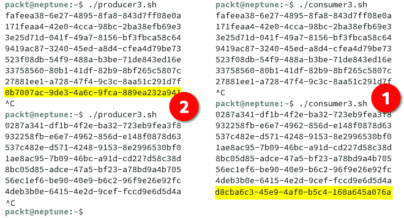

图 8.50 – producer3（左）和 consumer3（右）通过命名管道进行通信

我们以任意顺序启动了两个脚本——生产者和消费者。一段时间后，我们停止（中断）了消费者（*步骤 1*）。生产者继续运行，但自动停止向管道发送数据。然后，我们重新启动了消费者，生产者立即恢复向管道发送数据。过了一段时间后，我们停止了生产者（*步骤 2*）。这时，消费者变得空闲。重新启动生产者后，两者恢复正常操作，数据开始通过命名管道流动。这个工作流展示了命名管道的持久性和弹性，无论生产者或消费者进程的运行状态如何。

命名管道本质上是队列，数据按先进先出的顺序排队和出队。当两个以上的进程在 IPC 命名管道通道上进行通信时，FIFO 方法可能不合适，特别是当某些进程需要更高优先级的数据处理时。接下来，我们将向您展示套接字的工作原理。

## 套接字

有两种类型的 IPC **基于套接字的设施**：

+   **IPC 套接字**：也称为 Unix 域套接字

+   **网络套接字**：**传输控制协议**（**TCP**）和**用户数据报协议**（**UDP**）套接字

IPC 套接字使用本地文件作为**套接字地址**，并支持同一主机上进程之间的双向通信。另一方面，**网络套接字**通过 TCP/UDP 网络扩展 IPC 数据连接层，使其超越本地机器。除了显而易见的实现差异外，IPC 套接字和网络套接字的数据通信通道行为相同。

两种套接字都配置为流，支持双向通信，并模拟客户端/服务器模式。只要任一端没有关闭，套接字的通信通道就会保持激活状态，从而中断 IPC 连接。

让我们调整我们的生产者-消费者模型来模拟 IPC 套接字（Unix 域套接字）数据连接层。我们将使用 `netcat` 来处理底层客户端/服务器 IPC 套接字的连接。`netcat` 是一个强大的网络工具，用于通过 TCP、UDP 和 ICP 套接字连接来读写数据。如果你的 Linux 发行版默认没有安装 `netcat`，你可以按如下方式安装：

在 Ubuntu/Debian 上，使用以下命令：

```
sudo apt install netcat
```

在 Fedora/RHEL 上，使用以下命令：

```
sudo dnf install nmap
```

欲了解更多关于 `netcat` 的信息，请参考相关的系统参考手册（`man netcat`）。

在以下示例中，我们将使用 `producer4.sh` 文件和 `consumer4.sh` 文件。每个文件的代码如下所示：

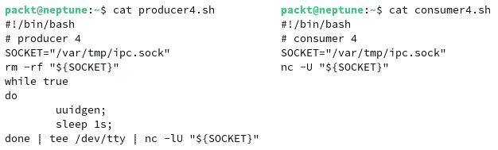

图 8.51 – 生产者 4（左）和消费者 4（右）脚本（使用 IPC 套接字）

生产者通过使用 IPC 套接字（`producer4.sh` 的最后一行）启动 `netcat` 监听端点，充当服务器角色：

```
nc -lU "${SOCKET}"
```

`-l` 选项表示监听（服务器）模式，而 `-U "${SOCKET}"` 选项参数指定了 IPC 套接字类型（Unix 域套接字）。消费者通过类似的命令连接到 `netcat` 服务器端点（`consumer4.sh` 的最后一行）。生产者和消费者都使用相同的（共享的）IPC 套接字文件描述符（`/var/tmp/ipc.sock`）进行通信。

生产者每秒向消费者发送随机 UUID 字符串（`producer4.sh` 中的 `while`-`do`-`done` 结构）。相关输出通过 `tee` 命令捕获到 `stdout`，然后被传输到 `netcat`：

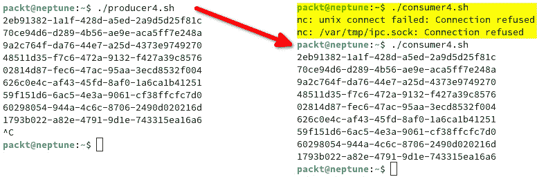

图 8.52 – 生产者 4（左）和消费者 4（右）通过 IPC 套接字通信

消费者接收所有由生产者生成的消息（UUID）。为了证明消费者在监听，我们首先启动了消费者脚本，这时会生成两个错误，只要生产者没有通过套接字发送数据。一旦启动生产者脚本，消费者便开始接收数据。当我们中断生产者时，消费者立即停止接收数据。

在我们的生产者-消费者模型中，我们使用了`netcat`作为 IPC 套接字通信层。或者，我们也可以使用`socat`，这是一个类似的网络工具。在接下来的部分，我们将展示一个快速示例，使用脚本执行特定的 Linux 管理任务。作为额外内容，我们还将向你展示如何从源代码构建应用程序。

# 管理任务的脚本编写

在 Linux 操作系统中编写脚本主要在于帮助处理琐碎的管理任务。这样，你可以通过自动化工作流程，使工作变得更加轻松和愉快。Shell 脚本有很多应用场景，我们这里只提供一个简单的例子，希望它能帮助你理解脚本如何用于系统管理任务。

在接下来的部分，我们将展示如何从源代码构建一个特定发行版的包。这本应在*第四章*中向你展示，但当时你还不知道如何创建脚本。本章中，我们只使用了 Ubuntu 22.04.2 LTS 作为示例。在接下来的部分，我们将使用 Fedora 37 Server Edition 作为示例。

## 为系统管理任务创建脚本

在本节中，我们将展示几个用于管理任务的脚本。正如我们在本章开头所说，Shell 脚本是由一系列的 Bash 命令组成，当文件运行时，这些命令会依次执行。在接下来的子节中，我们将创建两个脚本来完成两项不同的管理任务。

### 更新脚本示例

这个脚本将使用`dnf update`命令在指定时间更新系统。它是一个非常简单的脚本，仅执行一个简单的命令并向标准输出显示一些消息。记住，这次我们将使用 Fedora Server 发行版。最简单的方式是在脚本中运行以下命令：

```
sudo dnf update -y
```

问题在于它需要输入`sudo`密码。这违背了自动化的目的，因为用户必须手动输入密码。让我们学习如何解决这个问题。首先，让我们看一下脚本的代码：

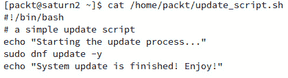

图 8.53 – 一个简单的更新脚本

现在，如果你希望命令在没有`sudo`密码的情况下运行，你需要编辑`/etc/sudoers`文件，并修改/添加一些内容。

重要提示

请考虑到这种方法会对系统产生广泛的影响，而不仅仅是你想运行的脚本。它不被认为是一种安全的措施，我们建议你在任何生产系统中使用时要特别小心并谨慎考虑。

移除以下行中`%wheel`前的注释：

```
%wheel  ALL=(ALL)       NOPASSWD: ALL
```

这将为所有在 wheel 组中的用户提供免密码的操作。这应该包括您正在使用的用户。如果它不在`wheel`组中，您将无法使用`sudo`。在我们的情况下，`packt`用户位于`wheel`组中。要测试它是否有效，您可以以常规用户身份运行该脚本，看看是否会提示输入`sudo`密码。

现在，我们需要将脚本调度到某个特定时间运行。不要忘记使您的脚本文件可执行，以便能够运行它。由于我们使用的是服务器发行版，我们假设这台机器是全天候运行的，所以在启动时运行毫无意义。此外，我们希望确保系统始终保持最新状态。为了调度脚本，我们将使用`cron`和`crontab`。我们将在下一节中向您展示它们的工作原理。

### 在 Linux 中使用 cron 调度脚本

使用`crontab`一开始可能看起来很吓人，但一旦你了解它，你会发现它非常有用。使用`cron`作业时，可能最令人害怕的部分就是定义过程，尤其是`cron`日期在`/etc/crontab`文件中提供：

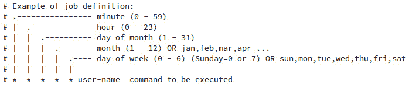

图 8.54 – /etc/crontab 中 cron 作业定义的示例

我们认为前面的截图是自解释的。现在，让我们为更新脚本设置一个新的`cron`作业。我们将使用`crontab -e`命令。此命令将使用默认的 shell 文本编辑器，在我们的情况下（在 Fedora 中）是 Vim。运行`crontab -e`命令将启动一个新的 Vim 实例，您应该在其中编写作业。以下是我们的代码：

```
00 23 * * 0 packt /home/packt/update_script.sh
```

让我们解释一下。在前面的示例中，我们将新的更新脚本文件设置为每周日的 23:00 运行。运行该脚本的用户是`packt`。

创建完代码行后，您可以使用`crontab -l`命令检查`cron`作业是否已创建。如果您想查看某个用户的`cron`作业，可以使用以下命令：

```
sudo crontab -u packt -l
```

这里，`packt`是我们的用户。以下代码片段展示了代码，它可以在`crontab`中通过将输出和错误信息重定向到`/dev/null`来增强。这在我们不想看到命令输出或如果出现任何错误而不需要看到它们时非常有用。该行将修改如下：

```
00 23 * * 0 packt /home/packt/update_script.sh > /dev/null 2>&1
```

`crontab`是一个强大的工具，当您需要在 Linux 中调度任务时，它会非常有帮助。然而，它并不是唯一可用的工具。您可以随意探索其他可用的工具，例如`at`命令。接下来，我们将介绍另一个用于备份文件的简单脚本。

### 备份脚本示例

脚本的另一个常见用途是**备份**文件。我们将为此任务创建一个新的脚本，并根据我们的需求进行调度。脚本的代码如下截图所示：

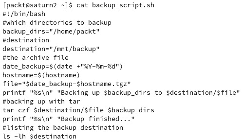

图 8.55 – 一个简单的备份脚本

这段代码用于将 `/home/packt` 目录备份到 `/mnt/backup` 目录。`/home/packt` 的内容将通过 `tar` 命令打包，并使用当前日期和主机名作为文件名保存为 `.tgz` 文件。

重要提示

使用日期格式可能一开始让人觉得困难和令人生畏，但学会在脚本中使用它将会非常有价值。更多信息请使用`date --help`命令。

在下一个小节中，我们将向您展示如何在 Bash 中创建一个简单的随机密码生成器。

### 一个随机密码生成脚本

保持您的在线或本地账户安全至关重要，因此应该遵循使用安全密码的通用规则。我们将为您提供一个生成随机密码的脚本示例。

在 Linux 中有许多可用的密码生成器，但我们认为如果您自己创建一个小脚本会很有趣。比如，Bash 中有一个默认的密码生成应用程序 `pwmake`。不过，我们将创建我们自己的密码生成脚本。我们将使用 `openssl` 和一种叫做 `base64` 的编码机制。有关更多信息，请访问[`developer.mozilla.org/en-US/docs/Glossary/Base64`](https://developer.mozilla.org/en-US/docs/Glossary/Base64)。请记住，Linux 中还有许多其他生成随机字符的方法，其中一种广泛使用的是 `/dev/urandom` 伪随机数生成器。您可以自由探索更多的方式。与此同时，下面是我们密码生成脚本的代码：

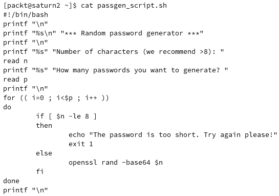

图 8.56 – 密码生成脚本

运行脚本时，系统会提示您提供所需的字符数和要生成的密码数量：

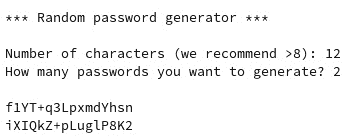

图 8.57 – 运行密码生成脚本的输出

脚本编写是一项极其宝贵的技能，您应该掌握。我们刚刚触及了 shell 脚本的表面，但本章中的信息应该为您提供一个良好的开端，使您可以开始开发系统管理员脚本。

在下一个小节中，我们将向您展示如何将脚本打包成可以在 Linux 命令行上安装的完整应用程序。这是对*第三章*的补充，您在其中学习了 Linux 包管理。

## 打包脚本

Bash 脚本和其他软件一样，可以作为平台特定的包与 Linux 发行版一起部署。就像打包任何其他软件代码一样，你也可以打包一段 Shell 脚本代码。在这一部分，作为你在 *第三章* 中获得的知识的补充，我们将向你展示如何打包一个 Bash 脚本。正如前面所说，这里提供的信息也可以轻松地用于其他软件源（通常在 Linux 中使用 C/C++、Python、Rust、Java 或 Go）。在下一个小节中，我们将向你展示如何为基于 RHEL 的发行版创建 RPM 包。我们将在示例中使用 Fedora Linux 37。

### 从源代码创建 RPM 包

为了创建一个 RPM 包，我们将使用我们在前一部分开发的密码生成器脚本。在详细介绍之前，我们将简要说明编程语言类型以及 Bash 的位置。

重要提示

通常，软件程序是使用人类可读的源代码开发的。需要将这些代码转换为机器代码，以便计算机能够理解它。编程语言有几种大型的通用类型：**解释型**（如 Python 或 Bash——它是一种命令行语言，但仍被认为是解释型语言）和**编译型**（如 C/C++、Java 和 Go）是广泛使用的类型。Bash 源代码按行执行，而不需要事先编译成特定的机器代码。有关更多信息，请查看 [`en.wikipedia.org/wiki/List_of_programming_languages_by_type`](https://en.wikipedia.org/wiki/List_of_programming_languages_by_type)。

通常，软件源代码以压缩档案（`.tar.gz` 文件或 tarballs）的形式分发，然后打包成 RPM 包。档案通常包含源代码文件和许可证文件。该许可证文件提供了有关软件分发许可证类型的信息。在 **自由和开源软件**（**FOSS**）的情况下，许可证通常是 GPLv3 或 GLPLv3，但也使用其他类型，如 MIT 许可证、Apache 许可证和 BSD 许可证。

重要提示

有关 FOSS 许可证类型的详细信息，请查看 [`en.wikipedia.org/wiki/Comparison_of_free_and_open-source_software_licenses`](https://en.wikipedia.org/wiki/Comparison_of_free_and_open-source_software_licenses)。

创建 RPM 包的必要步骤如下：

1.  `passgen-0.1`。

1.  将 `LICENSE.txt` 放置在新创建的目录中。我们将使用 GPLv3 开源许可证。要添加到文件中的文本可以在 [`www.gnu.org/licenses`](https://www.gnu.org/licenses) 网站的 *如何将这些条款应用于您的新程序* 部分找到。

1.  将 `passgen_script.sh` 文件放入新目录，并将其名称更改为 `passgen-0.1.sh`。

1.  使用 `install` 命令将 `passgen-0.1.sh` 脚本安装到文件系统层次结构标准 `$PATH` 中。我们使用 `install` 命令，因为我们的简单 Bash 脚本不需要任何依赖项：

    ```
    passgen script without using the full path.
    ```

1.  使用以下命令生成 `tar.gz` 压缩档案：

    ```
    rpmdevtools package. We can install it using the following command:

    ```

    sudo dnf install rpmdevtools

    ```

    This will install all additional packages and dependencies to set up the packaging workspace.
    ```

1.  **设置工作区**：为了设置工作区，我们将运行以下应用程序：

    ```
    rpmbuild directory and sub-directories inside your home directory. The new rpmbuild directory has the following structure:
    ```


图 8.58 – rpmbuild 的目录结构

`BUILD` 目录包含有关构建过程的信息；`RPMS` 目录包含二进制 RPM；`SOURCES` 目录包含压缩源代码的 tarball 文件；`SPECS` 目录包含 SPEC 文件；`SRPMS` 目录包含源 RPM。

1.  使用以下命令（在 `passgen-0.1` 目录中）进入 `~/rpmbuild/SOURCES` 目录：

    ```
    SPEC file by running the rpmdev-newspec command from inside the ~/rpmbuild/SPECS directory:

    ```

    进入 `~/rpmbuild/SPECS/` 目录后，你会看到创建了一个名为 passgen.spec 的新文件。新的 `SPEC` 文件包含自动生成的行，定义了特定的 RPM 宏。我们不会详细讲解宏，但你可以在 [`rpm-software-management.github.io/rpm/manual/macros.html`](https://rpm-software-management.github.io/rpm/manual/macros.html) 上找到更多信息。由于 Bash 是一种解释型语言，某些来自 `SPEC` 文件的默认规范是不需要的，例如 `BuildRequires`，它已被删除。对于 `%build` 部分，我们没有提供任何信息，因为 Bash 不需要任何特定的内容。以下截图展示了 `SPEC` 文件：

    ```

    ```


图 8.59 – SPEC 文件的条目

1.  `SPEC` 文件，但也有其他使用案例，例如从 `rpmbuild` 构建 RPM，但选项不同。在构建源 RPM 时，我们将使用 `-bs` 选项，在从源重建 RPM 时，我们将使用 `--rebuild` 选项，而在从源构建二进制 RPM 时，我们将使用 `-bb` 选项。在我们的案例中，我们将从源创建一个二进制文件，并使用以下命令：

    ```
    .rpm file was created. We can check this at ~/rpmbuild/RPMS/, where we will have a new directory based on the CPU architecture. In our case, we will have a new noarch directory that contains the .rpm file for our password generator. The following is the output:
    ```


图 8.60 – 新的 RPM 二进制包

在这里，你正在从一个 Bash 脚本文件构建你的第一个 RPM 二进制包！你可以为你可能开发的任何类型的源文件执行此操作。构建二进制包并不是一项非常困难的任务，只要有关于 `SPEC` 文件中使用的宏的良好文档，你就可以顺利进行。关于此事项的更多可用文档信息可以在*进一步阅读*部分找到。

# 摘要

在本章中，你学习了如何在 Linux 中创建 Bash 脚本。你现在了解了 shell 变量和脚本变量，以及如何在脚本中使用编程结构，如循环、条件语句和数组。你还进一步理解了进程间通信的工作原理。你学到的技能将帮助你在任何 Linux 发行版中创建脚本。当你编写脚本时，你也会将文本编辑器的知识付诸实践。你在 Bash 脚本编写方面学到的技能也会在你作为系统管理员的日常工作中得以应用。

在下一章中，你将学习如何管理 Linux 中的安全性、访问控制机制、AppArmor 和 SELinux 以及防火墙。这项技能对于任何管理员都至关重要，必须成为任何高级培训的一部分。

# 问题

在本章中，我们讨论了 Linux Bash 脚本编写。以下是一些问题，供你测试知识并进行进一步练习：

1.  什么是数组，如何在 Bash 脚本中使用？是否可以有混合类型？

    **提示**：想一想它们的类型，如何定义，以及如何使用它们。

1.  什么是无限循环？

    **提示**：这是你不太希望使用的内容，但如果需要，应该知道如何逃避它。

1.  Bash 脚本中可以使用多少种类型的循环？

    **提示**：没有很多，但比条件循环要多。

1.  了解如何构建 DEB 二进制包。

    **提示**：使用来自 Debian 的示例，可以在 [`www.debian.org/doc/manuals/maint-guide/build.en.html`](https://www.debian.org/doc/manuals/maint-guide/build.en.html) 和 [`wiki.debian.org/HowToPackageForDebian`](https://wiki.debian.org/HowToPackageForDebian) 中找到。

# 深入阅读

有关本章内容的更多信息，请参考以下资源：

+   *Linux 管理最佳实践*，由 Scott Alan Miller 编写，Packt 出版

+   *Linux 命令行与 Shell 脚本技巧*，由 Vedran Dakic 和 Jasmin Redzepagic 编写，Packt 出版

+   来自 [`access.redhat.com/documentation/en-us/red_hat_enterprise_linux/9/html/packaging_and_distributing_software/index`](https://access.redhat.com/documentation/en-us/red_hat_enterprise_linux/9/html/packaging_and_distributing_software/index)、[`docs.fedoraproject.org/en-US/packaging-guidelines/RPMMacros/`](https://docs.fedoraproject.org/en-US/packaging-guidelines/RPMMacros/)（RPM 宏），以及 [rpm.org](http://rpm.org) 的官方文档。
