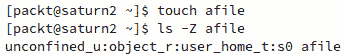
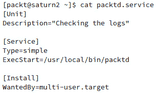
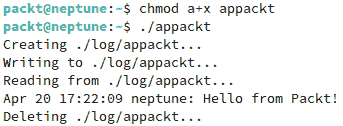
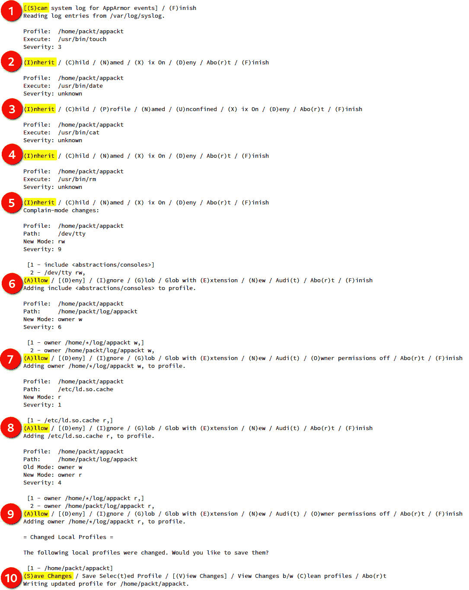
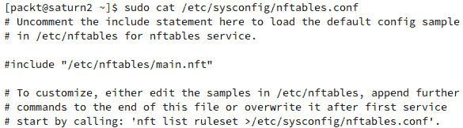

# 9

# 保护 Linux

**保护** Linux 机器通常是一项平衡工作。最终目标本质上是防止数据被未授权访问。虽然有很多方法可以实现这一目标，但我们应当采用那些提供最大保护且最具效率的系统管理方法。评估攻击面和漏洞面（无论是内外部）通常是一个良好的起点。剩下的工作就是建立围栏并穿上盔甲——既不过高，也不过重。外部围栏是 **网络防火墙**。在内部系统层面，我们构建 **应用安全策略**。本章介绍了这两者，尽管平衡的艺术将由你来掌握。

在本章的第一部分，我们将讨论 **访问控制机制**（**ACMs**）及相关的安全模块——**安全增强 Linux**（**SELinux**）和 **AppArmor**。第二部分将探讨数据包过滤框架和防火墙解决方案。

完成本章后，你将熟悉用于设计和管理应用安全框架和防火墙的工具，这是保护 Linux 系统的第一步坚实基础。

下面是本章将要讨论的主题概述：

+   理解 Linux 安全—Linux 内核中可用的 ACM 概述

+   介绍 SELinux—深入了解用于管理访问控制策略的 Linux 内核安全框架

+   介绍 AppArmor—一个相对较新的安全模块，它基于安全配置文件控制应用程序的功能

+   使用防火墙—全面概述防火墙模块，包括 `iptables`、`nftables`、`firewalld` 和 `ufw`

# 技术要求

本章涉及多个主题，其中一些内容将通过大量命令行操作进行讲解。我们建议使用 Fedora 和 Ubuntu 平台，并通过终端或 SSH 访问。由于可能会影响防火墙规则的更改方式，直接访问控制台是更为理想的选择。

# 理解 Linux 安全

保护计算机系统或网络的一个重要考虑因素是系统管理员控制用户和进程如何访问各类资源（如文件、设备和接口）的方法，这些资源遍布各个系统。Linux 内核提供了几种这样的机制，统称为 **访问控制机制**（**ACMs**）。我们简要介绍它们：

+   **自主访问控制**（**DAC**）是与文件系统对象（包括文件、目录和设备）相关的典型 ACM。此类访问权限由对象的所有者在管理权限时自行决定。DAC 根据用户和组的身份（即 **主体**）来控制对 *对象* 的访问。根据主体的访问权限，他们还可以将权限传递给其他主体——例如，管理员可以管理普通用户的权限。

+   **访问控制列表**(**ACLs**)提供了对哪些主体（如用户和组）可以访问特定文件系统对象（如文件和目录）的控制。

+   **强制访问控制**(**MAC**)为主体提供不同的访问控制级别，以管理它们所拥有的对象。与 DAC 不同，DAC 中用户对自己拥有的文件系统对象拥有完全控制权，而 MAC 为所有文件系统对象添加了额外的标签或类别。因此，主体必须具备访问这些类别的适当权限，才能与被标记为该类别的对象进行交互。MAC 由*SELinux*在**Red Hat Enterprise Linux**(**RHEL**)/Fedora 上执行，而在 Ubuntu/Debian/openSUSE 上则由*AppArmor*执行。

+   **基于角色的访问控制**(**RBAC**)是基于权限的文件系统对象访问控制的替代方法。系统管理员根据某些业务或功能标准为特定文件系统对象分配*角色*，而不是使用权限。角色可以基于某些业务或功能标准，并可能对对象有不同的访问级别。

    与 DAC 或 MAC 不同，在 DAC 或 MAC 中，主体对对象的访问严格依赖于权限，而 RBAC 模型是基于 MAC 或 DAC 的一种逻辑抽象，主体必须先是特定组或角色的成员，才能与对象进行交互。

+   **多级安全**(**MLS**)是一种特定的 MAC 方案，其中*主体*是进程，*对象*是文件、套接字以及其他类似的系统资源。

+   **多类别安全**(**MCS**)是 SELinux 的改进版本，允许用户为文件打上*类别*标签。MCS 重用了 SELinux 中许多 MLS 框架的内容。

总结一下我们对 ACM 的简短讨论，我们应该指出，我们在*第四章*，*管理用户和组*，特别是在*管理* *权限*部分，讨论了 DAC 和 ACL 的一些内部机制。

接下来，我们将关注 SELinux——MAC 实现中的重要组成部分。

# 介绍 SELinux

**SELinux**是 Linux 内核中的一个安全框架，用于管理系统资源的访问控制策略。它支持前一节中描述的 MAC、RBAC 和 MLS 模型的组合。SELinux 是一组内核空间的安全模块和用户空间的命令行工具，它为系统管理员提供了一个机制，可以控制*谁*可以访问*什么*资源。SELinux 还旨在保护系统免受可能的配置错误和潜在受损进程的影响。

SELinux 由**国家安全局**(**NSA**)作为一组**Linux 安全模块**(**LSM**)和内核更新一起引入。SELinux 最终于 2000 年发布给开源社区，并从 2003 年开始成为 Linux 2.6 内核系列的一部分。

那么，SELinux 是如何工作的呢？我们将在下一节中讨论这个问题。我们将使用 Fedora 37 服务器版作为所有示例的操作系统。

## 使用 SELinux

SELinux 使用**安全策略**来定义系统中应用程序、进程和文件的各种访问控制级别。安全策略是一组规则，描述了什么可以或不能被访问。

SELinux 操作基于**主体**和**对象**。当一个特定的应用程序或进程（*主体*）请求访问一个文件（*对象*）时，SELinux 会检查请求中涉及的所需权限并执行相关的访问控制。主体和对象的权限存储在一个称为**访问向量缓存**（**AVC**）的查找表中。AVC 是基于**SELinux** **策略数据库**生成的。

一个典型的 SELinux 策略包含以下资源（文件），每个文件反映了安全策略的特定方面：

+   **类型强制**：对于策略已授予或拒绝的操作（例如读取或写入文件访问权限）

+   **接口**：策略与之交互的应用程序接口（例如日志记录）

+   **文件上下文**：与策略相关的系统资源（例如日志文件）

这些策略文件通过 SELinux 构建工具汇编在一起，生成一个特定的**安全策略**。该策略被加载到内核中，添加到 SELinux 策略数据库，并在不重启系统的情况下生效。

在创建 SELinux 策略时，我们通常首先在*permissive*模式下测试它们，在该模式下，违规行为会被记录，但仍然允许。当违规发生时，SELinux 工具集中的 `audit2allow` 工具会提供帮助。我们使用 `audit2allow` 产生的日志痕迹来创建政策所需的额外规则，以考虑合法的访问权限。SELinux 违规行为会被记录在`/var/log/messages`中，并以`avc: denied`为前缀。

在我们学习如何创建和管理 SELinux 安全策略之前，让我们先看一些管理和控制 SELinux 的高级操作，用于日常管理任务。

### 理解 SELinux 模式

SELinux 在系统中要么是*启用*的，要么是*禁用*的。当启用时，它以以下模式之一运行：

+   `enforcing`：SELinux 有效地监控和控制安全策略。在 RHEL/Fedora 中，默认启用此模式。

+   `permissive`：安全策略被积极监控，但不执行访问控制。策略违规会被记录在`/var/log/messages`中。

当 SELinux 被禁用时，安全策略既不被监控也不被执行。以下命令用于检索系统上 SELinux 的当前状态：

```
sestatus
```

输出如下：


图 9.1 – 获取 SELinux 当前状态

当 SELinux 启用时，以下命令用于检索当前模式：

```
getenforce
```

在`permissive`模式下，我们得到`enforcing`的输出。

要从 `enforcing` 模式切换到 `permissive` 模式，我们可以运行以下命令：

```
sudo setenforce 0
```

在这种情况下，`getenforce` 命令会显示 `permissive`。要切换回 `enforcing` 模式，可以运行以下命令：

```
sudo setenforce 1
```

SELinux 模式也可以通过编辑 `/etc/selinux/config` 中的 `SELINUX` 值来设置。配置文件中记录了可能的值。

重要提示

手动编辑 SELinux 配置文件需要重启系统才能使更改生效。

启用 SELinux 后，系统管理员可以通过修改 `/etc/selinux/config` 中的 `SELINUXTYPE` 值，选择以下 SELinux 策略级别：`targeted`、`minimum` 和 `mls`。相应的值在配置文件中有详细说明。

重要提示

默认的 SELinux 策略设置是 `targeted`，通常建议不更改此设置，除非是 `mls`。

在启用 `targeted` 策略后，只有那些专门配置为使用 SELinux 安全策略的进程才能在*受限*（或限制）域中运行。这些进程通常包括系统守护进程（如 `dhcpd` 和 `sshd`）以及知名的服务器应用程序（如 Apache 和 PostgreSQL）。所有其他（非目标）进程不受限制，并通常被标记为 `unconfined_t` 域类型。

要完全禁用 SELinux，我们可以使用我们选择的文本编辑器（如 `sudo nano /etc/selinux/config`）编辑 `/etc/selinux/config` 文件，并进行以下更改：

```
SELINUX=disabled
```

或者，我们可以运行以下命令，将 SELinux 模式从 `enforcing` 更改为 `disabled`：

```
sudo sed -i 's/SELINUX=enforcing/SELINUX=disabled/g' /etc/selinux/config
```

我们可以使用以下命令检索当前配置：

```
cat /etc/selinux/config
```

在 SELinux 被禁用的情况下，我们将获得以下输出（摘录）：


图 9.2 – 禁用 SELinux

我们需要重启系统才能使更改生效：

```
sudo systemctl reboot
```

接下来，让我们通过介绍**SELinux 上下文**来查看访问控制决策是如何做出的。

### 理解 SELinux 上下文

启用 SELinux 后，进程和文件会被标记上一个包含附加 SELinux 特定信息的**上下文**，如*用户*、*角色*、*类型*和*级别*（可选）。该上下文数据用于 SELinux 的访问控制决策。

SELinux 为 `ls`、`ps` 等命令添加了 `-Z` 选项，从而显示文件系统对象、进程等的安全上下文。

让我们创建一个任意文件并检查相关的 SELinux 上下文：

```
touch afile
ls -Z afile
```

输出如下：



图 9.3 – 显示文件的 SELinux 上下文

SELinux 上下文具有以下格式——由冒号（`:`）分隔的四个字段的序列：

```
USER:ROLE:TYPE:LEVEL
```

现在，让我们来看看 SELinux 上下文字段：

+   `semanage` 工具是 `policycoreutils` 包的一部分，您可能需要在系统上安装此包：

    ```
    sudo semanage login -l
    ```

    命令的输出如下。输出可能因系统不同而略有差异：


图 9.4 – 显示 SELinux 用户映射

若要获取更多关于 `semanage` 命令行工具的信息，可以参考相关的系统参考（`man semanage`，`man semanage-login`）。

+   **SELinux 角色**：SELinux 角色是 RBAC 安全模型的一部分，实质上是 RBAC 属性。在 SELinux 上下文层次结构中，用户被授权角色，角色被授权类型或域。在 SELinux 上下文术语中，**类型**指的是文件系统对象类型，**域**指的是进程类型（参见此列表中的 *SELinux 类型*）。

    以 Linux 进程为例，SELinux 角色作为域和 SELinux 用户之间的中介访问层。一个 *可访问* 的角色决定了哪个域（即进程）可以通过该角色进行访问。最终，这一机制控制了进程可以访问哪些对象类型，从而最小化权限提升攻击的攻击面。

+   **SELinux 类型**：SELinux 类型是 SELinux *类型强制*的一种属性——一种 MAC 安全构造。对于 SELinux 类型，我们将域称为进程类型，将类型称为文件系统对象类型。SELinux 安全策略控制特定类型如何相互访问——无论是域到类型的访问，还是域到域的交互。

+   `unclassified`、`confidential`、`secret` 和 `top-secret`，如果级别不同，则以 `low-high` 表示，或者如果级别相同，则仅为 `low`。例如，`s0-s0` 等同于 `s0`。每个级别代表一个 *敏感性-类别* 对，其中类别是可选的。当指定类别时，级别定义为 `sensitivity:category-set`；否则，仅定义为 `sensitivity`。

我们现在已经熟悉 SELinux 上下文。接下来，我们将看到 SELinux 用户上下文的实际应用。

#### SELinux 用户上下文

以下命令显示与当前用户相关的 SELinux 上下文：

```
id -Z
```

在我们的例子中，输出如下：


图 9.5 – 显示当前用户的 SELinux 上下文

在 RHEL/Fedora 中，Linux 用户默认是 `unconfined`（不受限制）的，具有以下上下文字段：

+   `unconfined_u`：用户身份

+   `unconfined_r`：角色

+   `unconfined_t`：域关联

+   `s0-s0`：MLS 范围（相当于 `s0`）

+   `c0.c1023`：类别集，表示所有类别（从 `c0` 到 `c1023`）

接下来，我们将研究进程的 SELinux 上下文。

#### SELinux 进程上下文

以下命令显示当前 SSH 进程的 SELinux 上下文：

```
ps -eZ | grep sshd
```

命令输出如下：


图 9.6 – 显示与 SSH 相关进程的 SELinux 上下文

从输出结果中，我们可以推断第一行指的是运行着`sshd`服务器进程，使用了`system_u`用户身份，`system_r`角色，以及`sshd_t`域亲和性。第二行指的是当前用户的 SSH 会话，因此使用了`unconfined`上下文。系统守护程序通常与`system_u`用户和`system_r`角色相关联。

在总结本节关于 SELinux 上下文的内容之前，我们将详细讨论 SELinux 域过渡的相对常见情景，即一个域中的进程访问另一个域中的对象（或进程）。

#### SELinux 域过渡

假设一个 SELinux 保护的进程在一个域中请求访问另一个域中的对象（或另一个进程），SELinux **域过渡** 就会发挥作用。除非存在允许相关域过渡的特定安全策略，否则 SELinux 会拒绝访问。

一个从一个域过渡到另一个域的 SELinux 保护进程会调用新域的`entrypoint`类型。SELinux 会评估相关的入口点权限，并决定是否允许发起进程进入新的域。

为了说明域过渡情景，我们将以使用`passwd`实用程序更改用户密码为简单案例。相关操作涉及`passwd`进程与`/etc/shadow`（可能还包括`/etc/gshadow`）文件之间的交互。当用户输入（和重新输入）密码时，`passwd`将会对用户密码进行哈希处理并存储在`/etc/shadow`中。

让我们检查涉及的 SELinux 域亲和性：

```
ls -Z /usr/bin/passwd
ls -Z /etc/shadow
```

相应的输出如下：


图 9.7 – 比较域亲和性上下文

`passwd`实用程序标记为`passwd_exec_t`类型，而`/etc/shadow`标记为`shadow_t`。必须存在特定的安全策略链，允许相关域从`passwd_exec_t`过渡到`shadow_t`；否则，`passwd`将无法正常工作。

让我们验证我们的假设。我们将使用`sesearch`工具查询我们假设的安全策略。默认情况下，Fedora 未安装该命令实用程序，因此您首先必须安装`setools-console`包。使用以下命令：

```
sudo dnf install setools-console -y
```

安装完软件包后，我们可以使用以下命令：

```
sudo sesearch -s passwd_t -t shadow_t -p write --allow
```

下面简要解释上述命令：

+   `sesearch`：搜索 SELinux 策略数据库

+   `-s passwd_t`：查找源类型或角色为`passwd_t`的策略规则

+   `-t shadow_t`：查找目标类型或角色为`shadow_t`的策略规则

+   `-p write`：查找具有写权限的策略规则

+   `--allow`：查找允许查询权限（用`-p`指定）的策略规则

上述命令的输出如下：


图 9.8 – 查询 SELinux 策略

在这里，我们可以看到`append create`权限，正如我们正确假设的那样。

我们为什么选择 `passwd_t` 源类型，而不是 `passwd_exec_t`？根据定义，*域*类型对应于 *可执行文件* 类型 `passwd_exec_t` 的类型是 `passwd_t`。如果我们不确定谁拥有对 `shadow_t` 文件类型的写权限，我们可以简单地在 `sesearch` 查询中排除源类型（`-s passwd_t`），并解析输出（例如，使用 `grep passwd`）。

使用 `sesearch` 工具查询安全策略非常方便。还有一些类似的工具可以用于故障排除或管理 SELinux 配置和策略。一个最为著名的 SELinux 命令行工具是 `semanage`，它用于管理 SELinux 策略。我们将在 *管理 SELinux 策略* 部分进行详细探讨。但首先，让我们看看创建 SELinux 安全策略的必要步骤。

### 创建 SELinux 安全策略

在本节的示例中，我们将使用一个用 C 语言开发的程序。这意味着我们需要编译它，这与我们在上一章所做的不同。为了能够编译 C 代码，我们需要在 Fedora 系统上安装 `gcc`，可以使用以下命令：

```
sudo dnf install gcc
```

现在，假设我们有一个名为 `packtd` 的守护进程，并且我们需要确保它可以访问 `/var/log/messages`。为了说明，守护进程有一个简单的实现：定期打开 `/var/log/messages` 文件进行写操作。使用您喜欢的文本编辑器（例如 `nano`）将以下内容（C 代码）添加到一个文件中。我们将该文件命名为 `packtd.c`：


图 9.9 – 一个简单的守护进程定期检查日志

让我们编译并构建 `packtd.c` 以生成相关的二进制可执行文件（`packtd`）：

```
gcc -o packtd packtd.c
```

以下是编译源代码所使用命令的结果：


图 9.10 – 编译 C 源代码

现在源代码已经编译完成，我们准备继续创建 `packtd` 守护进程和所需的 SELinux 安全策略的步骤。这个练习对于 SELinux 管理和创建 `systemd` 守护进程同样有用。如果需要复习守护进程的相关内容，请参考 *第五章*。现在，让我们讨论创建守护进程和安全策略的步骤。

#### 安装守护进程

首先，我们必须为 `packtd` 守护进程创建一个 `systemd` 单元文件。您可以使用您喜欢的文本编辑器（如 `nano`）来创建该文件。我们将这个文件命名为 `packtd.service`：



图 9.11 – packtd 守护进程文件

将我们创建的文件复制到相应的位置，如将 `packtd` 复制到 `/usr/local/bin`，将 `packtd.service` 复制到 `/usr/lib/systemd/system/`：

```
sudo cp packtd /usr/local/bin/
sudo cp packtd.service /usr/lib/systemd/system/
```

此时，我们已准备好启动我们的 `packtd` 守护进程：

```
sudo systemctl start packtd
sudo systemctl status packtd
```

让我们确认`packtd`守护进程还没有被 SELinux 限制或约束：

```
ps -efZ | grep packtd | grep -v grep
```

`ps`的`-Z`选项参数用于获取进程的 SELinux 上下文。

所有这些命令的输出如下：


图 9.12 – packtd 守护进程的运行状态和限制状态

`unconfined_service_t`安全属性表明`packtd`没有受到 SELinux 的限制。

接下来，我们将为`packtd`守护进程生成安全策略文件。

#### 生成策略文件

要为`packtd`构建安全策略，我们需要生成相关的策略文件。构建安全策略的 SELinux 工具是`sepolicy`。此外，打包最终的安全策略二进制文件需要使用`rpm-build`工具。这些命令行工具在你的系统上可能默认不可用，因此你可能需要使用以下命令安装相关的包：

```
sudo dnf install -y policycoreutils-devel rpm-build
```

我们将使用下一个命令为`packtd`生成策略文件（无需超级用户权限）：

```
sepolicy generate --init /usr/local/bin/packtd
```

输出如下：


图 9.13 – 使用 sepolicy 生成策略文件

稍作停顿，查看上面的截图。你会看到*五个新文件*已在你的主目录中创建。记住这一点，因为我们将在设置过程中使用这些文件。接下来，我们需要重新构建系统策略，以便它包含自定义的`packtd`策略模块。

#### 构建安全策略

要构建安全策略，我们现在将使用在上一步中创建的`packtd.sh`构建脚本（有关详细信息，请参见*图 9.13*）。以下命令需要超级用户权限，因为它将新创建的策略安装到系统中：

```
sudo ./packtd.sh
```

构建过程相对较长，输出如下（摘录）：


图 9.14 – 为 packtd 构建安全策略

请注意，构建脚本通过使用`restorecon`命令（在前面的输出中已突出显示）为`packtd`重新设置默认的*SELinux*安全上下文。现在我们已经构建了安全策略，接下来准备验证相关权限。

#### 验证安全策略

首先，我们需要重启`packtd`守护进程，以应用策略更改：

```
sudo systemctl restart packtd
```

`packtd`进程现在应该反映出新的 SELinux 安全上下文：

```
ps -efZ | grep packtd | grep -v grep
```

输出显示了我们的安全上下文的新标签（`packtd_t`）：


图 9.15 – packtd 的新安全策略

由于 SELinux 现在控制着我们的`packtd`守护进程，我们应该能在`/var/log/messages`中看到相关的审计日志，其中 SELinux 记录了系统的活动。让我们查看审计日志，寻找任何权限问题。以下命令通过`ausearch`工具获取`AVC`消息类型的最新事件：

```
sudo ausearch -m AVC -ts recent
```

我们将立即注意到，`packtd` 无法读取/写入 `/var/log/messages`：


图 9.16 – 不允许 packtd 读写

为了进一步查询 `packtd` 所需的权限，我们将把 `ausearch` 的输出输入到 `audit2allow`，这是一个生成所需安全策略存根的工具：

```
sudo ausearch -m AVC -ts recent | audit2allow -R
```

输出提供了我们需要的代码宏：


图 9.17 – 查询 packtd 缺失的权限

`audit2allow` 的 `-R`（`--reference`）选项会启动一个存根生成任务，有时可能会导致不准确或不完整的结果。在这种情况下，可能需要几次迭代来更新、重建并验证相关的安全策略。让我们按照之前屏幕截图中显示的输出所建议的进行必要的更改。我们将编辑之前生成的*类型强制*文件（`packtd.te`），并按照 `audit2allow` 输出的指示，精确地添加这些行（复制/粘贴）。文件的内容如下图所示（摘录）。我们需要添加的行已被突出显示：


图 9.18 – 编辑 packtd.te 文件

保存文件后，我们需要重新构建安全策略，重启 `packtd` 守护进程，并验证审计日志。我们将在整体流程中重述最后三个步骤：

```
sudo ./packtd.sh
sudo systemctl restart packtd
sudo ausearch -m AVC -ts recent | audit2allow -R
```

这一次，SELinux 审计应该是干净的：


图 9.19 – 解决 packtd 的权限问题

有时，`ausearch` 刷新其`recent`缓冲区可能需要一些时间。或者，我们可以指定一个起始时间戳来进行分析，例如在我们更新安全策略后，使用一个相对较新的时间戳：

```
sudo ausearch --start 04/19/2023 '17:30:00' | audit2allow -R
```

现在我们已经创建了自己的 SELinux 安全策略，让我们了解如何管理它。

### 管理 SELinux 策略

SELinux 提供了几种管理安全策略和模块的工具，其中一些将在*SELinux 问题故障排除*部分中简要介绍。虽然详细探讨这些工具超出了本章的范围，但我们将简要使用 `semanage` 来回顾一些涉及安全策略管理的使用案例。

`semanage` 命令的一般语法如下：

```
semanage TARGET [OPTIONS]
```

`TARGET` 通常表示用于策略定义的特定命名空间（例如，`login`、`user`、`port`、`fcontext`、`boolean`、`permissive` 等）。让我们看几个例子，以了解 `semanage` 是如何工作的。

#### 在自定义端口上启用安全绑定

假设我们想为自定义 SSH 端口启用 SELinux，而不是默认的 `22`。我们可以使用以下命令检索当前 SSH 端口上的安全记录（标签）：

```
sudo semanage port -l | grep ssh
```

对于默认配置，我们将获得如*图 9.20*中*第 2 行*所示的输出。

如果我们想在不同的端口（比如`2222`）上启用 SSH，首先，我们需要配置相关的服务（`sshd`）以便监听不同的端口（如*第十三章*所示）。我们这里不再深入讨论这些细节。这里，我们需要通过以下命令启用新端口上的安全绑定：

```
sudo semanage port -a -t ssh_port_t -p tcp 2222
```

下面是对前面命令的简要说明：

+   `-a`（`--add`）：为给定类型添加一个新的记录（标签）

+   `-t ssh_port_t`：对象的 SELinux 类型

+   `-p tcp`：与端口相关的网络协议

由于之前的命令和默认配置的输出，新的`ssh_port_t`类型的安全策略如下所示：


图 9.20 – 查询并更改 SSH 端口的 SELinux 安全标签

我们可以考虑删除旧的安全标签（针对端口`22`），但如果我们禁用端口`22`，其实也没有太大影响。如果我们想删除端口的安全记录，可以使用以下命令：

```
sudo semanage port -d -p tcp 22
```

我们使用了`-d`（`--delete`）选项来移除相关的安全标签。要查看我们`semanage port`策略的本地自定义设置，我们可以调用`-C`（`--locallist`）选项：

```
sudo semanage port -l -C
```

有关`semanage port`的更多信息，请参考相关的系统手册（`man semanage port`）。接下来，我们将了解如何修改特定服务器应用程序的安全权限。

#### 修改目标服务的安全权限

`semanage`使用`boolean`命名空间来切换目标服务的特定功能的开关。目标服务是具有内建 SELinux 保护的守护进程。在以下示例中，我们想要启用 FTP over HTTP 连接。默认情况下，Apache（`httpd`）的此安全功能是关闭的。*第十三章*展示了`httpd`服务器的安装。让我们通过以下命令查询相关的`httpd`安全策略：

```
sudo semanage boolean -l | grep httpd | grep ftp
```

我们得到以下输出：


图 9.21 – 查询与 FTP 相关的 httpd 策略

如我们所见，相关的功能——`httpd_enable_ftp_server`——默认是`关闭`的。`current`和`persisted`的状态当前都是关闭的：`(off, off)`。我们可以通过以下命令启用它：

```
sudo semanage boolean -m --on httpd_enable_ftp_server
```

要查看`semanage boolean`策略的本地自定义设置，我们可以调用`-C`（`--locallist`）选项：

```
sudo semanage boolean -l -C
```

新配置现在如下所示：


图 9.22 – 启用 FTP over HTTP 的安全策略

在前面的示例中，我们使用了`-m`（`--modify`）选项与`semanage boolean`命令一起，来切换`httpd_enable_ftp_server`功能。

有关 `semanage boolean` 的更多信息，您可以参考相关的系统参考资料（`man semanage boolean`）。现在，让我们学习如何修改特定服务器应用程序的安全上下文。

#### 为目标服务修改安全上下文

在此示例中，我们希望保护存储在本地系统自定义位置的 SSH 密钥。由于我们正在针对与文件系统相关的安全策略，因此将使用 `semanage` 的 `fcontext`（文件上下文）命名空间。

以下命令查询 `sshd` 的文件上下文安全设置：

```
sudo semanage fcontext -l | grep sshd
```

以下是输出中的相关摘录：


图 9.23 – SSH 密钥的安全上下文

以下命令还将 `/etc/ssh/keys/` 路径添加到与 `sshd_key_t` 上下文类型相关的安全位置：

```
sudo semanage fcontext -a -t sshd_key_t '/etc/ssh/keys(/.*)?'
```

`'/etc/ssh/keys(/.*)?'` 正则表达式匹配 `/etc/ssh/keys/` 目录中的所有文件，包括任何嵌套级别的子目录。要查看 `semanage fcontext` 策略的本地自定义设置，我们可以调用 `-C`（`--locallist`）选项：

```
sudo semanage fcontext -l -CWe should see our new security context:
```


图 9.24 – 我们的 SSH 密钥的修改后的安全上下文

我们还应初始化 `/etc/ssh/keys` 目录的文件系统安全上下文（如果我们已经创建了该目录；否则，将会出现错误消息）：

```
sudo restorecon -r /etc/ssh/keys
```

`restorecon` 是一个 SELinux 工具，用于将默认安全上下文恢复到文件系统对象。`-r`（或 `-R`）选项指定对相关路径执行递归操作。

有关 `semanage fcontext` 的更多信息，您可以参考相关的系统参考资料（`man semanage fcontext`）。接下来，我们将研究如何启用特定服务器应用程序的 `permissive` 模式。

#### 为目标服务启用宽松模式

在本章早些时候，我们创建了一个自定义守护进程（`packtd`）并为其配置了安全策略。请参阅本章早些时候的*创建 SELinux 安全策略*部分。在整个过程中，我们能够运行并测试 `packtd`，而不会因不符合 SELinux 策略而导致守护进程被 SELinux 关闭。我们的 Linux 系统以 `enforcing` 模式（默认）运行 SELinux，并且不是宽松模式。有关 `enforcing` 和 `permissive` 模式的更多信息，请参阅*理解 SELinux 模式*部分。

默认情况下，SELinux 对系统中任何*未定位*的类型都是宽松的。这里的*未定位*指的是尚未强制进入限制性（或受限）模式的域（类型）。

当我们为 `packtd` 守护进程构建安全策略时，我们让相关的 SELinux 构建工具生成默认的类型强制文件（`packt.te`）和其他资源。快速查看 `packt.te` 文件显示我们的 `packtd_t` 类型是 `permissive`：

```
cat packt.te
```

以下是文件中的相关摘录：


图 9.25 – `packtd_t` 域是宽松的

因此，`packtd_t` 域本质上是宽松的。限制 `packtd` 的唯一方法是从 `packtd.te` 文件中删除 `permissive` 行，并重建相关的安全策略。我们将把这个作为练习留给你。我们在这里要表达的是，展示一个可能存在问题的——在我们案例中是 `permissive`——域，可以通过使用 `semanage` `permissive` 命令来管理 `permissive` 类型，从而*捕获*它。

要管理单个目标的 `permissive` 模式，我们可以使用带有 `permissive` 命名空间的 `semanage` 命令。以下命令列出当前所有处于 `permissive` 模式的域（类型）：

```
sudo semanage permissive -l
```

在我们的案例中，我们有一个内置的 `packtd_t` 域，它是 `permissive`：


图 9.26 – 显示宽松类型

一般来说，默认的 SELinux 配置不太可能有任何 `permissive` 类型。

我们可以使用 `semanage permissive` 命令，在测试或排查特定功能时，临时将受限域设置为 `permissive` 模式。例如，以下命令将 Apache (`httpd`) 守护进程设置为 `permissive` 模式：

```
sudo semanage permissive -a httpd_t
```

当我们查询 `permissive` 类型时，得到以下结果：


图 9.27 – 自定义宽松类型

使用 `semanage permissive` 命令将域或类型设为宽松状态后，会显示为 `自定义` `宽松类型`。

要将 `httpd_t` 域恢复到受限（限制）状态，我们可以使用带有 `-d`（`--delete`）选项的 `semanage permissive` 命令：

```
sudo semanage permissive -d httpd_t
```

该命令的输出如下面所示：


图 9.28 – 恢复宽松类型

请注意，我们不能使用 `semanage` 命令来限制内置的 `permissive` 类型。如前所述，`packtd_t` 域本质上是宽松的，无法被限制。

到此为止，我们已经对 SELinux 安全策略的内部机制有了基本的了解。接下来，我们将转向一些更高层次的操作，用于在日常管理任务中管理和控制 SELinux。

### 排查 SELinux 问题

即使在我们相对简短的 SELinux 探索过程中，我们也使用了少数工具和方法来检查安全策略的内部机制，以及主体（用户和进程）与对象（文件）之间的访问控制。SELinux 的问题通常归结为操作被拒绝，无论是在特定主体之间，还是在主体与某些对象之间。与 SELinux 相关的问题并不总是显而易见或容易排查，但了解可以帮助的工具已经是解决这些问题的一个良好开端。

下面是一些这些工具的简要说明：

+   `/var/log/messages`：包含 SELinux 访问控制跟踪和策略违规的日志文件

+   `audit2allow`：从与被拒绝操作相关的日志跟踪生成 SELinux 策略规则

+   `audit2why`：提供 SELinux 审计消息的用户友好型翻译，用于策略违规的分析

+   `ausearch`：查询`/var/log/messages`中的策略违规记录

+   `ls -Z`：列出文件系统对象及其对应的 SELinux 上下文

+   `ps -Z`：列出进程及其相应的 SELinux 上下文

+   `restorecon`：恢复文件系统对象的默认 SELinux 上下文

+   `seinfo`：提供有关 SELinux 安全策略的一般信息

+   `semanage`：管理和提供 SELinux 策略的见解

+   `semodule`：管理 SELinux 策略模块

+   `sepolicy`：检查 SELinux 策略

+   `sesearch`：查询 SELinux 策略数据库

对于这些工具中的大多数，都会有相应的系统参考（如`man sesearch`），提供关于如何使用这些工具的详细信息。除此之外，你还可以探索 SELinux 提供的广泛文档。方法如下。

### 访问 SELinux 文档

SELinux 有大量的文档，可以通过 RHEL/Fedora 可安装的软件包获取，或者在线访问[`access.redhat.com/documentation/en-us/red_hat_enterprise_linux/9/html/using_selinux/index`](https://access.redhat.com/documentation/en-us/red_hat_enterprise_linux/9/html/using_selinux/index)（适用于 RHEL 9）。

以下命令安装 RHEL 9 系统上的 SELinux 文档：

```
sudo dnf install -y selinux-policy-doc.noarch
```

你可以通过以下命令浏览特定的 SELinux 主题（例如）：

```
man -k selinux | grep httpd
```

SELinux 是 Linux 内核中最为成熟且高度可定制的安全框架之一。然而，它相对广泛的领域和固有的复杂性可能让很多人感到不知所措。有时，即使是经验丰富的系统管理员，选择一个 Linux 发行版时，也可能会因其底层安全模块的不同而有所犹豫。SELinux 通常在 RHEL/Fedora 平台上可用，但它在**SUSE Linux Enterprise**（**SLE**）上也可以选择使用。谷歌的 Android 也支持 SELinux，而 Debian 也提供了它作为一个选项。另一个相对轻量且高效的安全框架是**AppArmor**，它默认在 Ubuntu、Debian 和 openSUSE 上可用。我们将在下一节深入探讨它。

# 介绍 AppArmor

**AppArmor**是一个基于 MAC 模型的 Linux 安全模块，限制应用程序对有限资源的访问。AppArmor 使用基于安全配置文件的访问控制机制，这些配置文件已经被加载到 Linux 内核中。每个配置文件包含一系列访问各种系统资源的规则。AppArmor 可以配置为强制访问控制，或仅对访问控制违规行为发出警告。

AppArmor 通过防止已知和未知的漏洞被利用，主动保护应用程序和操作系统资源免受内外部威胁，包括零日攻击。

自 2.6.36 版本起，AppArmor 已被集成到主线 Linux 内核中，并且目前与 Ubuntu、Debian、openSUSE 及类似发行版一起发布。

在接下来的章节中，我们将使用 Ubuntu Server 22.04 LTS 环境来展示一些 AppArmor 的实际示例。大多数相关的命令行工具在任何安装了 AppArmor 的平台上都可以正常工作。

## 使用 AppArmor

AppArmor 命令行工具通常需要超级用户权限。以下命令检查 AppArmor 的当前状态：

```
sudo aa-status
```

下面是命令输出的摘录：


图 9.29 – 获取 AppArmor 的状态

`aa-status`（或`apparmor_status`）命令提供当前加载的所有 AppArmor 配置文件的完整列表（前面未显示）。我们接下来将查看 AppArmor 配置文件。

### 介绍 AppArmor 配置文件

使用 AppArmor 时，进程通过配置文件被限制（或约束）。AppArmor 配置文件在系统启动时加载，并以`enforce`模式或`complain`模式运行。接下来，我们将详细探讨这些模式：

+   `enforce`模式：AppArmor 会阻止在`enforce`模式下运行的应用程序执行受限操作。访问违规会通过`syslog`中的日志条目进行信号提示。默认情况下，Ubuntu 会以`enforce`模式加载应用程序配置文件。

+   `complain`模式：运行在`complain`模式中的应用程序可以执行受限操作，同时 AppArmor 会为相关违规行为创建日志条目。`complain`模式非常适合测试 AppArmor 配置文件。潜在的错误或访问违规可以在切换到`enforce`模式之前被捕获并修复。

记住这些介绍性说明后，让我们创建一个带有 AppArmor 配置文件的简单应用程序。

#### 创建配置文件

在这一节中，我们将创建一个由 AppArmor 保护的简单应用程序。我们希望这个练习能帮助你对 AppArmor 的内部工作有一个合理的了解。我们将这个应用命名为`appackt`，它将是一个简单的脚本，创建一个文件，向其中写入内容，然后删除文件。目标是让 AppArmor 阻止我们的应用访问本地系统中的任何其他路径。为了理解这一点，可以将其视为简单的日志回收。

这是`appackt`脚本，请原谅它的简陋实现：


图 9.30 – appackt 脚本

我们假设`log`目录已经存在，并与脚本位于同一位置：

```
mkdir ./log
```

让我们使脚本可执行并运行它：

```
chmod a+x appackt
./appackt
```

输出如下：



图 9.31 – appackt 脚本的输出

现在，让我们开始使用 AppArmor 保护并强制执行我们的脚本。在开始之前，我们需要安装`apparmor-utils`包——**AppArmor 工具集**：

```
sudo apt install -y apparmor-utils
```

我们将使用几个工具来帮助创建配置文件：

+   `aa-genprof`：生成一个 AppArmor 安全配置文件

+   `aa-logprof`：更新一个 AppArmor 安全配置文件

我们使用`aa-genprof`在运行时监控我们的应用程序，并让 AppArmor 了解它。在此过程中，我们将被提示确认并选择在特定情况下需要的行为。

一旦配置文件创建完成，我们将使用`aa-logprof`工具进行进一步调整，在`complain`模式下测试，如果发生任何违规行为。

我们从`aa-genprof`开始。我们需要两个终端：一个用于`aa-genprof`监控会话（在*终端 1*中），另一个用于运行我们的脚本（在*终端 2*中）。

我们将从*终端 1*开始，并运行以下命令：

```
sudo aa-genprof ./appackt
```

有一个提示正在等待我们。接下来，在*终端 1*的提示等待时，我们将切换到*终端 2*并运行以下命令：

```
./appackt
```

现在，我们必须回到*终端 1*并回答由`aa-genprof`发出的提示，如下所示（详细输出见*图 9.32*）：

+   `S`（`S`can）

+   `/usr/bin/touch`、`/usr/bin/date`、`/usr/bin/cat`和`/usr/bin/rm`

    该提示请求对运行我们应用程序的所有进程授予执行权限。

    *回答*：`I`（`I`nherit）

+   `/dev/tty`、`/home/packt/log/appackt`和`/etc/ld.so.cache`

    该提示请求应用程序对不同文件进行读/写权限。

    *回答*：`A`（`A`llow）

+   `S`（`S`ave）



图 9.32 – 运行 aa-genprof 并设置配置文件

此时，我们已经完成了使用`aa-genprof`的扫描，并且可以用`F`（`F`inish）回答最后一个提示：


图 9.33 – 完成扫描

现在，我们的应用程序（`appackt`）在`enforce`模式下受到 AppArmor 的强制保护（默认情况下）。

对于接下来的步骤，我们只需要一个终端窗口。如果需要，我们将运行`aa-logprof`命令进一步调整`appackt`的安全配置文件：

```
sudo aa-logprof
```

我们将再次收到几个类似的提示，要求进一步的权限，这些权限可能是我们的脚本或其他应用程序所需要的。提示会在`Inherit`和`Allow`之间交替，根据情况作出选择。这里不再详细说明，因为这超出了本书的范围。不过，到目前为止，你应该已经对这些提示及其含义有了大致的了解。尽管如此，建议你始终思考所请求的权限，并根据需要采取相应的行动。

我们可能需要运行`aa-logprof`命令几次，因为每次迭代都会发现并处理新的权限，这取决于由我们的脚本生成的子进程等。最终，`appackt`脚本将成功运行。

在之前描述的迭代过程中，我们可能会在 AppArmor 数据库中留下几个未知或孤立的条目，它们是我们之前尝试保护应用程序时的遗留物：


图 9.34 – 迭代过程的残留物

它们将根据我们应用程序的路径（`/home/packt/appackt`）命名。我们可以使用以下命令清理这些条目：

```
sudo aa-remove-unknown
```

现在我们可以验证我们的应用程序确实受到 AppArmor 的保护：

```
sudo aa-status
```

输出的相关摘录如下：


图 9.35 – appackt 处于投诉模式

我们的应用程序（`/home/packt/appackt`）如预期般显示在 `enforce` 模式下。

接下来，我们需要验证我们的应用程序是否符合 AppArmor 强制执行的安全策略。让我们编辑 `appackt` 脚本并更改 *图 9.35* 中 *第 6 行* 的 `LOG_FILE` 路径为以下内容：

```
LOG_FILE="./log to logs. Let’s create a logs directory and run our app:

```

mkdir logs

./appackt

```

 The preceding output suggests that `appackt` is attempting to access a path outside the permitted boundaries by AppArmor, thus validating our profile:


Figure 9.36 – appackt acting outside security boundaries
Let’s revert the preceding changes and have the `appackt` script act normally. Let’s assume that our app is not yet running in `enforce` mode (but ours is already). We can change it to `enforce` profile mode with the following command:

```

sudo aa-enforce /home/packt/appackt

```

 We can verify that our application is indeed running in `enforce` mode with the following command:

```

sudo aa-status

```

 If we wanted to make further adjustments to our application and then test it with the related changes, we would have to change the profile mode to `complain` and then reiterate the steps described earlier in this section. The following command sets the application profile to `complain` mode:

```

sudo aa-complain /home/packt/appackt

```

 AppArmor profiles are plain text files stored in the `/etc/apparmor.d/` directory. Creating or modifying AppArmor profiles usually involves manually editing the corresponding files or the procedure described in this section using the `aa-genprof` and `aa-logprof` tools.
Next, let’s look at how to disable or enable AppArmor application profiles.
Disabling and enabling profiles
Sometimes, we may want to disable a problematic application profile while working on a better version. Here’s how we do this.
First, we need to locate the application profile we want to disable (for example, `appackt`). The related file is in the `/etc/apparmor.d/` directory and it’s named according to its full path, with dots (`.`) instead of slashes (`/`). In our case, the file is `/etc/apparmor.d/home.packt.appackt`, as seen in the following screenshot:


Figure 9.37 – Location of the AppArmor profile for appackt
To disable the profile, we must run the following commands:

```

sudo ln -s /etc/apparmor.d/home.packt.appackt /etc/apparmor.d/disable/

sudo apparmor_parser -R /etc/apparmor.d/home.packt.appackt

```

 If we run the `aa-status` command, we won’t see our `appackt` profile anymore. The related profile is still present in the filesystem, at `/etc/apparmor.d/disable/home.packt.appackt`.
In this situation, the `appackt` script is not enforced by any restrictions. To re-enable the related security profile, we can run the following commands:

```

sudo rm /etc/apparmor.d/disable/home.packt.appackt

sudo apparmor_parser -r /etc/apparmor.d/home.packt.appackt

```

 The `appackt` profile should now show up in the `aa-status` output as running in `enforce` mode. All the previous commands and their output are shown in the following screenshot:


Figure 9.38 – Disabling and enabling an AppArmor profile
To disable or enable the profile, we used the `apparmor_parser` command, besides the related filesystem operations. This utility assists with loading (`-r`, `--replace`) or unloading (`-R`, `--remove`) security profiles to and from the kernel.
Deleting AppArmor security profiles is functionally equivalent to disabling them. We can also choose to remove the related file from the filesystem altogether. If we delete a profile without removing it from the kernel first (with `apparmor_parser -R`), we can use the `aa-remove-unknown` command to clean up orphaned entries.
Let’s conclude our relatively brief study of AppArmor internals with some final thoughts.
Final considerations
Working with AppArmor is relatively easier than SELinux, especially when it comes to generating security policies or switching back and forth between permissive and non-permissive mode. SELinux can only toggle the permissive context for the entire system, while AppArmor does it at the application level. On the other hand, there might be no choice between the two, as some major Linux distributions either support one or the other. AppArmor is used on Debian, Ubuntu, and openSUSE, while SELinux runs on RHEL/Fedora and SLE. Theoretically, you can always try to port the related kernel modules across distros, but that’s not a trivial task.
As a final note, we should reiterate that in the big picture of Linux security, SELinux and AppArmor are ACMs that act locally on a system, at the application level. When it comes to securing applications and computer systems from the outside world, firewalls come into play. We’ll look at firewalls next.
Working with firewalls
Traditionally, a **firewall** is a network security device that’s placed between two networks. It monitors the network traffic and controls access to these networks. Generally speaking, a firewall protects a local network from unwanted intrusion or attacks from the outside. But a firewall can also block unsolicited locally originated traffic targeting the public internet. Technically, a firewall allows or blocks incoming and outgoing network traffic based on specific security rules.
For example, a firewall can block all but a select set of inbound networking protocols (such as SSH and HTTP/HTTPS). It may also block all but approved hosts within the local network from establishing specific outbound connections, such as allowing outbound **Simple Mail Transfer Protocol** (**SMTP**) connections that originated exclusively from the local email servers.
The following diagram shows a simple firewall deployment regulating traffic between a local network and the internet:


Figure 9.39 – A simple firewall diagram
The outgoing security rules prevent bad actors, such as compromised computers and untrustworthy individuals, from directing attacks on the public internet. The resulting protection benefits external networks, but it’s ultimately essential for the organization as well. Thwarting hostile actions from the local network avoids them being flagged by **internet service providers** (**ISPs**) for unruly internet traffic.
Configuring a firewall usually requires a default security policy acting at a global scope, and then configuring specific exceptions to this general rule, based on port numbers (protocols), IP addresses, and other criteria.
In the following sections, we’ll explore various firewall implementations and firewall managers. First, let’s take a brief look under the hood at how a firewall monitors and controls network traffic by introducing the Linux firewall chain.
Understanding the firewall chain
At a high level, the TCP/IP stack in the Linux kernel usually performs the following workflows:

*   Receives data from an application (process), serializes the data into network packets, and transmits the packets to a network destination, based on the respective IP address and port
*   Receives data from the network, deserializes the network packets into application data, and delivers the application data to a process

Ideally, in these workflows, the Linux kernel shouldn’t alter the network data in any specific way apart from shaping it due to TCP/IP protocols. However, with distributed and possibly insecure network environments, the data may need further scrutiny. The kernel should provide the necessary hooks to filter and alter the data packets further based on various criteria. This is where firewalls and other network security and intrusion detection tools come into play. They adapt to the kernel’s TCP/IP packet filtering interface and perform the required monitoring and control of network packets. The blueprint of the Linux kernel’s network packet filtering procedure is also known as the **firewall chain** or **firewalling chain**:


Figure 9.40 – The Linux firewall chain
When the incoming data enters the firewall packet filtering chain, a routing decision is made, depending on the packet’s destination. Based on that routing decision, the packet can follow either the **INPUT** chain (for localhost) or the **FORWARD** chain (for a remote host). These chains may alter the incoming data in various ways via hooks that are implemented by network security tools or firewalls. By default, the kernel won’t change the packets traversing the chains.
The **INPUT** chain ultimately feeds the packets into the **local application process** consuming the data. These local applications are usually user-space processes, such as network clients (for example, web browsers, SSH, and email clients) or network servers (for example, web and email servers). They may also include kernel space processes, such as the kernel’s **Network File** **System** (**NFS**).
Both the **FORWARD** chain and the **local processes** route the data packets into the **OUTPUT** chain before placing them on the network.
Any of the chains can filter packets based on specific criteria, such as the following:

*   The source or destination IP address
*   The source or destination port
*   The network interface involved in the data transaction

Each chain has a set of security rules that are matched against the input packet. If a rule matches, the kernel routes the data packet to the **target** specified by the rule. Some predefined targets include the following:

*   `ACCEPT`: Accepts the data packet for further processing
*   `REJECT`: Rejects the data packet
*   `DROP`: Ignores the data packet
*   `QUEUE`: Passes the data packet to a user-space process
*   `RETURN`: Stops processing the data packet and passes the data back to the previous chain

For a full list of predefined targets, please refer to the `iptables-extensions` system reference (`man iptables-extensions`).
In the following sections, we’ll explore some of the most common network security frameworks and tools based on the kernel’s networking stack and firewall chain. We’ll start with Netfilter—the Linux kernel’s packet filtering system. Next, we’ll look at `iptables`—the traditional interface for configuring Netfilter. `iptables` is a highly configurable and flexible firewall solution. Then, we’ll briefly cover `nftables`, a tool that implements most of the complex functionality of `iptables` and wraps it into a relatively easy-to-use command-line interface. Finally, we’ll take a step away from the kernel’s immediate proximity of packet filtering frameworks and look at `firewalld` (RHEL/Fedora) and `ufw` (Debian/Ubuntu), two user-friendly frontends for configuring Linux firewalls on major Linux distros.
Let’s start our journey with Netfilter.
Introducing Netfilter
**Netfilter** is a packet filtering framework in the Linux kernel that provides highly customizable handlers (or hooks) to control networking-related operations. These operations include the following:

*   Accepting or rejecting packets
*   Packet routing and forwarding
*   **Network address translation** and **network address port** **translation** (**NAT**/**NAPT**)

Applications that implement the Netfilter framework use a set of callback functions built around hooks registered with kernel modules that manipulate the networking stack. These callback functions are further mapped to security rules and profiles, which control the behavior of every packet traversing the networking chain.
Firewall applications are first-class citizens of Netfilter framework implementations. Consequently, a good understanding of Netfilter hooks will help Linux power users and administrators create reliable firewall rules and policies.
We’ll have a brief look at these Netfilter hooks next.
Netfilter hooks
As packets traverse the various chains in the networking stack, Netfilter triggers events for the kernel modules that are registered with the corresponding **hooks**. These events result in notifications in the module or packet filtering application (for example, the firewall) implementing the hooks. Next, the application takes control of the packet based on specific rules.
There are five Netfilter hooks available for packet filtering applications. Each corresponds to a networking chain, as illustrated in *Figure 9**.40*:

*   `NF_IP_PRE_ROUTING`: Triggered by incoming traffic upon entering the network stack and before any routing decisions are made about where to send the packet
*   `NF_IP_LOCAL_IN`: Triggered after routing an incoming packet when the packet has a `localhost` destination
*   `NF_IP_FORWARD`: Triggered after routing an incoming packet when the packet has a remote host destination
*   `NF_IP_LOCAL_OUT`: Triggered by locally initiated outbound traffic entering the network stack
*   `NF_IP_POST_ROUTING`: Triggered by outgoing or forwarded traffic, immediately after routing it and just before it exits the network stack

Kernel modules or applications registered with Netfilter hooks must provide a priority number to determine the order the modules are called in when the hook is triggered. This mechanism allows us to deterministically order multiple modules (or multiple instances of the same module) that have been registered with a specific hook. When a registered module is done processing a packet, it provides a decision to the Netfilter framework about what should be done with the packet.
The Netfilter framework’s design and implementation is a community-driven collaborative project part of the **Free and Open Source Software** (**FOSS**) movement. As a good starting point for the Netfilter project, you may refer to [`www.netfilter.org/`](http://www.netfilter.org/).
One of the most well-known implementations of Netfilter is `iptables`—a widely used firewall management tool that shares a direct interface with the Netfilter packet filtering framework. A practical examination of `iptables` would further reveal the functional aspects of Netfilter. Let’s explore `iptables` next.
Working with iptables
`iptables` is a relatively low-level Linux firewall solution and command-line utility that uses Netfilter chains to control network traffic. `iptables` operates with `iptables` also uses `iptables` defines the following tables:

*   `filter`: The default table, which is used when we’re deciding if packets should be allowed to traverse specific chains (`INPUT`, `FORWARD,` `OUTPUT`).
*   `nat`: Used with packets that require a source or destination address/port translation. The table operates on the following chains: `PREROUTING`, `INPUT`, `OUTPUT`, and `POSTROUTING`.
*   `mangle`: Used with specialized packet alterations involving IP headers, such as `PREROUTING`, `INPUT`, `FORWARD`, `OUTPUT`, and `POSTROUTING`.
*   `raw`: Used when we’re disabling connection tracking (`NOTRACK`) on specific packets, mainly for stateless processing and performance optimization purposes. The table relates to the `PREROUTING` and `OUTPUT` chains.
*   `security`: Used for MAC when packets are subject to SELinux policy constraints. The table interacts with the `INPUT`, `FORWARD`, and `OUTPUT` chains.

The following diagram summarizes the tables with the corresponding chains supported in `iptables`:


Figure 9.41 – Tables and chains in iptables
The chain traversal order of the packets in the kernel’s networking stack is as follows:

*   Incoming packets with localhost destination: `PREROUTING` | `INPUT`
*   Incoming packets with remote host destination: `PREROUTING` | `FORWARD` | `POSTROUTING`
*   Locally generated packets (by application processes): `OUTPUT` | `POSTROUTING`

Now that we’re familiar with some introductory concepts, we can tackle a few practical examples to understand how `iptables` works.
The following examples use a Fedora 37 system, but they should work on every major Linux distribution. Please note that starting with RHEL 7, the default firewall management application is `firewalld` (discussed in the *Using firewall managers* section later in this chapter). If you want to use `iptables`, first, you need to disable `firewalld`:

```

sudo systemctl stop firewalld

sudo systemctl disable firewalld

sudo systemctl mask firewalld

```

 Next, install the `iptables-services` package (on Fedora):

```

sudo dnf install iptables-services

```

 The output of the preceding commands is shown here:


Figure 9.42 – Disabling firewalld and installing iptables on Fedora
Important note
On Ubuntu, you must install `iptables` using `sudo apt` `install iptables`.
Now, let’s start configuring `iptables`.
Configuring iptables
The `iptables` command requires superuser privileges. First, let’s check the current `iptables` configuration. The general syntax for retrieving the rules in a chain for a specific table is as follows:

```

sudo iptables -L [CHAIN] [-t TABLE]

```

 The `-L` (`--list`) option lists the rules in a *chain*. The `-t` (`--table`) option specifies a table. The `CHAIN` and `TABLE` parameters are optional. If the `CHAIN` option is omitted, *all* chains and their related rules are considered within a table. When no `TABLE` option is specified, the `filter` table is assumed. Thus, the following command lists all the chains and rules for the `filter` table:

```

sudo iptables -L

```

 On a system with a default firewall configuration, the output is as follows:


Figure 9.43 – Listing the current configuration in iptables
We can be more specific—for example, by listing all the `INPUT` chain rules for the `nat` table with the following command:

```

sudo iptables -L INPUT -t nat

```

 The `-t` (`--table`) option parameter is only required when `iptables` operations target something other than the default `filter` table.
Important note
Unless the `-t` (`--table`) option parameter is specified, `iptables` assumes the `filter` table by default.
When you’re designing firewall rules from a clean slate, the following steps are generally recommended:

1.  Flush any remnants in the current firewall configuration.
2.  Set up a default firewall policy.
3.  Create firewall rules, making sure the more specific (or restrictive) rules are placed first.
4.  Save the configuration.

Let’s briefly look at each of the preceding steps by creating a sample firewall configuration using the `filter` table:

1.  `filter` table’s chains (`INPUT`, `FORWARD`, and `OUTPUT`):

    ```

    sudo iptables -F INPUT

    sudo iptables -F FORWARD

    启用 -v (--verbose) 选项的 iptables 命令。输出如下：

    ```


Figure 9.44 – Flushing existing configuration in iptables
Important note
The flushing operation will delete all the rules in a specific chain. Please take into consideration that this kind of operation will disable your firewall. This can also lock you out of an SSH connection if you are using one, thus be careful when using the flushing operation.

1.  `iptables` allows all packets to pass through the networking (firewall) chain. A secure firewall configuration should use `DROP` as the default target for the relevant chains:

    ```

    sudo iptables -P INPUT DROP

    sudo iptables -P FORWARD DROP

    -P (--policy) 选项参数将特定链（例如 INPUT）的策略设置为给定目标（例如 DROP）。DROP 目标使系统优雅地忽略所有数据包。此时，如果我们保存我们的防火墙配置，系统将不接受任何传入或传出的数据包。因此，我们应小心使用 SSH 或在没有直接控制台访问的情况下，避免无意中断开对系统的访问。

    ```

     2.  `192.168.0.0/24`):

    ```

    sudo iptables -A INPUT -p tcp --dport 22 -m state \

    --state NEW,ESTABLISHED -s 192.168.0.0/24 -j ACCEPT

    sudo iptables -A OUTPUT -p tcp --sport 22 -m state \

    -A INPUT：指定要追加规则的链（例如 INPUT）

    ```

    3.  `-p tcp`: The networking protocol (for example, TCP or UDP) transporting the packets4.  `--dport 22`: The destination port of the packets5.  `--sport 22`: The source port of the packets6.  `-m state`: The packet property we want to match (for example, `state`)7.  `--state NEW,ESTABLISHED`: The state(s) of the packet to match8.  `-s 192.168.0.0/24`: The source IP address/mask originating the packets9.  `-j ACCEPT`: The target or what to do with the packets (such as `ACCEPT`, `DROP`, `REJECT`, and so on)

We used two commands to enable SSH access. The first allows incoming SSH traffic (`--dport 22`) for new and existing connections (`-m state --state NEW,ESTABLISHED`). The second command enables SSH response traffic (`--sport 22`) for existing connections (`-m state –``state ESTABLISHED`).

Similarly, the following commands enable HTTPS traffic:

```

sudo iptables -A INPUT -p tcp --dport 443 -m state \

--state NEW,ESTABLISHED -j ACCEPT

sudo iptables -A OUTPUT -p tcp --sport 443 -m state \

--state ESTABLISHED,RELATED -j ACCEPT

```

To enable DNS traffic, we need to use the following commands:

```

sudo iptables -A INPUT -p udp --dport 53 -j ACCEPT

iptables 选项参数，请参考以下系统参考手册：*   `iptables` (`man iptables`)*   `iptables-extensions` (`man iptables-extensions`) `iptables` 配置，我们必须运行以下命令：

```
sudo service iptables save
```

输出如下：

```


Figure 9.45 – Saving the iptables configuration
We can also dump the current configuration to a file (such as `iptables.config`) for later use with the following command:

```

-f (--file) 选项参数指定保存（备份）iptables 配置的文件。我们可以稍后使用以下命令恢复已保存的 iptables 配置：

```
iptables backup configuration file.
Exploring more complex rules and topics with `iptables` is beyond the scope of this chapter. The examples we’ve presented so far, accompanied by the theoretical introduction of `iptables`, should be a good start for everyone to explore more advanced configurations. Also, tools such as newly emerging `nftables` are getting a lot of traction in some of the more recent versions of Linux distributions, and firewall management tools such as `ufw` and `firewalld` are used out of the box in distros such as Fedora, RHEL, openSUSE or Ubuntu.
Next, we’ll look at `nftables`, a relatively new framework that was designed and developed by the *Netfilter project*, built to eventually replace `iptables`.
Introducing nftables
`nftables` is a successor of `iptables`. `nftables` is a firewall management framework that supports packet filtering, NAT, and various packet shaping operations. `nftables` offers notable improvements in terms of features, convenience, and performance over previous packet filtering tools, such as the following:

*   Lookup tables instead of linear processing of rules
*   Rules are applied individually instead of processing a complete ruleset
*   A unified framework for IPv4 and IPv6 protocols
*   No protocol-specific extensions

The functional principles behind `nftables` generally follow the design patterns presented in earlier sections about firewall networking chains—that is, Netfilter and `iptables`. Just as with `iptables`, `nftables` uses tables to store chains. Each chain contains a set of rules for packet filtering actions.
`nftables` is the default packet filtering framework in Debian and RHEL/Fedora Linux distributions, replacing the old `iptables` (and related) tools. The command-line interface for manipulating the `nftables` configuration is `nft`. Yet some users prefer to use a more user-friendly frontend instead, such as `firewalld` (which recently added backend support for `nftables`). RHEL/Fedora, for example, uses `firewalld` as its default firewall management solution.
In this section, we’ll show a few examples of how to use `nftables` and the related command-line utilities to perform simple firewall configuration tasks. For this purpose, we’ll take an RHEL/Fedora distribution where we’ll disable `firewalld`. Let’s have a quick look at the preparatory steps required to run the examples in this section.
Prerequisites for our examples
If you have an RHEL 7 system, `nftables` is not installed by default. You can install it with the following command:

```

sudo yum install -y nftables

```

 The examples in this section use a Fedora 37 distribution. To directly configure `nftables`, we need to disable `firewalld` and potentially `iptables` (if you ran the examples in the *Working with iptables* section). The steps for disabling `firewalld` were shown at the beginning of the *Configuring* *iptables* section.
Also, if you have `iptables` enabled, you need to stop and disable the related service with the following commands:

```

sudo systemctl stop iptables

sudo systemctl disable iptables

```

 Next, we need to enable and start `nftables`:

```

sudo systemctl enable nftables

sudo systemctl start nftables

```

 We can check the status of `nftables` with the following command:

```

sudo systemctl status nftables

```

 The running status of `nftables` should be `active`, as seen here:


Figure 9.46 – Checking the status of nftables
At this point, we are ready to configure `nftables`. Let’s work with a few examples in the next section.
Working with nftables
`ntftables` loads its configuration from `/etc/sysconfig/nftables.conf`. We can display the content of the configuration file with the following command:

```

sudo cat /etc/sysconfig/nftables.conf

```

 A default `nftables` configuration has no active entries in `nftables.conf`, except for a few comments:


Figure 9.47 – The default nftables configuration file
As the comments suggest, we have a few options for changing the `nftables` configuration:

*   Directly edit the `nftables.conf` file
*   Manually edit the `/etc/nftables/main.nft` configuration file, then uncomment the related line in `nftables.conf`
*   Use the `nft` command-line utility to edit the rules and then dump the current configuration into `nftables.conf`

Regardless of the approach taken, we need to reload the updated configuration by restarting the `nftables` service. In this section, we’ll use `nft` command-line examples to change the `nftables` configuration. Power users usually write `nft` configuration scripts, but it’s best to learn the basic steps first.
The following command displays all the rules in the current configuration:

```

sudo nft list ruleset

```

 Your system may already have some default rules set up. You may choose to do a backup of the related configuration (for example, `/etc/sysconfig/nftables.conf` and `/etc/nftables/main.nft`) before proceeding with the next steps.
The following command will flush any preexisting rules:

```

sudo nft flush ruleset

```

 At this point, we have an empty configuration. Let’s design a simple firewall that accepts SSH, HTTP, and HTTPS traffic, blocking anything else.
Accepting SSH, HTTP, and HTTPS traffic
First, we need to create a table and a chain. The following command creates a table named `packt_table`:

```

sudo nft add table inet packt_chain within packt_table：

```
sudo nft add chain inet packt_table packt_chain. Allow SSH, HTTP, and HTTPS access with the following rule:

```

sudo nft add rule inet packt_table packt_chain tcp dport {ping}：

```
sudo nft add rule inet packt_table packt_chain ip protocol icmp accept
```

最后，我们将拒绝其他所有流量：

```
sudo nft add rule inet packt_table packt_chain reject with icmp type port-unreachable
```

现在，让我们看看我们的新配置：

```
sudo nft list ruleset
```

输出如下：


图 9.48 – 使用 nftables 的简单防火墙配置

输出建议我们为输入链（`packt_chain`）设置以下配置：

+   允许目标端口`22`、`80`和`443`上的 TCP 流量（`tcp dport { 22, 80, 443 }` `accept`）

+   允许`ping`请求（`ip protocol` `icmp accept`）

+   拒绝其他所有流量（`meta nfproto` `ipv4 reject`）

接下来，我们将把当前配置保存到`/etc/nftables/packt.nft`：

```
sudo nft list ruleset | sudo tee /etc/nftables/packt.nft
```

最后，我们将通过添加以下行，将当前的`nftables`配置指向`/etc/nftables/packt.nft`，在`/etc/sysconfig/nftables.conf`文件中：

```
include "/etc/nftables/packt.nft"
```

我们将使用`vim`（或你选择的编辑器）进行此更改：

```
sudo vim /etc/sysconfig/nftables.conf
```

新的`nftables.conf`文件现在包含对我们的`packt.nft`配置文件的引用：


图 9.49 – 在 nftables.conf 中包含新的配置

以下命令重新加载新的`nftables`配置：

```
sudo systemctl restart nftables
```

完成此练习后，您可以快速编写一个脚本，使用`nft list ruleset`命令的输出配置`nftables`。事实上，我们刚刚用`/etc/nftables/packt.nft`配置文件做了这件事。

至此，我们将结束对数据包过滤框架及相关命令行工具的讨论。它们使高级用户能够对底层网络链路和规则的每个功能方面进行精细控制。然而，一些 Linux 管理员可能会觉得使用这些工具过于复杂，而转向相对简单的防火墙管理工具。因此，接下来，我们将介绍几种本地的 Linux 防火墙管理工具，它们提供了更简化且用户友好的命令行界面，用于配置和管理防火墙。

使用防火墙管理工具

**防火墙管理工具**是命令行工具，具有相对易于使用的防火墙安全规则配置界面。通常，这些工具需要超级用户权限，它们对 Linux 系统管理员来说是非常有价值的工具。

在接下来的章节中，我们将介绍两个在现代 Linux 发行版中广泛使用的最常见的防火墙管理工具：

+   `firewalld`：在 RHEL/Fedora 平台上

+   `ufw`：在 Ubuntu/Debian 平台上

防火墙管理工具类似于其他网络安全工具（如`iptables`、Netfilter 和`nftables`），主要的区别在于它们为防火墙安全提供了更简化的用户体验。使用防火墙管理工具的一个重要好处是，操作各种安全配置更改时，无需重新启动网络守护进程。

让我们从 `firewalld` 开始，这是 RHEL/Fedora 的默认防火墙管理器。

使用 `firewalld`

`firewalld` 是多种 Linux 发行版的默认防火墙管理工具，包括以下发行版：

+   RHEL 7（及更新版本）

+   openSUSE 15（及更新版本）

+   Fedora 18（及更新版本）

在 RHEL 上，如果没有安装 `firewalld`，我们可以使用以下命令进行安装：

```
sudo yum install -y firewalld
```

您还可能需要使用以下命令在启动时启用 `firewalld` 守护进程：

```
sudo systemctl enable firewalld
```

如果您使用的是与执行先前示例时相同的系统（如 `iptables` 和 `nftables`），请记得我们在 Fedora 发行版中一开始需要禁用 `firewalld`。现在，是时候重新启用它了。我们将使用以下命令进行操作：


图 9.50 – 重新启用 `firewalld`

`firewalld` 提供了一组用于不同任务的命令行工具：

+   `firewall-cmd`：`firewalld` 的主要命令行工具

+   `firewall-offline-cmd`：用于在 `firewalld` 离线（未运行）时进行配置

+   `firewall-config`：用于配置 `firewalld` 的图形用户界面工具

+   `firewall-applet`：一个系统托盘应用程序，用于提供有关 `firewalld` 的基本信息（如运行状态、连接等）

在本节中，我们将查看一些使用 `firewall-cmd` 工具的实际示例。对于其他工具，您可以参考相关的系统参考手册（如 `man firewall-config`）以获取更多信息。

`firewalld`（以及 `firewalld-cmd`，其实也是）通过一些关键概念来操作，这些概念与监控和控制网络数据包相关：*区域*、*规则* 和 *目标*。

理解 `firewalld` 区域

`firewalld` 配置。被 `firewalld` 监控的网络数据包，如果它与区域关联的网络接口或 IP 地址/子网掩码匹配，则属于该区域。以下命令列出了预定义区域的名称：

```
sudo firewall-cmd --get-zones
```

要获取当前已配置的所有区域的详细信息，我们可以运行以下命令：

```
sudo firewall-cmd --list-all-zones
```

下面是相关输出的摘录：


图 9.51 – 列出 `firewalld` 区域

上述输出展示了 Fedora 37 Server Edition 中的默认（活动）区域及其属性，接下来将对其中的一些进行解释。与接口和源相关的区域被称为 **活动区域**。以下命令用于检索活动区域：

```
sudo firewall-cmd --get-active-zones
```

在我们的例子中，输出结果如下：


图 9.52 – `firewalld` 活动区域

**接口** 代表附加到本地主机的网络适配器。活动接口被分配到默认区域或用户定义的区域。一个接口不能同时分配到多个区域。

**来源**是传入的 IP 地址或地址范围，也可以分配给区域。单个来源或多个重叠的 IP 地址范围不能分配到多个区域。如果这样做，将会导致未定义的行为，因为不清楚哪个规则在相关区域中具有优先权。

默认情况下，`firewalld` 将所有网络接口分配到 `public` 区域，而不将任何来源与其关联。此外，默认情况下，`public` 是唯一的活动区域，也是默认区域。以下命令显示默认区域：

```
sudo firewall-cmd --get-default-zone
```

默认输出如下：


图 9.53 – 显示 firewalld 中的默认区域

为区域指定来源是可选的。因此，对于每个数据包，将会有一个与之匹配的网络接口区域。然而，并不一定会有一个匹配来源的区域。这个范式将在匹配规则的评估顺序中起到重要作用。我们将在*理解规则优先级*部分讨论相关内容。但首先，让我们先了解一下 `firewalld` 规则。

理解 firewalld 规则

`firewalld` 配置表示控制与特定区域相关的数据包的配置设置。通常，规则会根据一些预定义的标准来决定是否接受或拒绝数据包。

例如，要阻止 `FedoraServer` 区域的 `ping` 请求（ICMP 协议），我们可以添加以下 `rich-rule` 属性：

```
sudo firewall-cmd --zone=FedoraServer --add-rich-rule='rule protocol value="icmp" reject'
```

我们可以使用以下命令检索 `FedoraServer` 区域信息：

```
sudo firewall-cmd --info-zone=public
```

`rich-rule` 属性反映了更新后的配置：


图 9.54 – 使用 firewalld 获取 FedoraServer 区域配置

此时，我们的主机将不再响应 `ping`（ICMP）请求。我们可以使用以下命令移除刚刚添加的 `rich-rule` 属性：

```
sudo firewall-cmd --zone=FedoraServer --remove-rich-rule='rule protocol value="icmp" reject'
```

或者，我们可以使用以下命令启用 ICMP 访问：

```
sudo firewall-cmd --zone=FedoraServer --add-rich-rule='rule protocol value="icmp" accept'
```

请注意，未使用 `--permanent` 选项的 `firewall-cmd` 工具所做的更改是临时性的，在系统或 `firewalld` 重启后不会保留。

当没有定义或匹配的 rich 规则时，`firewalld` 使用该区域的目标来控制数据包的行为。接下来，我们来看一下目标。

理解 firewalld 目标

当数据包匹配特定区域时，`firewalld` 会根据该区域的 rich 规则控制数据包的行为。如果没有定义 rich 规则，或者没有任何 rich 规则匹配数据包，则数据包的行为最终由与该区域关联的 **目标** 决定。可能的目标值如下：

+   `ACCEPT`：接受数据包

+   `REJECT`：拒绝数据包并返回拒绝回复

+   `DROP`：丢弃数据包，不进行回复

+   `default`：遵循 `firewalld` 的默认行为

区域、规则和目标是 `firewalld` 在分析和处理数据包时使用的关键配置元素。数据包通过区域进行匹配，然后通过规则或目标进行处理。由于区域的双重性质——基于网络接口和 IP 地址/范围来源——`firewalld` 在计算匹配标准时遵循特定的顺序（或优先级）。接下来我们将详细讨论这个问题。

理解规则优先级

让我们首先定义一些术语。我们将与接口相关的区域称为 **接口区域**。与源相关的区域称为 **源区域**。由于区域可以同时分配接口和源，因此一个区域可以充当接口区域、源区域或两者。

`firewalld` 按照以下顺序处理数据包：

1.  它检查相应的源区域。最多只会有一个这样的区域（因为源只能与一个区域关联）。如果匹配，数据包会按照与该区域关联的规则或目标进行处理。否则，数据包分析会作为下一步进行。

1.  它检查相应的接口区域。总是会有且仅有一个这样的区域。如果匹配，则数据包会按照该区域的规则或目标进行处理。否则，数据包验证会作为下一步进行。

假设 `firewalld` 的默认目标是——它接受 ICMP 数据包并拒绝其他所有数据包。从前面验证工作流的关键点是，源区域优先于接口区域。多区域 `firewalld` 配置的典型设计模式定义了以下区域：

+   **特权源区域**：来自特定 IP 地址的提升系统访问权限

+   **限制性接口区域**：仅限其他人访问

让我们探讨一些使用 `firewall-cmd` 工具的其他可能有用的示例。

以下命令显示防火墙中启用的服务：

```
sudo firewall-cmd --list-services
```

以下命令启用 HTTPS 访问（端口 `443`）：

```
sudo firewall-cmd --zone=FedoraServer --add-service=https
```

要添加用户定义的服务或端口（例如，`8443`），可以运行以下命令：

```
sudo firewall-cmd --zone=FedoraServer --add-port=8443/tcp
```

以下命令列出防火墙中打开的端口：

```
sudo firewall-cmd --list-ports
```

如果在没有 `--permanent` 选项的情况下调用 `firewall-cmd` 命令，将会导致暂时性更改，这些更改在系统（或 `firewalld`）重启后不会保留。要重新加载之前保存的（永久）`firewalld` 配置，可以运行以下命令：

```
sudo firewall-cmd --reload
```

如需了解有关 `firewalld` 的更多信息，请参阅相关的系统参考（`man firewalld`）或 [`www.firewalld.org`](https://www.firewalld.org)。

使用 ufw

`ufw` 是 Ubuntu 中的默认防火墙管理工具。`ufw` 为 `iptables` 和 Netfilter 提供了一个相对简单的管理框架，并且提供了一个易于使用的命令行接口来操作防火墙。

让我们看几个使用 `ufw` 的例子。请注意，`ufw` 命令行工具需要超级用户权限。以下命令报告 `ufw` 的状态：

```
sudo ufw status
```

默认情况下，`ufw` 是 `inactive`（禁用）的。我们可以使用以下命令启用 `ufw`：

```
sudo ufw enable
```

启用防火墙或执行可能影响您访问系统的更改时，请始终小心。默认情况下，启用时，`ufw` 将阻止所有传入访问，除非是 `ping`（ICMP）请求。如果您通过 SSH 登录，您可能会收到提示，警告您在启用 `ufw` 时可能会断开 SSH 连接。为了安全起见，您可能希望按 `n`（否）取消之前的操作，并首先在防火墙中启用 SSH 访问：

```
sudo ufw allow ssh
```

如果已经启用了 SSH 访问，输出会显示相关的安全规则不会被添加。如果没有，规则将被添加。

此时，您可以安全启用 `ufw`，无需担心当前或现有的 SSH 连接会中断。在启用 `ufw` 后，我们会看到与之前相同的提示，但这次我们可以按 `y`（是）继续。

要查看防火墙的详细状态，您可以运行以下命令：

```
sudo ufw status verbose
```

运行所有这些命令的输出如下面的截图所示：


图 9.55 – 启用 ufw，允许 ssh，并显示 ufw 的详细状态

始终建议检查防火墙设置，以确保不会意外允许对系统的访问。

我们可以使用以下命令列出当前的应用程序安全配置文件：

```
sudo ufw app list
```

在我们的案例中，只有 OpenSSH 可用，它是在我们之前允许 SSH 连接时激活的。

让我们添加其他服务，如 Apache 和 `nginx` 使用的 HTTP（端口 `80`）和 HTTPS（端口 `443`）。这可以通过几种不同的方式实现。我们可以使用端口号（`80`，`443`），也可以使用服务名称作为替代方法（`http`，`https`），或者可以直接指定 Web 服务器名称（`Apache Full`，`Nginx Full`）。详细信息请参见*图 9.56*。

要移除特定服务的访问（例如 HTTP），我们可以运行以下命令：

```
sudo ufw deny http
```

输出显示已添加新规则。随后的详细状态检查将显示对端口 `80/tcp` 的访问已被拒绝。然而，结果状态有些复杂。在下面的截图中，我们可以看到添加和删除之前讨论的命令的输出：


图 9.56 – 在 ufw 中添加和拒绝规则

为了按照正确的顺序恢复规则，首先让我们获取规则列表的编号输出：

```
sudo ufw status numbered
```

输出产生了以下结果：


图 9.57 – ufw 中的规则编号列表

规则的顺序由序号建议。始终将更具体（限制性）的规则放在前面。在添加或更改规则时，您可能需要删除旧条目或重新排列其顺序，以确保规则被正确放置和评估。

或者，我们可以使用 `insert` 选项在特定位置添加规则。例如，以下命令将 `80/tcp DENY` 规则放在第二个位置：

```
sudo ufw insert 2 deny http
```

让我们再看几个使用 `ufw` 的例子。以下命令为来自特定源地址范围（`192.168.0.0/24`）的所有协议（`any`）启用 SSH 访问（端口 `22`）：

```
sudo ufw allow from 192.168.0.0/24 to any port 22
```

以下命令启用 `ufw` 日志记录：

```
sudo ufw logging on
```

相应的日志踪迹通常位于 `/var/log/syslog`：

```
grep -i ufw /var/log/syslog
```

要禁用 `ufw` 日志记录，请运行以下命令：

```
sudo ufw logging off
```

以下命令将 `ufw` 恢复为系统的默认设置：

```
sudo ufw reset
```

上述命令会移除所有规则并禁用 `ufw`。

如果想了解更多关于 `ufw` 的信息，您可以访问 *UFW Community Help* 维基页面 [`help.ubuntu.com/community/UFW`](https://help.ubuntu.com/community/UFW) 或相关的系统参考（`man ufw`）。

与低级别的包过滤工具（例如 Netfilter、`iptables` 和 `nftables`）相比，像 `ufw` 和 `firewalld` 这样的防火墙管理工具可能对某些 Linux 管理员更具吸引力。选择一个工具而非另一个的理由，除了平台的考虑外，还与脚本和自动化能力相关。一些高级用户可能会认为 `nft` 命令行工具是设计防火墙规则的首选工具，因为 `nftables` 提供了更精细的控制。其他用户则可能倾向于使用 `iptables`，尤其是在较旧的遗留平台上。最终，这是个人选择或偏好的问题，因为所有这些工具都能大致相同程度地配置和管理防火墙。

让我们以一些最后的考虑来结束本章内容。

总结

本章内容相对较多，可能会让人感到有些压倒性。一个关键的收获应该是集中关注框架（模块）。如果我们讨论的是防火墙，应该关注诸如 `iptables`、Netfilter 和 `nftables` 等包过滤框架。对于访问控制，我们有 SELinux 和 AppArmor 等安全模块。我们已经讨论了它们的一些优缺点。可能决定 Linux 发行版选择的关键点是 AppArmor 与 SELinux 的选择。一个可能比另一个更快速，而相关的管理工作量则取决于具体情况。例如，选择 AppArmor 会将主要的 Linux 发行版缩小到 Ubuntu、Debian 和 openSUSE。发行版的选择反过来会影响可用的防火墙管理解决方案，等等。

掌握应用安全框架和防火墙管理工具将帮助您以最小的努力保护系统安全。就像任何典型的 Linux 系统管理任务一样，确保系统安全有很多种方法。我们希望您能够在本章所介绍的探索性知识和工具基础上，做出平衡的决策，以确保系统安全。

下一章将通过介绍**灾难恢复**（**DR**）、诊断和故障排除实践，为您的系统提供更高的安全性和保护。

练习

这里有一个关于本章所涵盖的一些基本概念的小测试：

1.  列举出至少几个在 Linux 中使用的 ACM（访问控制模块）。

    **提示**：DAC、ACL、MAC、RBAC、MLS、MCS

1.  列举 SELinux 安全上下文的字段。

    **提示**：用户、角色、类型、级别

1.  SELinux 中的域是什么？

    **提示**：分配给进程的类型

1.  你能想到 SELinux 和 AppArmor 在执行安全策略方面的显著区别吗？

    **提示**：SELinux 使用基于文件标签的策略，而 AppArmor 使用基于路径的安全策略。

1.  我们如何在 `enforce` 和 `complain` 模式之间切换 AppArmor 应用程序配置文件？

    `aa-enforce` 和 `aa-complain`

1.  你能想到 Linux 内核网络栈中的多少个链？

    **提示**：*图 9.41* 可能对你有所帮助。

1.  RHEL/Fedora 的默认防火墙管理解决方案是什么？Ubuntu 又是如何处理的？

    `firewalld`（Fedora）和 `ufw`（Ubuntu）

进一步阅读

请参考以下 Packt 出版的书籍，了解本章所涵盖主题的更多信息：

+   *《精通 Linux 安全与加固 – 第二版》* 由 Donald A. Tevault 编写，Packt 出版

+   *《实用 Linux 安全 Cookbook – 第二版》* 由 Tajinder Kalsi 编写，Packt 出版

```

```

```

```

```

```
