# 10

# 灾难恢复、诊断和故障排除

在本章中，您将学习如何在灾难恢复场景中进行系统备份和恢复，以及如何**诊断**和**排除故障**常见的一系列问题。这些是每个 Linux 系统管理员都需要掌握的技能，只有掌握了这些技能，他们才能为停电、盗窃或硬件故障等最坏情况做好准备。全球 IT 的支柱运行在 Linux 上，我们需要为生活中任何突发事件做好准备。

在本章中，我们将涵盖以下主要主题：

+   灾难恢复规划

+   系统备份与恢复

+   介绍常用的 Linux 诊断工具来进行故障排除

# 技术要求

本章不需要任何特殊的技术要求，只需系统中有 Linux 操作系统的正常安装，或者在本地网络中有两台不同的工作系统来进行一些示例。Ubuntu 和 Fedora 都非常适合本章的练习，但在本章中，我们将使用 Ubuntu 22.04.2 LTS 服务器版和桌面版。

# 灾难恢复规划

管理风险是每个企业或个人的重要资产。对于参与系统管理的每个人来说，这项责任是巨大的。对于所有企业而言，风险管理应成为更广泛的**风险管理策略**的一部分。IT 领域中存在各种风险，从直接影响数据中心或企业位置的自然灾害，到网络安全威胁。过去十年，IT 在公司内部的影响力呈指数级增长。如今，没有任何活动不涉及某种形式的 IT 操作，无论是在小型企业、大型公司、政府机构，还是健康和教育公共部门，仅举几例。每项活动都有其独特性，因此需要进行特定类型的评估。不幸的是，在信息安全领域，风险管理已发展成一种“放之四海而皆准”的实践，依赖于 IT 管理实施的检查清单。在我们开始学习如何评估风险之前，先简要介绍一下风险管理。

## 风险管理简介

什么是**风险管理**？简而言之，它包括一系列具体操作，旨在减轻任何可能影响企业整体持续性的威胁。风险管理过程对每个 IT 部门来说至关重要。

风险管理框架最初在美国出现，源于**联邦信息系统现代化法案**（**FISMA**）法律，该法律于 2002 年开始实施。此时，美国**国家标准与技术研究院**（**NIST**）开始为所有美国政府机构创建新的网络安全评估标准和方法。因此，安全认证和合规性对每一个在企业和政府领域自视为有竞争力的 Linux 发行版提供商至关重要。与之前讨论的美国认证机构类似，英国和俄罗斯也有其他机构开发特定的安全认证。在这方面，所有主要的 Linux 发行版，如 Red Hat、SUSE 和 Canonical，都获得了 NIST、英国**国家网络安全中心**（**NCSC**）或俄罗斯**技术与出口控制联邦服务**（**FSTEC**）的认证。

根据 NIST SP 800-37r2 的风险管理框架（详见官方 NIST 网站：[`csrc.nist.gov/publications/detail/sp/800-37/rev-2/final`](https://csrc.nist.gov/publications/detail/sp/800-37/rev-2/final)），有七个步骤，从为框架的执行做准备开始，到每天监控组织系统。我们将不会详细讨论这些步骤，而是在本章结束时提供 NIST 官方文档的链接。简而言之，风险管理框架包括多个重要的分支，如下所示：

+   **库存**：对所有本地可用系统进行全面清单梳理，并列出所有软件解决方案

+   **系统分类**：评估每种数据类型在可用性、完整性和保密性方面的影响级别

+   **安全控制**：涉及数百个计算机系统安全的详细程序——NIST 安全控制汇编可以在 SP800-53r4 中找到（以下是官方 NIST 网站链接：[`csrc.nist.gov/publications/detail/sp/800-53/rev-4/final`](https://csrc.nist.gov/publications/detail/sp/800-53/rev-4/final)）

+   **风险评估**：一系列步骤，包括威胁源识别、漏洞识别、影响评估、信息共享、风险监控和定期更新

+   **系统安全计划**：基于每项安全控制的报告，评估未来行动，包括实施及其有效性

+   **认证、批准、评估和授权**：审查安全评估并突出安全问题及有效解决方案的过程，这些内容将在未来的行动计划中详细说明

+   **行动计划**：用于跟踪安全弱点并应用正确响应程序的工具

信息技术领域存在许多类型的风险，包括硬件故障、软件错误、垃圾邮件和病毒、人为错误，以及自然灾害（火灾、洪水、地震、飓风等）。还有一些更具犯罪性质的风险，包括安全漏洞、员工不诚实、企业间谍活动或任何可以被视为网络犯罪的行为。这些风险可以通过实施适当的风险管理策略来解决。作为基础，这样的策略应该包括五个明确的步骤：

1.  **识别风险**：识别可能影响你正在进行的 IT 操作的威胁和漏洞。

1.  **分析风险**：根据深入研究判断风险的大小。

1.  **评估风险**：评估风险可能对你的运营产生的影响；立即采取行动，根据风险的影响做出响应。这要求在你运营的各个层级采取实际行动。

1.  **应对风险**：启动你的**灾难恢复计划**（**DRPs**），结合预防和缓解策略。

1.  **监控与审查风险**：触发一个严密的监控与审查策略，将确保所有 IT 团队知道如何应对风险，并且具备隔离风险的工具和能力，保障公司基础设施的安全。

风险评估对于任何企业都极其重要，IT 管理层应当非常重视。现在我们已经探讨了一些风险管理的概念，接下来该解释一下它到底是什么。

## 风险计算

**风险评估**，也称为**风险计算**或**风险分析**，指的是寻找并计算可能威胁和漏洞的解决方案。以下是你在讨论风险影响时应了解的一些基本术语：

+   **年损失预期**（**ALE**）定义了 1 年内预计的损失。

+   **单次损失预期**（**SLE**）表示在任何给定时刻预期的损失金额。

+   **年发生率**（**ARO**）是指某个风险事件在 1 年内发生的可能性。

+   **风险计算公式**是 *SLE x ARO = ALE*。公式中的每个元素都有一个货币值，因此最终结果也以货币值表示。这个公式是非常有用的。

+   **平均故障间隔时间**（**MTBF**）用于衡量预期的可修复故障之间的时间间隔。

+   **平均故障时间**（**MTTF**）是指系统在发生无法修复的故障之前能够运行的平均时间。

+   **平均修复时间**（**MTTR**）衡量修复受影响系统所需的时间。

+   **恢复时间目标**（**RTO**）表示为停机分配的最大时间。

+   **恢复点目标**（**RPO**）定义了系统需要恢复的时间。

了解这些术语将帮助你理解风险评估，以便在需要时能够进行有据可依的评估。风险评估基于两种主要的行动类型（或更准确地说，是战略）：

+   **主动措施**：

    +   **风险回避**：基于风险识别并找到快速解决方案以避免其发生。

    +   **风险缓解**：基于采取措施减少可能风险发生的概率。

    +   **风险转移**：将风险的可能结果转移给外部实体。

    +   **风险威慑**：基于特定的系统和政策，应该使任何攻击者不敢利用该系统。

+   **非主动措施**：

    +   **风险接受**：如果其他主动措施可能超过由风险带来的损害成本，则接受该风险。

这里描述的策略可以应用于与传统本地计算相关的风险，但如今，云计算正在缓慢而稳步地接管世界。那么，这些风险策略如何应用于云计算呢？在云计算中，你使用第三方的基础设施，但使用的是你自己的数据。尽管我们将在*第十四章*中开始讨论云中的 Linux，*计算简介*，但有些概念我们现在就可以介绍。如前所述，云计算将基础设施操作从本地环境转移到更大的参与者，如 Amazon、Microsoft 或 Google。这通常可以视为外包。这意味着，当你在本地运行服务时，一些曾是威胁的风险现在已经转移到了第三方。

现在有三个主要的云计算范式已经成为技术媒体的流行词：

+   **软件即服务**（**SaaS**）：这是一种为寻求减少 IT 成本并依赖软件订阅的公司提供的软件解决方案。一些 SaaS 解决方案的例子包括**Slack**、**Microsoft 365**、**Google Apps**、**Dropbox**等。

+   **平台即服务**（**PaaS**）：通过使用他人的基础设施、运行时和依赖项向客户提供软件应用程序的方式也被称为应用平台。这可以是在公共云、私有云或混合解决方案上。一些 PaaS 的例子包括**Microsoft Azure**、**AWS Lambda**、**Google App Engine**、**SAP Cloud Platform**、**Heroku**和**Red** **Hat OpenShift**。

+   **基础设施即服务**（**IaaS**）：这些是在线运行并提供高级**应用程序编程接口**（**APIs**）的服务。一个著名的例子是**OpenStack**。

关于所有这些技术的详细信息将提供在*第十四章*，《计算简短介绍》中，但为了本章的目的，我们已经提供了足够的信息。关于云计算的主要风险与数据集成和兼容性相关。这些是你必须克服的风险，因为其他大多数风险已经不再是你的关注点，因为它们已经转移给了管理基础设施的第三方。

风险计算可以通过不同的方式进行管理，取决于公司使用的 IT 场景。当你使用本地部署场景并管理所有组件时，风险评估变得相当具有挑战性。当你使用 IaaS、PaaS 和 SaaS 场景时，风险评估变得较为轻松，因为责任逐步转移到外部实体。

风险评估应该始终被任何关心其网络和系统安全的个人以及任何 IT 经理认真对待。这时，灾难恢复计划（DRP）便开始发挥作用。一个好的 DRP 和策略的基础是进行有效的风险评估。

## 设计灾难恢复计划（DRP）

灾难恢复计划（DRP）围绕在事件发生时应采取的步骤进行结构化。在大多数情况下，DRP 是**业务连续性计划**的一部分。它决定了公司如何在一个正常运作的基础设施下继续运营。

每个灾难恢复计划（DRP）需要从准确的**硬件清单**开始，然后是**软件应用清单**和单独的**数据清单**。其中最重要的是设计一个策略，备份所有使用的信息。

在使用的硬件方面，必须有明确的标准化硬件政策。这将确保故障硬件能够轻松更换。这样的政策确保了所有设备的正常运行并进行了优化。标准化硬件肯定有良好的驱动程序支持，这在 Linux 世界中非常重要。然而，使用标准化硬件会极大地限制**自带设备**（**BYOD**）等做法，因为员工只需使用雇主提供的硬件。使用标准化硬件意味着使用由公司 IT 部门设置和配置的特定软件应用，用户的输入受到限制。

IT 部门的责任重大，它在设计**IT 恢复策略**作为灾难恢复计划（DRP）的一部分时，起着重要作用。停机时间和数据丢失的关键容忍度应该根据最小可接受的 RPO 和 RTO 来定义。

确定**角色**，即谁负责什么，是制定良好 DRP 的另一个关键步骤。这样，实施计划的响应时间将大大缩短，每个人都会知道在出现风险时自己的责任。在这种情况下，拥有良好的**沟通策略**至关重要。为每个组织层级强制执行清晰的流程，将提供清晰的沟通、集中的决策和备份人员的继任计划。

DRP（灾难恢复计划）需要至少每年彻底测试两次，以证明其效率。计划外的停机和故障可能会对企业造成负面影响，无论是在本地环境还是在任何多云环境中。为最坏的情况做好准备非常重要。因此，在接下来的章节中，我们将向您展示一些最好的工具和实践，用于备份和恢复 Linux 系统。

# 备份和恢复系统

灾难可能随时发生，风险无处不在。在这方面，备份系统至关重要，并且需要定期进行。通常，预防比从数据丢失中恢复更为有效，而从中吸取教训的代价往往是沉重的。

**备份**和**恢复**需要基于深思熟虑的策略，并且需要考虑 RTO 和 RPO 因素。RTO 应该回答一些基本问题，比如恢复丢失数据的速度以及这将如何影响业务运营，而 RPO 应该回答像是您能承受丢失多少数据的问题。

备份有不同的类型和方法。以下是一些例子：

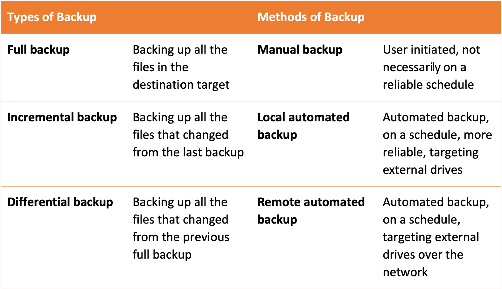

图 10.1 – 备份方法和类型

进行备份时，请记住以下规则：

+   **321 规则**意味着您应始终拥有至少三份数据副本，其中两份保存在不同介质上并存放在不同地点，而一份备份始终保存在异地（不同地理位置）。这也被称为**三分法则**；它可以适应任何情况，例如 312、322、311 或 323。

+   **备份检查**非常重要，但通常被忽视。它检查数据的完整性和有效性。

+   **清晰且有文档记录的备份策略和流程**对所有使用相同实践的 IT 团队成员都很有帮助。

在下一部分，我们将介绍一些知名的全 Linux 系统备份工具，从操作系统内部集成的工具到同样适用于家庭和企业使用的第三方解决方案。

## 磁盘克隆解决方案

一个好的备份选项是克隆整个硬盘或包含敏感数据的多个分区。Linux 提供了许多多功能的工具来完成此任务。其中包括`dd`命令、`ddrescue`命令和**Relax-and-Recover**（**ReaR**）软件工具。接下来的章节中我们将详细介绍这些工具。

### dd 命令

最著名的磁盘备份命令之一是 `dd` 命令。我们在*第六章*，*磁盘与文件系统操作*中讨论过此命令。让我们回顾一下它在备份和恢复场景中的使用方式。`dd` 命令用于按块复制数据，不管文件系统类型如何，从源设备到目标设备。

让我们学习如何克隆整个磁盘。我们系统上有一台虚拟机，配有一个 20 GB 的硬盘，我们想将其备份到一个 128 GB 的 USB 闪存驱动器上。我们将向您展示的操作同样适用于裸机环境。

首先，我们将运行 `sudo fdisk -l` 命令，以验证磁盘大小是否正确。输出将显示有关本地驱动器和 USB 闪存驱动器等信息，具体取决于您的系统。

现在我们已经知道了磁盘的大小，并且源磁盘能够适配目标磁盘，我们将继续克隆整个虚拟磁盘。我们将源磁盘 `/dev/vda` 克隆到目标磁盘 `/dev/sda`（该操作可能需要一些时间）：

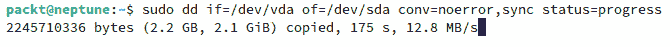

图 10.2 – 使用 dd 克隆整个硬盘

前面命令中显示的选项如下：

+   `if=/dev/vda` 代表输入文件，在我们的例子中是源硬盘

+   `of=/dev/sda` 代表输出文件，即目标 USB 驱动器

+   `conv=noerror` 代表允许命令在出现错误时继续执行的指令

+   `sync` 代表一个指令，它将输入错误的块填充为零，以便数据偏移始终保持同步

+   `status=progress` 显示关于传输过程的统计信息

请记住，这个操作可能需要一段时间才能完成。在我们的系统上，它花费了 200 分钟才完成。我们在操作开始时拍摄了前面的截图。接下来的部分，我们将向您展示如何使用 `ddrescue`。

### ddrescue 命令

`ddrescue` 命令是另一个可以用来克隆磁盘的工具。此工具从一个设备或文件复制到另一个设备或文件，第一次会尽量只复制良好健康的部分。如果您的磁盘出现故障，您可能需要使用 `ddrescue` 两次，因为第一次它只会复制好的扇区，并将错误映射到目标文件。第二次，它只会复制坏的扇区，因此最好添加多个读取尝试的选项，以确保操作的准确性。

在 Ubuntu 中，`ddrescue` 工具默认并未安装。要安装它，请使用以下 `apt` 命令：

```
sudo apt install gddrescue
```

我们将使用与之前相同的系统，克隆相同的硬盘。命令如下：

```
sudo ddrescue -n /dev/vda /dev/sda rescue.map --force
```

输出结果如下：

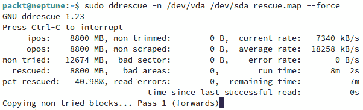

图 10.3 – 使用 ddrescue 克隆硬盘

我们使用了 `ddrescue` 命令并加上 `--force` 选项，确保目标上的所有内容都会被覆盖。这个操作也非常耗时，所以请准备好等待较长时间。在我们的情况下，完成这一步几乎花了 1 小时。接下来，我们将向你展示如何使用另一个有用的工具——ReaR 实用工具。

### 使用 ReaR

ReaR 是一个强大的灾难恢复和系统迁移工具，使用 Bash 编写。它被像 RHEL 和 SLES 这样的企业级发行版使用，也可以安装在 Ubuntu 上。它的设计目标是易于使用和设置。它与本地引导加载程序集成，支持 `cron` 调度程序，或像**Nagios**这样的监控工具。有关此工具的更多细节，请访问官方网站：[`relax-and-recover.org/about/`](http://relax-and-recover.org/about/)。

在 Ubuntu 上安装它，使用以下命令：

```
sudo apt install rear
```

安装完软件包后，你需要知道主配置文件的位置，即 `/etc/rear/local.conf`，所有的配置选项都应写在其中。ReaR 默认生成 ISO 文件，但它也支持将 Samba（CIFS）、USB 和 NFS 作为备份目标。接下来，我们将展示如何使用 ReaR 备份到本地 NFS 服务器。

#### 使用 ReaR 备份到本地 NFS 服务器

举个例子，我们将向你展示如何备份到 NFS 服务器。根据*技术要求*部分，你需要至少在网络上有两台系统可用：一台机器上设置了 NFS 服务器（作为备份服务器），另一台作为需要备份的生产机器。ReaR 应该安装在这两台机器上。请执行以下步骤：

1.  首先，我们必须根据需要配置 NFS 服务器（相关操作在 *第十三章*，*配置 Linux 服务器*中有介绍）。关于如何设置 NFS 服务器的详细信息，请参考 *第十三章*，这里我们仅做简要说明。NFS 的配置文件是 `/etc/exports`，它存储了共享位置的信息。在添加任何新的 ReaR 备份共享位置之前，先添加一个新目录。我们将使用 `/home/export/` 目录作为 NFS 设置的目录。在这个目录内，我们将为 ReaR 备份创建一个新的目录。创建新目录的命令如下：

    ```
    root, ReaR will not have permission to write the backup to this location. Change the ownership using the following command:

    ```

    使用你喜欢的编辑器打开 `/etc/exports` 文件，并为备份目录添加新行。该行应该类似如下：

    ```
    /home/export/rear 192.168.124.0/24(rw,sync,no_subtree_check)
    ```

    使用你本地网络的 IP 范围，而不是我们使用的那个。

    ```

    ```

1.  一旦新增了新行，重启 NFS 服务并使用 `-``s` 选项运行 `exportfs` 命令：

    ```
    /etc/rear/local.conf file and add the lines shown in the following output. Use your own system’s IP address, not the one we used. The code should look like the following:

    ```

    OUTPUT=ISO

    OUTPUT_URL=nfs://192.168.124.112/home/export/rear

    BACKUP=NETFS

    OUTPUT：可引导镜像类型，在我们这里是 ISO

    ```

    ```

1.  `OUTPUT_URL`：备份目标，可以是 NFS、CIFS、FTP、RSYNC 或文件

1.  `BACKUP`：所使用的备份方法，在我们的案例中是 `NETFS`，这是 ReaR 的默认方法

1.  `BACKUP_URL`：备份目标的位置

1.  现在，使用 `-v` 和 `-d` 选项运行 `mkbackup` 命令：

    ```
    sudo rear -v -d mkbackup
    ```

    输出将很大，因此我们在这里不展示它。该命令将需要较长时间才能完成。一旦完成，你可以检查 NFS 目录以查看其输出。备份应该就在其中。

在 NFS 服务器上写入了多个文件。其中名为 `rear-neptune.iso` 的文件是实际的备份文件，将在需要恢复系统时使用。另外，还有一个名为 `backup.tar.gz` 的文件，包含了我们本地机器上的所有文件。

重要说明

ReaR 的命名约定如下。名称将由术语 `rear-` 开头，后接系统的主机名以及 `.iso` 扩展名。我们的系统主机名是 `neptune`，因此备份文件在我们的情况下被命名为 `rear-neptune.iso`。

一旦备份已写入 NFS 服务器，你将能够使用 USB 磁盘或带有 ISO 镜像的 DVD 来恢复系统，这个 ISO 镜像已写入 NFS 服务器。

#### 使用 ReaR 进行备份到 USB

还有一个直接备份到 USB 磁盘的选项。以下是需要遵循的步骤：

1.  将磁盘插入 USB 端口并使用以下命令格式化它：

    ```
    sudo rear format /dev/sda
    ```

    该命令将需要较长时间才能完成。输出如下：

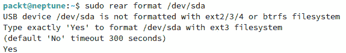

图 10.4 – 使用 ReaR 格式化 USB 磁盘

1.  现在，我们需要修改 `/etc/rear/local.conf` 文件并进行调整，使其使用 USB 作为备份目标。我们将添加的新的行应该如下所示：

    ```
    OUTPUT=USB
    BACKUP_URL="usb:///dev/disk/by-label/REAR-000"
    ```

1.  为了理解最后一行代码，你可以运行以下命令：

    ```
    /dev/disk/by-label/REAR-000 is a link to /dev/sda1 (in our case):
    ```

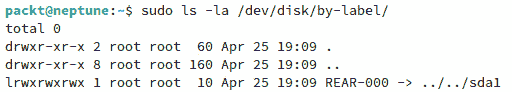

图 10.5 – 从 ReaR 配置文件中检查 URL 位置

1.  为了将系统备份到 USB 磁盘，运行以下命令：

    ```
    tar.gz files will be on the USB drive.
    ```

1.  为了恢复系统，你需要从 USB 驱动器启动并选择第一个选项，即 `Recover "hostname"`，其中 `"hostname"` 是你备份的计算机的主机名。

系统备份与恢复是两个非常重要的任务，应该是任何 Linux 系统管理员的必备技能。掌握这些任务的执行方法，可以为公司和客户节省数据、时间和金钱。最小化停机时间并提供快速、有效的响应，应该是每位**首席技术官**（**CTO**）桌面上最重要的资产。备份和恢复策略应该始终建立在良好的缓解实践基础上。从这个角度来看，一个强大的诊断工具集和故障排除知识将对每个系统管理员始终有帮助。这就是为什么在接下来的章节中，我们将展示一些 Linux 中最佳的诊断工具。

# 介绍常用的 Linux 诊断工具用于故障排除

Linux 的开放性是其最优点之一。这为各种任务提供了大量可以使用的解决方案。因此，许多诊断工具可供 Linux 系统管理员使用。根据你想要诊断系统的哪个部分，有多种工具可供选择。故障排除本质上是基于特定工具生成的诊断信息来解决问题。为了减少需要覆盖的诊断工具数量，我们将在本节中将问题缩小到以下几个类别：

+   启动问题

+   一般系统问题

+   网络问题

+   硬件问题

每个类别都有特定的诊断工具。我们将首先展示一些最常用的工具。

## 故障排除工具

要理解可能影响启动过程的问题，了解启动过程的工作原理非常重要。我们还没有详细介绍这一点，所以请注意接下来我们会告诉你的内容。

### 启动过程

所有主要的 Linux 发行版，如 Ubuntu、OpenSUSE、Debian、Fedora 和 RHEL，都将 `systemd` 作为默认的初始化系统。在 GRUB2 初始化和 `systemd` 启动实施之前，Linux 启动过程还有几个阶段。

启动顺序如下：

1.  **基本输入输出系统** (**BIOS**) **开机自检** (**POST**)

1.  GRUB2 启动加载程序初始化

1.  GNU/Linux 内核初始化

1.  `systemd init` 系统初始化

BIOS 自检（POST）是特定于硬件初始化和测试的过程，对于每台 PC 来说都是类似的，无论它是使用 Linux 还是 Windows。BIOS 会确保 PC 内部的每个硬件组件都正常工作。如果 BIOS 无法启动，通常是硬件故障或不兼容问题。BIOS 会搜索磁盘的启动记录，如 **主引导记录** (**MBR**) 或 **GUID 分区表** (**GPT**)，并将其加载到内存中。

GRUB2 初始化是 Linux 开始工作的地方。这是系统将内核加载到内存中的阶段。如果有多个操作系统可用，它可以在不同的内核之间进行选择。内核一旦被加载到内存中，它就控制了整个启动过程。

内核是一个自解压存档。解压后，它会加载到内存中，并启动 `init` 系统，这是 Linux 中所有其他进程的父进程。

`init` 系统，称为 `systemd`，通过挂载文件系统并访问所有可用的配置文件来启动。

在启动过程中，可能会出现一些问题。在接下来的章节中，我们将讨论如果灾难发生，且启动加载程序无法启动时应该怎么办。

### 修复 GRUB2

如果 GRUB2 损坏，你将无法访问系统。此时需要进行 GRUB 修复。在这个阶段，一个可启动的 USB 驱动器将为你提供帮助。以下步骤是一个可能算作实验的练习。在我们的案例中，我们有一张 Ubuntu 22.04 LTS 桌面版的启动盘，我们将以此作为示例。然而，你可以使用任何你喜欢的 Linux 发行版，不一定非得是 Ubuntu。关键是你需要一个安装了 Linux 的可启动 USB 驱动器。以下是你需要遵循的步骤：

1.  插入 Ubuntu 22.04 的启动盘并启动系统。

1.  打开 BIOS，选择可启动磁盘作为主启动设备，并重新启动计算机。

1.  选择**尝试** **Ubuntu**选项。

1.  进入 Ubuntu 实例后，打开终端，输入`sudo fdisk -l`命令，检查你的磁盘和分区。

1.  选择安装了 GRUB2 的磁盘，并使用以下命令（使用系统提供的磁盘名称，不要直接复制/粘贴我们的示例）：

    ```
    sudo mount -t ext4 /dev/sda1 /mnt
    ```

1.  使用以下命令安装 GRUB2：

    ```
    sudo chroot /mnt
    grub-install /dev/sda
    grub-install –recheck /dev/sda
    update-grub
    ```

1.  使用以下命令卸载分区：

    ```
    exit
    sudo unmount /mnt
    ```

1.  重启计算机。

处理引导加载程序非常敏感。请注意所有细节，并小心你输入的所有命令。如果不小心，一切可能都会出错。在接下来的部分，我们将向你展示一些用于诊断常见系统问题的工具。

## 故障排除常见系统问题的工具

系统问题可能有不同的类型和复杂度。知道如何使用工具来处理它们至关重要。在这一部分，我们将介绍 Linux 发行版提供的默认工具。任何 Linux 系统管理员都需要具备基本的故障排除知识，因为在常规操作过程中，问题是不可避免的。

一般系统问题可能意味着什么呢？基本上，这些问题涉及磁盘空间、内存使用、系统负载和运行中的进程。

### 与磁盘相关的问题的命令

磁盘，无论是 HDD 还是 SSD，都是系统的重要组成部分。它们为你的数据、文件和软件提供必要的空间，包括操作系统。我们不会讨论与硬件相关的问题，因为这将在本章的未来部分“*故障排除硬件问题的工具*”中进行探讨。相反，我们将讨论与**磁盘空间**相关的问题。最常见的诊断工具已经安装在任何 Linux 系统中，它们通过以下命令表示：

+   `du`：显示文件和目录磁盘空间使用情况的工具

+   `df`：显示目录磁盘使用情况的工具

以下是使用`df`工具并带有`-h`（人类可读）选项的示例：

```
df -h
```

如果其中一块磁盘的空间不足，它会在输出中显示出来。虽然在我们的案例中这不是问题，但这个工具仍然很有用，可以帮助你找出哪个可用磁盘的空闲空间出现了问题。

当磁盘已满或接近满时，可以应用几种修复方法。如果必须删除某些文件，我们建议您删除 `/home` 目录中的文件。尽量不要删除重要的系统文件。以下是一些故障排除可用空间问题的建议：

+   使用`rm`命令删除不必要的文件（可选择性地，谨慎使用`-rf`选项）或使用`rmdir`命令

+   使用 `rsync` 命令将文件移动到外部驱动器（或云端）

+   查找 `/home` 目录中使用最多空间的目录

以下是使用`du`工具查找 `/home` 目录中最大目录的示例。我们使用了两个管道，将 `du` 命令的输出传递给 `sort` 命令，最后再传递给 `head` 命令并使用 `5` 选项（因为我们只想显示五个最大目录，而不是所有的目录）：

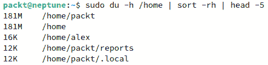

图 10.6 – 查找你 /home 目录中最大的目录

另一个故障排除场景是与使用的 inode 数量有关，而不是磁盘上的空间。在这种情况下，您可以使用`df -i`命令查看是否用尽了 inode：

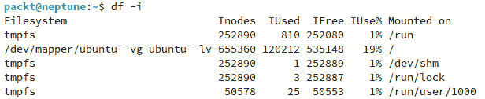

图 10.7 – inode 使用统计

前面的截图显示了关于系统中 inode 使用的基本信息。你会看到不同文件系统中 inode 的总数，已使用的 inode 数量（以数字和百分比表示），以及空闲的 inode 数量。

除了这里显示的命令，这些命令是每个 Linux 发行版的默认命令外，还有许多其他开源工具可以处理磁盘空间问题，例如**pydf**、**parted**、**sfdisk**、**iostat**以及基于 GUI 的**GParted**应用程序。

在接下来的部分，我们将展示如何使用命令来验证可能的内存问题。

### 内存使用问题的命令

`free` 命令可以在任何主要发行版中使用。在以下示例中，我们将使用 `-h` 选项来获取人类可读的输出：

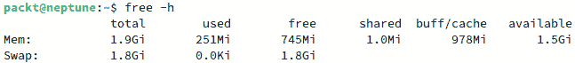

图 10.8 – 在 Linux 中使用 free 命令

如前面的截图所示，使用`free`命令（带有`-h`选项以便输出人类可读格式）会显示以下内容：

+   `total`：总内存

+   `used`：已使用的内存，通过总内存减去缓冲区、缓存和空闲内存计算得出

+   `free`：空闲或未使用的内存

+   `shared`：`tmpfs` 使用的内存

+   `buff/cache`：内核缓冲区和页面缓存使用的内存

+   `available`：为新应用程序提供的可用内存

这样，你可以找到与更高内存使用相关的具体问题。定期检查服务器的内存使用情况对于确保资源高效使用至关重要。

另一种检查内存使用情况的方法是使用 `top` 命令，如下图所示：


图 10.9 – 使用 `top` 命令检查内存使用情况

使用 `top` 命令时，屏幕上有多个可用的部分。输出是动态的，意味着它会不断变化，实时显示系统中正在运行的进程的信息。`memory` 部分显示有关总内存使用情况的信息，以及空闲和缓存内存。所有信息默认以兆字节（MB）为单位显示，便于阅读和理解。

另一个显示内存（以及其他有价值的系统信息）的命令是 `vmstat`：

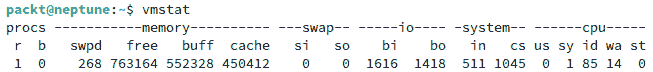

图 10.10 – 使用不带选项的 vmstat 命令

默认情况下，`vmstat` 显示有关进程、内存、交换、磁盘和 CPU 使用情况的信息。内存信息从第二列开始显示，并包含以下详细信息：

+   `swpd`: 正在使用的虚拟内存量

+   `free`: 内存中剩余的可用空间

+   `buff`: 用于缓冲的内存量

+   `cache`: 用于缓存的内存量

`vmstat` 命令有多个可用的选项。要了解所有选项以及输出中的各个列所代表的含义，可以使用以下命令访问手册中的相应页面：

```
man vmstat
```

可以与 `vmstat` 一起使用的选项有 `-a` 和 `-s`，通过使用 `vmstat -a`，输出将显示活动内存和非活动内存：

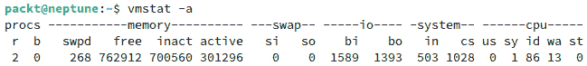

图 10.11 – 使用 `vmstat -a` 显示活动内存和非活动内存

使用 `vmstat -s` 命令将显示详细的内存、CPU 和磁盘统计信息。

本节讨论的所有命令对于排查内存问题非常重要。可能还有其他可以使用的命令，但这些命令是任何 Linux 发行版上默认提供的命令。

然而，还有一个值得在本节中提及的命令：`sar` 命令。可以通过 `sysstat` 软件包在 Ubuntu 中安装该命令。因此，可以使用以下命令安装该软件包：

```
sudo apt install sysstat
```

安装完包后，为了能够使用`sar`命令显示系统内存使用的详细统计数据，你需要启用`sysstat`服务。它需要处于活动状态才能收集数据。默认情况下，服务每 10 分钟运行一次，并将日志保存在`/var/log/sysstat/saXX`目录中。每个目录的命名是以服务运行的日期命名的。例如，如果我们在 4 月 25 日运行`sar`命令，服务会在`/var/log/sysstat/sa25`中查找数据。我们在启动服务之前运行了`sar`命令，并且发生了错误。因此，要启用数据收集，首先需要启动并启用`sysstat`服务，然后再运行应用程序。使用`sar`命令，你可以实时生成不同的报告。例如，如果我们想每两秒生成一次内存报告，可以使用`-r`选项：

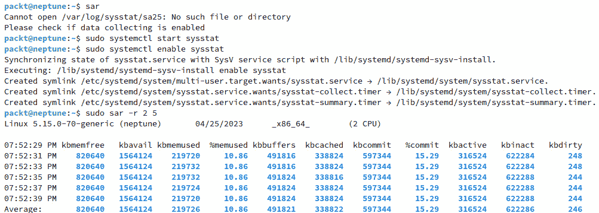

图 10.12 – 启动和启用服务并运行 sar

服务名称是`sadc`，它使用`sysstat`作为包和服务的名称。

重要提示

在系统重启的情况下，服务可能不会默认重新启动，即使之前的命令已执行。为了解决这个问题，在 Ubuntu 上，你应编辑`/etc/default/sysstat`文件，并将`ENABLED`的状态从`false`更改为`true`。

在*图 10.12*中显示的输出将每两秒写一行，连续五次，最后显示一行平均值。它是一个强大的工具，不仅仅可以用于内存统计，还有 CPU 和磁盘统计选项。

总体而言，本节我们涵盖了用于排查内存问题的最重要工具。在下一节中，我们将介绍用于解决系统负载问题的工具。

### 系统负载问题的命令

与我们在前面几节中讨论的类似，本节将讨论`top`命令，这是我们在判断系统卡顿时最常用的工具。其他工具，如`vmstat`和`sar`，也可以用于 CPU 和系统负载故障排除。

排查系统负载的一个基本命令是`uptime`：

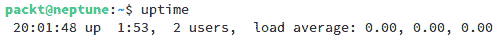

图 10.13 – 使用 uptime 检查系统负载

`uptime`的输出显示了三个值，代表了 1、5 和 15 分钟的负载均值。负载均值可以为你提供一个关于系统进程状态的合理图像。

如果你有一个单核 CPU 系统，负载均值为`1`意味着该 CPU 正在全负荷运行。如果数值更高，表示负载远远超过 CPU 的处理能力，这可能会给系统带来很大压力。因此，进程执行将需要更长的时间，系统的整体性能也会受到影响。

高负载平均值意味着有些应用程序同时运行多个线程。然而，某些负载问题不仅是过载 CPU 的结果 – 它们可能是 CPU 负载、磁盘 I/O 负载和内存负载的综合效果。在这种情况下，用于故障排除系统负载问题的瑞士军刀是`top`命令。`top` 命令的输出根据系统负载实时变化。

默认情况下，`top`按 CPU 使用情况对进程进行排序。它以交互模式运行，有时屏幕上的输出不易看清。您可以将输出重定向到文件，并使用`-b`选项以批处理模式运行命令。此模式仅更新指定次数的命令。要以批处理模式运行`top`，请运行以下命令：

```
top -b -n 1 | tee top-command-output
```

对于经验不足的 Linux 用户来说，`top` 命令可能有点吓人。输出如下截图所示：

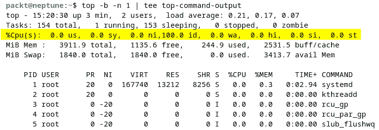

图 10.14 – top 命令的输出

让我们来看看输出的含义：

+   `us`：用户 CPU 时间

+   `sy`：系统 CPU 时间

+   `ni`：优先级较低的 CPU 时间

+   `id`：空闲 CPU 时间

+   `wa`：输入/输出等待时间

+   `hi`：CPU 硬件中断时间

+   `si`：CPU 软件中断时间

+   `st`：CPU 窃取时间

另一个用于故障排除 CPU 使用率和硬盘输入/输出时间的工具是`iostat`：

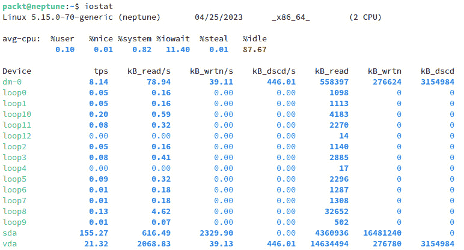

图 10.15 – iostat 的输出

CPU 统计信息类似于先前显示的`top`命令的输出。I/O 统计信息显示在 CPU 统计信息下方，以下是每列代表的内容：

+   `tps`：每秒传输到设备的次数（I/O 请求）

+   `kB_read/s`：从设备读取的数据量（以块数 – 千字节表示）

+   `kB_wrtn/s`：写入到设备的数据量（以块数 – 千字节表示）

+   `kB_dscd/s`：设备丢弃的数据量（以千字节为单位）

+   `kB_read`：读取的总块数

+   `kB_wrtn`：写入的总块数

+   `kB_dscd`：丢弃的总块数

要了解有关`iostat`命令的更多详细信息，请使用以下命令阅读相应的手册页面：

```
man iostat
```

除了`iostat`命令，您还可以使用另一个称为`iotop`的命令。它在 Ubuntu 上默认情况下未安装，但您可以使用以下命令安装它：

```
sudo apt install iotop
```

安装完成后，您需要`sudo`权限来运行它：

```
sudo iotop
```

输出如下截图所示：

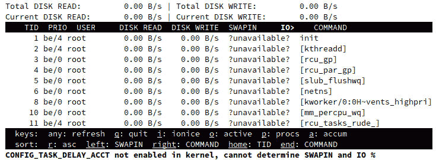

图 10.16 – 运行 iotop 命令

您还可以运行`sysstat`服务来解决系统负载问题，类似于我们用它来解决内存问题。

默认情况下，`sar`将输出当前日期的 CPU 统计信息：

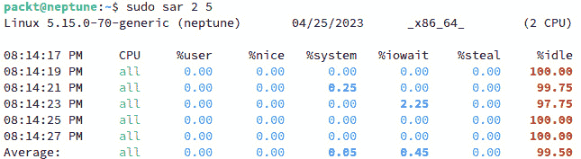

图 10.17 – 运行 sar 进行 CPU 负载故障排除

在前面的截图中，`sar`命令运行了五次，每次间隔两秒。此时，我们的本地网络服务器负载不重，但你可以想象，如果在负载较重的服务器上运行该命令，输出会有所不同。正如我们在前一节中提到的，`sar`命令有多个选项，在寻找潜在问题的解决方案时可能会非常有用。运行`man sar`命令可以查看包含所有可用选项的手册页面。

还有许多其他工具可以用于一般的系统故障排除。我们在本节中展示的工具仅仅是这一主题的冰山一角。如果你有需要，可以搜索更多为系统故障排除设计的工具。否则，本文所介绍的工具已经足够让你生成一份关于可能系统问题的有效报告。

网络特定的问题将在下一节中讲解。

## 用于故障排除网络问题的工具

由于网络的复杂性，问题经常会出现。网络是日常生活中不可或缺的一部分。我们无处不在使用它们，从无线智能手表到智能手机，再到电脑，甚至到云端。所有的一切都在全球范围内连接，以便让我们的生活更加便捷，也让系统管理员的生活稍微复杂一些。在这个互联的世界中，事情很容易出问题，因此网络问题需要进行故障排除。

故障排除**网络问题**几乎占据了系统管理员 80%的工作——可能甚至更多。这个数字并没有官方研究数据支持，而是基于实际操作经验的洞察。由于大多数服务器和云端问题与网络有关，优化的网络意味着减少停机时间，并且能够让客户和系统管理员更开心。

本节中将介绍的工具是所有主要 Linux 发行版的默认工具。所有这些工具都在*第七章*《*Linux 网络*》和*第九章*《*保护 Linux*》中讨论过，或者将在*第十三章*《*配置 Linux 服务器*》中讨论。因此，我们只会从问题解决的角度再次提及它们。让我们从具体的 TCP/IP 层次来逐步分解应该使用的工具。你还记得 TCP/IP 模型有多少层吗？一共有五层，我们将从第 1 层开始。作为一种良好的实践，故障排除网络时，最好从应用层开始，逐层深入到物理层。

### 诊断物理层（第 1 层）

最基本的测试工具之一，也是大多数系统管理员最先使用的工具就是`ping`命令。其名称来源于`ping`命令的`-c`选项。输出如下：

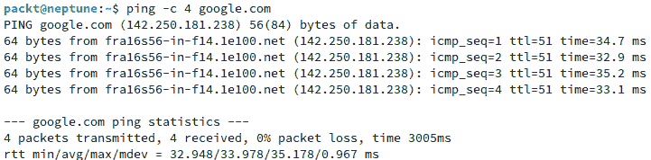

图 10.18 – 使用 ping 命令进行基本测试

Ping 命令向目标发送简单的 ICMP 数据包（在我们的例子中是[google.com](http://google.com)），并等待响应。一旦收到响应且没有丢包，说明一切正常。`ping`命令可以用于测试本地网络系统的连接，也可以用于测试远程网络。它是用于测试和排除可能问题的第一个工具。

有时，简单的`ping`命令测试不足以解决问题。在这种情况下，另一个多功能的命令是`ip`命令。你可以使用它来检查物理层是否有任何问题：

```
ip link show
```

你将看到如下输出：

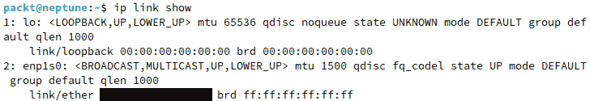

图 10.19 – 使用 ip 命令显示物理接口的状态

在前面的截图中，你可以看到以太网接口运行正常（`state UP`）。由于我们运行的是虚拟机，没有无线连接。如果我们使用的是笔记本电脑，举个例子，无线连接会显示出来，类似于`wlp0s20f3`。

如果某个接口无法正常工作，例如无线接口，前面命令的输出会显示`state DOWN`。在我们的例子中，我们将使用以下命令来启用无线接口：

```
ip link set wlp0s20f3 up
```

执行后，你可以再次运行`ip`命令来检查接口的状态：

```
ip link show
```

如果你直接访问裸机系统，比如一台服务器，你可以直接检查电缆是否连接。如果你恰好使用的是无线连接（不推荐），你需要使用`ip`命令。

另一个用于第一层的有用工具是`ethtool`。在 Ubuntu 22.04.2 LTS 中，它默认安装。要检查以太网接口，可以使用以下命令，输入连接的名称（你在使用`ip`命令时看到过）：

```
ethtool enp1s0
```

通过使用`ethtool`，我们可以检查连接是否协商了正确的速度。在命令的输出中（我们这里不展示），你会看到系统成功协商了一个 1,000 Mbps 的全双工连接，例如（在你的情况下可能会不同）。在下一部分，我们将展示如何诊断第二层栈。

### 诊断数据链路层（第二层）

TCP/IP 栈的第二层包括`ip`命令和`arp`命令。`arp`命令来自`net-tools`包。首先，安装该包，使用以下命令：

```
sudo apt install net-tools
```

要检查 ARP 表中的条目，可以使用带有`-a`（所有）选项的`arp`命令。由于我们运行的是虚拟机，我们只有一个条目。为了比较，我们在主机系统上运行相同的命令，这时有三个条目，一个是无线连接，一个是有线连接，还有一个是 KVM 使用的虚拟桥接连接。以下是一个示例：

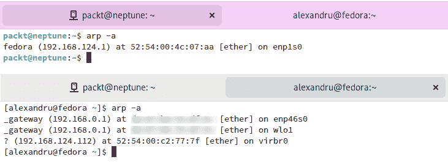

图 10.20 – 使用 arp 命令映射 ARP 条目

`arp` 命令的输出将显示所有连接的设备，包含它们的 IP 地址和 MAC 地址的详细信息。请注意，出于隐私原因，MAC 地址已被模糊处理。

类似于 `arp` 命令，你可以使用 `ip neighbor show` 命令，如下图所示。我们将使用我们的主机系统，而不是虚拟机：

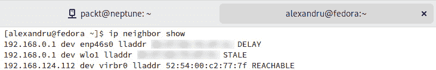

图 10.21 – 使用 ip 命令列出 ARP 条目

`ip` 命令可用于从 ARP 列表中删除条目，方法如下：

```
ip neighbor delete 192.168.124.112 dev virbr0
```

我们使用命令删除了虚拟桥接连接，使用其 IP 地址和名称从列表中删除，如*图 10.21*所示。

`arp` 和 `ip` 命令的输出类似。它们是强大的命令，对于排查可能的第 2 层问题非常有用。在下一部分中，我们将向你展示如何诊断第 3 层堆栈。

### 诊断互联网层（第 3 层）

在互联网层（第 3 层），我们仅使用 IP 地址。我们已经了解了这里要使用的工具，如 `ip` 命令、`ping` 命令、`traceroute` 命令和 `nslookup` 命令。由于我们已经讨论过 `ip` 和 `ping` 命令，这里将仅讨论如何使用 `traceroute` 和 `nslookup`。`traceroute` 命令在 Ubuntu 中默认没有安装。你需要使用以下命令安装它：

```
sudo apt install traceroute
```

`nslookup` 包在 Ubuntu 中默认可用。首先，要检查路由表，查看不同路由的网关列表，我们可以使用 `ip route` `show` 命令：

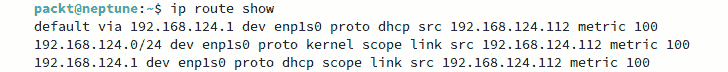

图 10.22 – 使用 “ip route show” 命令显示路由表

`ip route show` 命令显示了默认网关。若它缺失或配置错误，则可能是一个问题。

`traceroute` 工具用于检查从源到目的地的流量路径。以下输出显示了数据包从我们本地网关到 Google 服务器的路径：

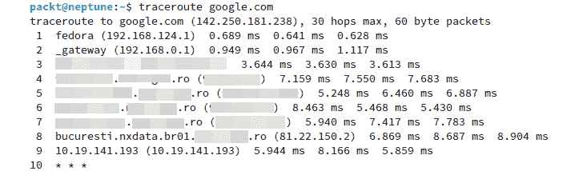

图 10.23 – 使用 traceroute 进行路径追踪

数据包在发送和返回源时通常不会走相同的路由。数据包被发送到网关进行处理，然后按某条路由发送到目的地。当数据包超过本地网络时，它们的路由可能会被 `traceroute` 工具不准确地表示，因为它依赖的数据包可能会被路径上的多个网关过滤（*ICMP TTL 超时*的数据包通常会被过滤）。

类似于 `traceroute`，还有一个更新的工具叫做 `tracepath`。它在 Ubuntu 上默认安装，是 `traceroute` 的替代品。`traceroute` 和 `tracepath` 默认都使用 UDP 端口进行跟踪。`tracepath` 命令还可以与 `-n` 选项一起使用，以显示 IP 地址而不是主机名。以下是一个示例：


图 10.24 – 使用 `tracepath` 命令

进一步检查网络问题可能会导致 DNS 解析错误，导致主机只能通过 IP 地址访问，而无法通过主机名访问。要排查此问题，您可以使用 `nslookup` 命令，并结合 `ping` 命令进行诊断，即使这不是一个第 3 层的协议。

如果 `nslookup` 命令与 `ping` 命令输出的 IP 地址相同，那么一切正常。如果输出中出现不同的 IP 地址，那么您的主机配置可能存在问题。在下一部分中，我们将向您展示如何诊断第 4 层和第 5 层的协议栈。

### 诊断传输层和应用层（第 4 层和第 5 层）

最后的两层，第 4 层（`ss` 命令，其中 `ss` 是 **套接字统计** 的缩写）。

`ss` 命令是 `netstat` 的最近替代品，用于查看所有网络套接字的列表。因此，列表可能会非常长，您可以使用多个命令选项来缩短它。

例如，您可以使用 `-t` 选项仅查看 TCP 套接字，使用 `-u` 选项查看 UDP 套接字，使用 `-x` 查看 Unix 套接字。因此，要查看 TCP 和 UDP 套接字信息，我们将使用带有 `-t` 选项的 `ss` 命令。此外，要查看系统上所有的监听套接字，您可以使用 `-l` 选项。将其与 `-u` 和 `-t` 选项结合使用，将显示系统上所有的 UDP 和 TCP 监听套接字。以下是从更长列表中截取的一部分：


图 10.25 – 使用 `ss` 命令列出 TCP 和 UDP 套接字以及所有监听套接字

`ss` 命令在网络故障排除中非常重要，尤其是当您想要验证可用套接字及其处于 `LISTEN` 状态时。另一个用途是检查 `TIME_WAIT` 状态，您可以使用如下截图中的命令：


图 10.26 – 使用 `ss` 命令显示 TIME_WAIT 端口

我们使用了 `ss` 命令，搭配 `-o` 选项和 `state time-wait` 参数。当一个套接字关闭一段短时间时，会进入 `TIME_WAIT` 状态。

如需获取更多关于此状态的信息，您可以访问以下链接：[`vincent.bernat.ch/en/blog/2014-tcp-time-wait-state-linux`](https://vincent.bernat.ch/en/blog/2014-tcp-time-wait-state-linux)。

`ss`工具在系统管理员的工具箱中不可或缺。第 5 层，应用层，包含应用程序使用的协议，我们将记住像**动态主机配置协议**（**DHCP**）、**超文本传输协议**（**HTTP**）和**文件传输协议**（**FTP**）这样的协议。由于诊断第 5 层主要是一个应用程序故障排除过程，本节将不涉及此内容。

在下一节中，我们将讨论硬件故障排除。

## 故障排除硬件问题的工具

故障排除硬件问题的第一步是检查你的硬件。查看系统硬件详细信息的一个非常好的工具是`dmidecode`命令。此命令用于以人类可读的格式读取每个硬件组件的详细信息。每个硬件都有一个特定的 DMI 代码，取决于它的类型。该代码特定于**系统管理基础输入/输出系统**（**SMBIOS**）。SMBIOS 使用 45 个代码。有关这些代码的更多信息，可以访问[`www.thegeekstuff.com/2008/11/how-to-get-hardware-information-on-linux-using-dmidecode-command/`](https://www.thegeekstuff.com/2008/11/how-to-get-hardware-information-on-linux-using-dmidecode-command/)。

要查看系统内存的详细信息，可以使用带有`-t`选项（来自`TYPE`）和代码`17`的`dmidecode`命令，这对应于 SMBIOS 中的内存设备代码。以下是我们虚拟机中的一个示例：

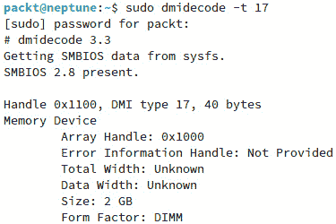

图 10.27 – 使用 dmidecode 查看内存信息

要查看其他硬件组件的详细信息，请使用带有特定代码的命令。

其他快速故障排除工具包括`lspci`、`lsblk`和`lscpu`等命令。`lsblk`命令的输出显示系统中正在使用的磁盘和分区信息。`lscpu`命令将显示有关 CPU 的详细信息。

同时，在故障排除硬件问题时，快速查看内核日志可能会很有帮助。要做到这一点，请使用`dmesg`命令。你可以使用`dmesg | more`命令来更好地控制输出。

正如你在本节中看到的，硬件故障排除与其他类型的故障排除同样重要且具有挑战性。解决硬件相关的问题是任何系统管理员工作的重要组成部分。这包括不断检查硬件组件，替换故障部件，并确保它们顺利运行。

# 总结

在本章中，我们强调了灾难恢复计划、备份与恢复策略以及排除各种系统问题的重要性。每个系统管理员都应能够在灾难发生时将自己的知识付诸实践。不同类型的故障最终会影响正在运行的服务器，因此应尽快找到解决方案，以确保最小的停机时间并防止数据丢失。

本章是本书*高级 Linux 管理*部分的高潮。在下一章中，我们将向你介绍**服务器管理**，重点讲解 KVM 虚拟机管理、Docker 容器和不同类型的 Linux 服务器配置。

# 问题

故障排除是解决问题的最佳方式。在我们深入服务器部分之前，先测试一下你的故障排除知识：

1.  尝试为你的私有网络或小型企业草拟一份灾难恢复计划（DRP）。

1.  使用 321 规则备份你的整个系统。

1.  查找系统中使用 CPU 最多的前 10 个进程。

1.  查找系统中使用内存最多的前 10 个进程。

# 延伸阅读

+   Ubuntu LTS 官方文档：[`ubuntu.com/server/docs`](https://ubuntu.com/server/docs)

+   RHEL 官方文档：[`access.redhat.com/documentation/en-us/red_hat_enterprise_linux/9/`](https://access.redhat.com/documentation/en-us/red_hat_enterprise_linux/9/)

+   SUSE 官方文档：[`documentation.suse.com/`](https://documentation.suse.com/)

# 第三部分：服务器管理

在这一部分，你将通过设置不同类型的服务器来学习高级 Linux 服务器管理任务，并学习如何处理和管理虚拟机和 Docker 容器。

本部分包括以下章节：

+   *第十一章*，*与虚拟机的工作*

+   *第十二章*，*使用 Docker 管理容器*

+   *第十三章*，*配置 Linux 服务器*
