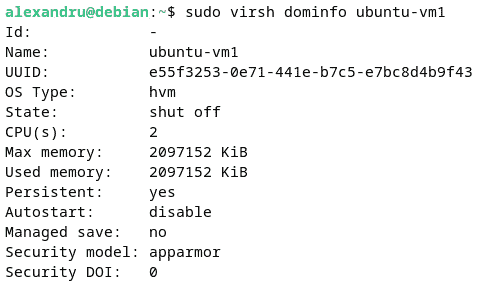

# 第十一章：使用虚拟机

本章中，你将了解 Linux 上的**虚拟机**（**VMs**）。首先，你将了解虚拟化的工作原理以及如何创建和使用虚拟机。你将学习 Linux 上最广泛使用的虚拟化和虚拟机监控技术之一——**基于内核的虚拟机**（**KVM**）。本章的主题将为你迎接 Linux 的未来做好准备，因为它是现代云技术的基础。如果你希望在不断变化的技术环境中保持与时俱进，本章将是你旅程中的一个重要起点。

本章将涵盖以下主要主题：

+   Linux 上的虚拟化简介

+   理解 Linux KVM

+   使用基本的 KVM 命令

+   高级 KVM 管理

+   使用 cloud-init 配置虚拟机

+   使用 SSH 的公钥认证

# 技术要求

不需要特殊的技术要求，只需系统上有一个正常工作的 Linux 安装。我们将主要使用 Debian GNU/Linux 12 作为示例，但也会展示如何在 Fedora 和 openSUSE 中安装 KVM。

# Linux 上的虚拟化简介

**虚拟化**是一种更有效利用计算机硬件的方式。它本质上是一个抽象层，利用计算机的资源。在本节中，你将学习虚拟机的类型、它们如何在 Linux 上工作以及如何部署和管理它们。

## 资源使用效率

虚拟化使用的抽象层是一个软件层，允许更高效地使用计算机的所有组件。这样可以更好地利用物理机器的所有能力和资源。

在深入探讨虚拟化之前，让我们先给你一个例子。在我们的测试实验室中，我们有几台物理机器，以笔记本电脑和小型桌面计算机（Intel NUC）为主，这些机器用作服务器。每台系统都拥有足够的资源，足以运行我们需要的服务。例如，我们性能最差的系统是一台第五代 Intel NUC，搭载 Intel i3 处理器，四个处理核心，16GB 内存，以及一台第七代 Intel NUC，搭载四核 Intel Pentium 处理器和 12GB 内存。这两台系统有足够的资源，可以通过使用虚拟机更加高效地利用。

对于在本地网络上运行本地 Web 服务或任何类型的服务器，资源可以轻松地在多个虚拟机之间进行分配。例如，每个物理系统可以托管四个不同的虚拟机，每个虚拟机使用一个 CPU 核心，至少 2GB 内存和所有必要的存储容量。这样，一台机器将像四台不同的机器一样工作。这比使用独立机器处理单独任务更加高效。

在以下图示中，我们对比了单台计算机的负载与相同负载分配到多个虚拟机之间的情况。以这种方式使用相同的硬件资源更加高效：


图 11.1 – 单台计算机使用与使用多个虚拟机的对比

然而，正如我们将在宿主操作系统上使用虚拟机监控器一样，我们必须为操作系统保留一些资源，因此虚拟机的数量会较少。以下是虚拟机在宿主操作系统上工作的示意图：


图 11.2 – 虚拟化在宿主操作系统上的工作原理

上图展示了虚拟化在宿主操作系统上使用时的工作原理。如我们将在接下来的章节中看到的，这并不是唯一的虚拟化类型。

需要注意的是，效率不仅仅与使用的硬件资源相关。数据中心中硬件高效使用的一个重要方面是提高能源效率和减少碳足迹。在这方面，虚拟化在改变数据中心内部服务器使用模式方面已经发挥了几十年的重要作用。总体而言，虚拟化和容器化在应对气候变化的斗争中扮演着重要角色。

在接下来的章节中，我们将简要介绍虚拟机监控器和虚拟机。

## 虚拟机监控器介绍

虚拟化所基于的软件层称为**虚拟机监控器**。物理资源被划分并作为虚拟计算机使用，更广为人知的是虚拟机（VM）。通过使用虚拟机，物理硬件的局限性通过**模拟**过程得以克服。这具有许多优点，使得硬件可以更高效地使用。

重要说明

模拟过程本质上是一个模仿过程，通过该过程，一款软件复制（或模仿）另一个系统的功能。在我们的案例中，虚拟机监控器（虚拟化软件层）模拟硬件的使用，就好像它是一个完全不同的系统。这使得计算机拥有的硬件资源能够更加高效地利用。

虚拟机监控器可以运行在现有操作系统上（*类型 2*），也可以直接运行在裸金属硬件上（*类型 1*）。对于这两种类型的虚拟机监控器，特别是在 Linux 上，有各种可用的解决方案。对于 Linux 操作系统，每种类型的示例如下：

+   运行在宿主操作系统之上的虚拟机监控器（类型 2）示例包括 Oracle VirtualBox 和 VMware Workstation/Fusion。

+   直接运行在裸金属硬件上的虚拟机监控器（类型 1）示例包括 Citrix Xen Server 和 VMware ESXi。

+   KVM 通常被归类为裸金属虚拟机监控器（类型 1），而其底层系统是一个完整的操作系统，因此它也同时被归类为宿主虚拟机监控器（类型 2）。

在本章中，我们将专门使用 KVM 作为首选虚拟机监控器。

# 了解 Linux KVM

虚拟机类似于一台独立的计算机。它是一种基于软件的模拟器，可以访问宿主计算机的资源。它使用宿主计算机的 CPU、内存、存储、网络接口和端口。不仅如此，它还是一个具有与物理计算机相同功能的虚拟环境；也被视为一台虚拟计算机。

每个虚拟机的资源由虚拟化技术管理。它可以在现有虚拟机之间重新分配资源或创建新的虚拟机。虚拟机之间相互隔离，并与宿主计算机隔离。由于多个虚拟机可以存在于一台计算机上，每个虚拟机可以使用不同的客户操作系统。例如，如果你使用的是 Windows 计算机并想尝试 Linux，一个流行的解决方案是创建一个虚拟机来运行你想尝试的 Linux 发行版。Mac 用户也是一样。安装在虚拟机中的操作系统与直接安装在硬件上的操作系统运行方式相似。用户体验可能因虚拟化技术的不同而有所不同，资源效率和响应时间也可能不同。根据我们的经验，我们更倾向于使用 KVM 来运行虚拟机，而不是使用其他虚拟化技术，主要因为其全面的**命令行界面**（**CLI**）。不过，使用场景因用户不同而有所不同。

## 选择虚拟化技术

在本章中，我们选择了 KVM 虚拟化技术。作为一个可选方案，如果你使用 GNOME 桌面环境，你可以使用 GNOME Boxes。由于 KVM 和 GNOME Boxes 都可以直接从 Linux 仓库获取，我们认为它们是 Linux 新手的较好选择。KVM 和 GNOME Boxes 共享部分 `libvirt` 和 `qemu` 代码（将在下一节详细介绍），在这方面，我们认为它们都是相同的虚拟化技术，即 KVM。

在*第一章*，*安装 Linux* 中，你第一次接触了使用虚拟化技术来设置 Linux 虚拟机的方式。我们展示了如何使用 VMware 解决方案和 VirtualBox 来设置 Linux 虚拟机。那时提供的细节对于任何用户来说都应该足够，无论他们是经验丰富的用户还是新手。VirtualBox 具有一些功能，使其成为虚拟化技术的一个不错的选择，但在我们看来，它仍然缺乏 KVM 的精细度。在下一节中，我们将带你深入了解 KVM。

## 使用 KVM 虚拟化技术

KVM 是一个开源虚拟化项目，适用于所有主要的 Linux 发行版。它是一种现代虚拟化技术，使用特定的内核模块来充分利用 Linux 内核所提供的所有优势，包括内存支持、调度器、嵌套虚拟化、GPU 直通等。

### KVM 详细介绍 – QEMU 和 libvirt

KVM 使用 `libvirt`。KVM 与 `libvirt` 的接口，特别是在 GNOME 中，是 `virt-manager`。`libvirt` 的命令行界面（CLI）叫做 `virsh`。

`libvirt` API 提供了一个通用的库用于管理虚拟机（VM）。它是用于虚拟机创建、修改和配置的管理层。它作为一个名为`libvirtd`的守护进程在后台运行，处理客户端请求时与虚拟化管理程序的连接。

QEMU 既是一个仿真器，也是一个虚拟化工具。当作为仿真器使用时，QEMU 使用**动态二进制翻译**方法来操作。这意味着它可以在宿主机上使用不同类型的操作系统，即使这些操作系统是为不同架构设计的。动态二进制翻译用于**基于软件的虚拟化**，其中硬件被仿真以在虚拟化环境中执行指令。通过这种方式，QEMU 仿真机器的 CPU，使用一种特定的二进制翻译方法，叫做**Tiny Code Generator**（**TCG**），它将二进制代码转换为不同架构的机器代码。

当作为虚拟化工具使用时，QEMU 使用被称为**基于硬件的虚拟化**的方法，在这种情况下不使用二进制翻译，因为指令直接在宿主机的 CPU 上执行。软件虚拟化与硬件辅助虚拟化之间的差异如下面的图所示：


图 11.3 – 软件虚拟化与硬件辅助虚拟化的比较

如图所示，在使用软件虚拟化和硬件辅助虚拟化时，指令有不同的执行路径。在软件辅助虚拟化中，当使用动态二进制翻译时，用户的非特权指令会直接发送到硬件，而来宾操作系统的特权指令则先发送到虚拟化管理程序，再发送到硬件。在硬件辅助虚拟化中，用户的非特权指令会先发送到虚拟化管理程序，再发送到硬件，而来宾操作系统的特权指令与软件辅助虚拟化中的路径相同。这确保了来宾操作系统的隔离性，从而实现了更好的性能和更少的复杂性。

在接下来的部分，我们将向你展示如何在 Debian 12 机器上安装和配置 QEMU。我们认为 Debian 是一个足够轻量级的发行版，提供了虚拟化主机操作系统所需的稳定性。一些命令也可以在 Ubuntu 上复制。

### 在主要的 Linux 发行版上安装虚拟化管理程序

安装 QEMU 是一个简单的任务。你需要做的就是运行你的发行版的包安装工具，并指定一些包名称。在我们的示例中，我们将向你展示如何在主要的 Linux 发行版（如 Debian/Ubuntu、Fedora 和 openSUSE）上安装 QEMU：

+   **在 Debian/Ubuntu Linux 上安装**

    运行以下命令：

    ```
    sudo apt install qemu-kvm libvirt-clients libvirt-daemon-system bridge-utils virtinst libvirt-daemon virt-manager
    ```

+   **在 Fedora Linux 上安装**

    运行以下命令：

    ```
    sudo dnf group install --with-optional virtualization
    ```

+   **在 openSUSE Linux 上安装**

    运行以下命令：

    ```
    sudo zypper install -t pattern kvm_server kvm_tools
    sudo zypper install libvirt-daemon
    ```

一旦所有必要的软件包安装完成，你可以使用以下命令启用并启动`libvirtd`守护进程（适用于本节中展示的所有 Linux 发行版）：

```
sudo systemctl start libvirtd
sudo systemctl enable libvirtd
```

安装完软件包并启动和启用守护进程后，下一步安全的操作是检查你的机器是否符合 KVM 的要求。要做到这一点，可以使用`virt-host-validate`命令，以 root 用户身份或通过`sudo`来运行。我们在一台 Debian GNU/Linux 12 主机上运行该命令，但它也可以在其他 Linux 发行版上使用：

```
sudo virt-host-validate
```

一旦命令运行，你可能会收到一些关于 QEMU 或**Linux 容器**（**LXC**）的错误或警告——LXC 是一种用于运行隔离系统的技术，类似于 KVM 的工作方式——这些错误或警告取决于你的系统（更多关于 LXC 的内容可以参见*第十二章*）。在我们的案例中，输出显示了一个关于 LXC 兼容性的错误，如下图所示：


图 11.4 – 运行主机验证程序

然而，这个错误不会限制我们使用`libvirt`和 QEMU，因此我们不打算在这里解决它。

在确认没有关于 QEMU 的兼容性问题后，我们可以继续通过 CLI 创建我们的第一个虚拟机。因此，我们将开始使用 KVM 特定的命令。

# 使用基本的 KVM 命令

在使用 KVM 时，最先使用的命令之一是用于创建虚拟机（VM）的命令。其他命令，如接下来的章节所示，是用于启动、停止、删除或暂停已有虚拟机的命令。

## 使用命令行创建虚拟机

在使用`libvirt`创建第一个虚拟机之前，我们必须检查并确认我们的默认桥接网络配置是否已创建。我们可以通过使用以下命令来验证：

```
sudo virsh net-list
```

该命令显示是否已创建默认桥接配置以及它是否正在运行。在我们的案例中，桥接连接没有运行，因此我们需要自己进行设置。用于启动默认桥接网络的命令如下：

```
sudo virsh net-start default
```

一旦它启动，网络桥接未设置为自动启动，因此我们将使用以下命令将其设置为自动启动：

```
sudo virsh net-autostart default
```

现在，输出结果如下：


图 11.5 – 启用默认桥接连接

现在，默认的桥接连接已启用并设置为`自动启动`，我们可以创建我们的第一个虚拟机。创建虚拟机的步骤如下：

1.  首先，我们需要下载操作系统的镜像文件，以便在虚拟机内使用。以我们的示例为例，我们将创建一个新的虚拟机，使用 Ubuntu 22.04.2 LTS 服务器版。我们可以使用以下命令下载 ISO 镜像：

    ```
    /var/lib/libvirt/images.
    ```

1.  一旦 Ubuntu 镜像下载完成，我们将使用`virt-install`命令在主机系统上创建第一个虚拟机。我们将创建一个虚拟机，使用的单个`virt-install`命令如下（以 root 身份运行）：

    ```
    --virt-type: Type of the new VM
    ```

1.  `--name`：新虚拟机的名称

1.  `--memory`：虚拟机使用的内存量

1.  `--vcpus`：新虚拟机使用的虚拟 CPU 数量

1.  `--disk size`：使用的存储量

1.  `--os-variant`：来宾操作系统的类型

1.  `--network`：使用的桥接网络

1.  `--cdrom`：来宾操作系统 ISO 文件的位置

该命令将启动一个新的 `virt-viewer` 窗口，开始操作系统安装过程。同样，通过使用带有 `–graphics=vnc` 参数的命令，`virt-install` 将启动 `virt-viewer`，这是使用 VNC 协议显示图形控制台的默认工具。

仅仅知道如何创建虚拟机对系统管理员来说是不够的。这就是为什么在接下来的部分，我们将向您展示一些用于管理虚拟机的基本工具。

## 基本虚拟机管理

使用 CLI 时，基本的 VM 操作可以通过 `virsh` 命令完成，或者在使用图形用户界面时，可以使用虚拟机管理器。在接下来的部分，我们将展示在 CLI 中使用的基本命令。

要列出现有的虚拟机来宾，请使用 `virsh` `list` 命令：

```
sudo virsh list
```

请注意，列出虚拟机并非任何人都可以执行的操作。这就是为什么需要注意以下说明的原因。

重要说明

当尝试列出现有的来宾虚拟机时，普通用户无法获得有效的输出。您需要以 `root` 用户身份登录，或者使用 `sudo` 来查看虚拟机列表。

以下截图显示了一些用于管理虚拟机的基本命令及其输出：


图 11.6 – 虚拟机管理命令

以下是对您在前面图中看到的命令的简要说明。要更改虚拟机的状态，例如启动、停止和暂停，可以使用以下命令：

+   `sudo virsh` `destroy ubuntu-vm1`

+   `sudo virsh` `reboot ubuntu-vm1`

+   `sudo virsh` `suspend ubuntu-vm1`

+   `sudo virsh` `start ubuntu-vm1`

+   `sudo virsh` `resume ubuntu-vm1`

+   `sudo virsh` `undefine ubuntu-vm1`

有关 `virsh` 可用的所有选项，请使用以下命令查看手册页：

```
man virsh
```

用于管理虚拟机的命令行工具功能强大，提供了多种选项。如果我们考虑到系统管理员大多数时候会使用 CLI 而不是 GUI，那么能够使用命令行工具就显得尤为重要。

在接下来的部分，我们将向您展示一些高级的 KVM 管理实践。

# 高级 KVM 管理

使用 KVM 不仅仅是创建虚拟机并启动或停止它们。虚拟机管理可以更加复杂，从虚拟机自动化安装、存储和资源管理，到虚拟机编排。这些话题有些超出了本书的范围，但我们仍然会向您展示如何在 Linux 系统上掌握虚拟机管理。

到目前为止，我们只有一台虚拟机。为了本章节的练习，我们将创建另外两台虚拟机，所有虚拟机都运行与第一台虚拟机相同的 Ubuntu 操作系统。我们将使用以下命令创建 `ubuntu-vm2` 和 `ubuntu-vm3` 两台虚拟机：

+   对于 `ubuntu-vm2`：

    ```
    ubuntu-vm3:

    ```

    sudo virt-install --virt-type=kvm --name ubuntu-vm3 --vcpus=2 --memory=2048 --os-variant=ubuntufocal --cdrom=/var/lib/libvirt/images/ubuntu-22.04.2-live-server-amd64.iso --network=default --disk size=20 --noautoconsole

    ```

    ```

现在，我们系统上已经运行了三台虚拟机，可以开始管理它们了。在接下来的章节中，我们将向你展示如何找出虚拟机的 IP 地址以及如何连接到虚拟机。

## 连接到虚拟机

大多数情况下，我们希望从终端连接到正在运行的虚拟机，而不是使用虚拟机管理器提供的集成控制台。为了能够做到这一点，我们需要知道虚拟机的 IP 地址。简单运行 `ip neighbor` 命令可以显示我们本地网络上的所有 IP 地址，但这并不能提供我们需要的相关信息，比如虚拟机的名称。

在我们的系统上，运行 `ip neighbor` 命令时，输出如下：


图 11.7 – 查看本地网络上的 IP 地址

从输出中可以看到，三个 IP 地址来自由 KVM 设置的默认虚拟网络（`virbr0`）。这是我们得知虚拟机使用的 IP 地址的第一条信息。但是哪个 IP 地址对应哪台虚拟机呢？为了找出更多信息，我们将使用以下命令：

```
sudo virsh list --all
```

上面的命令用于列出所有现有的虚拟机。输出（如 *图 11.8* 所示）显示了虚拟机的名称。为了查看与每台虚拟机关联的 IP 地址，我们将使用以下命令：

```
sudo virsh domifaddr [vm name]
```

`[vm name]` 代表 `virsh list` 命令输出中的虚拟机名称之一。在下图中，你可以看到之前命令的输出：


图 11.8 – 显示虚拟机的 IP 地址

现在我们知道了每台虚拟机的 IP 地址，可以使用 SSH 连接到任何一台虚拟机（关于安装和配置 SSH，请参考 *第十三章*）。考虑到我们已经在主机系统和目标虚拟机上安装了 openSSH，使用 SSH 连接的最简单方法如下：

```
ssh packt@192.168.122.129
```

在之前的命令中，我们使用了 `ssh` 命令，并指定了用户（在我们的案例中是 `packt`）和虚拟机的 IP 地址（在我们的案例中是 `192.168.122.129`，即之前创建的 `ubuntu-vm1`）。提示（如下图所示）要求你确认，并将密钥保存到已知主机列表中，然后连接到该机器：


图 11.9 – 通过 SSH 连接到虚拟机

另一种连接虚拟机的方法是使用 `virt-viewer` 命令：

```
virt-viewer --connect qemu:///system ubuntu-vm1
```

此命令将使用`virt-viewer`工具打开一个新的控制台窗口，并连接到您指定的虚拟机（在我们的案例中，仍然是`ubuntu-vm1`），而无需使用 SSH 协议：


图 11.10 – 使用 virt-viewer 连接虚拟机

重要提示

连接在您发起命令的终端内保持活动状态。因此，如果您按*Ctrl* + *C*，连接将被终止，新的控制台窗口将关闭。请注意，只有连接会被终止，而虚拟机仍然会继续运行。

我们已经展示了如何使用命令行创建虚拟机、进行基本管理以及连接虚拟机。然而，您也可以使用 GUI 工具。所有现代 Linux 发行版，如果使用 GNOME 作为桌面环境，都至少会提供两个有用的工具：虚拟机管理器和 GNOME Boxes。前者只是`libvirt`的 GUI，而后者是基于 QEMU/KVM 技术，在 GNOME 环境中即时创建虚拟机的简易方式。我们将让您自己探索这些 GUI 工具，因为它们非常直观，不难使用。您可以开始使用虚拟机管理器创建新的虚拟机。在下一节中，我们将展示如何克隆虚拟机。

## 克隆虚拟机

我们已经在主机系统上创建了三个不同的虚拟机。然而，有时您可能希望克隆现有的虚拟机，而不是创建新的虚拟机。

在开始克隆虚拟机之前，我们需要停止或挂起它。我们将使用`suspend`或`shutdown`命令来执行此操作。我们将停止其中一台虚拟机，如下所示：

```
sudo virsh shutdown ubuntu-vm1
```

此命令将关闭`ubuntu-vm1`虚拟机。为了克隆它，我们将使用`virt-clone`命令。假设我们想将克隆命名为`ubuntu-vm1-clone1`。我们将使用以下命令：

```
sudo virt-clone --original ubuntu-vm1 --name ubuntu-vm1-clone1 --auto-clone
```

命令的输出如下所示：


图 11.11 – 使用 virt-clone 克隆虚拟机

现在克隆已经创建，我们可以使用`virsh start`命令启动它。克隆虚拟机还会*传输*所有原虚拟机的配置，包括 vCPU 数量、内存、桥接网络配置、相同的 MAC 地址，甚至相同的 IP 地址。这可能会成为一个真正的麻烦，需要解决。

解决此问题的一种方法是直接连接到虚拟机的控制台（不是通过 SSH）并运行`ip addr show`命令。这将使 DHCP 客户端自动为主机分配 IP 地址。在下一节中，我们将展示另一种使用虚拟机模板管理克隆的有效方法。

## 创建虚拟机模板

解决上一节中描述的问题的另一种有效方法是在克隆之前先创建虚拟机模板。通过创建模板，您可以确保所有配置文件不会持久化，包括 MAC 和 IP 配置、用户设置或 SSH 主机密钥。

创建模板，请按照以下步骤操作：

1.  我们将使用 `virt-sysprep` 工具。在 Debian 12 中，我们将使用以下命令安装包含 `virt-sysprep` 的 `libguestfs-tools` 工具：

    ```
    sudo apt install libguestfs-tools
    ```

1.  现在工具已经安装好，我们将用它来创建模板。但首先，我们将创建一台运行 Ubuntu 的新虚拟机，并将其用作模板。我们将使用以下命令来创建新虚拟机：

    ```
    sudo virt-install --virt-type=kvm --name ubuntu-template --vcpus=2 --memory=2048 --os-variant=ubuntufocal --cdrom=/var/lib/libvirt/images/ubuntu-22.04.2-live-server-amd64.iso --network=default --disk size=20 –noautoconsole
    ```

1.  完成操作系统安装后，确保其已更新所有可用的包。

1.  只有在确认虚拟机已关闭后才能继续操作。作为预防措施，你可以先将文件复制并更名：

    ```
    virt-sysprep utility:

    ```

    `virt-sysprep` 命令正在通过重置所有可能已创建的配置文件来准备虚拟机。以下是输出的摘录：

    ```

    ```


图 11.12 – 使用 virt-sysprep 创建模板

1.  现在模板已经准备好，你可以选择以下任一操作：

    +   使用 `virsh undefine` 命令取消定义该域。此命令将删除虚拟机的配置，但会保留它创建的 `qcow2` 文件，这样你在创建新虚拟机时就可以使用它。

    +   保留虚拟机（在我们的例子中是名为 `ubuntu-template` 的虚拟机），并按计划将其用作克隆模板。

    选择权在你，但我们倾向于选择第二个选项，因为它已经配置好了，因此使用起来更加简单。当只使用 `qcow2` 文件时，你仍然需要先配置虚拟机（设置 CPU、内存、网络等）才能使用它。

现在你已经知道如何克隆虚拟机以及如何创建模板，接下来让我们看看管理虚拟机的其他方法。在下一部分中，我们将向你展示如何从命令行获取你所使用的虚拟机的信息。

## 获取虚拟机和主机资源信息

当你在命令行工作时，一些信息不像使用 GUI 工具时那样明显。为了查看我们是否还有足够的资源来创建新虚拟机，我们需要使用 `virsh nodeinfo` 命令来获取主机的信息：


图 11.13 – 使用 nodeinfo 命令查找主机信息

在我们的例子中，如前面的图片所示，主机有 16 个 vCPU 和 48 GB 的 RAM，这意味着我们仍然有足够的资源来创建一些新的虚拟机。我们知道，在创建虚拟机时，我们为每台虚拟机分配了 2 个 vCPU 和 2 GB 的内存。现在我们有五台虚拟机（如下面的图片所示），这意味着我们使用了 16 个 vCPU 中的 10 个和 48 GB RAM 中的 10 GB：


图 11.14 – 列出现有的虚拟机

但如果我们不知道现有虚拟机使用了多少资源呢？有一个命令可以帮助我们，它叫做 `virsh dominfo`。让我们查看其中一台虚拟机正在使用的资源，例如 `ubuntu-vm1`：



图 11.15 – 显示虚拟机的资源使用情况

在前面的图像中，您可以看到我们的虚拟机使用了 2 个 vCPU 和 2GB 的 RAM。您可以检查每个虚拟机的资源使用情况。除了 vCPU 和 RAM，您还可以管理现有虚拟机的虚拟磁盘。要查看虚拟机的磁盘使用情况，您可以使用`virt-df`命令：


图 11.16 – 显示虚拟机的磁盘使用情况

我们使用了`-d`选项来显示`libvirt`域客机，使用了`-h`选项来以人类可读的格式显示结果。`virt-df`命令类似于`df`命令（参见 *第六章*）。

了解资源的使用情况是管理现有资源的第一步。在接下来的部分，我们将向您展示如何更改虚拟机使用的资源量。

## 管理虚拟机资源使用

如前所示，了解虚拟机使用了多少资源非常重要。如果资源不足，您需要能够修改已经使用的资源。您可以使用工具来修改现有虚拟机使用的 vCPU 和 RAM。例如，我们将把`ubuntu-vm1-clone1`虚拟机的资源从 2 个 vCPU 更改为 1 个 vCPU，并将 2GB 的 RAM 更改为 1GB 的 RAM。我们将使用的命令是`virsh setvcpus`，具体操作如下：


图 11.17 – 更改虚拟机的 vCPU 数量

我们还可以使用`virsh setmem`和`virsh setmaxmem`命令更改使用的 RAM 数量：


图 11.18 – 更改虚拟机使用的内存

现在，我们可以使用`virsh dominfo`命令检查`ubuntu-vm1-clone1`虚拟机的资源，如下图所示：


图 11.19 – 检查虚拟机的资源

如您所见，虚拟机所使用的资源已经根据您的新设置进行了更改。现在，您已经知道如何管理 KVM，这是 Linux 系统管理员必备的技能。在接下来的部分，我们将向您展示如何使用**cloud-init**自动化 KVM 虚拟机的配置。

# 使用 cloud-init 配置虚拟机

当您只处理一个虚拟机时，事情可以相对简单。但当我们需要创建数百个虚拟机时，手动创建就变得令人望而生畏。你可以用来执行这类任务的一个有用工具是**cloud-init**。另一个适合这种任务的工具是**Ansible**（更多关于 Ansible 的内容请见*第十七章*）。在本节中，我们只讨论 cloud-init。它是由 Canonical 开发的，用作在云平台上配置虚拟机实例的工具，并且是用 Python 编写的。目前，它被视为云镜像配置的行业标准。在下一小节中，我们将简要解释 cloud-init 的工作原理。

## 理解 cloud-init 的工作原理

根据官方的 cloud-init 文档，它基于多个配置源、特定的启动阶段、用户数据格式、供应商数据和实例元数据。启动阶段的概念是 cloud-init 架构特有的，因为它在启动过程的特定阶段配置整个实例。它提供了一种管理完全工作的实例的方法，这些实例已经配置了网络、启动顺序和本地配置文件。

Cloud-init 可在大多数常用的 Linux 发行版上使用，例如 Ubuntu、Debian、Red Hat Enterprise Linux、Fedora、SUSE 和 openSUSE。我们将使用其中一台 Debian 12 系统作为主机，并在其上安装和配置 cloud-init。我们将在下一个小节中向您展示如何操作。

## 安装和配置 cloud-init

即使它的主要目的是用于云部署，cloud-init 也可以在本地使用。我们将使用它在本地系统上部署虚拟机。使用 cloud-init 的前提是您的系统上已经安装了虚拟化管理程序，例如 KVM。对于客户机镜像，cloud-init 使用特定的云镜像，这些镜像几乎可以从每个 Linux 发行版提供商那里获得。例如，我们计划部署 Ubuntu 虚拟机，因此我们需要 Ubuntu 优化的云镜像，可以在[`cloud-images.ubuntu.com/`](https://cloud-images.ubuntu.com/)找到。接下来，让我们看看为部署准备镜像所需的步骤：

1.  首先，我们将安装`cloud-image-utils`附加包，然后安装`cloud-init`包：

    ```
    sudo apt install cloud-image-utils cloud-init
    ```

1.  下一步是为新的云镜像创建一个新目录：

    ```
    mkdir local-cloud-images && cd local-cloud-images
    ```

1.  下一步是下载云镜像：

    ```
    wget https://cloud-images.ubuntu.com/jammy/current/jammy-server-cloudimg-amd64.img
    ```

1.  然后，我们获取云镜像文件的详细信息：

    ```
    qemu-img info jammy-server-cloudimg-amd64.img
    ```

1.  接下来，我们调整镜像大小：

    ```
    .qcow2 base image:

    ```

    libvirt 目录：

    ```
    meta-data) and another file for user data (called user-data). They are /var/lib/libvirt/image/) to store the new configuration files. We will use the following commands as root:

    ```

    meta-data 文件暂时不会被填充。我们将首先编辑 user-data 文件。

    ```

    ```

    ```

    ```

重要提示

在这一点上，我们需要一对 SSH 密钥来与我们计划创建的新虚拟机连接。由于我们还没有展示如何使用 SSH 密钥，我们将在下一小节中提供相关信息。请先阅读*使用 SSH 的公钥认证*部分，然后返回此处，我们将继续配置我们的 cloud-init 文件。

让我们创建 `user-data` 文件并添加以下信息：


图 11.20 – user-data 文件内容

1.  在完成 `user-data` 文件编辑后，我们可以继续创建一个包含配置文件的磁盘镜像。我们将使用之前安装的 `cloud-image-utils` 包中的 `cloud-localds` 命令：

    ```
    user-data file we created. The preparations are finished and we can start deploying. We will deploy our VM using the following command:

    ```

    sudo virt-install --name vm01 --virt-type kvm --vcpus 1 --memory 2048 --disk path=/var/lib/libvirt/images/ubuntu.qcow2,device=disk --disk path=/var/lib/libvirt/images/cloud-init/ubuntu-provisioning.qcow2,device=cdrom --os-type linux --os-variant generic --import --network network=default --noautoconsole

    ```

    ```

1.  如果遇到与网络激活相关的错误，可能需要使用以下命令来激活默认网络：

    ```
    virt-install command, the output will be as shown as follows:
    ```


图 11.21 – 创建新的虚拟机

1.  我们现在已经使用 cloud-init 部署了一台新虚拟机。可以通过使用 `sudo virsh list` 命令或通过虚拟管理器 GUI 来验证虚拟机是否正在运行。我们将验证虚拟机的运行状态，找出它的 IP 地址并通过 SSH 连接到它。我们将使用以下命令：`sudo virsh list` 查看虚拟机状态，`sudo virsh domifaddr vm01` 查找其 IP 地址，以及 `ssh packt@192.168.122.32` 连接到它。输出如下截图所示：


图 11.22 – 使用 SSH 连接到新虚拟机

我们已经成功创建并通过 cloud-init 连接到一台新虚拟机。在完成本节内容后，您现在具备了使用 cloud-init 部署虚拟机的能力。然而，我们仅仅触及了 cloud-init 的表面，因此，如果您希望了解更多内容，请查阅官方文档或本章结尾的 *进一步阅读* 部分提供的书籍。

在下一节中，我们将展示如何使用 SSH 进行公钥认证。

# 使用 SSH 进行公钥认证

`.ssh` 目录位于用户的主目录中。要生成一对新的密钥，您需要使用 `ssh-keygen` 命令。

它可以与选项一起使用，其中最相关的选项包括：`-t` 用于指定加密算法类型，`-b` 用于指定位数。未指定选项时，`ssh-keygen` 命令将使用 RSA 加密算法和 3,072 位的密钥。以下是直接使用该命令时的输出：


图 11.23 – 使用 ssh-keygen 创建一对 SSH 密钥

如前所述，两个密钥存储在 `.ssh` 目录中。其中一个名为 `id_rsa`，另一个名为 `id_rsa.pub`。对于我们的使用案例——配置 cloud-init，我们将需要使用公钥。因此，我们需要将 `id_rsa.pub` 文件的内容合并并复制该密钥。在我们的情况下，内容如下：


图 11.24 – SSH 公钥

然而，如果我们需要使用这些密钥连接到云实例的虚拟私人服务器或虚拟机，则需要安全地将公钥复制到该机器或实例。为此，我们将使用 `ssh-copy-id` 命令。使用该命令时，我们需要提供用户名以及目标机器的 IP 地址或主机名。例如，如果我们需要将 SSH 公钥复制到 IP 为 `192.168.122.48`，用户名为 `packt` 的虚拟机，我们将使用以下命令：

```
ssh-copy-id packt@192.168.122.48
```

如何安装和配置 SSH 服务器的更多细节将在*第十三章*中提供。这里展示的信息足以完成我们的 cloud-init 任务。

虚拟化是计算中的一个重要组成部分，它提供了充分利用现代系统所提供的巨大计算能力所需的技术。它使你能够最大化硬件技术的投资回报。

# 总结

在本章中，我们强调了虚拟化在 Linux 系统中的重要性。我们向你展示了如何使用 KVM 创建和管理虚拟机。你现在知道如何克隆、模板化和管理虚拟机的资源；并且了解虚拟化的工作原理，以及如何在 Linux 上安装 QEMU/KVM 虚拟机监控程序。有了这些技能，你可以无畏地开始你的虚拟化之路。

在下一章中，我们将向你介绍 Docker 容器技术。

# 练习

这是一个简短的测试，涵盖了本章介绍的一些基本概念：

1.  列举并描述虚拟化监控程序的类型。

1.  通过在多个 Linux 主机上安装虚拟化监控程序进行实践。

1.  验证您的虚拟化监控程序是否正常工作。

    `virt-host-validate`。

1.  你能想到主要虚拟化监控程序之间的显著差异吗？

    **提示**：例如，测试 KVM 和 VirtualBox，并进行比较。

1.  如何查找虚拟机的 IP 地址？

    `virsh` `domifaddr` 命令。

# 进一步阅读

要了解本章讨论的主题，您可以参考以下 Packt 图书：

+   *掌握 KVM 虚拟化 – 第二版*，Vedran Dakic、Humble Devassy Chirammal、Prasad Mukhedkar、Anil Vettathu

+   *KVM 虚拟化食谱*，Konstantin Ivanov

有关 cloud-init 内部工作原理的详细信息，请访问官方网站：[`cloudinit.readthedocs.io/en/latest/explanation/index.html`](https://cloudinit.readthedocs.io/en/latest/explanation/index.html)。
