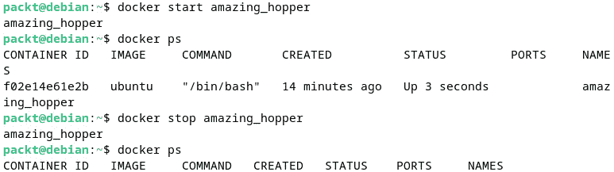

# 第十二章：使用 Docker 管理容器

在本章中，你将学习创建和管理容器的最知名工具之一——**Docker**。本章的内容将为你准备 Linux 的未来，因为它是每种现代云技术的基础。如果你希望在不断变化的技术环境中保持更新，本章将是你旅程的关键起点。

本章我们将覆盖以下主要内容：

+   理解 Linux 容器

+   使用 Docker

+   使用 **Dockerfile**

+   使用 Docker 部署容器化应用程序

# 技术要求

本章没有特定的技术要求，只需在系统上安装一个正常工作的 Linux 系统。Ubuntu/Debian 和 Fedora/RHEL 都适合本章的练习。我们将使用 Debian GNU/Linux 12 作为大多数示例，但在合适的地方，我们会讨论 Fedora Linux 安装和使用的具体细节。

# 理解 Linux 容器

正如我们在上一章中演示的那样，虚拟化有两种主要类型：**虚拟机（VM）**-基础的和 **容器**-基础的。在上一章中，我们讨论了基于虚拟机的虚拟化，现在是时候解释容器是什么了。从基本的概念层面来看，容器与虚拟机类似。它们有相似的目的——提供一个隔离的环境来运行——但在许多方面，它们的不同之处让它们几乎无法被称为相似。让我们更详细地比较这两个概念。

## 容器与虚拟机的比较

如你所知，虚拟机（VM）模拟了机器的硬件，并将其作为多个机器来使用。而容器则不复制物理机器的硬件，它们并不模拟任何东西。

容器与操作系统内核共享基础操作系统，并共享特定应用程序运行所需的库和二进制文件。应用程序被包含在容器内，与系统的其他部分隔离开来。它们还与主机共享网络接口，以提供与虚拟机相似的连接性。

容器运行在 **容器引擎** 上。容器引擎提供操作系统级别的虚拟化，用于部署和测试应用程序，仅使用所需的库和依赖项。通过这种方式，容器确保应用程序能够在任何机器上运行，并提供开发者预期的相同行为。以下是容器和虚拟机的视觉对比：


图 12.1 – 容器与虚拟机的对比（总体示意图）

正如你所看到的，容器仅使用 **用户空间**，共享底层的操作系统架构。

从历史上看，容器化已经存在了一段时间。自 1982 年起，Unix 操作系统的 **chroot** 工具就被用于容器化。

在 Linux 上，一些最新和最常用的工具是 **Linux 容器**（**LXC**），其中 **LXD** 是其更新版和扩展版，推出于 2008 年，而 Docker 则于 2013 年发布。为什么是 LXC/LXD 命名法？因为 LXC 是容器领域中的“老大哥”，LXD 是其更新版和重新设计的版本。

在下一节中，我们将剖析底层容器技术。

## 了解底层容器技术

如前所述，LXC 是最早的容器形式之一，早在 12 年前就已推出。更新的容器形式，以及改变整个容器领域并引发 DevOps 热潮的容器（更多内容请参见 *第十四章*），被称为 Docker。容器不像虚拟机监控器那样抽象硬件层。它们使用特定的用户空间接口，利用内核的技术来隔离特定的资源。通过使用 Linux 容器，你可以在不使用不同内核的情况下复制一个默认的 Linux 系统，就像使用虚拟机一样。

当 LXC 首次出现时，它吸引人的地方在于它支持多种编程语言的 API，包括 Python 3、Go、Ruby 和 Haskell。因此，尽管 LXC 现在不再那么流行，但它仍然值得了解。Docker 已经接管了容器引擎的主导地位。我们在示例中不会使用 LXC/LXD，但我们仍会讨论它以确保向后兼容。截止到本书写作时，LXC 支持两个版本，版本 4.0 支持到 2025 年 6 月，版本 5.0 支持到 2027 年 6 月。

根据开发者的说法，LXC 使用特性来创建一个尽可能接近默认 Linux 安装的隔离环境。在它使用的内核技术中，我们可以提到最重要的技术——即 Linux 中任何容器的骨干：内核 **命名空间** 和 **cgroups**。除此之外，还有 chroot 和针对 AppArmor 和 SELinux 的安全配置文件。

现在让我们解释 Linux 容器所使用的这些基本特性。

### Linux 命名空间

什么是 **Linux 命名空间**？简而言之，命名空间是内核全局系统资源，负责容器提供的隔离。命名空间将全局系统资源包装在一个抽象层内。这个过程使得运行在命名空间中的应用进程误以为它正在使用的资源是属于它自己的。命名空间在内核内提供逻辑层级的隔离，同时也为正在运行的进程提供可见性。

为了更好地理解命名空间的工作原理，可以想象 Linux 系统中的任何用户以及他们如何查看不同的系统资源和进程。作为一个用户，你可以看到全局系统资源、正在运行的进程、其他用户和内核模块等。这样的透明度在将容器用作操作系统级虚拟化环境时可能是有害的。由于容器无法提供虚拟机的封装和仿真级别，容器引擎必须以某种方式克服这一点，内核的低级虚拟化机制以命名空间和 cgroups 的形式存在。

在 Linux 内核中有几种类型的命名空间，下面简要描述它们：

+   **挂载**：它们限制单个命名空间内可用文件系统挂载点的可见性，以便该命名空间中的进程可以看到文件系统列表；进程可以拥有自己的根文件系统和不同的私有或共享挂载。

+   **Unix 时间共享**（**UTS**）：它隔离系统的主机名和域名。

+   **进程间通信**（**IPC**）：这允许进程拥有自己的 IPC 共享内存、队列和信号量。

+   **进程标识**：这允许将**进程 ID**（**PIDs**）映射，其中 PID 为 1 的进程（进程树的根）可以分出一个新的树，具有自己的根进程；PID 命名空间中的进程只能看到同一 PID 命名空间中的进程。

+   **网络**：在网络协议层面的抽象；网络命名空间中的进程拥有独立的网络栈、私有网络接口、路由表、套接字和 iptables 规则。

+   **用户**：这允许映射 UID 和 GID，包括将 UID 为 0 的 root 视为非特权用户。

+   **cgroup**：cgroup 命名空间中的进程可以看到相对于命名空间根的文件系统路径。

可以使用 Linux 中的`lsns`命令查看命名空间。以下是该命令输出的摘录：


图 12.2 – 使用 lsns 查看可用的命名空间

在接下来的部分，我们将详细介绍 cgroups，它是容器的第二个主要构建模块。

### Linux cgroups

什么是 cgroups？它们的名字来源于**控制组**，是内核功能，用于限制和管理进程的资源分配。Cgroups 控制内存、CPU、I/O 和网络的使用。它们提供了一种机制，确定特定的任务集，限制进程可以使用的资源量。它们基于**层次结构**的概念。每个子组都会继承其父组的属性，并且一个系统中可以同时存在多个 cgroups 层次结构。

Cgroups 和命名空间的结合创造了容器所依赖的隔离。通过使用 cgroups 和命名空间，可以为每个容器分别分配和管理资源。与虚拟机相比，容器更轻量且以隔离实体的形式运行。

如前所述，使用的容器有两种类型，LXC 和 Docker。我们已经讨论过 LXC，接下来我们将介绍 Docker 是什么。

## 理解 Docker

Docker，类似于 LXC/LXD，基于多种技术，其中包括内核命名空间和 cgroups。Docker 是一个用于开发和部署应用程序的平台。Docker 平台为容器提供了安全运行的基础设施。Docker 容器是轻量级实体，直接在主机的内核上运行。该平台提供了创建和管理隔离的容器化应用程序的工具等功能。因此，容器是应用开发、测试和分发的基本单元。当应用程序准备好投入生产并适合部署时，可以将其作为容器或编排服务进行发布（我们将在*第十六章*中讨论编排，*使用 Kubernetes 部署应用程序*）。

在以下图示中，我们将展示 Docker 架构如何工作：


图 12.3 – Docker 架构

让我们解释一下前面的图示。Docker 使用 Linux 内核中提供的命名空间和 cgroups，并分为两个主要组件：

+   将`runc`和`containerd`移交给*Cloud Native Computing Foundation*，使得更多的组织能够参与其中。以下是展示 Docker 架构细节的图示，核心组件——Docker 引擎和容器运行时——在图中有详细展示：


图 12.4 – Docker 架构细节

+   **Docker 引擎**：该引擎分为**dockerd**守护进程、**API**接口和**命令行接口**（**CLI**）。Docker 引擎包含 API 接口和 dockerd 守护进程，而容器运行时有两个主要组件——用于命名空间和 cgroups 管理的**containerd**守护进程和**runc**。除了前述组件，Docker 还使用许多其他组件来运行和部署 Docker 容器。Docker 采用客户端-服务器架构，工作流程涉及一个**主机**（即服务器守护进程）、一个**客户端**和一个**注册中心**。主机包含镜像和容器（从注册中心下载），客户端提供管理容器所需的命令。

    这些组件的工作流程如下：

    +   dockerd 守护进程监听 API 请求以管理服务和对象（如镜像、容器、网络和卷）。

    +   客户端是用户通过 API 与守护进程交互的方式。

    +   镜像存储库用于存储镜像，Docker Hub 是一个公共的注册中心，任何人都可以自由使用。除此之外，还有可以使用的私有注册中心。

    以下是 Docker 工作流的图示，展示了客户端组件、API 和守护进程：


图 12.5 – Docker 工作流

Docker 对初学者来说可能看起来很难，甚至让人感到束手无策。所有这些相互配合的不同组件、各种新的类型以及特定的工作流程都非常复杂。你读完这一部分后就能理解 Docker 是如何工作的了吗？当然不能。学习 Docker 的过程才刚刚开始。拥有一个坚实的基础以构建你的 Docker 知识是至关重要的。这就是为什么在接下来的部分，我们将向你展示如何使用 Docker。

# 使用 Docker

本节的练习将使用安装在一台具有 2 个虚拟 CPU 和 2 GB 内存的虚拟机上的 Debian GNU/Linux 12。但在开始安装 Docker 之前，我们先详细了解一下 Docker 作为一个实体是如何运作的，以帮助我们确定选择哪个版本适合我们的使用场景。

## 选择哪个 Docker 版本？

为了确保业务的可行性，Docker 背后的公司（即 Docker 公司）提供了一系列围绕其主要产品 Docker 的产品。过去，它有两个不同的产品版本，分别是 Docker **Community Edition**（**CE**）和 Docker **Enterprise Edition**（**EE**）。在这两者中，只有 EE 版本负责 Docker 的收入。

最近，Docker 产品组合发展出了不同的产品和服务，如**Docker Personal**、**Docker Pro**、**Docker Team** 和 **Docker Business**。其中，只有 Docker Personal 可以免费使用；其他三个产品则是基于订阅的。Docker Personal 适合个人开发者、教育和开源社区使用，但有一些限制（可以在这里查看：[`www.docker.com/products/personal/`](https://www.docker.com/products/personal/)）。使用 Docker Personal 意味着需要拥有一个 Docker 用户账户，并且它包括适用于 Linux（以及所有其他主要平台）的 Docker Desktop 和服务器端的 Docker Engine。

在服务器端，Docker Engine 提供了 `.deb` 和 `.rpm` 包格式，适用于 Ubuntu、Debian、Fedora 和 CentOS。在我们的示例中，我们将使用 Docker Personal。在接下来的部分，我们将展示如何安装 Docker。

## 安装 Docker

根据你选择的 Linux 发行版版本，官方仓库中的包可能会过时。不过，你有两个选择：一个是使用我们 Linux 发行版自带的官方包，另一个是从 Docker 官方网站下载最新版本。

由于我们使用的是全新的系统，且没有之前安装 Docker，因此无需担心旧版本软件和新版本可能存在的不兼容问题。我们将使用 Docker 的 `apt` 仓库，这样可以确保我们的软件包版本始终是最新的。请记住，我们使用的是 Debian 主机。

安装 Docker 的过程如下：

1.  首先，使用以下命令添加 Docker 仓库所需的证书：

    ```
    sudo apt update -y && sudo apt install ca-certificates curl gnupg
    ```

1.  为了使用官方 Docker 仓库，您需要添加 Docker 的 GPG 密钥。为此，使用以下命令：

    ```
    sudo install -m 0755 -d /etc/apt/keyrings
    curl -fsSL https://download.docker.com/linux/debian/gpg | sudo gpg --dearmor -o /etc/apt/keyrings/docker.gpg
    sudo chmod a+r /etc/apt/keyrings/docker.gpg
    ```

1.  设置安装我们想要的 Docker 版本所需的仓库：

    ```
    echo "deb [arch=$(dpkg --print-architecture) signed-by=/etc/apt/keyrings/docker.gpg] https://download.docker.com/linux/debian $(. /etc/os-release && echo "$VERSION_CODENAME") stable" | sudo tee /etc/apt/sources.list.d/docker.list > /dev/null
    ```

1.  下一步是更新仓库列表。更新后，您应该看到官方 Docker 仓库。使用以下命令：

    ```
    sudo apt update -y
    ```

1.  安装 Docker 软件包。对于我们的情况，我们将使用以下命令安装可用的最新软件包：

    ```
    sudo apt install docker-ce docker-ce-cli containerd.io docker-buildx-plugin docker-compose-plugin
    ```

1.  要验证您是否从官方 Docker 仓库而非 Debian 仓库安装了软件包，请运行以下命令：

    ```
    apt-cache policy docker-ce
    ```

    如果输出显示源来自 [docker.com](http://docker.com) 网站，这意味着源仓库是官方的 Docker 仓库：


图 12.6 – 验证源仓库

1.  检查 Docker 守护进程的状态。它应该在安装完成后立即启动：

    ```
    docker is created. In order to be able to use Docker, your user should be added to the docker group. The existing groups in Linux are inside the /etc/group file. You can list the last lines (new groups are appended at the end of the file) to see the docker group as the last one created:

    ```

    tail /etc/group

    ```

    You can either add your existing user or create a new one. We will add our already existing user. Add the user with the following command:

    ```

    sudo usermod -aG docker ${USER}

    ```

    ```

1.  添加用户后，请注销并重新登录，然后使用以下命令检查您是否已被添加到新组中：

    ```
    groups
    ```

1.  您已完成 Docker 的安装。现在可以启用 Docker 守护进程，使其在系统启动时自动启动：

    ```
    sudo systemctl enable docker
    ```

安装 Docker 只是第一步。接下来让我们探索一下我们可以用它做什么。在接下来的部分，您将了解 Docker 中可用的命令。

## 使用一些 Docker 命令

使用 Docker 就是要使用它的命令行接口（CLI）。它有大量可用的子命令。如果您想查看所有命令，应该运行`docker --help`命令。显示的命令分为两大类：

+   第一组显示了管理命令

+   第二组显示了常规命令

本节中我们不会讨论所有命令，我们将只关注一些您入门 Docker 所需的命令。

在学习任何命令之前，我们先做一个测试，看看安装是否成功。我们将使用 `docker run` 命令检查是否能够访问 Docker Hub 并运行容器。我们的测试命令如下：

```
sudo docker run hello-world
```

此命令从 Docker Hub 下载一个镜像并将其作为容器运行。以下是输出的截图：


图 12.7 – 运行第一个 `docker run` 命令

上面的截图不言自明，这是 Docker 团队做得非常好的一个方面。它使用清晰易懂的语言解释了命令在后台执行的操作。通过运行 `docker run` 命令，你不仅了解了工作流，还能验证安装是否成功。同时，这也是你将经常使用的基本 Docker 命令之一。

现在，让我们更深入地挖掘，搜索 Docker Hub 上可用的其他镜像。我们来搜索一个可以用来运行容器的 Ubuntu 镜像。为了搜索该镜像，我们将使用 `docker` `search` 命令：

```
docker search ubuntu
```

该命令的输出应列出 Docker Hub 中所有可用的 Ubuntu 镜像：


图 12.8 – 搜索 Ubuntu 镜像

如你所见，输出有五列：

+   **NAME**：第一列显示镜像的名称

+   **DESCRIPTION**：第二列显示镜像的描述，即简短的文本信息，介绍特定镜像的内容

+   **STARS**：第三列显示该镜像的星级数（基于用户评价的流行程度）

+   **OFFICIAL**：第四列显示该镜像是否为公司支持的官方镜像

+   **AUTOMATED**：第五列显示该镜像是否包含自动化脚本

一旦找到你需要的镜像，可以使用 `docker pull` 命令将其下载到你的系统上。让我们从前面截图中显示的列表中下载第一个镜像，即 `ubuntu`。我们将使用以下命令：

```
docker pull ubuntu
```

使用此命令，`ubuntu` 镜像将被下载到你本地计算机上。现在，可以使用此镜像来运行容器。要列出已经在计算机上可用的镜像，可以运行 `docker` `images` 命令：


图 12.9 – 运行 docker images 命令

请注意 Ubuntu Docker 镜像的体积较小。你可能会想，为什么它这么小？这是因为 Docker 镜像仅包含运行所需的基础和最小软件包。这使得基于该镜像运行的容器在资源使用上非常高效。

本节中展示的几个命令是使用 Docker 所需的最基础命令。现在你已经知道如何下载镜像，让我们来看看如何管理 Docker 容器。

## 管理 Docker 容器

在本节中，我们将学习如何运行、列出、启动、停止和删除 Docker 容器，并且如何管理网络。

### 运行容器

我们将使用刚刚下载的 Ubuntu 镜像。为了运行它，我们将使用带有两个参数的 `docker run` 命令，`-i` 表示交互式输出，`-t` 表示启动伪 TTY，这将为我们提供交互式访问 shell：

```
docker run -it ubuntu
```

你会注意到命令提示符会发生变化。现在它会包含容器的 ID。默认情况下，用户是 root 用户。基本上，你现在处于一个 Ubuntu 镜像中，因此你可以像使用任何 Ubuntu 命令行一样使用它。你可以更新仓库，安装所需的应用程序，删除不必要的应用程序，等等。你对容器镜像所做的任何更改都会保留在容器内部。要退出容器，只需输入`exit`。现在，我们将向你展示如何列出容器，但在此之前，我们建议你不要关闭当前运行 Ubuntu 容器的终端。

### 列出容器

你可以在系统中打开一个新的终端，并使用`docker` `ps`命令检查当前活跃的 Docker 容器数量。

在命令的输出中，你将看到正在另一个终端中运行的容器的 ID。还会有关于容器内运行的命令和创建时间的详细信息。

`docker` `ps`命令有几个参数可以使用：

+   如果你想查看所有活动和非活动的容器，可以使用`docker ps -a`命令。

+   如果你想查看最近创建的容器，可以使用`docker ps -l`命令。

以下是三种变体的`docker` `ps`命令的输出：


图 12.10 – 使用 docker ps 命令列出容器

在输出中，你还会看到容器的名称，如`amazing_hopper`或`recursing_murdock`。这些是守护进程自动分配给容器的随机名称。现在，我们将学习如何启动、停止和删除正在运行的容器。

### 启动、停止和删除运行中的容器

在管理容器时（例如启动和停止容器），你可以通过容器的 ID 或 Docker 分配的名称来引用它们。现在，让我们展示如何启动、停止和删除容器。

要启动 Docker 容器，使用`docker start`命令，然后输入容器的名称或 ID。以下是一个例子：

```
docker start amazing_hopper
```

要停止容器，使用`docker stop`命令，然后输入容器的名称或 ID。以下是一个例子：

```
docker stop amazing_hopper
```

在我们的案例中，名为`amazing_hopper`的 Ubuntu 容器已经在运行，因此`start`命令不会做任何事情。但`stop`命令会停止容器。停止后，如果你运行`docker ps`命令，容器列表中将不再显示任何容器。

让我们来看看这两个命令的输出：



图 12.11 – 启动和停止容器

要删除一个容器，可以使用`docker rm`命令。例如，如果我们想删除初始的`hello-world`容器（在我们的案例中也叫做`recursing_murdock`），我们将使用以下命令：

```
docker rm recursing_murdock
```

一旦删除容器，所有未保存（提交）的更改将会丢失。让我们向你展示如何将容器中所做的更改提交到 Docker 镜像。这意味着你将保存容器的特定状态为新的 Docker 镜像。

重要提示

请注意，删除容器不会删除从 Docker Hub 下载的现有镜像。

假设你想在 Ubuntu 上开发、测试和部署一个 Python 应用程序。Ubuntu 的默认 Docker 镜像没有安装 Python。

接下来，我们将向你展示如何排查 Docker 网络问题以及如何提交新镜像。

### Docker 网络与提交新镜像

本节练习的场景是，你希望通过安装你应用程序所需的 Python 包来修改现有的 Ubuntu 镜像。为此，我们按以下步骤操作：

1.  首先，我们启动容器并检查是否安装了 Python：


图 12.12 – 在容器内检查 Python

1.  我们检查了 Python 2 和 Python 3，但镜像中都没有安装任何版本。由于我们想使用最新版本的编程语言，我们将使用以下命令来安装 Python 3 支持（以 root 身份运行）：

    ```
    apt install python3
    ```

    这样做，你将第一次接触 Docker 网络，因为容器需要连接到官方 Ubuntu 软件源，以便下载和安装你所需要的包。对你来说，也可能出现与我们类似的情况：当尝试安装 Python 时，你会遇到如下截图中的错误：


图 12.13 – 尝试安装 Python 时的错误

这个错误显示包名为 `python3` 的软件包无法找到，这意味着我们的容器无法访问到软件源。一个快速的想法是可能 Docker 的网络出现了问题。为了解决这个问题，我们有一个有用的命令叫做 `docker network`。它用于管理 Docker 容器的网络连接。在我们的例子中，错误消息的原因可能是容器与网络之间缺少连接。在这种情况下，我们可以首先使用 `docker network` 的 `ls` 命令进行排查：

```
docker network ls
```

此命令将显示 Docker 正在使用的所有活动网络。在我们的例子中，当运行前述命令时，我们可以看到 Docker 有三个可用的网络，每个网络都有一个网络 ID 和分配给它的名称：


图 12.14 – 显示可用的网络

重要提示

本例中描述的问题可能不会出现在你的情况中。然而，这是一个很好的练习，可以向你展示如何在实际操作中使用 `docker network` 命令。

1.  在开始解决问题之前，让我们再一次查看正在运行的容器以及它们的名称。由于我们重新启动了新的容器，它应该有另一个 ID 和名称。我们将使用以下命令：

    ```
    docker ps command) to the bridge network. This will be done with the following command:

    ```

    docker network connect bridge [container_name]

    ```

    ```

1.  运行该命令不会显示任何输出，但我们将通过运行该命令来更新容器内的仓库，以验证它是否有效：

    ```
    apt update -y
    ```

    命令的输出显示，仓库可以从我们的容器访问，这意味着我们现在可以安装 Python。以下截图显示了输出的摘录：


图 12.15 – 网络连接正常工作的证明

通过将容器连接到网络，它将能够与同一网络上的其他容器进行通信。

1.  现在，在进一步进行 Python 安装之前，我们想向您展示一个命令，您可以使用它在启动容器时自动将容器连接到网络：

    ```
    bridge) and the container’s name. We used the -i option for interactive output, the -t option for opening a pseudo TTY, and the -d option for detaching the container and running in the background.
    ```

1.  现在，让我们继续进行 Python 的初步安装。我们可以再次运行以下命令：

    ```
    apt install python3
    ```

    这次，命令不会再出现任何错误，它将继续进行安装。以下是命令输出的摘录：


图 12.16 – 在 Docker 容器内安装 Python 包

1.  现在，安装了 Python 3 并对容器内使用的镜像进行了必要的修改后，我们可以将容器的实例保存为一个新的 Docker 镜像。为此，我们将使用以下命令：

    ```
    -m option to add a comment that details our commit process and the -a option to specify the account user and the ID of the base image we used, in our case, the ID of the running container. The following screenshot shows a series of commands to help you to understand the process better:
    ```


图 12.17 – 本地提交的新图像

如前面的截图所示，我们首先使用 `docker ps` 命令查看正在运行的容器的 ID，然后使用 `docker commit` 命令（配合前述选项）将新镜像保存在本地。请注意，我们刚保存的镜像大小有所增加。安装 Python 3 使得最初的 Ubuntu 镜像大小增加了一倍多。最后使用的命令是 `docker images`，查看现有镜像，包括我们刚创建的镜像（`ubuntu-python3`）。

到现在为止，您已经学会了如何使用非常基本的 Docker 命令来打开、运行和保存容器。在下一节中，我们将向您介绍 Dockerfile 及构建容器镜像的过程。

# 使用 Dockerfile

在开始使用 Dockerfile 之前，让我们看看什么是 Dockerfile。它是一个文本文件，其中包含用户为 Docker 执行的指令，并遵循一些基本结构，如下所示：

```
INSTRUCTION arguments
```

Dockerfile 主要用于创建新的容器镜像。Docker 会根据用户在文件中提供的信息自动构建镜像。Dockerfile 中有一些定义关键字，这些关键字被称为指令，如下所示：

+   `FROM`：此指令必须是 Dockerfile 中的第一个指令，因为它告诉 Docker 你基于哪个镜像来构建。

+   `LABEL`：此指令添加更多信息，如描述或其他能够帮助描述你创建的新镜像的内容；此类指令的使用应加以限制。

+   `RUN`：这是与镜像进行直接交互的指令，编写在镜像内部运行的命令或脚本的位置。

+   `ADD`：此指令用于将文件传输到镜像内部；它将文件或目录复制到镜像的文件系统中。

+   `COPY`：此指令类似于 `ADD`，也用于将文件或目录从源位置复制到镜像的文件系统中。

+   `CMD`：此指令在 Dockerfile 中只能出现一次，因为它为执行镜像时提供默认设置。

+   `USER`：此指令用于设置在执行命令时所使用的用户名；它可以在 `RUN` 或 `CMD` 指令中使用。

+   `WORKDIR`：此指令将为 Dockerfile 中的其他指令（如`RUN`、`CMD`、`COPY`、`ADD` 或 `ENTRYPOINT`）设置默认工作目录。

+   `ENTRYPOINT`：此指令用于配置作为可执行文件运行的容器。

这里列出的指令只是 Dockerfile 中通常使用的指令，并不代表所有可用的指令。你可以访问 [`docs.docker.com/engine/reference/builder/`](https://docs.docker.com/engine/reference/builder/) 获取所有可用 Dockerfile 指令的完整列表。在下一节中，我们将展示如何使用 Dockerfile 构建容器镜像。

## 从 Dockerfile 构建容器镜像

在本节中，我们将创建一个用于构建新 Docker 容器镜像的 Dockerfile。让我们展示一下构建此练习的场景。与 *Docker 网络和提交新镜像* 部分中的练习类似，我们将为 Python 编程环境准备一个镜像。为了创建新的 Docker 镜像，我们首先需要创建 Dockerfile。以下是操作步骤：

1.  使用以下命令在主目录内创建一个新目录：

    ```
    mkdir ~/my_docker_images && cd ~/my_docker_images
    ```

1.  在新目录内创建一个新文件：

    ```
    docker search debian command, the second image name on the output list will be the official Debian Linux image, called debian. We will use that. The contents of the Dockerfile are shown in the following screenshot:
    ```


图 12.18 – 创建 Dockerfile

1.  现在 Dockerfile 已创建，我们将运行 `docker build` 命令来创建新的 Docker 镜像。我们使用的命令如下：

    ```
    -f option to specify the Dockerfile name and the -t option to specify the name of the image we want to create, in our case pydeb. In the next screenshot, you will see the output of the docker build command, showing all the steps needed to build the image, as specified in the Dockerfile. The build was successful:
    ```


图 12.19 – 从 Dockerfile 构建新自定义镜像

我们可以通过使用 `docker images` 命令验证镜像是否已创建。正如前面的截图所示，新的 `pydeb` 镜像已成功创建。

1.  我们可以使用新的镜像并通过以下命令创建一个新的容器：

    ```
    pydeb images we just created.
    ```

1.  要验证容器是否在运行，打开一个新的终端窗口并运行 `docker ps` 命令，如下所示：


图 12.20 – 基于我们自定义镜像的新容器

到现在为止，你已经对 Docker 有了足够的了解，足以在生产环境中自如地使用它。在接下来的章节中，我们将向你展示如何使用 Docker 部署一个非常基础的应用程序。我们将它做得非常简单，部署的应用将是一个基础的静态展示网站。

# 使用 Docker 部署容器化应用程序

到目前为止，我们已经向你展示了如何使用 Docker 以及如何管理容器。Docker 的功能远不止这些，但这些足以让你入门，并激发你进一步学习的兴趣。Docker 对开发者来说是一个极好的工具，因为它提供了一种简化的方式来部署应用程序，省去了复制开发环境的必要。在接下来的章节中，我们将展示如何使用 Docker 部署一个简单的网站。

## 使用 Docker 部署网站

要使用 Docker 部署网站，请按照以下步骤操作：

1.  我们将使用一个从互联网上随机下载的免费网页模板（下载链接是 [`www.free-css.com/free-css-templates/page262/focus)`](https://www.free-css.com/free-css-templates/page262/focus)）。我们将从网站复制下载位置，并使用 `wget` 工具将文件下载到我们的主目录中：

    ```
    unzip command:

    ```

    将 docker_webapp 放入前一章节中创建的 ~/my_docker_images 目录中，并将提取的文件移动到其中。因此，在我们的案例中，新的位置将是：

    ```
    webapp_dockerfile inside our present working directory. The contents of the Dockerfile are as follows:
    ```

    ```

    ```


图 12.21 – 新 Dockerfile 的内容

文件很简单，只有两行：

+   第一行，使用 `FROM` 关键字，指定了我们将使用的基础镜像，它将是 Docker Hub 上提供的官方 NGINX 镜像。正如你将在 *第十三章* 中看到的那样，NGINX 是一种广泛使用的网页服务器类型。

+   第二行，使用 `COPY` 关键字，指定了当前工作目录中的内容将被复制到新容器中的位置。

以下操作使用 `docker` `build` 命令构建 Docker 镜像：

```
docker build ~/my_docker_images/docker_webapp/focus -f webapp_dockerfile -t webapp
```

1.  新的镜像已创建，因此我们现在可以使用 `docker images` 命令检查它。在我们的情况下，输出如下：


图 12.22 – 新的 webapp Docker 镜像已创建

1.  如输出所示，新的镜像`webapp`已被创建，我们可以使用它启动一个新的容器。由于我们需要从外部访问该容器，因此我们需要打开特定的端口，这可以通过在`docker run`命令中使用`-p`参数来实现。我们可以指定单个端口或端口范围。在指定端口时，我们将同时为容器和主机指定端口。我们将使用`-d`参数来分离容器并在后台运行它。命令如下：

    ```
    docker run -it -d -p 8080:80 webapp
    ```

    输出如下：


图 12.23 – `docker run`命令的输出

我们将主机端口`8080`暴露到容器的端口`80`。我们本可以使用`80`端口，但在主机上，这个端口可能被其他服务占用。

1.  现在，你可以通过访问网页浏览器并在地址栏中输入本地 IP 地址和端口`8080`来访问新的容器化应用。由于我们使用的是虚拟机而不是主机，我们将指向虚拟机的 IP 地址，在我们的案例中是`192.168.122.48`，后面跟着`8080`端口。在下一个截图中，你将看到我们通过 Docker 部署的网站：


图 12.24 – 在我们的网页浏览器中运行 Web 应用

如你在前面的图片中看到的，网站可以通过 localhost 访问。要在虚拟私人服务器上部署网站，请访问*第十三章*。

# 摘要

在本章中，我们强调了容器化的重要性。我们向你展示了容器是什么，它们如何工作，以及它们为什么如此重要。容器是现代 DevOps 革命的基础，而你现在已经准备好使用它们了。我们还向你介绍了 Docker 及其基本命令，以便你能高效地使用它。现在，你已经准备好开始云计算之旅。虚拟化和容器技术是云计算和服务器技术的核心。

在下一章中，我们将向你展示如何安装和配置不同的基于 Linux 的服务器，如 Web 服务器、DNS 服务器、DHCP 服务器和邮件服务器。

# 问题

下面是一个简短的小测验，涵盖了本章中讨论的一些基本概念：

1.  容器和虚拟机之间的主要区别是什么？

    **提示**：重新查看*图 12.1*。

1.  容器技术是如何工作的？

1.  Docker 架构的两个主要组件是什么？

1.  哪个 Docker 命令显示正在运行的容器？

1.  哪个命令用于容器网络管理？

    `docker network`命令的帮助。

# 进一步阅读

有关本章所涉及主题的更多信息，你可以参考以下 Packt 出版的书籍：

+   *Docker 快速入门指南*，Earl Waud

+   *深入掌握 Docker（第四版）*，Russ McKendrick

+   *使用 LXC 进行容器化*，Konstantin Ivanov

+   *开发者的 Docker Compose 必备指南*，Emmanouil Gkatziouras
