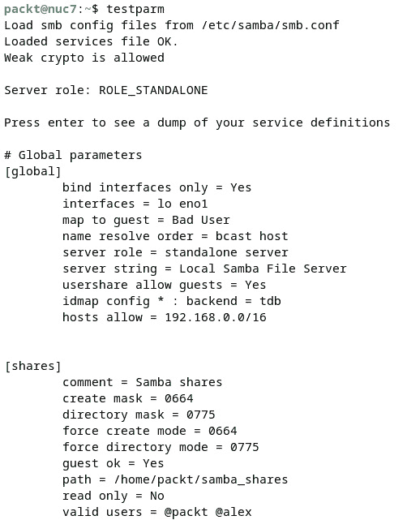

# 第十三章：配置 Linux 服务器

在本章中，你将学习如何设置不同类型的 Linux 服务器。这将包括**域名系统**（**DNS**）服务器、**动态主机配置协议**（**DHCP**）服务器、**Samba** 或 **服务器消息块**/**通用互联网文件系统**（**SMB**/**CIFS**）文件服务器，以及 **网络文件系统**（**NFS**）服务器。这些服务器在某种程度上都为万维网的骨干提供支持。虽然我们在这里不讨论，但你应当知道，你的计算机显示准确时间的原因是因为有一个良好实现的 **网络时间协议**（**NTP**）服务器。你能够进行在线购物和与朋友、同事之间的文件传输，得益于高效的 DHCP、Web 和文件服务器。配置这些为服务器提供动力的各种 Linux 服务，是任何 Linux 系统管理员的知识基础。在本书的本版本中，我们只会涵盖其中的一些 Linux 服务器，这些是我们认为当前最重要的主要 Linux 服务器。如需进一步了解，请参考本章末尾的*进一步阅读*部分。

本章将涵盖以下主要内容：

+   Linux 服务介绍

+   设置 SSH 服务器

+   设置 DNS 服务器

+   设置 DHCP 服务器

+   设置 NFS 服务器

+   设置 Samba 文件服务器

# 技术要求

需要具备基本的网络知识和 Linux 命令知识。你需要访问多个正常工作的系统，最好是本地系统或云端系统。如果这不可能，你也可以在本地使用虚拟机。此外，拥有一个可以使用的域名会很有帮助。本章的练习和示例将使用 Ubuntu Server 22.04.2 LTS 版本。但无论是 Fedora、RHEL、openSUSE 还是 Debian 等其他主要 Linux 发行版，都同样适用于本章所涉及的任务。

# 介绍 Linux 服务

你到目前为止所学的内容，能够轻松应用到任何运行 Linux 的工作站或台式机/笔记本上。我们已经深入探讨了一些高级网络主题，旨在帮助你顺利学习，成为一名资深的 Linux 系统管理员。接下来，我们将进入*服务器*领域，这是通向*云计算*的自然路径，后者将在本书的最后四章中详细讨论。

**Linux 服务器**与 Linux 工作站相比，是一个通过网络提供内容的系统。在此过程中，服务器为访问它的不同客户端提供硬件和软件资源。例如，每次你在浏览器中输入一个网站地址时，都会访问到一个服务器。那种类型的服务器是 **Web 服务器**。当你在工作场所通过网络打印时，你访问的是 **打印服务器**，而当你查看电子邮件时，你访问的是 **邮件服务器**。这些都是专门的系统，运行特定的软件（有时称为服务），为你这个客户端提供你所请求的数据。通常，服务器是非常强大的系统，拥有大量可供客户端使用的资源。

相比之下，**工作站**（这是另一种强大的硬件）通常用于个人工作，而不是用于网络上的客户端访问。工作站用于高强度工作，类似于任何普通的桌面或笔记本系统。考虑到到目前为止我们所揭示的一切，本章及后续章节的内容最适合服务器使用，但并不限于此。

你可能已经听说过设置不同的 Linux 服务器——比如 Web 服务器、文件服务器或邮件服务器——并且可能会想知道它们为什么会被这样称呼。它们并不代表实际的硬件服务器，而是基本上在 Linux 上运行的服务。那么，什么是 Linux 服务呢？这些是运行在后台的程序。在 Linux 世界中，这些服务被称为 `init` 进程，在我们讨论了进程、守护进程和信号，并且讲解了如何在 Linux 上管理它们时，这些内容出现在*第五章*《处理进程、守护进程和信号》中。所有进程的“母进程”是 `init` 进程，它是 Linux 启动时最先运行的进程之一。目前，Ubuntu（以及 CentOS、Fedora、openSUSE 等）的最新版本使用 `systemd` 作为默认的 `init` 进程。

我们将通过使用一些基本命令来刷新你对 Linux 上服务操作的记忆。如果你想了解更多信息，请参考*第五章*《处理进程、守护进程和信号》。

我们首先提醒你使用的命令是 `ps` 命令。我们将使用它来显示正在运行的 `init` 进程，如下所示：

```
ps -ef | less
```

我们在 Ubuntu 22.04.2 系统上的输出如以下截图所示：


图 13.1 – 使用 ps 命令显示 init 进程

通过使用 `-e` 标志，我们可以生成关于所有进程的信息，排除与内核相关的进程，而 `-f` 标志用于生成完整的进程列表。

在显示的进程列表中，第一个进程是 `init` 进程或 `systemd`。有时，在较旧的操作系统（如 Ubuntu 20.04 或 18.04）中，它会使用 `init` 名称以兼容旧版，但为了确保它确实是 `systemd`，你可以查看 `init` 的手册页以获取更多信息。当你在命令行输入 `man init` 时，显示的手册页是关于 `systemd` 的。作为所有服务的父进程，`systemd` 会并行启动所有运行中的进程，从而提高启动过程和服务响应的效率。要查看这些进程的效率，你可以运行 `systemd-analyze` 命令。

我们经常使用的一个命令，也是你应该已经知道的命令，是 `systemctl` 命令，它是用于在 Linux 上管理 `systemd` 服务（或守护进程）的主要命令行工具。

正如你所知道的，`systemctl` 调用的是 `systemd`。这些单元有多种类型，如服务、挂载、套接字等。要查看这些单元按启动所需时间的排序，可以使用 `systemd-analyze blame` 命令，如下图所示：


图 13.2 – systemd-analyze blame 命令

输出显示了不同类型的单元，如 *service*、*mount* 和 *device*。前面的截图仅是正在运行的单元的一部分。要了解更多关于 `systemctl` 命令的信息，可以随时查阅手册页，或者回到*第五章*刷新记忆。

这段简短的 Linux 服务介绍仅仅是*第五章*中相关部分的复习，足以帮助你开始着手配置和设置特定的 Linux 服务。在接下来的章节中，我们将向你展示如何管理 Linux 上一些最重要的服务，如 **SSH**、**DNS**、**DHCP**、**NTP**、**Samba**、**NFS**、**web**、**文件传输协议**（**FTP**）和 **打印服务**。现在，是时候卷起袖子，自己动手配置这些服务了。首先，我们将向你展示如何在 Ubuntu Linux 上设置 SSH 服务器。

# 设置 SSH

我们将在运行 Ubuntu Server 22.04.2 LTS 作为主操作系统的计算机上配置 SSH。在整本书中，我们多次使用 SSH 连接，并且在我们处理 cloud-init 时，在*第十一章*《与虚拟机的工作》一节中展示了如何创建 SSH 密钥对。这次，我们将向您展示如何安装**OpenSSH**，如何启用 SSH，以及如何修改其一些默认配置。

## 在 Ubuntu 上安装和配置 OpenSSH

为了使用 SSH，首先我们需要安装 `openssh` 包。在 Ubuntu 上，可以使用以下命令完成此操作：

```
sudo apt install openssh-server
```

该命令很可能已经安装在你的系统上。如果是这样，你可以跳过这一步，直接进入配置文件部分。

安装完成后，我们可以使用以下命令启动并启用`openssh`服务：

```
sudo systemctl enable ssh && sudo systemctl start ssh
```

对于 openSSH，我们可以操作的配置文件位于`/etc/ssh/sshd_config`。默认情况下，这个文件已经包含了很多信息，我们需要做的就是用文本编辑器打开它并开始修改可用的选项。根据我们要实现的目标，SSH 的基本最小配置包括以下内容：

+   修改远程根用户登录选项；这可以通过修改以下代码所在的行并相应设置选项来完成：

    ```
    PermitRootLogin no
    ```

    在我们的案例中，我们将默认的`prohibit-password`选项修改为`no`，以使得根用户无法通过 SSH 连接。

+   禁用 SSH 密码认证。可以通过将以下行更改为`no`来完成：

    ```
    PasswordAuthentication no
    PermitEmptyPasswords no
    ```

    只有在你将密钥对复制到远程机器并确保可以使用它之后才执行此操作。否则，你将无法访问你的服务器。

+   要允许公钥认证，你需要取消注释以下行：

    ```
    PubkeyAuthentication yes
    ```

+   我们将快速展示在*第十一章*中使用的命令，以启用公钥认证，作为提醒：

    ```
    ssh-keygen
    user, use the username from the remote server, and instead of host_IP, use the IP address of the remote server. Also, ssh-keygen can be used with several options, such as -b to specify the number of bits and -t to specify the algorithm type. After this, you can connect with the ssh user@IP command, which in our case is the following:

    ```

    ssh packt@192.168.0.113

    ```

    ```

这里展示的配置选项是开始使用 SSH 时的基本最小配置，适用于远程系统或虚拟机。但是，OpenSSH 是一个功能非常强大的工具，提供了很多你可以探索的选项。以下是两个可能对你有所帮助的链接：[`ubuntu.com/server/docs/service-openssh`](https://ubuntu.com/server/docs/service-openssh)和[`www.openssh.com/`](https://www.openssh.com/)manual.html。在接下来的部分中，我们将展示如何设置 DNS 服务器。

# 设置 DNS 服务器

最广泛使用的 DNS 服务之一是**伯克利互联网域名系统 9**（**BIND 9**）。你可以访问其官方网站：[`www.isc.org/bind/`](https://www.isc.org/bind/)。在继续之前，让我们强调系统配置和目标。对于本节内容，我们将使用一台运行 Ubuntu Server 22.04.2 LTS 的计算机。在这台系统上，我们将创建两种类型的服务器，分别是**缓存名称服务器**和**主名称服务器**，你可以在本地网络上使用它们来管理主机名和私有 IP 地址。

重要提示

DNS 服务器有不同的类型，比如 **权威**、**缓存** 或 **转发** 类型；这些也称为功能类型。在这些类型中，缓存 DNS 服务器是始终响应客户端递归请求的服务器。此外，还有 **关系服务器类型**，如主 DNS 服务器和从 DNS 服务器。这些是权威类型，它们几乎相同，唯一的区别是主服务器和从服务器获取区域信息的位置不同。有关 DNS 的更多信息，你可以参考以下链接：[`www.digitalocean.com/community/tutorials/a-comparison-of-dns-server-types-how-to-choose-the-right-dns-configuration`](https://www.digitalocean.com/community/tutorials/a-comparison-of-dns-server-types-how-to-choose-the-right-dns-configuration) 和 [`www.digitalocean.com/community/tutorials/an-introduction-to-dns-terminology-components-and-concepts`](https://www.digitalocean.com/community/tutorials/an-introduction-to-dns-terminology-components-and-concepts)。

还有其他方法可以实现这一点，但为了向你展示 DNS 设置的基本原理，这个配置已经足够。如果你需要一个辅助服务器，你需要另一个备用系统，或者如果你使用 **虚拟私人服务器**（**VPS**），它们必须位于同一数据中心，并使用相同的私人网络。然而，在我们的案例中，我们将使用一个本地系统，在我们的小型私人网络中。

首先，我们将通过以下命令在 Ubuntu 中安装 `bind9` 包：

```
sudo apt install bind9 bind9utils bind9-doc
```

上述命令将安装运行 BIND9 所需的所有包。

一旦包安装完成，你可以测试它们以确认 BIND 是否按预期工作。为此，我们将使用 `nslookup` 命令，如下图所示，使用本地地址（或 *环回* 地址）：


图 13.3 – 使用 nslookup 检查 BIND 是否工作

现在你可以开始设置服务，因为你可以看到它正在工作。首先，我们将配置一个缓存 DNS 服务。但在开始之前，我们建议你备份以下配置文件：`/etc/bind/named.conf`、`/etc/bind/named.conf.options`、`/etc/hosts` 和 `/etc/resolv.conf`。让我们来看看如何创建一个缓存服务器。

## 缓存 DNS 服务

BIND9 的默认行为是作为一个缓存服务器。这意味着设置它非常简单。我们只需稍微调整配置文件，以便它按照我们的需求工作：

1.  在确认已安装的包能正常工作后，你还可以使用以下命令配置防火墙，以允许 BIND9 通过：

    ```
    /etc/bind/named.conf.options file to add or delete different options. We will do that by opening it with the text editor. Inside the file, by default, are a few settings that have been set up, and a lot of commented lines with details on how to use the file. The // double slashes indicate that the respective lines are commented out. All the modifications will be done inside the options directive, between curly brackets, as it is the only existing directive by default.The first thing to do, as we will only use **IP version 4** (**IPv4**), is to comment out the following line by adding two slashes:

    ```

    // listen-on-v6 { any; };

    ```

    ```

1.  你需要在`forwarders`指令中添加一组 IP 地址。这一行告诉服务器在哪里查找以找到没有被本地缓存的地址。为了简化操作，我们将添加 Google 公共 DNS 服务器，但你也可以自由地将你的`forwarders`指令写成如下形式：

    ```
    forwarders {
          8.8.8.8;
          8.8.4.4;
            };
    ```

1.  你还可以添加一条指令来定义`allow-query`范围。这一行告诉服务器哪些网络可以进行 DNS 查询。你可以添加本地网络地址。在我们的案例中，它将是以下内容：

    ```
    allow-query {
          localhost;
          192.168.0.0/24;
            };
    ```

1.  还有一条`listen-on`指令，你可以在其中指定 DNS 服务器将为哪些网络工作。这适用于 IPv4 地址，示例如下：

    ```
    listen-on {
            192.168.0.0/24;
            }
    ```

    在添加选项后，你添加的代码应如下面的截图所示：


图 13.4 – 添加新选项后的/etc/bind/named.conf.options 最终格式

1.  保存文件并退出编辑器。你可以使用`named-checkconf`命令检查 BIND9 配置。如果没有输出，说明文件的配置是正确的。重新启动 BIND9 服务，并可选择检查其状态。

1.  知道 BIND9 服务正常运行后，你可以通过任何其他网络上的计算机使用`nslookup`命令来测试该服务，如下所示：


图 13.5 – 测试 BIND9 实现

我们使用了带有主机 IP 地址的命令，如前面的截图所示。输出结果显示，我们的测试机器上的 DNS 服务运行正常。该测试是通过同一网络上的本地 ThinkPad 进行的。

现在你已经有了一个在私有网络上工作的缓存 DNS 服务器。在下一节中，我们将展示如何创建主 DNS 服务器。

## 创建主 DNS 服务器

为了配置主 DNS 服务器，我们需要一个它将服务的域名。在本节中，我们将使用`calcatinge.ro`域名（当你在自己的系统上尝试时，请使用你拥有的域名）。我们需要为 BIND9 配置创建新区域，并将我们创建的区域信息添加到`/etc/bind/named.conf.local`文件中。现在，我们将为`calcatinge.ro`域名创建一个新的区域。

重要提示

**DNS 区域**是什么？简短的回答是，它是与负责维护它的实体相关联的域名空间的一部分。区域还提供了一种更细致的管理不同组件的方法。有关 DNS 区域的更多信息，请参考以下链接：[`ns1.com/resources/dns-zones-explained`](https://ns1.com/resources/dns-zones-explained)。

在以下截图中，你可以看到我们配置文件的内容，随后是每一行的详细说明：


图 13.6 – /etc/bind/named.conf.local 文件中的我们域的新区域

现在，让我们解释一下区域指令的内容：

+   首先，我们需要添加将由区域服务的域名

+   区域的`type`设置为`master`，但还有其他类型可以使用，如`slave`、`forward`或`hint`

+   `file`表示将要创建的实际区域文件的路径

+   在`allow-transfer`列表中，设置了处理该区域的 DNS 服务器的 IP 地址

+   在`also-notify`列表中，列出了将被通知有关区域更改的服务器的 IP 地址

现在，让我们为我们选择的域创建一个新区域：

1.  以下截图显示了我们如何将`db.local`文件复制为另一个名称并将其用于新区域：


图 13.7 – 为我们的域创建区域文件

1.  下一步是创建区域文件，如关于`calcatinge.ro`的区域指令所示。详情如前述截图所示，位置为`/etc/bind/`。使用`db.local`作为模板创建文件后，您可以使用您喜欢的文本编辑器打开它，并添加有关服务器 IP 和域名的信息。在以下截图中，您可以看到我们机器上为`calcatinge.ro`创建的区域文件：


图 13.8 – 区域文件信息

1.  DNS 记录在文件的末尾引入。以下是文件内容的一些详细信息：

    +   表格有一个特定格式，包含有关主机名（第一列）、类别（第二列）、DNS 记录类型（第三列）和值（最后一列）的详细信息。

    +   对于主机名，我们输入了`@`，这意味着记录条目的名称引用了文件中的区域名称。

    +   类别是`IN`，表示该网络是互联网。

    +   DNS 记录类型有`A`、`NS`、`MX`、`CNAME`、`TXT`和`SOA`。`A`表示域名的 IP 地址；`NS`表示 DNS 服务器的 IP 地址；`MX`是邮件服务器的地址；`CNAME`是别名（规范名称）；`TXT`是自定义条目；`SOA`表示区域的权威名称服务器，包含管理员、序列号和刷新速率的详细信息。

    +   最后一列的值通常由 IP 地址或主机名组成。

1.  下一步是重启**远程名称守护进程控制**（**RNDC**），它是 BIND 中的一个控制工具，用于控制名称服务器。执行此操作的命令如下所示：

    ```
    sudo rndc reload
    ```

1.  现在，您可以检查主 DNS 服务器是否正常工作。尝试从网络上的另一台系统使用`nslookup`命令，命令如下：

    ```
    nslookup calcatinge.ro 192.168.0.113
    ```

    上述命令的输出将非常可能显示，具有指示的 IP 地址的系统上的本地 DNS 服务器有一个有效的区域文件。您的主要 DNS 服务器在本地网络上按预期工作。别忘了在命令中使用您的 IP。

创建一个辅助 DNS 服务器是个好主意，以防第一个服务器停止工作，这就是为什么我们将在接下来的部分展示如何设置第二个 DNS 服务器。

## 设置一个辅助 DNS 服务器

毫不奇怪，辅助 DNS 服务器应设置在与主服务器不同的硬件上，但在同一网络中。如果您在数据中心中进行此操作，可以使用与第一个服务器在同一网络中的 VPS。如果您打算在家庭私人网络中进行实验，确保有另一台系统可以使用。

我们将启动另一台也运行 Ubuntu Server 22.04.2 LTS 的 NUC 系统。我们需要知道它的 IP 地址，以便在配置中使用。我们的新系统的 IP 地址是`192.168.0.140`。这台第二台机器也需要安装和配置 BIND9。在设置辅助服务器之前，您需要先修改主 DNS 服务器的配置。

### 修改主服务器配置文件

要修改主 DNS 服务器的配置，并允许它将区域详情发送到辅助服务器，请按照以下步骤操作：

1.  您需要打开`/etc/bind/named.conf.local`配置文件，并在其中添加一些新行。我们将在`allow-transfer`和`also-notify`指令内添加第二台服务器的 IP 地址，如下图所示：


图 13.9 – 添加辅助 DNS 服务器的 IP 地址

1.  保存文件并重启 BIND9 服务。

1.  还需要打开`/etc/bind/named.conf.options`配置文件，并添加一个访问列表参数（`acl "trusted"`），列出网络上所有被接受的 IP 地址。在我们的例子中，主服务器的地址是`192.168.0.113`，而辅助服务器的地址是`192.168.0.140`。请将其添加到已存在的`options`指令之前。

1.  在`options`指令块内，注释下面，我们还添加以下指令：


图 13.10 – 在/etc/bind/named.conf.options 文件中添加新指令

1.  配置已完成，我们将使用`systemctl`命令重启 BIND9 服务，如下所示：

    ```
    sudo systemctl restart bind9.service
    ```

在继续之前，让我们了解一下所使用的指令。`recursion`指令具有布尔值（`yes` | `no`），定义是否允许服务器进行递归查询和缓存。默认值是`yes`，因此服务器将要求通过解决所有尝试来执行 DNS 查询递归。

重要提示

**递归** 也被称为 **递归查询**，在 DNS 中指的是一种解决名称解析的方法。递归模式表示计算机通过首先查询本地缓存数据和本地 DNS 服务器来查找 FQDN。请求是明确的，需要一个精确的答案，而提供该答案的责任在于 DNS 服务器。因此，计算机发起的查询，即 DNS 客户端向 DNS 服务器发起的查询，是一个递归查询。

`allow-recursion` 指令引用了一个匹配客户端地址的列表，在我们的案例中，这些地址通过 `listen-on` 指令指定服务器监听的 IP 地址。同时，我们还使用了 `allow-transfer` 指令，提供了允许传输区域信息的主机列表（在我们的案例中，没有主机）。有关配置选项的更多信息，请参考以下链接：[`bind9.readthedocs.io/en/latest/reference.html#`](https://bind9.readthedocs.io/en/latest/reference.html#)。

接下来，我们来学习如何配置辅助服务器。

### 设置辅助服务器

如前所述，在辅助服务器上，您还需要安装 BIND9。安装完成后，您需要按照以下步骤操作：

1.  进入 `/etc/bind/named.conf.options` 文件，在已经存在的 `options` 指令之前，添加以下行到 `acl` 指令中：


图 13.11 – 在辅助服务器上添加 acl 指令

1.  同时，在 `options` 指令内部添加以下行：


图 13.12 – 在选项内部添加新指令

1.  现在编辑 `/etc/bind/named.conf.local` 文件并添加所需的区域，但这次使用 `secondary` 类型，而不是在主 DNS 服务器上使用的 `master` 类型。

    以下是两个 `/etc/bind/named.conf.local` 文件的对比。左边是主 DNS 服务器的文件，右边是辅助 DNS 服务器的文件：


图 13.13 – 主服务器（左）和辅助服务器（右）的配置文件

1.  现在我们可以重新启动 BIND9 服务，并确保防火墙允许第二台服务器上的 DNS 连接，使用以下命令：

    ```
    sudo ufw allow Bind9 && sudo systemctl restart bind9
    ```

现在，您已经设置并启动了两台 DNS 服务器，一台是主服务器，另一台是辅助服务器。在接下来的章节中，我们将向您展示如何设置本地 DHCP 服务器。

# 设置 DHCP 服务器

DHCP 是一种网络服务，用于为网络中的主机分配 IP 地址。该服务由服务器启用，主机无需进行任何控制。最常见的是，DHCP 服务器为客户端提供 IP 地址和子网掩码、默认网关 IP 地址以及 DNS 服务器的 IP 地址。

要在 Ubuntu 上安装 DHCP 服务，请使用以下命令：

```
sudo apt install isc-dhcp-server
```

作为测试系统，我们将使用在上一节中安装了 DNS 服务的相同系统。安装完成后，我们将配置两个特定的文件。在像我们这样的 Ubuntu 系统中，默认配置将设置在`/etc/dhcp/dhcpd.conf`文件中，而网络接口的配置则会在`/etc/default/isc-dhcp-server`文件中进行：

1.  我们首先将向您展示如何设置一个基本的本地 DHCP 服务器。在这方面，我们将通过添加 IP 地址池来修改`/etc/dhcp/dhcpd.conf`文件。您可以取消注释文件中已存在的某个`subnet`指令，也可以添加一个新的，就像我们所做的那样。我们现有的子网是`192.168.0.0/24`，我们将为这个新的 DHCP 服务器添加一个新的子网，具体操作如以下截图所示（有关网络的基础知识，请参考*第七章*，*Linux 网络*）：


图 13.14 – 在 /etc/dhcp/dhcpd.conf 中定义一个新的子网

1.  在相同的`/etc/dhcp/dhcpd.conf`文件中，您可以取消注释那一行`authoritative;`。`authoritative` DHCP 子句确保服务器会自动解决网络上的任何无效 IP 地址，并为每个新注册的设备分配一个新的有效 IP 地址，而无需用户手动干预。

1.  一旦修改了选项，您必须在`/etc/default/isc-dhcp-server`文件中指定网络接口名称。这是为了让服务器知道使用哪个网络设备。为此，使用您喜欢的编辑器打开该文件并添加接口名称。如果您不记得接口名称，可以运行`ip addr show`命令并选择相应的接口。在我们的案例中，我们使用的系统既有以太网接口，也有无线接口，我们将选择以太网接口作为 DHCP 服务器的接口，即`enp0s25`。在`/etc/default/isc-dhcp-server`文件中，按以下方式添加接口：

    ```
    INTERFACESv4="enp0s25"
    ```

1.  然后，保存文件的更改并使用以下命令重新启动 DHCP 服务：

    ```
    sudo systemctl restart isc-dhcp-server.service
    ```

现在，您在所选系统上有一个正常工作的 DHCP 服务器。DHCP 服务器为您管理本地网络提供了一些优势，但有时您可能不需要创建一个新的，因为所有的网络路由器都提供了一个开箱即用的 DHCP 服务。

重要提示

为了避免冲突，您可能希望将新的 DHCP 服务器与本地网络路由器隔离开来。您的网络路由器已经有一个功能完整的 DHCP 服务器，它可能会与新的 DHCP 服务器发生冲突。在大多数情况下，`isc-dhcp-server.service`会给出一个错误，表示它无法连接到任何接口。

考虑到前面的说明，当我们通过以下命令检查 DHCP 服务是否正在运行时：

```
sudo systemctl status isc-dhcp-server.service
```

我们收到了一个错误，如以下截图所示：


图 13.15 – 运行 DHCP 服务时出错

一旦你将机器从本地网络中隔离出来，并将其用作唯一的 DHCP 服务器，服务将按预期运行。

在接下来的部分中，我们将向你展示如何在本地网络上设置 NFS 服务器。

# 设置 NFS 服务器

NFS 是一个分布式文件系统，用于通过网络共享文件。为了展示它是如何工作的，我们将在网络中的一台机器上设置 NFS 服务器。我们将使用 Ubuntu 22.04.2 LTS 作为 NFS 服务器的基础。有关 NFS 的更深入理论信息，请参考*第七章*，*与 Linux 的网络连接*。

NFS 文件系统类型在任何 Linux 和/或 Unix 环境中都得到支持，Windows 也支持 NFS，但有一些限制。对于主要使用 Windows 客户端环境的情况，我们建议改用 Samba/**通用互联网文件系统**（**CIFS**）协议。此外，对于那些关心隐私和安全的人，请记住，NFS 协议本身不加密，因此数据传输默认情况下不受保护。

## 安装并配置 NFS 服务器

在我们的网络中，我们将使用一台 Ubuntu 机器作为服务器，并展示如何从另一台 Linux 客户端访问文件。首先，让我们安装并配置服务器，具体步骤如下：

1.  我们将使用以下命令安装`nfs-kernel-server`软件包：

    ```
    systemctl command, and then we will check its status. The commands are the following:

    ```

    sudo systemctl start nfs-kernel-server.service

    sudo systemctl enable nfs-kernel-server.service

    为所有网络上的客户端设置`/home`目录，或者你也可以从一开始就创建一个专用的共享目录。你可以从根目录开始创建一个新目录，也可以在特定目录下创建共享目录，例如`/var`、`/mnt`或`/srv`—这完全取决于你。我们将使用以下命令在`/home`目录下创建一个新的目录`/home/export/shares`（如果你想按照这个命令执行，请确保已经进入`/home`目录）：

    ```
    777 as we will not use Lightweight Directory Access Protocol (LDAP) authentication on the following example:

    ```

    /etc/exports 文件。NFS 有三个配置文件（/etc/default/nfs-kernel-server、/etc/default/nfs-common 和/etc/exports），但我们只会更改其中一个。在下面的截图中，你将看到/etc/default 目录下的两个文件以及/etc/exports 配置文件的默认内容：

    ```

    ```

    ```

    ```


图 13.16 – /etc/default 目录中的配置文件以及/etc/exports 配置文件的内容

使用您喜欢的文本编辑器打开`/etc/exports`文件，并根据您的配置进行编辑。在文件中，我们将为每个共享目录添加一行。在此之前，您可能已经注意到文件中有两种指令：一种是针对 NFS 版本 2 和 3 的，另一种是针对版本 4 的。关于这些版本之间的差异，建议您参考以下文档：[`archive.fosdem.org/2018/schedule/event/nfs3_to_nfs4/attachments/slides/2702/export/events/attachments/nfs3_to_nfs4/slides/2702/FOSDEM_Presentation_Final_pdf.pdf`](https://archive.fosdem.org/2018/schedule/event/nfs3_to_nfs4/attachments/slides/2702/export/events/attachments/nfs3_to_nfs4/slides/2702/FOSDEM_Presentation_Final_pdf.pdf)。

1.  现在让我们开始编辑配置文件。我们将添加一行，包含目录、客户端的 IP 地址和配置选项。一般语法如下：

    ```
    /first/path/to/files  IP(options)[ IP(options) IP(options)]
    /second/path/to/files IP(options)[ IP(options) IP(options)]
    ```

    我们只共享一个目录，因此只添加了一行。如果您希望网络上的所有客户端都能访问共享，您可以添加子网类（例如，`192.168.0.0/24`）。或者，如果您只希望特定的客户端访问共享，您应该添加它们的 IP 地址。更多的客户端可以在同一行添加，IP 地址之间用空格分隔。您可以添加很多选项，完整的选项列表可以参考[`linux.die.net/man/5/exports`](https://linux.die.net/man/5/exports)或者使用`man exports`命令查看本地手册。在我们的文件中，我们添加了以下选项：

    +   `rw` 表示既可以读取也可以写入

    +   `sync` 强制将更改写入磁盘（不过这样会降低速度）

    +   `no_subtree_check` 用于防止子树检查，主要是检查文件在请求前是否仍然可用

    简而言之，这就是我们添加到文件中的那一行（请注意，这只是一行，其中`/home/export/shares`和 IP 地址之间有空格，而 IP 地址和括号之间没有空格）：

    ```
    /home/export/shares   192.168.0.0/24(rw,sync,no_subtree_check)
    ```

1.  保存并关闭文件后，使用以下命令重启服务：

    ```
    sudo systemctl restart nfs-kernel-server.service
    ```

1.  然后，使用以下命令应用配置：

    ```
    -a options export all directories without specifying a path.
    ```

1.  一旦服务重启并运行，您可以设置防火墙以允许 NFS 访问。为此，知道 NFS 默认使用`2049`端口是非常有用的。由于我们允许网络中的所有系统访问共享目录，我们将向防火墙添加以下新规则：

    ```
    sudo ufw allow nfs
    ```

1.  现在新防火墙规则已经添加完毕，我们可以运行以下命令来确保它按照我们的需求运行：

    ```
    sudo ufw status
    ```

1.  如果您的防火墙没有在运行，您可以使用以下命令来激活它：

    ```
    ufw status command is shown in the following screenshot:
    ```


图 13.17 – 显示允许 NFS 共享的新防火墙规则

在前面的截图中，你可以看到在使用 `sudo ufw allow nfs` 命令添加新规则后，端口 `2049` 被添加到了允许规则的列表中。

服务器的基本配置现在已经完成。为了访问文件，你还需要配置客户端。我们将在下一部分向你展示如何操作。

## 配置 NFS 客户端

作为客户端，我们将使用另一台系统，即运行 Debian GNU/Linux 12 Bookworm 的笔记本。首先，我们需要使用以下命令在客户端安装 NFS：

```
sudo apt install nfs-common
```

现在所需的软件包也已安装在客户端，我们可以在客户端上创建目录来挂载共享。我们将在客户端创建一个新目录，用于挂载来自服务器的共享。这个新目录将是 `/home/shares`。我们使用以下命令创建它：

```
sudo mkdir /home/shares
```

现在新目录已创建，我们可以从服务器挂载该位置：

```
sudo mount 192.168.0.113:/home/export/shares /home/shares
```

使用前面的命令，我们通过 `mount` 命令将服务器上的共享挂载到客户端。我们将服务器上的位置作为第一个参数，客户端上的位置作为第二个参数。我们还可以使用 `df -h` 命令检查一切是否顺利。新挂载的内容会在 `df` 命令的输出中最后显示。以下是一个截图，展示了创建、挂载并检查新共享目录所使用的命令：


图 13.18 – 在客户端上挂载新共享目录

到此为止，我们已经完成了 NFS 共享的设置。接下来，我们需要测试配置，确保它能够正常工作。

## 测试 NFS 设置

一旦服务器和客户端的设置完成，你可以测试一切是否如预期般工作。在我们的测试中，我们使用服务器上的 `packt` 用户创建了几个名为 `testing_files` 的文件，并且在客户端机器上的常规用户 `alexandru` 下创建了一个名为 `file` 的文件。以下是显示我们在 Debian 本地系统上的 `/home/shares` 目录内容的输出：


图 13.19 – 在本地客户端上测试 NFS

就这样，NFS 服务器和客户端都运行良好。你可以使用客户端上的**图形用户界面**（**GUI**）（如前面的截图所示），也可以使用**命令行界面**（**CLI**）访问 NFS 共享。

在下一部分，我们将展示如何配置一个可以通过网络访问的 Samba/CIFS 共享。

# 设置 Samba 文件服务器

Samba 服务器允许您通过网络共享文件，客户端可以使用不同的操作系统，例如 Windows、macOS 和 Linux。在本节中，我们将在 Ubuntu 22.04.2 LTS 上设置 Samba 服务器，并从网络上的不同操作系统访问共享。SMB/CIFS 协议是由微软开发的；有关更多详细信息，您可以访问他们的开发者页面[`docs.microsoft.com/en-us/windows/win32/fileio/microsoft-smb-protocol-and-cifs-protocol-overview`](https://docs.microsoft.com/en-us/windows/win32/fileio/microsoft-smb-protocol-and-cifs-protocol-overview)。关于 SMB/CIFS 协议的更多信息也可以在*第七章* *与 Linux 网络互联*中找到。在接下来的子章节中，我们将向您展示如何在本地网络上安装和配置它。

## 安装和配置 Samba

安装过程包含以下步骤：

1.  首先，我们将使用以下命令在系统上安装 Samba：

    ```
    sudo apt install samba
    ```

1.  安装 Samba 后，我们可以检查服务是否按预期运行。我们将执行以下命令来检查：

    ```
    /home directory using the mkdir command, as follows:

    ```

    /etc/samba/smb.conf。该配置文件有两个主要部分：一个是包含一般配置设置的[global]部分，另一个是配置共享行为的[shares]部分。一个安全的做法是在开始修改之前备份原始配置文件。我们将使用以下命令来执行此操作：

    ```
    smb.conf. Inside the configuration file, we will first create the [global] section with directives, as shown in the following screenshot:
    ```

    ```

    ```


图 13.20 – smb.conf 全局指令

让我们简要解释一下前面截图中显示的内容：

+   第一行设置了服务器名称，在我们的情况下是本地 Samba 文件服务器。

+   第二行设置了`workgroup`名称，在我们的情况下是 Windows 的默认名称`WORKGROUP`。

+   第三行确定不需要拥有 Samba 用户账户就能访问共享（将游客映射为`Bad User`）。

+   允许游客用户在第四行进行访问。

+   接着，我们设置 Samba 使用的接口，在我们的情况下将是以太网接口（`eno1`）和回环接口（`lo`）（使用`ip addr show`或`ip link`命令检查确切的接口名称）。

+   我们将设置`server role`和允许的主机（来自本地池）。

+   最后一行设置了主机名检查的顺序，使用广播（`bcast`）方法。

1.  现在我们将创建`[shares]`指令，并为共享添加必要的配置选项。我们将添加有关服务器上共享目录的详细信息、用户详细信息以及权限设置。请参见以下截图了解详细信息：


图 13.21 – 在 shares.conf 文件中添加信息

让我们简要解释一下此指令的内容：

+   我们首先为共享设置一个名称。

+   然后，我们设置本地共享目录的路径。

+   接下来，我们设置目录和文件的默认权限。

+   我们还设置了默认的掩码值。

+   最后，我们将共享设置为公共的、友好的游客用户并允许写入

1.  修改完成后，我们用以下命令重启服务：

    ```
    sudo systemctl restart smbd.service
    ```

1.  此外，我们通过以下命令调整防火墙规则，允许 Samba 访问：

    ```
    testparm command to test that the configuration has been done correctly, with no errors, as follows:
    ```



图 13.22 – 测试 Samba 配置

输出显示 `Loaded services file OK`，这意味着配置文件没有语法错误。

系统重启并配置好防火墙后，我们可以继续为可以访问共享的用户设置 Samba 密码。在接下来的部分，我们将创建新的 Samba 用户和组。

## 创建 Samba 用户

每个 Samba 服务器都需要有特定的用户可以访问共享的目录和文件。这些用户既需要是 Samba 用户，也需要是系统用户，因为这是用户能够进行身份验证并读取和写入系统文件的必要条件。假设你需要为你的家庭或小型企业组创建一个本地共享。

通过为使用 Samba 共享创建专用的本地用户，你不需要让它们充当实际用户，因为它们只需要能够访问共享。然而，本地 Samba 用户需要是本地系统用户。在我们的案例中，我们将使用本地的 `packt` 用户来为 Samba 创建新用户：

1.  我们使用以下命令将 `packt` 本地用户添加到 Samba：

    ```
    packt is our primary user, it is also the owner of the samba_shares directory created at the beginning of this section. We can change that with the following command:

    ```

    使用以下命令的 alex：

    ```
    sudo adduser alex
    ```

    ```

    ```

1.  然后我们用以下命令将其添加到 Samba：

    ```
    smb.conf file and add the users we would like to give permissions to Samba, such as packt and alex users. Let us open the /etc/samba/smb.conf file and add the following line inside the [samba shares] directive:

    ```

    valid users = @packt @alex

    ```

    ```

在测试新用户访问 Samba 之前，我们需要授予 `alex` 用户访问共享目录的权限。为此，我们按照以下步骤操作：

1.  我们通过以下命令在 Ubuntu 中添加 `acl` 软件包：

    ```
    setfacl command to set read, write, and execute permissions for the /home/packt/samba_shares directory. For this, we use the following command:

    ```

    sudo setfacl -R -m "u:alex:rwx" /home/packt/samba_shares

    ```

    ```

在接下来的部分，我们将展示如何从网络中的不同系统访问 Samba 共享。

## 访问 Samba 共享

在你的网络中，你可以从 Linux、macOS 或 Windows 访问共享文件。为了增加一些挑战——值得一个 Linux 大师的挑战！——我们将展示如何仅使用 CLI 在 Linux 中访问 Samba 共享。我们将让你自己探索如何通过 GUI 或 Windows/macOS 客户端访问它们。要通过 CLI 访问共享，请使用 `smbclient` 工具。

在 Linux 系统中，你需要先安装 Samba 客户端 `smbclient`。我们假设你使用的是 Ubuntu 或 Debian Linux 客户端，但其他 Linux 发行版的步骤也类似。在 Ubuntu/Debian 上，首先使用以下命令安装 Samba 客户端，但在此之前确保你的软件库已更新：

```
sudo apt install smbclient
```

如果你正在运行 Fedora/RHEL 客户端，请使用以下命令安装 Samba 客户端：

```
sudo dnf install samba-client
```

例如，让我们从本地机器之一访问 `packt` 用户的共享。记住，这些共享文件位于运行 Ubuntu 的本地服务器上。我们将使用服务器的本地 IP 地址，并运行以下代码：


图 13.23 – 从 Linux CLI 客户端访问共享文件

在上面的截图中，你可以看到 Samba 访问成功，用户 `packt` 成功访问了服务器上的 Samba 共享文件。我们使用了 `-U` 选项，后跟用户名，来指定我们正在连接的用户名。位置使用服务器的本地 IP 地址，后跟 Samba `samba shares` 名称。此外，如果我们想查看服务器上可用的 Samba 服务，可以使用 `-L` 选项与 `smbclient` 命令，命令如下：


图 13.24 – 列出 Samba 服务器上的可用服务

这里是我们关于配置 Linux 服务器的本章的结尾。展示的服务器被认为是任何 Linux 系统管理员需要了解的重要和相关服务。然而，由于篇幅限制，许多其他类型的 Linux 服务器没有覆盖。尽管如此，你可以在线找到大量资源。作为基础，你可以从 RHEL、Ubuntu 或 Debian 的官方文档开始，这些文档涵盖了大多数你需要了解的 Linux 服务器类型。一个有用的服务器类型是 Web 服务器，了解如何配置它将非常有用。随时探索任何其他你认为相关的资源，可能未包含在*进一步阅读*列表中。

# 总结

在本章中，我们介绍了为 Linux 配置最知名服务的安装和配置过程。了解如何配置本章中描述的所有服务器——从 DNS 到 DHCP、Apache 和打印服务器——是任何 Linux 管理员的基本要求。

通过本章的学习，你了解了如何为任何 Linux 服务器提供基本服务。你学习了如何使用 Apache 包设置和配置 Web 服务器；如何为小型办公室或家庭办公室提供网络打印服务；如何运行 FTP 服务器并通过 TCP 共享文件；如何使用 Samba/CIFS 协议与 Windows 客户端共享文件；如何使用 NFS 文件共享协议在 Unix 和 Linux 系统之间共享文件；如何设置 NTP 以显示准确时间；以及如何配置 DNS 和本地 DHCP 服务器。简而言之，你在本章中学到了很多内容，然而我们只是 Linux 服务器管理的皮毛。

在下一章中，我们将向你介绍云技术。

# 问题

现在你已经清楚地了解了如何管理 Linux 中一些最广泛使用的服务，以下是一些可以进一步促进你学习的练习：

1.  尝试使用 VPS 运行本章中详细描述的所有服务，而不是在本地网络上。

1.  尝试在 Ubuntu 上设置 LEMP 堆栈。

1.  使用 Fedora 或基于 RHEL 的发行版测试本章中描述的所有服务。

# 进一步阅读

有关本章所涵盖主题的更多信息，请参考以下链接：

+   官方 Ubuntu 文档：[`ubuntu.com/server/docs`](https://ubuntu.com/server/docs)

+   RHEL 官方文档：[`www.redhat.com/sysadmin/install-apache-web-server`](https://www.redhat.com/sysadmin/install-apache-web-server)

+   NGINX 官方文档：[`docs.nginx.com/nginx/admin-guide/installing-nginx/installing-nginx-open-source/`](https://docs.nginx.com/nginx/admin-guide/installing-nginx/installing-nginx-open-source/)

+   DigitalOcean 官方文档：[`www.digitalocean.com/community/tutorials/how-to-install-the-apache-web-server-on-ubuntu-22-04`](https://www.digitalocean.com/community/tutorials/how-to-install-the-apache-web-server-on-ubuntu-22-04)

# 第四部分：云计算管理

在第四部分，你将学习与云计算相关的高级概念。到本部分结束时，你将熟练掌握使用 Kubernetes 和 Ansible 等特定工具，并能将 Linux 部署到 AWS 和 Azure 云平台。

本部分包括以下章节：

+   *第十四章*，*计算简短介绍*

+   *第十五章*，*使用 AWS 和 Azure 部署到云端*

+   *第十六章*，*使用 Kubernetes 部署应用程序*

+   *第十七章*，*使用 Ansible 进行基础设施和自动化*
