# 15

# 使用 AWS 和 Azure 部署到云

近年来，从本地计算平台到私有云和公共云的转变已经显著增加。在这个变化迅速且加速的世界里，在一个高度可扩展、高效且安全的基础设施中部署和运行应用程序对于全球各地的企业和组织至关重要。另一方面，与当前公共云的服务相比，维护本地计算资源所需的成本和专业知识几乎无法证明其合理性。大大小小的企业和团队都在越来越多地采用公共云服务，尽管大企业相对较慢采取行动。

云计算最好的隐喻之一就是应用服务*随时可用*。需要更多的应用资源吗？只需*打开水龙头*，按需配置虚拟机或实例，数量随意（水平扩展）。或者，对于某些实例，您可能需要更多的 CPU 或内存（垂直扩展）。当不再需要这些资源时，只需*关闭* *水龙头*。

公共云服务以相对低廉的价格提供所有这些功能，消除了您在维护本地基础设施时可能面临的运营开销，这些基础设施需要容纳此类功能。

本章将介绍**Amazon Web Service**（**AWS**）和**Microsoft Azure**——两大主要公共云提供商——并提供一些有关如何在云中部署应用程序的实用指导。特别是，我们将重点介绍典型的云管理工作负载，使用 Web 管理控制台和命令行接口。

到本章结束时，您将学会如何使用 AWS 的 Web 控制台和 AWS CLI，以及 Azure 的 Web 门户和 Azure CLI，来管理您在这两个当今最流行的云提供商的云资源。您还将学会如何在云中创建和启动资源时做出明智的决策，在性能与成本之间找到合理的平衡。

我们希望 Linux 管理员——无论是新手还是经验丰富的专家——都能觉得本章内容相关且令人耳目一新。我们的重点纯粹是实践的，我们将探讨 AWS 和 Azure 的云工作负载。我们将避免对两者进行比较，因为这超出了本章的范围。为了让内容不至于枯燥，我们还会避免在描述 AWS 和 Azure 管理任务时追求完全对称。我们都知道 AWS 首先开辟了公共云领域的道路，其他主要云提供商随之而来，采纳并有时改进了底层的范式和工作流程。由于我们首先介绍 AWS，我们将在一些云资源配置概念（如区域和**可用区**（**AZs**））方面讲解得更为详细，这些在很多方面与 Azure 中的内容非常相似。

最后，我们将 AWS 或 Azure 的选择权留给你。我们为你提供了地图，道路由你来走。

以下是你将学习的一些关键主题：

+   使用 AWS EC2

+   使用 Microsoft Azure

# 技术要求

完成本章任务时，你需要以下内容：

+   如果你想跟随实际示例进行操作，需拥有 AWS 和 Azure 账户。两个云服务提供商都提供免费的订阅服务：

    +   AWS 免费层：[`aws.amazon.com/free`](https://aws.amazon.com/free)

    +   Microsoft Azure 免费账户：[`azure.microsoft.com/en-us/free/`](https://azure.microsoft.com/en-us/free/)

+   一台你选择的 Linux 发行版的本地机器，用于安装和实验 AWS CLI 和 Azure CLI 工具。

+   一款现代的 web 浏览器（例如 Google Chrome 或 Mozilla Firefox），用于执行 AWS 和 Azure 的 web 控制台管理任务。你可以在任何平台上访问相关门户。

+   一台 Linux 命令行终端，具备中级水平的 shell 使用能力，以便运行 AWS 和 Azure CLI 命令。

重要提示

在操作过程中，请确保在完成实验后关闭你的 EC2 实例或 Azure 虚拟机。如果未关闭，可能会导致相对较高的账单产生。

现在，让我们从第一个候选者 AWS EC2 开始。

# 使用 AWS EC2

AWS **弹性计算云**（**EC2**）是一种可扩展的计算基础设施，允许用户租用虚拟计算平台和服务来运行其云应用。近年来，AWS EC2 因其卓越的性能和可扩展性，以及相对具有成本效益的服务计划而获得了极大的普及。本节提供了一些基本功能知识，帮助你开始部署和管理运行应用程序的 AWS EC2 实例。特别地，我们将介绍 EC2 实例类型，特别是如何区分不同的配置和相关的定价层次，如何使用 SSH 连接并使用 SCP 来传输文件到 EC2 实例，如何使用 AWS CLI 进行操作。

到本节结束时，你将对 AWS EC2 有基本了解，并能选择、部署和管理你的 EC2 实例。

## 介绍并创建 AWS EC2 实例

AWS EC2 提供了多种实例类型，每种类型的配置、容量、定价和使用场景都有所不同。选择不同的 EC2 实例类型并非易事。本节将简要描述每种 EC2 实例类型，使用它们的优缺点，以及如何选择最具成本效益的解决方案。针对每种实例类型，我们将展示如何通过 AWS 控制台启动一个实例。

我们可以从两个角度来考虑 EC2 实例类型。决定使用哪种 EC2 实例时，必须同时考虑这两个因素。我们简要介绍一下这两种选择：

+   **配置**：您的 EC2 实例的容量和计算能力。每种 EC2 实例配置类型的主要区别在于计算能力，计算能力通过 vCPU（或 CPU）、内存（RAM）和存储（磁盘容量）来表示。

    一些 EC2 实例类型还提供**图形处理单元**（**GPU**）或**现场可编程门阵列**（**FPGA**）计算能力。关于 EC2 实例配置类型的详细介绍超出了本章的范围。您可以访问 [`docs.aws.amazon.com/AWSEC2/latest/UserGuide/instance-types.html`](https://docs.aws.amazon.com/AWSEC2/latest/UserGuide/instance-types.html) 或 [`aws.amazon.com/ec2/instance-types/`](https://aws.amazon.com/ec2/instance-types/) 探索相关信息。

+   `type` 和 `region`

+   **抢占实例**：这些 EC2 实例的价格低于按需实例，且可供重新使用。

+   **专用实例**：这些 EC2 实例运行在为单一付款账户分配的**虚拟私有云**（**VPC**）中。

我们将在接下来的章节中介绍这些 EC2 实例类型。对于每种类型，我们将展示如何启动相应的实例。

然而，在创建实例之前，我们将先了解关于 EC2 实例的另一个关键概念——**可用区**（AZ）。

### EC2 可用区（AZ）

AWS EC2 服务在全球多个地点提供，称为**区域**。以下是一些区域的例子：

+   `us-west-2`)

+   `ap-south-1`)

EC2 在一个区域定义了多个可用区（AZ），这些可用区本质上是一个或多个数据中心。区域之间的基础设施完全隔离，以提供故障容忍和高可用性。如果一个区域不可用，只有该区域内的 EC2 实例无法访问。其他区域及其 EC2 实例将继续正常运行。

类似地，在提供高可用性和容错的 EC2 服务时，AZs 之间是相互连接的。启动一个 EC2 实例时，它会在 AWS 控制台中选定的当前区域创建。AWS EC2 管理员可以在管理 EC2 实例时在不同区域之间切换。只有所选区域内的实例才会在 EC2 管理控制台中显示。EC2 管理员通常会根据访问 EC2 实例的用户地理位置来选择一个区域。

现在我们已经对各种 EC2 实例类型有了初步了解，让我们来看看按需实例。

### EC2 按需实例

AWS EC2 **按需实例**采用*按需付费*定价模式，按秒计费，无需长期合同。按需实例最适合用于实验性的不确定工作负载，尤其是在资源使用量不完全确定的情况下（例如在开发过程中）。与预留实例相比，这些按需实例的灵活性虽然较高，但价格也更贵。

让我们启动一个按需实例：

1.  首先，我们必须登录到我们的 AWS 账户控制台，网址为 [`console.aws.amazon.com`](https://console.aws.amazon.com)。下图显示了默认控制台视图，在这里你可以看到用户信息（**1**）、区域（**2**）以及可用的（或最近访问的）服务（**3**）：

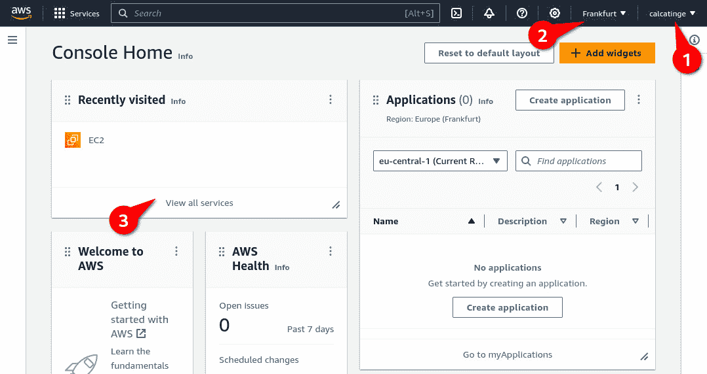

图 15.1 – AWS 管理控制台

1.  接下来，我们必须从左侧列表中选择 EC2 服务，如上图所示。这将引导我们进入 EC2 仪表盘界面，如下所示：

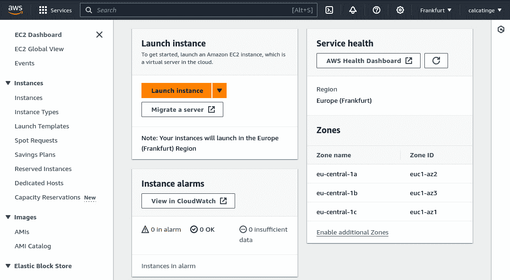

图 15.2 – EC2 仪表盘

如上图所示，**启动实例**按钮将启动创建按需实例的逐步过程。这将引导我们进入一个新界面，我们可以在其中提供新实例的主要配置选项，如名称、操作系统、实例类型、登录密钥对、网络和存储设置。

1.  接下来，我们需要选择一个名称和标签。首先，我们将为实例选择一个名称。在我们的案例中，我们将名称设置为 `aws_packt_testing_1`：

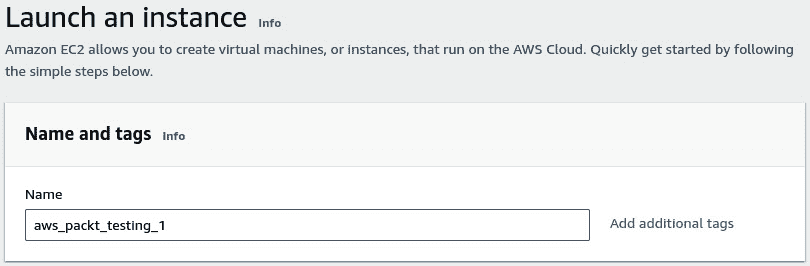

图 15.3 – 为新 EC2 实例命名

或者，我们可以添加一个新标签。为此，我们必须点击 `env` 并设置值为 `packt`。如果需要，我们可以为给定的实例添加多个标签（键值对）：

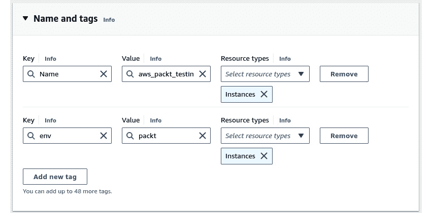

图 15.4 – 向 EC2 实例添加标签

1.  接下来，我们必须选择一个操作系统。我们将选择 Ubuntu 22.04 LTS 作为新 EC2 实例的 Linux 发行版，如下图所示：

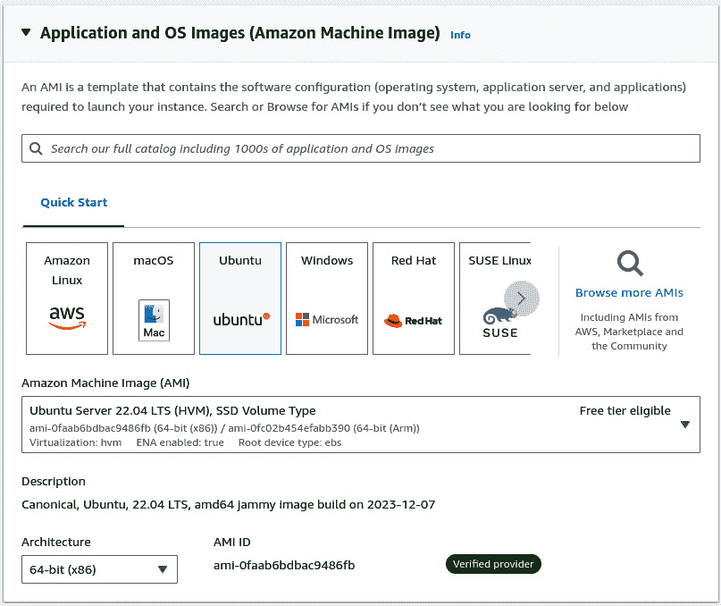

图 15.5 – 为 EC2 实例选择操作系统

还有其他操作系统可供选择，包括 macOS、Microsoft Windows 和 Linux 发行版，如 Red Hat Enterprise Linux、SUSE Linux Enterprise 或 Debian Linux，以及 Amazon Linux 和 Ubuntu。

1.  现在，我们可以选择一个实例类型。在这里，我们将根据我们的配置需求选择实例类型。在我们的案例中，我们将选择 **t2.micro** 类型，配有 1 个 vCPU 和 1 GB 内存：

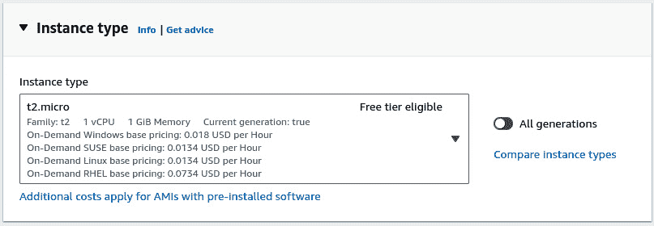

图 15.6 – 选择实例类型 – t2.micro

1.  在 **网络设置** 下，我们将暂时保持默认设置不变：

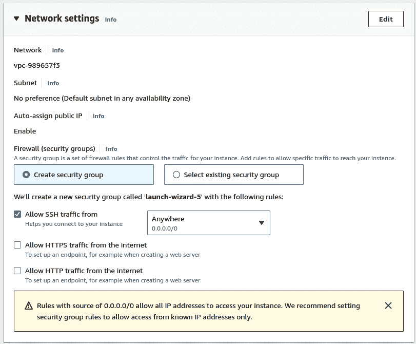

图 15.7 – 设置新 EC2 实例的网络

1.  下一步是配置存储。默认情况下，EC2 实例提供一个 8 GB 的 SSD 卷，但在使用免费套餐时，你可以将其设置为 30 GB。我们将使用默认的 8 GB：

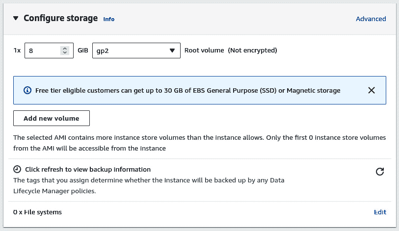

图 15.8 – 为 EC2 实例设置存储

1.  启动新 EC2 实例的最后一步是查看提供的详细摘要，并决定是否需要进行其他更改。一旦新实例根据我们的需求进行定制，就可以通过点击**启动实例**按钮来创建它，如下图所示：

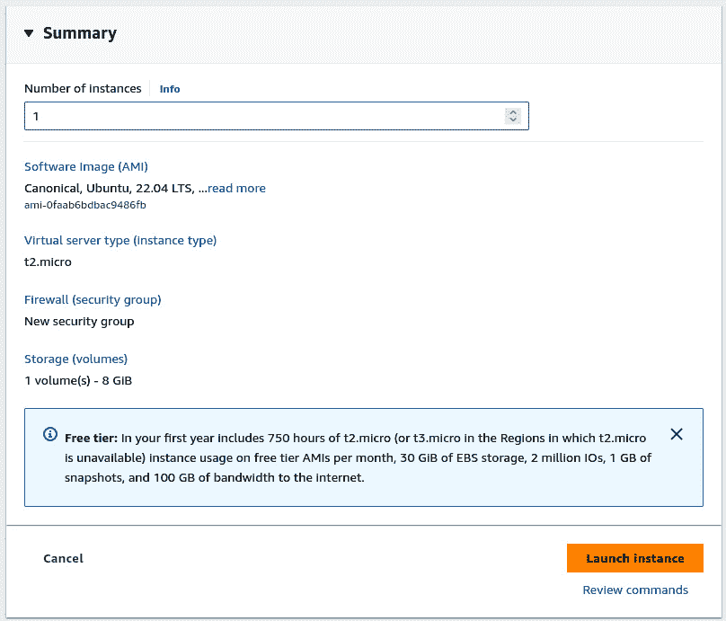

图 15.9 – 新 EC2 实例和启动实例按钮的总结

现在，我们已经准备好通过按下**启动实例**按钮来启动实例。或者，我们可以通过重新访问前面的步骤来继续进行其他配置，否则 EC2 将分配一些默认值。

1.  启动 EC2 实例时，我们需要创建或选择一个证书密钥对，以进行远程 SSH 访问实例。此时，屏幕上会高亮显示密钥对部分，我们可以点击`packt_aws_key`，选择**RSA**类型和**.pem**文件格式，然后点击右下角的**创建密钥对**按钮：

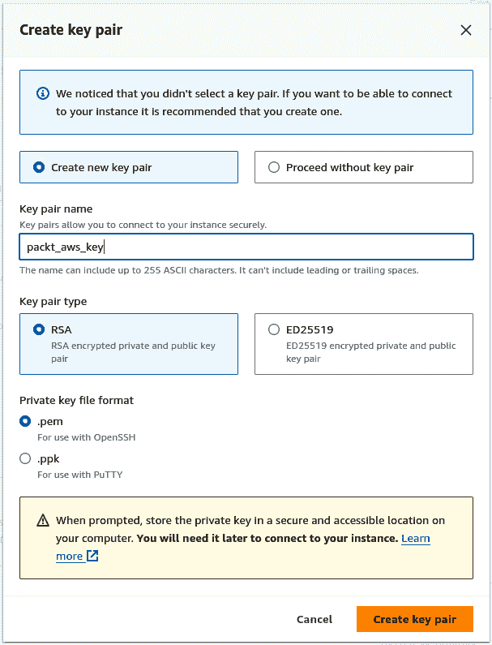

图 15.10 – 选择或创建用于 SSH 访问的证书密钥对

系统会自动提示你将新生成的`.pem`文件下载到本地机器上的某个位置。

1.  将相关文件（`packt-ec2.pem`）下载到本地机器的安全位置，在那里你可以使用`ssh`命令访问 EC2 实例：

    ```
    env: packt tag, we’ll get a view of the EC2 instance we just created:
    ```

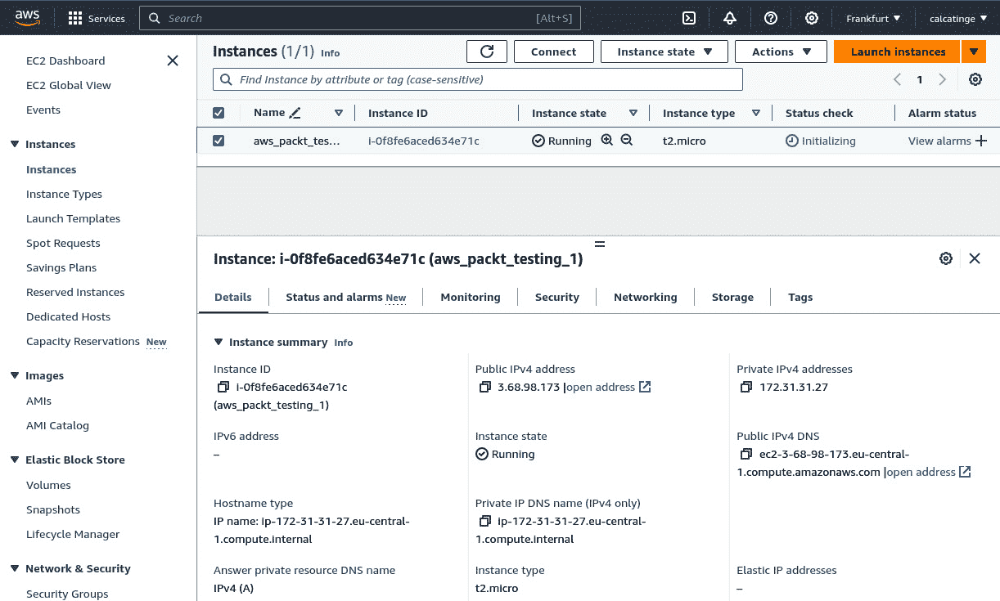

图 15.11 – 处于运行状态的 EC2 实例

有关按需实例的更多信息，请访问 [`docs.aws.amazon.com/AWSEC2/latest/UserGuide/ec2-on-demand-instances.html`](https://docs.aws.amazon.com/AWSEC2/latest/UserGuide/ec2-on-demand-instances.html)。

现在我们已经学习了启动按需实例的基础知识，让我们来看看预留实例。

### EC2 预留实例

使用**预留实例**时，我们租用特定类型的 EC2 计算能力，租期为特定时间。这段时间被称为**期限**，可以是 1 年或 3 年的承诺。购买预留实例时需要提前设置的主要特征如*图 15.12*所示：

+   **平台**：例如，**Linux**。

+   **租赁方式**：运行在**默认**（共享）或**专用**硬件上。

+   **提供类别**：这些是可用的预留实例类型。选项如下：

    +   **标准**：一个简单的预留实例，具有明确的一组选项

    +   **可转换**：它允许进行特定的更改，例如修改实例类型（例如，从**t2.large**更改为**t2.xlarge**）

+   **实例类型**：例如，**t2.large**。

+   **期限**：例如，**1 年**。

+   **支付选项**：**全部提前支付**，**部分提前支付**，**无提前支付**。

在这些选项及其不同等级中，你的费用取决于涉及的云计算资源以及服务的持续时间。例如，如果你选择提前支付全部费用，你将获得比其他方式更好的折扣。从前面提到的选项中选择，最终是为了节省成本和提高灵活性。

购买保留实例的一个类比是 *移动电话套餐* —— 你决定所有想要的选项，然后承诺一定时间。对于保留实例，你在做更改时的灵活性较小，但可以节省大量成本——有时与按需实例相比，最多可节省 75%。

要启动一个保留实例，进入 AWS 控制台中的 EC2 仪表板，在左侧面板的 **实例** 下选择 **保留实例**，然后点击 **购买保留实例** 按钮。以下是购买保留 EC2 实例的示例：

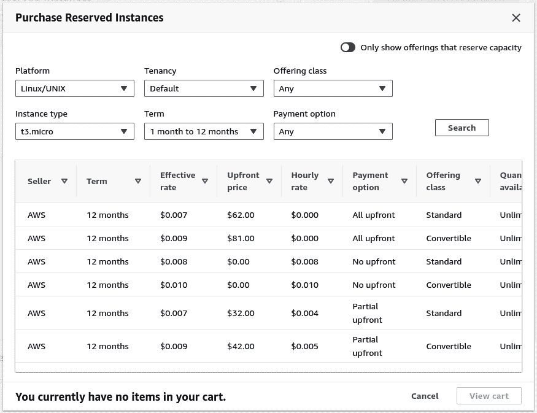

图 15.12 —— 购买保留 EC2 实例

关于 EC2 保留实例的更多信息，请访问 [`docs.aws.amazon.com/AWSEC2/latest/UserGuide/ec2-reserved-instances.html`](https://docs.aws.amazon.com/AWSEC2/latest/UserGuide/ec2-reserved-instances.html)。

我们已经了解到，保留实例是按需 EC2 实例的一个经济实惠的替代方案。现在，让我们进一步了解另一种通过使用 Spot 实例来降低成本的方法。

### EC2 Spot 实例

**Spot 实例**是一个空闲实例，等待被租用。Spot 实例的空闲时间以及是否可供你使用，取决于 EC2 中所请求的容量的总体可用性，前提是相关成本不超过你愿意为 Spot 实例支付的金额。AWS 宣传的 Spot 实例相较于按需 EC2 定价，最多可享受 90% 的折扣。

使用 Spot 实例的主要警告是，当所需容量不再按最初商定的价格提供时，可能会出现 *没有空位* 的情况。在这种情况下，Spot 实例将停止（并可能会被租赁到其他地方）。AWS EC2 会在停止 Spot 实例前提供 2 分钟的预警。这个时间应当用于妥善关闭实例内运行的应用程序工作流。

Spot 实例最适合非关键任务，在这种情况下，应用处理可能会随时被中断，并可以稍后恢复，而不会造成重大损害或数据丢失。这类任务可能包括数据分析、批处理和可选任务。

要启动一个 Spot 实例，进入你的 **EC2** 仪表板，在左侧菜单中选择 **Spot 请求**。在 **实例** 下，点击 **请求 Spot 实例**，并按照 *EC2 按需* *实例* 部分中描述的步骤操作。

启动抢占实例的详细说明超出了本章的范围。AWS EC2 控制台在描述和协助相关选项方面做得非常好。如需了解有关抢占实例的更多信息，请访问[`docs.aws.amazon.com/AWSEC2/latest/UserGuide/using-spot-instances.html`](https://docs.aws.amazon.com/AWSEC2/latest/UserGuide/using-spot-instances.html)。

我们知道，默认情况下，EC2 实例运行在共享硬件上，这意味着多个 AWS 客户拥有的实例共享同一台机器（或虚拟机）。但如果你想拥有一个专用平台来运行你的 EC2 实例呢？接下来我们将介绍专用实例。

### EC2 专用实例

特定企业要求应用程序在专用硬件上运行，并且不与任何人共享平台。AWS EC2 提供了**专用主机**和**专用实例**来满足这一需求。如你所料，专用实例的费用会比其他实例类型更高。那么，为什么我们要关注租赁这些实例呢？

有些企业——特别是在金融、健康和政府机构中——需要依法满足严格的合规要求来处理敏感数据，或者需要获取基于硬件的许可证来运行他们的应用程序。

如果没有专用主机，专用实例的 EC2 会保证你的应用程序运行在专门为你提供的虚拟化管理程序上，但不会强制要求固定的机器或硬件。换句话说，你的一些实例可能会运行在不同的物理主机上。选择专用主机和专用实例将始终确保提供一个完全专用的环境——包括虚拟化管理程序和主机——用于专门运行你的应用程序，不与其他 AWS 客户共享底层平台。

启动专用实例时，你可以按照以下步骤进行：

1.  从本章前面描述的启动按需 EC2 实例的相同步骤开始，参见*EC2 按需* *实例*部分。

1.  你可以在启动过程中添加另一个步骤。为此，你必须打开**高级详情**下拉部分，并滚动到**租用方式**选项，在那里你必须选择**专用 – 运行专用实例**，如下面的截图所示：

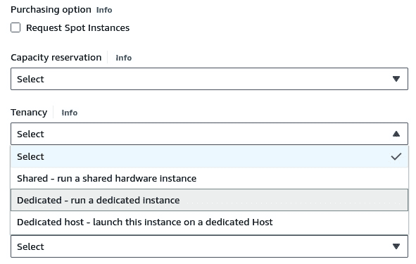

图 15.13 – 启动专用 EC2 实例

1.  如果你想在专用主机上运行专用实例，你必须先创建一个专用主机。为此，在**EC2**仪表板中，导航到**实例** | **专用主机**：

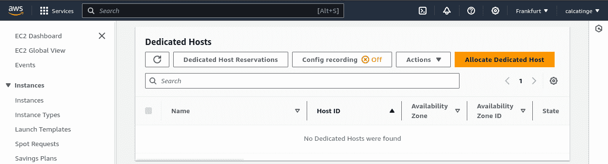

图 15.14 – 创建专用 EC2 主机

1.  按照 EC2 向导的步骤，根据你的偏好分配专用主机。创建主机后，你可以按照之前的步骤启动专用实例，并选择 **专用主机 – 在专用主机上启动此实例** 作为 **租用方式**，如 *步骤 2* 所示。

有关专用主机的更多信息，请访问[`aws.amazon.com/ec2/dedicated-hosts/`](https://aws.amazon.com/ec2/dedicated-hosts/)。关于专用实例的详细信息，请参见[`aws.amazon.com/ec2/pricing/dedicated-instances/`](https://aws.amazon.com/ec2/pricing/dedicated-instances/)。

我们将在这里结束 AWS EC2 实例类型的学习之旅。更多信息，请访问[`docs.aws.amazon.com/AWSEC2/latest/UserGuide/Instances.html`](https://docs.aws.amazon.com/AWSEC2/latest/UserGuide/Instances.html)。

接下来，我们将探讨 EC2 部署的两个关键功能之一，这些功能能够帮助你在部署和扩展 EC2 实例时变得更加高效和资源丰富——**Amazon 机器镜像**（**AMIs**）和**放置组**。本章我们将只讨论放置组。有关 AMI 的更多信息，请访问[`docs.aws.amazon.com/AWSEC2/latest/UserGuide/AMIs.html`](https://docs.aws.amazon.com/AWSEC2/latest/UserGuide/AMIs.html)。放置组控制着实例如何在 EC2 基础设施中分布，以实现高可用性和优化工作负载。接下来我们将讨论这个内容。

## 介绍 AWS EC2 放置组

**放置组**允许你指定 EC2 实例在底层 EC2 硬件或虚拟机监控器上的放置方式，根据你的需求提供将实例分组或分开的策略。放置组是免费的。

有三种放置组可供选择。让我们快速浏览一下这些类型，并查看它们的使用场景：

+   **集群放置组**：在集群放置组中，实例被放置在同一个可用区（数据中心）内。它们最适合低延迟、高吞吐量的实例间通信，但不适用于与外部世界的通信。具有高性能计算或数据复制的应用程序会从集群放置中受益，但例如 web 服务器则不太适用。

+   **分布式放置组**：当你启动多个 EC2 实例时，它们可能会运行在同一台物理机器或虚拟机监控器上。如果单点故障（如硬件故障）对应用程序至关重要，这种情况可能不太理想。分布式放置组为实例之间提供硬件隔离。换句话说，如果你在分布式放置组中启动多个实例，系统保证它们将运行在不同的物理机器上。在罕见的 EC2 硬件故障情况下，只有一个实例会受到影响。

+   **分区放置组**：分区放置组将您的实例按逻辑方式分组（分区），并在分区之间提供硬件隔离，但不在实例级别进行隔离。我们可以将这种模式视为集群放置组和扩展放置组的混合体。当您在分区放置组内启动多个实例时，EC2 会尽力在分区之间均匀分配实例。例如，如果您有四个分区和 12 个实例，EC2 会将每个节点（分区）放置三个实例。我们可以将分区视为由多个实例组成的计算单元。在发生硬件故障时，隔离的分区实例仍然可以相互通信，但不能跨分区进行通信。分区放置组最多支持一个逻辑分区内的七个实例。

要创建一个放置组，请在**EC2**仪表板左侧菜单中导航至**网络与安全** | **放置组**，然后点击**创建放置组**按钮。在接下来的界面中，您必须为**放置组**选项指定一个名称，并设置一个**放置策略**值。您还可以选择添加标签（键值对），用于组织或标识您的放置组。完成后，点击**创建** **组**按钮：

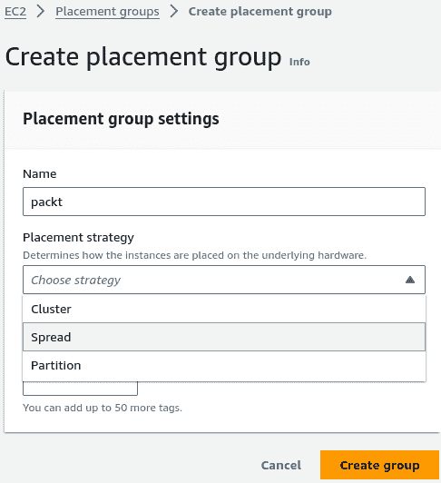

图 15.15 – 创建放置组

如需了解更多有关 EC2 放置组的信息，请访问[`docs.aws.amazon.com/AWSEC2/latest/UserGuide/placement-groups.html`](https://docs.aws.amazon.com/AWSEC2/latest/UserGuide/placement-groups.html)。

现在我们已经熟悉了各种 EC2 实例类型，接下来让我们看看如何使用我们的实例。

## 使用 AWS EC2 实例

在本节中，我们将简要介绍一些关于实例的基本操作和管理概念。首先，我们将了解 EC2 实例的生命周期。

### EC2 实例的生命周期

在使用或管理 EC2 实例时，了解从启动到运行，再到休眠、关机或终止的过渡阶段非常重要。每个状态都会影响计费以及我们访问实例的方式：

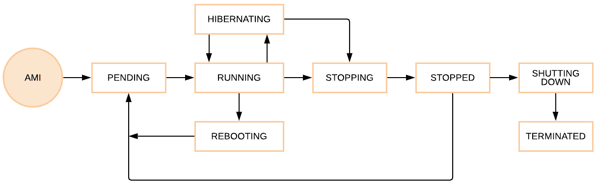

图 15.16 – EC2 实例的生命周期

让我们详细了解一下：

+   **PENDING**状态对应于实例的启动和初始化阶段。

+   从**PENDING**到**RUNNING**的过渡并非总是立刻发生，实例内运行的应用程序可能需要一段时间才能响应。EC2 会在实例处于**RUNNING**状态时开始计费，直到过渡到**STOPPED**状态。

+   在**RUNNING**状态下，我们可以根据需要重启实例。在**REBOOTING**状态下，EC2 始终会在同一主机上重启实例，而停止并重新启动并不总是能保证实例仍在同一主机上。

+   在 **停止（STOPPED）** 状态下，我们将不再为实例收费，但与实例附加的任何额外存储（根卷除外）仍然会产生费用。

+   当实例不再需要时，我们可以选择 **停止（STOPPING）** 或 **休眠（HIBERNATING）** 状态。通过 **休眠（HIBERNATING）**，我们避免了 **待处理（PENDING）** 状态启动时可能出现的延迟。如果我们不再使用实例，可以选择终止它。终止后，实例将不再产生任何费用。终止实例时，可能会在 EC2 仪表板中显示一段时间，直到其被永久移除。

我们可以使用 SSH 连接到处于运行状态的 EC2 实例。在下一节中，我们将向你展示如何操作。

### 连接到 AWS EC2 实例

一般来说，EC2 实例的目的是运行特定的应用程序或一组应用程序。相关平台的管理和维护通常需要终端访问。访问这些实例（或任何其他服务）的方式由 AWS 如何将可用服务区分为两个不同的概念来决定，这些概念类似于网络中的控制平面和数据平面。这些概念代表了如何访问 EC2 实例：

+   **控制平面（或管理平面）访问**：使用 AWS EC2 控制台和 SSH 终端，我们可以对 EC2 实例执行管理任务。

+   **数据平面访问**：运行在 EC2 实例上的应用程序也可能暴露其特定的端点（端口）以便与外部世界进行通信。EC2 使用安全组来控制相关的网络流量。

在本节中，我们将简要了解控制平面和数据平面访问。特别是，我们将讨论如何使用 SSH 连接到 EC2 实例以及如何使用 SCP 进行文件传输。

#### 通过 SSH 连接到 EC2 实例

在控制平面访问模式下，使用 SSH 与我们的 EC2 实例连接允许我们像管理任何本地网络机器一样管理它。相关的 SSH 命令如下：

```
ssh -i SSH_KEY ec2-user@EC2_INSTANCE
```

让我们分解这个过程，以便更好地理解：

+   `SSH_KEY` 代表我们在启动实例时创建并下载的本地系统上的私钥文件。更多详细信息请参见 *EC2 按需实例* 部分。

+   `ec2-user` 是 EC2 默认分配给我们 AMI Linux 实例的用户。不同的 AMI 可能有不同的用户名来进行连接。你应该向你选择的 AMI 提供商查询默认的 SSH 用户名。例如，使用 `ec2-user`，使用 `ubuntu`，以及使用 `admin`。

+   `EC2_INSTANCE` 代表我们 EC2 实例的公共 IP 地址或 DNS 名称。你可以在 EC2 仪表板中找到此信息：

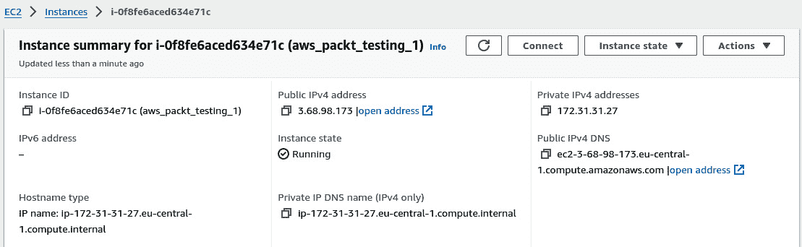

图 15.17 – EC2 实例的公共 IP 地址和 DNS 名称

在我们的例子中，SSH 命令如下：

```
ssh -i packt_aws_key.pem ubuntu@3.68.98.173
```

然而，在我们连接之前，我们需要为 `private key` 文件设置正确的权限，以确保它不会被公开查看：

```
chmod 400 packt_aws_key.pem
```

如果不这样做，在尝试连接时会出现未保护密钥文件的错误。

成功的 SSH 连接到我们的 EC2 实例会显示以下输出：

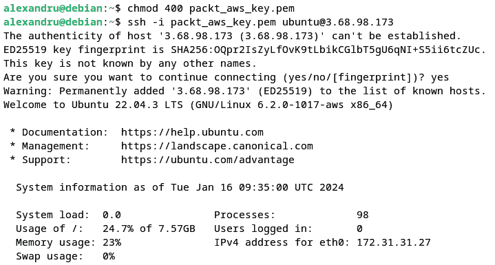

图 15.18 – 通过 SSH 连接到 EC2 实例

此时，我们可以像操作标准计算机一样与我们的 EC2 实例交互。

接下来，我们来看看如何从 EC2 实例传输文件。

#### 使用 SCP 进行文件传输

要在数据平面访问模式下将文件传输到 EC2 实例，我们必须使用 `scp` 工具。`scp` 使用 **安全复制协议** (**SCP**) 在网络主机之间安全地传输文件。

以下命令将本地文件（`README.md`）复制到我们的远程 EC2 实例（因此它必须在我们的机器上运行，而不是在 EC2 实例上）：

```
scp -i packt_aws_key.pem README.md ubuntu@3.68.98.173:~/
```

文件被复制到 EC2 实例上 `ubuntu` 用户的主文件夹（`/home/ubuntu`）。从远程实例传输 `README.md` 文件到本地目录的反向操作如下：

```
scp -i packt_aws_key.pem ubuntu@3.68.98.173:~/README.md .
```

请注意，`scp` 命令的调用方式与 `ssh` 相似，我们通过 `-i`（身份文件）参数指定私钥文件（`aws/packt-ec2.pem`）。

接下来，我们将探讨另一个管理和扩展 EC2 实例的关键方面——存储卷。

### 使用 EC2 存储卷

**存储卷**是 EC2 实例中的设备挂载，提供额外的磁盘容量（需要额外费用）。例如，你可能需要更多的存储空间来缓存大文件或进行大量日志记录，或者你可能选择挂载网络附加存储以共享关键数据。你可以将 EC2 存储卷视为*模块化硬盘*。根据需求，你可以挂载或卸载它们。

EC2 提供两种类型的存储卷：

+   **实例存储**

+   **弹性块存储** (**EBS**)

了解如何使用存储卷能帮助你在应用程序扩展时做出更好的决策。首先，让我们来看看实例存储卷。

#### 介绍实例存储卷

实例存储卷是直接（物理）附加到 EC2 实例的磁盘。因此，你可以连接到实例的最大实例存储卷数量和大小受到实例类型的限制。例如，存储优化型 *i3* 实例最多可以附加 8 个 1.9 TB SSD 磁盘，而通用型 *m5d* 实例最多只能连接四个每个 900 GB 的磁盘。有关实例容量的更多信息，请参见 [`aws.amazon.com/ec2/instance-types/`](https://aws.amazon.com/ec2/instance-types/)。

如果实例存储卷是根卷，即用于启动实例的操作系统平台卷，则不会产生额外费用。

并非所有 EC2 实例类型都支持实例存储卷。例如，通用型的 *t2* 实例类型仅支持 EBS 存储卷。另一方面，如果你希望扩展存储，超出实例存储允许的最大容量，你将必须使用 EBS 卷。接下来我们将讨论 EBS 卷。

#### 介绍 EBS 卷

实例存储卷上的数据仅在你的 EC2 实例上持久化。如果你的实例停止、终止或发生故障，所有数据将丢失。要在 EC2 实例中存储和持久化关键数据，你必须选择 EBS。

EBS 卷是灵活且高性能的网络附加存储设备，既为根卷系统提供支持，也为你的 EC2 实例提供额外的卷挂载。一个 EBS 根卷一次只能附加到一个 EC2 实例，而一个 EC2 实例可以随时附加多个 EBS 卷。通过 *多重附加*，一个 EBS 卷也可以同时附加到多个 EC2 实例。有关 EBS 多重附加的更多信息，请参见 [`docs.aws.amazon.com/AWSEC2/latest/UserGuide/ebs-volumes-multi.html`](https://docs.aws.amazon.com/AWSEC2/latest/UserGuide/ebs-volumes-multi.html)。

当你创建 EBS 卷时，它会在你实例的可用区（AZ）内自动复制，以最小化延迟和数据丢失。使用 EBS，你可以通过 Amazon CloudWatch 免费监控磁盘健康状况和统计信息。EBS 还支持加密数据存储，以满足最新的数据加密法规标准。

EC2 存储卷由 Amazon 的 **简单存储服务** (**S3**) 或 **弹性文件系统** (**EFS**) 基础设施支持。有关不同 EC2 存储类型的更多信息，请访问 [`docs.aws.amazon.com/AWSEC2/latest/UserGuide/Storage.html`](https://docs.aws.amazon.com/AWSEC2/latest/UserGuide/Storage.html)。

现在，让我们创建并配置一个 EBS 存储卷，并将其附加到我们的 EC2 实例。

#### 配置 EBS 存储卷

以下是我们将遵循的步骤，首先是创建 EBS 卷：

1.  在 **EC2** 仪表板中，转到左侧导航窗格中的 **弹性块存储** 下的 **卷**，然后点击顶部的 **创建卷** 按钮：

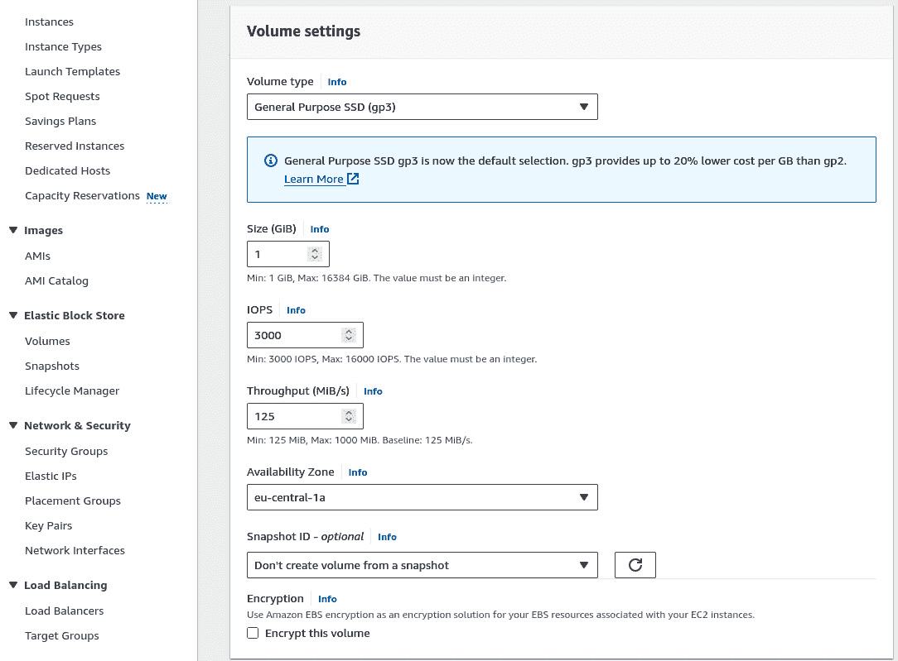

图 15.19 – 创建 EBS 卷

1.  输入你选择的 **卷类型**、**大小** 和 **可用区** 的值。确保选择与你的 EC2 实例所在的 AZ 匹配的可用区。如果你希望从以前的 EC2 实例备份（快照）恢复该卷，你还可以包含一个 **快照 ID** 值。稍后我们将在本章中讨论使用 EBS 快照进行备份/恢复。

1.  完成后点击 **创建卷** 按钮。如果一切顺利，你将看到一个 **卷创建成功** 的消息，其中会指定你的新 EBS 卷 ID。

1.  点击 **卷 ID** 或从左侧导航窗格中选择卷，在 **弹性块存储** 和 **卷** 下。点击 **操作** 按钮并选择 **附加卷**：

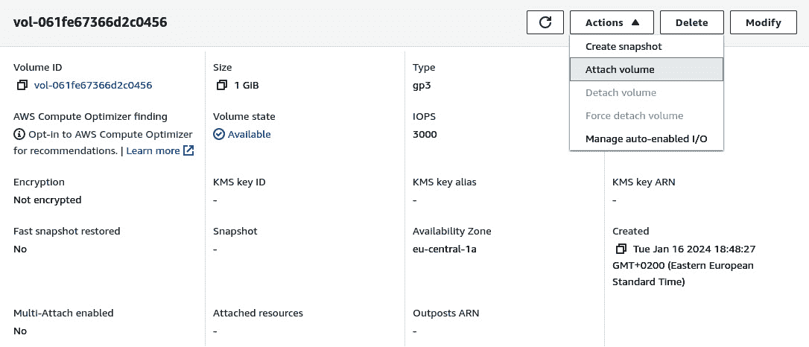

图 15.20 – 将 EBS 卷附加到 EC2 实例

1.  在下一个屏幕上，在 **实例** 字段中输入您的 EC2 实例 ID（或名称标签以搜索它）：

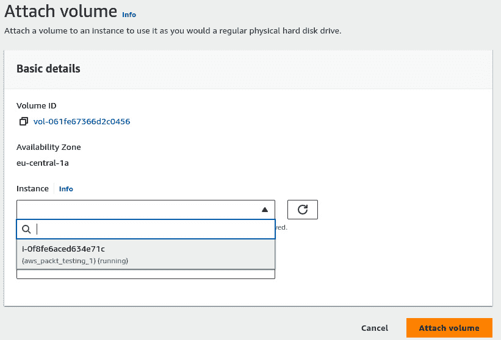

图 15.21 – 输入 EC2 实例 ID 以附加卷

1.  完成后，按下 **附加卷** 按钮。几秒钟后，EC2 将初始化您的 EBS 卷，**状态** 将变为 **正在使用**。卷设备现在已准备好，但我们需要格式化它以便可以使用。

1.  让我们通过 SSH 连接到我们附加了卷的 EC2 实例：

    ```
    lsblk command-line utility to list the block devices:

    ```

    lsblk

    ```

    The output is as follows:
    ```

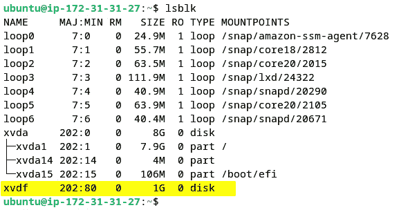

图 15.22 – 我们 EC2 实例中的本地卷

查看卷的大小，我们可以立即分辨出刚添加的那个 —— `xvdf`，大小为 `1G`。另一个卷（`xvda`）是我们 `t3.micro` 实例的原始根卷。

1.  现在，让我们检查一下我们的新 EBS 卷（`xvdf`）是否有文件系统：

    ```
    /dev/xvdf: data, meaning that the volume doesn’t have a filesystem yet.
    ```

1.  让我们使用 `mkfs`（*创建文件系统*）命令行工具在我们的卷上创建文件系统：

    ```
    -t (--type) parameter with an xfs filesystem type. XFS is a high-performance journaled filesystem that’s supported by most Linux distributions and is installed by default in some of them.
    ```

1.  如果我们使用以下命令检查文件系统，我们应该能看到文件系统的详细信息，而不是空白数据：

    ```
    sudo file -s /dev/xvdf
    ```

    用于检查和创建新文件系统的所有命令的输出如以下截图所示：

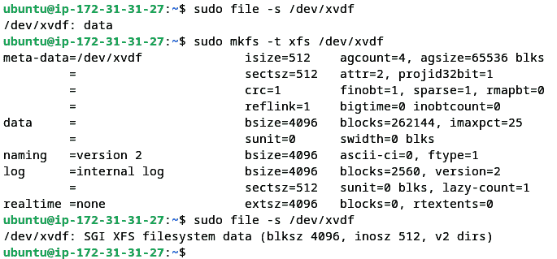

图 15.23 – 创建一个新的文件系统

卷驱动器现在已格式化。

1.  现在，让我们使它对我们的本地文件系统可访问。我们将把挂载点命名为 `packt_drive`，并在根目录中创建它：

    ```
    sudo mkdir /packt_drive
    /packt directory, we’re accessing the EBS volume:
    ```


图 15.24 – 访问 EBS 卷

使用 EBS 卷类似于使用 Linux 上的任何卷，因此您在本章中获得的所有知识在处理 Amazon EC2 实例时都将非常有用。现在，让我们看看如何卸载一个 EBS 卷。

#### 卸载 EBS 卷

在卸载任何 EBS 卷之前，您需要先卸载它。在我们的案例中，由于我们已经在终端中并正在使用该卷，我们将输入以下命令来卸载我们正在使用的卷：

```
sudo umount -d /dev/xvdf
```

现在，卷已被卸载，我们可以前往 EC2 控制台，进入 **卷**，选择要卸载的相应 **正在使用** 的卷，点击右上角的 **操作**，选择 **卸载卷**。确认操作并等待卷被卸载。

我们现在进入了备份恢复程序的最后一步——也就是将包含快照的新卷附加到我们的 EC2 实例。

我们将在这里结束对 AWS EC2 控制台及相关管理操作的探讨。如需关于 EC2 的全面参考，请查看 Amazon EC2 文档：[`docs.aws.amazon.com/ec2`](https://docs.aws.amazon.com/ec2)。

到目前为止，我们展示的 EC2 管理任务完全是通过 AWS Web 控制台来完成的。如果你希望自动化你的 EC2 工作负载，你可能想采用 AWS CLI，我们接下来将了解它。

## 使用 AWS CLI

AWS CLI 是一个统一的工具，用于管理 AWS 资源。该工具的创建目的是让我们能够通过本地机器上的终端会话管理所有的 AWS 服务。与通过浏览器提供可视化工具的 AWS Web 控制台相比，AWS CLI（顾名思义）将所有功能集成在本地机器的终端程序中。AWS CLI 支持所有主要操作系统，如 Linux、macOS 和 Windows。在接下来的章节中，我们将展示如何在 Linux 本地机器上安装它。

### 安装 AWS CLI

要安装 AWS CLI，请访问[`aws.amazon.com/cli/`](https://aws.amazon.com/cli/)。在撰写本文时，AWS CLI 的最新版本是 2。对于本章中的示例，我们将使用一台 Debian 机器来安装 AWS CLI，并遵循[`docs.aws.amazon.com/cli/latest/userguide/getting-started-install.html#cliv2-linux-install`](https://docs.aws.amazon.com/cli/latest/userguide/getting-started-install.html#cliv2-linux-install)上的说明。该资源链接提供了在所有主要操作系统上安装 AWS CLI 的说明，不仅仅是 Linux。

按照以下步骤在 Linux 上安装 AWS CLI：

1.  我们将从下载 AWS CLI v2 包（`awscliv2.zip`）开始：

    ```
    curl "https://awscli.amazonaws.com/awscli-exe-linux-x86_64.zip" -o "awscliv2.zip"
    ```

1.  接下来，我们将解压并安装 AWS CLI：

    ```
    unzip awscliv2.zip
    aws command-line utility installed on our system. Let’s check the version:

    ```

    帮助：

    ```
    aws help
    ```

    ```

    ```

要使用 `aws` 工具管理你的 AWS EC2 资源，首先需要配置本地环境，以与 AWS 端点建立所需的信任关系。接下来我们将进行配置。

### 配置 AWS CLI

要在本地机器上配置 AWS 环境，你需要设置 AWS 访问密钥。如果你已经有了密钥，可以跳过此部分：

1.  AWS CLI 配置会要求输入你的**AWS 访问密钥 ID**和**AWS 秘密访问密钥**值。你可以通过登录到你的 AWS 账户来生成或检索这些密钥。

1.  在 AWS Web 控制台的右上角选择你账户名旁边的下拉菜单，然后选择**安全凭证**。如果你还没有生成访问密钥，请进入**访问密钥**标签页，点击**创建访问密钥**按钮。你需要将你的 AWS 密钥 ID 和密钥保存在安全的地方，以备后用。

1.  现在你已经有了这些密钥，可以继续在本地机器上配置 AWS 环境。要配置 AWS 环境，请运行以下命令：

    ```
    aws configure
    ```

    上述命令会提示你输入一些信息，如下所示的输出：

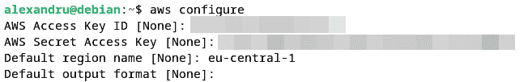

图 15.25 – 配置本地 AWS CLI 环境

1.  在 AWS CLI 配置向导中，设置`eu-central-1`（在我们的案例中是法兰克福）。你可以选择输入你自己的区域，或者保持默认设置（`None`）。如果没有指定默认区域，每次调用`aws`命令时都需要输入该区域。

此时，我们已经准备好使用 AWS CLI。让我们从列出 EC2 实例开始。

### 查询 EC2 实例

以下命令提供有关 EC2 实例的详细信息：

```
aws ec2 describe-instances
```

上述命令提供了庞大的 JSON 输出（截图展示不下），包含我们在默认区域（`eu-central-1`）中的所有 EC2 实例的详细信息。或者，我们可以使用 `--region` 参数指定区域：

```
aws ec2 describe-instances --region eu-central-1
```

我们还可以更灵活地操作，只列出与特定键值标签匹配的 EC2 实例，比如我们之前用 `env: packt` 标签标记的实例，使用 `--filters` 参数：

```
aws ec2 describe-instances \
  --filters "Name=tag-key,Values=env" \
  --filters "Name=tag-value,Values=packt"
```

第一个`--filters`参数指定了键（`tag-key=env`），第二个则指向值（`tag-value=packt`）。

通过结合使用 `aws` 和 `jq`（*JSON 查询*）命令，我们可以提取所需的 JSON 字段。例如，以下命令列出了带有 `env:packt` 标签的 EC2 实例的 `InstanceId`、`ImageId` 和 `BlockDeviceMappings` 字段：

```
aws ec2 describe-instances \
  --filters "Name=tag-key,Values=env" \
  --filters "Name=tag-value,Values=packt" | \
  jq '.Reservations[].Instances[] | { InstanceId, ImageId, BlockDeviceMappings }'
```

如果你的 Linux 系统上没有安装`jq`工具，可以使用以下命令进行安装：

```
sudo apt install -y jq # on Ubuntu/Debian
```

上述 `aws` 命令的输出如下：

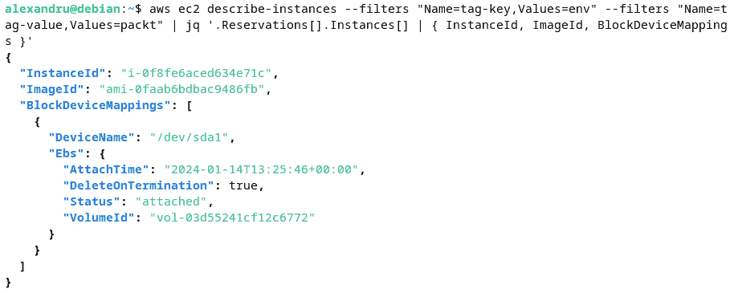

图 15.26 – 查询 EC2 实例

注意输出 JSON 中的 `DeviceName` 属性，它只反映了一个块设备（这是 `/dev/sdf`，因为我们删除了之前附加的 EBS 卷）。

我们可以通过任何属性过滤 `aws ec2 describe-instances` 命令的输出。例如，以下命令通过 `image-id` AMI 过滤我们的 EC2 实例：

```
aws ec2 describe-instances \
  --filters "Name=image-id versus ImageId. You have to keep this rule in mind when you write your filter queries.
Next, let’s plan to launch a new EC2 instance of the same AMI type with our current machine and the same security group.
Creating an EC2 instance
Let’s look at how we can create a new EC2 instance. To do this, we will need some prior information regarding the existing security group inside which we would like to create the new instance. The following command retrieves the security groups of the current instance (`i-0f8fe6aced634e71c`):

```

aws ec2 describe-instances \

--filters "Name=instance-id,Values=i-0f8fe6aced634e71c" \

--query "Reservations[].Instances[].SecurityGroups[]"

```

 The output is as follows:
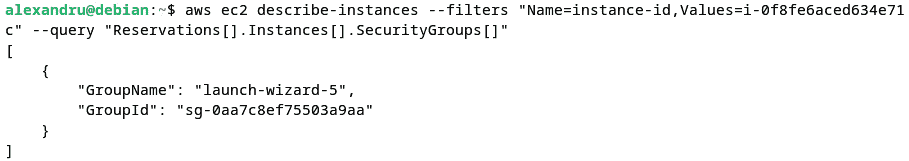

Figure 15.27 – Retrieving the security groups of an EC2 instance
To retrieve `GroupId` directly, we could run the following:

```

aws ec2 describe-instances \

--filters "Name=instance-id,Values=i-0f8fe6aced634e71c" \

--query "Reservations[].Instances[].SecurityGroups[].GroupId"

```

 In this case, the output would only show `GroupId`. Here, we used the `--query` parameter to specify the exact JSON path for the field we’re looking for (`GroupId`):

```

Reservations[].Instances[].SecurityGroups[].GroupId

```

 The use of the `--query` parameter somewhat resembles piping the output to the `jq` command, but it’s less versatile.
We also need the AMI ID. To obtain this, navigate to your AWS EC2 console and then, from the left-hand side pane, go to `ami-0faab6bdbac9486fb`.
To launch a new instance with the AMI type of our choice and the security group ID, we must use the `aws ec2` `run-instances` command:

```

aws ec2 run-instances --image-id ami-0faab6bdbac9486fb --count 1 --instance-type t3.micro --key-name packt_aws_key --security-group-ids sg-0aa7c8ef75503a9aa –placement AvailabilityZone=eu-central-1b

```

 Here’s a brief explanation of the parameters:

*   `image-id`: The AMI image ID (`ami-0faab6bdbac9486fb`); we’re using the same AMI type (*Ubuntu Linux*) as with the previous instance we created in the AWS EC2 web console
*   `count`: The number of instances to launch (`1`)
*   `instance-type`: The EC2 instance type (`t3.micro`)
*   `key-name`: The name of the SSH private key file (`packt_aws_key`) to use when connecting to our new instance; we’re reusing the SSH key file we created with our first EC2 instance in the AWS web console
*   `security-group-ids`: The security groups attached to our instance; we’re reusing the security group attached to our current instance (`sg-0aa7c8ef75503a9aa`)
*   `--placement`: The AZ to place our instance in (`AvailabilityZone=eu-central-1b`)

The command should run successfully and you will see the new EC2 instance running in your console. Here’s a screenshot of our EC2 console and the two instances running:
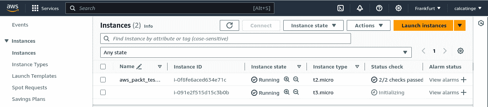

Figure 15.28 – The new EC2 instance shown in the console
As you can see, our newly created EC2 instance has no name. Let’s add a name and some tags to it using the command line.
Naming and tagging an EC2 instance
The following command names our new instance as `aws_packt_testing_2`:

```

aws ec2 create-tags --resources i-091e2f515d15c3b0b --tags Key=Name,Value=aws_packt_testing_2

```

 Now, we can add a tag to the new instance. Adding a name and a tag can be done in a single command, but for a better understanding, we’ve decided to use two different commands. Here’s how to add a tag:

```

aws ec2 create-tags \

--resources i-0e1692c9dfdf07a8d \

--tags Key=env,Value=packt

```

 Now, let’s query the instance with the following command:

```

aws ec2 describe-instances \

--filters "Name=tag-key,Values=env" \

--filters "Name=tag-value,Values=packt" \

--query "Reservations[].Instances[].InstanceId"

```

 The output shows that our two EC2 instances have the same tag (`packt`):
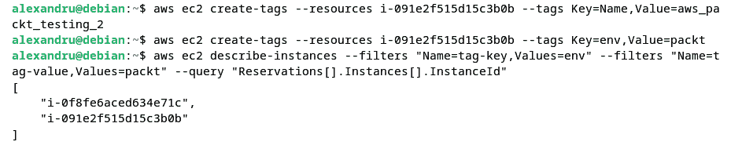

Figure 15.29 – Querying EC2 instance IDs by tag
If you check the EC2 console inside your browser, you will see the two instances. Now, the second instance has its new name shown (`aws_packt_testing_2`) and the **Instance ID** value for each one:
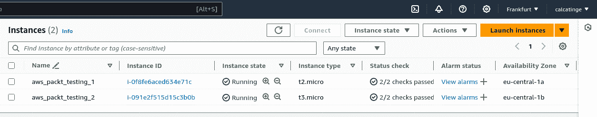

Figure 15.30 – Showing all instances in the EC2 console
Next, we’ll show you how to terminate an EC2 instance from the command line.
Terminating an EC2 instance
To terminate an EC2 instance, we can use the `aws ec2 terminate-instance` command. Note that terminating an instance results in the instance being deleted. We cannot restart a terminated instance. We could use the `aws ec2 stop-instances` command to stop our instance until later use.
The following command will terminate the instance with the ID of `i-091e2f515d15c3b0b`:

```

aws ec2 terminate-instances --instance-ids shutting-down (从先前的运行状态停止)：

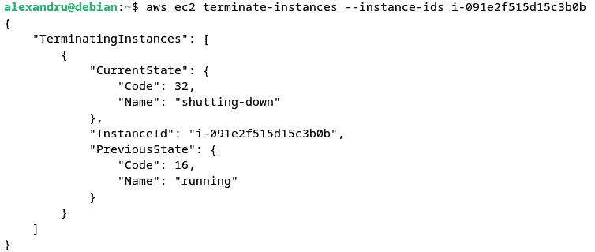

图 15.31 – 终止实例

实例最终会过渡到`terminated`状态，并且将不再在 AWS EC2 控制台中显示。AWS CLI 仍然会将其列出在实例列表中，直到 EC2 最终处理它。根据 AWS 的说法，终止的实例在终止后最多一个小时内仍然可能可见。在通过 AWS CLI 执行查询和管理操作时，最好丢弃处于`terminated`或`shutting-down`状态的实例。以下 EC2 控制台的屏幕截图显示第二个 EC2 实例处于`terminated`状态：

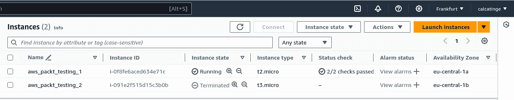

图 15.32 – 显示 EC2 控制台中的终止实例

这是我们结束关于 AWS EC2 之旅的地方。请注意，我们仅仅触及了 AWS 中云管理工作负载的表面。

本节中涵盖的主题提供了对 AWS EC2 云资源的基本理解，并帮助系统管理员在管理相关工作负载时做出更好的决策。高级用户可能会发现 AWS CLI 示例是自动化其 EC2 云管理工作流的一个良好起点。

现在，让我们将注意力转向我们的下一个公共云服务竞争者——Microsoft Azure。

使用 Microsoft Azure

**Microsoft Azure**，也称为**Azure**，是微软提供的公共云服务，用于在云中构建和部署应用服务。Azure 提供全面的、高度可扩展的**基础设施即服务**（**IaaS**），以相对低廉的成本，满足从小团队到大型商业企业、金融、医疗和政府机构等广泛用户和业务需求。

在本节中，我们将探索一些使用 Azure 的非常基本的部署工作流，如下所示：

+   创建 Linux 虚拟机

+   管理虚拟机大小

+   向虚拟机添加额外存储

+   使用 Azure CLI

一旦你创建了免费的 Azure 帐户，请访问[`portal.azure.com`](https://portal.azure.com)进入 Azure 门户。你可能希望启用左侧导航菜单的停靠视图，以便快速便捷地访问你的资源。在本章中，我们将使用停靠视图来进行屏幕截图。进入右上角的**门户设置**齿轮，选择**停靠**作为门户菜单的默认模式。

现在，让我们在 Azure 中创建我们的第一个资源——一台 Ubuntu 虚拟机。

创建和部署虚拟机

我们将遵循 Azure 门户中的资源向导，按步骤操作。让我们从第一步开始，即为虚拟机创建计算资源。

1.  **创建计算资源**：首先，点击左侧导航菜单中的**创建资源**选项，或在主窗口中的**Azure 服务**下选择。这将引导我们进入 Azure 市场。在这里，我们可以搜索所需的资源。你可以搜索相关的关键词，或者根据所需的资源类型缩小选择范围。我们可以通过选择**计算**，然后从可用的**热门市场产品**选项中选择**Ubuntu Server 22.04 LTS**来缩小选择范围。你可以点击**了解更多**以查看镜像的详细描述，或点击**创建**。

    当我们选择**Ubuntu Server 22.04 LTS**时，系统将引导我们完成配置和创建新虚拟机的过程。设置页面如下所示：

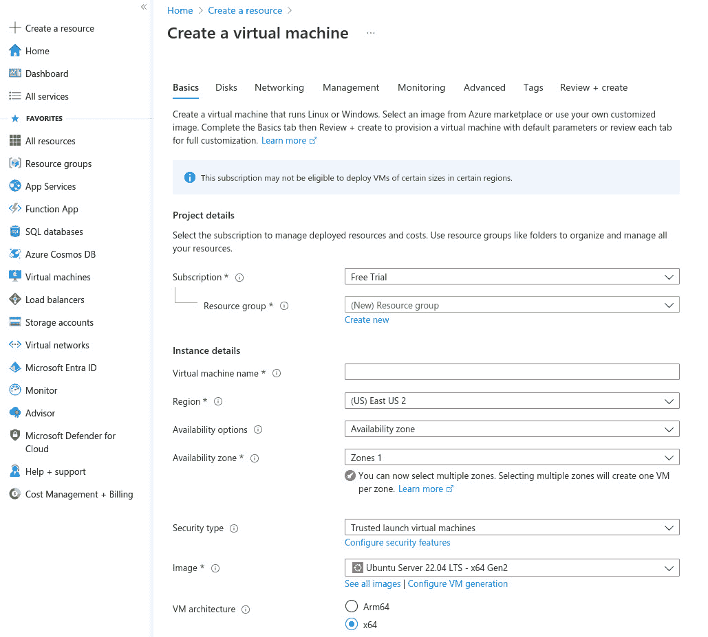

图 15.33 – 在 Azure 中创建虚拟机

在**基础**选项卡中，提供了订阅类型、资源组、区域、镜像和架构等信息。其他选项卡包括**磁盘**、**网络**、**管理**、**监控**、**高级**和**标签**。

1.  `packt-demo`。如果我们之前创建了资源组，我们可以在这里指定它。

1.  `packt-ubuntu-demo`，并将其放置在（欧洲）法国中部区域，该区域距离我们实例操作的地理位置最近。虚拟机的大小将直接影响相关费用。以下截图显示了目前已指定的**资源组**设置、**虚拟机名称**、**区域**、**可用性选项**、**安全类型**、**镜像**、**虚拟机架构**和**大小**的详细信息：

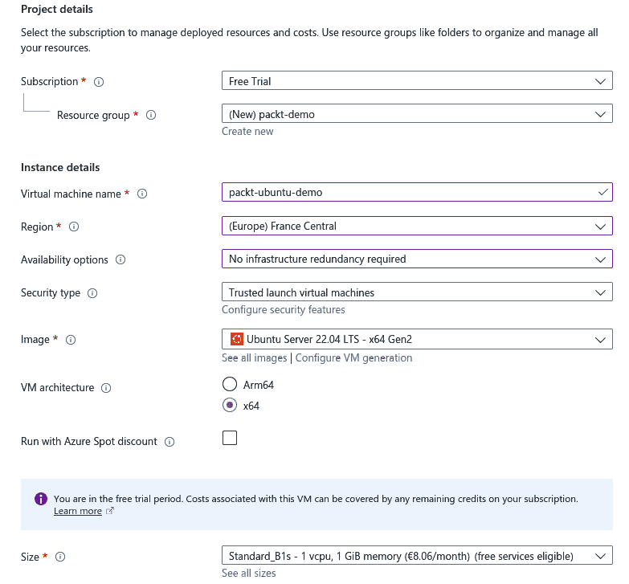

图 15.34 – 设置 Azure 虚拟机

另外，我们也可以通过选择**查看所有镜像**或**查看所有大小**来浏览不同的**镜像**和**大小**选项。Azure 还提供了一个在线工具*定价计算器*，可供查看各种资源的定价：[`azure.microsoft.com/en-us/pricing/calculator/`](https://azure.microsoft.com/en-us/pricing/calculator/)。

1.  `packt` 和 `packt-ubuntu-demo_key`。接下来，我们需要为我们的实例设置**入站端口规则**，以允许 SSH 访问。例如，如果我们的机器将运行 Web 服务器应用程序，我们还可以启用 HTTP 和 HTTPS 访问：

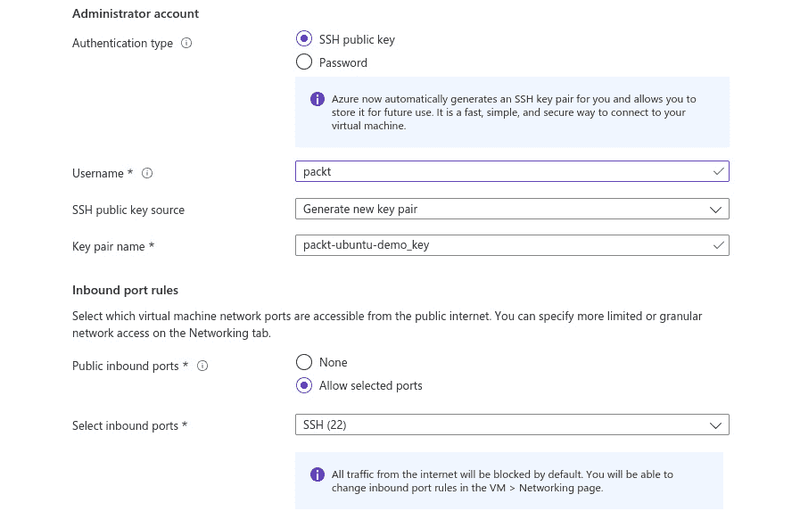

图 15.35 – 启用 SSH 身份验证并访问虚拟机

此时，我们准备好创建虚拟机了。向导可以引导我们进一步进行与实例相关的*磁盘*和*网络*配置的额外步骤。现在，我们将保持现状，不做更改。

1.  **验证并部署虚拟机**：我们可以点击**审查 + 创建**按钮以启动验证过程。接下来，部署向导将验证我们的虚拟机配置。如果一切顺利，几秒钟后我们会看到一个**验证通过**的消息，显示产品详情和实例的每小时费用。点击**创建**后，我们同意相关的使用条款，虚拟机将很快被部署：


图 15.36 – 创建虚拟机

在这个过程中，我们将被提示下载 SSH 私钥以访问我们的实例：

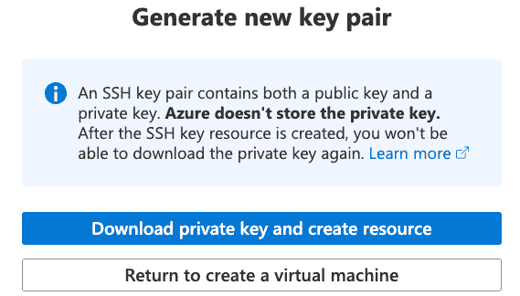

图 15.37 – 下载 SSH 私钥以访问虚拟机

1.  **部署完成**：如果部署成功完成，我们会收到一个简短的弹出消息，显示**部署成功**，并有一个**转到资源**按钮，将我们带到新虚拟机的页面：

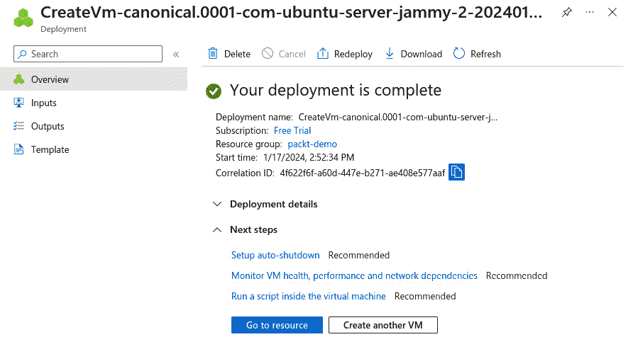

图 15.38 – 成功部署虚拟机

如果点击相关下拉按钮，我们还会得到一个简短的部署详情报告：

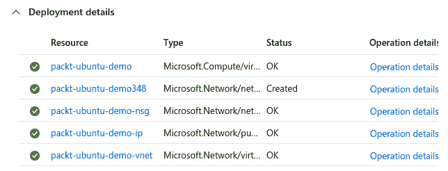

图 15.39 – 部署详情

让我们快速浏览一下与虚拟机部署一起创建的每个资源：

+   `packt-ubuntu-demo`：虚拟机主机

+   `packt-ubuntu-demo348`：虚拟机的网络接口（或网络接口卡）

+   `packt-ubuntu-demo-ip`：虚拟机的 IP 地址

+   `packt-ubuntu-demo-vnet`：与资源组（`packt-demo`）关联的虚拟网络

+   `packt-ubuntu-demo-nsg`：控制进出我们实例的**网络安全组**（**NSG**）

当实例被放置在现有资源组中时，Azure 会为每个虚拟机创建一组新的资源类型（前面提到的资源类型），但不会包括与资源组对应的虚拟网络。别忘了我们还创建了一个新的资源组（`packt-demo`），它不会在部署报告中显示。

让我们尝试连接到我们新创建的实例（`packt-ubuntu-demo`）。前往`packt-ubuntu-demo`）并在`20.19.173.232`中进行连接。

既然我们已经部署了虚拟机，我们希望确保能够通过 SSH 访问它。接下来我们就来做这件事。

通过 SSH 连接到虚拟机

在通过 SSH 连接到虚拟机之前，我们需要设置 SSH 私钥文件的权限，以确保它不会公开可见：

```
chmod 400 packt-ubuntu-demo_key.pem
```

接下来，我们必须使用以下命令连接到我们的 Azure Ubuntu 实例：

```
ssh -i packt-rhel.pem packt@20.19.173.232
```

我们必须使用在创建实例时指定的 SSH 密钥（`packt-ubuntu-demo_key.pem`）和管理员帐户（`packt`）。或者，您可以在虚拟机的**概述**选项卡上单击**连接**按钮，然后单击**SSH**。此操作将显示一个视图，您可以在其中查看前面的命令并将其复制粘贴到您的终端中。

成功连接到我们的 Ubuntu 实例应该会产生以下输出：

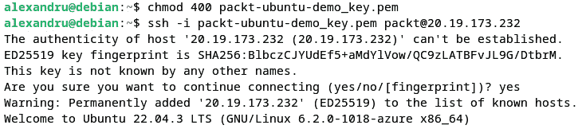

图 15.40 – 连接到 Azure 虚拟机

现在我们在 Azure 中创建了我们的第一个虚拟机，让我们来看看在虚拟机生命周期中执行的一些最常见的管理操作。

管理虚拟机

随着我们的应用程序的发展，托管应用程序的虚拟机所需的计算能力和容量也在增加。作为系统管理员，我们应该了解云资源的利用情况。Azure 提供了监视虚拟机健康和性能所需的必要工具。这些工具可以在虚拟机管理页面的**监视**选项卡上找到。

具有相对较少虚拟 CPU 和较少内存的小型虚拟机可能会对应用程序性能产生负面影响。另一方面，过大的实例会导致不必要的成本。在 Azure 中，调整虚拟机大小是一种常见的操作。让我们看看如何做到这一点。

更改虚拟机的大小

Azure 使得调整虚拟机大小变得相对容易。在门户中，转到**虚拟机**，选择您的实例，然后在**可用性 +** **规模**下点击**大小**：

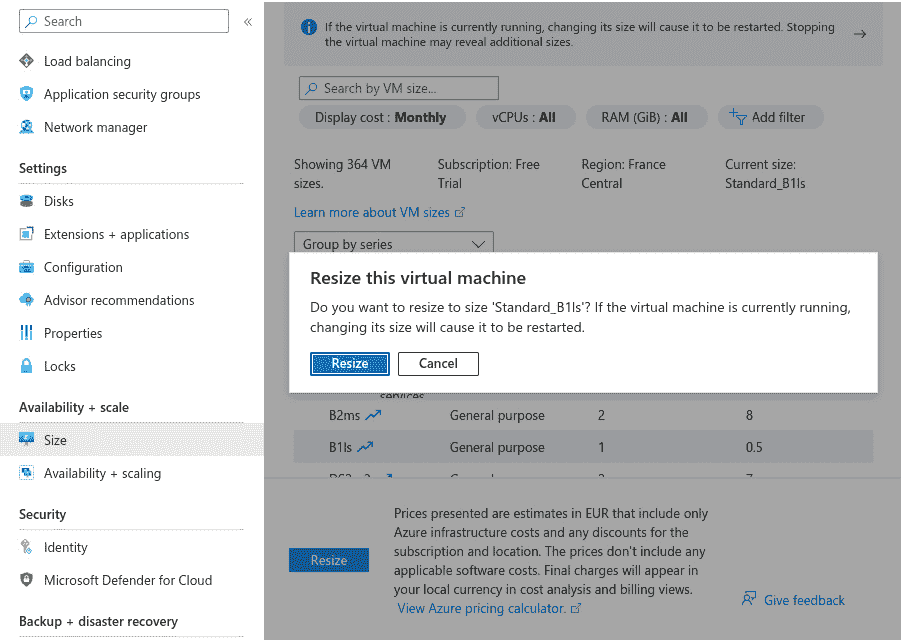

图 15.41 – 更改虚拟机的大小

我们的虚拟机（`packt-ubuntu-demo`）是*B1s*大小（1 vCPU，1 GB RAM）。我们可以选择将其大小调整到更低的*B1ls*容量（1 vCPU，0.5 GB RAM）。我们可以选择**B1ls**（1 vCPU，0.5 GB RAM）选项并点击**调整大小**按钮。降低实例的大小也将带来成本节约。在更改大小之前，最好停止虚拟机以避免实例内可能的数据不一致。

Azure 中虚拟化工作负载的显著特性之一是可以通过添加额外的数据磁盘来扩展（包括存储容量）。我们可以添加现有的数据磁盘或创建新的磁盘。

让我们看看如何向我们的虚拟机添加一个次要数据磁盘。

添加额外的存储空间

Azure 可以在不停止虚拟机的情况下动态地向实例添加磁盘。我们可以向虚拟机添加两种类型的磁盘：**数据磁盘**和**托管磁盘**。在本章中，我们将仅提供如何添加数据磁盘的信息。有关 Azure 磁盘类型的更多信息，请访问[`docs.microsoft.com/en-us/azure/virtual-machines/disks-types`](https://docs.microsoft.com/en-us/azure/virtual-machines/disks-types)。

让我们学习如何添加数据磁盘：

1.  在左侧导航菜单中，导航到**虚拟机**，选择你的实例，点击**设置**下的**磁盘**，然后点击**创建并附加新磁盘**。

1.  在磁盘属性中，保留`packt-disk`、**存储类型**和**大小**（例如**4 GB**）的值。完成后，点击**应用**：

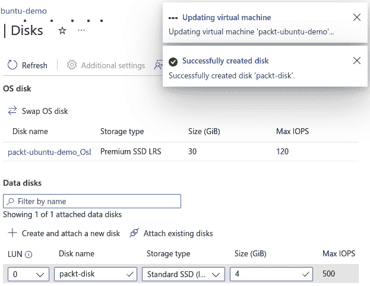

图 15.42 – 添加新数据磁盘

此时，新磁盘已附加到我们的虚拟机，但磁盘尚未初始化文件系统。

1.  通过 SSH 连接到我们的虚拟机：

    ```
    ssh -i packt-rhel.pem packt@20.19.173.232
    ```

    2. 列出当前的块设备：

    ```
    sdc:
    ```

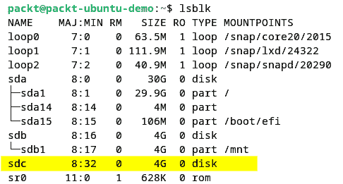

图 15.43 – 确定新数据磁盘的块设备

1.  验证块设备是否为空：

    ```
    /dev/sdc: data, meaning that the data disk doesn’t contain a filesystem yet.
    ```

    2. 接下来，使用 XFS 文件系统初始化卷：

    ```
    /packt) and mount the new volume:

    ```

    sudo mkdir /packt

    sudo mount /dev/sdc /packt

    ```

    ```

现在，我们可以使用新的数据磁盘进行常规文件存储。

请注意，数据磁盘仅在虚拟机的生命周期内被持久化。当虚拟机被暂停、停止或终止时，数据磁盘将变为不可用。当虚拟机终止时，数据磁盘会永久丢失。对于持久化存储，我们需要使用*托管磁盘*，其行为类似于网络附加存储。有关更多详细信息，请参见本节开头的链接。

到目前为止，我们已经在 Azure 门户中执行了所有这些管理操作。但是如果你想使用脚本自动化云中的工作负载怎么办？这可以通过 Azure CLI 来实现。

使用 Azure CLI

Azure CLI 是一个专门的命令行界面，用于管理云中的资源。首先，让我们在我们选择的平台上安装 Azure CLI。按照[`docs.microsoft.com/en-us/cli/azure/install-azure-cli`](https://docs.microsoft.com/en-us/cli/azure/install-azure-cli)中的说明进行操作。我们将选择适用于 Linux 的 Azure CLI，并为了演示目的，在 Debian 机器上安装它。相关的安装说明可以在[`docs.microsoft.com/en-us/cli/azure/install-azure-cli-linux`](https://docs.microsoft.com/en-us/cli/azure/install-azure-cli-linux)找到。在多种安装选项中，我们将使用以下命令：

```
curl -sL https://aka.ms/InstallAzureCLIDeb | sudo bash
```

安装完成后，我们可以使用`az`命令调用 Azure CLI：

```
az help
```

前面的命令会显示关于如何使用`az`工具的详细帮助信息。然而，在执行任何管理操作之前，我们需要使用我们的 Azure 凭据对 CLI 进行身份验证。以下命令将相应地设置本地的 Azure CLI 环境：

```
az login
```

我们将收到一条包含身份验证代码的消息，以及需要访问的 URL（[`microsoft.com/devicelogin`](https://microsoft.com/devicelogin)）并输入该代码：

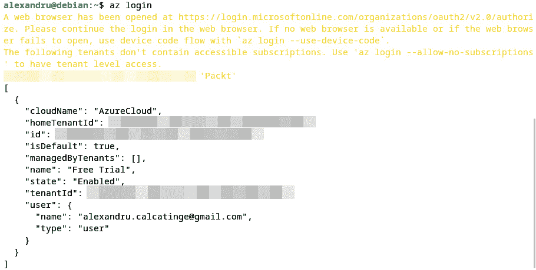

图 15.44 – 初始化 Azure CLI 环境

此时，我们已准备好使用 Azure CLI 进行管理操作。让我们在`West` `US`区域创建一个名为`packt-dev`的新资源组：

```
az group create --name packt-dev --location francecentral
```

前面的命令在成功创建资源组后将产生以下输出：

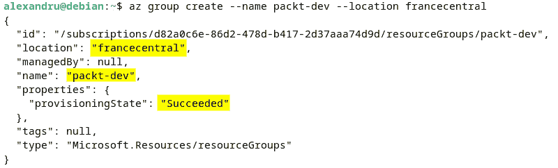

图 15.45 – 创建新的资源组

接下来，我们必须在刚刚创建的区域启动一个名为`packt-ubuntu-dev`的 Ubuntu 虚拟机：

```
az vm create --resource-group packt-dev --name packt-ubuntu-dev --image Ubuntu2204 --admin-username packt --generate-ssh-keys
```

让我们快速浏览一下前面提到的每个命令行选项：

+   `resource-group`：我们创建虚拟机的资源组名称（`packt-dev`）

+   `name`：虚拟机的名称（`packt-ubuntu-dev`）

+   `image`：要使用的 Linux 发行版（`Ubuntu2204`）

+   `admin-username`：机器管理员账户的用户名（`packt`）

+   `generate-ssh-keys`：这将生成一对新的 SSH 密钥，用于访问我们的虚拟机

前面的代码会产生以下输出：

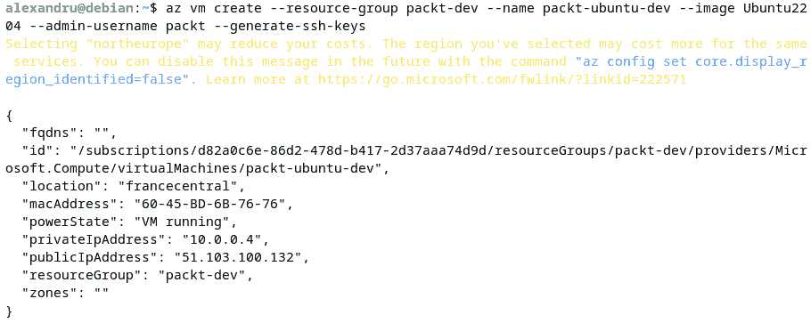

图 15.46 – 创建新的虚拟机

如输出所示，SSH 密钥文件已自动生成并放置在本地机器的`~/.ssh`目录中，以允许通过 SSH 访问新创建的虚拟机。JSON 输出还提供了机器的公共 IP 地址：

```
"publicIpAddress": "51.103.100.132"
```

以下命令列出所有虚拟机：

```
az vm list
```

你也可以在浏览器中查看 Azure 门户，查看所有虚拟机，包括新创建的虚拟机：

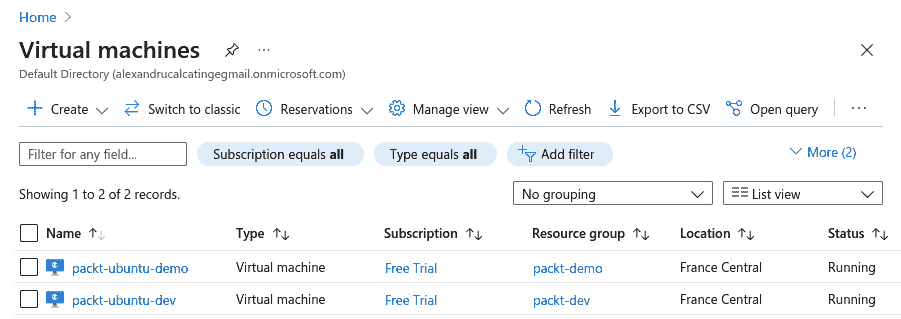

图 15.47 – 在 Azure 门户中查看虚拟机

要获取关于特定虚拟机（`packt-ubuntu-dev`）的信息，请运行以下命令：

```
az vm show \
  --resource-group packt-dev \
  --name packt-ubuntu-dev), run the following command:

```

az vm redeploy \

--resource-group packt-dev \

--name packt-ubuntu-dev):

```
az vm delete \
  --resource-group packt-dev \
  --name az vm), we also need to specify the resource group the machine belongs to.
A comprehensive study of the Azure CLI is beyond the scope of this chapter. For detailed information, please visit the Azure CLI’s online documentation portal: [`docs.microsoft.com/en-us/cli/azure/`](https://docs.microsoft.com/en-us/cli/azure/).
This concludes our coverage of public cloud deployments with AWS and Azure. We have covered a vast domain and have merely skimmed the surface of cloud management workloads. We encourage you to build upon this preliminary knowledge and explore more, starting with the AWS and Azure cloud docs. The relevant links are mentioned in the *Further reading* section, together with other valuable resources.
Now, let’s summarize what you have learned so far about AWS and Azure.
Summary
AWS and Azure provide a roughly similar set of features for flexible compute capacity, storage, and networking, with pay-as-you-go pricing. They share the essential elements of a public cloud – elasticity, autoscaling, provisioning with self-service, security, and identity and access management. This chapter explored both cloud providers strictly from a practical vantage point, focusing on typical deployment and management aspects of everyday cloud administration tasks.
We covered topics such as launching and terminating a new instance or virtual machine. We also looked at resizing an instance to accommodate a higher or lower compute capacity and scaling the storage by creating and attaching additional block devices (volumes). Finally, we used CLI tools for scripting various cloud management workloads.
When working with AWS, we learned a few basic concepts about EC2 resources. Next, we looked at typical cloud management tasks, such as launching and managing instances, adding and configuring additional storage, and using EBS snapshots for disaster recovery. Finally, we explored the AWS CLI with hands-on examples of standard operations, including querying and launching EC2 instances, creating and adding additional storage to an instance, and terminating an instance.
At this point, you should be familiar with the AWS and Azure web administration consoles and CLI tools. You have learned the basics of some typical cloud management tasks and a few essential concepts about provisioning cloud resources. Overall, you’ve enabled a special skillset of modern-day Linux administrators by engaging in cloud-native administration workflows. Combined with the knowledge you’ve built so far, you are assembling a valuable Linux administration toolbelt for on-premises, public, and hybrid cloud systems management.
In the next chapter, we’ll take this further and introduce you to managing application deployments using containerized workflows and services with Kubernetes.
Questions
Let’s recap some of the concepts you’ve learned about in this chapter as a quiz:

1.  What is an AZ?
2.  Between a `t3.small` and a `t3.micro` AWS EC2 instance type, which one yields better performance?
3.  You have launched an AWS EC2 instance in the `us-west-1a` AZ and plan to attach an EBS volume created in `us-west-1b`. Would this work?
4.  What is the SSH command to connect to your AWS EC2 instance or Azure virtual machine?
5.  What is the Azure CLI command for listing your virtual machines? How about the equivalent AWS CLI command?
6.  What is the AWS CLI command for launching a new EC2 instance?
7.  What is the Azure CLI command for deleting a virtual machine?

Further reading
Here are a few resources to further explore AWS and Azure cloud topics:

*   AWS EC2: [`docs.aws.amazon.com/ec2/index.html`](https://docs.aws.amazon.com/ec2/index.html)
*   Azure: [`docs.microsoft.com/en-us/azure`](https://docs.microsoft.com/en-us/azure)
*   *AWS for System Administrators*, by Prashant Lakhera, Packt Publishing
*   *Learning AWS – Second Edition*, by Aurobindo Sarkar and Amit Shah, Packt Publishing
*   *Learning Microsoft Azure*, by Geoff Webber-Cross, Packt Publishing
*   *Learning Microsoft Azure: A Hands-On Training [Video]*, by Vijay Saini, Packt Publishing

```

```

```

```

```
