# 16

# 使用 Kubernetes 部署应用程序

无论你是管理容器化应用程序的资深系统管理员，还是自动化应用编排工作流的 DevOps 工程师，**Kubernetes** 都可能是你首选的平台。本章将介绍 Kubernetes，并指导你完成构建和配置 **Kubernetes 集群** 的基本过程。我们将使用 Kubernetes 在一个安全且高可用的环境中运行和扩展一个简单的应用程序。你还将学会如何通过**命令行界面**（**CLI**）与 Kubernetes 进行交互。

到本章结束时，你将学会如何在本地环境中安装、配置和管理 Kubernetes 集群。我们还将向你展示如何使用 Kubernetes 部署和扩展应用程序。

以下是本章将要覆盖的主题的简要提纲：

+   介绍 Kubernetes 架构和 API 对象模型

+   安装和配置 Kubernetes

+   使用 `kubectl` 命令行工具与 Kubernetes 交互并部署应用程序

# 技术要求

你应该熟悉 Linux 和一般的命令行界面（CLI）。如果你对**TCP/IP 网络**和**Docker** 容器有一定了解，这将大大简化你学习 Kubernetes 的过程。

你还需要以下内容：

+   一台本地桌面机器，安装你选择的 Linux 发行版，以便安装和实验本章中使用的 CLI 工具。我们将使用 Debian 和 Ubuntu LTS。

+   一台性能强大的桌面系统，至少拥有 8 个 CPU 核心和至少 16 GB 内存，将使你能够在桌面上复制所需的环境，因为我们将花费相对较多的篇幅讲解如何使用虚拟机构建 Kubernetes 集群。

+   一个桌面虚拟化管理程序。

现在，让我们一起开始探索 Kubernetes 的旅程。

# 介绍 Kubernetes

Kubernetes 是一个开源的**容器编排工具**，最初由谷歌开发。容器编排工具是自动管理（包括资源配置、部署和扩展）容器化应用程序的软件。如果一个应用程序使用了容器化的微服务，容器编排系统将提供以下功能：

+   **弹性编排（自动扩展）**：这包括根据特定的需求和条件，自动启动和停止应用程序服务（容器）——例如，当请求数量增加时，启动多个 Web 服务器实例，最终当请求数量降到某个阈值以下时终止服务器。

+   **工作负载管理**：这涉及到将应用服务最佳地部署和分配到底层集群，以确保必要的依赖关系和冗余——例如，在每个集群节点上运行 Web 服务器端点，以保证高可用性。

+   **基础设施抽象**：这涉及提供容器运行时、网络和负载均衡功能——例如，将负载分配到多个 Web 服务器容器之间，并自动配置与数据库应用容器的底层网络连接。

+   **声明式配置**：这涉及描述并确保多层应用的期望状态——例如，只有在数据库后端运行且底层存储可用时，Web 服务器才应准备好处理请求。

一个经典的工作负载编排示例是视频点播流媒体服务。在一部受欢迎的新电视节目需求量很大的情况下，流媒体请求的数量将显著超过常规季节的平均水平。使用**Kubernetes**，我们可以根据流媒体会话的数量扩展 web 服务器的数量。我们还可以控制某些中间层组件的可能扩展，例如数据库实例（处理身份验证请求）和存储缓存（处理视频流）。当该电视节目过时且请求数量显著下降时，Kubernetes 会终止多余的实例，自动减少应用部署的占用空间，并因此降低底层成本。

以下是使用 Kubernetes 部署应用的一些关键好处：

+   **快速部署**：应用容器的创建和启动相对较快，使用**声明式**或**命令式**配置模型（我们将在本章后面“介绍 Kubernetes 对象模型”一节中看到）。

+   **快速迭代**：应用升级相对简单，底层基础设施只需无缝地替换相关容器。

+   **快速恢复**：如果应用崩溃或无法使用，Kubernetes 会通过替换相关容器自动将应用恢复到期望状态。

+   **降低运营成本**：Kubernetes 的容器化环境和基础设施抽象带来了最小的管理和维护工作，并且运行应用所需的资源相对较低。

现在我们已经介绍了 Kubernetes，让我们接下来看看它的基本操作原理。

## 理解 Kubernetes 架构

Kubernetes 工作模型的核心有三个主要概念：

+   **声明式配置或期望状态**：这个概念描述了整体应用状态和微服务，部署所需的容器和相关资源，包括网络、存储和负载均衡器，以实现应用的运行功能状态。

+   **控制器或控制器循环**：这会监控系统的期望状态，并在需要时采取纠正措施，例如替换失败的应用容器或为扩展工作负载添加额外资源。

+   **API 对象模型**：该模型表示期望状态的实际实现，使用各种配置对象以及这些对象之间的交互——即**应用程序编程接口**（**API**）

为了更好地理解 Kubernetes 的内部，我们需要更深入地了解 Kubernetes 对象模型和相关 API。此外，您可以查看*图 16.1*，以获取 Kubernetes（集群）架构的可视化解释。

## 介绍 Kubernetes 对象模型

Kubernetes 架构定义了一组表示系统期望状态的对象。在这个上下文中，**对象**是一个程序化术语，用来描述子系统的行为。多个对象通过 API 相互交互，随着时间推移塑造期望状态。换句话说，Kubernetes 对象模型是期望状态的程序化表示。

那么，Kubernetes 中的这些对象是什么呢？我们将简要列举一些更重要的对象，并在接下来的章节中进一步详细阐述它们：API 服务器、Pods、控制器、服务和存储。

我们使用这些 API 对象来配置系统的状态，使用声明式或命令式模型：

+   使用**声明式配置模型**，我们描述系统的状态，通常通过配置文件或清单（YAML 或 JSON 格式）。这样的配置可以包含并部署多个 API 对象，并将系统视为一个整体。

+   **命令式配置模型**使用单独的命令来配置和部署特定的 API 对象，通常作用于单一目标或子系统。

让我们先来看看 API 服务器——Kubernetes 对象模型中的核心部分。

### 介绍 API 服务器

API 服务器是 Kubernetes 对象模型的核心枢纽，作为管理端点，表示系统的期望状态。API 服务器通过 HTTP REST 接口暴露 JSON 负载。它可以通过两种方式访问：

+   **内部**：由其他 API 对象在内部访问

+   **外部**：通过配置和管理工作流在外部访问

API 服务器本质上是与 Kubernetes 集群交互的网关，既可以从外部也可以从内部访问。Kubernetes 集群是由不同节点组成的框架，节点运行容器化的应用程序。集群是 Kubernetes 自身的基本运行模式。关于 Kubernetes 集群的更多内容将在*Kubernetes 集群解剖*部分中提供。系统管理员通过 CLI 连接到 API 服务器端点，配置和管理 Kubernetes 集群。内部，Kubernetes API 对象连接到 API 服务器，以提供其状态的更新。作为回报，API 服务器可能会进一步调整 API 对象的内部配置，以实现期望状态。

API 对象是 Kubernetes 集群内部配置或期望状态的构建模块。接下来，我们将介绍一些这些 API 对象。

### 介绍 Pods

**Pod** 代表 Kubernetes 中的基本工作单元，作为单容器或多容器应用程序运行。Pod 也被称为 Kubernetes 中的**调度单元**。换句话说，同一 Pod 内的容器保证会一起部署在同一个集群节点上。

Pod 本质上代表了应用程序服务网格中的一个微服务（或服务）。以经典的 Web 应用为例，我们可能在集群中运行以下 Pod：

+   Web 服务器（Nginx）

+   身份认证（Vault）

+   数据库（PostgreSQL）

+   存储（NAS）

每个服务（或应用程序）都在其 Pod 中运行。相同应用程序的多个 Pod（例如，Web 服务器）组成一个**ReplicaSet**。我们将在*引入* *控制器* 部分更详细地了解 ReplicaSets。

Pod 的一些基本特性如下：

+   它们具有**短暂的特性**。一旦 Pod 被终止，它就永远消失。在 Kubernetes 中，Pod 永远不会被重新部署。因此，除非 Pod 使用持久存储或本地卷来保存数据，否则它们的状态不会持久存在。

+   Pod 是一个**最小单位**——它们要么被部署，要么不被部署。对于单容器的 Pod，原子性几乎是理所当然的。对于多容器的 Pod，原子性意味着只有当每个容器都成功部署时，Pod 才会被部署。如果任何一个容器部署失败，Pod 就不会被部署，因此没有 Pod。如果运行中的多容器 Pod 中的某个容器失败，整个 Pod 将会被终止。

+   Kubernetes 使用**探针**（如存活性探针和就绪探针）来监控 Pod 中应用程序的健康状况。这是因为 Pod 可能已经被部署并运行，但这并不一定意味着 Pod 内的应用程序或服务是健康的。例如，Web 服务器 Pod 可能有一个探针检查特定的 URL，并根据响应来判断其健康状态。

Kubernetes 使用控制器跟踪 Pod 的状态。接下来我们来看看控制器。

### 引入控制器

Kubernetes 中的**控制器**是控制循环，负责保持系统处于期望状态，或通过不断监控集群的状态使系统更接近期望状态。例如，控制器可能会检测到一个 Pod 没有响应，并请求部署一个新的 Pod，同时终止旧的 Pod。我们来看看两种关键的控制器类型：

+   控制器还可以将特定类型的 Pod 添加到或从 Pod 副本集合中移除。这种控制器被称为**ReplicaSets**，它们的责任是根据应用程序当前的状态容纳特定数量的 Pod 副本。例如，假设一个应用程序需要三个 Web 服务器 Pod，而其中一个由于探针失败变得不可用。在这种情况下，ReplicaSet 控制器确保删除失败的 Pod，并用一个新的 Pod 替代它。

+   在 Kubernetes 中部署应用时，我们通常不会直接使用 ReplicaSet 来创建 Pod。我们使用 `v1` 来创建几个运行应用版本 1 的 Pod，我们希望将它们升级到版本 2。记住，Pod 无法重新生成或升级。相反，我们将定义第二个 ReplicaSet（`v2`），创建版本 2 的 Pod。Deployment 控制器会拆除 `v1` ReplicaSet 并启动 `v2`。Kubernetes 会无缝地执行发布，几乎没有服务中断。Deployment 控制器管理 `v1` 和 `v2` ReplicaSet 之间的过渡，并在需要时回滚过渡。

Kubernetes 中还有许多其他类型的控制器，我们鼓励你在 [`kubernetes.io/docs/concepts/workloads/controllers/`](https://kubernetes.io/docs/concepts/workloads/controllers/) 上探索它们。

随着应用的扩展或终止，相关的 Pod 会被部署或移除。服务提供对动态且短暂的 Pod 世界的访问。接下来我们将讨论服务。

### 引入服务

**服务**提供对运行在 Pod 中应用的持久访问。服务的责任是通过将流量路由到相应的应用端点来确保 Pod 可访问。换句话说，服务通过 IP 地址、路由和 DNS 解析为与 Pod 的通信提供了网络抽象。由于 Pod 会根据系统的期望状态进行部署或终止，Kubernetes 会动态更新 Pod 的服务端点，几乎不会中断访问相关应用。随着用户和应用访问服务端点的持久 IP 地址，服务将确保路由信息是最新的，并且流量仅会路由到正在运行且健康的 Pod。服务还可以用于在 Pod 之间进行负载均衡，根据需求扩展或缩减 Pod 数量。

到目前为止，我们已经讨论了控制应用服务部署、访问和生命周期的 Kubernetes API 对象。那么，应用所需的持久数据呢？接下来我们将讨论 Kubernetes 存储。

### 引入存储

Kubernetes 为集群内运行的应用提供了多种存储类型。最常见的存储类型是 **卷** 和 **持久卷**。由于 Pod 的短暂性，通过卷在 Pod 中存储的应用数据会在 Pod 终止时丢失。持久卷是在 Kubernetes 集群级别定义和管理的，且独立于 Pod。需要持久状态的应用（Pod）会保留一个持久卷（特定大小），通过 **持久卷声明** 来使用。当使用持久卷的 Pod 终止时，替代旧 Pod 的新 Pod 会从持久卷中检索当前状态，并继续使用底层存储。

如需了解更多关于 Kubernetes 存储类型的信息，请参考 [`kubernetes.io/docs/concepts/storage/`](https://kubernetes.io/docs/concepts/storage/)。

现在我们已经熟悉了 Kubernetes API 对象模型，让我们快速浏览一下 Kubernetes 集群的架构。

## Kubernetes 集群的结构

一个 Kubernetes 集群由一个 **控制平面**（**CP**）**节点**和一个或多个 **工作节点**组成。下图展示了 Kubernetes 架构的高层次视图：

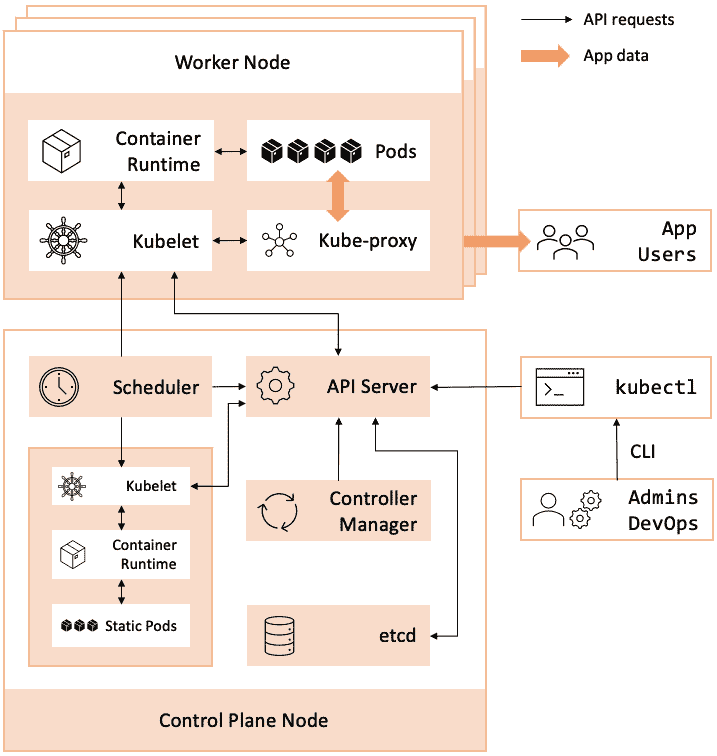

图 16.1 – Kubernetes 集群架构

前面图示中的 Kubernetes 集群组件被划分为工作节点和 CP 节点这两个主要部分。工作节点具有不同的组件，如容器运行时、kubelet 和 kube-proxy，而 CP 节点则有 API 服务器、控制器管理器和调度器。所有这些组件将在后续部分详细讨论。

首先，让我们详细看看前面图示中的 Kubernetes 集群节点，从 CP 节点开始。

### 介绍 Kubernetes CP

**Kubernetes CP** 提供了部署和编排应用工作负载所需的基本服务，并且运行在 Kubernetes 集群中的专用节点——CP 节点上。这个节点，也称为 **主节点**，实现了 Kubernetes 集群的核心组件，如资源调度和监控。它还是集群管理的主要访问点。以下是 CP 节点的关键子系统：

+   **API 服务器**：Kubernetes API 对象之间的中央通信枢纽；它还提供集群管理端点，可以通过命令行界面（CLI）或 Kubernetes Web 管理控制台（仪表板）访问。

+   **调度器**：根据资源分配和管理策略决定何时以及将哪些节点部署到 pod 上。

+   **控制器管理器**：它维护控制循环，监控并塑造系统的期望状态。

+   **etcd**：也称为 **集群存储**，这是一个高度可用的持久化数据库，维护 Kubernetes 集群及相关 API 对象的状态；etcd 中的信息以键值对的形式存储。

+   `kubectl`：用于管理和与 Kubernetes 集群交互的主要命令行工具；`kubectl` 直接与 API 服务器通信，并可以远程连接到集群。

Kubernetes CP 的详细架构概述超出了本章的范围。你可以在 [`kubernetes.io/docs/concepts/architecture/`](https://kubernetes.io/docs/concepts/architecture/) 上深入探索相关概念。

接下来，让我们简要了解一下 Kubernetes 节点——Kubernetes 集群的“工作马”。

### 介绍 Kubernetes 节点

在 Kubernetes 集群中，**节点**——也称为 **工作节点**——运行实际的应用程序 Pods 并维护它们的完整生命周期。节点提供 Kubernetes 的计算能力，并确保在部署和运行 Pods 时，工作负载均匀地分布在集群中。节点可以配置为物理（裸金属）或虚拟机（VM）。

让我们列举 Kubernetes 节点的关键元素：

+   **Kubelet**：处理调度器发送的 CP 请求，用于部署和启动应用程序 Pods；Kubelet 还监视节点和 Pod 的状态，将相关变化报告给 API 服务器。

+   **Kube-Proxy**：动态配置在 Pods 中运行的应用程序的虚拟网络环境；它负责路由网络流量、提供负载均衡，并维护 Services 和 Pods 的 IP 地址。

+   `containerd` 和 Docker)

之前提到的所有服务都会在 Kubernetes 集群中的 *每个* 节点上运行，包括 CP 节点。这些 CP 中的组件是由专用 Pods 提供的，提供特定的 CP 服务，例如 DNS、Ingress（负载均衡）和 Dashboard（Web 控制台）。

想了解更多关于 Kubernetes 节点和相关架构概念的信息，请访问 [`kubernetes.io/docs/concepts/architecture/nodes/`](https://kubernetes.io/docs/concepts/architecture/nodes/)。

现在我们已经熟悉了一些关键概念和集群组件，让我们准备好安装和配置 Kubernetes。

# 安装和配置 Kubernetes

在安装或使用 Kubernetes 之前，你需要决定使用的基础设施，无论是本地还是公有云。其次，你需要在 **基础设施即服务** (**IaaS**) 或 **平台即服务** (**PaaS**) 模式之间做出选择。选择 IaaS 后，你需要自己安装、配置、管理和维护 Kubernetes 集群，无论是安装在物理机器（裸金属）还是虚拟机上。相关操作工作不简单，需要仔细考虑。如果你选择 PaaS 解决方案，所有主要公有云提供商都提供该服务，你将仅限于执行管理任务，而无需承担维护底层基础设施的负担。

本章我们将仅介绍 Kubernetes 的 IaaS 部署。对于 IaaS，我们将使用运行 Ubuntu 虚拟机的本地桌面环境。

对于本地安装，我们还可以选择 Kubernetes 的轻量级桌面版本或具有多个节点的完整集群。接下来让我们看看一些常见的 Kubernetes 桌面版本。

## 在桌面上安装 Kubernetes

如果你只是想尝试 Kubernetes，桌面版可能正合适。Kubernetes 的桌面版本通常在本地机器上部署一个单节点集群。根据你选择的平台，无论是 Windows、macOS 还是 Linux，你都有很多 Kubernetes 引擎可以选择。以下是其中的一些：

+   **Docker Desktop (macOS,** **Windows)**: [`www.docker.com/products/docker-desktop`](https://www.docker.com/products/docker-desktop)

+   **minikube (Linux, macOS,** **Windows)**: [`minikube.sigs.k8s.io/docs/`](https://minikube.sigs.k8s.io/docs/)

+   **Microk8s (Linux, macOS,** **Windows)**: [`microk8s.io/`](https://microk8s.io/)

+   **k3s (****Linux)**: [`k3s.io/`](https://k3s.io/)

在本节中，我们将展示如何安装 Microk8s，这是一款在写作时非常流行的 Kubernetes 桌面引擎。Microk8s 可以通过 Snap Store 安装。我们将使用 Debian 12 作为测试计算机的基础操作系统，以便从 Snap Store 安装 Microk8s。如果你没有安装`snapd`，你需要先进行安装。你需要使用以下命令来安装 Snap 守护进程：

```
sudo apt install snapd
```

如果你已经安装了`snapd`，你可以跳过这第一步。接下来的步骤是运行命令，安装运行 Snap Store 所需的`snapd`核心运行时环境：

```
sudo snap install core
```

只有在安装了`snap`之后，你才能使用以下命令安装`microk8s`：

```
sudo snap install microk8s --classic
```

成功安装 Microk8s 后应显示以下结果：

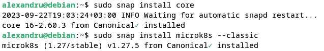

图 16.2 – 在 Linux 上安装 Microk8s

由于我们已经安装了`snapd`，因此没有运行之前列出的第一个命令。

为了在没有`sudo`权限的情况下访问 Microk8s CLI，你需要将本地用户账户添加到`microk8s`组中，并使用以下命令修复`~/.kube`目录的权限：

```
sudo usermod -aG microk8s $USER
sudo chown -f -R $USER ~/.kube
```

这些更改将在下次登录时生效，你可以在不使用`sudo`的情况下调用`microk8s`命令行工具。例如，以下命令显示该工具的帮助信息：

```
microk8s help
```

要查看本地单节点 Microk8s Kubernetes 集群的状态，我们运行以下命令：

```
microk8s status
```

如你所见，Microk8s 在 Debian 上的安装步骤直接且与 Ubuntu 上使用的步骤类似。

在下一部分，我们将展示如何在虚拟机上安装 Microk8s。这次我们将使用 Ubuntu 22.04 LTS 作为虚拟机的基础操作系统。

## 在虚拟机上安装 Kubernetes

在本节中，我们将通过在 Ubuntu 虚拟机上部署 Kubernetes 集群，模拟一个更接近真实世界的 Kubernetes 环境——虽然规模要小得多。你可以使用任何虚拟化管理程序，如 KVM、Oracle VirtualBox 或 VMware Fusion。我们将使用 KVM 作为首选的虚拟化管理程序。

我们将创建四个虚拟机，每个虚拟机配置 2 个 vCPU 核心、2 GB 内存和 20 GB 磁盘容量。你可以按照*第一章*中*安装 Ubuntu*部分的步骤，使用你选择的虚拟化管理程序进行操作。

在我们深入 Kubernetes 集群安装细节之前，先快速了解一下我们的实验环境。

### 准备实验环境

下面是我们虚拟机环境的规格：

+   **虚拟化管理程序**: VMware Fusion

+   **Kubernetes 集群**: 一个 CP 节点和三个工作节点

+   `k8s-cp1`: `192.168.122.104`

+   `k8s-n1`: `192.168.122.146`*   `k8s-n2`: `192.168.122.233`*   `k8s-n3`: `192.168.122.163`*   **虚拟机**: Ubuntu Server 22.04.3 LTS，2 个 vCPU，2 GB 内存，20 GB 硬盘*   `packt`（所有节点），启用 SSH 访问

我们在每个虚拟机节点的 Ubuntu Server 安装向导中设置了用户名和主机名。并且在提示时，确保启用 OpenSSH 服务器。你的虚拟机 IP 地址可能与规格中的不同，但这不应该影响。你也可以选择为虚拟机使用静态 IP 地址。

为了简化集群内部的主机名解析，编辑每个节点上的 `/etc/hosts` 文件并添加相关记录。例如，我们在 CP 节点（`k8s-cp1`）上有如下的 `/etc/hosts` 文件：

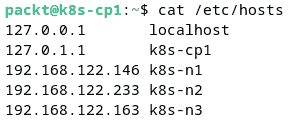

图 16.3 – CP 节点（k8s-cp1）的 /etc/hosts 文件

在生产环境中，启用防火墙的集群节点，我们必须确保为接受集群内部的网络流量配置以下规则（参考 [`kubernetes.io/docs/setup/production-environment/tools/kubeadm/install-kubeadm/`](https://kubernetes.io/docs/setup/production-environment/tools/kubeadm/install-kubeadm/)）：

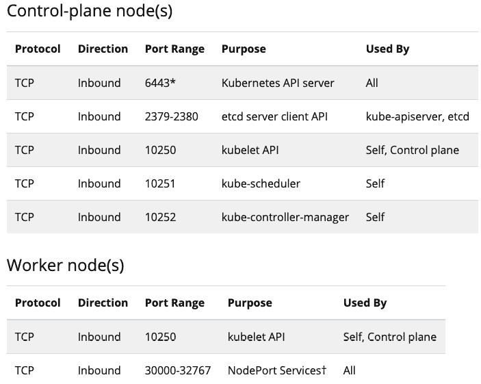

图 16.4 – Kubernetes 集群节点使用的端口

以下各节假设你已经按照前述规格准备并运行了虚拟机。在继续执行下一步之前，你可以先拍摄一些虚拟机的初始快照。如果安装过程中出现任何问题，你可以恢复到初始状态并重新开始。

以下是我们安装 Kubernetes 集群的步骤：

1.  禁用交换。

1.  安装 `containerd`。

1.  安装 `kubelet`、`kubeadm` 和 Kubernetes 包。

我们需要在每个集群节点上执行这些步骤。相关命令也可以在 GitHub 上附带的章节源代码中找到。

让我们从第一步开始，禁用每个节点的内存交换。

### 禁用交换

`swap` 是在内存满时使用的磁盘空间（参考 [`github.com/kubernetes/kubernetes/issues/53533`](https://github.com/kubernetes/kubernetes/issues/53533) 获取更多详细信息）。Kubernetes 的 kubelet 包在 Linux 平台上无法与启用 `swap` 的系统一起使用。这意味着我们需要禁用所有节点上的 `swap`。

为了立即禁用 `swap`，我们需要在每个虚拟机上运行以下命令：

```
sudo swapoff -a
```

为了在系统重启后保持禁用 `swap`，我们需要在 `/etc/fstab` 中注释掉与 `swap` 相关的条目。你可以手动编辑 `/etc/fstab`，或者使用以下命令：

```
sudo sed -i '/\s*swap\s*/s/^\(.*\)$/# \1/g' /etc/fstab
```

你可能需要再次检查 `/etc/fstab` 中的所有 `swap` 条目是否被禁用：

```
cat /etc/fstab
```

我们可以在 `/etc/fstab` 文件中看到 `swap` 挂载点已被注释掉：

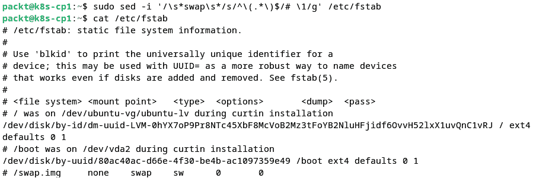

图 16.5 – 在 /etc/fstab 中禁用 swap 条目

请记住，在集群中的每个节点上运行上述命令。接下来，我们将着手安装 Kubernetes 容器运行时。

### 安装 containerd

`containerd` 是 Kubernetes 最近版本中默认的容器运行时。`containerd` 实现了 Kubernetes 容器引擎抽象层所需的 CRI。相关的安装过程并不简单，我们将在编写本文时，按照官方 Kubernetes 文档中的步骤进行操作，文档链接如下：[`kubernetes.io/docs/setup/production-environment/container-runtimes/`](https://kubernetes.io/docs/setup/production-environment/container-runtimes/)。这些步骤可能会随时更改，因此请确保查看最新的安装流程。容器运行时需要在集群中的每个节点上安装。我们将从安装 CP 节点（名为 `k8s-cp1`）的所需组件开始，然后在其他节点上继续安装。

我们将首先安装一些 `containerd` 的先决条件：

1.  首先，我们使用 `modprobe` 启用 `br_netfilter` 和 `overlay` 内核模块：

    ```
    sudo modprobe br_netfilter
    sudo modprobe overlay
    ```

1.  我们还确保在系统重启时加载这些模块：

    ```
    cat <<EOF | sudo tee /etc/modules-load.d/containerd.conf
    br_netfilter
    overlay
    sysctl parameters, also persisted across system reboots:

    ```

    cat <<EOF | sudo tee /etc/sysctl.d/containerd.conf

    net.bridge.bridge-nf-call-iptables = 1

    net.bridge.bridge-nf-call-ip6tables = 1

    net.ipv4.ip_forward = 1

    EOF

    ```

    ```

1.  我们希望上述更改立即生效，而无需重启系统：

    ```
    sudo sysctl --system
    ```

    以下是显示前述命令的截图：

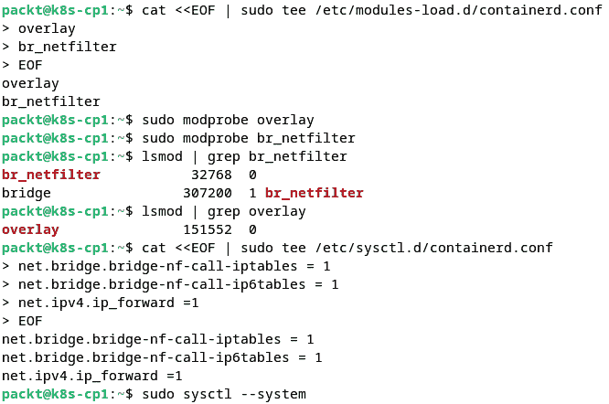

图 16.6 – 设置 containerd 先决条件

1.  接下来，我们将通过运行以下命令验证 `sysctl` 配置中是否启用了特定的系统变量：

    ```
    sudo sysctl net.bridge.bridge-nf-call-iptables net.bridge.bridge-nf-call-ip6tables net.ipv4.ip_forward
    ```

    命令的输出应如下所示：

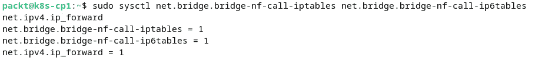

图 16.7 – 验证 sysctl 配置中的系统变量

每个变量的值应为 `1`，正如前面截图所示。

1.  现在，让我们确保在安装任何新软件包之前，`apt` 仓库是最新的：

    ```
    containerd:

    ```

    containerd 配置：

    ```
    sudo mkdir -p /etc/containerd
    config.toml inside it. The output of the command is too large to show, but it will show you on the screen the automatically generated contents of the new file we created.
    ```

    ```

    ```

1.  我们需要稍微修改默认的 `containerd` 配置，以使用 `systemd` 的 `cgroup` 驱动程序和容器运行时（`runc`）。此更改是必需的，因为底层平台（在本例中为 Ubuntu）使用 `systemd` 作为服务管理器。使用您选择的编辑器打开 `/etc/containerd/config.toml` 文件，如下所示：

    ```
    [plugins] section of the file):

    ```

    [plugins."io.containerd.grpc.v1.cri".containerd.runtimes.runc]

    ```

    ```

1.  然后，添加突出显示的行，并调整适当的缩进（这*非常*重要）：

    ```
    [plugins."io.containerd.grpc.v1.cri".containerd.runtimes.runc]
      ...
      [plugins."io.containerd.grpc.v1.cri".containerd.runtimes.runc.options]
      SystemdCgroup = true
    ```

    以下是配置片段：

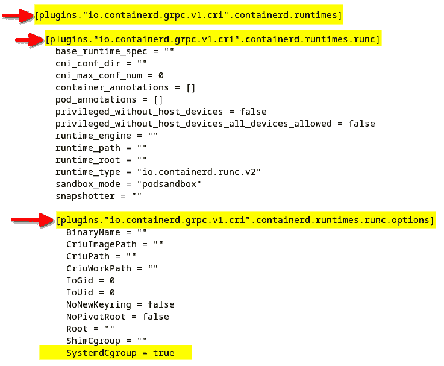

图 16.8 – 修改 containerd 配置

1.  保存 `/etc/containerd/config.toml` 文件并重启 `containerd`：

    ```
    containerd Service, by using the following command:

    ```

    sudo systemctl status containerd

    ```

    The output should show that the system is running and there are no issues.
    ```

安装并配置好 `containerd` 后，我们可以继续进行 Kubernetes 包的安装。

### 安装 Kubernetes 包

要安装 Kubernetes 包，我们将按照 [`kubernetes.io/docs/setup/production-environment/tools/kubeadm/install-kubeadm/`](https://kubernetes.io/docs/setup/production-environment/tools/kubeadm/install-kubeadm/) 上的步骤进行操作。此过程可能随时间变化，因此请确保查看最新的说明。接下来的步骤适用于 Debian 12 和 Ubuntu 22.04。我们开始：

1.  我们首先安装 Kubernetes `apt` 仓库所需的包：

    ```
    apt repository GNU Privacy Guard (GPG) public signing key (for the latest Kubernetes 1.28 at the time of writing):

    ```

    向我们的系统添加 apt 仓库：

    ```
    echo 'deb [signed-by=/etc/apt/keyrings/kubernetes-apt-keyring.gpg] https://pkgs.k8s.io/core:/stable:/v1.28/deb/ /' | sudo tee /etc/apt/sources.list.d/kubernetes.list
    ```

    ```

    ```

1.  让我们查看刚刚添加的新仓库中可用的包：

    ```
    sudo apt update -y
    ```

1.  我们现在准备好安装 Kubernetes 包：

    ```
    apt-mark hold command to pin the version of the Kubernetes packages, including containerd:

    ```

    containerd 和 kubelet 服务在系统启动时（重启）启用：

    ```
    sudo systemctl enable containerd
    containerd Service first:

    ```

    containerd 应该处于活动状态并运行。以下是显示前面命令输出的截图：

    ```

    ```

    ```

    ```

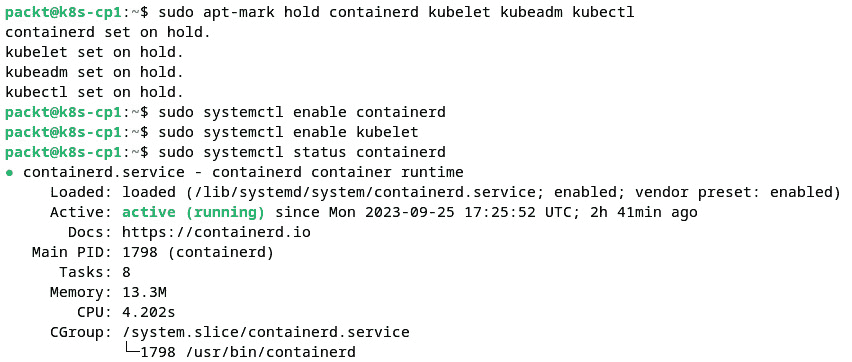

图 16.9 – 固定 Kubernetes 包及 containerd 的运行状态

1.  接下来，让我们检查 `kubelet` 服务的状态：

    ```
    exited:
    ```

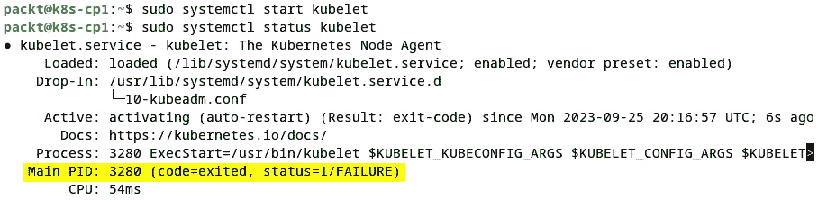

图 16.10 – kubelet 在没有集群配置时崩溃

如上图所示，`kubelet` 正在寻找 Kubernetes 集群，但集群尚未设置。我们可以看到，`kubelet` 尝试启动并激活自身，但由于无法找到所需的配置，它不断崩溃。

重要提示

在继续进行下一部分之前，请按照前面的步骤在*所有*集群节点上安装所需的 Kubernetes 包。

接下来，我们将使用 `kubeadm` 引导（初始化）Kubernetes 集群。

### 介绍 kubeadm

`kubeadm` 是一个用于创建 Kubernetes 集群的辅助工具，主要有两种调用方式：

+   `kubeadm init`：初始化或引导一个 Kubernetes 集群。

+   `kubeadm join`：将一个节点添加到 Kubernetes 集群中。

`kubadm init [flags]` 的默认调用 – 没有标志 – 执行以下任务：

1.  `kubeadm init` 确保我们在 CPU 和内存等系统资源方面具备最小要求，具有必要的用户权限，并且支持 CRI 合规的容器运行时。如果任何检查失败，`kubeadm init` 会停止创建集群的执行。如果检查成功，`kubeadm` 会继续执行下一步。

1.  `kubeadm init` 创建一个 Kubernetes 使用的自签名 CA，用于生成认证和运行集群内可信工作负载所需的证书。CA 文件存储在 `/etc/kubernetes/pki` 目录中，并在节点加入集群时分发到每个节点。

1.  `kubeadm init`创建了启动集群所需的默认 kubeconfig 文件集。kubeconfig 文件存储在`/etc/kubernetes/`目录下。

1.  `kubelet`守护进程。静态 pod 的示例包括 API 服务器、控制器管理器、调度器和 etcd。静态 pod 清单是描述 CP pod 的配置文件。`kubeadm init`在集群启动过程中生成静态 pod 清单。清单文件存储在`/etc/kubernetes/manifests/`目录下。`kubelet`服务监视此位置，当它找到一个清单文件时，会部署相应的静态 pod。

1.  `kubelet`守护进程部署静态 pod，`kubeadm`查询`kubelet`以获取静态 pod 的状态。当静态 pod 启动并运行后，`kubeadm init`将继续进行下一阶段。

1.  `kubeadm init`遵循 Kubernetes 最佳实践，通过污点处理 CP，避免用户 pod 在 CP 节点上运行。显而易见的原因是为了将 CP 资源专门保留给系统相关的工作负载。

1.  `kubeadm init`生成一个启动令牌，可以与受信任的节点共享，以便加入集群。

1.  `kubeadm init`创建并部署*DNS*和*kube-proxy*附加 pod。

Kubernetes 集群启动过程的各个阶段具有高度的可定制性。`kubeadm init`在没有额外参数的情况下运行所有前面的任务。或者，系统管理员可以使用不同的选项参数调用`kubeadm`命令，以控制并运行任何一个阶段。

有关`kubeadm`的更多信息，请使用以下命令查阅该工具的帮助文档：

```
kubeadm help
```

有关使用`kubeadm`启动 Kubernetes 集群的更多信息，包括安装、故障排除和组件定制，您可以参考官方的 Kubernetes 文档：[`kubernetes.io/docs/setup/production-environment/tools/kubeadm/`](https://kubernetes.io/docs/setup/production-environment/tools/kubeadm/)。

在下一节中，我们将使用`kubeadm`启动 Kubernetes 集群，生成集群配置文件，然后调用`kubeadm init`以使用此配置。接下来，我们将通过创建 Kubernetes CP 节点来启动集群。

### 创建 Kubernetes CP 节点

为了创建 CP 节点，我们将使用一个名为`kubeadm`的网络和安全解决方案，之后，我们将使用不同的工具来应用配置。选择 Calico 是完全主观的，但它对于管理工作负载和组件之间的通信是必要的。有关 Calico 的更多信息，请访问以下链接：[`docs.tigera.io/calico/latest/about/`](https://docs.tigera.io/calico/latest/about/)。

命令将在我们的虚拟机环境中的`k8s-cp1`主机上执行。如主机名所示，我们选择`k8s-cp1`作为 Kubernetes 集群的 CP 节点。现在，让我们开始工作并配置我们的 Kubernetes CP 节点：

1.  我们将首先下载用于**覆盖网络**的 Calico 清单。覆盖网络，也被称为**软件定义网络**（**SDN**），是一个逻辑网络层，它支持通过一个可能无法配置的物理网络，在 Pod 之间进行安全且无缝的网络通信。探索集群网络的内部结构超出了本章的范围，但我们鼓励你阅读更多内容，访问 [`kubernetes.io/docs/concepts/cluster-administration/networking/`](https://kubernetes.io/docs/concepts/cluster-administration/networking/)。你还会找到与 Calico 网络插件相关的参考资料。要下载相关清单，我们运行以下命令：

    ```
    calico.yaml file in the current directory (/home/packt/) that we’ll use with kubectl to configure pod networking later in the process.
    ```

1.  接下来，让我们使用文本编辑器打开 `calico.yaml` 文件，并查找以下行（从 *第 3672 行* 开始）：

    ```
    # - name: CALICO_IPV4POOL_CIDR
    CALICO_IPV4POOL_CIDR points to the network range associated with the pods. If the related subnet conflicts in any way with your local environment, you’ll have to change it here. We’ll leave the setting as is.
    ```

1.  接下来，我们将使用 `kubeadm` 创建一个默认的集群配置文件。该配置文件描述了我们正在构建的 Kubernetes 集群的设置。我们将该文件命名为 `k8s-config.yaml`：

    ```
    k8s-config.yaml file we just generated and mention a few changes that we’ll have to make. We will open it using the localAPIEndpoint.advertiseAddress configuration parameter – the IP address of the API server endpoint. The default value is 1.2.3.4, and we need to change it to the IP address of the VM running the CP node (k8s-cp1), in our case, 192.168.122.104. Refer to the *Preparing the lab environment* section earlier in this chapter. You’ll have to enter the IP address matching your environment:
    ```

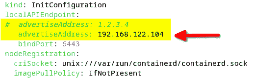

图 16.11 – 修改 advertiseAddress 配置参数

1.  我们需要进行的下一项更改是将 `nodeRegistration.criSocket` 配置参数指向 `containerd` 套接字 `(/run/containerd/containerd.sock)` 和名称（`k8s-cp1`）：

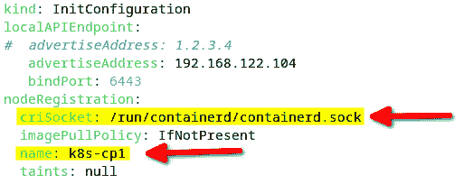

图 16.12 – 更改 criSocket 配置参数

1.  接下来，我们更改 `kubernetesVersion` 参数，以匹配我们的 Kubernetes 环境版本：

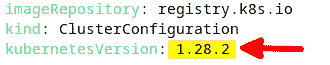

图 16.13 – 更改 kubernetesVersion 参数

默认值是 `1.28.0`，但我们的 Kubernetes 版本，通过以下命令检查，实际为 `1.28.2`：

```
kubeadm version
```

输出结果如下：

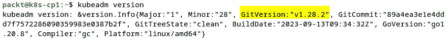

图 16.14 – 获取当前 Kubernetes 版本

1.  我们对集群配置文件的最终修改是将 `kubelet` 的 `cgroup` 驱动程序设置为 `systemd`，以匹配 `containerd` 的 `cgroup` 驱动程序。请注意，`systemd` 是底层平台的服务管理器（在 Ubuntu 中），因此需要将相关的服务控制权限交给 Kubernetes 守护进程。此配置块尚未出现在 `k8s-config.yaml` 中。我们可以手动将其添加到文件的末尾，或使用以下命令添加：

    ```
    cat <<EOF | cat >> k8s-config.yaml
    ---
    apiVersion: kubelet.config.k8s.io/v1beta1
    kind: KubeletConfiguration
    cgroupDriver: systemd
    kubeadm init command with the --config option pointing to the cluster configuration file (k8s-config.yaml), and with the --cri-socket option parameter pointing to the containerd socket:

    ```

    sudo kubeadm init --config=k8s-config.yaml

    ```

    The preceding command takes a couple of minutes to run. A successful bootstrap of the Kubernetes cluster completes with the following output:
    ```

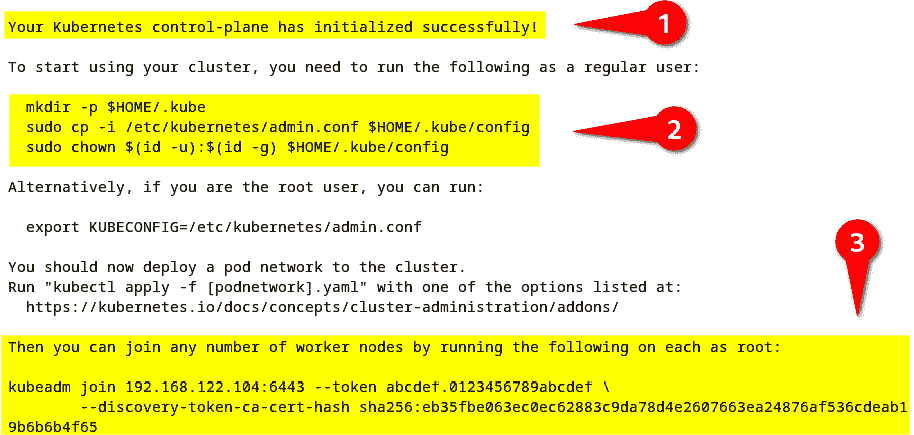

图 16.15 – 成功启动 Kubernetes 集群

此时，我们的 Kubernetes 控制平面节点已经启动并正常运行。在输出中，我们突出显示了以下命令相关的摘录：

+   成功信息（**1**）

+   将当前用户配置为 Kubernetes 集群管理员（**2**）

+   将新节点加入 Kubernetes 集群（**3**）

我们建议花时间仔细查看完整的输出，并根据本章前面 *介绍 kubeadm* 部分的描述，识别与每个 `kubeadm init` 任务相关的信息。

1.  接下来，为了将当前用户配置为 Kubernetes 集群管理员，我们运行以下命令：

    ```
    mkdir -p ~/.kube
    sudo cp -i /etc/kubernetes/admin.conf ~/.kube/config
    sudo chown $(id -u):$(id -g) ~/.kube/config
    ```

1.  在集群正常运行后，让我们部署 Calico 网络清单，以创建 pod 网络：

    ```
    kubectl command to list all the pods in the system:

    ```

    kubectl get pods --all-namespaces

    ```

    The command yields the following output:
    ```

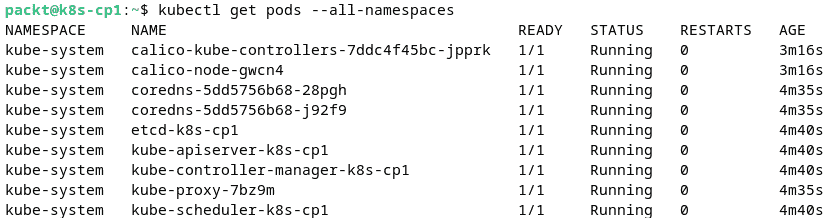

图 16.16 – 获取 Kubernetes 集群中的 pod

`--all-namespaces` 选项用于检索集群中所有资源组中的 pod。Kubernetes 使用 **命名空间** 来组织资源。目前，我们的集群中唯一运行的 pod 是 **系统 pod**，因为我们还没有部署任何 **用户 pod**。

1.  以下命令用于检索集群中的当前节点：

    ```
    k8s-cp1 as the only node configured in the Kubernetes cluster, running as a CP node:
    ```

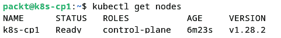

图 16.17 – 列出 Kubernetes 集群中的当前节点

1.  你可能还记得，在初始化 Kubernetes 集群之前，`kubelet` 服务一直在崩溃（并试图重启）。在集群正常运行后，`kubelet` 守护进程的状态应为 `active` 和 `running`：

    ```
    sudo systemctl status kubelet
    ```

    输出显示如下内容：

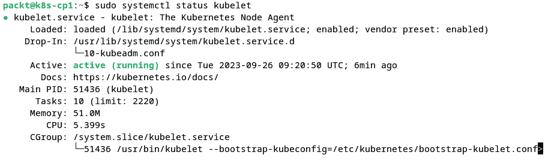

图 16.18 – 集群中的健康 kubelet

1.  我们建议使用以下命令查看 `/etc/kubernetes/manifests/` 目录中为每个集群组件创建的清单：

    ```
    ls /etc/kubernetes/manifests/
    ```

    输出显示了描述静态（系统）pod 的配置文件，分别对应 API 服务器、控制器管理器、调度器和 etcd：

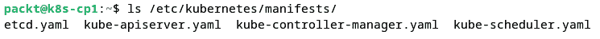

图 16.19 – /etc/kubernetes/manifests/ 中的静态 pod 配置文件

1.  你也可以查看 `/etc/kubernetes` 中的 kubeconfig 文件：

    ```
    ls /etc/kubernetes/
    ```

    正如你可能还记得的，在本章前面 *介绍 kubeadm* 部分中，kubeconfig 文件被集群组件用于与 API 服务器通信和身份验证。

由于我们在本节中广泛使用了 `kubectl` 工具，你可以访问以下链接，查看官方文档，了解更多关于该工具的命令和选项：[`kubernetes.io/docs/reference/generated/kubectl/kubectl-commands`](https://kubernetes.io/docs/reference/generated/kubectl/kubectl-commands)。

接下来，让我们将工作节点添加到 Kubernetes 集群中。

### 将节点加入 Kubernetes 集群

如前所述，在将节点加入 Kubernetes 集群之前，您需要执行本章前面 *准备实验环境* 部分中描述的初步步骤。

要将一个节点加入集群，我们需要使用`kubeadm join`命令，该命令会在引导过程结束时由`kubeadm init`输出。请参考本章前面的*创建 Kubernetes CP 节点*部分。请注意，启动令牌在 24 小时后过期。如果忘记复制该命令，可以通过在 CP 节点（`k8s-cp1`）的终端中运行以下命令来检索相关信息。

要继续，按照以下步骤操作：

1.  检索当前的引导令牌：

    ```
    abcdef.0123456789abcdef):
    ```

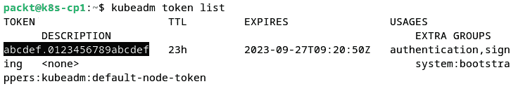

图 16.20 – 获取当前的引导令牌

1.  获取 CA 证书哈希值：

    ```
    openssl x509 -pubkey \
        -in /etc/kubernetes/pki/ca.crt | \
        openssl rsa -pubin -outform der 2>/dev/null | \
        openssl dgst -sha256 -hex | sed 's/^.* //'
    ```

    输出如下：

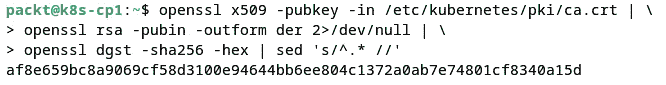

图 16.21 – 获取 CA 证书哈希值

1.  你也可以通过以下命令生成新的引导令牌：

    ```
    kubeadm join command with the required parameters:

    ```

    kubeadm token create --print-join-command

    ```

    ```

现在令牌已创建，我们可以继续执行接下来的引导步骤。

在接下来的步骤中，我们将使用引导过程结束时显示的初始令牌。因此，让我们切换到节点的命令行终端（`k8s-n1`），并运行以下命令：

1.  确保调用`sudo`，否则命令会因权限不足而失败：

    ```
    sudo kubeadm join 192.168.122.104:6443 \
        --token abcdef.0123456789abcdef \
    k8s-cp1):

    ```

    k8s-n1) 已加入集群：

    ```

    ```

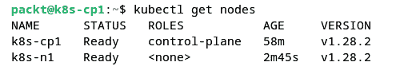

图 16.22 – 新节点（k8s-n1）已加入集群

1.  我们建议你重复加入其他两个集群节点（`k8s-n2` 和 `k8s-n3`）的过程。在加入过程中，当新的节点正在部署 CP pod 时，如果你过快查询 CP 节点上的节点（`k8s-cp1`），你可能会暂时看到新的节点处于`NotReady`状态。这个过程需要一些时间。最终，所有三个节点应该在`kubectl get nodes`命令的输出中显示为`Ready`（在`k8s-cp1`上）：

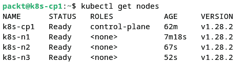

图 16.23 – 所有节点运行中的 Kubernetes 集群

我们现在已完成 Kubernetes 集群的安装，包含一个 CP 节点和三个工作节点。我们使用的是本地（本地虚拟机）环境，但相同的过程也适用于运行在私有或公共云中的托管 IaaS 解决方案。

在接下来的章节中，我们将探讨`kubectl`命令行工具，并使用它来创建和管理 Kubernetes 资源。然后，我们将研究如何使用命令式和声明式部署模型在 Kubernetes 中部署和扩展应用程序。

# 使用 Kubernetes

在本节中，我们将使用与 Kubernetes 集群交互的实际示例。由于我们将在很大程度上使用 `kubectl` CLI，我们将深入探讨其一些常见的使用模式。然后，我们将重点关注将应用程序部署到 Kubernetes 集群的过程。我们将使用在*安装 Kubernetes 到 VM*部分中建立的本地环境。

让我们首先仔细看看 `kubectl` 及其使用方法。

## 使用 kubectl

`kubectl` 是管理 Kubernetes 集群及其资源的主要工具。`kubectl` 使用 Kubernetes 的 REST API 与集群的 API 服务器端点进行通信。`kubectl` 命令的一般语法如下：

```
kubectl [command] [TYPE] [NAME] [flags]
```

通常，`kubectl` 命令执行 **CRUD 操作** —— CRUD 代表 **创建**、**读取**、**更新** 和 **删除** —— 针对 Kubernetes 资源，例如 Pod、Deployment 和 Service。

`kubectl` 的一个重要特性是命令输出格式，可以是 YAML、JSON 或纯文本。输出格式在创建或编辑应用程序部署清单时非常有用。我们可以将 `kubectl` 命令（例如创建资源）的 YAML 输出捕获到一个文件中。稍后，我们可以重用该清单文件，以声明的方式执行相同的操作（或操作序列）。这将引出 Kubernetes 的两种基本部署模式：

+   `kubectl` 命令用于操作特定资源

+   `kubectl apply` 命令，通常是通过一次调用操作一组资源

在本章稍后的*应用程序部署*部分中，我们将更详细地探讨这两种部署模式。目前，让我们回到继续探索 `kubectl` 命令。以下是一些最常见的 `kubectl` 命令的简短列表：

+   `create`, `apply`：这些命令以命令式/声明式方式创建资源

+   `get`：此命令读取资源

+   `edit`, `set`：这些命令更新资源或对象的特定特性

+   `delete`：此命令删除资源

+   `run`：此命令启动一个 Pod

+   `exec`：此命令在 Pod 容器中执行命令

+   `describe`：此命令显示有关资源的详细信息

+   `explain`：此命令提供资源相关的文档

+   `logs`：此命令显示 Pod 容器中的日志

有几个常用的 `kubectl` 参数也值得一提：

+   `--dry-run`：此选项在不修改系统状态的情况下运行命令，同时仍提供如同正常执行时的输出

+   `--output`：此选项指定命令输出的各种格式：`yaml`、`json` 和 `wide`（以纯文本形式显示附加信息）

在接下来的章节中，我们将查看多个使用 `kubectl` 命令的示例。始终记住命令的一般模式：

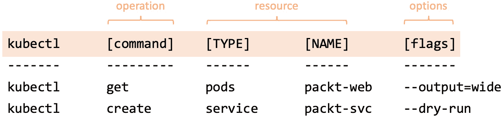

图 16.24 – kubectl 的一般使用模式

我们建议你查看完整的`kubectl`命令参考文档，链接为[`kubernetes.io/docs/reference/kubectl/overview/`](https://kubernetes.io/docs/reference/kubectl/overview/)。在你熟悉`kubectl`的同时，你也可以随时查看相关的备忘单，链接在这里：[`kubernetes.io/docs/reference/kubectl/cheatsheet/`](https://kubernetes.io/docs/reference/kubectl/cheatsheet/)。

现在，让我们准备`kubectl`环境，以便与我们之前使用虚拟机构建的 Kubernetes 集群进行交互。如果你更倾向于在 CP 节点上使用`kubectl`，可以跳过下一节。

### 从本地机器连接到 Kubernetes 集群

在本节中，我们将配置在本地 Linux 桌面上运行的`kubectl` CLI，以便控制远程 Kubernetes 集群。我们的本地机器运行的是 Debian 12。

首先，我们需要在系统上安装`kubectl`。我们将参考[`kubernetes.io/docs/tasks/tools/install-kubectl-linux/`](https://kubernetes.io/docs/tasks/tools/install-kubectl-linux/)中的安装说明。我们将使用以下命令下载最新的`kubectl`版本：

```
curl -LO "kubectl with the following command:

```

sudo install -o root -g root -m 0755 kubectl /usr/local/bin/kubectl

```

 Now that the package is installed, we can test the installation using the following command:

```

kubectl version --client

```

 The output of the preceding commands is shown in the following screenshot:
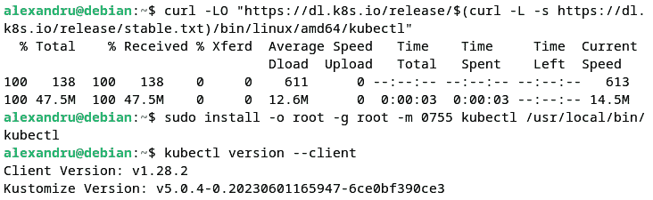

Figure 16.25 – Installing kubectl locally on a Debian system
We want to add (merge) yet another cluster configuration to our environment. This time, we connect to an on-premises Kubernetes CP, and we’ll use `kubectl` to update kubeconfig. Here are the steps we’ll be taking:

1.  We first copy kubeconfig from the CP node (`k8s-cp1`, `192.168.122.104`) to a temporary location `(/tmp/config.cp`):

    ```

    scp packt@192.168.122.104:~/.kube/config /tmp/config.cp

    ```

     2.  Finally, we can move the new kubeconfig file to the new location:

    ```

    mv /tmp/config.cp ~/.kube/config

    ```

     3.  Optionally, we can clean up the temporary files created in the process:

    ```

    rm ~/.kube/config.old /tmp/config.cp

    ```

     4.  Let’s get a view of the current kubeconfig contexts:

    ```

    kubernetes-admin@kubernetes) 和集群名称(kubernetes)：

    ```

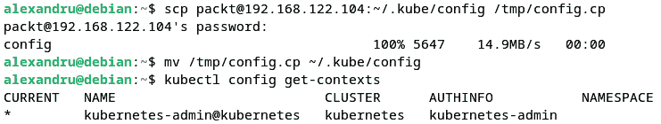

Figure 16.26 – The new kubeconfig contexts

1.  For consistency, let’s change the on-premises cluster’s context name to `k8s-local` and make it the default context in our `kubectl` environment:

    ```

    kubectl config rename-context \

    kubernetes-admin@kubernetes \

    k8s-local

    kubectl 上下文变为 k8s-local，我们现在正在与本地 Kubernetes 集群(kubernetes)交互。以下是输出截图：

    ```

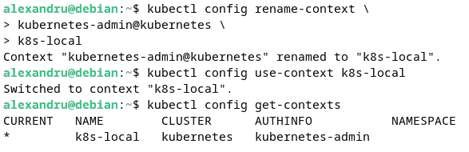

Figure 16.27 – The current context set to the on-premises Kubernetes cluster
Next, we look at some of the most common `kubectl` commands used with everyday Kubernetes administration tasks.
Working with kubectl
One of the first commands we run when connected to a Kubernetes cluster is the following:

```

kubectl cluster-info

```

 The command shows the IP address and port of the API server listening on the CP node, among other information:
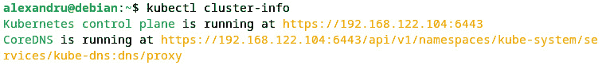

Figure 16.28 – The Kubernetes cluster information shown
The `cluster-info` command can also help to debug and diagnose cluster-related issues:

```

kubectl cluster-info dump

```

 To get a detailed view of the cluster nodes, we run the following command:

```

kubectl get nodes --output=wide

```

 The `--output=wide` (or `-o wide`) flag yields detailed information about cluster nodes. The output in the following illustration has been cropped to show it more clearly:
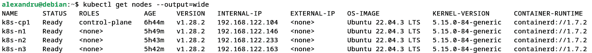

Figure 16.29 – Getting detailed information about cluster nodes
The following command retrieves the pods running in the default namespace:

```

kubectl get pods

```

 As of now, we don’t have any user pods running, and the command returns the following:

```

默认命名空间中未找到资源。

```

 To list all the pods, we append the `--all-namespaces` flag to the preceding command:

```

kubectl get pods --all-namespace

```

 The output shows all pods running in the system. Since these are exclusively system pods, they are associated with the `kube-system` namespace:
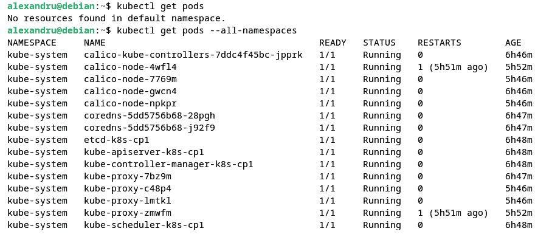

Figure 16.30 – Getting all pods in the system
We would get the same output if we specified `kube-system` with the `--``namespace` flag:

```

kubectl get pods --namespace kube-system

```

 For a comprehensive view of all resources running in the system, we run the following command:

```

kubectl get all --all-namespaces

```

 So far, we have only mentioned some of the more common object types, such as nodes, pods, and Services. There are many others, and we can view them with the following command:

```

kubectl api-resources

```

 The output includes the name of the API object types (such as `nodes`), their short name or alias (such as `no`), and whether they can be organized in namespaces (such as `false`):
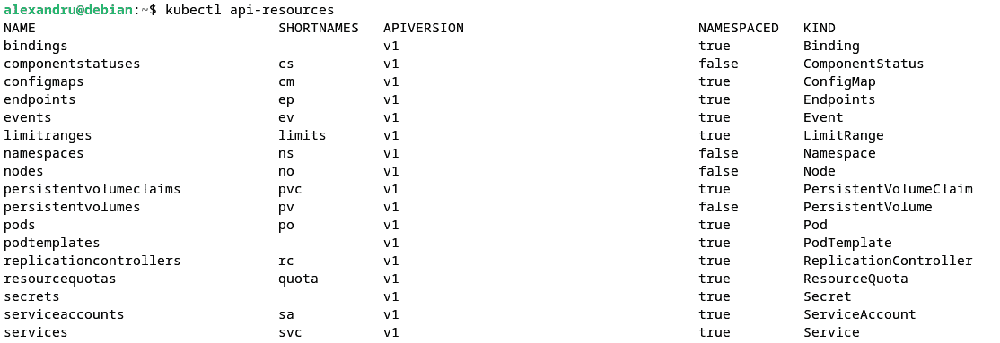

Figure 16.31 – Getting all API object types (cropped)
Suppose you want to find out more about specific API objects, such as `nodes`. Here’s where the `explain` command comes in handy:

```

kubectl explain nodes

```

 The output is as follows:
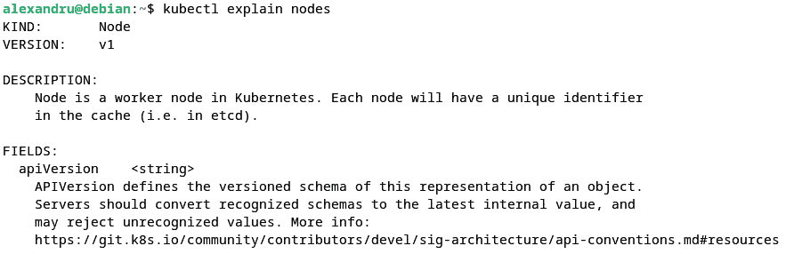

Figure 16.32 – Showing nodes’ detailed information (cropped)
The output provides detailed documentation about the `nodes` API object type, including the related API fields. One of the API fields is `apiVersion`, describing the versioning schema of an object. You may view the related documentation with the following command:

```

kubectl explain nodes.apiVersion

```

 The output is as follows:
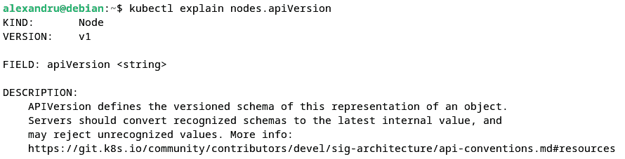

Figure 16.33 – Details about the apiVersion field (cropped)
We encourage you to use the `explain` command to learn about the various Kubernetes API object types in a cluster. Please note that the `explain` command provides documentation about *resource types*. It should not be confused with the `describe` command, which shows detailed information about the *resources* in the system.
The following commands display cluster node-related information about *all* nodes, and then node `k8s-n1` in particular:

```

kubectl describe nodes

kubectl describe nodes k8s-n1

```

 For every `kubectl` command, you can invoke `--help` (or `-h`) to get context-specific help. Here are a few examples:

```

kubectl --help

kubectl config -h

kubectl get pods -h

```

 The `kubectl` CLI is relatively rich in commands, and becoming proficient with it may take some time. Occasionally, you may find yourself looking for a specific command or remembering its correct spelling or use. The `auto-complete` bash for `kubectl` comes to the rescue. We’ll show you how to enable this next.
Enabling kubectl autocompletion
With `kubectl` autocompletion, you’ll get context-sensitive suggestions when you hit the *Tab* key twice while typing the `kubectl` commands.
The `kubectl` autocompletion feature depends on `bash-completion`. Most Linux platforms have `bash-completion` enabled by default. Otherwise, you’ll have to install the related package manually. On Ubuntu, for example, you install it with the following command:

```

sudo apt-get install -y bash-completion

```

 Next, you need to source the `kubectl` autocompletion in your shell (or similar) profile:

```

echo "source <(kubectl completion bash)" >> ~/.bashrc

```

 The changes will take effect on your next login to the terminal or immediately if you source the `bash` profile:

```

source ~/.bashrc

```

 With the `kubectl` autocomplete active, you’ll get context-sensitive suggestions when you hit the *Tab* key twice while typing the command. For example, the following sequence provides all the available resources when you try to create one:

```

kubectl create [Tab][Tab]

```

 When typing the `kubectl create` command and pressing the *Tab* key twice, the result will be a list of resources available for the command:
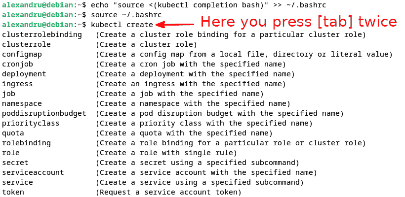

Figure 16.34 – Autocompletion use with kubectl
The `kubectl` autocompletion reaches every part of the syntax: command, resource (type and name), and flags.
Now that we know more about using the `kubectl` command, it’s time to turn our attention to deploying applications in Kubernetes.
Deploying applications
When we introduced the `kubectl` command and its usage pattern at the beginning of the *Using kubectl* section, we touched upon the two ways of creating application resources in Kubernetes: imperative and declarative.
We’ll look at both of these models closely in this section while deploying a simple web application. Let’s start with the imperative model first.
Working with imperative Deployments
As a quick refresher, with imperative Deployments, we follow a sequence of `kubectl` commands to create the required resources and get to the cluster’s desired state, such as running the application. Declarative Deployments accomplish the same, usually with a single `kubectl` `apply` command using a manifest file describing multiple resources.
Creating a Deployment
Let’s begin by creating a Deployment first. We’ll name our Deployment `packt`, based on a demo Nginx container we’re pulling from the public Docker registry (`docker.io/nginxdemos/hello`):

```

kubectl create deployment packt --image=nginxdemos/hello

```

 The command output shows that our Deployment was created successfully:

```

deployment.apps/packt 已创建

```

 We just created a Deployment with a ReplicaSet containing a single pod running a web server application. We should note that our application is managed by the controller manager within an app Deployment stack (`deployment.apps`). Alternatively, we could just deploy a simple application pod (`packt-web`) with the following command:

```

kubectl run pod/packt-web), 不是 Deployment 的一部分：

```
pod/packt-web created
```

我们稍后会看到，这个 Pod 不是 ReplicaSet 的一部分，因此不会由控制器管理器管理。

让我们通过查询 Pod 的详细信息来查看系统的状态：

```
kubectl get pods -o wide
```

让我们分析一下输出：

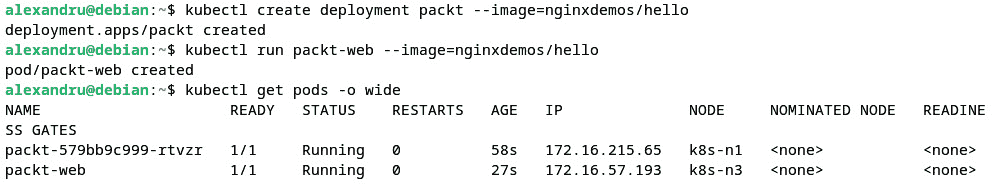

图 16.35 – 获取具有详细信息的应用程序 Pod

在上面的输出中，你可以看到一系列描述的命令，我们还可以看到 Pod 已启动并正在运行，且 Kubernetes 已将它们部署到不同的节点上：

+   `packt-579bb9c999-rtvzr`：在集群节点`k8s-n1`上

+   `packt-web`：在集群节点`k8s-n3`上

在不同节点上运行 pod 是由于 Kubernetes 集群内部的负载均衡和资源分配。

由控制器管理的应用程序 pod 是 `packt-579bb9c999-rtvzr`。Kubernetes 为我们管理的 pod 生成一个唯一的名称，将`579bb9c999` 和 `rtvzr` 附加到部署名称（`packt`）后面。Pod 模板哈希和 pod ID 在 ReplicaSet 中是唯一的。

相比之下，独立 pod（`packt-web`）保持原样，因为它不属于应用程序部署。让我们先描述两个 pod，以获取更多信息。我们先从托管的 pod 开始。别忘了使用 `kubectl` 自动补全（通过按*Tab*键两次）：

```
kubectl describe pod packt-5dc77bb9bf-bnzsc
```

相关输出较大。以下是一些相关摘录：

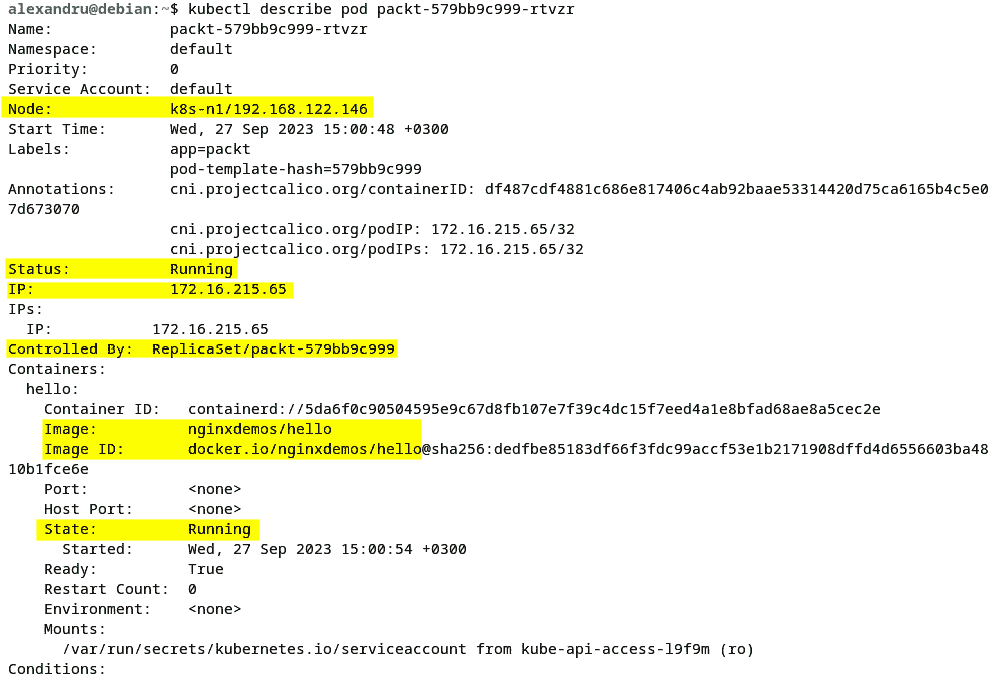

图 16.36 – Pod 信息

相比之下，独立 pod（`packt-web`）的相同命令会稍有不同，不包含`Controlled` `By`字段：

```
kubectl describe pod packt-web
```

以下是相关摘录：

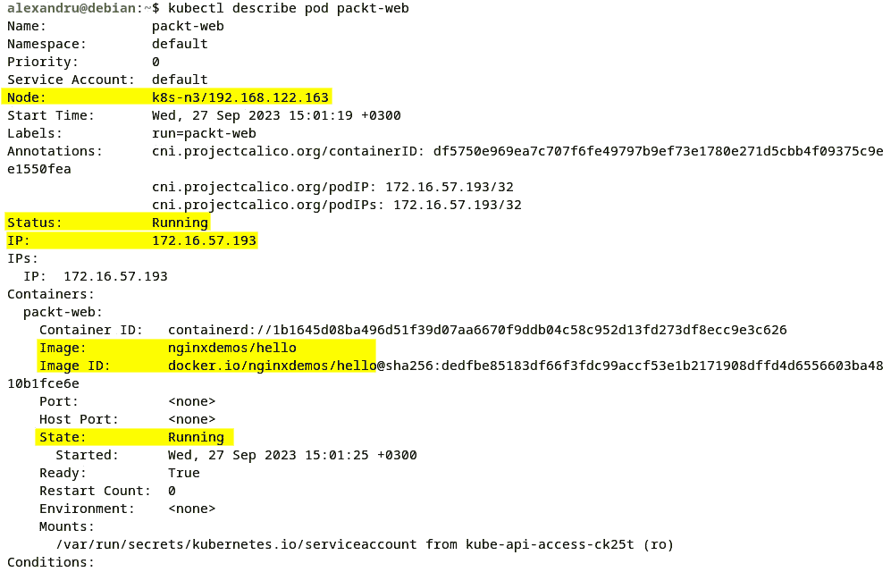

图 16.37 – 相关的 pod 信息

你也可以去集群中我们 pod 正在运行的任何节点，仔细查看相关容器。以节点`k8s-n3`（`192.168.122.163`）为例，其中我们独立的 pod（`packt-web`）正在运行。我们首先通过 SSH 连接到该节点的终端：

```
ssh packt@192.168.122.163
```

然后我们将使用 `containerd` 运行时来查询系统中的容器：

```
sudo crictl --runtime-endpoint unix:///run/containerd/containerd.sock ps
```

输出显示如下：

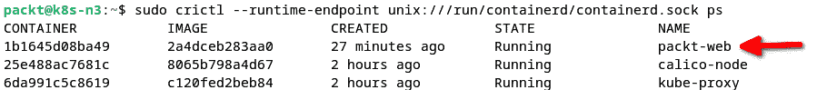

图 16.38 – 获取在集群节点上运行的容器

接下来，我们将展示如何访问在 pod 内运行的进程。

访问 pod 中的进程

让我们切换回本地（在本地机器上，而非虚拟机）`kubectl`环境，并运行以下命令以访问运行`packt-web` pod 的容器中的 shell：

```
kubectl exec -it packt-web -- /bin/sh
```

该命令会将我们带入容器内的交互式 shell 提示符。在这里，我们可以像通过终端登录到 `packt-web` 主机一样运行命令。该交互式会话是通过 `-it` 选项——交互式终端——或`--interactive --tty`选项产生的。

让我们运行一些命令，首先从进程探测器开始：

```
ps aux
```

这是来自输出的相关摘录，显示了在`packt-web`容器内运行的进程，以及一些在其中运行的命令：

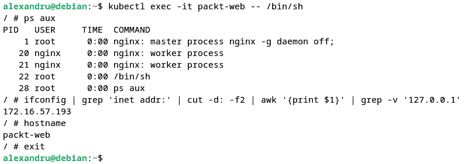

图 16.39 – 在 packt-web 容器内运行的进程

我们还可以通过以下命令检索 IP 地址：

```
ifconfig | grep 'inet addr:' | cut -d: -f2 | awk '{print $1}' | grep -v '127.0.0.1'
```

输出显示了 pod 的 IP 地址（如*图 16.39*所示）：

```
172.16.57.193
```

我们还可以通过以下命令检索主机名：

```
hostname
```

输出显示了 pod 名称（如*图 16.39*所示）：

```
packt-web
```

让我们使用`exit`命令（如*图 16.39*所示）或按*Ctrl* + *D*离开容器 shell。通过`kubectl`的`exec`命令，我们可以在 Pod 内部运行任何进程，前提是相关进程存在。

接下来我们将通过测试`packt-web`应用程序 Pod 来进行实验。我们应该注意，在此时，访问`packt-web`的 Web 服务器端点的唯一方式是通过其内部 IP 地址。之前，我们使用了`kubectl`的`get pods -o wide`和`describe`命令来检索有关 Pod 的详细信息，包括 Pod 的 IP 地址。你也可以使用以下单行命令来获取 Pod 的 IP：

```
kubectl get pods packt-web -o jsonpath='{.status.podIP}{"\n"}'
```

在我们的例子中，该命令返回`172.16.57.193`。我们使用了`-o jsonpath`输出选项来指定特定字段的 JSON 查询，`{.status.podIP}`。记住，Pod 的 IP 地址仅在集群内的 Pod 网络（`172.16.0.0/16`）内可访问。以下是显示输出的截图：

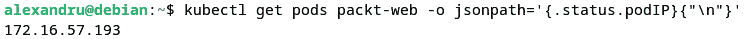

图 16.40 – 测试应用程序 Pod

因此，我们需要使用`curl`命令探测`packt-web`端点，该命令需在 Pod 网络内运行。完成此任务的一个简便方法是运行一个安装了`curl`工具的测试 Pod：

1.  以下命令运行一个名为`test`的 Pod，基于`curlimages/curl`的 Docker 镜像：

    ```
    sleep command due to the Docker entry point of the corresponding image, which simply runs a curl command and then exits. Without sleep, the pod would keep coming up and crashing. With the sleep command, we delay the execution of the curl entry point to prevent the exit. The output is shown in the following screenshot:
    ```

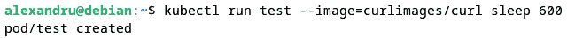

图 16.41 – 在 Pod 上使用 curl 进行测试

1.  现在，我们可以使用`test` Pod 运行一个简单的`curl`命令，目标是`packt-web` Web 服务器端点：

    ```
    kubectl exec test -- curl http://172.16.57.193
    ```

    2. 我们将获得一个 HTTP 响应以及一个相应的**访问日志追踪**（来自 Pod 中运行的 Nginx 服务器），记录该请求。输出的一个片段如下所示：

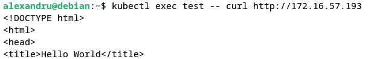

图 16.42 – 运行 curl 测试的响应

1.  要查看`packt-web` Pod 的日志，我们运行以下命令：

    ```
    kubectl logs packt-web
    ```

    输出如下所示：

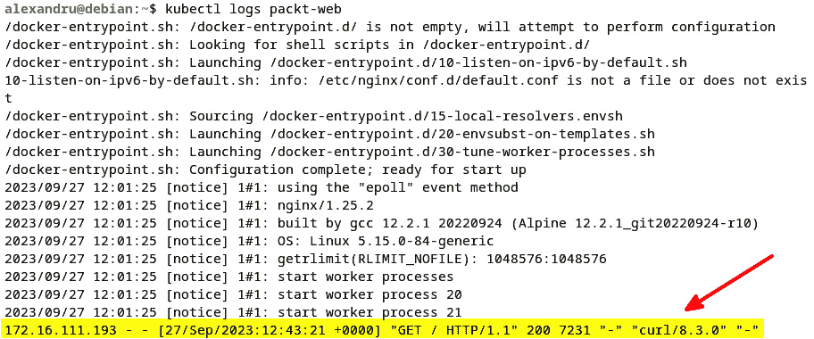

图 16.43 – packt-web Pod 的日志

1.  `packt-web` Pod 中的日志是由 Nginx 生成的，并被重定向到`stdout`和`stderr`。我们可以使用以下命令轻松验证这一点：

    ```
    kubectl exec packt-web -- ls -la /var/log/nginx
    ```

    输出显示了相关的符号链接：

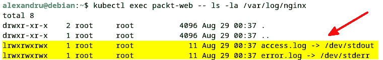

图 16.44 – 相关的符号链接

1.  当你使用完`test` Pod 后，可以通过以下命令删除它：

    ```
    kubectl delete pods test
    ```

现在我们已经在 Kubernetes 集群内部署了第一个应用程序，让我们来看看如何将相关端点暴露给全世界。接下来，我们将通过服务暴露部署。

将部署暴露为服务

现在，让我们回顾一下我们之前用来创建`packt`部署的命令。不要运行它，以下只是一个复习：

```
kubectl create deployment packt --image=nginxdemos/hello
```

该命令执行了以下序列：

1.  它创建了一个部署（`packt`）。

1.  部署创建了一个 ReplicaSet（`packt-579bb9c999`）。

1.  ReplicaSet 创建了 pod（`packt-579bb9c999-rtvzr`）。

我们可以通过以下命令进行验证：

```
kubectl get deployments -l app=packt
kubectl get replicasets -l app=packt
kubectl get pods -l app=packt
```

在前面的命令中，我们使用了 `--label-columns (-l)` 标志，通过 `app=packt` 标签过滤结果，表示 `packt` 部署的资源。

我们鼓励您使用 `kubectl describe` 命令仔细查看这些资源。不要忘记在输入命令时使用 `kubectl` 自动完成功能：

```
kubectl describe deployment packt | more
kubectl describe replicaset packt | more
kubectl describe pod packt-5dc77bb9bf-bnzsc | more
```

`kubectl` `describe` 命令在故障排除应用程序或 pod 部署时非常有用。检查相关输出中的 *Events* 部分，查找 pod 启动失败、错误（如果有的话）以及可能导致问题的线索。

现在我们已经在 Kubernetes 集群中部署了第一个应用程序，让我们看看如何将相关的端点暴露给全世界。

到目前为止，我们已经部署了一个应用程序（`packt`），它在一个 pod（`packt-579bb9c999-rtvzr`）中运行 Nginx Web 服务器，并在端口 `80` 上监听。如前所述，此时我们只能在 pod 网络内访问该 pod，这个网络仅对集群内部可见。在本节中，我们将展示如何将应用程序（或部署）暴露出去，以便外部世界能够访问。Kubernetes 使用 Service API 对象，包括 **代理** 和 **选择器**，将网络流量路由到部署中的应用 pod。接下来，您可以按照以下步骤进行操作：

1.  以下命令为我们的部署（`packt`）创建一个 Service：

    ```
    kubectl expose deployment packt \
        --port=80 \
        --target-port=80 \
    --type=NodePort flag, the Service type would be ClusterIP by default, and the Service endpoint would only be accessible within the cluster.
    ```

    2. 让我们更仔细地看一下我们的 Service（`packt`）：

    ```
    10.105.111.243) and the ports the Service is listening on for TCP traffic (80:32664/TCP):*   port `80`: Within the cluster*   port `32664`: Outside the cluster, on any of the nodesWe should note that the cluster IP is only accessible within the cluster and not from the outside:
    ```

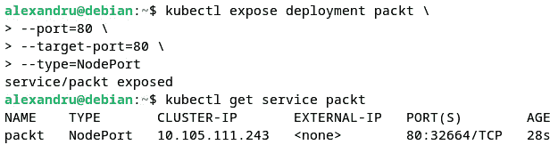

图 16.45 – 暴露 packt 部署的服务

此外，`EXTERNAL-IP`（`<none>`）不应与集群节点的 IP 地址混淆，后者是我们可以访问 Service 的位置。外部 IP 通常是由云提供商配置的负载均衡器的 IP 地址（可通过 `--external-ip` 标志进行配置）。

1.  现在，我们应该能够通过将浏览器指向集群节点上的任何一个，访问集群外部的应用程序，端口为 `32664`。要获取集群节点的列表及其对应的 IP 地址和主机名，我们可以运行以下命令：

    ```
    kubectl get nodes -o jsonpath='{range .items[*]}{.status.addresses[*].address}{"\n"}'
    ```

    输出如下：

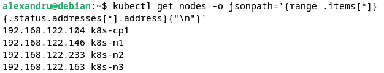

图 16.46 – 集群节点列表

1.  让我们选择 CP 节点（`192.168.122.104/k8s-cp1`），并在浏览器中输入以下地址：http://192.168.122.104:32664。

    浏览器发出的 Web 请求被定向到服务端点（`packt`），它将相关的网络数据包路由到应用 pod（`packt-579bb9c999-rtvzr`）。`packt` Web 应用响应一个简单的 Nginx `172.16.215.65`）和名称（`packt-579bb9c999-rtvzr`）：

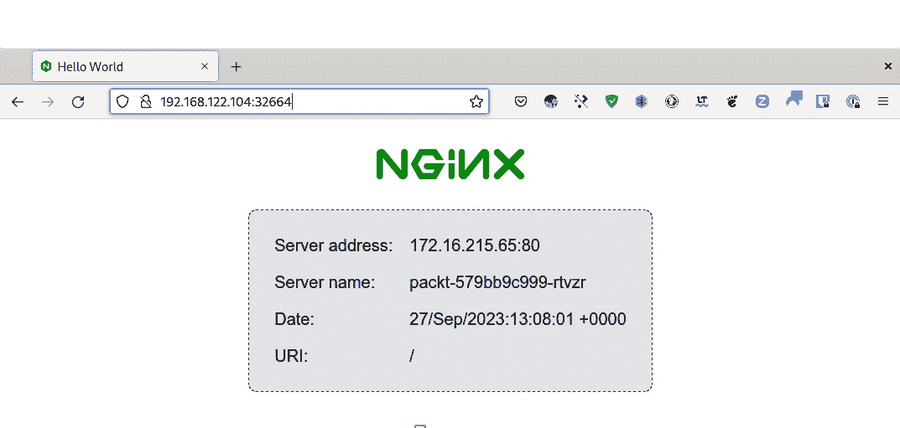

图 16.47 – 访问 packt 应用服务

1.  为了验证网页上的信息是否准确，你可以运行以下 `kubectl` 命令，检索类似的信息：

    ```
    kubectl get pod packt-579bb9c999-rtvzr -o jsonpath='{.status.podIP}{"\n"}{.metadata.name}{"\n"}'
    ```

    命令的输出将是 pod 的内部 IP 地址和名称，如下所示：

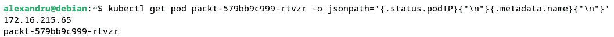

图 16.48 – 使用 kubectl 命令验证信息

假设我们有大量流量访问我们的应用，我们希望扩展控制 pod 的 ReplicaSet。在下一节中，我们将展示如何完成此任务。

扩展应用部署

当前，我们在 `packt` 部署中只有一个 pod。为了扩展应用部署，我们必须先获取运行副本的信息，以便将它们扩展到所需的数量并进行测试。以下是操作步骤：

1.  为了获取关于运行副本数量的相关详细信息，我们运行以下命令：

    ```
    kubectl describe deployment packt
    ```

    输出中相关的摘录如下：

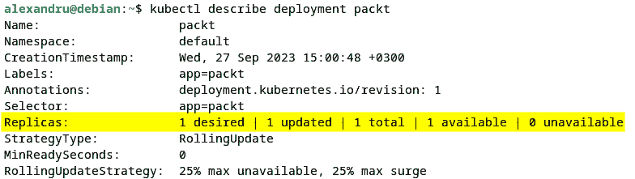

图 16.49 – Pod 详情

1.  让我们将 `packt` 部署扩展到 10 个副本，使用以下命令：

    ```
    packt Deployment, we’ll see 10 pods running:

    ```

    kubectl get pods -l app=packt

    ```

    The output is as follows:
    ```

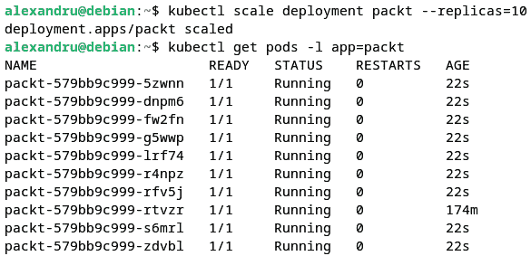

图 16.50 – 扩展 Deployment 副本

1.  传入的请求将通过负载均衡分配到我们的应用服务端点（`http://192.168.122.104:32664`）的各个 pod。为了说明这一行为，我们可以使用 `curl` 或者命令行中的文本浏览器，以避免现代桌面浏览器的缓存优化。为了更好地展示，我们将使用**Lynx**，一个简单的文本浏览器。在我们的 Debian 12 桌面上，已经安装了该软件包。你可以通过以下命令安装它：

    ```
    sudo apt-get install -y lynx
    ```

    2. 接下来，我们将 Lynx 指向我们的应用端点：

    ```
    lynx 172.16.191.6:32081
    ```

    如果我们每隔几秒钟使用 *Ctrl* + *R* 刷新页面，我们会观察到服务器地址和名称会根据当前处理请求的 pod 发生变化：


图 16.51 – 在各个 pod 之间负载均衡请求

你可以通过输入 `Q` 然后按 *Enter* 来退出 Lynx 浏览器。

1.  我们可以使用以下命令将我们的 Deployment（`packt`）缩减为三个副本（或任何其他非零正整数）：

    ```
    packt application pods, we can see the surplus pods terminating until only three pods are remaining:

    ```

    kubectl get pods -l app=packt

    ```

    The output is as follows:
    ```


图 16.52 – 缩减到三个 pod

1.  在结束我们的命令式部署之前，让我们清理迄今为止创建的所有资源：

    ```
    kubectl delete service packt
    kubectl delete deployment packt
    kubectl delete pod packt-web
    ```

    2. 下面的命令应显示一个干净的状态：

    ```
    kubectl get all
    ```

    输出如下：


图 16.53 – 默认状态下的集群

在下一节中，我们将讨论如何在 Kubernetes 集群中声明性地部署资源和应用。

使用声明式部署

声明式部署的核心是清单文件。清单文件通常采用 YAML 格式，编写时通常会结合自动生成的代码和手动编辑。然后，使用 `kubectl` `apply` 命令部署清单：

```
kubectl apply -f MANIFEST
```

在 Kubernetes 中声明式部署资源涉及以下阶段：

+   创建清单文件

+   更新清单

+   验证清单

+   部署清单

+   在前述阶段之间进行迭代

为了说明声明式模型，我们以将一个简单的 Hello World web 应用程序部署到集群为例。结果将类似于我们之前使用命令式方法的做法。

所以，让我们从为我们的部署创建一个清单开始。

创建清单

当我们命令式地创建我们的 `packt` 部署时，我们使用了以下命令（先别运行！）：

```
kubectl create deployment packt --image=nginxdemos/hello
```

以下命令将模拟相同的过程，而不会改变系统状态：

```
kubectl create deployment packt --image=nginxdemos/hello \
    --dry-run=client --output=yaml
```

我们使用了以下附加选项（标志）：

+   `--dry-run=client`：此命令在本地 `kubectl` 环境（*客户端*）中运行，不会修改系统状态

+   `--output=yaml`：此选项将命令输出格式化为 YAML

命令的输出如下：


图 16.54 – 模拟清单创建

我们可以使用前一个命令的输出分析系统中需要做的更改。然后我们可以将其重定向到一个文件（`packt.yaml`），作为我们部署清单的草稿：

```
kubectl create deployment packt --image=nginxdemos/hello \
    --dry-run=client --output=yaml > packt.yaml. From here, we can edit the file to accommodate more complex configurations. For now, we’ll leave the manifest as is and proceed with the next stage in our declarative Deployment workflow.
Validating a manifest
Before deploying a manifest, we recommend validating the Deployment, especially if you edited the file manually. Editing mistakes can happen, particularly when working with complex YAML files with multiple indentation levels.
The following command validates the `packt.yaml` Deployment manifest:

```

kubectl apply -f packt.yaml --dry-run=client

```

 A successful validation yields the following output:

```

deployment.apps/packt created (dry run)

```

 If there are any errors, we should edit the manifest file and correct them prior to deployment. Our manifest looks good, so let’s go ahead and deploy it.
Deploying a manifest
To deploy the `packt.yaml` manifest, we use the following command:

```

kubectl apply -f packt.yaml

```

 A successful Deployment shows the following message:

```

deployment.apps/packt created

```

 We can check the deployed resources with the following command:

```

kubectl get all -l app=packt

```

 The output shows that the `packt` Deployment resources created declaratively are up and running:


Figure 16.55 – The Deployment resources created declaratively
Next, we want to expose our Deployment using a Service.
Exposing the Deployment with a Service
We’ll repeat the preceding workflow by creating, validating, and deploying the Service manifest (`packt-svc.yaml`). For brevity, we simply enumerate the related commands:

1.  Create the manifest file (`packt-svc.yaml`) for the Service exposing our Deployment (`packt`):

    ```

    kubectl expose deployment packt \

    --port=80 \

    --target-port=80 \

    --type=NodePort \

    --dry-run=client --output=yaml > packt-svc.yaml

    ```

    We explained the preceding command previously in the *Exposing Deployments as* *Services* section.

     2.  Next, we’ll validate the Service Deployment manifest:

    ```

    kubectl apply -f packt-svc.yaml --dry-run=client

    ```

     3.  If the validation is successful, we deploy the Service manifest:

    ```

    packt 资源：

    ```
    packt application resources, including the Service endpoint (service/packt) listening on port 31380:
    ```

    ```


Figure 16.56 – The packt application resources deployed

1.  Using a browser, `curl`, or Lynx, we can access our application by targeting any of the cluster nodes on port `31380`. Let’s use the CP node (`k8s-cp1`, `192.168.122.104`) by pointing our browser to `http://192.168.122.104:31380`:


Figure 16.57 – Accessing the packt application endpoint
If we want to change the existing configuration of a resource in our application Deployment, we can update the related manifest and redeploy it. In the next section, we’ll modify the Deployment to accommodate a scale-out scenario.
Updating a manifest
Suppose our application is taking a high number of requests, and we’d like to add more pods to our Deployment to handle the traffic. We need to change the `spec.replicas` configuration setting in the `pack.yaml` manifest:

1.  Using your editor of choice, edit the `packt.yaml` file and locate the following configuration section:

    ```

    spec:

    replicas: 1

    ```

    Change the value from `1` to `10` for additional application pods in the ReplicaSet controlled by the `packt` Deployment. The configuration becomes the following:

    ```

    spec:

    replicas: 10

    ```

     2.  Save the manifest file and redeploy with the following command:

    ```

    packt 部署已重新配置：

    ```
    packt resources in the cluster, we should see the new pods up and running:

    ```

    packt 部署，包括在集群中部署的附加 pod：

    ```

    ```

    ```


Figure 16.58 – The additional pods added for application scale-out
We encourage you to test with the scale-out environment and verify the load balancing workload described in the *Scaling application Deployments* section earlier in this chapter.

1.  Let’s scale back our Deployment to three pods, but this time by updating the related manifest on the fly with the following command:

    ```

    kubectl edit deployment packt

    ```

    The command will open our default editor in the system (**vi**) to make the desired change:


Figure 16.59 – Making Deployment changes on the fly

1.  After saving and exiting the editor, we’ll get a message suggesting that our Deployment (`packt`) has been updated:

    ```

    kubectl edit 不会反映在部署清单（packt.yaml）中。不过，相关的配置更改会保存在集群（etcd）中。

    ```

     2.  We can verify our updated Deployment with the help of the following command:

    ```

    kubectl get deployment packt

    ```

    The output now shows only three pods running in our Deployment:


Figure 16.60 – Showing the number of Deployments

1.  Before wrapping up, let’s clean up our resources once again with the following commands to bring the cluster back to the default state:

    ```

    kubectl delete service packt

    kubectl delete deployment packt

    ```

We have shown you how to use Kubernetes on bare metal, and in the next section, we will briefly point you to some useful resources for using Kubernetes in the cloud.
Running Kubernetes in the cloud
Managed Kubernetes Services are fairly common among public cloud providers. Amazon **Elastic Kubernetes Service** (**EKS**), **Azure Kubernetes Services** (**AKS**), and **Google Kubernetes Engine** (**GKE**) are the major cloud offerings of Kubernetes at the time of this writing. In this section, we’ll not focus on any of these solutions, but we will provide you with solid resources on how to use Kubernetes in the cloud. For more advanced titles on this subject, please check the *Further reading* section of this chapter.
We should note that we just scratched the surface of deploying and managing Kubernetes clusters. Yet, here we are, at a significant milestone, where we deployed our first Kubernetes clusters on-premises. We have reached the end of this journey here, but we trust that you’ll take it to the next level and further explore the exciting domain of application Deployment and scaling with Kubernetes. Let’s now summarize what we have learned in this chapter.
Summary
We began this chapter with a high-level overview of the Kubernetes architecture and API object model, introducing the most common cluster resources, such as pods, Deployments, and Services. Next, we took on the relatively challenging task of building an on-premises Kubernetes cluster from scratch using VMs. We explored various CLI tools for managing Kubernetes cluster resources on-premises. At the high point of our journey, we focused on deploying and scaling applications in Kubernetes using imperative and declarative Deployment scenarios.
We believe that novice Linux administrators will benefit greatly from the material covered in this chapter and become more knowledgeable in managing resources across hybrid clouds and on-premises distributed environments, deploying applications at scale, and working with CLI tools. We believe that the structured information in this chapter will also help seasoned system administrators refresh some of their knowledge and skills in the areas covered.
It’s been a relatively long chapter, and we barely skimmed the surface of the related field. We encourage you to explore some resources captured in the *Further reading* section and strengthen your knowledge regarding some key areas of Kubernetes environments, such as networking, security, and scale.
In the next chapter, we’ll stay within the application deployment realm and look at **Ansible**, a platform for accelerating application delivery on-premises and in the cloud.
Questions
Here are a few questions for refreshing or pondering upon some of the concepts you’ve learned in this chapter:

1.  Enumerate some of the essential Services of a Kubernetes CP node. How do the worker nodes differ?
2.  What command did we use to bootstrap a Kubernetes cluster?
3.  What is the difference between imperative and declarative Deployments in Kubernetes?
4.  What is the `kubectl` command for deploying a pod? How about the command for creating a Deployment?
5.  What is the `kubectl` command to access the shell within a pod container?
6.  What is the `kubectl` command to query all resources related to a Deployment?
7.  How do you scale out a Deployment in Kubernetes? Can you think of the different ways (commands) in which to accomplish the task?
8.  How do you delete all resources related to a Deployment in Kubernetes?

Further reading
The following resources may help you to consolidate your knowledge of Kubernetes further:

*   Kubernetes documentation online: [`kubernetes.io/docs/home/`](https://kubernetes.io/docs/home/)
*   The `kubectl` cheat sheet: [`kubernetes.io/docs/reference/kubectl/cheatsheet/`](https://kubernetes.io/docs/reference/kubectl/cheatsheet/)
*   *Kubernetes and Docker: The Container Masterclass [Video]*, *Cerulean Canvas*, Packt Publishing
*   *Mastering Kubernetes – Third Edition*, Gigi Sayfan, Packt Publishing

The following is a short list of useful links for deploying Kubernetes on Azure, Amazon, and Google:

*   Amazon EKS:
    *   [`docs.aws.amazon.com/eks/index.html`](https://docs.aws.amazon.com/eks/index.html)
    *   [`docs.aws.amazon.com/eks/latest/userguide/sample-deployment.html`](https://docs.aws.amazon.com/eks/latest/userguide/sample-deployment.html)
*   AKS:
    *   [`azure.microsoft.com/en-us/services/kubernetes-service/`](https://azure.microsoft.com/en-us/services/kubernetes-service/)
    *   [`learn.microsoft.com/en-us/azure/aks/tutorial-kubernetes-deploy-cluster?tabs=azure-cli`](https://learn.microsoft.com/en-us/azure/aks/tutorial-kubernetes-deploy-cluster?tabs=azure-cli)
    *   [`learn.microsoft.com/en-us/azure/aks/learn/quick-kubernetes-deploy-portal?tabs=azure-cli`](https://learn.microsoft.com/en-us/azure/aks/learn/quick-kubernetes-deploy-portal?tabs=azure-cli)
*   GKE:
    *   [`cloud.google.com/kubernetes-engine`](https://cloud.google.com/kubernetes-engine)
    *   [`cloud.google.com/build/docs/deploying-builds/deploy-gke`](https://cloud.google.com/build/docs/deploying-builds/deploy-gke)
    *   [`cloud.google.com/kubernetes-engine/docs/deploy-app-cluster`](https://cloud.google.com/kubernetes-engine/docs/deploy-app-cluster)

```

```

```
