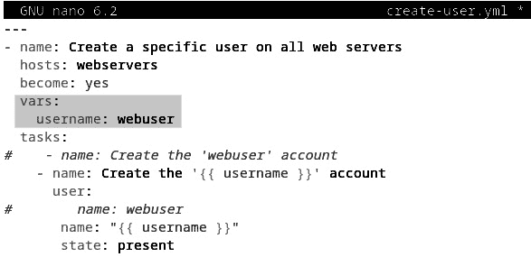
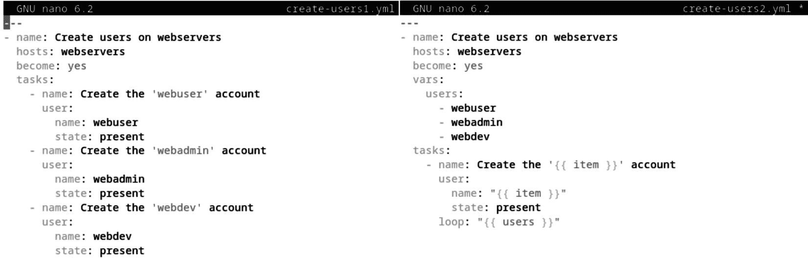

# 17

# 使用 Ansible 进行基础设施和自动化管理

如果你日常的系统管理或开发工作涉及繁琐和重复的操作，**Ansible** 可以帮助你在节省宝贵时间的同时完成任务。Ansible 是一款用于自动化**软件配置**、**配置管理**和**应用部署工作流**的工具。Ansible 最初由 Michael DeHaan 在 2012 年开发，2015 年被 Red Hat 收购，并现在作为开源项目进行维护。

在本章中，你将学习 Ansible 的基本概念，以及一系列动手操作的示例。特别是，我们将探索以下主题：

+   介绍 Ansible 架构和配置管理

+   安装 Ansible

+   使用 Ansible

# 技术要求

首先，你应该对 Linux 命令行终端有一定的了解。中级的 Linux 知识将帮助你理解本章中实际示例的某些细节。你还应该熟练使用基于 Linux 的文本编辑器。

对于实际操作的示例，我们建议设置一个与我们使用的实验环境类似的实验室环境。为了复制这个环境，您的 CPU 至少需要 6 个物理核心和 6 个虚拟核心（共 12 个）。四核 CPU 带超线程功能是不够的。此外，所有主机上应安装 OpenSSH。在本章的*设置实验环境*部分，你将找到相关的配置说明。如果你没有配置实验环境，你仍然可以从本章与实际示例相关的详细解释中获益。

现在，让我们通过介绍 Ansible 的基本概念开始我们的学习之旅。

# 介绍 Ansible 架构和配置管理

在本章的介绍中，我们概述了 Ansible 的一个关键方面——它是一款自动化工作流的工具。几乎所有的 Linux 系统管理任务都可以使用 Ansible 来自动化。通过使用 Ansible CLI，我们可以执行简单的命令来更改系统的**期望状态**。通常，使用 Ansible 时，我们会在远程主机或一组主机上执行任务。

让我们用经典的**包管理**来说明。假设你正在管理一个包含一组 web 服务器的基础设施，并且计划在所有这些服务器上安装最新版本的 web 服务器应用程序（Nginx 或 Apache）。实现这一任务的一种方式是通过 SSH 连接到每个主机，执行相关的 shell 命令来安装最新的 web 服务器包。如果你的机器很多，这将是一项庞大的任务。你或许会认为可以写个脚本来自动化这个工作。这是可行的，但这样你又有了一项新工作；也就是维护脚本、修复可能的错误，随着基础设施的增长，添加新的功能。

在某些情况下，你可能需要管理多个主机上的用户、数据库或配置网络设置。很快，你就会需要一款瑞士军刀式的工具，拥有你宁愿免费获得而不是自己编写的功能。此时，Ansible 就派上用场了。凭借其丰富的模块——几乎涵盖了你能想象到的所有系统管理任务——Ansible 能够以最小的努力，并且在一个非常安全高效的方式下，远程配置、运行或部署你所选择的管理任务。

我们将通过简要了解 Ansible 架构来巩固这些初步的思路。

## 了解 Ansible 架构

Ansible 核心框架是用 Python 编写的。我们要提前提到的是，Ansible 采用了 **无代理** 架构。换句话说，它在 **控制节点** 上运行，向远程主机执行命令，无需在受管主机上安装远程端点或服务来与控制节点进行通信。至少，Ansible 通信的唯一要求是能够通过 SSH 连接到受管主机。然而，如果主机没有安装 Python 框架，那么 Ansible 的操作将仅限于运行脚本和原始 SSH 命令。绝大多数服务器操作系统平台默认已经安装了 Python。

Ansible 可以通过一个控制节点使用安全的 SSH 连接管理一组远程主机。下图展示了使用 Ansible 管理的基础设施的逻辑布局：


图 17.1 – 使用 Ansible 管理的基础设施的逻辑布局

生产级企业环境通常会包含一个 **配置管理数据库** (**CMDB**)，用于组织其 IT 基础设施资产。IT 基础设施资产的示例包括服务器、网络、服务和用户。虽然 CMDB 并不是 Ansible 架构的直接组成部分，但它描述了资产及其在受管基础设施中的关系，并且可以用于构建 **Ansible 清单**。

清单是 Ansible 控制节点上的本地存储——通常是 **INI** 或 **YAML** 文件——它描述了受管的 **主机** 或 **主机组**。清单可以从 CMDB 推断出来，也可以由系统管理员手动创建。

现在，让我们更详细地看看以下图示的高层次 Ansible 架构：


图 17.2 – Ansible 架构

上图展示了 Ansible 控制节点与私有或公共云基础设施中的受管主机之间的交互。以下是架构视图中所示区块的简要说明：

+   **API 和核心框架**：封装 Ansible 核心功能的主要库；Ansible 核心框架是用 Python 编写的

+   **插件**：扩展核心框架功能的附加库——例如，以下内容：

    +   **连接插件**，如云连接器

    +   **测试插件**，验证特定的响应数据

    +   **回调插件**，用于响应事件

+   `user` 模块用于管理用户

+   `package` 模块用于管理软件包

+   **清单**：描述由 Ansible 命令和 Playbooks 目标的主机和主机组的 INI 或 YAML 文件*   **Playbooks**：描述一组针对托管主机的任务的 Ansible 执行文件*   **私有或公共云**：托管在本地或各种云环境中的托管基础设施（例如 VMware、**亚马逊网络服务**（**AWS**）和 Azure）*   **托管主机**：由 Ansible 命令和 Playbooks 目标的服务器*   `ansible`、`ansible-playbook`、`ansible-doc` 等*   **用户**：运行 Ansible 命令或 Playbooks 的管理员、高级用户和自动化用户进程

现在我们对 Ansible 架构有了基本的理解，接下来让我们看看是什么使得 Ansible 成为自动化管理工作流的一个优秀工具。接下来我们将介绍**配置** **管理**的概念。

## 介绍配置管理

如果我们回顾过去，系统管理员通常管理的服务器数量相对较少，通过在每台主机上使用远程 shell 来运行日常管理任务。诸如复制文件、更新软件包和管理用户等相对简单的操作，可以轻松编写脚本并定期重复使用。随着应用程序和服务的激增，互联网的快速发展，现代本地和基于云的 IT 基础设施——支撑这些相关平台——已经显著增长。涉及的大量配置变更远远超过了一个管理员运行和维护少数脚本的能力。在这种情况下，配置管理应运而生。

在配置管理中，托管的主机和资产根据特定标准被分组为逻辑类别，如*图 17.1*所示。除了主机之外，管理其他资产最终还是要在托管这些资产的服务器上执行特定任务。**配置管理清单**是 Ansible 的清单文件，用于管理这些主机和资产。因此，Ansible 成为配置管理的端点。

使用 Ansible，我们可以运行单个一次性命令来执行特定任务，但通过 `ansible-playbook` 执行定期的维护和配置管理任务，可以实现更加高效的配置管理工作流，这在 IT 基础设施自动化中是一个常见的做法。我们将在本章稍后讨论 Ansible 的 Playbooks。

反复（或定期）对特定目标执行 Ansible 任务时，会引发由于重复操作导致的期望状态发生不必要变化的问题。这个问题引出了配置管理的一个核心方面——配置更改的**幂等性**。接下来，我们将看看什么是幂等性更改。

解释幂等操作

在配置管理中，操作是**幂等的**，当多次运行它时，结果与第一次运行时相同。从这个意义上讲，Ansible 是一个幂等的配置管理工具。

让我们解释一下幂等操作是如何工作的。假设我们有一个 Ansible 任务，用来创建一个用户。当任务第一次运行时，它会创建该用户。如果在第二次运行时用户已经被创建，那么这次操作将是一个**空操作**（**no-op**）。*没有*幂等性的话，后续运行相同任务时，由于尝试创建已存在的用户，将会产生错误。

我们应该注意到，Ansible 并不是市场上唯一的配置管理工具。还有**Chef**、**Puppet** 和 **SaltStack** 等平台。大多数这些平台已经被更大的企业收购，例如 SaltStack 被 VMware 收购，有些人可能会认为 Ansible 的成功归功于 Red Hat 将该项目开源。Ansible 似乎是当今最成功的配置管理平台。业界普遍认为，Ansible 提供了用户友好的体验、高可扩展性和企业级部署中负担得起的许可层次。

在介绍完基础概念后，让我们动手安装 Ansible，在选择的 Linux 平台上。

# 安装 Ansible

在本节中，我们将向你展示如何在**控制节点**上安装 Ansible。在 Linux 上，我们可以通过几种方式来安装 Ansible：

+   使用特定平台的软件包管理器（例如，Ubuntu/Debian 上的 `apt`）

+   使用 `pip`，Python 包管理器

Ansible 社区推荐使用 `pip` 来安装 Ansible，因为它提供了 Ansible 的最新稳定版本。在本节中，我们将使用 Ubuntu 作为我们选择的发行版。对于所有主要操作系统平台的完整 Ansible 安装指南，请参阅在线文档：[`docs.ansible.com/ansible/latest/installation_guide/intro_installation.html`](https://docs.ansible.com/ansible/latest/installation_guide/intro_installation.html)。

在控制节点上，Ansible 需要 Python，因此在安装 Ansible 之前，我们需要确保系统中已安装 Python。

重要提示

Python 2 自 2020 年 1 月 1 日起不再受支持，请改用 Python 3.8（或更新版本）。

让我们首先在 Ubuntu 上安装 Ansible。

## 在 Ubuntu 上安装 Ansible

在 Ubuntu 22.04 LTS 中，默认安装了 Python 3。我们可以按照以下步骤继续安装 Ansible：

1.  让我们首先通过以下命令检查 Python 3 的版本：

    ```
    apt, we need to add the Ansible apt repository:

    ```

    sudo apt update

    ```

    ```

1.  接下来，我们必须添加 Ansible PPA：

    ```
    sudo apt install -y software-properties-common
    sudo apt-add-repository --update ppa:ansible/ansible -y
    ```

1.  现在，我们可以使用以下命令安装 Ansible 包：

    ```
    sudo apt install ansible -y
    ```

1.  安装好 Ansible 后，我们可以检查其当前版本：

    ```
    ansible --version
    ```

    在我们的例子中，前一条命令的相关输出摘录如下：

    ```
    ansible [core 2.15.4]
    ```

接下来，我们将介绍如何使用 `pip` 安装 Ansible。

## 使用 pip 安装 Ansible

在使用 `pip` 安装 Ansible 之前，我们需要确保系统上已安装 Python。我们假设根据前一节提供的步骤，已经安装了 Python 3。在使用 `pip` 安装 Ansible 时，最好先卸载通过本地包管理器（如 `apt`）安装的任何版本的 Ansible。这将确保 `pip` 成功安装最新版本的 Ansible。继续安装之前，请按照以下步骤操作：

1.  我们应当删除任何通过特定平台包管理器（例如 `apt` 或 `yum`）安装的现有版本的 Ansible。要卸载 Ubuntu 上的 Ansible，可以运行以下命令：

    ```
    pip is installed. The following command should provide the current version of pip:

    ```

    先使用 pip 安装器：

    ```

    ```

    使用 pip 和 Ansible，执行以下命令：

    ```
    python3 get-pip.py --user
    pip and Ansible for the current user (hence the --user option we used).
    ```

    ```

    ```

1.  如果你希望将 Ansible *全局*安装在系统上，等效的命令如下：

    ```
    sudo python3 get-pip.py
    sudo python3 -m pip install ansible
    ```

1.  安装完成后，你可能需要退出并重新登录终端，然后才能使用 Ansible。你可以使用以下命令检查安装的 Ansible 版本：

    ```
    ansible --version
    ```

    在我们的例子中，输出显示如下：

    ```
    ansible [core 2.15.4]
    ```

如你所见，通过使用 `pip`，你可以获得 Ansible 的最新版本（截至写作时）。因此，它是安装 Ansible 的推荐方法。

在我们的控制节点上安装了 Ansible 后，让我们看一些使用 Ansible 的实际示例。

# 使用 Ansible

在本节中，我们将广泛使用 Ansible CLI 工具来执行各种配置管理任务。为了展示实际操作示例，我们将使用自定义实验环境，并强烈建议你复制该环境以获得完整的配置管理体验。

本节的高层次大纲如下：

+   设置实验环境

+   配置 Ansible

+   使用 Ansible 临时命令

+   使用 Ansible playbook

+   使用 Jinja2 模板

+   使用 Ansible 角色

让我们从实验环境的概述开始。

## 设置实验环境

我们的实验环境使用 **基于内核的虚拟机**（**KVM**）作为虚拟环境的虚拟化管理程序，但任何其他虚拟化管理程序都可以使用。*第十一章*，*与虚拟机的操作*，详细描述了如何创建 Linux **虚拟机**（**VMs**）。我们使用 Ubuntu Server LTS 部署了以下虚拟机，模拟现实世界中的配置管理基础设施：

+   `neptune`: Ansible 控制节点

+   `ans-web1`: Web 服务器

+   `ans-web2`: Web 服务器

+   `ans-db1`: 数据库服务器

+   `ans-db2`: 数据库服务器

所有虚拟机都已安装默认的服务器组件。在每个主机上，我们创建了一个名为`packt`的默认管理员用户，并启用了 SSH 访问。每台虚拟机将拥有 2 个 vCPU，2 GB 的 RAM，以及至少 20 GB 的磁盘空间。

现在，让我们简要描述这些虚拟机的设置，从托管主机开始。

### 设置托管主机

对于托管主机，完全启用从 Ansible 控制节点进行配置管理访问有几个关键要求：

+   它们必须安装并运行 OpenSSH 服务器

+   它们必须安装 Python

如*技术要求*部分所述，我们假设您的主机上已启用 OpenSSH。有关安装 Python 的信息，您可以按照*安装* *Ansible*部分中描述的相关步骤进行操作。

重要提示

托管主机不需要在系统上安装 Ansible。

要设置每个虚拟机的主机名，可以运行以下命令（例如，对于`ans-web1`主机名）：

```
sudo hostnamectl set-hostname ans-web1
```

我们还希望在托管主机上禁用`sudo`登录密码，以便在运行自动化脚本时促进无人值守的权限提升。如果不进行此更改，远程执行 Ansible 命令时将需要密码。

要禁用`sudo`登录密码，请使用以下命令编辑`sudo`配置文件：

```
sudo visudo
```

添加以下行并保存配置文件。如果用户名不同，请将`packt`替换为您的用户名：

```
packt ALL=(ALL) NOPASSWD:ALL
```

您需要在所有托管主机上进行此更改。

接下来，我们将查看 Ansible 控制节点的初始设置。

### 设置 Ansible 控制节点

Ansible `neptune`与`ans-web1`、`ans-web2`、`ans-db1`和`ans-db2`通过 Ansible 命令和剧本进行交互。为了方便起见，我们的示例将使用托管主机的主机名而不是 IP 地址。为了轻松实现这一点，我们在 Ansible 控制节点（`neptune`）的`/etc/hosts`文件中添加了以下条目：

```
127.0.0.1 neptune localhost
192.168.122.70 ans-web1
192.168.122.147 ans-web2
192.168.122.254 ans-db1
192.168.122.25 ans-db2
```

您需要根据虚拟机环境匹配主机名和 IP 地址。

接下来，我们必须在托管主机上安装 Ansible。使用本章早些时候描述的*安装 Ansible*部分中介绍的相关步骤，我们展示了如何在控制节点上安装 Ansible。在我们的案例中，我们按照*使用 pip 安装 Ansible*部分中的步骤操作，以便享受撰写时的最新 Ansible 版本。

最后，我们将设置 Ansible 控制节点与托管主机之间的 SSH 密钥认证。

### 设置 SSH 密钥认证

Ansible 使用 SSH 与托管主机通信。SSH 密钥认证机制使得远程 SSH 访问无需输入用户密码。要启用 SSH 密钥认证，请在 Ansible 控制主机（`neptune`）上运行以下命令。

使用以下命令生成一个安全的密钥对，并按照默认提示操作：

```
ssh-keygen
```

生成密钥对后，将相关的公钥复制到每个受管主机。你需要一次针对一个主机，并使用远程`packt`用户的密码进行身份验证。当提示时，接受 SSH 密钥交换：

```
ssh-copy-id -i ~/.ssh/id_rsa.pub packt@ans-web1
ssh-copy-id -i ~/.ssh/id_rsa.pub packt@ans-web2
ssh-copy-id -i ~/.ssh/id_rsa.pub packt@ans-db1
ssh-copy-id -i ~/.ssh/id_rsa.pub packt@ans-db2
```

现在，你应该能够从 Ansible 控制节点（`neptune`）通过 SSH 访问任何受管主机，而不需要输入密码。例如，要访问`ans-web1`，你可以用以下命令进行测试：

```
ssh packt@ans-web1
```

该命令将带你进入远程服务器（`ans-web1`）的终端。确保在继续执行下一步之前，回到 Ansible 控制节点（`neptune`）的终端。

我们现在准备好在控制节点上配置 Ansible。

## 配置 Ansible

本节将探讨与 Ansible **配置文件**和**清单**相关的一些基本配置概念。通过使用配置文件及其内部的参数，我们可以改变 Ansible 的*行为*，例如特权升级、连接超时和默认清单文件路径。清单定义了受管主机，充当 Ansible 的 CMDB。

让我们首先看看 Ansible 配置文件。

### 创建 Ansible 配置文件

以下命令提供了一些关于我们的 Ansible 环境的有用信息，包括当前的配置文件：

```
ansible --version
```

以下是上述命令的完整输出：


图 17.3 – 默认的 Ansible 配置设置

默认的 Ansible 安装会将配置文件路径设置为`/etc/ansible/ansible.cfg`。正如你可能猜到的，默认的配置文件具有*全局范围*，这意味着当我们运行 Ansible 任务时，默认使用的是这个文件。

现在，让我们看看一些不同的场景以及如何解决这些问题：

+   如果在同一控制主机上有多个用户运行 Ansible 任务怎么办？我们的直觉告诉我们，每个用户可能会有自己的一套配置参数。Ansible 通过查找用户的主目录中的`~/.ansible.cfg`文件来解决这个问题。让我们通过在用户（`packt`）的主目录中创建一个虚拟配置文件来验证这一行为：

    ```
    ansible --version command now yields the following config file path:
    ```


图 17.4 – 更改默认配置文件

换句话说，`~/.ansible.cfg`会优先于全局的`/etc/ansible/ansible.cfg`配置文件。

+   现在，假设我们的用户（`packt`）创建了多个 Ansible 项目，其中一些管理本地主机，其他则与公共云资源交互。同样，我们可能需要一套不同的 Ansible 配置参数（例如连接超时和清单文件）。Ansible 通过在当前文件夹中查找`./ansible.cfg`文件来适应这种情况。

    让我们在新的`~/ansible/`目录中创建一个虚拟的`ansible.cfg`文件：

    ```
    mkdir ~/ansible
    ~/ansible directory and invoking the ansible --version command shows the following config file:
    ```


图 17.5 – 更改当前目录和配置文件

我们本可以将项目目录命名为任何名字，不一定非得是`/home/packt/ansible`。Ansible 优先使用`./ansible.cfg`文件，而不是用户主目录中的`~/.ansible.cfg`配置文件。

+   最后，我们可能希望拥有一个不依赖于目录或来自 Ansible 命令的原始位置的配置文件的终极灵活性。这种功能在测试临时配置时非常有用，而不会更改主配置文件。为此，Ansible 会读取`ANSIBLE_CONFIG`环境变量，以获取配置文件的路径。

    假设我们已经在`~/ansible`项目文件夹中，并且已经定义了本地的`ansible.cfg`文件，现在让我们创建一个名为`test.cfg`的虚拟测试配置文件：

    ```
    cd ~/ansible
    touch test.cfg
    ANSIBLE_CONFIG=test.cfg ansible --version
    ```

    输出如下所示：


图 17.6 – 验证读取新配置文件

我们需要注意，配置文件应该始终具有`.cfg`扩展名，否则 Ansible 会忽略它。

下面是一个总结 Ansible 配置文件优先级顺序的列表，从高到低：

1.  `ANSIBLE_CONFIG`环境变量

1.  本地目录中的`./ansible.cfg`文件

1.  用户主目录中的`~/.ansible.cfg`文件

1.  `/``etc/ansible/ansible.cfg`

在我们的示例中，我们将依赖位于本地项目目录（`~/ansible`）中的`ansible.cfg`配置文件。现在让我们创建这个配置文件，并先将其留空：

```
mkdir ~/ansible
cd ~/ansible
touch ansible.cfg
```

在本章的其余部分，我们将从`~/ansible`文件夹运行我们的 Ansible 命令，除非我们另行指定。

除非我们在配置文件中明确定义（覆盖）配置参数，否则 Ansible 将假设使用系统默认值。我们将添加到配置文件中的属性之一是清单文件路径。但首先，我们需要创建一个清单。接下来的部分将向你展示如何操作。

### 创建 Ansible 清单

Ansible 清单是一个常规的**INI**或**YAML**文件，用于描述被管理的主机。它最简单的形式可能是一个平面列表，列出主机名或 IP 地址，但 Ansible 也可以将主机组织成**组**。Ansible 清单文件可以是**静态**的或**动态**的，具体取决于它们是手动创建和更新的，还是动态生成的。现在，我们将使用静态清单。

在我们的演示环境中，拥有两台 Web 服务器（`ans-web1`、`ans-web2`）和两台数据库服务器（`ans-db1`、`ans-db2`），我们可以在一个名为`hosts`的文件中定义以下清单（采用 INI 格式）（稍后在`~/ansible`中创建），如*图 17.7*所示：

```
[webservers]
ans-web1
ans-web2
[databases]
ans-db1
ans-db2
```

我们将主机分类为几个组，组名用括号表示；即 `[webservers]` 和 `[databases]`。如前所述，组是基于特定标准对主机的逻辑安排。主机可以属于多个组。组名是区分大小写的，应该始终以字母开头，并且不应包含连字符（`-`）或空格。

Ansible 有两个默认组：

+   `all`：清单中的每个主机

+   `ungrouped`：`all` 中每个不是其他组成员的主机

我们还可以根据特定模式定义组。例如，以下组包括一系列主机名，主机名以 `ans-web` 开头，并以数字范围 `1`-`2` 结尾：

```
[webservers]
ans-web[1:2]
```

模式在我们管理大量主机时非常有用。例如，以下模式包括一个 IP 地址范围内的所有主机：

```
[all_servers]
172.16.191.[11:15]
```

范围定义为 `[START:END]`，并包括从 `START` 到 `END` 的所有值。范围的示例有 `[1:10]`、`[01:10]` 和 `[a-g]`。

组也可以嵌套。换句话说，一个组可以包含其他组。这种嵌套通过 `:children` 后缀来描述。例如，我们可以定义一个 `[platforms]` 组，其中包含 `[ubuntu]` 和 `[debian]` 组（由于我们的所有虚拟机都在 Ubuntu 上运行，所以这只是为了解释目的）：

```
[platforms:children]
ubuntu
debian
```

让我们将清单文件命名为 `hosts`。请注意，我们处在 `~/ansible` 目录下。使用你选择的 Linux 编辑器，将以下内容添加到 `hosts` 文件中：


图 17.7 – INI 格式的清单文件

保存清单文件后，我们可以使用以下命令来验证它：

```
ansible-inventory -i ./hosts –-list --yaml
```

以下是命令参数的简要说明：

+   `-i (--inventory)`：指定清单文件；即 `./hosts`

+   `--list`：列出当前清单，按 Ansible 读取的方式

+   `--yaml`：指定输出格式为 YAML

成功验证清单后，命令将显示等效的 YAML 输出（`ansible-inventory` 工具的默认输出格式是 JSON）。

到目前为止，我们已经使用 INI 格式表示了 Ansible 清单，但我们也可以使用 YAML 文件。以下屏幕截图显示了前面命令在 YAML 格式中的输出：


图 17.8 – YAML 格式清单输出

YAML 表示法可能有些挑战，尤其是在配置较大的情况下，因为它对缩进和格式有严格要求。在本章的其余部分，我们将继续使用 INI 格式的清单。

接下来，我们将指向我们的清单。编辑 `./ansible.cfg` 配置文件，并添加以下行：


图 17.9 – 指向我们的清单文件

保存文件后，我们准备运行针对托管主机的 Ansible 命令或任务。我们可以通过两种方式执行 Ansible 配置管理任务：使用一次性 **临时命令** 或通过 **Ansible 剧本（playbooks）**。接下来我们将查看临时命令。

## 使用 Ansible 临时命令

临时命令执行一个单一的 Ansible 任务，并提供一种与我们管理的主机快速互动的方式。这些简单的操作在我们进行简单更改和执行测试时非常有用。

Ansible 临时命令的一般语法如下：

```
ansible [OPTIONS] -m MODULE -a ARGS PATTERN
```

上述命令使用 Ansible `MODULE` 在选择的主机上执行特定任务，基于 `PATTERN` 进行筛选。任务通过参数（`ARGS`）进行描述。你可能还记得，模块封装了特定的功能，如管理用户、软件包和服务。为了演示临时命令的使用，我们将使用一些最常见的 Ansible 模块来执行配置管理任务。我们从 Ansible `ping` 模块开始。

### 使用 ping 模块

最简单的临时命令之一是 Ansible `ping` 测试：

```
ansible -m ping all
```

该命令对所有托管主机执行一个快速测试，检查它们的 SSH 连接性并确保所需的 Python 模块已安装。以下是输出的摘录：


图 17.10 – 与托管主机的成功 ping 测试

输出表明命令执行成功（`| SUCCESS`），并且远程服务器响应我们的 ping 请求，返回了 `"pong"`（`"ping": "pong"`）。请注意，Ansible 的 `ping` 模块并不使用我们在排查网络问题时使用的 `ping` 命令，而只是一个需要 Python 的测试模块。

接下来，我们将使用 Ansible `user` 模块查看临时命令（ad hoc commands）。

### 使用用户模块

这是另一个临时命令的示例。这个命令检查特定用户（`packt`）是否存在于所有主机上：

```
ansible -m user -a "name=packt state=present" all
```

以下是成功检查时产生的输出摘录：


图 17.11 – 检查用户帐户是否存在

上述输出还表明，当检查用户帐户时，我们可以通过确保它们具有特定的用户和组 ID 来变得更加具体：

```
ansible -m user -a "name=packt state=present uid=1000 group=1000" all
```

我们可以将临时命令针对我们的库存的一个有限子集进行操作。例如，以下命令仅会对 `web1` 主机进行 Ansible 连接性 ping 测试：

```
ansible -m ping ans-web1
```

主机模式还可以包括通配符或组名。以下是一些示例：

```
ansible -m ping ans-web*
ansible -m ping webservers
```

接下来，我们来看一下可用的 Ansible 模块。在此之前，你可能想在 `[defaults]` 部分下将以下行添加到 `./ansible.cfg`，以减少有关弃用模块的噪音：

```
deprecation_warnings = False
```

要列出 Ansible 中所有可用的模块，请运行以下命令：

```
ansible-doc --list
```

你可以搜索或使用`grep`命令查找特定模块的输出。要查看某个模块（例如`user`）的详细信息，你可以运行以下命令：

```
ansible-doc user
```

确保查看`ansible-doc`输出中的`EXAMPLES`部分，以获取特定模块的使用示例。你将看到如何在临时命令和剧本任务中使用该模块的实际例子。

此外，我们可以为不同的使用场景在 Ansible 主机上创建新用户。接下来，我们将向你展示如何创建一个新用户。

#### 创建新用户

如果我们想在所有的 Web 服务器上创建一个新用户（`webuser`），可以通过以下临时命令执行相关操作：

```
ansible -bK -m user -a "name=webuser state=present" webservers
```

让我们解释一下命令的参数：

+   `-b`（`--become`）：将执行上下文更改为`sudo`（`root`）。

+   `-K`（`--ask-become-pass`）：提示输入远程主机上的`sudo`密码；所有受管主机使用相同的密码。

+   `-m`：指定 Ansible 模块（`user`）

+   `-a`：指定`user`模块的参数为键值对；`name=webuser`表示用户名，而`state=present`在尝试创建用户之前检查该用户账户是否已存在。

+   `webservers`：操作目标的受管主机组

创建用户账户需要在远程主机上具有管理员（`sudo`）权限。使用`-b`（`--become`）选项会触发相关的**权限提升**，使 Ansible 命令以 *sudoer* 身份在远程系统上执行。

重要提示

默认情况下，Ansible 不启用`sudo`权限，你必须显式地设置`-b`（`--become`）标志。你也可以在 Ansible 配置文件中覆盖这一行为。

要默认启用无人值守的权限提升，请将以下行添加到`ansible.cfg`文件中：


图 17.12 – 添加权限提升规则

现在，使用临时命令时不再需要指定`--b`（`--become`）标志。

如果受管主机上的 sudoer 账户启用了`sudo`登录密码，我们需要将其提供给临时命令。此时，`-K`（`--ask-become-pass`）选项派上用场。结果，我们将看到以下提示要求输入密码：

```
BECOME password:
```

此密码在所有受命令影响的受管主机上使用。

如你所记得，我们已经在受管主机上禁用了`sudo`登录密码（见本章前面“设置实验环境”部分）。因此，我们可以重写之前的临时命令，而无需显式要求权限提升和相关密码：

```
ansible -m user -a "name=webuser state=present" webservers
```

关于权限提升存在一些安全隐患，Ansible 提供了机制来缓解相关风险。如需更多关于此主题的信息，可以参考[`docs.ansible.com/ansible/latest/user_guide/become.html`](https://docs.ansible.com/ansible/latest/user_guide/become.html)。

上述命令将生成以下输出：


图 17.13 – 使用临时命令创建新用户

你可能注意到这里的输出文本被高亮显示，就像我们之前使用临时命令时一样。Ansible 会在输出文本表示管理主机的*期望状态*发生变化时进行高亮显示。如果你第二次运行相同的命令，输出将不会被高亮显示，表明自从用户账户已经创建后没有发生变化。在这里，我们可以看到 Ansible 的 *幂等性操作*。

使用前面的命令，我们创建了一个没有密码的用户，仅用于演示。如果我们想添加或修改密码怎么办呢？接下来，我们将向您展示如何操作。

#### 添加或修改密码

浏览 `user` 模块文档（使用 `ansible-doc user`），我们可以在模块参数中使用密码字段，但 Ansible 只接受 `passlib`。我们可以通过以下命令在 Ansible 控制节点上安装它：

```
pip install passlib
```

您需要 Python 包管理器（`pip`）才能运行上述命令。如果您是通过 `pip` 安装的 Ansible，应该没有问题。否则，请按照 *使用 pip 安装 Ansible* 部分的说明下载并安装 `pip`。

安装 `passlib` 后，我们可以使用以下临时命令来创建或修改用户密码：

```
ansible webservers -m user \
    -e "password=changeit!" \
    -a "name=webuser \
        update_password=always \
        password={{ password | password_hash('sha512') }}"
```

以下是帮助设置用户密码的附加参数：

+   `-e` (`--extra-vars`): 以键值对的形式指定自定义变量；我们将自定义变量的值设置为 `password=changeit!`。

+   `update_password=always`：如果密码与之前的不同，则更新密码。

+   `password={{...}}`：将密码设置为双大括号内表达式的值。

+   `password | password_hash('sha512')`：将 `password` 变量（`changeit!`）的值传递给 `password_hash()` 函数，从而生成 SHA-512 哈希值；`password_hash()` 是我们之前安装的 `passlib` 模块的一部分。

该命令将 `webuser` 的密码设置为 `changeit!`，并演示了如何在临时命令中使用变量（`password`）。以下是相关输出：


图 17.14 – 使用临时命令更改用户密码

出于安全原因，Ansible 不会显示实际的密码。

现在，您可以尝试通过 `webuser` 账户 SSH 登录到任何一台 Web 服务器（`web1` 或 `web2`），并应能使用 `changeit!` 密码成功进行身份验证。

#### 删除用户

要删除所有 Web 服务器上的 `webuser` 账户，我们可以运行以下临时命令：

```
ansible -m user -a "name=webuser state=absent remove=yes force=yes" webservers
```

`state=absent` 模块参数会触发删除 `webuser` 账户。`remove` 和 `force` 参数相当于 `userdel -rf` 命令，删除用户的主目录及其中的所有文件，即使这些文件不是该用户所有的。

相关输出如下：


图 17.15 – 使用临时命令删除用户账户

你可以安全地忽略输出中捕获的`stderr`和`stderr_lines`，因为这些信息无关紧要，因为用户之前并没有创建邮件队列。

接下来我们将查看`package`模块，并运行一些相关的临时命令。

### 使用`package`模块

以下命令安装`webserver`组：

```
ansible -m package -a "name=nginx state=present" webservers
```

以下是输出中的摘录：


图 17.16 – 在 Web 服务器上安装 nginx 软件包

我们使用类似的临时命令来安装`databases`组：

```
ansible -m package -a "name=mysql-server state=present" databases
```

以下是命令输出中的摘录：


图 17.17 – 在数据库服务器上安装 mysql-server 软件包

如果我们想要移除一个软件包，临时命令将类似，但会使用`state=absent`代替。

虽然`package`模块提供了一个跨平台的良好操作系统抽象，但某些包管理任务最好使用平台特定的包管理器来处理。接下来，我们将展示如何使用`apt`模块。

### 使用平台特定的包管理器

以下临时命令会在我们管理的环境中的所有 Ubuntu 机器上安装最新更新。由于所有的虚拟机都运行 Ubuntu，我们将仅在`webservers`组上运行这些命令。命令如下：

```
ansible -m apt -a "upgrade=dist update_cache=yes" ubuntu
```

如果我们愿意，我们可以在`hosts`文件中创建一个新的组，命名为`[ubuntu]`，并将所有虚拟机添加到该组。如果我们有不同的操作系统，这样做会更方便，但对我们来说并非如此。

平台特定的包管理模块（如`apt`、`yum`等）具备与系统无关的`package`模块相同的所有功能，同时提供额外的操作系统专用功能。

接下来让我们看看`service`模块和几个相关的临时命令。

### 使用`service`模块

以下命令将在`webservers`组中的所有主机上重启`nginx`服务：

```
ansible -m service -a "name=nginx state=restarted" webservers
```

以下是输出中的相关摘录：


图 17.18 – 在 Web 服务器上重启 nginx 服务

同样，我们可以在所有数据库服务器上重启`mysql`服务，但有一个小技巧！在 Ubuntu 中，MySQL 服务的名称是`mysql`。当然，我们可以为每个主机指定适当的服务名称，但如果你有许多数据库服务器，这将是一项繁重的任务。另一种方法是，当目标是多个主机或组时，我们可以使用*排除模式*（用`!`表示）。

以下命令将在`databases`组中的所有主机上重启`mysql`服务，除了那些属于`debian`组的主机（如果我们有一个`debian`组的话）：

```
ansible -m service -a "name=mysql state=restarted" 'databases:!debian'
```

类似地，我们可以通过以下临时命令重启 `databases` 组中所有主机上的 `mysqld` 服务，除了那些属于 `ubuntu` 组（如果我们有的话）的主机：

```
ansible -m service -a "name=mysqld state=restarted" 'databases:!ubuntu'
```

当你使用排除模式针对多个主机或组时，始终使用单引号（`''`）；否则，`ansible` 命令将会失败。

让我们来看最后一个 Ansible 模块及其相关的临时命令，它在升级场景中经常使用。

### 使用 reboot 模块

以下临时命令重启 `webservers` 组中的所有主机：

```
ansible -m reboot -a "reboot_timeout=3600" webservers
```

较慢的主机可能需要更长的时间来重启，尤其是在进行大规模升级时，因此重启超时时间增加到了 `3600` 秒。（默认超时时间为 `600` 秒。）

在我们的案例中，重启只用了几秒钟。输出如下：


图 17.19 – 重启 webservers 组

在本节中，我们展示了一些使用不同模块的临时命令示例。下一节将简要介绍一些最常用的 Ansible 模块以及如何进一步探索。

## 探索 Ansible 模块

Ansible 拥有一个庞大的模块库。正如我们之前提到的，您可以使用 `ansible-doc --list` 命令在命令行终端中浏览可用的 Ansible 模块。您还可以在线访问相同的信息，网址为 [`docs.ansible.com/ansible/2.9/modules/modules_by_category.html`](https://docs.ansible.com/ansible/2.9/modules/modules_by_category.html)。

在线目录提供了按类别索引的模块，帮助你快速定位所需的模块。以下是一些在日常系统管理和配置管理任务中常用的典型模块：

+   `apt`：执行 APT 包管理

+   `yum`：执行 YUM 包管理

+   `dnf`：执行 DNF 包管理

+   `users`：管理用户*   `services`：控制服务*   `reboot`：重启机器*   `firewalld`：执行防火墙管理*   `copy`：将本地文件复制到托管主机*   `synchronize`：使用 `rsync` 同步文件和目录*   `file`：控制文件权限和属性*   `lineinfile`：操作文本文件中的行*   `nmcli`：控制网络设置*   `get_url`：通过 HTTP、HTTPS 和 FTP 下载文件*   `uri`：与 Web 服务和 API 端点进行交互*   `raw`：通过 SSH 执行远程命令（这是一种不安全的做法）；不需要在远程主机上安装 Python*   `command`：使用 Python 的远程执行上下文安全地运行命令*   `shell`：在托管主机上执行 shell 命令

我们应该注意，临时命令总是使用*单一模块*执行*单一操作*。这个特点是一个优势（用于快速变更），但也是一个限制。对于更复杂的配置管理任务，我们使用 Ansible 剧本。接下来的部分将带您了解编写和运行 Ansible 剧本的过程。

## 使用 Ansible 剧本

**Ansible 剧本**本质上是一个任务列表，这些任务会自动执行。Ansible 配置管理工作流主要由剧本驱动。更准确地说，剧本是一个包含一个或多个**play**的 YAML 文件，每个 play 都有一个任务列表，任务按列出的顺序执行。Play 是执行单元，它将在一组主机上运行相关任务，可以通过组标识符或模式进行选择。每个任务使用一个单一模块，执行针对远程主机的特定操作。你可以将任务视为一个简单的 Ansible 临时命令。由于大多数 Ansible 模块符合幂等执行环境，剧本也是幂等的。多次运行剧本总是会产生相同的结果。

编写良好的剧本可以将繁琐的管理任务和复杂的脚本替换为相对简单且易于维护的清单，从而运行易于重复且可预测的例程。

接下来我们将创建我们的第一个 Ansible 剧本。

### 创建一个简单的剧本。

我们将基于用于创建用户（`webuser`）的临时命令来构建剧本。快速回顾一下，命令如下：

```
ansible -m user -a "name=webuser state=present" webservers
```

在编写等效的剧本时，你可能会注意到一些与临时命令参数的相似之处。

在编辑剧本 YAML 文件时，请注意 YAML 格式规则。

+   仅使用空格字符进行缩进（禁止使用制表符）。

+   保持一致的缩进长度（例如，两个空格）。

+   层级结构中相同级别的项（例如，列表项）必须具有相同的缩进。

+   子项的缩进比父项多一个缩进级别。

现在，使用你喜欢的 Linux 编辑器，将以下行添加到 `create-user.yml` 文件中。确保将剧本创建在 `~/ansible` 项目目录中，这里存放着我们的当前库存文件（`hosts`）和 Ansible 配置文件（`ansible.cfg`）：


图 17.20 – 创建用户的简单剧本

让我们来看一下 `create-user.yml` 剧本中的每一行：

+   `---`：标记剧本文件的开始。

+   `- name`：描述 play 的名称；在一个剧本中我们可以有一个或多个 play。

+   `hosts: webservers`：指定目标主机为 `webservers` 组中的主机。

+   `become: yes`：为当前任务启用特权提升；如果你在 Ansible 配置文件中启用了无人值守特权提升（在 `[privileged_escalation]` 部分中设置 `become = True`），则可以省略此行。

+   `tasks`：当前 play 中任务的列表。

+   `- name`：当前任务的名称；一个 play 中可以包含多个任务

+   `user`：当前任务所使用的模块

+   `name: webuser`：要创建的用户帐户的名称

+   `state: present`：创建用户时的期望状态——我们希望用户帐户在系统中存在

让我们运行 `create-user.yml` playbook：

```
ansible-playbook create-user.yml
```

这是我们在成功运行 playbook 后得到的输出：


图 17.21 – 运行 create-user.yml playbook

大多数 `ansible-playbook` 命令行选项与 `ansible` 命令类似。我们来看看其中的一些参数：

+   `-i` (`--inventory`)：指定库存文件的路径

+   `-b` (`--become`)：启用特权升级为 `sudo`（`root`）

+   `-C` `(--check)`：进行干运行，不做任何更改并预测最终结果——这是验证 playbook 的有用选项

+   `-l` (`--limit`)：将命令或 playbook 的作用限制为一部分被管理的主机

+   `--syntax-check`：验证 playbook 的语法而不进行任何更改；此选项仅适用于 `ansible-playbook` 命令

让我们尝试第二个 playbook，这次是用来删除用户的。我们将命名该 playbook 为 `delete-user.yml` 并添加以下内容：


图 17.22 – 删除用户的简单 playbook

现在，让我们运行这个 playbook：

```
ansible-playbook delete-user.yml
```

上述命令的输出如下：


图 17.23 – 将 delete-user.yml playbook 限制为 Ubuntu 主机组

接下来，我们将探索如何进一步简化我们的配置管理工作流，从在 playbook 中使用变量开始。

### 在 playbook 中使用变量

Ansible 提供了一个灵活多变的模型，用于在 playbook 和临时命令中处理变量。通过变量，我们本质上是在 *参数化* 一个 playbook，使其可重用或动态化。

以我们之前的 playbook 为例，创建一个用户。我们将用户名（`webuser`）硬编码到 playbook 中。如果我们想为另一个用户（例如 `webadmin`）创建帐户，我们无法重用这个 playbook，除非我们将相关任务添加到其中。但如果我们有很多用户，playbook 将按比例增长，导致维护变得更加困难。如果我们还想为每个用户指定密码呢？那么 playbook 的复杂性将会大大增加。

这就是 **变量** 发挥作用的地方。让我们首先了解变量是什么以及如何书写它们。

#### 引入变量

我们可以用变量替代硬编码的值，使 playbook 变得动态。在伪代码的层面上，使用 playbook 创建具有特定 `username` 和 `password` 变量的用户的示例如下：

```
User = Playbook(username, password)
```

Ansible 中的变量用双括号括起来；例如，`{{ username }}`。让我们看看如何在剧本中利用变量。编辑我们在上一节中处理的 `create-user.yml` 剧本，并按以下方式调整：


图 17.24 – 在剧本中使用“username”变量

我们使用 `{{ username }}` 变量替代我们之前硬编码的值（`webuser`）。然后，我们将双括号用引号包裹起来，以避免与 YAML 字典表示法发生语法冲突。Ansible 中的变量名必须以字母开头，并且只能包含字母数字字符和下划线。

#### 为变量设置值

接下来，我们将解释 *如何* 和 *在哪里* 设置变量值。Ansible 实现了一个层次化的模型来为变量分配值：

1.  `–extra-vars ansible-playbook` 命令行参数或 `./group_vars/all` 文件。

1.  `./group_vars` 目录中每个组命名的文件。

1.  `./host_vars` 目录中每个主机命名的文件。主机特定的变量也可以通过 `gather_facts` 指令获取。您可以在 [`docs.ansible.com/ansible/latest/user_guide/playbooks_vars_facts.html#ansible-facts`](https://docs.ansible.com/ansible/latest/user_guide/playbooks_vars_facts.html#ansible-facts) 了解更多有关 Ansible 的信息。

1.  在 play 或 `include_vars` 任务中的 `vars` 指令。

在前面的编号列表中，变量值的优先级随着每个编号增加。换句话说，在 play 中定义的变量值将覆盖在主机、组或全局级别上指定的相同变量值。

例如，您可能还记得与 MySQL 服务名称在 Ubuntu 和 RHEL/Fedora 平台上的差异。Ubuntu 上的服务是 `mysql`，而 Fedora 上的服务是 `mysqld`。假设我们想要重新启动 `databases` 组中所有主机上的 MySQL 服务。假设我们的大部分数据库服务器运行的是 Ubuntu，我们可以在组级别定义一个 `service` 变量，如 `service: mysql`。我们在本地项目的 `./group_vars/databases` 文件中设置该变量。然后，在我们控制服务状态的 play 中，当远程主机的操作系统平台为 Fedora 时，我们可以用 `mysqld` 覆盖 `service` 变量值。

让我们来看几个例子，来说明我们迄今为止关于变量放置和设置值的知识。在我们的 `create-user.yml` 剧本中，我们可以通过以下指令在剧本级别定义 `username` 变量：

```
  vars:
    username: webuser
```

这就是整个剧本的样子：



图 17.25 – 在剧本级别定义变量

使用以下命令运行我们的剧本：

```
ansible-playbook create-user.yml
```

输出的相关片段显示在下一个截图中：


图 17.26 – 使用变量创建用户的剧本

#### 删除用户账户

要删除用户账户，我们可以重新调整之前的 `delete-user.yml` 文件，使其如下所示：


图 17.27 – 使用变量通过 playbook 删除用户

保存文件后，运行以下命令以删除所有 web 服务器上的 `webuser` 账户：

```
ansible-playbook delete-user.yml
```

上述命令运行后的相关输出如下：


图 17.28 – 使用变量通过 playbook 删除用户

#### 优化我们的 playbook

我们可以进一步优化我们的 `create-user` 和 `delete-user` playbook。您可以按照以下步骤操作：

1.  由于这个 play 只针对 `webservers` 组，我们可以在 `./group_vars/webservers` 文件中定义一个 `username` 变量。这样，我们可以让 playbook 更加简洁。让我们从两个文件中移除变量定义。

1.  接下来，在本地目录（`~/ansible`）中创建一个 `./group_vars` 文件夹，并向名为 `webservers.yml` 的文件添加以下行：

    ```
    webservers so that it matches the group we’re targeting. However, we should prefer to use the .yml extension so that we’re consistent with the file’s YAML format. Ansible accepts both naming conventions. Here’s the current tree structure of our project directory:
    ```


图 17.29 – 包括 group_vars 文件夹的目录树

如果我们运行我们的 playbook，结果应该与之前的运行相同：

```
ansible-playbook create-user.yml
ansible-playbook delete-user.yml
```

1.  现在，让我们在 `create-user` playbook 中再添加一个变量：用户的 `password` 变量。您可能还记得我们为相同目的创建的临时命令。请参阅本章前面“*使用 Ansible 临时命令*”部分以了解更多信息。

    在 `create-user.yml` 文件的 `user` 任务中，在与 `name` 相同的级别添加以下行：

    ```
    password: "{{ password | password_hash('sha512') }}"
    update_password: always
    ```

    您可能会注意到这些更改与相关的临时命令非常相似。更新后的 playbook 包含以下内容：


图 17.30 – 带有用户名和密码变量的 playbook

1.  接下来，编辑 `./group_vars/webservers.yml` 文件并添加 `password` 变量，值为 `changeit!`。更新后的文件应包含以下内容：


图 17.31 – 在 webservers.yml 文件中添加新变量值

1.  让我们运行 playbook：

    ```
    webuser) and password (changeit!) by trying to SSH into one of the web servers (for example, ans-web1):

    ```

    在 web 服务器上使用以下命令删除 webuser 账户，恢复到初始状态：

    ```
    create-user playbook to create a different user with a different password. Let’s name this user webadmin; we’ll set the password to changeme!. One way to accomplish this task is to use the -e (--extra-vars) option parameter with ansible-playbook:

    ```

    -e (--extra-vars) 选项参数接受一个 JSON 字符串，其中包含用户名和密码字段，以及相应的值。这些值将会 *覆盖* 在 `./group_vars/webservers.yml` 文件中按组级别定义的相同变量值。

    ```

    ```

    ```

    ```

1.  在继续执行下一步之前，让我们先移除 `webuser` 和 `webadmin` 账户。让我们首先不带任何参数运行 `delete-user` playbook：

    ```
    webuser account.
    ```

1.  接下来，我们将使用 `-e` (`--extra-vars`) 选项参数来删除 `webadmin` 用户：

    ```
    ansible-playbook -e '{"username": "webadmin"}' delete-user.yml
    ```

使用 `–extra-vars` 结合我们的 `create-user` 和 `delete-user` playbook，我们可以通过手动运行 playbook 或在循环中运行 playbook 并提供包含所需变量的 JSON 数据来处理多个用户账户。虽然这种方法可以轻松地通过脚本化实现，Ansible 还提供了更多方式来改进我们的 playbook，利用循环任务的迭代功能。我们将在本章稍后探讨循环，首先，让我们使用 Ansible 的加密和解密功能更安全地管理我们的密码。

### 处理机密数据

Ansible 有一个专门用于管理机密信息的模块，叫做 **Ansible Vault**。使用 Ansible Vault，我们可以加密并存储敏感数据，例如在 playbook 中引用的变量和文件。Ansible Vault 本质上是一个受密码保护的安全键值数据存储。

要管理我们的机密数据，我们可以使用 `ansible-vault` 命令行工具。关于我们的 playbook，在创建用户并设置密码时，我们希望避免将密码以明文存储。目前它存储在 `./group_vars/webservers.yml` 文件中。提醒一下，我们的 `webservers.yml` 文件包含以下内容：


图 17.32 – 存储在密码变量中的敏感数据

最后一行包含敏感数据；密码以明文显示。我们有几个选项可以用来保护我们的数据：

+   对 `webservers.yml` 文件进行加密。如果我们选择加密 `webservers.yml` 文件，可能会带来加密非敏感数据（如用户名或其他通用信息）的额外开销。如果我们有很多用户，加密和解密非敏感数据会显得非常冗余。

+   仅加密 `password` 变量。这对于单个用户来说完全可行，但随着用户数量的增长，我们将需要处理多个密码变量，每个变量都有自己的加密和解密。如果用户数量庞大，性能将再次成为问题。

+   将密码存储在一个单独的受保护文件中。理想情况下，我们应该有一个单独的文件来存储所有敏感数据。即使存储了多个密码，该文件也只会在运行 playbook 时解密一次。

我们将选择第三种方式，创建一个单独的文件来存储用户密码。

#### 保护我们的数据

让我们看看需要遵循哪些步骤，以确保我们的数据安全：

1.  我们将把文件命名为 `passwords.yml`（将其创建在 `~/ansible/` 目录中），并添加以下内容：


图 17.33 – 存储敏感数据的 passwords.yml 文件

1.  我们添加了一个与 `webuser` 用户名相关的 YAML 字典（或哈希）项，该项包含另一个作为键值对的字典：`password: changeit!`。其等效的 YAML 表示如下：

    ```
    webuser: { password: changeit! }
    ```

    这种方法将允许我们添加对应不同用户的密码，像这样：

    ```
    webuser: { password: changeit! }
    webadmin: { password: changeme! }
    ```

    当我们在本节后面使用 `password` 变量时，我们将解释这个数据结构背后的概念及其用途。

1.  现在，由于我们将密码保存在一个不同的文件中，我们将从 `webusers.yml` 中移除相应的条目。让我们使用 `comment` 变量添加其他与用户相关的信息。以下是我们的 `webusers.yml` 文件的样子：


图 17.34 – 存储非敏感用户数据的 webusers.yml 文件

1.  接下来，让我们通过使用 Ansible Vault 对 `passwords.yml` 文件进行加密来保护我们的机密：

    ```
    passwords.yml file with the following command:

    ```

    cat passwords.yml

    ```

    The output for the preceding command shows the following:
    ```


图 17.35 – 加密后的 passwords.yml 文件

1.  我们可以使用以下命令查看 `passwords.yml` 文件的内容：

    ```
    ansible-vault view passwords.yml
    ```

1.  系统会提示您输入我们之前创建的 vault 密码。输出显示了与我们的受保护文件对应的简化 YAML 内容：


图 17.36 – 查看受保护文件的内容

1.  如果您需要进行更改，可以使用以下命令编辑加密文件：

    ```
    vi) to edit your changes. If you want to re-encrypt your protected file with a different password, you can run the following command:

    ```

    ansible-vault rekey passwords.yml

    ```

    ```

1.  系统会提示您输入当前的 vault 密码，然后是新密码。

现在，让我们学习如何在 playbook 中引用机密。

#### 在 playbook 中引用机密

要引用机密，请按照以下步骤操作：

1.  首先，让我们确保可以从 vault 中读取密码。我们将创建一个新文件，内容如下。我们将其命名为 `create-user-new.yml`：


图 17.37 – 使用新 create-user-new.yml 文件调试 vault 访问

我们添加了一些任务：

+   `include_vars` (*第 6 行*-*第 8 行*): 从 `passwords.yml` 文件中读取变量

+   `debug` (*第 10 行*-*第 12 行*): 调试 playbook 并记录从 vault 读取的密码

这些任务都*没有意识到* `passwords.yml` 文件是受保护的。*第 12 行* 是魔法发生的地方：

```
msg: "{{ vars[username]['password'] }}"
```

1.  我们使用 `vars[]` 字典在 playbook 中查询特定变量。`vars[]` 是一个*保留*数据结构，用于存储所有通过 `vars` 和 `include_vars` 在 Ansible playbook 中创建的变量。我们可以根据 `username` 指定的键查询该字典：

    ```
    {{ vars[username] }}
    ```

    我们的 playbook 从 `./group_vars/webservers.yml` 文件中获取 `username`，其值为 `webuser`。因此，`vars[webuser]` 字典项从 `passwords.yml` 文件中读取相应条目：

    ```
    webuser: { password: changeit! }
    ```

1.  为了从相应的键值对中获取密码值，我们在 `vars[username]` 字典中指定 `'password'` 键：

    ```
    {{ vars[username]['password'] }}
    ```

1.  让我们使用以下命令运行这个 playbook：

    ```
    --ask-vault-pass option to let Ansible know that our playbook needs vault access. Without this option, we’ll get an error when running the playbook. Here’s the relevant output for our debug task:
    ```


图 17.38 – 剧本成功从保险库中读取机密

在这里，我们可以看到剧本成功地从保险库中检索到了密码。

1.  让我们通过添加以下代码来完成 `create-user-new.yml` 剧本：


图 17.39 – 使用从保险库中检索的密码创建用户的剧本

以下是当前实现的一些亮点：

+   我们添加了一个 `vars` 块（`password` 变量，位于剧本范围内）来从保险库中读取密码；我们在多个任务中重复使用了 `password` 变量。

+   `include_vars` 任务（`passwords.yml` 文件）。

+   `debug` 任务（启用 `no_log: true` (*第 15 行*)，以避免在输出中记录敏感信息。当进行调试时，可以临时设置 `no_log: false`。

+   `user` 任务（`password` 变量并哈希对应的值。出于安全原因，Ansible `user` 模块需要这种哈希处理。我们还添加了一个 `comment` 字段，包含额外的用户信息。该字段映射到**Linux 通用电气综合操作系统**（**GECOS**）记录。有关详细信息，请参见 *第四章* 中的 *用户和组管理* 部分。

1.  让我们使用以下命令运行剧本：

    ```
    webuser record in /etc/passwd on the ans-web1 machine:

    ```

    tail -n 10 /etc/passwd

    ```

    ```

1.  你应该在输出中看到以下行（你会注意到 GECOS 字段也被显示）：

    ```
    webuser:x:1001:1001:Regular web user:/home/webuser:/bin/sh
    ```

你可能希望在运行 `ansible-playbook` 命令时不提供保险库密码，因为 `--ask-vault-pass` 参数要求提供密码。这种功能在使用 Ansible Vault 时对于脚本或自动化工作流非常重要。为了在运行剧本时自动提供保险库密码，可以通过创建一个常规文本文件来实现，最好放在你的家目录中；例如，`~/vault.pass`。将保险库密码添加到此文件的一行中。然后，你可以选择以下任一选项来使用保险库密码文件：

+   创建以下环境变量：

    ```
    ansible.cfg file’s [defaults] section:

    ```

    vault_password_file = ~/vault.pass

    ```

    ```

现在，你可以在没有 `--ask-vault-pass` 选项的情况下运行 `create-user-new` 剧本：

```
ansible-playbook create-user.yml
```

有时，使用单一保险库密码保护多个机密会引发安全问题。Ansible 通过保险库 ID 支持多个保险库密码。

#### 使用保险库 ID

一个 `passwords.yml` 文件。假设我们希望使用保险库 ID 来保护这个文件。以下命令创建一个名为 `passwords` 的保险库 ID，并提示我们创建密码：

```
ansible-vault create --vault-id passwords@prompt passwords.yml
```

`passwords` 保险库 ID 保护 `passwords.yml` 文件。现在，假设我们还想保护一些与用户相关的 API 密钥。如果我们将这些机密存储在 `apikeys.yml` 文件中，以下命令将创建一个名为 `apikeys` 的相应保险库 ID：

```
ansible-vault create --vault-id apikeys@prompt apikeys.yml
```

在这里，我们创建了两个 Vault ID，每个 Vault ID 都有自己的密码，并保护不同的资源。

Vault ID 的好处如下：

+   它们提供了在管理机密时改进的安全上下文。如果某个 Vault ID 的密码被泄露，其他 Vault ID 保护的资源仍然是安全的。

+   通过 Vault ID，我们还可以利用不同的访问级别来管理 Vault 机密。例如，我们可以为相关的用户组定义`admin`、`dev`和`test` Vault ID。或者，我们可以有多个配置管理项目，每个项目都有自己的专用 Vault ID 和机密；例如，`user-config`、`web-config`和`db-config`。

+   您可以将一个 Vault ID 与多个机密关联。例如，以下命令创建了一个`user-config` Vault ID，用于保护`passwords.yml`和`api-keys.yml`文件：

    ```
    apikeys.yml file, which reads the corresponding vault ID password from the apikeys.pass file:

    ```

    将密码添加到剧本(create-users-new.yml)的命令如下：

    ```
    ansible-playbook --vault-id passwords@passwords.pass create-users-new.yml
    ```

    ```

    ```

关于 Ansible Vault 的更多信息，您可以参考相关的在线文档：[`docs.ansible.com/ansible/latest/user_guide/vault.html`](https://docs.ansible.com/ansible/latest/user_guide/vault.html)。

到目前为止，我们已经创建了一个带密码的单用户帐户。如果我们想要添加多个用户，每个用户都有自己的密码，该怎么办呢？正如我们之前提到的，我们可以调用`create-user`剧本，并使用`--extra-vars`选项参数覆盖`username`和`password`变量。但这种方法效率不高，更别提维护的难度了。在接下来的部分，我们将向您展示如何在 Ansible 剧本中使用任务迭代。

### 使用循环

**循环**提供了一种在 Ansible 剧本中高效地重复执行任务的方法。Ansible 中有多种循环实现，我们可以根据它们的关键字或语法将其分类为以下几种：

+   `loop`：推荐的集合迭代方式

+   `with_<lookup>`：特定于集合的循环实现；例如，`with_list`、`with_items`和`with_dict`等

在本节中，我们将重点关注`loop`迭代（等同于`with_list`），它最适合用于简单的循环。让我们扩展之前的用例，并将其调整为创建多个用户。首先，我们通过快速比较带有循环和不带循环的重复任务来开始：

1.  作为准备步骤，请确保`~/ansible`是您的当前工作目录。此外，您可以删除`./group_vars`文件夹，因为我们不再使用它。现在，让我们创建两个剧本`create-users1.yml`和`create-users2.yml`，如下面的截图所示：



图 17.40 – 多任务与迭代任务的剧本

两个剧本都会创建三个用户：`webuser`、`webadmin` 和 `webdev`。`create-users1`剧本有三个不同的任务，每个任务负责创建一个用户。另一方面，`create-users2`实现了使用`loop`指令（*第 15 行*）的单一任务迭代：

```
loop: "{{ users }}"
```

循环遍历`users`列表中的项，这个列表被定义为*第 6-9 行*的`play`变量。`user`任务使用`{{ item }}`变量，在遍历列表时引用每个用户。

1.  在运行这些剧本之前，我们还需要创建一个用于删除用户的剧本。我们将这个剧本命名为`delete-users2.yml`，它的实现与`create-users2.yml`类似：


图 17.41 – 使用循环删除用户的剧本

1.  现在，让我们运行`create-users1`剧本，目标仅为`ans-web1` Web 服务器：

    ```
    ansible-playbook create-users1.yml --limit ans-web1
    ```

    在输出中，我们可以看到已经执行了三个任务，每个任务对应一个用户：


图 17.42 – 带有多个任务的`create-users1`剧本输出

1.  让我们通过运行`delete-users2.yml`剧本来删除用户：

    ```
    ansible-playbook delete-users2.yml --limit ans-web1
    ```

    输出如以下截图所示：


图 17.43 – 使用剧本删除用户

1.  现在，让我们运行`create-users2`剧本，再次仅目标为`web1` Web 服务器：

    ```
    ansible-playbook create-users2.yml --limit ans-web1
    ```

    这次输出展示了一个任务遍历所有用户：


图 17.44 – 带有单一任务迭代的`create-users2`剧本输出

两个剧本运行之间的差异非常明显：

+   第一个剧本为每个用户执行一个任务。虽然分叉任务并不是一个昂贵的操作，但可以想象，创建数百个用户会对 Ansible 运行时造成显著负担。

+   另一方面，第二个剧本运行一个单一任务，加载`user`模块三次以创建每个用户。加载模块比运行任务消耗的资源要少得多。

有关循环的更多信息，您可以参考相关的在线文档：[`docs.ansible.com/ansible/latest/user_guide/playbooks_loops.html`](https://docs.ansible.com/ansible/latest/user_guide/playbooks_loops.html)。

现在我们已经知道如何实现一个简单的循环，我们将使我们的剧本更加简洁和可维护。

### 配置我们的剧本

除了优化我们的剧本外，我们还将尝试通过以可重用且安全的方式存储用户及其相关密码，来尽可能接近真实世界的场景。

我们将把 Web 用户的信息保存在`users.yml`文件中，相关的密码保存在`users_passwords.yml`文件中。以下是这两个文件及一些示例用户数据：


图 17.45 – users.yml 和 users_passwords.yml 文件

让我们更详细地看看这些文件：

+   `users.yml` 文件包含一个包含单一键值对的字典：

    +   `webusers`

    +   `username` 和 `comment` 元组

+   `users_passwords.yml` 文件包含一个嵌套字典，其中包含多个键值对，如下所示：

    +   `<username>`（例如，`webuser`、`webadmin` 等）

    +   `password: <value>` 键值对

你可以使用 `ansible-vault edit` 命令更新 `users_passwords.yml` 文件，或者像我们一样创建一个新文件。或者，在你从头创建文件后，你必须按照之前在 *处理秘密* 部分描述的步骤对其进行加密。

新的 `create-users.yml` playbook 文件具有以下实现：


图 17.46 – 创建用户的 playbook

这些文件也可以在本书的 GitHub 仓库中找到，位于相关章节的文件夹中。让我们快速浏览一下 playbook 的实现。我们有三个任务：

+   `Load users`：从 `users.yml` 文件中读取 Web 用户信息，并将相关值存储在 `users` 字典中

+   `Load passwords`：从加密的 `passwords.yml` 文件中读取密码，并将相应的值存储在 `passwords` 字典中

+   `Create user accounts`：遍历 `users.webusers` 列表，对于每个项，使用相关参数创建一个用户账户；该任务根据 `item.username` 在 `passwords` 字典中执行密码查找

在运行 playbook 之前，使用以下命令加密 `users_passwords.yml` 文件：

```
ansible-vault encrypt users_passwords.yml
```

现在，使用以下命令运行 playbook：

```
ansible-playbook -–ask-vault-pass create-users.yml
```

这是输出结果：


图 17.47 – 运行 create-users.yml playbook

我们可以看到以下 playbook 任务在工作：

+   `Gathering Facts`：发现已管理主机和相关的系统变量（事实）；我们将在本章稍后介绍 Ansible 事实

+   `Load users`：从 `users.yml` 文件中读取用户信息

+   `Load passwords`：从加密的 `passwords.yml` 文件中读取密码

+   `Create user accounts`：任务迭代循环创建用户

你可以使用之前在 *处理秘密* 部分介绍的方法来验证新用户账户。作为练习，使用与 `create-users` playbook 类似的实现来创建 `delete-users.yml` playbook。

现在，让我们看看如何改进我们的 playbook，并将其复用以在所有主机中无缝创建用户，包括 Web 服务器和数据库。我们将使用条件任务来实现这一功能。

### 运行条件任务

`when` 任务级别指令用于定义条件。

我们学习了变量以及如何在 playbook 中使用它们。Facts 和结果本质上是特定类型和用途的变量。接下来，我们将在条件任务的上下文中探讨这些变量。让我们从 facts 开始。

#### 使用 Ansible facts

`ansible_` 前缀。

下面是一些 Ansible facts 的示例：

+   `ansible_distribution`：操作系统发行版（例如，`Ubuntu`）

+   `ansible_all_ipv4_addresses`：IPv4 地址

+   `ansible_architecture`：平台架构（例如，`x86_64` 或 `i386`）

+   `ansible_processor_cores`：CPU 核心数

+   `ansible_memfree_mb`：可用内存（以 MB 为单位）

那么，如果我们没有明确为我们的主机创建分组，比如在 Ubuntu 和 Debian 系统中（或任何其他发行版）呢？在这种情况下，我们可以收集有关管理主机的 facts，检测它们的操作系统类型，并根据底层平台执行条件更新任务。让我们在 playbook 中使用 Ansible facts 实现这个功能。

我们将把我们的 playbook 命名为 `install-updates.yml` 并添加以下内容：


图 17.48 – install-updates.yml playbook

该 playbook 目标是所有主机，并有两个条件任务，基于 `ansible_distribution` fact：

+   `Install Ubuntu system updates`：基于 `ansible_distribution == "Ubuntu"` 条件，仅在 Ubuntu 主机上运行（*第 9 行*）

+   `Install Debian system updates`：基于 `ansible_distribution == "Debian"` 条件，仅在 Debian 主机上运行（*第 13 行*）

让我们运行我们的 playbook：

```
ansible-playbook install-updates.yml
```

如果主机上有需要安装的更新，命令执行将花费相当长的时间。以下是相应的输出：


图 17.49 – 运行条件任务

在前面的输出中有三个任务：

+   `Gathering Facts`：默认的发现任务，由 playbook 执行，用于收集远程主机的信息

+   `Install Ubuntu system updates`：针对所有 Ubuntu 主机的条件任务

+   `Install Debian system updates`：针对所有 Ubuntu 主机跳过的条件任务，因为我们当前没有运行任何 Debian 主机

接下来，我们将查看如何在条件任务中使用 Ansible 的环境特定变量。

#### 使用魔法变量

**魔法变量** 描述了本地 Ansible 环境及其相关的配置信息。以下是一些魔法变量的示例：

+   `ansible_playhosts`：当前 play 中活动主机的列表

+   `group_names`：当前主机所属的所有组的列表

+   `vars`：当前 play 中所有变量的字典

+   `ansible_version`：Ansible 版本

为了在使用条件任务时看到魔法变量的实际应用，我们将进一步改进`create-users`剧本，并在不同的主机组上创建特定的用户组。到目前为止，剧本仅在属于`webservers`组的主机（`web1`、`web2`）上创建用户。剧本在所有 Web 服务器上创建`webuser`、`webadmin`和`webdev`用户帐户。如果我们想在所有数据库服务器上创建类似的用户组——`dbuser`、`dbadmin`和`dbdev`呢？要实现这一点，可以按照以下步骤操作：

1.  首先，将新用户帐户和密码分别添加到`users.yml`和`users_passwords.yml`文件中。以下是添加数据库用户帐户和密码后的内容：


图 17.50 – users.yml 和 passwords.yml 文件

请注意，您可以使用`ansible-vault edit`命令编辑`users_passwords.yml`文件。或者，您也可以解密文件、编辑它，然后重新加密。

1.  现在，让我们创建一个`create-users3`剧本，包含所需的条件任务，以有选择性地处理两个组——`webusers`和`databases`。我们将创建一个名为`create-users3.yml`的新文件，内容如下：


图 17.51 – 带有条件任务的 create-users.yml 剧本

1.  让我们运行这个剧本：

    ```
    ansible-playbook -–ask-vault-pass create-users3.yml
    ```

    以下是输出的一个摘录，显示 Web 用户任务跳过数据库服务器，数据库用户任务跳过 Web 服务器，表明 Web 和数据库用户已经成功创建：


图 17.52 – Web 和数据库用户任务有选择性地运行

要查看 Ansible 的所有特殊变量列表，包括魔法变量，请访问[`docs.ansible.com/ansible/latest/reference_appendices/special_variables.html`](https://docs.ansible.com/ansible/latest/reference_appendices/special_variables.html)。有关事实和魔法变量的更多信息，请查看[`docs.ansible.com/ansible/latest/user_guide/playbooks_vars_facts.html`](https://docs.ansible.com/ansible/latest/user_guide/playbooks_vars_facts.html)中的在线文档。

接下来，我们将查看用于跟踪任务结果的变量，也称为注册变量。

#### 使用注册变量

`register`指令用于将任务的输出捕获到变量中。使用注册变量的典型示例是收集任务结果以进行调试。在更复杂的工作流中，某些任务可能会根据先前任务的结果决定是否执行。

让我们考虑一个假设的使用案例。当我们新增用户并在所有服务器上创建不同帐户时，我们希望确保用户数量不会超过允许的最大数量。如果达到限制，我们可能会选择启动新服务器、重新分配用户等。你可以按照以下步骤进行操作：

1.  让我们从创建一个名为 `count-users.yml` 的剧本并输入以下内容开始：


图 17.53 – count-users.yml 剧本

我们在剧本中创建了以下任务：

+   `Count all users`：一个使用 `shell` 模块来统计所有用户的任务；我们通过捕获任务输出来注册 `count` 变量

+   `Debug number of users`：一个用于调试目的的简单任务，记录用户数量和最大允许数量

+   `Detect limit`：一个条件任务，在达到限制时运行；该任务检查 `count` 注册变量的值，并将其与 `max_allowed` 变量进行比较

*第 17 行* 在我们的剧本中需要进一步的解释。在这里，我们使用注册变量的实际标准输出，也就是 `count.stdout`。原始值是字符串类型，我们需要将其转换为整数，即 `count.stdout | int`。然后，我们将得到的数字与 `max_allowed` 进行比较。

1.  让我们在只针对 `ans-web1` 主机时运行剧本：

    ```
    ansible-playbook count-users.yml --limit ans-web1
    ```

    输出如下：


图 17.54 – 条件任务（检测限制）已执行

在这里，我们可以看到用户数量是 36，已超出最大限制 30。换句话说，`Detect limit` 任务按照预期执行。

1.  现在，让我们编辑 `count-users.yml` 剧本并做如下更改：

    ```
    max_allowed: 50
    ```

1.  保存并重新运行剧本。这次，输出显示 `Detect limit` 任务被跳过：


图 17.55 – 条件任务（检测限制）被跳过

要了解更多有关 Ansible 剧本中条件任务的信息，请访问[`docs.ansible.com/ansible/latest/user_guide/playbooks_conditionals.html`](https://docs.ansible.com/ansible/latest/user_guide/playbooks_conditionals.html)。通过将条件任务与 Ansible 强大的事实和特殊变量结合使用，我们可以编写出功能强大的剧本并自动化各种系统管理操作。

在接下来的章节中，我们将探讨使我们的剧本更具可重用性和通用性的方法。接下来，我们将介绍动态配置模板。

## 使用 Jinja2 模板

最常见的配置管理任务之一是将文件复制到受管主机。Ansible 提供了 `copy` 模块来执行此类任务。一个典型的文件复制操作在 Ansible 剧本中的语法如下：

```
- copy:
    src: motd
    dest: /etc/motd
```

`copy`任务会将源文件（`motd`）复制到远程主机上的目标位置（`/etc/motd`）。虽然这种模型适用于将静态文件复制到多个主机，但它无法动态处理这些文件中的主机特定自定义内容。

以网络配置文件为例，该文件包含主机的 IP 地址。试图将此文件复制到所有主机上以配置相关的网络设置，可能会导致除了一个主机之外的所有主机都无法访问。理想情况下，网络配置文件应具有*占位符*来表示动态内容（例如，IP 地址），并根据目标主机适应文件内容。

为了实现这一功能，Ansible 提供了`template`模块，其`template`语法与`copy`非常相似：

```
- template:
    src: motd.j2
    dest: /etc/motd
```

在这种情况下，源是一个包含主机特定自定义内容的 Jinja2 模板文件（`motd.j2`）。在将文件复制到远程主机之前，Ansible 会读取 Jinja2 模板，并将动态内容替换为主机特定的数据。这个处理过程发生在 Ansible 控制节点上。

为了说明 Ansible 模板的一些好处和内部工作原理，我们将通过几个用例来创建每个用例的 Jinja2 模板。然后，我们将创建并运行相关的剧本，以展示模板的实际效果。

这里是我们将在本节中创建的两个模板：

+   `motd`): 用于向用户显示有关计划系统维护的定制消息

+   `hosts`): 用于在每个系统上生成自定义的`/etc/hosts`文件，其中包含其他管理主机的主机名记录

让我们从每日一条信息模板开始。

### 创建每日一条信息模板

在我们的介绍性说明中，我们以`/etc/motd`文件作为示例。在 Linux 系统中，当用户登录到终端时，系统会显示该文件的内容。假设你计划在星期四晚上升级你的 Web 服务器，并希望提醒用户即将发生的停机事件。你的`motd`信息可能是这样的：

```
This server will be down for maintenance on Thursday night.
```

这个消息没有什么特别的，`motd`文件可以通过一个简单的`copy`任务轻松部署。在大多数情况下，这样的消息可能就足够了，除非在某些特殊情况下，用户可能会对“`这台服务器`”具体是指哪一台感到困惑。你也可以考虑到，在美国的星期四晚上，世界另一端可能已经是星期五下午了，这样如果公告更具体一些会更好。

也许一个更好的信息会在`ans-web1` Web 服务器上显示以下内容：

```
ans-web1 (172.16.191.12) will be down for maintenance on Thursday, April 8, 2021, between 2 - 3 AM (UTC-08:00).
```

在`ans-web2` Web 服务器上，消息将反映相应的主机名和 IP 地址。理想情况下，模板应该在多个时区之间可复用，并且可以在全球分布的 Ansible 控制节点上运行剧本。让我们看看如何实现这样的模板（假设你当前的工作目录是`~/ansible`）：

1.  首先，在本地 Ansible 项目目录中创建一个`templates`文件夹：

    ```
    ./templates folder.
    ```

1.  使用您选择的 Linux 编辑器，在 `./templates` 中创建一个名为 `motd.j2` 的文件，内容如下：


图 17.56 – motd.j2 模板文件

注意 Jinja2 语法中的一些特点：

+   注释被 `{# ... #}` 包围

+   表达式由 `` 包围

+   外部变量使用 `{{ ... }}` 引用

下面是脚本的操作：

+   *第 1 行*-*第 4 行* 定义了一组初始本地变量，用于存储停机时间的边界：停机日期（`date`）、起始时间（`start_time`）和结束时间（`end_time`）。

+   *第 6 行* 定义了我们用于起始时间和结束时间变量的输入日期时间格式（`fmt`）。

+   *第 7 行*-*第 8 行* 构建与 `start_time` 和 `end_time` 对应的 `datetime` 对象。这些 Python `datetime` 对象根据我们在自定义消息中的需求进行格式化。

+   *第 11 行* 打印自定义消息，显示用户友好的时间输出和几个 Ansible 事实，具体包括显示消息的主机的 `ansible_facts.fqdn` 和 IPv4 地址 (`ansible_facts.default_ipv4.address`)。

1.  现在，让我们创建一个运行模板的 playbook。我们将命名该 playbook 为 `update-motd.yml` 并添加以下内容：


图 17.57 – update-motd.yml playbook

`template` 模块读取并处理 `motd.j2` 文件，生成相关的动态内容，然后将文件以所需的权限复制到远程主机的 `/etc/motd` 中。

1.  现在，我们准备好运行我们的 playbook：

    ```
    ansible-playbook update-motd.yml
    ```

    命令应该会成功完成。以下是我们输出的截图：


图 17.58 – 运行 update-motd.yml playbook

1.  您可以立即通过以下命令在任何主机（例如，`ans-web1`）上验证 `motd` 消息：

    ```
    ans-web1 host and displays the content of the /etc/motd file:
    ```


图 17.59 – 远程 /etc/motd 文件的内容

1.  我们也可以通过 SSH 连接到任何主机以验证 `motd` 提示：

    ```
    ssh packt@ans-web1
    ```

    终端显示以下输出：


图 17.60 – 远程主机上的 motd 提示

1.  现在我们知道如何编写和处理 Ansible 模板，接下来让我们改进 `motd.j2`，使其更加可重用。我们将通过替换硬编码的日期和时间本地变量为从 playbook 传递的输入变量来*参数化*模板。这样，我们可以在多个 playbook 中重用模板，并为维护提供不同的输入时间。以下是更新后的模板文件（`motd.j2`）：


图 17.61 – 修改后的带有输入变量的 motd.j2 模板

相关的更改出现在*第 1 行*–*第 2 行*，我们使用`date`、`start_time`、`end_time`和`utc`输入变量构建`datetime`对象。注意*本地变量* `start_time_` 和 `end_time_`（后缀为`_`）与相应的*输入变量* `start_time` 和 `end_time` 之间的区别。你可以选择任何符合 Ansible 规范的命名约定来命名这些变量。

1.  现在，让我们来看一下我们修改过的 Playbook（`update-motd.yml`）：


图 17.62 - 修改过的`update-motd.yml` Playbook，带有变量

上述截图中突出了相关的变化，我们为`motd.j2`模板添加了变量作为输入。运行修改后的 Playbook 应与先前的实现产生相同的结果。相关的练习留给你自己去完成。

接下来，我们将看一下另一个基于模板的用例：通过模板更新所有服务器主机记录的`/etc/hosts`文件。

### 创建一个 hosts 文件模板

使用 Ansible 模板的另一个例子是通过使用 Jinja2 模板自动更新每台机器上的`/etc/hosts`文件。`/etc/hosts`文件包含了所有主机的数字 IP 地址和主机名，定期更新它是系统管理员的一项有用任务。我们将为`hosts`文件创建一个新的模板，并更新具体的 YAML 文件来访问新的模板文件。要创建`hosts`文件模板，请按照以下步骤操作：

1.  首先，在`~/ansible/templates`目录下创建一个新的模板文件，命名为`hosts.j2`。添加以下内容：


图 17.63 - `hosts.j2`模板文件

这是模板脚本的工作原理：

+   添加一个与当前主机对应的`localhost`记录，引用 Ansible 特殊变量`inventory_hostname`。

+   在`groups['all']`列表（特殊变量）中循环遍历所有主机。

+   检查当前循环中的主机是否与目标主机匹配，只有当主机*不同*时，才会执行下一步。

+   通过读取当前主机的默认 IPv4 地址（`default_ipv4.address`），在相关的 Ansible facts（`hostvars[host].ansible_facts`）中添加新的主机记录。

1.  现在，让我们创建一个`update-hosts.yml` Playbook 文件，引用`hosts.j2`模板。添加以下内容：


图 17.64 - `update-hosts.yml` Playbook 文件

这个 Playbook 与`update-motd.yml`非常相似，它的目标是`/etc/hosts`文件。

1.  当 Playbook 和模板文件准备好后，运行以下命令：

    ```
    /etc/hosts file on any of the hosts (for example, ans-web1) by using the following command:

    ```

    ansible ans-web1 -a "cat /etc/hosts"

    ```

    The output shows the expected host records:
    ```


图 17.65 - web1 上自动生成的`/etc/hosts`文件

1.  你还可以通过 SSH 连接到其中一台主机（例如 `ans-web1`），然后通过主机名 ping 其他主机（例如 `ans-db2`）：

    ```
    ssh packt@ans-web1
    ping response:
    ```


图 17.66 – 从一台主机到另一台主机的成功 ping 操作

这就结束了我们对 Ansible 模板的学习。然而，我们在本节中所涉及的内容仅仅触及了 Jinja2 模板强大功能和多样性的表面。我们强烈建议你探索相关的在线帮助资源，[`docs.ansible.com/ansible/latest/user_guide/playbooks_templating.html`](https://docs.ansible.com/ansible/latest/user_guide/playbooks_templating.html)，以及本章结尾的*进一步阅读*部分提到的书目。

现在，我们将把注意力转向现代配置管理平台的另一个重要特性：为各种系统管理任务共享可重用和灵活的模块。Ansible 提供了一个高度易于访问和扩展的框架，以适应这一功能——**Ansible 角色**和**Ansible Galaxy**。在下一节中，我们将探讨自动化复用的角色。

## 创建 Ansible 角色

使用 Ansible 角色，你可以将自动化工作流打包成可重用的单元。角色本质上是一个包含 playbook 和其他资源的包，这些资源通过变量已被调整为特定配置。一个任意的 playbook 会通过提供所需的参数来调用一个角色，并像运行其他任务一样运行它。从功能上讲，角色封装了通用的配置管理行为，使它们可以在多个项目中重复使用，甚至与他人共享。

使用角色的主要好处如下：

+   封装功能提供了独立的打包形式，便于与他人共享。封装还支持**关注点分离**（**SoC**）：多个 DevOps 和系统管理员可以并行开发角色。

+   角色可以使更大的自动化项目变得更易于管理。

在本节中，我们将描述创建角色的过程以及如何在示例 playbook 中使用它。在编写角色时，我们通常遵循以下步骤和实践：

+   创建或初始化角色目录结构。该目录以井然有序的方式包含角色所需的所有资源。

+   实现角色的内容。创建相关的 playbook、文件、模板等。

+   始终从简单的功能开始，逐步增加更高级的功能。在添加更多内容时，测试你的 playbook。

+   使你的实现尽可能通用。使用变量来暴露相关的自定义设置。

+   不要将机密信息存储在你的 playbook 或相关文件中。为它们提供输入参数。

+   创建一个简单的 playbook，运行你的角色作为一个虚拟 play。使用这个虚拟 playbook 来测试你的角色。

+   设计角色时要考虑用户体验。如果你认为它对社区有价值，可以让它更易用并与他人共享。

从高层次看，创建角色包括以下步骤：

1.  初始化角色目录结构

1.  编写角色内容

1.  测试角色

我们将使用之前在*使用 Ansible 剧本*部分创建的`create-users3.yml`剧本作为创建角色的示例。我们将复制此文件并更名为`create-users-role.yml`，例如。在继续进行下一步之前，让我们在`ansible.cfg`文件（该文件位于`~/ansible`目录中）的[`defaults`]部分添加以下行：

```
roles_path = ~/ansible
```

这个配置参数设置了我们角色的默认位置。

现在，让我们开始初始化角色目录。

#### 初始化角色目录结构

Ansible 对角色目录的文件夹结构有严格要求。目录必须与角色同名，例如`create-users-role`。我们可以手动创建此目录，也可以使用一个专门的命令行工具`ansible-galaxy`来管理角色。

要创建角色目录的骨架，请运行以下命令：

```
ansible-galaxy init create-users
```

命令完成后会显示以下消息：

```
- Role create-users was created successfully
```

您可以使用`tree`命令显示目录结构：

```
tree
```

您需要使用本地包管理器手动安装`tree`命令行工具。输出显示了我们角色的`create-users-role`目录结构：


图 17.67 – 创建用户角色目录

下面是对角色目录中每个文件夹和相应 YAML 文件的简要说明：

+   `defaults/main.yml`：角色的默认变量。它们在所有可用变量中优先级最低，可以被任何其他变量覆盖。

+   `files`：角色任务中引用的静态文件。

+   `handlers/main.yml`：角色使用的处理程序。处理程序是由其他任务触发的任务。您可以在[`docs.ansible.com/ansible/latest/user_guide/playbooks_handlers.html`](https://docs.ansible.com/ansible/latest/user_guide/playbooks_handlers.html)了解更多关于处理程序的信息。

+   `README.md`：解释角色的预期用途及如何使用它。

+   `meta/main.yml`：关于角色的附加信息，如作者、许可模型、平台以及对其他角色的依赖。

+   `tasks/main.yml`：角色执行的任务。

+   `Templates`：角色引用的模板文件。

+   `tests/test.yml`：用于测试角色的剧本。`tests`文件夹中也可能包含一个示例`inventory`文件。

+   `vars/main.yml`：角色内部使用的变量。这些变量具有较高的优先级，不应更改或覆盖。

现在我们已经熟悉了角色目录和相关的资源文件，让我们开始创建我们的第一个角色。

#### 编写角色内容

从以前创建的剧本开始，并将其演化为角色是一种常见做法。我们将以`create-users-role.yml`剧本为基础。让我们重构这些文件，使它们更具通用性。

我们将在`./create-users-role`目录下创建两个新的文件，分别命名为`users-role.yml`和`users_passwords-role.yml`：


图 17.68 – users-role.yml 和 users_passwords-role.yml 文件

如你所见，我们重命名了示例用户帐户，并给它们赋予了更通用的名称。我们还将`users-role.yml`文件中的用户字典键名从`webusers`更改为`list`。记住，Ansible 要求在 YAML 文件中提供变量时，字典条目（键值对）需要是根级的。

让我们看看更新后的`create-users-role.yml`剧本：


图 17.69 – 修改后的 create-users-role.yml 文件

我们做了以下修改：

+   我们调整了`loop`指令，将其从`users.webusers`改为`users.list`，因为`users.yml`文件中相关字典键名发生了变化。

+   我们重构了`include_vars`文件引用，改为使用变量而非硬编码的文件名。

+   我们添加了一个`vars`部分，其中`users_file`和`passwords_file`变量指向相应的 YAML 文件。

通过这些剧本中的更改，我们现在可以实施我们的角色。查看`create-users-role`角色目录，我们将执行以下操作：

1.  将`create-users-role.yml`中`vars`部分的变量复制/粘贴到`defaults/main.yml`中。

1.  将`create-users-role.yml`中的任务复制/粘贴到`tasks/main.yml`中。确保保持相对缩进。

1.  创建一个简单的剧本，使用该角色。将`tests/test.yml`文件用作你的测试剧本。将`users-role.yml`和`users_passwords-role.yml`复制/移动到`tests/`文件夹。

以下截图展示了所有这些更改：


图 17.70 – 我们在 create-users 角色目录中更改的文件

我们还建议更新`create-users-role`目录中的`README.md`文件，添加有关角色的目的和使用说明。你还应该提到需要有`users-role.yml`和`users_passwords-role.yml`文件，并包含相关的数据结构。这些文件的名称可以通过`defaults/main.yml`中的`users_file`和`passwords_file`变量进行更改。你还可以提供一些如何使用该角色的示例。我们还创建了一个额外的`test2.yml`剧本，使用一个任务来运行该角色：


图 17.71 – 使用任务运行角色

到此为止，我们已经完成了实现角色所需的更改。你可以选择删除 `create-users-role` 角色目录中所有空的或未使用的文件夹。

现在，让我们来测试我们的角色。

#### 测试角色

为了测试我们的角色，我们将使用 `tests/` 文件夹中的剧本，并通过以下命令运行它们：

```
ansible-playbook create-users/tests/test.yml
ansible-playbook create-users/tests/test2.yml
```

这两个命令应该都能成功完成。

这样，我们就提供了一个探索性视图，了解 Ansible 角色，它们是 Ansible 的一个强大功能，使现代系统管理员和 DevOps 能够从概念迅速过渡到实现，加速日常配置管理工作流的部署。

# 总结

在本章中，我们已经涵盖了 Ansible 的重要内容。由于本章范围有限，我们无法涵盖 Ansible 众多的功能。然而，我们尽力提供了平台的整体视图，从 Ansible 的架构原则到配置和使用临时命令以及剧本。你学习了如何设置 Ansible 环境，包含多个受管主机和一个控制节点，从而在高层次上模拟了一个真实的部署环境。你还熟悉了编写 Ansible 命令和脚本，用于典型的配置管理任务。本章中展示的大部分命令和剧本都与日常的管理操作非常相似。

无论你是系统管理员、DevOps 工程师，还是一位经验丰富的专业人士，或者正在朝着这个目标前进，我们希望本章能够为你在日常 Linux 管理任务和自动化工作流中带来新的启示。你在这里学到的工具和技术将为你脚本化和自动化日常管理任务中的更大部分工作打下良好的基础。

同样的结尾思考也适用于本书的整体内容。在学习和掌握一些最典型的 Linux 管理任务方面，无论是在本地环境还是云环境中，你已经走了很长一段路。

我们希望你在我们的旅程中获得了愉快的体验。

# 问题

让我们通过完成以下小测试来总结本章中学到的一些基本概念：

1.  Ansible 中的幂等操作或命令是什么？

1.  你想要设置与受管主机的免密码认证。你应该遵循哪些步骤？

1.  检查与所有受管主机通信的临时命令是什么？

1.  列举一些 Ansible 模块。试着想出一个配置管理场景，在其中你可以使用每个模块。

1.  想象一个简单的剧本，它监控主机上可用的内存，并在内存超过给定阈值时通知你。

# 进一步阅读

这里有一些我们认为有助于深入了解 Ansible 内部结构的资源：

+   Ansible 文档: [`docs.ansible.com/`](https://docs.ansible.com/)

+   Ansible 使用案例，来自 Red Hat: [`www.ansible.com/use-cases`](https://www.ansible.com/use-cases)

+   *深入了解 Ansible – 从初学者到专家* [视频]，作者：James Spurin，Packt Publishing ([`www.packtpub.com/product/dive-into-ansible-from-beginner-to-expert-in-ansible-video/9781801076937`](https://www.packtpub.com/product/dive-into-ansible-from-beginner-to-expert-in-ansible-video/9781801076937))

+   *实用 Ansible 2*，作者：Daniel Oh，James Freeman，Fabio Alessandro Locati，Packt Publishing ([`www.packtpub.com/product/practical-ansible-2/9781789807462`](https://www.packtpub.com/product/practical-ansible-2/9781789807462))
