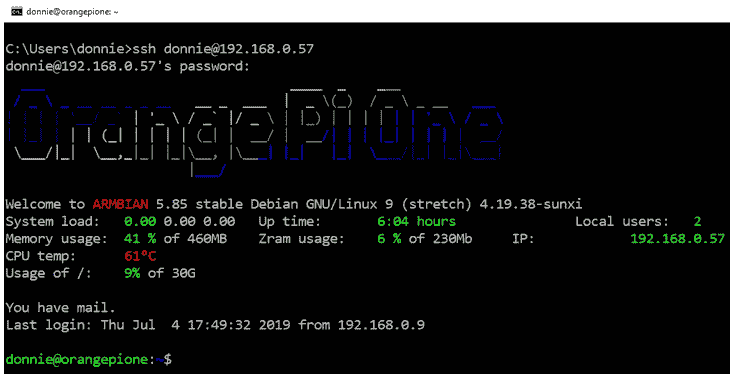

# 第二章：1 在虚拟环境中运行 Linux

## 加入我们在 Discord 上的书籍社区

[`packt.link/SecNet`](https://packt.link/SecNet)


所以，你可能会问自己：*为什么我要学习 Linux 安全？难道 Linux 不是已经很安全了吗？毕竟，它不像 Windows*。但事实是，有很多原因。

确实，Linux 在安全性方面相较于 Windows 有一些优势。这些优势包括以下几点：

+   与 Windows 不同，Linux 从一开始就被设计为多用户操作系统。因此，Linux 系统中的用户安全通常比其他系统要好一些。

+   Linux 提供了更好的管理用户与非特权用户之间的隔离。这使得入侵者更难进入系统，同时也使得用户不小心将恶意软件传染到 Linux 系统的可能性更小。

+   Linux 对病毒和恶意软件的感染比 Windows 更具抵抗力。某些 Linux 发行版自带内建机制，例如 Red Hat 及其免费克隆中的 SELinux，以及 Ubuntu 和 SUSE 中的 AppArmor，它们帮助防止入侵者控制系统。

+   Linux 是免费和开源的软件。这允许任何有能力审核 Linux 代码的人寻找漏洞或后门。

但即使有这些优势，Linux 和人类创造的其他一切一样。也就是说，它并不完美。

以下是我们将在本章中讨论的主题：

+   观察威胁形势

+   为什么每个 Linux 管理员都需要了解 Linux 安全

+   关于威胁形势的一些介绍，以及攻击者在某些时候如何能够突破 Linux 系统的几个例子

+   跟进 IT 安全新闻的资源

+   物理、虚拟和云环境的差异

+   在 VirtualBox 上设置 Ubuntu Server 和 Red Hat 类型的虚拟机，并在 Red Hat 类型虚拟机中安装 **企业 Linux 附加包**（**EPEL**）库

+   创建虚拟机快照

+   在 Windows 主机上安装 Cygwin，以便 Windows 用户可以从其 Windows 主机连接到虚拟机

+   使用 Windows 10/11 的 Bash shell 访问 Linux 系统

+   如何保持你的 Linux 系统更新

让我们从谈论威胁开始。

## 观察威胁形势

如果你过去几年一直关注 IT 技术新闻，你可能至少看到过几篇关于攻击者入侵 Linux 服务器的文章。例如，虽然 Linux 并不容易感染病毒，但确实发生过几起攻击者在 Linux 服务器上植入其他类型恶意软件的案件。以下是一些例子：

+   **僵尸网络恶意软件**：这使得服务器加入一个由远程攻击者控制的僵尸网络。一个比较著名的案例是将 Linux 服务器加入一个僵尸网络，并发起 **拒绝服务**（**DoS**）攻击，攻击其他网络。

+   **勒索软件**：这种软件旨在加密用户数据，直到服务器所有者支付赎金。但即使支付了赎金，也不能保证数据能够恢复。

+   **加密货币挖矿软件**：这会导致安装该软件的服务器的 CPU 超负荷工作并消耗更多的能量。被挖掘的加密货币会进入攻击者的账户，这些攻击者是植入软件的人。

当然，也有许多安全漏洞并不涉及恶意软件，例如攻击者通过某种方式窃取用户凭证、信用卡数据或其他敏感信息。

> 一些安全漏洞是由于单纯的疏忽所致。这里有一个例子，说明一位粗心的 Adobe 管理员将公司的私密安全密钥放在了一个公开的安全博客上：[`arstechnica.com/information-technology/2017/09/in-spectacular-fail-adobe-security-team-posts-private-pgp-key-on-blog/`](https://arstechnica.com/information-technology/2017/09/in-spectacular-fail-adobe-security-team-posts-private-pgp-key-on-blog/)。

现在，让我们再多谈一些关于安全漏洞的事情。

## 为什么会发生安全漏洞？

无论你运行的是 Linux、Windows 还是其他操作系统，安全漏洞发生的原因通常都是相同的。它们可能是操作系统中的安全漏洞，或者是运行在该操作系统上的应用程序中的安全漏洞。通常，与漏洞相关的安全漏洞本可以通过管理员及时应用安全更新来避免。

另一个大问题是配置不当的服务器。一个标准的、开箱即用的 Linux 服务器配置实际上是相当不安全的，可能会引发大量问题。配置不当的服务器的一个原因是缺乏经过专业培训的人员来安全地管理 Linux 服务器。（当然，这对本书的读者来说是个好消息，因为——相信我——IT 安全领域的高薪工作是没有短缺的。）

现在，除了服务器和桌面上的 Linux 操作系统，我们还在**物联网**（**IoT**）设备上使用 Linux。这些设备存在许多安全问题，很大一部分原因是人们根本不知道如何安全地配置它们。

在本书的旅程中，我们将学习如何以正确的方式做生意，使我们的服务器尽可能安全。我们可以做的一件事是跟进与安全相关的新闻。

## 跟进安全新闻

如果你从事 IT 行业，即使你不是安全管理员，你也会想要跟进最新的安全新闻。在互联网时代，做到这一点非常容易。

首先，有许多专门报道网络安全新闻的网站。例如 ***Packet Storm Security*** 和 ***The Hacker News***。一些常规的技术新闻网站和 Linux 新闻网站，如 ***Ars Technica***、***Fudzilla***、***The Register***、***ZDNet*** 和 ***LXer***，也会报道网络安全漏洞的相关信息。而且，如果你更喜欢看视频而不是阅读，你会找到许多好的 YouTube 频道，例如 ***BeginLinux Guru***。

最后，不管你使用的是哪种 Linux 发行版，务必跟进你所使用的 Linux 发行版的新闻和当前文档。发行版维护者应该有一种方式，让你知道他们的产品中是否出现了安全问题。

这里有一些安全相关网站的链接：

+   **Packet Storm Security**: [`packetstormsecurity.com/`](https://packetstormsecurity.com/)

+   **The Hacker News**: [`thehackernews.com/`](https://thehackernews.com/)

+   这里有一些更广泛的技术网站链接：

+   **Ars Technica**: [`arstechnica.com/`](https://arstechnica.com/)

+   **Fudzilla**: [`www.fudzilla.com/`](https://www.fudzilla.com/)

+   **The Register**: [`www.theregister.co.uk/`](https://www.theregister.co.uk/)

+   **ZDNet**: [`www.zdnet.com/`](https://www.zdnet.com/)

你还可以查看一些通用的 Linux 学习资源以及 Linux 新闻网站：

+   **LXer**: [`lxer.com/`](http://lxer.com/)

+   **BeginLinux Guru 在 YouTube 上**: [`www.youtube.com/channel/UC88eard_2sz89an6unmlbeA`](https://www.youtube.com/channel/UC88eard_2sz89an6unmlbeA)

+   （完全披露：我就是世界著名的 BeginLinux Guru。）

阅读本书时需要时刻记住的一点是，唯一一个你见过的完全 100%安全的操作系统，将会是安装在永远不会开机的计算机上。

## 物理、虚拟和云环境之间的区别

为了让你能够进行实践操作，我将向你介绍虚拟机的概念。这仅仅是一种在一个操作系统内部运行另一个操作系统的方式。所以，不管你在主机上运行的是 Windows、macOS 还是 Linux，都没关系。无论如何，你都可以运行一个 Linux 虚拟机，用它进行练习，而且如果它被弄坏了，你也不必担心。

我们将使用的虚拟化软件是 Oracle 的 VirtualBox，它非常适合我们要做的工作。在企业环境中，你会发现有些虚拟化软件更适合用于数据中心。过去，服务器硬件只能一次做一件事，这意味着你必须为 DNS 运行一台服务器，为 DHCP 运行另一台，依此类推。如今，我们有了内存充足、硬盘空间大的服务器，每个 CPU 最多有 64 个核心。因此，在每台服务器上安装多个虚拟机，且每个虚拟机执行特定任务，变得更加便宜和方便。这也意味着你不仅需要关注托管这些虚拟机的物理服务器的安全性，还需要关注每个虚拟机的安全性。一个额外的问题是，你需要确保虚拟机之间正确地隔离，尤其是那些包含敏感数据的虚拟机。

然后，就是云计算了。许多不同的公司提供云服务，个人或公司可以在云端启动 Windows 实例或他们选择的 Linux 发行版。当在云服务上设置 Linux 发行版时，有些操作你需要立即做，以增强安全性。（这是我们在*第六章*，*SSH 加固*中会讲解的内容。）并且要意识到，当你在云服务上设置服务器时，你会更关注适当的安全性，因为它会有一个连接到广阔互联网的接口。（你本地的服务器，除非是用于面向公众的，否则通常是与互联网隔离的。）

在我们介绍完基本材料后，接下来进入真正的核心内容，从介绍我们的虚拟化软件开始。

## 介绍 VirtualBox 和 Cygwin

每当我写作或讲解时，我都会尽力避免给学生提供一种安眠药式的内容。在本书中，只有在必要时才会涉及一些理论，但我更喜欢提供有用的实践信息。书中还会有大量的逐步操作实验，偶尔也会加入一些幽默的元素。

做实验的最佳方式是使用 Linux 虚拟机。我们所做的大多数工作都可以适用于任何 Linux 发行版，但我们也会做一些特定于**Red Hat 企业版 Linux**（**RHEL**）或 Ubuntu Linux 的事情。（RHEL 在企业使用中最为流行，而 Ubuntu 在云部署中最为流行。）SUSE 是第三大企业 Linux 发行版。我们不会做太多关于 SUSE 的内容，但偶尔会提到它的一些小特点。

> Red Hat 是一家价值十亿美元的公司，因此它在 Linux 市场中的地位无可置疑。但由于 Ubuntu Server 是免费的，我们不能仅凭其母公司的价值来评判它的受欢迎程度。事实上，Ubuntu Server 是部署基于云的应用程序最广泛使用的 Linux 发行版。
> 
> > 详情请见此处：[`www.zdnet.com/article/ubuntu-linux-continues-to-dominate-openstack-and-other-clouds/`](http://www.zdnet.com/article/ubuntu-linux-continues-to-dominate-openstack-and-other-clouds/)。

由于 Red Hat 是收费产品，我们将使用 CentOS 7、AlmaLinux8 和 AlmaLinux9，这些都是基于 Red Hat 源代码构建的，并且是免费的。（我们会使用这三个发行版，因为它们之间有一些差异，并且它们都会在相当长的时间内得到支持。）

对于 Ubuntu，我们将集中讨论 22.04 版本，因为它是最新的 **长期支持** (**LTS**) 版本。（我们也会偶尔看一下 Ubuntu 20.04，因为它仍然得到支持，并且它与 22.04 之间存在一些差异。）新的 LTS 版本会在每个偶数年份的 4 月发布，而非 LTS 版本会在每个奇数年份的 4 月和每年 10 月发布。对于生产环境，你主要需要坚持使用 LTS 版本，因为非 LTS 版本有时可能会遇到一些问题。

有多种虚拟化平台可供选择，但我个人的首选是 VirtualBox。

VirtualBox 适用于 Windows、Linux 和 Mac 主机，且所有平台均免费提供。（它也可以用于 Solaris 主机，但我怀疑你们当中大多数人不会运行这个系统。）它具有在其他平台上需要付费的功能，比如创建虚拟机快照的能力。

我们将进行的一些实验需要你模拟从主机连接到远程 Linux 服务器。如果你的主机是 Linux 或 Mac 机器，你只需要打开终端并使用内置的 **安全外壳（SSH）** 工具。如果你的主机运行的是 Windows，你需要安装某种 Bash shell，例如 Cygwin，或者直接使用 Windows 10/11 Pro 中自带的 Bash shell。

## 在 VirtualBox 中安装虚拟机

对于从未使用过 VirtualBox 的你们，以下是一个快速入门指南：

1.  下载并安装 VirtualBox 和 VirtualBox 扩展包。你可以从 [`www.virtualbox.org/`](https://www.virtualbox.org/) 获取它们。

1.  下载 Ubuntu Server 22.04、CentOS 7、AlmaLinux8 和 AlmaLinux9 的安装 `.iso` 文件。你可以从 [`ubuntu.com/`](https://ubuntu.com/)、[`almalinux.org/`](https://almalinux.org/) 和 [`www.centos.org/`](https://www.centos.org/) 获取它们。

1.  启动 VirtualBox 并点击屏幕顶部的 **新建** 图标。根据提示填写信息。将虚拟磁盘大小增加到 20 GB，但保留其他所有默认设置，如下所示：

    

    B19501_01_01.png

1.  

    启动新虚拟机。点击位置对话框旁边的文件夹图标，导航到存储下载的 `.iso` 文件的目录。选择 Ubuntu ISO 文件、CentOS ISO 文件或 AlmaLinux ISO 文件，如下图所示。（如果 ISO 文件没有显示在列表中，点击左上角的 **添加** 按钮来添加它。）

    

    B19501_01_02.png

1.  点击对话框中的 **开始** 按钮以开始安装操作系统。请注意，对于 Ubuntu 服务器，你将不会安装桌面界面。对于 CentOS 7 虚拟机，你可以根据需要选择 KDE 桌面或 GNOME 桌面。对于 AlmaLinux，你的唯一桌面选择是 GNOME。（我们将至少进行一次需要桌面界面的 AlmaLinux 机器操作。）

1.  安装 Ubuntu 时，来到此屏幕时选择 **试用或安装 Ubuntu 服务器**：

    

    B19501_01_03.png

1.  对其他 Linux 发行版重复该过程。

1.  使用以下两个命令更新 Ubuntu 虚拟机：

```
sudo apt update 
sudo apt dist-upgrade
```

1.  暂时不要更新 CentOS 和 AlmaLinux 虚拟机，因为我们将在下一个练习中进行更新。

1.  对于 Ubuntu，在 **SSH 设置** 屏幕上选择安装 **OpenSSH 服务器**。

> 安装 Ubuntu 时，系统会要求你为自己创建一个普通用户帐户和密码。它不会要求你创建 root 用户密码，而是会自动将你添加到 `sudo` 组中，以便你拥有管理员权限。
> 
> > 当你到达 CentOS 或 AlmaLinux 安装程序的用户帐户创建屏幕时，请确保勾选 **将此用户设置为管理员**，因为默认情况下此选项是未勾选的。系统会提供给你创建 root 用户密码的机会，但这是完全可选的。（事实上，我从不设置 root 密码。）

AlmaLinux 9 安装程序的用户帐户创建屏幕—与 CentOS 7 和 AlmaLinux 8 的屏幕相同—如下所示：


B19501_01_04.png

对于 Ubuntu 22.04，你会看到一个简洁的屏幕，设置你的真实姓名、用户名和密码。Ubuntu 安装程序会自动将你的用户帐户添加到 `sudo` 组，从而赋予你完全的管理员权限。

这是 Ubuntu 22.04 的用户帐户创建屏幕：


B19501_01_05.png

现在，让我们转到 CentOS 7。

## 在 CentOS 7 虚拟机上安装 EPEL 仓库

虽然 Ubuntu 软件包仓库几乎包含了你在本课程中所需的一切，但 CentOS 和 AlmaLinux 的软件包仓库——可以说——相对匮乏。为了在 CentOS 和 AlmaLinux 的动手实验中获得所需的软件包，你需要安装 EPEL 仓库。（EPEL 项目由 Fedora 团队管理。）当你在 Red Hat 7 和 CentOS 7 系统上安装第三方仓库时，还需要安装优先级包并编辑 `.repo` 文件，以为每个仓库设置正确的优先级。这将防止来自第三方仓库的软件包覆盖官方 Red Hat 和 CentOS 软件包，即使它们恰好拥有相同的名称。以下步骤将帮助你安装所需的软件包并编辑 `.repo` 文件：

1.  安装 EPEL 所需的两个软件包已经包含在 CentOS 7 的常规仓库中。要安装它们，只需运行以下命令：

```
sudo yum install yum-plugin-priorities epel-release
```

1.  安装完成后，导航到 `/etc/yum.repos.d` 目录，并在你喜欢的文本编辑器中打开 `CentOS-Base.repo` 文件。在 `base`、`updates` 和 `extras` 部分的最后一行后，添加 `priority=1`。在 `centosplus` 部分的最后一行后，添加 `priority=2`。保存文件并关闭编辑器。你编辑过的每个部分应该看起来像这样，除了适当的名称和优先级号码：

```
 [base] 
  name=CentOS-$releasever - Base 
  mirrorlist=http://mirrorlist.centos.org/? 
  release=$releasever&arch=$basearch&repo=os&infra=$infra 
  #baseurl=http://mirror.centos.org/centos/ 
  $releasever/os/$basearch/ 
  gpgcheck=1 
  gpgkey=file:///etc/pki/rpm-gpg/RPM-GPG-KEY-CentOS-7 
  priority=1
```

1.  打开 `epel.repo` 文件进行编辑。在 `epel` 部分的最后一行后，添加 `priority=10`。在每个剩余部分的最后一行后，添加 `priority=11`。

1.  更新系统后，运行以下命令以创建已安装和可用软件包的列表：

```
sudo yum upgrade 
sudo yum list > yum_list.txt
```

现在，让我们继续进行 AlmaLinux 的设置。

## 在 AlmaLinux 8/9 虚拟机上安装 EPEL 仓库

要在 AlmaLinux 上安装 EPEL 仓库，你只需运行以下命令：

```
sudo dnf install epel-release
```

由于在 CentOS 7 及更早版本中没有优先级包，因此我们不必担心配置仓库的优先级。

当软件包安装完成后，使用以下两个命令更新系统并创建可用软件包列表：

```
sudo dnf upgrade 
sudo dnf list > dnf_list.txt
```

接下来，我们来配置网络。

## 配置 VirtualBox 虚拟机的网络

我们的一些培训场景将要求你模拟连接到远程服务器。你可以通过使用主机机器连接到虚拟机来完成此操作。当你第一次在 VirtualBox 中创建虚拟机时，网络模式设置为**NAT**。为了从主机连接到虚拟机，你需要将虚拟机的网络适配器设置为**桥接适配器**模式。以下是你可以执行此操作的步骤：

1.  关闭你已创建的任何虚拟机。

1.  在**VirtualBox 管理器**界面中，打开虚拟机的**设置**对话框。

1.  点击 **Network** 菜单项。将 **Attached to** 设置从 **NAT** 更改为 **Bridged Adapter**，并将 **Promiscuous Mode** 设置为 **Allow All**，如此截图所示：

    

    B19501_01_06.png

1.  重新启动虚拟机并设置其使用静态 IP 地址。

> 提示：
> 
> > 如果您从子网范围的高端分配静态 IP 地址，则更容易避免与从您的互联网网关分配的低编号 IP 地址发生冲突。

## 使用 VirtualBox 创建虚拟机快照

与虚拟机一起工作的美妙之处之一是，如果出现问题，您可以创建一个快照并回滚到它。使用 VirtualBox，这很容易做到，只需按照以下步骤操作：

1.  从 **VirtualBox 管理器** 屏幕的 **Machine** 菜单中，选择 **Tools/Snapshots**。

1.  在屏幕右侧更进一步，点击 **Take** 图标以打开快照对话框。要么填写所需的 **Snapshot Name**，要么接受默认名称。可选地，您可以创建一个描述，如此截图所示：


B19501_01_07.png

当您对虚拟机进行更改后，可以通过关闭虚拟机，然后突出显示 **快照名称** 并点击 **恢复** 按钮来回滚到快照。

## 使用 Cygwin 连接到您的虚拟机

如果您的主机机器是 Linux 或 Mac，您只需打开主机的终端并使用那些已经存在的工具来连接虚拟机。Windows 10 和 Windows 11，即使在基础 Home 版本中，现在都带有内置的 **Secure Shell** 客户端，分别内置于普通的 **命令提示符** 和 **PowerShell** 中，您可以选择使用它。但如果您希望使用更接近实际 Linux 经验的工具，您可以考虑使用 Cygwin。

Cygwin，红帽公司的项目，是一个专为 Windows 构建的免费开源 Bash shell。它是免费的，易于安装。

## 在您的 Windows 主机上安装 Cygwin

这里有一个快速入门使用 Cygwin 的方法：

1.  在您主机机器的浏览器中，从 [`www.cygwin.com/`](http://www.cygwin.com/) 下载适合您 Windows 版本的适当的 `setup*.exe` 文件。

1.  双击安装程序图标开始安装。在大多数情况下，只需接受默认设置，直到您到达 **包选择** 屏幕。 （唯一的例外是您选择下载镜像的屏幕。）

1.  在 **包选择** 屏幕的顶部，从 **View** 菜单中选择 **Category**。

1.  展开 **Net** 类别，如下截图所示：

    

    B19501_01_08.png

1.  向下滚动直到看到 **openssh** 包。在 **New** 列下，点击 **Skip**（这将导致 **Skip** 的位置显示版本号），如此截图所示：

    

    B19501_01_09.png

1.  

    选择正确的包之后，你的屏幕应该是这样的：

    

    B19501_01_10.png

1.  在右下角，点击**下一步**。如果弹出**解析依赖关系**的屏幕，点击该屏幕上的**下一步**。

1.  保留你下载的安装文件，因为稍后你会用它来安装更多的软件包或更新 Cygwin。（当你打开 Cygwin 时，任何更新的软件包都会出现在**查看**菜单中的**待处理视图**里。）

1.  一旦你从 Windows 开始菜单打开 Cygwin，你可以根据需要调整其大小，并使用 *Ctrl* + + 或 *Ctrl* + - 键组合来调整字体大小。

接下来，我们将查看 Windows 10/11 中的 Bash shell。

## 使用 Windows 10 SSH 客户端与 Linux 虚拟机交互

如果你使用的是 Windows 10，你的操作系统中已经内建了 SSH 客户端。

那么，让我们看看如何操作：

1.  要访问它，你可以从**Windows 系统**菜单中打开传统的**命令提示符**，如下所示：

    

    B19501_01_11.png

1.  然后，像在 Mac 或 Linux 机器上那样，输入 SSH 命令：

    

    B19501_01_12.png

1.  更好的选择是使用**Windows****PowerShell**，而不是普通的**命令提示符**。按照如下方式进入：

    

    B19501_01_13.png

1.  如前所述，让我们用它来登录到我的 Orange Pi 设备，正如你在这里看到的：


B19501_01_14.png

如果可以选择，建议使用**PowerShell**而不是**命令提示符**。**PowerShell** 更接近于 Linux 的 Bash shell 体验，你会因此更加满意。

## 使用 Windows 11 SSH 客户端与 Linux 虚拟机交互

在 Windows 11 中，你的操作方式和 Windows 10 一样，唯一的区别是**命令提示符**和**PowerShell**的菜单位置不同。**命令提示符**现在在主菜单中有了自己的终端项，而**PowerShell**则位于**Windows 工具**子菜单下。Windows 11 还新增了第三个选项，即内建的 Ubuntu 虚拟机，你会在任务栏底部看到它的图标。

## Cygwin 与 Windows shell 的对比

Cygwin 和 Windows 10/11 内建的 SSH 客户端各有优缺点。支持 Cygwin 的优点是，你可以安装多种软件包，几乎可以按你的需求自定义它。另外，Cygwin 会将 SSH 的 `known_hosts` 和密钥文件存储在用户主目录的 `.ssh` 目录中，如果你习惯于使用 Linux，这里是你应该找到这些文件的位置。如果你使用的是 Windows 内建的 SSH 客户端，你需要在其他位置查找这些文件。

支持 Windows 10/11 内建 SSH 客户端的理由之一就是它已经预装了。而且，如果你需要访问普通的 Windows 文件夹，它比 Cygwin 更容易使用，因为 Cygwin 会把你困在它自己的沙盒目录结构中。

## 保持 Linux 系统更新

花些时间浏览**常见漏洞和暴露**数据库，你很快就会明白为什么保持系统更新如此重要。没错，你甚至会发现，我们心爱的 Linux 也有安全漏洞，正如你在这里看到的：


B19501_01_15.png

更新 Linux 系统只需要一两个简单的命令，通常比更新 Windows 系统更快且不那么痛苦。

> 你可以在这里找到**常见漏洞和暴露**数据库：
> 
> > [`cve.mitre.org/`](https://cve.mitre.org/)
> > 
> > 所有你们这些有责任心、敬业的 Linux 管理员，肯定都想熟悉这个网站。

接下来，我们来看看如何更新基于 Debian 的系统，包括 Ubuntu。

## 更新基于 Debian 的系统

让我们来看看如何更新基于 Debian 的系统：

1.  在 Debian 及其众多衍生版本（包括 Ubuntu）上，运行两个命令，如下所示：

```
sudo apt update 
sudo apt dist-upgrade
```

1.  偶尔，你还需要删除一些不再需要的旧软件包。你怎么知道呢？很简单。当你登录系统时，命令行上会出现一条消息。要删除这些旧软件包，只需运行这个命令：

```
sudo apt auto-remove
```

接下来，我们将为 Ubuntu 配置自动更新。

## 为 Ubuntu 配置自动更新

当你首次安装 Ubuntu 22.04 时，自动更新默认是开启的。为了验证这一点，你首先需要检查 unattended-upgrades 服务的状态，像这样：

```
donnie@ubuntu2204-packt:~$ systemctl status unattended-upgrades
● unattended-upgrades.service - Unattended Upgrades Shutdown
     Loaded: loaded (/lib/systemd/system/unattended-upgrades.service; enabled; vendor preset: enabled)
     Active: active (running) since Sat 2022-10-08 19:25:54 UTC; 52min ago
. . .
. . .
donnie@ubuntu2204-packt:~$
```

然后，查看`/etc/apt/apt.conf.d/20auto-upgrades`文件。如果启用了自动更新，你会看到如下内容：

```
APT::Periodic::Update-Package-Lists "1";
APT::Periodic::Unattended-Upgrade "1";
```

不过，我必须承认，我对此有些复杂的感受。我的意思是，虽然安全更新能够在我不做任何事情的情况下自动安装，这很好，但很多更新需要系统重启后才能生效。默认情况下，Ubuntu 系统在安装更新后不会自动重启。如果你保持默认设置，当你登录系统时，会看到一个关于此的消息。但如果你愿意，你可以设置 Ubuntu 在自动更新后自动重启。方法如下：

1.  进入`/etc/apt/apt.conf.d`目录，并使用你喜欢的文本编辑器打开`50unattended-upgrades`文件。在大约*67*行的位置，你会看到一行内容：

```
//Unattended-Upgrade::Automatic-Reboot "false";
```

1.  通过删除前导斜杠来取消注释这一行，并将`false`改为`true`，像这样：

```
Unattended-Upgrade::Automatic-Reboot "true";
```

1.  在这个新配置下，Ubuntu 现在将在自动更新过程完成后立即重新启动。如果你更希望在特定的时间重启机器，请向下滚动到大约*103*行，你会看到以下内容：

```
//Unattended-Upgrade::Automatic-Reboot-Time "02:00";
```

1.  由于这一行被其前导的双斜杠注释掉了，它目前没有任何效果。要让机器在早上 2:00 重新启动，只需取消注释这一行。要让它在比如晚上 10:00 重启，取消注释这一行并将时间改为`22:00`，像这样：

```
Unattended-Upgrade::Automatic-Reboot-Time "22:00";
```

当然，有一个基本的原则是，**你不应在生产系统上安装系统更新，而不先在测试系统上进行测试**。任何操作系统供应商偶尔都可能提供有问题的更新，而这也包括 Ubuntu。（我知道你在说什么：*说得对，Donnie*。）Ubuntu 的自动更新功能与这一基本原则直接冲突。如果启用了自动更新，禁用它其实很简单，如果你选择这么做的话。

1.  要禁用自动更新，只需进入`/etc/apt/apt.conf.d`目录，并用你喜欢的文本编辑器打开`20auto-upgrades`文件。你会看到如下内容：

```
APT::Periodic::Update-Package-Lists "1"; 
APT::Periodic::Unattended-Upgrade "1";
```

1.  将第二行的参数更改为 0，这样文件看起来就像这样：

```
APT::Periodic::Update-Package-Lists "1"; 
APT::Periodic::Unattended-Upgrade "0";
```

> 现在，系统仍然会检查更新，并在登录屏幕上显示有更新时的消息，但不会自动安装它们。当然，应该说得很明显，你需要定期检查你的系统，以查看是否有更新可用。如果你确实希望保持自动更新启用，确保启用自动重启，或者每周至少登录系统几次，看看是否需要重启。

1.  如果你想查看是否有任何与安全相关的更新可用，但不想看到任何非安全更新，可以使用`unattended-upgrade`命令，像这样：

```
sudo unattended-upgrade --dry-run -d
```

1.  若要手动安装与安全相关的更新，而不安装非安全更新，只需运行：

```
sudo unattended-upgrade -d
```

> 如果你在一个每次使用后都会关机的工作站上运行桌面版 Ubuntu，你可以根据需要启用自动更新，但无需启用自动重启。
> 
> > 此外，如果你运行的是非 Ubuntu 版本的 Debian（包括树莓派的 Raspbian），你可以通过安装`unattended-upgrades`软件包，使其具备与 Ubuntu 相同的功能。只需运行此命令：

```
sudo apt install unattended-upgrades
```

你也可以使用`apt`命令只安装安全更新，但这需要将`apt`的输出通过一系列复杂的文本过滤器进行管道处理，以便屏蔽非安全更新。使用`unattended-upgrade`命令要简单得多。

> 我之前说过，我们应该总是在测试系统上测试更新，之后再在生产系统上安装它们，这一点对于企业服务器来说确实是成立的。但当我们有一大堆物联网设备需要保持更新时，尤其是当这些设备分布在各地、甚至是消费者设备中时，我们该怎么办呢？
> 
> > 在神奇的物联网世界中，适用于各种 Pi 设备（包括无处不在的树莓派）的最流行 Linux 发行版是 ARM CPU 版本的 Ubuntu、Raspbian 和 Debian。如果你在现场和消费设备中有大量物联网设备，一旦它们被部署或售出，你可能无法直接控制它们。它们仍然需要保持更新，因此设置无人值守更新并自动重启无疑会带来便利。但请记住，在物联网世界中，我们不仅要关注安全性，还要关注安全问题。例如，如果你有设备被设置为某种关键的、安全相关的工业控制器，那么在执行自动更新后，你很可能不希望设备自动重启。但如果你是安装 Linux 的智能电视供应商，那么肯定应该设置它们自动更新并在更新后自动重启。

接下来，让我们来看一下更新 RHEL 7 系统。

## 更新基于 Red Hat 7 的系统

对于基于 Red Hat 的系统，包括 CentOS 和 Oracle Linux，在安装过程中没有自动更新机制。因此，在默认配置下，你需要自己执行更新：

1.  要更新一个基于 Red Hat 7 的系统，只需运行以下命令：

```
sudo yum upgrade
```

1.  有时候，你可能只想查看是否有任何与安全相关的更新准备好安装。可以通过运行以下命令来做到这一点：

```
sudo yum updateinfo list updates security
```

1.  如果有任何安全更新可用，你将在命令输出的最后看到它们。我刚刚测试的系统中，只有一个安全更新可用，内容如下：

```
FEDORA-EPEL-2019-d661b588d2 Low/Sec. nagios-common-4.4.3-1.el7.x86_64 

updateinfo list done
```

1.  如果你只想安装安全更新，运行以下命令：

```
sudo yum upgrade --security
```

1.  现在，假设你需要一个 CentOS 系统自动更新自己。你很幸运，因为有一个专门的包来实现这一点。安装并启用它，然后通过运行以下两条命令来启动它：

```
sudo yum install yum-cron 

sudo systemctl enable --now yum-cron
```

1.  要进行配置，进入`/etc/yum`目录，编辑`yum-cron.conf`文件。在文件顶部，你将看到如下内容：

```
[commands] 
# What kind of update to use: 
# default = yum upgrade 
# security = yum --security upgrade 
# security-severity:Critical = yum --sec-severity=Critical upgrade 
# minimal = yum --bugfix update-minimal 
# minimal-security = yum --security update-minimal 
# minimal-security-severity:Critical = --sec-severity=Critical update-minimal 
update_cmd = default
```

这列出了我们可以执行的各种类型的升级。最后一行显示我们已经设置好更新所有内容。

1.  假设你只希望自动应用安全更新。只需将最后一行更改为以下内容：

```
update_cmd = security
```

1.  在*15*和*20*行，你会看到如下内容：

```
download_updates = yes 
apply_updates = no
```

这表示默认情况下，`yum-cron`只设置为自动下载更新，但不进行安装。

1.  如果你希望自动安装更新，将`apply_updates`参数更改为`yes`。

    > 请注意，不像 Ubuntu，CentOS 没有设置让系统在更新后自动重启。

1.  最后，让我们来看一下`yum-cron`的邮件设置，你可以在`yum-cron.conf`文件的*48*到*57*行找到，如下所示：

```
[email] 
# The address to send email messages from. 
# NOTE: 'localhost' will be replaced with the value of system_name. 
email_from = root@localhost 

# List of addresses to send messages to. 
email_to = root 

# Name of the host to connect to to send email messages. 
email_host = localhost
```

如你所见，`email_to =` 行被设置为将消息发送给 root 用户账户。如果你想接收来自你自己账户的消息，只需在这里更改。

1.  要查看消息，你需要安装一个邮件阅读程序，如果尚未安装。（如果你在安装操作系统时选择了**最小安装**，则未安装该程序。）你最好的选择是安装`mutt`，如下所示：

```
sudo yum install mutt
```

1.  当你打开`mutt`并查看一条消息时，你将看到类似这样的内容：

    

    B19501_01_16.png

1.  与所有操作系统一样，某些更新将要求系统重启。那么，如何知道系统何时需要重启呢？当然是使用`needs-restarting`命令。不过，首先，你需要确保系统中安装了`needs-restarting`。可以通过以下命令来做到这一点：

```
sudo yum install yum-utils
```

一旦安装了该软件包，你可以通过三种方式使用`needs-restarting`。如果仅运行该命令而不加任何选项开关，你将看到需要重启的服务和要求重启计算机的包。你还可以使用`-s`或`-r`选项，如下所示：

| **命令** | **解释** |
| --- | --- |
| `sudo needs-restarting` | 这个命令显示需要重启的服务，以及系统可能需要重启的原因。 |
| `sudo needs-restarting -s` | 这个命令仅显示需要重启的服务。 |
| `sudo needs-restarting -r` | 这个命令仅显示系统需要重启的原因。 |

接下来，我们将更新基于 Red Hat 8/9 的系统。

## 更新基于 Red Hat 8/9 的系统

旧版的`yum`工具已经存在了几乎永远，它是一个出色、勤奋的工具。但它确实有时会出现一些小问题，并且在某些时候会非常慢。不过，别担心。Red Hat 的英雄们终于做出了改变，通过用`dnf`替代了`yum`。所以，当你使用你的 AlmaLinux 8/9 虚拟机时，你将使用`dnf`而不是`yum`。让我们来看看如何操作。

1.  大多数情况下，你使用`dnf`的方式与使用`yum`是一样的，使用相同的参数和选项。例如，要进行系统升级，只需执行：

```
sudo dnf upgrade
```

1.  `yum`和`dnf`之间的主要功能差异在于，`dnf`具有不同的自动更新机制。现在，你不再安装`yum-cron`包，而是安装`dnf-automatic`包，如下所示：

```
sudo dnf install dnf-automatic
```

1.  在`/etc/dnf`目录中，你会看到`automatic.conf`文件，配置方法与 CentOS 7 中的`yum-cron.conf`文件相同。与旧版的`yum-cron`作为定时任务运行不同，`dnf-automatic`是通过`systemd`定时器来工作的。当你第一次安装`dnf-automatic`时，定时器是禁用的。你需要通过运行以下命令来启用并启动它：

```
sudo systemctl enable --now dnf-automatic.timer
```

1.  使用以下命令来验证它是否正在运行：

```
sudo systemctl status dnf-automatic.timer
```

1.  如果它启动成功，你在检查状态时应该会看到类似这样的内容：

```
[donnie@redhat-8 ~]$ sudo systemctl status dnf-automatic.timer 
 dnf-automatic.timer - dnf-automatic timer 
   Loaded: loaded (/usr/lib/systemd/system/dnf-automatic.timer; enabled; vendor preset: disabled) 
   Active: active (waiting) since Sun 2019-07-07 19:17:14 EDT; 13s ago 
  Trigger: Sun 2019-07-07 19:54:49 EDT; 37min left 

Jul 07 19:17:14 redhat-8 systemd[1]: Started dnf-automatic timer. 
[donnie@redhat-8 ~]$
```

> 要确定系统是否需要重启，只需安装`yum-utils`包并运行`needs-restarting`命令，和 CentOS 7 中的做法一样。（出于某种原因，Red Hat 开发人员从未将包名称更改为`dnf-utils`。）
> 
> > 想了解更多关于`dnf-automatic`的细节，只需输入：

```
man dnf-automatic
```

就是这些了。

> 自动更新听起来是件好事，对吧？嗯，在某些情况下确实如此。在我自己的 Linux 工作站上，我总是喜欢关闭它。因为每当我想安装一个软件包时，系统总是告诉我必须等更新过程完成才能继续。这让我非常烦躁。在企业环境中，在某些情况下禁用自动更新可能也是可取的，这样管理员可以更好地控制更新过程。

在企业环境中进行更新时，有一些特殊的考虑因素。接下来我们来看一下这些问题。

## 在企业中管理更新

当你首次安装任何 Linux 发行版时，它会配置为访问其自己的软件包仓库。这允许用户直接从这些常规发行版仓库安装软件包和更新。这对于家庭或小型企业使用非常好，但对于企业环境来说就不太合适。

在企业环境中，还有两个额外的考虑因素：

+   你需要限制最终用户可以安装的软件包。

+   在允许更新安装到生产网络之前，你总是需要先在一个独立的测试网络上进行测试。

出于这些原因，企业通常会设置自己的仓库服务器，只包含经过批准的软件包和更新。网络中的所有其他机器将配置为从这些仓库拉取软件包和更新，而不是从常规的发行版仓库中拉取。（这里我们不讨论如何设置本地仓库服务器，因为这个话题更适合放在 Linux 管理书籍中。）

> Ubuntu 一直是最具创新性的 Linux 发行版之一，但它也曾面临过不少质量控制问题。在早期，至少有一个 Ubuntu 更新完全破坏了操作系统，用户需要重新安装操作系统。所以，是的，在任何关键任务环境中，更新之前一定要先进行测试。

我认为这就是我们引言章节的全部内容了。让我们来总结一下，好吗？

## 总结

我们已经在 Linux 安全性和强化的旅程上迈出了良好的第一步。在这一章中，我们讨论了了解如何保护和强化 Linux 系统与了解如何保护和强化 Windows 系统一样重要的原因。我们提供了一些关于配置不当的 Linux 系统可能如何被攻破的例子，并提到学习 Linux 安全性对你的职业生涯可能有所帮助。接着，我们讨论了一些在将 Linux 服务器设置为虚拟机或云服务时需要考虑的特殊事项。然后，我们介绍了如何使用 VirtualBox、Cygwin 和 Windows 10/11 shell 设置虚拟化实验室环境。最后，我们简要回顾了如何保持 Linux 系统更新。

在下一章中，我们将探讨如何锁定用户账户，确保错误的人永远无法获得管理员权限。我们下次见。

## 问题

1.  因为 Linux 的设计比 Windows 更加安全，我们不必担心 Linux 安全问题。

    1.  正确

    1.  错误

1.  以下哪个关于 IoT 设备上 Linux 的说法是正确的？

    1.  它们太多了。

    1.  它们正在接管世界。

    1.  它们中的太多配置不安全。

    1.  它们的配置如此安全，以至于会让安全从业者失业。

1.  以下哪个关于企业中自动操作系统更新的说法是正确的？

    1.  你应该始终保持它们启用。

    1.  它们违反了在生产网络安装更新之前，必须先在测试网络上进行测试的基本原则。

    1.  与手动更新不同，自动更新后你无需重新启动系统。

    1.  对于 IoT 设备，启用自动更新没有太大意义。

## 进一步阅读

这里有一些方便的资源供你参考：

+   **Linux 安全**: [`linuxsecurity.com/`](https://linuxsecurity.com/)

+   **官方 VirtualBox 网站**: [`www.virtualbox.org/`](https://www.virtualbox.org/)

+   **官方 CentOS 页面**: [`www.centos.org/`](https://www.centos.org/)

+   **RHEL 文档（同样适用于 CentOS 和 AlmaLinux）**: [`access.redhat.com/documentation/en-us/red_hat_enterprise_linux/9`](https://access.redhat.com/documentation/en-us/red_hat_enterprise_linux/9)

+   **在 RHEL 7 和 CentOS 7 中启用自动更新**: [`linuxaria.com/howto/enabling-automatic-updates-in-centos-7-and-rhel-7`](https://linuxaria.com/howto/enabling-automatic-updates-in-centos-7-and-rhel-7)

+   **管理和监控 RHEL 8 的安全更新**: [`access.redhat.com/documentation/en-us/red_hat_enterprise_linux/8/html/managing_and_monitoring_security_updates/index`](https://access.redhat.com/documentation/en-us/red_hat_enterprise_linux/8/html/managing_and_monitoring_security_updates/index)
