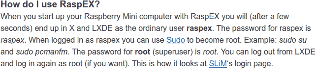
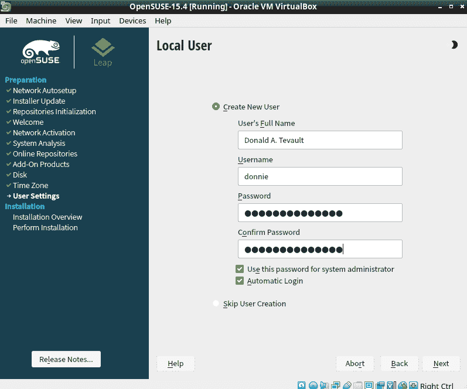
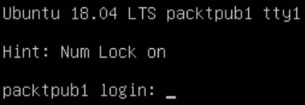
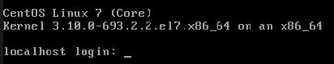
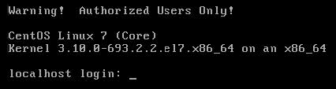
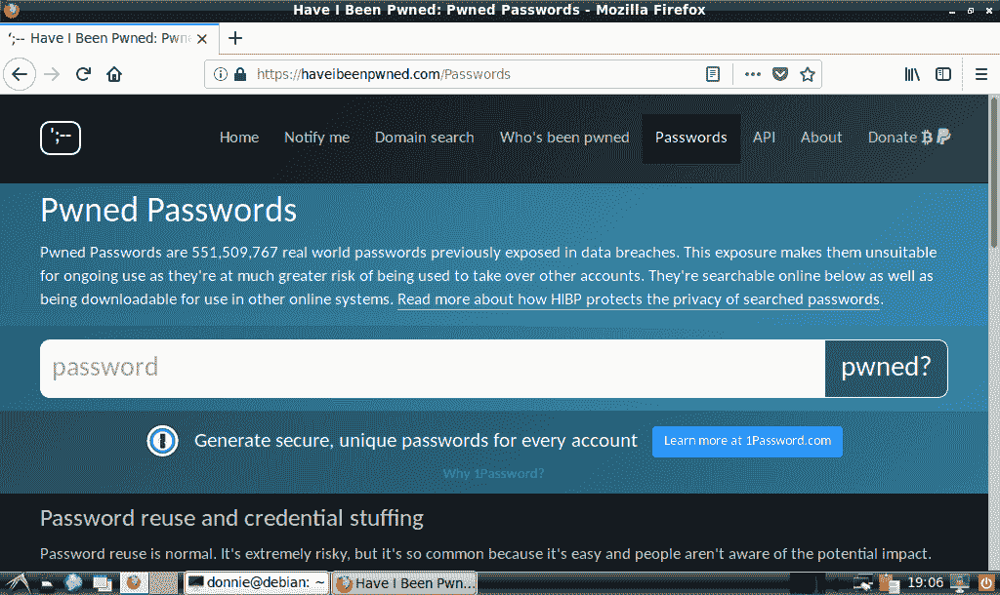
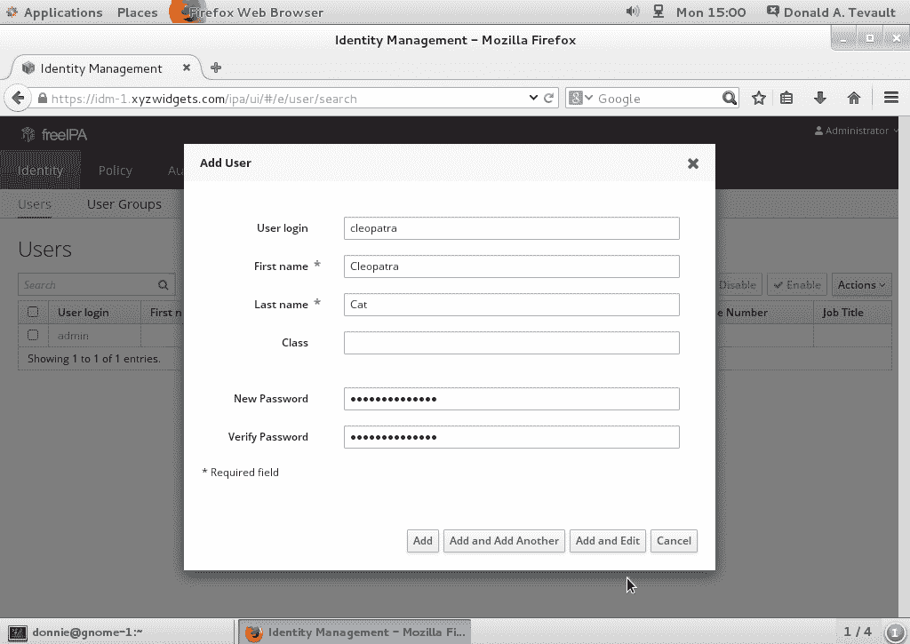

# 2 用户账户安全

## 加入我们的书籍社区，和我们一起在 Discord 上讨论

[`packt.link/SecNet`](https://packt.link/SecNet)


用户管理是 IT 管理中较为具有挑战性的方面之一。你需要确保用户能够始终访问他们的文件，并且能够执行完成工作所需的任务。你还需要确保用户的文件始终受到未授权用户的保护，并且用户不能执行与他们工作描述不符的任务。这是一个艰巨的任务，但我们旨在证明这是可以做到的。在本章中，我们将讨论如何锁定用户账户和用户凭证，以保护它们免受攻击者和窥探者的侵害。我们还将探讨如何防止用户获得超出其工作所需权限的特权。

本章涵盖的具体内容如下：

+   以 root 用户登录的危险

+   使用`sudo`的优势

+   为完全管理员用户和仅具有某些委派权限的用户设置`sudo`权限

+   使用`sudo`的高级技巧

+   锁定用户的主目录

+   强制执行强密码标准

+   设置并强制执行密码和账户过期规则

+   防止暴力破解密码攻击

+   锁定用户账户

+   设置安全横幅

+   检测被破坏的密码

+   理解中央用户管理系统

## 以 root 用户登录的危险

Unix 和 Linux 操作系统相对于 Windows 的一个巨大优势在于，Unix 和 Linux 在将特权管理员账户与普通用户账户分离方面做得更好。事实上，旧版本的 Windows 容易受到安全问题的攻击，例如病毒感染，就是因为常常设置了具有管理员权限的用户账户，而没有像新版 Windows 那样启用**用户帐户控制（UAC）**。 （即使有了 UAC，Windows 系统仍然会受到感染，只是频率没有那么高。）在 Unix 和 Linux 中，要感染一个配置正确的系统要困难得多。

你可能已经知道，Unix 或 Linux 系统中无所不能的管理员账户是 root 账户。如果你以 root 用户身份登录，你可以对系统做任何你想做的事情。所以你可能会想，“是的，这很方便，所以我就这么做。”然而，始终以 root 用户登录可能会带来一堆安全问题。考虑以下情况，以 root 用户登录可能会带来以下风险：

+   让你更容易意外执行对系统造成损害的操作

+   让其他人更容易执行对系统造成损害的操作

因此，如果你总是以 root 用户身份登录，或者即使你只是让 root 用户账户变得容易访问，可以说你在为攻击者和入侵者做了大部分的工作。而且，想象一下，如果你是一个大型公司的 Linux 系统管理员，而允许用户执行管理任务的唯一方式是将 root 密码提供给所有人。如果其中一个用户离开了公司，你肯定不希望该用户依然能登录到系统，所以你不得不更改密码并将新密码分发给其他所有用户。那么如果你只希望用户对某些任务拥有管理员权限，而不是拥有完整的 root 权限怎么办？

我们需要的是一种机制，使用户能够执行管理任务，而无需承担一直以 root 用户身份登录的风险，并且该机制还允许用户仅拥有完成某项工作所需的最小管理员权限。在 Linux 和 Unix 系统中，我们有这种机制，形式就是 `sudo` 工具。

## 使用 `sudo` 的优势

如果使用得当，`sudo` 工具可以极大增强系统的安全性，并且能让管理员的工作变得更加轻松。使用 `sudo` 后，你可以执行以下操作：

+   为某些用户分配完整的管理员权限，同时为其他用户分配执行与其工作直接相关的任务所需的权限。

+   允许用户通过输入自己正常的用户密码来执行管理任务，这样你就不必把 root 密码分发给每个人。

+   增加入侵者突破你系统的难度。如果你启用了 `sudo` 并禁用了 root 用户账户，那么潜在的入侵者就无法知道该攻击哪个账户，因为他们无法知道哪个账户具有管理员权限。

+   创建可以在整个企业网络中部署的 `sudo` 策略，即便这个网络包含了混合的 Unix、BSD 和 Linux 系统。

+   提升你的审计能力，因为你将能够看到用户在使用其管理员权限时的操作。

关于上面最后一点，请参考我 CentOS 7 虚拟机的 `secure` 日志中的以下片段：

```
Sep 29 20:44:33 localhost sudo: donnie : TTY=pts/0 ; PWD=/home/donnie ; 
USER=root ; COMMAND=/bin/su - 
Sep 29 20:44:34 localhost su: pam_unix(su-l:session): session opened for 
user root by donnie(uid=0) 
Sep 29 20:50:39 localhost su: pam_unix(su-l:session): session closed for 
user root 
```

你可以看到我使用了 `su -` 登录到 root 命令提示符，然后又退出了。在我登录的过程中，我执行了几项需要 root 权限的操作，但这些操作并没有被记录下来。唯一被记录下来的，是我使用 `sudo` 执行的操作。也就是说，由于该机器上的 root 账户被禁用了，我使用了我的 `sudo` 权限来使 `su -` 能正常工作。让我们看另一个片段，进一步展示这个过程是如何运作的：

```
Sep 29 20:50:45 localhost sudo: donnie : TTY=pts/0 ; PWD=/home/donnie ; 
USER=root ; COMMAND=/bin/less /var/log/secure 
Sep 29 20:55:30 localhost sudo: donnie : TTY=pts/0 ; PWD=/home/donnie ; 
USER=root ; COMMAND=/sbin/fdisk -l 
Sep 29 20:55:40 localhost sudo: donnie : TTY=pts/0 ; PWD=/home/donnie ; 
USER=root ; COMMAND=/bin/yum upgrade 
Sep 29 20:59:35 localhost sudo: donnie : TTY=tty1 ; PWD=/home/donnie ;
USER=root ; COMMAND=/bin/systemctl status sshd 
Sep 29 21:01:11 localhost sudo: donnie : TTY=tty1 ; PWD=/home/donnie ; 
USER=root ; COMMAND=/bin/less /var/log/secure
```

这次，我使用了我的`sudo`权限打开了一个日志文件，查看了我的硬盘配置，执行了系统更新，检查了 Secure Shell 守护进程的状态，并再次查看了一个日志文件。所以，如果你是我公司的安全管理员，你将能够看到我是否在滥用我的`sudo`权限。

现在，你可能会问：“那有什么能防止一个人直接执行`sudo su -`，以避免他的不当行为被发现呢？”这个问题很简单。只需要不给用户进入根命令提示符的权限。

## 为完整的管理员用户设置 sudo 权限

在我们讨论如何限制用户可以做什么之前，让我们先看看如何允许用户做所有事情，包括登录根命令提示符。有几种方法可以实现这一点。

### 将用户添加到预定义的管理员组

第一种方法是最简单的，就是将用户添加到预定义的管理员组，然后，如果还没有配置`sudo`策略，就配置该策略，以允许该组执行任务。虽然这种方法很简单，但不同的 Linux 发行版使用不同的管理员组。

在 Unix、BSD 和大多数 Linux 系统中，你需要将用户添加到`wheel`组。（包括 CentOS 和 AlmaLinux 在内的 Red Hat 家族成员属于这一类。）当我在任何一台 RHEL 类机器上执行`groups`命令时，我会得到如下输出：

```
[donnie@localhost ~]$ groups
donnie wheel
[donnie@localhost ~]$
```

这显示我属于`wheel`组。通过执行`sudo visudo`，我将打开`sudo`策略文件。向下滚动，我们可以看到赋予`wheel`组强大权限的那一行：

```
## Allows people in group wheel to run all commands
%wheel ALL=(ALL) ALL
```

百分号表示我们正在处理一个组。`ALL`出现三次表示该组的成员可以在网络上部署此策略的任何机器上以任何用户身份执行任何命令。唯一的小问题是，组成员在执行`sudo`任务时会被提示输入他们自己的正常用户账户密码。再往下滚动，你会看到以下内容：

```
## Same thing without a password
# %wheel ALL=(ALL) NOPASSWD: ALL
```

如果我们在前面的代码片段中注释掉`%wheel`行，并且在这个代码片段中去掉`%wheel`行前的注释符号，那么`wheel`组的成员将能够执行所有`sudo`任务，而无需输入任何密码。这是我真的不推荐的做法，即使是家庭使用也不应该这样做。在商业环境中，允许人员拥有无密码的`sudo`权限绝对是不可取的。

要将现有用户添加到`wheel`组中，使用带有`-G`选项的`usermod`命令。你可能还想使用`-a`选项，以防止将用户从他或她所属的其他组中移除。以我们的示例为例，我们来添加 Maggie：

```
sudo usermod -a -G wheel maggie
```

你也可以在创建用户账户时将其添加到`wheel`组中。我们现在就为 Frank 执行这个操作：

```
sudo useradd -G wheel frank
```

> 提示
> 
> > 请注意，使用`useradd`时，我假设我们在使用的是 Red Hat 系列的操作系统，因为它默认会创建用户账户。对于使用`wheel`组的非 Red Hat 系列发行版，你需要重新配置默认设置，或者使用额外的选项来创建用户的家目录并分配正确的 shell。你的命令应该像这样：

```
sudo useradd -G wheel -m -d /home/frank -s /bin/bash frank
```

对于 Debian 系列的成员，包括 Ubuntu，过程是一样的，只是你需要使用`sudo`组而不是`wheel`组。（考虑到 Debian 的开发者一向走自己的路，这一点也不奇怪。）

> 提示：
> 
> > 这种技术的一个应用场景是在你需要在云服务上创建虚拟专用服务器时，比如在 Rackspace、DigitalOcean 或 Vultr 上。当你登录到这些服务并首次创建虚拟机时，云服务会让你以 root 用户身份登录到虚拟机。（即使在 Ubuntu 上进行本地安装时 root 用户账户是禁用的，这种情况依然存在。）
> > 
> > 在这种情况下，你首先需要为自己创建一个普通用户账户，并赋予该账户完全的`sudo`权限。然后，退出 root 账户，使用你的普通用户账户重新登录。接下来，你需要使用以下命令禁用 root 账户：

```
sudo passwd -l root
```

> 你还需要做一些额外的配置以限制 Secure Shell 访问，但我们将在*第六章*，*SSH 加固*中介绍这些内容。

### 在 sudo 策略文件中创建条目

好的，如果你只是在处理单台机器，或者只在使用这两种管理员组中的一个组跨网络部署`sudo`策略，那么将用户添加到`wheel`组或`sudo`组非常有效。但是如果你想要在一个包含 Red Hat 和 Ubuntu 机器的混合网络中部署`sudo`策略呢？或者你不想到每台机器上去添加用户到管理员组？那么，只需在`sudo`策略文件中创建条目即可。你可以为单个用户创建条目，也可以创建一个用户别名。如果你在 CentOS 或其中一台 AlmaLinux 虚拟机上执行`sudo visudo`，你将看到一个已被注释掉的用户别名示例：

```
# User_Alias ADMINS = jsmith, mikem
```

你可以取消注释这行并添加你自己的用户名，或者你可以直接添加一行来创建自己的用户别名。要给予用户别名中的成员完全的`sudo`权限，请再添加一行，内容如下：

```
ADMINS ALL=(ALL) ALL 
```

也可以为单个用户添加`visudo`条目，你可能需要在非常特殊的情况下这么做。以下是一个示例：

```
frank ALL=(ALL) ALL
```

但为了便于管理，最好选择使用用户组或用户别名。

> 提示：
> 
> > `sudo`策略文件是`/etc/sudoers`文件。我总是犹豫着告诉学生这个，因为时不时会有学生尝试用普通文本编辑器编辑它。然而，这并不奏效，所以请不要尝试。一定要通过`sudo visudo`命令编辑`sudoers`文件。

## 为用户设置仅限特定委派权限的 sudo

IT 安全哲学的基本原则是给予网络用户足够的权限，让他们完成工作，但不要赋予超出其职能范围的权限。所以，你会希望尽可能少的人拥有完全的`sudo`权限。（如果你启用了 root 用户账户，你会希望更少的人知道 root 密码。）你还需要一种方法，根据用户的具体工作分配权限。备份管理员需要执行备份任务，帮助台人员需要执行用户管理任务，等等。通过`sudo`，你可以委派这些权限，并禁止用户做任何不符合其职位描述的其他管理工作。

最好的解释方法是让你在任何一台 RHEL 类型的虚拟机上打开`visudo`。CentOS 7、AlmaLinux 8 和 AlmaLinux 9 都适用于此。所以，先启动其中一台，并输入：

```
sudo visudo
```

与 Ubuntu 不同，RHEL 类型的发行版有一个完全注释并且文档化良好的`sudoers`文件。我已经向你展示了创建`ADMIN`用户别名的行，你还可以为其他目的创建其他用户别名。例如，你可以创建一个`BACKUPADMINS`用户别名用于备份管理员，一个`WEBADMINS`用户别名用于 Web 服务器管理员，或者你需要的其他任何别名。所以，你可以添加像这样的行：

```
User_Alias SOFTWAREADMINS = vicky, cleopatra
```

这很好，除了 Vicky 和 Cleopatra 依然无法执行任何操作。你需要为用户别名分配一些职责。

如果你查看稍后提到的示例用户别名，你会看到一组示例命令别名。其中一个示例恰好是`SOFTWARE`，它包含了管理员在安装、移除软件或更新系统时所需要的命令。它被注释掉了，就像所有其他示例命令别名一样，因此在使用之前，你需要去掉行首的哈希符号：

```
Cmnd_Alias SOFTWARE = /bin/rpm, /usr/bin/up2date, /usr/bin/yum
```

现在，只需要简单地将`SOFTWARE`命令别名分配给`SOFTWAREADMINS`用户别名即可：

```
SOFTWAREADMINS ALL=(ALL) SOFTWARE
```

现在，作为`SOFTWAREADMINS`用户别名成员的 Vicky 和 Cleopatra，可以在所有安装了该策略的服务器上，使用 root 权限运行`rpm`、`up2date`和`yum`命令。

除了`SERVICES`命令别名之外，其他所有预定义的命令别名在你取消注释并将其分配给用户、组或用户别名后就可以使用了：

```
Cmnd_Alias SERVICES = /sbin/service, /sbin/chkconfig, /usr/bin/systemctl start, /usr/bin/systemctl stop, /usr/bin/systemctl reload, /usr/bin/systemctl restart, /usr/bin/systemctl status, /usr/bin/systemctl enable, /usr/bin/systemctl disable
```

这个 `SERVICES` 别名的问题在于，它还列出了 `systemctl` 命令的不同子命令。`sudo` 的工作原理是，如果某个命令单独列出，那么被分配的用户可以使用该命令的任何子命令、选项或参数。所以，在 `SOFTWARE` 示例中，`SOFTWARE` 用户别名的成员可以运行如下命令：

```
sudo yum upgrade
```

但是，当命令在命令别名中列出，并带有子命令、选项或参数时，那就是被分配到该命令别名的任何人可以执行的所有内容。在当前配置的 `SERVICES` 命令别名中，`systemctl` 命令将无法工作。为了看到原因，我们将 Charlie 和 Lionel 设置在 `SERVICESADMINS` 用户别名中，然后像之前那样取消注释 `SERVICES` 命令别名：

```
User_Alias SERVICESADMINS = charlie, lionel
SERVICESADMINS ALL=(ALL) SERVICES
```

现在，看看当 Lionel 尝试检查 Secure Shell 服务的状态时会发生什么：

```
[lionel@centos-7 ~]$ sudo systemctl status sshd
 [sudo] password for lionel:
 Sorry, user lionel is not allowed to execute '/bin/systemctl status sshd' as root on centos-7.xyzwidgets.com.
 [lionel@centos-7 ~]$
```

好的，Lionel 可以运行 `sudo systemctl status`，这几乎没有什么用处，但他不能做任何有意义的事情，比如指定他想要检查的服务。这有点问题。有两种方法可以解决这个问题，但只有一种是你想要使用的。你可以直接删除所有 `systemctl` 子命令，让 `SERVICES` 别名看起来像这样：

```
Cmnd_Alias SERVICES = /sbin/service, /sbin/chkconfig, /usr/bin/systemctl
```

但是，如果你这么做，Lionel 和 Charlie 也将能够关闭或重启系统，编辑服务文件，或将机器从一个 systemd 目标切换到另一个。这可能不是你想要的。由于 `systemctl` 命令涵盖了许多不同的功能，你必须小心不要让授权的用户访问太多这些功能。一个更好的解决方案是，在每个 `systemctl` 子命令中添加一个通配符：

```
Cmnd_Alias SERVICES = /sbin/service, /sbin/chkconfig, /usr/bin/systemctl start *, /usr/bin/systemctl stop *, /usr/bin/systemctl reload *, /usr/bin/systemctl restart *, /usr/bin/systemctl status *, /usr/bin/systemctl enable *, /usr/bin/systemctl disable * 
```

现在，Lionel 和 Charlie 可以执行这个命令别名中列出的任何 `systemctl` 功能，用于任何服务：

```
 [lionel@centos-7 ~]$ sudo systemctl status sshd
 [sudo] password for lionel:
 ● sshd.service - OpenSSH server daemon
    Loaded: loaded (/usr/lib/systemd/system/sshd.service; enabled; vendor preset: enabled)
  Active: active (running) since Sat 2017-09-30 18:11:22 EDT; 23min ago
     Docs: man:sshd(8)
              man:sshd_config(5)
  Main PID: 13567 (sshd)
      CGroup: /system.slice/sshd.service
                   └─13567 /usr/sbin/sshd -D
 Sep 30 18:11:22 centos-7.xyzwidgets.com systemd[1]: Starting OpenSSH server daemon...
 Sep 30 18:11:22 centos-7.xyzwidgets.com sshd[13567]: Server listening on 0.0.0.0 port 22.
 Sep 30 18:11:22 centos-7.xyzwidgets.com sshd[13567]: Server listening on :: port 22.
 Sep 30 18:11:22 centos-7.xyzwidgets.com systemd[1]: Started OpenSSH server daemon.
 [lionel@centos-7 ~]$
```

请记住，你不仅限于使用用户别名和命令别名。你还可以将权限分配给 Linux 组或单个用户。你还可以将单独的命令分配给用户别名、Linux 组或单个用户。下面是一个例子：

```
katelyn ALL=(ALL) STORAGE
gunther ALL=(ALL) /sbin/fdisk -l
%backup_admins ALL=(ALL) BACKUP
```

Katelyn 现在可以执行 `STORAGE` 命令别名中的所有命令，而 Gunther 只能使用 `fdisk` 查看分区表。`backup_admins` Linux 组的成员可以执行 `BACKUP` 命令别名中的命令。

本主题中我们最后要看的内容是你在用户别名示例前看到的主机别名示例：

```
# Host_Alias FILESERVERS = fs1, fs2
# Host_Alias MAILSERVERS = smtp, smtp2
```

每个主机别名都由一组服务器主机名组成。这使得你可以在一台机器上创建一个 `sudoers` 文件，并通过网络进行部署。例如，你可以创建一个 `WEBSERVERS` 主机别名，一个 `WEBADMINS` 用户别名，以及一个包含适当命令的 `WEBCOMMANDS` 命令别名。你的配置大致如下：

```
Host_Alias WEBSERVERS = webserver1, webserver2
User_Alias WEBADMINS = junior, kayla
Cmnd_Alias WEBCOMMANDS = /usr/bin/systemctl status httpd, /usr/bin/systemctl start httpd, /usr/bin/systemctl stop httpd, /usr/bin/systemctl restart httpd
WEBADMINS WEBSERVERS=(ALL) WEBCOMMANDS 
```

现在，当用户在网络上的服务器中输入命令时，`sudo` 将首先查看该服务器的主机名。如果该用户被授权在该服务器上执行命令，则 `sudo` 允许执行。否则，`sudo` 将拒绝执行。在中小型企业中，手动将主 `sudoers` 文件复制到所有服务器可能完全没问题。但在大型企业中，你需要简化并自动化这一过程。为此，你可以使用 Puppet、Chef 或 Ansible 等工具。（这三种技术超出了本书的范围，但你可以在 Packt 网站上找到许多关于它们的书籍和视频课程。）

所有这些技巧都适用于你的 Ubuntu 虚拟机，也适用于 CentOS 虚拟机。唯一的区别是，Ubuntu 没有预定义的命令别名，因此你需要自己手动输入。

无论如何，我知道你已经厌倦了阅读，现在让我们开始做一些实际操作吧。

### 分配有限 sudo 权限的实操实验

在这个实验中，你将创建一些用户并为他们分配不同的权限。为了简化操作，我们使用 AlmaLinux 9 虚拟机。

1.  登录到 AlmaLinux 虚拟机并为 Lionel、Katelyn 和 Maggie 创建用户账户：

```
 sudo useradd lionel
 sudo useradd katelyn
 sudo useradd maggie
 sudo passwd lionel
 sudo passwd katelyn
 sudo passwd maggie
```

1.  打开 `visudo`：

```
sudo visudo
```

找到 `STORAGE` 命令别名，并移除它前面的注释符号。

1.  在文件末尾添加以下行，使用制表符分隔列：

```
lionel ALL=(ALL) ALL
katelyn ALL=(ALL) /usr/bin/systemctl status sshd
maggie ALL=(ALL) STORAGE 
```

保存文件并退出 `visudo`。

1.  为了节省时间，我们将使用 `su` 来登录不同的用户账户。这样，你就不需要退出自己的账户来执行这些步骤。首先，登录到 Lionel 的账户，并通过运行多个 root 权限的命令来验证他是否具有完整的 `sudo` 权限：

```
 su - lionel
 sudo su -
 exit
 sudo systemctl status sshd
 sudo fdisk -l
 exit
```

1.  这次，请以 Katelyn 的身份登录并尝试运行一些 root 权限的命令。不过，如果这些命令并不完全成功，也不必太失望：

```
 su - katelyn
 sudo su -
 sudo systemctl status sshd
 sudo systemctl restart sshd
 sudo fdisk -l
 exit
```

1.  最后，以 Maggie 的身份登录，并运行与 Katelyn 相同的一组命令。

1.  请记住，尽管我们在这个实验中只使用了三个独立用户，但你完全可以通过设置用户别名或 Linux 用户组来处理更多的用户。

> 既然 `sudo` 是如此强大的安全工具，你一定会认为每个人都会使用它，对吧？遗憾的是，事实并非如此。几乎每次你查看 Linux 教程网站或 Linux 教程 YouTube 频道时，你都会看到演示者以 root 用户身份登录。在某些情况下，我看到演示者在云虚拟机上远程以 root 用户身份登录。现在，如果以 root 用户身份登录已经是一个糟糕的主意，那么通过互联网以 root 用户身份登录就更加糟糕了。不管怎样，看到每个人都从 root 用户的 shell 中演示这些教程，真让我抓狂。
> 
> > 说到这些，有些事情是无法与 `sudo` 一起使用的。像 `cd` 这样的 Bash shell 内部命令无法与其一起使用，使用 `echo` 向 `/proc` 文件系统注入内核值也无法与其一起工作。对于这些任务，用户必须切换到 root 命令提示符。然而，确保只有那些必须使用 root 用户命令提示符的人才能访问它。

接下来，让我们来看一些更高级的 sudo 用法。

## 使用 sudo 的高级技巧和窍门

现在我们已经了解了设置良好的 `sudo` 配置的基础知识，我们面临着一个悖论。也就是说，尽管 `sudo` 是一种安全工具，但你可以用它做的某些事情，反而可能使你的系统变得比原来更不安全。让我们看看如何避免这种情况。

### sudo 定时器

默认情况下，`sudo` 定时器设置为五分钟。这意味着一旦用户执行了一个 `sudo` 命令并输入了密码，他或她可以在五分钟内执行另一个 `sudo` 命令，而无需再次输入密码。尽管这显然很方便，但如果用户在命令终端仍然打开的情况下离开桌面，这也可能成为一个问题。

如果五分钟定时器还没有到期，其他人可能会过来执行一些 root 级别的任务。如果你的安全需求要求这样做，你可以通过在 `sudoers` 文件的 `Defaults` 部分添加一行来轻松禁用此定时器。这样，用户每次运行 `sudo` 命令时都必须输入密码。你可以将其设为全局设置，也可以仅为某些个别用户设置。

假设你正坐在一个舒适的工作间，登录到一台远程 Linux 服务器，而这台服务器的五分钟定时器仍然启用。如果你需要离开你的桌子片刻，最好的做法是先退出服务器。否则，你可以通过运行以下命令来重置 `sudo` 定时器：

```
sudo -k
```

这是少数几个无需输入密码即可执行的 `sudo` 操作之一。但下次你执行 `sudo` 命令时，即使上次输入密码距离现在还不到五分钟，你也必须再次输入密码。

### 查看你的 sudo 权限

不确定你拥有哪些 `sudo` 权限吗？不用担心，你有办法查找。只需运行以下命令：

```
sudo -l
```

当我为自己执行此操作时，我首先会看到我帐户的一些环境变量，然后我会看到我拥有完整的 `sudo` 权限：

```
donnie@packtpub1:~$ sudo -l
 [sudo] password for donnie:
 Matching Defaults entries for donnie on packtpub1:
 env_reset, mail_badpass, secure_path=/usr/local/sbin\:/usr/local/bin\:/usr/sbin\:/usr/bin\:/sbin\:/bin\:/snap/bin

 User donnie may run the following commands on packtpub1:
 (ALL : ALL) ALL
 donnie@packtpub1:~$
```

当我的猫 Frank（以前是流浪的火焰点暹罗猫）为他的帐户执行此操作时，他看到他只能执行 `fdisk -l` 命令：

```
frank@packtpub1:~$ sudo -l
 [sudo] password for frank:
 Matching Defaults entries for frank on packtpub1:
 env_reset, mail_badpass, secure_path=/usr/local/sbin\:/usr/local/bin\:/usr/sbin\:/usr/bin\:/sbin\:/bin\:/snap/bin

 User frank may run the following commands on packtpub1:
 (ALL) /sbin fdisk -l
 frank@packtpub1:~$
```

但由于他是一只猫，他不会抱怨。相反，他会试图做一些偷偷摸摸的事情，就像我们稍后看到的那样。

#### 禁用 sudo 定时器的动手实验

对于这个实验，你将禁用你 AlmaLinux 虚拟机上的 `sudo` 定时器：

1.  登录到你用于上一个实验的相同 AlmaLinux 虚拟机。我们将使用你已经创建的用户账户。

1.  在你自己的用户账户命令提示符下，输入以下命令：

```
 sudo fdisk -l
 sudo systemctl status sshd
 sudo iptables -L
```

你会看到，只需要输入一次密码就能执行这三个命令。

1.  在你自己的用户账户命令提示符下，运行以下命令：

```
 sudo fdisk -l
 sudo -k
 sudo fdisk -l
```

请注意，`sudo -k`命令会重置你的计时器，因此你需要再次输入密码。使用以下命令打开`visudo`：

```
sudo visudo
```

在文件的`Defaults specification`部分，添加以下行：

```
Defaults timestamp_timeout = 0 
```

保存文件并退出`visudo`。

1.  执行你在*步骤 2*中执行的命令。这次，你应该会看到每次都需要输入密码。

1.  打开`visudo`并修改你添加的那一行，使其如下所示：

```
Defaults:lionel timestamp_timeout = 0 
```

保存文件并退出`visudo`。

1.  在你自己的账户 Shell 中，重复你在*步骤 2*中执行的命令。然后，以 Lionel 身份登录，并再次执行这些命令。

1.  通过运行以下命令查看你自己的`sudo`权限：

```
sudo -l
```

> 请注意，这个过程同样适用于 Ubuntu。

### 防止用户拥有 root shell 访问权限

假设你想为某个用户设置有限的`sudo`权限，但你是通过添加类似这样的行来实现的：

```
maggie ALL=(ALL) /bin/bash, /bin/zsh
```

很抱歉地告诉你，你并没有限制 Maggie 的访问权限。你实际上已经赋予了她完整的`sudo`权限，包括 Bash 和 ZSH Shell。因此，不要在你的`sudoers`文件中添加这样的行，因为这会让你陷入麻烦。

### 防止用户使用 Shell 转义功能

某些程序，特别是文本编辑器和分页程序，具有便捷的 Shell 转义功能。用户可以在不退出程序的情况下运行 Shell 命令。例如，在 Vi 和 Vim 编辑器的命令模式下，用户可以通过运行`:!ls`来执行`ls`命令。执行该命令的结果如下所示：

```
# useradd defaults file
GROUP=100
HOME=/home
INACTIVE=-1
EXPIRE=
SHELL=/bin/bash
SKEL=/etc/skel
CREATE_MAIL_SPOOL=yes
~
~
:!ls
```

输出将如下所示：

```
[donnie@localhost default]$ sudo vim useradd
 [sudo] password for donnie:
 grub nss useradd
 Press ENTER or type command to continue
 grub nss useradd
 Press ENTER or type command to continue
```

现在，假设你想让 Frank 只能编辑`sshd_config`文件，而不是其他文件。你可能会想在你的`sudo`配置中添加一行，类似如下：

```
frank ALL=(ALL) /bin/vim /etc/ssh/sshd_config
```

这看起来好像可行，对吧？实际上并非如此，因为一旦 Frank 通过他的`sudo`权限打开了`sshd_config`文件，他就可以使用 Vim 的 Shell 转义功能来执行其他 root 级命令，其中包括编辑其他配置文件。你可以通过让 Frank 使用`sudoedit`而不是`vim`来解决这个问题：

```
frank ALL=(ALL) sudoedit /etc/ssh/sshd_config
```

`sudoedit`没有 Shell 转义功能，因此你可以安全地允许 Frank 使用它。其他具有 Shell 转义功能的程序包括：

+   emacs

+   less

+   view

+   more

### 防止用户使用其他危险程序

有些没有 Shell 转义功能的程序，如果你给用户无限制的使用权限，仍然可能是危险的。这些程序包括：

+   cat

+   cut

+   awk

+   sed

如果你必须授予某人使用这些程序的`sudo`权限，最好将他们的使用限制在特定文件上。这也是我们接下来的提示。

### 限制用户使用命令的操作

假设您创建了一个 `sudo` 规则，让 Sylvester 可以使用 `systemctl` 命令：

```
sylvester ALL=(ALL) /usr/bin/systemctl
```

这使得 Sylvester 可以完全使用 `systemctl` 的功能。他可以控制守护进程、编辑服务文件、关闭或重启系统，并执行 `systemctl` 的所有其他功能。显然，这可能不是您所希望的。最好指定允许 Sylvester 执行的 `systemctl` 功能。假设您希望他只能控制 Secure Shell 服务，您可以将这行修改为如下：

```
sylvester ALL=(ALL) /usr/bin/systemctl * sshd 
```

现在，Sylvester 可以做他需要做的任何与 Secure Shell 服务相关的事情，但他不能关闭或重启系统，不能编辑其他服务文件，或者改变 systemd 目标。但如果您希望 Sylvester 只执行 Secure Shell 服务的某些特定操作，那您就需要去掉通配符并指定所有允许 Sylvester 执行的操作：

```
sylvester ALL=(ALL) /usr/bin/systemctl status sshd, /usr/bin/systemctl restart sshd 
```

现在，Sylvester 只能重启 Secure Shell 服务或检查其状态。

> 提示：
> 
> > 在编写 `sudo` 策略时，您需要注意网络上不同 Linux 和 Unix 发行版之间的差异。例如，在 Red Hat 类型的系统上，`systemctl` 可执行文件位于 `/usr/bin` 目录下；而在 Debian/Ubuntu 系统中，它位于 `/bin` 目录下。如果您需要将 `sudoers` 文件推广到一个拥有多个操作系统的大型企业网络中，可以使用主机别名来确保服务器只允许执行适合其操作系统的命令。
> > 
> > 同时，请注意某些系统服务在不同的 Linux 发行版上有不同的名称。在 Red Hat 类型的系统中，Secure Shell 服务是 `sshd`，而在 Debian/Ubuntu 系统中，它的名称是 `ssh`。

### 允许用户以其他用户身份运行命令

在以下一行中，`(ALL)` 表示 Sylvester 可以以任何用户身份运行 `systemctl` 命令：

```
sylvester ALL=(ALL) /usr/bin/systemctl status sshd, /usr/bin/systemctl restart sshd
```

这实际上赋予了 Sylvester 执行这些命令的 root 权限，因为 root 用户绝对是任何用户。如果需要，您可以将 `(ALL)` 更改为 `(root)`，以指定 Sylvester 只能以 root 用户身份执行这些命令：

```
sylvester ALL=(root) /usr/bin/systemctl status sshd, /usr/bin/systemctl restart sshd 
```

好吧，可能这没什么意义，因为没有任何变化。之前 Sylvester 就拥有了这些 `systemctl` 命令的 root 权限，现在他依然拥有。但这个功能有更实际的用途。假设 Vicky 是数据库管理员，您希望她以 `database` 用户身份运行：

```
vicky ALL=(database) /usr/local/sbin/some_database_script.sh
```

Vicky 现在可以通过输入以下命令，以数据库用户身份运行命令：

```
sudo -u database some_database_script.sh
```

这是一个可能不常用的功能，但还是要记住它。你永远不知道什么时候它会派上用场。

### 防止通过用户的 shell 脚本滥用权限

那么，如果用户编写了一个需要`sudo`权限的 shell 脚本该怎么办呢？为了解答这个问题，让我们让 Frank 创建一个名为 `frank_script.sh` 的 shell 脚本，内容如下：

```
#!/bin/bash
echo "This script belongs to Frank the Cat."
```

好吧，他其实不需要`sudo`权限，但我们假装他需要。在他设置了可执行权限并使用`sudo`运行脚本后，输出将如下所示：

```
 frank@packtpub1:~$ sudo ./frank_script.sh
 [sudo] password for frank:
 Sorry, user frank is not allowed to execute './frank_script.sh' as root on packtpub1.tds.
 frank@packtpub1:~$
```

所以，Frank 自然地感到沮丧，要求我创建一个`sudo`规则，以便他可以运行这个脚本。于是，我打开`visudo`并为 Frank 添加这个规则：

```
frank ALL=(ALL) /home/frank/frank_script.sh
```

现在，当 Frank 使用`sudo`运行脚本时，它可以正常工作：

```
 frank@packtpub1:~$ sudo ./frank_script.sh
 [sudo] password for frank:
 This script belongs to Frank the Cat.
 frank@packtpub1:~$
```

但是，由于这个文件在 Frank 自己的家目录中，而且他是它的所有者，他可以随意编辑它。所以，作为一个狡猾的类型，他在脚本的末尾添加了`sudo -i`这一行，使得脚本现在看起来是这样的：

```
#!/bin/bash

echo "This script belongs to Frank the Cat."
sudo -i
```

准备好迎接即将发生的震惊吧：

```
 frank@packtpub1:~$ sudo ./frank_script.sh
 This script belongs to Frank the Cat.
 root@packtpub1:~#
```

如你所见，Frank 现在已经以 root 用户身份登录。

`sudo -i`的作用是让用户登录到 root 用户的 shell，类似于`sudo su -`。如果 Frank 在自己的命令提示符下执行`sudo -i`，它将失败，因为 Frank 没有这个权限。但他有权限使用`sudo`运行自己的脚本。通过将脚本保存在自己的家目录中，Frank 可以将 root 级命令写入其中。通过`sudo`运行该脚本时，脚本中的 root 级命令将以 root 权限执行。

为了解决这个问题，我将使用我的强大`sudo`权限，将 Frank 的脚本移动到`/usr/local/sbin/`目录，并将所有权更改为 root 用户，这样 Frank 就无法编辑它。当然，在我这样做之前，我会确保从脚本中删除`sudo -i`这一行：

```
 donnie@packtpub1:~$ sudo -i
 root@packtpub1:~# cd /home/frank
 root@packtpub1:/home/frank# mv frank_script.sh /usr/local/sbin
 root@packtpub1:/home/frank# chown root: /usr/local/sbin/frank_script.sh
 root@packtpub1:/home/frank# exit
 logout
 donnie@packtpub1:~$
```

最后，我将打开`visudo`并更改他的规则，以反映脚本的新位置。新的规则如下所示：

```
frank ALL=(ALL) /usr/local/sbin/frank_script.sh
```

Frank 仍然可以运行脚本，但他无法编辑它：

```
 frank@packtpub1:~$ sudo frank_script.sh
 This script belongs to Frank the Cat.
 frank@packtpub1:~$
```

### 检测并删除默认用户账户

处理**物联网（IoT）**设备的一个挑战是，你并不像在设置正常的服务器时那样进行正常的操作系统安装。相反，你下载一个预装了操作系统的镜像，并将该镜像写入 microSD 卡。已安装的操作系统会设置一个默认用户账户，而且很多时候这个账户被赋予了完整的`sudo`权限，并且不需要输入`sudo`密码。以 Raspberry Pi 的 Raspex Linux 发行版为例。（Raspex 是基于 Ubuntu 源代码构建的。）在 Raspex 下载站点的文档页面上，我们看到默认用户是`raspex`，该用户的默认密码也是**raspex**。我们还看到`root`用户的默认密码是**root**：



19501_02_01.png

所以，默认的凭证暴露给了全世界显而易见。显然，当你在设置 IoT 设备时，首先要做的就是设置你自己的用户账户，给它设置一个强密码，并赋予它`sudo`权限。然后删除那个默认账户，因为留下它，尤其是如果你留下默认密码的话，简直就是在自找麻烦。

但是让我们深入挖掘一下。查看 Raspex 上的`/etc/password`文件，你会看到默认用户：

```
raspex:x:1000:1000:,,,:/home/raspex:/bin/bash
```

然后，查看`/etc/sudoers`文件，你会看到这一行，它允许`raspex`用户执行所有`sudo`命令而无需输入密码：

```
raspex ALL=(ALL) NOPASSWD: ALL
```

另一个需要注意的是，一些用于物联网设备的 Linux 发行版会将此规则放在`/etc/sudoers.d`目录的一个单独文件中，而不是主`sudoers`文件中。无论如何，在设置物联网设备时，你都需要删除这个规则以及默认用户账户。当然，你还需要更改`root`用户密码，并锁定`root`用户账户。

好的，让我们快速看一下最近新增的一些 sudo 功能。

## 新的 sudo 特性

我之前提到过，sudo 的一个美妙之处在于，它允许你查看用户在使用 sudo 权限时的操作。从 sudo 版本 1.9.0 开始，sudo 的日志记录功能得到了极大增强。你现在可以将 sudo 的日志消息保存为.json 格式，这使得 sudo 能够记录比通常更多的信息，且格式更易于解析。从 sudo 版本 1.9.4 开始，你还可以让 sudo 将日志消息发送到中央日志服务器，这样恶意行为者就更难从系统日志文件中删除他们的恶行记录。

不幸的是，由于空间限制，我无法在这里对这些新特性进行详细说明。不过没关系。在 Opensource.com 网站上，Peter Czanik 先生写了一篇很好的文章，详细解释了这些特性。所以，我会把你引导到他的文章：

> 系统管理员 2022 年需要了解的 5 个新 sudo 特性-- [`opensource.com/article/22/2/new-sudo-features-2022`](https://opensource.com/article/22/2/new-sudo-features-2022)

我还应该提到，要了解你的 Linux 发行版支持哪些新 sudo 特性，你需要知道它包含的是哪个版本的 sudo。你可以通过以下方式来查找：

```
sudo --version
```

接下来，我们来看看一些 SUSE 的独特之处。

## SUSE 和 OpenSUSE 的特殊 sudo 考虑事项

如果你曾经使用过任何类型的 SUSE 机器，你可能会困惑于，当你执行 sudo 命令时，它要求输入 root 用户的密码，而不是你自己的密码。这是因为 SUSE 有一种与众不同的方式来处理 sudo。

当你安装 SUSE 发行版时，你会看到一个类似于 RHEL 类型发行版的用户创建界面。



19501_02_02.png

然而，当你勾选**将此密码用于系统管理员**复选框时，它并不会像 RHEL 类型的发行版那样将你的用户账户添加到 wheel 组中。相反，它会自动将你为自己创建的密码分配给 root 用户账户。所以，你和 root 用户将会拥有相同的密码。

当你在 SUSE 机器上执行`sudo visudo`时，你会看到这两行，而其他任何 Linux 发行版都没有：

```
Defaults targetpw   # ask for the password of the target user i.e. root
ALL   ALL=(ALL) ALL   # WARNING! Only use this together with 'Defaults targetpw'!
```

这意味着任何拥有 root 用户密码的用户都可以执行所有 sudo 命令。不过，公平地说，前面这两行的注释告诉我们，这只是用于初始系统设置，在将机器投入生产使用之前，我们应按照正常方式重新配置 sudo。为此，首先将自己的用户帐户添加到 wheel 组，如下所示：

```
donnie@localhost:~> sudo usermod -a -G wheel donnie
[sudo] password for root: 
donnie@localhost:~>
```

通过注销系统并重新登录来使组成员资格生效。使用 groups 命令验证是否属于 wheel 组，如下所示：

```
donnie@localhost:~> groups
users wheel
donnie@localhost:~>
```

接下来，执行 sudo visudo 命令，并注释掉之前我们查看的两行。它们现在应该看起来像这样：

```
#Defaults targetpw   # ask for the password of the target user i.e. root
#ALL   ALL=(ALL) ALL   # WARNING! Only use this together with 'Defaults targetpw'!
```

（或者，更好的是，直接删除这些行。）

向下滚动文件，直到你看到这一行：

```
# %wheel ALL=(ALL:ALL) ALL
```

删除前面的注释符号，使该行看起来像这样：

```
%wheel ALL=(ALL:ALL) ALL
```

保存文件并退出 visudo。现在，当你执行 sudo 命令时，你将被要求输入自己的密码，而不是 root 用户的密码。

```
donnie@localhost:~> sudo fdisk -l
[sudo] password for donnie:
. . .
. . .
```

当然，root 用户帐户仍然启用，因此让我们将其禁用，如下所示：

```
donnie@localhost:~> sudo passwd -l root
passwd: password expiry information changed.
donnie@localhost:~>
```

好的，这基本上涵盖了 sudo 相关内容。接下来我们来看一下如何保护普通用户账户。

## 以 Red Hat 方式锁定用户的主目录

这是不同 Linux 发行版家族之间业务差异的另一个领域。正如我们将看到的，每个发行版家族对用户主目录的默认安全设置不同。一个管理混合环境的安全管理员需要考虑这一点。

关于 Red Hat Enterprise Linux 及其所有衍生版本（如 CentOS 和 AlmaLinux）的一大优点是，它们比其他任何 Linux 发行版具有更好的开箱即用安全性。这使得加固 Red Hat 类型系统更加快捷和容易，因为许多工作已经完成。已经为我们完成的一项工作是锁定用户的主目录：

```
 [donnie@localhost home]$ sudo useradd charlie
 [sudo] password for donnie:
 [donnie@localhost home]$
 [donnie@localhost home]$ ls -l
 total 0
 drwx------. 2 charlie charlie 59 Oct 1 15:25 charlie
 drwx------. 2 donnie donnie 79 Sep 27 00:24 donnie
 drwx------. 2 frank frank 59 Oct 1 15:25 frank
 [donnie@localhost home]$
```

默认情况下，Red Hat 类型系统上的 `useradd` 工具会创建权限设置为 `700` 的用户主目录。这意味着只有拥有该主目录的用户可以访问它。所有其他普通用户都无法访问。我们可以通过查看 `/etc/login.defs` 文件来了解原因。在你的 CentOS 7 虚拟机上，向文件底部滚动，你会看到以下内容：

```
CREATE_HOME yes
UMASK 077
```

在 RHEL 8 或 RHEL 9 类型发行版（如 AlmaLinux）的 login.defs 文件中，你会看到 UMASK 设置为完全开放的权限，这看起来有些奇怪。如下所示：

```
UMASK           022
```

但是，在下面几行，你会看到一个全新的指令，这是我们之前没有见过的，看起来像这样：

```
HOME_MODE       0700
```

所以，尽管 UMASK 是完全开放的，但新用户的主目录仍然会被正确地锁定。

`login.defs` 文件是配置 `useradd` 默认设置的两个文件之一。`UMASK` 行或 `HOME_MODE` 行决定了在创建主目录时的权限值。红帽类发行版通常配置为 `077`，这会去掉组和其他用户的所有权限。所有 Linux 发行版的 `login.defs` 文件中都有这一 `UMASK` 行，但直到最近，红帽类发行版是唯一将 `UMASK` 设置为如此严格值的发行版。大多数非红帽类发行版通常将 `UMASK` 设置为 `022`，这会创建一个权限值为 `755` 的主目录。这样，任何人都能进入他人的主目录并访问彼此的文件。

## 按 Debian/Ubuntu 的方式锁定用户主目录

Debian 及其衍生版，如 Ubuntu，提供了两个用户创建工具：

1.  `useradd`

1.  `adduser`

让我们看看它们两个。

### 在 Debian/Ubuntu 上添加用户

`useradd` 工具存在，但 Debian 和 Ubuntu 并不像红帽类发行版那样提供预配置的默认设置。如果你只是执行 `sudo useradd frank` 在默认的 Debian/Ubuntu 机器上，Frank 将没有主目录，并且会被分配错误的默认 shell。因此，要在 Debian 或 Ubuntu 系统上使用 `useradd` 创建一个用户账户，命令应该是这样的：

```
sudo useradd -m -d /home/frank -s /bin/bash frank
```

在这个命令中，我们有：

1.  `-m` 创建主目录。

1.  `-d` 指定主目录。

1.  `-s` 指定 Frank 的默认 shell。（如果没有 `-s`，Debian/Ubuntu 会将 `/bin/sh shell` 分配给 Frank。）

当你查看 Debian 或 Ubuntu 20.04 机器上的主目录时，你会看到它们是完全开放的，所有人都可以执行和读取：

```
 donnie@packt:/home$ ls -l
 total 8
 drwxr-xr-x 3 donnie donnie 4096 Oct 2 00:23 donnie
 drwxr-xr-x 2 frank frank 4096 Oct 1 23:58 frank
 donnie@packt:/home$
```

如你所见，Frank 和我可以访问对方的东西。（不， 我可不想让 Frank 碰我的东西。）每个用户可以修改自己目录的权限，但有多少用户知道该如何做呢？所以，让我们自己来解决这个问题：

```
 cd /home
 sudo chmod 700 *
```

让我们看看现在的情况：

```
 donnie@packt:/home$ ls -l
 total 8
 drwx------ 3 donnie donnie 4096 Oct 2 00:23 donnie
 drwx------ 2 frank frank 4096 Oct 1 23:58 frank
 donnie@packt:/home$
```

看起来好多了。

要更改主目录的默认权限设置，请打开 `/etc/login.defs` 进行编辑。找到这一行：

```
UMASK 022
```

将其更改为：

```
UMASK 077
```

现在，新用户的主目录在创建时将会被锁定，就像红帽及其衍生版一样。

在 Ubuntu 22.04 上，情况有所不同。Ubuntu 开发者终于意识到，用户的主目录默认应该被锁定。因此，Ubuntu 22.04 的 `login.defs` 文件中的 HOME_MODE 设置现在是这样的：

```
HOME_MODE       0750
```

这包括用户自己个人组的访问权限，但没关系，这仍然有效地意味着只有各自的主目录拥有者才能进入。

### 在 Debian/Ubuntu 上添加用户

`adduser`工具是一种交互式的用户账户和密码创建方式，使用一个命令即可完成，这在 Debian 家族的 Linux 发行版中是独有的。大多数在 Debian 实现的`useradd`中缺失的默认设置，`adduser`已经为其设置好了。在 Debian 和 Ubuntu 20.04 中，它创建的用户家目录权限为开放的`755`，幸运的是，这很容易更改。（稍后我们会看到如何更改。）在 Ubuntu 22.04 中，它创建的家目录权限为更严格的 750 权限值。

尽管`adduser`对于创建用户账户非常方便，但它没有`useradd`那样的灵活性，也不适合在 shell 脚本中使用。`adduser`能做到`useradd`做不到的一件事是：在创建账户时自动加密用户的家目录。要使其生效，首先需要安装`ecryptfs-utils`软件包。因此，要为 Cleopatra 创建一个加密家目录的账户，您需要执行以下操作：

```
sudo apt install ecryptfs-utils
 donnie@ubuntu-steemnode:~$ sudo adduser --encrypt-home cleopatra
 [sudo] password for donnie:
 Adding user `cleopatra' ...
 Adding new group `cleopatra' (1004) ...
 Adding new user `cleopatra' (1004) with group `cleopatra' ...
 Creating home directory `/home/cleopatra' ...
 Setting up encryption ...
 ************************************************************************
 YOU SHOULD RECORD YOUR MOUNT PASSPHRASE AND STORE IT IN A SAFE LOCATION.
  ecryptfs-unwrap-passphrase ~/.ecryptfs/wrapped-passphrase
 THIS WILL BE REQUIRED IF YOU NEED TO RECOVER YOUR DATA AT A LATER TIME.
 ********************************************************************
Done configuring.
 Copying files from `/etc/skel' ...
 Enter new UNIX password:
 Retype new UNIX password:
 passwd: password updated successfully
 Changing the user information for cleopatra
 Enter the new value, or press ENTER for the default
  Full Name []: Cleopatra Tabby Cat
  Room Number []: 1
  Work Phone []: 555-5556
  Home Phone []: 555-5555
  Other []:
 Is the information correct? [Y/n] Y
 donnie@ubuntu-steemnode:~$
```

Cleopatra 第一次登录时，需要运行前面输出中提到的`ecryptfs-unwrap-passphrase`命令。然后她需要记下她的密码短语并将其存储在安全的地方：

```
 cleopatra@ubuntu-steemnode:~$ ecryptfs-unwrap-passphrase
 Passphrase:
 d2a6cf0c3e7e46fd856286c74ab7a412
 cleopatra@ubuntu-steemnode:~$
```

我们将在加密章节时更详细地讨论加密的相关内容。

#### 配置 adduser 的实践实验

在本实验中，我们将使用 Ubuntu 22.04 虚拟机上的`adduser`工具。

1.  安装`ecryptfs-utils`软件包：

```
sudo apt install ecryptfs-utils
```

1.  为 Cleopatra 创建一个具有加密家目录的用户账户，然后查看结果：

```
 sudo adduser --encrypt-home cleopatra
 ls -l /home
```

1.  以 Cleopatra 身份登录并运行`ecryptfs-unwrap-passphrase`命令：

```
su - cleopatra
ecryptfs-unwrap-passphrase
exit
```

1.  请注意，`adduser`要求提供的一些信息是可选的，您可以直接按*Enter*键跳过这些项。

## 强制实施强密码标准

你可能不会想到，看似平凡的强密码标准竟然如此有争议，但事实确实如此。你在整个计算机职业生涯中听到的传统智慧是：

+   设置密码的最低长度。

+   设置由大写字母、小写字母、数字和特殊字符组合成的密码。

+   确保密码不包含任何字典中的单词或用户个人数据的相关信息。

+   强制用户定期更改密码。

但是，通过使用你喜欢的搜索引擎，你会发现不同的专家在这些标准的细节上存在分歧。例如，有专家对于密码是否应该每 30、60 或 90 天更改存在分歧，也有专家对密码中是否需要包含所有四种类型的字符存在不同意见，甚至对于密码的最小长度应该是多少也存在争议。

最有趣的争议来自——从一个非常意想不到的地方——就是最初发明上述标准的那个人。他现在说这一切都是胡说八道，并后悔自己提出了这些标准。他现在说我们应该使用既长又易于记住的密码短语，并且只有在密码泄露的情况下才应更改。

> 比尔·伯尔（Bill Burr），前美国国家标准与技术研究院（NIST）工程师，他是我之前提到的强密码标准的制定者，分享了他现在为何否定自己工作的原因。详细内容请参见[`www.pcmag.com/news/355496/you-might-not-need-complex-alphanumeric-passwords-after-all`](https://www.pcmag.com/news/355496/you-might-not-need-complex-alphanumeric-passwords-after-all)。
> 
> > 自本书的初版发布以来，NIST 已经开始同意比尔·伯尔的观点。他们现在已经将密码实施标准更改为符合伯尔先生的建议。你可以在此阅读更多内容。
> > 
> > [`www.riskcontrolstrategies.com/2018/01/08/new-nist-guidelines-wrong/`](https://www.riskcontrolstrategies.com/2018/01/08/new-nist-guidelines-wrong/)。

然而，尽管如此，现实情况是，许多组织仍然坚持使用复杂的密码并且定期过期，如果你无法说服他们改变，他们会要求你遵守这些规则。此外，如果你使用传统密码，你确实希望它们足够强大，以抵御任何形式的密码攻击。所以现在，我们来看看如何在 Linux 系统上强制执行强密码标准。

> 提示：
> 
> > 我必须承认，我以前从未想过尝试在 Linux 系统上创建一个密码短语来替代密码。因此，我刚刚在我的 CentOS 虚拟机上尝试了一下，看看它是否有效。
> > 
> > 我为玛吉（Maggie）创建了一个账户，她是我那只黑白相间的燕尾服猫咪。她的密码，我设置了密码短语`I like other kitty cats`。你可能会想：“哦，这太糟糕了。这不符合任何复杂度标准，*而且*它使用了字典词汇。这样怎么能算安全呢？”但事实上，作为一个由不同词汇组成的短语，并且这些词汇通过空格分开，确实使它变得安全，并且非常难以通过暴力破解攻击。
> > 
> > 现在，在现实生活中，我绝不会创建一个表达我对猫咪喜爱的密码短语，因为很容易发现我确实非常喜欢猫。而是，我会选择一个与我生活中的某个不为人知的、更隐秘的部分相关的密码短语。无论如何，密码短语相比传统密码有两个优点。它们比传统密码更难破解，同时用户也更容易记住。不过，为了额外的安全性，千万不要创建一个关于你生活中大家都知道的事实的密码短语。

### 安装与配置 pwquality

我们将使用 `pwquality` 模块来配置 **可插拔认证模块**（**PAM**）。这是一个更新的技术，已经取代了旧的 `cracklib` 模块。在任何 Red Hat 7 或更高版本的系统上，以及在 SUSE 和 OpenSUSE 系统中，`pwquality` 都会默认安装，即使是进行最小化安装时也是如此。如果你 `cd` 到 `/etc/pam.d` 目录，你可以进行 `grep` 操作，查看 PAM 配置文件是否已经设置好。`retry=3` 意味着用户在登录系统时，只有三次机会输入正确的密码：

```
[donnie@localhost pam.d]$ grep 'pwquality' *
 password-auth:password requisite pam_pwquality.so try_first_pass
 local_users_only retry=3 authtok_type=
 password-auth-ac:password requisite pam_pwquality.so try_first_pass
 local_users_only retry=3 authtok_type=
 system-auth:password requisite pam_pwquality.so try_first_pass
 local_users_only retry=3 authtok_type=
 system-auth-ac:password requisite pam_pwquality.so try_first_pass
 local_users_only retry=3 authtok_type=
 [donnie@localhost pam.d]$
```

在 Debian 和 Ubuntu 上，你需要自行安装 pwquality，如下所示：

```
sudo apt install libpam-pwquality
```

其余的过程在所有操作系统中都是一样的，只需要编辑 `/etc/security/pwquality.conf` 文件。当你在文本编辑器中打开此文件时，你会看到所有内容都被注释掉了，这意味着没有启用任何密码复杂性标准。你还会看到这个文件非常有文档说明，因为每个设置都有相应的解释性注释。

你可以根据需要设置密码复杂性标准，只需取消注释相关行并设置相应的值。让我们来看一下其中一个设置：

```
# Minimum acceptable size for the new password (plus one if 
# credits are not disabled which is the default). (See pam_cracklib manual.) 
# Cannot be set to lower value than 6\. 
# minlen = 8 
```

最小长度设置基于积分系统。这意味着密码中每种不同类型的字符类别都会减少一个所需的最小密码长度。例如，我们将 `minlen` 设置为 `19`，并尝试给 Katelyn 分配密码 `turkeylips`：

```
minlen = 19
[donnie@localhost ~]$ sudo passwd katelyn
 Changing password for user katelyn.
 New password:
 BAD PASSWORD: The password is shorter than 18 characters
 Retype new password:
 [donnie@localhost ~]$
```

因为 `turkeylips` 中的小写字母算作一种字符类别的积分，所以我们只需要 18 个字符，而不是 19 个。如果我们再次尝试使用 `TurkeyLips`，我们会得到：

```
[donnie@localhost ~]$ sudo passwd katelyn
 Changing password for user katelyn.
 New password:
 BAD PASSWORD: The password is shorter than 17 characters
 Retype new password:
 [donnie@localhost ~]$
```

这一次，大写字母 `T` 和大写字母 `L` 计算为第二个字符类别，所以我们只需要 17 个字符的密码。

在 `minlen` 这一行下方，你会看到积分设置行。假设你不希望小写字母计算在积分内。你会找到这一行：

```
# lcredit = 1 
```

取消注释，并将 `1` 改为 `0`：

```
lcredit = 0
```

然后，尝试将 `turkeylips` 作为密码分配给 Katelyn：

```
[donnie@localhost ~]$ sudo passwd katelyn
 Changing password for user katelyn.
 New password:
 BAD PASSWORD: The password is shorter than 19 characters
 Retype new password:
 [donnie@localhost ~]$
```

这一次，`pwquality` 确实要求 19 个字符。如果我们将积分值设置为大于 `1` 的数值，我们会对同一类字符类型获得多个积分，直到该数值为止。

我们还可以将积分值设置为负数，以要求密码中有一定数量的字符类型。例如，我们可以这样设置：

```
dcredit = -3
```

这将要求密码中至少有三个数字。然而，使用这个功能是非常不明智的，因为进行密码攻击的人很快就能发现你要求的模式，这将帮助攻击者更精确地发起攻击。如果你需要要求密码包含多种字符类型，最好使用 `minclass` 参数：

```
# minclass = 3
```

它已经设置为`3`，这将要求密码字符来自三个不同的类别。要使用此值，你只需移除注释符号。

`pwquality.conf`中的其余参数的工作方式基本相同，每个参数都有一个精心编写的注释来解释其作用。

> 提示：
> 
> > 如果你使用`sudo`权限设置其他人的密码，当你创建一个不符合复杂性要求的密码时，系统会发出警告，但仍然允许你执行此操作。如果普通用户在没有`sudo`权限的情况下尝试更改自己的密码，系统则不允许设置不符合复杂性要求的密码。

#### 设置密码复杂性要求的实践实验

对于这个实验，你可以使用 CentOS、AlmaLinux 或 Ubuntu 虚拟机，任选其一。唯一的区别是，你不需要在 CentOS 或 AlmaLinux 上执行第 1 步。

1.  仅限 Ubuntu，安装`libpam-pwquality`包：

```
sudo apt install libpam-pwquality
```

1.  打开`/etc/security/pwquality.conf`文件，使用你喜欢的文本编辑器。移除`minlen`行前的注释符号，并将值更改为`19`。它现在应该像这样：

```
 minlen = 19
```

保存文件并退出编辑器。

1.  为 Goldie 创建一个用户账户，并尝试为她分配密码`turkeylips`、`TurkeyLips`和`Turkey93Lips`。注意每条警告信息中的变化。

1.  在`pwquality.conf`文件中，注释掉`minlen`这一行，取消注释`minclass`和`maxclassrepeat`这一行。将`maxclassrepeat`的值更改为`5`。现在，这些行应该像这样：

```
minclass = 3 
maxclassrepeat = 5 
```

保存文件并退出文本编辑器。

1.  尝试为 Goldie 的账户分配各种不符合你设定的复杂性要求的密码，并查看结果。

> 在你 CentOS 7 机器的`/etc/login.defs`文件中，你会看到`PASS_MIN_LEN 5`这一行。
> 
> > 理论上，这是为了设置最小密码长度，但实际上，`pwquality`会覆盖它。所以，你可以将该值设置为任何值，它都不会产生任何影响。

## 设置并强制执行密码和账户过期政策

你绝对不希望未使用的用户账户仍然保持激活状态。曾经发生过管理员为临时使用设置用户账户，比如用于会议，之后在账户不再需要时忘记了这些账户。

另一个例子是，如果你的公司雇佣了合同工，合同在特定日期到期。如果让这些账户在临时员工离开公司后仍然保持激活并可访问，将是一个巨大的安全问题。在这种情况下，你需要一种方式来确保临时用户账户在不再需要时不会被遗忘。如果你的雇主遵循定期更改密码的传统做法，那么你还需要确保这个要求得到执行。

密码过期数据和帐户过期数据是两件不同的事情。它们可以单独或一起设置。当某人的密码过期时，他或她可以更改密码，一切就会恢复正常。如果某人的帐户过期，只有拥有适当管理员权限的人才能解锁帐户。

要开始，请查看您自己帐户的过期数据。请注意，查看您自己的数据不需要`sudo`权限，但您仍然需要指定自己的用户名：

```
donnie@packt:~$ chage -l donnie
 [sudo] password for donnie:
 Last password change : Oct 03, 2017
 Password expires : never
 Password inactive : never
 Account expires : never
 Minimum number of days between password change : 0
 Maximum number of days between password change : 99999
 Number of days of warning before password expires : 7
 donnie@packt:~$
```

您可以看到，这里没有设置过期时间。一切都是根据开箱即用的系统默认值设置的。除了显而易见的项目外，以下是对您看到内容的简要说明：

+   `密码不活跃`：如果这个值设置为正数，则表示在密码过期后，我会有这么多天的时间来更改密码，直到系统锁定我的帐户。

+   `密码更改之间的最小天数`：由于这个值设置为`0`，我可以随时更改密码。如果它设置为一个正数，则在更改密码后，我必须等待指定天数才能再次更改密码。

+   `密码更改之间的最大天数`：默认值为`99999`，意味着我的密码永远不会过期。

+   `密码过期前的警告天数`：默认值为`7`，但当密码设置为永不过期时，这个值其实没什么意义。

> 使用`chage`工具，您可以为其他用户设置密码和帐户过期时间，或者使用`-l`选项查看过期时间。任何无特权的用户都可以使用`chage -l`命令而无需`sudo`来查看自己的数据。要设置数据或查看其他用户的数据，您需要`sudo`权限。稍后我们将详细了解`chage`。

在我们查看如何更改过期时间之前，首先来看看默认设置存储在哪里。我们首先看一下`/etc/login.defs`文件。以下是三行相关内容：

```
PASS_MAX_DAYS 99999 
PASS_MIN_DAYS 0 
PASS_WARN_AGE 7
```

您可以编辑这些值以适应您组织的需求。例如，将`PASS_MAX_DAYS`更改为`30`，将导致从那时起所有新用户的密码都有 30 天的有效期。（顺便说一句，在`login.defs`中设置默认的密码过期时间对我们使用的所有 Linux 发行版都有效。）

## 仅针对 Red Hat 类型系统配置`useradd`的默认过期时间

`/etc/default/useradd`文件包含其余的默认设置。在这种情况下，我们将查看 AlmaLinux 9 机器上的文件：

> Ubuntu 也有`useradd`配置文件，但它不起作用。不管您怎么配置，Ubuntu 版本的`useradd`根本不会读取它。所以关于这个文件的说明仅适用于 Red Hat 类型的系统。

```
# useradd defaults file
GROUP=100
HOME=/home 
INACTIVE=-1 
EXPIRE= 
SHELL=/bin/bash 
SKEL=/etc/skel 
CREATE_MAIL_SPOOL=yes
```

`EXPIRE=`行设置新用户账户的默认到期日期。默认情况下，没有默认到期日期。`INACTIVE=-1`表示用户密码过期后，用户账户不会自动锁定。如果我们将其设置为正数，则新用户将有多少天的时间来更改过期的密码，直到账户被锁定。要更改`useradd`文件中的默认值，你可以手动编辑该文件，或者使用`useradd -D`并搭配相应的选项开关来修改你想更改的项目。例如，要设置默认到期日期为 2023 年 12 月 31 日，命令如下：

```
sudo useradd -D -e 2023-12-31
```

要查看新的配置，你可以打开`useradd`文件或直接执行`sudo useradd -D`：

```
[donnie@localhost ~]$ sudo useradd -D
 GROUP=100
 HOME=/home
 INACTIVE=-1
 EXPIRE=2023-12-31
 SHELL=/bin/bash
 SKEL=/etc/skel
 CREATE_MAIL_SPOOL=yes
 [donnie@localhost ~]$
```

现在，你已经设置了任何新创建的用户账户将具有相同的到期日期。你也可以通过`INACTIVE`设置或`SHELL`设置来实现同样的效果：

```
sudo useradd -D -f 5
 sudo useradd -D -s /bin/zsh
 [donnie@localhost ~]$ sudo useradd -D
 GROUP=100
 HOME=/home
 INACTIVE=5
 EXPIRE=2019-12-31
 SHELL=/bin/zsh
 SKEL=/etc/skel
 CREATE_MAIL_SPOOL=yes
 [donnie@localhost ~]$
```

现在，任何新创建的用户账户都会将 Zsh 设置为默认 Shell，并且密码过期后必须在五天内更改，以防止账户被自动锁定。

> `useradd`不会进行任何安全检查来确保你指定的默认 Shell 已经安装在系统中。在我们的案例中，Zsh 没有安装，但`useradd`仍然允许你将 Zsh 设置为默认 Shell 来创建账户。

那么，`useradd`的这个配置功能在现实生活中有多有用呢？可能并不太有用，除非你需要一次性创建大量具有相同设置的用户账户。即使如此，精明的管理员也会通过 Shell 脚本来自动化这个过程，而不是去弄这个配置文件。

## 使用 useradd 和 usermod 为每个账户设置到期数据

你可能会觉得在`login.defs`中设置默认密码到期数据很有用，但你可能不会觉得配置`useradd`配置文件有多大用处。说实话，几乎不太可能需要你为所有用户账户设置相同的到期日期？在`login.defs`中设置密码到期数据更有用，因为你可以直接设置新密码将在一定天数内到期，而不是在某个特定日期过期。

很可能，你会根据账户是否会在特定日期后不再需要来为每个账户设置到期数据。有三种方式可以做到这一点：

+   使用`useradd`和适当的选项开关在创建账户时设置到期数据。（如果你需要一次性创建一堆账户并设置相同的到期数据，你可以通过 Shell 脚本来自动化这个过程。）

+   使用`usermod`修改现有账户的到期数据。（`usermod`的优点是它使用的选项开关与`useradd`相同。）

+   使用`chage`修改现有账户的到期数据。（这个命令使用了完全不同的一组选项开关。）

你可以使用`useradd`和`usermod`来设置账户过期数据，但不能设置密码过期数据。影响账户过期数据的两个选项开关如下：

+   `-e`：使用此选项设置账户的过期日期，格式为 YYYY-MM-DD。

+   `-f`：使用此选项设置用户密码过期后，账户被锁定的天数。

假设你想为 Charlie 创建一个将在 2025 年底过期的账户。在 Red Hat 类机器上，你可以输入以下命令：

```
sudo useradd -e 2025-12-31 charlie
```

在非 Red Hat 类的机器上，你需要添加创建主目录并分配正确默认 shell 的选项开关：

```
sudo useradd -m -d /home/charlie -s /bin/bash -e 2025-12-31 charlie
```

使用`chage -l`来验证你输入的内容：

```
donnie@ubuntu-steemnode:~$ sudo chage -l charlie
 Last password change : Oct 06, 2017
 Password expires : never
 Password inactive : never
 Account expires : Dec 31, 2025
 Minimum number of days between password change : 0
 Maximum number of days between password change : 99999
 Number of days of warning before password expires : 7
 donnie@ubuntu-steemnode:~$
```

假设 Charlie 的合同已经延长，你需要将他的账户过期时间更改为 2026 年 1 月底。你可以像在任何 Linux 发行版上使用`usermod`一样操作：

```
sudo usermod -e 2026-01-31 charlie
```

再次使用`chage -l`验证所有设置是否正确：

```
donnie@ubuntu-steemnode:~$ sudo chage -l charlie
 Last password change : Oct 06, 2017
 Password expires : never
 Password inactive : never
Account expires : Jan 31, 2026
 Minimum number of days between password change : 0
 Maximum number of days between password change : 99999
 Number of days of warning before password expires : 7
 donnie@ubuntu-steemnode:~$
```

可选地，你可以设置密码过期后账户被锁定前的天数：

```
sudo usermod -f 5 charlie
```

但如果现在进行此操作，你在`chage -l`输出中不会看到任何变化，因为我们仍然没有设置 Charlie 密码的过期数据。

## 使用 chage 设置每个账户的过期数据

你只会使用`chage`来修改现有账户，并用它来设置账户过期或密码过期。以下是相关的选项开关：

| **选项** | **说明** |
| --- | --- |
| `-d` | 如果你在某人的账户上使用`-d 0`选项，你将强制用户在下次登录时更改密码。 |
| `-E` | 这相当于`useradd`或`usermod`中的小写`-e`。它设置用户账户的过期日期。 |
| `-I` | 这相当于`useradd`或`usermod`中的`-f`。它设置密码过期后账户被锁定之前的天数。 |
| `-m` | 这设置密码更改之间的最小天数。换句话说，如果 Charlie 今天更改了密码，`-m 5`选项将强制他等待五天才能再次更改密码。 |
| `-M` | 这设置密码过期之前的最大天数。（但要注意，如果 Charlie 上次设置密码是在 89 天前，使用`-M 90`选项将导致他的密码明天过期，而不是 90 天后的今天。） |
| `-W` | 这将设置密码即将过期时的警告天数。 |

1.  你可以一次设置这些数据项中的一个，或者你可以一次性设置所有这些数据。事实上，为了避免给你带来麻烦而为每个单独的项做不同的演示，让我们一次性设置它们，除了`-d 0`，然后看看我们得到了什么：

```
sudo chage -E 2026-02-28 -I 4 -m 3 -M 90 -W 4 charlie
 donnie@ubuntu-steemnode:~$ sudo chage -l charlie
 Last password change : Oct 06, 2019
 Password expires : Jan 04, 2026
 Password inactive : Jan 08, 2026
 Account expires : Feb 28, 2026
 Minimum number of days between password change : 3
 Maximum number of days between password change : 90
 Number of days of warning before password expires : 4
 donnie@ubuntu-steemnode:~$
```

所有过期数据现在已被设置。

在我们的最后一个示例中，假设你刚为 Samson 创建了一个新账户，并且你希望强制他在第一次登录时更改密码。有两种方法可以做到这一点。无论哪种方式，都应在你最初设置密码之后进行。例如，操作如下：

```
sudo chage -d 0 samson
 or
 sudo passwd -e samson

 donnie@ubuntu-steemnode:~$ sudo chage -l samson
 Last password change : password must be changed
 Password expires : password must be changed
 Password inactive : password must be changed
 Account expires : never
 Minimum number of days between password change : 0
 Maximum number of days between password change : 99999
 Number of days of warning before password expires : 7
 donnie@ubuntu-steemnode:~$
```

接下来，我们将进行一个实操实验。

### 设置账户和密码过期数据的实操实验

在这个实验中，你将创建几个新的用户账户，设置过期日期，并查看结果。你可以在任何虚拟机上进行此实验，唯一的区别是`useradd`命令的使用：

1.  在你的 CentOS 或 AlmaLinux 虚拟机上，为 Samson 创建一个用户账户，设置过期日期为 2025 年 6 月 30 日，并查看结果：

```
sudo useradd -e 2025-06-30 samson
sudo chage -l samson
```

对于 Ubuntu，运行以下命令：

```
sudo useradd -m -d /home/samson -s /bin/bash -e 2025-06-30
sudo chage -l samson
```

1.  使用`usermod`命令将 Samson 的账户过期日期更改为 2025 年 7 月 31 日：

```
sudo usermod -e 2025-07-31
sudo chage -l samson
```

1.  为 Samson 的账户设置密码，然后强制他在第一次登录时更改密码。以 Samson 身份登录，修改密码，然后重新登录到你的账户：

```
sudo passwd samson
sudo passwd -e samson
sudo chage -l samson
su - samson
exit
```

1.  使用`chage`命令设置密码更改的等待期为五天，密码过期周期为 90 天，不活跃期为两天，警告期为五天：

```
sudo chage -m 5 -M 90 -I 2 -W 5 samson
sudo chage -l samson
```

1.  保留这个账户，因为你将在下一部分的实验中使用它。

接下来，让我们来看一下如何防止暴力破解攻击。

## 防止暴力破解密码攻击

令人惊讶的是，这是另一个引发争议的话题。我的意思是，没有人否认自动锁定受攻击的用户账户的智慧。争议的部分在于我们应该允许多少次登录失败后再锁定账户。

在计算机的石器时代，那时我还有一头浓密的头发，早期的 Unix 操作系统只允许用户创建一个最多包含八个小写字母的密码。所以在那个时候，早期的人只需坐在键盘前，随机输入密码，就能暴力破解他人的密码。那时的哲学就是，在三次登录失败后就将用户账户锁定。如今，随着强密码的使用，或者更好的是，强密码短语的使用，将登录失败的锁定值设为三次，将带来三个结果：

1.  这会不必要地让用户感到沮丧。

1.  这将增加帮助台人员的额外工作量。

1.  如果账户确实正在受到攻击，它将在你还未有机会收集攻击者信息之前锁定账户。

将锁定值设置为更现实的数字，比如 100 次登录失败，仍然可以提供良好的安全性，同时还为你提供足够的时间收集有关攻击者的信息。同样重要的是，这样做不会给用户和帮助台人员带来不必要的沮丧。

无论您的雇主允许多少次失败的登录尝试，您仍然需要知道如何配置它。在 RHEL 7 类型的系统和 Ubuntu 18.04 中，您将通过配置 pam_tally2 插件认证模块（PAM）来实现。而在 RHEL 8/9 类型的系统和 Ubuntu 20.04/22.04 中，您则需要配置 pam_faillock PAM 模块。让我们深入了解，看看如何操作。

### 在 CentOS 7 上配置 pam_tally2 PAM 模块

为了让这个功能生效，我们将依赖我们的好朋友 PAM。`pam_tally2` 模块已经预装在 CentOS 7 上，但尚未配置。我们将首先编辑 `/etc/pam.d/login` 文件。配置它的方法很简单，因为 `pam_tally2` 手册页的底部有一个示例：

```
EXAMPLES
 Add the following line to /etc/pam.d/login to lock the account after
4 failed logins. Root account will be locked as well. The accounts will be
automatically unlocked after 20 minutes. The module does not have to be
called in the account phase because the login calls pam_setcred(3)
correctly.
 auth required pam_securetty.so
 auth required pam_tally2.so deny=4 even_deny_root
unlock_time=1200
 auth required pam_env.so
 auth required pam_unix.so
 auth required pam_nologin.so
 account required pam_unix.so
 password required pam_unix.so
 session required pam_limits.so
 session required pam_unix.so
 session required pam_lastlog.so nowtmp
 session optional pam_mail.so standard
```

在示例的第二行中，我们看到 `pam_tally2` 配置了以下参数：

+   `deny=4`：这意味着在仅四次失败的登录尝试后，受攻击的用户账户将被锁定。

+   `even_deny_root`：这意味着即使是 root 用户账户也会在受到攻击时被锁定。

+   `unlock_time=1200`：账户将在 1200 秒（或 20 分钟）后自动解锁。

现在，如果您查看虚拟机上的实际 `login` 文件，您会发现它们看起来与手册页中的示例 `login` 文件并不完全相同。没关系，我们依然可以使它工作。

一旦您配置了 `login` 文件并进行了失败的登录，您将在 `/var/log` 目录中看到一个新文件的生成。您可以使用 `pam_tally2` 工具查看该文件中的信息。如果您不想等待超时期间，您还可以使用 `pam_tally2` 手动解锁被锁定的账户：

```
donnie@ubuntu-steemnode:~$ sudo pam_tally2
 Login Failures Latest failure From
 charlie 5 10/07/17 16:38:19
 donnie@ubuntu-steemnode:~$ sudo pam_tally2 --user=charlie --reset
 Login Failures Latest failure From
 charlie 5 10/07/17 16:38:19
 donnie@ubuntu-steemnode:~$ sudo pam_tally2
 donnie@ubuntu-steemnode:~$
```

请注意，在我重置 Charlie 账户后，我并没有收到任何来自另一次查询的输出。

#### 配置 pam_tally2 的实验室操作（CentOS 7）

配置 `pam_tally2` 非常简单，因为它只需要在 `/etc/pam.d/login` 文件中添加一行。为了让事情更容易，您可以直接从 `pam_tally2` 手册页中的示例复制并粘贴那一行。尽管我之前说过要将失败登录次数提高到 100，但我们现在将失败次数保持在 4，因为我知道您不希望为了演示这一点而进行 100 次失败的登录尝试：

1.  在 CentOS 7 虚拟机中，打开 `/etc/pam.d/login` 文件进行编辑。找到调用 `pam_securetty` 模块的行。（应该在第 2 行左右。）在该行下面，插入以下内容：

```
auth required pam_tally2.so deny=4 even_deny_root unlock_time=1200
```

保存文件并退出编辑器。

1.  对于这一步，您需要退出自己的账户，因为 `pam_tally2` 无法与 `su` 一起使用。所以请退出并在故意使用错误密码的情况下，尝试登录您在上一个实验中创建的 `samson` 账户。继续这样做，直到看到账户被锁定的提示信息。请注意，当 `deny` 值设置为 `4` 时，实际上需要五次失败的登录尝试才能锁定 Samson 账户。

1.  重新登录到你的用户帐户。运行此命令并注意输出：

```
sudo pam_tally2
```

1.  在此步骤中，你将模拟自己是帮助台工作人员，Samson 刚刚打电话请求解锁他的帐户。确认你确实在和真正的 Samson 通话后，输入以下两个命令：

```
sudo pam_tally2 --user=samson --reset
sudo pam_tally2
```

1.  现在你已经了解了这个过程，打开`/etc/pam.d/login`文件进行编辑，将`deny=`参数从`4`改为`100`并保存文件。（这将使你的配置在现代安全理念方面更加真实。）

1.  接下来，让我们看看如何在 AlmaLinux 机器上配置 pam_faillock。

### 在 AlmaLinux 8/9 上配置 pam_faillock

1.  pam_faillock 模块已经安装在任何 RHEL 8 或 RHEL 9 类型的 Linux 发行版上。由于 pam_faillock 的基本概念与 pam_tally2 基本相同，我们将省略初步解释，直接进入操作步骤。

#### 配置 AlmaLinux 8 或 AlmaLinux 9 上 pam_faillock 的实践实验

虽然你可以通过手动编辑 PAM 配置文件来启用和配置 pam_faillock，但 RHEL 系列发行版提供了一种更简单的方法，叫做*authselect*。

1.  在 AlmaLinux 8 或 AlmaLinux 9 虚拟机上，通过以下方式查看可用的 authselect 配置文件：

```
[donnie@localhost ~]$ sudo authselect list
[sudo] password for donnie: 
- minimal    Local users only for minimal installations
- sssd       Enable SSSD for system authentication (also for local users only)
- winbind    Enable winbind for system authentication
[donnie@localhost ~]$
```

1.  至少目前，我们只处理本地用户。所以，我们将使用最小配置文件。像这样查看该配置文件的功能：

```
[donnie@localhost ~]$ sudo authselect list-features minimal
. . .
. . .
with-faillock
. . .
. . .
[donnie@localhost ~]$
```

请注意，有许多包含的功能，但我们只对`with-faillock`功能感兴趣。

1.  启用最小配置文件，如下所示：

```
[donnie@localhost ~]$ sudo authselect select minimal --force
```

1.  启用配置文件后，我们现在可以启用 pam_faillock 模块，如下所示：

```
[donnie@localhost ~]$ sudo authselect enable-feature with-faillock
```

1.  在`/etc/security/`目录下，在你喜欢的文本编辑器中打开`faillock.conf`文件。查找以下四行：

```
# silent
# deny = 3
# unlock_time = 600
# even_deny_root
```

从所有四行中删除前面的注释符号，并保存文件。

1.  创建一个用户帐户，并故意让该用户进行三次登录失败尝试。查看结果，如下所示：

```
[donnie@localhost ~]$ sudo faillock
donnie:
When                Type  Source                                           Valid
vicky:
When                Type  Source                                           Valid
2022-10-12 15:54:35 RHOST 192.168.0.16                                         V
2022-10-12 15:54:42 RHOST 192.168.0.16                                         V
2022-10-12 15:54:46 RHOST 192.168.0.16                                         V
[donnie@localhost ~]$
```

1.  等待十分钟的计时器到期，然后让用户使用正确的密码尝试登录。

1.  让用户注销。然后，再次让用户故意进行三次登录失败尝试。这次，在计时器到期之前重置用户帐户，如下所示：

```
[donnie@localhost ~]$ sudo faillock --reset --user vicky
```

在 Ubuntu 上执行此操作有些不同，所以让我们接下来看看如何在 Ubuntu 上配置。

### 在 Ubuntu 20.04 和 Ubuntu 22.04 上配置 pam_faillock

遗憾的是，`authselect`工具在 Ubuntu 上不可用，所以我们只能手动编辑 PAM 配置文件。以下是操作步骤。

#### 配置 Ubuntu 20.04 和 Ubuntu 22.04 上 pam_faillock 的实践实验

1.  在你喜欢的文本编辑器中打开`/etc/pam.d/common-auth`文件。在文件的顶部插入以下两行：

```
auth        required                                     pam_faillock.so preauth silent
       auth        required                                     pam_faillock.so authfail
```

1.  在文本编辑器中打开`/etc/pam.d/common-account`文件，在文件底部添加以下行：

```
account     required                                     pam_faillock.so
```

1.  按照我在前面的实验第 5 步中展示的方法，配置`/etc/security/faillock.conf`文件，步骤相同。

1.  按照前面 AlmaLinux 实验的第 6 至第 8 步进行设置测试。

1.  就这样。接下来，让我们看看如何手动锁定用户账户。

### 锁定用户账户

好了，你刚刚看到如何让 Linux 在受到攻击时自动锁定用户账户。接下来，会有一些情况是你需要手动锁定用户账户的。让我们看看几个例子：

+   当用户去度假，而你希望确保在他或她不在期间，没人擅自操作该用户账户时

+   当一个用户因可疑活动而接受调查时

+   当用户离开公司时

关于最后一点，你可能会问自己，*为什么我们不能直接删除那些已经不再在公司工作的人账户？* 当然，你可以这样做，轻而易举。不过，在这样做之前，你需要检查当地法律，以确保不会陷入麻烦。以美国为例，我们有萨班斯-奥克斯利法案，限制了公开上市公司从其计算机中删除哪些文件。如果你删除了一个用户账户，同时删除了该用户的主目录和邮件缓存，那么你可能就违反了萨班斯-奥克斯利法案，或者在你所在国家的类似法律。

总之，你可以使用两个工具来临时锁定用户账户：

+   `usermod`

+   `passwd`

> 与我刚才所说的表面上相矛盾的是，某些时候你确实需要删除非活跃的用户账户。这是因为恶意行为者可以利用非活跃账户进行不正当行为，尤其是当该账户具有某种管理权限时。但在删除账户时，一定要确保遵守当地法律和公司政策。事实上，你最好的做法是确保你的组织在变更管理程序中有书面指导方针来处理删除非活跃用户账户的事宜。

### 使用`usermod`来锁定用户账户

假设 Katelyn 已经开始休产假，将会离开好几个星期。我们可以通过执行以下命令来锁定她的账户：

```
 sudo usermod -L katelyn
```

当你查看 Katelyn 在`/etc/shadow`文件中的条目时，你会看到她的密码哈希前面加了一个感叹号，如下所示：

```
katelyn:!$6$uA5ecH1A$MZ6q5U.cyY2SRSJezV000AudP.ckXXndBNsXUdMI1vPO8aFmlLXcbGV25K5HSSaCv4RlDilwzlXq/hKvXRkpB/:17446:0:99999:7:::
```

这个感叹号防止系统读取她的密码哈希，这实际上锁定了她的系统访问权限。

要解锁她的账户，只需执行以下命令：

```
sudo usermod -U katelyn
```

你会看到感叹号被移除，这样她就能登录她的账户了。

### 使用`passwd`来锁定用户账户

你还可以使用以下命令来锁定 Katelyn 的账户：

```
sudo passwd -l katelyn
```

这与`usermod -L`的作用相同，只是方式略有不同。首先，`passwd -l`会给你一些关于发生了什么的反馈，而`usermod -L`则完全没有反馈。在 Ubuntu 上，反馈信息如下：

```
donnie@ubuntu-steemnode:~$ sudo passwd -l katelyn
 [sudo] password for donnie:
 passwd: password expiry information changed.
 donnie@ubuntu-steemnode:~$
```

在 CentOS 或 AlmaLinux 中，反馈信息如下：

```
[donnie@localhost ~]$ sudo passwd -l katelyn
 Locking password for user katelyn.
 passwd: Success
 [donnie@localhost ~]$
```

此外，在 CentOS 或 AlmaLinux 系统上，你会发现 `passwd -l` 会在密码哈希前放置两个感叹号，而不是一个。不管怎样，效果是一样的。

要解锁 Katelyn 的帐户，只需执行以下操作：

```
sudo passwd -u katelyn
```

> 在 Red Hat 或 CentOS 版本 7 之前，`usermod -U` 只会移除 `passwd -l` 在 `shadow` 文件的密码哈希前放置的一个感叹号，从而导致帐户仍然被锁定。不过没什么大问题，因为再次运行 `usermod -U` 会移除第二个感叹号。
> 
> > 自从 RHEL 7 类型的发行版推出以来，这个问题已经得到修复。`passwd -l` 命令仍然会在 `shadow` 文件中放置两个感叹号，但 `usermod -U` 现在会同时移除这两个感叹号。（这真是遗憾，因为它破坏了我一直很喜欢为学生做的一个很好的演示。）

## 锁定 root 用户帐户

现在，云计算是一个大生意，租用像 Rackspace、DigitalOcean 或 Microsoft Azure 这样的虚拟私人服务器已经相当普遍。这些服务器可以用于各种用途：

+   你可以运行自己的网站，安装自己的服务器软件，而不是让托管服务来安装。

+   你可以为其他人设置一个基于 Web 的应用程序以供访问。

+   最近，我在一个加密货币挖矿频道的 YouTube 演示中看到，展示了如何在租用的虚拟私人服务器上设置一个股权证明（Proof of Stake）主节点。

这些云服务的一个共同点是，当你首次设置帐户时，服务提供商会为你设置一个虚拟机，并让你登录到 root 用户帐户。（即使是在 Ubuntu 上，虽然本地安装的 Ubuntu 会禁用 root 帐户，初次设置时也会让你登录 root 用户帐户。）

我知道有些人会一直登录到这些云服务器的 root 帐户，并认为这没什么，但其实这真是个糟糕的主意。有一些僵尸网络，比如 Hail Mary 僵尸网络，会不断扫描互联网，寻找开放了 SSH 端口的服务器。当这些僵尸网络找到一个目标时，它们会对该服务器的 root 用户帐户进行暴力破解攻击。是的，僵尸网络有时会成功入侵，尤其是当 root 帐户设置了弱密码时。

因此，当你设置基于云的服务器时，首先要做的就是为自己创建一个普通用户帐户，并赋予其完全的 `sudo` 权限。然后，退出 root 用户帐户，登录到你的新帐户，接着执行以下操作：

```
sudo passwd -l root
```

我的意思是，真的，为什么要冒着让你的 root 帐户被入侵的风险呢？

## 设置安全标语

你绝对不希望出现的情况是，登录横幅上写着类似 *Welcome to our network* 这样的内容。我之所以这么说，是因为很多年前，我参加了一个由 SANS 主办的网络事件处理课程。我们的导师讲了一个故事，讲述一家公司的网络入侵嫌疑人被告上法庭，结果案件被驳回了。理由是什么？这位嫌疑人说，“*我看到了写着欢迎来到网络的消息，所以我以为我真的是被欢迎进入这里的*。”是的，显然，这个理由足以让案件被驳回。

几年后，我将这个故事讲给我的 Linux 管理课程的学生们听。一位学生说，“*这完全没有道理。我们所有人家门口都有欢迎垫，但这并不意味着小偷可以随便进来*。”我不得不承认，他说的有道理，现在我不得不怀疑这个故事的真实性。

不管怎么说，为了安全起见，你应该设置登录消息，明确表示只有授权用户才能访问系统。

### 使用 motd 文件

`/etc/motd` 文件会在任何通过安全外壳（Secure Shell）登录系统的用户面前显示消息横幅。在 CentOS 或 AlmaLinux 机器上，已经有一个空的 `motd` 文件。对于 Ubuntu 机器来说，`motd` 文件并不存在，但创建一个文件非常简单。无论哪种情况，打开该文件并在文本编辑器中创建你的消息。保存文件并通过安全外壳远程登录测试。你应该能看到类似这样的内容：

```
 maggie@192.168.0.100's password:
 Last login: Sat Oct 7 20:51:09 2017
 Warning: Authorized Users Only!
 All others will be prosecuted.
 [maggie@localhost ~]$
```

> `motd` 代表 **Message of the Day**（每日信息）。

Ubuntu 配备了一个动态的 MOTD 系统，显示来自 Ubuntu 母公司以及操作系统的消息。当你在 `/etc` 目录中创建一个新的 `motd` 文件时，放入其中的任何消息都会显示在动态输出的末尾，如下所示：

```
Welcome to Ubuntu 22.04.1 LTS (GNU/Linux 5.15.0-48-generic x86_64)
 * Documentation:  https://help.ubuntu.com
 * Management:     https://landscape.canonical.com
 * Support:        https://ubuntu.com/advantage
  System information as of Thu Oct 13 06:20:54 PM UTC 2022
  System load:  0.0               Processes:               103
  Usage of /:   47.8% of 9.75GB   Users logged in:         1
  Memory usage: 12%               IPv4 address for enp0s3: 192.168.0.11
  Swap usage:   0%
39 updates can be applied immediately.
To see these additional updates run: apt list --upgradable
Warning!!! Authorized users only!
Last login: Thu Oct 13 17:14:52 2022 from 192.168.0.16
```

`Warning!!! Authorized users only!` 这一行是我放入 `/etc/motd` 文件中的内容。

### 使用 issue 文件

`issue` 文件，位于 `/etc` 目录中，在本地终端的登录提示符上方显示消息。一个默认的 `issue` 文件会包含显示机器信息的宏代码。以下是来自 Ubuntu 机器的一个示例：

```
Ubuntu 22.04.1 LTS \n \l
```

或者，在一台类似 Red Hat 的机器上，它会像这样：

```
\S
Kernel \r on an \m
```

在一台 Ubuntu 机器上，横幅会像这样：



19501_02_03.png

在一台类似 Red Hat 的机器上，它看起来会像这样：



19501_02_04.png

你可以在 issue 文件中放置一个安全消息，重启后它会显示出来：



19501_02_05.png

现实中，将安全消息放在 issue 文件里真的有意义吗？如果你的服务器被正确地锁在服务器机房，并且有严格的访问控制，那可能没有必要。对于那些暴露在外的桌面机器，这种做法就更有意义了。

### 使用 issue.net 文件

还是别尝试了。那是`telnet`登录用的，任何在服务器上启用了`telnet`的人都在严重犯错。然而，不知道为什么，`issue.net`文件依然会出现在`/etc`目录中。

## 检测泄露的密码

是的，亲爱的们，坏人确实有广泛的密码字典，这些密码字典包含常用的密码或已经泄露的密码。进行暴力破解密码的最有效方式之一是使用这些字典进行字典攻击。这种攻击方式是当密码破解工具从指定的字典中读取密码并逐一尝试，直到字典中的密码被用尽，或者攻击成功为止。那么，你如何知道你的密码是否在这些字典中？很简单，只需使用一个在线服务来检查你的密码。一个流行的网站是*Have I Been Pwned?*，你可以在这里看到：



19501_02_06.png

> 你可以在这里访问*Have I Been Pwned?*：
> 
> > [`haveibeenpwned.com`](https://haveibeenpwned.com)

你只需要输入你的密码，服务就会告诉你密码是否出现在任何泄露的密码列表上。但想想看，你真的想把你的生产密码发到某个网站上吗？是的，我也这么认为。那么我们干脆只发送密码的哈希值。更好的是，我们只发送足够的哈希值，让网站能够在它的数据库中找到密码，但不会发送太多信息，以至于他们能够知道你密码的确切内容。我们将通过使用*Have I Been Pwned?* **应用程序编程接口**（**API**）来实现这一点。

为了演示基本原理，假设我们使用`curl`和 API，查看密码哈希中包含`21BD1`值的列表。（你可以在你的任何虚拟机上执行此操作。我将在我当前用来输入的 Fedora 工作站上执行它。）只需运行以下命令：

```
curl https://api.pwnedpasswords.com/range/21BD1
```

你将会看到很多类似的输出，所以我只展示前几行：

```
 [donnie@fedora-teaching ~]$ curl https://api.pwnedpasswords.com/range/21BD1
 0018A45C4D1DEF81644B54AB7F969B88D65:1
 00D4F6E8FA6EECAD2A3AA415EEC418D38EC:2
 011053FD0102E94D6AE2F8B83D76FAF94F6:1
 012A7CA357541F0AC487871FEEC1891C49C:2
 0136E006E24E7D152139815FB0FC6A50B15:3
 01A85766CD276B17DE6DA022AA3CADAC3CE:3
 024067E46835A540D6454DF5D1764F6AA63:3
 02551CADE5DDB7F0819C22BFBAAC6705182:1
 025B243055753383B479EF34B44B562701D:2
 02A56D549B5929D7CD58EEFA97BFA3DDDB3:8
 02F1C470B30D5DDFF9E914B90D35AB7A38F:3
 03052B53A891BDEA802D11691B9748C12DC:6
. . .
. . .
```

让我们将其管道化到`wc -l`，这是一个方便的计数工具，用来查看我们找到了多少个匹配的结果：

```
 [donnie@fedora-teaching ~]$ curl https://api.pwnedpasswords.com/range/21BD1 | wc -l
 % Total % Received % Xferd Average Speed Time Time Time Current
 Dload Upload Total Spent Left Speed
 100 20592 0 20592 0 0 197k 0 --:--:-- --:--:-- --:--:-- 199k
 526
 [donnie@fedora-teaching ~]$
```

根据这个，我们找到了 526 个匹配项。但这并没有什么实际用处，因此让我们稍微让事情变得更复杂一点。我们通过创建一个`pwnedpasswords.sh`的 shell 脚本来实现，这个脚本如下所示：

```
#!/bin/bash
candidate_password=$1
echo "Candidate password: $candidate_password"
full_hash=$(echo -n $candidate_password | sha1sum | awk '{print substr($1, 0, 32)}')
prefix=$(echo $full_hash | awk '{print substr($1, 0, 5)}')
suffix=$(echo $full_hash | awk '{print substr($1, 6, 26)}')
if curl https://api.pwnedpasswords.com/range/$prefix | grep -i $suffix;
 then echo "Candidate password is compromised";
 else echo "Candidate password is OK for use";
fi
```

好吧，我现在不能试图把你变成一个 shell 脚本大师，但这是简化后的解释：

+   `candidate_password=$1`：当你调用脚本时，需要输入你想检查的密码。

+   `full_hash=`，`prefix=`，`suffix=`：这些行计算密码的 SHA1 哈希值，然后提取我们想要发送给密码检查服务的哈希部分。

+   `if curl`：我们使用一个`if..then..else`结构，将选定的密码哈希部分发送到检查服务，然后告诉我们密码是否已被泄露。

保存文件后，像这样为用户添加可执行权限：

```
chmod u+x pwnedpasswords.sh
```

现在，让我们看看`TurkeyLips`，我最喜欢的密码，是否已经泄露：

```
 [donnie@fedora-teaching ~]$ ./pwnedpasswords.sh TurkeyLips
 Candidate password: TurkeyLips
 % Total % Received % Xferd Average Speed Time Time Time Current
 Dload Upload Total Spent Left Speed
 0 0 0 0 0 0 0 0 --:--:-- --:--:-- --:--:-- 09FDEDF4CA44D6B432645D6C1D3A8D4A16BD:2
 100 21483 0 21483 0 0 107k 0 --:--:-- --:--:-- --:--:-- 107k
 Candidate password is compromised
 [donnie@fedora-teaching ~]$
```

是的，它确实已经被破解了。所以，我觉得我不想用它作为生产环境的密码。

现在，让我们再试一次，不过这次在末尾加上一个随机的两位数字：

```
 [donnie@fedora-teaching ~]$ ./pwnedpasswords.sh TurkeyLips98
 Candidate password: TurkeyLips98
 % Total % Received % Xferd Average Speed Time Time Time Current
 Dload Upload Total Spent Left Speed
 100 20790 0 20790 0 0 110k 0 --:--:-- --:--:-- --:--:-- 110k
 Candidate password is OK for use
 [donnie@fedora-teaching ~]$
```

好吧，它说这个密码是可以的。不过，尽管如此，你可能还是不想使用这样一个已知被破解的简单密码排列。

> 我本想为我在这里展示的 Shell 脚本背书，但我做不到。那是我的朋友 Leo Dorrendorf（前 VDOO 物联网安全公司成员，后来被 JFrog 收购）创作的。 （我已经在他的许可下复制了这个脚本。）
> 
> > 如果你对物联网设备的安全解决方案感兴趣，可以在这里查看：
> > 
> > [`jfrog.com/security-and-compliance/?vr=1/`](https://jfrog.com/security-and-compliance/?vr=1/)
> > 
> > 完全公开：VDOO/JFrog 公司曾是我的客户之一。

话虽如此，我还是需要提醒你，使用密码短语总比使用密码好。密码短语不仅更难破解，而且也更不容易出现在任何泄露的凭证列表中。

### 检测泄露密码的动手实验

在本实验中，你将使用`pwnedpasswords` API 来检查你自己的密码：

1.  使用`curl`查看在密码哈希中包含`21BD1`字符串的密码数量：

```
curl https://api.pwnedpasswords.com/range/21BD1
```

1.  在任何 Linux 虚拟机的主目录中，创建一个名为`pwnpassword.sh`的脚本，内容如下：

```
#!/bin/bash
candidate_password=$1
echo "Candidate password: $candidate_password"
full_hash=$(echo -n $candidate_password | sha1sum | awk '{print substr($1, 0, 32)}')
prefix=$(echo $full_hash | awk '{print substr($1, 0, 5)}')
suffix=$(echo $full_hash | awk '{print substr($1, 6, 26)}')
if curl https://api.pwnedpasswords.com/range/$prefix | grep -i $suffix;
        then echo "Candidate password is compromised";
        else echo "Candidate password is OK for use";
fi
```

1.  给脚本添加可执行权限：

```
chmod u+x pwnedpasswords.sh
```

1.  运行脚本，指定`TurkeyLips`作为密码：

```
./pwnedpasswords.sh TurkeyLips
```

1.  重复*步骤 4*多次，每次使用不同的密码。

到目前为止，我们查看的用户管理技术在少量计算机上运行得非常好。但如果你在一个大型企业中工作呢？我们接下来会讨论这个问题。

## 理解集中式用户管理

在企业环境中，你通常会有数百或数千个用户和计算机需要管理。所以，登录到每个网络服务器或每个用户的工作站来执行我们刚才概述的程序是非常不切实际的。（但请记住，你仍然需要具备这些技能。）我们需要的是一种从一个中心位置管理计算机和用户的方法。由于篇幅限制，我无法提供有关执行此操作的各种方法的完整细节。所以，现在我们只能先进行高层次的概述。

### Microsoft Active Directory

我并不是 Windows 或 Microsoft 的忠实粉丝。但在谈到 Active Directory 时，我得承认它确实很出色。它是一个相当流畅的产品，极大简化了非常大规模企业网络的管理。没错，确实可以将 Unix/Linux 计算机及其用户添加到 Active Directory 域中。

> 我一直有一个不为人知的秘密，我希望你不会因此讨厌我。在接触 Linux 之前，我获得了 Windows Server 2003 的 MCSE 认证。大多数时候，我的客户仅使用 Linux 计算机，但我偶尔还是需要用到 MCSE 技能。几年前，一位前客户需要我将一个基于 Linux 的 Nagios 服务器设置为 Windows Server 2008 域的一部分，以便其用户可以通过 Active Directory 进行身份验证。我花了些时间才弄清楚，但最终完成了，客户也很满意。

除非你像我一样经常需要身兼数职，否则作为一个 Linux 管理员，你可能不需要学习如何使用 Active Directory。你很可能只是告诉 Windows Server 管理员你需要什么，让他们来处理。

我知道，你已经迫不及待想看看我们能在 Linux 服务器上做些什么了。那么，现在开始吧。

## Linux 上的 Samba

Samba 是一个 Unix/Linux 守护进程，可以实现三种功能：

+   它的主要目的是将 Unix/Linux 服务器上的目录共享给 Windows 工作站。这些目录在 Windows 文件资源管理器中显示，就像是从其他 Windows 计算机共享的一样。

+   它还可以设置为网络打印服务器。

+   它还可以被设置为 Windows 域控制器。

你可以在 Linux 服务器上安装 Samba 3 版本，并将其配置为充当旧式的 Windows NT 域控制器。这是一个相当复杂的过程，需要一些时间。一旦完成，你可以将 Linux 和 Windows 计算机都加入到域中，并使用正常的 Windows 用户管理工具来管理用户和组。

Linux 社区的一项“圣杯”任务就是弄清楚如何在 Linux 服务器上模拟 Active Directory。这个目标在几年前随着 Samba 4 版本的推出成为了一种现实。但其设置过程非常复杂，可能不是你愿意做的事情。所以，也许我们应该继续寻找更好的方案。

### RHEL 类型发行版上的 FreeIPA/身份管理

几年前，Red Hat 公司将 FreeIPA 引入为 Fedora 的一组软件包。为什么是 Fedora 呢？因为他们希望在将其提供给实际生产网络之前，在 Fedora 上进行彻底的测试。现在，它已经可以在 RHEL 7 到 RHEL 9 以及所有它们的衍生版本中使用，包括 CentOS 和 AlmaLinux。这就是 IPA 的含义：

+   身份

+   策略

+   审计

它在某种程度上是对微软的 Active Directory 的回应，但仍然不是一个完整的解决方案。它能做一些很酷的事情，但仍然处于不断发展中。它最酷的一点就是安装和配置的简单性。其实只需要从正常的软件源安装软件包，打开合适的防火墙端口，然后运行一个设置脚本。接着，你就可以通过 FreeIPA 的 web 界面开始向新域添加用户和计算机了。这里，我正在添加 Cleopatara，我那只灰白相间的虎斑猫：



19501_02_07.png

尽管你可以将 Windows 机器添加到 FreeIPA 域中，但并不推荐这样做。不过，从 RHEL/CentOS 7.1 开始，你可以使用 FreeIPA 与 Active Directory 域创建跨域信任。

> 这个程序的正式名称是 FreeIPA。但是，出于某种奇怪的原因，Red Hat 的开发人员在文档中拒绝提到这个名字，他们总是把它称为身份管理（Identity Management）或 IdM。

关于用户管理的话题就这些了。让我们总结一下，然后进入下一章。

## 总结

在这一章中，我们涉及了许多内容，希望你能找到一些实际可用的建议。我们从展示总是以 root 用户身份登录的风险开始，并说明你应该使用`sudo`。除了展示`sudo`的基本用法，我们还探讨了一些有用的`sudo`技巧和窍门。

我们通过学习如何锁定用户的主目录，如何强制执行强密码策略，以及如何强制执行账户和密码过期策略，开始了用户管理的内容。然后，我们讨论了防止暴力破解密码攻击的方法，如何手动锁定用户账户，如何设置安全横幅，以及如何检查是否存在被破坏的密码。最后，我们简要回顾了中央用户管理系统。

在下一章中，我们将探讨如何使用各种防火墙工具。我在那里见。

## 问题

1.  授予用户管理权限的最佳方式是什么？

    1.  为每个管理员用户提供 root 用户密码。

    1.  将每个管理员用户添加到`sudo`组或`wheel`组中。

    1.  创建`sudo`规则，只允许管理员用户执行与他们工作直接相关的任务。

    1.  将每个管理员用户添加到`sudoers`文件中，并授予他们完全的管理员权限。

1.  以下哪项是正确的？

    1.  当用户以 root 用户身份登录时，他们执行的所有操作将会被记录在`auth.log`或`secure`日志文件中。

    1.  当用户使用`sudo`时，他们执行的所有操作将会被记录在`messages`或`syslog`日志文件中。

    1.  当用户以 root 用户身份登录时，他们执行的所有操作将会被记录在`messages`或`syslog`日志文件中。

    1.  当用户使用`sudo`时，他们执行的所有操作将会被记录在`auth.log`或`secure`日志文件中。

1.  在哪个文件中配置复杂的密码标准？

1.  使用`useradd`工具时，`/etc/login.defs`文件中的`UMASK`设置应该是什么？

1.  使用`adduser`工具时，如何配置`/etc/adduser.conf`文件，以确保新用户的主目录防止其他用户访问？

1.  国家标准与技术研究院（NIST）最近对其推荐的密码政策做出了什么改变？

1.  你会使用以下哪种方法为其他用户创建`sudo`规则？

    1.  用你喜欢的文本编辑器打开`/etc/sudoers`文件。

    1.  使用`visudo`打开`/etc/sudoers`文件。

    1.  为每个用户的主目录添加一个 `sudoers` 文件。

    1.  使用 `visudo` 打开 `/var/spool/sudoers` 文件。

1.  以下哪三种工具可以用来设置用户账户的到期日期？

    1.  `useradd`

    1.  `adduser`

    1.  `usermod`

    1.  `chage`

1.  为什么您可能希望锁定前员工的用户账户，而不是删除它？

    1.  锁定账户比删除账户更容易。

    1.  删除账户需要花费太长时间。

    1.  不可能删除一个用户账户。

    1.  删除一个用户账户及其文件和邮件存储可能会使您陷入法律麻烦。

1.  您刚刚为 Samson 创建了一个用户账户，现在想强制他在第一次登录时更改密码。以下哪两个命令可以实现这一点？

    1.  `sudo chage -d 0 samson`

    1.  `sudo passwd -d 0 samson`

    1.  `sudo chage -e samson`

    1.  `sudo passwd -e samson`

1.  以下哪项最能代表最佳的安全实践？

    1.  始终将 root 用户密码提供给所有需要执行管理任务的用户。

    1.  始终向所有需要执行管理任务的用户授予完整的 `sudo` 权限。

    1.  始终仅向所有需要执行管理任务的用户授予特定的、有限的 `sudo` 权限。

    1.  始终在常规文本编辑器（如 nano、vim 或 emacs）中编辑 `sudoers` 文件。

1.  以下哪项陈述是正确的？

    1.  `sudo` 只能在 Linux 上使用。

    1.  `sudo` 可在 Linux、Unix 和 BSD 操作系统上使用。

    1.  当用户使用 `sudo` 执行任务时，该任务不会被记录在安全日志中。

    1.  使用 `sudo` 时，用户必须输入 root 用户的密码。

1.  您希望特定用户编辑一个特定的系统配置文件，但不希望他们使用 shell 逃逸，这样就可以执行其他管理任务。以下哪项是您应该做的？

    1.  在 `sudoers` 文件中，指定用户只能使用 vim 打开特定的配置文件。

    1.  在 `sudoers` 文件中，指定用户可以使用 `sudoedit` 编辑特定的配置文件。

    1.  在 `sudoers` 文件中，为这些用户指定 `no shell escape` 选项。

    1.  在 `sudoers` 文件中，将这些用户放入一个没有 shell 逃逸权限的组中。

1.  以下哪项是 `adduser` 工具相较于传统的 `useradd` 工具的优势？

    1.  `adduser` 可以在 shell 脚本中使用。

    1.  `adduser` 可用于所有 Linux 发行版。

    1.  `adduser` 有一个选项，允许您在创建用户账户时加密用户的主目录。

    1.  `adduser` 也可用于 Unix 和 BSD。

1.  在最新的 Linux 发行版中，您会使用哪种 PAM 来强制实施强密码？

    1.  cracklib

    1.  密码

    1.  安全

    1.  pwquality

## 进一步阅读

+   您可能不再需要复杂的字母数字密码：[`www.pcmag.com/news/355496/you-might-not-need-complex-alphanumeric-passwords-after-all`](https://www.pcmag.com/news/355496/you-might-not-need-complex-alphanumeric-passwords-after-all)

+   新的 NIST 指南——我们之前完全搞错了：[`www.riskcontrolstrategies.com/2018/01/08/new-nist-guidelines-wrong/`](https://www.riskcontrolstrategies.com/2018/01/08/new-nist-guidelines-wrong/)

+   利用 sudo 权限进行 Linux 权限升级：[`medium.com/schkn/linux-privilege-escalation-using-text-editors-and-files-part-1-a8373396708d`](https://medium.com/schkn/linux-privilege-escalation-using-text-editors-and-files-part-1-a8373396708d)

+   sudo 主页：[`www.sudo.ws/`](https://www.sudo.ws/)

+   授予 sudo 权限：[`www.golinuxhub.com/2013/12/how-to-give-permission-to-user-to-run.html`](https://www.golinuxhub.com/2013/12/how-to-give-permission-to-user-to-run.html)

+   Linux 用户管理：[`www.youtube.com/playlist?list=PL6IQ3nFZzWfpy2gISpCppFk3UQVGf_x7G`](https://www.youtube.com/playlist?list=PL6IQ3nFZzWfpy2gISpCppFk3UQVGf_x7G)

+   FreeIPA 项目主页：[`www.freeipa.org/page/Main_Page`](https://www.freeipa.org/page/Main_Page)

+   RHEL 9 文档（向下滚动到身份管理部分）：[`access.redhat.com/documentation/en-us/red_hat_enterprise_linux/9`](https://access.redhat.com/documentation/en-us/red_hat_enterprise_linux/9)

+   RHEL 8 文档（向下滚动到身份管理部分）：[`access.redhat.com/documentation/en-us/red_hat_enterprise_linux/8/`](https://access.redhat.com/documentation/en-us/red_hat_enterprise_linux/8/)

+   RHEL 7 文档（向下滚动到身份管理部分）：[`access.redhat.com/documentation/en-us/red_hat_enterprise_linux/7/`](https://access.redhat.com/documentation/en-us/red_hat_enterprise_linux/7/)

+   pam_faillock：在 X 次失败尝试后锁定用户账户：[`www.golinuxcloud.com/pam-faillock-lock-user-account-linux/`](https://www.golinuxcloud.com/pam-faillock-lock-user-account-linux/)
