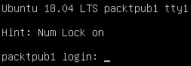
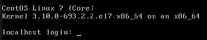
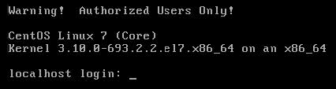
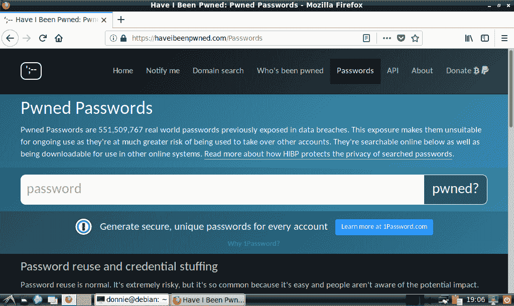
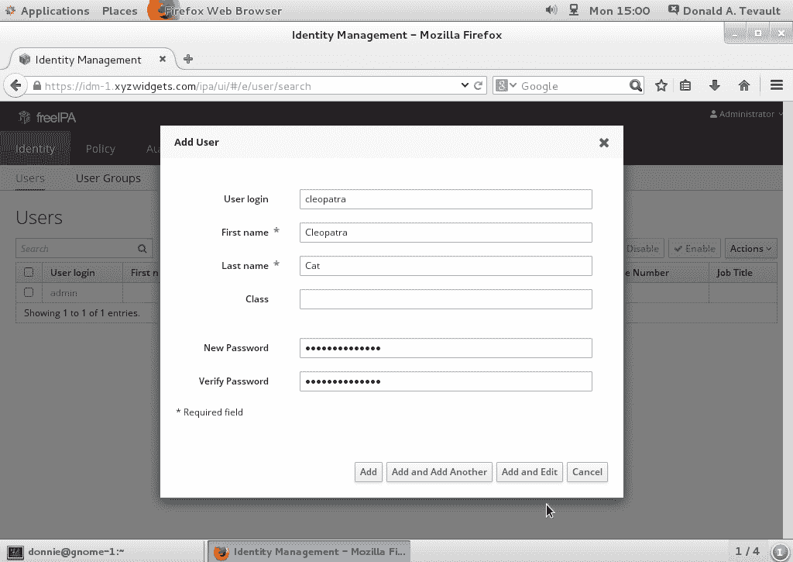

# 3 保护普通用户账户

## 加入我们的 Discord 图书社区

[`packt.link/SecNet`](https://packt.link/SecNet)


管理用户是 IT 管理中最具挑战性的方面之一。你需要确保用户始终可以访问他们的文件，并能够执行完成工作所需的任务。你还需要确保用户的文件始终对未经授权的用户保持安全。在本章中，我们将探讨如何锁定用户账户和用户凭证，以保护它们免受攻击者和窥探者的侵害。最后，我们将简要介绍一些集中式用户管理系统。

+   锁定用户的主目录

+   强制执行强密码标准

+   设置并强制执行密码和账户到期策略

+   防止暴力破解密码攻击

+   锁定用户账户

+   设置安全横幅

+   检测被盗密码

+   了解集中式用户管理系统

## 按 Red Hat 方式锁定用户的主目录

这是另一个不同 Linux 发行版家族在操作上有差异的领域。正如我们所见，每个发行版家族在用户主目录的默认安全设置上有所不同。一个管理多种 Linux 发行版混合环境的安全管理员需要考虑这一点。

传统上，Red Hat 企业版 Linux 及其所有后代，如 CentOS 和 AlmaLinux，提供比其他任何 Linux 发行版家族更好的开箱即用安全性。这使得加固 Red Hat 类型系统变得更快捷、更容易，因为很多工作已经完成。已经为我们做好的事情之一就是锁定用户的主目录：

```
 [donnie@localhost home]$ sudo useradd charlie
 [sudo] password for donnie:
 [donnie@localhost home]$
 [donnie@localhost home]$ ls -l
 total 0
 drwx------. 2 charlie charlie 59 Oct 1 15:25 charlie
 drwx------. 2 donnie donnie 79 Sep 27 00:24 donnie
 drwx------. 2 frank frank 59 Oct 1 15:25 frank
 [donnie@localhost home]$
```

默认情况下，Red Hat 类型系统上的 `useradd` 工具会创建权限设置为 `700` 的用户主目录。这意味着只有拥有主目录的用户可以访问它，所有其他普通用户都被锁定在外。我们可以通过查看 `/etc/login.defs` 文件来理解原因。在你的 CentOS 7 虚拟机上，向文件底部滚动，你会看到这样一行：

```
CREATE_HOME yes
UMASK 077
```

在 RHEL 8 或 RHEL 9 类型的发行版（如 AlmaLinux）的`login.defs`文件中，你会看到`UMASK`设置为宽松权限，这看起来有点奇怪。它长这样：

```
UMASK           022
```

但是，在其下方几行，你会看到一个我们以前从未见过的新指令，长这样：

```
HOME_MODE       0700
```

所以，尽管 `UMASK` 权限设置较为宽松，新创建的用户主目录仍然会得到正确的锁定。

`login.defs` 文件是配置 `useradd` 默认设置的两个文件之一。`UMASK` 行或 `HOME_MODE` 行决定了主目录创建时的权限值。Red Hat 类型的发行版默认配置了 `077` 值，这会删除组和其他用户的所有权限。所有 Linux 发行版的 `login.defs` 文件中都有 `HOME_MODE` 行或 `UMASK` 行，但直到最近，只有 Red Hat 类型的发行版才默认将它们设置为如此严格的值。大多数非 Red Hat 发行版通常将 `UMASK` 值设置为 `022`，这会创建权限值为 `755` 的主目录。这样，所有人都可以进入其他用户的主目录并访问彼此的文件。

## 以 Debian/Ubuntu 的方式锁定用户的主目录

Debian 及其衍生版本，如 Ubuntu，提供了两个用户创建工具：

+   `useradd`

+   `adduser`

让我们看看它们两个的情况。

### Debian/Ubuntu 上的 useradd

`useradd` 工具是可用的，但 Debian 和 Ubuntu 并不像 Red Hat 类型的发行版那样提供方便的预配置默认设置。如果你仅在 Debian/Ubuntu 系统上执行 `sudo useradd frank`，Frank 将没有主目录，并且会被分配错误的默认 shell。所以，要在 Debian 或 Ubuntu 系统上使用 `useradd` 创建用户帐户，命令应该像这样：

```
sudo useradd -m -d /home/frank -s /bin/bash frank
```

下面是这些命令的详细说明：

+   **-m** 创建主目录。

+   **-d** 指定主目录。

+   **-s** 指定 Frank 的默认 shell。（如果没有 `-s`，Debian/Ubuntu 将为 Frank 分配 `/bin/sh` shell。）

当你查看 Debian 或 Ubuntu 20.04 系统上的主目录时，你会发现它们完全开放，所有人都可以执行和读取：

```
 donnie@packt:/home$ ls -l
 total 8
 drwxr-xr-x 3 donnie donnie 4096 Oct 2 00:23 donnie
 drwxr-xr-x 2 frank frank 4096 Oct 1 23:58 frank
 donnie@packt:/home$
```

正如你所看到的，Frank 和我可以访问对方的文件。（不，我不希望 Frank 进入我的文件。）每个用户可以更改自己目录的权限，但你有多少用户知道怎么做呢？所以，让我们自己来修复这个问题：

```
 cd /home
 sudo chmod 700 *
```

让我们看看现在的情况：

```
 donnie@packt:/home$ ls -l
 total 8
 drwx------ 3 donnie donnie 4096 Oct 2 00:23 donnie
 drwx------ 2 frank frank 4096 Oct 1 23:58 frank
 donnie@packt:/home$
```

这样看起来好多了。

要更改主目录的默认权限设置，请打开 `/etc/login.defs` 文件进行编辑。找到以下行：

```
UMASK 022
```

将其更改为如下：

```
UMASK 077
```

现在，新的用户主目录在创建时会被锁定，就像 Red Hat 及其衍生版一样。

在 Ubuntu 22.04 上，情况有所不同。Ubuntu 开发者终于意识到，用户的主目录应该默认被锁定。因此，Ubuntu 22.04 中的 `login.defs` 文件中的 `HOME_MODE` 设置现在是这样的：

```
HOME_MODE       0750
```

这包括用户自己个人组的访问权限，但这没关系。它仍然有效地意味着，只有各自的主目录所有者才能访问。

### Debian/Ubuntu 上的 adduser

`adduser`工具是一种交互式创建用户账户和密码的方式，这是 Debian 系列 Linux 发行版特有的。Debian 实现的`useradd`缺失的大多数默认设置都已在`adduser`中设置好。在 Debian 和 Ubuntu 20.04 中，它创建用户主目录时会赋予`755`的宽松权限值。幸运的是，这是可以轻松更改的。（我们稍后将展示如何更改。）在 Ubuntu 22.04 中，它创建了正确锁定的主目录，权限值为限制性`750`。你会在`/etc/adduser.conf`文件中看到这一设置，大约在第 56 行附近：

```
DIR_MODE=750
```

正如我之前提到的，在 Ubuntu 20.04 中，这将设置为`755`权限值。只需将其更改为`750`即可锁定新创建的主目录。

尽管`adduser`非常适合用于简单地创建用户账户，但它没有`useradd`那样的灵活性，也不适合在 Shell 脚本中使用。`adduser`能做的一件事是，`useradd`做不到的，那就是在创建账户时自动加密用户的主目录。要使其正常工作，首先需要安装`ecryptfs-utils`包。因此，要为 Cleopatra 创建一个带有加密主目录的账户，您需要执行以下操作：

```
donnie@ubuntu-steemnode:~$ sudo apt install ecryptfs-utils
donnie@ubuntu-steemnode:~$ sudo adduser --encrypt-home cleopatra
 [sudo] password for donnie:
 Adding user `cleopatra' ...
 Adding new group `cleopatra' (1004) ...
 Adding new user `cleopatra' (1004) with group `cleopatra' ...
 Creating home directory `/home/cleopatra' ...
 Setting up encryption ...
 ************************************************************************
 YOU SHOULD RECORD YOUR MOUNT PASSPHRASE AND STORE IT IN A SAFE LOCATION.
  ecryptfs-unwrap-passphrase ~/.ecryptfs/wrapped-passphrase
 THIS WILL BE REQUIRED IF YOU NEED TO RECOVER YOUR DATA AT A LATER TIME.
 ********************************************************************
Done configuring.
 Copying files from `/etc/skel' ...
 Enter new UNIX password:
 Retype new UNIX password:
 passwd: password updated successfully
 Changing the user information for cleopatra
 Enter the new value, or press ENTER for the default
  Full Name []: Cleopatra Tabby Cat
  Room Number []: 1
  Work Phone []: 555-5556
  Home Phone []: 555-5555
  Other []:
 Is the information correct? [Y/n] Y
 donnie@ubuntu-steemnode:~$
The first time that Cleopatra logs in, she'll need to run the ecryptfs-unwrap-passphrase command that's mentioned in the preceding output. She'll then want to write her passphrase down and store it in a safe place:
 cleopatra@ubuntu-steemnode:~$ ecryptfs-unwrap-passphrase
 Passphrase:
 d2a6cf0c3e7e46fd856286c74ab7a412
 cleopatra@ubuntu-steemnode:~$
```

当我们进入加密章节时，将更详细地讨论整个加密过程。

#### 使用`adduser`创建加密的主目录实验室

在本实验中，我们将在 Ubuntu 22.04 虚拟机上使用`adduser`工具。

1.  安装`ecryptfs-utils`包：

```
sudo apt install ecryptfs-utils
```

1.  为 Cleopatra 创建一个带有加密主目录的用户账户，然后查看结果：

```
sudo adduser --encrypt-home cleopatra
ls -l /home
```

1.  以 Cleopatra 身份登录并运行`ecryptfs-unwrap-passphrase`命令：

```
su - cleopatra
ecryptfs-unwrap-passphrase
exit
```

请注意，`adduser`要求的某些信息是可选的，你可以直接按*Enter*键跳过这些项目。

## 强制实施强密码标准

你可能不会想到，看似无害的主题，如强密码标准，竟然会如此有争议，但事实的确如此。你在整个计算机生涯中无疑听过的传统观点是：

+   密码需要达到一定的最小长度。

+   创建由大写字母、小写字母、数字和特殊字符组合构成的密码。

+   确保密码不包含词典中的任何单词，或不基于用户的个人数据。

+   强制用户定期更改密码。

但通过使用你最喜欢的搜索引擎，你会发现不同的专家在这些标准的细节上存在分歧。例如，你会看到关于密码是否应该每 30、60 或 90 天更改的分歧，关于密码中是否必须包含所有四种类型的字符的分歧，甚至对于密码的最小长度应该是多少也存在不同的看法。

最有趣的争议来自——居然是——最初制定前述标准的那位人物。现在他说这一切都是废话，他后悔自己曾经提出这些标准。他现在表示，我们应该使用既长又容易记住的密码短语，而且只有在密码被泄露的情况下，才需要更改密码。

> Bill Burr，这位曾在国家标准与技术研究院（NIST）工作的工程师，制定了我之前提到的强密码标准，现在分享了他为什么否定自己工作的原因。你可以参考[`www.pcmag.com/news/355496/you-might-not-need-complex-alphanumeric-passwords-after-all.`](https://www.pcmag.com/news/355496/you-might-not-need-complex-alphanumeric-passwords-after-all.)
> 
> > 而且，自从这本书的初版出版以来，NIST 已经同意了 Bill Burr 的观点。他们现在已经更改了密码实施标准，以符合 Burr 先生的建议。你可以在这里阅读相关内容：
> > 
> > [`www.riskcontrolstrategies.com/2018/01/08/new-nist-guidelines-wrong/`](https://www.riskcontrolstrategies.com/2018/01/08/new-nist-guidelines-wrong/)。

然而，话虽如此，现实情况是，许多组织仍然坚持使用复杂的密码，并且要求密码定期过期，如果你无法说服他们改变这一做法，你将不得不遵守他们的规则。而且，既然你使用的是传统密码，你当然希望它们足够强大，能够抵御任何形式的密码攻击。那么现在，让我们来看看如何在 Linux 系统上强制执行强密码标准。

> 提示：
> 
> > 我必须承认，我之前从未想到过在 Linux 系统中使用密码短语代替密码。因此，我刚刚在我的 CentOS 虚拟机上尝试了一下，看看它是否有效。
> > 
> > 我为 Maggie， 我的黑白色燕尾服小猫，创建了一个账户。她的密码短语是 `I like other kitty cats`。你可能会想，“哦，这太糟糕了。这个不符合任何复杂性标准，而且使用了字典中的词汇。这怎么可能安全呢？”但是，正因为它是一个包含不同单词并由空格分开的短语，它的安全性确实很高，并且非常难以通过暴力破解来攻破。
> > 
> > 现在，在现实生活中，我绝不会创建一个表达我对猫咪的喜爱的密码短语，因为很容易发现我确实非常喜欢猫咪。相反，我会选择一个关于我生活中更为隐秘的部分的密码短语，只有我自己知道。无论如何，密码短语相比传统密码有两个优势。它们比传统密码更难破解，同时又更容易让用户记住。不过，为了额外的安全性，最好不要选择任何所有人都知道的生活事实来作为密码短语。

### 安装和配置 pwquality

我们将使用 `pwquality` 模块来实现 **可插拔认证模块**（**PAM**）。这是一个较新的技术，已替代了旧的 `cracklib` 模块。在任何 Red Hat 7 或更高版本的系统上，甚至在做最小化安装时，`pwquality` 都会默认安装。在 `/etc/pam.d/` 目录下，你可以通过 `grep` 命令来查看 PAM 配置文件是否已设置好。`retry=3` 表示用户在登录系统时只能尝试三次输入正确密码：

```
[donnie@localhost pam.d]$ grep 'pwquality' *
 password-auth:password requisite pam_pwquality.so try_first_pass
 local_users_only retry=3 authtok_type=
 password-auth-ac:password requisite pam_pwquality.so try_first_pass
 local_users_only retry=3 authtok_type=
 system-auth:password requisite pam_pwquality.so try_first_pass
 local_users_only retry=3 authtok_type=
 system-auth-ac:password requisite pam_pwquality.so try_first_pass
 local_users_only retry=3 authtok_type=
 [donnie@localhost pam.d]$
```

在 Debian 和 Ubuntu 上，你需要自行安装 `pwquality`，可以像这样操作：

```
sudo apt install libpam-pwquality
```

其余过程对所有操作系统都是相同的，只需编辑 `/etc/security/pwquality.conf` 文件。当你在文本编辑器中打开该文件时，你会看到所有内容都被注释掉了，这意味着没有密码复杂性要求生效。你还会看到它有很好的文档说明，因为每个设置都有自己的注释。

你可以通过取消注释相应的行并设置适当的值来按需设置密码复杂性标准。让我们看一个设置：

```
# Minimum acceptable size for the new password (plus one if 
# credits are not disabled which is the default). (See pam_cracklib manual.) 
# Cannot be set to lower value than 6\. 
# minlen = 8 
```

最小长度设置是基于信用系统的。这意味着对于密码中的每种不同类型的字符类，最小要求的密码长度将减少一个字符。例如，假设我们将 `minlen` 设置为 `19`，并尝试为 Katelyn 设置密码 `turkeylips`：

```
minlen = 19
[donnie@localhost ~]$ sudo passwd katelyn
 Changing password for user katelyn.
 New password:
 BAD PASSWORD: The password is shorter than 18 characters
 Retype new password:
 [donnie@localhost ~]$
```

因为 `turkeylips` 中的小写字符算作一种字符类的信用，所以我们只需要 18 个字符，而不是 19 个。如果我们使用 `TurkeyLips` 再试一次，结果会是：

```
[donnie@localhost ~]$ sudo passwd katelyn
 Changing password for user katelyn.
 New password:
 BAD PASSWORD: The password is shorter than 17 characters
 Retype new password:
 [donnie@localhost ~]$
```

这次，大写字母 `T` 和 `L` 计为第二种字符类，因此密码只需要包含 17 个字符。

在 `minlen` 行下面，你会看到信用行。假设你不希望小写字母计入信用，你会看到这一行：

```
# lcredit = 1 
```

取消注释，并将 `1` 改为 `0`：

```
lcredit = 0
```

然后，尝试为 Katelyn 分配 `turkeylips` 作为密码：

```
[donnie@localhost ~]$ sudo passwd katelyn
 Changing password for user katelyn.
 New password:
 BAD PASSWORD: The password is shorter than 19 characters
 Retype new password:
 [donnie@localhost ~]$
```

这次，`pwquality` 确实要求 19 个字符。如果我们将信用值设置为大于 `1`，我们将为相同字符类的多个字符获得信用，直到达到该值。

我们还可以将信用值设置为负数，以便要求密码中包含一定数量的字符类型。例如，我们可以这样设置：

```
dcredit = -3
```

这将需要密码至少包含三位数字。然而，使用此功能是一个非常糟糕的主意，因为进行密码攻击的人很快就能发现你所要求的模式，这将帮助攻击者更精确地进行攻击。如果你需要要求密码包含多种字符类型，最好使用`minclass`参数：

```
# minclass = 3
```

它已经设置为 `3` 的值，这要求字符来自三个不同的类别。要使用这个值，你只需去掉注释符号即可。

`pwquality.conf` 中的其他参数几乎以相同的方式工作，每个参数都有详细的注释来解释它的作用。

> 提示：
> 
> > 如果你使用 `sudo` 权限为其他人设置密码，如果创建的密码不符合复杂度要求，系统会提示警告，但你仍然可以设置。如果普通用户尝试在没有 `sudo` 权限的情况下更改自己的密码，系统将不允许设置不符合复杂度要求的密码。

#### 设置密码复杂度标准的实践实验

对于此实验，你可以根据需要使用 CentOS、AlmaLinux 或 Ubuntu 虚拟机。唯一的区别是，对于 CentOS 或 AlmaLinux，你不会执行步骤 1。

1.  仅适用于 Ubuntu，安装 `libpam-pwquality` 包：

```
sudo apt install libpam-pwquality
```

1.  打开 `/etc/security/pwquality.conf` 文件，使用你喜欢的文本编辑器。去掉 `minlen` 行前面的注释符号，并将其值更改为 `19`。它现在应该是这样的：

```
 minlen = 19
```

保存文件并退出编辑器。

1.  为 Goldie 创建一个用户账户，并尝试为她设置密码 `turkeylips`、`TurkeyLips` 和 `Turkey93Lips`。注意每个警告消息中的变化。

1.  在 `pwquality.conf` 文件中，注释掉 `minlen` 行。取消注释 `minclass` 行和 `maxclassrepeat` 行。将 `maxclassrepeat` 的值更改为 `5`。这些行现在应该是这样的：

```
minclass = 3 
maxclassrepeat = 5 
```

保存文件并退出文本编辑器。

1.  尝试为 Goldie 的账户分配一些不符合你设置的复杂度标准的密码，并查看结果。

> 在 CentOS 7 机器上的 `/etc/login.defs` 文件中，你会看到这一行 `PASS_MIN_LEN 5`。
> 
> > 这应该是用来设置密码的最小长度，但实际上，`pwquality` 会覆盖它。因此，你可以将此值设置为任何内容，它将不会产生任何效果。（注意，`PASS_MIN_LEN` 参数在 RHEL 8/9 类型的发行版中不再支持。）

## 设置并强制执行密码和账户过期

你绝对不希望的是未使用的用户账户保持活跃。曾经有过这样的事件，管理员为临时使用设置了用户账户，比如为一个会议设置账户，结果在账户不再需要后忘记了它们。

另一个例子是，如果你的公司雇佣了合同工，且合同在某个特定日期到期。允许这些账户在临时员工离开公司后仍然保持活跃和可访问，将会是一个巨大的安全问题。在这种情况下，你需要一种方法来确保在不再需要这些临时账户时，不会忘记它们。如果你的公司遵循常规的安全做法，要求用户定期更改密码，那么你还需要确保它能够得到执行。

密码过期数据和账户过期数据是两种不同的东西。它们可以分别或一起设置。当某人的密码过期时，他或她可以更改密码，一切都能恢复正常。如果某人的账户过期，只有具有适当管理员权限的人才能解锁账户。

要开始，先查看一下自己账户的过期数据。请注意，你无需 `sudo` 权限就能查看自己的数据，但仍然需要指定自己的用户名：

```
donnie@packt:~$ chage -l donnie
 [sudo] password for donnie:
 Last password change : Oct 03, 2017
 Password expires : never
 Password inactive : never
 Account expires : never
 Minimum number of days between password change : 0
 Maximum number of days between password change : 99999
 Number of days of warning before password expires : 7
 donnie@packt:~$
```

你可以看到这里没有设置任何过期数据。一切都根据系统的默认设置进行配置。除了显而易见的内容外，这里是你看到的详细内容：

+   **密码非活动期**：如果设置为正数，我将在密码过期后有这么多天的时间来更改密码，否则系统将锁定我的账户。

+   **密码更改的最小天数**：因为它被设置为 `0`，所以我可以随时更改我的密码。如果设置为正数，那么在更改密码后，我必须等待设定的天数才能再次更改密码。

+   **密码更改的最大天数**：默认为 `99999`，意味着我的密码永远不会过期。

+   **密码过期前的警告天数**：默认值为 `7`，但当密码设置为永不过期时，这个值就没有太大意义。

> 使用 `chage` 工具，你可以为其他用户设置密码和账户的过期数据，或者使用 `-l` 选项查看过期数据。任何非特权用户都可以使用 `chage -l` 在不使用 `sudo` 的情况下查看自己的数据。要设置数据或查看其他人的数据，你需要 `sudo` 权限。稍后我们将更详细地了解 `chage`。

在我们讨论如何更改过期数据之前，首先来看一下默认设置存储的位置。我们将首先查看 `/etc/login.defs` 文件。以下是三行相关的内容：

```
PASS_MAX_DAYS 99999 
PASS_MIN_DAYS 0 
PASS_WARN_AGE 7
```

你可以根据组织的需要编辑这些值。例如，将 `PASS_MAX_DAYS` 更改为 `30`，那么从那时起所有新用户的密码将具有 30 天的过期日期。（顺便说一下，在 `login.defs` 中设置默认的密码过期数据适用于我们使用的所有 Linux 发行版。）

## 仅适用于 Red Hat 类型系统的 useradd 默认过期数据配置

`/etc/default/useradd` 文件包含了其余的默认设置。在这种情况下，我们将查看来自 AlmaLinux 9 机器的文件：

> Ubuntu 也有 `useradd` 配置文件，但它不起作用。无论如何配置，Ubuntu 版本的 `useradd` 就无法读取它。所以，关于该文件的说明仅适用于 Red Hat 类型的系统。

```
# useradd defaults file
GROUP=100
HOME=/home 
INACTIVE=-1 
EXPIRE= 
SHELL=/bin/bash 
SKEL=/etc/skel 
CREATE_MAIL_SPOOL=yes
```

`EXPIRE=` 行设置新用户账户的默认过期日期。默认情况下，没有默认过期日期。`INACTIVE=-1` 表示用户密码过期后，用户账户不会自动被锁定。如果我们将其设置为正数，则任何新用户必须在账户被锁定之前的规定天数内更改过期的密码。要更改 `useradd` 文件中的默认值，可以手动编辑文件，或者使用 `useradd -D` 并搭配相应的选项切换来更改你想修改的项目。例如，要设置默认过期日期为 2025 年 12 月 31 日，可以使用如下命令：

```
sudo useradd -D -e 2025-12-31
```

要查看新配置，可以打开 `useradd` 文件，或者直接运行 `sudo useradd -D`：

```
[donnie@localhost ~]$ sudo useradd -D
 GROUP=100
 HOME=/home
 INACTIVE=-1
 EXPIRE=2023-12-31
 SHELL=/bin/bash
 SKEL=/etc/skel
 CREATE_MAIL_SPOOL=yes
 [donnie@localhost ~]$
```

你现在已设置所有新创建的用户账户将具有相同的过期日期。你可以使用相同的方法设置 `INACTIVE` 或 `SHELL` 配置：

```
sudo useradd -D -f 5
sudo useradd -D -s /bin/zsh
 [donnie@localhost ~]$ sudo useradd -D
 GROUP=100
 HOME=/home
 INACTIVE=5
 EXPIRE=2019-12-31
 SHELL=/bin/zsh
 SKEL=/etc/skel
 CREATE_MAIL_SPOOL=yes
 [donnie@localhost ~]$
```

现在，任何新创建的用户账户将默认使用 Zsh 作为默认 shell，并且必须在五天内更改过期密码，否则账户将被自动锁定。

> `useradd` 不进行任何安全检查，确保你指定的默认 shell 已安装在系统上。在我们的例子中，Zsh 没有安装，但 `useradd` 仍然允许你将 Zsh 设置为默认 shell 创建账户。

那么，`useradd` 配置功能在实际生活中有多有用呢？可能不太有用，除非你需要一次性创建大量相同设置的用户账户。即便如此，聪明的管理员会选择通过 shell 脚本自动化这一过程，而不是手动调整配置文件。

## 使用 `useradd` 和 `usermod` 设置每个账户的过期数据。

你可能会发现设置 `login.defs` 中的默认密码过期日期非常有用，但配置 `useradd` 配置文件可能用处不大。实际上，创建所有用户账户都使用相同的过期日期的可能性并不大吧？在 `login.defs` 中设置密码过期日期更有用，因为你只是简单地指定新密码会在一定天数内过期，而不是所有密码都在一个特定日期过期。

很可能，你会想在每个账户的基础上设置账户过期数据，具体取决于你是否知道某个账户将在特定日期后不再需要。有三种方法可以做到这一点：

+   使用 `useradd` 并搭配适当的选项切换在创建账户时设置过期数据。（如果你需要一次性创建多个账户，并且希望它们有相同的过期数据，可以使用 shell 脚本自动化该过程。）

+   使用 `usermod` 修改现有账户的过期数据。（`usermod` 的优点是它使用与 `useradd` 相同的选项开关。）

+   使用 `chage` 修改现有账户的过期数据。（这使用了一整套不同的选项开关。）

您可以使用`useradd`和`usermod`来设置账户过期数据，但不能用来设置密码过期数据。影响账户过期数据的仅有两个选项开关如下：

+   `-e`：使用此选项为账户设置一个过期日期，格式为 YYYY-MM-DD。

+   `-f`：使用此选项设置密码过期后，账户锁定之前的天数。

假设您想为 Charlie 创建一个将在 2025 年底过期的账户。在 Red Hat 类型的机器上，您可以输入以下命令：

```
sudo useradd -e 2025-12-31 charlie
```

在非 Red Hat 类型的机器上，您需要添加创建主目录并分配正确默认 shell 的选项开关：

```
sudo useradd -m -d /home/charlie -s /bin/bash -e 2025-12-31 charlie
```

使用`chage -l`验证您所输入的信息：

```
donnie@ubuntu-steemnode:~$ sudo chage -l charlie
 Last password change : Oct 06, 2017
 Password expires : never
 Password inactive : never
 Account expires : Dec 31, 2025
 Minimum number of days between password change : 0
 Maximum number of days between password change : 99999
 Number of days of warning before password expires : 7
 donnie@ubuntu-steemnode:~$
```

现在，假设 Charlie 的合同已被延长，您需要将他的账户过期日期更改为 2026 年 1 月末。您可以像在任何 Linux 发行版上一样使用`usermod`：

```
sudo usermod -e 2026-01-31 charlie
```

再次通过`chage -l`验证所有信息是否正确：

```
donnie@ubuntu-steemnode:~$ sudo chage -l charlie
 Last password change : Oct 06, 2017
 Password expires : never
 Password inactive : never
 Account expires : Jan 31, 2026
 Minimum number of days between password change : 0
 Maximum number of days between password change : 99999
 Number of days of warning before password expires : 7
 donnie@ubuntu-steemnode:~$
```

可选地，您可以设置密码过期后账户被锁定前的天数：

```
sudo usermod -f 5 charlie
```

但如果您现在执行此操作，您在`chage -l`输出中不会看到任何变化，因为我们还没有为 Charlie 的密码设置过期数据。

## 使用 chage 按账户单独设置过期日期

您只能使用`chage`修改现有账户，并且可以用它来设置账户过期或密码过期。以下是相关的选项开关：

| **选项** | **说明** |
| --- | --- |
| `-d` | 如果在某个账户上使用`-d 0`选项，将强制用户在下次登录时更改密码。 |
| `-E` | 这相当于`useradd`或`usermod`中的小写`-e`选项。它设置用户账户的过期日期。 |
| `-I` | 这相当于`useradd`或`usermod`的`-f`选项。它设置了密码过期后，账户将被锁定之前的天数。 |
| `-m` | 设置密码更改之间的最小天数。换句话说，如果 Charlie 今天更改了密码，`-m 5`选项将强制他等待五天才能再次更改密码。 |
| `-M` | 该选项设置密码过期之前的最大天数。（但请注意，如果 Charlie 上次更改密码已经是 89 天前，使用`-M 90`选项将导致他的密码在明天过期，而不是 90 天后。） |
| `-W` | 该选项设置密码即将过期时的警告天数。 |

您可以一次只设置其中一个数据项，也可以一次性设置所有数据项。事实上，为了避免每个单独项目演示给您带来的困扰，我们将一次性设置所有数据项，除了`-d 0`，然后查看结果：

```
donnie@ubuntu-steemnode:~$ sudo chage -E 2026-02-28 -I 4 -m 3 -M 90 -W 4 charlie
donnie@ubuntu-steemnode:~$ sudo chage -l charlie
 Last password change : Oct 06, 2019
 Password expires : Jan 04, 2026
 Password inactive : Jan 08, 2026
 Account expires : Feb 28, 2026
 Minimum number of days between password change : 3
 Maximum number of days between password change : 90
 Number of days of warning before password expires : 4
donnie@ubuntu-steemnode:~$
```

所有过期数据现在已设置完成。

在我们的最后一个示例中，假设你刚为 Samson 创建了一个新账户，并且你希望在他第一次登录时强制他更改密码。有两种方法可以实现这一点。不管哪种方法，你都应该在最初设置他的密码后，通过以下两个命令之一来操作：

```
sudo chage -d 0 samson
 or
sudo passwd -e samson

 donnie@ubuntu-steemnode:~$ sudo chage -l samson
 Last password change : password must be changed
 Password expires : password must be changed
 Password inactive : password must be changed
 Account expires : never
 Minimum number of days between password change : 0
 Maximum number of days between password change : 99999
 Number of days of warning before password expires : 7
 donnie@ubuntu-steemnode:~$
```

接下来，我们将进行一个动手实验。

### 设置账户和密码过期数据的动手实验

在这个实验中，你将创建几个新的用户账户，设置有效期，并查看结果。你可以在任何虚拟机上进行这个实验。唯一的不同将是在`useradd`命令上：

1.  在你的 CentOS 或 AlmaLinux 虚拟机上，为 Samson 创建一个账户，并设置有效期为 2025 年 6 月 30 日，然后查看结果：

```
sudo useradd -e 2025-06-30 samson
sudo chage -l samson
```

对于 Ubuntu，运行以下命令：

```
sudo useradd -m -d /home/samson -s /bin/bash -e 2025-06-30 samson
sudo chage -l samson
```

1.  使用`usermod`命令将 Samson 账户的有效期修改为 2025 年 7 月 31 日：

```
sudo usermod -e 2025-07-31 samson
sudo chage -l samson
```

1.  为 Samson 的账户设置一个密码，然后强制他在第一次登录时更改密码。以 Samson 身份登录，修改密码，然后再登录到你自己的账户：

```
sudo passwd samson
sudo passwd -e samson
sudo chage -l samson
su - samson
exit
```

1.  使用`chage`命令设置一个五天的密码更改等待期、90 天的密码过期期、两天的不活动期和五天的警告期：

```
sudo chage -m 5 -M 90 -I 2 -W 5 samson
sudo chage -l samson
```

1.  保留这个账户，因为你将在下一节的实验中使用它。

接下来，让我们看看如何防止暴力破解攻击。

## 防止暴力破解密码攻击

非常令人惊讶的是，这也是一个引发争议的话题。我的意思是，没人会否认自动锁定受到攻击的用户账户是明智的。争议部分在于我们应该允许多少次失败的登录尝试后再锁定账户。

在计算机的石器时代，那时候我还拥有一头浓密的头发，早期的 Unix 操作系统只允许用户创建一个最多只能包含八个小写字母的密码。所以在那个时代，早期的人类只需要坐在键盘前随便输入随机的密码，就能暴力破解别人密码。那时，用户账户在三次登录失败后被锁定的理念就开始了。现在，使用强密码，或者更好的是强密码短语，将锁定值设置为三次登录失败将做到三件事：

+   这会不必要地让用户感到沮丧。

+   这会给帮助台人员带来额外的工作。

+   如果账户真的遭到攻击，它会在你有机会收集攻击者信息之前就锁定账户。

将锁定值设置为更现实的数字，比如 100 次失败的登录尝试，依然能提供良好的安全性，同时给你足够的时间收集有关攻击者的信息。同样重要的是，这样做不会给用户和帮助台人员带来不必要的沮丧。

无论你允许多少次失败登录尝试，你仍然需要知道如何进行配置。在 RHEL 7 类型的系统和 Ubuntu 18.04 上，你将通过配置 `pam_tally2` **可插拔认证模块** (**PAM**) 来完成此操作。在 RHEL 8/9 类型的系统和 Ubuntu 20.04/22.04 上，你将改为配置 `pam_faillock` PAM 模块。让我们深入了解一下如何完成配置。

### 配置 CentOS 7 上的 pam_tally2 PAM 模块

为了让这项操作成功，我们将依赖我们的好朋友 PAM。`pam_tally2` 模块已经预装在 CentOS 7 上，但尚未配置。我们将从编辑 `/etc/pam.d/login` 文件开始。配置它非常简单，因为在 `pam_tally2` 的手册页底部有一个示例：

```
EXAMPLES
 Add the following line to /etc/pam.d/login to lock the account after
4 failed logins. Root account will be locked as well. The accounts will be
automatically unlocked after 20 minutes. The module does not have to be
called in the account phase because the login calls pam_setcred(3)
correctly.
 auth required pam_securetty.so
 auth required pam_tally2.so deny=4 even_deny_root
unlock_time=1200
 auth required pam_env.so
 auth required pam_unix.so
 auth required pam_nologin.so
 account required pam_unix.so
 password required pam_unix.so
 session required pam_limits.so
 session required pam_unix.so
 session required pam_lastlog.so nowtmp
 session optional pam_mail.so standard
```

> 提示：
> 
> > 如果你在使用文本模式的服务器，你只需要配置 `/etc/pam.d/login` 文件。但如果你使用的是运行图形桌面环境的机器，还需要配置 `/etc/pam.d/password.auth` 和 `/etc/pam.d/system.auth` 文件。你将在实操实验中看到如何进行配置。

在示例的第二行，我们看到 `pam_tally2` 设置了以下参数：

+   **deny=4**：这意味着在仅进行四次失败登录尝试后，受攻击的用户账户将被锁定。

+   **even_deny_root**：这意味着即使是 root 用户账户也会在遭遇攻击时被锁定。

+   **unlock_time=1200**：账户将在 1200 秒，即 20 分钟后自动解锁。

现在，如果你查看虚拟机上的实际 `login` 文件，你会发现它看起来与手册页中的示例 `login` 文件略有不同。没关系，我们依然可以让它正常工作。

一旦你配置了 `login` 文件并尝试登录失败，你将在 `/var/log` 目录下看到一个新文件的生成。你可以使用 `pam_tally2` 工具查看该文件中的信息。如果你不想等待超时期，也可以使用 `pam_tally2` 手动解锁被锁定的账户：

```
donnie@centos7:~$ sudo pam_tally2
 Login Failures Latest failure From
 charlie 5 10/07/17 16:38:19
 donnie@centos7:~$ sudo pam_tally2 --user=charlie --reset
 Login Failures Latest failure From
 charlie 5 10/07/17 16:38:19
 donnie@centos7:~$ sudo pam_tally2
 donnie@centos7:~$
```

注意，在我重置了 Charlie 的账户后，我没有收到再次查询的任何输出。

#### 在 CentOS 7 上配置 pam_tally2 的实操实验

配置 `pam_tally2` 非常简单，因为它只需要在 `/etc/pam.d/login`、`/etc/pam.d/password.auth` 和 `/etc/pam.d/system.auth` 文件中添加一行。为了让这一步更简单，你可以直接从 `pam_tally2` 的手册页中的示例中复制并粘贴该行。尽管我之前提到过将失败登录次数设为 100，但我们目前将该数字保持为 4，因为我知道你不想做 100 次失败登录来演示这一过程：

1.  在 CentOS 7 虚拟机上，打开 `/etc/pam.d/login` 文件进行编辑。查找调用 `pam_securetty` 模块的那一行。（大约在第二行。）在该行下面插入这一行：

```
auth required pam_tally2.so deny=4 even_deny_root unlock_time=1200
```

保存文件并退出编辑器。

在`/etc/pam.d/password.auth`和`/etc/pam.d/system.auth`文件的顶部，放置相同的行，位于第一个`auth required`行的上方。（这些文件顶部的注释说不要手动编辑它们，因为运行`authconfig`会覆盖这些编辑。不幸的是，你必须手动编辑它们，因为`authconfig`无法为你配置此内容。）

1.  在这一步，你需要注销当前账户，因为`pam_tally2`无法与`su`一起使用。所以注销后，在故意输入错误密码的情况下，尝试登录之前在实验中创建的`samson`账户。一直这样做，直到看到账户被锁定的消息。请注意，当`deny`值设置为`4`时，实际上需要五次失败的登录尝试才能锁定 Samson 账户。

1.  重新登录到你的用户账户。运行此命令并注意输出：

```
sudo pam_tally2
```

1.  对于这一步，你将模拟自己是一个帮助台工作人员，而 Samson 刚刚打电话要求解锁他的账户。在确认你确实是在与真正的 Samson 通话后，输入以下两条命令：

```
sudo pam_tally2 --user=samson --reset
sudo pam_tally2
```

1.  现在你已经了解了它是如何工作的，打开`/etc/pam.d/login`文件进行编辑。将`deny=`参数从`4`改为`100`并保存文件。（这将使你的配置更符合现代安全理念。）

接下来，让我们看看如何在 AlmaLinux 机器上配置`pam_faillock`。

### 配置 AlmaLinux 8/9 上的`pam_faillock`

`pam_faillock`模块已经在任何 RHEL 8 或 RHEL 9 类型的 Linux 发行版中安装。由于`pam_faillock`的基本概念与`pam_tally2`几乎相同，因此我们将跳过初步的解释，直接进入动手操作步骤。

#### 配置`pam_faillock`的动手实验，适用于 AlmaLinux 8 或 AlmaLinux 9

虽然你可以通过手动编辑 PAM 配置文件来启用并配置`pam_faillock`，但 RHEL 发行版提供了一种更简单的方法，叫做**authselect**。（请注意，这个过程在文本模式或图形用户界面机器上完全相同。）

1.  在 AlmaLinux 8 或 AlmaLinux 9 的虚拟机上，通过以下命令查看可用的 authselect 配置文件：

```
[donnie@localhost ~]$ sudo authselect list
- minimal    Local users only for minimal installations
- sssd       Enable SSSD for system authentication (also for local users only)
- winbind    Enable winbind for system authentication
[donnie@localhost ~]$
```

1.  至少目前，我们只处理本地用户。所以，我们将使用**最小化**配置文件。查看此配置文件的功能，像这样：

```
[donnie@localhost ~]$ sudo authselect list-features minimal
. . .
. . .
with-faillock
. . .
. . .
[donnie@localhost ~]$
```

请注意，这里有很多包含的功能，但我们只对`with-faillock`功能感兴趣。

1.  启用最小化配置文件，像这样：

```
sudo authselect select minimal --force
```

1.  启用配置文件后，我们现在可以启用`pam_faillock`模块，像这样：

```
sudo authselect enable-feature with-faillock
```

1.  在`/etc/security/`目录下，使用你喜欢的文本编辑器打开`faillock.conf`文件。寻找这四行：

```
# silent
# deny = 3
# unlock_time = 600
# even_deny_root
```

删除前面的注释符号并保存文件。

1.  通过以下操作为 Vicky 创建一个用户账户：

```
sudo useradd vicky
sudo passwd vicky
```

1.  打开另一个终端，让 Vicky 故意进行三次失败的登录尝试。在你自己的终端中查看结果，像这样：

```
[donnie@localhost ~]$ sudo faillock
donnie:
When                Type  Source                                           Valid
vicky:
When                Type  Source                                           Valid
2022-10-12 15:54:35 RHOST 192.168.0.16                                         V
2022-10-12 15:54:42 RHOST 192.168.0.16                                         V
2022-10-12 15:54:46 RHOST 192.168.0.16                                         V
[donnie@localhost ~]$
```

然后，在定时器到期之前，让 Vicky 再次尝试使用她自己的正确密码登录。

1.  十分钟定时器到期后，让 Vicky 尝试使用正确的密码登录。

1.  让用户注销。然后，再让用户故意进行三次失败的登录尝试。这次，在定时器到期之前，像这样重置用户账户：

```
sudo faillock --reset --user vicky
```

这就是本实验的全部内容。

在 Ubuntu 上做这件事稍有不同，现在让我们看看如何操作。

### 在 Ubuntu 20.04 和 Ubuntu 22.04 上配置 pam_faillock

不幸的是，`authselect` 工具在 Ubuntu 上不可用，因此我们只能手动编辑 PAM 配置文件。以下是操作步骤。

#### 在 Ubuntu 20.04 和 Ubuntu 22.04 上配置 pam_faillock 的实践实验

1.  使用你喜欢的文本编辑器打开 `/etc/pam.d/common-auth` 文件。在文件顶部插入以下两行：

```
auth        required                                     pam_faillock.so preauth silent
       auth        required                                     pam_faillock.so authfail
```

1.  使用文本编辑器打开 `/etc/pam.d/common-account` 文件。在文件底部添加这一行：

```
account     required                                     pam_faillock.so
```

1.  按照我在前一个实验中为 AlmaLinux 第 5 步所展示的方式配置 `/etc/security/faillock.conf` 文件。

1.  按照前一个 AlmaLinux 实验中的第 6 到第 8 步进行测试。

1.  就是这样。接下来，我们来看看如何手动锁定用户账户。

### 锁定用户账户

好的，你刚刚看到如何让 Linux 自动锁定受到攻击的用户账户。也有时候，你会希望手动锁定用户账户。让我们来看几个例子：

+   当用户去度假时，你可能希望确保在他或她不在期间没有人乱改该用户的账户。

+   当用户因可疑活动而接受调查时

+   当用户离开公司时

关于最后一点，你可能会问，*为什么我们不能直接删除那些不再在这里工作的人账户呢？* 当然可以，而且也很简单。然而，在这么做之前，你需要了解当地的法律，确保不会给自己带来麻烦。比如在美国，我们有 **萨班斯-奥克斯利法案**，它限制了上市公司可以从计算机中删除哪些文件。如果你删除一个用户账户，包括该用户的主目录和邮件目录，你可能会违反萨班斯-奥克斯利法案，或者你所在国家/地区的类似法律。

无论如何，你可以使用两个工具暂时锁定用户账户：

+   **usermod**

+   **passwd**

> 可能与我刚才所说的相矛盾，实际上你有时需要移除不活跃的用户账户。因为恶意行为者可能会利用这些不活跃的账户进行破坏，特别是如果该账户曾有任何管理员权限。然而，在移除账户时，一定要遵循当地法律和公司政策。事实上，最好的做法是确保你的组织在变更管理程序中有明确的书面指导方针来处理不活跃用户账户的移除。

### 使用 usermod 锁定用户账户

假设 Katelyn 已经请产假，离开了几周。我们可以通过以下方式锁定她的账户：

```
sudo usermod -L katelyn
```

当你查看 Katelyn 在`/etc/shadow`文件中的条目时，你会看到她的密码哈希前面有一个感叹号，像这样：

```
katelyn:!$6$uA5ecH1A$MZ6q5U.cyY2SRSJezV000AudP.ckXXndBNsXUdMI1vPO8aFmlLXcbGV25K5HSSaCv4RlDilwzlXq/hKvXRkpB/:17446:0:99999:7:::
```

这个感叹号阻止系统读取她的密码哈希，从而有效地锁定了她的账户。

要解锁她的账户，只需执行以下操作：

```
sudo usermod -U katelyn
```

你会看到感叹号已经被移除，这样她就能重新登录到她的账户。

### 使用 passwd 锁定用户账户

你也可以像这样锁定 Katelyn 的账户：

```
sudo passwd -l katelyn
```

这与`usermod -L`执行的操作相同，但方式稍有不同。首先，`passwd -l`会提供一些关于当前操作的反馈，而`usermod -L`则完全没有反馈。在 Ubuntu 系统上，反馈如下所示：

```
donnie@ubuntu-steemnode:~$ sudo passwd -l katelyn
 passwd: password expiry information changed.
 donnie@ubuntu-steemnode:~$
```

在 CentOS 或 AlmaLinux 上，反馈如下所示：

```
[donnie@localhost ~]$ sudo passwd -l katelyn
 Locking password for user katelyn.
 passwd: Success
 [donnie@localhost ~]$
```

此外，在 CentOS 或 AlmaLinux 机器上，你会看到`passwd -l`在密码哈希前面放了两个感叹号，而不是一个。无论哪种方式，效果是一样的。

要解锁 Katelyn 的账户，只需执行以下操作：

```
sudo passwd -u katelyn
```

> 在 Red Hat 或 CentOS 7 版本之前，`usermod -U`只会移除`passwd -l`在`shadow`文件的密码哈希前面添加的一个感叹号，这样账户仍然保持锁定。不过，没关系，因为再次运行`usermod -U`会移除第二个感叹号。
> 
> > 自从 RHEL 7 系列版本引入以来，这个问题已经得到修复。`passwd -l`命令仍会在`shadow`文件中放置两个感叹号，但`usermod -U`现在会移除这两个感叹号。（真可惜，因为这破坏了我一直很喜欢做的一个演示，尤其是在我的学生面前。）

## 锁定 root 用户账户

现在，云计算已成为大生意，租用虚拟私人服务器（VPS）变得相当普遍，许多公司如 Rackspace、DigitalOcean 或 Microsoft Azure 都提供此类服务。这些服务器可以用于多种用途：

+   你可以运行自己的个人网站，安装自己选择的服务器软件，而不是让托管服务来做这件事。

+   你可以为其他人设置一个基于 Web 的应用程序以供访问。

+   最近，我在一个加密挖矿频道的 YouTube 演示中看到了如何在租用的虚拟私人服务器上设置权益证明（Proof of Stake）主节点。

大多数这些云服务都有一个共同点，那就是在你第一次设置账户并且服务提供商为你设置虚拟机时，它们都会让你登录到 root 用户账户。（即使是 Ubuntu，也会出现这种情况，尽管在本地安装的 Ubuntu 上 root 账户是禁用的。）

我知道有些人只是不断地登录到这些基于云的服务器的 root 账户，根本不在意，但这真是一个糟糕的主意。有些僵尸网络，比如 Hail Mary 僵尸网络，会持续扫描互联网，寻找那些将其 Secure Shell 端口暴露给互联网的服务器。当僵尸网络找到这样的服务器时，它们会对该服务器的 root 用户账户进行暴力破解密码攻击。是的，僵尸网络有时确实能够成功突破，尤其是当 root 账户设置了弱密码时。

所以，当你设置云服务器时，第一件事就是为自己创建一个普通用户账户，并为其设置完整的 `sudo` 权限。然后，退出 root 用户账户，登录到你的新账户，并执行以下操作：

```
sudo passwd -l root
```

我的意思是，真的，为什么要冒着让 root 账户被入侵的风险呢？

## 设置安全横幅

你真的不想看到登录横幅上写着类似 *欢迎来到我们的网络* 这样的字眼。我这么说是因为，很多年前，我参加了一个由导师指导的 SANS 事故处理课程。我们的导师给我们讲了一个故事，说一家公司把一名涉嫌入侵网络的人员告上法庭，结果案件被驳回了。理由是什么？那个被告说，"*我看到有写着欢迎加入网络的信息，所以我以为我真的可以进入这里。*" 是的，显然这就足以让案件被驳回。

几年后，我在我的一门 Linux 管理课程中给学生们讲了这个故事。一位学生说，"*这没有任何意义*。*我们家门口都有欢迎垫，但这并不意味着小偷可以进来*。" 我必须承认，他说得有道理，现在我不得不怀疑这个故事的真实性。

无论如何，为了安全起见，你确实需要设置清楚只有授权用户才能访问系统的登录消息。

### 使用 motd 文件

`/etc/motd` 文件会在任何通过 Secure Shell 登录系统的人面前显示一个消息横幅。在你的 CentOS 或 AlmaLinux 机器上，已经有一个空的 `motd` 文件了。在你的 Ubuntu 机器上，`motd` 文件并不存在，但创建一个非常简单。无论哪种情况，打开文件并在你的文本编辑器中创建消息。保存文件并通过 Secure Shell 远程登录来测试。你应该会看到类似这样的内容：

```
 maggie@192.168.0.100's password:
 Last login: Sat Oct 7 20:51:09 2017
 Warning: Authorized Users Only!
 All others will be prosecuted.
 [maggie@localhost ~]$
motd stands for Message of the Day.
```

Ubuntu 带有一个动态 MOTD 系统，显示来自 Ubuntu 母公司以及操作系统的消息。当你在`/etc`目录中创建一个新的`motd`文件时，文件中的任何消息都会出现在动态输出的最后，就像这样：

```
Welcome to Ubuntu 22.04.1 LTS (GNU/Linux 5.15.0-48-generic x86_64)
 * Documentation:  https://help.ubuntu.com
 * Management:     https://landscape.canonical.com
 * Support:        https://ubuntu.com/advantage
  System information as of Thu Oct 13 06:20:54 PM UTC 2022
  System load:  0.0               Processes:               103
  Usage of /:   47.8% of 9.75GB   Users logged in:         1
  Memory usage: 12%               IPv4 address for enp0s3: 192.168.0.11
  Swap usage:   0%
39 updates can be applied immediately.
To see these additional updates run: apt list --upgradable
Warning!!! Authorized users only!
Last login: Thu Oct 13 17:14:52 2022 from 192.168.0.16
The Warning!!! Authorized users only! line is what I placed into the /etc/motd file.
```

### 使用 issue 文件

`issue`文件也位于`/etc`目录中，它会在本地终端的登录提示符上方显示一条消息。默认的`issue`文件通常只包含一些宏代码，显示机器的相关信息。以下是来自 Ubuntu 机器的一个示例：

```
Ubuntu 22.04.1 LTS \n \l
```

在 Red Hat 类型的机器上，它会像这样显示：

```
\S
Kernel \r on an \m
```

在 Ubuntu 机器上，横幅大概会是这样的：



19501_03_01.png

在 Red Hat 类型的机器上，它大概会像这样：



19501_03_02.png

你可以在`issue`文件中放入安全消息，重启后它会显示出来：



19501_03_03.png

事实上，把安全消息放在`issue`文件里真有意义吗？如果你的服务器已经被妥善保存在受控的机房中，那么大概没有什么意义。对于暴露在外的桌面机器，这个做法会更有用。

### 使用 issue.net 文件

还是别这么做了。这个是用于`telnet`登录的，任何在服务器上启用了`telnet`的用户，基本上都是在严重犯错。然而，由于某些奇怪的原因，`issue.net`文件仍然留在`/etc`目录下。

## 检测泄露的密码

是的，亲爱的们，坏人确实拥有大量的密码字典，这些字典包含了常用密码或已被泄露的密码。暴力破解密码的一种最有效方式就是使用这些字典进行字典攻击。字典攻击时，密码破解工具会从指定的字典中读取密码，并尝试每一个，直到字典用尽，或者攻击成功。那么，如何知道你的密码是否在这些字典中呢？很简单，直接使用某个在线服务检查你的密码就行了。一个流行的站点是*Have I Been Pwned?*，你可以在这里查看：



19501_03_04.png

> 你可以在这里访问*Have I Been Pwned?*：
> 
> > [`haveibeenpwned.com`](https://haveibeenpwned.com)

你只需要输入密码，服务就会显示该密码是否出现在任何泄露的密码列表中。但是想想看，你真的想把你的生产密码发送到某个网站吗？是的，我也这么认为。相反，我们只发送密码的哈希值。更好的是，我们只发送哈希值的一部分，让网站能在数据库中找到这个密码，但又不会泄露你具体的密码是什么。我们可以通过使用*Have I Been Pwned?* **应用程序编程接口**（**API**）来实现这一点。

为了演示基本原理，我们可以使用 `curl`，配合 API，查看包含 `21BD1` 字符串的密码哈希列表。（你可以在任何虚拟机上进行此操作。我现在正在使用的 Fedora 工作站上就可以。只需运行以下命令：）

```
curl https://api.pwnedpasswords.com/range/21BD1
```

你会看到很多类似这样的输出，所以我只展示前几行：

```
 [donnie@fedora-teaching ~]$ curl https://api.pwnedpasswords.com/range/21BD1
 0018A45C4D1DEF81644B54AB7F969B88D65:1
 00D4F6E8FA6EECAD2A3AA415EEC418D38EC:2
 011053FD0102E94D6AE2F8B83D76FAF94F6:1
 012A7CA357541F0AC487871FEEC1891C49C:2
 0136E006E24E7D152139815FB0FC6A50B15:3
 01A85766CD276B17DE6DA022AA3CADAC3CE:3
 024067E46835A540D6454DF5D1764F6AA63:3
 02551CADE5DDB7F0819C22BFBAAC6705182:1
 025B243055753383B479EF34B44B562701D:2
 02A56D549B5929D7CD58EEFA97BFA3DDDB3:8
 02F1C470B30D5DDFF9E914B90D35AB7A38F:3
 03052B53A891BDEA802D11691B9748C12DC:6
. . .
. . .
```

让我们把这个结果管道到 `wc -l`，这是一个方便的计数工具，来看一下我们找到了多少个匹配结果：

```
 [donnie@fedora-teaching ~]$ curl https://api.pwnedpasswords.com/range/21BD1 | wc -l
 % Total % Received % Xferd Average Speed Time Time Time Current
 Dload Upload Total Spent Left Speed
 100 20592 0 20592 0 0 197k 0 --:--:-- --:--:-- --:--:-- 199k
 526
 [donnie@fedora-teaching ~]$
```

根据这个结果，我们找到了 526 个匹配项。但这并不特别有用，所以我们稍微美化一下。我们通过创建一个 `pwnedpasswords.sh` 的 shell 脚本来实现，这个脚本如下所示：

```
#!/bin/bash
candidate_password=$1
echo "Candidate password: $candidate_password"
full_hash=$(echo -n $candidate_password | sha1sum | awk '{print substr($1, 0, 32)}')
prefix=$(echo $full_hash | awk '{print substr($1, 0, 5)}')
suffix=$(echo $full_hash | awk '{print substr($1, 6, 26)}')
if curl https://api.pwnedpasswords.com/range/$prefix | grep -i $suffix;
 then echo "Candidate password is compromised";
 else echo "Candidate password is OK for use";
fi
```

好吧，虽然现在不能把你培养成 shell 脚本大师，但我可以简化地解释一下：

+   **candidate_password=$1**: 这要求你在调用脚本时输入你想要检查的密码。

+   **full_hash=** , **prefix=**, **suffix=**: 这些行计算密码的 SHA1 哈希值，然后提取我们想要发送到密码检查服务的哈希部分。

+   **if curl**: 我们以一个 `if..then..else` 结构来结束，它将密码哈希的选定部分发送到检查服务，然后告诉我们密码是否已经泄露。

保存文件后，给用户添加可执行权限，如下所示：

```
chmod u+x pwnedpasswords.sh
```

现在，让我们看看 `TurkeyLips`，我最喜欢的密码，是否已经泄露：

```
 [donnie@fedora-teaching ~]$ ./pwnedpasswords.sh TurkeyLips
 Candidate password: TurkeyLips
 % Total % Received % Xferd Average Speed Time Time Time Current
 Dload Upload Total Spent Left Speed
 0 0 0 0 0 0 0 0 --:--:-- --:--:-- --:--:-- 09FDEDF4CA44D6B432645D6C1D3A8D4A16BD:2
 100 21483 0 21483 0 0 107k 0 --:--:-- --:--:-- --:--:-- 107k
 Candidate password is compromised
 [donnie@fedora-teaching ~]$
```

是的，密码已经泄露了。看来我不想将其作为生产环境中的密码。

现在，让我们再试一次，不过这次在末尾加上一个随机的两位数：

```
 [donnie@fedora-teaching ~]$ ./pwnedpasswords.sh TurkeyLips98
 Candidate password: TurkeyLips98
 % Total % Received % Xferd Average Speed Time Time Time Current
 Dload Upload Total Spent Left Speed
 100 20790 0 20790 0 0 110k 0 --:--:-- --:--:-- --:--:-- 110k
 Candidate password is OK for use
 [donnie@fedora-teaching ~]$
```

好吧，它说这个密码是安全的。不过，你大概不想使用这种已知泄露的简单密码变种。

> 我本想为这里展示的 shell 脚本归功于自己，但我做不到。这个脚本是我朋友 Leo Dorrendorf 创作的，他曾是前 VDOO 物联网安全公司的成员，该公司现已被 JFrog 收购。（我在这里以他的友好许可复现了这个脚本。）
> 
> > 如果你对物联网设备的安全解决方案感兴趣，可以在这里了解更多：
> > 
> > [`jfrog.com/security-and-compliance/?vr=1/`](https://jfrog.com/security-and-compliance/?vr=1/)
> > 
> > 完全披露：VDOO/JFrog 公司曾是我的客户之一。

说了这么多，我还是得提醒你，密码短语仍然比密码更好。密码短语不仅更难破解，而且更不可能出现在任何人的泄露凭证列表中。

### 用于检测泄露密码的动手实验

在这个实验中，你将使用 `pwnedpasswords` API 来检查你自己的密码：

1.  使用 `curl` 来查看密码哈希中包含 `21BD1` 字符串的密码有多少个：

```
curl https://api.pwnedpasswords.com/range/21BD1
```

1.  在任何一个 Linux 虚拟机的主目录中，创建名为 `pwnpassword.sh` 的脚本，内容如下：

```
#!/bin/bash
candidate_password=$1
echo "Candidate password: $candidate_password"
full_hash=$(echo -n $candidate_password | sha1sum | awk '{print substr($1, 0, 32)}')
prefix=$(echo $full_hash | awk '{print substr($1, 0, 5)}')
suffix=$(echo $full_hash | awk '{print substr($1, 6, 26)}')
if curl https://api.pwnedpasswords.com/range/$prefix | grep -i $suffix;
        then echo "Candidate password is compromised";
        else echo "Candidate password is OK for use";
fi
```

1.  给脚本添加可执行权限：

```
chmod u+x pwnedpasswords.sh
```

1.  运行脚本，指定 `TurkeyLips` 作为密码：

```
./pwnedpasswords.sh TurkeyLips
```

1.  根据需要，重复 *步骤 4*，每次使用不同的密码。

到目前为止，我们看到的用户管理技术在少量计算机上非常有效。但如果你在一个大型企业工作呢？接下来我们将讨论这个问题。

## 理解集中式用户管理

在企业环境中，你通常需要管理数百甚至数千个用户和计算机。因此，如果每次都登录到每个网络服务器或每个用户的工作站，按照我们刚才概述的步骤进行操作，那将非常不可行。（但请记住，你依然需要掌握这些技能。）我们需要的是一种从一个中心位置管理计算机和用户的方法。由于篇幅有限，我无法提供关于各种方法的完整细节。所以目前，我们只能做一个高层次的概述。

### 微软 Active Directory

我并不是 Windows 或微软的超级粉丝。但说到 Active Directory，我不得不承认它确实值得称赞。它是一个相当出色的产品，大大简化了大型企业网络的管理。而且，没错，确实可以将 Unix/Linux 计算机及其用户添加到 Active Directory 域中。

> 我一直有个不为人知的秘密，我希望你不要因此讨厌我。在接触 Linux 之前，我获得了 Windows Server 2003 的 MCSE 认证。大部分情况下，我的客户只使用 Linux 计算机，但我偶尔需要用到我的 MCSE 技能。几年前，一位前客户需要我将一个基于 Linux 的 Nagios 服务器设置为 Windows Server 2008 域的一部分，以便其用户能够通过 Active Directory 进行身份验证。这个过程花了我一些时间，但最终我成功了，客户也很满意。

除非你承担很多角色，就像我有时需要做的那样，否则你作为 Linux 管理员，可能不需要学习如何使用 Active Directory。你很可能只需要告诉 Windows Server 管理员你需要什么，让他们去处理。

我知道，你已经迫不及待想看看我们能在 Linux 服务器上做些什么了。那么，接下来就开始吧。

## Linux 上的 Samba

Samba 是一个 Unix/Linux 守护进程，可以实现三种功能：

+   它的主要目的是将 Unix/Linux 服务器上的目录共享给 Windows 工作站。目录会在 Windows 文件资源管理器中显示，就像是从其他 Windows 计算机共享的一样。

+   它还可以被设置为网络打印服务器。

+   它也可以被设置为 Windows 域控制器。

你可以在 Linux 服务器上安装 Samba 版本 3，并将其设置为充当传统的 Windows NT 域控制器。这是一个相当复杂的过程，并且需要一些时间。完成后，你可以将 Linux 和 Windows 计算机加入域，并使用普通的 Windows 用户管理工具来管理用户和组。

Linux 社区的一个“圣杯”是如何在 Linux 服务器上模拟 Active Directory。几年前，这个目标通过 Samba 4 版本的推出变成了某种程度的现实。但设置它是一个非常复杂的过程，可能不会是你愿意做的事。因此，也许我们应该继续寻找更好的解决方案。

### FreeIPA/身份管理在 RHEL 类型的发行版上的应用

几年前，Red Hat 公司推出了 FreeIPA 作为 Fedora 的一组软件包。为什么选择 Fedora？因为他们希望先在 Fedora 上对其进行彻底测试，然后再将其提供给实际的生产网络。现在它已经可以在 RHEL 7 到 RHEL 9 及其所有衍生版本（包括 CentOS 和 AlmaLinux）上使用。这就是 IPA 的含义：

+   身份

+   策略

+   审计

这在某种程度上是对微软 Active Directory 的一种回应，但它仍然不是一个完整的解决方案。它做了一些很酷的事情，但仍然是一个进行中的项目。它最酷的部分是安装和设置的简便性。你只需从正常的仓库中安装相关软件包，打开合适的防火墙端口，然后运行一个设置脚本。之后，你就可以通过 FreeIPA 的 Web 界面开始添加用户和计算机到新域中了。这里，我正在添加我的灰白色条纹小猫 Cleopatra：



19501_03_05.png

尽管你可以将 Windows 机器加入 FreeIPA 域，但不推荐这么做。然而，从 RHEL/CentOS 7.1 开始，你可以使用 FreeIPA 创建与 Active Directory 域的跨域信任。

> 该程序的正式名称是 FreeIPA。但由于某些奇怪的原因，Red Hat 的人们在他们的文档中拒绝提到这个名字。他们总是称其为“身份管理”或“IdM”。

关于用户管理的内容基本就这些了。让我们总结一下，然后进入下一章。

## 总结

在本章中，我们讨论了如何锁定用户的主目录，如何强制执行强密码策略，以及如何强制执行账户和密码过期策略。接着，我们讲解了防止暴力破解密码攻击的方法，如何手动锁定用户账户，如何设置安全横幅以及如何检查是否有泄露的密码。最后，我们简要回顾了集中式用户管理系统。

在下一章中，我们将学习如何使用各种防火墙工具。我们在那里见。

## 问题

1.  在哪个文件中你会配置复杂的密码标准？

1.  在使用`useradd`工具在 RHEL 7 系统上时，`/etc/login.defs`文件中的`UMASK`设置应为多少？

1.  在 Ubuntu 20.04 系统上使用`adduser`工具时，如何配置`/etc/adduser.conf`文件，以便新用户的主目录能够防止其他用户访问？

1.  美国国家标准与技术研究院（NIST）最近对推荐的密码策略做出了什么修改？

1.  以下哪个三个工具可以用来设置用户账户的到期日期？

    1.  `useradd`

    1.  `adduser`

    1.  `usermod`

    1.  `chage`

1.  为什么你可能想锁定一位前员工的账户，而不是删除它？

    1.  锁定账户比删除账户更容易。

    1.  删除一个账户需要太长时间。

    1.  不可能删除一个用户账户。

    1.  删除用户账户以及该用户的文件和邮件队列可能会让你陷入法律麻烦。

1.  你刚为 Samson 创建了一个用户账户，现在你想强制他在第一次登录时更改密码。以下哪个命令可以实现这一点？

    1.  `sudo chage -d 0 samson`

    1.  `sudo passwd -d 0 samson`

    1.  `sudo chage -e samson`

    1.  `sudo passwd -e samson`

1.  以下哪个是`adduser`工具相较于传统`useradd`工具的优势？

    1.  `adduser`可以在 Shell 脚本中使用。

    1.  `adduser`适用于所有 Linux 发行版。

    1.  `adduser`有一个选项，允许你在创建用户账户时加密用户的主目录。

    1.  `adduser`也适用于 Unix 和 BSD。

1.  在最新的 Linux 发行版中，强制使用强密码的 PAM 模块叫什么名字？

    1.  cracklib

    1.  密码

    1.  安全

    1.  pwquality

## 深入阅读

+   你也许不需要复杂的字母数字密码：[`www.pcmag.com/news/355496/you-might-not-need-complex-alphanumeric-passwords-after-all`](https://www.pcmag.com/news/355496/you-might-not-need-complex-alphanumeric-passwords-after-all)

+   新的 NIST 指南——我们之前完全错了：[`www.riskcontrolstrategies.com/2018/01/08/new-nist-guidelines-wrong/`](https://www.riskcontrolstrategies.com/2018/01/08/new-nist-guidelines-wrong/)

+   Linux 用户管理：[`www.youtube.com/playlist?list=PL6IQ3nFZzWfpy2gISpCppFk3UQVGf_x7G`](https://www.youtube.com/playlist?list=PL6IQ3nFZzWfpy2gISpCppFk3UQVGf_x7G)

+   FreeIPA 项目主页：[`www.freeipa.org/page/Main_Page`](https://www.freeipa.org/page/Main_Page)

+   RHEL 9 文档（滚动到身份管理部分）

+   [`access.redhat.com/documentation/en-us/red_hat_enterprise_linux/9`](https://access.redhat.com/documentation/en-us/red_hat_enterprise_linux/9)

+   RHEL 8 文档（滚动到身份管理部分）：[`access.redhat.com/documentation/en-us/red_hat_enterprise_linux/8/`](https://access.redhat.com/documentation/en-us/red_hat_enterprise_linux/8/)

+   RHEL 7 文档（滚动到身份管理部分）：[`access.redhat.com/documentation/en-us/red_hat_enterprise_linux/7/`](https://access.redhat.com/documentation/en-us/red_hat_enterprise_linux/7/)

+   pam_faillock: 在 X 次失败尝试后锁定用户账户：[`www.golinuxcloud.com/pam-faillock-lock-user-account-linux/`](https://www.golinuxcloud.com/pam-faillock-lock-user-account-linux/)

## 答案

1.  /etc/security/pwquality.conf

1.  077

1.  将 DIR_MODE=值更改为 DIR_MODE=750

1.  他们放弃了关于密码复杂度和密码过期的旧哲学。

1.  A, C, D

1.  D

1.  A, D

1.  C

1.  D
