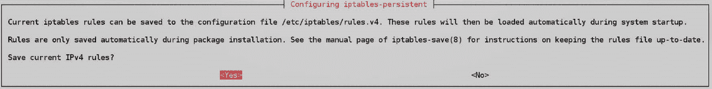

# 4 使用防火墙保护你的服务器 - 第一部分

## 加入我们的 Discord 书籍社区

[`packt.link/SecNet`](https://packt.link/SecNet)


安全性是那些最好分层执行的事情之一，我们称之为“深度防御”。因此，在任何给定的企业网络中，你会发现一个防火墙设备将互联网与 **非军事区**（**DMZ**）隔开，互联网面向的服务器通常会部署在这里。你还会发现另一个防火墙设备位于 DMZ 和内部局域网之间，并且在每台服务器和客户端上都安装有防火墙软件。我们的目标是尽可能让入侵者难以进入我们的网络。

有趣的是，在所有主要的 Linux 发行版中，只有 SUSE 发行版和 Red Hat 类型的发行版默认设置并启用了防火墙。较新的 Ubuntu 版本也附带了预配置的防火墙，但你需要通过运行几个简单的命令来激活它。

由于本书的重点是强化我们的 Linux 服务器，我们将专注于这一防线的最后一层：服务器和客户端上的防火墙。我们将讨论两个命令行的 netfilter 接口，即 **iptables** 和 **nftables**。

本章将涵盖以下主题：

+   Linux 防火墙概述

+   iptables 概述

+   nftables 概述

在下一章中，我们将介绍 **ufw** 和 **firewalld**，它们是 iptables 和 nftables 的便捷前端。

## 技术要求

本章的代码文件可以在这里找到：[`github.com/PacktPublishing/Mastering-Linux-Security-and-Hardening-Second-Edition`](https://github.com/PacktPublishing/Mastering-Linux-Security-and-Hardening-Second-Edition)。

## Linux 防火墙概述

在典型的商业环境中，特别是在大型企业中，你可能会在不同的位置遇到各种类型的防火墙，这些防火墙可以提供各种功能。以下是一些示例：

+   边缘设备将互联网与内部网络分隔开，并将可路由的公共 IP 地址转换为不可路由的私有 IP 地址。它们还可以提供各种类型的访问控制，以防止未授权人员进入。通过提供各种类型的数据包检查服务，它们可以帮助防止对内部网络的攻击，阻止恶意软件的入侵，并防止敏感信息从内部网络泄漏到互联网。

+   大型企业网络通常会被划分为多个子网或 *子网*，每个公司部门都会有一个属于自己的子网。最佳实践建议使用防火墙将这些子网隔开，这有助于确保只有授权人员才能访问特定的子网。

+   当然，你还会在各个服务器和工作站上运行防火墙。通过提供一种访问控制方式，它们可以帮助防止已经被入侵的机器在网络上进行横向移动。它们还可以配置来防止某些类型的端口扫描和**拒绝服务**（**DoS**）攻击。

对于前面列表中的前两项，你通常会看到专用的防火墙设备和防火墙管理员团队来负责处理它们。列表中的第三项就是你作为 Linux 专业人员进入的地方。在本章以及下一章中，我们将探讨你在 Linux 服务器和 Linux 工作站发行版中使用的防火墙技术。

Linux 防火墙的名称是**netfilter**。这个 netfilter 代码被编译进 Linux 内核，并执行实际的包过滤。人类用户无法直接与 netfilter 进行交互，这意味着我们需要某种助手程序来帮助我们与 netfilter 交互。曾经有三个助手程序，它们分别是：

+   **ipchains**：这是第一个，曾作为 Linux 内核的一部分，直到内核版本 2.4。它现在已经成为历史，所以我们不再谈论它。

+   **iptables**：它替代了 Linux 内核版本 2.6 中的 ipchains。它仍然在许多 Linux 发行版中使用，但正在迅速消失。

+   **nftables**：这是新兴的工具，正在迅速取代 iptables。正如我们稍后将看到的，它比旧版 iptables 有很多优势。

+   这三个助手程序为我们做了两件事：

+   它们为用户提供了命令行界面。

+   它们将用户输入的命令传递给 netfilter。

+   更有趣的是，我们还有为助手程序提供的助手程序。**简化防火墙**（**ufw**）是由 Ubuntu 开发者创建的，它是 iptables 或 nftables 的前端。Ubuntu 默认安装了 ufw，你也可以在 Debian 及其他 Debian 系列的发行版中自行安装 ufw。在 Red Hat 系列中，我们有 firewalld，它也是 iptables 或 nftables 的前端。请注意，firewalld 在所有 Red Hat 系列的发行版和 SUSE 发行版中默认安装并处于活动状态。在 Ubuntu 和 Debian 中它是一个可选项。ufw 和 firewalld 都可以极大简化设置正确防火墙的过程。不过，有时了解如何操作裸 iptables 或裸 nftables 也是很有帮助的。那么，我们就从 iptables 开始看吧。

## iptables 概述

如我所提到的，iptables 是我们目前可以直接管理 netfilter 的两种命令行工具之一。它最初是作为 Linux 内核版本 2.6 的一项功能引入的，已经存在很长时间了。使用 iptables，你有一些优势：

+   它已经存在了足够长的时间，以至于大多数 Linux 管理员都知道如何使用它。

+   使用 iptables 命令在 shell 脚本中创建自定义防火墙配置非常简单。

+   它具有很大的灵活性，可以用来设置简单的端口过滤器、路由器或虚拟私人网络。

+   它仍然在某些 Linux 发行版中预安装，尽管它正在迅速被 nftables 取代。

+   它有非常完善的文档，并且在互联网上有免费、长篇的教程可供参考。

然而，正如你可能知道的那样，它也有一些缺点：

+   IPv4 和 IPv6 各自需要特定的 iptables 实现。因此，如果你的组织在迁移到 IPv6 的过程中仍然需要运行 IPv4，你将不得不在每个服务器上配置两个防火墙，并为每个防火墙运行一个单独的守护进程。（一个用于 IPv4，另一个用于 IPv6。）

+   如果你需要进行 MAC 桥接，则需要**ebtables**，它是 iptables 的第三个组成部分，具有自己独特的语法。

+   **arptables**，iptables 的第四个组成部分，也需要其自己的守护进程和语法。

+   每当你向正在运行的 iptables 防火墙添加规则时，整个 iptables 规则集必须重新加载，这可能会影响性能。

直到最近，普通的 iptables 是所有 Linux 发行版的默认防火墙管理器。在某些发行版中仍然是默认设置，但 Red Hat Enterprise Linux 7 及其所有衍生版本现在使用新的 firewalld 作为更易用的前端来配置 iptables 规则。Ubuntu 自带**简单防火墙**（**ufw**），它也是一个易于使用的 iptables 前端，适用于所有 Ubuntu 版本，直到 20.04。

在本章中，我们将讨论如何为 IPv4 和 IPv6 配置 iptables 防火墙规则。

### 掌握 iptables 的基础知识

iptables 由五个规则表组成，每个表都有其独特的目的：

+   **过滤表**：为了基本保护我们的服务器和客户端，这可能是我们使用的唯一表。

+   **网络地址转换（NAT）表**：NAT 用于将公共互联网与私有网络连接起来。

+   **修改表**：用于在数据包通过防火墙时修改网络数据包。

+   **原始表**：这是用于不需要连接跟踪的包。

+   **安全表**：安全表仅用于安装了 SELinux 的系统。

由于我们当前只关心基本的主机保护，因此暂时只看过滤表。（稍后我将向你展示我们可以使用 mangle 表做的一些花样技巧。）每个表由规则链组成，过滤表由`INPUT`、`FORWARD`和`OUTPUT`链组成。让我们在 Ubuntu 20.04 虚拟机上看一下这个。

> Ubuntu 20.04 LTS 自带 iptables，而 Ubuntu 22.04 自带 nftables。然而，即使你正在运行 Ubuntu 22.04 或更高版本，你仍然需要学习如何使用 iptables 命令。第一个原因是，Ubuntu 22.04 包括一个很棒的功能，可以自动将 iptables 命令转换为 nftables 命令。这样，你可以继续使用已经拥有的 iptables 脚本，而无需担心将其转换为 nftables 格式。第二个原因是，一旦我们开始讨论 Ubuntu 的**简单防火墙**（**ufw**），你会发现无论使用哪个版本的 Ubuntu，仍然需要了解 iptables 命令才能配置它。

首先，我们通过使用`sudo iptables -L`命令来查看当前的配置：

```
 donnie@ubuntu:~$ sudo iptables -L
 [sudo] password for donnie:
 Chain INPUT (policy ACCEPT)
 target prot opt source destination
 Chain FORWARD (policy ACCEPT)
 target prot opt source destination
 Chain OUTPUT (policy ACCEPT)
 target prot opt source destination
 donnie@ubuntu:~$
```

记住，我们之前说过，需要一个单独的 iptables 组件来处理 IPv6。这里，我们将使用`sudo ip6tables -L`命令：

```
 donnie@ubuntu:~$ sudo ip6tables -L
 Chain INPUT (policy ACCEPT)
 target prot opt source destination
 Chain FORWARD (policy ACCEPT)
 target prot opt source destination
 Chain OUTPUT (policy ACCEPT)
 target prot opt source destination
 donnie@ubuntu:~$
```

在这两种情况下，你可以看到没有规则，机器是完全开放的。（理解 Ubuntu 实际上是带有预配置的简单防火墙，且你会看到一些特定的输出，但我们暂时忽略它，以便直接使用 iptables。）我们将从创建一个规则开始，允许我们传递来自服务器的输入数据包，这些服务器是我们的主机请求过连接的：

```
sudo iptables -A INPUT -m conntrack --ctstate ESTABLISHED,RELATED -j ACCEPT
```

这是该命令的分解：

+   **-A INPUT**: `-A`将规则放在指定链的末尾，在此情况下是`INPUT`链。如果我们希望将规则放在链的开头，我们会使用`-I`。

+   **-m**: 这调用了一个 iptables 模块。在这种情况下，我们调用了`conntrack`模块来跟踪连接状态。此模块允许`iptables`确定我们的客户端是否已连接到另一台机器，例如。

+   **--ctstate**: `ctstate`，即连接状态，我们的规则部分正在寻找两件事。首先，它在寻找客户端与服务器建立的连接。接着，它寻找来自服务器并返回到客户端的相关连接，以便允许客户端连接。所以，如果用户使用网页浏览器连接到一个网站，这条规则将允许来自网页服务器的数据包通过防火墙，传输到用户的浏览器。

+   **-j**: 这代表跳转。规则会跳转到一个特定的目标，在此情况下是`ACCEPT`。（请不要问我是谁发明的这个术语。）因此，这条规则将接受从服务器返回并且客户端已请求连接的数据包。

我们的新规则集如下所示：

```
 donnie@ubuntu:~$ sudo iptables -L
 Chain INPUT (policy ACCEPT)
 target prot opt source destination
 ACCEPT all -- anywhere anywhere ctstate RELATED,ESTABLISHED
 Chain FORWARD (policy ACCEPT)
 target prot opt source destination
 Chain OUTPUT (policy ACCEPT)
 target prot opt source destination
 donnie@ubuntu:~$
```

接下来，我们将打开端口`22`，以便通过安全外壳协议（Secure Shell）进行连接：

```
sudo iptables -A INPUT -p tcp --dport ssh -j ACCEPT
```

这是分解：

+   **-A INPUT**: 如前所述，我们希望将规则放在`INPUT`链的末尾，因此使用`-A`。

+   **-p tcp**: `-p`表示该规则影响的协议。此规则影响 TCP 协议，其中安全外壳协议（Secure Shell）就是其中之一。

+   **--dport ssh**：当一个选项名称由多个字母组成时，我们需要在前面加上两个破折号，而不仅仅是一个。`--dport`选项指定了我们希望该规则操作的目标端口。（注意，我们也可以将该部分规则列为`--dport 22`，因为`22`是 SSH 端口的号码。）

+   **-j ACCEPT**：如果我们将所有内容与`-j ACCEPT`结合在一起，那么我们就有了一条允许其他机器通过安全外壳连接到此机器的规则。

现在，假设我们希望这台机器成为一个 DNS 服务器。为此，我们需要为 TCP 和 UDP 协议都打开端口`53`：

```
sudo iptables -A INPUT -p tcp --dport 53 -j ACCEPT
sudo iptables -A INPUT -p udp --dport 53 -j ACCEPT
```

最后，我们拥有了一个几乎完整且可用的`INPUT`链规则集：

```
 donnie@ubuntu:~$ sudo iptables -L
 Chain INPUT (policy ACCEPT)
 target prot opt source destination
 ACCEPT all -- anywhere anywhere ctstate
 RELATED,ESTABLISHED
 ACCEPT tcp -- anywhere anywhere tcp dpt:ssh
 DROP all -- anywhere anywhere
 Chain FORWARD (policy ACCEPT)
 target prot opt source destination
 Chain OUTPUT (policy ACCEPT)
 target prot opt source destination
 donnie@ubuntu:~$
```

然而，这几乎是*完整*的，因为我们还有一件小事忘记了。也就是，我们需要允许回环接口的流量。这样做是可以的，因为它给了我们一个很好的机会来查看如何插入规则，尤其是在我们不希望它出现在最后时。如果是这种情况，我们将把规则插入到`INPUT 1`，即`INPUT`链的第一个位置：

```
sudo iptables -I INPUT 1 -i lo -j ACCEPT
```

在你插入`ACCEPT`规则之前，你可能已经注意到`sudo`命令执行时很慢，并且出现了 sudo: unable to resolve host... Resource temporarily unavailable 的消息。这是因为`sudo`需要知道机器的主机名，以便知道哪些规则可以在特定机器上运行。它使用回环接口来帮助解析主机名。如果`lo`接口被阻止，`sudo`需要更长时间来解析主机名。

我们的规则集现在看起来是这样的：

```
donnie@ubuntu:~$ sudo iptables -L
Chain INPUT (policy ACCEPT)
target     prot opt source               destination         
ACCEPT     all  --  anywhere             anywhere            
ACCEPT     all  --  anywhere             anywhere             ctstate RELATED,ESTABLISHED
ACCEPT     tcp  --  anywhere             anywhere             tcp dpt:ssh
ACCEPT     tcp  --  anywhere             anywhere             tcp dpt:domain
ACCEPT     udp  --  anywhere             anywhere             udp dpt:domain
Chain FORWARD (policy ACCEPT)
target     prot opt source               destination         
Chain OUTPUT (policy ACCEPT)
target     prot opt source               destination         
donnie@ubuntu:~$
```

请注意端口`53`是作为域名端口列出的。为了看到端口号而不是端口名称，我们可以使用`-n`开关：

```
donnie@ubuntu3:~$ sudo iptables -L -n
Chain INPUT (policy ACCEPT)
target     prot opt source               destination         
ACCEPT     all  --  0.0.0.0/0            0.0.0.0/0           
ACCEPT     all  --  0.0.0.0/0            0.0.0.0/0            ctstate RELATED,ESTABLISHED
ACCEPT     tcp  --  0.0.0.0/0            0.0.0.0/0            tcp dpt:22
ACCEPT     tcp  --  0.0.0.0/0            0.0.0.0/0            tcp dpt:53
ACCEPT     udp  --  0.0.0.0/0            0.0.0.0/0            udp dpt:53
Chain FORWARD (policy ACCEPT)
target     prot opt source               destination         
Chain OUTPUT (policy ACCEPT)
target     prot opt source               destination         
donnie@ubuntu3:~$
```

现在，按照当前的情况，我们仍然允许*一切*通过，因为我们还没有创建阻止未明确允许内容的规则。不过，在我们这样做之前，先看看我们可能希望允许的一些其他内容。

### 使用 iptables 阻止 ICMP

你在职业生涯中可能听到的传统观点是，我们需要阻止所有来自**互联网控制消息协议**（**ICMP**）的包。你可能被告知的观点是，通过阻止 ping 包，使你的服务器对黑客不可见。当然，ICMP 协议存在一些漏洞，例如以下几种：

通过使用僵尸网络，黑客可以通过多个来源同时向你的服务器发送 ping 包，耗尽你的服务器应对的能力。

与 ICMP 协议相关的某些漏洞可能允许黑客获得系统的管理员权限、将流量重定向到恶意服务器，或使操作系统崩溃。

通过使用一些简单的黑客工具，某人可能会将敏感数据嵌入到 ICMP 包的数据字段中，从而偷偷将其从你的组织中提取出去。

然而，虽然阻止某些类型的 ICMP 数据包是好的，但阻止所有 ICMP 数据包是不好的。严酷的现实是，某些类型的 ICMP 消息对于网络的正常功能是必要的。由于我们最终创建的“丢弃所有不被允许的”规则也会阻止 ICMP 数据包，因此我们需要创建一些规则，允许必须的 ICMP 消息类型。那么，接下来就要做这些：

```
sudo iptables -A INPUT -m conntrack -p icmp --icmp-type 3 --ctstate NEW,ESTABLISHED,RELATED -j ACCEPT
sudo iptables -A INPUT -m conntrack -p icmp --icmp-type 11 --ctstate NEW,ESTABLISHED,RELATED -j ACCEPT
sudo iptables -A INPUT -m conntrack -p icmp --icmp-type 12 --ctstate NEW,ESTABLISHED,RELATED -j ACCEPT
```

下面是详细说明：

+   **-m conntrack**：与之前一样，我们使用 `conntrack` 模块来允许处于某个状态的数据包。不过这一次，我们不仅仅允许来自已经连接主机的数据包（`ESTABLISHED,RELATED`），还允许其他主机发送到我们服务器的 `NEW` 数据包。

+   **-p icmp**：这表示 ICMP 协议。

+   **--icmp-type**：ICMP 消息类型有很多种，接下来我们会列出这些类型。

我们希望允许的三种 ICMP 消息类型如下：

+   **type 3**：这些是目标不可达消息。它们不仅可以告诉你的服务器无法访问某个主机，还可以告诉它原因。例如，如果服务器发送的数据包过大，超出了网络交换机的处理能力，交换机会返回一个 ICMP 消息，告诉服务器需要将该大数据包分片。如果没有 ICMP，每当服务器尝试发送需要分片的大数据包时，它都会遇到连接问题。

+   **type 11**：超时消息让服务器知道它发送的数据包要么在到达目标之前已经超过了其 **生存时间（TTL）**，要么是一个分片数据包在 TTL 到期之前无法重新组装。

+   **type 12**：参数问题消息表示服务器发送了一个带有错误 IP 头的数据包。换句话说，IP 头缺少某个选项标志，或者它的长度无效。

三种常见的消息类型明显没有出现在我们的列表中：

+   **type 0** 和 **type 8**：这些是臭名昭著的 ping 数据包。实际上，`type 8` 是你用来 ping 主机的回显请求数据包，而 `type 0` 是主机返回的回显应答，用来告诉你它是在线的。当然，允许 ping 数据包通过在排除网络问题时会大有帮助。如果出现这种情况，你可以添加几个 `iptables` 规则来暂时允许 ping。

+   **type 5**：现在，我们来看著名的重定向消息。允许这些消息在你有一台可以为服务器建议更高效路径的路由器时是有用的，但黑客也可以利用它们将你重定向到你不希望去的地方。所以，最好阻止这些消息。

这里展示的 ICMP 消息类型远远不止这些，但这些是我们目前需要关注的唯一类型。

当我们使用 `sudo iptables -L` 时，可以看到当前的规则集：

```
Chain INPUT (policy ACCEPT)
target     prot opt source               destination         
ACCEPT     all  --  anywhere             anywhere            
ACCEPT     all  --  anywhere             anywhere             ctstate RELATED,ESTABLISHED
ACCEPT     tcp  --  anywhere             anywhere             tcp dpt:ssh
ACCEPT     tcp  --  anywhere             anywhere             tcp dpt:domain
ACCEPT     udp  --  anywhere             anywhere             udp dpt:domain
ACCEPT     icmp --  anywhere             anywhere             ctstate NEW,RELATED,ESTABLISHED icmp destination-unreachable
ACCEPT     icmp --  anywhere             anywhere             ctstate NEW,RELATED,ESTABLISHED icmp source-quench
ACCEPT     icmp --  anywhere             anywhere             ctstate NEW,RELATED,ESTABLISHED icmp time-exceeded
ACCEPT     icmp --  anywhere             anywhere             ctstate NEW,RELATED,ESTABLISHED icmp parameter-problem
Chain FORWARD (policy ACCEPT)
target     prot opt source               destination         
Chain OUTPUT (policy ACCEPT)
target     prot opt source               destination 
```

看起来不错，对吧？其实不完全是。我们还没有通过这些规则阻止任何东西。那么，现在我们来解决这个问题。

### 使用 iptables 阻止所有不被允许的内容

要开始阻止我们不想要的内容，我们必须做两件事中的其中一件。我们可以为`INPUT`链设置一个默认的`DROP`或`REJECT`策略，或者我们可以将策略保持为`ACCEPT`，并在`INPUT`链的末尾创建一个`DROP`或`REJECT`规则。选择哪个完全是个人偏好问题。（当然，在选择之前，你可能想先查看一下你所在组织的政策手册，看看雇主是否有偏好。）

`DROP`和`REJECT`之间的区别是，`DROP`会阻止数据包而不向发送方返回任何信息；而`REJECT`则会阻止数据包，并且会向发送方返回一个信息，说明数据包为何被阻止。就我们当前的目的而言，假设我们只是想`DROP`那些我们不希望通过的数据包。

> 提示：
> 
> > 有时`DROP`更好，有时`REJECT`更好。如果让主机保持隐形很重要，就使用`DROP`。（尽管即使这样也不是特别有效，因为还有其他方式可以发现主机。）如果你需要让主机告知其他主机为什么不能建立连接，那么就使用`REJECT`。`REJECT`的一个大优点是，它会让连接的主机知道它们的数据包被阻止了，这样它们就会立刻停止尝试连接。而使用`DROP`时，尝试连接的主机会一直尝试，直到连接超时。

要在`INPUT`链的末尾创建一个`DROP`规则，可以使用以下命令：

```
donnie@ubuntu:~$ sudo iptables -A INPUT -j DROP
donnie@ubuntu:~$
```

如果你想设置默认的`DROP`策略，我们可以使用以下命令：

```
donnie@ubuntu:~$ sudo iptables -P INPUT DROP
donnie@ubuntu:~$
```

设置默认的`DROP`或`REJECT`策略的一个大优点是，它可以让你在需要时更容易地添加新的`ACCEPT`规则。这是因为如果我们决定保持默认的`ACCEPT`策略，并创建一个`DROP`或`REJECT`规则，那么该规则必须放在列表的末尾。

由于`iptables`规则是按顺序处理的，从上到下，所以任何在`DROP`或`REJECT`规则之后的`ACCEPT`规则都不会生效。你需要将任何新的`ACCEPT`规则插入到该`DROP`或`REJECT`规则的上方，这比直接将它们附加到规则列表的末尾稍微不方便一点。为了说明我的下一个要点，我暂时保留了默认的`ACCEPT`策略，并添加了`DROP`规则。

当我们查看新的规则集时，会看到一些相当奇怪的东西：

```
donnie@ubuntu:~$ sudo iptables -L
Chain INPUT (policy ACCEPT)
target     prot opt source               destination         
ACCEPT     all  --  anywhere             anywhere            
ACCEPT     all  --  anywhere             anywhere             ctstate RELATED,ESTABLISHED
. . .
. . .
ACCEPT     icmp --  anywhere             anywhere             ctstate NEW,RELATED,ESTABLISHED icmp parameter-problem
DROP       all  --  anywhere             anywhere            
Chain FORWARD (policy ACCEPT)
target     prot opt source               destination         
. . .
. . .
```

`INPUT`链的第一条规则和最后一条规则看起来是一样的，唯一的区别是一个是`DROP`，另一个是`ACCEPT`。让我们再次使用`-v`（详细）选项来看一下：

```
donnie@ubuntu:~$ sudo iptables -L -v
Chain INPUT (policy ACCEPT 0 packets, 0 bytes)
 pkts bytes target prot opt in out source destination 
   67 4828 ACCEPT all -- lo any anywhere anywhere 
  828 52354 ACCEPT all -- any any anywhere anywhere ctstate RELATED,ESTABLISHED
. . .
. . .
    0 0 ACCEPT icmp -- any any anywhere anywhere ctstate NEW,RELATED,ESTABLISHED icmp parameter-problem
  251 40768 DROP all -- any any anywhere anywhere 
Chain FORWARD (policy ACCEPT 0 packets, 0 bytes)
 pkts bytes target prot opt in out source destination 
. . .
. . .
```

现在，我们可以看到`lo`（回环接口）出现在第一条规则的`in`列下，而`any`出现在最后一条规则的`in`列下。我们还可以看到`-v`开关显示了每条规则计数的包和字节数。因此，在前面的示例中，我们可以看到`ctstate RELATED,ESTABLISHED`规则接受了 828 个数据包和 52,354 字节。`DROP all`规则阻止了 251 个数据包和 40,763 字节。

这一切看起来都不错，除了如果我们现在重启机器，规则会消失。我们需要做的最后一件事是让它们变得永久。虽然有多种方法可以做到这一点，但在 Ubuntu 机器上最简单的方法是安装`iptables-persistent`包：

```
sudo apt install iptables-persistent
```

在安装过程中，你会看到两个屏幕，询问你是否希望保存当前的`iptables 规则`。第一个屏幕是用于 IPv4 规则的，而第二个是用于 IPv6 规则的：



19501_04_01.png

你现在会看到在`/etc/iptables/`目录下有两个新的规则文件：

```
 donnie@ubuntu:~$ ls -l /etc/iptables*
 total 8
 -rw-r--r-- 1 root root 336 Oct 10 10:29 rules.v4
 -rw-r--r-- 1 root root 183 Oct 10 10:29 rules.v6
 donnie@ubuntu:~$
```

如果现在重启机器，你会看到你的 iptables 规则仍然存在并生效。`iptables-persistent`的唯一小问题是它不会保存你之后对规则所做的任何修改。不过没关系，我会稍后告诉你如何处理这个问题。

#### 基础 iptables 使用的动手实验

你将在你的 Ubuntu 20.04 虚拟机上完成此实验。按照以下步骤开始：

1.  关闭你的 Ubuntu 虚拟机并创建一个快照。重新启动后，使用此命令查看你的 iptables 规则，或者没有规则的情况：

```
sudo iptables -L
```

1.  在默认的 Ubuntu 设置中，简单防火墙（ufw）服务已经在运行，尽管它的防火墙配置并未启用。我们需要禁用它，以便直接使用 iptables。现在就执行以下命令：

```
sudo systemctl disable --now ufw
```

1.  创建你需要的基础防火墙规则，允许 Secure Shell 访问、DNS 查询和区域传输，并启用适当类型的 ICMP。拒绝其他所有流量：

```
sudo iptables -A INPUT -m conntrack  --ctstate ESTABLISHED,RELATED  -j ACCEPT
sudo iptables -A INPUT -p tcp --dport ssh -j ACCEPT
sudo iptables -A INPUT -p tcp --dport 53 -j ACCEPT
sudo iptables -A INPUT -p udp --dport 53 -j ACCEPT
sudo iptables -A INPUT -m conntrack -p icmp --icmp-type 3 --ctstate NEW,ESTABLISHED,RELATED -j ACCEPT
sudo iptables -A INPUT -m conntrack -p icmp --icmp-type 11 --ctstate NEW,ESTABLISHED,RELATED -j ACCEPT
sudo iptables -A INPUT -m conntrack -p icmp --icmp-type 12 --ctstate NEW,ESTABLISHED,RELATED -j ACCEPT
sudo iptables -A INPUT -j DROP
```

1.  使用此命令查看结果：

```
sudo iptables -L
```

1.  哎呀，似乎你忘记了回环接口。为它添加一个规则，放在规则列表的最上面：

```
sudo iptables -I INPUT 1 -i lo -j ACCEPT
```

1.  使用以下两个命令查看结果。注意每个命令输出的不同：

```
 sudo iptables -L
 sudo iptables -L -v
```

1.  安装`iptables-persistent`包，并在提示时选择保存 IPv4 和 IPv6 规则：

```
sudo apt install iptables-persistent
```

1.  重启虚拟机并验证你的规则仍然有效。

1.  保留这台虚拟机，接下来你将在下一次动手实验中对其进行更多操作。

实验到此结束——祝贺你！

### 使用 iptables 阻止无效的数据包

如果你在 IT 行业工作了一段时间，你很可能熟悉传统的 TCP 三次握手。如果不熟悉也没关系，下面是简化版的解释。

假设你坐在工作站前，打开 Firefox 访问一个网站。为了访问该网站，工作站和 web 服务器必须建立连接。下面是发生的过程：

你的工作站向 web 服务器发送一个只设置了 `SYN` 标志的数据包。这是工作站向服务器打招呼的方式：“你好，服务器先生。我想和你建立连接。”

在接收到工作站的 `SYN` 数据包后，web 服务器会返回一个带有 `SYN` 和 `ACK` 标志的数据包。通过这个，服务器在说：“是的，兄弟。我在这里，愿意和你建立连接。”

当收到 `SYN-ACK` 数据包时，工作站返回一个只设置了 `ACK` 标志的数据包。通过这个，工作站在说：“好，伙计。我很高兴能和你建立连接。”

当收到 `ACK` 数据包时，服务器与工作站建立连接，以便它们可以交换信息。

这个序列设置 TCP 连接的方式是相同的，包括涉及安全外壳、Telnet 和各种邮件服务器协议的连接，等等。

然而，聪明的人可以使用各种工具制作带有一些非常奇怪标志组合的 TCP 数据包。通过这些所谓的 *无效* 数据包，可能会发生以下几种情况：

这些无效数据包可能被用来引发目标机器的响应，从而查找它运行的操作系统、正在运行的服务以及服务的版本。

这些无效数据包可能被用来触发目标机器上的某些安全漏洞。

其中一些无效数据包比正常数据包需要更多的处理能力，这可能使它们在执行拒绝服务攻击（DoS）时非常有用。

事实上，过滤表 `INPUT` 链末尾的 `DROP all` 规则会阻止一些无效数据包。然而，这个规则可能会漏掉一些数据包。即使我们能依赖它来阻挡所有无效的内容，这也不是最有效的做法。依赖这个 `DROP all` 规则，我们允许这些无效数据包通过整个 `INPUT` 链，寻找能放行它们的规则。当没有找到 `ALLOW` 规则时，它们最终会被 `DROP all` 规则阻挡，而这个规则是链中的最后一条。那么，如果我们能找到一个更高效的解决方案呢？

理想情况下，我们希望在这些无效数据包通过整个 `INPUT` 链之前就阻止它们。我们可以通过 `PREROUTING` 链来做到这一点，但过滤表没有 `PREROUTING` 链。因此，我们需要使用 mangle 表的 `PREROUTING` 链。让我们从添加以下两条规则开始：

```
 donnie@ubuntu:~$ sudo iptables -t mangle -A PREROUTING -m conntrack --ctstate INVALID -j DROP

 donnie@ubuntu:~$ sudo iptables -t mangle -A PREROUTING -p tcp ! --syn -m conntrack --ctstate NEW -j DROP
 donnie@ubuntu:~$
```

这些规则中的第一条将阻止我们认为是*无效*的绝大多数数据包。然而，它仍然有一些遗漏。因此，我们添加了第二条规则，阻止所有不是`SYN`包的`NEW`包。现在，让我们看看我们得到了什么：

```
 donnie@ubuntu:~$ sudo iptables -L
 Chain INPUT (policy ACCEPT)
 target     prot opt source               destination         
 ACCEPT     all  --  anywhere             anywhere            
 ACCEPT     all  --  anywhere             anywhere             ctstate RELATED,ESTABLISHED
 ACCEPT     tcp  --  anywhere             anywhere             tcp dpt:ssh
 DROP       all  --  anywhere             anywhere            

 Chain FORWARD (policy ACCEPT)
 target     prot opt source               destination         

 Chain OUTPUT (policy ACCEPT)
 target     prot opt source               destination         
 donnie@ubuntu:~$
```

嗯……

我们看不到新规则，对吗？这是因为，默认情况下，`iptables -L`只显示过滤表的规则。我们需要查看刚刚放入 mangle 表的规则，所以我们可以这样做：

```
 donnie@ubuntu:~$ sudo iptables -t mangle -L
 Chain PREROUTING (policy ACCEPT)
 target     prot opt source               destination         
 DROP       all  --  anywhere             anywhere             ctstate INVALID
 DROP       tcp  --  anywhere             anywhere             tcp flags:!FIN,SYN,RST,ACK/SYN ctstate NEW

 Chain INPUT (policy ACCEPT)
 target     prot opt source               destination         
 Chain FORWARD (policy ACCEPT)
 target     prot opt source               destination         
 Chain OUTPUT (policy ACCEPT)
 target     prot opt source               destination         
 Chain POSTROUTING (policy ACCEPT)
 target     prot opt source               destination         
 donnie@ubuntu:~$
```

在这里，我们使用了`-t mangle`选项，表示我们希望查看 mangle 表的配置。你可能已经注意到一个有趣的地方，那就是`sudo iptables -t mangle -A PREROUTING -p tcp ! --syn -m conntrack --ctstate NEW -j DROP`命令创建的规则，iptables 渲染出来的方式。由于某些原因，它渲染成了这样：

```
DROP     tcp  --  anywhere   anywhere    tcp flags:!FIN,SYN,RST,ACK/SYN ctstate NEW
```

看起来有点奇怪，但不要让它困扰你。它的意思仍然是，它阻止了那些不是`SYN`包的`NEW`包。

之前，我提到过`iptables-persistent`软件包不会保存对`iptables`规则的后续更改。所以，现在的情况是，我们刚刚添加的 mangle 表规则将在我重启这台虚拟机后消失。为了使这些更改永久生效，我将使用`iptables-save`命令将新文件保存在我的个人主目录中。然后，我会将该文件复制到`/etc/iptables`目录，替换原来的文件：

```
 donnie@ubuntu:~$ sudo iptables-save > rules.v4
 [sudo] password for donnie:
 donnie@ubuntu:~$ sudo cp rules.v4 /etc/iptables/
 donnie@ubuntu:~$
```

为了测试这个，我们将使用一个非常方便的工具，叫做 Nmap。它是一个免费的工具，你可以在 Windows、Mac 或 Linux 工作站上安装。如果你不想在主机上安装它，也可以在你的 Linux 虚拟机上安装它。它在 Debian/Ubuntu、RHEL/CentOS 7 和 RHEL/AlmaLinux 8 的常规软件库中都有。所以，只需使用适合你发行版的安装命令安装 Nmap 软件包。如果你想在 Windows 或 Mac 主机上安装 Nmap，则需要从 Nmap 网站下载它。

> 你可以从官方网站下载 Nmap，网址如下：[`nmap.org/download.html`](https://nmap.org/download.html)。

在我们应用了新的 mangle 表规则后，让我们对我们的 Ubuntu 机器执行 XMAS 扫描。我在当前使用的 Fedora 工作站上安装了 Nmap，所以我就使用它。操作如下：

```
[donnie@fedora-teaching ~]$ sudo nmap -sX 192.168.0.15
 [sudo] password for donnie:
 Starting Nmap 7.70 ( https://nmap.org ) at 2019-07-26 21:20 EDT
 Nmap scan report for 192.168.0.15
 Host is up (0.00052s latency).
 All 1000 scanned ports on 192.168.0.15 are open|filtered
 MAC Address: 08:00:27:A4:95:1A (Oracle VirtualBox virtual NIC)

 Nmap done: 1 IP address (1 host up) scanned in 21.41 seconds
 [donnie@fedora-teaching ~]$
```

默认情况下，Nmap 只扫描最常用的 1,000 个端口。XMAS 扫描发送由 FIN、PSH 和 URG 标志组成的无效数据包。所有 1,000 个扫描的端口都显示为`open|filtered`，这意味着扫描被阻止，Nmap 无法确定端口的真实状态。（实际上，端口`22`是开放的。）我们可以查看结果，看看是哪个规则进行了阻止。（为了简化一些，我只显示`PREROUTING`链的输出，因为这是唯一一个执行了操作的 mangle 表链）：

```
donnie@ubuntu:~$ sudo iptables -t mangle -L -v
 Chain PREROUTING (policy ACCEPT 2898 packets, 434K bytes)
  pkts bytes target     prot opt in     out     source               destination    

  2000 80000 DROP  all  --  any    any     anywhere             anywhere             ctstate INVALID

  0     0 DROP       tcp  --  any    any     anywhere             anywhere             tcp flags:!FIN,SYN,RST,ACK/SYN ctstate NEW

 . . .
 . . .
 donnie@ubuntu:~$
```

在这里，你可以看到第一条规则——`INVALID`规则——阻止了 2000 个数据包和 80,000 字节的流量。现在，让我们将计数器清零，以便进行另一次扫描：

```
 donnie@ubuntu:~$ sudo iptables -t mangle -Z
 donnie@ubuntu:~$ sudo iptables -t mangle -L -v
 Chain PREROUTING (policy ACCEPT 22 packets, 2296 bytes)
 pkts bytes target prot opt in out source destination
 0 0 DROP all -- any any anywhere anywhere ctstate INVALID
 0 0 DROP tcp -- any any anywhere anywhere tcp flags:!FIN,SYN,RST,ACK/SYN ctstate NEW

 . . .
 . . .
 donnie@ubuntu:~$
```

这次，让我们进行一个窗口扫描，向目标机器发送`ACK`数据包：

```
[donnie@fedora-teaching ~]$ sudo nmap -sW 192.168.0.15
 Starting Nmap 7.70 ( https://nmap.org ) at 2019-07-26 21:39 EDT
 Nmap scan report for 192.168.0.15
 Host is up (0.00049s latency).
 All 1000 scanned ports on 192.168.0.15 are filtered
 MAC Address: 08:00:27:A4:95:1A (Oracle VirtualBox virtual NIC)

 Nmap done: 1 IP address (1 host up) scanned in 21.44 seconds
 [donnie@fedora-teaching ~]$
```

和之前一样，扫描被阻止了，正如消息所示，所有 1,000 个扫描端口都已被过滤。现在，让我们查看目标 Ubuntu 机器上的情况：

```
 donnie@ubuntu:~$ sudo iptables -t mangle -L -v
 Chain PREROUTING (policy ACCEPT 45 packets, 6398 bytes)
  pkts bytes target     prot opt in     out     source               destination         

  0     0 DROP       all  --  any    any     anywhere             anywhere             ctstate INVALID

  2000 80000 DROP       tcp  --  any    any     anywhere             anywhere             tcp flags:!FIN,SYN,RST,ACK/SYN ctstate NEW

 . . .
 . . .      
 donnie@ubuntu:~$
```

这次，我们可以看到无效的数据包通过了第一个规则，但被第二个规则阻止了。

现在，为了好玩，我们清除 mangle 表规则，再进行扫描。我们将使用`-D`选项从 mangle 表中删除这两个规则：

```
 donnie@ubuntu:~$ sudo iptables -t mangle -D PREROUTING 1
 donnie@ubuntu:~$ sudo iptables -t mangle -D PREROUTING 1
 donnie@ubuntu:~$
```

当你删除一个规则时，必须指定规则编号，就像插入规则时一样。在这里，我指定了规则 1 两次，因为删除第一个规则后，第二个规则上移到了第一个位置。现在，让我们确认规则已经被删除：

```
 donnie@ubuntu:~$ sudo iptables -t mangle -L
 Chain PREROUTING (policy ACCEPT)
 target prot opt source destination

 . . .
 . . .
 donnie@ubuntu:~$
```

是的，它们确实存在。太棒了。现在，让我们看看执行另一次 XMAS 扫描时会有什么结果：

```
 [donnie@fedora-teaching ~]$ sudo nmap -sX 192.168.0.15
 [sudo] password for donnie:
 Starting Nmap 7.70 ( https://nmap.org ) at 2019-07-26 21:48 EDT
 Nmap scan report for 192.168.0.15
 Host is up (0.00043s latency).
 All 1000 scanned ports on 192.168.0.15 are open|filtered
 MAC Address: 08:00:27:A4:95:1A (Oracle VirtualBox virtual NIC)

 Nmap done: 1 IP address (1 host up) scanned in 21.41 seconds
 [donnie@fedora-teaching ~]$
```

即使没有 mangle 表规则，仍然显示我的扫描被阻止了。怎么回事？发生这种情况是因为在`INPUT`表的末尾仍然有`DROP all`规则。让我们禁用这个规则，看看另一次扫描的结果。

首先，我需要查看规则的编号：

```
donnie@ubuntu:~$ sudo iptables -L
 Chain INPUT (policy ACCEPT)
 target     prot opt source               destination         
 ACCEPT     all  --  anywhere             anywhere            
 ACCEPT     all  --  anywhere             anywhere             ctstate RELATED,ESTABLISHED
 ACCEPT     tcp  --  anywhere             anywhere             tcp dpt:ssh
 DROP       all  --  anywhere             anywhere            

 Chain FORWARD (policy ACCEPT)
 target     prot opt source               destination         

 Chain OUTPUT (policy ACCEPT)
 target     prot opt source               destination         
 donnie@ubuntu:~$
```

通过倒数，我看到是规则编号 4，所以我将删除它：

```
donnie@ubuntu:~$ sudo iptables -D INPUT 4
donnie@ubuntu:~$donnie@ubuntu:~$ sudo iptables -L
 Chain INPUT (policy ACCEPT)
 target     prot opt source               destination         
 ACCEPT     all  --  anywhere             anywhere            
 ACCEPT     all  --  anywhere             anywhere             ctstate RELATED,ESTABLISHED
 ACCEPT     tcp  --  anywhere             anywhere             tcp dpt:ssh

 Chain FORWARD (policy ACCEPT)
 target     prot opt source               destination         

 Chain OUTPUT (policy ACCEPT)
 target     prot opt source               destination         
 donnie@ubuntu:~$
```

现在，进行 XMAS 扫描：

```
[donnie@fedora-teaching ~]$ sudo nmap -sX 192.168.0.15
 Starting Nmap 7.70 ( https://nmap.org ) at 2019-07-26 21:49 EDT
 Nmap scan report for 192.168.0.15
 Host is up (0.00047s latency).
 Not shown: 999 closed ports
 PORT STATE SERVICE
 22/tcp open|filtered ssh
 MAC Address: 08:00:27:A4:95:1A (Oracle VirtualBox virtual NIC)

 Nmap done: 1 IP address (1 host up) scanned in 98.76 seconds
 [donnie@fedora-teaching ~]$
```

这次，扫描结果显示 999 个端口被关闭，端口`22`（SSH 端口）要么是开放的，要么是过滤的。这表明扫描不再被任何东西阻止。

### 恢复删除的规则

当我使用`iptables -D`命令时，我只删除了运行时配置中的规则，而没有删除`rules.v4`配置文件中的规则。要恢复删除的规则，我可以重启机器或重新启动`netfilter-persistent`服务。后者更快，所以我将这样启动它：

```
donnie@ubuntu:~$ sudo systemctl restart netfilter-persistent
[sudo] password for donnie:
donnie@ubuntu:~$
```

`iptables -L`和`iptables -t mangle -L`命令将显示所有规则现在已经重新生效。

#### 阻止无效 IPv4 数据包的动手实验

对于这个实验，你将使用与上一个实验相同的虚拟机。你不会替换已经存在的规则，而是只会添加几个规则。让我们开始吧：

1.  查看过滤器表和 mangle 表中的规则。（请注意，`-v`选项显示有关被`DROP`和`REJECT`规则阻止的包的统计信息。）然后，将阻止的数据包计数器清零：

```
sudo iptables -L -v
sudo iptables -t mangle -L -v
sudo iptables -Z
sudo iptables -t mangle -Z
```

1.  从你的主机或其他虚拟机中，执行 NULL 和 Windows Nmap 扫描，针对虚拟机进行扫描：

```
sudo nmap -sN ip_address_of_your_VM
sudo nmap -sW ip_address_of_your_VM
```

1.  重复*步骤 1*。你应该会看到在过滤器表`INPUT`链的最终`DROP`规则阻止的包数量大幅增加：

```
sudo iptables -L -v
sudo iptables -t mangle -L -v
```

1.  通过使用 mangle 表的`PREROUTING`链来提高防火墙效率，丢弃无效的数据包，例如刚才执行的两次 Nmap 扫描产生的那些包。使用以下两个命令添加所需的两个规则：

```
sudo iptables -t mangle -A PREROUTING -m conntrack --ctstate INVALID -j DROP
sudo iptables -t mangle -A PREROUTING -p tcp ! --syn -m conntrack --ctstate NEW -j DROP
```

1.  将新配置保存到你的个人目录。然后，将文件复制到正确的位置，并清除已阻止的数据包计数器：

```
sudo iptables-save > rules.v4
sudo cp rules.v4 /etc/iptables
sudo iptables -Z
sudo iptables -t mangle -Z
```

1.  仅对虚拟机执行 NULL 扫描：

```
sudo nmap -sN ip_address_of_your_VM
```

1.  查看 `iptables` 规则集，观察 Nmap 扫描触发了哪个规则：

```
sudo iptables -L -v
sudo iptables -t mangle -L -v
```

1.  这次，仅对虚拟机执行 Windows 扫描：

```
sudo nmap -sW ip_address_of_your_VM
```

1.  观察此次扫描触发了哪个规则：

```
sudo iptables -L -v
sudo iptables -t mangle -L -v
```

这就是本次实验的全部内容——祝贺你！

### 保护 IPv6

我知道，你习惯了所有网络都基于 IPv4，其简短、易用的 IP 地址。然而，这种情况不可能永远持续下去，因为全球 IPv4 地址已经用尽。IPv6 提供了一个更大的地址空间，将持续很长时间。一些组织，尤其是无线运营商，正在或已经切换到 IPv6。

到目前为止，我们所讲的只是如何使用 iptables 设置 IPv4 防火墙。但请记住我们之前所说的，使用 iptables 时，你需要为 IPv4 网络设置一个守护进程和一组规则，而为 IPv6 设置另一个守护进程和一组规则。这意味着在使用 iptables 设置防火墙时，保护 IPv6 意味着需要做两次配置。大多数 Linux 发行版默认启用了 IPv6 网络，因此你要么需要用防火墙保护它，要么禁用它。否则，即使你刚刚配置的 IPv4 防火墙不会保护它，你的 IPv6 地址仍然会暴露给攻击者。即使你的服务器或设备面向 IPv4 网络，这也依然适用，因为有方法通过 IPv4 网络隧道传输 IPv6 数据包。幸运的是，设置 IPv6 防火墙的命令与我们刚刚介绍的几乎相同，最大的区别在于，你将使用 `ip6tables` 命令，而不是 `iptables` 命令。让我们像配置 IPv4 时一样，从基本设置开始：

```
donnie@ubuntu3:~$ sudo ip6tables -A INPUT -i lo -j ACCEPT
donnie@ubuntu3:~$ sudo ip6tables -A INPUT -m conntrack --ctstate ESTABLISHED,RELATED -j ACCEPT
donnie@ubuntu3:~$ sudo ip6tables -A INPUT -p tcp --dport ssh -j ACCEPT
donnie@ubuntu3:~$ sudo ip6tables -A INPUT -p tcp --dport 53 -j ACCEPT
donnie@ubuntu3:~$ sudo ip6tables -A INPUT -p udp --dport 53 -j ACCEPT
```

IPv4 和 IPv6 之间的另一个大区别是，对于 IPv6，必须允许更多类型的 ICMP 消息，而不仅仅是 IPv4 所需的。这是由于以下原因：

+   对于 IPv6，新的 ICMP 消息类型已取代了**地址解析协议**（**ARP**）。

+   对于 IPv6，动态 IP 地址分配通常是通过与其他主机交换 ICMP 探测消息，而不是通过 DHCP 完成的。

+   对于 IPv6，当你需要通过 IPv4 网络隧道 IPv6 数据包时，必须使用回显请求和回显回复，即臭名昭著的 ping 数据包。

当然，我们仍然需要与 IPv4 相同类型的 ICMP 消息。那么，让我们从这些开始：

```
donnie@ubuntu3:~$ sudo ip6tables -A INPUT -p icmpv6 --icmpv6-type 1 -j ACCEPT
[sudo] password for donnie: 
donnie@ubuntu3:~$ sudo ip6tables -A INPUT -p icmpv6 --icmpv6-type 2 -j ACCEPT
donnie@ubuntu3:~$ sudo ip6tables -A INPUT -p icmpv6 --icmpv6-type 3 -j ACCEPT
donnie@ubuntu3:~$ sudo ip6tables -A INPUT -p icmpv6 --icmpv6-type 4 -j ACCEPT
donnie@ubuntu3:~$
```

这些消息类型按出现顺序如下：

+   目标不可达

+   数据包过大

+   超时

+   数据包头部的参数问题

接下来，我们将启用回显请求（类型 128）和回显响应（类型 129），以便 IPv6 可以通过 IPv4 隧道工作：

```
donnie@ubuntu3:~$ sudo ip6tables -A INPUT -p icmpv6 --icmpv6-type 128 -j ACCEPT
donnie@ubuntu3:~$ sudo ip6tables -A INPUT -p icmpv6 --icmpv6-type 129 -j ACCEPT
donnie@ubuntu3:~$
```

> Teredo 协议是将 IPv6 数据包通过 IPv4 网络隧道传输的几种方式之一。这个协议需要回显请求和回显回复，也就是著名的 ping 数据包，可以通过防火墙。但是，如果你在你的发行版的仓库中搜索 Teredo 包，你是找不到的。这是因为 Linux 实现的 Teredo 协议叫做 miredo。所以，在 Linux 机器上安装 Teredo 协议时，你需要安装 `miredo` 和 `miredo-server` 包。

接下来的四种 ICMP 消息类型是用于链路本地多播接收者通知消息：

```
donnie@ubuntu3:~$ sudo ip6tables -A INPUT --protocol icmpv6 --icmpv6-type 130
donnie@ubuntu3:~$ sudo ip6tables -A INPUT --protocol icmpv6 --icmpv6-type 131
donnie@ubuntu3:~$ sudo ip6tables -A INPUT --protocol icmpv6 --icmpv6-type 132
donnie@ubuntu3:~$ sudo ip6tables -A INPUT --protocol icmpv6 --icmpv6-type 143
donnie@ubuntu3:~$
```

以下是按出现顺序排列的规则：

+   监听查询

+   监听报告

+   监听完成

+   监听报告 v2

接下来是我们的邻居和路由器发现消息类型：

```
donnie@ubuntu3:~$ sudo ip6tables -A INPUT -p icmpv6 --icmpv6-type 134 -j ACCEPT
donnie@ubuntu3:~$ sudo ip6tables -A INPUT -p icmpv6 --icmpv6-type 135 -j ACCEPT
donnie@ubuntu3:~$ sudo ip6tables -A INPUT -p icmpv6 --icmpv6-type 136 -j ACCEPT
donnie@ubuntu3:~$ sudo ip6tables -A INPUT -p icmpv6 --icmpv6-type 141 -j ACCEPT
donnie@ubuntu3:~$ sudo ip6tables -A INPUT -p icmpv6 --icmpv6-type 142 -j ACCEPT
donnie@ubuntu3:~$
```

以下是按出现顺序排列的规则：

+   路由器请求

+   路由器广告

+   邻居请求

+   邻居广告

+   反向邻居发现请求

+   反向邻居发现广告

空间有限，无法详细说明这些消息类型。暂时可以这么说，它们是 IPv6 主机动态分配 IPv6 地址所必需的。

如果你使用安全证书来验证附加到网络的路由器，你还需要允许 **安全邻居发现** (**SEND**) 消息：

```
donnie@ubuntu3:~$ sudo ip6tables -A INPUT -p icmpv6 --icmpv6-type 148 -j ACCEPT
donnie@ubuntu3:~$ sudo ip6tables -A INPUT -p icmpv6 --icmpv6-type 149 -j ACCEPT
donnie@ubuntu3:~$
```

你的手指是不是已经累了？如果是，不用担心。接下来的这组 ICMP 规则是最后一组。这一次，我们需要允许多播路由器发现消息：

```
donnie@ubuntu3:~$ sudo ip6tables -A INPUT -p icmpv6 --icmpv6-type 151 -j ACCEPT
donnie@ubuntu3:~$ sudo ip6tables -A INPUT -p icmpv6 --icmpv6-type 152 -j ACCEPT
donnie@ubuntu3:~$ sudo ip6tables -A INPUT -p icmpv6 --icmpv6-type 153 -j ACCEPT
donnie@ubuntu3:~$
```

最后，我们将添加 `DROP` 规则来阻止其他所有流量：

```
donnie@ubuntu3:~$ sudo ip6tables -A INPUT -j DROP
donnie@ubuntu3:~$
```

我知道你在想：“哇，这样设置一个基本的防火墙要跳过这么多圈圈”。是的，你说得对，特别是当你还需要为 IPv6 配置规则时。很快，我会展示 Ubuntu 团队为简化这些过程所做的努力。

> 你可以在这里获取关于如何在 Ubuntu 上使用 iptables 的完整信息：[`help.ubuntu.com/community/IptablesHowTo`](https://help.ubuntu.com/community/IptablesHowTo)。

#### ip6tables 实验

对于这个实验，你将使用上一个 iptables 实验中使用的同一 Ubuntu 虚拟机。你将保留现有的 IPv4 防火墙设置不变，并为 IPv6 创建一个新的防火墙。让我们开始吧：

1.  使用以下命令查看你的 IPv6 规则，或者查看是否没有规则：

```
sudo ip6tables -L
```

1.  创建 IPv6 防火墙。由于格式限制，我无法在此列出完整的命令代码块。你可以在本章的目录中找到相应的命令，代码文件可以从 Packt Publishing 网站下载。

1.  使用以下命令查看新的规则集：

```
sudo ip6tables -L
```

1.  接下来，为阻止无效数据包设置 mangle 表规则：

```
sudo ip6tables -t mangle -A PREROUTING -m conntrack --ctstate INVALID -j DROP
sudo ip6tables -t mangle -A PREROUTING -p tcp ! --syn -m conntrack --ctstate NEW -j DROP
```

1.  将新的规则集保存到你自己主目录的文件中，然后将规则文件传输到正确的位置：

```
sudo ip6tables-save > rules.v6
sudo cp rules.v6 /etc/iptables/
```

1.  使用以下命令获取虚拟机的 IPv6 地址：

```
ip a
```

1.  在你安装了 Nmap 的机器上，对虚拟机的 IPv6 地址进行 Windows 扫描。命令应该是这样的，只不过用你自己的 IP 地址替换：

```
sudo nmap -6 -sW fe80::a00:27ff:fe9f:d923
```

1.  在虚拟机上，观察使用此命令时触发了哪个规则：

```
sudo ip6tables -t mangle -L -v
```

你应该能看到某个规则的包计数器显示非零数字。

1.  在你安装了 Nmap 的机器上，对虚拟机的 IPv6 地址进行 XMAS 扫描。命令应该是这样的，只不过用你自己的 IP 地址替换：

```
sudo nmap -6 -sX fe80::a00:27ff:fe9f:d923
```

1.  和之前一样，在虚拟机上，观察这个扫描触发了哪个规则：

```
sudo ip6tables -t mangle -L -v
```

1.  关闭虚拟机，并从开始时创建的*基本 iptables 使用实验室*快照恢复虚拟机。

实验到此结束，恭喜你！

到目前为止，你已经看到了`iptables`的优缺点以及它的丑陋面。它非常灵活，`iptables`命令也充满了强大功能。如果你擅长 shell 脚本，你可以编写一些相当复杂的脚本，用于在整个网络中的机器上部署防火墙。

另一方面，做到一切正确可能会非常复杂，特别是如果你需要考虑你的机器必须同时运行 IPv4 和 IPv6，并且你为 IPv4 所做的一切都必须为 IPv6 再做一次。（如果你是个受虐狂，或许你会喜欢这样。）

## nftables——一种更通用的防火墙系统

现在，让我们将注意力转向 nftables，这个新兴的防火墙工具。那么，nftables 带来了什么呢？（是的，这个双关语是故意的。）：

+   你可以忘记需要为所有不同的网络组件设置单独的守护进程和实用工具。iptables、ip6tables、ebtables 和 arptables 的功能现在都合并在一个简洁的包里。nft 实用工具现在是你所需要的唯一防火墙工具。

+   使用 nftables 时，你可以创建多维树来展示你的规则集。这使得故障排除变得更加轻松，因为现在更容易追踪一个包通过所有规则的过程。

+   使用 iptables 时，无论是否使用，每个默认安装的表包括过滤器、NAT、mangle 和安全表。

+   使用 nftables 时，你只需要创建你打算使用的表，从而提高性能。

+   与 iptables 不同，你可以在一个规则中指定多个操作，而不必为每个操作创建多个规则。

+   与 iptables 不同，新增规则是原子性添加的。（这是一个华丽的说法，意思是你不再需要重新加载整个规则集来仅仅添加一个规则。）

+   nftables 拥有内建的脚本引擎，允许你编写更高效、更易于阅读的脚本。

+   如果你已经有了大量需要使用的 iptables 脚本，你可以安装一组实用工具，帮助你将它们转换为 nftables 格式。（除非你使用的是 Ubuntu 22.04，它可以自动为你转换 iptables 命令。）

虽然 nftables 是由 Red Hat 创建的，但 Ubuntu 是第一个将其作为选项提供的企业级 Linux 发行版，从 Ubuntu 16.04 开始。现在它已成为 Ubuntu 22.04、SUSE、OpenSUSE 和 RHEL 8/9 类型发行版的默认选项。让我们从一些基本的 nftables 概念开始。

### 了解 nftables 表和链

如果你习惯了 iptables，你可能会认出一些 nftables 的术语。唯一的问题是，有些术语的使用方式不同，含义也有所变化。让我们通过一些例子来讲解，这样你就能明白我在说什么：

+   **Tables**：在 nftables 中，表指的是特定的协议家族。表的类型有 ip、ip6、inet、arp、bridge 和 netdev。

+   **Chains**：nftables 中的链大致等同于 iptables 中的表。例如，在 nftables 中，你可能会有 filter、route 或 NAT 链。

#### 开始使用 nftables

让我们从一台已安装 nftables 的 Ubuntu 22.04 虚拟机的干净快照开始。

> 提示：
> 
> > 如果你真的想使用 Ubuntu 20.04，你可以，但首先需要通过以下命令安装 nftables：

```
sudo apt install nftables
```

现在，让我们来看一下已安装表的列表：

```
sudo nft list tables
```

你没有看到任何表格，对吧？那么，让我们加载一些表格吧。

### 在 Ubuntu 上配置 nftables

在我们使用的 Ubuntu 虚拟机中，默认的 `nftables.conf` 文件不过是一个没有意义的占位符。你需要的文件会被放在其他地方，复制过来替换掉默认的 `nftables.conf` 文件。我们来看看。

首先，我们进入存放示例配置文件的目录，并列出示例配置文件：

```
cd /usr/share/doc/nftables/examples/
ls -l
```

你应该会看到类似这样的内容：

```
donnie@ubuntu2204-packt:/usr/share/doc/nftables/examples$ ls -l
total 124
-rw-r--r-- 1 root root  1016 Mar 23  2022 all-in-one.nft
-rw-r--r-- 1 root root   129 Mar 23  2022 arp-filter.nft
. . .
. . .
-rwxr-xr-x 1 root root   817 Mar 23  2022 workstation.nft
donnie@ubuntu2204-packt:/usr/share/doc/nftables/examples$
```

如果你查看 `workstation.nft` 文件的内容，你会看到它正是我们需要的文件。

接下来，我们将把工作站文件复制到 `/etc` 目录，并将其命名为 `nftables.conf`。 （注意，这将覆盖掉旧的 `nftables.conf` 文件，这正是我们想要的。）

```
sudo cp workstation.nft /etc/nftables.conf
```

下面是你将在 `/etc/nftables.conf` 文件中看到的内容解析：

+   **#!/usr/sbin/nft -f**：虽然你可以使用 nftables 命令创建普通的 Bash 脚本，但最好使用 nftables 自带的脚本引擎。这样，我们可以让脚本更具可读性，而且无需在每个要执行的命令前都输入 `nft`。

+   **flush ruleset**：我们希望从一个干净的状态开始，所以我们将清除任何可能已经加载的规则。

+   **table inet filter**：这会创建一个 inet 家族的过滤器，它适用于 IPv4 和 IPv6。这个表的名字是 `filter`，但它也可以用一个更具描述性的名字。

+   **chain input**：在第一个大括号对内，我们有一个叫做 `input` 的链。（同样，这个名字本来可以更具描述性。）

+   **type filter hook input priority 0;**：在接下来的花括号对中，我们定义了我们的链并列出了规则。这个链被定义为`filter`类型。`hook input`表示这个链是用来处理传入数据包的。因为这个链有`hook`和`priority`，它将直接接受来自网络栈的数据包。

最后，我们有一些非常基本的主机防火墙标准规则，从**输入接口**（**iif**）规则开始，该规则允许回环接口接受数据包。

接下来是标准的连接跟踪（`ct`）规则，它接受响应于来自此主机的连接请求的流量。

然后，有一条被注释掉的规则，用于接受安全外壳（Secure Shell）和安全与非安全的网页流量。`ct state` new 表示防火墙将允许其他主机在这些端口上发起连接到我们的服务器。

`meta nfproto ipv6`规则接受邻居发现数据包，允许 IPv6 功能。

末尾的`counter drop`规则默默地阻止所有其他流量，并统计它阻止的包的数量和字节数。（这是一个示例，说明一个 nftables 规则如何执行多个不同的操作。）

如果你的 Ubuntu 服务器只需要一个基本的、简单的防火墙，最好的方法就是直接编辑`/etc/nftables.conf`文件，使其符合你的需求。首先，让我们设置一个配置，和我们为 iptables 部分创建的设置相匹配。换句话说，假设这是一个 DNS 服务器，我们需要允许端口`22`和端口`53`的连接。删除`tcp dport`行前面的注释符号，去掉端口`80`和`443`，并添加端口`53`。该行现在应该是这样的：

```
tcp dport { 22, 53 } ct state new accept
```

注意，你可以使用一个 nftables 规则打开多个端口。

DNS 也使用端口`53/udp`，所以我们为它添加一行：

```
udp dport 53 ct state new accept
```

当你只打开一个端口时，不需要将该端口号括在花括号内。打开多个端口时，只需将逗号分隔的列表括在花括号内，在每个逗号之后、第一个元素之前和最后一个元素之后留一个空格。

加载配置文件并查看结果：

```
donnie@ubuntu2204-packt:/etc$ sudo systemctl reload nftables
donnie@ubuntu2204-packt:/etc$ sudo nft list ruleset
table inet filter {
    chain input {
        type filter hook input priority 0; policy accept;
        iif "lo" accept
        ct state established,related accept
        tcp dport { ssh, domain } ct state new accept
        udp dport domain ct state new accept
        icmpv6 type { nd-router-advert, nd-neighbor-solicit, nd-neighbor-advert } accept
        counter packets 1 bytes 32 drop
    }
}
donnie@ubuntu2204-packt:/etc$
```

`counter drop`规则是另一个示例，说明一个 nftables 规则如何做多件事。在这种情况下，该规则丢弃并统计不需要的包。到目前为止，该规则已经阻止了一个包和 32 个字节。为了演示这如何工作，假设我们希望在丢包时创建一条日志条目。只需将`log`关键字添加到`drop`规则中，如下所示：

```
counter log drop
```

为了让这些消息更容易查找，可以给每个日志消息添加一个标签，像这样：

```
counter log prefix "Dropped packet: " drop
```

现在，当你需要查看`/var/log/kern.log`文件，看看你丢了多少包时，只需搜索`Dropped packet`文本字符串。

现在，假设我们想要阻止某些 IP 地址访问这台机器的安全外壳端口。为此，我们可以编辑文件，将`drop`规则放在打开端口`22`的规则之上。文件的相关部分如下所示：

```
tcp dport 22 ip saddr { 192.168.0.7, 192.168.0.10 } log prefix "Blocked SSH packets: " drop
tcp dport { 22, 53 } ct state new accept
```

在我们重新加载文件后，我们将阻止来自两个不同 IPv4 地址的 SSH 访问。任何来自这两个地址的登录尝试都会在`/var/log/kern.log`文件中生成一条带有`Blocked SSH packets`标签的消息。请注意，我们将`drop`规则放在了`accept`规则之前，因为如果`accept`规则先被读取，`drop`规则将不起作用。

接下来，我们需要允许所需类型的 ICMP 数据包，如下所示：

```
ct state new,related,established icmp type { destination-unreachable, time-exceeded, parameter-problem } accept
ct state established,related,new icmpv6 type { destination-unreachable, time-exceeded, parameter-problem } accept
```

在这种情况下，您需要为 ICMPv4 和 ICMPv6 创建独立的规则。

最后，我们将通过向过滤表添加一个新的 prerouting 链来阻止无效数据包，如下所示：

```
chain prerouting {
                type filter hook prerouting priority 0;
                ct state invalid counter log prefix "Invalid Packets:  " drop
                tcp flags & (fin|syn|rst|ack) != syn ct state new counter log drop
        }
```

现在，我们可以保存文件并关闭文本编辑器。

> 由于格式限制，我无法在此处显示完整的文件。要查看完整的文件，请从 Packt 网站下载代码文件，并查看`Chapter 4`目录。您要找的示例文件是`nftables_example_1.conf`文件。

现在，让我们加载新规则：

```
sudo systemctl reload nftables
```

另一个值得注意的非常酷的事情是，我们如何将 IPv4（ip）规则与 IPv6（ip6）规则混合在同一个配置文件中。此外，除非我们另行指定，否则我们创建的所有规则都将同时适用于 IPv4 和 IPv6。这就是使用 inet 类型表的魅力所在。为了简化和灵活性，您应该尽可能使用 inet 表，而不是为 IPv4 和 IPv6 分别使用不同的表。

大多数时候，当您只需要一个简单的主机防火墙时，最佳选择是将此`nftables.conf`文件作为起点，并编辑该文件以满足自己的需求。然而，您还可以使用命令行工具，它可能会对您有所帮助。

### 使用 nft 命令

我与 nftables 合作的首选方法是从模板开始，并像我们在上一节中做的那样手动编辑它。但对于那些更愿意从命令行做一切的人，nft 工具是一个选择。

> 提示：
> 
> > 即使您知道自己总是通过手动编辑`nftables.conf`来创建防火墙，了解 nft 工具仍然有一些实际原因。
> > 
> > 假设您观察到正在进行的攻击，并且需要快速阻止它，而不让系统宕机。通过`nft`命令，您可以即时创建一个自定义规则来阻止攻击。即时创建 nftables 规则还可以让您在配置防火墙时进行测试，而不会做出任何永久性更改。
> > 
> > 如果您决定参加 Linux 安全认证考试，可能会看到有关`nft`命令的问题。（我恰好知道。）

使用`nft`工具有两种方式。第一种是你可以直接从 Bash shell 中执行所有操作，每次执行操作时都以`nft`开头，后接`nft`的子命令。另一种方式是以交互模式使用`nft`。出于目前的目的，我们将使用 Bash shell。

首先，让我们删除之前的配置并创建一个`inet`表，因为我们希望它同时适用于 IPv4 和 IPv6。我们希望给它起个相对描述性的名称，所以我们叫它`ubuntu_filter`：

```
sudo nft delete table inet filter
sudo nft list tables
sudo nft add table inet ubuntu_filter
sudo nft list tables
```

接下来，我们将向刚才创建的表中添加一个输入过滤链（请注意，由于我们是在 Bash shell 中执行此操作，所以需要使用反斜杠转义分号）：

```
sudo nft add chain inet ubuntu_filter input { type filter hook input priority 0\; policy drop\; }
```

我们本可以给它起个更具描述性的名称，但目前`input`就足够了。在一对大括号内，我们设置了此链的参数。

每个 nftables 协议族都有自己的一组钩子，用于定义如何处理数据包。现在，我们只关注 ip/ip6/inet 协议族，它们有以下钩子：

+   前路由

+   输入

+   转发

+   输出

+   后路由

在这些中，我们只关注输入和输出钩子，这些钩子适用于过滤类型的链。通过为我们的输入链指定钩子和优先级，我们表示希望将此链作为基本链，直接接受来自网络栈的数据包。你还会看到某些参数必须以分号终止，如果你是在 Bash shell 中运行这些命令，分号需要用反斜杠进行转义。最后，我们指定了默认策略为`drop`。如果我们没有指定`drop`作为默认策略，那么默认策略将是`accept`。

> 提示：
> 
> > 每个你输入的`nft`命令都会立即生效。所以，如果你是远程操作，一旦你创建了一个默认策略为`drop`的过滤链，你的 Secure Shell 连接会被断开。
> > 
> > 有些人喜欢创建一个默认策略为`accept`的链，然后添加一个`drop`规则作为最后一条规则。另一些人则喜欢创建一个默认策略为`drop`的链，然后在末尾省略`drop`规则。务必检查你所在组织的本地操作规程，了解其偏好。

验证链是否已添加。你应该能看到类似这样的内容：

```
donnie@ubuntu2004-packt:~$ sudo nft list table inet ubuntu_filter
 [sudo] password for donnie:
 table inet filter {
       chain input {
             type filter hook input priority 0; policy drop;
       }
 }
 donnie@ubuntu2004-packt:~$
```

很好，但我们仍然需要一些规则。我们从一个连接跟踪规则和一个打开 Secure Shell 端口的规则开始。接着，我们将验证它们是否已添加：

```
sudo nft add rule inet ubuntu_filter input ct state established accept
sudo nft add rule inet ubuntu_filter input tcp dport 22 ct state new accept
sudo nft list table inet ubuntu_filter
 table inet ubuntu_filter {
     chain input {
         type filter hook input priority 0; policy drop;
         ct state established accept
         tcp dport ssh ct state new accept
     }
 }
```

好的，看起来不错。你现在有了一个基本的、可工作的防火墙，允许 Secure Shell 连接。嗯，除非我们像在本章的 iptables 部分一样，忘记创建一个规则来允许环回适配器接受数据包。由于我们希望这个规则位于规则列表的顶部，所以我们将使用`insert`而不是`add`：

```
sudo nft insert rule inet ubuntu_filter input iif lo accept
sudo nft list table inet ubuntu_filter
 table inet ubuntu_filter {
       chain input {
              type filter hook input priority 0; policy drop;
              iif lo accept
              ct state established accept
              tcp dport ssh ct state new accept
      }
 }
```

现在，我们一切准备就绪。但如果我们想在特定位置插入规则呢？为此，你需要使用带有`-a`选项的列表来查看规则句柄：

```
sudo nft list table inet ubuntu_filter -a
 table inet ubuntu_filter {
        chain input {
                 type filter hook input priority 0; policy drop;
                 iif lo accept # handle 4
                 ct state established accept # handle 2
                 tcp dport ssh ct state new accept # handle 3
       }
 }
```

如你所见，句柄的编号方式并没有什么规律。假设我们要插入一个规则，阻止某些 IP 地址访问安全外壳端口。我们可以看到 SSH 的`accept`规则是`handle 3`，因此我们需要在它之前插入我们的`drop`规则。这个命令看起来会像这样：

```
sudo nft insert rule inet ubuntu_filter input position 3 tcp dport 22 ip saddr { 192.168.0.7, 192.168.0.10 } drop
sudo nft list table inet ubuntu_filter -a
 table inet ubuntu_filter {
         chain input {
                  type filter hook input priority 0; policy drop;
                  iif lo accept # handle 4
                  ct state established accept # handle 2
                  tcp dport ssh ip saddr { 192.168.0.10, 192.168.0.7} drop # handle 6
                  tcp dport ssh ct state new accept # handle 3
         }
 }
```

所以，要将规则插入到带有`handle 3`标签的规则之前，我们必须将它插入到`3`的位置。我们刚刚插入的新规则的标签是`handle 6`。要删除一个规则，我们必须指定该规则的句柄编号：

```
sudo nft delete rule inet ubuntu_filter input handle 6
sudo nft list table inet ubuntu_filter -a
 table inet ubuntu_filter {
       chain input {
              type filter hook input priority 0; policy drop;
              iif lo accept # handle 4
              ct state established accept # handle 2
              tcp dport ssh ct state new accept # handle 3
      }
 }
```

和 iptables 一样，从命令行做的所有事情在重启机器后都会消失。为了使其永久生效，我们需要将`list`子命令的输出重定向到`nftables.conf`配置文件中（当然，我们要确保备份现有的文件，以防我们想恢复到之前的状态）：

```
sudo sh -c "nft list table inet ubuntu_filter > /etc/nftables.conf"
```

由于 Bash shell 的一个小问题，即使我们使用`sudo`，我们也不能像正常方式那样将输出重定向到`/etc/`目录中的文件。这就是为什么我必须添加`sh -c`命令，并将`nft list`命令放在双引号中。还要注意，文件必须命名为`nftables.conf`，因为这是 nftables 的 systemd 服务所查找的文件。现在，当我们查看文件时，会发现有几个缺失的内容：

```
table inet ubuntu_filter { 
    chain input { 
        type filter hook input priority 0; policy drop; 
        iif lo accept 
        ct state established accept 
        tcp dport ssh ct state new accept 
    } 
}
```

眼尖的朋友会发现我们缺少了`flush`规则和 shebang 行来指定我们希望解释此脚本的 shell。让我们添加它们：

```
#!/usr/sbin/nft -f 
flush ruleset 
table inet ubuntu_filter { 
    chain input { 
         type filter hook input priority 0; policy drop; 
         iif lo accept 
         ct state established accept 
         tcp dport ssh ct state new accept 
   } 
} 
```

好得多。让我们通过加载新配置并观察`list`输出，来测试这个：

```
sudo systemctl reload nftables
sudo nft list table inet ubuntu_filter
 table inet ubuntu_filter {
        chain input {
                 type filter hook input priority 0; policy drop;
                 iif lo accept
                 ct state established accept
                 tcp dport ssh ct state new accept
       }
 }
```

这就是创建你自己的简单主机防火墙的全部内容。当然，从命令行运行命令，而不是仅仅在文本编辑器中创建一个脚本文件，确实需要更多的输入。不过，这样做可以让你在创建规则的同时即时测试它们。而且以这种方式创建配置，然后将`list`输出重定向到你的新配置文件中，可以避免你在尝试手动编辑文件时需要跟踪那些大括号的麻烦。

也可以将我们刚刚创建的所有`nft`命令放入一个普通的、老式的 Bash shell 脚本中。不过，相信我，你真的不想这么做。只需使用我们在这里使用的 nft 原生脚本格式，你将拥有一个性能更好、更加易于阅读的脚本。

#### Ubuntu 上的 nftables 动手实验

对于这个实验，你需要一个干净的 Ubuntu 22.04 虚拟机快照。让我们开始吧。

恢复你的 Ubuntu 虚拟机到一个干净的快照，以清除你之前创建的任何防火墙配置。（或者，如果你更喜欢，从一个新的虚拟机开始。）禁用 ufw 并验证没有防火墙规则存在：

```
sudo systemctl disable --now ufw
sudo iptables -L
```

你应该不会看到 nftables 中列出任何规则。

将`workstation.nft`模板复制到`/etc/`目录并重命名为`nftables.conf`：

```
sudo cp /usr/share/doc/nftables/examples/syntax/workstation /etc/nftables.conf
```

编辑`/etc/nftables.conf`文件以创建新的配置。（请注意，由于格式限制，我必须将其分为三个不同的代码块。）使文件的顶部部分如下所示：

```
#!/usr/sbin/nft -f flush ruleset
table inet filter {
    chain prerouting {
        type filter hook prerouting priority 0;
        ct state invalid counter log prefix "Invalid Packets:  " drop
        tcp flags & (fin|syn|rst|ack) != syn ct state new counter log prefix "Invalid Packets 2: " drop
}
```

使文件的第二部分如下所示：

```
chain input {
    type filter hook input priority 0;
    # accept any localhost traffic
    iif lo accept
    # accept traffic originated from us
    ct state established,related accept
        # activate the following line to accept common local services
        tcp dport 22 ip saddr { 192.168.0.7, 192.168.0.10 } log prefix "Blocked SSH packets: " drop

        tcp dport { 22, 53 } ct state new accept
        udp dport 53 ct state new accept
        ct state new,related,established icmp type { destination-unreachable, time-exceeded, parameter-problem } accept
```

使文件的最后部分如下所示：

```
 ct state new,related,established icmpv6 type { destination-unreachable, time-exceeded, parameter-problem } accept
        # accept neighbour discovery otherwise IPv6 connectivity breaks.
        ip6 nexthdr icmpv6 icmpv6 type { nd-neighbor-solicit,  nd-router-advert, nd-neighbor-advert } accept
# count and drop any other traffic
    counter log prefix "Dropped packet: " drop
     }
}
```

保存文件并重新加载 nftables：

```
 sudo systemctl reload nftables
```

查看结果：

```
sudo nft list tables
sudo nft list tables
sudo nft list table inet filter
sudo nft list ruleset
```

从你的主机计算机或其他虚拟机上，扫描 Ubuntu 虚拟机的 Windows：

```
sudo nmap -sW ip_address_of_UbuntuVM
```

查看数据包计数器，看看哪个阻止规则被触发。（提示：它在预路由链中。）：

```
sudo nft list ruleset
```

这次，对虚拟机进行空扫描：

```
sudo nmap -sN ip_address_of_UbuntuVM
```

最后，查看这次触发了哪个规则。（提示：它是在预路由链中的另一个规则。）：

```
sudo nft list ruleset
```

在`/var/log/kern.log`文件中，搜索`Invalid Packets`文本串，以查看有关丢弃的无效数据包的消息。

这就是本实验的结束——恭喜你！

在本节中，我们详细了解了 nftables 的各个方面，并讨论了如何配置它以帮助防止某些类型的攻击。在下一章中，我们将介绍我们的辅助程序的辅助程序。

## 总结

在本章中，我们讨论了与 netfilter 防火墙直接交互的两个辅助程序。首先，我们回顾了我们可信赖的老朋友 iptables。我们看到，尽管它已经存在了很长时间并且仍然有效，但它确实有一些不足之处。接着，我们使用了 nftables，发现它在一些方面优于旧版的 iptables。

在本章分配的篇幅内，我只能呈现你设置基本主机保护所需的要点。不过，这应该足够让你入门。

在下一章中，我们将介绍 ufw 和 firewalld，它们是我们在本章讨论的两个辅助程序的辅助程序。到时候见。

## 问题

1.  以下哪项陈述是正确的？

    1.  iptables 是最容易操作的防火墙系统。

    1.  使用 iptables 时，任何你创建的规则都适用于 IPv4 和 IPv6。

    1.  使用 iptables 时，必须将 IPv6 规则与 IPv4 规则分开创建。

    1.  使用 nftables 时，必须将 IPv6 规则与 IPv4 规则分开创建。

1.  Linux 防火墙的正式名称是什么？

    1.  iptables

    1.  ufw

    1.  nftables

    1.  netfilter

1.  关于 nftables，下列哪项陈述是错误的？

    1.  使用 nftables 时，规则是原子地添加的。

    1.  使用 nftables 时，表格指的是特定的协议族。

    1.  使用 nftables 时，端口及其关联规则会被打包到区域中。

    1.  使用 nftables，你可以编写常规 bash 脚本，或使用 nftables 内置的脚本引擎。

1.  哪个 iptables 命令会显示特定规则丢弃了多少数据包？

1.  你会使用哪个 nftables 命令来查看特定规则丢弃了多少数据包？

1.  在 iptables 中，以下哪一个目标会导致数据包被阻止，而不向源发送通知？

    1.  `STOP`

    1.  `DROP`

    1.  `REJECT`

    1.  `BLOCK`

1.  以下六个选项中，哪些是 iptables 中的表？

    1.  netfilter

    1.  filter

    1.  混淆

    1.  安全

    1.  ip6table

    1.  NAT

1.  哪种防火墙系统会原子化加载其规则？

## 进一步阅读

+   25 个 iptables netfilter 防火墙示例: [`www.cyberciti.biz/tips/linux-iptables-examples.html`](https://www.cyberciti.biz/tips/linux-iptables-examples.html)

+   Linux IPv6 入门指南: [`tldp.org/HOWTO/html_single/Linux+IPv6-HOWTO/`](http://tldp.org/HOWTO/html_single/Linux+IPv6-HOWTO/)

+   防火墙中过滤 ICMPv6 消息的建议: [`www.ietf.org/rfc/rfc4890.txt`](https://www.ietf.org/rfc/rfc4890.txt)

+   nftables Wiki: [`wiki.nftables.org/wiki-nftables/index.php/Main_Page`](https://wiki.nftables.org/wiki-nftables/index.php/Main_Page)

+   nftables 示例: [`wiki.gentoo.org/wiki/Nftables/Examples`](https://wiki.gentoo.org/wiki/Nftables/Examples)

## 答案

1.  C

1.  D

1.  C

1.  sudo iptables -L -v

1.  sudo nft list ruleset

1.  B

1.  B, C, D, F

1.  nftables
