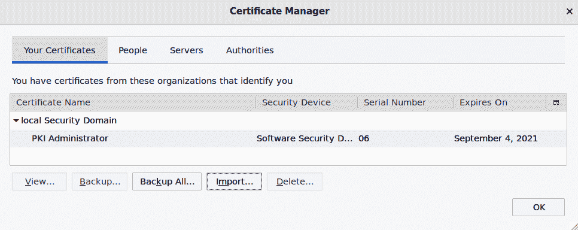

# 6 种加密技术

## 加入我们的书籍社区，加入 Discord

[`packt.link/SecNet`](https://packt.link/SecNet)


无论你是为某个超级机密的政府机构工作，还是普通的市民，你都有敏感数据需要保护免受窥探。商业机密、政府机密、个人机密——都需要保护。正如我们在*第三章*《保护普通用户账户》中所见，锁定用户的主目录并设置限制性权限只是解决方案的一部分；我们还需要加密。这种加密将为我们提供三大保护：

+   **机密性**：确保只有授权的人才能查看数据。

+   **完整性**：确保原始数据未被未经授权的人篡改。

+   **可用性**：确保敏感数据始终可用，且无法被未经授权的人删除。

本章将讨论的两种数据加密类型旨在保护静态数据和传输中的数据。我们将首先使用文件、分区和目录加密来保护静态数据，最后探讨如何使用 OpenSSL 保护传输中的数据。

在本章中，我们将涵盖以下主题：

```
GNU Privacy Guard (GPG)
Encrypting partitions with Linux Unified Key Setup (LUKS)
```

+   使用 eCryptfs 加密目录

+   使用 VeraCrypt 进行跨平台加密容器共享

+   OpenSSL 和公钥基础设施

+   商业证书授权机构

+   创建密钥、证书请求和证书

+   创建本地证书授权机构

+   将证书授权机构添加到操作系统

+   OpenSSL 和 Apache Web 服务器

+   设置互认证

如果你准备好进入加密世界，我们就开始吧。

## GNU 隐私保护工具（GPG）

我们将从**GNU 隐私保护工具**（**GPG**）开始。这是 Phil Zimmermann 在 1991 年创建的 Pretty Good Privacy 的免费开源实现。你可以使用它对文件或消息进行加密或数字签名。在本节中，我们将严格关注 GPG。

使用 GPG 有一些优势：

+   它使用强大且难以破解的加密算法。

+   它使用私钥/公钥方案，从而消除了需要以安全方式将密码传输给消息或文件接收人的需求。相反，你只需要发送公钥，除了预定的接收人外，其他人都无法使用它。

+   你可以使用 GPG 来加密你自己的文件供自己使用，就像使用任何其他加密工具一样。

+   它可以用于加密电子邮件消息，允许你对敏感邮件进行真正的端到端加密。

+   有一些图形用户界面（GUI）前端可用，旨在让使用更加简便。

但正如你所知道的，也有一些缺点：

+   当你只与信任的人直接合作时，使用公钥而不是密码是非常好的。但对于更广泛的情况，例如将公钥分发给大众，以便每个人都能验证你的签名消息，你将依赖于一个非常难以建立的信任网络模型。

+   对于电子邮件的端到端加密，收件人也必须在他们的系统上配置 GPG，并且知道如何使用它。这在企业环境中可能可行，但要让你的朋友设置这个，祝你好运。（我从未成功让其他人设置过邮件加密。）

+   如果你使用独立的电子邮件客户端，比如 Mozilla Thunderbird，你可以安装一个插件来自动加密和解密邮件。但每当 Thunderbird 发布新版本更新时，插件就会失效，而且总需要一段时间才能发布一个新的工作版本。

+   即使你能让其他人也设置他们的邮件客户端使用 GPG，这仍然不是一个完美的隐私解决方案。因为电子邮件的**元数据**——发件人和收件人的电子邮件地址——是无法加密的。因此，黑客、广告商或政府机构仍然能够看到你和谁交换邮件，并利用这些信息建立一个关于你活动、信仰和个性的个人档案。如果你真的需要完全的隐私，最好的选择是使用一个私密的消息解决方案，比如**Session**消息应用。（不过，这超出了本书的范围。）

即使存在许多弱点，GPG 仍然是分享加密文件和邮件的最佳方式之一。大多数 Linux 发行版都会预装 GPG。因此，你可以在任何 *更新* 的虚拟机上进行这些演示。（我说 *更新*，是因为在旧版发行版上，如 CentOS 7，程序会略有不同。）

### 实践实验室 – 创建你的 GPG 密钥

1.  在文本模式下的 AlmaLinux 机器上，首先需要做的就是安装 `pinentry` 包。可以通过以下命令来安装：

```
sudo dnf install pinentry
```

（请注意，在图形界面的 AlmaLinux 机器或 Ubuntu 服务器上，你无需执行此操作。）

1.  接下来，创建你的 GPG 密钥对：

```
gpg --full-generate-key
```

请注意，由于你是在为自己配置，因此不需要 `sudo` 权限。

该命令首先会在你的主目录中创建一个已填充的 `.gnupg` 目录：

```
gpg: /home/donnie/.gnupg/trustdb.gpg: trustdb created
gpg: key 56B59F39019107DF marked as ultimately trusted
gpg: directory '/home/donnie/.gnupg/openpgp-revocs.d' created
gpg: revocation certificate stored as '/home/donnie/.gnupg/openpgp-revocs.d/BD057E0E01E664424E8B812E56B59F39019107DF.rev'
public and secret key created and signed.
```

然后，你会被要求选择你想要的密钥类型。我们将使用默认的 `RSA 和 RSA`。与较老的 DSA 密钥相比，RSA 密钥更强大且更难破解。Elgamal 密钥也不错，但旧版本的 GPG 可能不支持它：

```
Please select what kind of key you want:
 (1) RSA and RSA (default)
 (2) DSA and Elgamal
 (3) DSA (sign only)
 (4) RSA (sign only)
(14) Existing key from card
Your selection?
```

对于适当的加密，你需要选择至少 3,072 位的密钥，因为任何更小的密钥现在都被认为是脆弱的。（这是根据美国国家标准与技术研究院（NIST）的最新指导）。这已经是我们最新 Linux 发行版的默认设置，所以你在那里已经没问题了。对于较旧的发行版，如 CentOS 7，默认设置只有 2048 位，所以你需要更改它。

接下来，选择你希望密钥在自动过期之前保持有效的时间。对于我们的目的，我们将选择默认的`密钥永不过期`：

```
Please specify how long the key should be valid. 
 0 = key does not expire 
 <n> = key expires in n days 
 <n>w = key expires in n weeks 
 <n>m = key expires in n months 
 <n>y = key expires in n years 
Key is valid for? (0) 
```

提供你的个人信息：

```
GnuPG needs to construct a user ID to identify your key. 
Real name: Donald A. Tevault 
Email address: donniet@something.net 
Comment: No comment 
You selected this USER-ID: 
 "Donald A. Tevault (No comment) <donniet@something.net>" 
Change (N)ame, (C)omment, (E)mail or (O)kay/(Q)uit?
Create a passphrase for your private key:
You need a Passphrase to protect your secret key. 
We need to generate a lot of random bytes. It is a good idea to perform some other action (type on the keyboard, move the mouse, utilize the disks) during the prime generation; this gives the random number generator a better chance to gain enough entropy. 
```

在较旧的 Linux 发行版上，这可能需要一段时间，即使你做了所有推荐的生成熵的操作。对于较新的 Linux 发行版，随机数生成器的工作效率更高，所以你可以忽略关于密钥生成可能需要很长时间的提示。下面是当过程完成后你会看到的内容：

```
gpg: /home/donnie/.gnupg/trustdb.gpg: trustdb created 
gpg: key 19CAEC5B marked as ultimately trusted 
public and secret key created and signed. 
gpg: checking the trustdb 
gpg: 3 marginal(s) needed, 1 complete(s) needed, PGP trust model 
gpg: depth: 0 valid: 1 signed: 0 trust: 0-, 0q, 0n, 0m, 0f, 1u 
pub 2048R/19CAEC5B 2017-10-26 
 Key fingerprint = 8DE5 8894 2E37 08C4 5B26 9164 C77C 6944 19CA EC5B 
uid Donald A. Tevault (No comment) <donniet@something.net> 
sub 2048R/37582F29 2017-10-26
```

1.  验证密钥是否已成功创建：

```
[donnie@localhost ~]$ gpg --list-keys
 /home/donnie/.gnupg/pubring.gpg
 -------------------------------
 pub 2048R/19CAEC5B 2017-10-26
 uid Donald A. Tevault (No comment) <donniet@something.net>
 sub 2048R/37582F29 2017-10-26
 [donnie@localhost ~]$
```

1.  顺便查看一下你创建的文件：

```
[donnie@localhost ~]$ ls -l .gnupg/
total 12
drwx------. 2 donnie donnie   58 Oct 26 14:53 openpgp-revocs.d
drwx------. 2 donnie donnie  110 Oct 26 14:53 private-keys-v1.d
-rw-r--r--. 1 donnie donnie 1970 Oct 26 14:53 pubring.kbx
-rw-------. 1 donnie donnie   32 Oct 26 14:43 pubring.kbx~
-rw-------. 1 donnie donnie 1280 Oct 26 15:51 trustdb.gpg
[donnie@localhost ~]$
```

这些文件是你的公钥和私钥环、撤销数据库和受信任用户数据库。

### 实践实验 – 对称加密自己的文件

即使你不打算与其他人共享文件，你可能仍然会发现 GPG 对于加密自己的文件很有用。为此，你将使用对称加密，即使用你自己的私钥进行加密。在尝试这个之前，你需要按照前一部分的说明生成密钥：

> 对称密钥加密，顾名思义，就是对称的。它的对称性体现在你用来加密文件的密钥与用来解密文件的密钥是相同的。这对于仅加密自己使用的文件来说很方便。但如果你需要与其他人共享加密文件，你就需要找出一种安全的方式将密码交给那个人。我的意思是，你肯定不想通过明文电子邮件发送密码。

1.  除了你的个人用户账户外，你还需要为 Maggie 创建一个用户账户。在 AlmaLinux 中，可以按照以下方式创建她的账户：

```
sudo useradd maggie
sudo passwd maggie
```

对于 Ubuntu，可以按照以下方式创建 Maggie 的账户：

```
sudo adduser maggie
```

1.  让我们加密一个超级机密的文件，我们绝对不能让它落入错误的人手中：

```
[donnie@localhost ~]$ gpg -c secret_squirrel_stuff.txt
[donnie@localhost ~]$
```

请注意，`-c`选项表示我选择使用带密码的对称加密来加密该文件。你输入的密码是用于该文件的，而不是你的私钥。

1.  看看你新的文件集。这个方法有一个小缺陷，那就是 GPG 会创建文件的加密副本，但它也会保留原始的未加密文件：

```
[donnie@localhost ~]$ ls -l
 total 1748
 -rw-rw-r--. 1 donnie donnie 37 Oct 26 14:22 secret_squirrel_stuff.txt
 -rw-rw-r--. 1 donnie donnie 94 Oct 26 14:22
 secret_squirrel_stuff.txt.gpg
[donnie@localhost ~]$
```

1.  让我们使用`shred`命令删除那个未加密的文件。我们将使用`-u`选项删除文件，`-z`选项则用于用零覆盖已删除的文件：

```
[donnie@localhost ~]$ shred -u -z secret_squirrel_stuff.txt
[donnie@localhost ~]$
```

看起来好像没有任何变化，因为`shred`不会给出任何输出。但`ls -l`命令会证明文件已经不存在了。

1.  现在，如果我用`less secret_squirrel_stuff.txt.gpg`查看加密文件，我会在输入我的私钥密码后看到文件内容。试试看：

```
less secret_squirrel_stuff.txt.gpg
Shhh!!!! This file is super-secret.
secret_squirrel_stuff.txt.gpg (END)
```

1.  只要我的私钥仍然保存在我的密钥环中，我就可以再次查看加密文件，而不需要重新输入密码。现在，为了向你证明文件确实被加密了，我会创建一个共享目录，并将文件移动到那里供其他人访问。再试试看吧：

```
sudo mkdir /shared
sudo chown donnie: /shared
sudo chmod 755 /shared
mv secret_squirrel_stuff.txt.gpg /shared
```

当我进入那个目录并使用`less`查看文件时，我仍然可以看到文件内容，而不需要重新输入我的密码。

1.  但是现在，让我们看看 Maggie 尝试查看文件时会发生什么。使用`su - maggie`切换到她的账户，并让她尝试：

```
su - maggie
cd /shared
[maggie@localhost shared]$ less secret_squirrel_stuff.txt.gpg
"secret_squirrel_stuff.txt.gpg" may be a binary file. See it anyway?
```

当她按下*Y*键想查看时，她看到的是：

```
<8C>^M^D^C^C^B<BD>2=<D3>͈u<93><CE><C9>MОOy<B6>^O<A2><AD>}Rg9<94><EB><C4>^W^E
 <A6><8D><B9><B8><D3>(<98><C4>æF^_8Q2b<B8>C<B5><DB>^]<F1><CD>#<90>H<EB><90><
 C5>^S%X [<E9><EF><C7>
 ^@y+<FC><F2><BA><U+058C>H'+<D4>v<84>Y<98>G<D7>֊
secret_squirrel_stuff.txt.gpg (END)
```

可怜的 Maggie 真的很想看到我的文件，但她只能看到加密的乱码。

我刚才演示的是 GPG 的另一个优点。在输入私钥密码一次后，你可以查看任何加密文件，而无需手动解密，也不需要重新输入密码。使用其他对称加密文件工具，如`bcrypt`，则必须手动解密文件才能查看。

1.  但是现在假设你不再需要加密这个文件，想要解密它以便让其他人查看。通过输入`exit`退出 Maggie 的账户。然后，只需使用`gpg`并加上`-d`选项：

```
[maggie@localhost shared]$ exit
[donnie@localhost shared]$ gpg -o secret_squirrel_stuff.txt -d secret_squirrel_stuff.txt.gpg
 gpg: AES256.CFB encrypted data
 gpg: encrypted with 1 passphrase
 Shhh!!!! This file is super-secret.
 [donnie@localhost shared]$
```

这与旧版 Linux 发行版的工作方式不同。在我们的新发行版中，我们现在必须使用`-o`选项，并指定要创建的解密文件的文件名。同时，注意`-o`选项必须放在`-d`选项之前，否则会收到错误信息。

### 动手实验 – 使用公钥加密文件

在这个实验中，你将学习如何使用 GPG 公钥加密来加密和共享文件：

1.  首先，像在前一个实验中为 Maggie 创建用户账户一样，为 Frank 创建一个用户账户。

1.  为自己和 Frank 创建密钥对，正如我之前展示的那样。接下来，将你自己的公钥提取到一个`ASCII`文本文件中：

```
cd .gnupg
gpg --export -a -o donnie_public-key.txt
```

以 Frank 身份登录，并为他重复此命令。

1.  通常，参与者会通过电子邮件附件或将密钥放入共享目录的方式互相发送密钥。在这种情况下，你和 Frank 将会收到彼此的公钥文件，并将其放入各自的`.gnupg`目录中。完成后，导入彼此的密钥：

```
donnie@ubuntu:~/.gnupg$ gpg --import frank_public-key.txt
gpg: key 4CFC6990: public key "Frank Siamese (I am a cat.) <frank@any.net>" imported
gpg: Total number processed: 1
gpg: imported: 1 (RSA: 1)
donnie@ubuntu:~/.gnupg$
frank@ubuntu:~/.gnupg$ gpg --import donnie_public-key.txt
gpg: key 9FD7014B: public key "Donald A. Tevault <donniet@something.net>" imported
gpg: Total number processed: 1
gpg:               imported: 1  (RSA: 1)
frank@ubuntu:~/.gnupg$
```

1.  现在是关键部分。为 Frank 创建一个超级机密的消息，进行非对称加密(`-e`)，并签名(`-s`)。签名消息是验证该消息确实来自你，而不是冒充者：

```
donnie@ubuntu:~$ gpg -s -e secret_stuff_for_frank.txt
. . .
. . .
It is NOT certain that the key belongs to the person named
in the user ID.  If you *really* know what you are doing,
you may answer the next question with yes.
Use this key anyway? (y/N) y
Current recipients:
2048R/CD8104F7 2017-10-27 "Frank Siamese (I am a cat.) <frank@any.net>"
Enter the user ID.  End with an empty line:
donnie@ubuntu:~$
```

所以，你需要做的第一件事是输入你的私钥密码。在要求输入用户 ID 的地方，输入 `frank`，因为他是你的消息的预定接收者。但是看看下面那行，写着`没有任何保证表明此密钥属于指定用户`。那是因为你还没有信任 Frank 的公钥。稍后我们会解决这个问题。输出的最后一行再次要求输入用户 ID，以便我们可以指定多个接收者。但此时你只关心 Frank，所以直接按*Enter*键跳出常规操作。这将导致生成一个 `.gpg` 版本的消息，发送给 Frank：

```
donnie@ubuntu:~$ ls -l
total 8
. . .
-rw-rw-r-- 1 donnie donnie 143 Oct 27 18:37 secret_stuff_for_frank.txt
-rw-rw-r-- 1 donnie donnie 790 Oct 27 18:39 secret_stuff_for_frank.txt.gpg
donnie@ubuntu:~$
```

1.  你最后的步骤是通过任何可用的方式将加密后的消息文件发送给 Frank。

1.  当 Frank 收到他的消息后，他将使用`-d`选项来查看它：

```
frank@ubuntu:~$ gpg -d secret_stuff_for_frank.txt.gpg
. . .
. . .
gpg: gpg-agent is not available in this session
gpg: encrypted with 2048-bit RSA key, ID CD8104F7, created 2017-10-27
      "Frank Siamese (I am a cat.) <frank@any.net>"
This is TOP SECRET stuff that only Frank can see!!!!!
If anyone else see it, it's the end of the world as we know it.
(With apologies to REM.)
gpg: Signature made Fri 27 Oct 2017 06:39:15 PM EDT using RSA key ID 9FD7014B
gpg: Good signature from "Donald A. Tevault <donniet@something.net>"
gpg: WARNING: This key is not certified with a trusted signature!
gpg:          There is no indication that the signature belongs to the owner.
Primary key fingerprint: DB0B 31B8 876D 9B2C 7F12  9FC3 886F 3357 9FD7 014B
frank@ubuntu:~$
```

1.  Frank 输入他的私钥密码后，就能看到消息。在底部，他看到有关你的公钥不受信任的警告，并且`没有迹象表明签名属于所有者`。假设你和 Frank 彼此认识，他知道公钥确实是你的。那么他将你的公钥添加到受信任列表中：

```
frank@ubuntu:~$ cd .gnupg
frank@ubuntu:~/.gnupg$ gpg --edit-key donnie
gpg (GnuPG) 1.4.20; Copyright (C) 2015 Free Software Foundation, Inc.
This is free software: you are free to change and redistribute it.
There is NO WARRANTY, to the extent permitted by law.
gpg: checking the trustdb
gpg: 3 marginal(s) needed, 1 complete(s) needed, PGP trust model
gpg: depth: 0  valid:   2  signed:   0  trust: 0-, 0q, 0n, 0m, 0f, 2u
pub  2048R/9FD7014B  created: 2017-10-27  expires: never       usage: SC
                     trust: ultimate      validity: ultimate
sub  2048R/9625E7E9  created: 2017-10-27  expires: never       usage: E
[ultimate] (1). Donald A. Tevault <donniet@something.net>
gpg>
```

1.  输出的最后一行是 `gpg` shell 的命令提示符。Frank 关心的是信任问题，因此他会输入 `trust` 命令：

```
gpg> trust
pub  2048R/9FD7014B  created: 2017-10-27  expires: never       usage: SC
                     trust: unknown       validity: unknown
sub  2048R/9625E7E9  created: 2017-10-27  expires: never       usage: E
[ unknown] (1). Donald A. Tevault <donniet@something.net>
Please decide how far you trust this user to correctly verify other users' keys
(by looking at passports, checking fingerprints from different sources, etc.)
  1 = I don't know or won't say
  2 = I do NOT trust
  3 = I trust marginally
  4 = I trust fully
  5 = I trust ultimately
  m = back to the main menu
Your decision? 5
Do you really want to set this key to ultimate trust? (y/N) y
```

1.  Frank 已经认识你很久了，他确实知道是你发送了密钥。因此，他选择了选项 `5` 来获得完全的信任。一旦 Frank 登出并重新登录，这个信任将生效：

```
frank@ubuntu:~$ gpg -d secret_stuff_for_frank.txt.gpg
You need a passphrase to unlock the secret key for
user: "Frank Siamese (I am a cat.) <frank@any.net>"
2048-bit RSA key, ID CD8104F7, created 2017-10-27 (main key ID 4CFC6990)
gpg: gpg-agent is not available in this session
gpg: encrypted with 2048-bit RSA key, ID CD8104F7, created 2017-10-27
      "Frank Siamese (I am a cat.) <frank@any.net>"
This is TOP SECRET stuff that only Frank can see!!!!!
If anyone else see it, it's the end of the world as we know it.
(With apologies to REM.)
gpg: Signature made Fri 27 Oct 2017 06:39:15 PM EDT using RSA key ID 9FD7014B
gpg: Good signature from "Donald A. Tevault <donniet@something.net>"
frank@ubuntu:~$
```

1.  没有更多警告信息时，情况看起来好多了。在你这边，也对 Frank 的公钥执行相同的操作。

> 正如你在*第 8 步*的屏幕输出中看到的，你可以将边际、完全或最终信任级别分配给他人的公钥。由于篇幅所限，我不能提供完整的信任级别解释，但你可以在这里阅读一个生动的解释：[PGP Web of Trust: Core Concepts Behind Trusted Communication — https://www.linux.com/tutorials/pgp-web-trust-core-concepts-behind-trusted-communication/.](https://www.linux.com/tutorials/pgp-web-trust-core-concepts-behind-trusted-communication/.)

这非常酷，因为即使全世界可能都拥有你的公钥，除了你的指定接收者，其他人无法利用它。

现在，让我们看看如何在*不*加密的情况下签署一个文件。

### 实践实验 – 在不加密的情况下签署文件

如果一个文件不是秘密的，但你仍然需要确保其真实性和完整性，你可以仅仅签名而不加密它：

1.  为 Frank 创建一个未加密的消息并签名：

```
donnie@ubuntu:~$ gpg -s not_secret_for_frank.txt
You need a passphrase to unlock the secret key for
user: "Donald A. Tevault <donniet@something.net>"
2048-bit RSA key, ID 9FD7014B, created 2017-10-27
gpg: gpg-agent is not available in this session
donnie@ubuntu:~$ ls -l
. . .
-rw-rw-r-- 1 donnie donnie  40 Oct 27 19:30 not_secret_for_frank.txt
-rw-rw-r-- 1 donnie donnie 381 Oct 27 19:31 not_secret_for_frank.txt.gpg
```

和以前一样，这会创建一个 `.gpg` 版本的文件。

1.  将消息发送给 Frank。

1.  登录为 Frank。让他尝试使用`less`打开它：

```
frank@ubuntu:~$ less not_secret_for_frank.txt.gpg
```

在旧版 Linux 发行版中，由于签名的原因，你会看到很多乱码，但你也会看到明文消息。在新版 Linux 发行版中，你只会看到明文消息，而不会有乱码。

1.  让 Frank 使用`gpg`并加上`--verify`选项来验证签名是否真的是属于你的：

```
frank@ubuntu:~$ gpg --verify not_secret_for_frank.txt.gpg
gpg: Signature made Fri 27 Oct 2017 07:31:12 PM EDT using RSA key ID 9FD7014B
gpg: Good signature from "Donald A. Tevault <donniet@something.net>"
frank@ubuntu:~$
```

关于加密单个文件的讨论就到这里。接下来，我们来看一下如何加密块设备和目录。

## 使用 Linux 统一密钥设置（LUKS）加密分区

能够加密单个文件非常方便，特别是当你想与其他用户共享敏感文件时。但也有其他类型的加密可供选择：

+   **块加密**：我们可以将其用于全盘加密，或者加密单个分区。

+   **文件级加密**：我们可以使用这种方式来加密单独的目录，而无需加密底层的分区。

+   **容器化加密**：使用第三方软件（这些软件不随任何 Linux 发行版一起提供），我们可以创建加密的跨平台容器，这些容器可以在 Linux、macOS 或 Windows 机器上打开。

**Linux 统一密钥设置**（**LUKS**）属于第一类。几乎所有 Linux 发行版都内建了它，而且每个发行版的使用说明都是相同的。LUKS 现在是几乎所有最新 Linux 发行版的默认加密机制。

> 你可能会想，进行这些磁盘加密操作会不会对性能产生影响。事实上，随着今天快速的 CPU，这几乎不会有影响。我在一台低配置的 Core i5 笔记本上运行带全盘加密的 Fedora，除了在首次启动时需要输入磁盘加密密码外，我几乎没有注意到加密在进行。

好的，我们来看一下在安装操作系统时如何加密磁盘。

### 操作系统安装过程中的磁盘加密

当你安装大多数基于 Linux 的操作系统时，你可以选择在安装过程中加密磁盘。只需在磁盘设置界面点击**加密**选项：


19501_06_01.png

除此之外，我让安装程序创建默认的分区方案。在这台 AlmaLinux 9 机器上，这意味着`/`文件系统和`swap`分区都会是加密的逻辑卷。（我稍后会详细说明。）

在安装继续之前，我需要创建一个密码短语来挂载加密磁盘：


19501_06_02.png

现在，每次重启系统时，我都需要输入这个密码短语：


19501_06_03.png

安装程序不会真正加密普通的磁盘分区，而是会设置加密的**逻辑卷**。一旦机器启动并运行，我可以查看逻辑卷的列表。在这里，我可以看到`/`逻辑卷和`swap`逻辑卷：

```
[donnie@localhost ~]$ sudo lvdisplay
  --- Logical volume ---
  LV Path                /dev/almalinux/swap
  LV Name                swap
  VG Name                almalinux
. . .
. . .
   --- Logical volume ---
  LV Path                /dev/almalinux/root
  LV Name                root
  VG Name                almalinux
. . .
. . .
[donnie@localhost ~]$
```

现在，让我们看看 **物理卷** 的列表。实际上，列表中只有一个物理卷，它被列为 `luks` 物理卷：

```
[donnie@localhost ~]$ sudo pvdisplay
  --- Physical volume ---
  PV Name               /dev/mapper/luks-b0acc532-5347-417e-a86e-a3ee8431fba7
  VG Name               almalinux
  PV Size               <19.30 GiB / not usable 2.00 MiB
  Allocatable           yes (but full)
  PE Size               4.00 MiB
  Total PE              4940
  Free PE               0
  Allocated PE          4940
  PV UUID               mRI75u-aVJI-uRjC-GY1O-ih7N-T3co-vssRRX

[donnie@localhost ~]$
```

在 `/etc/` 目录下，你会找到 `crypttab` 文件，其中包含这个物理卷的条目。

```
[donnie@localhost ~]$ sudo cat /etc/crypttab 
luks-b0acc532-5347-417e-a86e-a3ee8431fba7 UUID=b0acc532-5347-417e-a86e-a3ee8431fba7 none discard
[donnie@localhost ~]$
```

这表明底层的物理卷已被加密，这意味着 `/` 和 `swap` 逻辑卷也都被加密了。这是好事，因为如果交换空间没有加密—这是手动设置磁盘加密时常见的错误—可能会导致数据泄漏。（稍后我们会详细讨论这个 `crypttab` 文件。）

#### 实操实验——使用 LUKS 添加加密分区

有时你可能需要将另一个加密驱动器添加到现有机器，或者加密一个便携设备，如 USB 闪存。这一过程适用于这两种场景。而且，这个过程对我们使用的所有 Linux 发行版都相同，所以你使用哪台虚拟机都没关系。请按照以下步骤添加加密分区：

将大小调整到 20 GB：


19501_06_05.png

1.  重启机器后，你现在会有一个 `/dev/sdb` 驱动器可以使用。我们可以在这里看到：

```
 donnie@ubuntu2204-packt:~$ ls -l /dev/sd*
brw-rw---- 1 root disk 8,  0 Oct 27 19:33 /dev/sda
brw-rw---- 1 root disk 8,  1 Oct 27 19:33 /dev/sda1
brw-rw---- 1 root disk 8,  2 Oct 27 19:33 /dev/sda2
brw-rw---- 1 root disk 8,  3 Oct 27 19:33 /dev/sda3
brw-rw---- 1 root disk 8, 16 Oct 27 19:33 /dev/sdb
donnie@ubuntu2204-packt:~$
```

1.  在 `gdisk` 中打开该驱动器。使用整个驱动器来创建分区，并将分区类型保持为默认类型 `8300`：

```
sudo gdisk /dev/sdb
```

1.  查看你新 ` /dev/sdb1` 分区的详细信息：

```
donnie@ubuntu2204-packt:~$ sudo gdisk -l /dev/sdb
GPT fdisk (gdisk) version 1.0.8
Partition table scan:
  MBR: protective
  BSD: not present
  APM: not present
  GPT: present
. . .
. . .
Number  Start (sector)    End (sector)  Size       Code  Name
   1            2048        41943006   20.0 GiB    8300  Linux filesystem
donnie@ubuntu2204-packt:~$
```

1.  接下来，使用 `cryptsetup` 将分区转换为 LUKS 格式。在这个命令中，`-v` 表示详细模式，`-y` 表示你需要输入密码两次来确保密码正确。请注意，当它提示输入 `yes` 时，确实需要全大写输入：

```
donnie@ubuntu2204-packt:~$ sudo cryptsetup -v -y luksFormat /dev/sdb1
WARNING!
========
This will overwrite data on /dev/sdb1 irrevocably.
Are you sure? (Type 'yes' in capital letters): YES
Enter passphrase for /dev/sdb1: 
Verify passphrase: 
Key slot 0 created.
Command successful.
donnie@ubuntu2204-packt:~
```

1.  查看关于你新加密分区的信息：

```
donnie@ubuntu2204-packt:~$ sudo cryptsetup luksDump /dev/sdb1
LUKS header information
Version:        2
Epoch:          3
Metadata area:  16384 [bytes]
Keyslots area:  16744448 [bytes]
UUID:           e38e087a-205c-4aeb-81d5-03f03b8e8020
Label:          (no label)
Subsystem:      (no subsystem)
Flags:          (no flags)
. . .
. . .
```

输出的信息比我这里展示的要多很多，但你大概明白了意思。

1.  将分区映射到一个设备名。你可以给设备命名任何你想要的名称。现在就把它命名为 `secrets`。我知道，这个名字有点俗气。实际上，你不希望让人那么容易知道你在哪里存储你的秘密：

```
donnie@ubuntu2204-packt:~$ sudo cryptsetup luksOpen /dev/sdb1 secrets
Enter passphrase for /dev/sdb1: 
donnie@ubuntu2204-packt:~$
```

1.  查看 `/dev/mapper/` 目录。你会看到你的新 `secrets` 设备列出为指向某种 `dm` 设备的符号链接。（在这个例子中，它是 `dm-1`。）：

```
donnie@ubuntu2204-packt:~$ cd /dev/mapper
donnie@ubuntu2204-packt:/dev/mapper$ ls -l secrets 
lrwxrwxrwx 1 root root 7 Oct 27 19:50 secrets -> ../dm-1
donnie@ubuntu2204-packt:/dev/mapper$
```

1.  使用 `dmsetup` 查看关于你新设备的信息：

```
donnie@ubuntu2204-packt:~$ sudo dmsetup info secrets
Name:              secrets
State:             ACTIVE
Read Ahead:        256
Tables present:    LIVE
Open count:        0
Event number:      0
Major, minor:      253, 1
Number of targets: 1
UUID: CRYPT-LUKS2-e38e087a205c4aeb81d503f03b8e8020-secrets
donnie@ubuntu2204-packt:~$
```

1.  按照通常的方式格式化分区。你可以使用任何被你的 Linux 发行版支持的文件系统。在生产服务器上，这通常意味着使用 XFS 或 EXT4。为了好玩，我们就用 XFS：

```
donnie@ubuntu2204-packt:~$ sudo mkfs.xfs /dev/mapper/secrets
meta-data=/dev/mapper/secrets    isize=512    agcount=4, agsize=1309631 blks
         =                       sectsz=512   attr=2, projid32bit=1
         =                       crc=1        finobt=1, sparse=1, rmapbt=0
         =                       reflink=1    bigtime=0 inobtcount=0
data     =                       bsize=4096   blocks=5238523, imaxpct=25
         =                       sunit=0      swidth=0 blks
naming   =version 2              bsize=4096   ascii-ci=0, ftype=1
log      =internal log           bsize=4096   blocks=2560, version=2
         =                       sectsz=512   sunit=0 blks, lazy-count=1
realtime =none                   extsz=4096   blocks=0, rtextents=0
donnie@ubuntu2204-packt:~$
```

1.  创建一个挂载点并挂载加密分区：

```
donnie@ubuntu2204-packt:~$ sudo mkdir /secrets
donnie@ubuntu2204-packt:~$ sudo mount /dev/mapper/secrets /secrets/
donnie@ubuntu2204-packt:~$
```

1.  使用 `mount` 命令验证分区是否正确挂载：

```
donnie@ubuntu2204-packt:~$ mount | grep 'secrets'
/dev/mapper/secrets on /secrets type xfs (rw,relatime,attr2,inode64,logbufs=8,logbsize=32k,noquota)
donnie@ubuntu2204-packt:~$
```

### 配置 LUKS 分区以自动挂载

唯一缺失的部分是配置系统在启动时自动挂载 LUKS 分区。为此，配置两个不同的文件：

+   **/etc/crypttab**

+   **/etc/fstab**

如果你在安装操作系统时加密了 `sda` 驱动器，你应该已经有一个包含该驱动器信息的 `crypttab` 文件。它看起来应该像这样：

```
luks-b0acc532-5347-417e-a86e-a3ee8431fba7 UUID=b0acc532-5347-417e-a86e-a3ee8431fba7 none discard
```

前两个字段描述了加密分区的名称和位置。第三个字段用于加密密码短语。如果它设置为 `none`，如本例所示，那么在启动时将需要手动输入密码。

在 `fstab` 文件中，我们有一个实际挂载该分区的条目：

```
/dev/mapper/almalinux-root /           xfs     defaults,x-systemd.device-timeout=0 0 0
UUID=28218289-34cb-4c57-9755-379c65d580af /boot       xfs     defaults        0 0
/dev/mapper/almalinux-swap none      swap    defaults,x-systemd.device-timeout=0 0 0
```

实际上，在这种情况下有两个条目，因为我们有两个逻辑卷，`/` 和 `swap`，它们位于加密的物理卷上。`UUID` 行是 `/boot/` 分区，这是驱动器中唯一未加密的部分。现在，让我们添加新的加密分区，以便它也能自动挂载。

### 动手实验 - 配置 LUKS 分区以自动挂载

在本实验中，你将设置在上一个实验中创建的加密分区，使其在重启计算机时自动挂载：

> 提示：
> 
> > 在这里，通过从你的桌面主机远程登录到虚拟机将非常有帮助。通过使用图形界面的终端，无论是 Linux 或 macOS 机器的 Terminal 还是 Windows 机器上的 Cygwin，你将能够执行复制和粘贴操作，而直接在虚拟机终端中操作时是无法做到的。（相信我，你不想手动输入那些长长的 UUID。）

1.  第一步是获取加密分区的 UUID：

```
donnie@ubuntu2204-packt:~$ sudo cryptsetup luksUUID /dev/sdb1
e38e087a-205c-4aeb-81d5-03f03b8e8020
donnie@ubuntu2204-packt:~$
```

1.  复制该 UUID 并粘贴到 `/etc/crypttab` 文件中。（如果没有 `crypttab` 文件，只需创建一个新文件。）另外，请注意，你需要粘贴两次 UUID。第一次在前面加上 `luks-`，第二次在后面加上 `UUID=`：

```
luks-e38e087a-205c-4aeb-81d5-03f03b8e8020 UUID=e38e087a-205c-4aeb-81d5-03f03b8e8020 none
```

1.  编辑 `/etc/fstab` 文件，在文件的最后一行添加你的新加密分区。请注意，你需要再次使用 `luks-`，后面跟上 UUID 编号：

```
/dev/mapper/luks-e38e087a-205c-4aeb-81d5-03f03b8e8020 /secrets xfs defaults 0 0
```

> 在编辑 `fstab` 文件以添加普通的未加密分区时，我总是喜欢使用 `sudo mount -a` 来检查 `fstab` 文件是否有拼写错误。不过，这对于 LUKS 分区不起作用，因为 `mount` 在系统读取 `crypttab` 文件之前无法识别该分区，直到重启计算机后才会读取该文件。所以，在添加 LUKS 分区时，编辑 `fstab` 文件时要格外小心。

1.  现在到了关键时刻。重启计算机，检查一切是否正常工作。使用 `mount` 命令来验证你的努力是否成功：

```
donnie@ubuntu2204-packt:~$ mount | grep 'secrets'
/dev/mapper/luks-e38e087a-205c-4aeb-81d5-03f03b8e8020 on /secrets type xfs (rw,relatime,attr2,inode64,logbufs=8,logbsize=32k,noquota)
donnie@ubuntu2204-packt:~$
```

1.  实验结束。

> 提示：
> 
> > 虽然可以在`/etc/crypttab`文件中包含密码或密钥，但我个人倾向于不这么做。如果必须这么做，请确保密码或密钥存储在加密的`/`分区中，启动时你总是需要输入密码。你可以在这里阅读更多信息：将加密磁盘的密码短语存储在`/etc/crypttab`中：[`askubuntu.com/questions/181518/store-the-passphrase-of-encrypted-disk-in-etc-crypttab-encrypted`](https://askubuntu.com/questions/181518/store-the-passphrase-of-encrypted-disk-in-etc-crypttab-encrypted)

现在我们已经了解了 LUKS，让我们继续学习 eCryptfs。

## 使用 eCryptfs 加密目录

加密整个分区很酷，但有时你可能只需要使用文件级加密来加密一个单独的目录。为此，我们可以使用 eCryptfs。我们需要在 Ubuntu 机器上操作，因为 Red Hat 及其衍生版本已经不再包含 eCryptfs。（它曾在 Red Hat 6 和 CentOS 6 中出现，但在任何更新的版本中已经无法安装。）

> 提示：
> 
> > 你可以在 LUKS 加密磁盘上使用 eCryptfs，但这并不是必须的，我个人不推荐这样做。

### 实操实验 – 为新用户账户加密主目录

在*第三章*《保护普通用户账户》中，我向你展示了如何在创建用户账户时加密用户的主目录。让我们回顾一下创建 Goldie 账户的命令：

1.  如果尚未安装，请先安装`ecryptfs-utils`包：

```
sudo apt install ecryptfs-utils
```

1.  在 Ubuntu 虚拟机上，为 Goldie 创建一个带有加密目录的账户：

```
sudo adduser --encrypt-home goldie
```

1.  让 Goldie 登录。让她解开挂载密码，写下并将其保存在安全的地方。如果她需要恢复损坏的目录，密码是必需的：

```
ecryptfs-unwrap-passphrase .ecryptfs/wrapped-passphrase
```

当你使用`adduser --encrypt-home`命令时，新用户的主目录将自动设置为限制性权限值，只有目录的所有者可以访问，其他人无法进入。即使在 Ubuntu 20.04 上，当你保持`adduser.conf`文件的默认设置时，也会发生这种情况。

### 在现有主目录中创建私有目录

假设你的 Ubuntu 服务器上有一些用户，出于某种奇怪的原因，他们不想加密整个主目录，并且希望保持主目录的`755`权限设置，以便其他人可以访问他们的文件。但他们也希望拥有一个仅自己可访问的私有目录。

与加密整个主目录不同，任何用户都可以在自己的主目录中创建一个加密的私有目录。我们来看看怎么做：

1.  如果尚未安装，请先安装`ecryptfs-utils`包：

```
sudo apt install ecryptfs-utils
```

要创建这个私人目录，使用交互式的`ecryptfs-setup-private`工具。如果你有管理员权限，可以为其他用户执行此操作。没有管理员权限的用户可以为自己执行此操作。为了我们的演示，假设 Charlie，我那只大缅因猫/灰色虎斑猫，需要一个加密的私人空间。（谁知道猫也有秘密，对吧？）

1.  以正常方式创建 Charlie 的账户，*不*选择加密的主目录选项。

1.  然后，以 Charlie 身份登录，让他创建自己的私人目录：

```
charlie@ubuntu2:~$ ecryptfs-setup-private
Enter your login passphrase [charlie]:
Enter your mount passphrase [leave blank to generate one]:
Enter your mount passphrase (again):
************************************************************************
YOU SHOULD RECORD YOUR MOUNT PASSPHRASE AND STORE IT IN A SAFE LOCATION.
  ecryptfs-unwrap-passphrase ~/.ecryptfs/wrapped-passphrase
THIS WILL BE REQUIRED IF YOU NEED TO RECOVER YOUR DATA AT A LATER TIME.
************************************************************************
. . .
. . .
charlie@ubuntu2:~$
```

1.  对于登录密码短语，Charlie 输入他的正常密码或用于登录用户账户的密码短语。他本可以让系统生成自己的挂载密码短语，但他决定输入自己的密码短语。因为他确实输入了自己的挂载密码短语，所以他不需要执行`ecryptfs-unwrap-passphrase`命令来查看密码短语是什么。但是，为了演示该命令是如何工作的，假设 Charlie 输入了`TurkeyLips`作为他的挂载密码短语：

```
charlie@ubuntu2:~$ ecryptfs-unwrap-passphrase .ecryptfs/wrapped-passphrase
Passphrase:
TurkeyLips
charlie@ubuntu2:~$
```

是的，这是一个非常弱的密码短语，但为了演示的目的，它是有效的。

1.  让 Charlie 注销，然后重新登录。之后，他就可以开始使用他的新私人目录了。此外，你会看到他在主目录中有三个新的隐藏目录。这三个新目录只能由 Charlie 访问，即使他将顶级主目录设置为对所有人开放：

```
charlie@ubuntu2:~$ ls -la
total 40
drwxr-xr-x 6 charlie charlie 4096 Oct 30 17:00 .
drwxr-xr-x 4 root root 4096 Oct 30 16:38 ..
-rw------- 1 charlie charlie 270 Oct 30 17:00 .bash_history
-rw-r--r-- 1 charlie charlie 220 Aug 31 2015 .bash_logout
-rw-r--r-- 1 charlie charlie 3771 Aug 31 2015 .bashrc
drwx------ 2 charlie charlie 4096 Oct 30 16:39 .cache
drwx------ 2 charlie charlie 4096 Oct 30 16:57 .ecryptfs
drwx------ 2 charlie charlie 4096 Oct 30 16:57 Private
drwx------ 2 charlie charlie 4096 Oct 30 16:57 .Private
-rw-r--r-- 1 charlie charlie 655 May 16 08:49 .profile
charlie@ubuntu2:~$
```

1.  在`/etc/pam.d`目录下运行`grep 'ecryptfs' *`命令。你会看到 PAM 已配置为在用户登录系统时自动挂载用户的加密目录：

```
donnie@ubuntu2:/etc/pam.d$ grep 'ecryptfs' *
common-auth:auth    optional    pam_ecryptfs.so unwrap
common-password:password    optional    pam_ecryptfs.so
common-session:session    optional    pam_ecryptfs.so unwrap
common-session-noninteractive:session    optional    pam_ecryptfs.so unwrap
donnie@ubuntu2:/etc/pam.d$
```

1.  实验结束。

好的，那么我们现在知道如何加密用户的主目录。接下来，让我们看看如何加密其他目录。

### 实验环节——使用 eCryptfs 加密其他目录

加密其他目录很简单，只需使用`ecryptfs`文件系统挂载它们即可：

1.  在文件系统的顶层创建一个`secrets2`目录：

```
donnie@ubuntu2204-packt:~$ sudo mkdir /secrets2
[sudo] password for donnie: 
donnie@ubuntu2204-packt:~$
```

1.  使用`mount`命令并带上`-t ecryptfs`选项来加密该目录。请注意，你需要列出目录名两次，因为它将作为自己的挂载点。从菜单中选择`1`，输入你想要的密码短语，并选择加密算法和密钥长度：

```
donnie@ubuntu2204-packt:~$ sudo mount -t ecryptfs /secrets2/ /secrets2/
Select key type to use for newly created files: 
 1) passphrase
 2) tspi
Selection: 1
Passphrase: 
Select cipher: 
 1) aes: blocksize = 16; min keysize = 16; max keysize = 32
 2) blowfish: blocksize = 8; min keysize = 16; max keysize = 56
 3) des3_ede: blocksize = 8; min keysize = 24; max keysize = 24
 4) twofish: blocksize = 16; min keysize = 16; max keysize = 32
 5) cast6: blocksize = 16; min keysize = 16; max keysize = 32
 6) cast5: blocksize = 8; min keysize = 5; max keysize = 16
Selection [aes]:
```

选择默认的`aes`和`16`字节的密钥。

1.  对于`plaintext passthrough`选择默认的`no`，对于文件名加密选择`yes`：

```
Enable plaintext passthrough (y/n) [n]:
Enable filename encryption (y/n) [n]: y
```

1.  选择默认的`Filename Encryption Key`并验证挂载选项：

```
Filename Encryption Key (FNEK) Signature [e339e1ebf3d58c36]:
Attempting to mount with the following options:
  ecryptfs_unlink_sigs
  ecryptfs_fnek_sig=e339e1ebf3d58c36
  ecryptfs_key_bytes=16
  ecryptfs_cipher=aes
  ecryptfs_sig=e339e1ebf3d58c36
```

1.  这个警告只会在你第一次挂载目录时出现。对于最后两个问题，输入`yes`以防止该警告再次出现：

```
WARNING: Based on the contents of [/root/.ecryptfs/sig-cache.txt],
it looks like you have never mounted with this key
before. This could mean that you have typed your
passphrase wrong.
Would you like to proceed with the mount (yes/no)? : yes
Would you like to append sig [e339e1ebf3d58c36] to
[/root/.ecryptfs/sig-cache.txt]
in order to avoid this warning in the future (yes/no)? : yes
Successfully appended new sig to user sig cache file
Mounted eCryptfs
```

1.  为了好玩，在你新加密的`secrets2`目录中创建一个文件，然后卸载该目录。接着，尝试列出目录内容：

```
cd /secrets2
sudo vim secret_stuff.txt
cd
sudo umount /secrets2
donnie@ubuntu2204-packt:~$ ls -l /secrets2/
total 12
-rw-rw-r-- 1 donnie donnie 12288 Oct 28 19:04 ECRYPTFS_FNEK_ENCRYPTED.FXbXCS5fwxKABUQtEPlumGPaN-RGvqd13yybkpTr1eCVWVHdr-lrmi1X9Vu-mLM-A-VeqIdN6KNZGcs-
donnie@ubuntu2204-packt:~$
```

通过选择加密文件名，当目录未挂载时，别人甚至无法知道你有什么文件。当你准备再次访问加密的文件时，只需像之前一样重新挂载目录。

## 使用 eCryptfs 加密交换分区

如果你只是用 eCryptfs 加密单个目录，而不是使用 LUKS 进行整盘加密，你需要加密交换分区以防止意外的数据泄露。解决这个问题只需要执行一个简单的命令：

```
donnie@ubuntu:~$ sudo ecryptfs-setup-swap
WARNING:
An encrypted swap is required to help ensure that encrypted files are not leaked to disk in an unencrypted format.
HOWEVER, THE SWAP ENCRYPTION CONFIGURATION PRODUCED BY THIS PROGRAM WILL BREAK HIBERNATE/RESUME ON THIS SYSTEM!
NOTE: Your suspend/resume capabilities will not be affected.
Do you want to proceed with encrypting your swap? [y/N]: y
INFO: Setting up swap: [/dev/sda5]
WARNING: Commented out your unencrypted swap from /etc/fstab
swapon: stat of /dev/mapper/cryptswap1 failed: No such file or directory
donnie@ubuntu:~$
```

不用担心关于缺少 `/dev/mapper/cryptswap1` 文件的警告。下次重启计算机时，它会被创建。

## 使用 VeraCrypt 跨平台共享加密容器

曾几何时，TrueCrypt 是一个跨平台程序，允许在不同操作系统之间共享加密容器。但该项目一直充满神秘，因为其开发者从未公开身份。然后，突然间，开发者发布了一条神秘信息，称 TrueCrypt 已经不再安全，并关闭了该项目。

VeraCrypt 是 TrueCrypt 的继任者，它允许在 Linux、Windows、macOS 和 FreeBSD 机器之间共享加密容器。尽管 LUKS 和 eCryptfs 都很好，但 VeraCrypt 在某些方面提供了更多的灵活性：

+   如前所述，VeraCrypt 提供了跨平台共享，而 LUKS 和 eCryptfs 则没有。

+   VeraCrypt 允许你加密整个分区或整个存储设备，或者创建虚拟加密磁盘。

+   你不仅可以使用 VeraCrypt 创建加密卷，还可以将其隐藏，从而获得合理的否认能力。

+   VeraCrypt 提供命令行和图形界面两种版本，因此适用于服务器使用或普通桌面用户。

+   与 LUKS 和 eCryptfs 一样，VeraCrypt 是免费的开源软件，这意味着它可以免费使用，并且源代码可以进行审计以查找漏洞或后门。

### 实操实验室 – 获取和安装 VeraCrypt

按照以下步骤安装 VeraCrypt：

1.  从这里下载 VeraCrypt：[`www.veracrypt.fr/en/Downloads.html`](https://www.veracrypt.fr/en/Downloads.html)

1.  VeraCrypt 的 Linux 版本有两种形式。首先是 `.tar.bz2` 文件，其中包含一组通用安装脚本，应该适用于任何 Linux 发行版。一旦解压 `.tar.bz2` 压缩包文件，你会看到三个图形界面安装脚本和两个控制台模式安装脚本。脚本适用于 32 位和 64 位版本的 Linux：

```
donnie@donnie-VirtualBox:~$ tar xjvf veracrypt-1.25.9-setup.tar.bz2 
veracrypt-1.25.9-setup-console-x64
veracrypt-1.25.9-setup-console-x86
veracrypt-1.25.9-setup-gtk3-console-x64
veracrypt-1.25.9-setup-gtk3-gui-x64
veracrypt-1.25.9-setup-gui-x64
veracrypt-1.25.9-setup-gui-x86
donnie@donnie-VirtualBox:~$
```

1.  可执行权限已经设置好，所以你只需要执行以下操作来安装：

```
donnie@donnie-VirtualBox:~$ ./veracrypt-1.25.9-setup-gui-x64
```

你需要具有 sudo 权限，但安装程序会提示你输入 sudo 密码。在阅读并同意相当冗长的许可协议后，安装过程只需要几秒钟。

实验室结束

> 最近，VeraCrypt 的开发人员也开始为特定的 Linux 发行版提供`.deb`和`.rpm`安装包。对于 Debian/Ubuntu 类的系统，可以使用`sudo dpkg -i`来安装`.deb`文件。对于 RHEL/CentOS/AlmaLinux/SUSE 系统，可以使用`sudo rpm -Uvh`来安装`.rpm`文件。请注意，您可能会收到错误信息，提示您需要安装其他软件包作为依赖项。另外，RHEL/AlmaLinux 9 发行版没有`.rpm`安装包。不过不用担心，因为我已经验证过 CentOS 8 的安装包在 AlmaLinux 9 上完全可以正常使用。

#### 实操实验 - 在控制台模式下创建并挂载 VeraCrypt 卷

我一直没能找到关于 VeraCrypt 控制台模式变种的文档，但你可以通过输入`veracrypt`来查看可用命令的列表。在这个演示中，你将创建一个 2 GB 的加密目录。但你也可以在其他地方做，比如在 USB 闪存盘上。

1.  要创建一个新的加密卷，请输入以下命令：

```
veracrypt -c
```

1.  这将带你进入一个易于使用的交互式工具。大多数情况下，只需接受默认选项即可：

```
donnie@ubuntu:~$ veracrypt -c
Volume type:
 1) Normal
 2) Hidden
Select [1]:
Enter volume path: /home/donnie/good_stuff
Enter volume size (sizeK/size[M]/sizeG): 2G
Encryption Algorithm:
 1) AES
 2) Serpent
. . .
. . .
Select [1]:
. . .
. . .
```

1.  对于文件系统，默认的`FAT`选项为 Linux、macOS 和 Windows 之间提供最佳的跨平台兼容性：

```
Filesystem:
 1) None
 2) FAT
 3) Linux Ext2
 4) Linux Ext3
 5) Linux Ext4
 6) NTFS
 7) exFAT
Select [2]:
```

1.  选择你的密码和**PIM**（**个人迭代乘数**的缩写）。我的 PIM 值为`8891`。（较高的 PIM 值提供更好的安全性，但也会导致卷挂载的时间变长。）然后，输入至少 320 个随机字符以生成加密密钥。（如果我的猫在键盘上走来走去，那就太方便了）：

```
Enter password:
Re-enter password:
Enter PIM: 8891
Enter keyfile path [none]:
Please type at least 320 randomly chosen characters and then press Enter:
```

1.  按下**Enter**键后，请耐心等待，因为加密卷的最终生成需要一些时间。在这里，你可以看到我的 2 GB `good_stuff`容器已成功创建：

```
donnie@ubuntu:~$ ls -l good_stuff
-rw------- 1 donnie donnie 2147483648 Nov  1 17:02 good_stuff
donnie@ubuntu:~$
```

1.  挂载此容器以使用它。首先创建一个挂载点目录：

```
donnie@ubuntu:~$ mkdir good_stuff_dir
donnie@ubuntu:~$
```

1.  使用`veracrypt`工具将你的容器挂载到该挂载点：

```
donnie@ubuntu:~$ veracrypt good_stuff good_stuff_dir
Enter password for /home/donnie/good_stuff:
Enter PIM for /home/donnie/good_stuff: 8891
Enter keyfile [none]:
Protect hidden volume (if any)? (y=Yes/n=No) [No]:
Enter your user password or administrator password:
donnie@ubuntu:~$
```

1.  要查看已挂载的 VeraCrypt 卷，请使用`veracrypt -l`：

```
donnie@ubuntu:~$ veracrypt -l
1: /home/donnie/secret_stuff /dev/mapper/veracrypt1 /home/donnie/secret_stuff_dir
2: /home/donnie/good_stuff /dev/mapper/veracrypt2 /home/donnie/good_stuff_dir
donnie@ubuntu:~$
```

1.  实验结束。就这些。

### 在图形界面模式下使用 VeraCrypt

任何支持的操作系统的桌面用户都可以安装 VeraCrypt 的图形界面变种。但要注意，你不能在同一台机器上同时安装控制台模式变种和图形界面变种，因为一个会覆盖另一个。以下是安装后的情况：


19501_06_06.png

由于本书的主要重点是服务器安全，因此我不会在这里详细介绍图形界面版本。但它相当直观，你可以在他们的官方网站查看完整的 VeraCrypt 文档。

> 你可以从这里下载 VeraCrypt：[`www.veracrypt.fr/en/Home.html`](https://www.veracrypt.fr/en/Home.html)。

## OpenSSL 和公钥基础设施

使用 OpenSSL 时，我们可以在信息传输过程中即时加密数据。我们无需在发送数据之前手动加密，因为 OpenSSL 加密会自动进行。这一点非常重要，因为没有它，在线商业和银行业务无法存在。

**安全套接字层**（**SSL**）是最初的传输中加密协议。具有讽刺意味的是，尽管我们现在使用的是 OpenSSL 套件的程序和库，但我们不再希望使用 SSL。相反，我们现在希望使用**传输层安全**（**TLS**）协议。SSL 充满了遗留代码，并伴随有许多与这些遗留代码相关的漏洞。TLS 较新，并且更加安全。但是，即使在使用 TLS 时，我们仍然可以使用 OpenSSL 套件。

旧版 SSL 协议如此糟糕的一个原因是过去的政府监管，特别是在美国，禁止使用强加密。在公共互联网的最初几年，美国的网站运营商不能合法地实施超过 40 位的加密密钥。即使在当时，40 位密钥也不能提供足够的安全性。但美国政府将强加密视为一种军火，并试图控制它，以防其他国家的政府能够使用它。与此同时，一个名为 Fortify 的澳大利亚公司开始生产一个强加密插件，用户可以将其安装在 Netscape 浏览器中。这个插件允许使用 128 位加密，我和我的极客朋友们都迫不及待地在自己的计算机上安装了它。回想起来，我不确定它是否真的起了多大作用，因为美国的网站运营商仍然被禁止在他们的 Web 服务器上使用强加密密钥。

惊人的是，Fortify 公司仍然保留着他们的网站。即使现在这个插件已经完全没用了，您仍然可以下载 Fortify 插件。这是 Fortify 网站的截图：


19501_06_07.png

加密的 SSL/TLS 会话同时使用对称和非对称机制。为了获得可接受的性能，它使用对称加密来加密传输中的数据。但对称加密要求在两个通信方之间交换私钥。为此，SSL/TLS 首先使用我们在 GPG 部分中看到的相同公钥交换机制来协商一个非对称会话。

一旦建立了非对称会话，两个通信方就可以安全地交换他们将用于对称会话的私钥。

### 商业证书颁发机构

为了使这一过程生效，您需要在您的 Web 服务器上安装安全证书。该证书有两个作用：

+   它包含了设置非对称密钥交换会话所需的公钥。

+   可选地，它可以验证您的网站的身份或进行身份认证。因此，举例来说，用户理论上可以确保他们连接的是自己的真实银行，而不是乔·黑客伪装成自己银行的“骗子和罪犯银行”。

当您购买证书时，您会发现有相当多的供应商，它们都被称为**证书颁发机构**，或称为**CA**。大多数 CA，包括 Thawte、Symantec、GoDaddy 和 Let's Encrypt 等供应商，提供几种不同级别的证书。为了帮助解释不同级别证书之间的差异，以下是来自 GoDaddy 网站的截图：

在列表的左侧，最便宜的价格是**标准** **域名验证**（**DV**）证书。供应商将这种类型的证书宣传为仅在您关心的是加密的情况下使用。身份验证仅限于域名验证，这意味着，您的网站的记录已经在公共可访问的 DNS 服务器上找到。

在右侧，我们看到了**高级** **扩展验证**（**EV**）证书。这是证书供应商提供的顶级、最高等级证书。拥有这种扩展验证级别的证书，您需要经历一些繁琐的步骤来证明您确实是您所声称的人，并且您的网站和您的业务都是合法的。曾经，Firefox 和 Chrome 会在任何具有 EV 证书的网站的 URL 中显示绿色的高保障栏，但现在它们不再这么做，原因我稍后会解释。

那么，这种经过严格身份测试的**高级 SSL EV**证书究竟有多好呢？嗯，没我想的那么好。在我为本书前一版写下关于不同类型证书的解释后两天，我收到了来自 Feisty Duck Publishing 的最新一期《Bulletproof TLS Newsletter》。其中的重大新闻是，Google 和 Mozilla 决定从 Chrome 和 Firefox 的未来版本中移除绿色的高保障栏。他们的理由如下：

+   绿色高保障栏旨在帮助用户避免钓鱼攻击。但为了让这一点发挥作用，用户必须注意到高保障栏的存在。研究表明，大多数人甚至没有注意到它。

+   安全研究员 Ian Carrol 质疑扩展验证证书的价值。作为实验，他成功注册了一个虚假的 Stripe, Inc. 证书（Stripe 是一家合法公司）。证书供应商最终注意到他们的错误并吊销了该证书，但这本不应该发生。

+   除了其他所有内容之外，注册扩展验证证书时也可能使用不正确的信息。这表明验证过程并不像证书供应商所宣传的那样彻底。

尽管偶尔会遇到这些问题，我仍然相信扩展验证证书是有用的。当我访问我的银行账户时，我喜欢相信额外的身份验证永远不会是坏事。

> 另一个比较奇怪的事情是，证书供应商仍然将他们的证书宣传为 SSL 证书。不过，不要被欺骗。只要网站所有者正确配置他们的服务器，他们将使用更安全的 TLS 协议，而不是 SSL。

**Let's Encrypt** 是一个相对较新的组织，目标是确保全球所有网站都启用加密。这个目标很值得追求，但也带来了一个新问题。下面是 Let's Encrypt 网站的样子：


19501_06_09.png

要从传统证书供应商处获取证书，你必须使用 OpenSSL 工具来创建密钥和证书请求。然后，你将提交证书请求、必要时的身份验证以及付款给证书颁发机构。根据你购买的证书等级，你可能需要等待一到几天才能拿到证书。

Let's Encrypt 完全免费，而且你不需要费劲去获取证书。相反，你只需配置你的 Web 服务器，在每次设置新网站时自动获取新的 Let's Encrypt 证书。如果 Let's Encrypt 看到你的网站在一个公开可访问的 DNS 服务器上有有效记录，它将自动创建并安装证书到你的服务器上。除了需要配置 Web 服务器以使用 Let's Encrypt 外，完全没有麻烦。

Let's Encrypt 的问题在于，它比扩展验证证书更容易被滥用。Let's Encrypt 开始运作后不久，犯罪分子就开始设置看似是合法商业网站子域名的域名。因此，人们看到网站已经加密，并且域名看起来合法，就会愉快地输入自己的凭证，而不会多想。Let's Encrypt 对于合法用途非常方便和有用，但也要注意它的缺点。

> 提示：
> 
> > 在选择证书供应商之前，做些调查。有时，即使是大牌供应商也会遇到问题。几年前，Google 将 Symantec 从 Chrome 信任的证书颁发机构列表中移除，因为 Symantec 被指控多次违反行业最佳实践。这真是有点讽刺，因为 Symantec 长期以来一直是安全产品的可信供应商。

现在我们已经了解了 SSL/TLS 加密的基础知识，接下来看看如何使用 OpenSSL 套件实现它。

### 创建密钥、证书签名请求和证书

好消息是，无论我们使用哪个*较新的*Linux 发行版，操作过程都是一样的。（我说*较新*，因为最新版本的 Ubuntu 和 RHEL/AlmaLinux 使用 OpenSSL 3 版本。某些版本 3 的命令与较老版本的有所不同。）不太好的消息是，OpenSSL 可能有点难学，因为它有很多子命令，每个子命令都有一套自己的选项和参数。请耐心等待，我会尽力将其拆解清楚。

#### 使用 RSA 密钥创建自签名证书

自签名证书在你只需要加密或进行测试时非常有用。自签名证书不涉及身份验证，所以绝对不应该在用户需要信任的服务器上使用它们。假设我需要在将新网站投入生产前进行测试，并且我不想使用真实的密钥和证书进行测试。我将通过一个命令创建密钥和自签名证书：

```
openssl req -newkey rsa:2048 -nodes -keyout donnie-domain.key-x509 -days 365 -out donnie-domain.crt
```

下面是具体内容：

+   **openssl**：我正在使用 OpenSSL，并且只有普通用户权限。目前，我在自己的主目录下进行所有操作，所以不需要 root 或 sudo 权限。

+   **req**：这是用于管理证书签名请求（CSR）的子命令。在创建自签名证书时，OpenSSL 会创建一个临时的 CSR。

+   **-newkey rsa:2048**：我正在创建一个长度为 2,048 位的 RSA 密钥对。我实际上想使用稍微长一点的密钥，但这可能会影响服务器在设置 TLS 握手时的性能。（同样，这个选项前面只有一个短横线。）

+   **-nodes**：这意味着我将不会加密即将创建的私钥。如果我要加密私钥，每次重启 Web 服务器时都需要输入私钥密码。

+   **-keyout donnie-domain.key-x509**：我正在创建名为`donnie-domain.key-x509`的私钥。`x509`部分表示该密钥将用于自签名证书。

+   **-days 365**：证书将在一年后过期。

+   **-out donnie-domain.crt**：最后，我正在创建`donnie-domain.crt`证书。

当你运行这个命令时，系统会提示你输入有关你的公司和服务器的信息。（稍后我们会详细讨论。）创建完密钥和证书后，我需要将它们移动到正确的位置，并配置 Web 服务器以找到它们。（稍后我们也会涉及这个话题。）

加密私钥是一个可选步骤，我没有进行加密。如果我加密了私钥，每次重启 Web 服务器时，我都必须输入密码。如果有任何没有密码的 Web 服务器管理员，这可能会带来问题。而且，尽管这听起来有些反直觉，但加密 Web 服务器上的私钥并不会显著提高安全性。任何能够获得 Web 服务器物理访问权限的恶意人士，都会使用内存取证工具从系统内存中获取私钥，即使密钥已加密。不过，如果你计划将密钥的备份存储在其他地方，绝对需要加密那个备份。现在，让我们创建一个加密的私钥备份，以便可以安全地存放在 Web 服务器以外的地方：

```
[donnie@localhost ~]$ openssl rsa -aes256 -in donnie-domain.key-x509 -out donnie-domain-encrypted.key-x509 
writing RSA key
Enter PEM pass phrase:
Verifying - Enter PEM pass phrase:
[donnie@localhost ~]$
```

这里有两件事需要注意：

+   **rsa -aes256** 表示我正在使用 AES256 加密算法来加密 RSA 密钥。

+   为了确保我创建的是一个副本，而不是覆盖原始的未加密密钥，我指定了 `donnie-domain-encrypted.key-x509` 作为副本的名称。

#### 使用椭圆曲线密钥创建自签名证书

```
RSA keys were okay in their day, but they do have their disadvantages. (I'll cover this more in just a bit.) Elliptic Curve (EC) keys are superior in pretty much every way. So, let's now create a self-signed certificate with an EC key, instead of with an RSA key, like so:
openssl req -new -x509 -nodes -newkey ec:<(openssl ecparam -name secp384r1) -keyout cert.key.x509 -out cert.crt -days 3650
```

唯一不同的部分是`ec:<(openssl ecparam -name secp384r1)`。它看起来很奇怪，但其实很有逻辑。在创建 EC 密钥时，必须使用 `ecparam` 命令指定一个参数。通常你会看到这是两个分开的 `openssl` 命令，但将这两个命令组合在一起以一个命令的形式嵌套执行会更方便。内层的 `openssl` 命令通过输入重定向符号（`<`）将其输出反馈给外层的 `openssl` 命令。`-name secp384r1` 部分表示我们正在创建一个使用 `secp384` 曲线算法的 384 位 EC 密钥。

#### 创建 RSA 密钥和证书签名请求

通常，我们不会使用自签名证书来处理面向公众的接口。相反，我们希望从商业 CA 获取证书，因为我们希望用户知道他们连接的是一个其所有者身份已经过验证的服务器。为了从受信任的 CA 获取证书，首先需要创建一个密钥和**证书签名请求**（**CSR**）。现在我们来做这个：

```
openssl req --out CSR.csr -new -newkey rsa:2048 -nodes -keyout server-privatekey.key
```

这里是详细解析：

+   **openssl**：我正在使用 OpenSSL，并且只用我的普通用户权限。现在，我将所有操作都放在我的主目录中，因此无需 root 或 sudo 权限。

+   **req**：这是用于管理 CSR 的子命令。

+   **--out CSR.csr**：`--out`意味着我正在创建某些东西。在这种情况下，我正在创建一个名为`CSR.csr`的 CSR。所有的 CSR 都将具有 `.csr` 文件扩展名。

+   **-new**：这是一个新请求。（是的，这个选项前面只有一个破折号，与上一行中的`out`（前面有两个破折号）不同。）

+   **-newkey rsa:2048**：我正在创建一个长度为 2,048 位的 RSA 密钥对。实际上，我想使用更长一点的密钥，但那样会影响设置 TLS 握手时的服务器性能。（再次提醒，这前面只加了一个短横线。）

+   **-nodes**：这意味着我不会加密我即将创建的私钥。如果我要加密私钥，则每次重启 Web 服务器时都必须输入私钥密码。

+   **-keyout server-privatekey.key**：最后，我正在创建一个名为`server-privatekey.key`的私钥。由于这个密钥不是用于自签名证书，我没有在密钥文件名末尾加上`-x509`。

现在我们来看一下命令输出的一个片段：

```
[donnie@localhost ~]$ openssl req --out CSR.csr -new -newkey rsa:2048 -nodes -keyout server-privatekey.key
Generating a RSA private key
. . .
. . .
Country Name (2 letter code) [XX]:US
State or Province Name (full name) []:GA
Locality Name (eg, city) [Default City]:Saint Marys
Organization Name (eg, company) [Default Company Ltd]:Tevault Enterprises
Organizational Unit Name (eg, section) []:Education
Common Name (eg, your name or your server's hostname) []:www.tevaultenterprises.com
Email Address []:any@any.net
Please enter the following 'extra' attributes
to be sent with your certificate request
A challenge password []:TurkeyLips
An optional company name []:
```

所以，我已经输入了关于公司位置、名称和网站名称的信息。注意底部，它询问我输入一个**挑战密码**。这个密码并不加密私钥或证书。它只是证书授权机构和我之间的共享密钥，嵌入到证书中。我需要将它保存在安全的地方，以备将来需要重新安装证书时使用。（而且，天哪，当你真正做这件事时，选一个比`TurkeyLips`更好的密码吧。）

如之前所述，我没有加密私钥。但如果你需要备份，只需按照前面章节中看到的步骤进行操作。

要从商业 CA 获得证书，访问他们的网站并按照指示操作。当你收到证书时，将其安装到 Web 服务器的正确位置，并配置 Web 服务器以找到它。

#### 创建 EC 密钥和 CSR

直到几年前，你会想在 Web 服务器上使用 RSA 密钥。它们没有某些其他密钥类型的安全弱点，而且几乎所有的 Web 浏览器都广泛支持它们。但 RSA 密钥确实有两个弱点：

+   即使是标准的 2,048 位长度，它们也比其他密钥类型需要更多的计算能力。增加密钥长度以提高安全性可能会降低 Web 服务器的性能。

+   RSA 不提供**完美前向保密**（**PFS**）。换句话说，如果有人捕获了 RSA 算法生成的会话密钥，他们将能够解密过去的内容。如果同一个人捕获了一个由 PFS 算法生成的会话密钥，他们将只能解密当前的通信流。

使用新型 EC 算法代替陈旧的 RSA 算法可以解决这两个问题。但是，如果你翻开几年前的书籍，你会看到它们推荐使用 RSA 密钥以兼容旧版的网页浏览器。这部分是因为某些操作系统及其相关的专有浏览器，比预期的寿命要长得多。（*我看着你，Windows XP*。）不过，现在，2022 年 10 月，当我坐在这里写这些时，我认为是时候忽略那些拒绝从这些过时平台上迁移的人们的需求了。我的意思是，Windows XP 和 Windows 7 都早已进入了生命周期的终结。那么，大家该与时俱进了。

与我们刚刚看到的 RSA 密钥不同，我们不能通过一个简单的命令同时创建 EC 私钥和 CSR。对于 EC，我们需要将其分为两个独立的步骤来完成。

首先，我将创建私钥：

```
openssl genpkey -algorithm EC -out eckey.pem -pkeyopt ec_paramgen_curve:P-384 -pkeyopt ec_param_enc:named_curve
```

以下是详细说明：

+   **genpkey -algorithm EC**：`genpkey` 命令是 OpenSSL 的一个较新的添加，现在是创建私钥的推荐方法。在这里，我告诉它使用 EC 算法来创建密钥。

+   **-out eckey.pem**：我正在创建 `eckey.pem` 密钥，它采用 **隐私增强邮件**（**PEM**）格式。我在上一节中创建的 RSA 密钥也是 PEM 格式的，但我使用了 `.key` 文件扩展名。你可以使用 `.key` 或 `.pem` 文件扩展名，两者都可以工作。但是，如果你使用 `.pem` 扩展名，任何查看这些文件的人都能一眼看出它们是 PEM 密钥。

+   **-pkeyopt ec_paramgen_curve:P-384**：这告诉 OpenSSL 创建一个 384 位长度的 EC 密钥。EC 的一个优点是，它较短的密钥长度能提供与较长的 RSA 密钥相同的加密强度。在这种情况下，我们有一个 384 位的密钥，它实际上比一个 2048 位的 RSA 密钥更强大。而且，它需要更少的计算资源。（我称之为彻底的胜利！）

+   **-pkeyopt ec_param_enc:named_curve**：这是我用于 EC 参数的编码方式。必须设置为 `named_curve` 或 `explicit`。

现在，我将创建一个 CSR，并使用我的新私钥对其进行签名，如下所示：

```
[donnie@localhost ~]$ openssl req -new -key eckey.pem -out eckey.csr
. . .
. . .
[donnie@localhost ~]$
```

我没有包括的输出与你在 RSA 密钥部分看到的相同。

最后的步骤与之前相同。选择一个 CA，让他们告诉你如何提交 CSR。当他们颁发证书时，将其安装到你的 web 服务器上。

### 创建本地 CA

从商业 CA 购买证书对于处理公众访问的需要信任的网站来说是很好的选择。但对于组织的内部使用来说，购买商业证书并不总是必要的，也未必可行。假设你的组织有一组开发人员，他们需要自己的客户端证书来访问开发服务器。为每个开发人员购买商业证书将非常昂贵，而且还需要开发服务器拥有一个公开可访问的域名，以便商业 CA 进行域名验证。即使选择免费的 Let's Encrypt 证书也不是一个好选择，因为那同样要求开发服务器拥有一个公开可访问的域名。第二个选项是使用自签名证书，但这行不通，因为自签名证书无法进行客户端认证。那就只剩下第三个选项，搭建一个私有的、内部部署的 CA。

如果你在网上搜索，你会找到许多关于设置私有 CA 的指南。但几乎所有的都是过时的，而且大多数都是关于如何使用 OpenSSL 设置 CA。使用 OpenSSL 作为 CA 没有问题，只是设置过程相当复杂且分阶段进行。而且，当你最终成功设置好之后，你还需要通过命令行使用复杂的命令来执行任何操作。我们需要的是一种更加用户友好的方式，适合你和你的用户。

### 实操实验室 – 设置 Dogtag CA

Dogtag PKI 设置起来要简单得多，它拥有 OpenSSL 所没有的漂亮 Web 界面。它可以在 Debian/Ubuntu 和 RHEL/AlmaLinux 的正常仓库中找到，但软件包名称不同。在 Debian/Ubuntu 仓库中，软件包名称是 `dogtag-pki`。在 RHEL/AlmaLinux 仓库中，软件包名称是 `pki-ca`。（由于某种我不理解的原因，红帽的用户永远不会使用“Dogtag”这个名字。）

在安装 Dogtag 软件包之前，我们需要做一些简单的工作：

```
Set a Fully Qualified Domain Name (FQDN) on the server
```

要么在本地 DNS 服务器中为 Dogtag 服务器创建一条记录，要么在其自己的 `/etc/hosts` 文件中创建一条条目。

你可以在 AlmaLinux 9 或 Ubuntu 22.04 虚拟机上进行此操作，我将分别给出两者的操作指南。为了访问 Dogtag 仪表板，我们将使用第二台安装了桌面环境的 Linux 虚拟机。解决了这些问题之后，我们开始吧：

1.  在你的服务器虚拟机上，设置一个完全限定域名（FQDN），用你自己的替代我正在使用的域名：

```
sudo hostnamectl set-hostname donnie-ca.local
```

1.  编辑 `/etc/hosts` 文件，添加如下的一行：

```
192.168.0.53 donnie-ca.local
```

使用你虚拟机的 IP 地址和完全限定域名（FQDN）。

1.  接下来，增加系统可以同时打开的文件描述符数量。（否则，当你运行目录服务器安装程序时，会收到警告消息。）可以通过编辑 `/etc/security/limits.conf` 文件来完成此操作。在文件的末尾，添加以下两行：

```
root            hard    nofile          4096
root            soft    nofile          4096
```

1.  重启机器，以使新的主机名和文件描述符限制生效。

1.  Dogtag 将其证书和用户信息存储在 LDAP 数据库中。在这一步中，我们将安装 LDAP 服务器包以及 Dogtag 包。对于 AlmaLinux 9，请执行以下操作：

```
sudo dnf install 389-ds-base pki-ca
```

对于 Ubuntu 22.04，请执行以下操作：

```
 sudo apt install 389-ds-base dogtag-pki
```

接下来，通过首先在根用户的主目录中创建 `instance.inf` 文件来创建 LDAP Directory Server (DS) 实例：

```
sudo vim /root/instance.inf
```

```
Make its contents look something like this, using your own suffix and root_password:
# /root/instance.inf
[general]
config_version = 2
[slapd]
root_password = TurkeyLips
[backend-userroot]
sample_entries = yes
suffix = dc=donnie-ca,dc=local
```

1.  （是的，我知道将密码放入明文配置文件是不良做法。但没关系，我们马上就会处理。）

1.  现在，我们可以使用 `instance.inf` 文件和 `dscreate` 实用程序来创建目录服务器实例：

```
sudo dscreate from-file /root/instance.inf
```

1.  最后，是时候创建 CA 了：

```
sudo pkispawn
```

在最后，接受所有默认设置。当询问 **开始安装?** 时，键入 `Yes`。当到达目录服务器部分时，输入用于在上一步创建 DS 实例时使用的密码。请注意，您将被提供通过安全端口访问 LDAP DS 实例的选择。但由于我们在同一台机器上设置 LDAP 和 Dogtag，这并不必要。

1.  确保 Dogtag 服务会通过启用 `pki-tomcatd.target` 自动启动。执行以下操作：

```
sudo systemctl enable pki-tomcatd.target
sudo shutdown -r now
```

1.  一切设置完成后，您将不再需要保存密码明文的 `instance.inf` 文件。执行以下操作来删除它：

```
sudo shred -u -z /root/instance.inf
```

1.  您将通过端口 `8443/tcp` 访问 Dogtag Web 界面。在 AlmaLinux 机器上，请按如下方式打开此端口：

```
sudo firewall-cmd --permanent --add-port=8443/tcp
sudo firewall-cmd --reload
```

在 Ubuntu 机器上，假设您正在使用简化防火墙，请按如下方式打开端口：

```
sudo ufw allow 8443/tcp
```

1.  在另一台带有桌面界面的 Linux 虚拟机上，编辑 `/etc/hosts` 文件，添加与服务器 `hosts` 文件中 *第 2 步* 中添加的相同行。然后，在该机器上打开 Firefox Web 浏览器并导航到 Dogtag 仪表板。按照这个场景的示例，URL 如下：

```
https://donnie-ca.local:8443
```

由于证书是自签名的，所以您会收到关于证书无效的警告。这是正常的，因为每个 CA 都必须从自签名证书开始，并且您还没有将此证书导入到您的信任存储中。暂时添加异常并继续操作。（换句话说，清除 **永久添加** 复选框中的勾选。您将在下一个实验中了解原因。）点击链接，直到您看到此屏幕：


19501_06_10.png

1.  点击 **SSL 终端用户服务** 链接。这是最终用户可以请求各种类型证书的地方。点击返回按钮返回到上一个屏幕。这次，点击 **Agent 服务** 链接。您将无法进入，因为需要在您的 Web 浏览器中安装证书进行身份验证。

1.  您需要安装的证书位于您的 Dogtag VM 的 `/root/.dogtag/pki-tomcat/` 目录中。将此文件复制到您正在使用 Firefox 访问 Dogtag 仪表板的 VM 上。执行以下操作：

```
sudo su -
cd /root/.dogtag/pki-tomcat
scp ca_admin_cert.p12 donnie@192.168.0.14:
exit
```

当然，替换成你自己的用户名和 IP 地址。请注意，文件会自动保存在你的主目录，并且其所有权会从 root 更改为你自己的用户名。

1.  在带有 Firefox 的虚拟机上，将证书导入 Firefox。通过 Firefox 菜单，选择**设置**，然后选择**隐私与安全**。在屏幕的最底部，点击**查看证书**。点击顶部的**您的证书**标签，然后点击底部的**导入**按钮。导航到你的主目录，选择你刚刚从 Dogtag 服务器虚拟机传输过来的证书。一旦导入操作完成，你应该能在导入的证书列表中看到**PKI 管理员**证书：

    

    19501_06_11.png

1.  现在尝试访问**代理服务**页面。确认你希望使用刚导入的证书后，你将被允许访问该页面。

1.  实验结束。

当用户需要请求自己的证书时，他们会使用`openssl`来创建密钥和证书签名请求（CSR），正如我在本章前面所展示的那样。然后他们将进入 SSL 终端用户服务页面，将 CSR 的内容粘贴到他们请求证书的框中。管理员接着会进入代理服务页面批准请求并签发证书。（为了帮助你熟悉 Dogtag，我鼓励你在 Web 界面中四处点击，探索所有选项。）

### 将 CA 添加到操作系统中

大多数主要的网页浏览器，如 Firefox、Chrome 和 Chromium，都自带有预定义的可信 CA 数据库和相关证书。当你创建了一个私人 CA 时，你需要将 CA 证书导入到浏览器的信任库中。否则，用户会不断收到提示，告知他们正在浏览的网站使用了不受信任的证书。事实上，我们的 Dogtag 服务器就是这种情况。任何访问它并请求证书的用户都会收到一个警告，说明该 CA 使用了非可信证书。我们将通过从 Dogtag 服务器导出 CA 证书并将其导入所有用户的浏览器来解决这个问题。我们开始吧，如何？

#### 实操实验——导出和导入 Dogtag CA 证书

Dogtag Web 门户没有这个选项，所以我们需要使用命令行：

1.  在 Dogtag 服务器的主目录中，创建 `password.txt` 文件。在文件的第一行，插入服务器证书的密码。（即你在运行 `pkispawn` 命令时设置的密码。）

1.  如下所示提取服务器密钥和证书：

```
sudo pki-server ca-cert-chain-export --pkcs12-file pki-server.p12 --pkcs12-password-file password.txt
```

运行 `ls -l` 命令，验证 `pki-server.p12` 文件是否已创建。

1.  `p12` 文件的问题在于它同时包含了服务器的私钥和证书。但要将证书添加到浏览器的 CA 信任库中，你只需要证书本身而没有私钥。按如下方式提取证书：

```
openssl pkcs12 -info -in pki-server.p12 -out pki-server.crt -nokeys
```

1.  将这个新的 `pki-server.crt` 文件传输到一个带有图形桌面的机器上。在 Firefox 中，打开 **Settings/Privacy & Security**。点击底部的 **View Certificates** 按钮。点击 **Authorities** 选项卡并导入新的证书。选择 **Trust this CA to identify websites** 和 **Trust this CA to identify email users**：

    

    19501_06_12.png

1.  关闭 Firefox 然后重新打开以确保证书生效。导航到 Dogtag 门户。这一次，您不应该收到任何关于使用不受信任证书的警告消息。

1.  实验结束。

#### 将 CA 导入 Windows

无论您使用 Firefox 还是 Chrome，您都可以直接将 CA 证书导入到浏览器的信任存储中，而不受操作系统的限制。但是，如果您被困在微软自己的专有浏览器上，并且运行的是被称为 Windows 的副牌操作系统，则需要将证书导入到 Windows 的信任存储中，而不是浏览器中。幸运的是，这非常容易做到。在将证书复制到 Windows 机器后，只需打开 Windows 文件资源管理器并双击证书文件。然后，在弹出的对话框中点击 **Install Certificate** 按钮。如果您的组织正在运行 Active Directory 域，请向其中一个 AD 管理员请求帮助将其导入到 Active Directory 中。

### OpenSSL 和 Apache Web 服务器

任何 Web 服务器的默认安装都不够安全，因此您需要加强安全性。其中一种方法是禁用较弱的 SSL/TLS 加密算法。一般的原则适用于所有 Web 服务器，但在我们的示例中，我们将仅讨论 Apache。 （Web 服务器加固的主题非常广泛。目前，我将限制讨论到 SSL/TLS 配置的加固。）您可以在此部分使用 Ubuntu 22.04 或 AlmaLinux 9，但两个发行版之间的包名称和配置文件有所不同。CentOS 7 和 AlmaLinux 9 之间的配置也有所不同，因此我们也会进行讨论。但是，在我解释配置选项之前，我需要简要介绍一下 SSL/TLS 协议的历史。

在 1990 年代，Netscape 的工程师发明了 SSL 协议。版本 1 从未发布，因此第一个发布的版本是 SSL 版本 2（SSLv2）。SSLv2 存在一些弱点，其中许多已在 SSLv3 中得到解决。由于微软的坚持，下一版本被重命名为传输层安全协议（TLS）版本 1（TLSv1）。（我不知道为什么微软反对使用 SSL 这个名字。）当前版本是 TLSv1.3，现在大多数 Linux 发行版都支持它。默认情况下，Apache 仍然支持一些较旧的协议。我们的目标是禁用这些较旧的协议。直到几年前，这意味着禁用 SSLv2 和 SSLv3，并保留 TLSv1 至 TLSv1.2，因为对于更新的协议，浏览器支持存在问题。不过，现在我认为禁用 TLSv1.3 之前的协议已经是安全的了。在 2019 年我编写这本书第二版时，只有苹果 Safari 浏览器不支持 TLSv1.3。幸运的是，即使是苹果现在也已经支持最新的 TLS。

#### 加固 Ubuntu 上的 Apache SSL/TLS

本演示中，我们将使用两台 Ubuntu 22.04 虚拟机。在第一台上安装 Apache，在第二台上安装`sslscan`。（这个`sslscan`软件包在 AlmaLinux 仓库中不可用。）：

1.  在 Ubuntu 机器上安装 Apache，只需执行以下步骤：

```
sudo apt install apache2
```

这还会安装`mod_ssl`软件包，其中包含用于 SSL/TLS 实现的库和配置文件。

当然，如果启用了防火墙，请确保`443/tcp`端口已打开。

1.  Apache 服务已启用并正在运行，因此无需对此进行修改。但你确实需要使用以下三条命令启用默认 SSL 站点和 SSL 模块：

```
sudo a2ensite default-ssl.conf
sudo a2enmod ssl
sudo systemctl restart apache2
```

1.  在查看 SSL/TLS 配置之前，先设置一个扫描机器来外部测试我们的配置。在第二台 Ubuntu 虚拟机上安装`sslscan`软件包：

```
sudo apt install sslscan
```

在扫描机器上，扫描你安装了 Apache 的 Ubuntu 机器，替换为你自己机器的 IP 地址：

```
sslscan 192.168.0.3
```

注意支持的算法和协议版本。你应该能看到 SSLv2、SSLv3、TLSv1.0 和 TLSv1.1 都已被禁用。只有 TLSv1.2 和 TLSv1.3 是启用的。

1.  在安装了 Apache 的 Ubuntu 虚拟机上，编辑`/etc/apache2/mods-enabled/ssl.conf`文件。查找以下这一行：

```
SSLProtocol all -SSLv3
```

将其更改为以下内容：

```
SSLProtocol all -SSLv3 -TLSv1.2
```

1.  重启 Apache 守护进程，使这个更改生效：

```
sudo systemctl restart apache2
```

1.  再次扫描此机器，并注意输出。你应该会看到较旧的 TLSv1.2 协议也已被禁用。所以，恭喜你！你刚刚为你的 Web 服务器进行了一次快速且简单的安全升级。

1.  实验结束。

现在，让我们来看看 RHEL 9/AlmaLinux 9。

#### 加固 RHEL 9/AlmaLinux 9 上的 Apache SSL/TLS

在本演示中，你将在 AlmaLinux 9 虚拟机上安装 Apache 和 `mod_ssl`。（与 Ubuntu 不同，你需要将这两个包作为独立包安装。）使用之前实验中用过的扫描器虚拟机。RHEL 8/9 发行版的新功能是，你现在可以为大多数需要加密的服务和应用程序设置系统范围的加密策略。我们在这里快速了解一下，在 *第七章*，*SSH 强化* 中再次介绍：

1.  在做任何操作之前，关闭你的 AlmaLinux 9 虚拟机，并从 VirtualBox 控制台创建一个快照。因为稍后你将需要恢复到一个干净的快照，以测试加密策略功能。

1.  在你的 AlmaLinux 9 虚拟机上，安装 Apache 和 `mod_ssl`，并启动该服务：

```
sudo dnf install httpd mod_ssl
sudo systemctl enable --now httpd
```

1.  在防火墙上打开端口`443`：

```
sudo firewall-cmd --permanent --add-service=https
sudo firewall-cmd --reload
```

1.  从扫描器虚拟机扫描 Apache 虚拟机，替换为你自己的 IP 地址：

```
sslscan 192.168.0.160
```

正如你在 Ubuntu 服务器上看到的，TLSv1.2 之前的协议不再受支持。

1.  接下来，在 Apache 虚拟机上查看系统范围加密配置的状态：

```
sudo update-crypto-policies --show
```

你应该看到`DEFAULT`作为输出。使用`DEFAULT`，你可以将 TLSv1.2 作为最低协议版本，并享受 TLSv1.3 的优势。但你也会看到一些可以不使用的 TLSv1.2 算法。

1.  关闭 Apache 虚拟机。进入 VirtualBox 控制台，恢复步骤 1 中创建的快照，以删除 Apache 安装。然后，重新启动虚拟机并将加密策略设置为 `FUTURE`，如下所示：

```
sudo update-crypto-policies --set FUTURE
```

> 我让你在设置 `FUTURE` 模式之前创建并恢复快照是有充分理由的。因为如果你在设置 `FUTURE` 模式之前安装 Apache，之后就无法启动 Apache。因此，如果你想在 `FUTURE` 模式下运行 Apache Web 服务器，必须先设置 `FUTURE` 模式，再安装 Apache。

1.  重启 Apache 虚拟机，以使 `FUTURE` 模式生效。通过以下方式验证 `FUTURE` 模式是否已生效：

```
sudo update-crypto-policies --show
```

1.  安装 `mod_ssl` 和 Apache 包，并像第 2 步那样启动 Apache。

1.  按照第 4 步的方式扫描 Web 服务器虚拟机。你会看到 TLSv1.2 仍然启用，但启用的算法列表变得更小了。

1.  实验结束。

除了我在这里展示的两种加密策略模式外，还有另外两种模式。`LEGACY`模式启用一些非常旧的算法，除非必须支持较老的客户端，否则我们不希望使用这些算法。但正如我一直强调的，任何使用如此陈旧客户端的人都应该进行升级。还有一个`FIPS`模式，如果你与美国政府有业务往来，可能需要使用这个模式。尽管 `update-crypto-policies` 工具似乎可以与 `FIPS` 模式一起工作，但 Red Hat 不建议这样做。相反，他们建议在安装操作系统时就设置 `FIPS` 模式。我们接下来会看这个。

#### 在 RHEL 9/AlmaLinux 9 上设置 FIPS 模式

FIPS 代表联邦信息处理标准，是一套为那些希望与美国政府做生意的个人和公司设定的网络安全要求。将服务器设置为运行在 `FIPS` 模式涉及的不仅仅是禁用一些弱加密算法。它还需要安装一组模块，帮助加固操作系统的其他方面。

即使 `update-crypto-policies` 工具有设置 `FIPS` 模式的选项，你也永远不会使用它。如果操作系统已经安装完成，你需要使用 `sudo fips-mode-setup --enable` 命令来设置 `FIPS` 模式。但是，红帽甚至不建议这样做。相反，他们推荐在安装操作系统时设置 `FIPS` 模式。他们的担心是，在操作系统安装后设置 `FIPS` 模式可能会留下使用非 `FIPS` 算法创建的加密密钥。因此，他们建议在安装操作系统时设置 `FIPS` 模式。幸运的是，这很容易。你只需在创建新的 AlmaLinux 虚拟机时中断安装程序的启动过程并快速编辑内核配置。

1.  创建一个新的 AlmaLinux 虚拟机并启动 AlmaLinux 安装程序。按 **向上箭头** 键来高亮显示 **Install AlmaLinux** 选项。然后不要按 **回车** 键继续，而是按 **Tab** 键以显示内核选项。你应该看到如下内容：

    

1.  在屏幕底部，将 `fips=1` 添加到内核选项行的末尾。现在它应该像这样：

    

1.  按下回车键，然后像平常一样继续安装。

1.  安装完成并且虚拟机重启后，检查 `FIPS` 模式的状态，方法如下：

```
[donnie@localhost ~]$ fips-mode-setup --check
FIPS mode is enabled.
[donnie@localhost ~]$
```

1.  最后，安装 `mod_ssl` 和 Apache。打开防火墙端口，并像之前的练习一样使用 `sslscan` 扫描虚拟机。

1.  实验结束。

在设置 `FIPS` 模式的过程中，有一个警告你需要了解，尤其是在任何 RHEL 9 类型的发行版上。当前 FIPS 标准的版本是 140-3。然而，截至本文写作时（2022 年 10 月），RHEL 9 及其衍生版本仍然只符合 FIPS 140-2 标准。红帽文档并未提供何时会更新到 FIPS 140-3 的相关信息。

> 如果你在想为什么我没有介绍 Ubuntu 上的 `FIPS` 模式，那是因为在免费的 Ubuntu 版本上无法设置 `FIPS` 模式。如果你想在 Ubuntu 上运行 `FIPS` 模式，你必须购买支持合同。

现在，让我们快速看一下传统的 CentOS 7。

#### 在 RHEL 7/CentOS 7 上加固 Apache SSL/TLS

好吧，我确实说过我们会在 CentOS 7 机器上进行这个操作。但我会简要说明。

你将在 CentOS 7 上安装 Apache 和 `mod_ssl`，与在 AlmaLinux 9 上的操作相同，只不过你将使用 `yum` 命令，而不是 `dnf` 命令。与 AlmaLinux 一样，你需要使用 `systemctl` 启用并启动 Apache，但不需要启用 ssl 站点或 ssl 模块。当然，确保防火墙上开放了端口 `443`。

当你对 CentOS 7 机器进行 sslscan 时，你会看到一个非常长的支持算法列表，从 TLSv1 到 TLSv1.2。即使是 TLSv1.2，你也会看到一些非常糟糕的东西，比如这样：

```
Accepted  TLSv1.2  112 bits  ECDHE-RSA-DES-CBC3-SHA        Curve P-256 DHE 256
Accepted  TLSv1.2  112 bits  EDH-RSA-DES-CBC3-SHA          DHE 2048 bits
Accepted  TLSv1.2  112 bits  DES-CBC3-SHA 
```

这些行中的 `DES` 和 `SHA` 表明我们正在支持使用过时的**数据加密标准** (**DES**) 和 **安全哈希算法**（**SHA**）的第 1 版。这不好。通过编辑 `/etc/httpd/conf.d/ssl.conf` 文件来移除它们。查找这两行：

```
SSLProtocol all -SSLv2 -SSLv3
SSLCipherSuite HIGH:3DES:!aNULL:!MD5:!SEED:!IDEA
```

将它们更改为以下内容：

```
SSLProtocol all -SSLv2 -SSLv3 -TLSv1 -TLSv1.1
SSLCipherSuite HIGH:!3DES:!aNULL:!MD5:!SEED:!IDEA:!SHA
```

使用以下命令重新加载 Apache：

```
sudo systemctl reload httpd
```

再次扫描机器，你会看到支持的算法少了很多。（顺便提一下，新版的 TLSv1.3 的一个优势就是它完全淘汰了这些遗留算法。）

接下来，让我们看看用户如何向服务器证明自己的身份。

### 设置互认证

当你访问银行的安全网站时，浏览器要求 web 服务器向浏览器证明其身份。换句话说，浏览器要求查看该网站的服务器证书，以验证其是否有效。这样，你可以确保你登录的是银行的真实网站，而不是伪造网站。然后，你还需要向 web 服务器进行身份验证，但通常是通过用户名和密码进行验证。

如果 web 服务器被设置为允许，用户可以使用证书进行身份验证。这样，坏人就没有密码可以窃取或破解。你已经看到，当你将 Dogtag 的 `ca_admin_cert.p12` 证书导入浏览器时，就是这么做的。这个证书赋予了你访问 Dogtag 管理员页面的强大权限。你的普通终端用户没有这个证书，因此他们只能访问终端用户页面，在哪里他们可以请求证书。

主要的 web 服务器——Apache、Nginx、lighttpd 和一些其他服务器——都支持互认证。由于篇幅限制，我无法详细介绍如何在服务器上设置这一功能，但你使用的服务器文档会覆盖这部分内容。

接下来，让我们回到未来！

## 引入抗量子计算加密算法

你可能听说过量子计算机，它与电视上的老节目 *Quantum Leap* 并没有什么关系。这种新型计算机仍处于实验阶段，并可能在未来一段时间内保持这一状态。尽管如此，关于它们最终准备好投入生产使用时会是什么样子，仍然有很多炒作。人们认为，它们将比当前一代计算机强大得多，并且可能轻松破解当前最强的加密算法。确实，这样的预测让人有些害怕。（也许我正在万圣节这天打字，这个节日本身就很吓人。）

尽管对于这种严重预测是否会成真，或者生产级量子计算机是否会真正问世，存在一些怀疑，但美国联邦政府对此是非常重视的。以下是美国国家标准与技术研究院（NIST）目前推荐的量子抗性算法列表：

+   **CRYSTALS-Kyber**：这是用于一般加密的算法。Cloudflare、Amazon 和 IBM 已经在使用它。

+   **CRYSTALS-Dilithium**：这是用于加密数字签名的算法。NIST 推荐将其作为主要的签名算法。

+   **FALCON**：这也是一种签名算法。NIST 推荐在需要比 CRYSTALS-Dilithium 提供的签名更小的情况下使用它。

+   **SPHINCS+**：这是第三种签名算法，比前两种更慢且更大。它使用了与前两种不同的方法，因此 NIST 将其推荐为备选方案，以防前两种算法被攻破。

那么，如果量子计算机尚不存在，我们如何知道某个加密算法是否能抵抗量子计算机的攻击呢？嗯，我希望我能告诉你答案，但我不能。不管怎样，你现在可能还不需要过多担心，但了解这些内容还是很有价值的。

好的，咱们把这部分内容总结一下，然后进入下一章。

## 总结

一如既往，本章内容覆盖了很多方面。我们从使用 GPG 加密、签名和共享加密文件开始，接着探讨了加密硬盘、分区、目录和共享容器的各种方法。然后我们研究了如何使用 OpenSSL 创建密钥、证书签名请求（CSR）和证书。但由于我们并不总是希望使用自签名证书，而商业证书也不是每次都需要，我们还探讨了如何使用 Dogtag 设置私有 CA。之后，我们介绍了在 Apache web 服务器上硬化 TLS 配置的简单方法，并触及了相互认证的话题。最后，我们介绍了量子抗性加密算法。

在过程中，我们进行了许多动手实验。这很不错，因为毕竟，闲置的手是魔鬼的工坊，我们可不想发生这种事情。

在下一章，我们将讨论如何加固安全外壳（Secure Shell）。我们在那里见。

## 问题

1.  以下哪个不是 GPG 的优点？

    1.  它使用强大且难以破解的算法。

    1.  它适用于与你不认识的人共享秘密。

    1.  它的公钥/私钥方案消除了共享密码的需求。

    1.  你可以用它加密那些你不打算分享的文件，仅供个人使用。

1.  你需要向 Frank 发送加密消息。在你用 GPG 加密他的消息之前，必须做什么才能避免共享密码？

    1.  无。只需使用你自己的私钥加密消息。

    1.  将 Frank 的私钥导入你的密钥环中，并将你的私钥发送给 Frank。

    1.  将 Frank 的公钥导入你的密钥环中，并将你的公钥发送给 Frank。

    1.  只需将 Frank 的公钥导入你的密钥环中。

    1.  只需将 Frank 的私钥导入你的密钥环中。

1.  以下哪种选项是 Linux 系统上全盘加密的正确选择？

    1.  Bitlocker

    1.  VeraCrypt

    1.  eCryptfs

    1.  LUKS

1.  如果你使用 eCryptfs 加密用户的主目录，并且没有使用全盘加密，那么为了防止敏感数据泄漏，你还需要采取什么措施？

    1.  无。

    1.  确保用户使用强私钥。

    1.  加密交换分区。

    1.  你必须在全盘模式下使用 eCryptfs。

1.  在以下哪种情况下你会使用 VeraCrypt？

    1.  每当你想实施全盘加密时。

    1.  每当你只想加密用户的主目录时。

    1.  每当你更倾向于使用专有的、闭源的加密系统时。

    1.  每当你需要创建可以与 Windows、macOS 和 BSD 用户共享的加密容器时。

1.  你需要确保你的浏览器信任来自 Dogtag CA 的证书。你该怎么做？

    1.  你使用`pki-server`导出 CA 证书和密钥，然后使用`openssl pkcs12`提取证书。然后，将证书导入浏览器中。

    1.  你将`ca_admin.cert`证书导入浏览器中。

    1.  你将`ca_admin_cert.p12`证书导入浏览器中。

    1.  你将`snakeoil.pem`证书导入浏览器中。

## 进一步阅读

关于 TLS 和 OpenSSL 的解释：

+   OpenSSL 教程-SSL 证书、私钥和 CSR 如何工作？：[`phoenixnap.com/kb/openssl-tutorial-ssl-certificates-private-keys-csrs`](https://phoenixnap.com/kb/openssl-tutorial-ssl-certificates-private-keys-csrs)

+   红帽 8 中的传输层安全协议版本 1.3：[`www.redhat.com/en/blog/transport-layer-security-version-13-red-hat-enterprise-linux-8`](https://www.redhat.com/en/blog/transport-layer-security-version-13-red-hat-enterprise-linux-8)

+   OpenSSL 官网：[`www.openssl.org/`](https://www.openssl.org/)

+   Feisty Duck 出版公司，提供关于 OpenSSL 的书籍、培训和通讯：[`www.feistyduck.com/`](https://www.feistyduck.com/)

EV 证书的问题：

+   Chrome 浏览器将 EV UI 移至页面信息: [`chromium.googlesource.com/chromium/src/+/HEAD/docs/security/ev-to-page-info.md`](https://chromium.googlesource.com/chromium/src/+/HEAD/docs/security/ev-to-page-info.md)

+   扩展验证证书存在问题: [`www.cyberscoop.com/easy-fake-extended-validation-certificates-research-shows/`](https://www.cyberscoop.com/easy-fake-extended-validation-certificates-research-shows/)

+   颁发 "默认城市" 作为位置的 EV 证书: [`groups.google.com/forum/#!topic/mozilla.dev.security.policy/1oReSOPCNy0`](https://groups.google.com/forum/#!topic/mozilla.dev.security.policy/1oReSOPCNy0)

+   颁发有错误信息的 EV 证书: [`twitter.com/Scott_Helme/status/1163546360328740864`](https://twitter.com/Scott_Helme/status/1163546360328740864)

免费 Let's Encrypt 证书的问题:

+   网络犯罪分子滥用免费 Let's Encrypt 证书: [`www.infoworld.com/article/3019926/cyber-criminals-abusing-free-lets-encrypt-certificates.html`](https://www.infoworld.com/article/3019926/cyber-criminals-abusing-free-lets-encrypt-certificates.html)

Dogtag CA:

+   如何在 Linux 中增加文件描述符数量: [`www.tecmint.com/increase-set-open-file-limits-in-linux/`](https://www.tecmint.com/increase-set-open-file-limits-in-linux/)

+   Dogtag PKI Wiki: [`www.dogtagpki.org/wiki/PKI_Main_Page`](https://www.dogtagpki.org/wiki/PKI_Main_Page)

+   在 Linux 和 Windows 中导入 CA: [`thomas-leister.de/en/how-to-import-ca-root-certificate/`](https://thomas-leister.de/en/how-to-import-ca-root-certificate/)

+   Red Hat (Dogtag) 证书颁发机构文档: [`access.redhat.com/documentation/en-us/red_hat_certificate_system/9/`](https://access.redhat.com/documentation/en-us/red_hat_certificate_system/9/)

RHEL 9/AlmaLinux 9:

+   设置系统范围的加密策略: [`access.redhat.com/documentation/en-us/red_hat_enterprise_linux/9/html/security_hardening/using-the-system-wide-cryptographic-policies_security-hardening`](https://access.redhat.com/documentation/en-us/red_hat_enterprise_linux/9/html/security_hardening/using-the-system-wide-cryptographic-policies_security-hardening)

FIPS

+   FIPS 首页: [`www.nist.gov/itl/fips-general-information`](https://www.nist.gov/itl/fips-general-information)

+   在 FIPS 模式下安装 Red Hat: [`access.redhat.com/documentation/en-us/red_hat_enterprise_linux/9/html/security_hardening/assembly_installing-the-system-in-fips-mode_security-hardening`](https://access.redhat.com/documentation/en-us/red_hat_enterprise_linux/9/html/security_hardening/assembly_installing-the-system-in-fips-mode_security-hardening)

量子抗性加密

+   NIST 宣布量子抗性算法: [`www.nist.gov/news-events/news/2022/07/nist-announces-first-four-quantum-resistant-cryptographic-algorithms`](https://www.nist.gov/news-events/news/2022/07/nist-announces-first-four-quantum-resistant-cryptographic-algorithms)

+   一些人对量子计算持怀疑态度：[`www.fudzilla.com/news/55434-quantum-computing-is-neither-dead-or-alive`](https://www.fudzilla.com/news/55434-quantum-computing-is-neither-dead-or-alive)

## 答案

1.  B

1.  C

1.  D

1.  C

1.  D

1.  A
