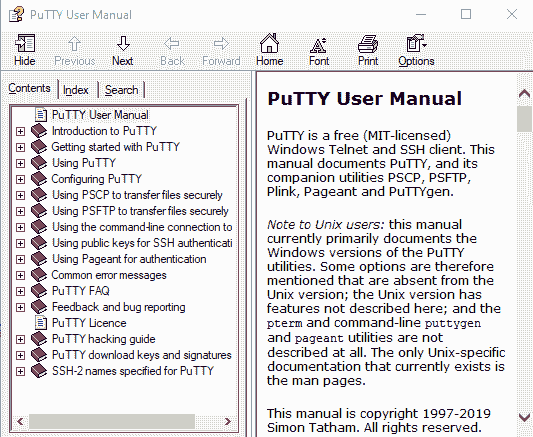

# 第八章：7 SSH 强化

## 加入我们的书籍社区，和我们一起在 Discord 上讨论

[`packt.link/SecNet`](https://packt.link/SecNet)


**安全外壳**（**SSH**）套件是 Linux 管理员必备的工具之一。它使你能够在自己的办公桌前，甚至在家中，轻松管理 Linux 服务器。无论怎样，总比穿上大衣、绕过安保检查进入冰冷的服务器房间要好得多。**安全**外壳中的“安全”意味着你输入或传输的所有内容都会被加密，这就消除了通过插入嗅探器到你的网络中获取敏感数据的可能性。

到目前为止，在你的 Linux 生涯中，你应该已经知道如何使用安全外壳（SSH）进行远程登录和远程文件传输。你可能不知道的是，SSH 的默认配置其实是相当不安全的。在本章中，我们将探讨如何通过各种方式强化默认配置。我们将讨论如何使用比默认更强的加密算法，如何设置无密码认证，以及如何为安全文件传输协议（SFTP）的用户设置一个“监狱”。作为额外内容，我们还将探讨如何扫描 SSH 服务器，查找易受攻击的配置，以及如何通过 **安全外壳文件系统**（**SSHFS**）共享远程目录。

在本章中，我们将覆盖以下主题：

+   确保禁用 SSH 协议 1

+   创建和管理无密码登录的密钥

+   禁用 root 用户登录

+   禁用用户名/密码登录

+   启用双因素认证

+   配置带有强加密算法的安全外壳

+   在 RHEL 8/9 类型的系统上设置系统范围的加密策略

+   RHEL 8/9 类型系统上的 FIPS 模式

+   配置更详细的日志记录

+   使用白名单和 TCP Wrappers 进行访问控制

+   配置自动注销和安全横幅

+   其他杂项安全设置

+   为不同的主机设置不同的配置

+   为不同的用户和组设置不同的配置

+   扫描 SSH 服务器

+   为 SFTP 用户设置 chroot 环境

+   使用 SSHFS 设置共享目录

+   从 Windows 桌面远程连接

所以，如果你准备好了，让我们开始吧。

## 确保禁用 SSH 协议 1

在这本书的前两版中，我曾告诉过你 SSH 协议版本 1 存在严重缺陷，应该始终确保它在 `/etc/ssh/sshd_config` 文件中没有启用。如今，你不需要再担心这个问题，因为 SSH 协议 1 已经消失，成了过去的事。所以，庆祝一下吧！

## 创建和管理无密码登录的密钥

Secure Shell 套件是一个非常棒的远程服务器通信工具集。你可以使用`ssh`组件远程登录到远程机器的命令行界面，也可以使用`scp`或`sftp`来安全地传输文件。使用这些 SSH 组件的默认方式是使用一个人正常的 Linux 用户帐户的用户名。所以，从我的 OpenSUSE 工作站的终端登录到远程机器会是这样的：

```
donnie@linux-0ro8:~> ssh donnie@192.168.0.8
donnie@192.168.0.8's password:
```

虽然确实用户名和密码是以加密格式通过网络传输，使得恶意行为者很难拦截，但这仍然不是最安全的做法。问题在于，攻击者可以使用自动化工具对 SSH 服务器执行暴力破解密码攻击。僵尸网络，如 Hail Mary Cloud，会在互联网上进行持续扫描，寻找启用了 SSH 的互联网-facing 服务器。

如果一个僵尸网络发现服务器允许通过用户名和密码进行 SSH 访问，它将发起暴力破解密码攻击。不幸的是，这种攻击已经成功过很多次，尤其是在服务器管理员允许 root 用户通过 SSH 登录时。

> 这篇较旧的文章提供了更多关于 Hail Mary Cloud 僵尸网络的细节：[`futurismic.com/2009/11/16/the-hail-mary-cloud-slow-but-steady-brute-force-password-guessing-botnet/`](http://futurismic.com/2009/11/16/the-hail-mary-cloud-slow-but-steady-brute-force-password-guessing-botnet/)。

在接下来的部分，我们将讨论两种方法来帮助防止这些类型的攻击：

+   通过公钥交换启用 SSH 登录

+   禁用 root 用户通过 SSH 登录

现在，让我们创建一些密钥。

### 创建用户的 SSH 密钥集

每个用户都有能力创建自己的私钥和公钥集。无论用户的客户端机器运行的是 Linux、macOS、Windows 上的 Cygwin，还是 Windows 上的 Bash Shell，都不影响。所有情况下，步骤都是完全一样的。

你可以创建几种不同类型的密钥，3072 位 RSA 密钥通常是默认选项。直到最近，2048 位的 RSA 密钥被认为在可预见的未来足够强大。但现在，美国**国家标准与技术研究院**（**NIST**）的最新指导建议使用至少 3072 位的 RSA 密钥或至少 384 位的 **椭圆曲线数字签名算法**（**ECDSA**）密钥。（你有时会看到这些 ECDSA 密钥被称为 *P-384*。）他们的理由是，想要让我们为量子计算做准备，因为量子计算将变得如此强大，以至于会使任何较弱的加密算法变得过时。当然，量子计算目前还不实际可行，而且到目前为止，它似乎总是被预测为“十年后”的事情，不管现在是什么年份。但即使我们忽略量子问题，我们依然必须承认，即使是我们现在的非量子计算机，也在不断变得更强大。因此，采用更强的加密标准还是一个不错的选择。

> 要查看 NIST 推荐的加密算法和推荐的密钥长度，请访问 [`cryptome.org/2016/01/CNSA-Suite-and-Quantum-Computing-FAQ.pdf`](https://cryptome.org/2016/01/CNSA-Suite-and-Quantum-Computing-FAQ.pdf)。

接下来的几个演示，我们切换到 Ubuntu 22.04 客户端。要创建一个 3072 位的 RSA 密钥对，只需执行以下操作：

```
donnie@ubuntu2204-packt:~$ ssh-keygen
```

我们不需要使用任何选项切换，因为命令默认会创建一个 3072 位的 RSA 密钥对。当提示输入密钥的存储位置和名称时，我只需按下 **Enter** 键接受默认设置。你也可以将私钥设置为空白密码，但这并不是推荐的做法。

请注意，如果你为密钥文件选择了不同的名称，你需要输入完整的路径才能正常工作。例如，在我的情况下，我可以指定 `donnie_rsa` 密钥的路径为 `/home/donnie/.ssh/donnie_rsa`。

你将在 `.ssh` 目录中看到你的新密钥：

```
donnie@ubuntu2204-packt:~$ ls -l .ssh
total 16
-rw------- 1 donnie donnie    0 Oct  6 22:09 authorized_keys
-rw------- 1 donnie donnie 2655 Nov  1 19:49 id_rsa
-rw-r--r-- 1 donnie donnie  577 Nov  1 19:49 id_rsa.pub
-rw------- 1 donnie donnie  978 Oct 26 20:41 known_hosts
-rw-r--r-- 1 donnie donnie  142 Oct 26 20:41 known_hosts.old
donnie@ubuntu2204-packt:~$
```

`id_rsa` 密钥是私钥，仅对我具有读写权限。`id_rsa.pub` 公钥必须是全局可读的。对于 ECDSA 密钥，默认长度为 256 位。如果你选择使用 ECDSA 而非 RSA，可以按照以下步骤创建一个强度为 384 位的密钥：

```
donnie@ubuntu2204-packt:~$ ssh-keygen -t ecdsa -b 384
```

无论哪种方式，当你查看 `.ssh` 目录时，会发现 ECDSA 密钥的命名方式与 RSA 密钥不同：

```
donnie@ubuntu2204-packt:~$ ls -l .ssh/id*
-rw------- 1 donnie donnie  667 Nov  1 19:55 .ssh/id_ecdsa
-rw-r--r-- 1 donnie donnie  229 Nov  1 19:55 .ssh/id_ecdsa.pub
-rw------- 1 donnie donnie 2655 Nov  1 19:49 .ssh/id_rsa
-rw-r--r-- 1 donnie donnie  577 Nov  1 19:49 .ssh/id_rsa.pub
donnie@ubuntu2204-packt:~$
```

椭圆曲线算法的美妙之处在于，它们看似较短的密钥长度，与 RSA 长密钥的安全性相当。而且，即使是最大的 ECDSA 密钥，也比 RSA 密钥消耗更少的计算能力。你能使用的 ECDSA 最大密钥长度为 521 位。（是的，你没看错，是 521 位，不是 524 位。）那么，你可能会想，*为什么我们不直接使用 521 位密钥呢？* 其实，主要原因是 521 位密钥不被 NIST 推荐。有些人担心它们可能会受到**填充攻击**，这可能会让坏人破解加密并窃取你的数据。

如果你查看 `ssh-keygen` 的手册页，你会看到你也可以创建一种 `Ed25519` 类型的密钥，这种密钥有时会被称为 `curve25519`。这种密钥没有被列入 NIST 推荐的算法列表，也不被 FIPS 法规允许，但仍然有一些人喜欢使用它。

如果操作系统的随机数生成器存在缺陷，RSA 和 DSA 在创建签名时可能会泄露私钥数据。而 `Ed25519` 在创建签名时不需要随机数生成器，因此不会受到这个问题的影响。此外，`Ed25519` 的编码方式使其在面对侧信道攻击时更为安全。（侧信道攻击是指攻击者试图利用操作系统中的漏洞，而非加密算法本身的漏洞。）

一些人喜欢 `Ed25519` 的第二个原因恰恰是因为它*不*在 NIST 的推荐列表上。这些人或多或少不信任政府机构的推荐，可能有他们的理由。

> 很多年前，在本世纪初，曾经有一起丑闻涉及**双椭圆曲线确定性随机比特生成器**（**Dual_EC_DRBG**）。这是一个用于椭圆曲线密码学的随机数生成器。问题在于，早期一些独立研究者发现，它有能力被任何了解该能力的人插入*后门*。恰好，唯一被允许了解这种能力的人是美国**国家安全局**（**NSA**）的工作人员。在 NSA 的坚持下，NIST 将 Dual_EC_DRBG 列入了推荐算法列表，并且一直保留到 2014 年 4 月才被移除。你可以通过以下链接了解更多细节：
> 
> > [`www.pcworld.com/article/2454380/overreliance-on-the-nsa-led-to-weak-crypto-standard-nist-advisers-find.html`](https://www.pcworld.com/article/2454380/overreliance-on-the-nsa-led-to-weak-crypto-standard-nist-advisers-find.html)
> > 
> > [`www.math.columbia.edu/~woit/wordpress/?p=7045`](http://www.math.columbia.edu/~woit/wordpress/?p=7045)
> > 
> > 你可以在这里阅读有关 Ed25519 的详细信息：[`ed25519.cr.yp.to/`](https://ed25519.cr.yp.to/)。

`Ed25519`只有一种密钥大小，那就是 256 位。所以，要创建一个`curve25519`密钥，只需这样做：

```
donnie@ubuntu2204-packt:~$ ssh-keygen -t ed25519
```

这是我创建的密钥：

```
donnie@ubuntu2204-packt:~$ ls -l .ssh/*25519*
-rw------- 1 donnie donnie 464 Nov  1 20:35 .ssh/id_ed25519
-rw-r--r-- 1 donnie donnie 105 Nov  1 20:35 .ssh/id_ed25519.pub
donnie@ubuntu2204-packt:~$
```

然而，`ed25519`也有一些潜在的缺点：

+   首先，它不被旧版 SSH 客户端支持。然而，如果你团队中的每个人都在使用当前操作系统并且使用最新的 SSH 客户端，这应该不是问题。

+   第二点是，它只支持一种特定的密钥长度，这相当于 256 位椭圆曲线算法或 3000 位 RSA 算法。因此，它可能不像我们之前讲解的其他算法那样具有未来适应性。

+   最后，如果你的组织需要遵循 NIST 的推荐或 FIPS 的要求，你就不能使用它。

好的，还有一种密钥类型我们没有讲过。那就是传统的 DSA 密钥，如果你告诉`ssh-keygen`，它仍然会创建这种密钥。但不要这么做。DSA 算法已经老旧、笨拙，并且按照现代标准非常不安全。因此，面对 DSA，直接说*不*。

### 将公钥传输到远程服务器

将我的公钥传输到远程服务器，使得服务器可以轻松识别我和我的客户端机器。在我将公钥传输到远程服务器之前，我需要将私钥添加到我的会话密钥环中。这需要两条命令。（一条命令启动`ssh-agent`，另一条命令则将私钥实际添加到密钥环中）：

```
donnie@ubuntu2204-packt:~$ exec /usr/bin/ssh-agent $SHELL
donnie@ubuntu2204-packt:~$ ssh-add
Enter passphrase for /home/donnie/.ssh/id_rsa: 
Identity added: /home/donnie/.ssh/id_rsa (donnie@ubuntu2204-packt)
Identity added: /home/donnie/.ssh/id_ecdsa (donnie@ubuntu2204-packt)
Identity added: /home/donnie/.ssh/id_ed25519 (donnie@ubuntu2204-packt)
donnie@ubuntu2204-packt:~$
```

最后，我可以将我的公钥传输到我的 AlmaLinux 9 服务器，其地址为`192.168.0.17`：

```
donnie@ubuntu2204-packt:~$ ssh-copy-id donnie@192.168.0.17
The authenticity of host '192.168.0.17 (192.168.0.17)' can't be established.
ED25519 key fingerprint is SHA256:GkpFwJdpWRQ5GawgFEz9bgDSny//E1I5aLGkjU9DWWY.
This key is not known by any other names
Are you sure you want to continue connecting (yes/no/[fingerprint])? yes
/usr/bin/ssh-copy-id: INFO: attempting to log in with the new key(s), to filter out any that are already installed
/usr/bin/ssh-copy-id: INFO: 3 key(s) remain to be installed -- if you are prompted now it is to install the new keys
donnie@192.168.0.17's password: 
Number of key(s) added: 3
Now try logging into the machine, with:   "ssh 'donnie@192.168.0.17'"
and check to make sure that only the key(s) you wanted were added.
donnie@ubuntu2204-packt:~$
```

通常，你只会为你选择的任何类型创建一对密钥。正如你在这里看到的，我已经创建了三对密钥，每种类型一对。所有三个私钥都被添加到了我的会话密钥环中，所有三个公钥也都被传输了到远程服务器。

下次我登录时，我将使用密钥交换，不需要输入密码：

```
donnie@ubuntu2204-packt:~$ ssh donnie@192.168.0.17
Last login: Tue Nov  1 16:52:27 2022
[donnie@donnie-ca ~]$ 
```

如我之前提到的，通常你会为每台机器只创建一对密钥。然而，也有例外。有些管理员更喜欢为他们管理的每个服务器使用不同的密钥对，而不是为所有服务器使用相同的密钥对。一个方便的做法是，创建与各自服务器主机名匹配的密钥文件名。然后，你可以使用`-i`选项来指定你想使用的密钥对。

在这个示例中，我只有一个服务器，但我为它准备了多个密钥。假设我更喜欢使用`Ed25519`密钥：

```
donnie@ubuntu2204-packt:~$ ssh -i ~/.ssh/id_ed25519 donnie@192.168.0.17
Last login: Tue Nov  1 16:56:43 2022 from 192.168.0.14
[donnie@donnie-ca ~]$ 
```

所以，现在你可能在想，*如果我可以不输入密码就登录，那怎么保证安全？* 答案是，一旦你关闭了用于登录的客户端机器的终端窗口，私钥就会从你的会话密钥环中移除。当你打开一个新的终端并尝试登录远程服务器时，你会看到这个：

```
donnie@ubuntu2204-packt:~$ ssh donnie@192.168.0.17
Enter passphrase for key '/home/donnie/.ssh/id_rsa': 
Last login: Tue Nov  1 16:58:22 2022 from 192.168.0.14
[donnie@donnie-ca ~]$
```

现在，每次我登录到这个服务器时，都需要输入私钥的密码短语，直到我按照上一节中展示的两个命令将其重新添加到会话密钥环中。

#### 实验操作 – 创建和传输 SSH 密钥

在这个实验中，你将使用一台虚拟机（VM）作为客户端，另一台虚拟机作为服务器。或者，如果你使用的是 Windows 主机，你可以使用 Cygwin、PowerShell 或内置的 Windows Bash shell 作为客户端。（不过需要注意，PowerShell 和 Windows Bash shell 会将密钥文件存储在不同的位置。）如果你使用的是 Mac 或 Linux 主机，你可以使用主机自带的命令行终端作为客户端。无论哪种情况，过程都是一样的。

对于服务器虚拟机（VM），使用 Ubuntu 22.04 或 CentOS 7。

> 这个过程在 AlmaLinux 8 和 9 上同样适用。然而，我们将在接下来的实验中继续使用这台虚拟机，而 AlmaLinux 有一些特殊的考虑事项，我们稍后会进一步了解。

让我们开始吧：

1.  在客户端机器上，创建一对 384 位的椭圆曲线密钥。接受默认的文件名和位置，并创建一个密码短语：

```
ssh-keygen -t ecdsa -b 384
```

1.  查看密钥，注意权限设置：

```
ls -l ./ssh
```

1.  将你的私钥添加到会话密钥环中。提示时，输入你的密码短语：

```
exec /usr/bin/ssh-agent $SHELL
ssh-add
```

1.  将公钥传输到服务器虚拟机。当提示时，输入你在服务器虚拟机上的用户账户密码。（在以下命令中替换你自己的用户名和 IP 地址。）

```
ssh-copy-id donnie@192.168.0.7
```

1.  按照通常的方式登录到服务器虚拟机：

```
ssh donnie@192.168.0.7
```

1.  查看在服务器虚拟机上创建的 `authorized_keys` 文件：

```
ls -l .ssh
cat .ssh/authorized_keys
```

1.  从服务器虚拟机登出，并关闭客户端的终端窗口。打开另一个终端窗口，尝试重新登录到服务器。这次，你应该会被提示输入私钥的密码短语。

1.  重新从服务器虚拟机登出，并将你的私钥重新添加到客户端的会话密钥环中。提示时，输入私钥的密码短语：

```
exec /usr/bin/ssh-agent $SHELL
ssh-add
```

只要你保持客户端的这个终端窗口打开，你就能随时登录到服务器虚拟机，而无需输入密码。然而，当你关闭终端窗口时，你的私钥会被从会话密钥环中移除。

1.  保留你的服务器虚拟机，因为稍后我们还会用到它。

你已完成实验 – 恭喜！

我们到目前为止所做的很好，但还是不完全够。一个问题是，如果你换到另一台客户端机器，你仍然可以使用正常的用户名/密码认证进行登录。没关系，我们稍后会解决这个问题。

### 禁用 root 用户登录

几年前，有一个相对著名的案例，恶意行为者成功地在东南亚某些地区的多个 Linux 服务器上植入了恶意软件。坏人能这么轻松地做到这一点，主要有三个原因：

+   涉及的面向互联网的服务器设置为使用用户名/密码认证进行 SSH 登录。

+   允许 root 用户通过 SSH 登录。

+   用户密码，包括 root 用户的密码，异常弱。

这一切意味着，Hail Mary 僵尸网络轻松通过暴力破解进入。

不同的发行版对 root 用户登录有不同的默认设置。在你 CentOS 7 或 AlmaLinux 8 机器的`/etc/ssh/sshd_config`文件中，你会看到这一行：

```
#PermitRootLogin yes
```

与大多数配置文件不同，`sshd_config`中的注释行定义了安全外壳守护进程的默认设置。因此，这一行表示允许 root 用户通过 SSH 登录。要更改这一点，我将去掉注释符号并将设置更改为`no`：

```
PermitRootLogin no
```

为了使新的设置生效，我将重新加载 SSH 守护进程，在 CentOS 和 AlmaLinux 上该进程名为`sshd`，而在 Ubuntu 上是`ssh`：

```
sudo systemctl reload sshd
```

在 Ubuntu 机器上，默认设置看起来略有不同：

```
PermitRootLogin prohibit-password
```

这意味着 root 用户被允许登录，但仅通过公钥交换。如果你确实需要允许 root 用户登录，这可能足够安全。但是在大多数情况下，你会希望强制管理员用户使用他们的正常用户帐户登录，并使用`sudo`进行管理员操作。因此，在大多数情况下，你仍然希望将此设置更改为`no`。

在你的 AlmaLinux 9 机器上，你会看到其`PermitRootLogin`默认设置为`prohibit-password`。

> 请注意，如果你在云服务（如 Rackspace 或 Vultr）上部署 Linux 实例，服务提供商会让你使用 root 用户帐户登录虚拟机。你需要做的第一件事是创建自己的普通用户帐户，使用该帐户重新登录，禁用 root 用户帐户，并在`sshd_config`中禁用 root 用户登录。Microsoft Azure 是这个规则的一个例外，因为它会为你自动创建一个非特权用户帐户。

你将在接下来的几分钟内练习这个操作。

### 禁用用户名/密码登录

这是你只有在与客户端设置了密钥交换之后才应该做的事情。否则，客户端将无法进行远程登录。

#### 实践实验 - 禁用 root 登录和密码验证

对于这个实验，使用上一个实验中用过的相同服务器虚拟机。我们开始吧：

1.  在 Ubuntu、CentOS 或 AlmaLinux 8 服务器虚拟机上，查找`sshd_config`文件中的这一行：

```
#PasswordAuthentication yes
```

1.  移除注释符号，将参数值更改为`no`，并重新加载 SSH 守护进程。现在该行应该像这样：

```
PasswordAuthentication no
```

现在，当僵尸网络扫描你的系统时，它们会发现暴力破解密码攻击毫无用处。然后它们就会离开，不再打扰你。

1.  查找以下两行中的一行，具体取决于服务器是 Ubuntu 还是 CentOS 7/AlmaLinux 8 虚拟机：

```
#PermitRootLogin yes
#PermitRootLogin prohibit-password
```

1.  取消注释这一行，并将其更改为以下内容：

```
PermitRootLogin no
```

1.  重新加载 SSH 守护进程，使其读取新的更改。在 Ubuntu 上，操作如下：

```
sudo systemctl reload ssh
```

在 CentOS/AlmaLinux 上，操作如下：

```
sudo systemctl reload sshd
```

1.  尝试从你在上一个实验中使用的客户端登录服务器虚拟机。

1.  尝试从你没有创建密钥对的另一个客户端登录服务器虚拟机。（你应该无法登录。）

1.  和之前一样，保留服务器虚拟机，因为稍后我们会继续使用它。

你已完成实验——恭喜！

现在我们已经讲解了如何在客户端创建公私钥对以及如何将公钥传输到服务器，接下来讲讲如何设置双重身份验证。

### 启用双重身份验证

双重身份验证可以提供额外的保护层。如果你拥有智能手机，可以通过**Google Authenticator**来设置，它会为你提供一个**一次性密码**，用于在本地终端登录、执行`sudo`命令或通过 SSH 远程登录。在开始之前，然而，有几点注意事项你需要理解：

+   要在 Linux 机器上使其工作，你需要安装一个 Google 未提供的 PAM 模块。它在一些 Linux 发行版的仓库中可以找到，但并非所有发行版都包含。（当然，你也可以从 GitHub 仓库下载源代码并自行编译，但这超出了本书的范围。）

+   这个 PAM 模块的创建者写了一些文档，但并不太有用。如果你搜索文档，你会发现一些博客文章，其中的步骤比没有文档更糟糕，因为如果你照做，*它们会*破坏你的系统。

+   你可以将机器设置为要求 Google 身份验证用于全局使用，或者仅仅用于通过 SSH 登录。（全局使用意味着在本地终端登录、使用`sudo`、*以及*通过 SSH 远程登录时都需要输入 Authenticator 代码。）

+   如果你正在处理多个用户，每个用户都需要为自己的账户设置 Google Authenticator，并使用自己的智能手机。

现在，我们已经解决了这个问题，接下来让我们为 Ubuntu 22.04 服务器设置 Google Authenticator，以用于本地登录和`sudo`命令：

> 请注意，这个 PAM 模块在普通的 Ubuntu 仓库中有，而在 RHEL 8 类型的发行版的 EPEL 仓库中也有。它在 RHEL 9 类型的发行版中完全不可用。

#### 实验操作——在 Ubuntu 22.04 上设置双重身份验证

对于本实验，从一个全新的 Ubuntu 22.04 虚拟机开始，该虚拟机未设置公钥认证。（这样可以避免在执行此过程时出现很多困惑。）

1.  在你的智能手机上安装 Google Authenticator。（它在 Android 和 iPhone 的常规应用商店中都有提供。）

1.  在你的 Ubuntu 虚拟机上，安装`libpam-google-authenticator`包，如下所示：

```
sudo apt install libpam-google-authenticator
```

1.  对于此步骤，如果你尚未操作，请使用 SSH 通过主机机器的 GUI 类型终端远程登录 Ubuntu 虚拟机。（这是因为你可能需要调整窗口大小以使下一步操作生效。）现在，从这个 GUI 类型终端，运行`google-authenticator`应用，操作如下：

```
google-authenticator
```

1.  屏幕上会显示一个大的二维码。如果整个二维码图形没有显示出来，使用图形界面终端的控制按钮进行缩小，直到整个图形可见为止。

1.  打开你智能手机上的 Google Authenticator 应用，并点击屏幕右下角的 `+` 符号。选择 **扫描二维码** 选项，然后拍摄你的二维码图片。

1.  在你的智能手机上，注意到 Ubuntu 虚拟机的新条目已经添加到列表中。在 Ubuntu 虚拟机上，输入与该条目一起显示的验证码。

1.  接下来，你会在 Ubuntu 终端上看到紧急的备用验证码。把它们抄下来并保存在安全的地方。（如果你丢失了手机，你将使用这些备用验证码来登录。）

1.  接下来，你会被问到一系列问题。对于所有问题，输入 `y`。

1.  在此步骤中，你将为本地终端登录和 `sudo` 操作设置双重身份验证。用你喜欢的文本编辑器打开 `/etc/pam.d/common-auth` 文件。将 `auth required pam_google_authenticator.so` 行作为第一个参数添加进去。文件的顶部部分现在应该是这样的：

```
#
# /etc/pam.d/common-auth - authentication settings common to all services
#
# This file is included from other service-specific PAM config files,
. . .
. . .
auth required pam_google_authenticator.so
# here are the per-package modules (the "Primary" block)
. . .
. . .
```

> 某些博客文章告诉你将这一行添加到文件的*末尾*。请注意，如果你这么做，你*将*会被锁定在机器外面，届时需要执行紧急程序才能重新进入并修复它。每次编辑 PAM 文件时，确保按照正确的顺序放置指令是至关重要的。（如果你想知道，我将在*第十六章*，*忙碌小蜜蜂的安全技巧与窍门* 中展示这个紧急程序。）

1.  在 Ubuntu 虚拟机的本地终端上，登出然后重新登录。当提示时，输入来自智能手机应用的验证码。

1.  执行一个需要 `sudo` 权限的命令。你应该看到类似这样的提示：

```
donnie@ubuntu2204-packt:~$ sudo nft list ruleset
Verification code: 
[sudo] password for donnie:
. . .
. . .
Enter the verification code at the prompt.
```

> 请注意，直到 `sudo` 定时器超时之前，你不会再需要输入验证码。

1.  从你的主机或其他虚拟机，通过 SSH 远程登录到 Ubuntu 虚拟机。你仍然能够这样做，因为我们还没有配置 `/etc/ssh/sshd_config` 文件。用文本编辑器打开 `sshd_config` 文件，将 `KbdInteractiveAuthentication no` 行改为 `KbdInteractiveAuthentication yes`。

1.  重新加载安全外壳配置：

```
sudo systemctl reload ssh
```

1.  再次尝试从你的主机或其他虚拟机登录。这时，你应该会被提示输入你的验证码。

1.  现在，假设你的组织需要为远程 SSH 登录设置双重身份验证，但不需要为本地登录或 `sudo` 操作设置双重身份验证。让我们修改配置，使得只有远程用户需要输入验证码。用文本编辑器打开 `/etc/pam.d/common-auth` 文件，移除在第 9 步中插入的那一行。

1.  用文本编辑器打开`/etc/pam.d/sshd`文件，并在文件顶部的`@include common-auth`行下方添加该行。文件的顶部部分现在应该如下所示：

```
PAM configuration for the Secure Shell service
      # Standard Un*x authentication.
     @include common-auth
     auth required pam_google_authenticator.so
```

现在，你应该可以登录到本地终端并执行`sudo`操作，而无需输入验证码。相反，你只需要在远程登录时输入验证码。

1.  实验结束。

接下来，让我们看一下如何在我们的 Ubuntu 机器上使用 Google Authenticator 配合密钥交换。

#### 实操实验--在 Ubuntu 上使用 Google Authenticator 配合密钥交换

对于本实验，请使用与上一个实验相同的 Ubuntu 虚拟机。

1.  在主机或另一台虚拟机上，创建一对密钥并将其传输到 Ubuntu 虚拟机，就像在*创建和传输 SSH 密钥*实验中那样。这次，在执行`ssh-copy-id`命令时，系统应该会提示你输入验证码。

1.  在 Ubuntu 虚拟机上，用文本编辑器打开`/etc/ssh/sshd_config`文件。这次，不是修改`#PasswordAuthentication yes`这一行，而是在`KbdInteractiveAuthentication yes`这一行下方添加以下这一行：

```
AuthenticationMethods publickey keyboard-interactive:pam
```

重新加载 SSH 配置后，你会发现，如果你从已设置密钥交换的机器登录，就可以通过密钥交换进行远程登录。如果从没有设置密钥交换的机器登录，你仍然可以使用密码和验证码进行登录。所以，目前我们还没有实现真正的双因素认证。

1.  要要求同时使用密钥认证和 Google Authenticator 验证，请将上述行更改为如下所示：

```
AuthenticationMethods publickey,keyboard-interactive:pam
```

1.  重新加载 SSH 配置后，你只允许从已设置密钥交换的机器登录。现在你实际上拥有了三因素认证，因为你仍然会被要求输入常规登录密码。

1.  要禁用密码登录，以便只使用密钥交换和验证码，请用文本编辑器打开`/etc/pam.d/sshd`文件。在文件的最顶部，找到`@include common-auth`行并将其更改为`#@include common-auth`。

1.  通过尝试从没有进行密钥交换设置的虚拟机登录，来验证密钥交换是否有效。（你应该无法登录。）

1.  就这些。实验结束。

现在，让我们看看我们能在 AlmaLinux 8 上做些什么。

#### 实操实验--在 AlmaLinux 8 上设置双因素认证

对于本实验，我假设你已经在智能手机上安装了 Google Authenticator 应用。

Authenticator PAM 模块不在 RHEL 9 发行版的任何软件库中，但它在 RHEL 8 发行版的 EPEL 软件库中。（在你阅读本文时，这可能会发生变化，因此，如果你想在 AlmaLinux 9 上尝试此操作，检查一下也无妨。）所以，启动一个新的 AlmaLinux 8 虚拟机，让我们开始吧。

1.  以这种方式安装 PAM 模块：

```
sudo dnf install epel-release
sudo dnf install google-authenticator qrencode-libs
```

请注意，您需要 `qrencode-libs` 包才能生成 QR 码。

1.  从主机机器的 GUI 终端，使用 SSH 远程登录到 AlmaLinux 8 VM。这将允许您调整 QR 码图像的大小，以便您可以用智能手机拍照。然后，像这样运行 `google-authenticator` 应用：

```
google-authenticator -s ~/.ssh/google_authenticator
```

1.  这次，我们在 `.ssh` 目录内创建 `google_authenticator` 文件，因为 AlmaLinux 已设置为使用 SELinux。当您启用 Authenticator 尝试远程登录时，SSH 守护程序将尝试写入 `google_authenticator` 文件。SELinux 阻止 SSH 写入 `.ssh` 目录之外的文件。（我们将在《第十章》《使用 SELinux 和 AppArmor 实施强制访问控制》中详细讨论 SELinux。）

1.  跟随 Authenticator 设置，与 *在 Ubuntu 22.04 上设置双因素身份验证* 实验中的第 4 至 8 步骤相同。

1.  在您的文本编辑器中打开 `/etc/pam.d/sshd` 文件。在文件的末尾添加此行：

```
auth required pam_google_authenticator.so secret=/home/${USER}/.ssh/google_authenticator
```

（请注意，打印页面上的行会换行。）

1.  在您的文本编辑器中打开 `/etc/ssh/sshd_config` 文件。找到 `#ChallengeResponseAuthentication no` 行，并将其更改为 `ChallengeResponseAuthentication yes`。

1.  重新加载或重启 `sshd` 服务：

```
sudo systemctl reload sshd
```

1.  设置您创建的 google_authenticator 文件的适当 SELinux 安全上下文：

```
cd
sudo restorecon .ssh/google_authenticator
```

1.  退出远程会话，然后尝试重新登录。这次，系统会提示您输入验证码。

接下来，让我们为 AlmaLinux 设置密钥交换。

#### 实验室实践--在 AlmaLinux 8 上使用密钥交换与 Google Authenticator

这与 Ubuntu 的设置基本相同，只有少许差异。

1.  将公钥从主机机器传输到 AlmaLinux 8 机器，方法与 *创建和传输 SSH 密钥* 实验中的相同。

1.  在 `/etc/ssh/sshd_config` 文件中，将 `#PasswordAuthentication yes` 行更改为 `PasswordAuthentication no`，然后重新加载 SSH 配置。现在，您将只使用密钥交换登录，完全绕过 Authenticator。让我们修复这些问题，以便您同时使用两者。

1.  在 `/etc/ssh/sshd_config` 文件中，在 `PasswordAuthentication no` 行的下面添加以下行：

```
AuthenticationMethods publickey,password publickey,keyboard-interactive
```

1.  重新加载 SSH 配置后，您将具有三因素身份验证，因为您将需要输入密码和验证代码以及密钥交换。

1.  如果需要，您可以轻松禁用密码提示，仅使用密钥交换和验证代码。在 `/etc/pam.d/sshd` 文件中，找到文件顶部的 `auth substack password-auth` 行，并将其更改为 `#auth substack password-auth`。

1.  这就是 Google Authenticator 的全部内容。

在下一节中，让我们确保仅使用最强的加密算法。

### 配置使用强加密算法的安全 Shell

正如我之前提到的，当前的 NIST 推荐标准，**商业国家安全算法套件**（**CNSA 套件**），涉及使用比以前需要使用的更强的算法和更长的密钥。我将在这个表格中总结新的推荐内容：

| **算法** | **用途** |
| --- | --- |
| RSA，3,072 位或更大 | 密钥协商和数字签名 |
| Diffie-Hellman（DH），3,072 位或更大 | 密钥协商 |
| ECDH 与 NIST P-384 | 密钥协商 |
| ECDSA 与 NIST P-384 | 数字签名 |
| SHA-384 | 完整性 |
| AES-256 | 保密性 |

在其他出版物中，您可能会看到 NIST Suite B 是推荐的加密算法标准。Suite B 是一个较旧的标准，已被 CNSA Suite 取代。

另一个您可能需要处理的加密标准是美国政府发布的**联邦信息处理标准**（**FIPS**）。当前版本是 FIPS 140-3，于 2019 年 9 月 22 日获得最终批准。

#### 理解 SSH 加密算法

SSH 与对称和非对称加密的组合工作方式类似于传输层安全性工作方式。SSH 客户端通过使用公钥方法开始此过程，以与 SSH 服务器建立非对称会话。一旦建立了此会话，两台机器可以同意并交换一个秘密代码，用于建立对称会话。（与 TLS 之前看到的情况类似，出于性能原因，我们希望使用对称加密，但我们需要使用非对称会话执行秘密密钥交换。）为了执行这种魔术，我们需要四类加密算法，这些算法将在服务器端进行配置。它们是：

+   **Ciphers**：这些是对称算法，用于加密客户端和服务器彼此交换的数据。

+   **HostKeyAlgorithms**：这是服务器可以使用的主机密钥类型列表。

+   **KexAlgorithms**：这些是服务器可以使用的算法，用于执行对称密钥交换。

+   **MAC**：消息认证码是加密数据传输中的哈希算法，用于加密数据的签名。这确保了数据的完整性，并告诉您是否有人篡改了您的数据。

最佳的了解方法是查看`sshd_config`手册页面，像这样：

```
man sshd_conf
```

我可以使用任何虚拟机来演示这一点。不过，现在我选择 CentOS 7，除非另有说明。（不同的 Linux 发行版和版本的默认和可用算法列表将不同。）另外，请注意，为了演示这一点，我们要查看`sshd_config`手册页面以查看**可用**和**已启用**算法的列表。CentOS 7 和 AlmaLinux 8 的手册页面中包含**已启用**列表，但 AlmaLinux 9 的手册页面中没有。

首先，让我们看一下支持的密码列表。滚动到手册页面的底部，直到找到它们：

```
3des-cbc
aes128-cbc
aes192-cbc
aes256-cbc
aes128-ctr
aes192-ctr
aes256-ctr
aes128-gcm@openssh.com
aes256-gcm@openssh.com
arcfour
arcfour128
arcfour256
blowfish-cbc
cast128-cbc
chacha20-poly1305@openssh.com
```

然而，并非所有这些支持的密码算法都已启用。在该列表下方，我们可以看到默认启用的密码算法列表：

```
chacha20-poly1305@openssh.com,
aes128-ctr,aes192-ctr,aes256-ctr,
aes128-gcm@openssh.com,aes256-gcm@openssh.com,
aes128-cbc,aes192-cbc,aes256-cbc,
blowfish-cbc,cast128-cbc,3des-cbc
```

接下来，按字母顺序排列的是 **HostKeyAlgorithms**。在 CentOS 7 上的列表如下所示：

```
ecdsa-sha2-nistp256-cert-v01@openssh.com,
ecdsa-sha2-nistp384-cert-v01@openssh.com,
ecdsa-sha2-nistp521-cert-v01@openssh.com,
ssh-ed25519-cert-v01@openssh.com,
ssh-rsa-cert-v01@openssh.com,
ssh-dss-cert-v01@openssh.com,
ecdsa-sha2-nistp256,ecdsa-sha2-nistp384,ecdsa-sha2-nistp521,
ssh-ed25519,ssh-rsa,ssh-dss
```

接下来，向下滚动到 **KexAlgorithms**（即**密钥交换算法**）部分。你将看到一个支持的算法列表，类似于以下内容：

```
curve25519-sha256
curve25519-sha256@libssh.org
diffie-hellman-group1-sha1
diffie-hellman-group14-sha1
diffie-hellman-group-exchange-sha1
diffie-hellman-group-exchange-sha256
ecdh-sha2-nistp256
ecdh-sha2-nistp384
ecdh-sha2-nistp521
```

请注意，这个列表可能会在不同的发行版之间有所不同。例如，RHEL 8/AlmaLinux 8 支持三种额外的更新且更强的算法。它的列表如下所示：

```
curve25519-sha256
curve25519-sha256@libssh.org
diffie-hellman-group1-sha1
diffie-hellman-group14-sha1
diffie-hellman-group14-sha256
diffie-hellman-group16-sha512
diffie-hellman-group18-sha512
diffie-hellman-group-exchange-sha1
diffie-hellman-group-exchange-sha256
ecdh-sha2-nistp256
ecdh-sha2-nistp384
ecdh-sha2-nistp521
```

在 AlmaLinux 9 机器上，你将看到相同的列表，只不过 `sntrup761x25519-sha512@openssh.com` 算法已被添加。

接下来，你将看到默认启用的算法列表：

```
curve25519-sha256,curve25519-sha256@libssh.org,
ecdh-sha2-nistp256,ecdh-sha2-nistp384,ecdh-sha2-nistp521,
diffie-hellman-group-exchange-sha256,
diffie-hellman-group14-sha1,
diffie-hellman-group1-sha1
```

这个列表在不同的 Linux 发行版中也可能有所不同。（不过，在这种情况下，CentOS 7 和 AlmaLinux 8 之间没有差异。）

最后，我们有 MAC 算法。CentOS 7 上默认启用的算法列表如下所示：

```
umac-64-etm@openssh.com,umac-128-etm@openssh.com,
hmac-sha2-256-etm@openssh.com,hmac-sha2-512-etm@openssh.com,
hmac-sha1-etm@openssh.com,
umac-64@openssh.com,umac-128@openssh.com,
hmac-sha2-256,hmac-sha2-512,hmac-sha1,
hmac-sha1-etm@openssh.com
```

要查看你的系统支持的算法列表，可以查看该机器的 `sshd_config` 手册页面，或执行以下 `ssh -Q` 命令：

```
ssh -Q cipher
ssh -Q key
ssh -Q kex
ssh -Q mac
```

当你查看 `/etc/ssh/sshd_config` 文件时，无法看到任何配置这些算法的行。这是因为默认的算法列表是硬编码到 SSH 守护进程中的。你唯一需要配置这些算法的情况是，如果你想启用一个未启用的算法或禁用一个已启用的算法。在此之前，让我们扫描一下系统，查看哪些算法已启用，并检查扫描工具是否能给出任何建议。

### 扫描已启用的 SSH 算法

我们有两种不错的方式来扫描 SSH 服务器。如果你的服务器可以通过互联网访问，你可以访问 SSHCheck 网站 [`sshcheck.com/`](https://sshcheck.com/)。

然后，只需输入服务器的 IP 地址或主机名。如果你已将端口更改为默认端口`22`以外的端口，也需要输入端口号。当扫描完成后，你将看到启用的算法列表，以及哪些算法需要启用或禁用的建议。

如果你想扫描的机器无法从互联网访问，或者即便可以访问，你也可以使用本地扫描工具。在本书的前一版中，我们使用了**ssh_scan**工具。遗憾的是，这个工具已经不再维护，并且在使用 OpenSSL 版本 3 的新版本 Linux 发行版中无法使用。因此，我们可以尝试使用 Nmap 脚本引擎来进行扫描。

#### 动手实验 – 使用 Nmap 扫描

对于本实验，你可以使用任何一台虚拟机。让我们开始吧：

1.  首先，从你的常规发行版仓库安装 `nmap` 包。在 Ubuntu 中，执行以下命令：

```
sudo apt update
sudo apt install nmap
```

在 CentOS 7 中，按照以下步骤操作：

```
sudo yum install nmap
```

在 AlmaLinux 8 或 9 中，按照以下步骤操作：

```
sudo dnf install nmap
```

1.  使用`nmap`和`ssh2-enum-algos.nse`脚本扫描你在之前实验中创建和配置的服务器虚拟机。将这里使用的 IP 地址替换为你自己的 IP 地址。请注意，即使你没有在扫描机上创建密钥对，扫描仍然可以在禁用了用户名/密码身份验证的机器上工作。（但当然，你将无法从扫描机上登录）：

```
nmap --script=ssh2-enum-algos.nse 192.168.0.14
```

请注意，如果你正在扫描启用了防火墙的机器，可能会收到扫描被阻止的错误消息。如果发生这种情况，尝试添加`-Pn`选项，这样命令将变成这样：

```
nmap -Pn --script=ssh2-enum-algos.nse 192.168.0.14
```

1.  重复扫描，但这次将输出保存到一个普通文本文件中，像这样：

```
nmap --script=ssh2-enum-algos.nse 192.168.0.14 -oN ubuntuscan.txt
```

1.  在普通文本编辑器或分页器中打开文本文件。你将看到一个启用的算法的完整列表。将你的结果与适用于你的情况的标准进行比较，例如 NIST 的 CNSA 标准，以确保你启用或禁用了正确的算法。

1.  在你的主机或带有桌面界面的虚拟机上，访问 Shodan 网站：[`www.shodan.io`](https://www.shodan.io)。在搜索框中输入`ssh`并查看出现的面向互联网的 SSH 服务器列表。点击不同的 IP 地址，直到找到一个没有在默认端口`22`上运行的 SSH 服务器。观察该设备启用的算法列表。

1.  扫描设备时，使用`-p`选项扫描不同的端口，像这样：

```
nmap -p 2222 --script=ssh2-enum-algos.nse 192.168.0.14
```

1.  请注意，除了在 Shodan 上看到的启用的算法列表之外，你现在还得到了一个弱算法列表，这些算法是该设备的所有者需要禁用的。

1.  保持这个扫描器和服务器虚拟机的状态，因为在禁用某些算法之后我们还会再次使用它们。

你已经完成了实验，恭喜！

好的，现在让我们禁用一些陈旧、脆弱的东西吧。

### 禁用弱 SSH 加密算法

如我之前所说，我们希望将我们的扫描结果与 NIST 推荐进行比较，并相应地进行配置。但要理解的是，可用的算法列表在不同的 Linux 发行版之间有所不同。为了减少混淆，我将在本节中介绍两个操作流程，一个适用于 Ubuntu 22.04，另一个适用于 CentOS 7。AlmaLinux 8 和 9 有其独特的操作方式，所以我将在下一节中介绍它们。

#### 动手实验 – 禁用弱 SSH 加密算法 – Ubuntu 22.04

对于本次实验，你需要使用作为扫描器的虚拟机，以及另一台用于扫描和配置的 Ubuntu 22.04 虚拟机。让我们开始吧：

1.  如果你还没有这样做，请扫描 Ubuntu 22.04 虚拟机并将输出保存到文件中：

```
nmap --script=ssh2-enum-algos.nse 192.168.0.14 -oN ubuntuscan.txt
```

1.  通过执行以下命令计算文件中的行数：

```
wc -l ubuntuscan.txt
```

1.  在目标 Ubuntu 22.04 虚拟机上，用你喜欢的文本编辑器打开`/etc/ssh/sshd_config`文件。在文件的顶部找到这两行：

```
# Ciphers and keying
#RekeyLimit default none
```

1.  在这两行下面，插入以下三行：

```
Ciphers -aes128-ctr,aes192-ctr,aes128-gcm@openssh.com
KexAlgorithms ecdh-sha2-nistp384
MACs -hmac-sha1-etm@openssh.com,hmac-sha1,umac-64-etm@openssh.com,umac-64@openssh.com,umac-128-etm@openssh.com,umac-128@openssh.com,hmac-sha2-256-etm@openssh.com,hmac-sha2-256
```

1.  在 `Ciphers` 和 `MACs` 行中，您会看到一个以逗号分隔的禁用算法列表，前面有 `-` 符号（只需要一个 `-` 就可以禁用列表中的所有算法）。在 `KexAlgorithms` 行中，没有 `-` 符号。这意味着该行中列出的算法是唯一被启用的算法。

1.  保存文件并重新启动 SSH 守护进程。验证它是否正确启动：

```
sudo systemctl restart ssh
sudo systemctl status ssh
```

1.  再次扫描 Ubuntu 22.04 虚拟机，并将输出保存到另一个文件：

```
nmap --script=ssh2-enum-algos.nse 192.168.0.14 -oN ubuntuscan_modified.txt
```

1.  计算新文件中的行数：

```
wc -l ubuntuscan_modified.txt
```

1.  在扫描虚拟机上，使用 `diff` 比较这两个文件。您应该看到比以前少的算法：

```
diff -y ubuntuscan.txt ubuntuscan_modified.txt
```

> 眼尖的朋友会注意到，我们留下了一个不在 NIST CNSA 列表中的密码算法。`chacha20-poly1305@openssh.com` 是一个轻量级算法，适用于低功耗的手持设备。它是一个优秀且强大的算法，可以替代传统的**高级加密标准**（**AES**）算法，并且具有更高的性能。然而，如果您需要完全符合 NIST CNSA 标准，那么您可能需要禁用它。

您已经完成实验的最后一步——恭喜！

接下来，我们来使用 CentOS 7。

#### 实验操作 – 禁用弱 SSH 加密算法 – CentOS 7

在开始使用 CentOS 7 时，您会注意到两件事：

+   **启用更多算法**：CentOS 7 的默认 SSH 配置启用了比 Ubuntu 22.04 更多的算法。这包括一些非常古老的算法，您真的不希望再看到它们。我说的是像 Blowfish 和 3DES 这样的算法，它们早就应该被淘汰了。

+   **另一种配置技术**：在 CentOS 中，将 `-` 符号放在您想禁用的算法列表前面不起作用。相反，您需要列出所有您希望启用的算法。

对于本实验，您需要一台 CentOS 7 虚拟机和一直在使用的扫描虚拟机。有了这些准备，咱们开始吧：

1.  扫描 CentOS 7 虚拟机并将输出保存到文件中。请注意，由于 CentOS 7 防火墙的原因，您需要添加 `-Pn` 选项：

```
nmap -Pn --script=ssh2-enum-algos.nse 192.168.0.12 -oN centos7scan.txt
```

1.  计算输出文件中的行数：

```
wc -l centos7scan.txt
```

1.  在目标 CentOS 7 虚拟机上，使用您喜欢的文本编辑器打开 `/etc/ssh/sshd_config` 文件。在文件顶部，找到这两行：

```
# Ciphers and keying
#RekeyLimit default none
```

1.  在这两行下面，插入以下三行：

```
Ciphers aes256-gcm@openssh.com,aes256-ctr,chacha20-poly1305@openssh.com
KexAlgorithms ecdh-sha2-nistp384
MACs hmac-sha2-256-etm@openssh.com,hmac-sha2-256
```

1.  如我之前提到的，使用 CentOS 时，使用 `-` 禁用算法不起作用。相反，我们需要列出所有我们希望启用的算法。

1.  保存文件并重新加载 SSH 守护进程。验证它是否正确启动：

```
sudo systemctl reload sshd
sudo systemctl status sshd
```

1.  再次扫描 CentOS 7 虚拟机，并将输出保存到另一个文件：

```
nmap -Pn --script=ssh2-enum-algos.nse 192.168.0.12 -oN centos7scan_modified.txt
```

1.  计算新输出文件中的行数：

```
wc -l centos7scan_modified.txt
```

1.  在扫描虚拟机上，使用 `diff` 比较这两个文件。您应该看到比以前少的算法：

```
diff -y centos7scan.txt centos7scan_modified.txt
```

> 与之前一样，我启用了 `chacha20-poly1305@openssh.com` 算法。如果您需要完全符合 NIST CNSA 标准，那么您可能需要禁用它。

恭喜你，实验已经结束！

接下来，让我们来看一下 RHEL 8 和 9 系列中一个方便的新功能。

### 在 RHEL 8/9 和 AlmaLinux 8/9 上设置系统范围的加密策略

在*第六章*，*加密技术*中，我们简要介绍了如何在 AlmaLinux 8 和 9 上设置系统范围的加密策略。通过这个酷炫的功能，你不再需要为每个单独的守护进程配置加密策略。相反，你只需运行几个简单的命令，加密策略就会立即为多个守护进程改变。要查看哪些守护进程涵盖在内，请查看`/etc/crypto-policies/back-ends/`目录。这里是部分内容：

```
[donnie@localhost back-ends]$ ls -l
total 0
. . .
. . .
lrwxrwxrwx. 1 root root 46 Sep 24 18:17 openssh.config -> /usr/share/crypto-policies/DEFAULT/openssh.txt
lrwxrwxrwx. 1 root root 52 Sep 24 18:17 opensshserver.config -> /usr/share/crypto-policies/DEFAULT/opensshserver.txt
lrwxrwxrwx. 1 root root 49 Sep 24 18:17 opensslcnf.config -> /usr/share/crypto-policies/DEFAULT/opensslcnf.txt
lrwxrwxrwx. 1 root root 46 Sep 24 18:17 openssl.config -> /usr/share/crypto-policies/DEFAULT/openssl.txt
[donnie@localhost back-ends]$
```

如你所见，这个目录包含指向文本文件的符号链接，这些文件包含有关为`DEFAULT`配置启用或禁用哪些算法的指令。在上一级的`/etc/crypto-policies/`目录中，有一个`config`文件。打开它，你会看到这里设置了系统范围的配置：

```
DEFAULT
```

使用`DEFAULT`配置扫描此虚拟机会发现，仍然启用了不少旧算法。为了去除它们，我们可以切换到`FUTURE`模式或`FIPS`模式。

> **提示**
> 
> > 在撰写本文时，EPEL 仓库使用的安全证书与`FUTURE`模式不兼容。这将阻止你从 EPEL 仓库更新或安装任何软件包。如果你需要在启用`FUTURE`模式的同时使用 EPEL 仓库，请注意，在更新系统或安装 EPEL 中的软件包之前，你需要将机器设置回`DEFAULT`模式。（当然，到你阅读本文时，这个问题可能已经解决。）

为了展示这个如何工作，让我们动手做另一个实验。

#### 动手实验 – 在 AlmaLinux 9 上设置加密策略

从一个全新的 AlmaLinux 9 虚拟机和你一直在使用的扫描器虚拟机开始。现在，按照以下步骤操作：

1.  在 AlmaLinux 9 虚拟机上，使用`update-crypto-policies`工具验证其是否运行在`DEFAULT`模式：

```
sudo update-crypto-policies --show
```

1.  使用`DEFAULT`配置扫描 AlmaLinux 9 虚拟机并将输出保存到文件：

```
nmap -Pn --script=ssh2-enum-algos.nse 192.168.0.17 -oN alma9_default.txt
```

1.  在 AlmaLinux 9 虚拟机上，将系统范围的加密策略设置为`FUTURE`：

```
sudo update-crypto-policies --set FUTURE
```

1.  在`/etc/ssh/`目录中，删除当前主机的密钥：

```
sudo rm /etc/ssh/*key*
```

1.  （不用担心，重启机器时会自动创建新密钥。）

1.  重启虚拟机：

```
sudo shutdown -r now
```

1.  在扫描器虚拟机上，使用文本编辑器打开`~/.ssh/known_hosts`文件。删除之前为 AlmaLinux 虚拟机创建的条目，并保存文件。（我们这样做是因为由于新策略，AlmaLinux 虚拟机的公钥指纹会发生变化。）

1.  再次扫描 AlmaLinux 虚拟机，并将输出保存到另一个文件：

```
nmap -Pn --script=ssh2-enum-algos.nse 192.168.0.17 -oN alma9_future.txt
```

1.  比较这两个输出文件。你现在应该看到启用的算法比之前少了。

```
diff -y alma9_default.txt alma9_future.txt
```

1.  查看`/etc/crypto-policies/back-ends/`目录中的文件：

```
ls -l /etc/crypto-policies/back-ends/
```

1.  现在你会看到符号链接指向`FUTURE`目录中的文件。

1.  查看`/etc/ssh/`目录中的主机密钥，看看它们是否与之前的不同：

```
ls -l /etc/ssh/*key*
```

1.  扫描你在*第六章*，*加密技术*中设置为`FIPS`模式的 AlmaLinux 9 虚拟机，并将扫描结果与`DEFAULT`和`FUTURE`模式的扫描结果进行比较。

1.  实验结束

> **提示**
> 
> > 如果`FUTURE`模式没有禁用足够的算法，你可以创建自己的自定义策略。详细信息见此处：
> > 
> > [`access.redhat.com/documentation/en-us/red_hat_enterprise_linux/9/html/security_hardening/using-the-system-wide-cryptographic-policies_security-hardening#customizing-system-wide-cryptographic-policies-with-subpolicies_using-the-system-wide-cryptographic-policies`](https://access.redhat.com/documentation/en-us/red_hat_enterprise_linux/9/html/security_hardening/using-the-system-wide-cryptographic-policies_security-hardening#customizing-system-wide-cryptographic-policies-with-subpolicies_using-the-system-wide-cryptographic-policies)

现在你知道如何配置 SSH，仅使用最现代、最安全的算法。接下来，让我们来看看日志记录。

### 配置更详细的日志记录

在默认配置下，SSH 在有人通过 SSH、SCP 或 SFTP 登录时已经会生成日志条目。在 Debian/Ubuntu 系统中，条目会记录在`/var/log/auth.log`文件中。在 Red Hat/CentOS/AlmaLinux 系统中，条目会记录在`/var/log/secure`文件中。无论哪种情况，日志条目的格式大致如下：

```
Oct  1 15:03:23 donnie-ca sshd[1141]: Accepted password for donnie from 192.168.0.225 port 54422 ssh2
Oct  1 15:03:24 donnie-ca sshd[1141]: pam_unix(sshd:session): session opened for user donnie by (uid=0)
```

打开`sshd_config`的手册页，滚动到`LogLevel`项。在那里，你会看到提供不同级别 SSH 日志详细信息的各种设置。各个级别如下：

+   **安静模式**

+   **致命错误**

+   **错误**

+   **信息**

+   **详细模式**

+   **DEBUG** 或 **DEBUG1**

+   **DEBUG2**

+   **DEBUG3**

通常，我们关心的只有其中的两个级别：`INFO`和`VERBOSE`。`INFO`是默认设置，而`VERBOSE`是我们在正常情况下会使用的另一个级别。各种`DEBUG`级别可能有助于故障排除，但手册页警告我们，在生产环境中使用`DEBUG`会侵犯用户隐私。

让我们动手操作一下，亲自感受一下不同日志级别会记录什么。

#### 实验操作 – 配置更详细的 SSH 日志

对于这个实验，使用你之前实验中使用的相同虚拟机（VM）。这样，你可以更好地了解一个完整的`sshd_config`文件在完全锁定时应该是什么样子。通过 SSH 远程登录到目标虚拟机，并按照以下步骤操作：

1.  打开主日志文件，滚动到由于你的登录而生成的日志条目所在的位置，观察它的内容。对于 Ubuntu，执行：

```
sudo less /var/log/auth.log
```

对于 CentOS 或 AlmaLinux，执行：

```
sudo less /var/log/secure
```

1.  正如我之前提到的，你绝对不想在生产机器上将 SSH 日志级别设置为任何`DEBUG`级别。但为了让你看到它究竟记录了什么，现在将机器设置为`DEBUG`。在你最喜欢的文本编辑器中打开`/etc/ssh/sshd_config`文件。找到以下内容：

```
#LogLevel INFO
```

将其更改为以下内容：

```
LogLevel DEBUG3
```

1.  保存文件后，重新加载 SSH。在 Ubuntu 上，执行以下命令：

```
sudo systemctl reload ssh
```

在 CentOS 或 AlmaLinux 上，执行以下操作：

```
sudo systemctl reload sshd
```

1.  退出 SSH 会话，然后重新登录。查看系统日志文件，查看此次新登录的条目。

1.  打开`/etc/ssh/sshd_config`文件进行编辑。将`LogLevel DEBUG3`行更改为以下内容：

```
LogLevel VERBOSE
```

1.  保存文件后，重新加载或重启 SSH 守护进程。退出 SSH 会话，重新登录，并查看系统日志文件中的条目。

> **提示**
> 
> > `VERBOSE`模式的主要好处是它会记录任何用于登录的密钥的指纹。这对密钥管理非常有帮助。

恭喜你，已经完成了实验的最后一步！

所以，你刚刚看到如何在系统日志中获取有关 SSH 登录的更多信息。接下来，我们来聊一下访问控制。

## 使用白名单和 TCP Wrappers 配置访问控制

通过要求客户端通过密钥交换进行身份验证，而不是使用用户名和密码，我们已经把安全性提高到了一个相当高的水平。当我们禁止密码身份验证时，坏人可以对我们进行暴力破解密码攻击，直到天荒地老，但对他们毫无帮助。（虽然，实际上，他们一发现密码身份验证已经被禁用，就会放弃。）为了增加额外的安全性，我们还可以设置几个访问控制机制，只允许特定的用户、组或客户端机器登录 SSH 服务器。这两种机制是：

+   在`sshd_config`文件中的白名单

+   TCP Wrappers，通过`/etc/hosts.allow`和`/etc/hosts.deny`文件

好的，你现在可能会说，*但防火墙呢？这不是我们可以使用的第三种机制吗？* 你说得对。但我们已经在*第四章*《用防火墙保护你的服务器 - 第一部分》和*第五章*《用防火墙保护你的服务器 - 第二部分》中讨论过防火墙的内容，所以这里就不再重复了。你还可以在系统的 systemd 单元文件中为 SSH 添加访问控制指令。不过，针对我们目前的讨论，我更愿意避免解释如何编辑 systemd 单元文件的复杂性。不管怎样，这些就是控制 SSH 服务器访问的方式。你可以根据需要同时使用这些方式，也可以选择其中一种。（这完全取决于你有多谨慎。）

> 关于如何进行访问控制，有两种竞争的哲学思想。使用黑名单时，你明确禁止某些人或机器的访问。这很难做到，因为列表可能会变得非常长，而且你依然无法阻止所有你需要阻止的人。首选且更简单的方法是使用白名单，专门允许某些人或机器的访问。

首先，让我们通过实践实验来看看如何在`sshd_config`中创建白名单。

### 在 sshd_config 中配置白名单

你可以在`sshd_config`中设置的四个访问控制指令如下：

+   **DenyUsers**

+   **AllowUsers**

+   **DenyGroups**

+   **AllowGroups**

对于每个指令，你可以指定多个用户名或组名，用空格隔开。此外，这四个指令是按我列出的顺序处理的。换句话说，如果一个用户同时列在`DenyUsers`和`AllowUsers`指令中，`DenyUsers`具有优先权。如果一个用户在`DenyUsers`中被列出，并且是某个列在`AllowGroups`中的组的成员，`DenyUsers`依然具有优先权。为了演示这一点，我们来做个实验。

#### 实践实验 – 在 sshd_config 中配置白名单

这个实验适用于你所有的虚拟机。请按照以下步骤操作：

1.  在你希望配置的虚拟机上，为 Frank、Charlie 和 Maggie 创建用户账户。在 Ubuntu 上，按如下方式操作：

```
sudo adduser frank
```

在 CentOS 或 AlmaLinux 上，按如下方式操作：

```
sudo useradd frank
sudo passwd frank
```

1.  创建`webadmins`组并将 Frank 添加到其中：

```
sudo groupadd webadmins
sudo usermod -a -G webadmins frank
```

1.  从你的主机或者另一台虚拟机上，让这三位用户登录。然后，将他们登出。

1.  用你喜欢的文本编辑器打开`/etc/ssh/sshd_config`文件。在文件底部，添加一行`AllowUsers`并写上你的用户名，像这样：

```
AllowUsers donnie
```

1.  然后，重启或重新加载 SSH 服务并验证它是否正确启动：

```
For Ubuntu:
sudo systemctl restart ssh
sudo systemctl status ssh
For CentOS:
sudo systemctl restart sshd
sudo systemctl status sshd
```

1.  重复*步骤 3*。这一次，这三只小猫应该无法登录。用文本编辑器打开`/etc/ssh/sshd_config`文件。这一次，在文件底部为`webadmins`组添加一行`AllowGroups`，像这样：

```
AllowGroups webadmins
```

1.  重启 SSH 服务并验证它是否正常启动。

从你的主机或另一台虚拟机上，让 Frank 尝试登录。你会看到，尽管他是`webadmins`组的成员，他仍然无法登录。这是因为带有你自己用户名的`AllowUsers`行具有优先权。

1.  用文本编辑器打开`sshd_config`，删除在*步骤 4*中插入的`AllowUsers`行。重启 SSH 服务并验证它是否正常启动。

1.  尝试登录你自己的账户，然后尝试登录所有其他用户的账户。你现在应该看到，只有 Frank 被允许登录。现在，任何其他用户只有通过虚拟机的本地控制台才能登录。

1.  在虚拟机的本地控制台登录你自己的账户。从`sshd_config`中删除`AllowGroups`行，并重启 SSH 服务。

你已完成实验——恭喜！

你刚刚看到的是如何在守护进程级别配置白名单，使用 SSH 守护进程的配置文件。接下来，我们将讨论如何在网络级别配置白名单。

### 使用 TCP Wrappers 配置白名单

这个名字听起来很奇怪，但概念很简单。TCP Wrappers – 单数形式，不是复数形式 – 监听传入的网络连接，并根据情况允许或拒绝连接请求。白名单和黑名单配置在 `/etc/hosts.allow` 文件和 `/etc/hosts.deny` 文件中。这两个文件一起工作。如果你在 `hosts.allow` 中创建了一个白名单，而没有在 `hosts.deny` 中添加任何内容，什么也不会被阻止。因为 TCP Wrappers 会先检查 `hosts.allow`，如果在那里找到白名单项，它就会跳过检查 `hosts.deny`。如果一个连接请求的来源没有在白名单中，TCP Wrappers 会先检查 `hosts.allow`，发现那里没有这个来源的条目后，再检查 `hosts.deny`。如果 `hosts.deny` 中没有任何内容，连接请求仍然会通过。所以，在配置好 `hosts.allow` 后，你还必须配置 `hosts.deny` 才能阻止任何连接。

> 你需要注意的是，Red Hat 已经从 RHEL 8/9 及其后代版本中移除了 TCP Wrappers。因此，如果你决定使用我在这里展示的技术进行实践，你可以在 Ubuntu 或 CentOS 7 虚拟机上进行，但不能在 AlmaLinux 8/9 虚拟机上进行。（Red Hat 现在推荐通过 firewalld 而不是 TCP Wrappers 来进行访问控制。）
> 
> > 你可以在这里阅读更多内容：[`access.redhat.com/solutions/3906701`](https://access.redhat.com/solutions/3906701)。
> > 
> > （你需要一个 Red Hat 账户才能阅读全文。如果你不需要为 Red Hat 支持付费，可以开设一个免费的开发者账户。）

现在，有一点非常重要。始终，*始终*，在配置 `hosts.deny` 之前先配置 `hosts.allow`。因为一旦你保存这两个文件中的任何一个，新配置就会立即生效。所以，如果你在远程登录时配置了 `hosts.deny` 中的阻止规则，那么一旦保存该文件，你的 SSH 连接就会中断。唯一能够重新登录的方法是进入服务器机房，从本地控制台重新配置。最好的做法是习惯总是先配置 `hosts.allow`，即使你是从本地控制台工作。这样，你永远可以确保无误。（令人惊讶的是，其他一些 TCP Wrappers 教程却告诉你先配置 `hosts.deny`。他们到底在想什么？）

你可以使用 TCP Wrappers 做一些相当复杂的操作，但现在我只想保持简单。所以，让我们来看一些最常用的配置。

要将单个 IP 地址列入白名单，在 `/etc/hosts.allow` 文件中加入如下行：

```
SSHD: 192.168.0.225
```

然后，将此行添加到 `/etc/hosts.deny` 文件中：

```
SSHD: ALL
```

现在，如果你尝试从除 `hosts.allow` 中列出的 IP 地址之外的任何地方登录，将会被拒绝访问。

你也可以在 `hosts.allow` 中列出多个 IP 地址或网络地址。有关如何操作的详细信息，请参阅 `hosts.allow` 的手册页。

正如我之前提到的，你可以使用 TCP Wrappers 做一些高级操作。然而，现在 Red Hat 社区已经弃用了它，你最好习惯通过设置防火墙规则或配置 `sshd_config` 文件来进行配置。另一方面，TCP Wrappers 仍然可以在你需要快速配置访问控制规则时派上用场，前提是你使用的机器支持它。

## 配置自动注销和安全横幅

最佳安全实践要求人们在离开桌面之前注销计算机。这在管理员使用个人办公电脑远程登录敏感服务器时尤其重要。默认情况下，SSH 允许用户一直保持登录状态而不发出任何警告。然而，你可以设置它自动注销空闲用户。我们将介绍两种快速的方法来实现这一点。

### 配置本地和远程用户的自动注销

第一种方法会自动注销本地控制台或通过 SSH 远程登录的空闲用户。进入 `/etc/profile.d/` 目录并创建 `autologout.sh` 文件，内容如下：

```
TMOUT=100
readonly TMOUT
export TMOUT
```

这设置了一个超时时间值为 100 秒。（`TMOUT` 是一个 Linux 环境变量，用于设置超时时间值。）

为所有人设置可执行权限：

```
sudo chmod +x autologout.sh
```

注销并重新登录。然后，让虚拟机保持空闲。100 秒后，你应该看到虚拟机回到登录提示符。需要注意的是，如果在你创建此文件时有用户已登录，则新配置不会对他们生效，直到他们注销并重新登录。

### 在 sshd_config 中配置自动注销

第二种方法仅会注销通过 SSH 远程登录的用户。你不需要创建 `/etc/profile.d/autologout.sh` 文件，只需在 `/etc/ssh/sshd_config` 文件中找到这两行：

```
#ClientAliveInterval 0
#ClientAliveCountMax 3
```

将它们更改为如下所示：

```
ClientAliveInterval 100
ClientAliveCountMax 0
```

然后，重启或重新加载 SSH 服务以使更改生效。

> 在这两个示例中，我一直使用 100 秒作为超时时间值。然而，你可以根据自己的需求设置超时时间值。

现在你已经知道如何自动注销用户。接下来，我们来看一下如何设置安全横幅。

### 创建登录前的安全横幅

在*第三章*，*保护普通用户账户*中，我向你展示了如何创建一个在用户登录后显示的安全消息。你可以通过将消息插入 `/etc/motd` 文件来实现。但仔细想想，是否更好让人们在登录之前就看到安全横幅呢？你可以通过 `sshd_config` 来实现这一点。

首先，让我们创建 `/etc/ssh/sshd-banner` 文件，内容如下：

```
Warning!!  Authorized users only.  All others will be prosecuted.
```

在`/etc/ssh/sshd_config`文件中，查找这一行：

```
#Banner none
```

将其更改为：

```
Banner /etc/ssh/sshd-banner
```

一如既往，重启或重新加载 SSH 服务。现在，任何远程登录的人都会看到类似这样的内容：

```
[donnie@fedora-teaching ~]$ ssh donnie@192.168.0.3
Warning!!  Authorized users only.  All others will be prosecuted.
donnie@192.168.0.3's password: 
Welcome to Ubuntu 18.04.3 LTS (GNU/Linux 4.15.0-64-generic x86_64)
. . .
. . .
```

那么，这个横幅能确保你的系统免受坏人的攻击吗？不能，但如果你需要提起诉讼，它可能会有用。有时候，向法官和陪审团证明入侵者知道自己正在进入不该去的地方是很重要的。

现在你知道了如何设置安全横幅和自动登出，接下来我们来看看一些不容易归类的杂项设置。

## 配置其他杂项安全设置

我们的 SSH 配置比以前更加安全，但我们仍然可以做得更好。以下是一些你可能在其他地方没有见过的小技巧。

### 禁用 X11 转发

当你以常规方式 SSH 连接到服务器时，就像我们一直做的那样，你只能运行文本模式的程序。如果你尝试远程运行任何基于图形界面的程序，比如 Firefox，你会收到一个错误消息。但，当你打开几乎所有 Linux 发行版的`sshd_config`文件时，你会看到这一行：

```
X11Forwarding yes
```

这意味着，只要选项开关正确，你就可以远程运行基于图形界面的程序。假设你登录的机器安装了图形桌面环境，你可以在登录时使用`-Y`或`-X`选项，如下所示：

```
ssh -X donnie@192.168.0.12
```

或

```
ssh -Y donnie@192.168.0.12
```

这里的问题是，X11 协议（它在大多数 Linux 和 Unix 系统上驱动图形桌面环境）存在一些安全漏洞，使得远程使用它有点危险。坏人有办法利用它来破坏整个系统。你最好的选择是通过将`X11Forwarding`行更改为以下内容来禁用它：

```
X11Forwarding no
```

如常，重启或重新加载 SSH 服务以使新配置生效。

现在你知道了 X11 转发，接下来我们来挖掘一些隧道吧。

### 禁用 SSH 隧道

SSH 隧道，或者有时称为 SSH 端口转发，是保护非安全协议的一个便捷方式。例如，通过 SSH 隧道转发普通的 HTTP，你可以以安全的方式访问一个非安全的网站。以下是它的工作方式：

```
sudo ssh -L 80:localhost:80 donnie@192.168.0.12
```

我在这里必须使用`sudo`，因为所有低于`1024`端口的端口都是**特权端口**。如果我将 Web 服务器配置更改为监听一个非特权的高端口，就不需要使用`sudo`了。

现在，为了以安全的方式连接到这个网站，我可以直接在本地机器上打开网页浏览器，并输入以下 URL：

`http://localhost`

是的，似乎通过输入`localhost`来访问远程机器有点奇怪，但那是我在用 SSH 登录时使用的标识符。我本可以使用其他名字，但`localhost`是你在 SSH 教程中传统上看到的名字，所以我这里跟随这个做法。现在，一旦我退出 SSH 会话，连接到 Web 服务器的连接将会断开。

虽然这听起来是个好主意，但实际上它会带来安全问题。假设你的公司防火墙已经设置好，防止员工回家并远程登录公司工作站。这是件好事，对吧？现在，假设公司防火墙必须允许外发 SSH 连接。用户可能会从公司工作站创建一个 SSH 隧道，连接到其他位置的计算机，然后去该位置并创建一个反向隧道回到公司工作站。所以，如果无法在防火墙上阻止外发的 SSH 流量，那么你最好的做法就是禁用 SSH 隧道。在你的`sshd_config`文件中，确保有类似如下的配置：

```
AllowTcpForwarding no
AllowStreamLocalForwarding no
GatewayPorts no
PermitTunnel no
```

重启或重新加载 SSH 服务，和往常一样。现在，端口隧道将被禁用。

既然你已经知道如何禁用 SSH 隧道，现在我们来谈谈如何更改默认端口。

### 更改默认 SSH 端口

默认情况下，SSH 监听在 `22/TCP` 端口。如果你做过一段时间的运维工作，你肯定见过很多文档强调使用其他端口，以便让坏人更难找到你的 SSH 服务器。但我得说，这种观点是有争议的。

首先，如果你启用了密钥认证并禁用了密码认证，那么更改端口的价值是有限的。当扫描器机器人发现你的服务器并看到密码认证被禁用时，它会直接离开，不再打扰你。其次，即使你更改了端口，坏人的扫描工具仍然能找到它。如果你不相信我，只需去 Shodan.io 搜索 `ssh`。例如，有人以为他们通过更改端口为 `2211` 智能地隐藏了自己的 SSH 服务：


*是的，聪明吧。结果并没有把事情隐藏得那么好，对吧？*

另一方面，安全专家 Daniel Miessler 表示，更改端口仍然是有用的，以防有人试图利用零日漏洞攻击 SSH。他最近发布了一个非正式实验的结果，他在该实验中设置了一个公共服务器，监听端口 `22` 和端口 `24` 的 SSH 连接，并观察每个端口的连接尝试次数。他说，在一个周末的时间里，端口 `22` 收到了 18,000 次连接，而端口 `24` 只有 5 次。但尽管他没有明确说明，看起来他还是启用了密码认证。为了得到真正科学准确的结果，他需要在禁用密码认证的情况下进行同样的实验。他还需要在分别启用 SSH 的不同服务器上进行研究，而不是在单台机器上同时启用两个端口。我的直觉是，当扫描器机器人发现端口 `22` 开放时，它们就不再扫描其他 SSH 端口了。

> 你可以在这里阅读他的实验：[`danielmiessler.com/study/security-by-obscurity/`](https://danielmiessler.com/study/security-by-obscurity/)。

无论如何，如果你确实想更改端口，只需取消`sshd_config`文件中`#Port 22`行的注释，并将端口号改为你想要的任何值。

接下来，我们来谈谈密钥管理。

### 管理 SSH 密钥

之前，我向你展示了如何在本地工作站上创建一对密钥，并将公钥传输到远程服务器。这样可以在服务器上禁用用户名/密码验证，从而使坏人更难突破。然而，这个方法有个问题我们没有解决，那就是公钥被放入一个位于用户自己家目录中的`authorized_keys`文件。因此，用户可以手动将额外的密钥添加到该文件中，这样用户就能从除授权地点之外的其他位置登录。此外，`authorized_keys`文件散布在每个用户的家目录中，这也使得很难追踪每个人的密钥。

处理这个问题的一种方法是将每个人的`authorized_keys`文件移动到一个中央位置。我们以 Vicky 为例，她是我 15 岁的纯灰色小猫。管理员在服务器上为她创建了一个需要访问的账户，并允许她在禁用密码验证之前创建并传输她的密钥到该账户。所以，Vicky 现在把她的`authorized_keys`文件放在了该服务器的家目录中，就像我们在这里看到的那样：

```
vicky@ubuntu-nftables:~$ cd .ssh
vicky@ubuntu-nftables:~/.ssh$ ls -l
total 4
-rw------- 1 vicky vicky 233 Oct  3 18:24 authorized_keys
vicky@ubuntu-nftables:~/.ssh$
```

Vicky 拥有该文件，并且对其具有读写权限。因此，尽管管理员禁用了密码验证后，她不能通过正常方式将其他密钥传输到该文件，但她仍然可以手动传输密钥文件，并手动编辑`authorized_keys`文件以包含它们。为了阻止她的努力，我们那位无畏的管理员将在`/etc/ssh/`目录下创建一个目录，用来存放每个人的`authorized_keys`文件，就像这样：

```
sudo mkdir /etc/ssh/authorized-keys
```

我们那位无畏的管理员拥有完全的管理员权限，这使他能够登录到 root 用户的 Shell 中，这样他就能进入所有其他用户的目录：

```
donnie@ubuntu-nftables:~$ sudo su -
[sudo] password for donnie: 
root@ubuntu-nftables:~# cd /home/vicky/.ssh
root@ubuntu-nftables:/home/vicky/.ssh# ls -l
total 4
-rw------- 1 vicky vicky 233 Oct 3 18:24 authorized_keys
root@ubuntu-nftables:/home/vicky/.ssh#
```

下一步是将 Vicky 的`authorized_keys`文件移到新的位置，并将其名称改为`vicky`，就像这样：

```
root@ubuntu-nftables:/home/vicky/.ssh# mv authorized_keys /etc/ssh/authorized-keys/vicky
root@ubuntu-nftables:/home/vicky/.ssh# exit
donnie@ubuntu-nftables:~$
```

现在，我们遇到了一些难题。正如你在这里看到的，文件仍然属于 Vicky，她具有读写权限。所以，即使没有管理员权限，她仍然可以编辑该文件。去除写权限也行不通，因为文件属于她，她可以将写权限恢复。将所有权更改为 root 用户是其中的一个解决方法，但那样会导致 Vicky 无法读取文件，从而无法登录。为了看到完整的解决方案，我们来看一下我自己已经对`authorized_keys`文件做了什么：

```
donnie@ubuntu-nftables:~$ cd /etc/ssh/authorized-keys/
donnie@ubuntu-nftables:/etc/ssh/authorized-keys$ ls -l
total 8
-rw------- 1 vicky vicky 233 Oct 3 18:24 vicky
-rw-r-----+ 1 root root 406 Oct 3 16:24 donnie
donnie@ubuntu-nftables:/etc/ssh/authorized-keys$
```

眼尖的你们一定注意到了`donnie`文件的变化。你们看到我把所有权改为 root 用户，并且添加了一个访问控制列表，正如`+`符号所示。我们也可以对 Vicky 做同样的事情：

```
donnie@ubuntu-nftables:/etc/ssh/authorized-keys$ sudo chown root: vicky
donnie@ubuntu-nftables:/etc/ssh/authorized-keys$ sudo setfacl -m u:vicky:r vicky 
donnie@ubuntu-nftables:/etc/ssh/authorized-keys$
```

查看权限设置时，我们看到 Vicky 对`vicky`文件有读取权限：

```
donnie@ubuntu-nftables:/etc/ssh/authorized-keys$ ls -l 
total 8
-rw-r-----+ 1 root root 406 Oct 3 16:24 donnie
-rw-r-----+ 1 root root 233 Oct 3 18:53 vicky
donnie@ubuntu-nftables:/etc/ssh/authorized-keys$
```

顺便来看一下她的访问控制列表：

```
donnie@ubuntu-nftables:/etc/ssh/authorized-keys$ getfacl vicky
# file: vicky
# owner: root
# group: root
user::rw-
user:vicky:r--
group::---
mask::r--
other::---
donnie@ubuntu-nftables:/etc/ssh/authorized-keys$
```

Vicky 现在可以读取文件以便她能够登录，但她不能修改它。

最后一步是重新配置`sshd_config`文件，然后重启或重新加载 SSH 服务。在文本编辑器中打开该文件并查找此行：

```
#AuthorizedKeysFile     .ssh/authorized_keys .ssh/authorized_keys2
```

将其更改为如下：

```
AuthorizedKeysFile      /etc/ssh/authorized-keys/%u
```

行尾的`%u`是一个迷你宏，它指示 SSH 服务查找与登录用户同名的密钥文件。现在，即使用户在自己的家目录下手动创建`authorized_keys`文件，SSH 服务也会忽略它们。另一个好处是，将所有密钥集中在一个地方，使管理员在需要时撤销某人的访问权限变得更加容易。

请注意，管理 SSH 密钥远比我在这里展示的要复杂得多。一个问题是，虽然有一些免费的开源软件可以用来管理公钥，但没有用于管理私钥的解决方案。一个大型企业可能会有成千上万甚至数百万个私钥和公钥散布在不同的位置。这些密钥永不过期，除非被删除，否则它们会一直存在。如果错误的人拿到了私钥，你的整个系统可能会受到威胁。尽管我不愿意这么说，但你管理 SSH 密钥的最佳选择是使用商业解决方案，比如 SSH.com 和 CyberArk 提供的解决方案。

> 查看 SSH.com 的密钥管理解决方案：[`www.ssh.com/academy/iam/ssh-key-management`](https://www.ssh.com/academy/iam/ssh-key-management)。
> 
> > 访问 CyberArk 的密钥管理解决方案：[`www.cyberark.com/resources/blog/ssh-keys-the-powerful-unprotected-privileged-credentials`](https://www.cyberark.com/resources/blog/ssh-keys-the-powerful-unprotected-privileged-credentials)。
> > 
> > 完全公开：我与 SSH.com 或 CyberArk 没有任何关系，也没有因为告诉你这些信息而获得任何报酬。

你在这里学到了几个提升服务器安全性的酷技巧。现在，让我们看看如何为不同的用户和组创建不同的配置。

### 为不同的用户和组设置不同的配置

在服务器端，你可以使用`Match User`或`Match Group`指令为特定的用户或组设置自定义配置。要查看如何操作，查看`/etc/ssh/sshd_config`文件底部的示例。在那里，你会看到以下内容：

```
# Match User anoncvs
# X11Forwarding no
# AllowTcpForwarding no
# PermitTTY no
# ForceCommand cvs server
```

当然，由于这一行被注释掉了，它不会产生任何效果，但这没关系。以下是`anoncvs`用户的配置：

+   他不能进行**X11 转发**。

+   他不能进行**TCP 转发**。

+   他不能使用命令终端。

一旦他登录，就会启动**并行版本服务**（**CVS**）服务器。由于没有终端的使用权限，`anoncvs`可以启动 CVS 服务器，但不能做其他事情。

你可以为需要的多个用户设置不同的配置。你在自定义配置中设置的任何内容都会覆盖全局设置。要为某个组设置自定义配置，只需将`Match User`替换为`Match Group`，并提供组名而非用户名。

### 为不同的主机创建不同的配置

换个角度来看，接下来我们来看客户端的配置。这一次，我们将讨论一个实用的小技巧，帮助简化登录到需要不同密钥或 SSH 选项的不同服务器的过程。你只需进入自己主目录下的`.ssh`目录，并创建一个`config`文件。为了演示这一点，假设我们已经为服务器创建了 DNS 记录或`/etc/hosts`文件条目，这样就不用记住那么多 IP 地址。假设我们还为每个需要访问的服务器创建了一对单独的密钥。在`~/.ssh/config`文件中，我们可以添加一个条目，像这样：

```
Host ubuntu-nftables
 IdentityFile ~/.ssh/unft_id_rsa
 IdentitiesOnly yes
 ForwardX11 yes
 Cipher aes256-gcm@openssh.com
```

这里是详细分解：

+   **IdentityFile**：指定与该服务器配对的密钥。

+   **IdentitiesOnly yes**：如果你的会话密钥环中加载了多个密钥，这将强制客户端仅使用此处指定的密钥。

+   **ForwardX11 yes**：我们希望这个客户端使用*X11*转发。（当然，前提是服务器已被配置为允许该功能。）

+   **密码算法 aes256-gcm@openssh.com**：我们希望使用这个算法，*仅*使用这个算法来执行加密操作。

要为其他主机创建自定义配置，只需为每个主机在此文件中添加一个条目。

保存文件后，你必须将其权限设置更改为`600`。如果不这么做，当你尝试登录配置文件中的任何服务器时，会出现错误。

既然你已经了解了自定义配置，接下来我们来谈谈 SFTP，在这里我们将充分利用刚才看到的`Match Group`指令。

## 为 SFTP 用户设置 chroot 环境

**安全文件传输协议**（**SFTP**）是一个执行安全文件传输的好工具。它有一个命令行客户端，但用户更可能使用图形化客户端，如 FileZilla。在默认的 SSH 设置下，任何在 Linux 机器上有用户账户的人都可以通过 SSH 或 SFTP 登录，并可以浏览整个服务器的文件系统。我们真正想要的 SFTP 用户限制是阻止他们通过 SSH 登录命令行提示符，并将他们限制在自己的指定目录中。

> **提示**
> 
> > 这个小技巧的一个好用例子是为网站创建者设置 SFTP 配置。与其允许这些用户仅将文件传输到和从他们自己的主目录， 不如只允许他们将文件传输到和从网站内容目录。

### 创建组并配置 sshd_config 文件

除了用户创建命令稍有不同外，这个过程在你所有的虚拟机上都是相同的。

我们将首先创建一个`sftpusers`组：

```
sudo groupadd sftpusers
```

创建用户账户并将其添加到`sftpusers`组。我们将一步完成这两个操作。在你的 CentOS 或 AlmaLinux 机器上，创建 Max 账户的命令如下所示：

```
sudo useradd -G sftpusers max
sudo passwd max
```

在你的 Ubuntu 机器上，它将显示如下：

```
sudo useradd -m -d /home/max -s /bin/bash -G sftpusers max
```

打开`/etc/ssh/sshd_config`文件，使用你喜欢的文本编辑器。找到以下这一行：

```
Subsystem sftp /usr/lib/openssh/sftp-server
```

将其更改为如下所示：

```
Subsystem sftp internal-sftp
```

此设置允许你禁用某些用户的普通 SSH 登录。

在`sshd_config`文件的底部，添加一个`Match Group`段落：

```
Match Group sftpusers
        ChrootDirectory /home
        AllowTCPForwarding no
        AllowAgentForwarding no
        X11Forwarding no
        ForceCommand internal-sftp
```

这里需要注意的一个重要事项是，`ChrootDirectory`必须由 root 用户拥有，并且不能对除 root 用户之外的任何人可写。当 Max 登录时，他将处于`/home/`目录，然后必须`cd`进入自己的目录。这也意味着你希望所有用户的主目录都设置为限制性的`700`权限，以防止其他人访问彼此的文件。

保存文件并重启 SSH 守护进程。然后，尝试以 Max 身份通过普通 SSH 登录，看看会发生什么：

```
donnie@linux-0ro8:~> ssh max@192.168.0.8
max@192.168.0.8's password:
This service allows sftp connections only.
Connection to 192.168.0.8 closed.
donnie@linux-0ro8:~>
```

好的，他不能这样做。那么，接下来让我们让 Max 通过 SFTP 登录，并验证他是否已经进入了`/home/`目录：

```
donnie@linux-0ro8:~> sftp max@192.168.0.8
max@192.168.0.8's password:
Connected to 192.168.0.8.
drwx------    7 1000     1000         4096 Nov  4 22:53 donnie
drwx------    5 1001     1001         4096 Oct 27 23:34 frank
drwx------    3 1003     1004         4096 Nov  4 22:43 katelyn
drwx------    2 1002     1003         4096 Nov  4 22:37 max
sftp>
```

现在，让我们看看他尝试`cd`出`/home/`目录时会发生什么：

```
sftp> cd /etc
Couldn't stat remote file: No such file or directory
sftp>
```

所以，我们的 chroot 监狱确实起作用了。

#### 动手实验——为`sftpusers`组设置 chroot 目录

对于本次实验，你可以使用 CentOS 虚拟机或 Ubuntu 虚拟机。你将添加一个组，然后配置`sshd_config`文件，使该组的成员只能通过 SFTP 登录，并且限制他们只能进入自己的目录。对于模拟客户端机器，你可以使用 macOS 或 Linux 桌面机器的终端，或者 Windows 机器上任何可用的 Bash Shell。我们开始吧：

1.  创建`sftpusers`组：

```
sudo groupadd sftpusers
```

1.  创建 Max 的用户账户并将其添加到`sftpusers`组。在 CentOS 或 AlmaLinux 上，执行以下操作：

```
sudo useradd -G sftpusers max
sudo passwd max
```

在 Ubuntu 上，执行以下操作：

```
sudo useradd -m -d /home/max -s /bin/bash -G sftpusers max
```

1.  对于 Ubuntu，确保用户的主目录仅对该目录的用户设置读取、写入和执行权限。如果不是这种情况，执行以下操作：

```
sudo chmod 700 /home/*
```

1.  使用你喜欢的文本编辑器打开`/etc/ssh/sshd_config`文件。找到以下这一行：

```
Subsystem sftp /usr/lib/openssh/sftp-server
```

将其更改为如下所示：

```
Subsystem sftp internal-sftp
```

1.  在`sshd_config`文件的末尾，添加以下段落：

```
Match Group sftpusers
     ChrootDirectory /home
     AllowTCPForwarding no
     AllowAgentForwarding no
     X11Forwarding no
     ForceCommand internal-sftp
```

1.  重新加载 SSH 配置。在 CentOS 或 AlmaLinux 上，执行以下操作：

```
sudo systemctl reload sshd
```

在 Ubuntu 上，执行以下操作：

```
sudo systemctl reload ssh
```

1.  让 Max 尝试通过普通 SSH 登录，看看会发生什么：

```
ssh max@IP_Address_of_your_vm
```

1.  现在，让 Max 通过 SFTP 登录。登录后，让他尝试`cd`出`/home/`目录：

```
sftp max@IP_Address_of_your_vm
```

你已经完成了实验——恭喜！

现在你已经知道如何安全地配置 SFTP，接下来让我们看看如何安全地共享一个目录。

## 使用 SSHFS 共享目录

共享目录有几种方式。在企业环境中，你会遇到 **网络文件系统**（**NFS**）、**Samba** 和各种分布式文件系统。**SSHFS** 在企业中使用得不如 NFS 或 Samba 多，但它仍然非常有用。它的优点是所有的网络流量默认都是加密的，这不同于 NFS 或 Samba。而且，除了安装 SSHFS 客户端程序并创建本地挂载点目录之外，它不需要其他配置。它特别适用于访问基于云的 **虚拟私人服务器**（**VPS**）上的目录，因为它允许你直接在共享目录中创建文件，而不是使用 `scp` 或 `sftp` 命令来传输文件。所以，如果你准备好了，咱们就开始吧。

### 实践实验 – 使用 SSHFS 共享目录

对于这个实验，我们将使用两台虚拟机。对于服务器，你可以使用任意一台虚拟机。客户端也是一样，唯一不同的是每个发行版的 SSHFS 客户端在不同的仓库中。这里是我指的：

+   客户端已包含在标准的 Ubuntu 仓库中，因此你不需要做特别的操作来获取它。

+   对于 CentOS 7 和 AlmaLinux 9，你需要使用常规的 `yum install` 或 `dnf install` 命令安装 `epel-release` 包。

+   AlmaLinux 8 的 SSHFS 客户端位于其自己的 PowerTools 仓库中，默认情况下未启用。要启用它，打开 `/etc/yum.repos.d/almalinux-powertools.repo` 文件，使用你喜欢的文本编辑器。在 `[powertools]` 部分，找到 `enabled=0` 这一行，并将其改为 `enabled=1`。

现在我们已经理清了一切，开始吧：

1.  启动一台虚拟机作为服务器。（服务器端只需要这么做。）

1.  在你用作客户端的另一台虚拟机上，在自己的主目录中创建一个挂载点目录，如下所示：

```
mkdir remote
```

1.  在客户端虚拟机上，安装 SSHFS 客户端。在 Ubuntu 上，执行以下操作：

```
sudo apt install sshfs
```

在 CentOS 7 上，执行以下操作：

```
sudo yum install fuse-sshfs
```

在 AlmaLinux 8 或 9 上，执行以下操作：

```
sudo dnf install fuse-sshfs
```

1.  从客户端机器上，挂载你在服务器上的主目录：

```
sshfs donnie@192.168.0.10: /home/donnie/remote
```

> 注意，如果没有指定共享目录，默认共享的是用于登录的用户账户的主目录。

1.  使用 `mount` 命令验证目录是否已正确挂载。你应该在输出的底部看到新的共享挂载：

```
donnie@ubuntu-nftables:~$ mount
. . .
. . .
donnie@192.168.0.10: on /home/donnie/remote type fuse.sshfs (rw,nosuid,nodev,relatime,user_id=1000,group_id=1004)
```

1.  进入 `remote` 目录并创建一些文件。验证它们是否实际出现在服务器上。

1.  在服务器虚拟机的本地控制台中，在自己的主目录中创建一些文件。验证它们是否出现在客户端虚拟机的 `remote/` 目录中。

你已经完成实验了，恭喜！

在这个实验中，我刚刚展示了如何从远程服务器挂载你自己的家目录。你还可以通过在`sshfs`命令中指定其他目录来挂载其他服务器目录。例如，假设我想挂载`/maggie_files/`目录，并将`~/remote3/`目录作为本地挂载点。（我之所以选这个名字，是因为 Maggie 猫正坐在我面前的地方，本该是键盘所在的位置。）只需这样做：

```
sshfs donnie@192.168.0.53:/maggie_files /home/donnie/remote3
```

你也可以通过向`/etc/fstab`文件添加条目，让远程目录每次启动客户端机器时自动挂载。但这通常不是一个好主意。如果服务器在启动客户端机器时不可用，可能会导致启动过程挂起。

好的，现在你已经看到如何使用 SSHFS 创建一个加密连接并挂载共享的远程目录。接下来，让我们从 Windows 桌面机器登录到服务器。

## 从 Windows 桌面远程连接

我知道，我们这些企鹅粉都希望只用 Linux，甚至只用 Linux。但在企业环境中，事情并不总是那么简单。你很可能需要从坐在隔间桌前的 Windows 10/11 桌面机器上管理 Linux 服务器。在*第一章*，*在虚拟环境中运行 Linux*中，我展示了如何使用 Cygwin 或新的 Windows 10/11 Shell 远程连接到 Linux 虚拟机。你也可以使用这些技术连接到实际的 Linux 服务器。

但是，有些商店要求管理员使用终端程序，而不是像 Cygwin 这样的完整 Bash Shell。通常，这些商店会要求你在 Windows 机器上使用**PuTTY**。

> PuTTY 是一个免费的程序，你可以从这里下载：[`www.chiark.greenend.org.uk/~sgtatham/putty/latest.html`](https://www.chiark.greenend.org.uk/~sgtatham/putty/latest.html)。

安装很简单。只需双击安装文件并按照安装向导的提示完成安装：


你可以从 Windows 10/11 的开始菜单中打开 PuTTY 用户手册：



连接到远程 Linux 机器很简单。只需输入机器的 IP 地址并点击**Open**：


请注意，这也给你提供了保存会话的选项。所以，如果你需要管理多个服务器，你可以打开 PuTTY，点击你想连接的服务器名称，然后点击**Open**：


如你所见，这比每次需要登录到服务器时手动输入`ssh`命令方便得多，并且可以避免你记住多个服务器的 IP 地址。（当然，你也可以通过 Cygwin 或 Windows 10 的 shell，通过为每台需要管理的 Linux 机器创建一个登录 Shell 脚本来实现同样的功能。）

无论哪种方式，你最终都会进入远程机器的 Bash Shell：


要设置密钥交换认证，使用 PuTTYgen 创建密钥对。唯一的小窍门是，你必须通过手动复制并粘贴密钥到服务器的`authorized_keys`文件中来传输公钥：


我已经给你介绍了 PuTTY 的基础知识，你可以阅读 PuTTY 手册，获取更多详细信息。

好的，我认为关于安全外壳套件的讨论就到这里。

## 总结

在这一章中，我们已经看到，安全外壳的默认配置并不像我们希望的那样安全，并且我们也了解了如何解决这个问题。我们看了如何设置基于密钥的认证和双因素认证，并探讨了可以加强 SSH 服务器安全的不同选项。我们还看了如何禁用弱加密算法，以及 RHEL 8/CentOS 8 和 RHEL 9/AlmaLinux 9 中新的系统级加密策略如何使这一过程变得更加简便。过程中，我们了解了如何设置访问控制，以及如何为不同用户、组和主机创建不同配置。在演示了如何将 SFTP 用户限制在其自己的家目录后，我们使用 SSHFS 共享了一个远程目录。最后，我们通过展示一种便捷的方法，从 Windows 桌面计算机登录到 Linux 服务器来总结本章内容。

显而易见的是，有些技术在这里没有提到，你可能在其他地方看到过它们的推荐。端口敲门和 Fail2Ban 是两种流行的技术，它们可以帮助控制对 SSH 服务器的访问。然而，只有在你允许基于密码的认证时才需要它们。如果你按照我在这里展示的方式设置了基于密钥的认证，那么你就不需要那些其他复杂的解决方案了。

在下一章，我们将深入探讨自由访问控制（discretionary access control）的主题。我们下次见。

## 问题

1.  以下哪一项陈述是正确的？

A. 安全外壳（Secure Shell）在其默认配置下是完全安全的。

B. 允许 root 用户通过安全外壳跨互联网登录是安全的。

C. 安全外壳在其默认配置下是不安全的。

D. 使用安全外壳最安全的方式是通过用户名和密码登录。

1.  为了符合最佳的安全实践，以下三项你会做哪些？

A. 确保所有用户都使用强密码通过安全外壳登录。

B. 让所有用户创建公钥/私钥对，并将公钥传输到他们想要登录的服务器。

C. 禁用通过用户名/密码登录的功能。

D. 确保 root 用户使用强密码。

E. 禁用 root 用户的登录权限。

1.  以下哪一行在`sshd_config`文件中会导致僵尸网络不再扫描你的系统以寻找登录漏洞？

A. `PasswordAuthentication no`

B. `PasswordAuthentication yes`

C. `PermitRootLogin yes`

D. `PermitRootLogin no`

1.  如何将 SFTP 用户限制在他或她指定的目录中？

A. 确保该用户目录的正确所有权和权限已设置。

B. 在`sshd_config`文件中，禁用该用户通过正常 SSH 登录的权限，并为该用户定义一个`chroot`目录。

C. 使用 TCP Wrappers 定义用户的限制。

D. 在服务器上使用全盘加密，以便 SFTP 用户只能访问他们自己的目录。

1.  以下哪两个命令可以将你的私钥添加到会话密钥环中？

A. `ssh-copy-id`

B. `exec /usr/bin/ssh-agent`

C. `exec /usr/bin/ssh-agent $SHELL`

D. `ssh-agent`

E. `ssh-agent $SHELL`

F. `ssh-add`

1.  以下哪项*不*在 NIST 推荐算法的列表中？

A. `RSA`

B. `ECDSA`

C. `Ed25519`

1.  以下哪项是为 Katelyn 创建自定义配置的正确指令？

A. `User Match katelyn`

B. `Match katelyn`

C. `Match Account katelyn`

D. `Match User katelyn`

1.  创建`~/.ssh/config`文件时，该文件的权限值应为多少？

A. `600`

B. `640`

C. `644`

D. `700`

1.  以下哪项加密策略提供了 RHEL 8/9 类发行版上最强的加密？

A. `LEGACY`

B. `FIPS`

C. `DEFAULT`

D. `FUTURE`

1.  以下哪项标准定义了 NIST 当前推荐的加密算法？

A. FIPS 140-2

B. FIPS 140-3

C. CNSA

D. Suite B

## 进一步阅读

+   如何在 Debian 10 Buster 上设置 SSH 密钥：[`devconnected.com/how-to-set-up-ssh-keys-on-debian-10-buster/`](https://devconnected.com/how-to-set-up-ssh-keys-on-debian-10-buster/)

+   如何配置 OpenSSH 服务器：[`www.ssh.com/academy/ssh/sshd_config`](https://www.ssh.com/academy/ssh/sshd_config)

+   设置无密码 SSH：[`www.redhat.com/sysadmin/passwordless-ssh`](https://www.redhat.com/sysadmin/passwordless-ssh)

+   OpenSSH 的最佳实践（适用于 Unix、Linux 和 BSD）：[`www.cyberciti.biz/tips/linux-unix-bsd-openssh-server-best-practices.html`](https://www.cyberciti.biz/tips/linux-unix-bsd-openssh-server-best-practices.html)

+   不同主机的不同 SSH 配置：[`www.putorius.net/how-to-save-per-user-per-host-ssh-client-settings.html`](https://www.putorius.net/how-to-save-per-user-per-host-ssh-client-settings.html)

+   SSH 在 Shodan 上的查询：[`www.shodan.io/search?query=ssh`](https://www.shodan.io/search?query=ssh)

+   Mozilla OpenSSH 安全指南：[`infosec.mozilla.org/guidelines/openssh`](https://infosec.mozilla.org/guidelines/openssh)

+   在远程系统上通过 SSH 执行命令：[`www.2daygeek.com/execute-run-linux-commands-remote-system-over-ssh/`](https://www.2daygeek.com/execute-run-linux-commands-remote-system-over-ssh/)

+   CNSA 套件和量子密码学：[`cryptome.org/2016/01/CNSA-Suite-and-Quantum-Computing-FAQ.pdf`](https://cryptome.org/2016/01/CNSA-Suite-and-Quantum-Computing-FAQ.pdf)

+   FIPS 140-3: [`csrc.nist.gov/projects/fips-140-3-transition-effort`](https://csrc.nist.gov/projects/fips-140-3-transition-effort)

+   ChaCha20 和 Poly1305: [`tools.ietf.org/html/rfc7539`](https://tools.ietf.org/html/rfc7539)

+   在 Red Hat Enterprise Linux 8 上的系统级加密策略: [`access.redhat.com/documentation/en-us/red_hat_enterprise_linux/8/html/security_hardening/using-the-system-wide-cryptographic-policies_security-hardening#system-wide-crypto-policies_using-the-system-wide-cryptographic-policies`](https://access.redhat.com/documentation/en-us/red_hat_enterprise_linux/8/html/security_hardening/using-the-system-wide-cryptographic-policies_security-hardening#system-wide-crypto-policies_using-the-system-wide-cryptographic-policies)

+   如何在 Linux 中注销不活动用户: [`www.ostechnix.com/auto-logout-inactive-users-period-time-linux/`](https://www.ostechnix.com/auto-logout-inactive-users-period-time-linux/)

+   配置特定主机的 SSH 设置: [`www.putorius.net/how-to-save-per-user-per-host-ssh-client-settings.html`](https://www.putorius.net/how-to-save-per-user-per-host-ssh-client-settings.html)

+   如何使用 SSHFS 通过 SSH 挂载远程目录: [`linuxize.com/post/how-to-use-sshfs-to-mount-remote-directories-over-ssh/`](https://linuxize.com/post/how-to-use-sshfs-to-mount-remote-directories-over-ssh/)

## 答案

1.  C

1.  B, C, E

1.  A

1.  B

1.  C, F

1.  C

1.  D

1.  A

1.  D

1.  C
