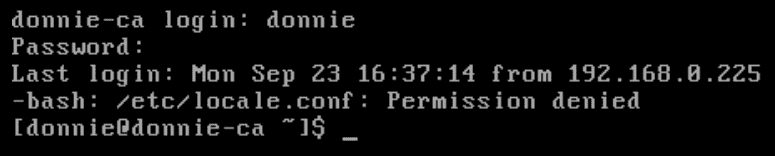

## 第二部分：掌握文件和目录的访问控制（DAC）

本节将讨论通过设置适当的权限和所有权、以及使用**扩展属性**（**xattr**）来保护敏感文件和目录。避免与**设置用户 ID**（**SUID**）和**设置组 ID**（**SGID**）相关的安全问题。

本节包含以下章节：

+   *第八章*，*掌握自主访问控制*

+   *第九章*，*访问控制列表和共享目录管理*

# 8 掌握自主访问控制

## 加入我们的书籍社区，加入 Discord

[`packt.link/SecNet`](https://packt.link/SecNet)


**自主访问控制**（**DAC**）实际上意味着每个用户都有能力控制谁可以访问他们的文件。如果我想让系统中的其他所有用户都能访问我的主目录，我可以这么做。完成后，我可以控制谁可以访问每个具体的文件。在下一章中，我们将使用我们的 DAC 技能来管理共享目录，其中组成员可能需要不同级别的文件访问权限。

在你 Linux 职业生涯的这个阶段，你可能已经了解了通过设置文件和目录权限来控制访问的基础知识。在本章中，我们将回顾这些基础知识，然后探讨一些更高级的概念。

在本章中，我们将讨论以下主题：

+   使用`chown`更改文件和目录的所有权

+   使用`chmod`设置文件和目录的权限

+   SUID 和 SGID 设置在常规文件上的作用

+   对不需要 SUID 和 SGID 权限的文件设置这些权限的安全影响

+   如何使用扩展文件属性保护敏感文件

+   保护系统配置文件

### 使用`chown`更改文件和目录的所有权

控制文件和目录的访问实际上就是确保合适的用户能够访问他们自己的文件和目录，并且每个文件和目录的权限设置得当，只有授权的用户能够访问它们。`chown`工具涵盖了这个方程式的第一部分。

`chown`的一个独特之处在于，即使你正在处理自己目录中的文件，你也必须拥有`sudo`权限才能使用它。你可以使用它更改文件或目录的用户、与文件或目录关联的组，或者同时更改两者。

首先，假设你拥有`perm_demo.txt`文件，并且你想将该文件的用户和组关联更改为另一个用户。在这种情况下，我将把文件的所有权从我自己更改为`maggie`：

```
[donnie@localhost ~]$ ls -l perm_demo.txt
-rw-rw-r--. 1 donnie donnie 0 Nov  5 20:02 perm_demo.txt
[donnie@localhost ~]$ sudo chown maggie:maggie perm_demo.txt
[donnie@localhost ~]$ ls -l perm_demo.txt
-rw-rw-r--. 1 maggie maggie 0 Nov  5 20:02 perm_demo.txt
[donnie@localhost ~]$
```

`maggie:maggie`中的第一个`maggie`是你想要授予所有权的用户。冒号后的第二个`maggie`表示你希望文件与之关联的组。因为我正在将用户和组都更改为`maggie`，所以我可以省略第二个`maggie`，只写第一个`maggie`后加冒号，这样也能达到相同的结果：

```
sudo chown maggie: perm_demo.txt
```

只改变组关联而不改变用户时，只需列出组名，前面加冒号：

```
[donnie@localhost ~]$ sudo chown :accounting perm_demo.txt
[donnie@localhost ~]$ ls -l perm_demo.txt
-rw-rw-r--. 1 maggie accounting 0 Nov  5 20:02 perm_demo.txt
[donnie@localhost ~]$
```

最后，只改变用户而不改变组时，列出用户名时不需要冒号：

```
[donnie@localhost ~]$ sudo chown donnie perm_demo.txt
[donnie@localhost ~]$ ls -l perm_demo.txt
-rw-rw-r--. 1 donnie accounting 0 Nov  5 20:02 perm_demo.txt
[donnie@localhost ~]$
```

这些命令在目录上与在文件上的作用是一样的。然而，如果你还想改变目录内容的所有权和/或组关联，并且同时改变目录本身的权限，可以使用`-R`选项，表示*递归*。在这种情况下，我只想将`perm_demo_dir`目录的组更改为`accounting`。让我们看看我们最初的情况：

```
[donnie@localhost ~]$ ls -ld perm_demo_dir
drwxrwxr-x. 2 donnie donnie 74 Nov  5 20:17 perm_demo_dir
[donnie@localhost ~]$ ls -l perm_demo_dir
total 0
-rw-rw-r--. 1 donnie donnie 0 Nov  5 20:17 file1.txt
-rw-rw-r--. 1 donnie donnie 0 Nov  5 20:17 file2.txt
-rw-rw-r--. 1 donnie donnie 0 Nov  5 20:17 file3.txt
-rw-rw-r--. 1 donnie donnie 0 Nov  5 20:17 file4.txt
```

现在，让我们运行命令并查看结果：

```
[donnie@localhost ~]$ sudo chown -R :accounting perm_demo_dir
[donnie@localhost ~]$ ls -ld perm_demo_dir
drwxrwxr-x. 2 donnie accounting 74 Nov  5 20:17 perm_demo_dir
[donnie@localhost ~]$ ls -l perm_demo_dir
total 0
-rw-rw-r--. 1 donnie accounting 0 Nov  5 20:17 file1.txt
-rw-rw-r--. 1 donnie accounting 0 Nov  5 20:17 file2.txt
-rw-rw-r--. 1 donnie accounting 0 Nov  5 20:17 file3.txt
-rw-rw-r--. 1 donnie accounting 0 Nov  5 20:17 file4.txt
[donnie@localhost ~]$
```

这就是`chown`的全部内容。接下来，我们来改变一些权限。

### 使用`chmod`设置文件和目录的权限

在 Unix 和 Linux 系统上，你可以使用`chmod`工具来设置文件和目录的权限值。你可以为文件或目录的用户、与文件或目录关联的组等设置权限。三种基本权限如下：

+   **r**：表示读权限。

+   **w**：表示写权限。

+   **x**：表示可执行权限。你可以将其应用于任何类型的程序文件或目录。如果你将可执行权限应用于目录，授权用户将能够`cd`进入该目录。

如果你对一个文件执行`ls -l`，你会看到类似这样的内容：

```
-rw-rw-r--. 1 donnie donnie     804692 Oct 28 18:44 yum_list.txt
```

这一行的第一个字符表示文件的类型。在这种情况下，我们可以看到一个破折号，表示这是一个普通文件。（普通文件几乎是普通用户在日常使用中能够访问的所有文件类型。）接下来的三个字符`rw-`表示文件对用户（即拥有文件的用户）具有读写权限。接着，我们可以看到组的`rw-`权限和其他用户的`r--`权限。程序文件也会有可执行权限：

```
-rwxr-xr-x. 1 root root     62288 Nov 20  2015 xargs
```

在这里，我们可以看到`xargs`程序文件为所有人设置了可执行权限。

你可以使用`chmod`有两种方式来更改权限设置：

+   符号方法

+   数字方法

接下来我们将介绍这些方法。

#### 使用符号方法设置权限

每当你以普通用户身份创建文件时，默认情况下，它会为用户和组设置读写权限，并为其他用户设置读权限。

```
chmod u+x donnie_script.sh
chmod g+x donnie_script.sh
chmod o+x donnie_script.sh
chmod u+x,g+x donnie_script.sh
chmod a+x donnie_script.sh
```

前三个命令为用户、组和其他用户添加了可执行权限。第四个命令为用户和组添加了可执行权限，而最后一个命令则为所有人添加了可执行权限（`a`表示所有人）。你还可以通过将`+`替换为`-`来移除可执行权限。最后，你还可以根据需要添加或移除读写权限。

尽管这种方法有时很方便，但也有一些缺陷；即它只能添加已经存在的权限，或者从已经存在的权限中移除权限。如果你需要确保某个特定文件的所有权限都被设置为某个特定值，那么符号方法可能会变得有些笨重。对于 Shell 脚本来说，这几乎是不可能的。在 Shell 脚本中，你需要添加很多额外的代码来判断哪些权限已经设置好了。而数字方法则能极大地简化我们的工作。

#### 使用数字方法设置权限

使用数字方法时，你会使用一个八进制值来表示文件或目录的权限设置。对于`r`、`w`和`x`权限，分别赋予数字值`4`、`2`和`1`。你需要为用户、组和其他用户设置这些权限值，然后将它们相加，得到文件或目录的权限值：

| **用户** | **组** | **其他用户** |
| --- | --- | --- |
| rwx | rwx | rwx |
| 421 | 421 | 421 |
| 7 | 7 | 7 |

所以，如果为所有人设置了所有权限，那么文件或目录的权限值将是`777`。如果我创建一个 Shell 脚本文件，默认情况下，它将具有标准的`664`权限，这意味着用户和组有读写权限，其他用户只有只读权限：

```
-rw-rw-r--. 1 donnie donnie 0 Nov  6 19:18 donnie_script.sh
```

> **提示**
> 
> > 如果你使用 root 权限创建文件，无论是通过`sudo`还是通过 root 用户命令提示符，你会看到默认的权限设置是更为严格的`644`。

假设我想让这个脚本可以执行，但我希望自己是全世界唯一可以对它做任何事情的人。为了实现这一点，我可以执行以下操作：

```
[donnie@localhost ~]$ chmod 700 donnie_script.sh
[donnie@localhost ~]$ ls -l donnie_script.sh
-rwx------. 1 donnie donnie 0 Nov  6 19:18 donnie_script.sh
[donnie@localhost ~]$
```

通过这一条简单的命令，我已移除组和其他用户的所有权限，并为自己设置了可执行权限。这就是数字方法在编写 Shell 脚本时如此方便的原因。

一旦你在使用数字方法一段时间后，看一个文件并计算它的数字权限值将变得像第二天性一样。与此同时，你可以使用`stat`命令并配合`-c %a`选项来查看文件的权限值。可以这样操作：

```
[donnie@localhost ~]$ stat -c %a yum_list.txt
664
[donnie@localhost ~]$
[donnie@localhost ~]$ stat -c %a donnie_script.sh
700
[donnie@localhost ~]$
[donnie@localhost ~]$ stat -c %a /etc/fstab
644
[donnie@localhost ~]$
```

如果你想一次性查看所有文件的数字权限，可以这样做：

```
[donnie@donnie-ca ~]$ stat -c '%n %a ' *
dropbear 755 
internal.txt 664 
password.txt 664 
pki-server.crt 664 
pki-server.p12 644 
yum_list.txt 664 
[donnie@donnie-ca ~]$
```

在这里，你可以看到命令末尾的通配符（`*`），这表示你想查看所有文件的设置。`%n` 表示你想查看文件名及其权限设置。由于我们使用了两个 `-c` 选项，所以必须将这两个选项括在一对单引号中。唯一需要注意的地方是，这个输出并没有显示这些项目中哪些是文件，哪些是目录。然而，由于目录需要可执行权限才能让人们 `cd` 进入，我们可以猜测 `dropbear` 可能是一个目录。不过，为了确保，可以使用 `ls -l`，如下所示：

```
[donnie@donnie-ca ~]$ ls -l
total 2180
-rwxr-xr-x. 1 donnie donnie  277144 Apr 22  2018 dropbear
-rw-rw-r--. 1 donnie donnie      13 Sep 19 13:32 internal.txt
-rw-rw-r--. 1 donnie donnie      11 Sep 19 13:42 password.txt
-rw-rw-r--. 1 donnie donnie    1708 Sep 19 14:41 pki-server.crt
-rw-r--r--. 1 root   root      1320 Sep 20 21:08 pki-server.p12
-rw-rw-r--. 1 donnie donnie 1933891 Sep 19 18:04 yum_list.txt
[donnie@donnie-ca ~]$
```

现在，让我们继续讲解一些非常特殊的权限设置。

### 在常规文件上使用 SUID 和 SGID

当常规文件设置了 SUID 权限时，任何访问该文件的人将拥有与文件所有者相同的权限。

为了演示这一点，假设 Maggie 是一个普通的、没有特权的用户，她想更改自己的密码。由于这是她自己的密码，她只需要使用单个命令 `passwd`，而不需要使用 `sudo`：

```
[maggie@localhost ~]$ passwd
Changing password for user maggie.
Changing password for maggie.
(current) UNIX password:
New password:
Retype new password:
passwd: all authentication tokens updated successfully.
[maggie@localhost ~]$
```

要更改密码，用户必须修改 `/etc/shadow` 文件。在我的 CentOS 和 AlmaLinux 机器上，shadow 文件的权限如下所示：

```
[donnie@localhost etc]$ ls -l shadow
----------. 1 root root 840 Nov  6 19:37 shadow
[donnie@localhost etc]$
```

在一台 Ubuntu 机器上，它们看起来是这样的：

```
donnie@ubuntu:/etc$ ls -l shadow
-rw-r----- 1 root shadow 1316 Nov  4 18:38 shadow
donnie@ubuntu:/etc$
```

无论如何，这些权限设置都不允许 Maggie 直接修改 shadow 文件。然而，通过更改她的密码，她能够修改 shadow 文件。那么，这是怎么回事呢？为了解答这个问题，让我们进入 `/usr/bin/` 目录，查看 `passwd` 可执行文件的权限设置：

```
[donnie@localhost etc]$ cd /usr/bin
[donnie@localhost bin]$ ls -l passwd
-rwsr-xr-x. 1 root root 27832 Jun 10 2014 passwd
[donnie@localhost bin]$
```

对于用户权限，你会看到 `rws` 而不是 `rwx`。`s` 表示这个文件具有 SUID 权限。由于该文件属于 root 用户，因此任何访问该文件的人都具有与 root 用户相同的权限。我们看到小写字母 `s`，意味着该文件对 root 用户也设置了可执行权限。由于 root 用户被允许修改 shadow 文件，因此任何使用 `passwd` 工具更改自己密码的人也可以修改 shadow 文件。

设置了 SGID 权限的文件，其组的可执行位置上会有一个 `s`：

```
[donnie@localhost bin]$ ls -l write
-rwxr-sr-x. 1 root tty 19536 Aug  4 07:18 write
[donnie@localhost bin]$
```

与 `tty` 组相关的 `write` 工具允许用户通过命令行控制台向其他用户发送消息。拥有 `tty` 组权限的用户可以执行此操作。

### SUID 和 SGID 权限的安全影响

尽管在可执行文件上设置 SUID 或 SGID 权限可能很有用，但我们应将其视为一种必要的恶习。虽然某些操作系统文件上设置 SUID 或 SGID 对 Linux 系统的运行至关重要，但当用户在其他文件上设置 SUID 或 SGID 时，它会成为一种安全风险。问题在于，如果入侵者找到一个属于 root 用户并且设置了 SUID 位的可执行文件，他们可以利用这个文件来攻击系统。在他们离开之前，他们可能会留下自己拥有 root 权限并且设置了 SUID 位的文件，这样下次遇到这个文件时，他们就能轻松重新进入系统。如果没有找到入侵者的 SUID 文件，入侵者仍然可以访问系统，即使原始问题已经被修复。

SUID 的数值是 `4000`，而 SGID 的数值是 `2000`。要在文件上设置 SUID，只需将 `4000` 添加到你本来会设置的权限值中。例如，如果你有一个权限值为 `755` 的文件，可以通过将权限值更改为 `4755` 来设置 SUID。（这会为用户提供读/写/执行权限，为组提供读/执行权限，为其他人提供读/执行权限，并且添加了 SUID 位。）

#### 查找多余的 SUID 或 SGID 文件

一个快速的安全技巧是运行 `find` 命令来检查系统中的 SUID 和 SGID 文件。你还可以将输出保存到文本文件中，以便验证自运行命令以来是否添加了任何文件。你的命令看起来应该像这样：

```
sudo find / -type f \( -perm -4000 -o -perm -2000 \) > suid_sgid_files.txt
```

下面是详细说明：

+   **/**: 我们正在搜索整个文件系统。由于某些目录只有 root 用户才能访问，因此我们需要使用 `sudo`。

+   **-type f**: 这意味着我们正在搜索常规文件，包括可执行程序文件和 shell 脚本。

+   **-perm 4000**: 我们正在寻找设置了 `4000`（即 SUID）权限位的文件。

+   **-o**: 或操作符。

+   **-perm 2000**: 我们正在寻找设置了 `2000`（即 SGID）权限位的文件。

+   **>**: 这里，我们将输出重定向到 `suid_sgid_files.txt` 文本文件中，使用 `>` 操作符。

请注意，两个 `-perm` 项需要合并为一个用括号括起来的术语。为了防止 Bash shell 错误解释括号字符，我们需要使用反斜杠转义每个括号字符。同时，我们需要在第一个括号字符和第一个 `-perm` 之间，以及在 `2000` 和最后一个反斜杠之间加上一个空格。另外，`-type f` 和 `-perm` 之间的 **and** 操作符，即使没有插入 `-a`，也可以理解为存在。你将创建的文本文件应该如下所示：

```
/usr/bin/chfn
/usr/bin/chsh
/usr/bin/chage
/usr/bin/gpasswd
/usr/bin/newgrp
/usr/bin/mount
/usr/bin/su
/usr/bin/umount
/usr/bin/sudo
. . .
. . .
/usr/lib64/dbus-1/dbus-daemon-launch-helper
```

如果你想查看哪些文件是 SUID 或 SGID，可以选择添加 `-ls` 选项：

```
sudo find / -type f \( -perm -4000 -o -perm -2000 \) -ls > suid_sgid_files.txt
```

好的，你现在可能会说，*嘿，Donnie，这个实在是太多要输入的内容了*。我听懂了。幸运的是，有一个简写方式可以替代。由于`4000 + 2000 = 6000`，我们可以创建一个单一的表达式，来匹配 SUID（`4000`）或 SGID（`2000`）值，像这样：

```
sudo find / -type f -perm /6000 -ls > suid_sgid_files.txt
```

此命令中的`/6000`表示我们正在寻找`4000`或`2000`值。就我们的目的而言，这两者是唯一可以组合成`6000`的加数。

> **提示**
> 
> > 在一些旧的参考资料中，你可能会看到`+6000`而不是`/6000`。使用`+`符号已经被弃用，并且不再有效。

现在，假设 Maggie 因为某种原因决定在她家目录下的 Shell 脚本文件上设置 SUID 位：

```
[maggie@localhost ~]$ chmod 4755 bad_script.sh
[maggie@localhost ~]$ ls -l
total 0
-rwsr-xr-x. 1 maggie maggie 0 Nov  7 13:06 bad_script.sh
[maggie@localhost ~]$
```

再次运行`find`命令，并将输出保存到另一个文本文件中。然后，对这两个文件执行`diff`操作，查看有哪些变化：

```
[donnie@localhost ~]$ diff suid_sgid_files.txt suid_sgid_files2.txt
17a18
> /home/maggie/bad_script.sh
[donnie@localhost ~]$
```

唯一的区别是添加了 Maggie 的 Shell 脚本文件。

##### 动手实验 – 查找 SUID 和 SGID 文件

你可以在任意一台虚拟机上执行这个实验。你需要将`find`命令的输出保存到一个文本文件中。让我们开始吧：

1.  在整个文件系统中搜索所有设置了 SUID 或 SGID 的文件，然后将输出保存到一个文本文件中：

```
 sudo find / -type f -perm /6000 -ls > suid_sgid_files.txt
```

1.  登录到你系统上的任何其他用户账户，创建一个虚拟的 Shell 脚本文件。然后，设置该文件的 SUID 权限，退出后再重新登录到你自己的用户账户：

```
su - desired_user_account
touch some_shell_script.sh
chmod 4755 some_shell_script.sh
ls -l some_shell_script.sh
exit
```

1.  再次运行`find`命令，并将输出保存到另一个文本文件中：

```
sudo find / -type f -perm /6000 -ls > suid_sgid_files_2.txt
```

1.  查看两个文件之间的差异：

```
diff suid_sgid_files.txt suid_sgid_files_2.txt
```

实验到此结束 – 恭喜你！

#### 防止在分区上使用 SUID 和 SGID

如前所述，你不希望用户为他们创建的文件分配 SUID 和 SGID 权限，因为这会带来安全风险。你可以通过使用`nosuid`选项挂载分区来防止 SUID 和 SGID 的使用。因此，我在前一章节创建的`luks`分区在`/etc/fstab`文件中的条目应该如下所示：

```
/dev/mapper/luks-6cbdce17-48d4-41a1-8f8e-793c0fa7c389 /secrets   xfs  nosuid  0 0
```

不同的 Linux 发行版在操作系统安装期间有不同的默认分区方案设置方式。通常，默认的做法是除了`/boot/`目录外，所有目录都位于`/`分区下。如果你设置了自定义的分区方案，你可以将`/home/`目录放在单独的分区中，并在其中设置`nosuid`选项。请记住，你不希望为`/`分区设置`nosuid`，否则你将得到一个无法正常工作的操作系统。

### 使用扩展文件属性来保护敏感文件

扩展文件属性是另一个帮助你保护敏感文件的工具。它们不能防止入侵者访问你的文件，但可以帮助你防止敏感文件被修改或删除。虽然有很多扩展属性，但我们只需要关注那些与文件安全相关的属性。

首先，让我们使用`lsattr`命令查看我们已经设置了哪些扩展属性。在 CentOS 或 AlmaLinux 机器上，你的输出应该是这样的：

```
[donnie@localhost ~]$ lsattr
---------------- ./yum_list.txt
---------------- ./perm_demo.txt
---------------- ./perm_demo_dir
---------------- ./donnie_script.sh
---------------- ./suid_sgid_files.txt
---------------- ./suid_sgid_files2.txt
[donnie@localhost ~]$
```

到目前为止，我的文件上还没有设置任何扩展属性。

在 Ubuntu 机器上，输出看起来会更像这样：

```
donnie@ubuntu:~$ lsattr
-------------e-- ./file2.txt
-------------e-- ./secret_stuff_dir
-------------e-- ./secret_stuff_for_frank.txt.gpg
-------------e-- ./good_stuff
-------------e-- ./secret_stuff
-------------e-- ./not_secret_for_frank.txt.gpg
-------------e-- ./file4.txt
-------------e-- ./good_stuff_dir
donnie@ubuntu:~$
```

我们不需要担心`e`属性，因为它仅表示该分区采用**ext4**文件系统格式。CentOS 和 AlmaLinux 没有设置这个属性，因为它们的分区是使用**XFS**文件系统格式化的。

本节我们将查看的两个属性如下：

+   **a**：你可以将文本追加到具有此属性的文件的末尾，但不能覆盖它。只有拥有适当`sudo`权限的人才能设置或删除此属性。

+   **i**：这会使文件变为不可变，只有拥有适当`sudo`权限的人才能设置或删除它。具有此属性的文件无法以任何方式删除或更改。也无法为具有此属性的文件创建硬链接。

要设置或删除属性，你需要使用`chattr`命令。你可以在文件上设置多个属性，但只有在合理的情况下才能这样做。例如，你不会在同一个文件上同时设置`a`和`i`属性，因为`i`会覆盖`a`。

让我们首先创建一个名为`perm_demo.txt`的文件，其中包含以下文本：

```
This is Donnie's sensitive file that he doesn't want to have overwritten.
```

现在，我们继续设置属性。

#### 设置 a 属性

现在，我将设置`a`属性：

```
[donnie@localhost ~]$ sudo chattr +a perm_demo.txt
[sudo] password for donnie:
[donnie@localhost ~]$
```

你使用`+`来添加一个属性，使用`-`来删除它。并且，文件属于我且在我的主目录下并不重要。即便如此，我仍然需要`sudo`权限来添加或删除这个属性。

现在，让我们看看当我尝试覆盖这个文件时会发生什么：

```
[donnie@localhost ~]$ echo "I want to overwrite this file." > perm_demo.txt
-bash: perm_demo.txt: Operation not permitted
[donnie@localhost ~]$ sudo echo "I want to overwrite this file." > perm_demo.txt
-bash: perm_demo.txt: Operation not permitted
[donnie@localhost ~]$
```

无论是否拥有`sudo`权限，我都无法覆盖它。那么，如果我尝试向其中追加一些内容呢？

```
[donnie@localhost ~]$ echo "I want to append this to the end of the file." >> perm_demo.txt
[donnie@localhost ~]$
```

这次没有错误信息。我们来看看文件中的内容：

```
This is Donnie's sensitive file that he doesn't want to have overwritten.
I want to append this to the end of the file.
```

除了无法覆盖文件外，我还无法删除它：

```
[donnie@localhost ~]$ rm perm_demo.txt
rm: cannot remove ‘perm_demo.txt’: Operation not permitted
[donnie@localhost ~]$ sudo rm perm_demo.txt
[sudo] password for donnie:
rm: cannot remove ‘perm_demo.txt’: Operation not permitted
[donnie@localhost ~]$
```

所以，`a`属性生效了。然而，我决定不再需要这个属性了，因此我将把它移除：

```
[donnie@localhost ~]$ sudo chattr -a perm_demo.txt
[donnie@localhost ~]$ lsattr perm_demo.txt
---------------- perm_demo.txt
[donnie@localhost ~]$
```

#### 设置 i 属性

当文件设置了`i`属性时，你唯一能做的事情就是查看它的内容。你不能更改它、移动它、删除它、重命名它，或者为它创建硬链接。我们来测试一下`perm_demo.txt`文件：

```
[donnie@localhost ~]$ sudo chattr +i perm_demo.txt
[donnie@localhost ~]$ lsattr perm_demo.txt
----i----------- perm_demo.txt
[donnie@localhost ~]$
```

现在是最有趣的部分：

```
[donnie@localhost ~]$ sudo echo "I want to overwrite this file." > perm_demo.txt
-bash: perm_demo.txt: Permission denied
[donnie@localhost ~]$ echo "I want to append this to the end of the file." >> perm_demo.txt
-bash: perm_demo.txt: Permission denied
[donnie@localhost ~]$ sudo echo "I want to append this to the end of the file." >> perm_demo.txt
-bash: perm_demo.txt: Permission denied
[donnie@localhost ~]$ rm -f perm_demo.txt
rm: cannot remove ‘perm_demo.txt’: Operation not permitted
[donnie@localhost ~]$ sudo rm -f perm_demo.txt
rm: cannot remove ‘perm_demo.txt’: Operation not permitted
[donnie@localhost ~]$ sudo rm -f perm_demo.txt
```

我还可以尝试几个其他命令，但你已经明白了思路。要移除`i`属性，执行如下操作：

```
[donnie@localhost ~]$ sudo chattr -i perm_demo.txt
[donnie@localhost ~]$ lsattr perm_demo.txt
---------------- perm_demo.txt
[donnie@localhost ~]$
```

##### 实验室操作——设置与安全相关的扩展文件属性

对于这个实验，你需要创建一个`perm_demo.txt`文件，并填入你选择的文本。然后你将设置`i`和`a`属性，并查看结果。我们开始吧：

1.  使用你喜欢的文本编辑器，创建`perm_demo.txt`文件并输入一行文本。

1.  查看文件的扩展属性：

```
lsattr perm_demo.txt
```

1.  添加`a`属性：

```
sudo chattr +a perm_demo.txt
lsattr perm_demo.txt
```

1.  尝试覆盖并删除文件：

```
echo "I want to overwrite this file." > perm_demo.txt
sudo echo "I want to overwrite this file." > perm_demo.txt
rm perm_demo.txt
sudo rm perm_demo.txt
```

1.  现在，向文件追加一些内容：

```
echo "I want to append this line to the end of the file." >> perm_demo.txt
```

1.  删除`a`属性并添加`i`属性：

```
sudo chattr -a perm_demo.txt
lsattr perm_demo.txt
sudo chattr +i perm_demo.txt
lsattr perm_demo.txt
```

1.  重复*步骤 4*。

1.  另外，尝试更改文件名并创建一个硬链接到文件：

```
mv perm_demo.txt some_file.txt
sudo mv perm_demo.txt some_file.txt
ln ~/perm_demo.txt ~/some_file.txt
sudo ln ~/perm_demo.txt ~/some_file.txt
```

1.  现在，尝试为文件创建一个符号链接：

```
ln -s ~/perm_demo.txt ~/some_file.txt
```

> 请注意，`i`属性不能让你创建硬链接到文件，但它允许你创建符号链接。

实验结束了 – 恭喜！

### 保护系统配置文件

如果你查看任何给定 Linux 发行版的配置文件，你会发现大多数文件属于 root 用户或某个指定的系统用户。你还会看到，这些文件大多数拥有所属用户的读写权限，并且其他人仅有读取权限。这意味着每个人及其兄弟都可以读取大多数 Linux 系统配置文件。例如，看看这个 Apache web 服务器配置文件：

```
[donnie@donnie-ca ~]$ cd /etc/httpd/conf
[donnie@donnie-ca conf]$ pwd
/etc/httpd/conf
[donnie@donnie-ca conf]$ ls -l httpd.conf 
-rw-r--r--. 1 root root 11753 Aug  6 09:44 httpd.conf
[donnie@donnie-ca conf]$
```

在“其他人”位置上有`r`权限时，所有登录的人，无论其权限级别如何，都可以查看 Apache 配置。

那么，这重要吗？这实际上取决于你的具体情况。某些配置文件，特别是一些基于 PHP 的**内容管理系统**（**CMS**）的配置文件，可能包含明文密码，而 CMS 必须能够访问这些密码。在这种情况下，显然你需要限制对这些配置文件的访问。但是，其他那些不包含敏感密码的配置文件呢？

对于只有少数管理员能够访问的服务器，这并不是一个大问题。但如果是那些普通的、非管理员用户可以通过安全外壳（Secure Shell）远程访问的服务器呢？如果他们没有`sudo`权限，他们无法编辑任何配置文件，但他们可以查看配置文件，了解你的服务器是如何配置的。如果他们知道了配置情况，这会帮助他们在试图入侵系统时吗，如果他们决定这么做的话？

我必须承认，直到最近，我才开始认真思考这个问题。当时，我成为了一家专注于**物联网**（**IoT**）设备安全的公司的 Linux 顾问。对于物联网设备，你需要担心的事情比普通服务器要多一些。普通服务器拥有高度的物理安全保护，而物联网设备通常几乎没有任何物理安全保护。你可能会在整个 IT 职业生涯中都没有亲眼见过一台服务器，除非你是那些被授权进入服务器机房内部的人之一。相反，物联网设备通常是暴露在外的。

我与一家物联网安全公司合作，该公司有一套指南，用于帮助加强物联网设备的防护，防止被攻击和泄露。其中一项要求是确保设备上的所有配置文件都设置为`600`权限。这意味着只有文件的所有者——通常是 root 用户或系统账户——可以读取这些文件。然而，配置文件非常多，你需要一个简便的方法来更改这些设置。你可以借助我们可信赖的伙伴——`find`工具来做到这一点。下面是操作方法：

```
sudo find / -iname '*.conf' -exec chmod 600 {} \;
```

下面是具体说明：

+   **sudo find / -iname '*.conf'**：这正是你所期望的操作。它会在整个根文件系统（`/`）中执行一个不区分大小写的（`-iname`）搜索，查找所有`.conf`扩展名的文件。你可能还会查找其他扩展名的文件，如`.ini`和`.cfg`。另外，由于`find`本身是递归的，你无需提供任何选项开关，就能让它搜索所有子目录。

+   **-exec**：这就是执行魔法的部分。它会自动在`find`找到的每个文件上执行以下命令，无需提示用户。如果你更愿意对`find`找到的每个文件回答*yes*或*no*，可以使用`-ok`代替`-exec`。

+   **chmod 600 {} \;**：`chmod 600`是我们要执行的命令。当`find`找到每个文件时，文件名会被放置在一对大括号（`{}`）中。每个`-exec`语句都必须以分号结束。为了防止 Bash shell 错误地解释分号，我们需要用反斜杠对其进行转义。

如果你决定这么做，务必充分测试，确保没有破坏任何东西。大部分情况下，将配置文件设置为`600`权限是没问题的，但有些文件例外。我刚刚在我的一台虚拟机上执行了这个命令。让我们看看当我尝试 ping 一个互联网网站时会发生什么：

```
[donnie@donnie-ca ~]$ ping www.civicsandpolitics.com
ping: www.civicsandpolitics.com: Name or service not known
[donnie@donnie-ca ~]$
```

看起来很糟糕，但解释很简单。原因是为了能够访问互联网，机器必须能够找到 DNS 服务器。DNS 服务器信息可以在`/etc/resolv.conf`文件中找到，而我刚刚已移除其他用户的读取权限。如果没有其他用户的读取权限，只有具有 root 用户权限的人才能访问互联网。所以，除非你想限制只有 root 或`sudo`权限的用户才能访问互联网，否则你需要将`resolv.conf`的权限设置恢复为`644`：

```
[donnie@donnie-ca etc]$ ls -l resolv.conf 
-rw-------. 1 root root 66 Sep 23 14:22 resolv.conf
[donnie@donnie-ca etc]$ sudo chmod 644 resolv.conf 
[donnie@donnie-ca etc]$
```

好的，我们再试一次：

```
[donnie@donnie-ca etc]$ ping www.civicsandpolitics.com
PING www.civicsandpolitics.com (64.71.34.94) 56(84) bytes of data.
64 bytes from 64.71.34.94: icmp_seq=1 ttl=51 time=52.1 ms
64 bytes from 64.71.34.94: icmp_seq=2 ttl=51 time=51.8 ms
64 bytes from 64.71.34.94: icmp_seq=3 ttl=51 time=51.2 ms
^C
--- www.civicsandpolitics.com ping statistics ---
3 packets transmitted, 3 received, 0% packet loss, time 2002ms
rtt min/avg/max/mdev = 51.256/51.751/52.176/0.421 ms
[donnie@donnie-ca etc]$
```

看起来好多了。现在，让我们重启机器。当你重启时，你将看到以下输出：



所以，我还需要将`/etc/locale.conf`文件的权限设置恢复为`644`，以确保机器能够正常启动。正如我之前提到的，如果你选择对配置文件设置更严格的权限，务必先进行测试。

正如我之前所说，你可能并不总是觉得有必要更改配置文件的默认权限设置。但如果你确实需要这样做，现在你已经知道如何操作了。

> **提示**
> 
> > 你绝对想和`find`工具建立友谊。它在命令行和 Shell 脚本中都非常有用，而且极其灵活。它的 man 页面写得很好，你可以从中学到几乎所有关于`find`的知识。要查看它，只需使用`man find`命令。
> > 
> > 一旦你习惯了`find`，你就再也不想使用那些花哨的 GUI 类型的搜索工具了。

好的，我想这一章就到这里为止了。

## 总结

在这一章中，我们回顾了设置文件和目录所有权及权限的基础知识。然后，我们讨论了 SUID 和 SGID 在正确使用时的作用，以及将它们设置在我们自己的可执行文件上所带来的风险。接着，我们了解了两个与文件安全相关的扩展文件属性，最后介绍了一种便捷的省时技巧，用于删除系统配置文件中的全局可读权限。

在下一章，我们将扩展我们在这里学到的内容，探讨更高级的文件和目录访问技术。我们在那里见。

## 问题

1.  以下哪个分区挂载选项会阻止设置文件的 SUID 和 SGID 权限？

A. `nosgid`

B. `noexec`

C. `nosuid`

D. `nouser`

1.  以下哪个选项表示一个对用户和组有读写权限、对其他人只有只读权限的文件？

A. `775`

B. `554`

C. `660`

D. `664`

1.  你想将`somefile.txt`文件的所有权和组关联更改为 Maggie。以下哪个命令可以做到这一点？

A. **sudo chown maggie somefile.txt**

B. **sudo chown :maggie somefile.txt**

C. **sudo chown maggie: somefile.txt**

D. **sudo chown :maggie: somefile.txt**

1.  以下哪个是 SGID 权限的数字值？

A. `6000`

B. `2000`

C. `4000`

D. `1000`

1.  哪个命令可以用来查看文件的扩展属性？

A. `lsattr`

B. `ls -a`

C. `ls -l`

D. `chattr`

1.  以下哪个命令会在整个文件系统中搜索具有 SUID 或 SGID 权限设置的常规文件？

A. **sudo find / -type f -perm \6000**

B. **sudo find / \( -perm -4000 -o -perm -2000 \)**

C. **sudo find / -type f -perm -6000**

D. **sudo find / -type r -perm \6000**

1.  以下哪种说法是正确的？

A. 使用符号方法设置权限是所有情况中最好的方法。

B. 使用符号方法设置权限是 Shell 脚本中最好的方法。

C. 使用数字方法设置权限是在 Shell 脚本中最好的方法。

D. 使用哪种方法设置权限并不重要。

1.  以下哪个命令会在一个用户和组拥有读/写/执行权限，其他人拥有读/执行权限的文件上设置 SUID 权限？

A. **sudo chmod 2775 somefile**

B. **sudo chown 2775 somefile**

C. **sudo chmod 1775 somefile**

D. **sudo chmod 4775 somefile**

1.  以下哪个功能是通过在可执行文件上设置 SUID 权限来实现的？

A. 它允许任何用户使用该文件。

B. 它防止文件被意外删除。

C. 它允许“其他人”拥有与文件“用户”相同的权限。

D. 它允许“其他人”拥有与与文件关联的组相同的权限。

1.  为什么用户不应该在自己的常规文件上设置 SUID 或 SGID 权限？

A. 它不必要地占用了更多硬盘空间。

B. 它可以防止在需要时删除文件。

C. 它可能允许某人更改文件。

D. 这可能允许入侵者破坏系统。

1.  以下哪个`find`命令选项允许你在`find`找到的每个文件上自动执行命令，而无需提示？

A. `-exec`

B. `-ok`

C. `-xargs`

D. `-do`

1.  判断对错：为了获得最佳安全性，系统上的每个`.conf`文件都应该始终使用`600`权限设置。

A. 正确

B. 错误

1.  以下哪个是正确的陈述？

A. 通过使用`nosuid`选项挂载`/`分区，防止用户在文件上设置 SUID。

B. 对某些系统文件必须设置 SUID 权限，操作系统才能正常工作。

C. 可执行文件绝不应设置 SUID 权限。

D. 可执行文件应始终设置 SUID 权限。

1.  以下哪两项是配置文件的安全问题？

A. 默认配置下，任何具有命令行访问权限的普通用户都可以编辑配置文件。

B. 某些配置文件可能包含敏感信息。

C. 默认配置下，任何具有命令行访问权限的普通用户都可以查看配置文件。

D. 服务器上的配置文件需要比物联网设备上的配置文件更多的保护。

## 进一步阅读

+   如何在 Linux 中查找具有 SUID 和 SGID 权限的文件: [`www.tecmint.com/how-to-find-files-with-suid-and-sgid-permissions-in-linux/`](https://www.tecmint.com/how-to-find-files-with-suid-and-sgid-permissions-in-linux/)

+   Linux `find`命令: [`youtu.be/tCemsQ_ZjQ0`](https://youtu.be/tCemsQ_ZjQ0)

+   Linux 和 Unix 文件权限: [`youtu.be/K9FEz20Zhmc`](https://youtu.be/K9FEz20Zhmc)

+   Linux 文件权限: [`www.linux.com/tutorials/understanding-linux-file-permissions/`](https://www.linux.com/tutorials/understanding-linux-file-permissions/)

+   25 个 Linux `find`命令的简单示例: [`www.binarytides.com/linux-find-command-examples/`](https://www.binarytides.com/linux-find-command-examples/)

+   35 个 Linux `find`命令的实用示例：[`www.tecmint.com/35-practical-examples-of-linux-find-command/`](https://www.tecmint.com/35-practical-examples-of-linux-find-command/)

## 答案

1.  C

1.  D

1.  C

1.  B

1.  A

1.  A

1.  C

1.  D

1.  C

1.  D

1.  A

1.  B

1.  B

1.  B, C
