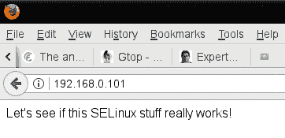
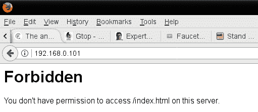
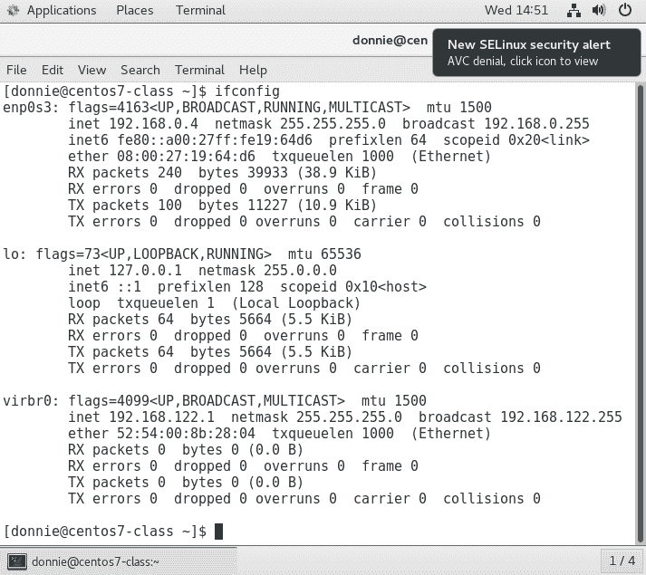
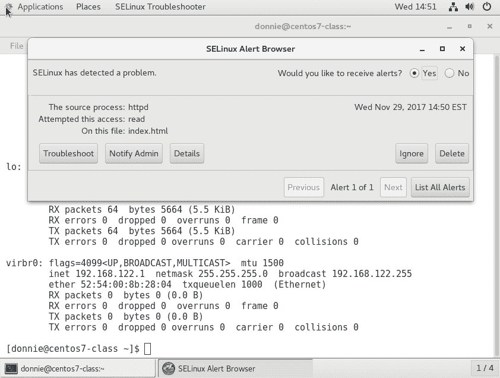
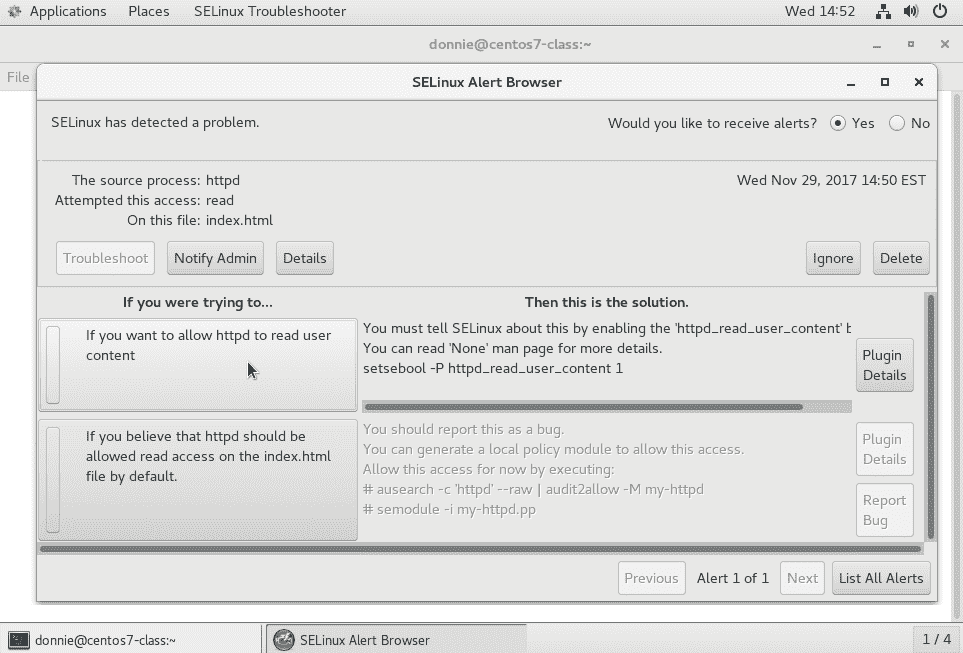
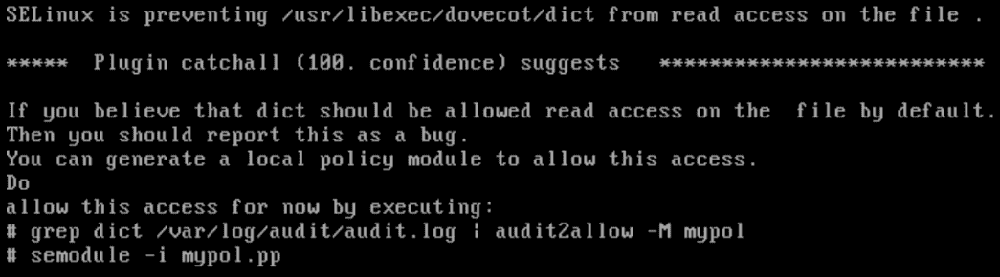
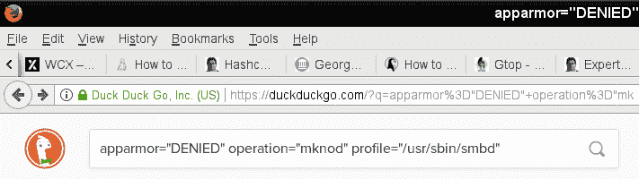
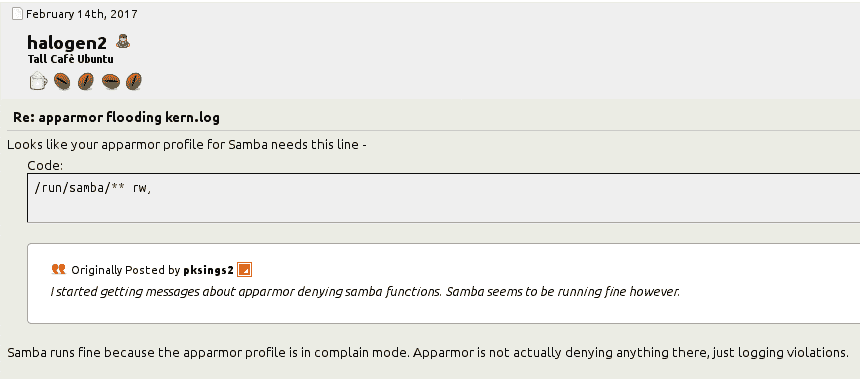

## 第三节：高级系统强化技术

本节将教你如何使用**强制访问控制**（**MAC**）、安全配置文件和进程隔离技术来强化 Linux 系统。使用 auditd 和日志服务审计 Linux 系统。

本节包含以下章节：

+   *第十章*，*使用 SELinux 和 AppArmor 实施强制访问控制*

+   *第十一章*，*内核强化与进程隔离*

+   *第十二章*，*扫描、审计与强化*

+   *第十三章*，*日志记录与日志安全*

+   *第十四章*，*漏洞扫描与入侵检测*

+   *第十五章*，*使用 fapolicyd 阻止应用程序*

+   *第十六章*，*忙碌的蜜蜂的安全提示与技巧*

# 10 使用 SELinux 和 AppArmor 实施强制访问控制

## 加入我们的书籍社区，加入 Discord

[`packt.link/SecNet`](https://packt.link/SecNet)


正如我们在前几章中看到的，**自主访问控制**（**DAC**）允许用户控制谁可以访问他们的文件和目录。但如果你的公司需要对谁可以访问什么内容进行更多的管理控制呢？为此，我们需要某种**强制访问控制**（**MAC**）。

我知道的最好解释 DAC 和 MAC 区别的方式是回想起我的海军时光。那时，我在潜艇上服役，我需要拥有绝密许可才能执行工作。在 DAC 下，我可以把一本绝密书带到餐厅，交给一位没有相应许可的厨师。但在 MAC 下，有一些规则阻止了我这样做。在操作系统中，情况差不多。

有多种不同的 MAC 系统可供 Linux 使用。我们将在本章中介绍的两个是 SELinux 和 AppArmor。我们将看看它们是什么，如何配置它们以及如何进行故障排除。

本章将涵盖以下主题：

+   什么是 SELinux，它如何帮助系统管理员

+   如何为文件和目录设置安全上下文

+   如何使用 setroubleshoot 进行 SELinux 问题排查

+   查看 SELinux 策略以及如何创建自定义策略

+   什么是 AppArmor，它如何帮助系统管理员

+   查看 AppArmor 策略

+   使用 AppArmor 命令行工具

+   故障排除 AppArmor 问题

+   利用恶意 Docker 容器攻击系统

让我们从了解 SELinux 开始，看看它如何帮助你。

## SELinux 如何帮助系统管理员

SELinux 是一个免费的开源软件项目，由美国国家安全局（NSA）开发。虽然它理论上可以安装在任何 Linux 发行版上，但只有 Red Hat 类型的发行版已经预先设置并启用它。它利用 Linux 内核模块中的代码，以及扩展的文件系统属性，确保只有授权的用户和进程才能访问敏感文件或系统资源。SELinux 有三种使用方式：

+   它可以帮助防止入侵者利用系统漏洞。

+   它可以用来确保只有具有适当安全权限的用户才能访问带有安全分类标签的文件。

+   除了 MAC 之外，SELinux 还可以作为一种基于角色的访问控制类型。

在本章中，我只会讲解这三种用法中的第一种，因为它是 SELinux 最常用的使用方式。还有一点是，讲解这三种用法需要写一本书，而我这里没有足够的空间。

> **提示**
> 
> > 如果你通过了这部分关于 SELinux 的介绍后，觉得仍然需要更多的 SELinux 信息，你可以在 Packt Publishing 网站上找到专门讲解这一主题的整本书和课程。

那么，SELinux 如何能帮助繁忙的系统管理员呢？你可能还记得几年前，Shellshock 漏洞登上全球头条新闻的事情。本质上，Shellshock 是一个 Bash shell 漏洞，允许入侵者突破系统并通过获得 root 权限来利用它。对于运行 SELinux 的系统，虽然坏人仍然能够突破系统，但 SELinux 会阻止他们成功执行攻击。

SELinux 还是另一种机制，可以帮助保护用户家目录中的数据。如果你的机器设置为网络文件系统（NFS）服务器、Samba 服务器或 web 服务器，SELinux 将阻止这些守护进程访问用户的家目录，除非你明确配置 SELinux 以允许这种行为。

在 web 服务器上，你可以使用 SELinux 来阻止恶意的 CGI 脚本或 PHP 脚本的执行。如果你不需要你的服务器运行 CGI 或 PHP 脚本，你可以在 SELinux 中禁用它们。

在没有 SELinux 的情况下，使用 Docker 对普通用户来说，轻而易举地就能突破 Docker 容器并获得主机的 root 级别访问权限。正如我们将在本章末尾看到的，SELinux 是一种用于加固运行 Docker 容器的服务器的有用工具。

所以现在，你可能在想，每个人都会使用这样一个伟大的工具，对吧？可惜事实并非如此。刚开始时，SELinux 因为操作起来困难而声名狼藉，很多管理员干脆禁用它。事实上，很多网络教程或者 YouTube 上的教程都会把禁用 SELinux 作为第一步。在这一部分，我想向你展示，情况已经有所改善，SELinux 不再值得它曾经的坏名声。

## 设置文件和目录的安全上下文

可以将 SELinux 看作是一个改进的标签系统。它通过扩展的文件属性将标签（称为安全上下文）添加到文件和目录上。它还会将相同类型的标签，称为域，添加到系统进程上。要查看这些上下文和域，在你的 CentOS 或 AlmaLinux 机器上使用 `-Z` 选项与 `ls` 或 `ps` 命令。例如，我自己主目录中的文件和目录看起来如下所示：

```
[donnie@localhost ~]$ ls -Z
drwxrwxr-x. donnie donnie unconfined_u:object_r:user_home_t:s0 acl_demo_dir
-rw-rw-r--. donnie donnie unconfined_u:object_r:user_home_t:s0 yum_list.txt
[donnie@localhost ~]$
```

我的系统上的进程大致如下所示：

```
[donnie@localhost ~]$ ps -Z
LABEL                             PID TTY          TIME CMD
unconfined_u:unconfined_r:unconfined_t:s0-s0:c0.c1023 1322 pts/0 00:00:00 bash
unconfined_u:unconfined_r:unconfined_t:s0-s0:c0.c1023 3978 pts/0 00:00:00 ps
[donnie@localhost ~]$
```

现在，让我们来拆解一下。在 `ls -Z` 和 `ps -Z` 命令的输出中，我们会看到以下几部分：

+   **SELinux 用户**：在这两种情况下，SELinux 用户都是通用的 `unconfined_u`。

+   **SELinux 角色**：在 `ls -Z` 示例中，我们看到角色是 `object_r`，而在 `ps -Z` 示例中，它是 `unconfined_r`。

+   **类型**：在 `ls -Z` 输出中是 `user_home_t`，在 `ps -Z` 输出中是 `unconfined_t`。

+   **敏感度**：在 `ls -Z` 输出中它是 `s0`，而在 `ps -Z` 输出中，它是 `s0-s0`。

+   **类别**：我们在 `ls -Z` 输出中看不到类别，但在 `ps -Z` 输出中看到了 `c0.c1023`。

在前面提到的所有安全上下文和安全域组件中，当前唯一对我们感兴趣的是**类型**。对于本章而言，我们只关注正常的 Linux 管理员需要知道的内容，以防止入侵者利用系统，而**类型**是我们需要使用的唯一组件。其他所有组件只有在我们设置高级、安全分类基础的访问控制和基于角色的访问控制时才会发挥作用。

好的，以下是一个简化的解释，说明这如何帮助 Linux 管理员维护安全性。我们希望系统进程仅访问我们允许它们访问的对象。（系统进程包括如 web 服务器守护进程、FTP 守护进程、Samba 守护进程和安全外壳守护进程等。对象包括如文件、目录和网络端口等内容。）为了实现这一点，我们将为所有进程和对象分配一个**类型**。然后，我们会创建策略，定义哪些进程类型可以访问哪些对象类型。

幸运的是，每当你安装任何 Red Hat 类型的发行版时，几乎所有的繁重工作都已经为你完成。Red Hat 类型的发行版都自带 SELinux 并且已经启用了**定向**策略。可以把这个定向策略看作是一个相对宽松的策略，它允许普通桌面用户坐在计算机前进行工作，而不需要调整任何 SELinux 设置。但如果你是服务器管理员，你可能会发现需要调整这个策略，以允许服务器守护进程执行你需要它们做的事情。

> 默认安装的目标策略是普通 Linux 管理员在日常工作中会使用的策略。如果你查看 CentOS 虚拟机的仓库，你会看到还有其他几种策略，这些我们在本书中不会涉及。

### 安装 SELinux 工具

出于某种我永远也无法理解的奇怪原因，管理 SELinux 所需的工具默认并不会安装，尽管 SELinux 本身会安装。因此，在 CentOS 虚拟机上你首先需要做的就是安装这些工具。

在 CentOS 7 上，运行此命令：

```
sudo yum install setools policycoreutils policycoreutils-python
```

在 CentOS 8 上，运行此命令：

```
sudo dnf install setools policycoreutils policycoreutils-python-utils
```

本章稍后的 *使用 setroubleshoot 进行故障排除* 部分，我们将探讨如何使用 `setroubleshoot` 来帮助诊断 SELinux 问题。为了在此过程中看到一些酷炫的错误信息，先安装 `setroubleshoot`，并通过重启 `auditd` 守护进程来激活它。（没有 `setroubleshoot` 守护进程，因为 `setroubleshoot` 是由 `auditd` 守护进程来控制的。）如下安装 `setroubleshoot`。

对于 CentOS 7，请使用以下命令：

```
sudo yum install setroubleshoot
sudo service auditd restart
```

对于 AlmaLinux 8 和 9，请使用以下命令：

```
sudo dnf install setroubleshoot
sudo service auditd restart
```

在 Red Hat 系统中，我们必须处理的一个小巧的 systemd 问题是，不能使用普通的 `systemctl` 命令来停止或重启 `auditd` 守护进程。然而，传统的 `service` 命令是有效的。出于某些我无法理解的原因，Red Hat 的开发者将 `auditd` 服务文件配置为禁用常规的 systemd 处理方式。

> 根据你在安装 CentOS 或 AlmaLinux 时选择的安装类型，你可能已经安装了 `setroubleshoot`，也可能没有。为了确保这一点，请运行命令安装它。如果 `setroubleshoot` 已经存在，安装它不会有任何不良影响。

现在你已经拥有了开始所需的一切。让我们看看 SELinux 对繁忙的 Web 服务器管理员能做些什么。

### 创建带有 SELinux 启用的网页内容文件

现在，让我们看看如果你的网页内容文件设置了错误的 SELinux 类型会发生什么。首先，我们将在 CentOS 虚拟机上安装、启用并启动 Apache Web 服务器。（请注意，包含 --now 选项可以让我们在一步操作中同时启用和启动守护进程。）在 CentOS 7 上执行以下操作：

```
sudo yum install httpd
sudo systemctl enable --now httpd
```

在 CentOS 8 上，请使用以下命令：

```
sudo dnf install httpd
sudo systemctl enable --now httpd
```

如果你还没做过此操作，请配置防火墙以允许访问 Web 服务器：

```
[donnie@localhost ~]$ sudo firewall-cmd --permanent --add-service=http
success
[donnie@localhost ~]$ sudo firewall-cmd --reload
success
[donnie@localhost ~]$
```

当我们查看 Apache 进程的 SELinux 信息时，我们会看到以下内容：

```
[donnie@localhost ~]$ ps ax -Z | grep httpd
system_u:system_r:httpd_t:s0     3689 ?        Ss     0:00 /usr/sbin/httpd -DFOREGROUND
system_u:system_r:httpd_t:s0     3690 ?        S      0:00 /usr/sbin/httpd -DFOREGROUND
system_u:system_r:httpd_t:s0     3691 ?        S      0:00 /usr/sbin/httpd -DFOREGROUND
system_u:system_r:httpd_t:s0     3692 ?        S      0:00 /usr/sbin/httpd -DFOREGROUND
system_u:system_r:httpd_t:s0     3693 ?        S      0:00 /usr/sbin/httpd -DFOREGROUND
system_u:system_r:httpd_t:s0     3694 ?        S      0:00 /usr/sbin/httpd -DFOREGROUND
unconfined_u:unconfined_r:unconfined_t:s0-s0:c0.c1023 3705 pts/0 R+   0:00 grep --color=auto httpd
```

如我之前所说，我们对用户或角色不感兴趣。然而，我们对类型感兴趣，在此情况下是 `httpd_t`。

在 Red Hat 系统中，我们通常将网页内容文件放置在 `/var/www/html/` 目录中。我们来看一下该 `html` 目录的 SELinux 上下文：

```
[donnie@localhost www]$ pwd
/var/www
[donnie@localhost www]$ ls -Zd html/
drwxr-xr-x. root root system_u:object_r:httpd_sys_content_t:s0 html/
[donnie@localhost www]$
```

类型是 `httpd_sys_content`，所以可以推断 `httpd` 守护进程应该能够访问这个目录。现在目录是空的，让我们进入其中并创建一个简单的 index 文件：

```
[donnie@localhost www]$ cd html
[donnie@localhost html]$ pwd
/var/www/html
[donnie@localhost html]$ sudo vim index.html
```

这是我将放入文件中的内容：

```
<html>
<head>
<title>
Test of SELinux
</title>
</head>
<body>
Let's see if this SELinux stuff really works!
</body>
</html>
```

好的，正如我所说，这很简单，因为我的 HTML 手动编码技能已经不如从前。但这仍然足以满足我们当前的需求。

查看 SELinux 上下文，我们发现该文件与 `html` 目录具有相同的类型：

```
[donnie@localhost html]$ ls -Z
-rw-r--r--. root root unconfined_u:object_r:httpd_sys_content_t:s0 index.html
[donnie@localhost html]$
```

现在，我可以从我可靠的 OpenSUSE 工作站的网页浏览器访问这个页面：



现在，让我们看看，如果我决定在自己的主目录中创建内容文件，并将它们移动到 `html` 目录，会发生什么情况。首先，让我们看一下新文件的 SELinux 上下文：

```
[donnie@localhost ~]$ pwd
/home/donnie
[donnie@localhost ~]$ ls -Z index.html
-rw-rw-r--. donnie donnie unconfined_u:object_r:user_home_t:s0 index.html
[donnie@localhost ~]$
```

现在，上下文类型为 `user_home_t`，这表明我是在我的主目录中创建的文件。我现在将文件移动到 `html` 目录，覆盖旧文件：

```
[donnie@localhost ~]$ sudo mv index.html /var/www/html/
[sudo] password for donnie:
[donnie@localhost ~]$ cd /var/www/html
[donnie@localhost html]$ ls -Z
-rw-rw-r--. donnie donnie unconfined_u:object_r:user_home_t:s0 index.html
[donnie@localhost html]$
```

即使我将文件移到 `/var/www/html` 目录，SELinux 类型仍然与用户的主目录相关联。现在，我将去我的主机的浏览器刷新页面：



所以，我遇到一个小问题。分配给我的文件类型与 `httpd` 守护进程的类型不匹配，因此 SELinux 不允许 `httpd` 进程访问该文件。

> **提示**
> 
> > 如果我将文件复制到 `html` 目录，而不是移动它，SELinux 上下文会自动更改，以匹配目标目录的上下文。

### 修复错误的 SELinux 上下文

好的，我有这个网页内容文件，没人能访问，而且我现在真的不想创建一个新的。那么，我该怎么办呢？实际上，我们有三种不同的工具来解决这个问题：

+   **chcon**

+   **restorecon**

+   **semanage**

让我们看看这两种方法。

#### 使用 chcon

有两种方法可以使用 `chcon` 来修复文件或目录上的错误 SELinux 类型。第一种是手动指定正确的类型：

```
[donnie@localhost html]$ sudo chcon -t httpd_sys_content_t index.html
[sudo] password for donnie:
[donnie@localhost html]$ ls -Z
-rw-rw-r--. donnie donnie unconfined_u:object_r:httpd_sys_content_t:s0 index.html
[donnie@localhost html]$
```

我们可以使用 `chcon` 来更改上下文的任何部分，但正如我一再强调的，我们只关心类型，它通过 `-t` 选项来更改。你可以在 `ls -Z` 输出中看到命令执行成功。

使用 `chcon` 的另一种方式是引用一个具有正确上下文的文件。为了演示，我将 `index.html` 文件的类型改回主目录类型，并在 `/var/www/html/` 目录下创建了一个新文件：

```
[donnie@localhost html]$ ls -Z
-rw-rw-r--. donnie donnie unconfined_u:object_r:user_home_t:s0 index.html
-rw-r--r--. root   root   unconfined_u:object_r:httpd_sys_content_t:s0 some_file.html
[donnie@localhost html]$
```

如你所见，我在此目录中创建的任何文件都会自动拥有正确的 SELinux 上下文设置。现在，让我们使用这个新文件作为参考，来为 `index.html` 文件设置正确的上下文：

```
[donnie@localhost html]$ sudo chcon --reference some_file.html index.html
[sudo] password for donnie:
[donnie@localhost html]$ ls -Z
-rw-rw-r--. donnie donnie unconfined_u:object_r:httpd_sys_content_t:s0 index.html
-rw-r--r--. root   root   unconfined_u:object_r:httpd_sys_content_t:s0 some_file.html
[donnie@localhost html]$
```

因此，我使用了`--reference`选项，并指定了我想用作参考的文件。要更改的文件在命令的末尾列出。现在，这一切都很好，但我想找一个不需要那么多输入的更简单的方法。毕竟，我已经是个老人了，不想让自己太累。那么，让我们来看看`restorecon`工具。

#### 使用 restorecon

使用`restorecon`非常简单。只需要输入`restorecon`，后跟需要更改的文件名称。再次提醒，我已将`index.html`文件的上下文更改回了主目录类型。不过这次，我使用`restorecon`来设置正确的类型：

```
[donnie@localhost html]$ ls -Z
-rw-rw-r--. donnie donnie unconfined_u:object_r:user_home_t:s0 index.html
[donnie@localhost html]$ sudo restorecon index.html
[donnie@localhost html]$ ls -Z
-rw-rw-r--. donnie donnie unconfined_u:object_r:httpd_sys_content_t:s0 index.html
[donnie@localhost html]$
```

就是这样。

> **提示**
> 
> > 你也可以使用`chcon`和`restorecon`来更改整个目录及其内容的上下文。对于这两者，只需使用`-R`选项。以下是一个示例：

```
sudo chcon -R -t httpd_sys_content_t /var/www/html/
sudo restorecon -R /var/www/html/
```

> （记住：`-R`表示递归。）

还有最后一件事需要处理，尽管它实际上不会影响我们访问此文件的能力。那就是，我需要将文件的所有权更改为 Apache 用户：

```
[donnie@localhost html]$ sudo chown apache: index.html
[sudo] password for donnie:
[donnie@localhost html]$ ls -l
total 4
-rw-rw-r--. 1 apache apache 125 Nov 22 16:14 index.html
[donnie@localhost html]$
```

现在让我们来看一下最后一个工具——`semanage`。

#### 使用 semanage

在我刚才介绍的场景中，`chcon`或`restorecon`都可以很好地满足你的需求。活动 SELinux 策略规定了某些目录中应该具有的安全上下文。只要你在活动 SELinux 策略中定义的目录内使用`chcon`或`restorecon`，就没问题。但假设你在其他地方创建了一个目录，想要用它来提供网页内容文件。你需要在该目录及其中的所有文件上设置`httpd_sys_content_t`类型。然而，如果使用`chcon`或`restorecon`，这种更改在系统重启后将不会生效。为了使更改永久生效，你需要使用`semanage`。

假设，出于某种奇怪的原因，我想从我在`/home/`目录下创建的一个目录中提供网页内容：

```
[donnie@localhost home]$ pwd
/home
[donnie@localhost home]$ sudo mkdir webdir
[sudo] password for donnie:
[donnie@localhost home]$ ls -Zd webdir
drwxr-xr-x. root root unconfined_u:object_r:home_root_t:s0 webdir
[donnie@localhost home]$
```

由于我必须使用`sudo`权限来创建目录，因此它与根用户的`home_root_t`类型相关联，而不是正常的`user_home_dir_t`类型。我在此目录中创建的任何文件将具有相同的类型：

```
[donnie@localhost webdir]$ ls -Z
-rw-r--r--. root root unconfined_u:object_r:home_root_t:s0 index.html
[donnie@localhost webdir]$
```

下一步是使用`semanage`为该目录和`httpd_sys_content_t`类型添加永久映射到活动策略的上下文列表：

```
[donnie@localhost home]$ sudo semanage fcontext -a -t httpd_sys_content_t "/home/webdir(/.*)?"
[donnie@localhost home]$ ls -Zd /home/webdir
drwxr-xr-x. root root unconfined_u:object_r:httpd_sys_content_t:s0 /home/webdir
[donnie@localhost home]$
```

好的，接下来是`semanage`命令的分解：

+   **fcontext**：由于`semanage`有许多用途，我们必须指定我们希望处理的是文件上下文。

+   **-a**：此选项指定我们正在向活动 SELinux 策略的上下文列表中添加一个新记录。

+   **-t**：此选项指定我们希望映射到新目录的类型。在此情况下，我们正在创建一个新的映射，类型为`httpd_sys_content`。

+   **/home/webdir(/.*)?**：这一堆无意义的东西称为**正则表达式**。我不能在这里详细讨论正则表达式的细节，因此可以说，**正则表达式**是我们用来匹配文本模式的一种语言。（是的，我说的是“is”而不是“are”，因为正则表达式是整体语言的名称。）在这种情况下，我必须使用这个特定的正则表达式，以便使`semanage`命令递归，因为`semanage`没有`-R`选项开关。通过这个正则表达式，我想表达的是，我希望在这个目录中创建的任何内容都与目录本身具有相同的 SELinux 类型。

最后一步是在此目录上执行`restorecon -R`以确保设置了正确的标签：

```
[donnie@localhost home]$ sudo restorecon -R webdir
[donnie@localhost home]$ ls -Zd /home/webdir
drwxr-xr-x. root root unconfined_u:object_r:httpd_sys_content_t:s0 /home/webdir
[donnie@localhost home]$
```

是的，我知道。你看着这个说，“但是这个`ls -Zd`输出看起来和你做完`semanage`命令后一样。” 你说得对。在运行`semanage`命令后，似乎类型已经设置正确了。但是`semanage-fcontext`的 man 页面说无论如何都要运行`restorecon`，所以我就这么做了。

> **提示**
> 
> > 要了解如何使用`semanage`管理安全上下文的更多信息，请参考相关的 man 页面，输入`man semanage-fcontext`。

#### 实验动手操作 - SELinux 类型强制

在这个实验中，您将安装 Apache Web 服务器和适当的 SELinux 工具。然后，如果您准备好了，让我们开始吧：

1.  在 CentOS 7 上安装 Apache 以及所有必需的 SELinux 工具：

```
sudo yum install httpd setroubleshoot setools policycoreutils policycoreutils-python
```

在 CentOS 8 上，使用以下命令：

```
sudo dnf install httpd setroubleshoot setools policycoreutils policycoreutils-python-utils
```

1.  通过重新启动`auditd`服务激活`setroubleshoot`：

```
sudo service auditd restart
```

1.  启用并启动 Apache 服务并在防火墙上打开端口`80`：

```
sudo systemctl enable --now httpd
sudo firewall-cmd --permanent --add-service=http
sudo firewall-cmd --reload
```

1.  在`/var/www/html/`目录中，创建一个包含以下内容的`index.html`文件：

```
<html>
   <head>
      <title>SELinux Test Page</title>
   </head>
   <body>
      This is a test of SELinux.
   </body>
</html>
```

1.  查看关于`index.html`文件的信息：

```
ls -Z index.html
```

1.  在主机机器的 Web 浏览器中，导航到 CentOS 虚拟机的 IP 地址。您应该能够查看页面。

1.  通过将`index.html`文件的类型更改为不正确的类型来引发 SELinux 违规：

```
sudo chcon -t tmp_t index.html
ls -Z index.html
```

1.  返回到主机机器的 Web 浏览器并重新加载文档。您现在应该看到一个`Forbidden`消息。

1.  使用`restorecon`将文件更改回正确的类型：

```
sudo restorecon index.html
```

1.  在主机机器的 Web 浏览器中重新加载页面。您现在应该能够查看页面。

1.  实验结束。

现在我们已经看过如何使用基本的 SELinux 命令，让我们来看一个很酷的工具，可以让故障排除变得更容易。

## 使用 setroubleshoot 进行故障排除

所以，现在您可能会想，“当我无法访问应该能访问的东西时，如何知道这是一个 SELinux 问题？” 啊，我很高兴你问了。

### 查看 setroubleshoot 消息

每当发生违反 SELinux 规则的事件时，它会被记录在 `/var/log/audit/audit.log` 文件中。虽然有工具可以直接读取该日志，但要诊断 SELinux 问题，使用 `setroubleshoot` 要更好。`setroubleshoot` 的优点在于，它将 `audit.log` 文件中那些难以理解的、加密的 SELinux 消息翻译成简单、自然的语言。它发送到 `/var/log/messages` 文件的消息甚至包含了如何解决问题的建议。为了展示这一点，我们回到之前的问题：`/var/www/html/` 目录中的某个文件被分配了错误的 SELinux 类型。当然，我们很快就知道问题出在哪，因为该目录中只有一个文件，使用简单的 `ls -Z` 就能显示出问题。然而，让我们暂时忽略这一点，假设我们不知道问题是什么。通过在 `less` 中打开 `/var/log/messages` 文件并搜索 `sealert`，我们会找到如下消息：

```
Nov 26 21:30:21 localhost python: SELinux is preventing httpd from open access on the file /var/www/html/index.html.#012#012*****  Plugin restorecon (92.2 confidence) suggests   ************************#012#012If you want to fix the label. #012/var/www/html/index.html default label should be httpd_sys_content_t.#012Then you can run restorecon.#012Do#012# /sbin/restorecon -v /var/www/html/index.html#012#012*****  Plugin catchall_boolean (7.83 confidence) suggests   ******************#012#012If you want to allow httpd to read user content#012Then you must tell SELinux about this by enabling the 'httpd_read_user_content' boolean.#012#012Do#012setsebool -P httpd_read_user_content 1#012#012*****  Plugin catchall (1.41 confidence) suggests   **************************#012#012If you believe that httpd should be allowed open access on the index.html file by default.#012Then you should report this as a bug.#012You can generate a local policy module to allow this access.#012Do#012allow this access for now by executing:#012# ausearch -c 'httpd' --raw | audit2allow -M my-httpd#012# semodule -i my-httpd.pp#012
```

这条消息的第一行告诉我们问题所在。它说 SELinux 阻止我们访问 `/var/www/html/index.html` 文件，因为它设置了错误的类型。然后，它给出了几个修复问题的建议，第一个建议是运行 `restorecon` 命令，正如我已经向你展示过的那样。

> **提示**
> 
> > 在阅读这些 setroubleshoot 消息时，有一个好的经验法则需要记住，那就是消息中的第一个建议通常是解决问题的方法。

### 使用图形化 setroubleshoot 工具

到目前为止，我只讨论了在文本模式服务器上使用 setroubleshoot。毕竟，在 Linux 服务器上运行文本模式非常常见，因此我们所有的 Linux 用户都必须是文本模式的战士。但在安装了桌面界面的桌面系统或服务器上，当 setroubleshoot 检测到问题时，会有一个图形化工具自动提醒你：



点击该警报图标，你将看到如下内容：



点击 **Troubleshoot** 按钮，你将看到一个修复问题的建议列表：



> 请注意，这些截图来自 CentOS 7 机器，但在 AlmaLinux 8 或 AlmaLinux 9 机器上看起来也是一样的。

正如通常情况下的图形界面工具一样，它大多数情况下是自解释的，所以你应该不会有问题理解它。

### 在宽松模式下进行故障排除

如果你正在处理一个像我刚才展示的简单问题，那么你可以假设可以安全地按照 setroubleshoot 消息中第一个建议的操作。但是，问题可能会变得更加复杂，可能会涉及到不止一个问题。在这种情况下，你需要使用宽松模式。

当你首次安装 Red Hat 或 CentOS 系统时，SELinux 会处于强制模式，这是默认设置。这意味着 SELinux 会实际阻止违反活动 SELinux 策略的操作。这也意味着，如果你在尝试执行某个操作时遇到多个 SELinux 问题，SELinux 会在首次违规后阻止该操作的执行。发生这种情况时，SELinux 不会看到剩余的问题，这些问题也不会出现在 `messages` 日志文件中。如果你在强制模式下尝试故障排除这些问题，你就像那只追着自己尾巴转的狗。你会原地打转，什么也做不成。

在宽容模式下，SELinux 允许违反策略的操作发生，但会记录它们。通过切换到宽容模式并执行你之前看到的问题，当这些被禁止的操作发生时，`setroubleshoot` 会将所有这些操作记录在 `messages` 文件中。通过这种方式，你可以更清楚地了解需要做些什么才能让系统正常工作。

首先，让我们使用 `getenforce` 来验证当前的模式：

```
[donnie@localhost ~]$ sudo getenforce
Enforcing
[donnie@localhost ~]$
```

现在，让我们暂时将系统置于宽容模式：

```
[donnie@localhost ~]$ sudo setenforce 0
[donnie@localhost ~]$ sudo getenforce
Permissive
[donnie@localhost ~]$
```

当我说*临时*时，我的意思是这将只持续到你重启系统。重启后，你会回到强制模式。此外，请注意，`setenforce` 后面的 `0` 表示我正在设置宽容模式。完成故障排除后，要恢复强制模式，只需将 `0` 替换为 `1`：

```
[donnie@localhost ~]$ sudo setenforce 1
[donnie@localhost ~]$ sudo getenforce
Enforcing
[donnie@localhost ~]$
```

我们现在已回到强制模式。

有时，你可能需要让宽容模式在系统重启后保持有效。例如，如果你遇到一个长期禁用 SELinux 的系统，情况就会如此。在这种情况下，你不希望只是将 SELinux 切换到强制模式然后重启。如果你这么做，系统将需要很长时间才能正确创建 SELinux 所需的文件和目录标签，且系统可能会在完成之前卡住。首先将系统置于宽容模式，可以避免系统锁死，尽管重新标记过程仍会花费很长时间。

要让宽容模式在系统重启后持续有效，你需要编辑 `/etc/sysconfig/` 目录下的 `selinux` 文件。默认情况下，它看起来是这样的：

```
# This file controls the state of SELinux on the system.
# SELINUX= can take one of these three values:
#     enforcing - SELinux security policy is enforced.
#     permissive - SELinux prints warnings instead of enforcing.
#     disabled - No SELinux policy is loaded.
SELINUX=enforcing
# SELINUXTYPE= can take one of three two values:
#     targeted - Targeted processes are protected,
#     minimum - Modification of targeted policy. Only selected processes are protected.
#     mls - Multi Level Security protection.
SELINUXTYPE=targeted
```

你在这里看到的两个重要信息是 SELinux 处于强制模式，且它使用的是针对性策略。要切换到宽容模式，只需更改 SELINUX= 行，然后保存文件：

```
# This file controls the state of SELinux on the system.
# SELINUX= can take one of these three values:
#     enforcing - SELinux security policy is enforced.
#     permissive - SELinux prints warnings instead of enforcing.
#     disabled - No SELinux policy is loaded.
SELINUX=permissive
# SELINUXTYPE= can take one of three two values:
#     targeted - Targeted processes are protected,
#     minimum - Modification of targeted policy. Only selected processes are protected.
#     mls - Multi Level Security protection.
SELINUXTYPE=targeted
```

`sestatus` 工具展示了许多关于 SELinux 的有趣信息：

```
[donnie@localhost ~]$ sudo sestatus
SELinux status:                 enabled
SELinuxfs mount:                /sys/fs/selinux
SELinux root directory:         /etc/selinux
Loaded policy name:             targeted
Current mode:                   enforcing
Mode from config file:          permissive
Policy MLS status:              enabled
Policy deny_unknown status:     allowed
Max kernel policy version:      28
[donnie@localhost ~]$
```

这里我们关注的两个项目是当前模式和来自配置文件的模式。通过将配置文件更改为宽容模式，我们并没有改变当前的运行模式。所以，我们仍然处于强制模式。直到我重启这台机器，或者手动通过执行`sudo setenforce 0`命令切换，才能切换到宽容模式。当然，你不希望一直停留在宽容模式下。一旦不再需要宽容模式，将配置文件改回**强制**模式，并执行`sudo setenforce 1`命令来改变运行模式。

## 与 SELinux 策略的工作

到目前为止，我们只看到了当文件上设置了错误的 SELinux 类型时发生了什么，以及如何设置正确的类型。我们可能遇到的另一个问题是，当我们需要允许一个被活动 SELinux 策略禁止的操作时，该怎么办。

### 查看布尔值

布尔值是 SELinux 策略的一部分，每个布尔值代表一个二元选择。在 SELinux 策略中，布尔值要么允许某事，要么禁止某事。要查看系统上的所有布尔值，可以运行`getsebool -a`命令。（这是一个很长的列表，因此这里仅显示部分输出。）

```
[donnie@localhost ~]$ getsebool -a
abrt_anon_write --> off
abrt_handle_event --> off
abrt_upload_watch_anon_write --> on
antivirus_can_scan_system --> off
antivirus_use_jit --> off
auditadm_exec_content --> on
. . .
. . .
zarafa_setrlimit --> off
zebra_write_config --> off
zoneminder_anon_write --> off
zoneminder_run_sudo --> off
[donnie@localhost ~]$
```

要查看多个布尔值，`-a`开关是必需的。如果你恰好知道想要查看的布尔值的名称，可以不加`-a`直接列出它。按照我们之前提到的 Apache web 服务器主题，来看一下是否允许 Apache 访问用户主目录中的文件：

```
[donnie@localhost html]$ getsebool httpd_enable_homedirs
httpd_enable_homedirs --> off
[donnie@localhost html]$
```

这个布尔值为`off`意味着 Apache 服务器进程不允许访问用户主目录中的任何内容。这是一个重要的保护，你真的不希望更改它。相反，只需将 web 内容文件放到其他地方，这样你就不必更改这个布尔值。

你很少需要查看整个列表，而且你可能也不知道想要查看的具体布尔值名称。相反，你可能希望通过`grep`过滤输出，以便仅查看某些内容。例如，要查看所有影响 web 服务器的布尔值，可以这样做：

```
[donnie@localhost html]$ getsebool -a | grep 'http'
httpd_anon_write --> off
httpd_builtin_scripting --> on
httpd_can_check_spam --> off
httpd_can_connect_ftp --> off
httpd_can_connect_ldap --> off
. . .
. . .
httpd_use_nfs --> off
httpd_use_openstack --> off
httpd_use_sasl --> off
httpd_verify_dns --> off
named_tcp_bind_http_port --> off
prosody_bind_http_port --> off
[donnie@localhost html]$
```

这也是一个相当长的列表，但向下滚动一点，你会找到你需要的布尔值。

### 配置布尔值

现实情况下，你可能永远没有理由允许用户从他们的主目录提供 Web 内容。更有可能的是，你会设置类似 Samba 服务器的服务，允许 Windows 机器上的用户通过图形化的 Windows 资源管理器访问 Linux 服务器上的主目录。但如果你设置了 Samba 服务器并且没有调整 SELinux 配置，用户会抱怨他们在 Samba 服务器的主目录中看不到任何文件。因为你是一个主动型的人，为了避免听到用户抱怨，你一定会继续配置 SELinux，允许 Samba 守护进程访问用户的主目录。你可能不知道具体的布尔值名称，但可以通过以下方式轻松找到它：

```
[donnie@localhost html]$ getsebool -a | grep 'home'
git_cgi_enable_homedirs --> off
git_system_enable_homedirs --> off
httpd_enable_homedirs --> off
mock_enable_homedirs --> off
mpd_enable_homedirs --> off
openvpn_enable_homedirs --> on
samba_create_home_dirs --> off
samba_enable_home_dirs --> off
. . .
use_samba_home_dirs --> off
xdm_write_home --> off
[donnie@localhost html]$
```

好的，你知道布尔值的名称可能包含`home`这个词，因此你过滤了这个词。在列表的中间，你看到了`samba_enable_home_dirs --> off`。你需要将其更改为`on`，以便用户可以从他们的 Windows 机器访问他们的主目录：

```
[donnie@localhost html]$ sudo setsebool samba_enable_home_dirs on
[sudo] password for donnie:
[donnie@localhost html]$ getsebool samba_enable_home_dirs
samba_enable_home_dirs --> on
[donnie@localhost html]$
```

用户现在可以按预期访问他们的主目录，但直到你重新启动系统为止。如果没有`-P`选项，你通过`setsebool`做的任何更改都会是临时的。所以，让我们用`-P`选项使更改永久生效：

```
[donnie@localhost html]$ sudo setsebool -P samba_enable_home_dirs on
[donnie@localhost html]$ getsebool samba_enable_home_dirs
samba_enable_home_dirs --> on
[donnie@localhost html]$
```

恭喜，你刚刚对 SELinux 策略进行了首次修改。

### 保护你的 Web 服务器

再次查看`getsebool -a | grep 'http'`命令的输出，你会看到大多数与 httpd 相关的布尔值默认是关闭的，只有少数几个是开启的。你常常需要在设置 Web 服务器时开启其中两个。

如果你需要设置一个带有某种基于 PHP 的内容管理系统（如 Joomla 或 WordPress）的网站，你可能需要开启`httpd_unified`布尔值。关闭此布尔值后，Apache Web 服务器将无法与 PHP 引擎的所有组件正常互动：

```
[donnie@localhost ~]$ getsebool httpd_unified
httpd_unified --> off
[donnie@localhost ~]$ sudo setsebool -P httpd_unified on
[sudo] password for donnie:
[donnie@localhost ~]$ getsebool httpd_unified
httpd_unified --> on
[donnie@localhost ~]$
```

另一个你常常需要开启的布尔值是`httpd_can_sendmail`。如果你需要让网站通过表单发送邮件（或者需要设置带有 Web 前端的邮件服务器），你一定需要将此设置为`on`：

```
[donnie@localhost ~]$ getsebool httpd_can_sendmail
httpd_can_sendmail --> off
[donnie@localhost ~]$ sudo setsebool -P httpd_can_sendmail on
[donnie@localhost ~]$ getsebool httpd_can_sendmail
httpd_can_sendmail --> on
[donnie@localhost ~]$
```

另一方面，有些布尔值是默认开启的，你可能需要考虑是否真的需要它们保持开启。例如，允许 CGI 脚本在 Web 服务器上运行确实存在潜在的安全风险。如果黑客以某种方式将恶意的 CGI 脚本上传到服务器并运行，可能会造成很大的损害。然而，出于某种奇怪的原因，默认的 SELinux 策略允许 CGI 脚本运行。如果你完全确定没有人会在你的服务器上托管的网站上需要运行 CGI 脚本，那么你可能想要考虑将此布尔值关闭：

```
[donnie@localhost ~]$ getsebool httpd_enable_cgi
httpd_enable_cgi --> on
[donnie@localhost ~]$ sudo setsebool -P httpd_enable_cgi off
[donnie@localhost ~]$ getsebool httpd_enable_cgi
httpd_enable_cgi --> off
[donnie@localhost ~]$
```

### 保护网络端口

系统中每个正在运行的网络守护进程都有一个或一组特定的网络端口分配给它，用于监听。`/etc/services`文件包含常见守护进程及其相关网络端口的列表，但它并不会阻止某人配置一个守护进程监听某个非标准端口。因此，如果没有某种机制来阻止它，某个狡猾的入侵者可能会植入某种恶意软件，导致守护进程在非标准端口上监听，可能会等待来自其主人的命令。

SELinux 通过只允许守护进程在特定端口上监听来防止此类恶意活动。使用`semanage`查看允许的端口列表：

```
[donnie@localhost ~]$ sudo semanage port -l
SELinux Port Type              Proto    Port Number
afs3_callback_port_t           tcp      7001
afs3_callback_port_t           udp      7001
afs_bos_port_t                 udp      7007
. . .
. . .
zented_port_t                  udp      1229
zookeeper_client_port_t        tcp      2181
zookeeper_election_port_t      tcp      3888
zookeeper_leader_port_t        tcp      2888
zope_port_t                    tcp      8021
[donnie@localhost ~]$
```

这是又一份非常长的列表，所以我这里只展示部分输出。不过，让我们稍微缩小范围。假设我只想查看 Apache Web 服务器可以监听的端口列表。为此，我将使用我亲爱的`grep`：

```
[donnie@localhost ~]$ sudo semanage port -l | grep 'http'
[sudo] password for donnie:
http_cache_port_t              tcp      8080, 8118, 8123, 10001-10010
http_cache_port_t              udp      3130
http_port_t                    tcp      80, 81, 443, 488, 8008, 8009, 8443, 9000
pegasus_http_port_t            tcp      5988
pegasus_https_port_t           tcp      5989
[donnie@localhost ~]$
```

出现了几个`http`项，但我只关心`http_port_t`项，因为它是影响正常 web 服务器操作的那个项。我们可以看到，SELinux 会允许 Apache 在端口`80`、`81`、`443`、`488`、`8008`、`8009`、`8443`和`9000`上监听。由于 Apache 是少数几个你有合法理由添加非标准端口的守护进程之一，我们就用它来演示。

首先，让我们进入`/etc/httpd/conf/httpd.conf`文件，查看 Apache 当前正在监听的端口。搜索`Listen`，你会看到以下这一行：

```
Listen 80
```

我在这台机器上没有安装 SSL 模块，但如果有的话，我会在`/etc/httpd/conf.d/`目录下有一个`ssl.conf`文件，并且其中会有这一行：

```
Listen 443
```

所以，对于普通的、未加密的网站连接，默认配置下，Apache 只会监听端口 `80`。对于安全的、加密的网站连接，Apache 会监听端口 `443`。现在，让我们进入`httpd.conf`文件，并将`Listen 80`更改为 SELinux 不允许的端口号，例如端口 `82`：

```
Listen 82
```

保存文件后，我会重新启动 Apache，以便读取新的配置：

```
[donnie@localhost ~]$ sudo systemctl restart httpd
Job for httpd.service failed because the control process exited with error code. See "systemctl status httpd.service" and "journalctl -xe" for details.
[donnie@localhost ~]$
```

是的，我有个问题。我会查看`/var/log/messages`文件，看看`setroubleshoot`是否能给我一些线索：

```
Nov 29 16:39:21 localhost python: SELinux is preventing /usr/sbin/httpd from name_bind access on the tcp_socket port 82.#012#012***** Plugin bind_ports (99.5 confidence) suggests ************************#012#012If you want to allow /usr/sbin/httpd to bind to network port 82#012Then you need to modify the port type.#012Do#012# semanage port -a -t PORT_TYPE -p tcp 82#012 where PORT_TYPE is one of the following: http_cache_port_t, http_port_t, jboss_management_port_t, jboss_messaging_port_t, ntop_port_t, puppet_port_t.#012#012***** Plugin catchall (1.49 confidence) suggests **************************#012#012If you believe that httpd should be allowed name_bind access on the port 82 tcp_socket by default.#012Then you should report this as a bug.#012You can generate a local policy module to allow this access.#012Do#012allow this access for now by executing:#012# ausearch -c 'httpd' --raw | audit2allow -M my-httpd#012# semodule -i my-httpd.pp#012
```

消息的第一行详细说明了 SELinux 如何阻止 `httpd` 绑定到端口 `82`。我们看到的第一个修复建议是使用 `semanage` 将该端口添加到允许的端口列表中。那么，咱们就这么做，然后查看 Apache 的端口列表：

```
[donnie@localhost ~]$ sudo semanage port -a 82 -t http_port_t -p tcp
[donnie@localhost ~]$ sudo semanage port -l | grep 'http_port_t'
http_port_t                    tcp      82, 80, 81, 443, 488, 8008, 8009, 8443, 9000
pegasus_http_port_t            tcp      5988
[donnie@localhost ~]$
```

在`setroubleshoot`的消息中并不明确，但你需要在`port -a`后指定你想要添加的端口号。`-t http_port_t`部分指定你要添加端口的**类型**，而`-p tcp`则指定你要使用 TCP 协议。

现在，关键时刻到了。Apache 守护进程这次能启动吗？让我们看看：

```
[donnie@localhost ~]$ sudo systemctl restart httpd
[sudo] password for donnie:
[donnie@localhost ~]$ sudo systemctl status httpd
● httpd.service - The Apache HTTP Server
   Loaded: loaded (/usr/lib/systemd/system/httpd.service; enabled; vendor preset: disabled)
   Active: active (running) since Wed 2017-11-29 20:09:51 EST; 7s ago
     Docs: man:httpd(8)
. . .
. . .
```

它有效，我们达成了目标。但现在，我决定不再需要这个非标准端口了。删除它和添加它一样简单：

```
[donnie@localhost ~]$ sudo semanage port -d 82 -t http_port_t -p tcp
[donnie@localhost ~]$ sudo semanage port -l | grep 'http_port_t'
http_port_t                    tcp      80, 81, 443, 488, 8008, 8009, 8443, 9000
pegasus_http_port_t            tcp      5988
[donnie@localhost ~]$
```

我所要做的就是将 `port -a` 替换为 `port -d`。当然，我还需要进入 `/etc/httpd/conf/httpd.conf` 文件，将 `Listen 82` 改回 `Listen 80`。

### 创建自定义策略模块

有时，你会遇到一个问题，既无法通过更改类型，也无法通过设置布尔值来解决。在这种情况下，你需要创建一个自定义策略模块，并使用 `audit2allow` 工具来完成。

这是几年前我帮助客户在 CentOS 7 上设置 Postfix 邮件服务器时遇到的一个问题的截图：



所以，由于某种我从未理解的奇怪原因，SELinux 不允许 Dovecot（邮件服务器的**邮件投递代理**（**MDA**）组件）读取它自己的 `dict` 文件。没有布尔值可以更改，也没有类型问题，所以 `setroubleshoot` 建议我创建一个自定义策略模块。这很容易做到，但需要注意的是，这在普通用户账户上使用 `sudo` 是无法工作的。这是少数几次你必须进入 root 用户命令行提示符的情况，同时你还需要在 root 用户的主目录中：

```
sudo su -
```

在你操作之前，确保将 SELinux 设置为宽容模式，然后做一些操作以诱发 SELinux 错误。这样，你可以确保一个问题不会掩盖其他问题。

当你运行命令创建新的策略模块时，确保将 `mypol` 替换为你自己选择的自定义策略名称。以我为例，我将模块命名为 `dovecot_dict`，命令如下所示：

```
grep dict /var/log/audit/audit.log | audit2allow -M dovecot_dict
```

我使用 `grep` 搜索 `audit.log` 文件中的 SELinux 消息，查找包含 `dict` 词语的内容。然后，我将该输出管道传递给 `audit2allow`，并使用 `-M` 选项创建一个名为 `dovecot_dict` 的自定义模块。

在我创建了新的策略模块后，我将其插入到 SELinux 策略中，如下所示：

```
semodule -i dovecot_dict.pp
```

还有第二个问题，需要另一个自定义模块，但我只是重复了这个过程，生成了一个不同名称的模块。完成所有这些后，我重新加载了 SELinux 策略，以使新模块生效：

```
semodule -R
```

使用 `semodule` 时，`-R` 选项代表重新加载，而不是像大多数 Linux 命令中那样代表递归。

完成所有这些后，我将 SELinux 设置回强制模式，并退出回到自己的用户账户。我还测试了设置，确保问题已经解决。

当然，你还需要记住，不能每次在日志文件中看到 `sealert` 消息时就修改 SELinux 策略或上下文。例如，考虑我在 Oracle Linux 7 机器上的 `messages` 文件中的这一片段，我主要是为了运行 Docker 和 Docker 容器而设置该机器：

```
Jun  8 19:32:17 docker-1 setroubleshoot: SELinux is preventing /usr/bin/docker from getattr access on the file /etc/exports. For complete SELinux messages. run sealert -l b267929a-d3ad-45d5-806e-907449fc2739
Jun  8 19:32:17 docker-1 python: SELinux is preventing /usr/bin/docker from getattr access on the file /etc/exports.#012#012*****  Plugin catchall (100\. confidence) suggests   **************************#012#012If you believe that docker should be allowed getattr access on the exports file by default.#012Then you should report this as a bug.#012You can generate a local policy module to allow this access.#012Do#012allow this access for now by executing:#012# grep docker /var/log/audit/audit.log | audit2allow -M mypol#012# semodule -i mypol.pp#012
Jun  8 19:32:17 docker-1 setroubleshoot: SELinux is preventing /usr/bin/docker from getattr access on the file /etc/shadow.rpmnew. For complete SELinux messages. run sealert -l
. . .
```

这些消息是由于早期版本的 Docker 尝试访问主机上的资源而引起的。如您所见，Docker 正在尝试访问一些相当敏感的文件，而 SELinux 正在阻止 Docker 这样做。使用 Docker 时，如果没有某种 MAC，普通的无权限用户可能会轻松地逃脱 Docker 容器并在主机系统上获得 root 权限。显然，当您看到这些类型的消息时，您不想自动让 SELinux 允许被禁止的操作。SELinux 可能正在阻止一些真正不好的事情发生。

> **提示**
> 
> > 确保从[`opensource.com/business/13/11/selinux-policy-guide`](https://opensource.com/business/13/11/selinux-policy-guide)获取您的《SELinux 涂色书》副本。

#### 实践实验 – SELinux 布尔值和端口

在这个实验中，您将查看 Apache 尝试在未授权端口上监听时的效果：

1.  查看 SELinux 允许 Apache Web 服务器守护进程使用的端口：

```
sudo semanage port -l | grep 'http'
```

1.  打开 `/etc/httpd/conf/httpd.conf` 文件，在您喜欢的文本编辑器中找到包含 `Listen 80` 的行，并将其更改为 `Listen 82`。通过输入以下命令重启 Apache：

```
sudo systemctl restart httpd
```

1.  通过输入以下命令查看您收到的错误信息：

```
sudo tail -20 /var/log/messages
```

1.  将端口 `82` 添加到授权端口列表中并重启 Apache：

```
sudo semanage port -a 82 -t http_port_t -p tcp
sudo semanage port -l
sudo systemctl restart httpd
```

1.  删除您刚刚添加的端口：

```
sudo semanage -d 82 -t http_port_t -p tcp
```

1.  返回到 `/etc/httpd/conf/httpd.conf` 文件，将 `Listen 82` 更改回 `Listen 80`。重启 Apache 守护进程以恢复正常操作。

1.  实验结束。

好的，您已经了解了 SELinux 如何保护您免受各种不良事件的侵害，以及如何排除出现问题的情况。接下来，我们将关注 AppArmor。

## AppArmor 如何使系统管理员受益

AppArmor 是与 SUSE 和 Ubuntu 系列 Linux 一起安装的 MAC 系统。虽然它的设计目的与 SELinux 基本相同，但其工作方式有很大不同：

+   SELinux 为所有系统进程以及所有对象（如文件、目录或网络端口）打上标签。对于文件和目录，SELinux 会将标签存储在它们各自的 inode 中作为扩展属性。（inode 是文件系统的基本组件，包含有关文件的所有信息，除了文件名。）

+   AppArmor 使用路径名强制执行，这意味着您指定要让 AppArmor 控制的可执行文件路径。这样，就无需将标签插入文件或目录的扩展属性中。

+   使用 SELinux，您可以获得开箱即用的系统级保护。

+   使用 AppArmor，您可以为每个单独的应用程序创建配置文件。

+   无论是 SELinux 还是 AppArmor，你可能偶尔会需要从头开始创建自定义的策略模块，特别是当你处理第三方应用程序或自制软件时。使用 AppArmor 这会更容易一些，因为编写 AppArmor 配置文件的语法比编写 SELinux 策略的语法要简单得多。而且，AppArmor 提供了一些工具，可以帮助你自动化这个过程。

+   就像 SELinux 一样，AppArmor 也可以帮助防止恶意攻击者破坏你的工作，并帮助保护用户数据。

所以，你会看到 SELinux 和 AppArmor 各有优缺点，许多 Linux 管理员对自己更喜欢哪一个有强烈的看法。（为了避免卷入争论，我不会表明自己的偏好。）另外，请注意，尽管我们使用的是 Ubuntu 虚拟机，但除了 Ubuntu 特定的包安装命令外，我在这里提供的信息同样适用于 SUSE Linux 系统。

### 查看 AppArmor 配置文件

首先，我们将安装 lxc 包，以便我们可以查看更多内容：

```
sudo apt install lxc
```

在 `/etc/apparmor.d/` 目录中，你将看到系统的 AppArmor 配置文件。（SELinux 用户称之为 *策略*，而 AppArmor 用户称之为 *配置文件*。）

```
donnie@ubuntu3:/etc/apparmor.d$ ls -l
total 72
drwxr-xr-x 5 root root  4096 Oct 29 15:21 abstractions
drwxr-xr-x 2 root root  4096 Nov 15 09:34 cache
drwxr-xr-x 2 root root  4096 Oct 29 14:43 disable
. . .
. . .
-rw-r--r-- 1 root root   125 Jun 14 16:15 usr.bin.lxc-start
-rw-r--r-- 1 root root   281 May 23  2017 usr.lib.lxd.lxd-bridge-proxy
-rw-r--r-- 1 root root 17667 Oct 18 05:04 usr.lib.snapd.snap-confine.real
-rw-r--r-- 1 root root  1527 Jan  5  2016 usr.sbin.rsyslogd
-rw-r--r-- 1 root root  1469 Sep  8 15:27 usr.sbin.tcpdump
donnie@ubuntu3:/etc/apparmor.d$
```

在这个目录中看到的所有文本文件都是 AppArmor 配置文件。如果你已经安装了 `lxc` 包，你会在 `lxc` 和 `lxc-containers` 子目录中找到一些其他的配置文件。不过，尽管如此，在应用程序配置文件方面，还是没有太多内容。

> **提示**
> 
> > 出于某些原因，OpenSUSE 的默认安装比 Ubuntu Server 安装了更多的配置文件。要在 Ubuntu 上安装更多配置文件，只需运行以下命令：
> > 
> > **sudo apt install apparmor-profiles apparmor-profiles-extra**

在 `abstractions` 子目录中，你会找到一些不是完整配置文件的文件，但它们可以被包含到完整的配置文件中。任何一个抽象文件都可以被包含在多个配置文件中。这样，你就不需要每次创建配置文件时重复写相同的代码。只需包含一个抽象文件即可。

> **提示**
> 
> > 如果你熟悉编程概念，可以将抽象文件看作是另一种形式的 `include` 文件。

下面是部分抽象文件的列表：

```
donnie@ubuntu3:/etc/apparmor.d/abstractions$ ls -l
total 320
-rw-r--r-- 1 root root  695 Mar 15  2017 apache2-common
drwxr-xr-x 2 root root 4096 Oct 29 15:21 apparmor_api
-rw-r--r-- 1 root root  308 Mar 15  2017 aspell
-rw-r--r-- 1 root root 1582 Mar 15  2017 audio
. . .
. . .
-rw-r--r-- 1 root root  705 Mar 15  2017 web-data
-rw-r--r-- 1 root root  739 Mar 15  2017 winbind
-rw-r--r-- 1 root root  585 Mar 15  2017 wutmp
-rw-r--r-- 1 root root 1819 Mar 15  2017 X
-rw-r--r-- 1 root root  883 Mar 15  2017 xad
-rw-r--r-- 1 root root  673 Mar 15  2017 xdg-desktop
donnie@ubuntu3:/etc/apparmor.d/abstractions$
```

为了了解 AppArmor 规则是如何工作的，让我们看看 `web-data` 抽象文件的内容：

```
 /srv/www/htdocs/ r,
  /srv/www/htdocs/** r,
  # virtual hosting
  /srv/www/vhosts/ r,
  /srv/www/vhosts/** r,
  # mod_userdir
  @{HOME}/public_html/ r,
  @{HOME}/public_html/** r,
  /srv/www/rails/*/public/ r,
  /srv/www/rails/*/public/** r,
  /var/www/html/ r,
  /var/www/html/** r,
```

这个文件只是一个目录列表，列出了 Apache 守护进程被允许读取文件的目录。我们来详细分析一下：

+   请注意，每个规则都以 `r,` 结尾。这表示我们希望 Apache 对每个列出的目录拥有读取权限。还要注意，每个规则都必须以逗号结尾。

+   `/srv/www/htdocs/ r,` : 这意味着列出的目录本身对 Apache 拥有读取权限。

+   `/srv/www.htdocs/* * r,` : `* *` 通配符使得这个规则是递归的。换句话说，Apache 可以读取指定目录下所有子目录中的所有文件。

+   `# mod_userdir` ：如果安装了该 Apache 模块，它允许 Apache 从用户主目录中的子目录读取 Web 内容文件。接下来的两行与此相关。

+   `@{HOME}/public_html/ r,` 和 `@{HOME}/public_html/ r,`：`@{HOME}`变量允许该规则作用于任何用户的主目录。（你将在`/etc/apparmor.d/tunables/home`文件中看到这个变量的定义。）

+   请注意，没有特定的规则禁止 Apache 从其他位置读取文件。只是理解为任何未在此列出的内容，Apache web 服务器守护进程都无法访问。

`tunables`子目录包含预定义的变量文件。你还可以使用该目录来定义新变量或进行配置文件调整：

```
donnie@ubuntu3:/etc/apparmor.d/tunables$ ls -l
total 56
-rw-r--r-- 1 root root  624 Mar 15  2017 alias
-rw-r--r-- 1 root root  376 Mar 15  2017 apparmorfs
-rw-r--r-- 1 root root  804 Mar 15  2017 dovecot
-rw-r--r-- 1 root root  694 Mar 15  2017 global
-rw-r--r-- 1 root root  983 Mar 15  2017 home
. . .
. . .
-rw-r--r-- 1 root root  440 Mar 15  2017 proc
-rw-r--r-- 1 root root  430 Mar 15  2017 securityfs
-rw-r--r-- 1 root root  368 Mar 15  2017 sys
-rw-r--r-- 1 root root  868 Mar 15  2017 xdg-user-dirs
drwxr-xr-x 2 root root 4096 Oct 29 15:02 xdg-user-dirs.d
donnie@ubuntu3:/etc/apparmor.d/tunables$
```

由于篇幅所限，我无法在此展示如何从头编写自己的配置文件。感谢接下来我们将要查看的一组实用工具，你可能根本不需要手动编写配置文件。不过，为了帮助你更好地理解 AppArmor 是如何工作的，以下是一些示例规则，它们可能出现在任何给定的配置文件中：

| **规则** | **解释** |
| --- | --- |
| `/var/run/some_program.pid rw,` | 该进程将对该进程 ID 文件具有读写权限。 |
| `/etc/ld.so.cache r,` | 该进程将具有读取此文件的权限。 |
| `/tmp/some_program.* l,` | 该进程将能够创建和删除名为`some_program`的链接。 |
| `/bin/mount ux` | 该进程具有`mount`工具的可执行权限，随后将不受限制地运行。（不受限制意味着没有 AppArmor 配置文件。） |

现在你已经了解了 AppArmor 配置文件，接下来我们来看一些基本的 AppArmor 工具。

### 使用 AppArmor 命令行工具

是否拥有所需的所有 AppArmor 工具，取决于你使用的 Linux 发行版。在我的 OpenSUSE Leap 工作站上，这些工具是开箱即用的。在我的 Ubuntu Server 虚拟机上，我则需要手动安装它们：

```
sudo apt install apparmor-utils
```

首先，我们查看 Ubuntu 机器上 AppArmor 的状态。由于输出内容较长，我们将分段查看。下面是第一部分：

```
donnie@ubuntu2204-packt:~$ sudo aa-status
apparmor module is loaded.
61 profiles are loaded.
43 profiles are in enforce mode.
   /snap/snapd/17029/usr/lib/snapd/snap-confine
   /snap/snapd/17029/usr/lib/snapd/snap-confine//mount-namespace-capture-helper
   /snap/snapd/17336/usr/lib/snapd/snap-confine
   /snap/snapd/17336/usr/lib/snapd/snap-confine//mount-namespace-capture-helper
   /usr/bin/lxc-start
   /usr/bin/man
   /usr/bin/pidgin
   /usr/bin/pidgin//sanitized_helper
. . .
. . .
```

首先需要注意的是，AppArmor 有**enforce**模式和**complain**模式。这里显示的 enforce 模式与 SELinux 中的 enforcing 模式对应，执行相同的功能。它防止系统进程执行活动策略不允许的操作，并记录任何违规行为。

现在，这是第二部分：

```
. . .
. . .
0 processes are in enforce mode.
1 processes are in complain mode.
   /usr/sbin/dnsmasq (2485) dnsmasq
0 processes are unconfined but have a profile defined.
0 processes are in mixed mode.
0 processes are in kill mode.
donnie@ubuntu2204-packt:~$
```

"Complain"模式与 SELinux 中的"permissive"模式相同。它允许进程执行活动策略禁止的操作，但会将这些操作记录在`/var/log/audit/audit.log`文件或系统日志文件中，具体取决于是否安装了`auditd`。 （与 Red Hat 类发行版不同，Ubuntu 默认没有安装`auditd`。）你可以使用 complain 模式来帮助故障排除或测试新配置文件。

我们在这里看到的大多数 enforce 模式配置文件都与网络管理或`lxc`容器管理有关。我们看到的两个例外是`snapd`的两个配置文件，`snapd`是使 snap 打包技术工作的重要守护进程。第三个例外是`mysqld`配置文件。

> Snap 包是旨在适用于多个发行版的通用二进制文件。Snap 技术目前已在大多数主要的 Linux 发行版上提供。

奇怪的是，当你在 Ubuntu 上安装守护进程包时，有时会得到一个预定义的配置文件，也有时不会。即使安装的包中有配置文件，它有时已经处于 enforce 模式，也有时没有。例如，如果你正在设置**域名服务**（**DNS**）服务器并安装了`bind9`包，你将得到一个已经处于 enforce 模式的 AppArmor 配置文件。如果你正在设置一个数据库服务器并安装`mysql-server`包，你也会得到一个已经处于 enforce 模式的有效配置文件。

但是，如果你正在设置一个数据库服务器并且更倾向于安装`mariadb-server`而不是`mysql-server`，你会得到一个完全禁用且无法启用的 AppArmor 配置文件。当你查看随着`mariadb-server`包安装的`usr.sbin.mysqld`配置文件时，你会看到如下内容：

```
# This file is intentionally empty to disable apparmor by default for newer
# versions of MariaDB, while providing seamless upgrade from older versions
# and from mysql, where apparmor is used.
#
# By default, we do not want to have any apparmor profile for the MariaDB
# server. It does not provide much useful functionality/security, and causes
# several problems for users who often are not even aware that apparmor
# exists and runs on their system.
#
# Users can modify and maintain their own profile, and in this case it will
# be used.
#
# When upgrading from previous version, users who modified the profile
# will be promptet to keep or discard it, while for default installs
# we will automatically disable the profile.
```

好吧，显然 AppArmor 并不适合所有情况。（而且写这个的人应该去上一堂拼写课。）

然后是 Samba，它在多个方面都是一个特例。当你安装`samba`包来设置 Samba 服务器时，你根本不会得到任何 AppArmor 配置文件。对于 Samba 和其他一些应用程序，你需要单独安装 AppArmor 配置文件：

```
sudo apt install apparmor-profiles apparmor-profiles-extra
```

当你安装这两个配置文件包时，所有配置文件都会处于**complain**模式。这没关系，因为我们有一个方便的工具可以将它们切换到**enforce**模式。由于 Samba 有两个不同的守护进程需要保护，因此我们需要将两个不同的配置文件切换到**enforce**模式：

```
donnie@ubuntu5:/etc/apparmor.d$ ls *mbd
usr.sbin.nmbd  usr.sbin.smbd
donnie@ubuntu5:/etc/apparmor.d$
```

我们将使用`aa-enforce`来激活这两个配置文件的**enforce**模式：

```
donnie@ubuntu5:/etc/apparmor.d$ sudo aa-enforce /usr/sbin/nmbd usr.sbin.nmbd
Setting /usr/sbin/nmbd to enforce mode.
Setting /etc/apparmor.d/usr.sbin.nmbd to enforce mode.
donnie@ubuntu5:/etc/apparmor.d$ sudo aa-enforce /usr/sbin/smbd usr.sbin.smbd
Setting /usr/sbin/smbd to enforce mode.
Setting /etc/apparmor.d/usr.sbin.smbd to enforce mode.
donnie@ubuntu5:/etc/apparmor.d$
```

要使用`aa-enforce`，首先需要指定你想要保护的进程的可执行文件路径。（幸运的是，你通常不需要自己查找路径，因为路径名通常是配置文件文件名的一部分。）命令的最后部分是配置文件的名称。请注意，你需要重启 Samba 守护进程才能使这个 AppArmor 保护生效。

将配置文件切换到其他模式同样简单。你只需将`aa-enforce`工具替换为你需要使用的模式工具。以下是其他模式的工具列表：

| **命令** | **说明** |
| --- | --- |
| `aa-audit` | 审计模式与执行模式相同，只是允许的操作也会被记录，而不仅仅是被阻止的操作。（执行模式只记录被阻止的操作。） |
| `aa-disable` | 完全禁用一个配置文件。 |
| `aa-complain` | 将配置文件置于告警模式。 |

好的，我们继续前进。现在你已经了解了基本的 AppArmor 命令。接下来，我们将学习如何排查 AppArmor 的问题。

### 排查 AppArmor 问题

当我在 2017 年写这本书的第一版时，我在这里绞尽脑汁地坐了好几天，试图想出一个好的故障排除场景。结果我发现我根本不需要这样做。Ubuntu 的开发团队以一个有问题的 Samba 配置文件，给我提供了一个现成的场景。当时，我使用的是 Ubuntu 16.04，它有这个 bug 的原始版本。这个 bug 在 Ubuntu 18.04 中被修复了，但又被两个新问题替代了。在 Ubuntu 22.04 中，配置文件终于没有问题了。尽管如此，我还是想展示一下如何排查 AppArmor 问题，所以我保留了 16.04 和 18.04 的故障排除写作部分。（你仍然可以下载并安装 Ubuntu 16.04 和 18.04，如果你愿意，可以创建一些虚拟机跟着做。我把这个决定留给你自己。）

### 排查 AppArmor 配置文件问题 —— Ubuntu 16.04

正如你刚刚看到的，我使用了`aa-enforce`将两个与 Samba 相关的配置文件设置为执行模式。但看看当我尝试重启 Samba 以使配置文件生效时会发生什么：

```
donnie@ubuntu3:/etc/apparmor.d$ sudo systemctl restart smbd
Job for smbd.service failed because the control process exited with error code. See "systemctl status smbd.service" and "journalctl -xe" for details.
donnie@ubuntu3:/etc/apparmor.d$
```

好的，这不太好。查看`smbd`服务的状态，我看到了以下信息：

```
donnie@ubuntu3:/etc/apparmor.d$ sudo systemctl status smbd
● smbd.service - LSB: start Samba SMB/CIFS daemon (smbd)
   Loaded: loaded (/etc/init.d/smbd; bad; vendor preset: enabled)
   Active: failed (Result: exit-code) since Tue 2017-12-05 14:56:35 EST; 13s ago
     Docs: man:systemd-sysv-generator(8)
  Process: 31160 ExecStop=/etc/init.d/smbd stop (code=exited, status=0/SUCCESS)
  Process: 31171 ExecStart=/etc/init.d/smbd start (code=exited, status=1/FAILURE)
Dec 05 14:56:35 ubuntu3 systemd[1]: Starting LSB: start Samba SMB/CIFS daemon (smbd)...
Dec 05 14:56:35 ubuntu3 smbd[31171]:  * Starting SMB/CIFS daemon smbd
Dec 05 14:56:35 ubuntu3 smbd[31171]:    ...fail!
. . .
```

这里需要注意的重要点是，所有出现`fail`一词的地方。

原始错误信息建议使用`journalctl -xe`查看日志信息。如果你愿意，可以这样做，或者你也可以使用`less`或`tail`直接查看`/var/log/syslog`日志文件：

```
Dec  5 20:09:10 ubuntu3 smbd[14599]:  * Starting SMB/CIFS daemon smbd
Dec  5 20:09:10 ubuntu3 kernel: [174226.392671] audit: type=1400 audit(1512522550.765:510): apparmor="DENIED" operation="mknod" profile="/usr/sbin/smbd" name="/run/samba/msg.
lock/14612" pid=14612 comm="smbd" requested_mask="c" denied_mask="c" fsuid=0 ouid=0
Dec  5 20:09:10 ubuntu3 smbd[14599]:    ...fail!
Dec  5 20:09:10 ubuntu3 systemd[1]: smbd.service: Control process exited, code=exited status=1
Dec  5 20:09:10 ubuntu3 systemd[1]: Failed to start LSB: start Samba SMB/CIFS daemon (smbd).
Dec  5 20:09:10 ubuntu3 systemd[1]: smbd.service: Unit entered failed state.
Dec  5 20:09:10 ubuntu3 systemd[1]: smbd.service: Failed with result 'exit-code'.
```

所以，我们看到`apparmor=DENIED`。显然，Samba 正在尝试做一些配置文件不允许的事情。Samba 需要写入临时文件到`/run/samba/msg.lock`目录，但它没有权限。我猜测配置文件缺少允许该操作的规则。

但即便这个日志文件条目没有给我任何线索，我也可以作弊，使用一种多年来一直非常有效的故障排除技巧。也就是说，我可以将日志文件中的错误信息复制粘贴到我最喜欢的搜索引擎中。几乎每次我这么做时，我都能发现之前有人已经遇到过相同的问题：



好的，我没有粘贴完整的错误信息，但我粘贴了足够的信息供 DuckDuckGo 使用。果不其然，它有效：



嗯，看起来我的配置文件可能缺少了一个重要的行。因此，我将打开`usr.sbin.smbd`文件，并在规则集的末尾添加这一行：

```
/run/samba/** rw,
```

这一行将允许对 `/run/samba/` 目录中的所有内容进行读写访问。进行编辑后，我需要重新加载这个配置文件，因为它已经通过 `aa-enforce` 被加载了。为此，我将使用 `apparmor_parser` 工具：

```
donnie@ubuntu3:/etc/apparmor.d$ sudo apparmor_parser -r usr.sbin.smbd
donnie@ubuntu3:/etc/apparmor.d$
```

你只需要使用 `-r` 选项进行重新加载，并列出配置文件的名称。现在，让我们尝试重启 Samba：

```
donnie@ubuntu3:/etc/apparmor.d$ sudo systemctl restart smbd
donnie@ubuntu3:/etc/apparmor.d$ sudo systemctl status smbd
● smbd.service - LSB: start Samba SMB/CIFS daemon (smbd)
   Loaded: loaded (/etc/init.d/smbd; bad; vendor preset: enabled)
   Active: active (running) since Wed 2017-12-06 13:31:32 EST; 3min 6s ago
     Docs: man:systemd-sysv-generator(8)
  Process: 17317 ExecStop=/etc/init.d/smbd stop (code=exited, status=0/SUCCESS)
  Process: 16474 ExecReload=/etc/init.d/smbd reload (code=exited, status=0/SUCCESS)
  Process: 17326 ExecStart=/etc/init.d/smbd start (code=exited, status=0/SUCCESS)
    Tasks: 3
   Memory: 9.3M
      CPU: 594ms
   CGroup: /system.slice/smbd.service
           ├─17342 /usr/sbin/smbd -D
           ├─17343 /usr/sbin/smbd -D
           └─17345 /usr/sbin/smbd -D
Dec 06 13:31:28 ubuntu3 systemd[1]: Stopped LSB: start Samba SMB/CIFS daemon (smbd).
Dec 06 13:31:28 ubuntu3 systemd[1]: Starting LSB: start Samba SMB/CIFS daemon (smbd)...
Dec 06 13:31:32 ubuntu3 smbd[17326]:  * Starting SMB/CIFS daemon smbd
Dec 06 13:31:32 ubuntu3 smbd[17326]:    ...done.
Dec 06 13:31:32 ubuntu3 systemd[1]: Started LSB: start Samba SMB/CIFS daemon (smbd).
donnie@ubuntu3:/etc/apparmor.d$
```

干得好！这两个 Samba 配置文件已经处于强制模式，Samba 最终成功启动了。

奇怪的是，我在 Ubuntu 16.04 和 Ubuntu 17.10 中也遇到了相同的问题。因此，bug 已经存在很长时间了。

### 故障排除 AppArmor 配置文件 – Ubuntu 18.04

如我之前所说，Ubuntu 16.04 中的 bug 被 Ubuntu 18.04 中的两个新 bug 替代了。我们来看看具体情况。

我在我的 Ubuntu 18.04 虚拟机上安装了 Samba 和额外的 AppArmor 配置文件，然后将两个 Samba 配置文件设置为 **强制** 模式，就像我之前在 Ubuntu 16.04 中所展示的那样。当我尝试重启 Samba 时，重启失败了。于是，我查看了 `/var/log/syslog` 文件，并发现了这两条消息：

```
Oct 15 19:22:05 ubuntu-ufw kernel: [ 2297.955842] audit: type=1400 audit(1571181725.419:74): apparmor="DENIED" operation="capable" profile="/usr/sbin/smbd" pid=15561 comm="smbd" capability=12  capname="net_admin"
Oct 15 19:22:05 ubuntu-ufw kernel: [ 2297.960193] audit: type=1400 audit(1571181725.427:75): apparmor="DENIED" operation="sendmsg" profile="/usr/sbin/smbd" name="/run/systemd/notify" pid=15561 comm="smbd" requested_mask="w" denied_mask="w" fsuid=0 ouid=0
```

现在我们知道如何读取 AppArmor 错误信息了，这就容易解决了。看起来我们需要允许 SMBD 服务拥有 `net_admin` 权限，以便它能够正确访问网络。而且，看起来我们还需要添加一条规则，允许 SMBD 写入 `/run/systemd/notify` 套接字文件。所以，让我们编辑 `/etc/apparmor.d/usr.sbin.smbd` 文件并添加这两行缺失的内容。

首先，在包含所有 `capability` 行的部分，我将在底部添加这一行：

```
capability net_admin,
```

然后，在规则列表的底部，`/var/spool/samba/** rw,` 这一行下方，我将添加这一行：

```
/run/systemd/notify rw,
```

现在只需重新加载策略并重启 SMBD 服务，和我们在 Ubuntu 16.04 中所做的相同。

#### 实操实验室 – 故障排除 AppArmor 配置文件

在 Ubuntu 18.04 虚拟机上执行此实验。按照以下步骤进行故障排除：

1.  安装 AppArmor 工具和额外的配置文件：

```
sudo apt install apparmor-utils apparmor-profiles apparmor-profiles-extra
```

1.  安装 Samba 并验证它是否在运行：

```
sudo apt install samba
sudo systemctl status smbd
sudo systemctl status nmbd
```

1.  将之前提到的两个 Samba 策略设置为强制模式并尝试重启 Samba：

```
cd /etc/apparmor.d
sudo aa-enforce /usr/sbin/smbd usr.sbin.smbd
sudo aa-enforce /usr/sbin/nmbd usr.sbin.nmbd
sudo systemctl restart smbd
```

1.  注意，Samba 应该无法重启。（它会花费相当长的时间才最终出错，因此请耐心等待。）

1.  查看 `/var/log/syslog` 文件，看看能否找到问题。

1.  编辑 `/etc/apparmor.d/usr.sbin.smbd` 文件。在 `capability` 部分，添加这一行：

```
capability net_admin,
```

1.  在规则部分的底部，`/var/spool/samba/** rw,` 这一行下方，添加这一行：

```
/run/systemd/notify rw,
```

1.  保存文件并重新加载策略：

```
sudo apparmor_parser -r usr.sbin.smbd
```

1.  如之前所述，尝试重启 Samba 服务，并验证它是否正常启动：

```
sudo systemctl restart smbd
sudo systemctl status smbd
```

1.  实验结束。

好的，你刚刚探索了故障排除有缺陷的 AppArmor 配置文件的基础知识。这是非常有用的知识，尤其是在你的组织需要部署自己定制的配置文件时，这些配置文件可能也会存在同样的问题。

### 故障排除 Ubuntu 22.04 中的 Samba 问题

我之前告诉过你，Samba 的 AppArmor 配置文件 bug 在 Ubuntu 22.04 中已修复。那么，万岁对吧？嗯，别急。就在我写这篇文章的 2022 年 11 月，某些版本的 Samba 现在出现了一个 bug，导致如果启用了 AppArmor 配置文件，Samba 无法启动。

> 这个 bug 在 SUSE 15.3 中也存在，但在 SUSE 15.4 中已经修复。它在 Ubuntu 22.10 中也已修复。等你读到这篇文章时，它可能也已在 Ubuntu 22.04 中修复。

首先，按照我之前描述的步骤安装 `samba`、`apparmor-profiles`、`apparmor-profiles-extra` 和 `apparmor-util` 包。执行 `systemctl status smbd` 命令应该会显示 Samba 服务正常运行。接下来，我们将把两个 Samba 配置文件设置为 **强制** 模式：

```
cd /etc/apparmor.d
sudo aa-enforce /usr/sbin/smbd usr.sbin.smbd
sudo aa-enforce /usr/sbin/nmbd usr.sbin.nmbd
sudo systemctl restart smbd
```

这一次，在执行 `systemctl status smbd` 命令之前，你不会看到任何错误信息：

```
donnie@ubuntu2204-packt:~$ systemctl status smbd
× smbd.service - Samba SMB Daemon
     Loaded: loaded (/lib/systemd/system/smbd.service; enabled; vendor preset: enabled)
     Active: failed (Result: exit-code) since Mon 2022-11-14 21:01:28 UTC; 7s ago
       Docs: man:smbd(8)
             man:samba(7)
             man:smb.conf(5)
    Process: 1966 ExecStartPre=/usr/share/samba/update-apparmor-samba-profile (code=exited, status=0/SUCCESS)
    Process: 1976 ExecStart=/usr/sbin/smbd --foreground --no-process-group $SMBDOPTIONS (code=exited, status=1/FAILURE)
   Main PID: 1976 (code=exited, status=1/FAILURE)
     Status: "daemon failed to start: Samba failed to init printing subsystem"
      Error: 13 (Permission denied)
        CPU: 133ms
```

与之前不同的是，系统日志文件中的搜索不会告诉你任何信息。如果你搜索 `usr.sbin.smbd` 文件，你将根本看不到任何问题。相反，这次的问题出在 Samba 服务的打印服务功能上。幸运的是，这是一个容易修复的问题，只要你不介意没有 Samba 打印共享。只需在文本编辑器中打开 `/etc/samba/smb.conf` 文件，并在 `[global]` 部分添加以下一行：

```
disable spoolss = yes
```

Samba 服务现在应该能够顺利启动。

现在，我必须承认，我并不知道这个指令的具体影响是什么。`smb.conf` 的 man 页面上说打印可能会影响到 Windows NT/2000 系统，但并没有说明它对新版 Windows 的影响。不管怎样，如果你真的需要 Samba 打印服务器支持，我就把这部分实验留给你自己去做。

好了，够了，Samba 的事就到此为止。让我们继续讨论一些既邪恶又有趣的事情吧。

## 利用恶意 Docker 容器攻击系统

你可能认为容器有点像虚拟机，你部分是对的。不同之处在于，虚拟机会运行一个完整的自包含操作系统，而容器则不会。相反，容器带有来宾操作系统的包管理和库，但它使用宿主操作系统的内核资源。这使得容器更加轻量化。因此，你可以在一台服务器上放置更多的容器，而不像虚拟机那样，这有助于减少硬件和能源成本。容器已经存在了很多年，但直到 Docker 出现，容器才变得流行起来。

但是，正是容器使用宿主机内核资源的特点使其如此轻量化——这也可能带来一些有趣的安全问题。采用某种形式的 MAC（强制访问控制）是你可以做的一件事情，来帮助缓解这些问题。

一个问题是，要运行 Docker，用户需要具有适当的`sudo`权限，或者是`docker`组的成员。无论哪种方式，任何登录容器的人都会处于该容器的 root 命令提示符下。通过创建一个挂载主机根文件系统的容器，非特权用户可以完全控制主机系统。

### 实验操作 – 创建一个恶意的 Docker 容器

为了演示，我将使用 CentOS 7 虚拟机来展示 SELinux 如何帮助保护你。（我使用 CentOS 7 是因为 RHEL 8/9 类的发行版使用`podman`而非`docker`，这将阻止此漏洞的发生。）此外，你需要从虚拟机的本地控制台进行操作，因为 root 用户将无法通过 SSH 登录（稍后你会明白我的意思）：

1.  在你的 CentOS 7 虚拟机上，安装 Docker 并启用守护进程：

```
sudo yum install docker
sudo systemctl enable --now docker
```

1.  创建`docker`组。

```
sudo groupadd docker
```

1.  为 Katelyn 创建一个用户账户，我的十几岁玳瑁猫，同时将她添加到`docker`组：

```
sudo useradd -G docker katelyn
sudo passwd katelyn
```

1.  从你自己的用户账户登出，然后以 Katelyn 的身份重新登录。

1.  让 Katelyn 创建一个挂载主机机器`/`分区到`/homeroot`挂载点的 Debian 容器，并打开一个 root 用户的 Bash shell 会话：

```
docker run -v /:/homeroot -it debian bash
```

> 注意 Katelyn 是如何在没有使用任何`sudo`权限的情况下完成这一操作的。同时注意`/:/homeroot`部分没有空格。

1.  目标是让 Katelyn 成为主机上的 root 用户。为了实现这一点，她需要编辑`/etc/passwd`文件，将自己的用户 ID 改为`0`。为了做到这一点，她需要安装一个文本编辑器。（Katelyn 偏好使用 vim，但如果你真的想，也可以使用 nano。）仍在 Debian 容器内，运行以下命令：

```
apt update
apt install vim
```

1.  让 Katelyn 进入主机的`/etc/`目录，并尝试在文本编辑器中打开`passwd`文件：

```
cd /homeroot/etc
vim passwd
```

1.  她做不到，因为 SELinux 阻止了它。

1.  输入`exit`退出容器。

1.  从 Katelyn 的账户登出，然后重新登录到你的账户。

1.  将 SELinux 设置为宽松模式：

```
sudo setenforce 0
```

1.  从你的账户登出，然后以 Katelyn 的身份重新登录。

1.  重复*步骤* *5*到*7*。这一次，Katelyn 将能够在文本编辑器中打开`/etc/passwd`文件。

1.  在`passwd`文件中，让 Katelyn 找到自己用户账户的那一行。让她将用户 ID 改为`0`。那一行现在应该像这样：

```
katelyn:x:0:1002::/home/katelyn:/bin/bash
```

1.  保存文件，输入`exit`让 Katelyn 退出容器。让 Katelyn 登出虚拟机，然后重新登录。这时，你将看到她成功登录到了 root 用户的 shell。

1.  实验结束

好的，你刚刚看到了 Docker 的一个安全弱点，以及 SELinux 如何保护你免受此类问题的影响。由于凯特琳没有`sudo`权限，她无法将 SELinux 设置为宽容模式，这阻止了她在 Docker 中进行任何恶意操作。在 RHEL 8/9 类型的发行版上，情况甚至更好。即使 SELinux 处于宽容模式或完全禁用状态，你仍无法在 AlmaLinux 机器上的任何容器内编辑`passwd`文件。这是因为 RHEL 8/9 及其衍生版本使用`podman`，这是 Red Hat 替代`docker`的工具。`podman`在主机安全性方面比 docker 有多个优势。

所以现在你可能在想，AppArmor 在 Ubuntu 上是否对我们有帮助。嗯，并非默认情况下，因为 Docker 守护程序没有预先构建的 AppArmor 配置文件。当你在 Ubuntu 机器上运行 Docker 时，它会自动在`/tmpfs/`目录中为容器创建一个 Docker 配置文件，但实际上没有多大作用。我在启用 AppArmor 的 Ubuntu 18.04 虚拟机上测试了此过程，并且凯特琳能够很好地完成她的恶意操作。（请注意，现在`podman`也可用于非 Red Hat Linux 发行版，包括 Ubuntu。）

在本章的早些时候，我说过我不会表明我更喜欢这两个 MAC 系统中的哪一个。但其实我撒了个谎。如果你现在还没发现的话，我绝对是 SELinux 的忠实粉丝，因为它提供比 AppArmor 更好的开箱即用保护。如果你选择使用 Ubuntu，那么计划在你的开发团队部署新应用程序时编写新的 AppArmor 策略。

> **提示**
> 
> > 如果你不想处理创建 AppArmor 配置文件的复杂性，你可以在你的服务的 systemd 单元文件中放置安全指令。你可能会觉得这样做更容易一些，并且可以提供与 AppArmor 类似的保护。详细内容请参阅我的另一本书，*Linux Service Management Made Easy with systemd*。

我确信这就是我们关于 MAC 讨论的总结。

## 总结

在本章中，我们讨论了 MAC 的基本原理，并比较了两种不同的 MAC 系统。我们了解了 SELinux 和 AppArmor 的作用，以及它们如何帮助保护系统免受恶意行为的侵害。然后我们看了如何基本使用它们以及如何进行故障排除。我们还看到，尽管它们都是为了完成同样的工作，但它们的工作方式却大不相同。最后，我们通过一个实际的例子展示了 SELinux 如何保护你免受恶意 Docker 容器的侵害。

无论你是在使用 AppArmor 还是 SELinux，你都应该在将系统投入生产前，先在 **complain** 或 **permissive** 模式下彻底测试新系统。确保你想要保护的内容得到保护，同时你想要允许的内容也能够被允许。在将机器投入生产后，不要只是认为每次看到策略违规时就可以自动修改策略设置。可能是你的 MAC 设置没有问题，MAC 只是按照其职责在保护你免受恶意攻击。

这两个话题有很多内容超出了我们能在这里讨论的范围。不过，希望我已经为你提供了足够的内容，能激发你的兴趣，并帮助你在日常工作中解决问题。

在下一章中，我们将探讨更多加固内核和隔离进程的技巧。到时见。

## 问题

1.  以下哪项代表了 MAC 原则？

A. 你可以根据需要设置自己文件和目录的权限。

B. 你可以允许任何系统进程访问你希望它访问的资源。

C. 系统进程只能访问 MAC 策略允许它们访问的资源。

D. 即使 DAC 不允许访问，MAC 也会允许。

1.  SELinux 是如何工作的？

A. 它会在每个系统对象上加上标签，并根据 SELinux 策略所说的标签内容，允许或拒绝访问。

B. 它仅仅是根据每个系统进程的配置文件来查看该进程可以执行的操作。

C. 它使用扩展属性，管理员通过 `chattr` 工具进行设置。

D. 它允许每个用户设置自己的 MAC。

1.  你将使用哪个工具来修复不正确的 SELinux 安全上下文？

A. `chattr`

B. `chcontext`

C. `restorecon`

D. `setsebool`

1.  对于 Red Hat 类型服务器的日常管理，管理员最关心的安全上下文方面是以下哪项？

A. 用户

B. 角色

C. 类型

D. 敏感度

1.  你已经设置了一个特定的目录，通常该目录不会被某个守护进程访问，你希望永久允许该守护进程访问该目录。你将使用以下哪个工具来完成此操作？

A. `chcon`

B. `restorecon`

C. `setsebool`

D. `semanage`

1.  以下哪一项构成了 SELinux 和 AppArmor 之间的一个区别？

A. 在 SELinux 中，你必须为每个需要控制的系统进程安装或创建一个策略配置文件。

B. 使用 AppArmor 时，你必须为每个需要控制的系统进程安装或创建一个策略配置文件。

C. AppArmor 通过在每个系统对象上应用标签来工作，而 SELinux 只是通过查看每个系统对象的配置文件来工作。

D. 编写 SELinux 的策略配置文件更容易，因为其语言更容易理解。

1.  `/etc/apparmor.d/` 子目录中的哪个包含预定义变量的文件？

A. `tunables`

B. `variables`

C. `var`

D. `functions`

1.  你将使用哪个工具来启用 AppArmor 策略？

A. `aa-enforce`

B. `aa-enable`

C. `set-enforce`

D. `set-enable`

1.  你已经为一个守护进程启用了 AppArmor 策略，但现在需要更改该策略。你将使用哪个工具来重新加载修改后的策略？

A. `aa-reload`

B. `apparmor_reload`

C. `aa-restart`

D. `apparmor_parser`

1.  你正在测试一个新的 AppArmor 配置文件，并且希望在将服务器投入生产之前找到可能的问题。你会使用哪个 AppArmor 模式来测试该配置文件？

A. 宽松模式

B. enforce

C. 测试

D. complain

## 深入阅读

SELinux:

+   访问 SELinux 策略文档: [`www.redhat.com/sysadmin/accessing-selinux-policy-documentation`](https://www.redhat.com/sysadmin/accessing-selinux-policy-documentation)

+   使用 SELinux: [`access.redhat.com/documentation/en-us/red_hat_enterprise_linux/9/html/using_selinux/index`](https://access.redhat.com/documentation/en-us/red_hat_enterprise_linux/9/html/using_selinux/index)

+   《SELinux 系统管理》第三版: [`www.packtpub.com/product/selinux-system-administration-third-edition/9781800201477`](https://www.packtpub.com/product/selinux-system-administration-third-edition/9781800201477)

+   SELinux 着色书: [`opensource.com/business/13/11/selinux-policy-guide`](https://opensource.com/business/13/11/selinux-policy-guide)

+   使用 systemd 简化 Linux 服务管理: [`www.packtpub.com/product/linux-service-management-made-easy-with-systemd/9781801811644?_ga=2.122984843.1038813545.1668463819-58585121.1668463819`](https://www.packtpub.com/product/linux-service-management-made-easy-with-systemd/9781801811644?_ga=2.122984843.1038813545.1668463819-58585121.1668463819)

AppArmor:

+   Ubuntu AppArmor 维基: [`wiki.ubuntu.com/AppArmor`](https://wiki.ubuntu.com/AppArmor)

+   如何创建一个 AppArmor 配置文件: [`tutorials.ubuntu.com/tutorial/beginning-apparmor-profile-development#0`](https://tutorials.ubuntu.com/tutorial/beginning-apparmor-profile-development#0)

+   AppArmor 综合指南: [`medium.com/information-and-technology/so-what-is-apparmor-64d7ae211ed`](https://medium.com/information-and-technology/so-what-is-apparmor-64d7ae211ed)

+   Samba 打印服务器 bug: [`www.reddit.com/r/openSUSE/comments/q9cpcc/samba_share_doesnt_work_since_snapshot_20211012/`](https://www.reddit.com/r/openSUSE/comments/q9cpcc/samba_share_doesnt_work_since_snapshot_20211012/)

## 答案

1.  C

1.  A

1.  C

1.  C

1.  D

1.  B

1.  A

1.  A

1.  D

1.  D
