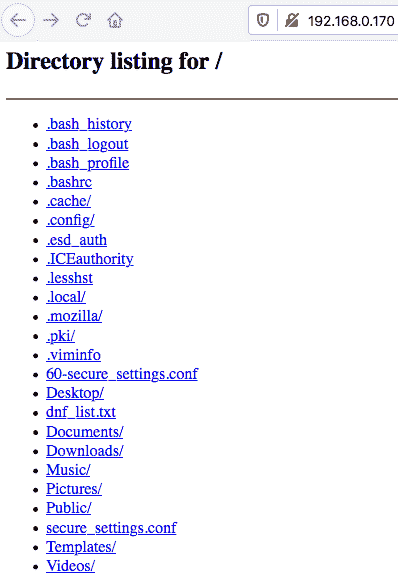
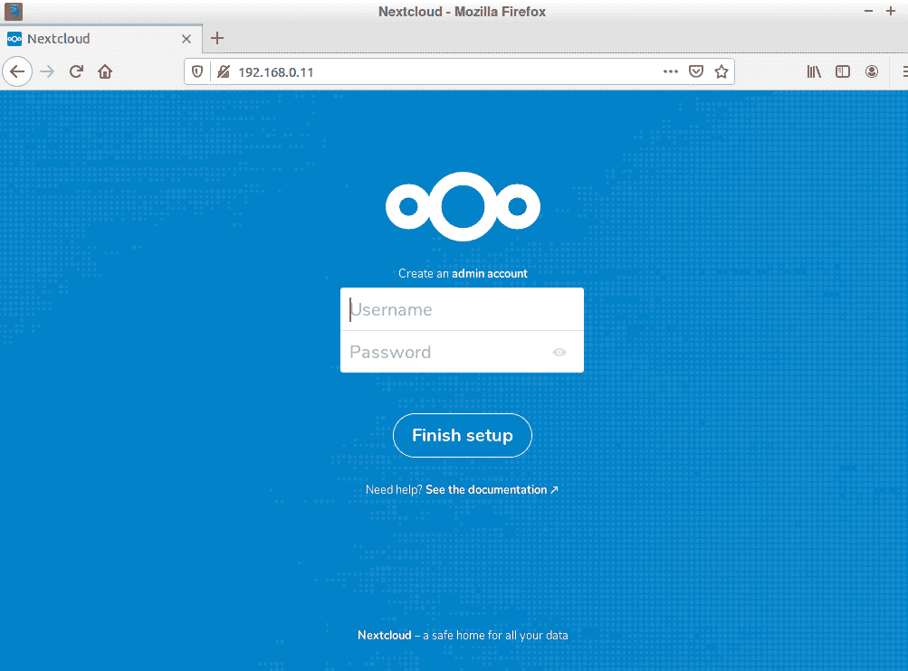
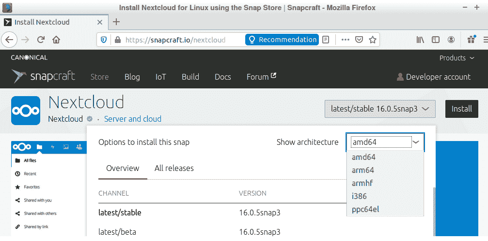
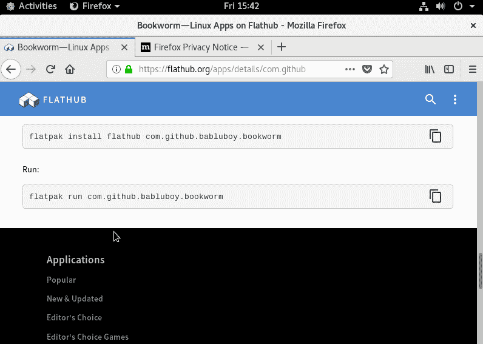

# 第十章：11 内核强化与进程隔离

## 加入我们的书籍社区，在 Discord 上

[`packt.link/SecNet`](https://packt.link/SecNet)


虽然 Linux 内核本身设计上已经相当安全，但仍有一些方法可以进一步锁定它。一旦你知道该寻找什么，这些操作非常简单。调整内核可以帮助防止某些网络攻击和某些类型的信息泄露。（但别担心——你不需要重新编译整个内核就能利用这些方法。）

通过进程隔离，我们的目标是防止恶意用户进行垂直或水平权限提升。通过将进程彼此隔离，我们可以帮助防止某人控制根用户进程或其他用户的进程。这两种类型的权限提升都可能帮助攻击者控制系统或访问敏感信息。

在本章中，我们将快速浏览`/proc`文件系统，并向你展示如何配置其中的某些参数，以帮助增强安全性。然后，我们将讨论进程隔离的话题，介绍确保进程相互隔离的各种方法。

在本章中，我们将涵盖以下主题：

+   理解`/proc`文件系统

+   使用`sysctl`设置内核参数

+   配置`sysctl.conf`文件

+   进程隔离概述

+   控制组

+   命名空间隔离

+   内核能力

+   SECCOMP 和系统调用

+   使用 Docker 容器的进程隔离

+   使用 Firejail 进行沙箱化

+   使用 Snappy 进行沙箱化

+   使用 Flatpak 进行沙箱化

所以，如果你准备好了，我们将从查看`/proc`文件系统开始。

## 理解`/proc`文件系统

如果你`cd`进入任何 Linux 发行版的`/proc/`目录并四处查看，你可能会认为这里没什么特别的。你会看到文件和目录，所以它看起来可能只是另一个目录。但实际上，它是非常特别的。它是 Linux 系统上几种**伪文件系统**之一。（伪这个词的定义是*假*，所以你也可以把它看作一个假文件系统。）

如果你把 Linux 机器的主操作系统驱动器取出并将其作为第二个驱动器安装到另一台机器上，你会看到该驱动器上有一个`/proc/`目录，但你不会看到任何内容。这是因为`/proc/`目录的内容是每次启动 Linux 机器时从头开始创建的，然后每次关闭机器时都会清空。在`/proc/`目录中，你会发现两类常见的信息：

+   关于用户模式进程的信息

+   关于操作系统内核级别活动的信息

我们将首先查看用户模式进程。

### 查看用户模式进程

如果你在 `/proc/` 中调用 `ls` 命令，你会看到一大堆以数字命名的目录。以下是我在 CentOS 虚拟机上的部分列出：

```
[donnie@localhost proc]$ ls -l
total 0
dr-xr-xr-x. 9 root root 0 Oct 19 14:23 1
dr-xr-xr-x. 9 root root 0 Oct 19 14:23 10
dr-xr-xr-x. 9 root root 0 Oct 19 14:23 11
dr-xr-xr-x. 9 root root 0 Oct 19 14:23 12
dr-xr-xr-x. 9 root root 0 Oct 19 14:23 13
dr-xr-xr-x. 9 root root 0 Oct 19 14:24 1373
dr-xr-xr-x. 9 root root 0 Oct 19 14:24 145
dr-xr-xr-x. 9 root root 0 Oct 19 14:23 15
dr-xr-xr-x. 9 root root 0 Oct 19 14:23 16
dr-xr-xr-x. 9 root root 0 Oct 19 14:23 17
. . .
. . .
```

每个这些编号的目录对应于用户模式进程的 **进程 ID**（**PID**）编号。在任何 Linux 系统中，PID 1 始终是 `init` 系统进程，它是开机启动时第一个启动的用户模式进程。

> 在 Debian/Ubuntu 系统中，PID 1 的名称是`init`。在 `RHEL/CentOS/AlmaLinux` 系统中，它叫做`systemd`。所有这些发行版都运行 `systemd` `init` 系统，但 Debian/Ubuntu 用户选择保留旧的 `init` 名称作为 PID 1。

在每个编号目录中，你会看到包含特定正在运行的进程信息的各种文件和子目录。例如，在 `1` 目录中，你会看到与 `init` 进程相关的内容。以下是部分列出：

```
[donnie@localhost 1]$ ls -l
ls: cannot read symbolic link 'cwd': Permission denied
ls: cannot read symbolic link 'root': Permission denied
ls: cannot read symbolic link 'exe': Permission denied
total 0
dr-xr-xr-x. 2 root root 0 Oct 19 14:23 attr
-rw-r--r--. 1 root root 0 Oct 19 15:08 autogroup
-r--------. 1 root root 0 Oct 19 15:08 auxv
-r--r--r--. 1 root root 0 Oct 19 14:23 cgroup
--w-------. 1 root root 0 Oct 19 15:08 clear_refs
-r--r--r--. 1 root root 0 Oct 19 14:23 cmdline
-rw-r--r--. 1 root root 0 Oct 19 14:23 comm
. . .
. . .
```

如你所见，有一些符号链接我们没有 root 权限无法访问。当我们使用 `sudo` 时，我们可以看到这些符号链接指向哪里：

```
[donnie@localhost 1]$ sudo ls -l
total 0
dr-xr-xr-x. 2 root root 0 Oct 19 14:23 attr
-rw-r--r--. 1 root root 0 Oct 19 15:08 autogroup
-r--------. 1 root root 0 Oct 19 15:08 auxv
-r--r--r--. 1 root root 0 Oct 19 14:23 cgroup
--w-------. 1 root root 0 Oct 19 15:08 clear_refs
-r--r--r--. 1 root root 0 Oct 19 14:23 cmdline
-rw-r--r--. 1 root root 0 Oct 19 14:23 comm
-rw-r--r--. 1 root root 0 Oct 19 15:08 coredump_filter
-r--r--r--. 1 root root 0 Oct 19 15:08 cpuset
lrwxrwxrwx. 1 root root 0 Oct 19 15:08 cwd -> /
. . .
. . .
```

你可以使用 `cat` 命令查看其中一些项目的内容，但并不是所有的都能查看。然而，即使你能够查看内容，除非你是操作系统程序员，否则很难理解其中的含义。与其直接查看这些信息，不如使用 `top` 或 `ps`，它们从 `/proc/` 获取信息并进行解析，使得人类可以阅读。

> 我假设你们中的大多数人已经熟悉 `top` 和 `ps`。对于那些不熟悉的人，下面是简短的说明。
> 
> > `ps` 提供了一个静态的、关于你机器进程的显示。它有许多选项开关，可以显示不同量的信息。我最喜欢的 `ps` 命令是 `ps aux`，它提供了关于每个进程的相当完整的信息。
> > 
> > `top` 提供了一个动态的、不断变化的机器进程显示。虽然有一些选项开关可以使用，但通常只需调用 `top` 而不带任何选项即可。

接下来，我们来看一下内核信息。

### 查看内核信息

在 `/proc/` 的顶层，带有实际名称的文件和目录包含有关 Linux 内核运行状态的信息。以下是部分视图：

```
[donnie@localhost proc]$ ls -l
total 0
. . .
dr-xr-xr-x. 2 root root 0 Oct 19 14:24 acpi
dr-xr-xr-x. 5 root root 0 Oct 19 14:24 asound
-r--r--r--. 1 root root 0 Oct 19 14:26 buddyinfo
dr-xr-xr-x. 4 root root 0 Oct 19 14:24 bus
-r--r--r--. 1 root root 0 Oct 19 14:23 cgroups
-r--r--r--. 1 root root 0 Oct 19 14:23 cmdline
-r--r--r--. 1 root root 0 Oct 19 14:26 consoles
-r--r--r--. 1 root root 0 Oct 19 14:24 cpuinfo
. . .
```

就像在用户模式下的操作一样，你可以使用 `cat` 来查看一些不同的文件。例如，以下是 `cpuinfo` 文件的部分输出：

```
[donnie@localhost proc]$ cat cpuinfo
processor    : 0
vendor_id    : AuthenticAMD
cpu family    : 16
model        : 4
model name    : Quad-Core AMD Opteron(tm) Processor 2380
stepping    : 2
microcode    : 0x1000086
cpu MHz        : 2500.038
cache size    : 512 KB
physical id    : 0
siblings    : 1
core id        : 0
cpu cores    : 1
. . .
```

在这里，你可以看到我的 CPU 的类型和速度评级、缓存大小，以及这个 CentOS 虚拟机只运行在主机机器的八个 CPU 核心中的一个上。（在 Fedora 主机操作系统上执行此操作会显示关于主机机器所有八个核心的信息。）

> 是的，你没看错。我在一本旧版书的部分章节中，曾用一台配备 Opteron 处理器的 2009 年款 HP 工作站进行写作。我是从 eBay 上以非常便宜的价格买到的，它与 Fedora 的 LXDE 版本运行得非常流畅。而你在本书其他部分看到的 openSUSE 机器正是与此同款，来自同一个供应商。（所以，现在你知道我到底有多节俭了。）然而，很遗憾的是，RHEL 9 类型的发行版无法在第一代 x86_64 CPU 上运行，所以现在我用的是一台更新的机器来写这本 *第三版*。

然而，针对我们目前的讨论，我们无需深入了解 `/proc/` 中的每一个细节。对我们讨论来说，更重要的是可以从 `/proc/` 内部设置的不同参数。例如，在 `/proc/sys/net/ipv4/` 目录中，我们可以看到许多不同的项，它们可以调整以改变 IPv4 网络性能。以下是部分列表：

```
[donnie@localhost ipv4]$ pwd
/proc/sys/net/ipv4
[donnie@localhost ipv4]$ ls -l
total 0
-rw-r--r--. 1 root root 0 Oct 19 16:11 cipso_cache_bucket_size
-rw-r--r--. 1 root root 0 Oct 19 16:11 cipso_cache_enable
-rw-r--r--. 1 root root 0 Oct 19 16:11 cipso_rbm_optfmt
-rw-r--r--. 1 root root 0 Oct 19 16:11 cipso_rbm_strictvalid
dr-xr-xr-x. 1 root root 0 Oct 19 14:23 conf
-rw-r--r--. 1 root root 0 Oct 19 16:11 fib_multipath_hash_policy
-rw-r--r--. 1 root root 0 Oct 19 16:11 fib_multipath_use_neigh
-rw-r--r--. 1 root root 0 Oct 19 16:11 fwmark_reflect
-rw-r--r--. 1 root root 0 Oct 19 16:11 icmp_echo_ignore_all
. . .
. . .
```

我们可以使用 `cat` 命令查看每个参数，像这样：

```
[donnie@localhost ipv4]$ cat icmp_echo_ignore_all 
0
[donnie@localhost ipv4]$
```

所以，`icmp_echo_ignore_all` 参数被设置为 `0`，这意味着它被禁用。如果我从另一台机器 ping 这台机器，假设防火墙配置允许这种操作，这台机器将响应 ping 请求。如果需要更改此设置，以下是几种方法：

+   从命令行使用 `echo` 向参数输入新值。

+   使用命令行中的 `sysctl` 工具。

+   配置 `/etc/sysctl.conf` 文件。

+   将一个包含新配置的 `.conf` 文件添加到 `/etc/sysctl.d/` 目录中。

+   从 shell 脚本中运行命令。

让我们继续详细查看这些不同的方法。

## 使用 sysctl 设置内核参数。

你在旧版 Linux 教科书中看到的传统方法是 `echo` 一个值到 `/proc/` 参数中。这不能直接与 `sudo` 一起使用，因此你需要使用 `bash -c` 命令强制执行命令。你可以看到我正在更改 `icmp_echo_ignore_all` 参数的值：

```
[donnie@localhost ~]$ sudo bash -c "echo '1' > /proc/sys/net/ipv4/icmp_echo_ignore_all"
[donnie@localhost ~]$ cat /proc/sys/net/ipv4/icmp_echo_ignore_all
1
[donnie@localhost ~]$
```

当值设置为 `1` 时，这台机器将忽略所有 ping 数据包，无论防火墙如何配置。像这样设置的任何值都是临时的，重启机器后将恢复为默认设置。

列表中的下一个设置是 `icmp_echo_ignore_broadcasts`，它的设置如下：

```
[donnie@localhost ipv4]$ cat icmp_echo_ignore_broadcasts 
1
[donnie@localhost ipv4]$
```

默认情况下已经启用，所以开箱即用时，Linux 已经能抵抗 **拒绝服务**（**DoS**）攻击，这些攻击涉及 ICMP 广播洪泛。

使用 `echo` 配置 `/proc/` 参数已经过时，个人而言，我不喜欢这么做。最好使用 `sysctl`，这是更现代的操作方式。它易于使用，你可以在 `sysctl` 的手册页中阅读到更多信息。

要查看所有参数设置的列表，只需执行以下操作：

```
[donnie@localhost ~]$ sudo sysctl -a
abi.vsyscall32 = 1
crypto.fips_enabled = 1
debug.exception-trace = 1
debug.kprobes-optimization = 1
dev.hpet.max-user-freq = 64
dev.mac_hid.mouse_button2_keycode = 97
dev.mac_hid.mouse_button3_keycode = 100
dev.mac_hid.mouse_button_emulation = 0
dev.raid.speed_limit_max = 200000
dev.raid.speed_limit_min = 1000
dev.scsi.logging_level = 0
fs.aio-max-nr = 65536
. . .
. . .
```

要设置一个参数，可以使用`-w`选项写入新值。诀窍在于，目录路径中的正斜杠被替换为点，并且忽略`/proc/sys/`路径部分。因此，要将`icmp_echo_ignore_all`值更改回`0`，我们需要执行以下操作：

```
[donnie@localhost ~]$ sudo sysctl -w net.ipv4.icmp_echo_ignore_all=0
net.ipv4.icmp_echo_ignore_all = 0
[donnie@localhost ~]$
```

在这种情况下，变更是永久性的，因为我只是将参数更改回其默认设置。不过，通常情况下，我们进行的任何更改只会持续到重启机器为止。有时，这样就可以了。而有时，我们可能需要使更改永久生效。

## 配置 sysctl.conf 文件

Ubuntu 和 CentOS/AlmaLinux 的默认配置之间有一些显著的差异。它们都使用`/etc/sysctl.conf`文件，但在 CentOS 和 AlmaLinux 中，该文件除了些许解释性注释外并没有其他内容。Ubuntu 和 CentOS/AlmaLinux 都在`/usr/lib/sysctl.d/`目录下有包含默认设置的文件，但 CentOS 和 AlmaLinux 的文件比 Ubuntu 的更多。在 Ubuntu 中，你会在`/etc/sysctl.d/`目录下找到其他带有默认值的文件。而在 CentOS 和 AlmaLinux 中，该目录只包含一个指向`/etc/sysctl.conf`文件的符号链接。此外，你会发现一些内容是硬编码到 Linux 内核中的，并未在任何配置文件中提到。典型的 Linux 方式是，每个发行版都有不同的配置方法，确保用户感到困惑。唯一一致的是，在任何虚拟机上，你都可以使用`systemd-analyze cat-config sysctl.d`命令查看在这些文件中定义的内核设置的摘要。（不过，要查看完整的内核设置列表，你仍然需要使用`sysctl -a`命令。）

> 在 AlmaLinux 机器的`/usr/lib/sysctl.d/README`文件中，你将找到有关该如何工作的额外信息。

现在，介绍部分已经结束，让我们看看能否弄清楚这一切。

### 配置 sysctl.conf – Ubuntu

在 Ubuntu 机器的`/etc/sysctl.conf`文件中，你会看到许多注释和一些可以调整的示例。注释很好地解释了各种设置的作用。因此，我们将从这里开始。

该文件的大部分内容包含了有助于提高网络安全性的设置。在文件的顶部，我们看到：

```
# Uncomment the next two lines to enable Spoof protection (reverse-path filter)
# Turn on Source Address Verification in all interfaces to
# prevent some spoofing attacks
#net.ipv4.conf.default.rp_filter=1
#net.ipv4.conf.all.rp_filter=1
```

伪造攻击是指恶意行为者向你发送带有伪造 IP 地址的网络数据包。伪造可以用于几种不同的目的，如 DoS 攻击、匿名端口扫描或欺骗访问控制。启用这些设置时，操作系统会验证它是否能访问数据包头中的源地址。如果无法访问，则会拒绝该数据包。你可能会想知道为什么这是禁用的，因为它看起来是件好事。然而，事实并非如此。它在另一个文件中已启用。如果你查看`/etc/sysctl.d/10-network-security.conf`文件，你会看到它在那里已启用。所以，不需要取消注释这两行。

接下来，我们看到的是：

```
# Uncomment the next line to enable TCP/IP SYN cookies
# See http://lwn.net/Articles/277146/
# Note: This may impact IPv6 TCP sessions too
#net.ipv4.tcp_syncookies=1
```

一种 DoS 攻击形式是向目标机器发送大量 SYN 数据包，但没有完成剩余的三次握手。这可能导致受害机器有大量半开连接，最终耗尽机器接受更多合法连接的能力。启用 SYN cookies 可以帮助防止这种攻击。在我用来写这本书前一版的 Ubuntu 18.04 上，SYN cookies 在`/etc/sysctl.d/10-network-security.conf`文件中已经启用。而在 Ubuntu 22.04 上，除了`sysctl.conf`文件中的禁用设置外，其他任何`sysctl`配置文件中都找不到该设置。然而，在 22.04 机器上运行`sudo sysctl -a`命令，会显示 SYN cookies 确实已启用：

```
donnie@ubuntu-2204:~$ sudo sysctl -a | grep syncookie
net.ipv4.tcp_syncookies = 1
donnie@ubuntu-2204:~$
```

要找到这个设置的位置，我们需要做一些巧妙的侦探工作。在 22.04 机器的`/boot/`目录下，你会看到每个已安装内核都有一个`config`文件。当我使用`grep -i`执行不区分大小写的搜索，在某个`config`文件中查找`syncookies`文本字符串时，我什么也没找到。于是我将搜索范围扩展到所有包含`syn`的文本字符串。这是搜索结果：

```
donnie@ubuntu-2204:/boot$ grep -i 'syn' config-5.15.0-52-generic 
. . .
. . .
CONFIG_SYN_COOKIES=y
. . .
. . .
```

所以，我们看到，在 Ubuntu 22.04 上，开发者选择将 SYN cookies 的设置硬编码到内核中，而不是将其设置在`sysctl`配置文件中。正如我们之前在 Ubuntu 18.04 机器上看到的那样，`sysctl.conf`文件中不需要取消注释`syncookies`这一行。

接下来我们看到的是：

```
# Uncomment the next line to enable packet forwarding for IPv4
#net.ipv4.ip_forward=1
```

取消注释这一行将允许网络数据包在具有多个网络接口的机器之间流动。除非你在设置路由器或虚拟私人网络服务器，否则保持这个设置不变。

到目前为止，我们只看到了 IPv4 的内容。接下来我们来看一个关于 IPv6 的：

```
# Uncomment the next line to enable packet forwarding for IPv6
#  Enabling this option disables Stateless Address Autoconfiguration
#  based on Router Advertisements for this host
#net.ipv6.conf.all.forwarding=1
```

一般来说，你也会希望将这行保持为注释状态，就像现在这样。在 IPv6 环境中禁用**无状态地址自动配置**意味着你需要设置一个 DHCPv6 服务器，或者为所有主机设置静态 IPv6 地址。

下一节控制 ICMP 重定向：

```
# Do not accept ICMP redirects (prevent MITM attacks)
#net.ipv4.conf.all.accept_redirects = 0
#net.ipv6.conf.all.accept_redirects = 0
# _or_
# Accept ICMP redirects only for gateways listed in our default
# gateway list (enabled by default)
# net.ipv4.conf.all.secure_redirects = 1
#
```

允许 ICMP 重定向可能会让 **中间人攻击**（**MITM**）成功。取消注释此片段顶部两行代码将完全禁用 ICMP 重定向。底部部分的最后一行允许重定向，但仅限于来自受信任网关的重定向。这行代码有些迷惑人，因为即使它被注释掉，并且其他配置文件中没有涉及此内容，安全重定向实际上默认是启用的。我们可以通过使用 `grep` 过滤 `sysctl -a` 输出，来看到这一点：

```
donnie@ubuntu-2204:/etc$ sudo sysctl -a | grep 'secure_redirects'
net.ipv4.conf.all.secure_redirects = 1
net.ipv4.conf.default.secure_redirects = 1
net.ipv4.conf.enp0s3.secure_redirects = 1
net.ipv4.conf.lo.secure_redirects = 1
donnie@ubuntu-2204:/etc$
```

在这里，我们可以看到所有网络接口上都启用了安全重定向。但是，如果你确定你的机器永远不会作为路由器使用，最好还是完全禁用 ICMP 重定向。（稍后我们会做这个操作。）

本文件中的最后一个网络项涉及火星数据包：

```
# Log Martian Packets
#net.ipv4.conf.all.log_martians = 1
#
```

现在，如果你和我一样年纪大，可能记得 60 年代有一个很傻的电视节目叫做 *My Favorite Martian*。不过，这个设置和那个没有任何关系。火星数据包的源地址通常不能被特定的网络接口接受。例如，如果你的面向互联网的服务器接收到带有私有 IP 地址或回环设备地址的数据包，那就是一个火星数据包。为什么它们被称为火星数据包呢？因为有人说这些数据包不是来自地球。无论如何，火星数据包可能会消耗网络资源，所以了解它们是很有帮助的。你可以通过取消注释前面代码片段中的那一行，或者在 `/etc/sysctl.d/` 目录下放置一个覆盖文件来启用日志记录功能。（我们稍后也会做这个。）

以下代码片段是 **Magic 系统请求键** 的内核参数：

```
# Magic system request key
# 0=disable, 1=enable all
# Debian kernels have this set to 0 (disable the key)
# See https://www.kernel.org/doc/Documentation/sysrq.txt
# for what other values do
#kernel.sysrq=438
```

当启用此参数时，你可以通过按下特定的 **Magic 键** 序列来执行某些功能，例如关闭或重启系统、向进程发送信号、转储进程调试信息以及其他几个功能。你可以通过按下 Alt + SysReq + 命令键的组合键来实现。（SysReq 键是一些键盘上的 PrtScr 键，而命令键是触发某些特定命令的键。）将此值设置为 `0` 会完全禁用此功能，设置为 `1` 会启用所有 Magic 键功能，设置大于 `1` 的值只会启用特定的功能。在本文件中，此选项似乎是禁用的，但实际上它在 `/etc/sysctl.d/10-magic-sysrq.conf` 文件中是启用的。如果你正在处理一台被锁在机房中且无法通过串口控制台远程访问的服务器，这可能不是什么大问题。然而，对于一台暴露在外或可以通过串口控制台访问的机器，你可能希望禁用此功能。（稍后我们也会进行此操作。）

在某些情况下，攻击者可能会创建指向敏感文件的链接，从而轻松访问它们。链接保护功能在 Ubuntu 18.04 的`/etc/sysctl.d/10-link-restrictions.conf`文件中启用，而在 Ubuntu 22.04 的`/usr/lib/sysctl.d/99-protect-links.conf`文件中启用。以下是 22.04 上的设置示例：

```
# Protected links
#
# Protects against creating or following links under certain conditions
# Debian kernels have both set to 1 (restricted) 
# See https://www.kernel.org/doc/Documentation/sysctl/fs.txt
fs.protected_fifos = 1
fs.protected_hardlinks = 1
fs.protected_regular = 2
fs.protected_symlinks = 1
```

这基本上覆盖了 Ubuntu 中的设置。接下来，我们来看看 CentOS 和 AlmaLinux。

### 配置 sysctl.conf – CentOS 和 AlmaLinux

在 CentOS 和 AlmaLinux 中，`/etc/sysctl.conf` 文件为空，仅包含一些注释。这些注释告诉你查找其他地方的默认配置文件，并通过在`/etc/sysctl.d/`目录中创建新的配置文件来进行更改。

CentOS 和 AlmaLinux 的默认安全设置与 Ubuntu 非常相似，唯一的区别在于它们的配置位置不同。例如，在 CentOS 和 AlmaLinux 中，防伪（`rp_filter`）参数和链接保护参数位于`/usr/lib/sysctl.d/50-default.conf`文件中。

通过将`sysctl -a`命令传递给`grep`，你也能看到 SYN cookies 已启用：

```
[donnie@alma9 ~]$ sudo sysctl -a | grep 'syncookie'
net.ipv4.tcp_syncookies = 1
[donnie@alma9 ~]$
```

`secure_redirects` 的情况也是如此：

```
[donnie@alma9 ~]$ sudo sysctl -a | grep 'secure_redirects'
net.ipv4.conf.all.secure_redirects = 1
net.ipv4.conf.default.secure_redirects = 1
net.ipv4.conf.enp0s3.secure_redirects = 1
net.ipv4.conf.lo.secure_redirects = 1
net.ipv4.conf.virbr0.secure_redirects = 1
net.ipv4.conf.virbr0-nic.secure_redirects = 1
[donnie@alma9 ~]$
```

就像在 Ubuntu 中一样，SYN cookies 设置是硬编码到 Linux 内核中的，正如我们在这里看到的：

```
[donnie@alma9 ~]$ cd /boot
[donnie@alma9 boot]$ grep -i cookies config-5.14.0-70.30.1.el9_0.x86_64 
CONFIG_SYN_COOKIES=y
[donnie@alma9 boot]$
```

好的，到目前为止一切顺利。我们继续进行。

### 设置额外的内核硬化参数

到目前为止，我们看到的情况还不错。我们查看的多数参数已经设置为最安全的值。但是否还有改进的空间？确实有。虽然通过查看任何配置文件你是看不出来的，但在 Ubuntu、CentOS 和 AlmaLinux 中，有很多项目的默认值并未在任何常规配置文件中设置。查看这些问题的最佳方法是使用系统扫描工具，例如**Lynis**。

Lynis 是一个安全扫描工具，可以显示系统的许多信息。（我们将在*第十四章*，*漏洞扫描与入侵检测*中详细介绍它。）现在，我们只讨论它如何帮助我们加固 Linux 内核。

扫描完成后，你会在屏幕输出中看到一个`[+] Kernel Hardening`部分。它相当长，这里只是其中的一部分：

```
[+] Kernel Hardening
------------------------------------
 - Comparing sysctl key pairs with scan profile
 - fs.protected_hardlinks (exp: 1) [ OK ]
 - fs.protected_symlinks (exp: 1) [ OK ]
 - fs.suid_dumpable (exp: 0) [ OK ]
 - kernel.core_uses_pid (exp: 1) [ OK ]
 - kernel.ctrl-alt-del (exp: 0) [ OK ]
 - kernel.dmesg_restrict (exp: 1) [ DIFFERENT ]
 - kernel.kptr_restrict (exp: 2) [ DIFFERENT ]
 - kernel.randomize_va_space (exp: 2) [ OK ]
 - kernel.sysrq (exp: 0) [ DIFFERENT ]
. . .
. . .
```

所有标记为`OK`的项表示最佳安全配置。标记为`DIFFERENT`的项应更改为建议的`exp:`值，括号中的**exp**代表**期望的**值。让我们现在在动手实验中进行这些更改。

#### 动手实验 – 使用 Lynis 扫描内核参数

Lynis 在 Ubuntu 的正常仓库中可用，在 CentOS 和 AlmaLinux 的 EPEL 仓库中也能找到。虽然它总是比从作者网站上直接下载的版本落后几个版本，但目前这没问题。当我们进入*第十四章*，*漏洞扫描与入侵检测*时，我会展示如何获取最新版本。现在我们开始吧：

1.  从 Ubuntu 的软件仓库中安装 Lynis，如下所示：

```
sudo apt update
sudo apt install lynis
```

对于 CentOS 07，请执行以下操作：

```
sudo yum install lynis
```

对于 AlmaLinux 8 或 9，执行以下操作：

```
sudo dnf install lynis
```

1.  使用以下命令扫描系统：

```
sudo lynis audit system
```

1.  扫描完成后，向上滚动回`[+] Kernel Hardening`部分的输出。将`sysctl`键对复制并粘贴到文本文件中。将其保存为`secure_values.conf`文件，保存在你自己的主目录中。文件内容应如下所示：

```
 - fs.protected_hardlinks (exp: 1) [ OK ]
 - fs.protected_symlinks (exp: 1) [ OK ]
 - fs.suid_dumpable (exp: 0) [ OK ]
 - kernel.core_uses_pid (exp: 1) [ OK ]
 - kernel.ctrl-alt-del (exp: 0) [ OK ]
 - kernel.dmesg_restrict (exp: 1) [ DIFFERENT ]
 - kernel.kptr_restrict (exp: 2) [ DIFFERENT ]
 - kernel.randomize_va_space (exp: 2) [ OK ]
 - kernel.sysrq (exp: 0) [ DIFFERENT ]
 - kernel.yama.ptrace_scope (exp: 1 2 3) [ DIFFERENT ]
 - net.ipv4.conf.all.accept_redirects (exp: 0) [ DIFFERENT ]
 - net.ipv4.conf.all.accept_source_route (exp: 0) [ OK ]
. . .
. . .
```

1.  使用`grep`将所有`DIFFERENT`行发送到一个新文件。命名为`60-secure_values.conf`：

```
grep 'DIFFERENT' secure_values.conf > 60-secure_values.conf
```

1.  编辑`60-secure_values.conf`文件，将其转换为`sysctl`配置格式。将每个参数设置为当前在括号内的`exp`值。最终文件应如下所示：

```
kernel.dmesg_restrict = 1
kernel.kptr_restrict = 2
kernel.sysrq = 0
kernel.yama.ptrace_scope = 1 2 3
net.ipv4.conf.all.accept_redirects = 0
net.ipv4.conf.all.log_martians = 1
net.ipv4.conf.all.send_redirects = 0
net.ipv4.conf.default.accept_redirects = 0
net.ipv4.conf.default.log_martians = 1
net.ipv6.conf.all.accept_redirects = 0
net.ipv6.conf.default.accept_redirects = 0
```

1.  将该文件复制到`/etc/sysctl.d/`目录：

```
sudo cp 60-secure_values.conf /etc/sysctl.d/
```

1.  重启机器以读取新文件中的值：

```
sudo shutdown -r now
```

重复*步骤 2*。大多数项目现在应该显示出它们最安全的值。然而，你可能会看到一些`DIFFERENT`行出现。没关系；只需将这些参数的行移动到主`/etc/sysctl.conf`文件中，然后再次重启机器。

这就是实验的结束——恭喜你！

我们已经讨论了一些在这个过程中更改的项目。以下是其余项目的详细说明：

+   `kernel.dmesg_restrict = 1`：默认情况下，任何非特权用户都可以运行`dmesg`命令，这个命令允许用户查看不同类型的内核信息。其中一些信息可能是敏感的，因此我们希望将此参数设置为`1`，使得只有具有 root 权限的人才能使用`dmesg`。

+   `kernel.kptr_restrict = 2`：此设置防止`/proc`暴露内存中的内核地址。将其设置为`0`会完全禁用它，而将其设置为`1`则会阻止非特权用户查看地址信息。将其设置为`2`，如我们所做的，防止任何人查看地址信息，无论其权限等级如何。不过，需要注意的是，将其设置为`1`或`2`可能会阻止某些性能监控程序（例如`perf`）的运行。如果你必须进行性能监控，可能需要将其设置为`0`。（这并不像听起来那么糟糕，因为启用了`kernel.dmesg_restrict = 1`设置可以帮助缓解这个问题。）

+   `kernel.yama.ptrace_scope = 1 2 3`：这会对`ptrace`工具进行限制，`ptrace`是一个调试程序，黑客也可以使用它。`1`限制`ptrace`仅调试父进程。`2`意味着只有具有 root 权限的人才能使用`ptrace`，而`3`则阻止任何人使用`ptrace`追踪进程。

在本节中，你学习了如何配置各种内核参数以帮助加固你的系统。接下来，我们将通过限制谁能查看进程信息来进一步加固系统。

### 防止用户看到彼此的进程

默认情况下，用户可以使用像 `ps` 或 `top` 这样的工具查看其他用户的进程，以及自己的进程。为了演示这一点，下面是 `ps aux` 命令的部分输出：

```
[donnie@localhost ~]$ ps aux
USER       PID %CPU %MEM    VSZ   RSS TTY      STAT START   TIME COMMAND
root         1  0.0  0.7 179124 13752 ?        Ss   12:05   0:03 /usr/lib/systemd/systemd --switched-root --system --deserialize 17
root         2  0.0  0.0      0     0 ?        S    12:05   0:00 [kthreadd]
root         3  0.0  0.0      0     0 ?        I<   12:05   0:00 [rcu_gp]
. . .
. . .
colord 2218 0.0 0.5 323948 10344 ? Ssl 12:06 0:00 /usr/libexec/colord
gdm 2237 0.0 0.2 206588 5612 tty1 Sl 12:06 0:00 /usr/libexec/ibus-engine-simple
root 2286 0.0 0.6 482928 11932 ? Sl 12:06 0:00 gdm-session-worker [pam/gdm-password]
donnie 2293 0.0 0.5 93280 9696 ? Ss 12:06 0:00 /usr/lib/systemd/systemd --user
donnie 2301 0.0 0.2 251696 4976 ? S 12:06 0:00 (sd-pam)
donnie 2307 0.0 0.6 1248768 12656 ? S<sl 12:06 0:00 /usr/bin/pulseaudio --daemonize=no
. . .
```

即使只是拥有普通用户权限，我也可以查看属于 root 用户和其他系统用户的进程，以及我自己的进程。（如果我的猫也登录了，我还可以查看它们的进程。）这些信息对管理员来说很有用，但也可能帮助坏人。这些信息可以帮助黑客计划对系统的攻击，甚至可能泄露一些敏感信息。应对这一问题的最佳方法是使用 `hidepid` 选项挂载 `/proc` 文件系统，只要你不是在使用某种 RHEL 9 类型的发行版。

> 这个功能在 RHEL 9 类型的发行版中已被禁用。所以，不要在任何 AlmaLinux 9 机器上尝试这个方法。它不仅不起作用，可能还会破坏你的机器。

在 Ubuntu、CentOS 7 或 AlmaLinux 8 虚拟机上，你可以通过在 `/etc/fstab` 文件末尾添加一行来实现这一点，如下所示：

```
proc    /proc    proc    hidepid=2   0    0
```

然后，重新挂载 `/proc`，如下所示：

```
sudo mount -o remount proc
```

现在，任何没有 `sudo` 权限的用户只能查看自己的进程。（很巧妙，对吧？）

> `hidepid` 选项的三个值如下：
> 
> > `0`：这是默认设置，允许所有用户查看彼此的进程。
> > 
> > `1`：这允许所有用户查看 `/proc` 中其他用户的进程目录。然而，用户只能进入自己的进程目录（`cd`）。此外，他们只能使用 `ps` 或 `top` 查看自己的进程信息。
> > 
> > `2`：这会隐藏所有其他用户的进程信息，包括 `/proc` 中的进程目录。

现在，既然你已经了解了 `/proc` 文件系统的内部工作原理以及如何为最佳安全配置它，让我们来看一下**进程隔离**。

## 理解进程隔离

网络入侵者的主要目标是获得执行恶意行为所需的权限。这通常涉及以普通用户身份登录，然后进行某种形式的**权限提升**。**垂直提升**涉及获得 root 权限，而**水平提升**则是获得其他普通用户的权限。如果其他普通用户在其可以访问的文件夹中有敏感文档，那么水平提升可能就足以满足入侵者的需求。自主访问控制（DAC）和强制访问控制（MAC）可以提供帮助，但我们还希望将进程相互隔离，并确保进程仅以最低的权限运行。

> 在规划针对这些类型攻击的防御时，考虑到攻击可能来自外部或内部。因此，是的，你确实需要防范来自公司员工的攻击。

在这一节中，我们将探讨 Linux 内核中促进进程隔离的各种功能。然后，我们将探讨一些有趣的使用这些功能的方式。

### 理解控制组（cgroups）

控制组，更常见的叫法是**cgroups**，最早是在 2010 年 Red Hat Enterprise Linux 6 中引入的。最初，它们只是一个附加功能，用户必须手动创建它们。如今，随着`systemd` `init`系统的出现，cgroups 已经成为操作系统的一个重要组成部分，每个进程默认运行在自己的 cgroup 中。

> 当我编写这本书的前两版时，所有企业级的`systemd`基础 Linux 发行版都在运行**cgroups Version 1**。然而现在，它们都已切换到**cgroup Version 2**。（是的，Version 1 是*cgroups*，Version 2 是*cgroup*，我也不知道为什么。）尽管这两个版本在架构上有较大的差异，但它们的使用方法差别不大。主要的不同在于 Version 2 提供了更多的功能，并且可以设置的一些参数名称不同。如果你想深入了解 cgroups，可以阅读我的另一本书《*Linux 服务管理与 systemd 简明教程*》。

使用 cgroups 时，进程运行在它们自己的内核空间和内存空间中。如果需要，管理员可以轻松配置一个 cgroup 来限制该进程可以使用的资源。这不仅有助于安全性，也有助于优化系统性能。

那么，什么是 cgroup？嗯，它其实就是一组进程，为了某个特定目的而聚集在一起。以下是你可以用 cgroups 做的事情：

+   **设置资源限制**：对于每个 cgroup，你可以设置 CPU 使用、I/O 使用和内存使用的资源限制。

+   **执行不同的计费功能**：你可以衡量每个 cgroup 的资源使用情况，这使得根据客户使用的资源来收费变得更加容易。

+   **优先分配资源**：你可以为一个疯狂占用资源的用户设置限制。

+   **冻结、检查点和重启**：这些功能对于故障排除非常有用。它们允许你停止一个进程，拍摄系统状态快照，并从备份中恢复系统状态。

+   **将进程分配到特定的 CPU 核心**：这是 Version 2 的一项酷炫功能。

没有足够的空间来查看所有这些功能，但没关系。现在，我们主要关注的是设置资源限制。除了少数几个例外，所有基于`systemd`的 Linux 发行版在这方面的工作方式基本相同。目前，让我们在一台 AlmaLinux 9 机器上查看这个功能。首先，我们会安装 Apache web 服务器包，如下所示：

```
sudo dnf install httpd
sudo systemctl enable --now httpd
```

默认情况下，系统中的每个 cgroup 没有定义的资源限制。定义资源限制的第一步是启用 CPU 使用、内存使用和 I/O 使用的会计功能。我们可以通过手动编辑每个服务的`systemd`服务文件来实现这一点，但更简单的方法是直接运行`systemctl`命令，如下所示：

```
sudo systemctl set-property httpd.service MemoryAccounting=1 CPUAccounting=1 BlockIOAccounting=1
```

我们刚刚在我们的 AlmaLinux 9 机器上为 Apache web 服务器开启了会计功能。（在 Ubuntu 机器上执行的命令也是一样，只不过我们使用`apache2.service`代替`httpd.service`。）现在，当我们查看`/etc/systemd/system.control/`目录时，我们会看到创建了一个`httpd.service.d`目录。在该目录下是启用会计功能的文件：

```
[donnie@localhost httpd.service.d]$ pwd
/etc/systemd/system.control/httpd.service.d
[donnie@localhost httpd.service.d]$ ls -l
total 12
-rw-r--r--. 1 root root 153 Oct 30 15:07 50-BlockIOAccounting.conf
-rw-r--r--. 1 root root 149 Oct 30 15:07 50-CPUAccounting.conf
-rw-r--r--. 1 root root 152 Oct 30 15:07 50-MemoryAccounting.conf
[donnie@localhost httpd.service.d]$
```

每个文件中都有两行，用于修改原始的`httpd.service`文件，以启用会计功能。例如，这是`CPUAccounting`的设置：

```
[donnie@localhost httpd.service.d]$ cat 50-CPUAccounting.conf 
# This is a drop-in unit file extension, created via "systemctl set-property"
# or an equivalent operation. Do not edit.
[Service]
CPUAccounting=yes
[donnie@localhost httpd.service.d]$
```

现在我们已经为 Apache 服务启用了会计功能，我们可以为其设置一些资源限制。（默认情况下，没有限制。）假设我们希望将 Apache 的 CPU 使用限制为 40%并将内存使用限制为 500 MB。我们可以通过以下命令设置这两个限制：

```
[donnie@localhost ~]$ sudo systemctl set-property httpd.service CPUQuota=40% MemoryLimit=500M
[donnie@localhost ~]$
```

这个命令在`/etc/systemd/system.control/httpd.service.d/`目录中创建了另外两个文件：

```
[donnie@localhost httpd.service.d]$ ls -l
total 20
-rw-r--r--. 1 root root 153 Oct 30 15:07 50-BlockIOAccounting.conf
-rw-r--r--. 1 root root 149 Oct 30 15:07 50-CPUAccounting.conf
-rw-r--r--. 1 root root 144 Oct 30 15:18 50-CPUQuota.conf
-rw-r--r--. 1 root root 152 Oct 30 15:07 50-MemoryAccounting.conf
-rw-r--r--. 1 root root 153 Oct 30 15:18 50-MemoryLimit.conf
[donnie@localhost httpd.service.d]$
```

让我们使用`cat`命令查看其中一个文件，看看文件的格式：

```
[donnie@localhost httpd.service.d]$ cat 50-CPUQuota.conf 
# This is a drop-in unit file extension, created via "systemctl set-property"
# or an equivalent operation. Do not edit.
[Service]
CPUQuota=40%
[donnie@localhost httpd.service.d]$
```

我们可以用相同的方式为其他服务分配资源。例如，如果这是一个**Linux-Apache-MySQL/MariaDB-PHP**（**LAMP**）服务器，我们可以将剩余的 CPU 和内存资源的一部分分配给 PHP 服务，其余的分配给 MySQL/MariaDB 服务。

> LAMP 是许多流行内容管理系统（例如 WordPress 和 Joomla）的基础。

我们还可以为用户账户设置资源限制。例如，让我们将 Katelyn 的 CPU 使用限制为 20%和内存使用限制为 500 MB。首先，我们需要获取 Katelyn 的用户 ID 号。我们可以通过`id`命令来完成：

```
[donnie@localhost ~]$ id katelyn
uid=1001(katelyn) gid=1001(katelyn) groups=1001(katelyn)
[donnie@localhost ~]$
```

所以，她的 UID 是`1001`。让我们为她启用会计功能并设置限制：

```
[donnie@localhost ~]$ sudo systemctl set-property user-1001.slice MemoryAccounting=1 CPUAccounting=1 BlockIOAccounting=1
[donnie@localhost ~]$ sudo systemctl set-property user-1001.slice CPUQuota=20% MemoryLimit=500M
[donnie@localhost ~]
```

如果我们查看`/etc/systemd/system.control/user-1001.slice.d/`目录，我们会看到为`httpd`服务创建的相同文件集。

我之前已经提到过在 CentOS/AlmaLinux 和 Ubuntu 上进行此操作的区别。也就是说，某些服务在不同发行版中的名称不同。在这种情况下，CentOS/AlmaLinux 上的服务名是`httpd.service`，而 Ubuntu 上则是`apache2.service`。除此之外，Ubuntu、CentOS 8 和 AlmaLinux 8/9 的操作方式是相同的。

在 CentOS 7 中，`/etc/systemd/` 目录下没有 `system.control` 目录。相反，`httpd.service.d` 目录是在 `/etc/systemd/system/` 目录下创建的。当我第一次尝试为 Katelyn 设置限制时，依然使用 UID `1001`，CentOS 7 不允许我这么做，直到 Katelyn 登录并激活她的 `slice`。她的文件被创建在 `/run/systemd/system/user-1001.slice.d/` 目录中，该目录仅包含短暂的运行时文件。因此，与 AlmaLinux 8/9 不同，这些文件在重启后不会保留。这意味着，如果你需要在 CentOS 7 上设置用户资源限制，你需要意识到它们会在重启机器后消失。

cgroups 远不止我在这里展示的内容，但这没关系。在本节中，我们已经看了 cgroups 如何增强安全性的两种方式：

+   它们提供进程隔离。

+   使用它们来限制资源使用可以帮助防止 DoS 攻击。

接下来，我们将简要了解命名空间和命名空间隔离的概念。

### 理解命名空间隔离

**命名空间** 是一种内核安全特性，最早在 2002 年 Linux 内核版本 2.4.19 中引入。命名空间允许一个进程拥有自己的计算资源集，其他进程无法看到这些资源。它们在多个用户共享同一台服务器资源时尤其有用。每个用户的进程将拥有自己的命名空间。目前，有七种类型的命名空间：

+   **挂载 (mnt)**：这是最早的命名空间，于 Linux 内核 2.4.19 引入。那时，这是唯一的命名空间。它允许每个进程拥有自己的根文件系统，其他进程无法看到，除非你选择共享它。这是防止信息泄漏的好方法。

+   **UTS**：UTS 命名空间允许每个进程拥有自己独特的主机名和域名。

+   **PID**：每个正在运行的进程可以拥有自己的一组 PID 编号。PID 命名空间可以进行嵌套，以便父命名空间可以看到子命名空间的 PID（注意：子命名空间不能看到父命名空间）。

+   **网络 (net)**：这允许你为每个进程创建一个完整的虚拟网络。每个虚拟网络可以拥有自己的子网、虚拟网络接口、路由表和防火墙。

+   **进程间通信 (ipc)**：这也通过防止两个进程共享相同的内存空间来防止数据泄漏。每个运行中的进程可以访问自己的内存空间，但其他进程将被阻止。

+   **控制组 (cgroup)**：此命名空间隐藏进程所属 cgroup 的身份。

+   **用户**：用户命名空间允许用户在不同进程中具有不同级别的权限。例如，用户在一个进程中可以拥有 root 权限，而在另一个进程中则仅拥有普通用户权限。

要查看这些命名空间，只需进入 `/proc` 文件系统中的任何一个编号目录，并查看 `ns` 目录的内容。以下是我某台机器上的一个示例：

```
[donnie@localhost ns]$ pwd
/proc/7669/ns
[donnie@localhost ns]$ sudo ls -l
total 0
lrwxrwxrwx. 1 donnie donnie 0 Oct 30 16:16 cgroup -> 'cgroup:[4026531835]'
lrwxrwxrwx. 1 donnie donnie 0 Oct 30 16:16 ipc -> 'ipc:[4026531839]'
lrwxrwxrwx. 1 donnie donnie 0 Oct 30 16:16 mnt -> 'mnt:[4026531840]'
lrwxrwxrwx. 1 donnie donnie 0 Oct 30 16:16 net -> 'net:[4026531992]'
lrwxrwxrwx. 1 donnie donnie 0 Oct 30 16:16 pid -> 'pid:[4026531836]'
lrwxrwxrwx. 1 donnie donnie 0 Oct 30 16:16 pid_for_children -> 'pid:[4026531836]'
lrwxrwxrwx. 1 donnie donnie 0 Oct 30 16:16 user -> 'user:[4026531837]'
lrwxrwxrwx. 1 donnie donnie 0 Oct 30 16:16 uts -> 'uts:[4026531838]'
[donnie@localhost ns]$ 
```

眼尖的你会注意到，在这个目录中有一个我们尚未讨论的额外项。`pid_for_children` 项用于跟踪子命名空间中的 PID。

虽然你当然可以创建自己的命名空间，但除非你是软件开发人员，否则很可能永远不会这么做。大多数情况下，你只会使用已经内置了命名空间技术的产品。一些现代 Web 浏览器使用命名空间为每个打开的标签页创建一个沙盒。你可以使用像 Firejail 这样的产品，在它自己的安全沙盒内运行一个普通程序。（我们稍后会讨论这个问题。）还有 Docker，使用命名空间帮助隔离 Docker 容器之间以及容器与主机操作系统之间的关系。

我们刚刚对命名空间有了一个高层次的概览。接下来，让我们看看内核能力。

### 理解内核能力

当你执行 `ps aux` 命令时——或者如果你以 `hidepid=1` 或 `hidepid=2` 选项挂载了 `/proc`，则执行 `sudo ps aux` 命令——你会看到许多由 root 用户拥有的进程。这是因为这些进程必须访问一些普通用户无法访问的系统资源。然而，让服务以完全 root 权限运行可能会带来一些安全问题。幸运的是，有一些方法可以缓解这个问题。

例如，任何网络服务器服务，如 Apache 或 Nginx，都需要以 root 权限启动，以便绑定到 `80` 和 `443` 端口，这些都是特权端口。然而，Apache 和 Nginx 都通过在服务启动后降低 root 权限，或通过生成属于非特权用户的子进程来缓解这个问题。在这里，我们可以看到主 Apache 进程生成了属于非特权 `apache` 用户的子进程：

```
[donnie@centos7-tm1 ~]$ ps aux | grep http
root 1015 0.0 0.5 230420 5192 ? Ss 15:36 0:00 /usr/sbin/httpd -DFOREGROUND
apache 1066 0.0 0.2 230420 3000 ? S 15:36 0:00 /usr/sbin/httpd -DFOREGROUND
apache 1067 0.0 0.2 230420 3000 ? S 15:36 0:00 /usr/sbin/httpd -DFOREGROUND
apache 1068 0.0 0.2 230420 3000 ? S 15:36 0:00 /usr/sbin/httpd -DFOREGROUND
apache 1069 0.0 0.2 230420 3000 ? S 15:36 0:00 /usr/sbin/httpd -DFOREGROUND
apache 1070 0.0 0.2 230420 3000 ? S 15:36 0:00 /usr/sbin/httpd -DFOREGROUND
donnie 1323 0.0 0.0 112712 964 pts/0 R+ 15:38 0:00 grep --color=auto http
[donnie@centos7-tm1 ~]$
```

但并不是所有软件都能做到这一点。有些程序设计为始终以 root 权限运行。在某些情况下——并不是所有情况，但有些——你可以通过为程序可执行文件应用内核能力来解决这个问题。

能力允许 Linux 内核将 root 用户可以执行的操作划分为不同的单位。假设你刚刚编写了一个很酷的自定义程序，它需要访问一个特权网络端口。如果没有能力，你就必须以 root 权限启动该程序，并让它以 root 权限运行，或者不得不编写代码使其在启动后能够放弃 root 权限。通过应用适当的能力，非特权用户也能启动该程序，并且程序只会以该用户的权限运行。（稍后会详细介绍。）

能力种类太多，无法在这里一一列举（总共有大约 40 种），但你可以使用以下命令查看完整列表：

```
man capabilities
```

回到我们之前的例子，假设我们需要使用 Python 设置一个非常基础的 Web 服务器，任何非特权用户都可以启动。 （我们必须使用 Python 2，因为它在 Python 3 中无法工作。）我们在 AlmaLinux 8 机器上做这个操作，因为 Python 2 在 AlmaLinux 9 和 Ubuntu 22.04 中都不可用。

运行一个简单的 Python 网络服务器的命令是：

```
python2 -m SimpleHTTPServer 80
```

然而，这样做不行，因为它需要绑定到 `80` 端口，这是一个特权端口，通常由 Web 服务器使用。在此命令的输出底部，你将看到问题所在：

```
socket.error: [Errno 13] Permission denied
```

在命令前加上`sudo`可以解决问题并允许网络服务器运行。然而，我们并不希望这样做。我们更希望允许非特权用户启动它，而且更希望它在没有 root 用户权限的情况下运行。解决这个问题的第一步是找到 Python 可执行文件，如下所示：

```
[donnie@localhost ~]$ which python2
/usr/bin/python2
[donnie@localhost ~]$
```

大多数情况下，`python` 或 `python2` 命令是一个符号链接，指向另一个可执行文件。我们可以通过简单的 `ls -l` 命令来验证这一点：

```
[donnie@localhost ~]$ ls -l /usr/bin/python2
lrwxrwxrwx. 1 root root 9 Oct  8 17:08 /usr/bin/python2 -> python2.7
[donnie@localhost ~]$
```

所以，`python2` 链接指向 `python2.7` 可执行文件。现在，让我们查看这个文件是否分配了任何能力：

```
[donnie@localhost ~]$ getcap /usr/bin/python2.7 
[donnie@localhost ~]$
```

如果没有输出，意味着没有能力设置。当我们查看能力的 man 页面时，我们会发现 `CAP_NET_BIND_SERVICE` 能力似乎就是我们需要的。它的单行描述是：*将套接字绑定到互联网域特权端口*（*端口号小于 1024*）。好的，这听起来不错。那么，让我们在 `python2.7` 可执行文件上设置这个能力，看看会发生什么。既然我们使用 `getcap` 来查看文件能力，你可能猜到我们将使用 `setcap` 来设置一个能力。（你猜得对。）现在我们来做吧：

```
[donnie@localhost ~]$ sudo setcap 'CAP_NET_BIND_SERVICE+ep' /usr/bin/python2.7
[sudo] password for donnie: 
[donnie@localhost ~]$ getcap /usr/bin/python2.7 
/usr/bin/python2.7 = cap_net_bind_service+ep
[donnie@localhost ~]$
```

能力名称末尾的 `+ep` 表示我们将能力设置为 **有效**（激活）和 **允许**。现在，当我尝试仅使用我自己的正常权限运行这个 Web 服务器时，它将正常工作：

```
[donnie@localhost ~]$ python2 -m SimpleHTTPServer 80
Serving HTTP on 0.0.0.0 port 80 ...
```

当我在主机上使用 Firefox 连接到这个服务器时，我将看到我的主目录中所有文件和目录的列表：



图 11.1：使用 SimpleHTTPServer 的目录列表

Linux 能力在其他方面也非常有用。在任何 Linux 系统上，ping 工具需要 root 权限才能构造它所需的网络数据包。然而，任何人都可以作为普通用户使用 ping。如果你查看某些 Linux 发行版上的 ping 可执行文件，你会看到它已经被 Linux 维护者分配了两个能力，就像在 CentOS 7 机器上看到的那样：

```
[donnie@localhost ~]$ getcap /usr/bin/ping
/usr/bin/ping = cap_net_admin,cap_net_raw+p
[donnie@localhost ~]$
```

请注意，在 AlmaLinux 8 或 9 中，这两种能力都没有设置，只有 `cap_net_raw` 能力在 Ubuntu 22.04 中设置了。

尽管这一切看起来很酷，但也有一些缺点：

+   确定一个程序究竟需要哪些能力并不是总能一目了然。实际上，这可能需要一些实验，才能弄清楚正确的设置。

+   设置能力并不是万能的。很多时候，你会发现设置了特定的能力仍然不能让程序做你需要它做的事。实际上，可能没有任何一种能力能让程序在不需要 root 权限的情况下按你希望的方式运行。

+   执行系统更新可能会替换你为可执行文件分配的能力。（对于 ping，我们不必担心这一点，因为能力是由 Linux 维护者设置的。）

好吧，所以你很可能永远不需要设置任何能力。不过，这是我在物联网安全领域客户用来帮助锁定物联网设备的工具之一，因此它确实有实际用途。而且，能力是我们稍后将要探讨的某些技术的构建块。

#### 实验室操作 – 设置内核能力

对于这个实验，你将允许普通用户运行 Python 网页服务器。你需要使用 Python 2，而最新的 Linux 发行版中并不包含它。（Python 3 不行。）所以，使用你的 AlmaLinux 8 虚拟机开始吧。让我们开始吧：

1.  如果 Apache 已安装在你的虚拟机上，确保它已经停止：

```
sudo systemctl stop httpd
```

1.  安装 Python 2：

```
sudo dnf install python2
```

1.  从你自己的主目录开始，尝试以普通用户权限启动 Python `SimpleHTTPServer`，并记录错误信息：

```
python2 -m SimpleHTTPServer 80
```

1.  查看 Python 可执行文件上是否设置了任何能力：

```
getcap /usr/bin/python2.7
```

1.  在 Python 可执行文件上设置 `CAP_NET_BIND_SERVICE` 能力：

```
sudo setcap 'CAP_NET_BIND_SERVICE+ep' /usr/bin/python2.7
```

1.  重复 *步骤 3* 和 *4*。这次，应该能成功。

1.  确保虚拟机防火墙上的端口 `80` 是开放的，并使用主机机器的网页浏览器访问服务器。

1.  使用 Ctrl + C 关闭网页服务器。

1.  查看 `ping` 可执行文件上分配的能力：

```
getcap /usr/bin/ping
```

1.  查阅 man 页面中的能力部分，特别是关于各种能力的内容。

实验结束了 – 恭喜你！

到目前为止，你已经了解了如何设置文件能力以及它们能为你做什么、不能做什么。接下来，我们将探讨如何控制系统调用。

### 理解 SECCOMP 和系统调用

每次你在 Linux 机器上运行任何命令时，都会发生多个系统调用（**syscalls**）。每个系统调用都会接收用户输入的命令，并将其传递给 Linux 内核。这告诉 Linux 内核需要执行某种特权操作。打开或关闭文件、写入文件，或更改文件权限和所有权，都是需要进行系统调用的操作之一。大约有 330 个系统调用内建于 Linux 内核中。我无法准确说出确切数量，因为新的系统调用会不时添加进来。除此之外，系统调用在不同的 CPU 架构之间也有所不同。因此，ARM CPU 和 x86_64 CPU 的系统调用集并不完全相同。查看您机器上可用的系统调用列表的最佳方法是查看 man 页面，如下所示：

```
man syscalls
```

> 请注意，每个单独的系统调用都有其自己的 man 页面。

为了理解这如何运作，这里是 `strace` 命令，它展示了简单的 `ls` 命令所调用的系统调用：

```
[donnie@localhost ~]$ strace -c -f -S name ls 2>&1 1>/dev/null | tail -n +3 | head -n -2 | awk '{print $(NF)}'
access
arch_prctl
brk
close
execve
. . .
. . .
set_robust_list
set_tid_address
statfs
write
[donnie@localhost ~]$
```

总共，执行 `ls` 只需调用 22 个系统调用。（由于格式限制，我无法在这里显示所有的系统调用。）

**安全计算**（**SECCOMP**），最初为 Google Chrome 浏览器创建，允许你启用进程所需的某些系统调用子集，或者禁用你希望防止进程使用的某些系统调用。除非你是软件开发人员或 Docker 容器开发人员，否则你可能不会直接与它打交道。然而，这仍然是普通人日常使用的技术的另一个构建模块。

接下来，让我们通过看看这些技术如何在实际生活中应用，来更好地理解它们。

### 使用 Docker 容器进行进程隔离

容器技术已经存在了一段时间，但正是 Docker 让容器变得流行。与虚拟机不同，容器不包含完整的操作系统。容器只包含足够的操作系统部分，以便在其独立的沙箱中运行应用程序。容器没有自己的操作系统内核，因此它们使用主机 Linux 机器的内核。容器之所以如此受欢迎，是因为你可以在一台物理服务器上放置比虚拟机更多的容器。因此，它们非常适合降低数据中心的运行成本。

Docker 容器使用了我们在本章中介绍的技术。内核功能、cgroups、命名空间和 SECCOMP 都帮助 Docker 容器在默认情况下保持彼此以及与主机操作系统的隔离，除非我们选择更改这一点。默认情况下，Docker 容器运行时具有减少的功能和系统调用集，Docker 开发人员可以为他们创建的容器进一步减少这些。

> 我无法详细讲解 Docker 中所有这些技术如何运作，因为这需要解释 Docker 容器的开发过程。不过没关系，在这一部分中，你将理解如果有人想在你的数据中心部署 Docker 容器，你需要注意哪些问题。

尽管这些听起来都很不错，但 Docker 的安全性远非完美。正如我在*第十章*中演示的，*使用 SELinux 和 AppArmor 实现强制访问控制*，`docker` 组的任何非特权成员都可以将主机的根文件系统挂载到他或她自己创建的容器中。通常情况下，`docker` 组的非特权成员在容器内拥有 root 权限，这些权限会扩展到挂载的主机根文件系统中。在演示中，我向你展示了，只有一个有效的强制访问控制系统，特别是 SELinux，才能阻止 Katelyn 控制整个主机。

为了解决这个相当严重的设计缺陷，Red Hat 的开发人员创建了自己的 Docker 替代品。他们称之为 `podman`，它可以在 RHEL 8/9 和 AlmaLinux 8/9 的软件库中找到。`podman` 的安全性大大提高了，即使没有 SELinux，我在演示中展示的那种攻击也无法对其生效。就个人而言，我甚至不会考虑除 Podman 之外的任何容器运行方式。

> Podman 曾经仅在 RHEL 和 Fedora 类型的 Linux 发行版上可用。现在，它已在大多数其他 Linux 发行版上也可用。

现在，既然我已经给你概述了 Docker 中如何使用进程隔离技术，让我们来看看这些技术在普通人更有可能使用的技术中是如何运作的。我们将从 Firejail 开始。

### 使用 Firejail 进行沙箱化

**Firejail** 使用命名空间、SECCOMP 和内核能力将不可信的应用程序运行在各自独立的沙箱中。这可以帮助防止应用程序之间的数据泄露，也能帮助防止恶意程序破坏你的系统。它在 Debian 及其衍生版的正常软件库中，包括适用于 Raspberry Pi 设备的 Raspbian，以及可能包括 Ubuntu 系列的所有成员。在 Red Hat 方面，它在 EPEL 库中，因此你需要先安装它。Firejail 主要用于单用户桌面系统，因此我们需要使用 Linux 的桌面版本。所以，先去设置一个带有 Gnome 桌面的 AlmaLinux 9 虚拟机。

> 在本书的上一版中，我用 Lubuntu 演示了这一点，当时 Lubuntu 是带有 LXDE 桌面的 Ubuntu。（Lubuntu 现在已经切换到 LXQT 桌面。）不幸的是，Ubuntu 发行版现在默认将某些软件包安装为 Snap 包，而这些 Snap 包与 Firejail 不兼容。因此，在本版中，我切换到了 AlmaLinux 9，以使演示能够正常进行。

在我们深入之前，先来考虑一下 Firejail 的一些使用场景：

+   你希望确保你的网络浏览器在访问银行的网页门户时不会泄露敏感信息。

+   您需要运行从互联网下载的不受信任的应用程序。

要在您的 AlmaLinux 9 机器上安装 Firejail，请使用以下命令：

```
sudo dnf install epel-release
sudo dnf install firejail
```

这将安装 Firejail，以及各种不同应用程序的配置文件。当您使用 Firejail 调用一个应用程序时，如果存在相应的配置文件，它将自动加载正确的配置文件。如果调用一个没有配置文件的应用程序，Firejail 将加载一个通用的配置文件。要查看配置文件，请 `cd` 进入 `/etc/firejail/` 并查看：

```
donnie@donnie-VirtualBox:/etc/firejail$ ls -l
total 4996
-rw-r--r-- 1 root root   894 Dec 21  2017 0ad.profile
-rw-r--r-- 1 root root   691 Dec 21  2017 2048-qt.profile
-rw-r--r-- 1 root root   399 Dec 21  2017 7z.profile
-rw-r--r-- 1 root root  1414 Dec 21  2017 abrowser.profile
-rw-r--r-- 1 root root  1079 Dec 21  2017 akregator.profile
-rw-r--r-- 1 root root   615 Dec 21  2017 amarok.profile
-rw-r--r-- 1 root root   722 Dec 21  2017 amule.profile
-rw-r--r-- 1 root root   837 Dec 21  2017 android-studio.profile
. . .
. . .
```

要轻松计算配置文件的数量，只需执行以下操作：

```
donnie@donnie-VirtualBox:/etc/firejail$ ls -l | wc -l
1231
donnie@donnie-VirtualBox:/etc/firejail$
```

从输出顶部的 `total 4996` 行减去，我们得到了 1,230 个配置文件的总数。

使用 Firejail 的最简单方法是在要运行的应用程序名称前加上 `firejail`。我们先从 Firefox 开始：

```
firejail firefox
```

Firejail 的主要问题在于其一致性不佳。几年前，一位客户让我写了一份关于 Firejail 的报告，我在我的 Fedora 工作站和搭载 Raspbian 的 Raspberry Pi 上大部分时间都能让它工作。但即使对于它能工作的程序，我也失去了一些重要的功能。例如，在我的 Fedora 机器上使用 Firejail 运行网络浏览器时，我无法在包括 YouTube 在内的多个不同网站上观看视频。Dropbox 和 Keepass 在 Firejail 下根本无法工作，尽管它们都有特定的配置文件。

在 Lubuntu 虚拟机上，使用 Firejail 运行 Firefox 只会给我一个空白的浏览器页面，无论我尝试去哪里冲浪。所以，我安装了 `chromium-browser` 并尝试了它。它表现得更好，我甚至可以用它观看 YouTube 视频。然后，我安装了 LibreOffice，它似乎在 Firejail 下运行良好。

Firejail 提供的众多选项中包括确保程序运行时没有启用任何内核能力或仅使用您指定的能力。手册建议的一点是对于不需要 root 权限的程序，放弃所有能力。因此，对于 Chromium，我们会这样做：

```
firejail --caps.drop=all chromium-browser
```

那么，如果您只想像通常一样从“开始”菜单启动应用程序，但仍然希望有 Firejail 保护怎么办？对此，您可以这样做：

```
sudo firecfg
```

此命令在 `/usr/local/bin/` 目录中为每个具有 Firejail 配置文件的程序创建符号链接。它们看起来像这样：

```
donnie@donnie-VirtualBox:/usr/local/bin$ ls -l
total 0
lrwxrwxrwx 1 root root 17 Nov 14 18:14 audacious -> /usr/bin/firejail
lrwxrwxrwx 1 root root 17 Nov 14 18:14 chromium-browser -> /usr/bin/firejail
lrwxrwxrwx 1 root root 17 Nov 14 18:14 evince -> /usr/bin/firejail
lrwxrwxrwx 1 root root 17 Nov 14 18:14 file-roller -> /usr/bin/firejail
lrwxrwxrwx 1 root root 17 Nov 14 18:14 firefox -> /usr/bin/firejail
lrwxrwxrwx 1 root root 17 Nov 14 18:14 galculator -> /usr/bin/firejail
. . .
. . .
```

如果发现某个程序在 Firejail 下不工作，只需进入 `/usr/local/bin/` 并删除其链接。

现在，你需要注意 Firejail 文档中的一个非常有趣的地方。在 Firejail 的手册页和 Firejail 网站的主页上都提到，你可以使用 Firejail 对桌面应用程序、服务器应用程序以及用户登录会话进行沙箱化。然而，如果你点击 Firejail 网站上的**文档**标签，你会看到它写着 Firejail 仅适用于单用户桌面系统。这是因为，为了执行其任务，Firejail 可执行文件必须设置 SUID 权限位。Firejail 开发人员认为允许多个用户访问带有此 SUID 程序的机器是一种安全风险。

好了，话不多说。让我们开始动手练习吧。

#### 实验练习——使用 Firejail

对于这个实验，你将使用带有 Gnome 桌面的 AlmaLinux 9 虚拟机。让我们开始吧：

1.  创建一个带有 Gnome 桌面选项的 AlmaLinux 虚拟机。

1.  使用以下命令安装 EPEL 仓库并更新虚拟机：

```
sudo dnf install epel-release
sudo dnf upgrade
```

然后，重启机器。

1.  安装 Firejail、LibreOffice 和 Chromium：

```
sudo dnf install firejail libreoffice-x11 chromium
```

1.  在一个终端窗口中，启动 Chromium，但不使用任何内核功能：

```
firejail --caps.drop=all chromium-browser
```

1.  浏览不同的网站，看看一切是否都能按预期正常运行。

1.  在另一个终端窗口中，启动 LibreOffice，同样没有任何功能：

```
firejail --caps.drop=all libreoffice
```

1.  创建各种类型的 LibreOffice 文档，并尝试使用不同的 LibreOffice 功能，看看哪些仍然能够正常工作。

1.  关闭 Chromium 和 LibreOffice。

1.  配置 Firejail，使其能够自动对每个启动的应用程序进行沙箱化，即使你是通过正常的**开始**菜单来启动：

```
sudo firecfg
```

1.  查看已创建的符号链接：

```
ls -l /usr/local/bin
```

1.  尝试从正常菜单打开 Firefox，并验证它是否能够正常工作。然后，关闭 Firefox。

1.  为了能在没有 Firejail 的情况下运行 Firefox，只需从 `/user/local/bin/` 目录中删除其符号链接，如下所示：

```
sudo rm /usr/local/bin/firefox
```

1.  再次尝试运行 Firefox。你应该会看到它正常启动。

你已经完成了这个实验——祝贺你！

Firejail 有很多更多的选项，我无法在这里一一展示。欲了解更多信息，请查看 Firejail 的手册页和 Firejail 网站上的文档。

到目前为止，你已经看到了使用 Firejail 的优点和缺点。接下来，我们将看看几个适用于 Linux 的通用打包系统。

### 使用 Snappy 进行沙箱化

在 Windows 和 Mac 世界中，操作系统与它们能够运行的应用程序是独立销售的。因此，你购买一台运行 Windows 或 macOS 的计算机，然后单独购买应用程序。更新时，你必须先更新操作系统，再分别更新每个应用程序。

在 Linux 世界中，大多数你需要的应用程序都在你的 Linux 发行版的仓库中。要安装一个应用程序，你只需使用发行版的包管理工具——`apt`、`yum`、`dnf`或其他工具——进行安装。然而，这既是福也是祸。它的确使得跟踪你的应用程序和保持最新的错误修复及安全更新变得更容易。但除非你使用的是像 Arch 这样的滚动更新发行版，否则在 Linux 发行版生命周期结束之前，应用程序包将会过时。这是因为发行版维护者使用的是在发行版发布时当前的应用程序版本，并且不会在下一个版本发布之前升级到新版本。这也使得应用程序开发者感到困难，因为每个 Linux 发行版家族使用的是不同的打包格式。那么，难道我们不希望有一个通用的打包格式，可以在所有 Linux 发行版上使用，并且能轻松保持更新吗？

通用打包格式的出现始于几年前的`AppImage`包。然而，这些包并没有真正流行开来，而且它们没有提供任何沙箱功能。所以，关于它们我就只说这么多。

接下来是 Ubuntu 的 Snappy 系统，它允许开发者创建可以在任何安装了 Snappy 系统的系统上运行的 snap 包。每个 snap 应用都运行在自己的隔离沙箱中，这有助于保护系统免受恶意程序的侵害。每个 snap 包都是一个自包含的单元，这意味着你不需要担心安装依赖项。你甚至可以为包含多个服务的服务器创建 snap 包。`snapd`守护进程始终在后台运行，自动更新自己以及任何已安装的 snap 应用程序。

尽管这一切听起来很不错，但 Snappy 有一些让人争议的地方。首先，Ubuntu 的开发团队拒绝发布 Snappy 应用服务器的源代码。因此，无法查看源代码，也无法搭建自己的本地 Snappy 服务器。如果你开发 snap 包并希望部署它们，即使仅仅是在你自己的本地网络上，你也别无选择，只能使用由 Canonical（Ubuntu 的母公司）运营的中央 snap 包门户。这显然违背了软件自由的原则，而软件自由正是整个 GNU/Linux 生态系统应当代表的。然而，Canonical 的开发团队这么做是为了验证所提供的 snap 包的安全性。

其次，尽管 snap 包已经被沙箱化以保护系统，但仍然可能发生其他奇怪的事情。Snappy 系统上线不久后，一位包开发者被发现偷偷将 Monero 挖矿软件捆绑进他的包中。虽然他只是想通过此方式变现自己的努力，并没有恶意，但在不告知潜在用户的情况下将这种东西偷偷塞进包中显然不好。之后，Canonical 的开发人员加大了对上传到门户网站的包进行扫描的力度，以防止此类事件的再次发生。

然后，还有用户控制的问题。用户可以将 snap 更新延迟最多 60 天，但无法完全关闭更新。在某个时刻，`snapd` 守护进程将会更新你安装的软件包，无论你是否希望更新。

最后，每个 snap 包都作为一个独立单元，并且保存每个 snap 的前三个版本，这增加了磁盘空间的使用。每个包都包含它的应用程序所使用的所有链接库，这意味着你可能会有多个包使用相同的库。这在今天的大容量硬盘上不一定是大问题，但如果磁盘空间不足，可能就会成为一个问题。

如果你正在运行任何最近版本的 Ubuntu，Snappy 服务已经在后台运行。某个时候（我记得不太清楚），Ubuntu 开发人员开始在 Ubuntu Server 的默认安装中包含 Snappy。现在，它也默认安装在 Ubuntu 桌面版中。事实上，Ubuntu 现在会自动使用 Snappy 安装某些软件包，比如 Firefox 和 Chromium，即使你使用普通的`sudo apt install`命令来安装它们。

Snappy 也在许多非 Ubuntu 的发行版的仓库中可用。在 Fedora 的正常仓库中有，在 Red Hat 及其所有衍生版的 EPEL 仓库中也有。（不过要注意，我已经放弃在我的 Fedora 系统上使用 snaps，因为它导致了 SELinux 出现太多奇怪的问题。）

那么，Snappy 如何对忙碌的管理员有所帮助呢？假设你的老板刚刚告诉你要搭建一个 Nextcloud 服务器，方便员工有一个集中存储文档的地方。但是，你时间紧迫，不想花时间逐个设置 LAMP 系统的所有组件。没问题——只需安装一个 snap。首先，让我们看看在 Ubuntu 服务器上可以使用的 snap：

```
donnie@ubuntu2204:~$ snap search nextcloud
Name Version Publisher Notes Summary
nextcloud 16.0.5snap3 nextcloud√ - Nextcloud Server - A safe home for all your data
spreedme 0.29.5snap1 nextcloud√ - Spreed.ME audio/video calls and conferences feature for the Nextcloud Snap
onlyoffice-desktopeditors 5.4.1 onlyoffice√ - A comprehensive office suite for editing documents, spreadsheets and presentations
qownnotes 19.11.13 pbek - Plain-text file markdown note taking with Nextcloud / ownCloud integration
nextcloud-port8080 1.01 arcticslyfox - Nextcloud Server
. . .
. . .
```

有不少选择。我们可以使用`info`选项来稍微缩小范围：

```
donnie@ubuntu2204:~$ snap info nextcloud
name: nextcloud
summary: Nextcloud Server - A safe home for all your data
publisher: Nextcloud√
contact: https://github.com/nextcloud/nextcloud-snap
license: AGPL-3.0+
description: |
 Where are your photos and documents? With Nextcloud you pick a server of your choice, at home, in
 a data center or at a provider. And that is where your files will be. Nextcloud runs on that
 server, protecting your data and giving you access from your desktop or mobile devices. Through
 Nextcloud you also access, sync and share your existing data on that FTP drive at school, a
 Dropbox or a NAS you have at home.
. . .
. . .
```

看起来这个正是我需要的。那么，接下来让我们安装它：

```
donnie@ubuntu2204:~$ snap install nextcloud
```

我们这里不担心使用`sudo`，因为 snap 在执行这个操作时会提示你输入密码。请注意，对于其他 snap 操作，这种方式不适用，因此你需要使用`sudo`。

要启动它，只需执行以下操作：

```
donnie@ubuntu2204:~$ sudo snap start nextcloud
Started.
donnie@ubuntu2204:~$
```

最后，从桌面机器上，导航到**Nextcloud**服务器的 IP 地址并**创建一个管理员账户**。填写完所有信息后，点击**完成设置**：



图 11.2：Nextcloud

很简单，对吧？想象一下，如果用传统方式来做，这需要花多长时间。唯一的小问题是它在一个未加密的 HTTP 连接上运行，因此你肯定不想将其暴露到互联网上。（有方法可以重新配置它以使用加密连接，但这超出了本话题的范围。）

Snapcraft 商店是 Canonical 官方的 snap 包仓库。任何人都可以创建一个账户并上传自己的 snap 包。这里有许多适用于桌面/工作站、服务器和物联网设备的应用程序。支持多种不同的机器架构，包括 x86_64、ARM 和 PowerPC。（所以，是的，这对于你的 Raspberry Pi 设备也很有用。）这可以从下面的截图中看到：



图 11.3：Snapcraft 商店

这几乎就是全部内容。尽管存在争议，但这仍然是一个相当酷的概念。

> 如果你需要部署物联网设备，可能需要考虑 Ubuntu Core。它是一个精简版的 Ubuntu，完全由 snap 包组成。由于篇幅所限，我不能在这里详细介绍，但你可以在[`ubuntu.com/core`](https://ubuntu.com/core)阅读详细信息。

现在你已经了解了如何使用 Ubuntu 的 Snappy 系统，我们将来看一下 Fedora 的 Flatpak 系统。

### 使用 Flatpak 的沙箱机制

Flatpak 系统是由 Fedora Linux 团队创建的，目标与 Ubuntu 的 Snappy 系统相同，但它们在实现上有显著的差异。你可以在任何给定的 Linux 机器上运行其中一个或两个系统。使用任一系统，你都可以创建一个通用包，能够在任何安装了 Snappy 或 Flatpak 的机器上运行。而且，两个系统都会在各自的安全沙箱中运行每个应用程序。

然而，正如我之前提到的，存在一些差异：

+   与每个应用程序包完全自包含不同，Flatpak 安装了共享的运行时库，应用程序可以访问这些库。这有助于减少磁盘空间的使用。

+   Fedora 团队运营着一个名为 Flathub 的中央仓库。不过，他们也将服务器代码公开，供任何人设置自己的 Flatpak 仓库。

+   Flatpak 的设置需要稍微多一点的工作，因为安装后，你必须配置它以使用所需的仓库。

+   Snapcraft 商店提供适用于服务器、桌面和物联网（IoT）使用的包，而 Flathub 主要提供桌面应用程序。

根据你运行的发行版，你可能已经安装了 Flatpak 系统，也可能没有。在 Debian/Ubuntu 系统上，可以使用以下命令安装它：

```
sudo apt update
sudo apt install flatpak
```

在 RHEL、CentOS、AlmaLinux 和 Fedora 系统上，很有可能它已经安装好了。如果没有安装，只需使用常规的 `yum` 或 `dnf` 命令安装。安装完 Flatpak 后，前往 Flatpak **快速设置** 页面查看如何配置它。点击你使用的发行版的图标，并按照说明操作。

> 你可以在这里找到 **快速设置** 页面：[`flatpak.org/setup/`](https://flatpak.org/setup/)。

安装完仓库后，重启机器。机器重启后，你就可以开始安装一些应用程序了。要选择一个，前往 Flathub 网站并浏览，直到找到你想要的应用。

> 你可以在这里找到 Flathub：[`flathub.org/home`](https://flathub.org/home)。

假设你已经浏览了生产力类应用，并找到了 Bookworm 电子书阅读器。点击链接进入 **Bookworm** 应用页面。你会看到页面顶部有一个 **安装** 按钮。如果点击该按钮，你将下载 **Bookworm** 的安装文件。要安装它，你仍然需要在命令行中输入命令。最好的方法是滚动到页面底部，在那里你将看到同时下载和安装应用的命令：



图 11.4：Flathub 仓库

还有运行应用的命令，但你可能不需要它。根据你使用的发行版，可能会为你在 **开始** 菜单中创建一个图标，也可能不会。

> Flatpak 有时需要管理员权限，有时则不需要。每当需要时，它会提示你输入密码，所以无需在 `flatpak` 命令前加上 `sudo`。

与 Snappy 不同，Flatpak 不会自动更新其应用程序。你需要定期执行以下命令来手动更新：

```
flatpak update
```

在本节中，你了解了如何使用 Snappy 和 Flatpak 通用打包系统的基础知识。使用这两个系统时，开发人员只需打包一次应用，而不是为多种包类型分别打包。最终用户可以使用这些应用，从而保证它们始终保持最新，而不必依赖于发行版仓库中的旧版本。而且，在本书的总体背景下，理解通过在独立的沙盒中运行应用，这两种系统都提供了额外的应用安全措施。

## 总结

所以，另一个重要的章节已经过去，我们看到了很多很酷的内容。我们从查看 `/proc` 文件系统开始，了解如何配置其中的一些设置以实现最佳的安全性。接着，我们查看了如何使用 cgroups、命名空间、内核能力和 SECCOMP 来隔离进程。我们以一些使用这些酷技术的实用程序和包管理系统示例结束了这一章。

在下一章中，我们将讨论不同的扫描、审计和加固系统的方法。到时候见。

## 问题

1.  以下哪个是正确的？

    1.  `/proc`就像 Linux 文件系统中的任何其他目录一样。

    1.  `/proc`是 Linux 中唯一的伪文件系统。

    1.  `/proc`是 Linux 中的多个伪文件系统之一。

    1.  你可以使用`systemctl`命令为`/proc`参数设置值。

1.  以下哪个命令可以用来设置`/proc`参数的值？

    1.  `sudo systemctl -w`

    1.  `sudo sysctl -w`

    1.  `sudo procctl -w`

    1.  `sudo sysctl -o`

    1.  `sudo systemctl -o`

1.  你需要一个程序可执行文件以特定的 root 权限运行，而无需授予运行它的用户任何 root 权限。你会怎么做？

    1.  添加一个命名空间。

    1.  创建一个 SECCOMP 配置文件。

    1.  添加 SUID 权限。

    1.  添加一个内核能力。

1.  你在哪里可以找到关于用户进程的信息？

    1.  在`/proc`文件系统的编号子目录中。

    1.  在`/proc`文件系统的按字母排序的子目录中。

    1.  在`/dev`目录中。

    1.  在每个用户的主目录中。

1.  什么是系统调用（syscall）？

    1.  它告诉 Linux 内核代表用户执行特权操作。

    1.  它将新的系统信息传递给内核。

    1.  它跟踪系统内核正在做的所有事情。

    1.  它将系统资源的调用彼此隔离开。

1.  在非 RHEL 9 类型的 Linux 发行版中，允许用户只查看自己进程信息的最佳方法是什么？

    1.  在 GRUB 配置中添加`hidepid=2`选项到内核启动参数。

    1.  在 GRUB 配置中添加`nopid=1`选项到内核启动参数。

    1.  在`/etc/fstab`文件中添加`nopid=1`选项。

    1.  在`/etc/fstab`文件中添加`hidepid=1`选项。

1.  以下哪个命令可以用来查看哪些内核参数需要为最佳安全性进行更改？

    1.  `sudo audit system`

    1.  `sudo lynis audit system`

    1.  `sudo system audit`

    1.  `sudo lynis system audit`

1.  以下哪个命令允许非特权用户在不使用 root 权限的情况下启动一个 Python Web 服务器，并绑定到`Port 80`？

    1.  `sudo setcap 'CAP_NET_SERVICE+ep' /usr/bin/python2.7`

    1.  `sudo setcap 'CAP_NET_BIND_SERVICE+ep' /usr/bin/python2.7`

    1.  `sudo getcap 'CAP_NET_BIND_SERVICE+ep' /usr/bin/python2.7`

    1.  `sudo setcap 'CAP_NET_SERVICE+ep' /usr/bin/python2.7`

1.  Snappy 和 Flatpak 系统之间的主要区别是什么？

    1.  没有。

    1.  Flatpak 包完全自包含，但 Snappy 包需要安装单独的运行时包。

    1.  Snappy 包完全自包含，但 Flatpak 包需要安装单独的运行时包。

    1.  Flatpak 包运行在自己的沙盒中，但 Snappy 包没有。

    1.  Snappy 包运行在自己的沙盒中，但 Flatpak 包没有。

1.  你需要限制你的 Docker 容器可以发出的系统调用次数。你会怎么做？

    1.  在自己的 cgroup 中创建容器，并为该 cgroup 配置系统调用限制。

    1.  在其独立的命名空间中创建容器，并为该命名空间配置系统调用限制。

    1.  在 Firejail 下运行容器。

    1.  使用 SECCOMP 配置文件创建容器。

## 进一步阅读

+   探索`/proc`文件系统：[`www.tecmint.com/exploring-proc-file-system-in-linux/`](https://www.tecmint.com/exploring-proc-file-system-in-linux/)

+   Linux 内核安全子系统维基：[`kernsec.org/wiki/index.php/Main_Page`](https://kernsec.org/wiki/index.php/Main_Page)

+   Linux 魔法系统请求键（SysRq）技巧：[`www.kernel.org/doc/html/latest/admin-guide/sysrq.html`](https://www.kernel.org/doc/html/latest/admin-guide/sysrq.html)

+   Linux 获得内核"锁定"功能：[`www.zdnet.com/article/linux-to-get-kernel-lockdown-feature/`](https://www.zdnet.com/article/linux-to-get-kernel-lockdown-feature/)

+   在 RHEL/CentOS 中保护硬链接和符号链接：[`www.tecmint.com/protect-hard-and-symbolic-links-in-centos-rhel/`](https://www.tecmint.com/protect-hard-and-symbolic-links-in-centos-rhel/)

+   记录可疑的火星包：[`www.cyberciti.biz/faq/linux-log-suspicious-martian-packets-un-routable-source-addresses/`](https://www.cyberciti.biz/faq/linux-log-suspicious-martian-packets-un-routable-source-addresses/)

+   防止 ptrace 的使用：[`linux-audit.com/protect-ptrace-processes-kernel-yama-ptrace_scope/`](https://linux-audit.com/protect-ptrace-processes-kernel-yama-ptrace_scope/)

+   Linux 控制组(cgroups)版本 1 介绍：[`access.redhat.com/documentation/en-us/red_hat_enterprise_linux/7/html/resource_management_guide/chap-introduction_to_control_groups`](https://access.redhat.com/documentation/en-us/red_hat_enterprise_linux/7/html/resource_management_guide/chap-introduction_to_control_groups)

+   RHEL 7：如何开始使用 cgroups 版本 1：[`www.certdepot.net/rhel7-get-started-cgroups/`](https://www.certdepot.net/rhel7-get-started-cgroups/)

+   cgroup 版本 2 介绍：[`access.redhat.com/documentation/en-us/red_hat_enterprise_linux/9/html/monitoring_and_managing_system_status_and_performance/setting-limits-for-applications_monitoring-and-managing-system-status-and-performance`](https://access.redhat.com/documentation/en-us/red_hat_enterprise_linux/9/html/monitoring_and_managing_system_status_and_performance/setting-limits-for-applications_monitoring-and-managing-system-status-and-performance)

+   使用`systemd` cgroups 限制 Ubuntu 19.10 的 CPU 使用：[`youtu.be/_AODvcO5Q_8`](https://youtu.be/_AODvcO5Q_8)

+   控制组与命名空间：[`youtu.be/dTOT9QKZ2Lw`](https://youtu.be/dTOT9QKZ2Lw)

+   如何管理 Linux 文件能力：[`www.howtoforge.com/how-to-manage-linux-file-capabilities/`](https://www.howtoforge.com/how-to-manage-linux-file-capabilities/)

+   getcap、setcap 和文件能力：[`www.insecure.ws/linux/getcap_setcap.html`](https://www.insecure.ws/linux/getcap_setcap.html)

+   Docker 安全功能 – SECCOMP 配置文件: [`blog.aquasec.com/new-docker-security-features-and-what-they-mean-seccomp-profiles`](https://blog.aquasec.com/new-docker-security-features-and-what-they-mean-seccomp-profiles)

+   Docker 文档 – Docker 安全性: [`docs.docker.com/engine/security/security/`](https://docs.docker.com/engine/security/security/)

+   Firejail 网站: [`firejail.wordpress.com/`](https://firejail.wordpress.com/)

+   Firejail 文档: [`firejail.wordpress.com/documentation-2/`](https://firejail.wordpress.com/documentation-2/)

+   Linux 上的应用包介绍: [`fosspost.org/education/app-packages-linux-snap-flatpak-appimage`](https://fosspost.org/education/app-packages-linux-snap-flatpak-appimage)

+   Ubuntu snap 使用教程: [`tutorials.ubuntu.com/tutorial/basic-snap-usage#0`](https://tutorials.ubuntu.com/tutorial/basic-snap-usage#0)

+   如何管理 snap 更新: [`snapcraft.io/blog/how-to-manage-snap-updates`](https://snapcraft.io/blog/how-to-manage-snap-updates)

+   官方 Canonical Snapcraft 商店: [`snapcraft.io/`](https://snapcraft.io/)

+   Linux 桌面应用交付的未来是 Flatpak 和 Snap: [`www.zdnet.com/article/the-future-of-linux-desktop-application-delivery-is-flatpak-and-snap/`](https://www.zdnet.com/article/the-future-of-linux-desktop-application-delivery-is-flatpak-and-snap/)

+   Flathub: [`flathub.org/home`](https://flathub.org/home)

+   Flatpak 应用的三种密钥管理方法: [`opensource.com/article/19/11/secrets-management-flatpak-applications`](https://opensource.com/article/19/11/secrets-management-flatpak-applications)

## 答案

1.  c

1.  b

1.  d

1.  a

1.  a

1.  d

1.  b

1.  b

1.  c

1.  d
