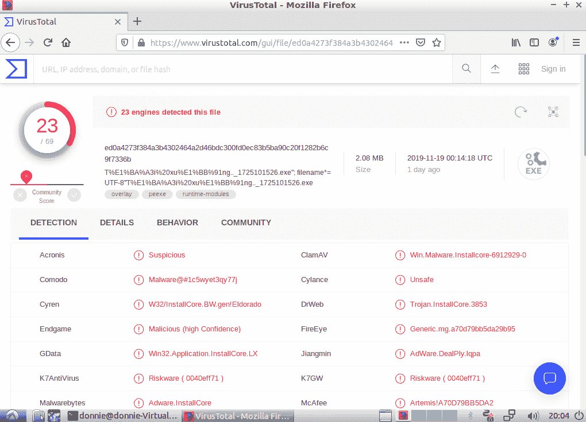
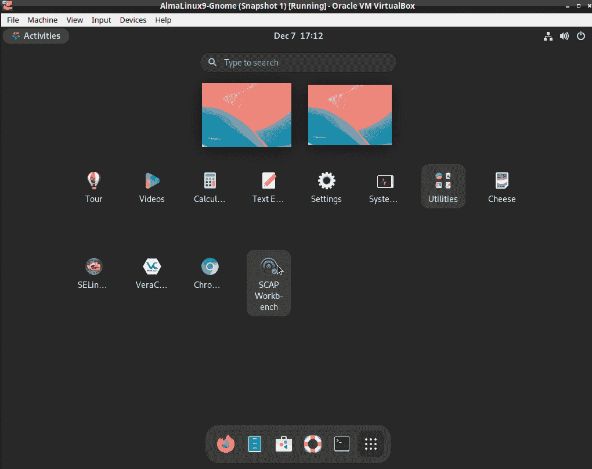
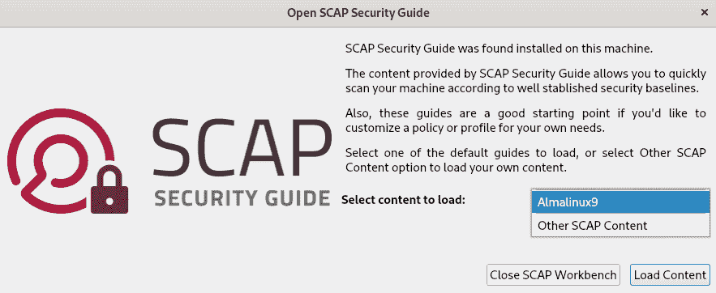
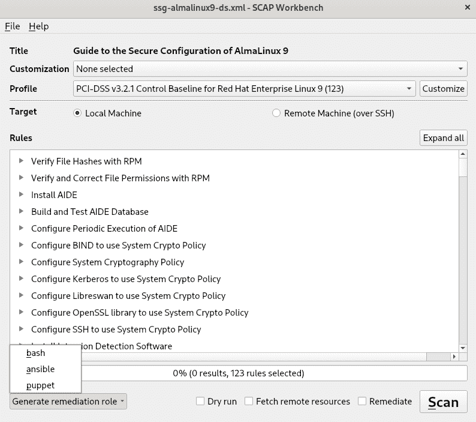
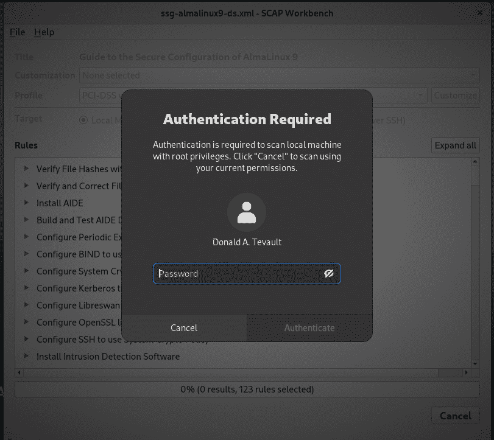
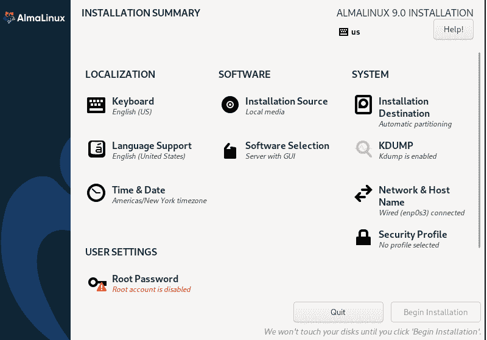
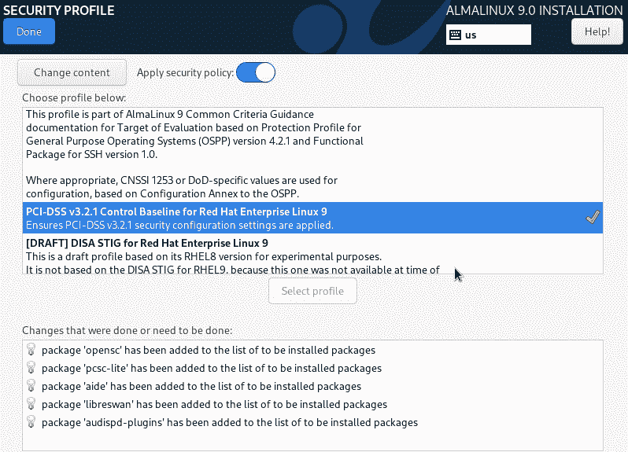

# 12 扫描、审计和加固

## 加入我们的 Discord 书籍社区

[`packt.link/SecNet`](https://packt.link/SecNet)


一个常见的误解是，Linux 用户从不需要担心恶意软件。没错，Linux 相比 Windows 对病毒的抵抗力更强。但病毒只是恶意软件的一种类型，其他类型的恶意软件也可以被植入 Linux 系统。如果你运行一个与 Windows 用户共享文件的服务器，你就需要确保不会与他们共享任何被病毒感染的文件。

虽然 Linux 系统日志文件很好，但它们并不总能清晰显示谁做了什么或谁访问了什么。可能是入侵者或内部人员正在试图访问他们没有授权访问的数据。我们真正需要的是一个好的审计系统，能够在有人做出不该做的事情时发出警报。

还有合规性问题。你的组织可能需要应对一个或多个监管机构，要求你加固服务器以防止攻击。如果不符合规定，可能会面临罚款或停业。

幸运的是，我们有办法处理所有这些问题，而且它们并不复杂。

本章我们将讨论以下主题：

+   安装和更新 ClamAV 和 maldet

+   使用 ClamAV 和 maldet 进行扫描

+   SELinux 考虑事项

+   使用 Rootkit Hunter 扫描 rootkit

+   使用 strings 和 VirusTotal 进行快速恶意软件分析

+   控制 `auditd` 守护进程

+   创建审计规则

+   使用 `ausearch` 和 `aureport` 工具在审计日志中搜索问题

+   使用 `inotifywait` 进行快速简便的审计

+   `oscap`，用于管理和应用 OpenSCAP 策略的命令行工具

+   OpenSCAP Workbench，管理和应用 OpenSCAP 策略的 GUI 工具

+   OpenSCAP 策略文件以及每个文件所设计满足的合规性标准

+   在操作系统安装过程中应用策略

如果你准备好了，我们就从一个基于 Linux 的病毒扫描解决方案开始。

## 安装和更新 ClamAV 和 maldet

```
Although we don't have to worry much about viruses infecting our Linux machines, we do need to worry about sharing infected files with Windows users. ClamAV is a Free Open Source Software (FOSS) antivirus solution that is available for Linux, Windows, and macOS. The included freshclam utility allows you to update virus signatures.
Linux Malware Detect, which you'll often see abbreviated as either LMD or maldet, is another FOSS antivirus program that can work alongside ClamAV. (To save typing, I'll just refer to it as either LMD or maldet from now on.) As far as I know, it's not available in the repositories of any Linux distro, but it's still simple enough to install and configure. One of its features is that it automatically generates malware detection signatures when it sees malware on the network's edge intrusion detection systems. End users can also submit their own malware samples. When you install it, you'll get a systemd service that's already enabled and a cron job that will periodically update both the malware signatures and the program itself. It works with the Linux kernel's inotify capability to automatically monitor directories for files that have changed.
```

> 你可以在 [`www.rfxn.com/projects/linux-malware-detect/`](https://www.rfxn.com/projects/linux-malware-detect/) 获取关于 LMD 的详细信息。

我们一起安装 ClamAV 和 LMD 的原因是，正如 LMD 开发者所承认的，ClamAV 扫描引擎在扫描大文件集时表现更好。此外，两个工具一起使用时，ClamAV 可以使用 LMD 的恶意软件签名以及其自身的恶意软件签名。

> 只是为了澄清一下...
> 
> > 病毒对于运行 Windows 操作系统的计算机来说是一个真正的问题。但根据目前的了解，似乎没有病毒能够危害基于 Linux 的操作系统。因此，唯一需要在 Linux 机器上运行杀毒软件的真实原因，是为了防止感染你网络中的任何 Windows 机器。这意味着你不需要担心在基于 Linux 的 DNS 服务器、DHCP 服务器等设备上安装杀毒产品。但是，如果你有基于 Linux 的邮件服务器、Samba 服务器、下载服务器或任何与 Windows 计算机共享文件的 Linux 机器，那么安装一个杀毒解决方案是个不错的选择。

好的，理论部分就到这里。接下来我们开始动手操作，怎么样？

### 动手实验 – 安装 ClamAV 和 maldet

我们将首先安装 ClamAV。（它在 Ubuntu 的常规仓库中，但在 CentOS 或 AlmaLinux 中没有。对于 CentOS 和 AlmaLinux，你需要安装 EPEL 仓库，正如我在*第一章*《在虚拟环境中运行 Linux》中所展示的。）我们还将安装`wget`，用于下载 LMD。在这个实验中，你可以使用 Ubuntu、CentOS 7 或任何版本的 AlmaLinux。开始吧：

+   以下命令将在 Ubuntu 上安装 ClamAV，`inotify-tools`和`wget`：

```
donnie@ubuntu3:~$ sudo apt install clamav wget inotify-tools
```

以下命令将在 CentOS 7 上安装 ClamAV，`inotify-tools`和`wget`：

```
[donnie@localhost ~]$ sudo yum install clamav clamav-update wget inotify-tools
```

对于 AlmaLinux 8 或 AlmaLinux 9，请执行以下操作：

```
[donnie@localhost ~]$ sudo dnf install clamav clamav-update wget inotify-tools
[donnie@localhost ~]$ sudo systemctl enable --now clamav-freshclam
```

请注意，如果在创建 CentOS 或 AlmaLinux 虚拟机（VM）时选择了**最小化**安装选项，你可能还需要安装`perl`和`tar`包。

对于 Ubuntu，`clamav`包包含了你需要的一切。对于 CentOS 或 AlmaLinux，你还需要安装`clamav-update`以便获取病毒更新。

剩下的步骤对于任意虚拟机（VM）来说都是相同的。

1.  接下来，你需要下载并安装 LMD。

这里，你需要做一件我很少告诉别人做的事。那就是，你需要登录到 root 用户的 shell。原因是，尽管 LMD 安装程序在使用`sudo`时也能正常工作，但程序文件会被安装者的用户所拥有，而不是 root 用户。如果从 root 用户的 shell 进行安装，可以避免安装后需要追踪并更改文件所有权的麻烦。所以，按如下方式下载文件：

```
sudo su -
wget http://www.rfxn.com/downloads/maldetect-current.tar.gz
```

现在，你的文件应该在 root 用户的主目录下。

1.  解压档案并进入解压后的目录：

```
tar xzvf maldetect-current.tar.gz
cd maldetect-1.6.4/
```

+   运行安装程序。安装程序完成后，将`README`文件复制到你自己的主目录，以便随时参考。（这个`README`文件是 LMD 的文档。）然后，从 root 用户的 shell 退出，返回到你自己的 shell：

```
root@ubuntu3:~/maldetect-1.6.4# ./install.sh
Created symlink from /etc/systemd/system/multi-user.target.wants/maldet.service to /usr/lib/systemd/system/maldet.service.
update-rc.d: error: initscript does not exist: /etc/init.d/maldet
. . .
. . .
maldet(22138): {sigup} signature set update completed
maldet(22138): {sigup} 15218 signatures (12485 MD5 | 1954 HEX | 779 YARA | 0 USER)
root@ubuntu3:~/maldetect-1.6.4# cp README /home/donnie
root@ubuntu3:~/maldetect-1.6.4# exit
logout
donnie@ubuntu3:~$
```

如你所见，安装程序会自动创建符号链接，启用`maldet`服务，并自动下载和安装最新的恶意软件签名。

1.  对于 CentOS 或 AlmaLinux，安装程序复制到 `/lib/systemd/system/` 目录的 `maldet.service` 文件具有错误的 SELinux 上下文，这将阻止 `maldet` 启动。通过以下方式修正 SELinux 上下文：

```
sudo restorecon /lib/systemd/system/maldet.service
```

恭喜你，已经完成了实验的全部内容！

### 实验环节 – 配置 maldet

在之前的版本中，maldet 默认配置为自动监控和扫描用户的家目录。在当前版本中，默认只监控 `/dev/shm/`、`/var/tmp/` 和 `/tmp/` 目录。我们将重新配置它，以便添加其他目录。开始吧：

1.  打开 `/usr/local/maldetect/conf.maldet` 文件进行编辑。找到这两行：

```
default_monitor_mode="users"
# default_monitor_mode="/usr/local/maldetect/monitor_paths"
```

将它们更改为如下所示：

```
# default_monitor_mode="users"
default_monitor_mode="/usr/local/maldetect/monitor_paths"
```

1.  在文件的顶部，启用电子邮件提醒并将你的用户名设置为电子邮件地址。这两行应该类似于以下内容：

```
email_alert="1"
email_addr="donnie"
```

1.  LMD 默认并未配置将可疑文件移动到 `quarantine` 文件夹，我们需要让它执行这一操作。在 `conf.maldet` 文件的进一步位置，查找以下行：

```
quarantine_hits="0"
```

1.  将其更改为以下内容：

```
quarantine_hits="1"
```

> 你还会看到一些可以配置的其他隔离操作，但现在这就是我们需要做的所有配置。

+   保存 `conf.maldet` 文件，因为这是我们需要进行的所有更改。

+   打开 `/usr/local/maldetect/monitor_paths` 文件进行编辑。添加你想要监控的目录，像这样：

```
/var/tmp
/tmp
/home
/root
```

> 由于病毒影响的是 Windows 而不是 Linux，因此只需监控与 Windows 机器共享的文件所在的目录。

+   保存文件后，启动 `maldet` 守护进程：

```
sudo systemctl start maldet
```

> 你可以随时向 `monitor_paths` 文件添加更多目录，但记住每次添加后都需要重新启动 `maldet` 守护进程，以便读取新的添加内容。

恭喜你，已经完成了实验的全部内容！

现在，让我们来谈谈如何保持 ClamAV 和 maldet 的更新。

### 更新 ClamAV 和 maldet

对于忙碌的管理员来说，好消息是你无需做任何事情来保持这两个软件的更新。为了验证它们是否正在更新，我们可以查看系统日志文件：

```
Dec 8 20:02:09 localhost freshclam[22326]: ClamAV update process started at Fri Dec 8 20:02:09 2017
Dec 8 20:02:29 localhost freshclam[22326]: Can't query current.cvd.clamav.net
Dec 8 20:02:29 localhost freshclam[22326]: Invalid DNS reply. Falling back to HTTP mode.
Dec 8 20:02:29 localhost freshclam[22326]: Reading CVD header (main.cvd):
Dec 8 20:02:35 localhost freshclam[22326]: OK
Dec 8 20:02:47 localhost freshclam[22326]: Downloading main-58.cdiff [100%]
Dec 8 20:03:19 localhost freshclam[22326]: main.cld updated (version: 58, sigs: 4566249, f-level: 60, builder: sigmgr)
. . .
. . .
Dec 8 20:04:45 localhost freshclam[22326]: Downloading daily.cvd [100%]
. . .
. . .
```

无论是在 Ubuntu 日志、CentOS 日志，还是 AlmaLinux 日志中，你都会看到这些相同的条目。然而，更新自动执行的方式有所不同。

在你的 Ubuntu 或 AlmaLinux 虚拟机的 `/lib/systemd/system/` 目录中，你会看到 `clamav-freshclam.service` 文件：

```
[donnie@localhost ~]$ cd /lib/systemd/system
[donnie@localhost system]$ ls -l clamav-freshclam.service 
-rw-r--r--. 1 root root 389 Nov  7 06:51 clamav-freshclam.service
[donnie@localhost system]$
```

该服务在 Ubuntu 上会自动启用并启动，但在 AlmaLinux 上需要你手动启用并启动，方法如下：

```
[donnie@localhost ~]$ sudo systemctl enable --now clamav-freshclam
Created symlink /etc/systemd/system/multi-user.target.wants/clamav-freshclam.service → /usr/lib/systemd/system/clamav-freshclam.service.
[donnie@localhost ~]$
```

如果没有 `freshclam.conf` 配置文件，AlmaLinux 会每两小时运行一次更新服务。而 Ubuntu 则使用 `/etc/clamav/freshclam.conf` 文件将更新间隔设置为每小时一次，正如你在文件底部所看到的：

```
# Check for new database 24 times a day
Checks 24
DatabaseMirror db.local.clamav.net
DatabaseMirror database.clamav.net
```

> 如果你在 AlmaLinux 8/9 机器上将加密策略设置为 `FUTURE` 模式，ClamAV 数据库更新将无法工作。因为 ClamAV 网站使用的安全证书与 `FUTURE` 模式不兼容。所以，如果你想在任何类型的 RHEL 8 或 9 机器上运行 ClamAV，你需要将加密策略设置为 `DEFAULT` 模式。

在你的 CentOS 7 机器上，你会看到一个 `clamav-update` 的 `cron` 作业文件，位于 `/etc/cron.d/` 目录下，内容如下：

```
## Adjust this line...
MAILTO=root
## It is ok to execute it as root; freshclam drops privileges and becomes
## user 'clamupdate' as soon as possible
0  */3 * * * root /usr/share/clamav/freshclam-sleep
```

左侧第二列的 `*/3` 表示 ClamAV 每三小时检查一次更新。如果你愿意，可以更改此值，但你也需要在 `/etc/sysconfig/freshclam` 文件中更改该设置。

假设你希望 CentOS 7 每小时检查一次 ClamAV 更新。在 `cron` 作业文件中，将 `*/3` 改为 `*`。 （你不需要设置 `*/1`，因为单独的星号已经表示作业会每小时运行一次。）然后，在 `/etc/sysconfig/freshclam` 文件中，查找以下这一行：

```
# FRESHCLAM_MOD=
```

取消该行的注释，并添加你希望每次更新之间的时间间隔。如果要将其设置为 1 小时，以便与 `cron` 作业匹配，应该如下所示：

```
FRESHCLAM_MOD=60
```

> 一个禁用的 `clamav-freshclam.service` 文件也会在 CentOS 7 上安装。如果你更倾向于使用服务而不是 `cron` 作业，只需删除 `/etc/cron.d/clamav-update` 文件，然后启用 `clamav-freshclam` 服务。

要证明 `maldet` 正在更新，你可以查看它自己日志文件所在的 `/usr/local/maldetect/logs/` 目录。在 `event_log` 文件中，你会看到以下这些信息：

```
Dec 06 22:06:14 localhost maldet(3728): {sigup} performing signature update check...
Dec 06 22:06:14 localhost maldet(3728): {sigup} local signature set is version 2017070716978
Dec 06 22:07:13 localhost maldet(3728): {sigup} downloaded https://cdn.rfxn.com/downloads/maldet.sigs.ver
Dec 06 22:07:13 localhost maldet(3728): {sigup} new signature set (201708255569) available
Dec 06 22:07:13 localhost maldet(3728): {sigup} downloading https://cdn.rfxn.com/downloads/maldet-sigpack.tgz
. . .
. . .
Dec 06 22:07:43 localhost maldet(3728): {sigup} unpacked and installed maldet-clean.tgz
Dec 06 22:07:43 localhost maldet(3728): {sigup} signature set update completed
Dec 06 22:07:43 localhost maldet(3728): {sigup} 15218 signatures (12485 MD5 | 1954 HEX | 779 YARA | 0 USER)
Dec 06 22:14:55 localhost maldet(4070): {scan} signatures loaded: 15218 (12485 MD5 | 1954 HEX | 779 YARA | 0 USER)
```

在 `/usr/local/maldetect/conf.maldet` 文件中，你会看到这两行，但它们之间有一些注释：

```
autoupdate_signatures="1"
autoupdate_version="1"
```

LMD 不仅会自动更新其恶意软件签名，还会确保你拥有最新版本的 LMD 本身。

## 使用 ClamAV 和 maldet 扫描

LMD 的 maldet 守护进程会持续监控你在 `/usr/local/maldetect/monitor_paths` 文件中指定的目录。当它发现可疑文件时，会执行你在 `conf.maldet` 文件中指定的操作。

```
You can test your setup by downloading a simulated virus file from the European Institute for Computer Antivirus Research (EICAR) site.
```

> 你可以从 [`www.eicar.org/download-anti-malware-testfile/`](https://www.eicar.org/download-anti-malware-testfile/) 下载四种不同的模拟病毒文件。请注意，如果你在 Windows 主机上运行，这些文件可能会被 Windows 防病毒软件标记。因此，最好的方法是直接将文件下载到你的 Linux 虚拟机中。

只需下载一个或所有的 EICAR 测试文件，并将其传输到虚拟机的主目录。最好的做法是直接将文件下载到虚拟机中，使用以下四个命令：

```
wget https://secure.eicar.org/eicar.com
wget https://secure.eicar.org/eicar.com.txt
wget https://secure.eicar.org/eicar_com.zip
wget https://secure.eicar.org/eicarcom2.zip
```

等待片刻，你应该看到文件消失。然后，在 `/usr/local/maldetect/logs/event_log` 文件中查看，验证 LMD 是否已将文件移至隔离区：

```
Dec 01 15:18:31 localhost maldet(6388): {hit} malware hit {HEX}EICAR.TEST.3 found for /home/donnie/eicar.com.txt
Dec 01 15:18:31 localhost maldet(6388): {quar} malware quarantined from '/home/donnie/eicar.com.txt' to '/usr/local/maldetect/quarantine/eicar.com.txt.113345162'
Dec 01 15:18:31 localhost maldet(6388): {mon} scanned 5 new/changed files with clamav engine
Dec 01 15:20:32 localhost maldet(6388): {mon} warning clamd service not running; force-set monitor mode file scanning to every 120s
. . .
. . .
Dec 01 15:20:56 localhost maldet(6388): {quar} malware quarantined from '/home/donnie/eicar_com.zip' to '/usr/local/maldetect/quarantine/eicar_com.zip.216978719'
```

> 忽略 `warning clamd service not running` 的消息，因为我们不需要使用该服务。

LMD 的功能远不止我在这里能展示的内容。不过，你可以在随附的`README`文件中了解所有相关信息。

### SELinux 注意事项

过去，在 Red Hat 类系统上进行杀毒扫描会触发 SELinux 警报。但是，在本章校对的过程中，所有扫描都正常工作，SELinux 从未打扰过我一次。

如果你在病毒扫描时生成了 SELinux 警报，只需更改一个布尔值就能解决：

```
[donnie@localhost ~]$ getsebool -a | grep 'virus'
antivirus_can_scan_system --> off
antivirus_use_jit --> off
[donnie@localhost ~]$
```

我们在这里关注的是默认关闭的`antivirus_can_scan_system`布尔值。要启用病毒扫描，只需执行以下操作：

```
[donnie@localhost ~]$ sudo setsebool -P antivirus_can_scan_system on
[sudo] password for donnie:
[donnie@localhost ~]$ getsebool antivirus_can_scan_system
antivirus_can_scan_system --> on
[donnie@localhost ~]$
```

这应该解决你可能遇到的任何与 SELinux 相关的扫描问题。不过，就目前情况来看，你可能不需要太担心这个问题。

## 使用 Rootkit Hunter 扫描根套件

根套件是极其恶劣的恶意软件，确实能毁掉你的一天。它们可以监听主人的命令，窃取敏感数据并发送给主人，或者为主人提供一个便捷的后门。它们的设计目标是隐秘，能够躲避普通视野的检查。有时，它们会用自己篡改过的版本替换像`ls`或`ps`这样的工具，这样就能显示系统上的所有文件或进程，除了与根套件相关的那些。根套件可以感染任何操作系统，甚至是我们喜爱的 Linux。

为了植入根套件，攻击者必须已经在系统上获得了管理员权限。这是我每次看到有人从 root 用户的 shell 进行所有工作时都感到不安的原因之一，也是我始终坚信尽可能使用`sudo`的原因。我的意思是，真的，为什么我们要让坏人这么容易得手？

> 几年前，在 Windows XP 的黑暗时期，索尼音乐公司遇到了一些麻烦，当时有人发现他们在音乐 CD 上植入了根套件。他们并不打算做任何恶意的事情，只是希望阻止人们使用计算机进行非法复制。当然，大多数人都使用 Windows XP 管理员账户，这使得根套件很容易感染他们的计算机。如今，Windows 用户仍然大多数使用管理员账户，但至少现在有了用户访问控制来帮助缓解这些问题。

有几种不同的程序可以扫描 rootkit，它们的使用方法基本相同。一个叫做 **Rootkit Hunter**，另一个叫做 **chkrootkit**。现在，请理解我向您展示这些程序，因为作为 Linux 管理员，您需要了解它们。实际上，它们并不是特别有用，因为有很多 rootkit 它们无法检测到。如果您真的想验证这一点，可以去 Github 上做一个 *rootkit* 的关键字搜索。找到一个可以在 Linux 上运行的 rootkit，将源代码下载到虚拟机上，然后按照包含的说明进行编译和安装。一旦安装完成，使用其中任何一个 rootkit 扫描程序进行扫描。很可能，rootkit 不会被检测到。另外，也不要指望 AppArmor 或 SELinux 能防止别人安装 rootkit，因为它们无法做到这一点。

> 不是每个 Github 上的 rootkit 都能正确编译，所以找到有效的可能需要一些反复试验。我成功编译并正确安装的一个是 Reptile rootkit，您可以从这里下载：[`github.com/f0rb1dd3n/Reptile`](https://github.com/f0rb1dd3n/Reptile)

好的，让我们继续进行实验。

### 实验室操作 – 安装和更新 Rootkit Hunter

对于 Ubuntu，Rootkit Hunter 位于正常的仓库中。对于 CentOS 或 AlmaLinux，您需要安装 EPEL 仓库，正如我在*第一章*中展示的那样，*在虚拟环境中运行 Linux*。对于所有这些 Linux 发行版，软件包名称是 `rkhunter`。让我们开始吧：

1.  使用以下命令之一安装 Rootkit Hunter，具体取决于您的系统。对于 Ubuntu，请执行以下操作：

```
sudo apt install rkhunter
```

对于 CentOS 7，请执行以下操作：

```
sudo yum install rkhunter
```

对于 AlmaLinux 8 或 AlmaLinux 9，请执行以下操作：

```
sudo dnf install rkhunter
```

1.  安装完成后，您可以通过以下命令查看其选项：

```
man rkhunter
```

+   接下来，使用 `--update` 选项更新 rootkit 签名：

```
[donnie@localhost ~]$ sudo rkhunter --update
[ Rootkit Hunter version 1.4.4 ]
Checking rkhunter data files...
 Checking file mirrors.dat [ Updated ]
 Checking file programs_bad.dat [ Updated ]
 Checking file backdoorports.dat [ No update ]
 Checking file suspscan.dat [ Updated ]
 Checking file i18n/cn [ No update ]
 Checking file i18n/de [ Updated ]
 Checking file i18n/en [ Updated ]
 Checking file i18n/tr [ Updated ]
 Checking file i18n/tr.utf8 [ Updated ]
 Checking file i18n/zh [ Updated ]
 Checking file i18n/zh.utf8 [ Updated ]
 Checking file i18n/ja [ Updated ]
```

1.  现在，我们准备好进行扫描了。

您已完成实验室操作 – 恭喜！

### 扫描 rootkit

要运行扫描，使用 `-c` 选项。（`-c` 代表*检查*。）请耐心等待，因为这会花费一些时间：

```
sudo rkhunter -c
```

当您以这种方式运行扫描时，Rootkit Hunter 会定期停下来，要求您按 Enter 键继续。扫描完成后，您将在 `/var/log/` 目录中找到 `rkhunter.log` 文件。

要让 Rootkit Hunter 自动作为 `cron` 任务运行，使用 `--cronjob` 选项，这将使程序完整运行，而无需您不断按 Enter 键。您还可能希望使用 `--rwo` 选项，这样程序只会报告警告，而不会报告所有正常情况。从命令行看，命令如下：

```
sudo rkhunter -c --cronjob --rwo
```

要创建一个 `cron` 任务，让 Rootkit Hunter 每晚自动运行，请打开 root 用户的 `crontab` 编辑器：

```
sudo crontab -e -u root
```

假设您希望 Rootkit Hunter 每晚 10:20 运行。请输入以下内容到 `crontab` 编辑器：

```
20 22 * * * /usr/bin/rkhunter -c --cronjob --rwo
```

因为 `cron` 只能使用 24 小时制时间，你必须将晚上 10:00 表达为 22\.（只需将你习惯使用的普通 P.M.时间加 12 即可。）三个星号意味着该任务将每月的每一天、每年的每个月以及每周的每一天运行。你需要列出命令的完整路径。否则，`cron` 将找不到它。

你可以在 `rkhunter` 的手册页中找到更多可能感兴趣的选项，但这应该足以让你开始使用它了。

> 刚才我告诉过你，这些 rootkit 扫描程序并不是很有效，因为有许多 rootkit 它们无法检测到。这就是为什么处理 rootkit 的最佳方法是防止它们首次安装。因此，请确保保持系统锁定，以防止恶意行为者获取 root 权限。

接下来，让我们看看几种快速分析恶意软件的技术。

## 使用字符串和 VirusTotal 进行快速恶意软件分析

恶意软件分析是我这里无法详细讨论的高级话题之一。不过，我可以向你展示几种快速分析可疑文件的方法。

### 使用字符串分析文件

可执行文件通常内嵌有一系列文本字符串。你可以使用`strings`工具查看这些字符串。（是的，这很有道理，对吧？）根据你的发行版，`strings`可能已经安装了，也可能没有。它已经在 CentOS 和 AlmaLinux 上，但在 Ubuntu 上，你需要安装`binutils`包，像这样：

```
sudo apt install binutils
```

举个例子，让我们看看从一个加密币水龙头网站自动下载的`Your File Is Ready To Download_2285169994.exe`文件。为了检查这个文件，我会这样做：

```
strings "Your File Is Ready To Download_2285169994.exe" > output.txt
vim output.txt
```

我将输出保存到一个文本文件中，可以在 `vim` 中打开以查看行号。为了查看行号，我在 `vim` 屏幕底部输入了 `:set number`。（在 `vim` 的术语中，我们使用最后一行模式。）

很难准确地说要搜索什么，所以你只需浏览，直到看到一些有趣的内容为止。在这种情况下，看看我从第`386`行开始找到的内容：

```
386 The Setup program accepts optional command line parameters.
387 /HELP, /?
388 Shows this information.
389 /SP-
390 Disables the This will install... Do you wish to continue? prompt at the beginning of Setup.
391 /SILENT, /VERYSILENT
392 Instructs Setup to be silent or very silent.
393 /SUPPRESSMSGBOXES
394 Instructs Setup to suppress message boxes.
. . .
399 /NOCANCEL
400 Prevents the user from cancelling during the installation process.
. . .
```

有人说，可以将该程序的安装过程设置为以`SILENT`模式运行，而不弹出任何对话框。它还可以被设置为以一种用户无法取消安装的方式运行。当然，顶部的那行说这些是`可选的命令行参数`。但是，它们真的是可选的吗，还是默认硬编码了？这一点不太清楚，但在我看来，任何可以设置为以`SILENT`模式运行且不能被取消的安装程序都有些可疑，即使我们谈论的是`可选`参数。

> 好的，你可能会想，*什么是加密货币水龙头？* 它是一个网站，你可以通过浏览广告并解决某种 CAPTCHA 问题来领取少量的加密货币，比如比特币、以太坊或门罗币。大多数水龙头运营商是诚实的，但他们允许的网站广告往往并不安全，通常充斥着恶意软件、骗局和不适宜工作的图片。

这个小技巧有时候能很好地工作，但并非总是如此。更复杂的恶意软件可能不包含任何能够提供线索的文本字符串。那么，让我们看一下另一个用于恶意软件分析的快速小技巧。

### 使用 VirusTotal 扫描恶意软件

**VirusTotal** 是一个可以上传可疑文件进行分析的网站。它使用多种病毒扫描器，因此如果某个扫描器漏掉了什么，另一个扫描器可能会发现它。以下是扫描 `Your File Is Ready To Download_2285169994.exe` 文件的结果：



图 12.1：VirusTotal 扫描器

在这里，我们看到不同的病毒扫描器对这个文件有不同的分类。但无论它被归类为 `Win.Malware.Installcore`、`Trojan.InstallCore` 还是其他什么名字，它依然是有害的。

> 虽然 VirusTotal 很好用，但你需要小心使用它。不要上传任何包含敏感或机密信息的文件，因为这些信息会被分享给其他人。

那么，这个特定的恶意软件到底是怎么回事呢？实际上，它是一个伪装成 Adobe Flash 安装程序的恶意软件。当然，你不想在生产环境的 Windows 机器上安装它进行测试。但是，如果你有一个 Windows 虚拟机，可以在其上测试这个恶意软件。（在开始之前最好先做一个虚拟机快照，或者准备好之后丢弃虚拟机。）

正如我一开始所说，恶意软件分析是一个相当深入的话题，有许多更复杂的工具可以用来分析它。然而，如果你对某个文件有疑虑并且只需要做一个快速检查，这两种技巧可能就足够了。

接下来，让我们看看如何自动审计系统中的各种事件。

## 理解 `auditd` 守护进程

假设你有一个目录，里面充满了只有极少数人需要查看的超级机密文件，你想知道何时有人未经授权尝试查看它们。或者，你也许想知道某个文件何时被修改，或者想知道系统有人登录后做了什么事情。为了满足这些需求，你可以使用 `auditd` 系统。它是一个非常酷的系统，我相信你会喜欢它的。

> `auditd` 的一个优点是它工作在 Linux 内核层级，而不是用户模式层级。这使得攻击者更难以破坏它。

在 Red Hat 系列系统中，`auditd` 默认已经安装并启用。所以，你会在 CentOS 和 AlmaLinux 机器上找到它。而在 Ubuntu 系统中，它并不会默认安装，因此你需要手动安装：

```
sudo apt install auditd
```

在 Ubuntu 上，你可以通过正常的 `systemctl` 命令来控制 `auditd` 守护进程。所以，如果你需要重新启动 `auditd` 以读取新的配置文件，你可以使用以下命令：

```
sudo systemctl restart auditd
```

在 RHEL 类型的机器上，`auditd` 配置为不与普通的 `systemctl` 命令一起工作。（对于所有其他守护进程，它们是可以的。）所以，在你的 CentOS 和 AlmaLinux 机器上，你需要用传统的 `service` 命令来重启 `auditd` 守护进程，像这样：

```
sudo service auditd restart
```

除了这个小差异之外，从这里开始我告诉你关于 `auditd` 的所有内容都会适用于你所有的虚拟机。

### 创建审计规则

好的，让我们从一些简单的开始，一步步进入更高级的内容。首先，让我们检查一下是否有任何审计规则生效：

```
[donnie@localhost ~]$ sudo auditctl -l
[sudo] password for donnie:
No rules
[donnie@localhost ~]$
```

如你所见，`auditctl` 命令是我们用来管理审计规则的。`-l` 选项列出规则。

### 审计文件变更

现在，假设我们想查看当有人更改 `/etc/passwd` 文件时的情况。（我们将使用的命令看起来可能有点吓人，但我保证一旦我们分解它，就能理解。）下面是命令：

```
[donnie@localhost ~]$ sudo auditctl -w /etc/passwd -p wa -k passwd_changes
[sudo] password for donnie:
[donnie@localhost ~]$ sudo auditctl -l
-w /etc/passwd -p wa -k passwd_changes
[donnie@localhost ~]$
```

这里是详细说明：

+   `-w`：这代表“哪里”，它指向我们想要监控的对象。在这种情况下，它是 `/etc/passwd`。

+   `-p`：这表示我们想要监控的对象权限。在这种情况下，我们监控的是，当任何人尝试（w）写入文件或尝试进行（a）属性更改时的情况。（我们可以审计的其他两个权限是（r）读取和（x）执行。）

+   `-k`：`k` 代表键，它是 `auditd` 为规则分配名称的方式。所以，`passwd_changes` 是我们正在创建的规则的键或名称。

`auditctl -l` 命令向我们展示了规则确实存在。

现在，这个小问题是，这个规则是临时的，当我们重新启动机器时它会消失。为了使其永久生效，我们需要在 `/etc/audit/rules.d/` 目录中创建一个自定义的 `rules` 文件。然后，当你重新启动 `auditd` 守护进程时，自定义规则将会被插入到 `/etc/audit/audit.rules` 文件中。由于 `/etc/audit/` 目录只能被具有 root 权限的用户访问，我将通过列出文件的完整路径来打开文件，而不是尝试进入该目录：

```
sudo less /etc/audit/audit.rules
```

这个默认文件里没有很多内容：

```
## This file is automatically generated from /etc/audit/rules.d
-D
-b 8192
-f 1
```

这是这个文件的详细说明：

+   `-D`：这将导致当前生效的所有规则和监视被删除，以便我们从干净的状态开始。所以，如果我现在重新启动 `auditd` 守护进程，它会读取这个 `audit.rules` 文件，并删除我刚刚创建的规则。

+   `-b 8192`：这设置了我们可以同时进行的未处理审计缓冲区的数量。如果所有缓冲区都满了，系统将无法生成更多的审计信息。

+   `-f 1`：这设置了关键错误的失败模式，值可以是`0`、`1`或`2`。`-f 0`将模式设置为静默，意味着`auditd`不会对关键错误做出任何处理。`-f 1`，正如我们所见，会告诉`auditd`只报告关键错误，而`-f 2`则会导致 Linux 内核进入恐慌模式。根据`auditctl`的手册页，任何处于高安全环境中的人都可能会将其更改为`-f 2`。不过就我们而言，`-f 1`是可行的。

你可以使用文本编辑器在`/etc/audit/rules.d/`目录中创建一个新的`rules`文件。或者，你也可以像这样将`auditctl -l`的输出重定向到一个新文件：

```
[donnie@localhost ~]$ sudo sh -c "auditctl -l > /etc/audit/rules.d/custom.rules"
[donnie@localhost ~]$ sudo service auditd restart
```

在 Ubuntu 上：

sudo systemctl restart auditd

由于 Bash shell 不允许我直接将信息重定向到`/etc/`目录中的文件，即使使用`sudo`，我必须使用`sudo sh -c`命令来执行`auditctl`命令。在重新启动`auditd`守护进程后，我们的`audit.rules`文件现在看起来是这样的：

```
## This file is automatically generated from /etc/audit/rules.d
-D
-b 8192
-f 1
-w /etc/passwd -p wa -k passwd_changes
```

现在，每次机器重启时，或者每次你手动重启`auditd`守护进程时，这个规则都会生效。

### 审计一个目录

Vicky 和 Cleopatra，我的纯灰色小猫和灰白色的虎斑猫，有一些超级敏感的秘密需要保护。所以，我创建了一个`secretcats`组并将它们添加进去。然后，我创建了`secretcats`共享目录并设置了访问控制，正如我在*第九章，访问控制列表和共享目录管理*中所示的那样：

```
[donnie@localhost ~]$ sudo groupadd secretcats
[sudo] password for donnie:
[donnie@localhost ~]$ sudo usermod -a -G secretcats vicky
[donnie@localhost ~]$ sudo usermod -a -G secretcats cleopatra
[donnie@localhost ~]$ sudo mkdir /secretcats
[donnie@localhost ~]$ sudo chown nobody:secretcats /secretcats/
[donnie@localhost ~]$ sudo chmod 3770 /secretcats/
[donnie@localhost ~]$ ls -ld /secretcats/
drwxrws--T. 2 nobody secretcats 6 Dec 11 14:47 /secretcats/
[donnie@localhost ~]$
```

Vicky 和 Cleopatra 想确保没有人能进入她们的东西，所以她们请求我为她们的目录设置一个审计规则：

```
[donnie@localhost ~]$ sudo auditctl -w /secretcats/ -k secretcats_watch
[sudo] password for donnie:
[donnie@localhost ~]$ sudo auditctl -l
-w /etc/passwd -p wa -k passwd_changes
-w /secretcats -p rwxa -k secretcats_watch
[donnie@localhost ~]$
```

如前所述，`-w`选项表示我们想要监控的内容，而`-k`选项表示审计规则的名称。这一次，我省略了`-p`选项，因为我想监控所有类型的访问。换句话说，我想监控任何读取、写入、属性更改或执行的操作。（因为这是一个目录，执行操作发生在有人尝试`cd`进入该目录时。）你可以在`auditctl -l`的输出中看到，省略`-p`选项后，我们将会监控所有操作。但是，假设我只想监控有人尝试`cd`进入该目录的情况，我可以将规则设置成这样：

```
sudo auditctl -w /secretcats/ -p x -k secretcats_watch
```

到现在为止还算简单吧？

> 在创建自己的自定义审计规则时要仔细规划。审计比实际需要更多的文件和目录可能会对性能产生一定影响，并且可能会淹没你在过多的信息中。只审计你真正需要审计的内容，按照情景要求或任何适用的管理机构的要求进行审计。

现在，让我们来看一些稍微复杂一点的内容。

### 审计系统调用

创建规则以监视某人执行特定操作并不难，但命令的语法比我们之前看到的要稍微复杂一些。通过这个规则，每当 Charlie 尝试打开文件或创建文件时，我们都会收到警报：

```
[donnie@localhost ~]$ sudo auditctl -a always,exit -F arch=b64 -S openat -F auid=1006
[sudo] password for donnie:
[donnie@localhost ~]$ sudo auditctl -l
-w /etc/passwd -p wa -k passwd_changes
-w /secretcats -p rwxa -k secretcats_watch
-a always,exit -F arch=b64 -S openat -F auid=1006
[donnie@localhost ~]$
```

这是详细说明：

+   `-a always,exit`：在这里，我们有动作和列表。`exit`部分意味着这个规则会被添加到系统调用`exit`列表中。每当操作系统退出一个系统调用时，`exit`列表将用于确定是否需要生成审计事件。`always`部分是动作，意味着每当从指定的系统调用退出时，都会为这个规则创建一个审计记录。请注意，动作和列表参数必须用逗号分隔。

+   `-F arch=b64`：`-F`选项用于构建规则字段，我们可以在这个命令中看到两个规则字段。第一个规则字段指定了机器的 CPU 架构。`b64`意味着计算机正在使用 x86_64 CPU 运行。（不管是 Intel 还是 AMD 都不重要。）考虑到 32 位机器正在逐渐淘汰，而且 Sun SPARC 和 PowerPC 机器也并不常见，`b64`是你现在最常看到的。

+   `-S openat`：`-S`选项指定了我们想要监视的系统调用。`openat`是一个系统调用，用来打开或创建文件。

+   `-F auid=1006`：这个第二个审计字段指定了我们想要监视的用户 ID 号码。（Charlie 的用户 ID 号码是`1006`。）

> 对系统调用（或称 syscalls）的完整解释对于我们当前的目的来说有点过于深奥。暂时说一下，系统调用会在用户发出请求 Linux 内核提供服务的命令时发生。如果你有兴趣，可以阅读更多关于系统调用的内容，网址是[`blog.packagecloud.io/eng/2016/04/05/the-definitive-guide-to-linux-system-calls/`](https://blog.packagecloud.io/eng/2016/04/05/the-definitive-guide-to-linux-system-calls/)。

我在这里展示的只是你可以使用审计规则做的事情中的一小部分。想要查看更多示例，请查阅`auditctl`的手册页：

```
man auditctl
```

所以，现在你可能在想，*既然我已经有了这些规则，我怎么知道别人什么时候会违反这些规则呢？* 和往常一样，我很高兴你提出了这个问题。

## 使用 ausearch 和 aureport

`auditd`守护进程将事件记录到`/var/log/audit/audit.log`文件中。尽管你可以直接通过`less`等工具读取文件，但其实并不推荐这样做。`ausearch`和`aureport`工具将帮助你将文件翻译成一种更易懂的语言。

### 搜索文件变更警报

让我们从查看我们创建的规则开始，这个规则会在`/etc/passwd`文件发生更改时向我们发出警报：

```
sudo auditctl -w /etc/passwd -p wa -k passwd_changes
```

现在，让我们对文件进行更改并查看警报信息。为了不再添加新用户，因为我已经用完了可以使用的猫咪名字，我将使用`chfn`工具将联系方式添加到克利奥帕特拉条目的注释字段：

```
[donnie@localhost etc]$ sudo chfn cleopatra
Changing finger information for cleopatra.
Name []: Cleopatra Tabby Cat
Office []: Donnie's back yard
Office Phone []: 555-5555
Home Phone []: 555-5556
Finger information changed.
[donnie@localhost etc]
```

现在，我将使用 `ausearch` 查找这个事件可能生成的任何审计消息：

```
[donnie@localhost ~]$ sudo ausearch -i -k passwd_changes
----
type=CONFIG_CHANGE msg=audit(12/11/2017 13:06:20.665:11393) : auid=donnie ses=842 subj=unconfined_u:unconfined_r:unconfined_t:s0-s0:c0.c1023 op=add_rule key=passwd_changes li
st=exit res=yes
----
type=CONFIG_CHANGE msg=audit(12/11/2017 13:49:15.262:11511) : auid=donnie ses=842 op=updated_rules path=/etc/passwd key=passwd_changes list=exit res=yes
[donnie@localhost ~]$
```

这是细节分析：

+   `-i`：该选项将任何数字数据（尽可能）转换为文本。在这种情况下，它将用户 ID 号转换为实际用户名，在此显示为 `auid=donnie`。如果我省略 `-i` 选项，用户信息将显示为 `auid=1000`，这是我的用户 ID 号。

+   `-k passwd_changes`：这指定了审计规则的键或名称，我们希望查看该规则的审计消息。

这里，你会看到输出有两部分。第一部分仅显示我创建审计规则的时间，因此我们不关心这一部分。在第二部分，你可以看到我触发了该规则的时间，但它没有显示我如何触发它。所以，让我们使用 `aureport` 查看它是否能提供更多的细节：

```
[donnie@localhost ~]$ sudo aureport -i -k | grep 'passwd_changes'
1\. 12/11/2017 13:06:20 passwd_changes yes ? donnie 11393
2\. 12/11/2017 13:49:15 passwd_changes yes ? donnie 11511
3\. 12/11/2017 13:49:15 passwd_changes yes /usr/bin/chfn donnie 11512
4\. 12/11/2017 14:54:11 passwd_changes yes /usr/sbin/usermod donnie 11728
5\. 12/11/2017 14:54:25 passwd_changes yes /usr/sbin/usermod donnie 11736
[donnie@localhost ~]$
```

有趣的是，在使用 `ausearch` 时，你必须在 `-k` 选项后指定你感兴趣的审计规则的名称或键。而在 `aureport` 中，`-k` 选项意味着你想查看所有与所有审计规则键相关的日志条目。要查看特定键的日志条目，只需将输出通过管道传递到 `grep`。`-i` 选项执行与 `ausearch` 相同的功能。

如你所见，`aureport` 将 `audit.log` 文件中晦涩的语言解析成更易理解的简单语言。我不确定自己做了什么操作以生成事件 1 和事件 2，于是我查看了 `/var/log/secure` 文件，看看能否找出原因。我在该时间点看到了以下两个条目：

```
Dec 11 13:06:20 localhost sudo: donnie : TTY=pts/1 ; PWD=/home/donnie ; USER=root ; COMMAND=/sbin/auditctl -w /etc/passwd -p wa -k passwd_changes
. . .
. . .
Dec 11 13:49:24 localhost sudo: donnie : TTY=pts/1 ; PWD=/home/donnie ; USER=root ; COMMAND=/sbin/ausearch -i -k passwd_changes
```

所以，事件 1 是我最初创建审计规则时发生的，事件 2 是我执行 `ausearch` 操作时发生的。

我必须坦白，第*4*行和第*5*行的事件有点神秘。它们都是在我调用 `usermod` 命令时创建的，而且它们都与我将 Vicky 和 Cleopatra 添加到 `secretcats` 组的安全日志条目相关：

```
Dec 11 14:54:11 localhost sudo:  donnie : TTY=pts/1 ; PWD=/home/donnie ; USER=root ; COMMAND=/sbin/usermod -a -G secretcats vicky
Dec 11 14:54:11 localhost usermod[14865]: add 'vicky' to group 'secretcats'
Dec 11 14:54:11 localhost usermod[14865]: add 'vicky' to shadow group 'secretcats'
Dec 11 14:54:25 localhost sudo:  donnie : TTY=pts/1 ; PWD=/home/donnie ; USER=root ; COMMAND=/sbin/usermod -a -G secretcats cleopatra
Dec 11 14:54:25 localhost usermod[14871]: add 'cleopatra' to group 'secretcats'
Dec 11 14:54:25 localhost usermod[14871]: add 'cleopatra' to shadow group 'secretcats'
```

奇怪的是，向用户添加副组并不会修改 `passwd` 文件。所以，我真不知道为什么这个规则会触发，并在第*4*行和第*5*行创建事件。

这就剩下第*3*行的事件了，在那里我使用 `chfn` 实际修改了 `passwd` 文件。以下是该条目的 `secure` 日志记录：

```
Dec 11 13:48:49 localhost sudo:  donnie : TTY=pts/1 ; PWD=/etc ; USER=root ; COMMAND=/bin/chfn cleopatra
```

所以，在所有这些事件中，只有第*3*行的事件是实际修改了 `/etc/passwd` 文件的。

> 我这里提到的 `/var/log/secure` 文件位于 Red Hat 类型的操作系统中，例如 CentOS 和 AlmaLinux。在你的 Ubuntu 机器上，你将看到 `/var/log/auth.log` 文件。

### 搜索目录访问规则违规

对于下一个场景，我们将为 Vicky 和 Cleopatra 创建一个共享目录，然后为其创建一个如下所示的审计规则：

```
sudo auditctl -w /secretcats/ -k secretcats_watch
```

因此，所有访问或尝试访问该目录的行为都应触发警报。首先，让我们让 Vicky 进入 `/secretcats/` 目录并运行 `ls -l` 命令：

```
[vicky@localhost ~]$ cd /secretcats
[vicky@localhost secretcats]$ ls -l
total 4
-rw-rw-r--. 1 cleopatra secretcats 31 Dec 12 11:49 cleopatrafile.txt
[vicky@localhost secretcats]$
```

在这里，我们看到 Cleopatra 已经在这里创建了一个文件。（稍后我们会回来详细看看。）当事件触发 `auditd` 规则时，通常会在 `/var/log/audit/audit.log` 文件中生成多条记录。如果你查看每条记录，你会看到每条记录都涵盖了该事件的不同方面。当我执行 `ausearch` 命令时，我看到仅仅通过一次 `ls -l` 操作就有五条记录。为了节省空间，我这里只放第一条记录：

```
sudo ausearch -i -k secretcats_watch | less
type=PROCTITLE msg=audit(12/12/2017 12:15:35.447:14077) : proctitle=ls --color=auto -l
type=PATH msg=audit(12/12/2017 12:15:35.447:14077) : item=0 name=. inode=33583041 dev=fd:01 mode=dir,sgid,sticky,770 ouid=nobody ogid=secretcats rdev=00:00 obj=unconfined_u:object_r:default_t:s0 objtype=NORMAL
type=CWD msg=audit(12/12/2017 12:15:35.447:14077) :  cwd=/secretcats
type=SYSCALL msg=audit(12/12/2017 12:15:35.447:14077) : arch=x86_64 syscall=openat success=yes exit=3 a0=0xffffffffffffff9c a1=0x2300330 a2=O_RDONLY|O_NONBLOCK|O_DIRECTORY|O_CLOEXEC a3=0x0 items=1 ppid=10805 pid=10952 auid=vicky uid=vicky gid=vicky euid=vicky suid=vicky fsuid=vicky egid=vicky sgid=vicky fsgid=vicky tty=pts0 ses=1789 comm=ls exe=/usr/bin/ls subj=unconfined_u:unconfined_r:unconfined_t:s0-s0:c0.c1023 key=secretcats_watch
```

我将把最后一条记录放在这里：

```
type=PROCTITLE msg=audit(12/12/2017 12:15:35.447:14081) : proctitle=ls --color=auto -l
type=PATH msg=audit(12/12/2017 12:15:35.447:14081) : item=0 name=cleopatrafile.txt inode=33583071 dev=fd:01 mode=file,664 ouid=cleopatra ogid=secretcats rdev=00:00 obj=unconfined_u:object_r:default_t:s0 objtype=NORMAL
type=CWD msg=audit(12/12/2017 12:15:35.447:14081) :  cwd=/secretcats
type=SYSCALL msg=audit(12/12/2017 12:15:35.447:14081) : arch=x86_64 syscall=getxattr success=no exit=ENODATA(No data available) a0=0x7fff7c266e60 a1=0x7f0a61cb9db0 a2=0x0 a3=0x0 items=1 ppid=10805 pid=10952 auid=vicky uid=vicky gid=vicky euid=vicky suid=vicky fsuid=vicky egid=vicky sgid=vicky fsgid=vicky tty=pts0 ses=1789 comm=ls exe=/usr/bin/ls subj=unconfined_u:unconfined_r:unconfined_t:s0-s0:c0.c1023 key=secretcats_watch
```

在这两条记录中，你可以看到执行的操作（`ls -l`）和执行操作的人员——在这种情况下是猫——的信息。由于这是一个 RHEL 类型的机器，你还会看到 SELinux 上下文信息。在第二条记录中，你还可以看到 Vicky 在执行 `ls` 命令时看到的文件名。

接下来，假设那个狡猾的 Charlie 进入系统并尝试进入 `/secretcats/` 目录：

```
[charlie@localhost ~]$ cd /secretcats
-bash: cd: /secretcats: Permission denied
[charlie@localhost ~]$ ls -l /secretcats
ls: cannot open directory /secretcats: Permission denied
[charlie@localhost ~]$
```

Charlie 不是 `secretcats` 组的成员，也没有权限进入 `secretcats` 目录。所以，他应该触发警报信息。实际上，他触发了一个包含四条记录的警报，我会再次列出第一条和最后一条。下面是第一条记录：

```
sudo ausearch -i -k secretcats_watch | less
type=PROCTITLE msg=audit(12/12/2017 12:32:04.341:14152) : proctitle=ls --color=auto -l /secretcats
type=PATH msg=audit(12/12/2017 12:32:04.341:14152) : item=0 name=/secretcats inode=33583041 dev=fd:01 mode=dir,sgid,sticky,770 ouid=nobody ogid=secretcats rdev=00:00 obj=unconfined_u:object_r:default_t:s0 objtype=NORMAL
type=CWD msg=audit(12/12/2017 12:32:04.341:14152) :  cwd=/home/charlie
type=SYSCALL msg=audit(12/12/2017 12:32:04.341:14152) : arch=x86_64 syscall=lgetxattr success=yes exit=35 a0=0x7ffd8d18f7dd a1=0x7f2496858f8a a2=0x12bca30 a3=0xff items=1 ppid=11637 pid=11663 auid=charlie uid=charlie gid=charlie euid=charlie suid=charlie fsuid=charlie egid=charlie sgid=charlie fsgid=charlie tty=pts0 ses=1794 comm=ls exe=/usr/bin/ls subj=unconfined_u:unconfined_r:unconfined_t:s0-s0:c0.c1023 key=secretcats_watch
```

这是最后一条记录：

```
type=PROCTITLE msg=audit(12/12/2017 12:32:04.341:14155) : proctitle=ls --color=auto -l /secretcats
type=PATH msg=audit(12/12/2017 12:32:04.341:14155) : item=0 name=/secretcats inode=33583041 dev=fd:01 mode=dir,sgid,sticky,770 ouid=nobody ogid=secretcats rdev=00:00 obj=unconfined_u:object_r:default_t:s0 objtype=NORMAL
type=CWD msg=audit(12/12/2017 12:32:04.341:14155) :  cwd=/home/charlie
type=SYSCALL msg=audit(12/12/2017 12:32:04.341:14155) : arch=x86_64 syscall=openat success=no exit=EACCES(Permission denied) a0=0xffffffffffffff9c a1=0x12be300 a2=O_RDONLY|O_NONBLOCK|O_DIRECTORY|O_CLOEXEC a3=0x0 items=1 ppid=11637 pid=11663 auid=charlie uid=charlie gid=charlie euid=charlie suid=charlie fsuid=charlie egid=charlie sgid=charlie fsgid=charlie tty=pts0 ses=1794 comm=ls exe=/usr/bin/ls subj=unconfined_u:unconfined_r:unconfined_t:s0-s0:c0.c1023 key=secretcats_watch
```

这里有两点需要注意。首先，仅仅尝试 `cd` 进入目录并不会触发警报。然而，使用 `ls` 尝试读取目录内容时，会触发警报。其次，注意第二条记录中出现的 `Permission denied` 消息。

我们将查看的最后一组警报是在 Cleopatra 创建她的 `cleopatrafile.txt` 文件时触发的。这个事件触发了一个包含 30 条记录的警报。我这里只展示其中的两条，第一条如下：

```
type=PROCTITLE msg=audit(12/12/2017 11:49:37.536:13856) : proctitle=vim cleopatrafile.txt
type=PATH msg=audit(12/12/2017 11:49:37.536:13856) : item=0 name=. inode=33583041 dev=fd:01 mode=dir,sgid,sticky,770 ouid=nobody ogid=secretcats rdev=00:00 obj=unconfined_u:o
bject_r:default_t:s0 objtype=NORMAL
type=CWD msg=audit(12/12/2017 11:49:37.536:13856) :  cwd=/secretcats
type=SYSCALL msg=audit(12/12/2017 11:49:37.536:13856) : arch=x86_64 syscall=open success=yes exit=4 a0=0x5ab983 a1=O_RDONLY a2=0x0 a3=0x63 items=1 ppid=9572 pid=9593 auid=cle
opatra uid=cleopatra gid=cleopatra euid=cleopatra suid=cleopatra fsuid=cleopatra egid=cleopatra sgid=cleopatra fsgid=cleopatra tty=pts0 ses=1779 comm=vim exe=/usr/bin/vim sub
j=unconfined_u:unconfined_r:unconfined_t:s0-s0:c0.c1023 key=secretcats_watch
```

这是第二条记录：

```
type=PROCTITLE msg=audit(12/12/2017 11:49:56.001:13858) : proctitle=vim cleopatrafile.txt
type=PATH msg=audit(12/12/2017 11:49:56.001:13858) : item=1 name=/secretcats/.cleopatrafile.txt.swp inode=33583065 dev=fd:01 mode=file,600 ouid=cleopatra ogid=secretcats rdev
=00:00 obj=unconfined_u:object_r:default_t:s0 objtype=DELETE
type=PATH msg=audit(12/12/2017 11:49:56.001:13858) : item=0 name=/secretcats/ inode=33583041 dev=fd:01 mode=dir,sgid,sticky,770 ouid=nobody ogid=secretcats rdev=00:00 obj=unc
onfined_u:object_r:default_t:s0 objtype=PARENT
type=CWD msg=audit(12/12/2017 11:49:56.001:13858) :  cwd=/secretcats
type=SYSCALL msg=audit(12/12/2017 11:49:56.001:13858) : arch=x86_64 syscall=unlink success=yes exit=0 a0=0x15ee7a0 a1=0x1 a2=0x1 a3=0x7ffc2c82e6b0 items=2 ppid=9572 pid=9593
auid=cleopatra uid=cleopatra gid=cleopatra euid=cleopatra suid=cleopatra fsuid=cleopatra egid=cleopatra sgid=cleopatra fsgid=cleopatra tty=pts0 ses=1779 comm=vim exe=/usr/bin
/vim subj=unconfined_u:unconfined_r:unconfined_t:s0-s0:c0.c1023 key=secretcats_watch
```

你可以看出，这两条消息中的第一条发生在 Cleopatra 保存文件并退出 `vim` 时，因为第二条消息显示了 `objtype=DELETE`，她的临时 `vim` 交换文件被删除了。

好的，这些都没问题，但如果这些信息太多了怎么办？如果你只是想要一份简洁且稀疏的安全事件列表，该怎么办呢？为此，我们将使用 `aureport`。我们将像之前那样使用它。

首先，我们将 `aureport` 的输出通过管道传递给 `less`，而不是传递给 `grep`，这样我们可以看到列标题：

```
[donnie@localhost ~]$ sudo aureport -i -k | less
Key Report
===============================================
# date time key success exe auid event
===============================================
1\. 12/11/2017 13:06:20 passwd_changes yes ? donnie 11393
2\. 12/11/2017 13:49:15 passwd_changes yes ? donnie 11511
3\. 12/11/2017 13:49:15 passwd_changes yes /usr/bin/chfn donnie 11512
4\. 12/11/2017 14:54:11 passwd_changes yes /usr/sbin/usermod donnie 11728
5\. 12/11/2017 14:54:25 passwd_changes yes /usr/sbin/usermod donnie 11736
. . .
. . .
```

`success` 列中的状态将是 `yes` 或 `no`，取决于用户是否成功执行了违反规则的操作。或者，如果事件不是由规则触发的，状态可能是问号。

对于 Charlie，我们可以看到在第 *48* 行发生了一个 `yes` 事件，而第 *49* 到 *51* 行的事件都显示为 `no` 状态。我们还可以看到，所有这些记录都是由于 Charlie 使用了 `ls` 命令而触发的：

[donnie@localhost ~]$ sudo aureport -i -k | grep 'secretcats_watch'

6\. 12/11/2017 15:01:25 secretcats_watch yes ? donnie 11772

8\. 12/12/2017 11:49:29 secretcats_watch yes /usr/bin/ls cleopatra 13828

9\. 12/12/2017 11:49:37 secretcats_watch yes /usr/bin/vim cleopatra 13830

10\. 12/12/2017 11:49:37 secretcats_watch yes /usr/bin/vim cleopatra 13829

48\. 12/12/2017 12:32:04 secretcats_watch yes /usr/bin/ls charlie 14152

49\. 12/12/2017 12:32:04 secretcats_watch no /usr/bin/ls charlie 14153

50\. 12/12/2017 12:32:04 secretcats_watch no /usr/bin/ls charlie 14154

51\. 12/12/2017 12:32:04 secretcats_watch no /usr/bin/ls charlie 14155

[donnie@localhost ~]$

你可能会觉得，第*48*行中的`yes`事件表示 Charlie 成功读取了`secretcats`目录的内容。为了进一步分析，我们来看一下每行末尾的事件编号，并将它们与我们之前运行的`ausearch`命令的输出对应起来。你会看到，事件编号`14152`到`14155`属于一组记录，它们的时间戳相同。我们可以从每条记录的第一行看到这一点：

```
[donnie@localhost ~]$ sudo ausearch -i -k secretcats_watch | less
type=PROCTITLE msg=audit(12/12/2017 12:32:04.341:14152) : proctitle=ls --color=auto -l /secretcats
type=PROCTITLE msg=audit(12/12/2017 12:32:04.341:14153) : proctitle=ls --color=auto -l /secretcats
type=PROCTITLE msg=audit(12/12/2017 12:32:04.341:14154) : proctitle=ls --color=auto -l /secretcats
type=PROCTITLE msg=audit(12/12/2017 12:32:04.341:14155) : proctitle=ls --color=auto -l /secretcats
```

正如我们之前所提到的，这一系列的最后一条记录显示 Charlie 的`Permission denied`，这才是最重要的。

> 空间有限，我无法对审计日志记录中的每一项逐个进行详细解释。然而，你可以在这里阅读官方的 Red Hat 文档：[`access.redhat.com/documentation/en-us/red_hat_enterprise_linux/9/html/security_hardening/auditing-the-system_security-hardening#understanding-audit-log-files_auditing-the-system`](https://access.redhat.com/documentation/en-us/red_hat_enterprise_linux/9/html/security_hardening/auditing-the-system_security-hardening#understanding-audit-log-files_auditing-the-system)。

### 搜索系统调用规则违规

我们创建的第三条规则是用来监控那个狡猾的 Charlie。这条规则会在 Charlie 尝试打开或创建文件时触发警报。（正如我们之前所提到的，`1006`是 Charlie 的用户 ID。）

```
sudo auditctl -a always,exit -F arch=b64 -S openat -F auid=1006
```

尽管 Charlie 在这个系统上做的事情不多，这个规则却给我们带来了比预期更多的日志条目。我们来看看其中的几条：

```
time->Tue Dec 12 11:49:29 2017
type=PROCTITLE msg=audit(1513097369.952:13828): proctitle=6C73002D2D636F6C6F723D6175746F
type=PATH msg=audit(1513097369.952:13828): item=0 name="." inode=33583041 dev=fd:01 mode=043770 ouid=99 ogid=1009 rdev=00:00 obj=unconfined_u:object_r:default_t:s0 objtype=NO
RMAL
type=CWD msg=audit(1513097369.952:13828):  cwd="/secretcats"
type=SYSCALL msg=audit(1513097369.952:13828): arch=c000003e syscall=257 success=yes exit=3 a0=ffffffffffffff9c a1=10d1560 a2=90800 a3=0 items=1 ppid=9572 pid=9592 auid=1004 u
id=1004 gid=1006 euid=1004 suid=1004 fsuid=1004 egid=1006 sgid=1006 fsgid=1006 tty=pts0 ses=1779 comm="ls" exe="/usr/bin/ls" subj=unconfined_u:unconfined_r:unconfined_t:s0-s0
:c0.c1023 key="secretcats_watch"
```

这条记录是在 Charlie 尝试访问`/secretcats/`目录时生成的。所以我们可以预期会看到这一条。但我们没有预料到的是，Charlie 通过**安全外壳**（**SSH**）登录系统时，间接访问的文件记录清单异常冗长。这里有一条：

```
time->Tue Dec 12 11:50:28 2017
type=PROCTITLE msg=audit(1513097428.662:13898): proctitle=737368643A20636861726C6965407074732F30
type=PATH msg=audit(1513097428.662:13898): item=0 name="/proc/9726/fd" inode=1308504 dev=00:03 mode=040500 ouid=0 ogid=0 rdev=00:00 obj=unconfined_u:unconfined_r:unconfined_t
:s0-s0:c0.c1023 objtype=NORMAL
type=CWD msg=audit(1513097428.662:13898):  cwd="/home/charlie"
type=SYSCALL msg=audit(1513097428.662:13898): arch=c000003e syscall=257 success=yes exit=3 a0=ffffffffffffff9c a1=7ffc7ca1d840 a2=90800 a3=0 items=1 ppid=9725 pid=9726 auid=1
006 uid=1006 gid=1008 euid=1006 suid=1006 fsuid=1006 egid=1008 sgid=1008 fsgid=1008 tty=pts0 ses=1781 comm="sshd" exe="/usr/sbin/sshd" subj=unconfined_u:unconfined_r:unconfin
ed_t:s0-s0:c0.c1023 key=(null)
```

这里有另一条：

```
time->Tue Dec 12 11:50:28 2017
type=PROCTITLE msg=audit(1513097428.713:13900): proctitle=737368643A20636861726C6965407074732F30
type=PATH msg=audit(1513097428.713:13900): item=0 name="/etc/profile.d/" inode=33593031 dev=fd:01 mode=040755 ouid=0 ogid=0 rdev=00:00 obj=system_u:object_r:bin_t:s0 objtype=
NORMAL
type=CWD msg=audit(1513097428.713:13900):  cwd="/home/charlie"
type=SYSCALL msg=audit(1513097428.713:13900): arch=c000003e syscall=257 success=yes exit=3 a0=ffffffffffffff9c a1=1b27930 a2=90800 a3=0 items=1 ppid=9725 pid=9726 auid=1006 u
id=1006 gid=1008 euid=1006 suid=1006 fsuid=1006 egid=1008 sgid=1008 fsgid=1008 tty=pts0 ses=1781 comm="bash" exe="/usr/bin/bash" subj=unconfined_u:unconfined_r:unconfined_t:s
0-s0:c0.c1023 key=(null)
```

在第一条记录中，我们看到 Charlie 访问了`/usr/sbin/sshd`文件。在第二条记录中，我们看到他访问了`/usr/bin/bash`文件。并不是 Charlie 主动选择访问这些文件。操作系统在正常的登录过程中为他访问了这些文件。所以如你所见，当你创建审计规则时，必须小心你所希望的结果，因为有可能你会得到你并不完全想要的。如果你确实需要监控某人，你应该创建一个不会给你提供如此多信息的规则。

既然我们已经开始了，不如看看`aureport`的输出是什么样的：

```
[donnie@localhost ~]$ sudo aureport -s -i | grep 'openat'
1068\. 12/12/2017 11:49:29 openat 9592 ls cleopatra 13828
1099\. 12/12/2017 11:50:28 openat 9665 sshd charlie 13887
1100\. 12/12/2017 11:50:28 openat 9665 sshd charlie 13889
1101\. 12/12/2017 11:50:28 openat 9665 sshd charlie 13890
1102\. 12/12/2017 11:50:28 openat 9726 sshd charlie 13898
1103\. 12/12/2017 11:50:28 openat 9726 bash charlie 13900
1104\. 12/12/2017 11:50:28 openat 9736 grep charlie 13901
1105\. 12/12/2017 11:50:28 openat 9742 grep charlie 13902
1108\. 12/12/2017 11:50:51 openat 9766 ls charlie 13906
1110\. 12/12/2017 12:15:35 openat 10952 ls vicky 14077
1115\. 12/12/2017 12:30:54 openat 11632 sshd charlie 14129
. . .
. . .
```

除了 Charlie 的行为外，我们还可以看到 Vicky 和 Cleopatra 的行为。这是因为我们为`/secretcats/`目录设置的规则，在 Vicky 和 Cleopatra 访问、查看或创建该目录中的文件时生成了`openat`事件。

### 生成身份验证报告

你可以在不定义任何审计规则的情况下生成用户身份验证报告。只需使用`aureport`加上`-au`选项切换。（记住`au`是*authentication*（认证）前两个字母。）

```
[donnie@localhost ~]$ sudo aureport -au
[sudo] password for donnie:
Authentication Report
============================================
# date time acct host term exe success event
============================================
1\. 10/28/2017 13:38:52 donnie localhost.localdomain tty1 /usr/bin/login yes 94
2\. 10/28/2017 13:39:03 donnie localhost.localdomain /dev/tty1 /usr/bin/sudo yes 102
3\. 10/28/2017 14:04:51 donnie localhost.localdomain /dev/tty1 /usr/bin/sudo yes 147
. . .
. . .
239\. 12/12/2017 11:50:20 charlie 192.168.0.222 ssh /usr/sbin/sshd no 13880
244\. 12/12/2017 12:10:06 cleopatra 192.168.0.222 ssh /usr/sbin/sshd no 13992
. . .
```

对于登录事件，这告诉我们用户是通过本地终端还是远程 SSH 登录的。要查看任何事件的详细信息，使用`ausearch`并加上`-a`选项，后面跟上你在行尾看到的事件号。（奇怪的是，`-a`选项代表一个*事件*。）

我们来看一下 Charlie 的事件号`14122`：

```
[donnie@localhost ~]$ sudo ausearch -a 14122
----
time->Tue Dec 12 12:30:49 2017
type=USER_AUTH msg=audit(1513099849.322:14122): pid=11632 uid=0 auid=4294967295 ses=4294967295 subj=system_u:system_r:sshd_t:s0-s0:c0.c1023 msg='op=pubkey acct="charlie" exe="/usr/sbin/sshd" hostname=? addr=192.168.0.222 terminal=ssh res=failed'
```

这个问题在于它真的没有任何意义。我是为 Charlie 执行登录操作的人，而且我可以肯定地说 Charlie 从未有过登录失败的情况。事实上，我们可以将这与`/var/log/secure`文件中的匹配条目进行关联：

```
Dec 12 12:30:53 localhost sshd[11632]: Accepted password for charlie from 192.168.0.222 port 34980 ssh2
Dec 12 12:30:54 localhost sshd[11632]: pam_unix(sshd:session): session opened for user charlie by (uid=0)
```

这两个条目的时间戳比`ausearch`输出的时间戳晚了几秒钟，但这没问题。这个日志文件中没有任何迹象表明 Charlie 曾经登录失败，而且这两个条目清楚地显示了 Charlie 的登录确实是成功的。这里的教训是，当你在`ausearch`或`aureport`的输出中看到奇怪的内容时，一定要与正确的身份验证日志文件中的匹配条目进行关联，以更好地了解发生了什么。（这里提到的身份验证日志文件是指 Red Hat 类型系统的`/var/log/secure`和 Ubuntu 系统的`/var/log/auth.log`。其他 Linux 发行版的文件名可能会有所不同。）

### 使用预定义的规则集

在你的 CentOS 7 机器的`/usr/share/doc/audit-version_number/rules/`目录和 AlmaLinux 机器的`/usr/share/audit/sample-rules/`目录中，你会看到一些针对不同场景的预设规则集。一旦你在 Ubuntu 上安装了`auditd`，你将在`/usr/share/doc/auditd/examples/rules/`目录下找到审计规则。无论如何，这三个发行版中有些规则集是通用的。我们来看一下 AlmaLinux 9 机器，看看那里的情况：

```
[donnie@localhost ~]$ cd /usr/share/audit/sample-rules/
[donnie@localhost sample-rules]$ ls -l
total 160
. . .
-rw-r--r--. 1 root root 4943 Oct 27 07:15 30-nispom.rules
. . .
-rw-r--r--. 1 root root 6179 Oct 27 07:15 30-pci-dss-v31.rules
-rw-r--r--. 1 root root 6624 Oct 27 07:15 30-stig.rules
-rw-r--r--. 1 root root 1458 Oct 27 07:15 31-privileged.rules
-rw-r--r--. 1 root root  213 Oct 27 07:15 32-power-abuse.rules
. . .
[donnie@localhost sample-rules]$
```

我想关注的三个文件是`nispom`、`pci-dss`和`stig`文件。每个规则集都旨在满足特定认证机构的审计标准。按顺序，这些规则集是：

+   **nispom**：国家工业安全计划——你会看到这个规则集在美国国防部或其承包商那里使用。

+   **pci-dss**：支付卡行业数据安全标准——如果你从事银行或金融行业的工作，甚至如果你只是在经营一个接受信用卡支付的在线业务，你很可能会非常熟悉这个标准。

+   **stig**: 安全技术实施指南 - 如果你在美国政府工作，或可能在其他政府工作，你将会接触到这个。

要使用这些规则集中的一个，只需将相应的文件复制到`/etc/audit/rules.d/`目录：

```
[donnie@localhost rules]$ sudo cp 30-pci-dss-v31.rules /etc/audit/rules.d
[donnie@localhost rules]$
```

在复制规则文件之后，重新启动`auditd`守护进程以读取新规则。

对于 Red Hat、CentOS 或 AlmaLinux，执行以下操作：

```
sudo service auditd restart
```

对于 Ubuntu，执行以下操作：

```
sudo systemctl restart auditd
```

当然，某些规则可能对你不起作用，或者你可能需要启用一个当前被禁用的规则。如果是这样，只需在文本编辑器中打开相应的规则文件，注释掉不生效的部分或取消注释需要启用的部分。

即使`auditd`非常酷，也要记住它只是提醒你潜在的安全漏洞，并不会增强系统的安全性来防止这些漏洞。

### 实操实验 - 使用`auditd`

在本实验中，你将练习使用`auditd`的各种功能。让我们开始吧：

1.  仅在 Ubuntu 中，安装`auditd`：

```
sudo apt update
sudo apt install auditd
```

1.  查看当前生效的规则：

```
sudo auditctl -l
```

1.  在命令行中，创建一个临时规则，审计`/etc/passwd`文件的变化。验证规则是否生效：

```
sudo auditctl -w /etc/passwd -p wa -k passwd_changes
sudo auditctl -l
```

1.  为 Lionel 创建一个用户账户。在 Ubuntu 中，执行以下操作：

```
sudo adduser lionel
```

1.  在 CentOS 或 AlmaLinux 中，执行以下操作：

```
sudo useradd lionel
sudo passwd lionel
```

1.  搜索有关`passwd`文件变动的审计信息：

```
sudo ausearch -i -k passwd_changes
sudo aureport -i -k | grep 'passwd_changes'
```

1.  注销你的账户并以 Lionel 的身份登录。然后，再次注销 Lionel 的账户，重新登录到你的账户。

1.  进行身份验证报告：

```
sudo aureport -au
```

1.  创建`/secrets`目录并设置权限，确保只有 root 用户能够访问：

```
sudo mkdir /secrets
sudo chmod 700 /secrets
```

1.  创建一个监视`/secrets`目录的规则：

```
sudo auditctl -w /secrets -k secrets_watch
sudo auditctl -l
```

1.  注销你的账户，然后以 Lionel 的身份登录。让他尝试查看`/secrets`目录中的内容：

```
ls -l /secrets
```

1.  注销 Lionel 的账户并登录到你的账户。查看 Lionel 创建的警报：

```
sudo ausearch -i -k secrets_watch | less
```

1.  你现在有了两个临时规则，它们将在重启机器时消失。通过创建一个`custom.rules`文件，使其变为永久规则：

```
sudo sh -c "auditctl -l > /etc/audit/rules.d/custom.rules"
```

1.  重启机器并验证规则是否仍然生效：

```
sudo auditctl -l
```

你已完成实验 - 恭喜！

### 实操实验 - 使用预配置规则与`auditd`

在本实验中，我们将模拟美国政府是我们的客户，我们需要设置一个服务器来符合他们的**安全技术实施指南**（**STIG**）审计标准。为此，我们将使用在安装`auditd`时自动安装的多个预配置规则集。请注意，此实验可以在你任何一台虚拟机上运行：

1.  删除你在上一个实验中创建的`custom.rules`文件，然后重启`auditd`服务。

1.  将`10-base-config.rules`、`30-stig.rules`、`31-privileged.rules`和`99-finalize.rules`文件复制到`/etc/audit/rules.d/`目录。（这些规则文件在 Ubuntu 的`/usr/share/doc/auditd/examples/rules/`目录中，在 AlmaLinux 的`/usr/share/audit/sample-rules/`目录中。）

```
[donnie@almalinux9 sample-rules]$ pwd
/usr/share/audit/sample-rules
[donnie@almalinux9 sample-rules]$ sudo cp 10-base-config.rules 30-stig.rules 31-privileged.rules 99-finalize.rules /etc/audit/rules.d
[donnie@almalinux9 sample-rules]$
```

1.  重启`auditd`服务，然后使用`sudo auditctl -l`查看新的活动规则集。

1.  实验结束。

> 你刚刚看到，我们有时可以同时使用多个不同的预配置规则集，只要它们互补。但要理解的是，你永远不会同时使用*所有*预配置的规则集。

在这一部分中，你了解了一些如何使用`auditd`的示例。接下来，让我们看看一种更简单的文件和目录审计方法。

## 使用 inotifywait 审计文件和目录

有时候，你可能只需要一个快速简便的方法来实时监控文件或目录。与其将审计消息发送到`audit.log`文件，不如使用`inotifywait`，它可以在有人访问指定文件或目录时，立即在终端中弹出消息。这个工具是`inotify-tools`包的一部分，适用于 Ubuntu 和 AlmaLinux。它不是默认安装的，如果未安装，您可以自行安装。

要监控单个文件，只需执行：

```
donnie@donnie-ca:~$ sudo inotifywait -m /secrets/donnie_file.txt
[sudo] password for donnie: 
Setting up watches.
Watches established.
/secrets/donnie_file.txt OPEN 
/secrets/donnie_file.txt CLOSE_NOWRITE,CLOSE
```

`/secrets/`目录设置为只有具有 root 权限的人才能访问，因此我必须使用`sudo`才能使其生效。`-m`选项使`inotifywait`进行持续监控，而不是在发生某些事件后立即退出。当我使用`less`打开文件时，出现了**OPEN**消息，当我退出`less`时，出现了**CLOSE_NOWRITE,CLOSE**消息。现在，让我们关闭这个，并监控整个目录。我们只需要添加`-r`选项，省略文件名，如下所示：

```
donnie@donnie-ca:~$ sudo inotifywait -m -r /secrets/
Setting up watches.  Beware: since -r was given, this may take a while!
Watches established.
/secrets/ OPEN donnie_file.txt
/secrets/ CREATE .donnie_file.txt.swp
/secrets/ OPEN .donnie_file.txt.swp
/secrets/ CREATE .donnie_file.txt.swx
. . .
. . .
/secrets/ CLOSE_NOWRITE,CLOSE donnie_file.txt
/secrets/ OPEN donnie_file.txt
/secrets/ CLOSE_NOWRITE,CLOSE donnie_file.txt
/secrets/ MODIFY .donnie_file.txt.swp
/secrets/ MODIFY .donnie_file.txt.swp
```

这次，我在`vim`中打开了`donnie_file.txt`文件，这导致出现了一堆消息。因为当你在`vim`中打开一个文件时，它会创建一些临时文件，这些临时文件在退出`vim`时会被清除。（注意，我实际上还没有编辑文件，而且当我编辑文件时，更多的消息会被创建。）

尽管`inotifywait`看起来很有用，但它也有一个缺点。那就是，为了使用它，你需要始终盯着工作站，保持运行`inotifywait`的终端窗口打开，并等待消息弹出。它没有日志机制，也没有守护进程模式。但是，如果你需要实时监控某些东西，它可能会很有用。

这就是`inotifywait`的全部内容。接下来，我们将介绍 OpenSCAP，它实际上可以修复不太安全的系统。

## 使用 oscap 应用 OpenSCAP 策略

**安全内容自动化协议**（**SCAP**）是由美国**国家标准与技术研究院**（**NIST**）创建的。它包括强化指南、强化模板和用于设置安全系统的基准配置指南。OpenSCAP 是一套开源工具，可用于实施 SCAP。它包括以下内容：

+   可以应用于系统的安全配置文件。不同的配置文件满足多个不同认证机构的要求。

+   帮助进行系统初步设置的安全指南。

+   `oscap` 命令行工具用于应用安全模板。

+   在有桌面界面的系统上，你可以使用 SCAP Workbench，一个图形界面工具。

你可以在 Red Hat 或 Ubuntu 发行版上安装 OpenSCAP，但在 Red Hat 发行版上实现得更好。首先，当你安装 Red Hat 类型的操作系统时，你可以选择在安装过程中应用 SCAP 配置文件。而 Ubuntu 则做不到这一点。所有 Red Hat 类型的发行版都配备了一套相当完整的、可直接使用的配置文件。而 Ubuntu 22.04 只包含 Fedora 14 和 RHEL 6 的过时配置文件，并没有适用于 Ubuntu 22.04 的配置文件，这让我觉得非常奇怪。不过不用担心，我稍后会告诉你如何获得一些不错的 Ubuntu 配置文件。

在进行初始系统构建时，最好从一个适合你场景的安全检查单开始，因为 OpenSCAP 无法为你自动完成某些任务。然后，使用 OpenSCAP 完成剩余的工作。我将在 *第十六章*，*繁忙蜜蜂的安全小贴士和技巧* 的最后告诉你更多关于安全检查单的信息。

好的，让我们学习如何安装 OpenSCAP 以及如何使用所有发行版中通用的命令行工具。

### 安装 OpenSCAP

在你的 CentOS 7 机器上，如果你没有在操作系统安装过程中安装 OpenSCAP，请执行以下操作：

```
sudo yum install openscap-scanner scap-security-guide
```

对于 AlmaLinux 8 或 AlmaLinux 9，请执行以下操作：

sudo dnf install openscap-scanner scap-security-guide

在 Ubuntu 22.04 机器上执行以下操作：

```
sudo apt install python-openscap
```

### 查看配置文件

在 CentOS 7 机器和 AlmaLinux 机器上，你会在 `/usr/share/xml/scap/ssg/content/` 目录下看到配置文件。

正如我之前提到的，Ubuntu 只在 `/usr/share/openscap/` 目录下提供了一些过时的 Fedora 14 和 RHEL 6 配置文件，而没有任何 Ubuntu 版本的配置文件。（为什么会这样，我也不知道。）这些配置文件是 `.xml` 格式的，每个文件包含一个或多个可以应用于系统的配置文件。例如，这里是来自 CentOS 7 机器的一些配置文件：

```
[donnie@localhost content]$ pwd
/usr/share/xml/scap/ssg/content
[donnie@localhost content]$ ls -l
total 50596
-rw-r--r--. 1 root root  6734643 Oct 19 19:40 ssg-centos6-ds.xml
-rw-r--r--. 1 root root  1596043 Oct 19 19:40 ssg-centos6-xccdf.xml
-rw-r--r--. 1 root root 11839886 Oct 19 19:41 ssg-centos7-ds.xml
-rw-r--r--. 1 root root  2636971 Oct 19 19:40 ssg-centos7-xccdf.xml
-rw-r--r--. 1 root root      642 Oct 19 19:40 ssg-firefox-cpe-dictionary.xml
. . .
-rw-r--r--. 1 root root 11961196 Oct 19 19:41 ssg-rhel7-ds.xml
-rw-r--r--. 1 root root   851069 Oct 19 19:40 ssg-rhel7-ocil.xml
-rw-r--r--. 1 root root  2096046 Oct 19 19:40 ssg-rhel7-oval.xml
-rw-r--r--. 1 root root  2863621 Oct 19 19:40 ssg-rhel7-xccdf.xml
[donnie@localhost content]$
```

在 AlmaLinux 8 机器上，你会看到一个类似的列表，只不过它们是针对 AlmaLinux 8 的。而在 AlmaLinux 9 上，情况有点不同。写这篇文章时，我们只有一个配置文件。这是因为 RHEL 9 发行版相当新，所以针对它们的 SCAP 配置文件的开发还未完成。无论如何，这是 AlmaLinux 9 的文件：

```
[donnie@almalinux9 content]$ pwd
/usr/share/xml/scap/ssg/content
[donnie@almalinux9 content]$ ls -l
total 21524
-rw-r--r--. 1 root root 22040119 Oct 27 08:37 ssg-almalinux9-ds.xml
[donnie@almalinux9 content]$
```

用于处理 OpenSCAP 的命令行工具是 `oscap`。在我们的 AlmaLinux 9 机器上，让我们使用它并加上 `info` 参数来查看任何配置文件的信息。我们来看一下 `ssg-almalinux9-ds.xml` 文件：

```
[donnie@almalinux9 content]$ pwd
/usr/share/xml/scap/ssg/content
[donnie@almalinux9 content]$ sudo oscap info ssg-almalinux9-ds.xml 
. . .
. . .
    Profiles:
        Title: ANSSI-BP-028 (enhanced)
        Id: xccdf_org.ssgproject.content_profile_anssi_bp28_enhanced
        Title: ANSSI-BP-028 (high)
        Id: xccdf_org.ssgproject.content_profile_anssi_bp28_high
        Title: ANSSI-BP-028 (intermediary)
        Id: xccdf_org.ssgproject.content_profile_anssi_bp28_intermediary
        Title: ANSSI-BP-028 (minimal)
        Id: xccdf_org.ssgproject.content_profile_anssi_bp28_minimal
        . . .
```

由于格式限制，我无法向您展示完整的配置文件列表。因此，请您自行操作，向下滚动列表。您将看到针对**STIG**和**PCI-DSS**的配置文件，就像我们在审核规则中看到的那样。这里还提供了适用于美国医疗机构的**HIPAA**配置文件，**互联网安全中心**（**CIS**）的一些基准配置文件，以及适用于某些非美国国家的多个配置文件，等等。

### 获取 Ubuntu 缺失的配置文件

我们已经看到，Ubuntu 的 Ubuntu 仓库中没有 SCAP 配置文件。那么，Ubuntu 用户是否就此失去了希望？绝对没有。幸运的是，您可以在 Fedora Server 虚拟机上安装的`scap-security-guide`包附带了多种其他 Linux 发行版的 SCAP 配置文件，包括最新版本的 Ubuntu。因此，您在 Ubuntu 上设置 OpenSCAP 的最佳方法是创建一个 Fedora Server 虚拟机，按照您刚刚在 AlmaLinux 上所做的方式安装`scap-security-guide`包，然后将 Fedora 的`/usr/share/xml/scap/ssg/content/`目录中的相应配置文件复制到您的 Ubuntu 机器上。之后，您就可以继续了。

### 扫描系统

在这一部分，我们将处理我们的 AlmaLinux 9 虚拟机。

> 这个过程适用于大多数 Linux 发行版，唯一不同的是配置文件的名称会有所不同。

现在，假设我们需要确保系统符合**支付卡行业**标准。首先，我们将扫描 AlmaLinux 9 机器，看看需要修复什么。（请注意，以下命令非常长，并在打印页面上换行。）

```
sudo oscap xccdf eval --profile xccdf_org.ssgproject.content_profile_pci-dss --fetch-remote --results scan-xccdf-results.xml /usr/share/xml/scap/ssg/content/ssg-almalinux9-ds.xml
```

正如我们喜欢做的那样，让我们来逐步分析：

+   `xccdf eval`：**可扩展配置检查描述格式**（Extensible Configuration Checklist Description Format）是我们可以用来编写安全配置规则的语言之一。我们将使用以这种语言编写的配置文件来执行系统评估。

+   `--profile xccdf_org.ssgproject.content_profile_pci-dss`：在这里，我指定了要使用支付卡行业数据安全标准（PCI-DSS）配置文件来评估系统。（配置文件名称来自配置文件中的`Id`行。）

+   `--fetch-remote`：使用此选项来获取附加规则。（请注意，如果您的系统加密策略设置为`FUTURE`模式，则此选项将无法使用。）

+   `--results scan-xccdf-results.xml`：我将扫描结果保存到这个`.xml`格式的文件中。扫描完成后，我将从这个文件生成报告。

+   `/usr/share/xml/scap/ssg/content/ssg-almalinux9-ds.xml`：这是包含`xccdf_org.ssgproject.content_profile_pci-dss`配置文件的文件。

随着扫描的进行，输出将被发送到屏幕以及指定的输出文件。这是一个很长的项目列表，因此我只展示其中的一部分。以下是几个看起来还可以的项目：

```
Title   Ensure Software Patches Installed
Rule    xccdf_org.ssgproject.content_rule_security_patches_up_to_date
OVAL Definition ID  oval:org.almalinux.alsa:def:20227967
OVAL Definition Title   ALSA-2022:7967: qemu-kvm security, bug fix, and enhancement update (Moderate)
Result  pass
Title   Ensure Software Patches Installed
Rule    xccdf_org.ssgproject.content_rule_security_patches_up_to_date
OVAL Definition ID  oval:org.almalinux.alsa:def:20227959
OVAL Definition Title   ALSA-2022:7959: guestfs-tools security, bug fix, and enhancement update (Low)
Result  pass
```

以下是几个需要修复的项目：

```
Title   Ensure PAM Displays Last Logon/Access Notification
Rule    xccdf_org.ssgproject.content_rule_display_login_attempts
Result  fail
Title   Limit Password Reuse
Rule    xccdf_org.ssgproject.content_rule_accounts_password_pam_unix_remember
Result  fail
Title   Lock Accounts After Failed Password Attempts
Rule    xccdf_org.ssgproject.content_rule_accounts_passwords_pam_faillock_deny
Result  fail
Title   Set Lockout Time for Failed Password Attempts
Rule    xccdf_org.ssgproject.content_rule_accounts_passwords_pam_faillock_unlock_time
Result  fail
```

所以，我们安装了一些针对特定安全漏洞的修补程序，这很好。不过，似乎我们的密码策略还有些问题。

现在，我已经运行了扫描并创建了包含结果的输出文件，我可以开始构建我的报告：

```
sudo oscap xccdf generate report scan-xccdf-results.xml > scan-xccdf-results.html
```

这从 `.xml` 格式的文件中提取信息，这些文件不适合人类阅读，并将其转换为 `.html` 文件，你可以在网页浏览器中打开它。（顺便说一下，报告上说有 49 个问题需要修复。）

### 修复系统

所以，我们有 49 个问题需要修复，才能使我们的系统符合支付卡行业标准。让我们看看 `oscap` 能为我们修复其中多少个问题：

```
sudo oscap xccdf eval --remediate --profile xccdf_org.ssgproject.content_profile_pci-dss --fetch-remote --results scan-xccdf-results.xml /usr/share/xml/scap/ssg/content/ssg-almalinux9-ds.xml
```

这是我用来执行初步扫描的相同命令，只是我添加了 `--remediate` 选项，并将结果保存到不同的文件中。当你运行这个命令时，可能需要一点耐心，因为修复某些问题需要下载和安装软件包。事实上，甚至在我输入这些文字时，`oscap` 正在忙着下载和安装缺失的 AIDE 入侵检测系统软件包。

好的，以下是一些已经修复的问题：

```
Title   Verify and Correct File Permissions with RPM
Rule    xccdf_org.ssgproject.content_rule_rpm_verify_permissions
Result  fixed
Title   Install AIDE
Rule    xccdf_org.ssgproject.content_rule_package_aide_installed
Result  fixed
Title   Build and Test AIDE Database
Rule    xccdf_org.ssgproject.content_rule_aide_build_database
Result  fixed
Title   Configure Periodic Execution of AIDE
Rule    xccdf_org.ssgproject.content_rule_aide_periodic_cron_checking
```

结果已修复

有几个错误是因为 `oscap` 无法修复的，但这是正常的。至少你知道这些问题，这样你可以尝试自己修复它们。

现在，看看这个。你还记得在 *第三章，保护用户账户* 中，我让你费尽心思确保用户拥有强密码并定期过期吗？好吧，通过应用这个 OpenSCAP 配置文件，你可以自动修复这些问题。以下是一些已修复的项目：

```
Title   Lock Accounts After Failed Password Attempts
Rule    xccdf_org.ssgproject.content_rule_accounts_passwords_pam_faillock_deny
Result  fixed
Title   Set Lockout Time for Failed Password Attempts
Rule    xccdf_org.ssgproject.content_rule_accounts_passwords_pam_faillock_unlock_time
Result  fixed
Title   Ensure PAM Enforces Password Requirements - Minimum Digit Characters
Rule    xccdf_org.ssgproject.content_rule_accounts_password_pam_dcredit
Result  fixed
Title   Ensure PAM Enforces Password Requirements - Minimum Lowercase Characters
Rule    xccdf_org.ssgproject.content_rule_accounts_password_pam_lcredit
Result  fixed
```

所以，是的，OpenSCAP 非常棒，甚至命令行工具也不难使用。不过，如果你需要使用图形界面，我们也有一个工具可以使用，接下来我们会看一下。

### 使用 SCAP Workbench

对于安装了桌面环境的机器，我们有 SCAP Workbench。不过，如果你曾经使用过该工具的早期版本，你可能会感到非常失望。事实上，早期版本的 Workbench 糟糕到根本无法使用。幸运的是，情况现在已经有所改善。现在，Workbench 变成了一个相当不错的小工具。

要获取 SCAP Workbench，只需使用适当的安装命令。在 CentOS 7 上，执行以下操作：

```
sudo yum install scap-workbench
```

在 AlmaLinux 8 或 AlmaLinux 9 上，执行以下操作：

```
sudo dnf install scap-workbench
```

在 Ubuntu 上，执行以下操作：

```
sudo apt install scap-workbench
```

是的，软件包名称是 `scap-workbench`，而不是 `openscap-workbench`。我不知道为什么，但我知道如果你搜索 `openscap` 软件包，是永远找不到它的。

安装完成后，你将在 **活动** 页面上的 **显示应用程序** 部分看到它的菜单项：



图 12.2：Gnome 3 桌面上的 SCAP Workbench

当你第一次打开程序时，你会认为系统会要求你输入 root 或 sudo 密码。但实际上并没有。我们稍后看看这是否会影响我们。

在打开的屏幕上，你首先会看到一个下拉列表，供你选择要加载的内容类型。我将选择**AlmaLinux9**，然后点击**加载内容**按钮：



图 12.3：选择要加载的内容

接下来，你会看到顶部面板，你可以选择所需的配置文件。你还可以选择自定义配置文件，并决定是否在本地机器或远程机器上运行扫描。在底部面板中，你会看到该配置文件的规则列表。你可以展开每一项规则，以查看该规则的描述：



图 12.4：查看规则，并生成修复角色

在这个屏幕的底部，你会看到一些很酷的选项。点击**生成修复角色**按钮，你可以选择创建一个 Puppet 清单、一个 Ansible 剧本，或者一个 Bash shell 脚本，然后将它分发并应用到你网络中的其他 AlmaLinux 9 机器上。你还可以选择**获取远程资源**和**修复**。

现在，点击那个**扫描**按钮，看看会发生什么：



图 12.5：输入你的密码

很棒！正如我所希望的，它会提示你输入 sudo 密码。除此之外，剩下的交给你去尝试。这只是另一个图形界面工具，应该比较容易上手。

接下来，我们将看看如何选择一个合适的 OpenSCAP 配置文件。

### 选择一个 OpenSCAP 配置文件

所以，现在你可能在想，*好的，这些都不错，但我怎么知道这些配置文件里有什么，以及我需要哪个？* 其实，有几种方式可以解决这个问题。

我刚刚展示的第一种方式，是在拥有桌面界面的机器上安装 SCAP Workbench，并阅读每个配置文件中所有规则的描述。

第二种方式，可能稍微简单一点，就是访问 OpenSCAP 网站，查看他们那里的文档。

> 你可以在[`www.open-scap.org/security-policies/choosing-policy/`](https://www.open-scap.org/security-policies/choosing-policy/)上找到关于可用 OpenSCAP 配置文件的信息。

至于如何知道选择哪个配置文件，有几个方面需要考虑：

+   如果你在金融行业工作，或者在从事在线金融交易的公司工作，那么可以选择 `pci-dss` 配置文件。

+   如果你在政府机构工作，特别是美国政府，那么可以根据具体机构的要求选择 `stig` 配置文件或 `nispom` 配置文件。

+   如果这两种情况都不适用于你，那么你需要做一些研究和规划，找出哪些内容确实需要锁定。浏览每个配置文件中的规则，并阅读 OpenSCAP 网站上的文档，帮助你决定需要什么。

使用 Red Hat 及其衍生版本，你甚至可以在安装操作系统时应用一个策略。接下来我们将介绍这个内容。

### 在系统安装过程中应用 OpenSCAP 配置文件

我非常喜欢 Red Hat 团队的一点是，他们完全理解安全问题。是的，我们可以锁定其他发行版并使其更加安全，正如我们已经看到的那样。但是使用 Red Hat 发行版时，这就简单多了。很多情况下，Red Hat 类型的发行版的维护者已经设置了安全的默认选项，而其他发行版的默认设置并不安全。（例如，在 Ubuntu 22.04 发布之前，Red Hat 发行版是唯一一个默认锁定用户主目录的发行版。）对于其他一些事情，Red Hat 类型的发行版带有工具和安装选项，帮助忙碌的安全管理员更加轻松地工作。

当你安装一个 Red Hat 类型的发行版时，你将有机会在操作系统安装过程中应用 OpenSCAP 配置文件。在这个 AlmaLinux 9 安装器的界面上，你可以看到在屏幕右下角有一个选择安全配置文件的选项：



图 12.6：在安装过程中选择 SCAP 配置文件

你只需要点击它，然后选择你的配置文件：



图：12.7：选择 PCI-DSS 配置文件

好的，这差不多就是我们关于 OpenSCAP 讨论的总结了。唯一需要补充的是，尽管 OpenSCAP 非常强大，但它并不能做所有事情。例如，一些安全标准要求你将某些目录（如 `/home/` 或 `/var/`）放在独立的分区上。OpenSCAP 扫描会提醒你如果情况不是这样，但它无法更改你现有的分区方案。因此，对于这类问题，你需要从制定安全要求的管理机构那里获取检查清单，并在使用 OpenSCAP 之前做一些高级操作。

## 总结

在这一章中，我们涵盖了很多内容，也看到了一些非常酷的东西。我们从查看几个杀毒扫描器开始，以便防止任何访问我们 Linux 服务器的 Windows 机器被感染。在*使用 Rootkit Hunter 扫描 rootkit* 部分，我们学习了如何扫描那些讨厌的 rootkit。我们还看到了一些快速技术来检查潜在的恶意文件。了解如何审计系统非常重要，尤其是在高安全性环境中，我们也看到了如何做到这一点。最后，我们以讨论如何使用 OpenSCAP 加固系统来结束。

在下一章，我们将讨论日志记录和日志文件安全。我在那里见！

## 问题

1.  以下关于 rootkit 哪项是正确的？

    1.  它们只会感染 Windows 操作系统。

    1.  植入 rootkit 的目的是获得系统的 root 权限。

    1.  入侵者必须已经获得 root 权限，才能植入 rootkit。

    1.  Rootkit 不会造成很大的危害。

1.  你会使用以下哪种方法来保持 `maldet` 更新？

    1.  手动创建一个每天运行的 `cron` 任务。

    1.  什么都不做，因为 `maldet` 会自动更新自己。

    1.  每天运行操作系统的常规更新命令。

    1.  从命令行运行 `maldet update` 工具。

1.  关于 `auditd` 服务，以下哪项是正确的？

    1.  在 Ubuntu 系统上，你需要使用 `service` 命令停止或重启它。

    1.  在 Red Hat 类型的系统上，你需要使用 `service` 命令停止或重启它。

    1.  在 Ubuntu 系统上，它已经预先安装了。

    1.  在 Red Hat 类型的系统上，你需要自己安装它。

1.  你需要创建一个审计规则，每次某个特定人读取或创建文件时都会发出警告。你会在该规则中使用哪个 syscalls？

    1.  `openfile`

    1.  `fileread`

    1.  `openat`

    1.  `fileopen`

1.  `auditd` 服务使用哪个文件来记录审计事件？

    1.  `/var/log/messages`

    1.  `/var/log/syslog`

    1.  `/var/log/auditd/audit`

    1.  `/var/log/audit/audit.log`

1.  你需要为 `auditd` 创建自定义审计规则。你会将新规则放在哪里？

    1.  `/usr/share/audit-version_number/`

    1.  `/etc/audit/`

    1.  `/etc/audit.d/rules/`

    1.  `/etc/audit/rules.d/`

1.  你正在为银行的客户门户设置 Web 服务器。你可能应用以下哪个 SCAP 配置文件？

    1.  STIG

    1.  NISPOM

    1.  PCI-DSS

    1.  Sarbanes-Oxley

1.  关于 OpenSCAP，以下哪项是正确的？

    1.  它不能自动修复所有问题，所以在设置服务器之前，你需要做一些预先规划并使用检查清单。

    1.  它可以自动修复系统中的每个问题。

    1.  它仅适用于 Red Hat 类型的发行版。

    1.  Ubuntu 提供了更好的 SCAP 配置文件选择。

1.  以下哪个命令可用于生成用户认证报告？

    1.  `sudo ausearch -au`

    1.  `sudo aureport -au`

    1.  定义审计规则，然后执行 `sudo ausearch -au`。

    1.  定义审计规则，然后执行 `sudo aureport -au`。

1.  以下哪组 Rootkit Hunter 选项可以使 rootkit 扫描每天自动运行？

    1.  `-c`

    1.  `-c --rwo`

    1.  `--rwo`

    1.  `-c --cronjob --rwo`

## 进一步阅读

+   如何安装和配置 maldet: [`www.servernoobs.com/how-to-install-and-configure-maldet-linux-malware-detect-lmd/`](https://www.servernoobs.com/how-to-install-and-configure-maldet-linux-malware-detect-lmd/)

+   Symbiote: 逃避的 Linux rootkit 恶意软件: [`www.theregister.com/2022/06/10/symbiote_linux_malware/`](https://www.theregister.com/2022/06/10/symbiote_linux_malware/)

+   配置和审计 Linux 系统与 `auditd` 守护进程: [`linux-audit.com/configuring-and-auditing-linux-systems-with-audit-daemon/`](https://linux-audit.com/configuring-and-auditing-linux-systems-with-audit-daemon/)

+   使用 `inotifywatch` 监控目录变化: [`distrowatch.com/weekly.php?issue=20220905`](https://distrowatch.com/weekly.php?issue=20220905)

+   OpenSCAP 门户：[`www.open-scap.org/`](https://www.open-scap.org/)

+   Practical OpenSCAP：[`www.redhat.com/files/summit/session-assets/2016/SL45190-practical-openscap_security-standard-compliance-and-reporting.pdf`](https://www.redhat.com/files/summit/session-assets/2016/SL45190-practical-openscap_security-standard-compliance-and-reporting.pdf)

+   Center for Internet Security (CIS) 基准：[`www.cisecurity.org/cis-benchmarks/`](https://www.cisecurity.org/cis-benchmarks/)

+   RHEL 9 系统文档的审计：[`access.redhat.com/documentation/en-us/red_hat_enterprise_linux/9/html/security_hardening/auditing-the-system_security-hardening#doc-wrapper`](https://access.redhat.com/documentation/en-us/red_hat_enterprise_linux/9/html/security_hardening/auditing-the-system_security-hardening#doc-wrapper)

## 答案

1.  c

1.  b

1.  b

1.  c

1.  d

1.  d

1.  c

1.  a

1.  b

1.  d
